# 改善暂态稳定性的多构网型变换器频率同步协同控制

吴 峰 1，2，3 ，鲍颜红 2，3 ，郑建勇 1 ，徐泰山 2，3 ，任先成 2，3 ，张金龙 2，3 ，赵溪洁 2，3

（1. 东南大学电气工程学院，江苏省南京市 210096；  
2. 国网电力科学研究院有限公司（南瑞集团有限公司），江苏省南京市 211106；  
3. 电网运行风险防御技术与装备全国重点实验室，江苏省南京市 211106）

摘要：并联运行的构网型变换器由于惯量、阻尼、阻抗等参数差异，变换器间暂态交互作用加剧，增加了变换器暂态同步失稳风险。多机暂态稳定协同控制是提升并网系统暂态稳定性的关键。为此，文中基于构网型变换器并联系统暂态交互模型，揭示了暂态交互能量的功角驱动效应可能诱发的多机失稳机制，提出了多构网型变换器频率同步协同致稳控制方法。一方面，通过频率同步控制降低暂态交互能量，维持变换器间同步稳定运行；另一方面，通过虚拟动能加权计算中心频率，耗散拥有较大虚拟动能变换器的加速能量，改善变换器相对系统的暂态稳定性。通过李雅普诺夫能量函数证明了所提控制方法在并联系统接入大电网条件下对系统稳定性的提升作用。进一步，通过构建计及协同控制的变换器并联系统稳定域，验证了协同控制方法可有效扩大系统稳定域，用于指导参数优化。最后，通过仿真和实验验证了所提方法的正确性。

关键词：暂态稳定性；构网型变换器；协同控制；频率同步；稳定域；能量函数；参数优化

# 0 引 言

为实现“双碳”战略目标，中国大力发展风、光等新能源。截至 2024年 10月，全国风光发电装机规模 达 到 1 280 GW，占 全 部 电 力 装 机 容 量 的40.1%［1］，预 计 2030 年 占 比 将 达 到 60%［2］。 新 能 源采用跟网型（grid-following，GFL）控制方式接入电网，显著改变了电网稳定特性［3］ ，主要表现为系统暂态响应和动态调节能力下降［4］ 。在此背景下，具备自主建立电压、提供稳定相位支撑能力的构网型（grid-forming，GFM）变换器（以下简称变换器）逐渐成为保障电力系统安全稳定运行的关键装备［5］ 。

近年来，在变换器单机暂态同步稳定性以及暂态稳定性提升策略研究方面，国内外取得了诸多成果［6-9］ ，为多变换器系统暂态稳定分析和控制研究奠定了基础。由于变换器惯量、阻尼、阻抗参数不同，并联运行的变换器间暂态交互作用更加显著，严重影响了系统暂态稳定性［10-14］ 。在新能源场站建立多构网型设备协同控制器将是改善系统暂态稳定性的关 键［15-17］ 。

现有变换器并联运行研究主要集中在小扰动稳

定 性 。 文 献［16］通 过 建 立 虚 拟 同 步 机（virtualsynchronous generator，VSG）并联小扰动分析模型，揭示了控制参数对系统特性的作用规律。文献［18］建立了包含电压-电流控制环节的VSG并联小扰动模型，分析了并联系统高、低频稳定性。在大扰动稳定性分析方面，文献［19］构建了VSG多机并联暂态交互模型，揭示了交互能量作用下多变换器稳定性变化的驱动机制；文献［20］构造了计及电压动态和暂态交互的李雅普诺夫函数集，刻画了并联系统的稳定域；文献［21］从几何拓扑学的角度出发，提出了基于全局流形的完整稳定域构建方法，并用于多机系统稳定性分析。上述方法探讨了暂态交互、控制参数等对稳定性的影响规律，但未涉及改善暂态稳定性的具体措施。

在变换器多机致稳控制方面，现有研究以抑制多机有功功率振荡为目标进行微网协同控制［22-25］。文献［23］利用微网中多台变换器惯性中心频率进行比例-积分-微分（PID）控制，抑制有功功率的振荡。进一步，文献［24］分析了PID控制参数对有功功率振荡的抑制效果，并通过李雅普诺夫能量函数证明了所提方法的稳定性。文献［25］通过相邻VSG间的互阻尼控制，使得扰动下微网内 VSG趋于相同的输出频率，改善了微网系统动态特性。上述方法以提升微网中 VSG动态响应特性为控制目

标，缺乏大系统条件下多变换器暂态稳定性的分析和探讨，缺少暂态稳定协同控制方法。同时，上述分析均未涉及短路故障期间限流切换动作，分析结论存在一定的局限性。

针对上述问题，首先，本文针对多构网型变换器并联系统，基于并联系统暂态交互模型分析了暂态交互能量的功角驱动效应；然后，提出了改善暂态稳定性的多构网型变换器频率同步协同控制方法，通过李雅普诺夫能量函数证明了所提控制方法在接入大系统条件下对稳定性的改善作用；进一步，通过构建计及限流切换控制的变换器并联系统协同控制稳定域，验证了协同控制方法可有效扩大并联系统稳定域；最后，通过仿真和硬件在环实验验证了理论分析和控制方法的正确性。

# 1 并联系统暂态交互作用

# 1. 1　拓扑结构

如图 1所示，多台变换器通过滤波电感与输电线路并联接入公共耦合点（PCC），电压幅值为 $U _ { 0 }$ ，该节点经线路阻抗 $Z _ { \mathrm { g } }$ 与理想电源 $E _ { \mathrm { g } }$ 相连。图中：$L _ { \mathrm { f } i \setminus } Z _ { i \setminus } V _ { \mathrm { d c } i \setminus } E _ { i \setminus } U _ { i \setminus } I _ { i }$ 分别为第i台变换器（即GFM）的滤波电感、线路阻抗、直流侧电压、内电势幅值、端电压幅值、输出电流幅值，其中，i=1，2，⋯，n，n为变换器数量。

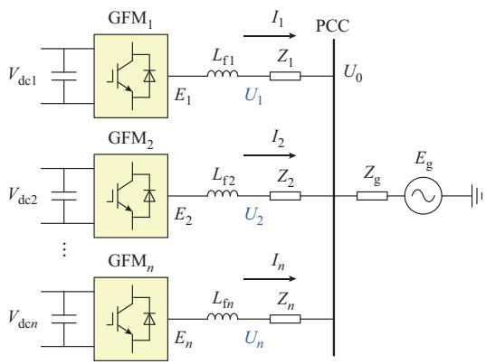  
图1 变换器并联系统典型拓扑结构  
Fig. 1 Typical topology of converter parallel system

# 1. 2　暂态交互模型

以两台变换器并联为例，经星形、三角形变换得到等值电路，如图 2所示。图中： $: \delta _ { 1 } , \delta _ { 2 }$ 和 $\delta _ { \mathrm { g } }$ 分别为变换器1、2和理想电源的功角； $Z _ { \mathrm { 1 g } } \setminus Z _ { \mathrm { 2 g } }$ 和 $Z _ { 1 2 }$ 分别为变换器 1、2 与理想电源间阻抗和变换器 1、2 间阻抗。

利用节点电压方程求取不同情况下变换器的电磁功率［19］。在两台变换器均未触发限流控制的情况（即情况 1）下，得到两台变换器的电磁功率分

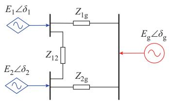  
图2　变换后的等值电路  
Fig. 2 Equivalent circuit after transformation

别为：

$$
P _ {1 \mathrm {e}} = E _ {1} E _ {2} Y _ {1 2} \sin \left(\delta_ {1} - \delta_ {2}\right) + Y _ {1 \mathrm {g}} E _ {\mathrm {g}} E _ {1} \sin \left(\delta_ {1} - \delta_ {\mathrm {g}}\right) \tag {1}
$$

$$
P _ {2 e} = - E _ {1} E _ {2} Y _ {1 2} \sin (\delta_ {1} - \delta_ {2}) +
$$

$$
Y _ {2 g} E _ {\mathrm {g}} E _ {2} \sin \left(\delta_ {2} - \delta_ {\mathrm {g}}\right) \tag {2}
$$

式中： $P _ { \mathrm { 1 e } }$ 和 $P _ { \mathrm { 2 e } }$ 分别为变换器 1、2的电磁功率； $Y _ { 1 2 }$ 为变换器 1、2间导纳； $Y _ { \mathrm { 1 g } }$ 和 $Y _ { \mathrm { 2 g } }$ 分别为变换器 1、2与理想电源间导纳。

在仅一台变换器触发限流控制的情况（即情况2）下，以变换器2限流为例，得到两台变换器的电磁功率分别为：

$$
P _ {1 \mathrm {e}} = - E _ {1} Y _ {1 2} Y _ {2 2} ^ {- 1} I _ {2} \cos (\delta_ {1} - (\delta_ {2} + \varphi)) +
$$

$$
E _ {1} E _ {\mathrm {g}} Y _ {1 2} Y _ {2 2} ^ {- 1} Y _ {2 \mathrm {g}} \sin \left(\delta_ {1} - \delta_ {\mathrm {g}}\right) +
$$

$$
E _ {1} E _ {\mathrm {g}} Y _ {\mathrm {l g}} \sin \left(\delta_ {1} - \delta_ {\mathrm {g}}\right) \tag {3}
$$

$$
P _ {2 c} = Y _ {2 2} ^ {- 1} Y _ {1 2} E _ {1} I _ {2} \cos (\delta_ {1} - (\delta_ {2} + \varphi)) +
$$

$$
Y _ {2 2} ^ {- 1} Y _ {2 g} I _ {2} E _ {\mathrm {g}} \cos \left(\left(\delta_ {2} + \varphi\right) - \delta_ {\mathrm {g}}\right) \tag {4}
$$

式中： $: I _ { 2 }$ 为限流变换器 2的限流幅值；φ为限流期间电流角度； $Y _ { 2 2 }$ 为变换器2的自导纳。

在两台变换器均触发限流控制的情况（即情况3）下，得到两台变换器的电磁功率分别为：

$$
P _ {1 e} = Y _ {1 2} \left(Y _ {2 2} Y _ {1 1} + Y _ {1 2} Y _ {1 2}\right) ^ {- 1} I _ {2} I _ {1} \sin \left(\delta_ {1} - \delta_ {2}\right) +
$$

$$
\left(Y _ {2 2} Y _ {1 1} + Y _ {1 2} Y _ {1 2}\right) ^ {- 1} \left(- Y _ {2 2} Y _ {1 g} - Y _ {1 2} Y _ {2 g}\right).
$$

$$
I _ {1} E _ {\mathrm {g}} \cos \left(\left(\delta_ {1} + \varphi\right) - \delta_ {\mathrm {g}}\right) \tag {5}
$$

$$
P _ {2 e} = - Y _ {1 2} \left(Y _ {2 2} Y _ {1 1} + Y _ {1 2} Y _ {1 2}\right) ^ {- 1} I _ {2} I _ {1} \sin \left(\delta_ {1} - \delta_ {2}\right) +
$$

$$
\left(Y _ {2 2} Y _ {1 1} + Y _ {1 2} Y _ {1 2}\right) ^ {- 1} \left(- Y _ {2 2} Y _ {1 g} - Y _ {1 2} Y _ {2 g}\right).
$$

$$
I _ {2} E _ {\mathrm {g}} \cos \left(\left(\delta_ {2} + \varphi\right) - \delta_ {\mathrm {g}}\right) \tag {6}
$$

式中：I 为限流变换器1的限流幅值； $Y _ { 1 1 }$ 为变换器1的自导纳。

变换器输出电磁功率由变换器间以及变换器与理 想 电 源 间 的 交 互 功 率 构 成 。 如 式（3）所 示 ，$E _ { 1 } E _ { \mathrm { g } } Y _ { \mathrm { 1 g } } \sin ( \delta _ { 1 } - \delta _ { \mathrm { g } } )$ 表示变换器 1 通过支路导纳$Y _ { \mathrm { 1 g } }$ 与理想电源交互功率。在支路参数一定的情况下，变换器间交互功率的方向与变换器的相位有关，而交互功率的大小与电压幅值、相位以及限流策略有关。

对于机电时间尺度，忽略电流内环控制和电磁暂态过程不影响同步稳定分析结论。因此，暂态同

步稳定分析可以仅考虑虚拟转子运动过程，如下所示：

$$
\left\{ \begin{array}{l} \frac {\mathrm {d} \delta_ {1}}{\mathrm {d} t} = \Delta \omega_ {1} \\ J _ {1} \frac {\mathrm {d} \Delta \omega_ {1}}{\mathrm {d} t} = P _ {1 \text {r e f}} - P _ {1 \mathrm {e}} - D _ {1} \Delta \omega_ {1} \\ \frac {\mathrm {d} \delta_ {2}}{\mathrm {d} t} = \Delta \omega_ {2} \\ J _ {2} \frac {\mathrm {d} \Delta \omega_ {2}}{\mathrm {d} t} = P _ {2 \text {r e f}} - P _ {2 \mathrm {e}} - D _ {2} \Delta \omega_ {2} \end{array} \right. \tag {7}
$$

式中： $\Delta \omega _ { 1 }$ 和 $\Delta \omega _ { 2 } , J _ { 1 }$ 和 $J _ { 2 \setminus D _ { 1 } }$ 和 $D _ { 2 } , P _ { \mathrm { 1 r e f } }$ 和 $P _ { \mathrm { 2 r e f } }$ 分别为变换器1和2的虚拟角速度变化、虚拟惯量、阻尼系数、有功功率参考值。多变换器并联系统暂态交互模型由式（1）—式（7）共同构成［19］ 。

# 1. 3　暂态交互能量对功角的驱动效应

本文重点探讨变换器间暂态交互对稳定性的影响以及由此设计的协同控制方法。定义 $\Delta P _ { 1 2 } =$ $P _ { 1 2 } - P _ { 1 2 , 0 }$ 为变换器间交互功率，即变换器1流向变换器 2功率 $P _ { 1 2 }$ 相对初始值 $P _ { 1 2 , 0 }$ 的变化。故障发生至功角最大值时刻的变换器间暂态交互能量 $\Delta E _ { 1 }$ 可表示为：

$$
\Delta E _ {1 2} = \underbrace {\int_ {\delta_ {0}} ^ {\delta_ {\mathrm {c}}} \Delta P _ {1 2} \mathrm {d} \delta} _ {\Delta E _ {1 2} ^ {\prime}} + \underbrace {\int_ {\delta_ {\mathrm {c}}} ^ {\delta_ {\max }} \Delta P _ {1 2} \mathrm {d} \delta} _ {\Delta E _ {1 2} ^ {\prime \prime}} \tag {8}
$$

式中： $: \delta _ { 0 } \aa , \delta _ { \mathrm { { c } } }$ 和 $\delta _ { \mathrm { m a x } }$ 分别为初始功角、故障清除时的功角和最大功角； $\mathrm { : } \Delta E _ { 1 2 } ^ { \prime }$ 和 $\Delta E _ { 1 } ^ { ' \prime }$ 分别为故障期间和故障清除至功角最大值时刻的变换器间暂态交互能量。当 $\Delta E _ { 1 2 } ^ { \prime } > 0$ 时，变换器 1向变换器 2提供交互能量，变换器1加速动能减少，对变换器1稳定性有利；当$\Delta E _ { 1 2 } ^ { " } > 0$ 时，变换器 1向变换器 2提供交互能量，同样有利于变换器 1暂态稳定；反之，则不利于暂态稳定。

暂态交互能量的方向和大小对稳定性分析至关重要。为简化分析，假定故障及时切除后变换器间相对功角不超过 $9 0 ^ { \circ }$ ，变换器机端电压能够瞬时跟踪指令值。在情况 1下，两台变换器独立运行和并联运行的功率-功角曲线如图3（a）、（b）所示。 $\Delta P _ { 1 2 }$ 的大小主要取决于变换器间功角差的变化， $\Delta P _ { 1 2 }$ 的方向与δ -δ 的正负有关。若 $\delta _ { 1 } - \delta _ { 2 } > 0$ ，即故障后变 换 器 1 功 角 加 速 更 多 ，则 $\sin { ( \delta _ { 1 } - \delta _ { 2 } ) } > 0$ ，$\Delta P _ { 1 2 } > 0 , \Delta E _ { 1 2 } > 0$ ，变换器1向变换器2提供交互能量，相比于独立运行场景，并联运行产生的暂态交互能量提高了稳定性较差的变换器1的稳定性；反之，则变换器 2向变换器 1提供交互能量，同样提高了稳定性更差的变换器 2的稳定性，降低了稳定性更

好的变换器1的稳定性。暂态能量交互作用使得两者稳定性趋近一致。

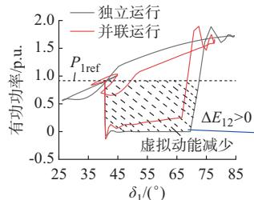  
(a) 	1(1)

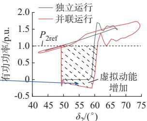  
(b) 	2(1)

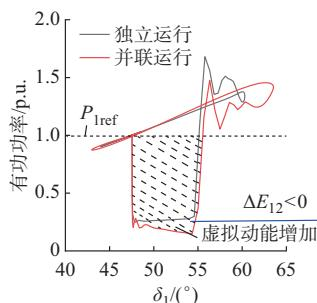  
(c) 	1(2UdD)

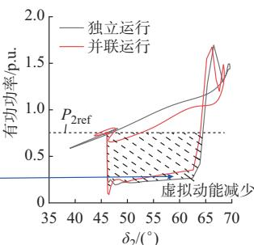  
(d) 	2(2UdD)   
图3　变换器功率-功角曲线  
Fig. 3 Power-angle curves for converters

对于情况 2，假设变换器 2限流。当限流策略为d轴优先，即 $\varphi = 0 ^ { \circ }$ 时，不限流变换器1和限流变换器2的功率-功角曲线如图3（c）、（d）所示。其中，限流幅值为1.5 p.u.。故障发生后，变换器2进入限流状态，功角加速更多，稳定性更差， $\cos { ( \delta _ { 1 } - \delta _ { 2 } ) } >$ $0 , \Delta P _ { 1 2 } < 0 , \Delta E _ { 1 2 } < 0$ ，稳定性较差的限流变换器 2向不限流变换器1提供交互能量，相较于独立运行，交互能量使得变换器 2功角极值点减小，两者稳定性趋近一致。当限流策略为 q 轴优先，即 $\varphi = 9 0 ^ { \circ }$ 时，故障发生后，变换器1向限流变换器2提供交互能量，本就稳定性较差的变换器2将更加严重，若故障清除后限流变换器依然处于限流状态或由不限流再次进入限流状态，则会加速失稳。

对于情况 ，交互能量对功角的影响与情况 相同，不再赘述。

由以上分析可以看出，故障后由于变换器间相对功角变化，暂态交互能量在变换器间流动，并通过动、势能转换反过来对功角轨迹产生驱动效应，进而影响暂态交互能量的大小和方向。其对功角的驱动效应既包含促进变换器同步运行的牵引作用，也包含诱导功角差逐渐增加的排斥作用。这两种作用并非单独存在，而是在多变换器功角运动过程中反复变化，不仅对变换器间同步运行不利，而且也极大地增加了变换器相对系统的失稳风险。可见，控制暂态交互能量对系统同步稳定运行至关重要。

# 2 多变换器频率同步协同控制

多变换器协同控制的基本思想是通过抑制变换器间相对功角差的变化，减少暂态交互能量在变换器间流动对功角的驱动效应，进而降低变换器间以及变换器相对系统的失稳风险。本章重点阐述改善暂态稳定性的多变换器协同控制方法。

# 2. 1　协同控制方法

故障后变换器间相对功角差不断变化的本质是各变换器的虚拟转子频率不同步。如果能够通过协同控制将变换器频率趋于一致，就能减小变换器间功角差的变化，减少暂态交互的不利影响。对于微网系统，已有针对多变换器频率同步控制方法的研究，并已在理论上证明了该方法维持变换器间暂态稳定的作用［23］ 。但在并联系统接入大电网条件下，维持变换器间同步运行只是基本条件，防止变换器相对系统失稳更为重要。本节对频率同步控制方法进行改进，以提升并联系统接入大电网条件下的稳定性。

# 2. 1. 1　协同控制系统架构

获取各变换器的虚拟转子频率来计算并联系统中心频率，通过PID控制减小各变换器频率相对并联系统中心频率的偏差，驱动各变换器频率向中心频率移动，再通过频率同步控制减小暂态能量交互，加快功角锁定动态过程。并联系统中心频率的计算在集中控制器进行，对变换器虚拟同步控制环节的改进在变换器本地进行，协同控制系统架构及改进的虚拟同步控制环节分别如图 4（a）、（b）所示。图中： $: \omega _ { i }  \omega _ { i }  \omega _ { 0 }$ 分别为第 i台变换器的虚拟角速度、角速度变化量和初始角速度； $\omega _ { \mathrm { c o k } }$ 为中心频率； $k _ { i \mathrm { p } }$ 、$k _ { i \mathrm { s } } \mathrm { ~ , ~ } k _ { i \mathrm { d } }$ 分别为第i台变换器PID控制的比例系数、积分系数和微分系数； $P _ { i \mathrm { r e f } } \setminus P _ { i \mathrm { e } } \setminus P _ { i \mathrm { \infty } }$ 分别为第 i台变换器的有功功率参考值、电磁功率和补偿功率 $\mathbf { \partial } _ { \mathbf { \ ; } } \theta _ { i }$ 为第 i台变换器的瞬时相位；J和 D分别为系统虚拟惯量和阻尼系数；s为拉普拉斯算子。各变换器频率与中心频率作差后，经过PID控制器生成输入功率偏差量，对原始变换器参考功率进行修正，从而间接控制虚拟转子的加减速过程。

比例环节的作用是保证变换器输出频率快速跟踪中心频率，加速频率同步；积分环节的作用是消除频率静差，且使得变换器功角与中心频率对应的功角保持同步，达到功角锁定的效果；微分环节的作用是对频率变化进行超前控制，并使得各变换器加速功率尽可能趋向一致。协同控制参数设计方法见附录A。

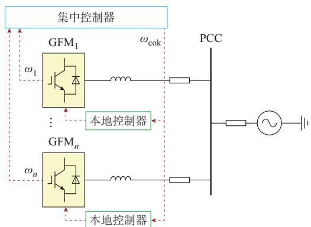

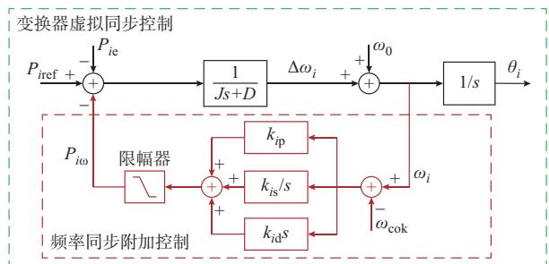  
(a) 	24   
(b) E+;	 (7   
图4　频率同步协同控制架构及改进  
Fig. 4 Architecture and improvement of cooperative frequency synchronization control

# 2. 1. 2　并联系统中心频率计算

通过上述频率同步控制，能够使各变换器频率尽快趋于一致，减少变换器间相对功角变化，进而降低暂态能量交互的不利影响，防止变换器间失步。然而，上述方法并未改善变换器相对系统的稳定性。事实上，频率同步控制虽能减少暂态能量交互，但不可能完全消除交互能量，该能量对功角的驱动效应仍然可能导致稳定性较差的变换器相对系统率先失去同步，进而通过频率同步控制诱发多机相继失稳。因此，在频率同步过程中，应对稳定性较差的变换器增大控制量，降低单变换器率先失稳风险。

在前文频率同步控制的基础上，利用各变换器虚拟动能对频率进行反距离加权，计算并联系统中心频率如下：

$$
\omega_ {\mathrm {c o k}} = \frac {\sum \alpha_ {i} \omega_ {i}}{\sum \alpha_ {i}} = \frac {\sum \alpha_ {i} \omega_ {i}}{\alpha_ {\mathrm {T}}} \tag {9}
$$

式中： $: \alpha _ { i } = 1 / \Delta E _ { \mathrm { k } i }$ ，其中， $\Delta E _ { \mathrm { k } i }$ 为第i台变换器故障后的动能变化量 ${ \bf ; } \alpha _ { \mathrm { { T } } } = \sum \alpha _ { i }$ 。

故障期间变换器获得的虚拟加速动能越大，其虚拟转子频率距离中心频率的偏差越大，相应的功率补偿控制量就越大。协同控制器将最大限度地消耗该变换器的虚拟动能，降低其相对系统失稳风险。

# 2. 2　暂态同步稳定性改善机理

增加协同控制环节后，故障下第 i台变换器在t时刻的虚拟动能增加量可表示为：

$$
\frac {J _ {i}}{2} \Delta \omega_ {i} ^ {2} = \int_ {\delta_ {i 0}} ^ {\delta_ {i t}} \left(P _ {i \text {r e f}} - P _ {i \mathrm {e}} - P _ {i \omega}\right) \mathrm {d} \delta - \int_ {\delta_ {i 0}} ^ {\delta_ {i t}} D _ {i} \Delta \omega_ {i} \mathrm {d} \delta \tag {10}
$$

式中： $: J _ { i }$ 和 $D _ { i }$ 分别为第 i台变换器的虚拟惯量和阻尼系数； $\delta _ { i t }$ 和 $\delta _ { i 0 }$ 分别为第i台变换器t时刻功角和初始功角。

协同控制环节引入的补偿功率 $P _ { i \infty }$ 可表示为：

$$
P _ {i \omega} = k _ {i p} \Delta \omega_ {i c o k} + k _ {i s} \int \Delta \omega_ {i c o k} d \Delta \omega_ {i c o k} + k _ {i d} \Delta \dot {\omega} _ {i c o k} \tag {11}
$$

式中： $\Delta \omega _ { i \mathrm { c o k } } = \omega _ { i } - \omega _ { \mathrm { c o k } }$

从式（11）可以看出，通过控制 $P _ { i \infty }$ 的正负和大小可以实现对虚拟动能变化量的控制。故障后，若变换器频率高于中心频率，即 $\Delta \omega _ { i \mathrm { { c o k } } } > 0$ ，说明变换器动能高于系统平均动能，变换器获得了更多的能量，控制 $P _ { i \infty }$ 为负，减少变换器的输入能量以抑制变换器功角继续增大；同理，若变换器频率低于中心频率，即 $\Delta \omega _ { i \mathrm { c o k } } < 0$ ，则控制 $P _ { i \infty }$ 为正，增加变换器输入能量以提升变换器频率。最终，使得各变换器保持频率同步，减少功角驱动效应导致的变换器加速失稳风险。

采用虚拟动能加权的目的是在控制频率同步的过程中，较大程度地耗散故障后稳定性较差变换器的虚拟动能。变换器的 $\Delta E _ { \mathrm { k } }$ 越大，其 $\Delta \omega _ { i \mathrm { c o k } }$ 越大，则协同控制量 $P _ { i \infty }$ 越大，对稳定性较差变换器的加速抑制效果越好，可防止变换器相对于系统失去同步。

# 3 频率同步控制下系统稳定性分析

已有研究利用李雅普诺夫定理证明了微网中多变换器频率同步控制能够确保变换器间暂态同步稳定［23］ ，但没有证明并联系统接入大系统条件下的稳定性，并且未考虑限流切换控制的影响。事实上，由于变换器内电势相角由自身虚拟转子产生，无法通过变换器协同控制确保扰动后变换器相对系统一定暂态同步稳定，否则变换器将退化为GFL控制。本章旨在利用李雅普诺夫定理证明以下两点：1）在并联系统接入大系统条件下，相比于不施加控制，通过本文所提频率同步协同控制能够改善变换器相对大系统的暂态稳定性；2）若变换器相对系统不失步，则各变换器间也一定能够保持同步稳定。

# 3. 1　李雅普诺夫能量函数

李雅普诺夫能量函数构造过程见附录B。

根据李雅普诺夫稳定性定理［26］ ，系统的能量函数满足如下条件可判断系统稳定：1）在平衡点处的

导数为 $0 ; 2 )$ 在平衡点附近是正定的；3）时间导数非正。下面将讨论李雅普诺夫稳定性的条件。

# 3. 2　系统稳定性分析

考虑到并联运行的变换器一部分处于限流状态、另一部分处于非限流状态的情况不会持续存在且稳定运行，本节仅对均不限流和均限流两种情况进行分析。变换器一部分处于限流状态、另一部分处于不限流状态下的分析过程见附录C。

1）变换器均不限流

$$
\begin{array}{l} \sum_ {i = 1} ^ {n} \int_ {\delta_ {i} ^ {0}} ^ {\delta_ {i} ^ {*}} P _ {i e} d \delta_ {i} = \sum_ {i = 1} ^ {n} \sum_ {j \in G, j \neq i} m _ {i j 1} \left(\cos \delta_ {i j} ^ {0} - \cos \delta_ {i j} ^ {*}\right) + \\ \sum_ {i = 1} ^ {n} m _ {i g 1} \left(\cos \delta_ {i g} ^ {0} - \cos \delta_ {i g} ^ {*}\right) \tag {12} \\ \end{array}
$$

式中：δ 、 $\delta _ { i } ^ { 0 }$ 和 $\boldsymbol { \delta } _ { i } ^ { * }$ 分别为第i台变换器功角、故障前稳态变换器功角和故障后变换器功角；G为并联的变换器集合 $\ ; \delta _ { i j } ^ { 0 }$ 为故障前稳态变换器 i和 j的功角差 $\ ; \delta _ { i j } ^ { * }$ 为故障后变换器i和j的功角差； $\delta _ { i \mathrm { g } } ^ { 0 }$ 为故障前稳态变换器i和理想电源的功角差； ${ \delta } _ { i \mathrm { g } } ^ { * }$ 为故障后变换器i和理想电源的功角差 $; m _ { i j 1 }$ 为均不限流策略下与线路阻抗、电压相关的变换器 i 和 $j$ 间阻抗电压系数； $m _ { i \mathrm { g l } }$ 为均不限流策略下与线路阻抗、电压相关的变换器 i和理想电源间阻抗电压系数。 $m _ { i j 1 }$ 和 $m _ { i \mathrm { g 1 } }$ 均为正值。

2）变换器均限流

限流策略为d轴优先时有：

$$
\begin{array}{l} \sum_ {i = 1} ^ {n} \int_ {\delta_ {i} ^ {0}} ^ {\delta_ {i} ^ {*}} P _ {i e} d \delta_ {i} = \sum_ {i = 1} ^ {n} \sum_ {j \in G, j \neq i} m _ {i j 2} \left(\cos \delta_ {i j} ^ {0} - \cos \delta_ {i j} ^ {*}\right) + \\ \sum_ {i = 1} ^ {n} m _ {i g 2} \left(\sin \delta_ {i g} ^ {*} - \sin \delta_ {i g} ^ {0}\right) \tag {13} \\ \end{array}
$$

限流策略为 $q$ 轴优先时有：

$$
\begin{array}{l} \sum_ {i = 1} ^ {n} \int_ {\delta_ {i} ^ {0}} ^ {\delta_ {i} ^ {*}} P _ {i e} d \delta_ {i} = \sum_ {i = 1} ^ {n} \sum_ {j \in G, j \neq i} m _ {i j 2} \left(\cos \delta_ {i j} ^ {0} - \cos \delta_ {i j} ^ {*}\right) + \\ \sum_ {i = 1} ^ {n} m _ {i g 2} \left(\cos \delta_ {i g} ^ {*} - \cos \delta_ {i g} ^ {0}\right) \tag {14} \\ \end{array}
$$

式中： $m _ { i j 2 }$ 为均限流策略下与线路阻抗、电压相关的变换器 i和 j间阻抗电压系数； $m _ { i \mathrm { g } 2 }$ 为均限流策略下与线路阻抗、电压相关的变换器 i和理想电源间阻抗电压系数。 $m _ { i j 2 }$ 和 $m _ { i \mathrm { g } 2 }$ 均为正值。

# 3. 2. 1　李雅普诺夫第一条件

李雅普诺夫第一条件的证明过程见附录D。

# 3. 2. 2　李雅普诺夫第二条件

计算能量函数的海森矩阵G如下：

$$
G = \left[ \begin{array}{l l} \frac {\partial^ {2} E _ {\mathrm {V}}}{\partial \omega_ {i} ^ {2}} & \frac {\partial^ {2} E _ {\mathrm {V}}}{\partial \omega_ {i} \partial \delta_ {i}} \\ \frac {\partial^ {2} E _ {\mathrm {V}}}{\partial \delta_ {i} \partial \omega_ {i}} & \frac {\partial^ {2} E _ {\mathrm {V}}}{\partial \delta_ {i} ^ {2}} \end{array} \right] \tag {15}
$$

式中： $E _ { \mathrm { V } }$ 为李雅普诺夫能量函数。

式（15）中非对角线元素为0，故G为对角矩阵，对于n台变换器构成的并联系统，可进一步写为：

$$
G = \left[ \begin{array}{l l} A _ {n \times n} & 0 _ {n \times n} \\ 0 _ {n \times n} & B _ {n \times n} \end{array} \right] \tag {16}
$$

其中，矩阵A中元素为：

$$
\left\{ \begin{array}{l} A _ {i i} = \frac {\partial^ {2} E _ {\mathrm {K}}}{\partial^ {2} \omega_ {i}} = J _ {i} + \sum_ {j \in G, j \neq i} k _ {i d} \frac {\alpha_ {j}}{\alpha_ {\mathrm {T}}} \\ A _ {i j} = \frac {\partial^ {2} E _ {\mathrm {K}}}{\partial \omega_ {i} \partial \omega_ {j}} = - k _ {i d} \frac {\alpha_ {j}}{\alpha_ {\mathrm {T}}} \end{array} \right. \tag {17}
$$

式中： $E _ { \mathrm { K } }$ 为动能函数。

对于任意的非零实数矩阵 $Z _ { n \times 1 } , Z ^ { \mathrm { T } } A Z$ 的行列式的值为正，所以矩阵G正定。

若变换器均不限流，矩阵B的元素为：

$$
\left\{ \begin{array}{l} B _ {i i} = \frac {\partial^ {2} E _ {\mathrm {P}}}{\partial^ {2} \delta_ {i}} = \sum_ {j \in G, j \neq i} \left(m _ {i j 1} \cos \delta_ {i j} ^ {*} + m _ {i g 1} \cos \delta_ {i g} ^ {*}\right) + \\ \sum_ {j \in G, j \neq i} k _ {i s} \frac {\alpha_ {j}}{\alpha_ {\mathrm {T}}} \\ B _ {i j} = \frac {\partial^ {2} E _ {\mathrm {P}}}{\partial \delta_ {i} \partial \delta_ {j}} = - m _ {i j 1} \cos \delta_ {i j} ^ {*} - m _ {i g 1} \cos \delta_ {i g} ^ {*} - k _ {i s} \frac {\alpha_ {j}}{\alpha_ {\mathrm {T}}} \end{array} \right. \tag {18}
$$

式中： $E _ { \mathrm { P } }$ 为势能函数。

不难看出，矩阵B每行元素的和为0，所以B为奇异阵。根据文献［26］，当非对角元素为负值时，矩阵 B 正定，即需要对于任意的 i 和 j 满足下述条件：

$$
- m _ {i j 1} \cos \delta_ {i j} ^ {*} - m _ {i g 1} \cos \delta_ {i g} ^ {*} - k _ {i s} \frac {\alpha_ {j}}{\alpha_ {T}} <   0 \tag {19}
$$

从式（19）可以看出，李雅普诺夫第二条件与协同控制的积分系数相关。如果没有协同控制，即$k _ { i \mathrm { s } } ( \alpha _ { j } / \alpha _ { \mathrm { T } } ) { = } 0$ ，则当 $\delta _ { i j } ^ { * } < 9 0 ^ { \circ }$ 且 $\delta _ { i \mathrm { g } } ^ { * } < 9 0 ^ { \circ }$ 时，式（19）恒成立。增加协同后，随着 $k _ { i \mathrm { s } } \left( \alpha _ { j } / \alpha _ { \mathrm { T } } \right)$ 增加，稳定性的充分条件被放宽，稳定性得到提升。这证明了协同控制环节的存在改善了系统稳定性。

当变换器均限流且 q轴优先时，矩阵 B满足的条件与式（19）有同样的形式；当d轴优先时，矩阵B需满足如下条件：

$$
- m _ {i j 1} \cos \delta_ {i j} ^ {*} - m _ {i g 1} \sin \delta_ {i g} ^ {*} - k _ {i s} \frac {\alpha_ {j}}{\alpha_ {T}} <   0 \tag {20}
$$

如 果 没 有 协 同 控 制 ，即 $k _ { i \mathrm { s } } ( \alpha _ { j } / \alpha _ { \mathrm { T } } ) { = } 0$ ，则 当$\delta _ { i j } ^ { * } < 9 0 ^ { \circ }$ 且 $\delta _ { i \mathrm { g } } ^ { * } < 1 8 0 ^ { \circ }$ 时，式（20）恒成立。不难发现，与 $q$ 轴优先相比， $, d$ 轴优先对 ${ \delta } _ { i \mathrm { g } } ^ { * }$ 的要求更加宽松，由$9 0 ^ { \circ }$ 放宽到 $1 8 0 ^ { \circ }$ ，稳定性更优。同样地，施加协同控制后，随着 $k _ { i \mathrm { s } } \left( \alpha _ { j } / \alpha _ { \mathrm { T } } \right)$ 增加，稳定性的充分条件被进一步放宽，稳定性得到提升。此外，通过上述分析不

难发现，变换器并联接入大系统条件下，若变换器相对系统不失稳，即 $\delta _ { i \mathrm { g } } ^ { * } < 1 8 0 ^ { \circ }$ ，则施加频率同步协同控制后，变换器间一定能够保持同步稳定。

需要注意的是，以上结论是基于变换器间相对角度以及变换器与理想电源间的相对角度变化对稳定性进行分析得到的，隐含了不同限流策略下阻抗电压系数 $m _ { i j 1 }$ 和 $m _ { i \mathrm { g l } }$ 相同的条件。事实上，变换器$q$ 轴优先的情况下，无功电流对机端电压的支撑效果必然优于 d轴优先策略，即 $m _ { i j 1 }$ 和 $m _ { i \mathrm { g l } }$ 更大，对稳定性的改善作用也可能会更好，但该方面研究已有较多文献涉及，本文不再重点讨论。

# 3. 2. 3　李雅普诺夫第三条件

基于附录B式（B13）和能量函数表达式，可得：

$$
E _ {\mathrm {V}} = - \sum_ {i = 1} ^ {n} \int_ {0} ^ {t ^ {*}} \sum_ {j \in G, j \neq i} k _ {i \mathrm {p}} \frac {\alpha_ {j}}{\alpha_ {\mathrm {T}}} \omega_ {i j} ^ {2} \mathrm {d} t - \sum_ {i = 1} ^ {n} \int_ {0} ^ {t ^ {*}} D _ {i} \Delta \omega_ {i} ^ {2} \mathrm {d} t \tag {21}
$$

则

$$
\frac {\partial E _ {\mathrm {V}}}{\partial t} = - \sum_ {i = 1} ^ {n} \sum_ {j \in G, j \neq i} k _ {i p} \frac {\alpha_ {j}}{\alpha_ {\mathrm {T}}} \omega_ {i j} ^ {2} - \sum_ {i = 1} ^ {n} D _ {i} \Delta \omega_ {i} ^ {2} \tag {22}
$$

式中： $t ^ { * }$ 为故障后时刻； $\omega _ { i j }$ 为变换器 i与 j的相对转速差。

可以看出，李雅普诺夫第三条件与协同控制的比例系数相关。若不施加协同控制，变换器阻尼项的存在使得 $\partial E _ { \mathrm { v } } / \partial t \leqslant 0$ ，说明系统在平衡点附近的能量不断被耗散。施加协同控制后，随着比例系数增加， $\partial E _ { \mathrm { v } } / \partial t$ 越小，说明系统能量耗散越快，协同控制提升了系统同步稳定的收敛速度。李雅普诺夫稳定性的第三个条件也满足。

从对系统李雅普诺夫能量函数的分析不难看出，协同控制的比例系统和积分系数是影响系统稳定性的关键。系统总能量的耗散速度由比例系数决定，比例系数越大，系统阻尼越高。积分系数也同样影响暂态同步稳定性，积分系数越大，系统稳定性也越强。协同控制的微分系数不决定系统的稳定性，仅通过超前预测控制减少控制的超调量。可见，在并联系统接入理想电源条件下，本文所提多变换器频率同步协同控制方法改善了系统稳定性，并且在变换器相对系统不失步的条件下，变换器间也一定能够保持同步稳定。

# 3. 3　结论的保守性分析

构造的李雅普诺夫能量函数由动能函数和势能函数两个状态函数组成，忽略了阻尼耗散过程函数，摒弃了路径依赖性，这也是能量函数的基本要求。而实际系统中，该阻尼项会在动能与势能转化的过程中持续耗散能量，所得稳定域将小于真实系统稳定边界，体现出一定的保守性。

李雅普诺夫能量函数旨在证明：1）在并联系统接入大系统条件下，相比于不施加控制，通过本文所提频率同步协同控制能够改善变换器相对大系统的暂态稳定性；2）若变换器相对系统不失步，则各变换器间也一定能够保持同步稳定。对于第 1点，已证明相比于不施加控制，所提频率同步协同控制改善了变换器相对大系统的暂态稳定性，即在增加保守性的前提下，不仅没有减小稳定域，反而扩大了稳定域，所以第 1点的分析结论成立；对于第 2点，考虑阻尼项后，系统能量将衰减更快，能量函数的导数会更小，式（19）和式（20）的正负号不会改变，且不等式左边3项仍然存在，第2点结论也成立。因此，考虑到李雅普诺夫能量函数的保守性，上述分析结论依然成立。

# 4 协同控制参数影响分析

由于李雅普诺夫能量函数不可避免地忽略了与路径相关的不可积项的影响，结果存在一定保守性。而通过微分几何流形稳定性理论，可以获得一个保守性较小的稳定区域，该边界刻画方法的准确性来源于对系统结构的准确表征，弥补了能量函数法理论分析的不足。文献［19］利用数值方法求取并联变换器稳定域。在此基础上，本文计及多变换器频率同步协同控制构建系统稳定域，并进一步分析和验证了协同控制参数变化对系统稳定性的影响。

# 4. 1　并联系统协同控制稳定域

通过对单变换器构成的二维平面进行投影实现并联系统状态量降维。协同控制稳定域构建的具体方 法 为 ：在 不 稳 定 平 衡 点（unstable equilibriumpoint，UEP）进行反时间积分［19］ ，逐点判断变换器当前时点运行状态，从而对暂态交互模型进行切换控制，得到协同控制稳定域。附录E为结合实际计算结果给出的协同控制稳定域计算方法及说明。

利用稳定域方法分析多机协同控制对变换器稳定性的影响。协同控制参数与上文一致，不施加协同控制时，控制器参数设为0。变换器1虚拟惯量为5 s，变换器2虚拟惯量为10 s，其余参数均相同。图5为协同控制前后两台变换器稳定域变化情况。从图中可以看出，由于变换器 2虚拟惯量大于变换器1，故障后变换器 1功角超前于变换器 2，稳定性更差，故变换器2稳定域大于变换器1。增加协同控制后，两台变换器稳定域均扩大，协同控制方法对两台变换器的稳定性均有提升。

# 4. 2　协同控制参数影响

以情况 1为例，利用稳定域方法分析协同控制参数对变换器稳定性的影响规律。设置两台变换器

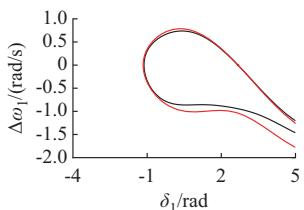  
(a) 	1   
	 	

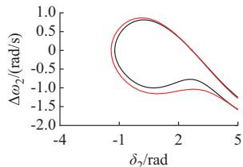  
(b) 	2   
图5　协同控制前后稳定域变化  
Fig. 5 Changes in stability domain before and after cooperative control

初始运行状态为 $P _ { \mathrm { 1 r e f } } { = } P _ { \mathrm { 2 r e f } } { = } 0 . 5$ p.u.。变换器 1 虚拟惯量为 5 s，变换器 2虚拟惯量为 10 s，其余参数相同。

图6给出协同控制参数变化后各变换器稳定域的变化情况。本案例中，增加协同控制器比例系数$k _ { \mathrm { p } } .$ 、积分系数k 均使得稳定域扩大，有利于两台变换器的暂态稳定性，而增加微分系数k 并不会扩大或减小稳定域，分析结论与 4.1 节一致。结合文献［21，27］可知，微分环节等效于在闭环系统中引入阻尼项，不改变稳定流形的几何结构，即不影响稳定域的大小。

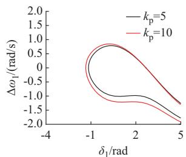  
(a) 	1(kp	)

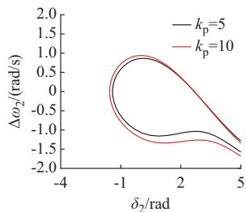  
(b) 	2(k 	)

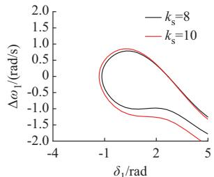  
(c) 	1(k 	)

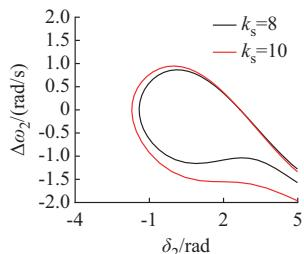  
(d) 	2(k 	)

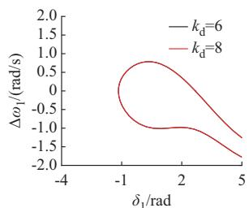  
(e) 	1(k 	)

  
(f ) 	2(k 	)   
图6　协同控制参数对稳定域的影响  
Fig. 6 Influence of cooperative control parameters on stability domain

同时可以看出，相较于李雅普洛夫稳定性分析方法，所提方法求取的并联变换器稳定域更加直观，能够直接给出多个参数变化后各变换器稳定域的变化情况，为协同控制参数设计提供指导。

一台变换器限流、另一台不限流以及两台均限流的情况下的计算结果见附录F。

# 5 仿真验证

3台变换器并联系统时域仿真模型如图1所示，模型基于 PSCAD/EMTDC 构建，仿真参数见附录 G 表 G1。故障设置为 3 s 时电网电压跌落至0.05 p.u.。频率同步协同控制器的参数见表 G2。

# 5. 1　协同控制方法分析验证

# 5. 1. 1　不触发限流控制

设 置 $P _ { \mathrm { 1 r e f } } = 0 . 5 \mathrm { p . u . } _ { \setminus } \ P _ { \mathrm { 2 r e f } } = 1 . 0 \mathrm { p . u . } _ { \setminus } \ P _ { \mathrm { 3 r e f } } =$ 1.0 p.u.，3台变换器均不限流。3 s时发生短路故障，持续0.21 s。图7（a）、（b）分别为不采取协同控制措施时变换器功角和交互能量曲线。从图中可以看出，故障下变换器 3稳定性最差，相对系统失步，而后由于变换器间交互作用，与电网实现再同步。

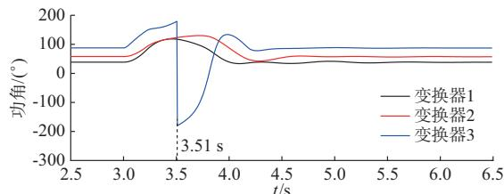  
(a)	>

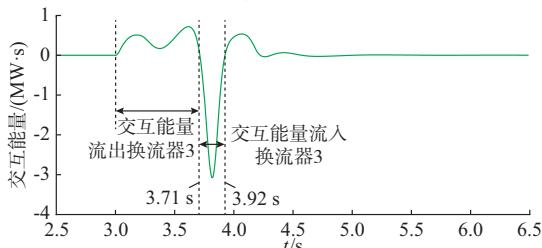  
(b)	6F   
图7 变换器功角和交互能量曲线   
Fig. 7 Power angle and interaction energy curves for converters

3.00~3.71 s时段内，变换器 3功角超前于变换器1和2，交互能量由变换器3流出，在3.51 s与系统失去同步。然后，随着功角持续增大，进入下一周期，此时变换器 3功角滞后于变换器 1和 2，交互能量流入变换器3，功角驱动效应下变换器1和2功角变化减缓，变换器3功角加大，最终三者与系统实现同步。

采用本文所提协同控制方法进行频率同步协同控制，各变换器虚拟转子频率、中心频率以及变换器

间交互能量如图 8所示。从图 8（a）可以看出，在频率同步控制器作用下，各变换器频率趋向于中心频率。故障期间，变换器 3功角加速较大，相应地，其虚拟转子频率远离中心频率，能够对其功角进行最大程度的抑制；故障消失后，变换器2和3的频率几乎同步，但变换器1与两者差异较大，故中心频率靠近变换器 2 和 3，从而对变换器 1功角变化进行抑制，最终在4.2 s各变换器实现频率同步。相较于不施加控制，施加频率同步协同控制后变换器间暂态交互能量大大减小，如图8（b）所示。采用协同控制后各变换器功角曲线如附录 G 图 G1（a）所示。图G1（b）为采用基于转子惯量中心频率［22］ 的方法（下文称为方法 1）得到的变换器功角曲线。从图中可以看出，采用方法1后，3台变换器虽然能够保持同步运行，但变换器3率先失稳，并且在功角驱动效应和协同控制共同作用下，其余变换器相对系统均失稳。采用本文方法后，3台变换器不仅保持同步运行，相对系统也保持稳定。可见，对故障期间稳定性较差的变换器的虚拟动能进行耗散，能够抑制稳定性较差的变换器加速失稳，提升系统暂态稳定性。

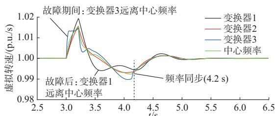

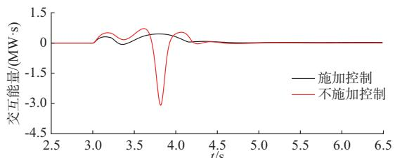  
(a)	;DE   
(b)	6F   
图8　不触发限流控制下的变换器虚拟转速与交互能量  
Fig. 8 Virtual speed and interaction energy for converters without triggering current limiting control

附录 G图 G2为故障期间变换器 3的补偿功率曲线。从图中可以看出，采用本文方法得到的补偿功率比方法 响应更快，时段内累积的能量也更大，对变换器3功角加速的抑制效果优于方法1。

# 5. 1. 2　触发限流控制(d轴优先)

设 置 $P _ { \mathrm { 1 r e f } } = 0 . 5 \mathrm { p . u . } _ { \setminus } \ P _ { \mathrm { 2 r e f } } = 1 . 0 \mathrm { p . u . } _ { \setminus } \ P _ { \mathrm { 3 r e f } } =$ 1.0 p.u.，变换器 3 限流幅值为 1.5 p.u.，策略为 d 轴优先，其余参数均相同。3 s 时发生短路故障，持续 $0 . 1 \ s _ { \mathrm { { o } } }$ 图 9（a）、（b）分别为变换器功角曲线和变

换器间交互能量曲线。从图中可以看出，不采取协同致稳策略的情况下，变换器3由于电流限幅，稳定性最差，相对系统失稳。变换器 3限幅环节频繁动作，变换器间交互能量周期性大幅变化。

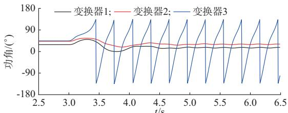  
(a)	>

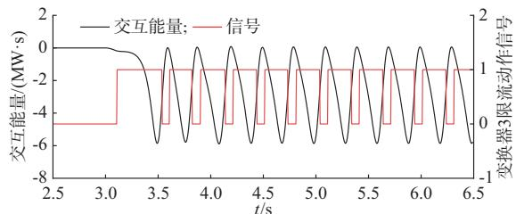  
(b)	6F	K"   
图9 不同方法下的变换器功角曲线  
Fig. 9 Converter power angle curves with various methods

图10（a）、（b）分别为采用频率同步协同控制后变换器虚拟转速和交互能量曲线。从图中可以看出，在故障后的动态过程中，中心频率始终远离变换器 3转子频率，能够更大程度地抵消交互能量的不利影响，更快地将变换器 3拉回同步。变换器间交互能量减小，故障后约1.2 s时3台变换器保持同步运行。附录G图G3（a）、（b）分别为采用本文方法和方法 1得到的变换器功角曲线，本文方法得到的功角极值为83.06°，小于方法1，暂态稳定性更好。

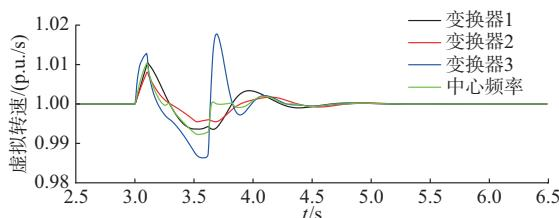  
(a)	;DE

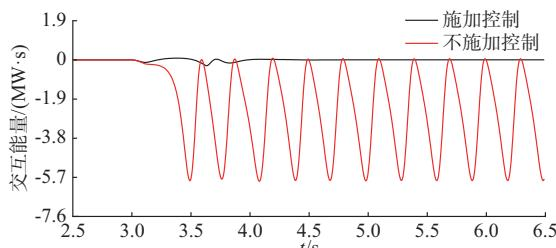  
(b)	6F   
图10　触发限流控制下的变换器虚拟转速与交互能量  
Fig. 10 Virtual speed and interaction energy for converters with triggering current limiting control

采用逆轨迹法绘制变换器 3稳定域，如附录 G图G4灰色区域所示，其边界轨迹线含义与附录E图E1相同。不施加控制情况下，故障后变换器运行点位于变换器稳定域外，故障消失后先减速，但频率始终为正，而后沿紫色曲线轨迹加速失稳。采用本文所提频率同步协同控制后，故障期间变换器运行点被控制在稳定域内。故障消失后，沿绿色曲线运动最 终 回 到 稳 定 平 衡 点（stable equilibrium point，SEP）。变换器3稳定域计算结果与仿真曲线吻合。

# 5. 1. 3　触发限流控制（q轴优先）

在5.1.2节条件下，将变换器3限流策略修改为q 轴优先，其余参数不变。从图 11 可以看出，q 轴优先策略下，本文所提方法同样能够大幅减小交互能量，故障后约 1.2 s时各变换器实现频率同步，系统保持暂态稳定。

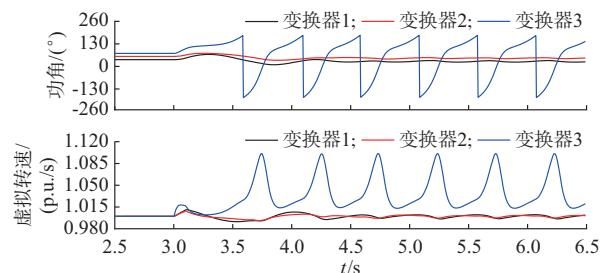  
(a) 

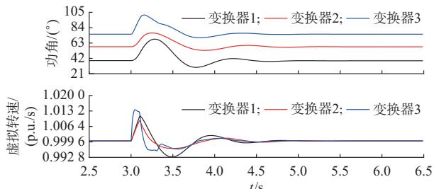

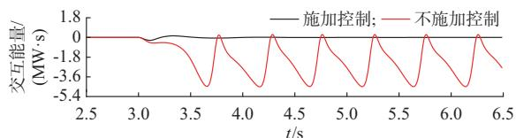  
(b)    
(c) 6F   
图11 q轴优先策略下的仿真结果  
Fig. 11 Simulation results with q-axis priority strategy

# 5. 2　协同控制参数影响验证

改变协同控制PID参数，验证控制器参数对变换器暂态稳定性的影响，结果如图12所示。可以看出，控制器比例系数、积分系数增加后，系统稳定性提升，而微分系数增加对各变换器功角最大值几乎没有影响，实验结果与前文分析结论一致。

需要注意的是，该实验仅为说明协同控制环节参数小幅变化对稳定性的影响规律，故控制各参数

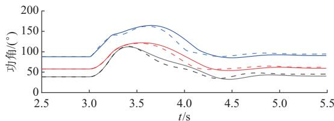  
2(k 	1(k p=5) 	1(k p=10) p=5)   
3(k 	2(kp=10) 	3(kp=5) p=10)-

(a) !2   
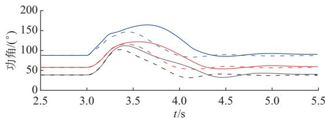  
2(k 	1(k s=8) 	1(k s=10) s=8)   
3(k 	2(k =10) 	3(k =8) =10)-

(b) /2

(c) 2   
图12 协同控制参数变化后变换器功角曲线  
Fig. 12 Converter power angle curves after variations in cooperative control parameters   
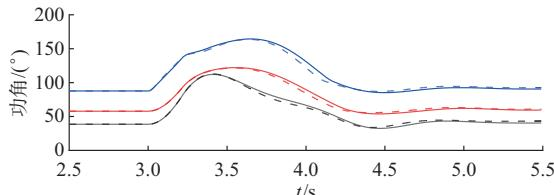  
2(k 	1(k =6) 	1(k =8) =6)   
3(k 	2(kd=8) 	3(kd=6) d=8)-

在初值附近变化。事实上，变换器功角响应受 PID各环节参数综合影响，控制器参数的具体取值应根据实际响应进行详细设计，非本文研究重点内容，不再赘述。

# 6 实验验证

附 录 H 图 H1 为 基 于 实 时 数 字 仿 真 系 统（RTDS）构建的硬件在环实验平台，该实验平台由实时仿真器、控制器实物、IO板卡构成。电网一次系统、变换器主电路、协同控制集中控制器以及大扰动故障均通过实时仿真器模拟。变换器控制器输出频率至集中控制器，并接收集中控制器下发的中心频率信号。变换器1、2限幅策略为d轴或q轴优先，限幅值为 1.5 p.u.。故障设置为 10 s时电网电压跌落至 0.05 p.u.，持续时间为 0.2 s。其余参数与前文相同。

# 6. 1　限流控制（d轴优先）

设置 $P _ { \mathrm { 1 r e f } } { = } 0 . 5 ~ { \mathrm { p . u . } } , P _ { \mathrm { 2 r e f } } { = } 0 . 9 ~ { \mathrm { p . u . } }$ ，两台变换器限流策略均为 d轴优先。图 13为不同情况下两台变换器的功角曲线。从图中可以看出，不采取频率同步协同控制时变换器 2率先失稳，且暂态交互导

致两台变换器相继失稳。采取协同控制后，故障下两台变换器最终均保持暂态稳定。此外，协同控制积分系数为4时，变换器2首摆仍然失稳，而增加积分系数后，两台变换器均首摆稳定。

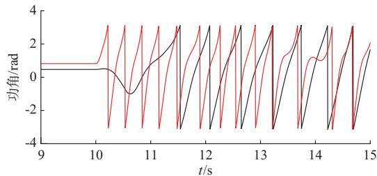

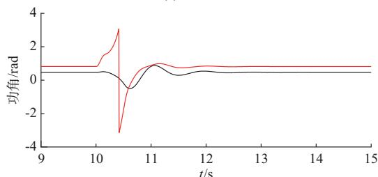  
(a) 

(b) 	(k =4)

图13 施加控制前后的实验波形（d轴优先）  
Fig. 13 Experimental waveforms before and after exercising control (d-axis priority)   
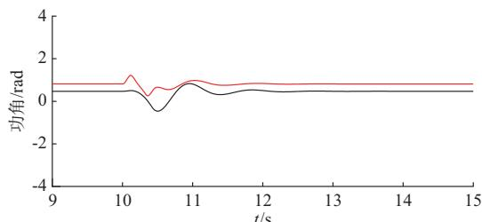  
1 	

(c) 	(ks=10)

# 6. 2　限流控制（q轴优先）

设置 $P _ { \mathrm { 1 r e f } } { = } 0 . 9 \ \mathrm { p . u . } \ . P _ { \mathrm { 2 r e f } } { = } 1 . 0 \ \mathrm { p . u . }$ .，两台变换器限流策略均为 q轴优先。附录 H图 H2为不同情况下两台变换器的功角曲线。从图中可以看出，不采取频率同步协同控制策略时，两台变换器相继失稳。采取协同控制后，故障下两台变换器最终均保持暂态稳定。当协同控制积分系数为 4时，从故障到两台变换器完全同步约经过3 s时长，而增加积分系数后，两台变换器同步时间缩短为 1.5 s，暂态稳定性得到进一步改善。实验结果与本文分析结论一致。

# 7 结 语

本文分析了变换器间暂态交互能量的功角驱动效应对变换器稳定性的影响机理，提出了多构网型变换器频率同步协同致稳控制方法。进一步，通过李雅普诺夫能量函数和计及限流切换控制的变换器

并联系统协同控制稳定域方法，证明了所提控制方法在并联系统接入大电网条件下对系统暂态稳定性的改善作用。本文所得结论如下：

1）发现暂态交互能量作用下变换器间存在功角驱动效应，该效应既包含促进变换器同步运行的牵引作用，也包含诱导功角差逐渐增加的排斥作用。这两种作用并非单独存在，而是在多变换器功角运动过程中反复变化，增加了系统失稳风险。  
2）提出了多构网型变换器频率同步协同致稳控制方法。一方面，通过频率同步控制降低暂态交互能量，减小功角驱动效应，维持变换器间同步稳定运行；另一方面，通过虚拟动能加权计算中心频率，耗散拥有较大虚拟动能变换器的加速能量，改善变换器相对系统的暂态稳定性。  
3）通过李雅普诺夫能量函数法验证了所提控制方法在并联系统接入大电网条件下能够改善系统暂态稳定性，并且若变换器相对系统不失稳，则变换器间也一定保持同步。协同控制比例系数决定了系统总能量的耗散速度，增大比例系数可以提高系统阻尼。积分系数影响系统暂态同步稳定性，积分系数越大，系统稳定性越强。  
4）利用并联系统协同控制稳定域降维构建方法，进一步证明了控制方法对并联系统暂态稳定性的改善作用。该方法可以为协同控制参数设计提供指导。

本文以变换器并联接入理想电源系统为研究对象，在多机系统中，尤其是在多构网型变换器与常规同步机混联系统中，变换器与同步机的超前滞后关系与暂态交互作用更为复杂，本文所得结论可能不再适用，其致稳控制方法需要进一步研究。

附录见本刊网络版，点击 http：//www.aeps-info.com/aeps/article/abstract/20250420002，或扫描英文摘要后二维码，可阅读全文。

# 参 考 文 献

［1］国家能源局发布 2024 年 1—10 月份全国电力工业统计数据 ［EB/OL］.［2024-11-22］. https：//www. gov. cn/lianbo/bumen/ 202411/content_6988749.htm. The National Energy Administration released the national power industry statistics for the period from January to October 2024［EB/OL］. ［2024-11-22］. https：//www. gov. cn/lianbo/ bumen/202411/content_6988749.htm.   
［ ］新型电力系统发展蓝皮书［ ］北京：中国电力出版社， Blue book of new power system development［M］. Beijing： China Electric Power Press，2023.

［3］郭剑波，王铁柱，罗魁，等 .新型电力系统面临的挑战及应对思考［J］.新型电力系统，2023，1（1）：32-43.  
GUO Jianbo， WANG Tiezhu， LUO Kui， et al. Development ofnew power systems： challenges and solutions［J］. New TypePower Systems，2023，1（1）：32-43.  
［4］胡秦然，巫绍辉，韩汝帅，等 .多虚拟同步发电机主导系统稳定性分析方法及提高措施综述［J］. 电力系统自动化，2025，49（12）：11-30.  
HU Qinran， WU Shaohui， HAN Rushuai， et al. Review ofstability analysis methods and improvement measures for powersystem dominated by multiple virtual synchronous generators［J］.Automation of Electric Power Systems，2025，49（12）：11-30.  
［5］许诘翊，刘威，刘树，等 .电力系统变流器构网控制技术的现状与发展趋势［］电网技术， ，（ ）： -  
XU Jieyi， LIU Wei， LIU Shu， et al. Current state and development trends of power system converter grid-forming control technology［J］. Power System Technology，2022，46 （9）：3586-3595.   
［6］WU H，WANG X F. Design-oriented transient stability analysis of grid-connected converters with power synchronization control [J]．IEEE Transactions on Industrial Electronics，2O19，66 （8）：6473-6482.   
［7］LI Y J， LU Y Y， YANG J L， et al. Transient stability ofpower synchronization loop based grid forming converter［J］.IEEE Transactions on Energy Conversion，2023，38（4）：2843-2859.  
［8］李明飞，吴在军，全相军，等 .计及阻尼特性的构网型并网逆变器暂态同步稳定性分析［J］.电力系统自动化，2023，47（15）：198-207.  
LI Mingfei， WU Zaijun， QUAN Xiangjun， et al. Transientsynchronization stability analysis of grid-forming grid-connectedinverter considering damping characteristics［J］. Automation ofElectric Power Systems，2023，47（15）：198-207.  
［9］ROKROK E， QORIA T， BRUYERE A， et al. Transient stability assessment and enhancement of grid-forming converters embedding current reference saturation as current limiting strategy ［J］. IEEE Transactions on Power Systems， 2022， 37（2）： 1519-1531.   
［ ］王伟，周少泽，黄萌，等 构网型技术：演进历程、功能定位与应用展望［J］.电力系统自动化，2025，49（1）：1-13.  
WANG Wei， ZHOU Shaoze， HUANG Meng， et al. Grid-forming technologies： evolution history， function， andapplication prospects ［J］. Automation of Electric PowerSystems，2025，49（1）：1-13.  
［ ］黄萌，舒思睿，李锡林，等 面向同步稳定性的电力电子并网变流器分析与控制研究综述［J］.电工技术学报，2024，39（19）：5978-5994.  
HUANG Meng， SHU Sirui， LI Xilin， et al. A review ofsynchronization-stability-oriented analysis and control of powerelectronic grid-connected converters［J］. Transactions of ChinaElectrotechnical Society，2024，39（19）：5978-5994.

［12］尚佳宇，虞家骏，刘增，等.构网型与跟网型逆变器并联系统精确频域建模及简化稳定判据［J］.电力系统自动化，2025，49（2）：53-63.  
SHANG Jiayu， YU Jiajun， LIU Zeng， et al. Accurate frequency-domain modeling and simplified stability criterion for parallel grid-forming and grid-following inverter system ［J］. Automation of Electric Power Systems，2025，49（2）：53-63.   
［13］ZOU Z X， BESHELI B D， ROSSO R， et al. Interactionsbetween two phase-locked loop synchronized grid converters［J］. IEEE Transactions on Industry Applications，2021，57（4）：3935-3947.  
［14］颜湘武，蔡光，李锐博，等.计及功角偏差和阻尼效应的构网型双馈风机暂态稳定性分析［J］.中国电机工程学报，2025，45（7）：2616-2633.  
YAN Xiangwu， CAI Guang， LI Ruibo， et al. Transientstability analysis of grid-forming doubly fed induction generatorwith power angle deviation and damping effect［J］. Proceedingsof the CSEE，2025，45（7）：2616-2633  
［15］QORIA T，GRUSON F，COLAS F， et al. Current limitingalgorithms and transient stability analysis of grid-forming VSCs［J］. Electric Power Systems Research，2020，189：106726.  
［16］涂春鸣，谢伟杰，肖凡，等.多虚拟同步发电机并联系统控制参数对稳定性的影响分析［J］.电力系统自动化，2020，44（15）：77-86.  
TU Chunming， XIE Weijie， XIAO Fan， et al. Influenceanalysis of control parameters of parallel system with multiplevirtual synchronous generators on stability［J］. Automation ofElectric Power Systems，2020，44（15）：77-86.  
［ ］秦垚，王晗，邓桢彦，等 自同步电压源永磁直驱风电机组的直流电压同步机制及其统一控制结构［］高电压技术， ，（ ）： -  
QIN Yao， WANG Han， DENG Zhenyan， et al.Synchronization mechanism and unified control structure forPMSG-based WTGs by using the DC-link voltage to realize self-synchronous voltage source control ［J］. High VoltageEngineering，2023，49（1）：31-41.  
［ ］张波，颜湘武，黄毅斌，等 虚拟同步机多机并联稳定控制及其惯量匹配方法［］电工技术学报， ，（ ）： -  
ZHANG Bo， YAN Xiangwu， HUANG Yibin， et al. Stabilitycontrol and inertia matching method of multi-parallel virtualsynchronous generators ［J］. Transactions of ChinaElectrotechnical Society，2017，32（10）：42-52.  
［19］吴峰，鲍颜红，郑建勇，等.计及限流切换的构网型变换器并联系统暂态同步稳定分析［J］.电力系统自动化，2025，49（1）：14-26.  
WU Feng， BAO Yanhong， ZHENG Jianyong， et al. Transientsynchronous stability analysis of parallel system of grid-formingconverters considering current limiting switching ［J］.Automation of Electric Power Systems，2025，49（1）：14-26.  
［ ］罗聪，陈燕东，谢志为，等 计及电压动态的构网型变流器多机

并联系统暂态建模与稳定域估计［J］.电工技术学报，2025，40（9）：2752-2765.  
LUO Cong， CHEN Yandong， XIE Zhiwei， et al. Transientmodel and stability region estimation for multiple paralleled grid-forming inverter system ［J］. Transactions of ChinaElectrotechnical Society，2025，40（9）：2752-2765.  
［21］马美玲，王杰，李鹏瀚，等 . 电力系统功角稳定域及边界上的全局流形分析［J］.中国电机工程学报，2020，40（18）：5865-5875.  
MA Meiling， WANG Jie， LI Penghan， et al. Study of theglobal manifolds on the boundary of the rotor angle stabilityregion in power systems［J］. Proceedings of the CSEE，2020，40（18）：5865-5875.  
［22］奚鑫泽，黄英博，邢超 .一种多虚拟同步机并联系统虚拟动态互阻尼控制方法［J］. 电网技术，2025，49（5）：1941-1950.  
XI Xinze， HUANG Yingbo， XING Chao. A virtual dynamicmutual damping control method for multi-VSGs parallel system［J］. Power System Technology，2025，49（5）：1941-1950.  
［23］CHOOPANI M， HOSSEINIAN S H， VAHIDI B. Newtransient stability and LVRT improvement of multi-VSG gridsusing the frequency of the center of inertia ［J］. IEEETransactions on Power Systems，2020，35（1）：527-538.  
［24］CHOOPANI M，HOSSEINAIN S H，VAHIDI B. A novel comprehensive method to enhance stability of multi-VSG grids ［J］. International Journal of Electrical Power & Energy Systems，2019，104：502-514.   
［25］洪灏灏，顾伟，黄强，等.微电网中多虚拟同步机并联运行有功振荡阻尼控制［J］. 中国电机工程学报，2019，39（21）：6247-6255.  
HONG Haohao， GU Wei， HUANG Qiang， et al. Poweroscillation damping control for microgrid with multiple VSGunits［J］. Proceedings of the CSEE，2019，39（21）：6247-6255.  
［26］MACHOWSKI J， BIALEK J W， BUMBY J R. Powersystem dynamics stability and control［M］. Hoboken， USA：Wiley，2008.  
［27］绪方胜彦 .现代控制工程［M］.3版 .北京：电子工业出版社，2017.  
KATSUHIKO Ogata. Modern control engineering［M］. 3rd ed. Beijing： Publishing House of Electronics Industry，2017.

（编辑 王梦岩）

# Cooperative Frequency Synchronization Control of Multiple Grid-forming Converters for Improvement of Transient Stability

WU Feng1，2，3 ， BAO Yanhong2，3 ， ZHENG Jianyong1 ， XU Taishan2，3 ， REN Xiancheng2，3 ， ZHANG Jinlong2，3 ， ZHAO Xijie2，3

(1. School of Electrical Engineering, Southeast University, Nanjing 210096, China;

2. State Grid Electric Power Research Institute (NARI Group Corporation), Nanjing 211106, China;

3. State Key Laboratory of Technology and Equipment for Defense Against Power System Operational Risks, Nanjing 211106, China)

Abstract: Due to differences in parameters such as inertia, damping, and impedance of grid-forming converters operating in parallel, the transient interactions between converters are intensified, increasing the risk of transient synchronization instability of converters. Multi-machine transient stability cooperative control is key in improving the transient stability of grid-connected systems. To this end, based on the transient interaction model of a parallel grid-forming converter system, this paper reveals the multi-machine instability mechanism that may be induced by the power angle driving effect of transient interaction energy and proposes a cooperative frequency synchronization stabilization control method for multiple grid-forming converters. On one hand, the transient interaction energy is reduced through frequency synchronization control to maintain synchronous and stable operation among converters. On the other hand, by calculating the center frequency through weighted virtual kinetic energy, the acceleration energy of converters with larger virtual kinetic energy is dissipated, thereby improving the transient stability of the converters relative to the system. The improvement of system stability under the condition of the parallel system connecting to a large power grid is demonstrated using a Lyapunov energy function for the proposed control method. Furthermore, by constructing the stability region of the converter parallel system considering cooperative control, it is verified that the cooperative control method can effectively expand the system stability region, providing guidance for parameter optimization. Finally, the correctness of the proposed method is validated through simulations and experiments.

This work is supported by National Key R&D Program of China (No. 2022YFB2402701).

Key words: transient stability; grid-forming converter; cooperative control; frequency synchronization; stability region; energy function; parameter optimization

