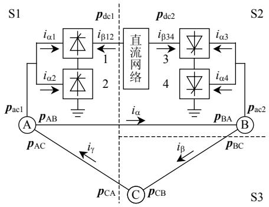
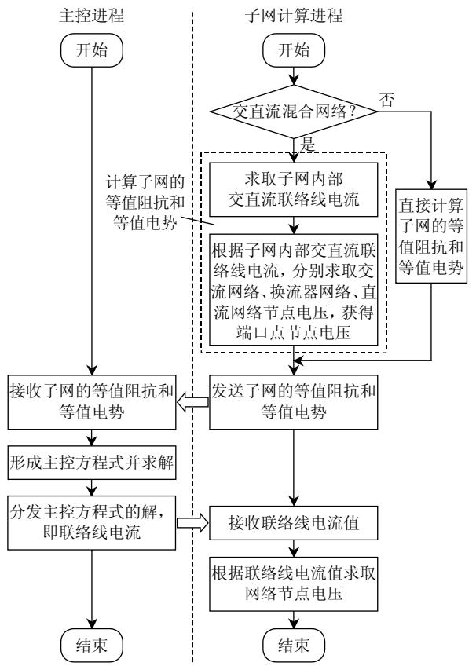
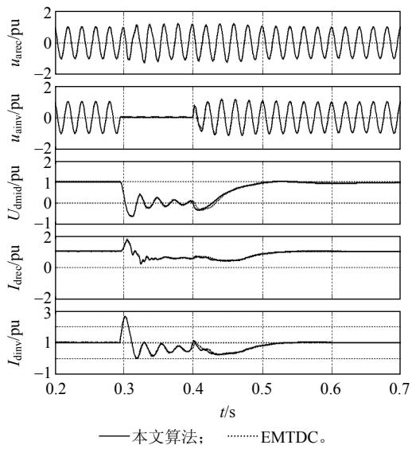

# 交直流电力系统分割并行电磁暂态数字仿真方法

田芳，周孝信

(电网安全与节能国家重点实验室(中国电力科学研究院)，北京市 海淀区 100192)

# Partition and Parallel Method for Digital Electromagnetic Transient Simulation of AC/DC Power System

TIAN Fang, ZHOU Xiaoxin

(State Key Laboratory of Power Grid Security and Energy Conservation (China Electric Power Research Institute), Haidian District, Beijing 100192, China)

ABSTRACT: Aiming at frequent change of topology of HVDC system, a partition and parallel method for digital electromagnetic transient simulation was presented in the paper, which avoided the influence of topology change of HVDC system on the other parts of the power system. Testing results on CIGRE first benchmark model for HVDC system show that with this method correct results and fast computation speed are obtained. The method has the advantages of high efficiency and flexible network partition. The presentation and realization of the method lays the foundation of further research on solving real-time performance of elctromagnectic transient simulation of HVDC system and carrying out closed-loop simulation test of HVDC control and protection devices based on digital simulation system.

KEY WORDS: AC/DC power system; partition; parallel; electromagnetic transient; digital simulation

摘要：针对直流输电系统拓扑结构变化频繁的特点，提出一种交直流分割并行的电磁暂态数字仿真方法，避免了直流输电系统拓扑结构变化对电力系统其他部分的影响。在CIGRE 标准算例上所做的测试表明，该方法计算结果正确，计算速度快。该方法具有计算效率高、网络分割灵活等特点。该方法的提出和实现，为进一步解决直流输电系统的电磁暂态仿真的实时性及采用数字仿真系统进行直流输电控制保护装置的闭环仿真试验奠定了基础。

关键词：交直流电力系统；分割；并行；电磁暂态；数字仿真

# 0 引言

电力系统电磁暂态过程仿真的主要目的在于分析和计算故障或操作后可能出现的暂态过电压和过电流，以便根据所得到的暂态过电压和过电流对相关电力设备进行合理设计，确定已有设备能否

安全运行，并研究相应的限制和保护措施[1]。

采用数值计算的方法进行电磁暂态过程的仿真称为电磁暂态数字仿真。根据计算时间与系统实际过程的关系，电磁暂态数字仿真可分为非实时仿真和实时仿真 2 类，实时仿真指的是仿真过程与系统运行过程同步。电磁暂态实时数字仿真可用于继电保护、安全自动装置、控制保护设备等的检测试验研究。目前国际上广泛使用的实时数字仿真器(real time digital simulator，RTDS)[2]即为一种电磁暂态实时数字仿真器。

电磁暂态数字仿真一般采用三相瞬时值模型，计算步长取 20~200μs。由于其模型复杂、计算量大、计算步长小，因此相对于机电暂态仿真，要实现电磁暂态实时数字仿真，难度更大一些。

要实现电磁暂态实时数字仿真，一般需采用并行计算技术，国内外均已开展了大量研究工作[3-8]。电磁暂态并行计算技术已在 RTDS 中得到成熟应用。RTDS 采用专有硬件(1 套 RTDS 装置包括若干个机柜(rack)，每个机柜由基于数字信号处理器(digital signal processor，DSP)芯片的处理器卡、工作站接口卡、层间通信卡、网络接口卡等组成)，通过分布参数线路解耦法，实现了中小规模电网的电磁暂态实时仿真[9]。J. R. Marti 等人提出了网络方程的 多 端 口 戴 维 南 等 值 (multi-area Theveninequivalent，MATE)方法，实现了电磁暂态仿真的并行计算[3-4]。清华大学在此基础上提出了基于 MATE方法的改进电磁暂态并行算法，通过优化计算流程和合理分配计算量，提高了计算效率[10]。近年来，

中国电力科学研究院也开展了相关研究工作，提出节点分裂法与分布参数线路解耦法相结合的电磁暂态过程并行计算方法，兼顾并行计算的灵活性和计算效率，并在电力系统全数字实时仿真装置(advanced digital power system simulator，ADPSS)上成功实现[11-15]。

当电网中存在直流输电系统时，采用该方法也很难实现实时仿真。这主要是因为：在直流输电系统的电磁暂态仿真中，其关键元件——换流器用三相暂态模型模拟。由于换流器是由若干个换流阀组成的，在一个周期内，换流阀会多次导通或关断，每一次导通或关断都意味着网络的拓扑结构发生变化。现有的电磁暂态数字仿真方法，一般是将交直流电力系统中的交流网络、换流器、直流网络等各部分分别形成暂态等值计算电路，然后根据其连接关系形成统一的网络节点电压方程来进行求解。换流阀导通或关断导致网络拓扑结构发生变化时，该节点电压方程中的计算电导矩阵需要重新进行三角(LU)分解，由于网络拓扑变化频繁，会引起计算量的大幅度上升，难以实现实时仿真。文献[16]预先计算并存储各种拓扑结构情况下的换流器电导矩阵的逆矩阵，显著加快了直流输电系统的仿真速度，但当换流阀较多时，存储量过大，难以实现。文献[17-18]采用分布参数线路或解耦变压器进行解耦及预先计算存储子网的系统状态方程系数矩阵的方法，解决了存储量过大的问题，但采用解耦变压器进行解耦时，会引入仿真误差。文献[19]基于可编程门阵列(field programmable gate arrays，FPGAs)的新型结构，采用线性和非线性子电路并行求解的方法，各子电路之间在每一步长结束后交换信息，影响仿真精度，可能导致仿真不稳定。

为解决直流输电系统的电磁暂态仿真的实时性问题，中国电力科学研究院提出并采用交直流分割并行的电磁暂态数字仿真方法[20]，并在电力系统全数字实时仿真装置上成功实现，最终实现了双极直流输电系统的电磁暂态实时仿真，并在此基础上进行了直流输电控制保护装置试验[21-22]。

所提出的交直流分割并行算法，其主要思路是将交流网络与直流各部分分开计算，通过一定的连接关系式来统一求解，避免大网络的频繁 LU 分解过程，同时采用网络并行计算技术，以提高计算速度，达到实现直流输电系统电磁暂态实时仿真的

目的。

本文将简要介绍该方法的主要原理和实现过程，并用一标准算例说明其计算效果。

# 1 基本原理

为简单起见，以图 1 所示的单极直流输电系统为例，该系统每极 2 个6 脉冲换流器。设整流侧换流器编号为 1、2，接于交流网络 A，逆变侧换流器编号为 3、4，接于交流网络 B。交直流网络的连接如图 1 所示。交流网络分为子网 A、B、C。网络分割方案如下：子网 S1 含交流网络 A及换流器 1、2；子网 S2 含交流网络 B，换流器 3、4及直流网络；子网 S3 含交流网络 C。

  
图1 交直流系统网络连接示意图  
Fig. 1 Schematic connection diagram of AC/DC system

1）网络节点电压方程。

交流网络节点电压方程为

$$
\begin{array}{l} \mathbf {G} _ {\mathrm {A}} \mathbf {U} _ {\mathrm {A}} + \mathbf {p} _ {\mathrm {A B}} i _ {\alpha} - \mathbf {p} _ {\mathrm {A C}} i _ {\gamma} + \mathbf {p} _ {\mathrm {a c l}} i _ {\alpha 1} + \mathbf {p} _ {\mathrm {a c l}} i _ {\alpha 2} = \mathbf {h} _ {\mathrm {A}} (1) \\ \boldsymbol {G} _ {\mathrm {B}} \boldsymbol {U} _ {\mathrm {B}} - \boldsymbol {p} _ {\mathrm {B A}} i _ {\alpha} + \boldsymbol {p} _ {\mathrm {B C}} i _ {\beta} + \boldsymbol {p} _ {\mathrm {a c 2}} i _ {\alpha 3} + \boldsymbol {p} _ {\mathrm {a c 2}} i _ {\alpha 4} = \boldsymbol {h} _ {\mathrm {B}} (2) \\ \boldsymbol {G} _ {\mathrm {C}} \boldsymbol {U} _ {\mathrm {C}} - \boldsymbol {p} _ {\mathrm {C B}} i _ {\beta} + \boldsymbol {p} _ {\mathrm {C A}} i _ {\gamma} = \boldsymbol {h} _ {\mathrm {C}} (3) \\ \end{array}
$$

式中： $\mathbf { { G } _ { \mathrm { { A } } } }$ 、 $U _ { \mathrm { A } }$ 、 $\pmb { h } _ { \mathrm { A } }$ 分别为交流网络 A 的电导矩阵、节点电压及等值电流源矩阵； $\mathbf { G } _ { \mathrm { B } }$ 、 $U _ { \mathrm { B } }$ 、 $\pmb { h } _ { \mathrm { B } }$ 分别为交流网络 B的电导矩阵、节点电压及等值电流源矩阵； $G _ { \mathrm { C } }$ 、 $U _ { \mathrm { C } }$ 、 $\pmb { h } _ { \mathrm { C } }$ 分别为交流网络 C 的电导矩阵、节点电压及等值电流源矩阵； $i _ { \mathrm { \tiny { a l } } } - i _ { \mathrm { \tiny { a 4 } } }$ 为从交流网络流向换流器 1—4 的电流； ${ \pmb p } _ { \mathrm { a c l } }$ 、 $\pmb { p } _ { \mathrm { a c } 2 }$ 为反映某一交流节点与 $i _ { \mathrm { \alpha } | } ( i _ { \mathrm { \alpha } 2 } )$ 、 $i _ { \mathrm { \scriptscriptstyle G 3 } } ( i _ { \mathrm { \scriptscriptstyle G 4 } } )$ 关联关系的关联矩阵，其中元素非 0 即 1； $i _ { \alpha } ,$ 、 $i _ { \beta } .$ 、 $i _ { \gamma }$ 为交流网络 A 至 B、B至 C、C 至 A 的电流； $\pmb { p } _ { \mathrm { A B } }$ 、 $p _ { \mathrm { A C } }$ 为反映交流网络 A中某一交流节点与 $i _ { \mathrm { \tiny { G } } } , ~ i _ { \gamma }$ 关联关系的关联矩阵； ${ p } _ { \mathrm { B A } } .$ 、$\pmb { p } _ { \mathrm { B C } }$ 为反映交流网络 B 中某一交流节点与 $i _ { \alpha } , \ i _ { \beta }$ 关联关系的关联矩阵； $p _ { \mathrm { C A } }$ 、 $p _ { \mathrm { C B } }$ 为反映交流网络 C中某一交流节点与 $i _ { \gamma } .$ 、 $i _ { \beta }$ 关联关系的关联矩阵，其中

元素非 0 即 1。

直流网络(包含直流线路、直流滤波器、平波电抗器等)的节点电压方程为

$$
\boldsymbol {G} _ {\mathrm {d c}} \boldsymbol {U} _ {\mathrm {d c}} + \boldsymbol {p} _ {\mathrm {d c} 1} i _ {\beta 1 2} + \boldsymbol {p} _ {\mathrm {d c} 2} i _ {\beta 3 4} = \boldsymbol {h} _ {\mathrm {d c}} \tag {4}
$$

式中： $\mathbf { G } _ { \mathrm { d c } }$ 、 $U _ { \mathrm { d c } } .$ 、 $\pmb { h } _ { \mathrm { d c } }$ 分别为直流网络的电导矩阵、节点电压及等值电流源矩阵； $i _ { \beta 1 2 } .$ 、 $i _ { \beta 3 4 }$ 为从直流网络流向整流侧换流器 1、逆变侧换流器 3 的电流；$\pmb { p } _ { \mathrm { d c l } }$ 、 $\pmb { p } _ { \mathrm { d c } 2 }$ 为反映某一直流节点与 $i _ { \mathrm { \{ \beta 1 \ / 2 \} } }$ 、iβ34 关联关系的关联向量，其中元素非 0 即 1(或 −1)。

换流器 1、2和换流器 3、4 分别作为一个整体处理，其节点电压方程式分别为

$$
\boldsymbol {G} _ {\text {c o n 1 2}} \boldsymbol {U} _ {\text {c o n 1 2}} - n _ {1} \boldsymbol {p} _ {\text {c o n 1}} i _ {\alpha 1} - \frac {1}{\sqrt {3}} n _ {2} \boldsymbol {p} _ {\text {c o n 2}} i _ {\alpha 2} - \boldsymbol {p} _ {\text {c o n} \beta 1 2} i _ {\beta 1 2} = \boldsymbol {h} _ {\text {c o n 1 2}} (5)
$$

$$
\boldsymbol {G} _ {\text {o n 3 4}} \boldsymbol {U} _ {\text {o n 3 4}} - n _ {3} \boldsymbol {p} _ {\text {o n 3}} i _ {\alpha 3} \frac {1}{\sqrt {3}} n _ {4} \boldsymbol {p} _ {\text {o n 4}} i _ {\alpha 4} - \boldsymbol {p} _ {\text {o n} \beta 3 4} i _ {\beta 3 4} = \boldsymbol {h} _ {\text {o n 3 4}} (6)
$$

式中： $n _ { i }$ 为换流变压器变比，i = 1,2,3,4； $G _ { \mathrm { c o n l } 2 }$ 、 $U _ { \mathrm { c o n 1 2 } } .$ 、$\pmb { h } _ { \mathrm { c o n l } 2 }$ 分别为整流侧换流器网络的电导矩阵、节点电压及等值电流源矩阵； $G _ { \mathrm { c o n } 3 4 }$ 、 $U _ { \mathrm { c o n 3 4 } }$ 、 $h _ { \mathrm { c o n } 3 4 }$ 分别为逆变侧换流器网络的电导、节点电压及等值电流源矩阵； $p _ { \mathrm { c o n } i }$ 为反映某一换流器节点与 $i _ { \alpha i }$ 关联关系的关联矩阵，i = 1,2,3,4，其中元素非 0 即 1(或 −1)；

pconβ12、 $\pmb { p } _ { \mathrm { c o n \beta 3 4 } }$ 为反映某一换流器节点与 $i _ { \{ \beta 1 2 \} } .$ 、iβ34关联关系的关联向量，其中元素非 0 即 1。

# 2）子网端口方程。

对于子网 S1，分别写出交流网络和换流器网络的端口方程：

$$
\begin{array}{l} \left[ \begin{array}{l} u _ {\alpha 1} \\ u _ {\alpha 2} \\ u _ {\alpha} \\ u _ {\gamma} \end{array} \right] = \left[ \begin{array}{l} e _ {\alpha 1} ^ {\mathrm {a c}} \\ e _ {\alpha 2} ^ {\mathrm {a c}} \\ e _ {\alpha} ^ {\mathrm {a c}} \\ e _ {\gamma} ^ {\mathrm {a c}} \end{array} \right] + \left[ \begin{array}{c c c c} z _ {\alpha 1, \alpha 1} ^ {\mathrm {a c}} & z _ {\alpha 1, \alpha 2} ^ {\mathrm {a c}} & z _ {\alpha 1, \alpha} ^ {\mathrm {a c}} & z _ {\alpha 1, \gamma} ^ {\mathrm {a c}} \\ z _ {\alpha 2, \alpha 1} ^ {\mathrm {a c}} & z _ {\alpha 2, \alpha 2} ^ {\mathrm {a c}} & z _ {\alpha 2, \alpha} ^ {\mathrm {a c}} & z _ {\alpha 2, \gamma} ^ {\mathrm {a c}} \\ z _ {\alpha , \alpha 1} ^ {\mathrm {a c}} & z _ {\alpha , \alpha 2} ^ {\mathrm {a c}} & z _ {\alpha , \alpha} ^ {\mathrm {a c}} & z _ {\alpha , \gamma} ^ {\mathrm {a c}} \\ z _ {\gamma , \alpha 1} ^ {\mathrm {a c}} & z _ {\gamma , \alpha 2} ^ {\mathrm {a c}} & z _ {\gamma , \alpha} ^ {\mathrm {a c}} & z _ {\gamma , \gamma} ^ {\mathrm {a c}} \end{array} \right] \left[ \begin{array}{l} - i _ {\alpha 1} \\ - i _ {\alpha 2} \\ - i _ {\alpha} \\ i _ {\gamma} \end{array} \right] (7) \\ \left[ \begin{array}{l} u _ {\alpha 1} \\ u _ {\alpha 2} \\ u _ {\beta 1 2} \end{array} \right] = \left[ \begin{array}{l} e _ {\alpha 1} ^ {\text {c o n}} \\ e _ {\alpha 2} ^ {\text {c o n}} \\ e _ {\beta 1 2} ^ {\text {c o n}} \end{array} \right] + \left[ \begin{array}{l l l} z _ {\alpha 1, \alpha 1} ^ {\text {c o n}} & z _ {\alpha 1, \alpha 2} ^ {\text {c o n}} & z _ {\alpha 1, \beta 1 2} ^ {\text {c o n}} \\ z _ {\alpha 2, \alpha 1} ^ {\text {c o n}} & z _ {\alpha 2, \alpha 2} ^ {\text {c o n}} & z _ {\alpha 2, \beta 1 2} ^ {\text {c o n}} \\ z _ {\beta 1 2, \alpha 1} ^ {\text {c o n}} & z _ {\beta 1 2, \alpha 2} ^ {\text {c o n}} & z _ {\beta 1 2, \beta 1 2} ^ {\text {c o n}} \end{array} \right] \left[ \begin{array}{l} i _ {\alpha 1} \\ i _ {\alpha 2} \\ i _ {\beta 1 2} \end{array} \right] \tag {8} \\ \end{array}
$$

式中： $u _ { \mathrm { q } }$ 1、 $u _ { \mathrm { q } 2 }$ 为子网 S1内部交流与换流器之间的端口点 1(与换流器 1 相连)、端口点 $2 ( \cdot$ 与换流器 2相连)电压； $u _ { \alpha } \cdot$ 、 $u _ { \mathrm { \{ \beta 1 2 } } $ 为子网 S1 与子网 S2 之间的端口点电压，其中 $u _ { \mathrm { a } }$ 为交流网络 A 与 B 之间的端口点电压， $u _ { \mathrm { \{ \} } 1 2 }$ 为换流器 1、2 与直流网络之间的端口点电压 $; u _ { \gamma }$ 为子网 S1 与子网 S3 之间的端口点电压；ac1 eα 、 $e _ { \alpha 1 } ^ { \mathrm { a c } }$ 、 2 eα $e _ { \alpha 2 } ^ { \mathrm { a c } }$ 、 $e _ { \alpha } ^ { \mathrm { a c } }$ 、 $e _ { \gamma } ^ { \mathrm { a c } }$ 为交流网络各端口点等值电势；

$e _ { \alpha \mathrm { l } } ^ { \mathrm { c o n } }$ $e _ { \alpha 2 } ^ { \mathrm { c o n } }$ 2 eα 、 $e _ { \beta 1 2 } ^ { \mathrm { c o n } }$ 为换流器网络各端口点等值电势；阻抗矩阵对角元素 $z _ { \mathrm { \scriptscriptstyle a l , \mathrm { \alpha a l } } } ^ { \mathrm { a c } }$ 、 $z _ { \mathrm { \scriptscriptstyle G } 2 , \mathrm { \scriptscriptstyle G } 2 } ^ { \mathrm { \mathrm { \scriptsize { a c } } } }$ 等为交流网络端口点等值自阻抗，非对角元素 网络端口点等值互阻抗；阻抗矩阵对角元素 $z _ { \mathrm { \scriptscriptstyle G l } , \mathrm { \scriptscriptstyle G } 2 } ^ { \mathrm { \scriptscriptstyle a c } }$ 、 $z _ { \mathrm { { \scriptscriptstyle G l } , \mathrm { { \scriptscriptstyle G } } } } ^ { \mathrm { a c } }$ 1,zα α 等为交流 $z _ { \mathrm { \scriptscriptstyle Q l , \mathrm { ( a l ) } } , \mathrm { ( } } ^ { \mathrm { c o n } }$ 、$z _ { \mathrm { } \mathrm { } \mathrm { } \mathrm { } \mathrm { } \mathrm { } } ^ { \mathrm { c o n } }$ 等为换流器网络端口点等值自阻抗，非对角元素 $z _ { \mathrm { \scriptscriptstyle G l } , \mathrm { \scriptscriptstyle G } 2 } ^ { \mathrm { \scriptscriptstyle c o n } }$ 、 1, 12 zα β $z _ { \mathrm { \scriptscriptstyle G 1 , \mathrm { \beta } 1 } 2 } ^ { \mathrm { c o n } }$ 等为换流器网络端口点等值互阻抗。

下文以交流网络 A 为例，说明式(7)中端口点等值阻抗矩阵及等值电势的计算过程：

①令式(1)中 $\pmb { h } _ { \mathrm { A } } = \pmb { 0 }$ ， $i _ { \alpha } ,$ 、 $i _ { \gamma } ,$ 、 $i _ { \mathrm { \alpha 1 } }$ 、 $i _ { \alpha 2 }$ 依次分别置1 或 −1(电流正方向为流入该子网则置 1，否则置−1)，其他电流置 0，求取端口点节点电压，求出的电压向量列的组合即为端口点等值阻抗矩阵；  
②令式(1)中 $i _ { \alpha } , i _ { \gamma } , i _ { \alpha 1 } , i _ { \alpha 2 } = 0$ ，求取端口点节点 电压，即为端口点等值电势。

联立式(7)、(8)，消去 $u _ { \mathrm { q 1 } }$ 1、 $u _ { \mathrm { o } 2 } .$ 、 $i _ { \alpha 1 }$ 、 $i _ { \mathrm { \alpha } 2 }$ 后，可形成子网 S1 的统一端口方程：

$$
\left[ \begin{array}{l} u _ {\alpha} \\ u _ {\gamma} \\ u _ {\beta 1 2} \end{array} \right] = \left[ \begin{array}{l} e _ {\alpha} ^ {\prime \mathrm {S} 1} \\ e _ {\gamma} ^ {\prime \mathrm {S} 1} \\ e _ {\beta 1 2} ^ {\prime \mathrm {S} 1} \end{array} \right] + \left[ \begin{array}{c c c} z _ {\alpha , \alpha} ^ {\prime \mathrm {S} 1} & z _ {\alpha , \gamma} ^ {\prime \mathrm {S} 1} & z _ {\alpha , \beta 1 2} ^ {\prime \mathrm {S} 1} \\ z _ {\gamma , \alpha} ^ {\prime \mathrm {S} 1} & z _ {\gamma , \gamma} ^ {\prime \mathrm {S} 1} & z _ {\gamma , \beta 1 2} ^ {\prime \mathrm {S} 1} \\ z _ {\beta 1 2, \alpha} ^ {\prime \mathrm {S} 1} & z _ {\beta 1 2, \gamma} ^ {\prime \mathrm {S} 1} & z _ {\beta 1 2, \beta 1 2} ^ {\prime \mathrm {S} 1} \end{array} \right] \left[ \begin{array}{l} - i _ {\alpha} \\ i _ {\gamma} \\ i _ {\beta 1 2} \end{array} \right] \tag {9}
$$

式中： $e _ { \alpha } ^ { \prime \mathrm { S l } }$ 、 S1 e′ $e _ { \gamma } ^ { \prime \mathrm { S l } }$ 、 $e _ { \beta 1 2 } ^ { \prime \mathrm { S l } }$ 为子网 S1 各端口点等值电势；阻抗矩阵对角元素 $z _ { \mathrm { \alpha , \mathrm { \alpha } } } ^ { \prime \mathrm { S l } }$ 、 $z _ { \gamma , \gamma } ^ { \prime \mathrm { S l } }$ 等为子网 S1 端口点等值自阻抗，非对角元素 S1, zα γ′ $z _ { \alpha , \gamma } ^ { \prime \mathrm { S l } }$ 、 S1, 12 zα β ′ 等为子网 S1 $z _ { \mathrm { \alpha , \beta 1 2 } } ^ { \prime \mathrm { S l } }$ 端口点等值互阻抗。

消去子网内部交直流联络线电流后子网 S1 的节点电压方程如下：

①交流网络 A。

$$
\boldsymbol {U} _ {\mathrm {A}} = \boldsymbol {G} _ {\mathrm {A}} ^ {- 1} \boldsymbol {h} _ {\mathrm {A}} ^ {\prime} - \boldsymbol {G} _ {\mathrm {A}} ^ {- 1} \boldsymbol {p} _ {\mathrm {A B 1}} ^ {\prime} i _ {\alpha} + \boldsymbol {G} _ {\mathrm {A}} ^ {- 1} \boldsymbol {p} _ {\mathrm {A C}} ^ {\prime} i _ {\gamma} + \boldsymbol {G} _ {\mathrm {A}} ^ {- 1} \boldsymbol {p} _ {\mathrm {A B 2}} ^ {\prime} i _ {\beta 1 2} (1 0)
$$

②换流器 1、2。

$$
\begin{array}{l} \boldsymbol {U} _ {\text {c o n} 1 2} = \boldsymbol {G} _ {\text {c o n} 1 2} ^ {- 1} \boldsymbol {h} _ {\text {c o n} 1 2} ^ {\prime} - \boldsymbol {G} _ {\text {c o n} 1 2} ^ {- 1} \boldsymbol {p} _ {\mathrm {A B} 1} ^ {\prime \prime} i _ {\alpha} + \\ \boldsymbol {G} _ {\text {c o n} 1 2} ^ {- 1} \boldsymbol {p} _ {\mathrm {A C}} ^ {\prime \prime} i _ {\gamma} + \boldsymbol {G} _ {\text {c o n} 1 2} ^ {- 1} \boldsymbol {p} _ {\mathrm {A B} 2} ^ {\prime \prime} i _ {\beta 1 2} \tag {11} \\ \end{array}
$$

式(9)中子网端口点等值阻抗矩阵、子网端口点等值电势及式(10)、(11)中的各量可采用下述方法计算：

①由式(7)第 1、2 行和式(8)第 1、2 行，可形成子网内部交直流联络线方程。

$$
\boldsymbol {A} _ {\text {i n n}} \boldsymbol {i} _ {\text {i n n}} = \boldsymbol {b} _ {\text {i n n}} + \boldsymbol {c} _ {\text {i n n}} \boldsymbol {i} _ {1} \tag {12}
$$

式中： $\boldsymbol { i } _ { \mathrm { i n n } } = \left[ i _ { \mathrm { a l } } , \ i _ { \mathrm { a } 2 } \right] ^ { \mathrm { T } }$ ，为子网内部交直流联络线电

流； $\mathbf { \dot { \mathbf { \eta } } } _ { i _ { 1 } = \left[ - i _ { \alpha } , \ i _ { \gamma } , \ i _ { \beta 1 2 } \right] } ^ { \mathrm { T } }$ ，为子网间联络线电流； $A _ { \mathrm { i n n } } =$

$$
\begin{array}{l} \left[ \begin{array}{l l} z _ {\alpha 1, \alpha 1} ^ {\mathrm {a c}} + z _ {\alpha 1, \alpha 1} ^ {\mathrm {c o n}} & z _ {\alpha 1, \alpha 2} ^ {\mathrm {a c}} + z _ {\alpha 1, \alpha 2} ^ {\mathrm {c o n}} \\ z _ {\alpha 2, \alpha 1} ^ {\mathrm {a c}} + z _ {\alpha 2, \alpha 1} ^ {\mathrm {c o n}} & z _ {\alpha 2, \alpha 2} ^ {\mathrm {a c}} + z _ {\alpha 2, \alpha 2} ^ {\mathrm {c o n}} \end{array} \right]; \quad \boldsymbol {b} _ {\text {i n n}} = \left[ \begin{array}{l} e _ {\alpha 1} ^ {\mathrm {a c}} - e _ {\alpha 1} ^ {\mathrm {a c}} \\ e _ {\alpha 2} ^ {\mathrm {a c}} - e _ {\alpha 2} ^ {\mathrm {a c}} \end{array} \right]; \\ \boldsymbol {c} _ {\text {i n n}} = \left[ \begin{array}{c c c} z _ {\alpha 1, \alpha} ^ {\text {a c}} & z _ {\alpha 1, \gamma} ^ {\text {a c}} & - z _ {\alpha 1, \beta 1 2} ^ {\text {c o n}} \\ z _ {\alpha 2, \alpha} ^ {\text {a c}} & z _ {\alpha 2, \gamma} ^ {\text {a c}} & - z _ {\alpha 2, \beta 1 2} ^ {\text {c o n}} \end{array} \right] _ {\circ} \\ \end{array}
$$

②将子网 S1 中电流源置 0， $i _ { \alpha } \cdot$ 、 $i _ { \gamma }$ 、 $i _ { \mathrm { \{ \beta 1 \ / 2 \} } }$ 依次分别置 1 或 −1(电流正方向为流入该子网则置 1，否则置 −1)，其他电流置 0，先根据式(12)求出 $i _ { \mathrm { { a l } } } , ~ i _ { \mathrm { { a } } 2 } ,$ ，再根据式(1)、(5)分别求解交流和换流器网络节点电压，此时交流网络节点电压向量列的组合分别为${ \bf G } _ { \mathrm { A } } ^ { - 1 } { \pmb p } _ { \mathrm { A B } 1 } ^ { \prime } \setminus { \bf G } _ { \mathrm { A } } ^ { - 1 } { \pmb p } _ { \mathrm { A C } } ^ { \prime } \setminus { \bf G } _ { \mathrm { A } } ^ { - 1 } { \pmb p } _ { \mathrm { A B } 2 } ^ { \prime }$ ，换流器网络节点电压向量列的组合分别为 $\pmb { G } _ { \mathrm { c o n } 1 2 } ^ { - 1 } \pmb { p } _ { \mathrm { A B l } } ^ { \prime }$ 、 ${ \pmb G } _ { \mathrm { c o n } 1 2 } ^ { - 1 } { \pmb p } _ { \mathrm { A C } } ^ { \prime \prime }$ 、$\pmb { G } _ { \mathrm { c o n 1 2 } } ^ { - 1 } \pmb { p } _ { \mathrm { A B 2 } } ^ { \prime \prime }$ ，其中求出的端口点电压向量列的组合即为子网端口点等值阻抗矩阵。

③令子网 S1 中 $i _ { \alpha } , \ i _ { \gamma } , \ i _ { \beta 1 2 } = 0$ ，先根据式(12)求出 $i _ { \mathrm { { a l } } } , ~ i _ { \mathrm { { a 2 } } }$ ，再根据式(1)、(5)分别求解交流和换流器网络节点电压，此时交流网络节点电压即为${ \pmb G } _ { \mathrm { A } } ^ { - 1 } { \pmb h } _ { \mathrm { A } } ^ { \prime }$ ，换流器网络节点电压即为 ${ \pmb G } _ { \mathrm { c o n } 1 2 } ^ { - 1 } { \pmb h } _ { \mathrm { c o n } 1 2 } ^ { \prime }$ ，其中求出的端口点节点电压，即为子网端口点等值电势。

类似地，可形成子网 S2 的统一端口方程如下：

$$
\left[ \begin{array}{l} u _ {\alpha} \\ u _ {\beta} \\ u _ {\beta 1 2} \end{array} \right] = \left[ \begin{array}{l} e _ {\alpha} ^ {\prime \mathrm {S} 2} \\ e _ {\beta} ^ {\prime \mathrm {S} 2} \\ e _ {\beta 1 2} ^ {\prime \mathrm {S} 2} \end{array} \right] + \left[ \begin{array}{c c c} z _ {\alpha , \alpha} ^ {\prime \mathrm {S} 2} & z _ {\alpha , \beta} ^ {\prime \mathrm {S} 2} & z _ {\alpha , \beta 1 2} ^ {\prime \mathrm {S} 2} \\ z _ {\beta , \alpha} ^ {\prime \mathrm {S} 2} & z _ {\beta , \beta} ^ {\prime \mathrm {S} 2} & z _ {\beta , \beta 1 2} ^ {\prime \mathrm {S} 2} \\ z _ {\beta 1 2, \alpha} ^ {\prime \mathrm {S} 2} & z _ {\beta 1 2, \beta} ^ {\prime \mathrm {S} 2} & z _ {\beta 1 2, \beta 1 2} ^ {\prime \mathrm {S} 2} \end{array} \right] \left[ \begin{array}{l} i _ {\alpha} \\ - i _ {\beta} \\ - i _ {\beta 1 2} \end{array} \right] \tag {13}
$$

$$
\boldsymbol {A} = \left[ \begin{array}{c c} z _ {\alpha , \alpha} ^ {\prime \mathrm {S} 1} + z _ {\alpha , \alpha} ^ {\prime \mathrm {S} 2} & - z _ {\alpha , \beta} ^ {\prime \mathrm {S} 2} \\ - z _ {\beta , \alpha} ^ {\prime \mathrm {S} 2} & z _ {\beta , \beta} ^ {\prime \mathrm {S} 2} + z _ {\beta , \beta} ^ {\mathrm {S} 3} \\ - z _ {\gamma , \alpha} ^ {\prime \mathrm {S} 1} & - z _ {\gamma , \beta} ^ {\mathrm {S} 3} \\ - z _ {\beta 1 2, \alpha} ^ {\prime \mathrm {S} 1} - z _ {\beta 1 2, \alpha} ^ {\prime \mathrm {S} 2} & z _ {\beta 1 2, \beta} ^ {\prime \mathrm {S} 2} \end{array} \right.
$$

右端项 b 为

$$
\boldsymbol {b} = \left[ \begin{array}{l l l l} e _ {\alpha} ^ {\prime \mathrm {S} 1} - e _ {\alpha} ^ {\prime \mathrm {S} 2} & e _ {\beta} ^ {\prime \mathrm {S} 2} - e _ {\beta} ^ {\mathrm {S} 3} & e _ {\gamma} ^ {\mathrm {S} 3} - e _ {\gamma} ^ {\prime \mathrm {S} 1} & e _ {\beta 1 2} ^ {\prime \mathrm {S} 2} - e _ {\beta 1 2} ^ {\prime \mathrm {S} 1} \end{array} \right] ^ {\mathrm {T}}
$$

在求得子网间联络线电流 i 后，子网 S1 和 S2可根据消去子网内部交直流联络线电流后的节点电压方程(10)、(11)和(14)—(16)分别求其网络节点电压，子网 S3 可根据其节点电压方程(3)求其网络节点电压。

# 2 算法实现

所提出的交直流分割并行算法在基于高性能机群服务器的电力系统全数字实时仿真装置和电力系统分析综合程序电磁暂态仿真模块的单机并

消去子网内部交直流联络线电流后子网 S2 的节点电压方程如下：

①交流网络 B。

$$
\boldsymbol {U} _ {\mathrm {B}} = \boldsymbol {G} _ {\mathrm {B}} ^ {- 1} \boldsymbol {h} _ {\mathrm {B}} ^ {\prime} + \boldsymbol {G} _ {\mathrm {B}} ^ {- 1} \boldsymbol {p} _ {\mathrm {B A} 1} ^ {\prime} i _ {\alpha} - \boldsymbol {G} _ {\mathrm {B}} ^ {- 1} \boldsymbol {p} _ {\mathrm {B C}} ^ {\prime} i _ {\beta} - \boldsymbol {G} _ {\mathrm {B}} ^ {- 1} \boldsymbol {p} _ {\mathrm {B A} 2} ^ {\prime} i _ {\beta 1 2} \tag {14}
$$

②换流器 3、4。

$$
\begin{array}{l} \boldsymbol {U} _ {\text {c o n 3 4}} = \boldsymbol {G} _ {\text {c o n 3 4}} ^ {- 1} \boldsymbol {h} _ {\text {c o n 3 4}} ^ {\prime} + \boldsymbol {G} _ {\text {c o n 3 4}} ^ {- 1} \boldsymbol {p} _ {\mathrm {B A l}} ^ {\prime \prime} i _ {\alpha} - \\ \boldsymbol {G} _ {\text {c o n 3 4}} ^ {- 1} \boldsymbol {p} _ {\mathrm {B C}} ^ {\prime \prime} i _ {\beta} - \boldsymbol {G} _ {\text {c o n 3 4}} ^ {- 1} \boldsymbol {p} _ {\mathrm {B A} 2} ^ {\prime \prime} i _ {\beta 1 2} \tag {15} \\ \end{array}
$$

③直流网络。

$$
\boldsymbol {U} _ {\mathrm {d c}} = \boldsymbol {G} _ {\mathrm {d c}} ^ {- 1} \boldsymbol {h} _ {\mathrm {d c}} ^ {\prime} + \boldsymbol {G} _ {\mathrm {d c}} ^ {- 1} \boldsymbol {p} _ {\mathrm {B A 1}} ^ {\prime \prime} i _ {\alpha} - \boldsymbol {G} _ {\mathrm {d c}} ^ {- 1} \boldsymbol {p} _ {\mathrm {B C}} ^ {\prime \prime} i _ {\beta} - \boldsymbol {G} _ {\mathrm {d c}} ^ {- 1} \boldsymbol {p} _ {\mathrm {B A 2}} ^ {\prime \prime} i _ {\beta 1 2} \tag {16}
$$

形成 S3 的端口方程如下：

$$
\left[ \begin{array}{l} u _ {\beta} \\ u _ {\gamma} \end{array} \right] = \left[ \begin{array}{l} e _ {\beta} ^ {\mathrm {S} 3} \\ e _ {\gamma} ^ {\mathrm {S} 3} \end{array} \right] + \left[ \begin{array}{l l} z _ {\beta , \beta} ^ {\mathrm {S} 3} & z _ {\beta , \gamma} ^ {\mathrm {S} 3} \\ z _ {\gamma , \beta} ^ {\mathrm {S} 3} & z _ {\gamma , \gamma} ^ {\mathrm {S} 3} \end{array} \right] \left[ \begin{array}{l} i _ {\beta} \\ - i _ {\gamma} \end{array} \right] \tag {17}
$$

式(17)中端口点等值阻抗矩阵及等值电势的计算过程同式(7)中的计算过程。

3）子网间联络线电流方程。

将式(9)、(13)、(17)合并，消去 $u _ { \alpha \setminus \ } u _ { \beta \setminus \ } u _ { \gamma \setminus \ } u _ { \beta 1 2 } ,$ 最后得到子网间联络线电流方程式：

$$
\boldsymbol {A} \boldsymbol {i} = \boldsymbol {b} \tag {18}
$$

该方程在主控进程中求解，故而也称为主控方程。其中 $\pmb { i } = \left[ i _ { \alpha } , i _ { \beta } , i _ { \gamma } , i _ { \beta 1 2 } \right] ^ { \mathrm { T } }$ ，为子网间联络线电流，矩阵 A 为

$$
\left. \begin{array}{c c} - z _ {\alpha , \gamma} ^ {\prime \mathrm {S} 1} & - z _ {\alpha , \beta 1 2} ^ {\prime \mathrm {S} 1} - z _ {\alpha , \beta 1 2} ^ {\prime \mathrm {S} 2} \\ - z _ {\beta , \gamma} ^ {\mathrm {S} 3} & z _ {\beta , \beta 1 2} ^ {\prime \mathrm {S} 2} \\ z _ {\gamma , \gamma} ^ {\prime \mathrm {S} 1} + z _ {\gamma , \gamma} ^ {\mathrm {S} 3} & z _ {\gamma , \beta 1 2} ^ {\prime \mathrm {S} 1} \\ z _ {\beta 1 2, \gamma} ^ {\prime \mathrm {S} 1} & z _ {\beta 1 2, \beta 1 2} ^ {\prime \mathrm {S} 1} + z _ {\beta 1 2, \beta 1 2} ^ {\prime \mathrm {S} 2} \end{array} \right]
$$

行版本上均已实现。图 2 为算法流程图。图中子网计算进程的主要任务是计算子网的等值阻抗和等值电势以及求解该子网的网络节点电压，主控进程的主要任务是根据各子网的等值阻抗和等值电势，形成主控方程式并求解。可以看出，子网计算进程任务是并行的，而主控进程任务是串行的。

其计算步骤为：

1）各子网分别计算其等值阻抗和等值电势。

对于交直流混合网络，需要先求取子网内部交直流联络线电流，再根据子网内部交直流联络线电流，分别求取交流网络、换流器网络、直流网络节点电压，以获得端口点电压。

  
图 2 交直流分割并行算法流程图  
Fig. 2 Flowchart of partition and parallel algorithm for AC/DC system

对于纯交流网络(或纯直流网络、纯换流器网络)，可直接计算子网的等值阻抗和等值电势。

2）各子网将其等值阻抗和等值电势发送给主控。  
3）主控收到各子网的等值阻抗和等值电势后形成主控方程式并求解，得到各联络线电流值。  
4）主控将求出的各联络线电流值分发给各子网。  
5）各子网根据联络线电流值分别求其网络节点电压。

从上述计算过程可看出，当换流阀的状态发生变化时，只需对相应的换流器方程重新三角分解，不影响网络中的其他部分(如直流网络、交流网络、其他换流器)，因此计算效率较高。

这种交直流分割并行算法非常灵活，既可以在分网情况下使用(如图 1 分为 3 个子网情况)，也可在不分网情况下使用，这时，可与式(12)的形成类似，形成子网内部交直流联络线电流方程(此时联络线方程式中 $\pmb { c } _ { \mathrm { i n n } } = \pmb { 0 } )$ ，联络线电流为 $i _ { \alpha } \setminus \ { i } _ { \beta } \setminus \ { i } _ { \gamma } \setminus \ { i } _ { \alpha 1 } .$ 、iα2、iα3、 $i _ { \mathrm { o 4 } } ,$ 、iβ12、iβ34，求得联络线电流后继而计

算各节点电压。由于换流阀的状态变化只影响相应的换流器方程，较之于常规的仿真算法，其计算速度将大大加快。

这种交直流分割并行算法的分网方式也非常灵活，可以从交直流的任一连接点进行分网，例如，对于图 1 中的系统，亦可以从 $i _ { \beta 3 4 }$ 处或 $i _ { \mathrm { a l } } , ~ i _ { \mathrm { a } 2 }$ 处或$i _ { \alpha 3 }$ 、 $i _ { \mathrm { \alpha 4 } }$ 处分网。

# 3 效果验证

采用 CIGRE 提供的 first benchmark HVDCmodel 标准算例系统进行效果验证。该系统结构图及参数参见文献[23]。故障方式为：逆变侧换流母线三相金属性对地故障 100ms。图 3 给出了这种故障方式下采用本文算法与国际通用商业软件EMTDC 的仿真结果对比图，图中： $u _ { \mathrm { a r e c } }$ 为整流侧换流母线 A 相交流电压； $u _ { \mathrm { a i n v } }$ 为逆变侧换流母线 A相交流电压； $U _ { \mathrm { d m i d } }$ 为直流线中点电压； $I _ { \mathrm { d r e c } }$ 为整流侧直流电流； $I _ { \mathrm { d i n v } }$ 为逆变侧直流电流。从图 3 可以看出，本文算法与 EMTDC 的仿真结果完全吻合，这证明了本文算法的正确性。

  
图3 仿真结果对比图  
Fig. 3 Results comparison of method presented in this paper and EMTDC

与此同时，对于上例进行了仿真计算时间的统计。该算例进行 2s 过程的仿真，仿真步长为 $6 0 \mu \mathrm { s }$ 。EMTDC 和基于本文算法的仿真计算，在相同的机器配置(Intel® CoreTM2 CPU 6400@2.13 GHz，1.5 GB内存，Windows 操作系统)环境下进行。为使比较条件一致，仿真计算时 EMTDC 和本文算法都去掉了

所有变量的打印输出，且都不带界面，直接在 DOS命令环境运行，因此统计的是纯计算时间(包括初始化过程)。EMTDC 的计算时间为 6.4 s，本文算法(不分网)的计算时间为 2.3 s。由此可见本文算法在计算时间上的优越性。另外，还比较了本文算法在不分网和分网情况下的计算时间，在机器配置环境(CPU：2×Intel® Xeon®E5450 3.00 GHz，8 G 内存，Linux 操作系统，Myrinet 网络)下，不分网的计算时间为 1.97 s，分为 2 个子网时计算时间为 1.69 s。由此可见，本文算法实现了直流输电系统的电磁暂态超实时仿真，在分为 2 个子网的情况下，实际计算时间为仿真过程时间的 84.5%，为实时控制、输入输出处理等预留了一定的时间裕度，能确保实时仿真的实现。

# 4 结论

由于直流输电系统的特殊性，相对于交流系统而言，要实现直流输电系统的电磁暂态仿真的实时性并不容易，因其网络拓朴结构变化频繁，采用普通的算法很难实现实时仿真。

本文提出了一种交直流分割并行的电磁暂态数字仿真方法，在基于高性能机群服务器的电力系统全数字实时仿真装置上实现了直流输电线路的电磁暂态超实时仿真仿真。

该方法的特点是计算效率高、网络分割灵活。该方法的提出和实现，为进一步解决直流输电系统的电磁暂态仿真的实时性及采用数字仿真系统进行直流输电控制保护装置的闭环仿真试验奠定了基础。

# 参考文献

[1] 夏道止．电力系统分析(下册)[M]．北京：水利电力出版社，1995：48Xia Daozhi．Power system analysis (the next volume)[M]Beijing：Water Resources and Electric Power Press，1995：48(in Chinese)  
[2] Kuffel R，Giesbrecht J，Maguire T，et al．RTDS：a fully digital power system simulator operating in real time[C]// Proceedings of International Conference on Energy Management and Power Delivery．Singapore：IEEE， 1995(2)：300-305   
[3] Marti J R，Linares L R，Calvino J，et al．OVNI：an object approach to real-time power system simulators[C]// Proceedings of the 1998 International Conference on

Power System Technology (Powercon’98) ． Beijing ，China：IEEE，1998(2)：977-981  
[4] Marti J R，Linares L R，Hollman J A，et al．OVNI： integrated software/hardware solution for real-time simulation of large power systems[C]//Proceedings of the 14th Power Systems Computation Conference (PSCC02) Sevilla，Spain：Technical Program Committee of 14th PSCC，2002：24-28   
[5] Azizi M，Daoudi E M，Hani R E，et al．Parallel electromagnetic modeling for the nonlinear electrotechnic systems[J] ． Journal of Computational and Applied Mathematics，2000，115(1-2)：51-61   
[6] Hoang L H，Soumagne J C．Digital real-time simulation of transmission lines using parallel processors[J] Mathematics and Computers in Simulation ， 1995 ， 38(4-6)：293-301   
[7] 姚奕荣．并行处理技术在电磁暂态仿真计算中的应用研究[J]．华东电力，1988(10)：9-12Yao Yirong．Electro magnetic transient simulator withcomputer parallel processing technology[J]．East ChinaElectric Power，1988(10)：9-12(in Chinese)  
[8] Marti J R，Linares L R．Real-time EMTP-based transients simulation[J]．IEEE Trans. on Power Systems，1994，9(3)： 1309-1317   
[9] RTDS Technologies Inc.．RTDS handbook[R]．Manitoba：RTDS Technologies Inc.，2007  
[10] 陈来军，陈颖，梅生伟．一种隐式同步策略及其在电磁暂态并行计算中的应用[J]．电工电能新技术，2010，29(2)：9-52Chen Laijun，Chen Ying，Mei Shengwei．An implicitsynchronization approach and its application in parallelcomputation of electro-magnetic transient[J]．AdvancedTechnology of Electrical Engineering and Energy，2010，29(2)：9-52(in Chinese)  
[11] 岳程燕，周孝信，李若梅．电力系统电磁暂态实时仿真中并行算法的研究[J]．中国电机工程学报，2004，24(12)：1-7Yue Chengyan，Zhou Xiaoxin，Li Ruomei．Study ofparallel approaches to power system electromagnetictransient real-time simulation[J] ． Proceedings of theCSEE，2004，24(12)：1-7(in Chinese)  
[12] Yue Chengyan，Zhou Xiaoxin，Li Ruomei．Node-splitting approach used for network partition and parallel processing in electromagnetic transient simulation[C]// Proceedings of IEEE-PES International Conference on Power System Technology．Singapore：IEEE，2004(1)： 425-430   
[13] 周孝信，林集明，吴中习，等．电力系统全数字实时仿

真装置研制技术总结报告[R]．北京：中国电力科学研究院，2004  
Zhou Xiaoxin，Lin Jiming，Wu Zhongxi，et al．Technical final report on the development of advanced digital power system simulator[R] ． Beijing ： China Electric Power Research Institute，2004(in Chinese)   
[14] Tian Fang，Li Yalou，Zhou Xiaoxin，et al．Research， development and application of advanced digital power system simulator (ADPSS)[C]//The International Conference on Electrical Engineering 2008 (ICEE2008) Okinawa，Japan：IEEJ，CSEE，KIEE，HKIE，2008： PN2-05   
[15] 田芳，李亚楼，周孝信，等．电力系统全数字实时仿真装置[J]．电网技术，2008，32(22)：17-22Tian Fang，Li Yalou，Zhou Xiaoxin，et al．Advanceddigital power system simulator[J] ． Power SystemTechnology，2008，32(22)：17-22(in Chinese)  
[16] Acevedo S，Linares L R，Marti J R，et al．Efficient HVDCconverter model for real time transient simualtion[J]IEEE Trans. on Power Systems，1998，l4(1)：166-171  
[17] Bélanger J，Snider L A，Paquin J N，et al．A modern and open real-time digital simulator of contemporary power systems[C]//International Conference on Power Systems Transients (IPST2009)．Kyoto，Japan：Technical Program Committee of IPST2009，2009：1-10   
[18] Dufour C，Abourida S，Bélanger J．Infiniband-basedreal-time simulation of HVDC，STATCOM，and SVCdevices with commercial-of-the-shelf PCs andFPGAs[C]//32nd Annual Conference on IEEE IndustrialElectronics (IECON 2006) ． Paris ： IEEE ， 2006 ：5325-5331  
[19] Pimentel J C G．Implementation of simulation algorithms in FPGA for real time simulation of electrical networks with power electronics devices[C]//IEEE International Conference on Reconfigurable Computing and FPGA’s

San Luis Potosi：IEEE，2006：1-8  
[20] 周孝信，田芳，岳程燕，等．直流输电系统的电磁暂态实时数字仿真[R]．北京：中国电力科学研究院，2005．Zhou Xiaoxin，Tian Fang，Yue Chengyan，et al．Real-timedigital electromagnetic transient simulation of HVDCsystem[R] ． Beijing ： China Electric Power ResearchInstitute，2005(in Chinese)  
[21] 周孝信，田芳，宋瑞华．直流输电控制装置闭环仿真试验的研究[R]．北京：中国电力科学研究院，2005Zhou Xiaoxin，Tian Fang，Song Ruihua，et al．Study ofclosed-loop simulation test for HVDC controller[R]Beijing：China Electric Power Research Institute，2005(inChinese)  
[22] 田芳，宋瑞华，周孝信，等．全数字实时仿真装置与直流输电控制保护装置的闭环仿真试验及分析[J]．电网技术，2010，34(12)：57-62Tian Fang，Song Ruihua，Zhou Xiaoxin，et al．Test andanalysis on closed-loop simulation of advanced digitalpower system simulator and HVDC control and protectiondevices[J]．Power System Technology，2010，34(12)：57-62(in Chinese)  
[23] Szechtman M，Wess T，Thio C V．First benchmark modelfor HVDC control studies[J]．Electra，1991(135)：54-67

  
田芳

收稿日期：2011-01-12。

作者简介：

田芳(1973)，女，博士，高级工程师，研究方向为电力系统分析与控制、电力系统数字仿真，tianf@epri.sgcc.com.cn；

周孝信(1940)，男，教授级高级工程师，中国科学院院士，中国电力科学研究院名誉院长，研究方向为电力系统分析与控制、电力系统仿真以及 FACTS 技术等。

(责任编辑 谷子)