# Laplace transform inversion through the theta algorithm for power-system EMT analysis

L.J. Castan˜on´ a,* , J.L. Naredo a , J.R. Zuluaga a , E. Banuelos-Cabral ˜ b , Pablo Gomez ´

a Cinvestav Guadalajara, Mexico   
b Universidad de Guadalajara, CUCEI, Mexico   
c Western Michigan University, United States

# A R T I C L E I N F O

Keywords:

Electromagnetic transients

Frequency-domain

Laplace transform

Pad´e approximants

Shanks transformation

Epsilon algorithm

Theta algorithm

# A B S T R A C T

Laplace transform analysis of electromagnetic power system transients generally is based on a technique in which the Laplace inversion integral is truncated with a suitable data window. This technique, being referred to as WNLT, is appropriate for most practical cases. Nevertheless, it results inadequate for certain R&D tasks. This paper presents a new technique for numerical Laplace inversion that does not require truncation with a data window; it instead uses Brezinski’s theta algorithm to account for the infinite range of the Laplace inversion integral. As opposed to the WNLT, the new technique guarantees consistent and high accuracy levels at low computational costs. Finally, the new technique is applied to the transient analysis of a power-system network. Its results compare favorably well with those from the PSCAD/EMTDC program.

# 1. Introduction

The analysis and simulation of electromagnetic transients (EMTs) are essential for the design and the safe and reliable operation of electric power systems (PS). These activities are usually carried out using time domain (TD) methods based on EMTP methodologies (ATP, PSCAD/ EMTDC, EMTP-RV, etc.) [1,2]. Nevertheless, for many years, progress in EMT analysis has been driven by advances in frequency-domain (FD) analysis. At this respect, a key player among power-system specialists has been the Windowed Numerical Laplace Transform (WNLT) [6,7]. The WNLT has been adopted both, as an R&D tool and as a reference method to assess time-domain methods, models, and results [3, 4, 5]

The WNLT discretizes the Laplace inversion integral converting it to an infinite sum that is then truncated for numerical evaluation. [2,6]. The errors due to this truncation are decreased by applying a suitable data window [2,6,7,8,9,10]. Typical accuracies delivered by the WNLT are within the range of 10− 3 and 10− 6 ., which is appropriate for most practical situations. Until recently, the WNLT had responded well to the needs of PS-EMT specialists. However, sustained progress in this field is pushing the WNLT beyond its limits. Therefore, new and more advanced tools are needed to support progress in EMT analysis. This paper demonstrates the limitations of the WNLT and has as its main objective the introduction of a new FD tool that is more accurate and reliable than the

WNLT. Although the new method is primarily intended as an R&D tool, the general community of PS-EMT specialists may also benefit from its use.

One limitation of the WNLT is that its accuracy is not fixed; that is, if any parameter of a signal to be inverted is modified, the resulting precision changes. Another limitation is that the maximum precision offered by the WNLT is $1 0 ^ { - 9 }$ and this is attained at a very high computational cost; that is, it requires a high number of spectral samples, in the order of $2 ^ { 2 0 }$ (1048,576). An application of the WNLT requiring a guaranteed accuracy of 10− 9 or better is the delay identification and extraction from a frequency-domain function prior to applying a rational fit [11,23]. A poor delay extraction can result in rational fits of an unnecessary high order and with increased possibilities of being non-passive.

Other methods to invert numerically the Laplace transform do not truncate the integration range; instead, these methods use extrapolation techniques to approximate sums of infinite series; these are referred to as sum-acceleration methods and offer high and fixed accuracies with a moderate number of samples and, in consequence, with moderate computational cost. These methods have not been extensively applied to PS-EMT analysis. If anything, only to small networks with single-phase lines with constant parameters [12]. Previously, the authors of this paper have presented one of these methods, the QD algorithm [13].

This paper presents a new numerical inversion technique for the Laplace transform that is based on Brezinski’s Theta algorithm [14,15] to accelerate the convergence of infinite sums. To the best of these authors’ knowledge, this is the first application of Brezinski’s Theta algorithm in the inversion of the Laplace transform, as well as in the analysis of power-system EMTs. This paper shows that the Theta algorithm far exceeds the limitations of the WNLT at a moderate computational cost

# 2. Numerical treatment of the Laplace transform

Let f(t) represent a time-domain signal and F(s) its corresponding Laplace transform, both are related by the Laplace inversion integral:

$$
f (t) = \frac {1}{\pi j} \int_ {c - j \infty} ^ {c + j \infty} F (s) e ^ {s t} d s, \tag {1}
$$

where $s = c + .$ jω is the Laplace variable with c representing a damping constant and ω the angular frequency. If f(t) is real and causal, a convenient form for (1) is:

$$
f (t) = \frac {e ^ {c t}}{\pi} R e \left\{\int_ {0} ^ {\infty} F (c + j \omega) e ^ {j \omega t} d \omega \right\}. \tag {2}
$$

# 2.1. Discretization

In practice, F(s) usually is given either as a collection of samples or as an analytic function, with the latter being often intractable. These are the two main reasons for the numerical treatment of (1). This is performed substituting ω in (2) by kΔω, where Δω is the frequency step. Hence:

$$
f (t) \cong \widetilde {f} (t) = \frac {e ^ {c t} \Delta \omega}{\pi} R e \left\{\sum_ {k = 0} ^ {\infty} F (c + j k \Delta \omega) e ^ {j k \Delta \omega t} \right\}, \tag {3}
$$

where $\widetilde { \ b { f } } ( t )$ is an approximation to $f ( t )$ . It follows from (3) that e− $^ { - c t } { \widetilde { f } } ( t )$ is periodic [7]; moreover:

$$
\widetilde {f} (t) = f (t) + \in_ {a l} \tag {4}
$$

with

$$
\in_ {a l} = \sum_ {m = 1} ^ {\infty} f (t + m T) e ^ {- c m T} \tag {5}
$$

and

$$
T = 2 \pi / \Delta \omega . \tag {6}
$$

$\in _ { a l }$ is the aliasing error produced by the discretization of F(s) in (3) and T is the repetition period fo ${ \widetilde { f } } ( t ) .$ . T also is the maximum time span at which a non-periodic f(t) can be effectively approximated by $\widetilde { \ b { f } } ( t )$ . T is therefore referred to as the observation time. Aliasing error $\in _ { a l }$ and Laplace damping constant c are related through the following expression [10]:

$$
c = - \log_ {e} \left(\in_ {r e l}\right) / T, \tag {7}
$$

where $\in _ { r e l } = \in _ { a l } / f _ { m a x }$ and $f _ { m a x }$ is the maximum expected value for $f ( t )$ [10]. The aliasing error can thus be controlled by a proper choice of constant c.

Full numerical treatment of (2) requires the discretization also of t in (3); that is, the substitution of t by nΔt. For convenience, Δt is selected as a multiple of T:

$$
\Delta t = T / N. \tag {8}
$$

On replacing t by nΔt in (3) and on applying (4) and (6):

$$
f (n \Delta t) + \in_ {a l} = \frac {2 e ^ {c n \Delta t}}{\Delta t} R e \left\{\frac {1}{N} \sum_ {k = 0} ^ {\infty} F (c + j k \Delta \omega) e ^ {j 2 \pi n k / N} \right\}, \tag {9}
$$

with $n = 0 , \ 1 , \ 2 , \ . . . , N - 1$ .

For the sake of clarity, the following notation is now adopted:

$$
f _ {n} = f (n \Delta t)
$$

and $F _ { k } = F ( c + j k \Delta \omega )$ .

The evaluation of (9) requires truncating the summation at its righthand-side to a finite number of terms M:

$$
f _ {n} + \in_ {a l} = \frac {2 e ^ {c n \Delta t}}{\Delta t} R e \left\{\frac {1}{N} \sum_ {k = 0} ^ {M - 1} F _ {k} e ^ {j 2 \pi n k / N} \right\} + \in_ {t r}, \tag {10}
$$

with $\in _ { t r }$ being the truncation error:

$$
\in_ {t r} = \frac {2 e ^ {c n \Delta t}}{\Delta t} R e \left\{\frac {1}{N} \sum_ {k = M} ^ {\infty} F _ {k} e ^ {j 2 \pi n k / N} \right\} \tag {11}
$$

The term $e ^ { j 2 \pi n k / N }$ in (9) is periodic with respect to running index k and N is its period; (9) can thus be restated as follows:

$$
f _ {n} + \in_ {a l} = \frac {2 e ^ {c n \Delta t}}{\Delta t N} R e \left\{\sum_ {k = 0} ^ {N - 1} \widetilde {F} _ {k} e ^ {j 2 \pi n k / N} \right\}, \tag {12}
$$

with

$$
\widetilde {F} _ {k} = \sum_ {l = 0} ^ {\infty} F _ {k + l N}
$$

Note that $\widetilde { F } _ { k }$ is the aliased version of $F _ { k } .$ . This is a consequence of discretizing the time in (9) [19].

# 2.2. Windowed numerical Laplace transform (WNLT)

For the WNLT, sum truncation in (10) is taken at $M = N$ and truncation error is mitigated by applying a data window $\sigma _ { k } \ [ 7 , 9 , 1 0 ] ;$ :

$$
f _ {n} \cong \frac {2 e ^ {c n \Delta t}}{\Delta t} R e \left\{\frac {1}{N} \sum_ {k = 0} ^ {N - 1} F _ {k} \sigma_ {k} e ^ {\frac {j 2 \pi n k}{N}} \right\}. \tag {13}
$$

The Von Hann (or Hanning) data window has been found simple and effective [3,5]:

$$
\sigma_ {k} = \left\{ \begin{array}{c c} {[ 1 + \cos (\pi k / N) ] / 2} & {0 \leq k \leq N} \\ {0} & {k \langle 0, k \rangle N} \end{array} . \right. \tag {14}
$$

One advantage of truncating at M = N is that the summation inside braces in (13) corresponds to the Discrete Fourier Transform (DFT) which is evaluated with high computational efficiency with the Fast Fourier Transform (FFT) algorithm [8]. For further simplicity and computational efficiency, N is often taken as an integer power of $2 ( 2 ^ { \mathrm { m } } ) .$ .

The selection of damping constant c at the WNLT method is based on (7). $\in _ { r e l }$ depends at some point on the number of signal samples N [10]. A value of $\in _ { r e l } = 1 0 ^ { - 5 }$ has been established empirically for an N between $2 ^ { 9 }$ (512) and $2 ^ { 1 1 }$ (2048) samples [3,5,10].

# 3. Infinite-series acceleration methods

Instead of truncating the summation range of (9) with a data window, other methods resort to extrapolation techniques to accelerate the convergence of the infinite sum of (9). Two of these are the QD algorithm [12,13], and the Epsilon algorithm [16]. The latter is the precursor of the one being proposed here and, for this reason, it is described next.

# 3.1. Epsilon algorithm

The infinite sum in (9) is expressed as follows:

$$
f (z) = S = \sum_ {k = 0} ^ {\infty} c _ {k} z ^ {k} \tag {15}
$$

where $c _ { k } = F _ { k } \ : \mathrm { y } \ : z = e ^ { 2 \pi j n / N }$ . The definition of $S _ { n }$ is introduced here as the partial sum of the first $n + 1$ terms in S:

$$
S _ {n} = \sum_ {k = 0} ^ {n} c _ {k} z ^ {k}. \tag {16}
$$

Now S in (15) is approximated by the following rational function, so that the division of $P _ { n } ( z )$ by $Q _ { k } ( z )$ generates a series with positive powers of z whose first $n + k + 1$ coefficients coincide with their corresponding ones in (15).

$$
f (z) \cong \frac {P _ {n} (z)}{Q _ {k} (z)} = \frac {a _ {0} + a _ {1} z + \cdots + a _ {n} z ^ {n}}{1 + b _ {1} z + + \cdots + b _ {k} z ^ {k}}; \tag {17}
$$

then, $P _ { n } ( z ) / Q _ { k } ( z )$ corresponds to the Pad´e approximant of S (or of f(z)) and is denoted by [n, k] [18]. The approximant provides a value closer than $S _ { n }$ to the infinite series S in (15); additionally, [n, k] tends to extend its validity as a representation of S far beyond that of the partial sums $S _ { n + k + 1 }$ . Nevertheless, its convergence is still slow as for an iterative approach [16].

Shanks transformation performs the change of $S _ { n }$ by another series denoted by $e _ { k } ( S _ { n } )$ whose convergence is faster than that of the Pad´e approximants. This transformation can be expressed as a relationship between Hankel determinants [16]:

$$
e _ {k} \left(S _ {n}\right) = \frac {H _ {k + 1} ^ {n} \left(S _ {n}\right)}{H _ {k} ^ {n} \left(\Delta^ {2} S _ {n}\right)} \tag {18}
$$

where $H _ { k } ^ { n } ( S _ { n } )$ represents the Hankel determinant of order $k \times k ,$ whose first row is a simple sequence of partial sums begining with $S _ { n }$ and ending with $S _ { n + k - 1 } .$ . Each successive row consists of a circular rotation of one step to the right of the elements of the previous one. Here ∆ represents the forward difference operator on the index $\ " n \ "$ , and:

$$
\Delta^ {2} S _ {n} = \Delta (\Delta S _ {n}) = \Delta (S _ {n + 1} - S _ {n}) \quad = S _ {n + 2} - 2 S _ {n + 1} + S _ {n}.
$$

A problem with (18) is that it involves the calculation of determinants, so it is impractical for an iterative estimation of S. Wynn’s Epsilon algorithm (ε-A) substantially improves the Shanks transformation by accelerating its convergence, with-out requiring the calculation of determinants and providing the successive values of $e _ { k } ( S _ { n } )$ ) recursively [16,17].

From Sylvester’s identity for determinants, the following relation is first obtained [15]:

$$
\frac {H _ {k} ^ {n} \left(\Delta^ {3} S _ {n}\right)}{H _ {k + 1} ^ {n} \left(\Delta S _ {n}\right)} - \frac {H _ {k - 1} ^ {n + 1} \left(\Delta^ {3} S _ {n + 1}\right)}{H _ {k} ^ {n + 1} \left(\Delta S _ {n + 1}\right)} = \left[ \frac {H _ {k + 1} ^ {n + 1} \left(S _ {n + 1}\right)}{H _ {k} ^ {n + 1} \left(\Delta^ {2} S _ {n + 1}\right)} - \frac {H _ {k + 1} ^ {n} \left(S _ {n}\right)}{H _ {k} ^ {n} \left(\Delta^ {2} S _ {n}\right)} \right] ^ {- 1}; \tag {19}
$$

then, on replacing $S _ { n }$ by $\Delta S _ { n }$ in (18):

$$
e _ {k} \left(\Delta S _ {n}\right) = \frac {H _ {k + 1} ^ {n} \left(\Delta S _ {n}\right)}{H _ {k} ^ {n} \left(\Delta^ {3} S _ {n}\right)}; \tag {20}
$$

next, on applying (18) and (20) in (19), along with the corresponding index changes, the following expression is obtained:

$$
\frac {1}{e _ {k} \left(\Delta S _ {n}\right)} = \frac {1}{e _ {k - 1} \left(\Delta S _ {n + 1}\right)} + \frac {1}{e _ {k} \left(S _ {n + 1}\right) - e _ {k} \left(S _ {n}\right)}; \tag {21}
$$

finally, as the following definitions are introduced in (21):

$$
\varepsilon_ {2 k} ^ {n} = e _ {k} \left(S _ {n}\right) \tag {22}
$$

$$
\varepsilon_ {2 k + 1} ^ {n} = \frac {1}{e _ {k} \left(\Delta S _ {n}\right)}, \tag {23}
$$

one obtains:

$$
\varepsilon_ {k + 1} ^ {n} = \varepsilon_ {k - 1} ^ {n - 1} + \frac {1}{\varepsilon_ {k} ^ {n + 1} - \varepsilon_ {k} ^ {n}}. \tag {24}
$$

Note in this last expression the index change, from $\cdots 2 k ^ { \prime \prime } \mathrm { t } 0 \ ^ { \cdots } k ^ { \prime \prime }$ , that has been made to merge both subseries, (22) and (23), into (24). According to (22) and (23), when the subscript $" k + 1 "$ is even, (24) provides an approximation to S and, when this subscript is odd, (24) provides an intermediate value.

Expression (24) is the basis for the Epsilon algorithm, which was applied for the first time in the calculation of the inverse Laplace transform by Crump in 1972 [21]. More recently, Branˇcík [12] has improved the algorithm by initializing it with the IFFT. He has also applied it to the analysis of circuits with distributed-parameter elements.

# 3.2. Theta algorithm

To further accelerate the convergence of $\varepsilon _ { k } ^ { n }$ in the Epsilon algorithm, Brezinski derives from (24) the following two expressions [15]:

$$
\theta_ {2 k + 1} ^ {m} = \theta_ {2 k - 1} ^ {m + 1} + D _ {2 k} ^ {m} \tag {25}
$$

$$
\theta_ {2 k + 2} ^ {m} = \theta_ {2 k} ^ {m + 1} + w _ {k} D _ {2 k + 1} ^ {m} \tag {26}
$$

$$
\text {w i t h} D _ {k} ^ {m} = \left[ \theta_ {k} ^ {m + 1} - \theta_ {k} ^ {m} \right] ^ {- 1}. \tag {27}
$$

Note the notation change from $\varepsilon _ { k } ^ { n }$ to θm . Also note the introduction of the factor $w _ { k }$ in (26) for accelerating the convergence. It is required that $\theta _ { 2 k + 2 } ^ { m }$ converges faster than $\theta _ { 2 k } ^ { m + 1 }$ ; i.e., [15]:

$$
\lim  _ {m \rightarrow \infty} \frac {\theta_ {2 k + 2} ^ {m}}{\theta_ {2 k} ^ {m + 1}} = 0. \tag {28}
$$

To determine $w _ { k } ,$ first apply the operator ∆ on both sides of (26):

$$
\Delta \theta_ {2 k + 2} ^ {m} = \Delta \theta_ {2 k} ^ {m + 1} + w _ {k} \Delta D _ {2 k + 1} ^ {m};
$$

then divide by $\theta _ { 2 k } ^ { m + 1 }$

$$
\frac {\Delta \theta_ {2 k + 2} ^ {m}}{\Delta \theta_ {2 k} ^ {m + 1}} = 1 + w _ {k} \frac {\Delta D _ {2 k + 1} ^ {m}}{\Delta \theta_ {2 k} ^ {m + 1}}; \tag {29}
$$

next, take the limit as m→∞ and consider relation (28) to obtain:

$$
w_{k}\lim_{m\to \infty}\frac{\Delta D^{m}_{2k + 1}}{\Delta\theta^{m}_{2k}} = -1;
$$

or,

$$
w _ {k} = - \lim  _ {m \rightarrow \infty} \frac {\Delta \theta_ {2 k} ^ {m + 1}}{\Delta D _ {2 k + 1} ^ {m}}. \tag {30}
$$

Given the difficulty of evaluating this limit algorithmically, Brezinski replaces w by the following factor in (26):

$$
w _ {k} ^ {m} = - \frac {\Delta \theta_ {2 k} ^ {m + 1}}{\Delta D _ {2 k + 1} ^ {m}} = - \frac {\left[ \theta_ {2 k} ^ {m + 2} - \theta_ {2 k} ^ {m + 1} \right]}{\left[ D _ {2 k + 1} ^ {m + 1} - D _ {2 k + 1} ^ {m} \right]}; \tag {31}
$$

so,

$$
\theta_ {2 k + 2} ^ {m} = \theta_ {2 k} ^ {m + 1} + \frac {\left[ \theta_ {2 k} ^ {m + 2} - \theta_ {2 k} ^ {m + 1} \right] \left[ \theta_ {2 k + 1} ^ {m + 2} - \theta_ {2 k + 1} ^ {m + 1} \right]}{\theta_ {2 k + 1} ^ {m + 2} - 2 \theta_ {2 k + 1} ^ {m + 1} + \theta_ {2 k + 1} ^ {m}}. \tag {32}
$$

Expressions (25) and (32) form the basis of the Theta algorithm $\left( \Theta \mathfrak { - } \mathbf { A } \right)$ . These expressions are applied alternately in the recursive update of $\theta _ { i } ^ { m } ;$ ; (25) when ${ \bf \ddot { \Gamma } } _ { i } \mathrm {  ~ \overrightarrow ~ { ~ \Gamma ~ } ~ }$ is odd $( i = 2 k + 1 )$ and (32) when it is even $( i = 2 k +$ 2).

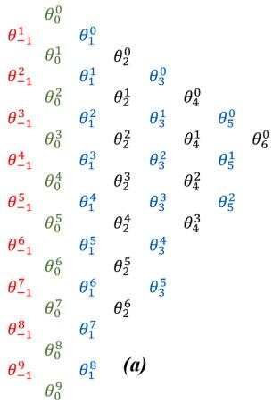

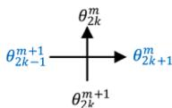  
(b)

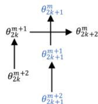  
（c)  
Fig. 1. a) Theta algorithm diagram. b) Diagram for Eq. (25). c) Diagram for Eq. (32).

Fig. 1a illustrates the structure of the Theta algorithm, both for the estimation of S in (15) and for the inversion of the Laplace transform. This figure consists of a two-dimensional arrangement of the terms $\theta _ { i } ^ { m }$ whose subscripts $\because \overrightarrow { l } \overrightarrow { \mathbf { \nabla } }$ and $" m "$ indicate its column and its diagonal, respectively. For the numerical inversion of the Laplace transform, the terms $\theta _ { i } ^ { m }$ are vectors of dimension “N”; $i , e , ,$ the number of time samples time to be obtained. The terms in the first column are initialized with zero vectors:

$$
\boldsymbol {\theta} _ {- 1} ^ {m} = 0; m = 1, 2, \dots , 3 J + 3,
$$

where J is the number of iterations (or refinements) of the algorithm. Fig. 1 illustrates, for example, the case J = 2. The first term of the second column $\theta _ { 0 } ^ { 0 }$ is initialized with the vector of partial sums $S _ { N }$ which is obtained in a highly convenient way with the inverse fast Fourier transform of N samples $( i f f t _ { N } ) { : }$

$$
\boldsymbol {\theta} _ {0} ^ {0} = \boldsymbol {S} _ {n} = N \times i f t _ {N} (\boldsymbol {F}),
$$

where F is the vector of N samples of the function F(s) that is to be inverted:

$$
F = \left[ F _ {0} / 2, F _ {1}, \dots , F _ {N - 1} \right] ^ {T}.
$$

The additional terms in the second column of Fig. 1a are obtained iteratively as follows:

$$
\boldsymbol {\theta} _ {0} ^ {m + 1} = \boldsymbol {\theta} _ {0} ^ {m} + \boldsymbol {E} ^ {m} \times F _ {N + m}; m = 0, 1, \dots , 3 J + 2
$$

where E is the vector with the N samples of the complex exponential:

$$
\boldsymbol {E} = \left[ 1, e ^ {2 \pi j / N}, e ^ {4 \pi j / N}, \dots , e ^ {2 \pi j (N - 1) / N} \right] ^ {T}
$$

Once $\pmb { \theta } _ { - 1 } ^ { m }$ and $\pmb { \theta } _ { 0 } ^ { m }$ have been initialized (i.e., the first two columns of the diagram in Fig. 1a), the elements $\pmb { \theta } _ { i } ^ { m }$ at the other columns on the right are obtained with (25) when $\ " \overrightarrow { \tau } \overrightarrow { \mathbfit { \Lambda } }$ is odd and with (32) when "i" is even. Note that Fig. 1b shows the dependence of odd-column element $\theta _ { 2 k + 1 } ^ { m }$ to be updated with those elements of the previously available columns 2k and 2k− 1. Note also that Fig. 1c shows the dependence of even-column element $\theta _ { 2 k + 2 } ^ { m }$ to be updated with those elements of the previously available columns 2k+1 and 2k.

At Fig. 1a, the columns with an odd index are marked in blue and those with an even index in black. The elements $\pmb { \theta } _ { 2 k } ^ { 0 }$ of even index on the upper diagonal of the diagram are the ones providing the estimates for S and, the higher their subscript is, the better approximation these are to the expression between braces in (9).

From all the above, the inverse d Laplace transform is as follows:

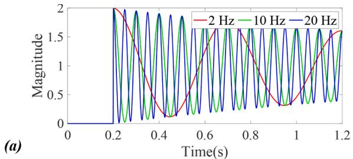

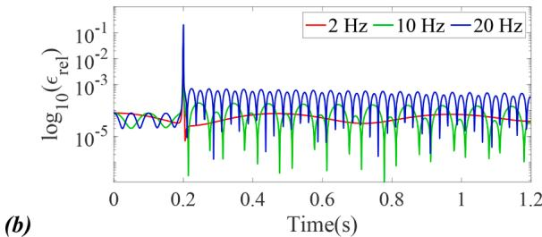  
Fig. 2. a) Plots of f(t) being obtained with the WNLT. b) Plots of errors for the obtained f(t) with three different oscillation frequencies.

$$
\boldsymbol {f} = \left(\frac {2}{T}\right) \times C \circ \Re e \left\{\boldsymbol {\theta} _ {2 J + 2} ^ {0} \right\}, \tag {33}
$$

where f is the vector of N samples for the signal being obtained in the time domain; C is the vector of order N whose elements $C _ { n }$ are of the form

$$
C _ {n} = e ^ {c n \Delta t}, \quad n = 0, 1, 2, \dots , N - 1;
$$

finally, the operator "∘" represents the Hadamard product of two vectors resulting in another vector formed with the multiplication between corresponding elements. In the experience of these authors, the theta algorithm often converges at the first iteration; i.e., at J = 0.

# 4. Validation

One way to evaluate the precision and performance of the method proposed here is to apply it to s-domain functions whose inverse transforms are already analytically determined. The numerical analysis community has already established a set of 35 test functions to evaluate numerical methods for inverting Laplace transforms [18,20]. The proposed Theta algorithm has been tested with all these functions and, except for one case that is addressed below, this algorithm shows practically the same satisfactory performance. For the sake of paper-space economy, only one representative case is presented below in which the WNLT, Epsilon, and Theta algorithms are tested and compared.

Consider the following function of s, along with its inverse transform:

$$
F (s) = \left[ 1 / s + \frac {s + 0 . 5}{(s + 0 . 5) ^ {2} + (2 \pi f) ^ {2}} \right] e ^ {- 0. 2 s} \tag {34}
$$

and

$$
f (t) = \left[ 1 + \cos (2 \pi f (t - 0. 2)) e ^ {- 0. 5 (t - 0. 2)} \right] u (t - 0. 2), \tag {35}
$$

where $u ( t )$ is the unit step (Heaviside function). The three abovementioned methods are now applied in the numerical inversion of (34) for three different values of the oscillation frequency: f = 2 Hz, f = 10 Hz and f = 20 Hz. The observation time for the inverted function is T = 1.2 s and $N = 1 0 2 4$ samples are used. According to subsection II.B, the Laplace damping constant c is determined by means of (7) with a relative error $\in _ { r e l } = 1 0 ^ { - 5 }$ for the WNLT, while $\epsilon _ { r e l } = 1 0 ^ { - 9 }$ is used for determining c in the Epsilon and the Theta algorithms.

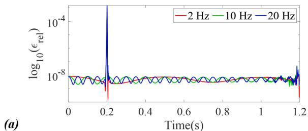

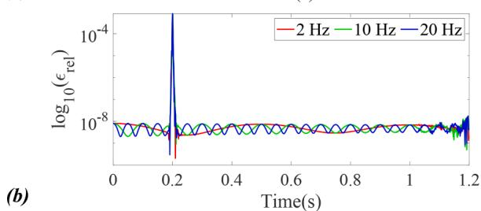  
Fig. 3. a) Plots of errors for the f(t) being obtained with the Epsilon algorithm. b) Plots of errors for the f(t) being obtained with the Theta algorithm.

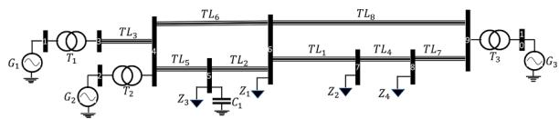  
Fig. 4. Network one-line diagram.   
Fig. 2a shows the plots of f(t) as obtained with the WNLT for the three values of frequency being considered. All the differences between the algorithmically obtained plots and their corresponding ones from (35) cannot be differentiated by eye. For this reason, the plots of the base 10 logarithm of the relative errors for the WNLT are provided in Fig. 2b. Relative errors are calculated as follows:

$$
\in_ {r e l} (n) = \frac {\left| f (n \Delta t) - \widetilde {f} _ {n} \right|}{m a x \{f (t) \}}, \quad n = 0, 1, 2, \dots , 1 0 2 3.
$$

where f(n∆t) is the corresponding value of the analytic function in (35), $f _ { n }$ is the n-th value being obtained numerically and max{f (t)} is the maximum value of |f(t)| in (35). Note that the precision level of $1 0 ^ { - 5 }$ is obtained only for the case with f = 2 Hz. By modifying f in (34) the precision does not remain fixed; in fact, it is degraded.

Figs. 3a and 3b show the respective relative errors of the results with the Epsilon and Theta algorithms when applied to (34). It can be observed that the precisions of both methods are similar and remain fixed despite the changes in f. In terms of computational speed, the Theta algorithm is two times faster than the Epsilon one and 4.2 times slower than the WLNT. On a personal computer with processor Core i9, 2.3 Ghz, 16 GB RAM and running in MatLab, the test case function (35) was executed with the WNLT in 0.04 ms, with the Theta algorithm in 0.17 ms and with the Epsilon algorithm in 0.32 ms. From all the above, it follows that the accuracies of the Theta and Epsilon algorithms are practically the same, Nevertheless, the Theta algorithm is preferred for its higher computational efficiency.

Table 2   
Load data.   

<table><tr><td>Load</td><td>Z1</td><td>Z2</td><td>Z3</td><td>Z4</td><td>C1</td></tr><tr><td>R</td><td>250Ω</td><td>350Ω</td><td>250Ω</td><td>420Ω</td><td></td></tr><tr><td>L</td><td>25mH</td><td>60mH</td><td>25mH</td><td>30mH</td><td></td></tr><tr><td>C</td><td>-</td><td>-</td><td>-</td><td>-</td><td>20uF</td></tr></table>

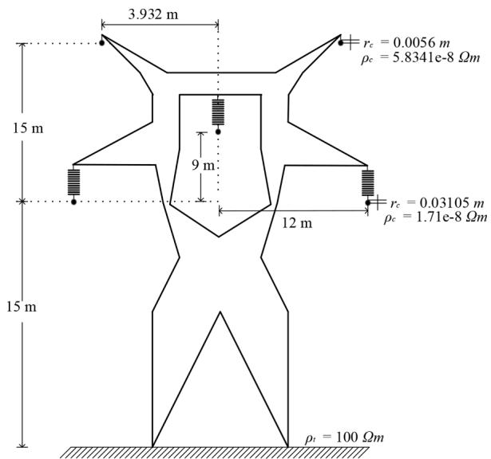  
Fig. 5. Line transversal geometry and material data.

Table 3   
Line lengths.   

<table><tr><td>Line</td><td>TL1</td><td>TL2</td><td>TL3</td><td>TL4</td><td>TL5</td><td>TL6</td><td>TL7</td><td>TL8</td></tr><tr><td>Length (km)</td><td>220</td><td>35</td><td>10</td><td>35</td><td>65</td><td>133</td><td>42</td><td>375</td></tr></table>

Out of the previously mentioned 35 test functions, for function 34 as listed in [18] the accuracy of both algorithms, the Epsilon and the Theta, falls to levels like those of the WNLT. This function is given as follows and corresponds to a square wave:

$$
f _ {3 4} (s) = \frac {2 e ^ {s / 2}}{s} \operatorname {c o s e c h} \left(\frac {s}{2}\right).
$$

It is apparent from this case that the three methods being tested here (WNLT, Epsilon, and Theta) cannot satisfactorily handle signals and functions that include multiple discontinuities. This could well be a topic for future research.

# 5. Power system EMT test case

Fig. 4 shows the one-line diagram of an electrical power network consisting of three generators, three transformers, eight overhead transmission lines, four R-X loads and one capacitive load. Table 1 provides the data for the generators and transformers, while Table 2 provides the values for the loads. The base voltage is 200 kV. All the lines have the same transversal geometry and electrical properties of

Table 1   
Generator and transformer data.   

<table><tr><td></td><td></td><td>Generator
G1</td><td>G2</td><td>G3</td><td>Transformer
T1</td><td>T2</td><td>T3</td></tr><tr><td>Vpu</td><td></td><td>1.03&lt;20.2°</td><td>1.01&lt;10.5°</td><td>1.01-17°</td><td>-</td><td>-</td><td>-</td></tr><tr><td rowspan="2">Z</td><td>R</td><td>1.2Ω</td><td>1.1Ω</td><td>0.8Ω</td><td>1.5Ω</td><td>0.8Ω</td><td>0.6Ω</td></tr><tr><td>L</td><td>38.98mH</td><td>45.52mH</td><td>35.23mH</td><td>23.4mH</td><td>29.5mH</td><td>35.23mH</td></tr></table>

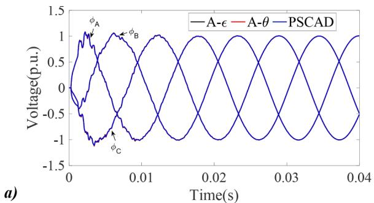

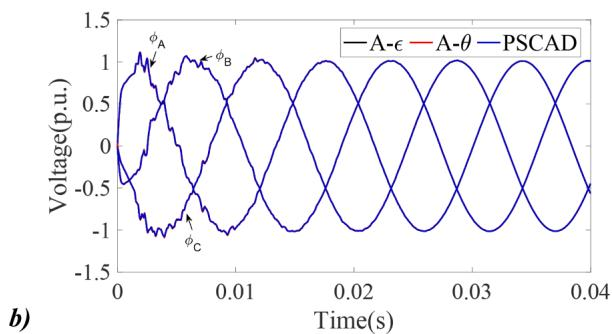  
Fig. 6. a) Voltage waveforms at node 6. b) Voltage waveforms at node 9.

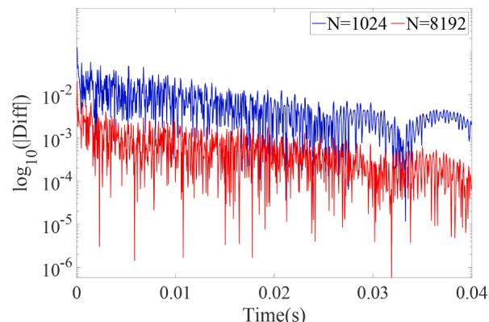

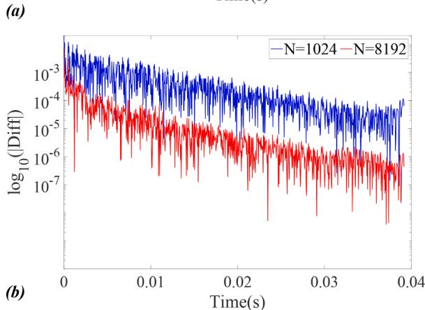  
Fig. 7. a) Comparing PSCAD with the Theta algorithm. b) Comparing the WNLT with the Theta algorithm.

materials. Fig. 5 shows the line geometry and provides its material data. Table 3 provides the lengths of the lines. Fig. 4 network is based on a test case provided in references $[ 2 4 , 2 5 ]$ and has been adapted for the purposes of this paper.

For the calculation of transient responses (overvoltages), the network is represented in nodal form in the Laplace domain. Generators

are incorporated into this representation by their Norton equivalents, transformers are represented by series R-L branches. The transmission lines are included through their three-phase nodal representations with full frequency-dependent AB parameters [1,2,22].

The simultaneous energization of the entire network is now simulated. To do this, the following relationship is used:

$$
\boldsymbol {V} (s) = \boldsymbol {Y} (s) ^ {- 1} \boldsymbol {I} (s) \tag {36}
$$

where $V ( s )$ is the vector of nodal voltages of the network, I(s) is the vector of currents injected into the nodes and $\pmb { Y } ( s )$ is the nodal matrix of the network. Once (36) is solved, the waveforms of nodal voltages are determined with the inverse Laplace transform:

$$
\boldsymbol {v} (t) = \mathcal {L} ^ {- 1} (\boldsymbol {V} (s))
$$

For the Laplace numerical inversion, the Epsilon and Theta algorithms are used with 1024 samples and the observation time is set at $T =$ 40 ms. Figs. 6a and 6b show the respective voltage responses for nodes 6 and 9. These figures also include the simulations being obtained with the PSCAD / EMTDC program with the same number of time steps $N = 1$ 024. Note that the results with the three methods apparently are in good agreement. Fig. 7a provides plots of the logarithm base 10 of absolute differences for the voltage waveforms of phase a at node 6. In blue color is the plot of differences between PSCAD/EMTDC and the Theta algorithm, both with N = 1 024 time steps. The plot in red color corresponds to the differences as the number of time steps in the PSCA/EMTDC is increased to $N = 8 \ 1 9 2$ , and the Theta algorithm remains with N = 1 024 steps. Note that one segment of the differences in blue color is above 1%. Also note that, at higher resolutions, the results from PSCAD/EMTDC approach those of the Theta algorithm.

Fig. 7b shows in blue color the base 10 logarithms of the differences between the results of the WNLT and those from the Theta algorithm both using the same number of frequency steps N = 1 024. The red color plot corresponds to the differences between the WNLT with N = 8 192 frequency steps and the Theta algorithm remaining with N = 1 024. Also note that as the number of samples is increased in the WNLT its results become closer to those of the Theta algorithm.

# 6. Conclusions

The windowed numerical Laplace transform (WNLT) is commonly used for frequency domain analysis of electromagnetic transients in power systems [3,5, 6, 7, 8, 9, 10]. This technique is appropriate for many practical applications and often is adopted as reference to assess newly developed time-domain methods. However, the authors of this article have found that it presents serious limitations as reference method, as well as for research and development tasks. One of its limitations is that the WNLT does not guarantee a fixed precision. This has been shown with an example in this paper. Another limitation is that its accuracy is limited to values between $1 0 ^ { - 5 }$ and 10− 6 and, in addition, an accuracy up to $1 0 ^ { - 9 }$ can be attained at an excessive computational cost. For these reasons, the authors of this paper have dedicated themselves to the search for other methods of numerical inversion of the Laplace transform that can achieve high accuracies at a moderate computational cost, and that their precision levels are fixed.

In this article, a new method of numerical inversion of the Laplace transform based on Brezinski’s Theta algorithm $[ 1 4 , 1 5 , 1 7 ]$ has been proposed and described. Apparently, this is the first time that this algorithm has been used for the numerical inversion of the Laplace transform and for the analysis of EMTs in power systems. Along with the theta algorithm, the description of Wynn’s Epsilon algorithm [12,16] has also been included, since this is a precursor to the first one. The proposed algorithm has been evaluated first by its application to a set of 35 test functions that has been established by the Numerical Analysis community [18, 20]. Except for one function which corresponds to a square wave with several discontinuities, this algorithm shows a high

performance. The Theta algorithm has been then applied to a transient study in a 10-node electric network with three generators, three transformers, eight overhead lines and five loads. The results of this study have been compared satisfactorily with those obtained with the PSCA-D/EMTDC program.

Finally, it has been demonstrated that the proposed method offers a guaranteed high precision at a moderate computational cost; therefore, it is recommended both, as reference method and as a tool for research and development activities in the field of EMT analysis.

# CRediT authorship contribution statement

L.J. Castan˜on: ´ Investigation, Formal analysis, Methodology. J.L. Naredo: Investigation, Formal analysis, Methodology, Writing - original draft. J.R. Zuluaga: . E. Banuelos-Cabral: ˜ Validation, Methodology, Writing – review & editing. Pablo Gomez: ´ Conceptualization, Visualization, Writing – review & editing.

# Declaration of Competing Interest

The authors declare that they have no known competing financial interests or personal relationships that could have appeared to influence the work reported in this paper.

# References

[1] W.Dommel Hermann, EMTP-Theory Book, Bonneville Power Administration, Portland, OR, USA, 1996.   
[2] Juan A. Martinez-Velasco, Transient Analysis of Power Systems: Solution Techniques, Tools and Applications, John Wiley & Sons, 2014.   
[3] F.A. Uribe, J.L. Naredo, P. Moreno, L. Guardado, Electromagnetic transients in underground transmission systems through the numerical laplace transform, Int. J. Electric. Power Energy Syst. 24/3 (2002) 215–221. March.   
[4] B. Gustavsen, Validation of frequency-dependent transmission line models, IEEE Trans. Power Del. 20 (2) (2005) 925–933. April.   
[5] Pablo Moreno, Pablo Gomez, ´ Jos´e L. Naredo, J.L. Guardado, Frequency domain transient analysis of electrical networks including non-linear conditions, Int. J. Electric. Power Energy Syst. 27 (2) (2005) 139–146. Feb.   
[6] P. Moreno, A. Ramirez, Implementation of the numerical laplace transform: a review, IEEE Trans. on Power Delivery 23 (4) (2008) 2599–2609. Oct.

[7] N. Mullineux, J.R. Reed, Developments in obtaining transient response using fourier transforms: part IV-survey of the theory, Int. J. Elect. Engng. Educ. 10 (1973) 259–265.   
[8] A. Ametani, The application of the fast fourier transform to electrical transient phenomena, Int. J. Elect. Engng. Educ. 10 (4) (1973) 277–287. October.   
[9] D.J. Wilcox, Numerical laplace transformation and inversion, Int. J. Elect. Enging. Educ. 15 (1978) 247–265.   
[10] L.M. Wedepohl, Power system transients: errors incurred in the numerical inversion of the laplace transform. Proc. of The IEEE Twenty-Sixth Midwest Symposium on Circuits and Systems, Puebla, Mexico, 1983. August.   
[11] Martin G. Vega, J.L. Naredo, O. Ramos-Leanos, ˜ “Minimum delay systems for the modeling of transmission lines at EMT power system studies”, in Proc. of The 12th International Conference on Power Systems Transients, IPST’2017, Seoul, Korea, June 2017.   
[12] Branˇcík, L., “Programs for fast numerical inversion of Laplace transforms in Matlab language environment.” Proceedings of 7th Conference MATLAB’99, pp. 27–39, ISBN 80-7080-354-1, Prague, Czech Republic, November 3, 1999.   
[13] L.J. Castan˜on, ´ J.L. Naredo, J.R. Zuluaga, M.G. Vega-Grijalva, “Electromagnetictransient analysis in the laplace-domain through the QD algorithm”, in Proc. of the 13th International Conference on Power Systems Transients, IPST’2019, ISSN 2434-9739, Perpignan, France, June 2019.   
[14] Claude Brezinski, Convergence acceleration during the 20th century, J. Comput. Appl. Math. 122 (1) (2000) 1–21.   
[15] Claude Brezinski, Acc´el´eration De La Convergence En Analyse Num´erique, Springer, 2006. Vol. 584.   
[16] P. Wynn, On a Device for Computing the em(Sn) Transformation, Math. Tables. Other Aids Comput. 10 (54) (1956) 91–96. Apr.   
[17] Claude Brezinski, Yi He, Xing Biao Hu, Michela Redivo-Zaglia, Jian-Quing Sun, Multistep ∈–algorithm, Shanks’ transformation, and the Lotka–Volterra system by Hirota’s method, Math. Comput. 81.279 (2012) 1527–1549.   
[18] A.M. Cohen, Numerical Methods for Laplace Transform Inversion, Springer   
[19] G. John, Dimitris G.Manolakis Proakis, Digital Signal Processin, 4th Ed, Prentice Hall, 2007.   
[20] Brian Davies, Brian Martin, Numerical inversion of the Laplace transform: a survey and comparison of methods, J. Comput. Phys. 33 (1) (1979) 1–32.   
[21] Kenny S. Crump, Numerical inversion of Laplace transforms using a Fourier series approximation, J. ACM (JACM) 23 (1) (1976) 89–96.   
[22] J.A. Martinez-Velasco, Power System Transients: Parameter Determination, CRC Press, Boca Raton FL, 2009.   
[23] B. Gustavsen, Optimal Time Delay Extraction for Transmission Line Modeling, IEEE Trans. Power Del. 32 (1) (2017) 45–54. Feb.   
[24] Prabha Kundur, Power System Stability and Control, MacGraw-Hill, 1994.   
[25] M. Matar, R. Iravani, The reconfigurable-hardware real-time and faster-than-realtime simulator for the analysis of electromagnetic transients in power systems, IEEE Trans. Power Del. 28 (2) (2013) 619–627. April.