# Alternative method to include the frequency-effect on transmission line parameters via state-space representation

Tainá F.G. Pascoalato a,∗, Anderson R.J. de Araújo b, Sérgio Kurokawa a, José Pissolato Filho b

a Department of Electrical Engineering, São Paulo State University (UNESP), 56 South Brazil Ave, Ilha Solteira, 15385-000, São Paulo, Brazil   
b School of Electrical and Computer Engineering, University of Campinas (UNICAMP), 400 Albert Einstein Ave, Campinas, 13083-872, São Paulo, Brazil

# A R T I C L E I N F O

Keywords:

Electromagnetic transient

Transmission line

Cascaded circuit

Lightning performance

# A B S T R A C T

This article describes an alternative method and investigates its performance on the transient responses considering a frequency-dependent lumped parameter model (FDLPM) to represent the transmission line (TL) in the literature. This model includes the fundamental behavior of the frequency dependency on longitudinal parameters, and it is developed directly in the time domain (without the use of frequency-to-time conversion tools). The alternative method individually solves a system of state-space equations for each ?? circuit of the LPM. Consequently, this method reduces the order of the state-space matrices, providing excellent performance associated with lower computational efforts (faster speed) compared to that obtained with the classical method. The alternative method was used to calculate the electromagnetic transients (current and voltages) in the single- and three-phase transmission lines subjected to energization maneuver and lightning strike for several scenarios at the receiving end. All responses are calculated using a programming code in MATLAB ®. Results demonstrated that the alternative method closely follows the responses calculated with the classical, indicating its excellent accuracy. Besides, the smaller dimension of state-space matrices lead to low computational times, varying from 230 to 300 times smaller, depending on the line configuration compared to the other method, assuming the same fixed time step.

# 1. Introduction

Transmission lines (TLs) are one of the main components in the electric power system, which are subjected to several types of disturbances, such as energization (switching maneuvers), lightning strikes, and faults. These disturbances result in electromagnetic transients that may affect the operation of the TLs. Consequently, the quality of the energy delivered to consumers is impacted, which can lead to economic losses for consumers. Besides that, the electric power system contains several components that can have nonlinear operating characteristics and time-variable elements (e.g., rectifiers, surge arresters, lightning arresters, transformers, pre-insertion resistors, loads) and nonlinear phenomena such as the Corona effect on the phase conductors [1–3].

In this frame, the transmission line models can be developed in the frequency- or time domains, having their own advantages and disadvantages. Firstly, concerning the frequency-domain models, the most famous FD line models available on the electromagnetic transient (EMT)-type programs are the JMarti [4] and Universal Line Model (ULM) [5]. The first model uses the fitting of the characteristic impedance $Z _ { \mathrm { { C } } } ( \omega )$ and propagation function ??(??) of the line (or

underground cable) using Bode’s fitting techniques based on the asymptotic approximation, dealing with residues and zeros of the rational approach [6]. For this purpose, the modal decomposition employing transformation matrices (with constant or FD elements) is required [4,6,7]. Recently, several works proposing an enhancement of the JMarti line model using the Vector Fitting approach using real poles have been presented [7–9]. Limitations occur when underground cable or transmission lines with strong asymmetric (leading to problems on the eigenvectors of the transformation matrices) are considered for the transient analysis [6]. On the other hand, the ULM employs the Vector Fitting technique directly in the phase-domain based on the FD rational approximation of the admittance matrix $Z _ { \mathrm { { C } } } ( \omega )$ and propagation matrix ??(??) using the real and complex poles and residues [5,6]. Then, the limitations are related to finding the correct number of poles for these fitting techniques associated with their convergence. Including nonlinear elements in TL models in the frequency domain can be complex since the transient responses employing the numerical inverse transform require a high number of frequency samples, window

functions, and truncation in their computations. This procedure can be cumbersome and associated with high computational costs, especially when a good accuracy transient response is needed [10,11]. Then, the TL models developed directly in the time domain are an attractive alternative for studying the electromagnetic transients in power systems [12,13].

The development of time-domain models for the accurate calculation of electromagnetic transients in TL has increased considerably in recent years [14–16]. On this topic, the Bergeron model was one the first attempts to represent the transmission lines [17]. This model includes the traveling wave delays using an equivalent circuit containing current sources representing the distributed parameters of a lossless line by a characteristic impedance (computed at a single frequency), combined with lumped resistances at both terminals to include the losses. The Bergeron model is suitable for short transmission lines, and low-frequency disturbances, such as load flow or faults, are involved. Recently, Caballero et al. improved the accuracy of Bergeron’s model, including the FD longitudinal parameters of the lines for analysis involving high-frequency disturbances (lighting strikes) [15].

On the other hand, the time-domain lumped parameter model (LPM) uses a cascade of ?? circuits to incorporate the distributed nature of line parameters. Then, the LPM can be represented by its: (i) frequencyindependent or constant parameters or (ii) frequency-dependent (FD) parameters. Besides that, the currents and voltages along the TL using the LPM are calculated employing a system of state-space equations [13]. The LPM with constant-parameter elements is less complex to implement via programming code. However, this approach does not precisely represent the longitudinal per-unit-length (PUL) resistance and inductance for an extensive frequency range, especially when fastfront phenomena such as lightning strikes are involved in the transient analysis. In addition, this approach provides transient responses with spurious oscillations that are exaggerated peak values in the waveform, which can lead to erroneous interpretations [18,19]. Further, LPM with FD parameters is adequate since it considers the Skin and ground-return effects on the longitudinal parameters of the TL over an extensive frequency range. Then, this model, named FDLPM, mitigates the spurious oscillations, reduces the intrinsic errors, and correctly computes the transient responses. In the FDLPM, one of the possibilities for including the frequency dependency of the longitudinal parameters is the representation by a series of several branches of ???? circuits in parallel [16,20,21]. As advantages, the FDLPM models can include the have nonlinear operating characteristics and time-variable components of the power system and analyze the nonlinear phenomena such as the Corona effect. However, this model considerably increases computational effort due to the high number of ?? circuits required for adequate line representation. Consequently, there is a significant increase in the dimension of state-space matrices. Therefore, the performance and the computational time depend on the number of cascaded ?? circuits associated with multiple branches of ???? elements.

To reduce the state-space matrices and reduce the computational time, an alternative method presented in the scientific literature by Fernandes et al. [22] can be employed. This method forms a system of state-space equations for each ??-circuit individually at each time instant. Then, as a consequence, the state-space matrices have smaller dimensions, resulting in a faster method in terms of computational cost [22]. To assess the transient responses adequately, the FDLPM must consider the frequency-dependent longitudinal parameters using ??-circuit cascade associated ?? branches ???? over a wide frequency range. Then, the alternative method is used to solve the state-space equations relating the transient currents and voltages at any position of the TL directly in the time domain without compromising their accuracy.

This paper investigates the performance of the alternative method in transient responses (currents and voltages) generated on multi-phase transmission lines subjected to different disturbances. For this purpose,

the longitudinal impedance is fitted with branches of ????-circuits to include the frequency dependence on these line parameters. Several cases considering single- and three-phase transmission lines, both located on soil with a resistivity 1,000 ??.m, subjected to energization maneuver and lightning strike, are assumed. The transient responses are compared with the classical method that uses large state-space matrices in its formulation. Results indicated that the alternative method provides good accuracy in the transient responses compared with those assessed with classical method. Further, the alternative method presented a significant efficiency as the computational time is reduced, varying from 230 to 300 times, depending on the studied scenario.

The main contributions of the work include a method that considers the frequency-dependent longitudinal parameters of the TL, combining a good accuracy in the transient responses compared with those obtained by classical method using the ??-circuit in cascade performance. Further, the state-space matrices present smaller dimensions, resulting in a lower computational time or calculating the transient responses. Finally, inverse Laplace or Fourier transforms from the frequency to the time domain are unnecessary since all simulations are carried out directly in the time domain.

The rest of this article is organized as follows: In Section 2 describes the classical method to compute the transients in TLs. Section 3 presents the alternative method to calculate the transient responses. In Sections 4 and $^ { 5 , }$ numerical results validate the alternative method comparing with those with the classical for various cases. Finally, Section 6 summarizes the main conclusion of this article. The Appendix describes some formulas used in this work.

# 2. Classical method to obtain currents and voltages

To represent an overhead transmission line (TL) directly in the time domain, considering its frequency dependence on the longitudinal parameters due to the Skin effect and ground-return effect, a ??-circuit cascade associated with a state-space system can be employed. In this representation, TL is composed of a cascade of ??-circuits and ?? branches of ????-circuit in parallel as illustrated in Fig. 1.

As shown in Fig. 1, A’ and $\pmb { B } ^ { \prime }$ are the sending and receiving ends of the ${ \mathrm { T L } } ,$ respectively. The longitudinal parameters are composed of the resistors $R _ { 0 } , R _ { 1 } , \cdots , R _ { \mathrm { m } } ,$ and the inductors $L _ { 0 } , L _ { 1 } , \cdots , L _ { \mathrm { m } }$ arranged in series of ????-branches. The transversal parameters are composed of the lumped capacitance ?? and conductance ??. These parameters can be expressed as follows

$$
R _ {0} = R _ {0} ^ {\prime} \frac {d}{n}; \quad R _ {1} = R _ {1} ^ {\prime} \frac {d}{n}; \quad \dots \quad R _ {\mathrm {m}} = R _ {\mathrm {m}} ^ {\prime} \frac {d}{n}; \tag {1}
$$

$$
L _ {0} = L _ {0} ^ {\prime} \frac {d}{n}; \quad L _ {1} = L _ {1} ^ {\prime} \frac {d}{n}; \quad \dots \quad L _ {\mathrm {m}} = L _ {\mathrm {m}} ^ {\prime} \frac {d}{n}; \tag {2}
$$

$$
C = C ^ {\prime} \frac {d}{n}; \quad G = G ^ {\prime} \frac {d}{n}, \tag {3}
$$

where ?? is the length of the TL and ?? is the number of ??-circuits in cascade. The set of parameters $( R _ { 0 } ^ { \prime } , R _ { 1 } ^ { \prime } , \cdots , R _ { \mathrm { m } } ^ { \prime } ) , ( L _ { 0 } ^ { \prime } , L _ { 1 } ^ { \prime } , \cdots , L _ { \mathrm { m } } ^ { \prime } ) , \mathrm { C } ^ { \prime }$ and ${ \bf G } '$ are the PUL resistances, inductances, capacitance and conductance.

The longitudinal impedance $Z _ { \ell } ( j \omega )$ of this ??-circuit unit can be calculated as

$$
Z _ {\ell} (j \omega) = R _ {0} + j \omega L _ {0} + \frac {j \omega L _ {1} R _ {1}}{R _ {1} + j \omega L _ {1}} + \dots + \frac {j \omega L _ {\mathrm {m}} R _ {\mathrm {m}}}{R _ {\mathrm {m}} + j \omega L _ {\mathrm {m}}}. \tag {4}
$$

All values of the resistors $R _ { 0 } , R _ { 1 } , \cdots , R _ { \mathrm { m } } ,$ , the inductors $L _ { 0 } , \ L _ { 1 } ,$ $\cdots , \ L _ { \mathrm { m } }$ must be determined to represent properly the longitudinal impedance. Then, these variables can be calculated using several fitting methods available in the literature, such as those proposed in [5,23], and [24]. Further, the number of branches ?? of ????-circuits depends on the frequency range to be considered, up to a few MHz. The current and voltages along the TL can be written as a state-space system as follows

$$
\frac {\partial \mathbf {x} (t)}{\partial t} = \dot {x} (t) = \mathbf {A x} (t) + \mathbf {B v} _ {0} (t), \tag {5}
$$

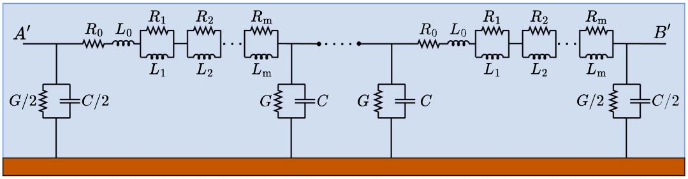  
Fig. 1. TL represented by ??-circuit with ???? branches including the frequency dependence on the longitudinal parameters.

where the matrices ?? and ?? are the space matrices, and ??(??) is the statespace vector containing the currents and voltages in the time domain. To represent the TL shown in Fig. 1, ??, ?? and ?? are written as follows

$$
\mathbf {A} = \left[ \begin{array}{c c c c c c} \mathbf {S} & \mathbf {N} _ {1} & \mathbf {N} _ {2} & \dots & \mathbf {N} _ {\mathrm {m}} & \mathbf {T} \\ \mathbf {M} _ {1} & - \mathbf {M} _ {1} & \mathbf {Z} & \dots & \dots & \mathbf {Z} \\ \mathbf {M} _ {2} & \mathbf {Z} & - \mathbf {M} _ {2} & \mathbf {Z} & \dots & \mathbf {Z} \\ \vdots & \vdots & \mathbf {Z} & \ddots & \ddots & \vdots \\ \mathbf {M} _ {\mathrm {m}} & \vdots & \vdots & \ddots & - \mathbf {M} _ {\mathrm {m}} & \mathbf {Z} \\ \mathbf {U} & \mathbf {Z} & \mathbf {Z} & \dots & \mathbf {Z} & \mathbf {V} \end{array} \right], \tag {6}
$$

$$
\mathbf {B} = \left[ \begin{array}{c c c c c c} \frac {1}{L _ {0}} & 0 & 0 & \dots & 0 & 0 \end{array} \right] ^ {\mathrm {T}}, \tag {7}
$$

$$
\mathbf {x} (t) = \left[ \begin{array}{l l l l} \mathbf {x} _ {1} (t) & \mathbf {x} _ {2} (t) & \dots & \mathbf {x} _ {\mathrm {n}} (t) \end{array} \right] ^ {\mathrm {T}}. \tag {8}
$$

The matrix ?? has the dimension ??(?? + 2) × ??(?? + 2), the matrix ?? has the dimension $n ( m + 2 ) \times 1$ and the vector ?? has dimension ??(?? + 2) × 1. In (6), ?? is the null matrix. The matrices $\mathbf { M } _ { \mathrm { m } } , \mathbf { N } _ { \mathrm { m } } , \mathbf { S } , \mathbf { T } ,$ ?? and ?? are given by

$$
\mathbf {M} _ {\mathrm {m}} = \operatorname {d i a g} \left\{\frac {R _ {\mathrm {m}}}{L _ {\mathrm {m}}} \right\} _ {n \times n} \quad \mathbf {N} _ {\mathrm {m}} = \operatorname {d i a g} \left\{\frac {R _ {\mathrm {m}}}{L _ {0}} \right\} _ {n \times n} \tag {9}
$$

$$
\mathbf {S} = \operatorname {d i a g} \left\{- \frac {\sum_ {\mathrm {j} = 0} ^ {\mathrm {j} = \mathrm {m}} R _ {\mathrm {j}}}{L _ {0}} \right\} _ {n \times n} \quad \mathbf {V} = \operatorname {d i a g} \left\{- \frac {G}{C} \right\} _ {n - 1 \times n - 1} \tag {10}
$$

$$
\mathbf {T} = \left[ \begin{array}{c c c} - \frac {1}{L _ {0}} & & \\ \frac {1}{L _ {0}} & \ddots & \\ & \ddots & \ddots \\ & & \frac {1}{L _ {0}} - \frac {1}{L _ {0}} \end{array} \right] _ {n \times n - 1} \quad \mathbf {U} = \left[ \begin{array}{c c c} \frac {1}{C} & - \frac {1}{C} & \\ & \ddots & \ddots \\ & & - \frac {1}{C} \\ & & \frac {1}{C} \end{array} \right] _ {n - 1 \times n}. \tag {11}
$$

The generic vector $\mathbf { x _ { \mathrm { k } } }$ in (8) is given by

$$
\mathbf {x} _ {\mathrm {k}} (t) = \left[ \begin{array}{l l l l} i _ {\mathrm {k 0}} (t) & i _ {\mathrm {k 1}} (t) & \dots & i _ {\mathrm {k m}} (t) & v _ {\mathrm {k 1}} (t) \end{array} \right] ^ {\mathrm {T}}, \tag {12}
$$

where $i _ { \mathrm { k } 0 } ( t ) , i _ { \mathrm { k } 1 } ( t ) , \dots i _ { \mathrm { k m } } ( t )$ are the currents in the inductances $L _ { 0 } , L _ { 1 } ,$ $\cdots , L _ { \mathrm { m } }$ of the ??th ??-circuit. The $v _ { \mathrm { k 1 } } ( t )$ is the voltage at the capacitor on the right side of the ??th ??-circuit. From the state-space system in (5), the differential equations can be solved by any numerical integration method such as Heun’s method and Runge–Kutta’s method. One notes that the solutions of (5) consist of solving ??(??+2) differential equations yielding for each time instant the currents and voltages along TL. This method to obtain the currents and voltages is labeled as the classical method. In this method, the state-space matrix ?? has a considerable dimension, being $n ( m + 2 ) \times n ( m + 2 )$ , being ?? a high number.

# 3. Alternative method to obtain the currents and voltages

The main idea of the alternative method consists of calculating the currents and voltages for each time instant, considering each ??-circuit individually. To apply this method, the representative ??-circuit cascade (with ????-branches) of the TL is employed. However, differently from the previous classical method, in the alternative method ?? systems containing $( m + 2 )$ differential equations are solved for each time instant. Therefore, in this method, the state-space matrix ?? has a lower dimension, being $( m + 2 ) \times ( m + 2 )$ .

The state-space representation for each ??-circuit with branches of ???? in parallel is defined in three types of circuits: (1) the first ??-circuit at the sending end A’ as illustrated in Fig. 2a; (2) the ??th ??-circuit, being $j = 2 , 3 , \cdots ,$ ??-1 representing the intermediate segments as shown in Fig. 2b; (3) the last ??th ??-circuit in the cascade related to the receiving end B’ shown in Fig. 2c.

The currents and voltage in each ??-circuit are calculated for each time instant solving ?? systems of differential equations given by

$$
\frac {\partial \mathbf {x} _ {\mathrm {j}} (t)}{\partial t} = \dot {x} _ {j} (t) = \mathbf {A} _ {\mathrm {j}} \mathbf {x} _ {\mathrm {j}} (t) + \mathbf {B} _ {\mathrm {j}} \mathbf {u} _ {\mathrm {j}} (t). \tag {13}
$$

The matrices are ??, ?? and the vectors ??(??) and ??(??) in (13) are dependent on the each ??-circuit in Fig. 2, detailed as follows.

# 3.1. Set-up of state-space matrices and vectors ??, ??, ??(??) and ??(??)

The state-space matrix ?? has the dimension of $( m + 2 ) \times ( m + 2 ) .$ . For the first ??-circuit and for the ??th ??-circuit, the state-space matrix ?? has the same structure. Then, the matrix $\mathbf { A } _ { \mathrm { j } }$ related to the ??th ??-circuit in cascade, for $j = 1 , 2 , \dots , n - 1 ;$ , is written as being

$$
\mathbf {A} _ {\mathrm {j}} = \left[ \begin{array}{c c c c c c} - \frac {\sum_ {\mathrm {p} = 0} ^ {\mathrm {m}} R _ {\mathrm {p}}}{L _ {0}} & \frac {R _ {1}}{L _ {0}} & \frac {R _ {2}}{L _ {0}} & \dots & \frac {R _ {\mathrm {m}}}{L _ {0}} & \frac {- 1}{L _ {0}} \\ \frac {R _ {1}}{L _ {1}} & - \frac {R _ {1}}{L _ {1}} & 0 & \dots & 0 & 0 \\ \frac {R _ {2}}{L _ {2}} & 0 & - \frac {R _ {2}}{L _ {2}} & \dots & 0 & 0 \\ \vdots & \vdots & \vdots & \ddots & \vdots & \vdots \\ \frac {R _ {\mathrm {m}}}{L _ {\mathrm {m}}} & 0 & 0 & \dots & - \frac {R _ {\mathrm {m}}}{L _ {\mathrm {m}}} & 0 \\ \frac {1}{C} & 0 & 0 & \dots & 0 & - \frac {G}{C} \end{array} \right]. \tag {14}
$$

Concerning the ??th ??-circuit, the matrix $\mathbf { A } _ { \mathrm { n } }$ is written as follows

$$
\mathbf {A} _ {\mathrm {n}} = \left[ \begin{array}{c c c c c c} - \frac {\sum_ {\mathrm {p} = 0} ^ {\mathrm {m}} R _ {\mathrm {p}}}{L _ {0}} & \frac {R _ {1}}{L _ {0}} & \frac {R _ {2}}{L _ {0}} & \dots & \frac {R _ {\mathrm {m}}}{L _ {0}} & \frac {- 1}{L _ {0}} \\ \frac {R _ {1}}{L _ {1}} & - \frac {R _ {1}}{L _ {1}} & 0 & \dots & 0 & 0 \\ \frac {R _ {2}}{L _ {2}} & 0 & - \frac {R _ {2}}{L _ {2}} & \dots & 0 & 0 \\ \vdots & \vdots & \vdots & \ddots & \vdots & \vdots \\ \frac {R _ {\mathrm {m}}}{L _ {\mathrm {m}}} & 0 & 0 & \dots & - \frac {R _ {\mathrm {m}}}{L _ {\mathrm {m}}} & 0 \\ \frac {2}{C} & 0 & 0 & \dots & 0 & - \frac {G}{C} \end{array} \right]. \tag {15}
$$

The state-space matrix ?? has a dimension of $( m + 2 ) \times 2$ . For the three segments in the ??-circuit (first, ??th and ??th), they have the same formation, being given by

$$
\mathbf {B} = \left[ \begin{array}{c c c c c c} \frac {1}{L _ {0}} & 0 & 0 & \dots & 0 & 0 \\ 0 & 0 & 0 & \dots & 0 & \frac {- 1}{C} \end{array} \right] ^ {\mathrm {T}}. \tag {16}
$$

The state-space vectors ??(??) and ??(??) has the dimension $( m + 2 ) \times$ 1 and $2 \times 1$ , respectively. They have the same formation for the three segments of ??-circuit. Then, the vectors ${ \bf x } _ { \mathrm { j } } ( t )$ and ${ \mathbf { u } } _ { \mathrm { j } } ( t )$ of the $j \mathrm { t h }$ ??-circuit, for $j = 1 , 2 , \dots , n ,$ being written as follows

$$
\mathbf {x} _ {\mathrm {j}} (t) = \left[ \begin{array}{l l l l l} i _ {\mathrm {j}} (t) & i _ {\mathrm {j} 1} (t) & i _ {\mathrm {j} 2} (t) & \dots & i _ {\mathrm {j m}} (t) & v _ {\mathrm {j}} (t) \end{array} \right] ^ {\mathrm {T}}; \tag {17}
$$

$$
\mathbf {u} _ {\mathrm {j}} (t) = \left[ \begin{array}{l l} v _ {\mathrm {j - 1}} (t) & i _ {\mathrm {j + 1}} (t) \end{array} \right] ^ {\mathrm {T}}, \tag {18}
$$

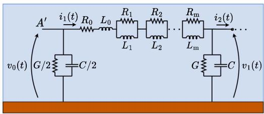  
(a)

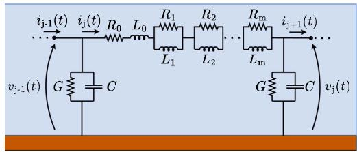  
(b)

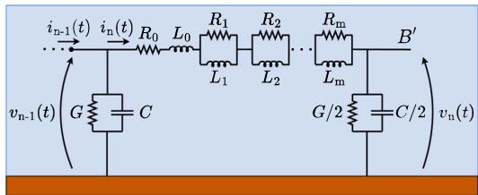  
(c）  
Fig. 2. Parts of the ??-circuit in cascade: (a) first ??-circuit; (b) j-??ℎ ??-circuit and (c) n-??ℎ (last) ??-circuit.

being $i _ { \mathrm { j } } ( t )$ the current in $L _ { 0 }$ in ??th ??-circuit; $i _ { \mathrm { i } 1 } ( t )$ is the current in $L _ { 1 }$ in ??th ??-circuit; $i _ { \mathrm { j m } } ( t )$ is the current in $L _ { \mathrm { m } }$ in ??th ??-circuit; $v _ { \mathrm { j } } ( t )$ is the voltage at the receiving end of ??th ??-circuit; $v _ { \mathrm { j - 1 } } ( t )$ is the voltage at the sending end at the previous ??-circuit; the $i _ { \mathrm { j + 1 } } ( t )$ is the current at the next ??-circuit.

Applying the numerical integration method (Heun‘s method) to solve the (13), the solution is given by

$$
\begin{array}{l} \mathbf {x} _ {\mathrm {j}} \left(t _ {\mathrm {k} + 1}\right) = \left[ \mathbf {I} - \frac {\Delta t}{2} \mathbf {A} _ {\mathrm {j}} \right] ^ {- 1} \left\{\left[ \mathbf {I} + \frac {\Delta t}{2} \mathbf {A} _ {\mathrm {j}} \right] \mathbf {x} _ {\mathrm {j}} \left(t _ {\mathrm {k}}\right) \right. \\ \left. + \left[ \frac {\Delta t}{2} \mathbf {B} _ {\mathrm {j}} \right] \left[ \mathbf {u} _ {\mathrm {j}} \left(t _ {\mathrm {k}}\right) + \mathbf {u} _ {\mathrm {j}} \left(t _ {\mathrm {k} + 1}\right) \right] \right\}, \tag {19} \\ \end{array}
$$

where $t _ { \mathbf { k } + 1 }$ is the time instant, vector ${ \mathbf { x } } _ { \mathrm { j } } ( t _ { \mathrm { k + 1 } } )$ is the solution associated at this time and ???? is the time step. In (19), the vector ${ \mathbf { u } } _ { \mathrm { j } } ( t _ { { \mathrm { k } } + 1 } )$ must be computed. This vector is composed by voltage at the receiving terminal of the previous ??-circuit $( v _ { \mathrm { i - 1 } } ( t _ { \mathrm { k + 1 } } ) ) ,$ and by current at the next ??-circuit $( i _ { \mathrm { j + 1 } } ( t _ { \mathrm { k + 1 } } ) )$ . The voltage $v _ { \mathrm { j - 1 } } ( t _ { \mathrm { k + 1 } } )$ ) is known because it is one the components of the vector $\mathbf { x } _ { \mathrm { j - 1 } } ( t _ { \mathrm { k + 1 } } )$ , but the current $i _ { \mathrm { j + 1 } } ( t _ { \mathrm { k + 1 } } )$ ) is unknown. However, it is possible to estimate the current $i _ { \mathrm { j + 1 } } ( t _ { \mathrm { k + 1 } } )$ ) assuming that the integration time step ???? is sufficiently small.

In this context, to chose a sufficiently small time step, the highest expected frequency $( f _ { \operatorname* { m a x } } )$ of the applied disturbance must be known. Then, on digital programs and assuming that ten points adjust one period of this maximum frequency with sufficient accuracy, the time step ???? must satisfy the condition [25]

$$
\Delta t \leq \frac {1}{1 0 \times f _ {\max}} = \frac {\tau_ {f}}{1 0}, \tag {20}
$$

where, $\left( f _ { \operatorname* { m a x } } \right)$ is the maximum frequency of the disturbance applied at the sending end of the TL. In the case of a lightning striking a TL, it is considered that $f _ { \mathrm { m a x } } = 1 / \tau _ { f }$ , where $\tau _ { f }$ is the shorter front-time of this time signal. The criterion for choosing the adequate time step is further investigated in this work.

# 3.2. Initial conditions

To estimate the current $i _ { \mathrm { j + 1 } } ( t _ { \mathrm { k + 1 } } ) ,$ , this current is approximated by the first two terms of Taylor’s series, being written as follows

$$
i _ {\mathrm {j} + 1} \left(t _ {\mathrm {k} + 1}\right) \cong i _ {\mathrm {j} + 1} \left(t _ {\mathrm {k}}\right) + \frac {\partial i _ {\mathrm {j} + 1} \left(t _ {\mathrm {k}}\right)}{\partial t} \Delta t. \tag {21}
$$

The derivative of $i _ { \mathrm { j + 1 } } ( t _ { \mathrm { k } } )$ in (21), can be calculated using the $j { + } 1$ element of the ??-circuit, as shown in Fig. 3.

Applying the Kirchoff’s law in Fig. 3, the derivative of $i _ { \mathrm { j + 1 } } ( t _ { \mathrm { k } } )$ ) is written as follows

$$
\begin{array}{l} \frac {\partial i _ {\mathrm {j + 1}} (t _ {\mathrm {k}})}{\partial t} = \left[ \frac {1}{L _ {0}} \left(- \sum_ {\mathrm {p = 0}} ^ {\mathrm {m}} R _ {\mathrm {p}}\right) \right] i _ {\mathrm {j + 1}} (t _ {\mathrm {k}}) + \frac {1}{L _ {0}} \left(\sum_ {\mathrm {p = 1}} ^ {\mathrm {m}} R _ {\mathrm {p}} i _ {\mathrm {j + 1 p}} (t _ {\mathrm {k}})\right) + \frac {1}{L _ {0}} v _ {\mathrm {j}} (t _ {\mathrm {k}}) \\ - \frac {1}{L _ {0}} v _ {\mathrm {j} + 1} \left(t _ {\mathrm {k}}\right). \tag {22} \\ \end{array}
$$

Replacing (22) in (21), one obtains an estimate of $i _ { \mathrm { j + 1 } } ( t _ { \mathrm { k + 1 } } )$ and, consequently the vector ${ \mathbf { x } } _ { \mathrm { j } } ( t _ { \mathrm { k + 1 } } )$ can be calculated.

# 4. Numerical results

The numerical results are divided into the following sections. It is worth noting that no technique to reduce the sparsity of the matrix nor parallel computing technique was employed to solve the numerical equations. All numerical simulations were performed in computing platform $\mathbf { M A T L A B } ^ { \otimes }$ whose computer configurations are: Intel(R)Core(TM) i5-9400 CPU @2.90 GHz, 6 Core(s) with 16.00 GB of RM.

# 4.1. Validation of the alternative method for a single-phase TL

To investigate the performance of the alternative method on the computation of the transient responses, the single-phase TL with a length of 100 km is used in the following simulations. The silhouette of the adopted TL is depicted in Fig. 4a. Each phase comprises 4 subconductors of Grosbeak with a radius of 0.01021 m. The TL is located on soil with constant resistivity of 1,000 ??.m. Then, the results obtained from the alternative method are compared with those generated with the classical method.

Alternative method: The per-unit-length (PUL) longitudinal parameters of the TL are calculated considering the Skin and the ground-return effects using the formulas (28) and (30) in Appendix. The PUL capacitance is considered constant and calculated by the formula (32) presented in Appendix. Using the parameters in Fig. 4a, the PUL capacitance ?? = 10.118 nF/km and conductance $G = 0 . 5 5 6 \mu S / \mathrm { k m } [ 2 6 ]$ , being these parameters constant for all simulations. The resistors $R _ { 0 } ,$ $R _ { 1 } , \cdots , R _ { \mathrm { m } }$ , and the inductors $L _ { 0 } , L _ { 1 } , \cdots , L _ { \mathrm { m } }$ are calculated using the Vector Fitting method [5,23]. The longitudinal impedance is fitted with ?? branches of ???? circuits in parallel. The voltages and currents are obtained with the alternative method where the state-space matrix A that has a dimension of $( m + 2 ) \times ( m + 2 )$ .

Classical method: All PUL line parameters previously calculated are adopted. The currents and voltages are computed using the classical

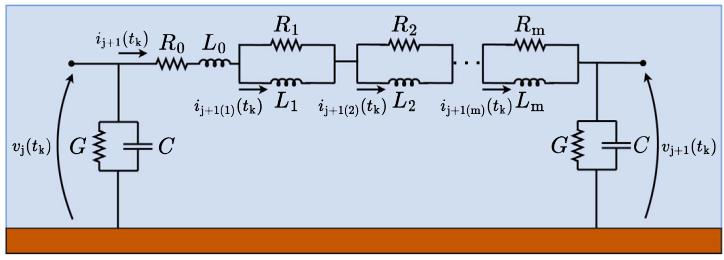  
Fig. 3. The ‘??+1’segment of ??-circuit.

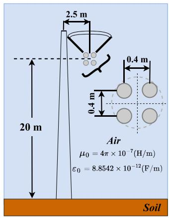  
(a)

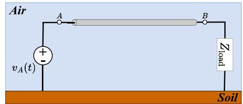

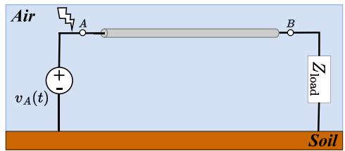  
(b)   
Fig. 4. (a) Configuration of the single-phase TL; (b) disturbances applied at the sending end - (on the top): unit voltage source and - (on the bottom): lightning strike voltage source.

Table 1 PUL longitudinal parameters of the single-phase TL.   

<table><tr><td colspan="2">Resistance (Ω/km)</td><td colspan="2">Inductance (mH/km)</td><td colspan="2">Resistance (Ω/km)</td><td colspan="2">Inductance (mH/km)</td></tr><tr><td>R0</td><td>0.2146×10-3</td><td>L0</td><td>1.1564</td><td>R8</td><td>0.0382</td><td>L8</td><td>0.1339</td></tr><tr><td>R1</td><td>243.3390</td><td>L1</td><td>0.0657</td><td>R9</td><td>0.0104</td><td>L9</td><td>0.1362</td></tr><tr><td>R2</td><td>71.7842</td><td>L2</td><td>0.0849</td><td>R10</td><td>2.9796×10-3</td><td>L10</td><td>0.1417</td></tr><tr><td>R3</td><td>22.3412</td><td>L3</td><td>0.1036</td><td>R11</td><td>0.9044×10-3</td><td>L11</td><td>0.1528</td></tr><tr><td>R4</td><td>6.5628</td><td>L4</td><td>0.1162</td><td>R12</td><td>0.2101×10-3</td><td>L12</td><td>0.1369</td></tr><tr><td>R5</td><td>1.8501</td><td>L5</td><td>0.1236</td><td>R13</td><td>0.0503×10-3</td><td>L13</td><td>0.1232</td></tr><tr><td>R6</td><td>0.5111</td><td>L6</td><td>0.1282</td><td>R14</td><td>0.0188×10-3</td><td>L14</td><td>0.1850</td></tr><tr><td>R7</td><td>0.1394</td><td>L7</td><td>0.1309</td><td>R15</td><td>-7.3936×10-6</td><td>L15</td><td>-0.9800</td></tr></table>

method where the state-space matrix A has a dimension of ??(?? + 2) × ??(?? + 2).

The TL was represented by the 100 ??-circuits in cascade (1 ??/km) adopting $m = 1 5$ branches of ???? for the fitting of the longitudinal impedance $Z _ { \ell } ( \omega )$ using Vector Fitting technique, as depicted in Fig. 5. The values of resistors $R _ { 0 } , R _ { 1 } , \cdots , R _ { \mathrm { m } } ,$ and the inductors $L _ { 0 } , L _ { 1 } , \cdots , L _ { \mathrm { m } }$ for the fitted longitudinal impedance $Z _ { \ell } ( \omega )$ are shown in Table 1.

The numerical results for the single-phase TL of Fig. 4a are organized in the following subsections:

# 4.2. Longitudinal parameters of the single-phase transmission line

The longitudinal parameters of the single-phase TL in Fig. 4a are calculated using the Carson’s approach [27] and the modified Bessel’s functions [28] to consider the ground-return and Skin effects, respectively. These formulations are detailed in Appendix. These approaches provide the distributed longitudinal impedance $Z _ { \ell } ( \omega )$ of the overhead TLs. Later, this longitudinal impedance is approximated by a rational function adjusted by the Vector Fitting method, where the PUL resistance and inductance are determined. Considering that $m = 1 5 ,$ , the

PUL resistance and PUL inductance approximated by the Vector Fitting method are plotted in Fig. 6 (in blue lines). The results are compared with those of the resistance and inductance obtained with distributed parameters, depicted in Fig. 6 (in red lines). According to this figure, the $m = 1 5$ branches of ????-circuit provides good agreement compared with the distributed, showing that these approaches closely follow each other. As depicted in Fig. 6, the PUL resistance increases monotonically above a specific frequency due to the Skin and ground-return effects. Regarding PUL inductance, the opposite behavior occurs where its value decreases for increasing frequency, since the magnetic flux diminishes inside the conductor. The selected number $m = 1 5$ provides an excellent concordance concerning the fitted approach. Then, ?? = 15 is assumed for Vector Fitting method in all time-domain simulations further presented in this work.

# 4.3. Definition time step - ????

In order to investigate the impact of the time step ???? on the transient responses, two types of disturbances are considered: an energization and a lightning strike at the sending ends. First, the energization (switching maneuver) is modeled by the a unit step function used as a voltage source $v _ { \mathrm { A } } ( t )$ connected at the sending end and expressed as follows

$$
v _ {\mathrm {A}} (t) = \left\{ \begin{array}{l l} 1 & \text {p . u . ,} t \geqslant 0 \mathrm {s} \\ 0 & \text {p . u . ,} t <   0 \mathrm {s} \end{array} \right.. \tag {23}
$$

The second, a lightning striking at the sending end is modeled by a voltage source. The lightning is representative of a first return stroke (FRS), being mathematically represented by a sum of Heidler’s functions as follows [29]

$$
v _ {\mathrm {A}} (t) = \sum_ {\mathrm {k} = 1} ^ {p} \frac {V _ {0 \mathrm {k}}}{\eta_ {\mathrm {k}}} \frac {(t / \tau_ {1 \mathrm {k}}) ^ {n _ {\mathrm {k}}}}{1 + (t / \tau_ {1 \mathrm {k}}) ^ {n _ {\mathrm {k}}}} e ^ {- t / \tau_ {2 \mathrm {k}}}; \quad \eta_ {\mathrm {k}} = e ^ {\left[ - \left(\frac {\tau_ {1 \mathrm {k}}}{\tau_ {2 \mathrm {k}}}\right) \left(n _ {\mathrm {k}} \frac {\tau_ {2 \mathrm {k}}}{\tau_ {1 \mathrm {k}}}\right) \right] ^ {1 / n _ {\mathrm {k}}}}, \tag {24}
$$

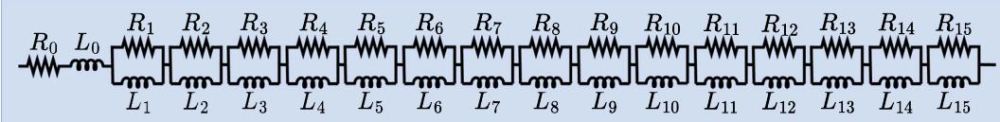  
Fig. 5. Representation of the longitudinal parameters of the TL by means of 15 branches of ???? circuits.

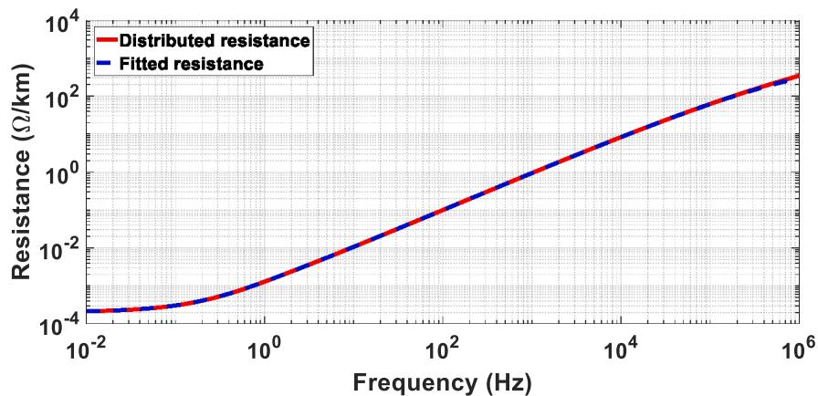  
(a)

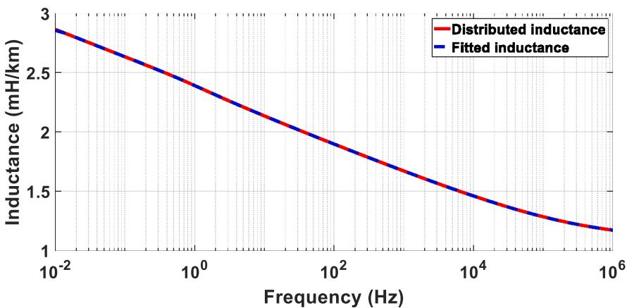  
(b)   
Fig. 6. PUL longitudinal parameters of the single-phase TL fitted for: (a) resistance and (b) inductance.

where $V _ { \mathrm { 0 k } }$ [V] is the peak value of the voltage, $\tau _ { \mathrm { 1 k } }$ [s] is the fronttime constant, $\tau _ { \mathrm { { 2 k } } }$ [s] is the decay-time constant, $n _ { \mathrm { k } }$ is a coefficient related to the waveform steepness, ?? is a peak correction factor, and $p$ is the number of terms. The lightning voltage source is formed by seven sums of Heidler functions $\left( p = 7 \right)$ whose parameters used for the simulations are given in Table 2 and the waveform of the lightning voltage is plotted in Fig. 7 [29]. Further, two calculated parameters $( T _ { 1 0 }$ and $T _ { 3 0 } )$ are also depicted in this table. These two parameters refer to the time difference between an increase from 10% to 90% and an increase from 30% to 90% before the first peak, respectively [30].

To define the time step ???? for the time-domain simulations, the (20) is employed [25]. The graph of ???? as a function of the maximum frequency of the applied disturbance is plotted in Fig. 8. Therefore, the adequate time step ???? must be below the plotted blue line. As seen in this figure, the time step decreases with the increasing frequency. Three values of ???? (marked as red dots $P _ { 1 } , P _ { 2 }$ and $P _ { 3 } )$ in Fig. 8 were selected for the simulations.

The first time step $\Delta t \ ( P _ { 1 } )$ is determined based on the maximum frequency of the applied disturbance (lightning voltage) of the sending end. For this value, the parameter $T _ { 3 0 } = 3$ μs is chosen because it is

Table 2 Parameters of the lightning current [29].   

<table><tr><td>Voltage type</td><td>p</td><td>I0(kV)</td><td>n</td><td>τ1(μs)</td><td>τ2(μs)</td></tr><tr><td>First Return Stroke (FRS)</td><td>1</td><td>6</td><td>2</td><td>3</td><td>76</td></tr><tr><td>(T10=5.20 μs, T30=3.0 μs)</td><td>2</td><td>5</td><td>3</td><td>3.5</td><td>10</td></tr><tr><td></td><td>3</td><td>5</td><td>5</td><td>4.8</td><td>30</td></tr><tr><td></td><td>4</td><td>8</td><td>9</td><td>6</td><td>26</td></tr><tr><td></td><td>5</td><td>16.5</td><td>30</td><td>7</td><td>200</td></tr><tr><td></td><td>6</td><td>17</td><td>2</td><td>70</td><td>200</td></tr><tr><td></td><td>7</td><td>12</td><td>14</td><td>12</td><td>26</td></tr></table>

the shorter front time related associated to the lightning FRS (sum of 7 Heidler’s functions), being smaller than $T _ { 1 0 } = 5 . 2 0$ μs. Then, using the value $T _ { 3 0 }$ as $\tau _ { f }$ in (20), it yields that ???? = 0.3 μs. Than, two other values of ???? were selected: the point $P _ { 2 } = 1 . 0 ~ \mu \mathrm { s } ,$ , which does not satisfy the criterion in (20). The last point $P _ { 3 } = 0 . 1 ~ \mu \mathrm { s }$ , being much low than $P _ { 1 }$ and satisfies (20). For each time step ????, two sets of simulations were carried out:

• The TL in Fig. 4a is energized by a unit step function of 1 p.u., as shown in Fig. 4b;

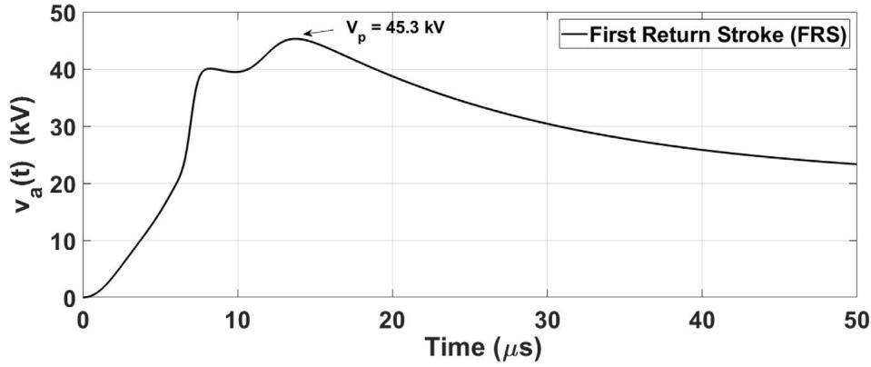  
Fig. 7. Waveform of the first return stroke (FRS).

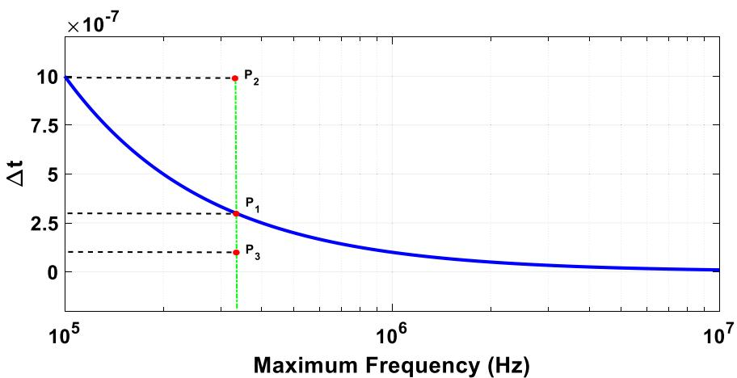  
Fig. 8. Time step as a function of the maximum frequency of the applied disturbance.

• The same TL is subjected to a lightning strike, modeled as the voltage source $v _ { \mathrm { A } } ( t )$ at the sending end, as depicted in Fig. 4b.

The receiving end is left open $( Z _ { \mathrm { l o a d } } \to \infty )$ for these simulations. The generated time-domain responses are calculated using the classical and alternative method. In order to quantify the differences in the time-domain responses, the normalized root-mean-square deviation (NRMSD) ??(%) is calculated and is given by

$$
\lambda (\%) = \frac {1}{\chi} \sqrt {\frac {1}{N _ {\mathrm {P}}} \sum_ {i = 1} ^ {N _ {\mathrm {P}}} \left(V _ {\text {Classical}} - V _ {\text {Alternative}}\right) ^ {2}} \times 100 \%, \tag{25}
$$

where $V _ { \mathrm { C l a s s i c a l } }$ and $V _ { \mathrm { A l t e r n a t i v e } }$ are the transient voltages obtained with the classical and alternative methods, respectively. The $N _ { \mathrm { P } }$ is the total number of values in the time range $( N _ { \mathrm { P } } = 2 0 \mathrm { { , } } 0 0 0 )$ , $\chi = V _ { \mathrm { m a x } } - V _ { \mathrm { m i n } }$ is the difference between the maximum and minimum values of the voltage obtained with classical method. The NRMSD ??(%) calculated for the energization and lightning strike is illustrated in Fig. 9a.

According to this figure, one notes that NRMSD decreases significantly with the decrease of $\varDelta t ,$ due to more points used to compute the transient responses. The time step ???? of 0.1 μs provided the lowest NRMSD in the time-domain simulations. Further, the computational time involved in these computations are organized in Table Table 3. As seen in this table, assuming the same time step $^ { \varDelta t , }$ the classical method has employed greater computation time than that used with the alternative method, being much faster than the former one. Finally, the ratio between the times consumed for the classical over the alternative methods are plotted in Fig. 9b. As indicated by these results, this figure confirms that the alternative method is very faster than the classical one, assuming the same time step. Further, the ratio increases for the

Table 3 Computational time (in sec.) for transient responses in the single-phase TL for different values of ????.   

<table><tr><td></td><td colspan="3">Energization maneuver</td><td colspan="3">Lightning strike</td></tr><tr><td>Δt</td><td>1×10-6</td><td>3×10-7</td><td>1×10-7</td><td>1×10-6</td><td>3×10-7</td><td>1×10-7</td></tr><tr><td>Alternative</td><td>2.20</td><td>6.05</td><td>17.28</td><td>2.25</td><td>6.04</td><td>17.04</td></tr><tr><td>Classical</td><td>485.41</td><td>1,575.44</td><td>5,593.02</td><td>477.14</td><td>1,597.53</td><td>5,633.30</td></tr></table>

decreasing $^ { \varDelta t , }$ as expected because more points are used solving the numerical integration equations. Based on the previous results, in order to have a compromise between the accuracy and computation speed for the disturbances applied in the overhead transmission lines, the value of $\varDelta t = 0 . 3$ μs has provided a small NRMSD is adopted for the rest of the simulations.

# 4.4. Transient responses resulting from an energization

The time-domain simulations are carried out in two scenarios (??):

• $( S _ { 1 } ) \colon$ The single-phase TL in Fig. 4a is subjected to a switching maneuver (line energization) where a unit step voltage source (1 p.u) is applied at the sending end whereas the receiving end is left open circuit $( Z _ { \mathrm { l o a d } } \to \infty )$ in Fig. 4b (on the top);   
• $( S _ { 2 } ) \colon$ The single-phase TL in Fig. 4a is subjected to the same step voltage source at sending end. However, the receiving end is in a short-circuit $( Z _ { \mathrm { l o a d } } = 0 )$ in Fig. 4b (on the top).

For the scenario, $S _ { 1 } ,$ the voltage at the open-receiving end $v _ { \mathrm { B } } ( t )$ is plotted in Fig. 10a (in green line). For the scenario $S _ { 2 } { \mathrm { : } }$ , the current at the

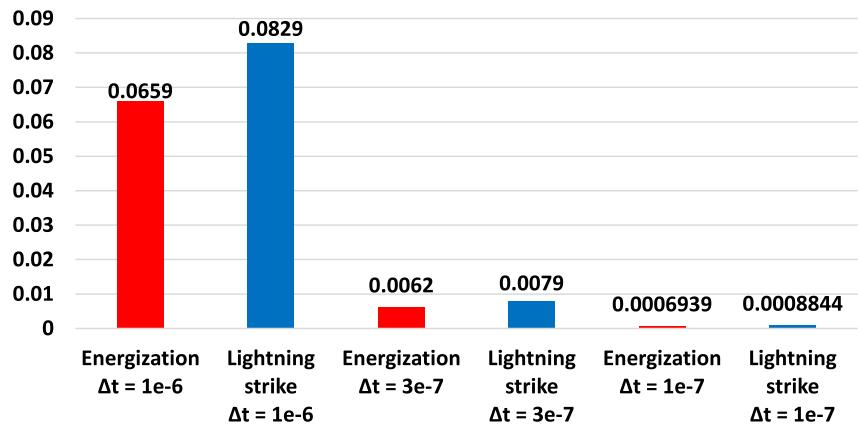  
NRMSD λ(%)   
（a）

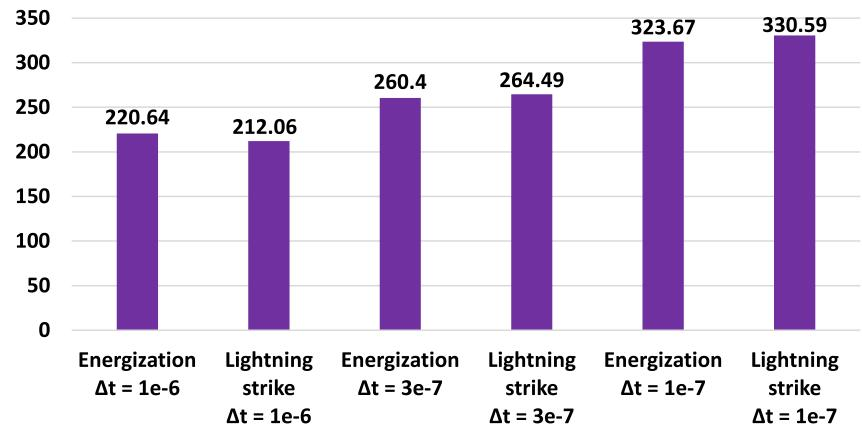  
Ratio   
(b)   
Fig. 9. Performance for different time steps: (a) Calculated NRMSD for the disturbances [energization (red bars) and lightning strike (blue bars)];(b) Ratio between the computation times (classical over alternative methods).

short-circuit receiving end is plotted in 10b (in green line). These figures plot the time-domain responses from the classical method in black lines. These results indicate that the alternative method presents a good agreement with the classical method for the two types of disturbances where both responses closely matched up for all time range. Concerning the propagation of surge waves along a TL, the traveling time is defined as

$$
\tau = \frac {d}{v}, \tag {26}
$$

where ?? is the line length and ?? is the propagation velocity. Assuming that $d = 1 0 0$ km and $c = 3 0 0 ~ \mathrm { m / \mu s }$ (equal to the speed of light), the propagation time ?? ≈ 0.33 ms. One notes that after the traveling time ??, an oscillatory behavior occurs due to the multiple wave reflections traveling between the line terminals during the transient state.

# 4.5. Transient responses resulting from a lightning strike

Following the previous structure, two scenarios (??) are setup concerning the lightning striking at the sending end of the TL, detailed as follows:

• $( S _ { 1 } ) \colon$ The single-phase TL in Fig. 4a is subjected to a lightning strike where a time-domain voltage source $v _ { \mathrm { A } } ( t )$ is applied at the

sending end whereas the receiving end is left open circuit $( Z _ { \mathrm { l o a d } }$ →∞) in Fig. 4b (on the bottom);

• (??2): The single-phase TL in Fig. 4a is subjected to a lightning strike where a time-domain voltage source $v _ { \mathrm { A } } ( t )$ is applied at the sending end. However, the receiving end is in a short-circuit $( Z _ { \mathrm { l o a d } } = 0 )$ in Fig. 4b (on the bottom).

The calculated voltages $v _ { \mathrm { B } } ( t )$ at the receiving end for $S _ { 1 }$ is plotted in Fig. 11a whereas the current $i _ { \mathrm { B } } ( t )$ at the receiving end for $S _ { 2 }$ is plotted in Fig. 11b.

According to these figures, one notes that multiple reflections from the surge waves propagation between the terminals occur during the first time instants of the transient state. Further, the responses obtained with the alternative method (in green lines) have an excellent agreement with those generated with the classical method.

Based on Figs. 10 and 11, one notes that the alternative method can be used to compute the transient responses in TL represented by the ??-circuit cascade with branches of ???? in parallel. As advantages of the alternative method, the dimensions are significantly reduced as shown in Table $^ { 4 , }$ assuming ?? = 15. According to this table, the dimensions of the state-space matrices are notably reduced for the alternative method compared to the classical method, especially the state-space matrix A that has $n ^ { 2 }$ more elements in its setup.

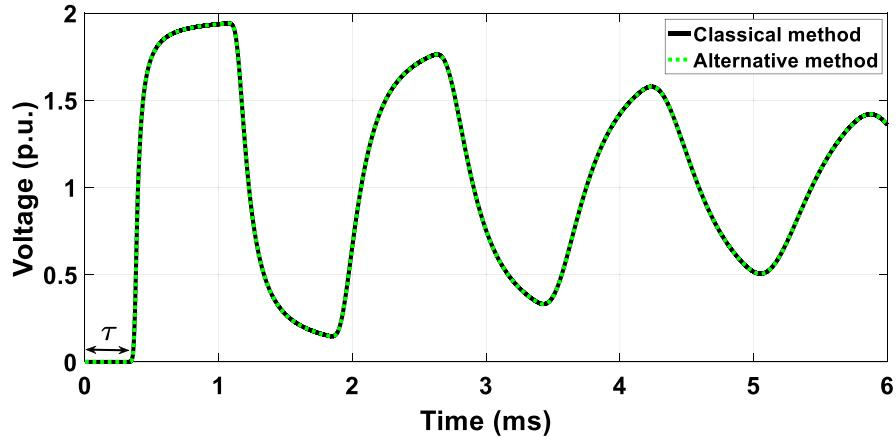

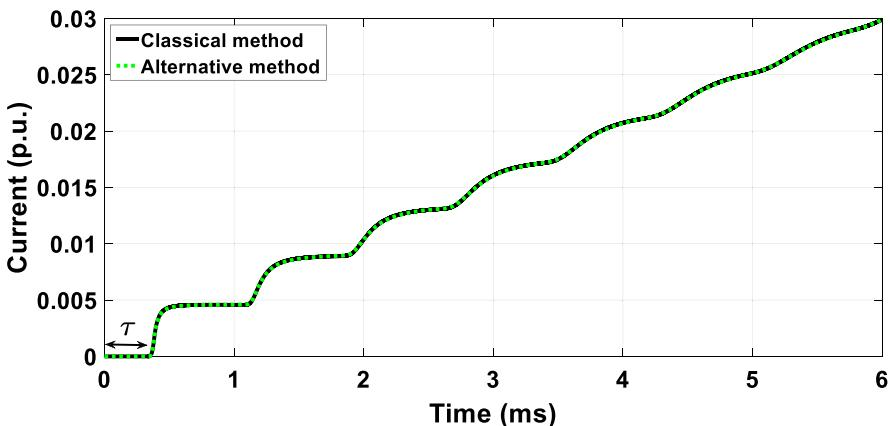  
(a)   
(b)   
Fig. 10. Transient responses for a unit step voltage source at the sending end considering the receiving end in (a) open-circuit and (b) short-circuit.

Table 4 Comparison between the dimensions for each state-space matrix in the classical and alternative methods; Calculated values for ??=100, ??=15.   

<table><tr><td></td><td>Classical method [21]</td><td>Alternative method</td><td>In this paper- Classical method</td><td>In this paper- Alternative method</td></tr><tr><td>A</td><td>n(m+2)×n(m+2)</td><td>(m+2)×(m+2)</td><td>1700 × 1700</td><td>17 × 17</td></tr><tr><td>B</td><td>n(m+2)×1</td><td>(m+2)×2</td><td>1700 × 1</td><td>17 × 2</td></tr><tr><td>x</td><td>n(m+2)×1</td><td>(m+2)×1</td><td>1700 × 1</td><td>17 × 1</td></tr><tr><td>u</td><td>1 × 1</td><td>2 × 1</td><td>1 × 1</td><td>2 × 1</td></tr></table>

Consequently, a smaller number of elements yields a lower computational time to carry out the time-domain simulations. The computational time consumed for each transient response related to the single-phase TL is shown in Table 5. A comparison of the results demonstrates that the alternative method is computationally more efficient than the classical method. As seen, the alternative method requires, on average, 6.05s against 27min used for the classical one. Then, the former method is faster than the latter 260 times (on average). It is worth mentioning that difference in the computational times between the methods increases with the increasing number ?? of ???? branches and the number of ??-circuits in cascade. This alternative method provides faster responses, and it becomes very attractive when multi-phase transmission lines are involved in the transient analysis, reducing its computational burden substantially.

Table 5 Computational time (in sec.) and ratio for transient responses in the single-phase TL.   

<table><tr><td rowspan="2"></td><td colspan="2">Energization maneuver</td><td colspan="2">Lightning strike</td></tr><tr><td>Open-circuit</td><td>Short-circuit</td><td>Open-circuit</td><td>Short-circuit</td></tr><tr><td>Alternative</td><td>6.05</td><td>6.06</td><td>6.04</td><td>6.09</td></tr><tr><td>Classical</td><td>1,575.44</td><td>1,602.54</td><td>1,597.53</td><td>1,785.52</td></tr><tr><td>ratio</td><td>260.40</td><td>264.44</td><td>264.49</td><td>293.18</td></tr></table>

# 5. Validation of the alternative method for a three-phase TL

For the validation of the alternative method, a 440-kV three-phase TL, symmetrical and ideally transposed, with a length of 100 km, is considered. The studied three-phase TL configuration is illustrated in Fig. 12a. Each phase comprises 4 sub-conductors of the type Grosbeak with a radius of 0.01021 m and the soil has a constant resistivity of 1,000 ??.m. Transient responses are simulated for the two presented methods, using the following steps:

Alternative method: The PUL longitudinal parameters are calculated using formulas (28)–(29) in Appendix. The ideally transposed threephase TL is decoupled in its three propagation modes, named as ??, ??, and 0. These modes are interpreted as three decoupled and independent single-phase TLs. For this purpose, a modal decomposition using the Clarke transformation matrix having only real and constant elements, is employed. The resistors and inductors of each propagation mode are fitted using Vector Fitting, and ?? = 15 is adopted. The PUL capacitances are calculated directly from the geometric data of the three-phase

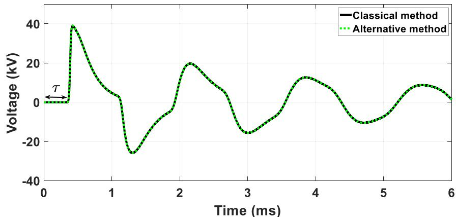  
(a)

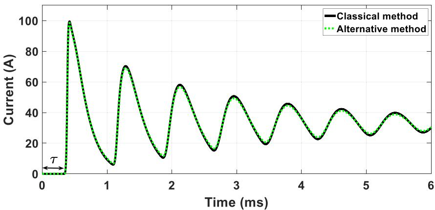  
(b)

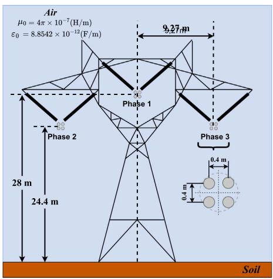  
Fig. 11. Transient responses for a lightning strike at the sending end considering the receiving end in (a) open-circuit and (b) short-circuit.   
(a)

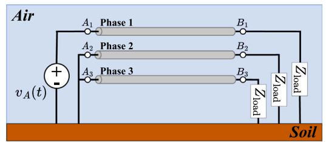

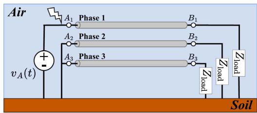  
(b)   
Fig. 12. (a) Configuration of the three-phase TL; (b) disturbances applied at the sending end - (on the top): unit step voltage source and - (on the bottom): lightning strike voltage source.

TL using the (32) in Appendix [28]. Applying the procedure detailed in [31], one obtains the capacitances for each propagation mode, as being $C _ { \alpha , \beta } = 1 3 . 1 3 1$ nF/km and $C _ { 0 } = 6 . 4 4 2 5$ nF/km. Further, the PUL conductance G is neglected for these simulations.

Classical method: The same steps are carried out, but the state-space matrices with larger dimensions are employed in each mode. The modal voltages and currents at the receiving ends of each propagation mode

are obtained by the alternative and classical methods. Then, an inverse Clarke transformation matrix is applied to get the responses in the phase domain directly in time. Each propagation mode of the threephase TL from Fig. 12a is represented by 100 ??-circuits connected in cascade, and 15 branches of ????-circuits in parallel, see Fig. 5. The PUL resistances and inductances fitted for each mode (??, ??, and 0) are shown

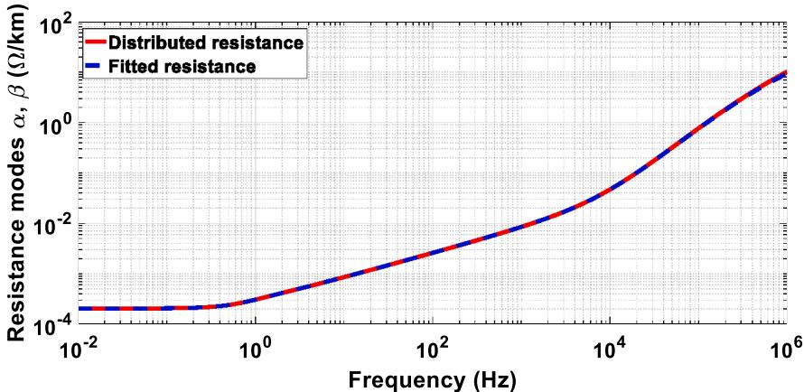

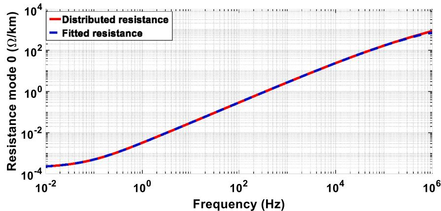  
(b)   
Fig. 13. Resistance fitted for: (a) modes ??, ?? and (b) mode 0.

Table 6 PUL longitudinal parameters ?? and ?? of the three-phase TL.   
in Table 6. The numerical results for the three-phase TL of Fig. 12a are organized in the following subsections:   

<table><tr><td>Resistance modes α,β (Ω/km)</td><td></td><td colspan="2">Inductance modes α,β (10-4H/km)</td><td colspan="2">Resistance mode 0 (Ω/km)</td><td colspan="2">Inductance mode 0 (10-4H/km)</td></tr><tr><td>R0</td><td>2.0481×10-4</td><td>L0</td><td>8.5804</td><td>R0</td><td>2.3441×10-4</td><td>L0</td><td>18.6563</td></tr><tr><td>R1</td><td>15.4990</td><td>L1</td><td>0.0178</td><td>R1</td><td>574.7207</td><td>L1</td><td>1.6347</td></tr><tr><td>R2</td><td>3.5370</td><td>L2</td><td>0.0132</td><td>R2</td><td>181.6143</td><td>L2</td><td>2.2710</td></tr><tr><td>R3</td><td>0.9109</td><td>L3</td><td>0.0095</td><td>R3</td><td>59.3670</td><td>L3</td><td>2.8979</td></tr><tr><td>R4</td><td>0.2006</td><td>L4</td><td>0.0061</td><td>R4</td><td>18.0729</td><td>L4</td><td>3.3350</td></tr><tr><td>R5</td><td>0.0422</td><td>L5</td><td>0.0041</td><td>R5</td><td>52.2761×10-1</td><td>L5</td><td>3.5999</td></tr><tr><td>R6</td><td>0.0121</td><td>L6</td><td>0.0040</td><td>R6</td><td>14.7086×10-1</td><td>L6</td><td>3.7602</td></tr><tr><td>R7</td><td>5.2530×10-3</td><td>L7</td><td>0.0056</td><td>R7</td><td>40.5897×10-2</td><td>L7</td><td>3.8455</td></tr><tr><td>R8</td><td>2.7366×10-3</td><td>L8</td><td>0.0089</td><td>R8</td><td>11.1798×10-2</td><td>L8</td><td>3.9237</td></tr><tr><td>R9</td><td>1.5274×10-3</td><td>L9</td><td>0.0142</td><td>R9</td><td>30.3795×10-3</td><td>L9</td><td>3.9482</td></tr><tr><td>R10</td><td>0.8829×10-3</td><td>L10</td><td>0.0223</td><td>R10</td><td>84.5538×10-3</td><td>L10</td><td>4.0555</td></tr><tr><td>R11</td><td>0.5207×10-3</td><td>L11</td><td>0.0340</td><td>R11</td><td>23.4025×10-3</td><td>L11</td><td>4.0933</td></tr><tr><td>R12</td><td>0.3121×10-3</td><td>L12</td><td>0.0501</td><td>R12</td><td>62.1323×10-4</td><td>L12</td><td>4.0916</td></tr><tr><td>R13</td><td>0.2188×10-3</td><td>L13</td><td>0.0853</td><td>R13</td><td>14.9685×10-4</td><td>L13</td><td>3.6842</td></tr><tr><td>R14</td><td>0.2050×10-3</td><td>L14</td><td>0.2726</td><td>R14</td><td>5.6231×10-4</td><td>L14</td><td>5.5487</td></tr><tr><td>R15</td><td>-0.0160×10-6</td><td>L15</td><td>-4.6337</td><td>R15</td><td>0.2217×10-4</td><td>L15</td><td>-29.5232</td></tr></table>

# 5.1. Longitudinal parameters of the three-phase transmission line

The longitudinal parameters of the three-phase TL in Fig. 12a are calculated from (28)–(30) in Appendix. Assuming an ideally transposed three-phase TL, the longitudinal impedance is decomposed using the Clarke transformation matrix, resulting in modal impedances ??, ??, 0.

Each modal impedance is adjusted using Vector Fitting considering ?? = 15 ???? branches for each mode. The calculated modal resistances are plotted in Fig. 13 (blue line), whereas the modal inductances are plotted in Fig. 14 (blue line). The modal PUL resistance and inductance obtained with the distributed model are plotted in the red line. A comparison of the results indicates that the Vector Fitting (in blue line) presents an excellent convergence with the distributed parameters (in red line). Further, one notes that the PUL resistance and inductance at

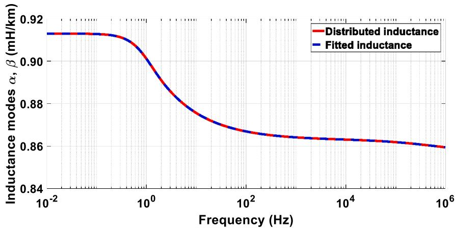  
(a)

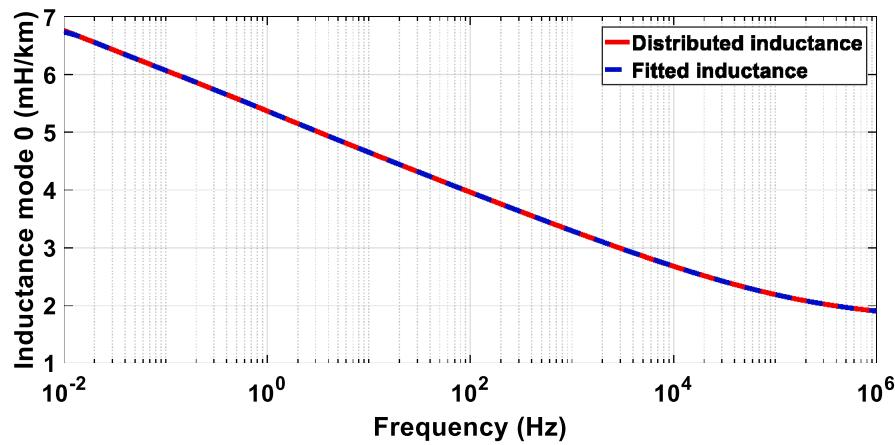  
  
Fig. 14. Inductance fitted for: (a) modes ??, ?? and (b) mode 0.

mode 0 are significantly higher than those calculated in modes ?? and $\beta .$

# 5.2. Transient responses resulting from an energization

The time-domain simulations are carried out in two scenarios (??):

• $( S _ { 1 } )$ : The three-phase TL in Fig. 12a is subjected to a switching maneuver at the sending end of phase 1, whereas the others (2 and 3) are in short-circuit, and the receiving end are left open. $( Z _ { \mathrm { l o a d } }  \infty )$ in Fig. 12b (on the top);   
• $( S _ { 2 } )$ : The sending ends are kept in the same configuration of the $S _ { 1 } ,$ whereas the receiving ends are in short-circuit $( Z _ { \mathrm { l o a d } } = 0 )$ in Fig. 12b (on the top).

The unit-step voltage source models the switching maneuver in (23). The voltage at the receiving end of phase 1 is plotted in Fig. 15a, whereas the voltages at phases 2 and 3 are plotted in Fig. 15b for $S _ { 1 }$ . The transient current generated for $S _ { 2 }$ is plotted in Fig. 16a (phase 1) and in Fig. 16b for phases 2 and 3.

According to these figures, the transient voltages obtained with the alternative method have produced similar responses compared to those generated with the classical method, which confirms the accuracy of the former method. In Fig. 15, after the traveling time ?? of the generated voltages at the receiving end of phase 1 is much higher than the voltage applied at the sending end (1 p.u.), reaching 2 p.u. in the temporal response. Further, the responses produced in phases 2 and 3 are noticeable, and they obey Faraday’s law of induction. These induced voltages occurs due to the time-varying electromagnetic fields where

inductive and capacitive coupling induces voltages at other phases. In Fig. 16, the currents increase (for phase 1) and decrease (phases 2 and 3) by steps related to the reflections from the receiving terminal. It is worth noting that the induced currents are much lower than that calculated for phase 1 for the same time range.

# 5.3. Transient responses resulting from a lightning strike

These simulations are carried out considering the two scenarios (??), detailed as follows:

• (?? ): The three-phase TL in Fig. 12a is subjected to a lightning strike where a time-domain voltage source $v _ { \mathrm { A } } ( t )$ is applied at the sending end (phase 1). The sending ends of phases 2 and 3 are short-circuit whereas all receiving ends are left open $( Z _ { \mathrm { l o a d } } \to \infty )$ 号 in Fig. 12b (on the bottom);   
• $( S _ { 2 } ) \colon$ The three-phase TL in Fig. 12a is subjected to a lightning strike where a time-domain voltage source $v _ { \mathrm { A } } ( t )$ is applied at phase 1 of the sending end whereas the other terminals are in short-circuit $( Z _ { \mathrm { l o a d } } = 0 )$ in Fig. 12b (on the bottom).

The lightning strike is modeled by seven sums of the Heidler function, according to (24). The voltages $v _ { \mathrm { B } } ( t )$ at the receiving ends generated for $S _ { 1 }$ are plotted in Fig. 17. The currents $i _ { \mathrm { B } } ( t )$ at receiving end for $S _ { 2 }$ are plotted in Fig. 18. According to these figures, a comparison of the results demonstrates the good accuracy of the alternative method proposed in relation to the classical method in this work.

The Fig. 17 shows that the transient responses present an oscillatory behavior that attenuates over time due to the losses in this TL. Further,

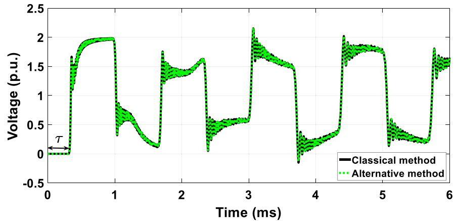  
(a)

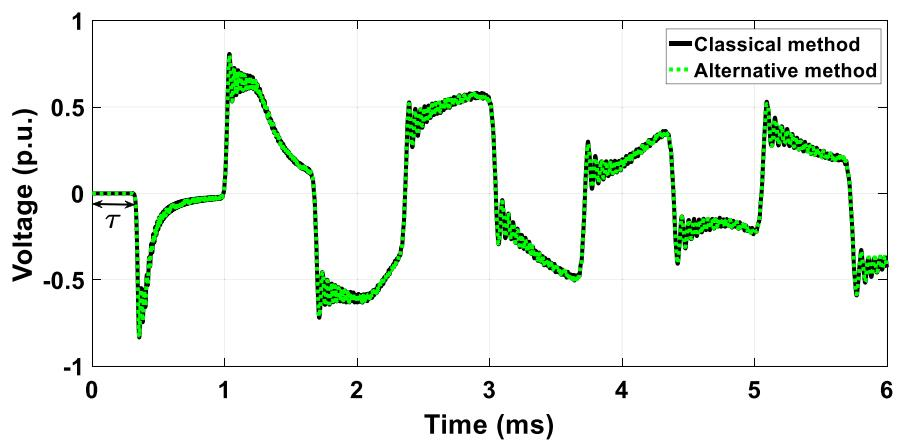  
(b)   
Fig. 15. Transient voltages for a unit step voltage source with an open-circuit receiving end at the phases: (a) 1 and (b) 2 and 3.

the induced voltages due to inductive and capacitive coupling are associated with the time-varying electromagnetic fields. In Fig. 18, the lightning strike generates high current peaks at the receiving end of the struck phase. Additionally, the induced currents at phases 2 and 3 are notable. In that condition, the overcurrent protection devices must disconnect the TL during the short circuits to avoid damage to other components and equipment in substations.

The alternative method used state-space matrices with lower dimensions as shown in Table $^ { 4 , }$ which notably decreases the computational time during assessing the transient responses. Therefore, this reduction in computational time is essential when the transient electromagnetic analysis is carried out in the three-phase TLs. In that case, using the Clarke transmission matrices, three independent single-phase TLs (or propagation mode) are obtained. Then, the transient response must be calculated individually in each mode requiring more computation time.

To quantity, the performance of the alternative method, the computational time consumed for generating the transient responses in Sections 5.2 and 5.3 are organized in Table 7. According to this table, one notes that the alternative method requires around 22?? to assess the transient responses. On the other hand, the classical method requires more than 85 min (in average) to carry out the simulations for the same disturbance, being more than 230 times. This significant computational time is due to big dimensions of the state-space matrix, which are directly dependent on the numbers of ??-circuits (??) and branches ????- circuits (??) as shown in Table 4. Based on these results, the efficiency of the alternative method plays an essential role in the computation of the transient responses generated for any disturbance. Therefore, the frequency-dependent cascaded ??-circuit is an alternative representation

Table 7 Computational time (in sec.) and ratio for the transient responses in the three-phase TL.   

<table><tr><td rowspan="2"></td><td colspan="2">Energization maneuver</td><td colspan="2">Lightning strike</td></tr><tr><td>Open-circuit</td><td>Short-circuit</td><td>Open-circuit</td><td>Short-circuit</td></tr><tr><td>Alternative</td><td>22.03</td><td>21.24</td><td>22.10</td><td>21.53</td></tr><tr><td>Classical</td><td>5,259.59</td><td>5,526.29</td><td>5,432.29</td><td>5,539.57</td></tr><tr><td>ratio</td><td>238.74</td><td>260.18</td><td>245.80</td><td>257.29</td></tr></table>

of the transmission line subjected to disturbance. In this context, faults along any point of the transmission line can be located using the traveling wave technique [32] associated with the frequency-dependent cascaded ??-circuit model and the alternative method that used low computational time.

# 6. Conclusions

The FDLPM model was presented in this work, where several advantages can be obtained from this approach compared with the traditional line models, such as the JMarti model or ULM. The FDLPM can incorporate the frequency dependency on the line’s longitudinal parameters and the nonlinear operating characteristics and time-varying components of the power systems. In this model, the frequency dependence of the longitudinal parameters is considered using branches of ????-circuit adjusted from the Vector Fitting technique for each ??-circuit in cascade. Further, the FDLPM does not involve any frequency-to-time conversion tools, such as the numerical Laplace transform, and can be implemented via any programming code.

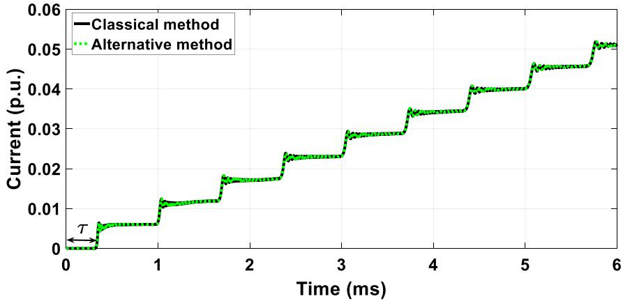  
(a)

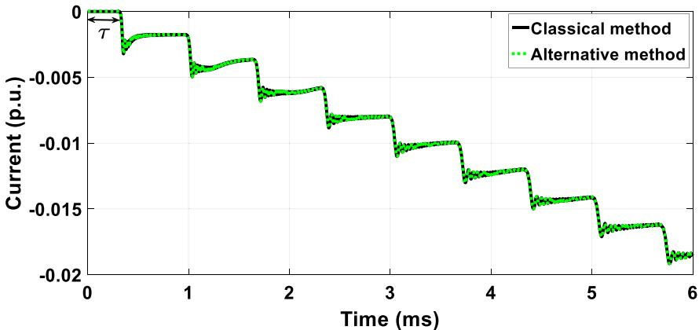  
(b)   
Fig. 16. Transient currents for a unit step voltage source with a short-circuit receiving end at phases: (a) 1 and (b) 2 and 3.

An efficient alternative method for the FDLPM was investigated in this paper. This method was analyzed regarding the computation of the transient responses on multi-phase transmission lines when subjected to energization maneuver and lightning strike. This method solves a system of state-space equations individually for each ??-circuit for time instant, which results in state-space matrices of smaller dimensions compared with the classical method used in the literature. Further, no techniques to reduce the sparsity of the matrices were used in this work, but they could be used for future analysis. Results have demonstrated an excellent agreement for the responses obtained with the alternative method associated with a notable reduction in the computational burden for the simulations in all scenarios analyzed for single- and three-phase transmission lines. The adequate time step was set based on the proposed equation of CIGRE, being equal to 0.3 μs. Further, the other two values of the time step (0.1 and 1.0 μs) were selected to compare the methods. The deviation NMSR is computed for three different time steps where the lowest deviation was found for 0.1 μs. On the order hand, the value of 0.3 μs has provided a good compromise between accuracy and computation speed. Considering a fixed time step of 0.3 μs, results indicated that in both techniques, the alternative method is much faster, having a computation time of around 230 to 300 times lower than that used for the classical approach.

As the main contributions of this work, the alternative method combines faster computation velocity requiring no numerical Laplace transforms since the simulations are performed directly in the time domain. This higher computation speed is an interesting factor because the FDLPM can compute the transient response involving nonlinear and time-varying components of the power systems under disturbances.

# CRediT authorship contribution statement

Tainá F.G. Pascoalato: Conception and design of study, Acquisition of data, Analysis and/or interpretation of data, Writing – original draft, Writing – review & editing. Anderson R.J. de Araújo: Conception and design of study, Acquisition of data, Analysis and/or interpretation of data, Writing – original draft, Writing – review & editing. Sérgio Kurokawa: Conception and design of study, Acquisition of data, Analysis and/or interpretation of data, Writing – original draft, Writing – review & editing. José Pissolato Filho: Conception and design of study, Acquisition of data, Analysis and/or interpretation of data, Writing – original draft, Writing – review & editing.

# Declaration of competing interest

The authors declare that they have no known competing financial interests or personal relationships that could have appeared to influence the work reported in this paper.

# Data availability

Data will be made available on request.

# Acknowledgments

All authors approved the version of the manuscript to be published.

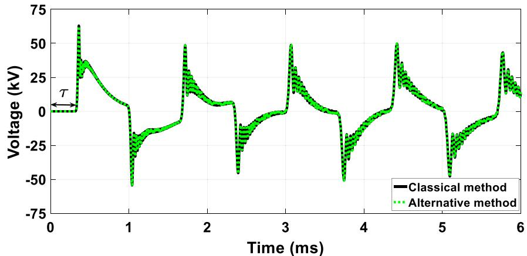  
(a)

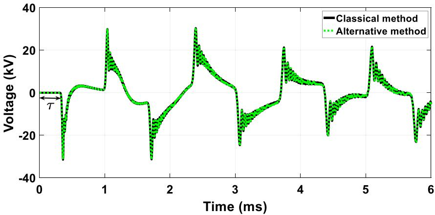  
(b)   
Fig. 17. Transient voltages for a lightning strike with an open-circuit receiving end at the phases: (a) 1 and (b) 2 and 3.

# Appendix. Transmission line parameters

# A.1. Longitudinal impedance $Z _ { \ell }$

The longitudinal impedance $\mathbf { Z } _ { \ell } ( \omega )$ of a ??-phase TL is given by [28]

$$
\mathbf {Z} _ {\ell} (\omega) = \mathbf {Z} _ {\text {i n t}} (\omega) + \mathbf {Z} _ {\text {e x t}} (\omega) + \mathbf {Z} _ {\mathrm {g}} (\omega), \tag {27}
$$

being its dimension of ?? × ??. Each term is defined as follows:

# A.1.1. Internal impedance $Z _ { i n t }$

The internal impedance is given by [33]

$$
Z _ {\mathrm {i n t} _ {\mathrm {i i}}} (\omega) = - \frac {\sqrt {j \omega \mu_ {\mathrm {c}} \sigma_ {\mathrm {c}} ^ {- 1}}}{2 \pi r} \frac {\mathcal {J} _ {0} \left(\sqrt {j \omega \mu_ {\mathrm {c}} \sigma_ {\mathrm {c}}} r\right)}{\mathcal {J} _ {1} \left(\sqrt {j \omega \mu_ {\mathrm {c}} \sigma_ {\mathrm {c}}} r\right)}, \tag {28}
$$

where $\omega = 2 \pi f$ [rad/s] is the angular frequency, ?? [Hz] is the frequency, $\mu _ { \mathrm { c } } = \mu _ { \mathrm { r } } \mu$ [H/m] is the absolute permeability of the conductor, where $\mu _ { \mathrm { r } } ~ = ~ 1$ for metallic conductors and $\mu _ { 0 }$ is the permeability of free space $\mu _ { 0 } = 4 \pi \times 1 0 ^ { - 7 } \ [ \mathrm { H / m } ] , \sigma _ { \mathrm { c } } \ [ \mathrm { S / m } ]$ is the conductivity of the conductor, ?? [m] is the radius of the conductor and $\mathcal { I } _ { 0 }$ and $\mathcal { I } _ { 1 }$ represent the modified Bessel functions of the first type of orders zero and one, respectively.

# A.1.2. External impedance $Z _ { e x t }$

The external impedance is given by [28]

$$
Z _ {\text {e x t} _ {\mathrm {i j}}} (\omega) = j \omega \frac {\mu_ {0}}{2 \pi} \ln \left(\frac {D _ {\mathrm {i j} ^ {\prime}}}{d _ {\mathrm {i j}}}\right), \tag {29}
$$

where $d _ { \mathrm { i j } }$ [m] is the distance between conductors ?? and ?? and $D _ { \mathrm { i j } } , _ { }$ [m] is the distance between conductors ?? and $j ^ { \prime }$ (image of ??).

# A.1.3. Ground-return impedance $Z _ { g }$

The ground-return impedance is given by [27]

$$
Z _ {\mathrm {g} _ {\mathrm {i j}}} (\omega) = j \frac {\omega \mu_ {0}}{\pi} \int_ {0} ^ {\infty} \frac {e ^ {- (h _ {\mathrm {i}} + h _ {\mathrm {j}}) \lambda}}{\sqrt {\lambda^ {2} + j \omega \mu_ {0} \sigma_ {\mathrm {g}}} + \lambda} \cos \left(r _ {\mathrm {i j}} \lambda\right) d \lambda , \tag {30}
$$

where $h _ { \mathrm { i } }$ and $h _ { \mathrm { j } }$ [m] are the heights of the conductors ?? and ?? relative to the ground, respectively. The $\sigma _ { \mathbf { g } }$ [S/m] is the conductivity of the ground, $r _ { \mathrm { i j } }$ [m] is the horizontal distance between the ?? and ?? and ?? is the integration variable.

# A.2. Transversal admittance ??t

The transversal admittance ${ \bf Y } _ { \mathrm { t } } ( \omega )$ of a multi-phase ${ \mathrm { T L } } ,$ neglecting the ground-return effect, is given by [28]

$$
\mathbf {Y} _ {\mathrm {t}} (\omega) = \mathbf {G} + j \omega \mathbf {C} \tag {31}
$$

where the PUL conductance (G) ≈ 0 and the PUL capacitance (C) is given by [28]

$$
C _ {\mathrm {i j}} = 2 \pi \varepsilon_ {0} \left[ \ln \left(\frac {D _ {\mathrm {i j} ^ {\prime}}}{d _ {\mathrm {i j}}}\right) \right] ^ {- 1}, \tag {32}
$$

where, $\varepsilon _ { 0 }$ is the vacuum permittivity $\varepsilon _ { 0 } = 8 . 8 5 \times 1 0 ^ { - 1 2 } \ [ \mathrm { F / m } ]$ .

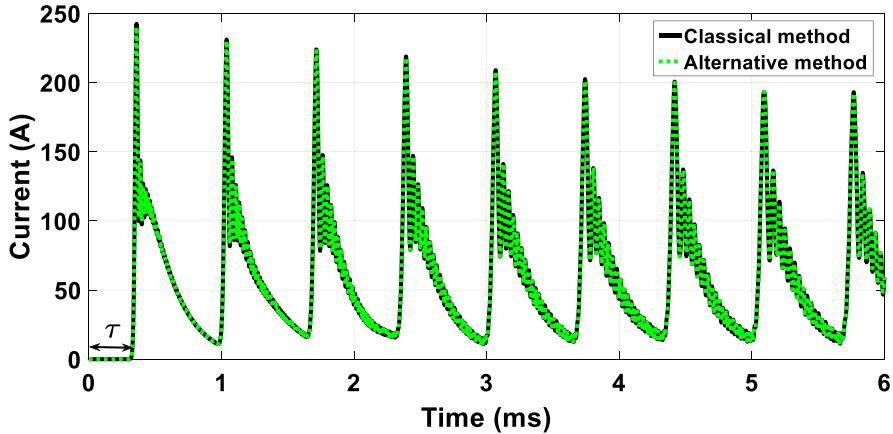  
(a)

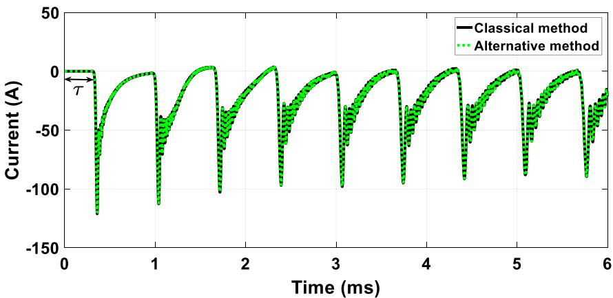  
(b)   
Fig. 18. Transient currents for a lightning strike with a short-circuit receiving end at the phases: (a) 1 and (b) 2 and 3.

# References

[1] Mamis M. Computation of electromagnetic transients on transmission lines with nonlinear components. IEE Proc, Gener Transm Distrib 2003;150(2):200–4.   
[2] Ramírez A, Naredo J, Moreno P, Guardado L. Electromagnetic transients in overhead lines considering frequency dependence and corona effect via the method of characteristics. J Electr Power Energy Syst 2001;23(3):179–88.   
[3] Abur A, Ozgun O, Magnago FH. Accurate modeling and simulation of transmission line transients using frequency dependent modal transformations. In: 2001 IEEE power engineering society winter meeting. conference proceedings (Cat. No. 01CH37194), vol. 3. IEEE; 2001, p. 1443–8.   
[4] Marti JR. Accurate modelling of frequency-dependent transmission lines in electromagnetic transient simulations. IEEE Trans Power Appar Syst 1982;(1):147–57.   
[5] Gustavsen B, Semlyen A. Rational approximation of frequency domain responses by vector fitting. IEEE Trans Power Deliv 1999;14(3):1052–61.   
[6] Zanon FO, Leal OE, De Conti A. Implementation of the universal line model in the alternative transients program. Electr Power Syst Res 2021;197:107311.   
[7] Colqui JSL, Araujo ARJ, Pascoalato TFG, Kurokawa S. Transient analysis of overhead transmission lines based on fitting methods. In: 2021 14th IEEE international conference on industry applications. 2021, p. 180–7.   
[8] Bañuelos-Cabral ES, Gutiérrez-Robles JA, Gustavsen B. Rational fitting techniques for the modeling of electric power components and systems using MATLAB environment. In: Rational fitting techniques for the modeling of electric power components and systems using MATLAB environment. IntechOpen; 2017.   
[9] Bañuelos-Cabral E, Gutiérrez-Robles J, García-Sánchez J, Sotelo-Castañón J, Galván-Sánchez V. Accuracy enhancement of the JMarti model by using real poles through vector fitting. Electr Eng 2019;101:635–46.   
[10] Moreno P, Ramirez A. Implementation of the numerical Laplace transform: A review task force on frequency domain methods for EMT studies, working group on modeling and analysis of system transients using digital simulation, general systems subcommittee, IEEE power engineering society. IEEE Trans Power Deliv 2008;23(4):2599–609.

[11] Castañón L, Naredo J, Zuluaga J, Bañuelos-Cabral E, Gómez P. Laplace transform inversion through the theta algorithm for power-system EMT analysis. Electr Power Syst Res 2021;197:107342.   
[12] Marti L. Simulation of transients in underground cables with frequencydependent modal transformation matrices. IEEE Trans Power Appar Syst 1988;PAS-102 (11):3582–9.   
[13] Macias JR, Exposito AG, Soler AB. A comparison of techniques for statespace transient analysis of transmission lines. IEEE Trans Power Deliv 2005;20(2):894–903.   
[14] Chrysochos AI, Tsolaridis GP, Papadopoulos TA, Papagiannis GK. Damping of oscillations related to lumped-parameter transmission line modeling. In: Conf. on power systems transients. 2015, p. 1–7.   
[15] Caballero PT, Costa ECM, Kurokawa S. Frequency-dependent line model in the time domain for simulation of fast and impulsive transients. Int J Electr Power Energy Syst 2016;80:179–89.   
[16] Araújo AR, Kurokawa S, Shinoda AA, Costa EC. Mitigation of erroneous oscillations in electromagnetic transient simulations using analogue filter theory. IET Sci Meas Technol 2017;11(1):41–8.   
[17] Dommel HW. Digital computer solution of electromagnetic transients in singleand multiphase networks. IEEE Trans Power Appar Syst 1969;PAS-88(4):388–99.   
[18] Colqui JSL, de Araújo ARJ, Kurokawa S, Filho JP. Optimization of lumped parameter models to mitigate numerical oscillations in the transient responses of short transmission lines. Energies 2021;14(20).   
[19] Faria A, Washington L, Antônio C. Modelos de linhas de transmissão no domínio das fases: estado da arte. In: Congresso Brasileiro De Automática, vol. 14. 2002, p. 801–6.   
[20] Tavares MC, Pissolato Filho J, Portela CM. Quasi-modes multiphase transmission line model. Electr Power Syst Res 1999;49(3):159–67.   
[21] Kurokawa S, Yamanaka FN, Prado AJ, Pissolato J. Inclusion of the frequency effect in the lumped parameters transmission line model: State space formulation. Electr Power Syst Res 2009;79(7):1155–63.   
[22] Fernandes JP, Caballero PT, Kurokawa S. Análise da eficiência de um método alternativo de integração das equações diferenciais ordinárias de linhas de transmissão. In: Simpósio Brasileiro de Sistemas Elétricos, vol. 8. 2020.

[23] Sarto M, Scarlatti A, Holloway C. On the use of fitting models for the timedomain analysis of problems with frequency-dependent parameters. In: 2001 IEEE EMC International symposium. symposium record. international symposium on electromagnetic compatibility (Cat. No. 01CH37161), vol. 1. IEEE; 2001, p. 588–93.   
[24] Lima AC, Fernandes AB, Carneiro S. Rational approximation of frequency domain responses in the s and z planes. In: IEEE power engineering society general meeting, 2005. IEEE; 2005, p. 126–31.   
[25] Working Group CIGRE 0233. Guidelines for representation of network elements when calculating transients. 1990, CIGRE Technical Brochure.   
[26] Nelms R, Sheble G, Newton SR, Grigsby L. Using a personal computer to teach power system transients. IEEE Trans Power Syst 1989;4(3):1293–4.   
[27] Carson JR. Wave propagation in overhead wires with ground return. Bell Syst Tech J 1926;5(4):539–54.   
[28] Martinez-Velasco JA. Power System Transients: Parameter Determination. Flórida, U.S.A.: CRC Press; 2009, p. 644.

[29] Oliveira AJ, Schroeder MAO, Moura RAR, Correia de Barros MT, Lima AC. Adjustment of current waveform parameters for first lightning strokes: Representation by heidler functions. In: 2017 International Symposium on Lightning Protection. 2017, p. 121–6.   
[30] De Conti A, Visacro S. Analytical representation of single- and doublepeaked lightning current waveforms. IEEE Trans Electromagn Compat 2007;49(2):448–51.   
[31] de Araujo ARJ, da Silva RC, Kurokawa S. Using universal line model (ULM) for simulating electromagnetic transients in three-phase transmission lines. IEEE Lat Am Trans 2014;12(2):190–6.   
[32] Sawai S, Pradhan AK. Travelling-wave-based protection of transmission line using single-end data. IET Gener Transm Distribution 2019;13(20):4659–66.   
[33] Dommel HW. Overhead line parameters from handbook formulas and computer programs. IEEE Trans Power Appar Syst 1985;PAS-104(2):366–72.