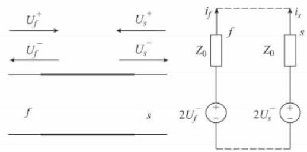
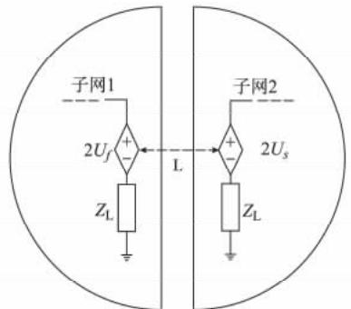
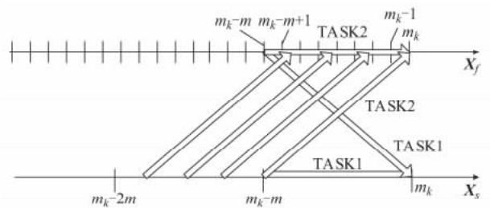
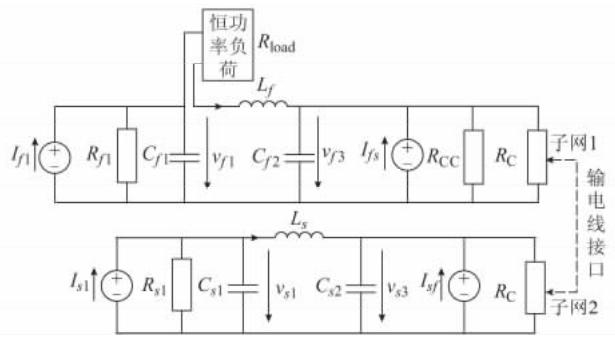
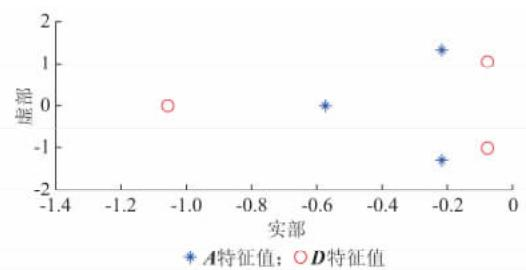
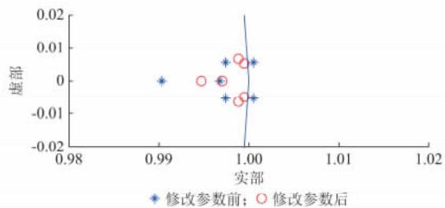
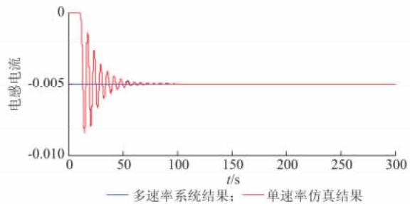

# 基于传输线分网的并行多速率电磁暂态仿真算法1 1 1 2 1

穆 清 ， 李亚楼 ， 周孝信 ， 赵 鹏 ， 张 星

（ 中国电力科学研究院 北京市 ； 国网辽宁省电力有限公司 辽宁省沈阳市 ）

摘要 ： 研究基于传输线的并行全隐式多速率电磁暂态仿真算法 建立全隐式多速率电磁暂态仿真的基本理论模型 并结合传输线方程 建立了并行化多速率电磁暂态仿真算法 此算法并行化程度高于现有全隐式多速率算法 计算效率得到提升 同时提出了保证基于传输线的并行多速率算法稳定性的网络判据 并通过数学理论证明了判据的有效性 仿真研究表明 基于传输线的并行全隐式多速率电磁暂态仿真可能不稳定 采用了文中提出的稳定判据对分网进行调整后 仿真稳定

关键词 ： 电磁暂态仿真； 多速率； 传输线分网； 并行化仿真； 稳定判据

# 0 引言

随 着 电 压 源 型 换 流 器 （VSC）直流输电系统和柔性交流输电系统（ ）装置的广泛应用 电力系统的规划和运行已不能简化或忽略 等电力电子设备的暂态运－行特性［ ］ 这就对现有电网分析仿真工具提出了挑 战 。

机电暂态仿真主要仿真大规模电力系统 它采用准稳态模型和稳态模型模拟电力电子设备 并不精确 通过采用较小的仿真步长 电磁暂态仿真程序能模拟电力电子换流器的开关动作 结果较准确但是对大规模电力系统都使用小步长的电磁暂态仿－ VSC真 效率很低［ ］

多速率仿真是对系统的不同部分采用不同仿真步长进行仿真 对于含 的大规模电力系统 ，多速率仿真可以把网络划分为含 的子网和外部网络 采用不同的仿真步长进行仿真 仿真效率明显提升 由此可知 多速率仿真可以解决含电力电子Gear换流器的大规模电力系统仿真的挑战 将成为仿真－的发展方向之一［ ］

现有的多速率仿真算法由 等学者提出它把整个系统按照状态变量的不同时间常数划分为－不同集合 采用不同的步长进行积分［ ］ 现有的Gear多速率仿真方法已经在航空领域得到了应用

电气网络属于强耦合系统 不同子系统之间存在紧密的电压电流约束 并不能直接使用 提出的多速率仿真算法 现有的快速优先算法和慢速优

先算法使用了外插法进行不同步长的同步 降低了仿真的精度和稳定性［ ， ］ 松弛变量法的多速率仿12真通过迭代严格地满足电压电流约束 但是仿真效13率低 不能并行［ ］ 基于全隐式积分的多端口戴维南等值算法的串行流程也使仿真效率不理想［ ］14

同时 多速率仿真算法的稳定性比全隐式单步仿真算法差 在频繁扰动的系统中容易出现失稳的现象 文献［ ］提出了基于戴维南等值电路的数模混合仿真判据 揭示了多速率仿真系统在电路仿真中存在稳定性问题

本文详细研究了多速率电磁暂态仿真的并行化和稳定性 首先提出了基于传输线分网的并行多速率电磁暂态仿真算法 此算法基于全隐式积分和内插值，并利用传输线分网实现了算法的并行化 ，提升了仿真效率 同时 为了算法的稳定性 本文利用范数原理提出了保守的多速率仿真系统稳定判据 最后 使用仿真算例证明了判据的有效性

# 1 全隐式内插值多速率仿真基本模型

基于内插值的全隐式多速率积分在稳定性和误差控制上具有良好的性能 基本算法如下

假设整个系统被分为两个部分 小仿真步长系15统的状态变量是 $X _ { f }$ ，大步长系统的状态变量是 X采用后退欧拉法［ ］ 进行离散化 得到如式（ ） 的系＋统方程

$$
\left\{ \begin{array}{l} \boldsymbol {X} _ {s} \left(m _ {k}\right) - \boldsymbol {X} _ {s} \left(m _ {k} - m\right) = \\ \quad m h \left(\boldsymbol {A} \boldsymbol {X} _ {s} \left(m _ {k}\right) + \boldsymbol {B} \boldsymbol {X} _ {f} \left(m _ {k}\right)\right) \\ \boldsymbol {X} _ {f} \left(m _ {k}\right) - \boldsymbol {X} _ {f} \left(m _ {k} - 1\right) = \\ \quad h \left(\boldsymbol {C} \boldsymbol {X} _ {s} \left(m _ {k}\right) + \boldsymbol {D} \boldsymbol {X} _ {f} \left(m _ {k}\right)\right) \\ \quad \vdots \\ \boldsymbol {X} _ {f} \left(m _ {k} - m + 1\right) - \boldsymbol {X} _ {f} \left(m _ {k} - m\right) = \\ \quad h \left(\boldsymbol {C} \boldsymbol {X} _ {s} \left(m _ {k} - m + 1\right) + \boldsymbol {D} \boldsymbol {X} _ {f} \left(m _ {k} - m + 1\right)\right) \end{array} \right. \tag {1}
$$

式中 $\colon m _ { k }$ 为仿真时刻 $\vdots h$ 为仿真步长 $\bullet m$ 为仿真步长的大小比；A B C D 为原始系统的状态空间表示的系数矩阵

由于在多速率仿真中 大步长系统 X 按照 mh的仿真步长进行积分 ， ${ \pmb X } _ { s } \left( m _ { k } - m + 1 \right) , { \pmb X } _ { s } \left( m _ { k } - m ^ { - } \right)$ 十$2 ) , \cdots , X _ { s } \left( m _ { k } - 1 \right)$ 未知 引入内插估计值 $\hat { \boldsymbol X } _ { s }$ 代替$X _ { s }$ ，如式(2)所示[15]。

$$
\hat {\boldsymbol {X}} _ {s} \left(m _ {k} + i\right) = \boldsymbol {X} _ {s} \left(m _ {k}\right) + \frac {\boldsymbol {X} _ {s} \left(m _ {k} + m\right) - \boldsymbol {X} _ {s} \left(m _ {k}\right)}{m} i \tag {2}
$$

观察 式 （ ） 的 系 统 可 以 发 现 ： $\pmb { X } _ { s } \ ( \ m _ { k } \ )$ 与$\pmb { X } _ { f } \left( m _ { k } \right)$ 相互耦合，无法递推求解，必须联合求解整个系统方程 内插值的全隐式多速率仿真积分无法简单并行计算，计算效率低。

# 2 基于传输线分网的并行多速率仿真算法

由于内插值的全隐式多速率仿真积分无法解耦计算 本文提出引入传输线模型进行网络分解 实现并行积分 在不影响内插值的全隐式多速率算法精度的基础上，传输线模型的自然延迟可以实现不同仿真步长子系统之间并行计算 提升效率

传输线 的网络双端口电路可以等效为如图所示的等效戴维南电路

  
图1 传输线等效戴维南电路  
Fig．1 Theveninequivalentcircuitoftransmissionline

图 中 $\colon s$ 和 f 表示传输线连接的大步长和小步长子系统的端口； $U _ { f } ^ { - }$ 和 U 表示从对端反射而来的反射波 $\phantom { } \cdot U _ { s } ^ { + }$ 和 $U _ { f } ^ { + }$ 表示从本端入射的入射波$Z _ { 0 }$ 表示传输线特征阻抗 $; i _ { s }$ 和 $i _ { f }$ 表示流过戴维南等值电路的电流 传输线端口戴维南等值电路的信号传递关系为［ ］

$$
\left\{ \begin{array}{l} U _ {f} ^ {-} (n + 1) = U _ {s} ^ {+} (n) = 0. 5 \left(2 U _ {s} ^ {-} (n) + 2 i _ {s} (n) Z _ {0}\right) \\ U _ {s} ^ {-} (n + 1) = U _ {f} ^ {+} (n) = 0. 5 \left(2 U _ {f} ^ {-} (n) + 2 i _ {f} (n) Z _ {0}\right) \end{array} \right. \tag {3}
$$

当原网络的不同仿真步长网络之间由传输线

相连时 可以通过传输线把网络自然地划分为子网 和子网 传输线端口在子网 中等值为U 等值电路 在子网 中等值为 $U _ { s }$ 等值电路 见图

  
图2 传输线分网的多速率实例系统  
Fig．2 Samplesystemofnetworkdivisionof transmissionline

假设 ：输电线的延迟为一个大仿真步长 当系统的传输线过长时 可以采用分割法 截取一段与仿真步长延时相等的传输线作为接口 其他并入子网中 。

子网 和子网 联合传输线接口的戴维南等值电路建立状态空间的状态方程分别如式（ ）和式（ ）4所 示 。

$$
\left\{ \begin{array}{l} \boldsymbol {X} _ {f} ^ {\prime} = \boldsymbol {A} _ {f} \boldsymbol {X} _ {f} + \left[ \begin{array}{l l} \boldsymbol {B} _ {f \text {i n t}} & \boldsymbol {B} _ {f \mathrm {T}} \end{array} \right] \left[ \begin{array}{l l} \boldsymbol {U} _ {f \text {i n t}} & \boldsymbol {U} _ {f} ^ {-} \end{array} \right] ^ {\mathrm {T}} \\ \boldsymbol {U} _ {f \mathrm {o}} ^ {-} = \boldsymbol {C} _ {f} \boldsymbol {X} _ {f} \end{array} \right. \tag {4}
$$

$$
\left\{ \begin{array}{l} \boldsymbol {X} _ {s} ^ {\prime} = \boldsymbol {A} _ {s} \boldsymbol {X} _ {s} + \left[ \begin{array}{l l} \boldsymbol {B} _ {\text {s i n t}} & \boldsymbol {B} _ {s \mathrm {T}} \end{array} \right] \left[ \begin{array}{l l} \boldsymbol {U} _ {\text {s i n t}} & \boldsymbol {U} _ {s} ^ {-} \end{array} \right] ^ {\mathrm {T}} \\ \boldsymbol {U} _ {\mathrm {s o}} ^ {-} = \boldsymbol {C} _ {s} \boldsymbol {X} _ {s} \end{array} \right. \tag {5}
$$

式中 $X _ { f }$ 为子网 中的状态变量 ${ \mathbf { \partial } } : U _ { f } ^ { - }$ 为子网 中的传输线接口的戴维南等值电压源 $U _ { f \mathrm { o } } ^ { - }$ 为子网1的接口电压 $\mathbf { \Omega } _ { \mathrm { { ; } } } U _ { \mathrm { { \it f i n t } } }$ 为子网 内部的注入电源 $\mathbf { \sigma } _ { \mathbf { \{ } }  \mathbf { A } _ { f } \circ \mathbf { B } _ { f \mathrm { i n t } }$ 和$\mathbf { B } _ { f \mathrm { T } }$ 为子网1自身的状态空间表示的参数矩阵;X为子网 中的状态变量 $; U _ { s } ^ { - }$ 为子网 中的传输线接口的戴维南等值电压源； $U _ { s \mathrm { o } } ^ { - }$ 为子网 的接口电压 ${ \bf { \sigma } } _ { \mathrm { { { \sigma } } } } U _ { \mathrm { { { \it s i n t } } } }$ 为子网 内部的注入电源 $A _ { s } \ : , B _ { \mathrm { s i n t } }$ 和 $\pmb { B } _ { \mathrm { s T } }$ 为子网 自身的状态空间表示的参数矩阵

式（ ）和式（ ）虽然忽略了电压的相互耦合 仍适用于大多数的网络方程 对于研究多速率仿真算法的稳定性有一定代表性 同时 能简化方程推导

考虑了传输线方程的自然延迟特性 得到接口6的信号传递方程 如式（ ）所示

$$
\left\{ \begin{array}{l} \mathbf {U} _ {s} ^ {-} (n + 1) = \mathbf {U} _ {f o} ^ {-} (n) = \mathbf {C} _ {f} \mathbf {X} _ {f} (n) \\ \mathbf {U} _ {f} ^ {-} (n + 1) = \mathbf {U} _ {s o} ^ {-} (n) = \mathbf {C} _ {s} \mathbf {X} _ {s} (n) \end{array} \right. \tag {6}
$$

式（ ） 和式（ ） 离散化 并联合式 （ ） 整理得到式（ ）的系统方程 ：

$$
\left\{ \begin{array}{l} \boldsymbol {X} _ {s} \left(m _ {k}\right) = \left(\boldsymbol {I} - m h \boldsymbol {A} _ {s}\right) ^ {- 1} \boldsymbol {X} _ {s} \left(m _ {k} - m\right) + \\ \quad \left(\boldsymbol {I} - m h \boldsymbol {A} _ {s}\right) ^ {- 1} m h \boldsymbol {B} _ {s T} \boldsymbol {C} _ {f} \boldsymbol {X} _ {f} \left(m _ {k} - m\right) + \\ f _ {s} \left(\boldsymbol {U} _ {\text {s i n t}}, \boldsymbol {U} _ {\text {f i n t}}\right) \\ \boldsymbol {X} _ {f} \left(m _ {k}\right) = \left(\boldsymbol {I} - h \boldsymbol {A} _ {f}\right) ^ {- 1} \boldsymbol {X} _ {f} \left(m _ {k} - 1\right) + \\ \quad \left(\boldsymbol {I} - h \boldsymbol {A} _ {f}\right) ^ {- 1} h \boldsymbol {B} _ {f T} \boldsymbol {C} _ {s} \boldsymbol {X} _ {s} \left(m _ {k} - m\right) + \\ f _ {f} \left(\boldsymbol {U} _ {\text {s i n t}}, \boldsymbol {U} _ {\text {f i n t}}\right) \\ \vdots \\ \boldsymbol {X} _ {f} \left(m _ {k} - m + 1\right) = \left(\boldsymbol {I} - h \boldsymbol {A} _ {f}\right) ^ {- 1} \boldsymbol {X} _ {f} \left(m _ {k} - m\right) + \\ \quad \left(\boldsymbol {I} - h \boldsymbol {A} _ {f}\right) ^ {- 1} h \boldsymbol {B} _ {f T} \boldsymbol {C} _ {s} \boldsymbol {X} _ {s} \left(m _ {k} - 2 m + 1\right) + \\ f _ {f} \left(\boldsymbol {U} _ {\text {s i n t}}, \boldsymbol {U} _ {\text {f i n t}}\right) \end{array} \right. \tag {7}
$$

式中 ： $f _ { s } ( \pmb { U } _ { \mathrm { s i n t } } , \pmb { U } _ { \mathrm { f i n t } } )$ 和 $f _ { f } ( \pmb { U } _ { \mathrm { s i n t } } , \pmb { U } _ { f \mathrm { i n t } } )$ 表示在子网中与 $U _ { \mathrm { s i n t } } , U _ { \mathrm { f i n t } }$ 相关的函数； $U _ { \mathrm { s i n t } } , U _ { \mathrm { f i n t } }$ 的当前时刻和未来的值可以根据表达式直接获取 ；I 为单位矩阵7 －

比较式（ ） 和式 （ ） 发现 ： 式 （ ） 中， $\pmb { X } _ { s } \left( m _ { k } \right)$ 与$\pmb { X } _ { f } \left( m _ { k } \right)$ 相互耦合，无法递推求解，必须联合求解整个系统方程； 式 （ ） 中， $\pmb { X } _ { s } \left( m _ { k } \right)$ 由 $\mathbf { \delta X } _ { f } \left( m _ { k } - m \right)$ 和$\mathbf { X } _ { s } \left( m _ { k } - m \right)$ 直接求出，而 $\mathbf { { X } } _ { f } ~ ( ~ m _ { k } ~ - ~ m + \mathit { i } ~ )$ 由$\pmb { X } _ { { f } } ( m _ { k } - m + i - 1 )$ 和 $\mathbf { \delta X } _ { s } \left( m _ { k } - 2 m + i \right)$ 直接求出，未知量之间并不相互耦合 因此 大步长系统和小步长系统方程解耦 在一个大步长内可以独立并行求3解，仿真效率大大提升

基于传输线解耦的并行全隐式多速率电磁暂态仿真算法的基本流程见图

  
图3 并行全隐式多速率仿真算法流程  
Fig．3 Flowchartofparallelmultirate simulationalgorithm

假设在时间TASK1 ${ m _ { k } } \mathrm { ~ - ~ } { m }$ 时刻前 所有计算已经完－成， 并完成了 同步 流程分为 并行的两个任务（ 和 ）

： 根 据 ${ m _ { k } } \mathrm { ~ - ~ } { m }$ 时 刻 的 历 史 值－ $\mathbf { \Delta } X _ { s } \left( m _ { k } \right.$ $m )$ 和 $\mathbf { { X } } _ { f } ( m _ { k } - m )$ ,采用隐式积分计算 $m _ { k }$ 时刻的X.$( m _ { k } )$ 采用内插值方法 根据 $\pmb { X } _ { s } \left( m _ { k } \right)$ 和 $\mathbf { \delta X } _ { s } \left( m _ { k } - m \right)$ 求 在 之 间 的 估 计 值 X $( \ m _ { k } \ \mathrm { ~ \ - ~ } \ m \ + \ 1 \ )$ $X _ { s } \left( m _ { k } - m + 2 \right) , \cdots , X _ { s } \left( m _ { k } - 1 \right)$

根 据 历 史 值 $\mathbf { X } _ { s } \ ( \ m _ { k } \ - \ 2 m + i \mathbf { \alpha } )$ 和$\begin{array} { r } { { \pmb X } _ { f } \left( m _ { k } - m + i - 1 \right) } \end{array}$ ，采用隐式积分计算m一m十i时刻的 $\boldsymbol { { \cal X } } _ { f } ( m _ { k } - m + i )$ 并从 $i = 1 , 2 , \cdots , m$ 连续积分m 步

单任务完成后 等待信息交换和同步 并继续下

一个时刻的仿真。TASK1 TASK

上述算法流程说明 ： 基于传输线解耦的全隐式多 速 率 仿 真 算 法 在 单 个 大 仿 真 步 长 内 分 解 为和 两个任务没有依赖关系 并行执行 并行化的算法可以充分发挥多核计算的优势，具有较好的应用前景

# 3 基于传输线分网的多速率算法稳定性判据

基于传输线分网的全隐式多速率仿真算法比不分网的全隐式多速率仿真算法的稳定性差 在全网和子网满足绝对渐近稳定的条件下 网络划分不合理时，基于传输线分网的全隐式多速率仿真会出现结果发散的情况 本节将详细研究此算法的稳定性 提出保证算法稳定的分网判据7

当研究系统的自身稳定性时，外部扰动可以忽略 因此，忽略多速率系统的外部注入源 ，只保留系＋ －统耦合的接口注入源 可简化式（ ）得到下式

$$
\left\{ \begin{array}{l} \boldsymbol {X} _ {s} \left(m _ {k}\right) - \boldsymbol {X} _ {s} \left(m _ {k} - m\right) = \\ \quad m h \left(\boldsymbol {A} \boldsymbol {X} _ {s} \left(m _ {k}\right) + \boldsymbol {B} \boldsymbol {X} _ {f} \left(m _ {k} - m\right)\right) \\ \boldsymbol {X} _ {f} \left(m _ {k}\right) - \boldsymbol {X} _ {f} \left(m _ {k} - 1\right) = \\ \quad h \left(\boldsymbol {C} \hat {\boldsymbol {X}} _ {s} \left(m _ {k} - m\right) + \boldsymbol {D} \boldsymbol {X} _ {f} \left(m _ {k}\right)\right) \\ \vdots \\ \boldsymbol {X} _ {f} \left(m _ {k} - m + 1\right) - \boldsymbol {X} _ {f} \left(m _ {k} - m\right) = \\ \quad h \left(\boldsymbol {C} \hat {\boldsymbol {X}} _ {s} \left(m _ {k} - m - m + 1\right) + \right. \\ \quad \left. \boldsymbol {D} \boldsymbol {X} _ {f} \left(m _ {k} - m + 1\right)\right) \end{array} \right. \tag {8}
$$

式中 ：A，B，C，D 为忽略其他注入源以后的新系数矩9阵 。

本文推导得到整个系统的状态转移方程及系统状态转移矩阵 Φ，如式（ ）所示， 具体的推导过程见＝附录

$$
\left\{ \begin{array}{l} {\left[ \begin{array}{c} \boldsymbol {X} _ {f} (m _ {k}) \\ \boldsymbol {X} _ {s} (m _ {k}) \\ \boldsymbol {X} _ {s} (m _ {k} - m) \end{array} \right] = \boldsymbol {\Phi} \left[ \begin{array}{c} \boldsymbol {X} _ {f} (m _ {k} - m) \\ \boldsymbol {X} _ {s} (m _ {k} - m) \\ \boldsymbol {X} _ {s} (m _ {k} - 2 m) \end{array} \right]} \\ \boldsymbol {\Phi} = \left[ \begin{array}{c c c} (\boldsymbol {I} - h \boldsymbol {D}) ^ {- m} & \boldsymbol {A} _ {1 2} & \boldsymbol {A} _ {1 3} \\ (\boldsymbol {I} - m h \boldsymbol {A}) ^ {- 1} m h \boldsymbol {B} & (\boldsymbol {I} - m h \boldsymbol {A}) ^ {- 1} & \boldsymbol {0} \\ \boldsymbol {0} & \boldsymbol {I} & \boldsymbol {0} \end{array} \right] \end{array} \right. \tag {9}
$$

其中

$$
\boldsymbol {A} _ {1 2} = \sum_ {i = 0} ^ {m - 1} \frac {m - i}{m} (\boldsymbol {I} - h \boldsymbol {D}) ^ {- (i + 1)} h \boldsymbol {C} \tag {10}
$$

$$
\boldsymbol {A} _ {1 3} = \sum_ {i = 0} ^ {m - 1} \frac {i}{m} (\boldsymbol {I} - h \boldsymbol {D}) ^ {- (i + 1)} h \boldsymbol {C} \tag {11}
$$

当系统状态转移矩阵 $\pmb { \phi }$ 的谱半径小于 时 系统具有绝对稳定性 即

$$
\max  \left\{\left| \rho (\boldsymbol {\Phi}) \right| \right\} <   1 \tag {12}
$$

判断 $\pmb { \phi }$ 的谱半径需要通过求出式（ ）中 $\pmb { \phi }$ 的元素，然后再求出7 $\pmb { \phi }$ 的特征值，计算比较复杂。

本文提出一种简化的保守稳定判据 ，满足此判据可以实现保守的绝对稳定＝

显然 式（ ）的系统可以通过坐标变换化成模态＝ ＋形式 ， 如下 ：

$$
\left\{ \begin{array}{l} \left(\boldsymbol {P} _ {s} ^ {- 1} \boldsymbol {X} _ {s}\right) ^ {\prime} = \boldsymbol {J} _ {\boldsymbol {A}} \boldsymbol {P} _ {s} ^ {- 1} \boldsymbol {X} _ {s} + \boldsymbol {P} _ {s} ^ {- 1} \boldsymbol {B} \boldsymbol {X} _ {f} \\ \left(\boldsymbol {P} _ {f} ^ {- 1} \boldsymbol {X} _ {f}\right) ^ {\prime} = \boldsymbol {P} _ {f} ^ {- 1} \boldsymbol {C} \boldsymbol {X} _ {f} + \boldsymbol {J} _ {\boldsymbol {D}} \boldsymbol {P} _ {f} ^ {- 1} \boldsymbol {X} _ {f} \end{array} \right. \tag {13}
$$

式中 $. P _ { s }$ 和 $P _ { f }$ 分别为大步长系统和小步长系统的9状态转移阵的特征矩阵 ； $\mathbf { J } _ { A }$ 和 $\boldsymbol { J } _ { D }$ 分别为矩阵 A，D的 阵

设立新的 A B C D 矩阵 新的矩阵与式（ ）具有一致的方程形式 由此可知 ：

$$
\boldsymbol {A} _ {1 2} = \sum_ {i = 0} ^ {m - 1} \frac {m - i}{m} (\boldsymbol {I} - h \boldsymbol {J} _ {\boldsymbol {D}}) ^ {- (i + 1)} h \boldsymbol {P} _ {f} ^ {- 1} \boldsymbol {C} \boldsymbol {P} _ {s} \tag {14}
$$

$$
\boldsymbol {A} _ {1 3} = \sum_ {i = 0} ^ {m - 1} \frac {i}{m} \left(\boldsymbol {I} - h \boldsymbol {J} _ {\boldsymbol {D}}\right) ^ {- (i + 1)} h \boldsymbol {P} _ {f} ^ {- 1} \boldsymbol {C} \boldsymbol {P} _ {s} \tag {15}
$$

由于原系统 稳 定 ， 所 以 $J _ { D }$ 的特征值的实部小于 当 h 较小时，显然 $\scriptstyle I - h J _ { p }$ 的实部大于

系统的谱半径可以通过式（ ）的范数准则进行16判 断 ：

$$
\rho (\boldsymbol {A}) \leqslant \| \boldsymbol {\Phi} \| _ {p} \tag {16}
$$

为了计算方便选取易求的行和范数 式（ ）可17以变化为 ：

$$
\rho (\boldsymbol {A}) \leqslant \| \boldsymbol {\Phi} \| _ {\infty} \leqslant 1 \tag {17}
$$

式（ ）就转化为如下的分块矩阵表达式1

$$
\left\{ \begin{array}{l} \left\| (\mathbf {I} - h \mathbf {J} _ {\mathbf {D}}) ^ {- m} + \sum_ {i = 0} ^ {m - 1} \frac {m - i}{m} (\mathbf {I} - h \mathbf {J} _ {\mathbf {D}}) ^ {- (i + 1)} h \cdot \right. \\ \left. \left| \mathbf {P} _ {f} ^ {- 1} \mathbf {C P} _ {s} \right| + \sum_ {i = 0} ^ {m - 1} \frac {i}{m} (\mathbf {I} - h \mathbf {J} _ {\mathbf {D}}) ^ {- (i + 1)} h \cdot \right. \\ \left. \left| \mathbf {P} _ {f} ^ {- 1} \mathbf {C P} _ {s} \right| \| _ {\infty} \leqslant 1 \right. \\ m h \left\| (\mathbf {I} - m h \mathbf {J} _ {\mathbf {A}}) ^ {- 1} \mid \mathbf {P} _ {s} ^ {- 1} \mathbf {B P} _ {f} \right| + \\ \left. (\mathbf {I} - m h \mathbf {J} _ {\mathbf {A}}) ^ {- 1} \| _ {\infty} \leqslant 1 \right. \end{array} \right. \tag {18}
$$

根据式（ ）的推导 可以得到如式（ ）所示的－稳定判据 详细过程见附录

$$
\left\{ \begin{array}{l} \| \boldsymbol {P} _ {f} ^ {- 1} \boldsymbol {C} \boldsymbol {P} _ {s} \| _ {\infty} \leqslant \| - \boldsymbol {J} _ {\boldsymbol {D}} [ 1 - (\boldsymbol {I} - h \boldsymbol {J} _ {\boldsymbol {D}}) ^ {- m} ] \| _ {\infty} \\ \| \boldsymbol {P} _ {s} ^ {- 1} \boldsymbol {B} \boldsymbol {P} _ {f} \| _ {\infty} \leqslant \| (- \boldsymbol {J} _ {\boldsymbol {A}}) \| _ {\infty} \end{array} \right. \tag {19}
$$

这是一个保守判据 符合这一判据的系统必然保证基于传输线分网的全隐式多速率仿真的稳定性

# 4 仿真研究

本文已经从理论上证明了基于传输线分网的多05

速率电磁暂态仿真算法的全并行化特点 建立了电磁暂态仿真算法的计算流程。 本节将通过仿真验证多速率算法的可行性 同时 本节还将研究多速率4仿真的稳定性问题 通过仿真证明本文提出的稳定1性判据的有效性

图 是本文建立的用于多速率仿真的简单网络 网络分为上下两个子网 子网 表示小步长仿0．9084真系统 参数下标 f； 子网 表示大步长仿真系统参数下标 s 子网之间通过传输线相连 ， $R _ { \mathrm { C } }$ 表示传输线的接口阻抗 为 $0 . \ 9 0 8 \ 4 \ \Omega ; I _ { s f }$ 和 $I _ { f s }$ 分别表示从小步长系统输送到大步长系统的注入电源和从大步长系统传输到小步长系统的注入电源 网络的详细符号和参数见附录

  
图4 多速率仿真系统网络拓扑图  
Fig．4 TopologyofnetworkformultiratesimulationC

根据此算例可以为小步长和大步长系统分别建＝ 0 0立如下系统方程（参数说明见附录 ）

$$
\begin{array}{l} \left[ \begin{array}{c} v _ {1} ^ {\prime} \\ v _ {3} ^ {\prime} \\ i _ {2} ^ {\prime} \end{array} \right] = \left[ \begin{array}{c c c} C _ {1} ^ {- 1} & 0 & 0 \\ 0 & C _ {2} ^ {- 1} & 0 \\ 0 & 0 & L ^ {- 1} \end{array} \right]. \\ \left(\left[ \begin{array}{c c c} - \frac {1}{R _ {1}} & 0 & - 1 \\ 0 & - \frac {1}{R _ {\mathrm {C}}} & 1 \\ 1 & - 1 & - R _ {\text {l o a d}} \end{array} \right] \left[ \begin{array}{c} v _ {1} \\ v _ {3} \\ i _ {2} \end{array} \right] + \left[ \begin{array}{c c} 1 & 0 \\ 0 & 1 \\ 0 & 0 \end{array} \right] \left[ \begin{array}{c} I _ {1} \\ I _ {2} \end{array} \right]\right) \tag {20} \\ \end{array}
$$

同时 假设传输线的延时为一个大步长 则系统的耦合关系如下式所示

$$
\left\{ \begin{array}{l} I _ {f s} = \frac {v _ {s 3}}{R _ {\mathrm {C}}} \\ I _ {s f} = \frac {v _ {f 3}}{R _ {\mathrm {C}}} \end{array} \right. \tag {21}
$$

式中 $\mathrm { ~ : ~ } \mathcal { V } _ { s 3 }$ 和 $\mathcal { V } _ { f 3 }$ 分别为电容 $C _ { s 2 }$ 和 $C _ { f 2 }$ 的电压

代入具体的参数可以得到式（ ）中的 A，B，C，D系数矩阵（具体系数见附录 ）

作为子网络的特征矩阵 特征值如图 所示 基于传输线分网的全隐式多速率算法对系统仿真的整体状态转移矩阵的特征值如图 所示

  
图5 子系统特征值

  
Fig．5 Eigenvaluesofsubnetworks   
图6 示例系统的多速率仿真特征值  
Fig．6 Eigenvaluesofstatetransitionmatrixof multiratesimulation

由图 和图 可知 子网的特征矩阵 A 和 D 的特征值分布在零极点的左半平面 子网 和子网是稳定的 但是联合系统特征值不在单位圆内 系1．9062统不稳定

因此 对仿真系统网络进行微小修改 增大大步19长子网的接口电阻 R 接口阻抗为 Ω 使系C统 A，B，C，D 系数矩阵满足基于传输线分网的全隐6式多速率仿真算法稳定性判据（式（ ）） 具体调整后的参数见附录7

图 表明了联合系统的新的特征值分布 显然特征值全部位于稳定域内 系统稳定0．2s

图 是基于传输线分网的多速率电磁暂态仿真算法和单速率电磁暂态仿真的时域仿真结果比较其中在 时 系统发生单位阶跃响应 仿真结果表明 基于传输线分网的多速率电磁暂态仿真具有较好的精度和适应性

  
图7 传输线的接口电流（多速率仿真时域结果）   
Fig．7 Interfacecurrentthroughtransmissionline（timedomainresponseofmultiratesimulation）

# 5 结语

随着基于 的电力电子设备在电力系统的广泛应用 对含 的大规模电力系统采用多速率电磁暂态仿真在电力系统仿真领域具有广阔的应用前景 现有的多速率仿真方法还不完善 广泛采用的显式多速率积分稳定性和精确性较差 ， 而隐式积分并行化程度低 计算效率较差

本文详细研究了适用于电力电子仿真的全隐式多速率积分方法；提出利用传输线的自然延迟特性分网 实现全隐式的多速率仿真方法的并行化 本文研究表明 算法可以在每一个大积分步长内实现并行化 效率较高

同时， 本文针对基于传输线解耦的全隐式多速率算法的稳定性稍差的不足 提出了保证算法稳定的保守分网判据 依据判据分网的系统 进行多速率仿真能保证绝对稳定性

综上所述 本文研究了全隐式多速率电磁暂态仿真中并行化和稳定性的两个重要挑战 ， 提出了解决方案 为实现多速率电磁暂态仿真的实用化打下了基础 未来多速率电磁暂态仿真算法还将继续完善 特别是解决没有传输线分网的网络 提出适用性更强的分网并行算法

附录见本 刊 网 络 版 （ ： ／／／ ／ ／ ） 。

# 参 考 文 献70．

［ ］ 汤涌 电力系统数字仿真技术的现状与发展［ ］ 电力系统自动－化，2002，26(17)：66-70.  
TANG Yong. Present situation and development of power system simulation technologies [J]. Automation of Electric Power Systems，2002，26(17)：66-70.   
［ ］ ， ， ，－ － － －white book on real-time power hardware-in-the-loop testing[R].Kassel，Germany： European Distributed Energy ResourcesLaboratories（DERlab)，2011.  
「3]王成山，李鹏，王立伟，电力系统电磁暂态仿真算法研究进展［ ］ 电力系统自动化 （ ）  
WANG Chengshan，LI Peng，WANG Liwei． Progresses on algorithm of electromagnetic transient simulation for electric power system[J]. Automation of Electric Power Systems, 2009，33(7)：97-103.   
［ ］ 高毅 李继平 王成山 基于变量自适应分组的电力系统多速率－仿真算法［ ］ 电力自动化设备 （ ） －  
GAO Yi,LI Jiping，WANG Chengshan.Multi-rate method for power system simulation based on self-adaptive variable grouping[J]． Electric Power Automation Equipment， 2011, （ ）   
[5] SNIDER L，BELANGER J，NANJUNDAIAH G.Today’s power system simulation challenge：high-performance，scalable,

upgradableand affordable COTS-based realtimedigitalsimulators[C]// Proceedings of the 2olo Joint InternationalConference on Power Electronics，Drives and Energy Systems（ ’ ）  ， ， ，New Delhi, India：10p.  
［ ］ 王成山 高菲 李鹏 等 电力电子装置典型模型的适应性分析－［ ］ 电力系统自动化 （ ）  
WANG Chengshan，GAO Fei，LI Peng，et al. Adaptability analysis of typical power electronic device models[J]. Automation of Electric Power Systems，20l2，36(6)：63-68.   
［ ］ ， ， ，－ － －efficient multi-rate simulation technique for power-electronicbased systems [C]//Proceedings of the 2Oo4 IEEE PowerEngineering Society General Meeting， June 6-1o， 2004,， ， ：  
［ ］ 张树卿 梁旭 童陆园 等 电力系统电磁／机电暂态实时混合仿－真的关键技术［ ］ 电力系统自动化 （ ）  
ZHANG Shuqing，LIANG Xu，TONG Luyuan，et al. Key technologiesofthepowersystemelectromagnetic/ electromechanical real-time hybrid simulation[J]．Automation of Electric Power Systems，2008，32(15)：89-96.   
[9]GEAR C W,WELLS DR.Multirate linear multistep methods[J].BIT Numerical Mathematics，1984，24(4)：484-502.  
[10]GUNTHER M，KVRNO A，RENTROP P. Multiratepartitioned Runge-Kutta methods [J]. BIT NumericalMathematics，2001，41(3)：504-514.  
[11]BARTEL A，GUNTHER M.A multirate W-method for electrical networks in state-space formulation[J]. Journal of Computational and Applied Mathematics， 20o2，147(2)： 411-425.   
[12] CROW M L， ILIC M. The parallel implementation of the

waveform relaxation method for transient stability simulations［ ］ ， ， （ ） ：  
[13］BOAVENTURAWDC，SEMLYEN A，IRAVANI MR，etal.Robust sparse network equivalent for large systems：PartⅠ ［ ］ ， ，－（ ） ：  
［ ］ ， ， － － －and the accuracy of power hardware-in-the-loop simulation byselecting appropriate interface algorithms[J]． IEEE Trans onIndustry Applications，2008，44(4)：1286-1294.  
[15]HAIRER E，NORSETT SP，WANNER G. Solving ordinary differential equations I：nonstiff problems[M]．Berlin, Germany：Springer，2011.   
[16］HUI SYR，FUNG K K，CHRISTOPOULOS C.Decoupledsimulation of DC-linked power electronic systemsusingtransmission-line links[J]． IEEE Trans on Power Electronics,， （ ） ：

（编辑 丁琰）

# AParallelMultirateElectromagneticTransientSimulationAlgorithmBasedon NetworkDivisionThroughTransmissionLinenaElectricPowerResearchInstitute Beijing100192

MUQing1 ,LI Yaloul ,ZHOU Xiaoxin1 ,ZHAO Peng² ,ZHANG Xing1

（ ， ， ；theparallelimplicitmultiratesimulationalgorithm buildsthebasic

， ， ）－elalgorithmviathetransmissionlineequation．Theresultshowsthatthemult

Abstract:This paperstudies the paralel implicit multirate simulation algorithm，builds the basic modelingof this algorithm, andthen，the parallel algorithm via the transmisson lineequation．Theresult shows thatthe multirate electromagnetic transient simulation algorithm basedon transmision lines has higher paralelized levelsand eficiency thanthe existing one. Meanwhile,a criterion forensuring the stabilityof themulti-rate electromagnetic transient simulation algorithm based on transmission linesisproposedandprovedbytheory.Simulationstudyshowsthattheparalel implicitmulti-rate electromagnetic transient simulation based on the transmissionlines might be unstable，but afteradjustment of the network division using the stability criterion proposed，the simulation becomes stable.

（ ） （ ）－lation criterionofstability

Key words：electromagnetic transient simulation；multi-rate；networkdivision through transmision line；paralelized simulation；criterion of stability