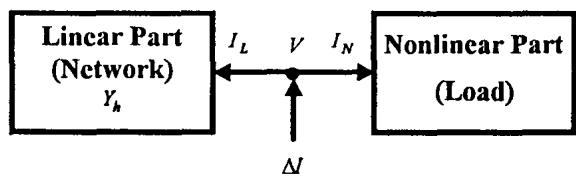
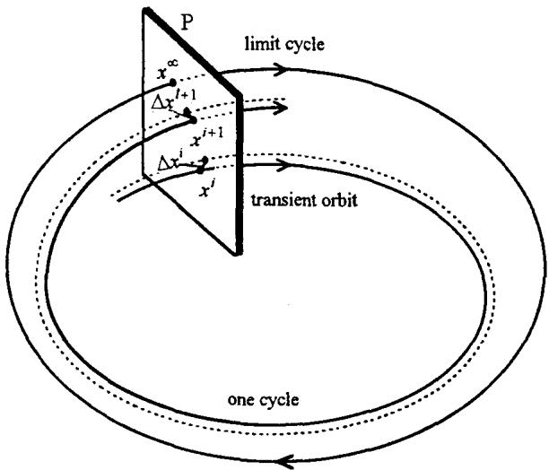
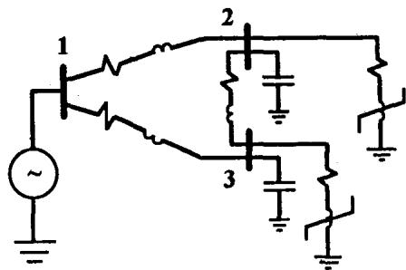

# COMPUTATION OF THE PERIODIC STEADY STATE IN SYSTEMS WITH NONLINEAR COMPONENTS USING A HYBRID TIME AND FREQUENCY DOMAIN METHODOLOGY

Adam Semlyen Aurelio Medina

Department of Electrical and Computer Engineering

University of Toronto

Toronto, Ontario, Canada M5S 1A4

Abstract - The basic principles of an efficient new methodology for the calculation of the non-sinusoidal periodic steady state in systems with nonlinear and time-varying components are described. All linear parts, including the network and part of the loads, are represented in the frequency domain, while nonlinear and time-varying components, mainly loads, are represented in the time domain. This hybrid process is iterative, with periodic, non-sinusoidal, bus voltages as inputs for both frequency domain solutions and time domain simulations: a current mismatch is calculated at each bus and used to update the voltages until convergence is reached. Thus the process, but not the solution, is decoupled for the individual harmonics. Its efficiency is enhanced by the use of Newton type algorithms for fast convergence to the periodic steady state in the time domain simulations. Potential applications of this methodology are in the computation of a Harmonic Power Flow and in the Steady State Initialization needed in the calculation of electromagnetic transients.

Keywords: Periodic steady state, Harmonic power flow, Initialization for transients, Hybrid solution, Decoupled solution, Newton's method.

# 1. INTRODUCTION

Nonlinear and time-varying elements are the main source of harmonics in power systems. With a periodic single frequency input, the output will in general contain harmonics of many frequencies. Thus, nonlinear elements (time-varying included) are responsible for having all harmonics coupled in the system. This phenomenon of harmonic coupling is explicitly represented in detailed a.c. models of power network components [1] and of their interaction [2]. Accordingly, a program for the calculation of the non-sinusoidal Periodic Steady State of the system (Harmonic Power Flow) may be of very high dimension [2-6].

The intrinsic harmonic coupling produced by a nonlinear element is itself nonlinear. Only by a linearization around a particular operating point is a linear relation between harmonic domain voltages and currents possible [1-2], [9] and it is of course accurate only in a close neighborhood of that point. Not only is the calculation of such a harmonic Norton equivalent computationally difficult but, for accurate results, it has to be iteratively updated. The computational burden is thus further increased in direct proportion with the size of the system and the number of harmonics represented. Nevertheless, improvements in computational efficiency can be achieved by the following actions:

(a) Replace the harmonic domain calculations for nonlinear elements by direct time domain computations followed by Fourier transforms.   
(b) Decouple the harmonics but recover the accuracy of the coupling by an iterative process.

95 WM 146-1 PwRS A paper recommended and approved by the IEEE Power System Engineering Committee of the IEEE Power Engineering Society for presentation at the 1995 IEEE/PES Winter Meeting, January 29, to February 2, 1995, New York, NY. Manuscript submitted July 21, 1994; made available for printing January 3, 1995.

Reference [7] has presented results along the ideas outlined above. There the iterative procedure consists of injecting harmonic current phasors into the network and using the resultant voltages, converted to the time domain, as inputs to a nonlinear element yielding a periodic current as output, with all the required harmonic components. This is a fixed point (successive replacement) iteration [8]. The convergence of the process may however be very slow, first, because the network impedance increases with frequency and resonance phenomena may occur [9] and, second, because the time domain simulation for the load must reach the periodic steady state condition of a limit cycle, a process that can take excessive time in the case of lightly damped circuits. Therefore, the present paper incorporates the following features that assure a very efficient overall solution (see Figure 1):

(1) Fundamentally, frequency domain methods are used for the linear parts where they are computationally most efficient and intrinsically accurate (as in the case of transmission lines with distributed, frequency dependent parameters); and time domain simulation is used for the nonlinear parts (normally loads) where it is the only natural approach.   
(2) The iterative process is not cyclical in the fixed point iteration sense of [7]. Instead, it is based on the calculation of a current mismatch $\Delta I_h$ for all harmonics, followed by a voltage update $\Delta V_h$ . The mismatch computation is accurate: for the linear part it obtains $I_h = Y_hV_h$ for all harmonics $h$ , and for each load it performs a time domain simulation to obtain the periodic steady state solution $i(t)$ , with $\nu(t)$ as input. The mismatch vector $\Delta I_h$ (comprising all load buses) is then used with an appropriate iteration matrix $\widetilde{Y}_h$ , equal or close to $Y_h$ , to calculate the update increment $\Delta V_h$ from $\widetilde{Y}_h\Delta V_h = \Delta I_h$ . This process always converges.   
(3) The time domain simulation is accelerated by noting that the dynamics of cycles in the neighborhood of a limit cycle is almost linear [11], so that the intercepts with a Poincaré plane can be used to extrapolate to the limit cycle by Newton's Method, possibly with numerical differentiation. The latter has the advantage that it can be applied to non-differentiable nonlinear load characteristics.

The above fundamental principles for the calculation of the nonsinusoidal Periodic Steady State in a system with both linear and nonlinear components are described and validated in this paper. They can be applied to the development of a full-fledged, three-phase Harmonic Power Flow Program or for the particular application of Steady State Initialization needed in an Electro-Magnetic Transients Program (EMTP). It is beyond the objectives of this paper to deal with the details of either application.

  
Figure 1. The system as seen from the load buses. The voltages $V$ are inputs.

# 2. THE HYBRID APPROACH

Figure 1 gives a conceptual representation of the system. The input points are those buses where nonlinear components are connected (essentially, load buses) with voltages $V$ the unknowns in the computation. For the linear part of the system (mainly the network and possibly generators) these voltages are viewed as the set of their harmonic components and the currents $I_{L}$ are calculated for each harmonic $h$ using $Y_{h}$ . For the nonlinear part (usually loads) $V$ is considered in the time domain as the periodic function $v(t)$ , and $i(t)$ is obtained by time domain simulation; it is then transformed back to $I_{N}$ in the harmonic domain. Physically, we expect to have $\Delta I = I_{L} + I_{N}$ equal to zero. However, before convergence, $V$ is not yet accurately known so that a mismatch $\Delta I = I_{L} + I_{N}$ will result. As seen from the bus, the system has the admittance $Y_{h}$ plus the admittance of the nonlinear part. We can use as voltage correction $\Delta V_{h}$ the solution of the equation

$$
\widetilde {Y} _ {h} \Delta V _ {h} = \Delta I _ {h} \tag {1}
$$

with an appropriate approximation for $\widetilde{Y}_h$ .

# 2.1. Calculation of the Current Mismatch

# 2.1.1. Network: Frequency Domain

The calculation of the currents $I_{L}$ of Figure 1 is a simple, sparse matrix-vector multiplication, performed separately for each harmonic.

# 2.1.2. Loads: Time Domain

As mentioned, the computations for nonlinear components, or loads, are performed in the time domain. Their general description is in terms of the differential equation

$$
\dot {x} = f (x, t) \tag {2}
$$

where $x$ is the state vector of $m$ elements $x_{k}$ . The driving force is periodic so that $f(\cdot, t)$ is a $T$ -periodic vector. The steady state solution $x(t)$ is also $T$ -periodic and can be represented as a limit cycle for $x_{k}$ in terms of another periodic element of $x$ or in terms of an arbitrary $T$ -periodical function, e.g., $\sin \omega t$ ; see Figure 2. Other variables, such as $i(t)$ , are obtained from $x(t)$ via algebraic output equations.

  
Figure 2. Orbit of state vector $x$ .

Before reaching the limit cycle, the cycles of the transient orbit are close to it. Their position is conveniently described by their trace on the Poincaré plane $\pmb{P}$ . A single cycle maps its starting point $x^i$ to its end point $x^{i+1}$ and maps a perturbation segment $\Delta x^i$

(from this base cycle) to $\triangle x^{i+1}$ ; see Figure 2. All mappings close to the limit cycle are quasi-linear so that Newton's method or its approximation can be used for obtaining the point $x^{\infty}$ for the limit cycle. This is possible irrespective of its stability.

# A - The Brute Force Approach

We could find the limit cycle by straightforward simulation of (2) using some integration routine as for instance a fourth order Runge-Kutta (R-K) algorithm. The convergence of this "brute force" approach is however usually very slow, especially in components with light damping, for instance in the case of nonlinear inductances [7]; the method can locate stable limit cycles only and the steady state is not generally reached without difficulty [10]. Therefore, time domain methods have not been used in the past for the calculation of the periodic steady state condition in the presence of harmonics, although in [12] an acceleration method based on a Newton-Raphson formulation [13] is used. We shall show that convergence can be significantly speeded up by the use of Newton type methods.

# B- Convergence Speed-Up

In order to take advantage of the linearity in the neighborhood of a base cycle, we linearize (2) around a solution $x(t)$ from $t_i$ to $t_i + T$ . This results in the variational problem

$$
\Delta \dot {x} = \Delta f (x (t), t) = D _ {x} f (x _ {t}, t) \Delta x = J (t) \Delta x \tag {3}
$$

where $J(t)$ is the (T-periodic) Jacobian matrix. The initial condition is

$$
\Delta x \left(t _ {i}\right) = \Delta x ^ {i} \tag {4}
$$

This is a linear, time-varying ODE [14] with the closed form solution

$$
\Delta x (t) = \exp \left(\int_ {t _ {i}} ^ {t} J (t) d t\right) \times \Delta x ^ {i} \tag {5}
$$

It clearly satisfies (3). For $t = t_{i} + T$ , (5) gives

$$
\Delta x ^ {i + 1} = B \Delta x ^ {i} \tag {6}
$$

with

$$
B = \exp \left(\int_ {t _ {1}} ^ {t _ {i} + T} J (t) d t\right) \tag {7}
$$

We note here that $B$ results almost the same for any $t_i$ as the mapping near the limit cycle is close to linear. The differences however matter in the application of $B$ to the calculation of the limit cycle by Newton's method, to be discussed below.

Equation (6) shows that input segments (to a cycle) are mapped to the corresponding output segments by the (almost) fixed matrix $B$ . Because of the overall linear relations on the Poincaré map of Figure 2, we expect to identify also the matrix $C$ defined by

$$
x ^ {\infty} - x ^ {i} = C \left(x ^ {i + 1} - x ^ {i}\right) \tag {8}
$$

The relation between matrices $C$ and $B$ can be derived as follows. In Figure 2 take $\Delta x^i = x^\infty - x^i$ . Then we have $\Delta x^{i+1} = x^\infty - x^{i+1}$ . Their substitution in (6) and solution for $x^\infty$ gives

$$
x ^ {\infty} = x ^ {i} + C \left(x ^ {i + 1} - x ^ {i}\right) \tag {9}
$$

This is an estimate for the location of the limit cycle with

$$
C = (I - B) ^ {- 1} \tag {10}
$$

Equation (9) leads to a Newton process if $B$ and $C$ are updated at each iteration step using (7) and (10). It becomes a linearly convergent process if $C$ is kept constant after its first evaluation using (10).

The main problem thus for efficiently finding the limit cycle is the identification of the $B$ matrix. In the following we shall present three methods of identification. They all require having initially calculated the base cycle $x(t)$ over a period $T$ , starting from $x^t$ ; see Figure 2.

# B.1. Matrix Exponential

This approach is based directly on equation (7). After the numerical integration over a cycle, we calculate the matrix exponential in the usual way by resorting to an intermediate similarity transformation of the matrix to diagonal form.

# B.2. Direct Approach

The eigenvalue/vector calculation used for the computation of the matrix exponential is not needed if $B$ is calculated directly from (3) as follows. Consider the initial vector $\Delta x^t$ to be a column of the identity matrix $I$ . Then, if all columns are considered, (6) gives

$$
\Delta X ^ {t + 1} = B \tag {11}
$$

Thus, integration of

$$
\Delta \dot {\boldsymbol {x}} = J (t) \Delta \boldsymbol {x} \tag {12}
$$

with initial vectors $\Delta x^t$ being sequentially the columns of the identity matrix $I$ , yields directly the columns of $B$ . Note, that the integration involved here (using for instance a Runge-Kutta method) is more time consuming than the simple numerical quadrature in the Matrix Exponential approach.

# B.3. Numerical Differentiation

Both methods described above require the knowledge of the Jacobian $J(t)$ . Often $J$ can be calculated analytically but this is not always the case. In particular, in the case of switched devices it is easier to use in (3) the increment $\Delta f$ rather than $J(t)\Delta x$ . This implies that, in addition to integrating (2) with initial value $x^i$ for obtaining the base cycle $x(t)$ , we also have to integrate it with the perturbed initial value $x^{\prime} + \varepsilon e^{j}$ , where $e^{j}$ is column $j$ of the identity matrix $I$ , and $\varepsilon$ is a small number. By taking the differences of the two values of $x$ at the end of the cycle, we obtain thus the columns of $\Delta X^{I+1}$ of (11), i.e. of $\varepsilon B$ in this case of down-scaled input. The calculation of $B$ requires $m$ computations as described, just as in the case of the Jacobian matrix.

# C-Iteration Strategies

As we have seen, the identification (via $B$ ) of the iteration matrix $C$ , which is equivalent to the Jacobian matrix of the Newton process (9), requires $m + 1$ computational sequences equivalent each to one cycle of solution of (2). Even though the dynamic order $m$ of the individual nonlinear elements in power systems, considered at present, is usually quite low (often just 1), it is reasonable to consider an iteration matrix alternative where the identification process is performed only once. Then, of course, the convergence to the final limit cycle is only linear, rather than quadratic. The evaluation of these two possibilities will be presented in section 3.

All these computational approaches could be fairly time consuming for large systems. We note, however, that in hybrid calculations the individual nonlinear components are usually of small dynamic order, as noted above, so that the related computational effort is significantly reduced.

# D-LinearLoads

Note that linear loads should be represented by admittances. This is equivalent to including them in the bus admittance matrix. As already mentioned, generators are treated in the same way as long as they are modeled as linear elements. This increases the overall efficiency of the computation.

# 2.2. Calculation of Voltage Updates

To update the voltages we use equation (1) where $\Delta I_h$ is the current mismatch vector for harmonic $h$ . Actually, the voltage correction is $-\Delta V_h$ obtained from (1). Ideally, $\widetilde{Y}_h$ should be the exact value of the admittance seen from the buses. This, of course, is not just impractical but actually impossible, because nonlinear, as opposed to linear, elements do not respond with a single harmonic output to the input $\Delta I_h$ of harmonic $h$ . To make the computations decoupled and simple in terms of harmonics, we represent only a single harmonic $h$ in each of the harmonic domain input/output relations of the nonlinear loads. Consequently, $\widetilde{Y}_h$ can only be approximate and the convergence of process (1) is only linear.

# 2.2.1. Structural Considerations

At power frequency the admittance $Y_{h}$ of the linear part of the system is strongly dominant. Therefore, we could take $\widetilde{Y}_{h} = Y_{h}$ . At harmonic frequencies, however, the inductive reactance of the network increases and, in addition, capacitive effects further reduce the magnitude of $Y_{h}$ . Thus, clearly, the effect of the nonlinear parts is not negligible any more. Therefore we have to add to $Y_{h}$ the correspondent representation of the load at harmonic $h$ . It is however not possible to use a complex admittance matrix for this purpose.

Indeed, a given $Y_{h}$ means that the angle between $\Delta V_{h}$ and $\Delta I_{h}$ remains the same while the pair can be rotated arbitrarily. In the case of a nonlinear load, however, the terminal power-frequency voltage defines a reference for the zero crossing of all harmonics and the above property no longer exists. Therefore, the voltage/current relation has to be given in terms of real variables. Let

$$
\Delta V = \Delta V ^ {\prime} + j \Delta V ^ {\prime \prime}, \quad \Delta I = \Delta I ^ {\prime} + j \Delta I ^ {\prime \prime}, \quad \Delta Y = \Delta G + j \Delta B \tag {13}
$$

Then the complex equation $Y \Delta V = \Delta I$ becomes

$$
\left[ \begin{array}{l l} G & - B \\ B & G \end{array} \right] \left[ \begin{array}{l} \Delta V ^ {\prime} \\ \Delta V ^ {\prime \prime} \end{array} \right] = \left[ \begin{array}{l} \Delta I ^ {\prime} \\ \Delta I ^ {\prime \prime} \end{array} \right] \tag {14}
$$

This equation allows rotations. If rotations are not allowed, (14) takes the more general form

$$
\left[ \begin{array}{l l} G ^ {\prime} & - B ^ {\prime \prime} \\ B ^ {\prime} & G ^ {\prime \prime} \end{array} \right] \left[ \begin{array}{l} \Delta V ^ {\prime} \\ \Delta V ^ {\prime \prime} \end{array} \right] = \left[ \begin{array}{l} \Delta I ^ {\prime} \\ \Delta I ^ {\prime \prime} \end{array} \right] \tag {15}
$$

Details of the admittance matrix are given in the next section.

# 2.2.2. Identification of the Real Admittance Matrix

In order to identify the $2 \times 2$ real admittance matrix of (15), perform the following computations for a given load:

(a) Apply a 1 per unit power frequency voltage $\sin \omega_0 t$ and calculate the response $i_0(t)$ . Note that this is the base case and that it will produce results independent of the final voltage solution as the input is fixed (to 1 p.u.).   
(b) Apply the same voltage with a small perturbation of harmonic $h$ , first in phase, then in quadrature:

$$
\sin \omega_ {0} t + \varepsilon \sin h \omega_ {0} t \tag {16a}
$$

$$
\sin \omega_ {0} t + \varepsilon \cos h \omega_ {0} t \tag {16b}
$$

and calculate the respective responses, $i_h^*(t)$ and $i_h''(t)$ . Take the differences with respect to $i_0(t)$ and denote them as $\varepsilon \Delta i_h'(t)$ and $\varepsilon \Delta i_h''(t)$ .

(c) Calculate the Fourier coefficients of sine- and cos-terms of order $h$ of the output increments $\Delta i_h''(t)$ and $\Delta i_h''(t)$ . Since these correspond to 1 p.u. incremental sine- and cos-voltages in (16), they represent admittances and can be identified with the elements $G', B'$ and $G'', B''$ of the coefficient matrix in (15), as follows:

For sine-input: $\sin / \sin \rightarrow G'$ , $\cos / \sin \rightarrow B'$   
For cos-input: $\sin / \cos \rightarrow -B^{\prime \prime}$ , $\cos / \cos \rightarrow B^{\prime \prime}$

# 3. VARIANTS OF IMPLEMENTATION

The principles of the general methodology described in previous sections have been applied to the development of a single-phase a.c. Hybrid Harmonic Power Flow program. Different implementation strategies were explored for the modeling and solution of the linear and nonlinear parts, in order to investigate their relative merit. Details of the experience obtained throughout this investigation are given in the following sections.

# 3.1. Strategies for the Time-Domain Acceleration Process

The numerical procedures described in section B above have quadratic convergence. Thus, when applied to the brute force approach, fast convergence to the limit cycle will be achieved. To minimize the number of repetitive applications of a speed-up method and to better exploit its convergence properties, the algorithm should be first applied once the intercepts with the Poincaré Map can be approximately represented by the linear equation (8). In other words, a number of full time-domain cycles are first run, thus allowing the initial transient to settle down. The number of full cycles initially required depends on the system characteristics, in particular load damping. In the authors' experience, 3 to 4 are sufficient for a well damped system and 6 to 7 for a system with light damping.

Each application of a time domain acceleration procedure can be visualized as a "jump" from a reference intercept $x^t$ with the Poincaré plane to reach the starting point of the limit cycle, theoretically obtained by brute force alone only after an infinite time. In practical terms, the state variables at the limit cycle are calculated to an accuracy defined by a specified tolerance for convergence. In all test studies to be presented, a criterion for convergence of state variables of $10^{-10}$ p.u. was used. The computational efficiency to achieve convergence is directly dependent on the strategy followed for the time domain computations. The following algorithmic alternatives have been implemented in order to analyze and compare their potential advantages and drawbacks.

# 3.1.1. Full NR/ND Procedure

This algorithm is based on the repetitive application of the ND (Numerical Differentiation) or NR (Newton-Raphson of section B.1 or B.2) procedure during the brute force speed-up process, until a criterion for convergence is satisfied. The approach exploits to the full the quadratic convergence properties of these algorithms. The iteration matrix $B$ is calculated for each application of the NR/ND method. In order to obtain all the columns of $B$ , the procedures described in sections B.2 and B.3 require a minimum number of full time domain cycles equal to the number of state variables. On the other hand, the matrix exponential approach would involve the computations required for the evaluation and numerical integration of the Jacobian along the base cycle, followed by an eigen-analysis process [15] to obtain $B$ of (7) as

$$
B = V e ^ {\Lambda} V ^ {- 1} \tag {17}
$$

where

$\pmb{V}$ : matrix of eigenvectors

$\Lambda$ : diagonal matrix of eigenvalues

By way of example, the three-bus system of Figure 3 has been solved by the brute force approach and by applying the acceleration techniques of section B above. Seven state variables are to be calculated. Table 1 summarizes relevant information obtained from the application of each procedure, in terms of the number of full time domain cycles (NFC) required for convergence to the limit cycle and maximum error in state variables (in per unit).

  
Figure 3. Three-bust test system

Table 1. Errors during convergence of time domain methods   

<table><tr><td>NFC</td><td>Brute Force</td><td>ND method</td><td>Direct NR</td></tr><tr><td>8</td><td>0.07845</td><td>0.07845</td><td>0.07845</td></tr><tr><td>16</td><td>0.02347</td><td>0.03536</td><td>0.03536</td></tr><tr><td>24</td><td>0.00610</td><td>5.3124e-05</td><td>5.3133e-05</td></tr><tr><td>32</td><td>0.00159</td><td>5.4396c-11</td><td>7.6770c-12</td></tr><tr><td>:</td><td>:</td><td></td><td></td></tr><tr><td>162</td><td>9.7602e-11</td><td></td><td></td></tr></table>

Despite the light damping assumed in the system, three consecutive applications of any of the speed-up algorithms were sufficient to satisfy the specified criterion for convergence. The limit cycle is obtained within this precision. In all cases, before applying the acceleration procedure, the brute force approach was run for seven initial cycles. An additional full cycle is required for the purpose of obtaining the base cycle. It should be noted that a good base cycle is essential to minimize the number of repetitive applications of a speed-up procedure. For this system, a minimum of eight full cycles are required for each NR/ND application.

The ND method has been found to be faster than the NR approach; this is because of its simpler and straightforward formulation. Note from Table 1 its powerful and reliable convergence characteristics. It differs from NR only because of the round-off error in numerical differentiation.

The approximate CPU times for the Brute Force, ND and Direct NR procedures were 35.1, 6.8 and 7.9 seconds, respectively. Each full time domain cycle in Table 1 took approximately 0.21 seconds. Measured CPU times are of course highly dependent on the computer system (a 64 bit KSR1 computer was used in this investigation) and individual code efficiency.

# 3.1.2. Partial NR/ND Procedure

The purpose of this solution scheme is to reduce the number of full time domain cycles and computation time, required by the full NR/ND method to lead the brute force approach to convergence at the limit cycle. This however is at the expense of degrading the natural convergence properties of the NR/ND method.

The algorithm can be described as follows: an initial estimate of $x^{\infty}$ is first obtained with (8) with the application of the NR/ND method to the brute force procedure; the iteration matrix $B$ is kept constant for a number of subsequent evaluations of $x^{\infty}$ , then recalculated to start again this cyclic process until convergence to the limit cycle is achieved. A variant of this approach would consists in resuming the process described in section 3.1.1 once $B$ has been recalculated at a particular solution stage.

Table 2 illustrates relevant information obtained with the application of this solution procedure. After the first NR/ND application, the same matrix $B$ was used for the next two evaluations of $x^{\infty}$ , yielding the state variable errors of cycles 17 and 18. With a second NR/ND application the solution is brought very close to the limit cycle. At this stage $B$ is very accurate: it has allowed the next estimation of $x^{\infty}$ at the limit cycle to be done with very high precision, in just one additional time domain cycle.

Table 2. Errors during convergence of partial NR/ND procedures.   

<table><tr><td>NFC</td><td>Partial ND method</td><td>Partial NR method</td></tr><tr><td>16</td><td>0.03536</td><td>0.03536</td></tr><tr><td>17</td><td>3.6742e-03</td><td>3.6740e-03</td></tr><tr><td>18</td><td>2.2358e-04</td><td>2.2357e-04</td></tr><tr><td>26</td><td>8.9812e-10</td><td>8.4602e-10</td></tr><tr><td>27</td><td>3.1090e-14</td><td>7.6600e-15</td></tr></table>

# 3.1.3. Single NR/ND Application

This solution method is based on a single application to the brute force approach of a full NR/ND procedure. The matrix $B$ is used to obtain the first estimate of $x^{\infty}$ and kept constant for further evaluations of $x^{\infty}$ . Convergence to the limit cycle requires more applications of (9), as compared with those needed by algorithms of sections 3.1.1 or 3.1.2. However, fast updating of $x^{\infty}$ is achieved with this approach, since the repeated identification process of matrix $B$ is avoided. This procedure is an attractive alternative when the initial base cycle lies close to the limit cycle. Table 3 illustrates the results obtained with this approach of linear convergence.

Table 3. Errors during convergence of single NR/ND procedures.   

<table><tr><td>NFC</td><td>Single ND method</td><td>Single NR method</td></tr><tr><td>18</td><td>2.2358e-04</td><td>2.2357e-04</td></tr><tr><td>19</td><td>1.7269e-05</td><td>1.7267e-05</td></tr><tr><td>20</td><td>1.7636e-06</td><td>1.7635e-06</td></tr><tr><td>:</td><td>:</td><td>:</td></tr><tr><td>24</td><td>1.9203e-10</td><td>1.9205e-10</td></tr><tr><td>25</td><td>3.4268e-11</td><td>3.4270e-11</td></tr></table>

# 3.2. System Admittance Matrix Representation

The system admittance matrix $Y_{h}$ , defined in section 2, can be represented, for the iterative solution of (1), according to any of the following procedures.

# 3.2.1. Full System Admittance Matrix

The linear components and loads are represented as admittances and included directly into $Y_{h}$ . The nonlinear effect of loads is not taken into account in $Y_{h}$ and, therefore, the identification process of section 2.2.2 and the related time domain calculations are avoided. This is an attractive alternative for the solution of systems with low or moderate harmonic distortion, as it considerably speeds-up the iterative hybrid solution.

# 3.2.2.Adding the Effect of Non-Linear Loads

The elements of the real admittance matrix, obtained with the identification process of section 2.2.2, are incorporated into $Y_{h}$ .

This process strengthens the robustness of $Y_{h}$ , thus resulting in a significant reinforcement of the natural convergence properties of the hybrid method in systems with high harmonic distortion or where a resonance condition is present. Besides, we have observed that under such circumstances, the number of iterations required for the convergence of the hybrid algorithm can be significantly reduced, compared to those needed if $Y_{h}$ does not include the effect of nonlinear loads.

In our experience, the calculation of the Fourier coefficients of section 2.2.2(c) is usually necessary for a limited number of harmonics, e.g. the first 11 harmonics. This considerably reduces the time domain calculations involved for their determination. Exception is made for the case when a higher order resonance is present in the system, in which case the coefficients should be calculated up to that particular harmonic. Furthermore, note that in the absence of d.c. excitation, (1) needs to be solved only for odd harmonic orders. Thus, the computation time for the iterative hybrid solution process is halved.

# 3.2.3. Decoupled Admittance Matrix Method

Taking advantage of the structure of $Y_{h}$ , the principles of decoupling [16] can be applied. Thus, setting $G' = G'' \approx 0$ in (15) yields the decoupled equations

$$
- B ^ {\prime \prime} \Delta V ^ {\prime \prime} = \Delta I ^ {\prime} \tag {18a}
$$

$$
B ^ {\prime} \Delta V ^ {\prime} = \Delta I ^ {\prime \prime} \tag {18b}
$$

The effect of nonlinear loads can be appropriately incorporated into $B'$ and $-B''$ of (18). To preserve high accuracy in the computation of $\Delta I$ , $\Delta I'$ and $\Delta I''$ are calculated without decoupling in $Y_h$ .

It can be mentioned among the computational advantages of this approach, that $B'$ and $-B''$ are half the original size of $Y_h$ and are symmetrical and sparse. It should however be noted that decoupling of (15) generally results in an additional number of iterations to achieve convergence, in our experience an average of 2 in systems with low harmonic distortion. In networks with high harmonic distortion this technique should be used with caution, as it would require a significant number of additional iterations to obtain convergence, which itself cannot be guaranteed in these cases even with the incorporation of the susceptance terms of the nonlinear loads.

# 3.3. Achieving Network Admittance Symmetry

Equation (15) details the real formulation of (1). Note that the admittance matrix of (15) is asymmetrical, with off-diagonal elements dominant in transmission networks. Symmetry of the admittance matrix can however be achieved by a simple procedure of reordering of rows/columns. Thus, reordering of rows in (15) yields the matrix equation

$$
\left[ \begin{array}{l l} B ^ {\prime} & G ^ {\prime \prime} \\ G ^ {\prime} & - B ^ {\prime \prime} \end{array} \right] \left[ \begin{array}{l} \Delta V ^ {\prime} \\ \Delta V ^ {\prime \prime} \end{array} \right] = \left[ \begin{array}{l} \Delta I ^ {\prime \prime} \\ \Delta I ^ {\prime} \end{array} \right] \tag {19}
$$

In (19) $G' = G''$ and $B' = B''$ only for the linear part of the system. For the nonlinear part, we set $G', G'' = 0$ . Thus, we include only the susceptances representing the nonlinear effect of loads to preserve the symmetry of the admittance matrix. This did not negatively affect the original convergence of the voltage correction process based on (1).

Symmetry in the admittance matrix allows sparsity techniques to be applied to the lower triangular matrix only. Following the procedure presented, the storage and computation time required for the ordering, factorization and solution of (19) is nearly halved.

# 3.4. System Components

The basic a.c. network components can be represented in the hybrid method as follows.

# 3.4.1. Transmission Lines

A transmission line can be represented either by a simple lumped parameter model or by a model for long-line effects. In the former case, the series impedance and total shunt admittance of a transmission line at a frequency $\omega$ are

$$
Z = R + j \omega L \tag {20a}
$$

$$
Y = j \omega C \tag {20b}
$$

The shunt admittance $Y$ is halved and placed at both ends of the transmission line. The corresponding long-line parameters of the transmission line are

$$
Z _ {\omega} = Z _ {c} \sinh \Gamma \tag {21a}
$$

$$
Y _ {\omega} = \frac {2}{Z _ {\omega}} (\cosh \Gamma - 1) \tag {21b}
$$

where

$$
Z _ {c} = \sqrt {Z / Y} \tag {22a}
$$

$$
\Gamma = \sqrt {Z Y} \tag {22b}
$$

Note that $Z_{\omega}$ and $Y_{\omega}$ are equal to the original $Z$ and $Y$ only if $\omega \rightarrow 0$ . Equations (21) accurately represent the transmission line at harmonic frequencies. On the other hand, it has been observed that the damping term of $Y_{\omega}$ strengthens the convergence properties of the hybrid method. A reduction by one iteration to achieve convergence was generally noted with the use of this formulation.

# 3.4.2. Generators

In harmonic analysis of electric networks, generator units can be represented either as constant source rigidly fixed to an infinite bus or as an internal emf behind a generator reactance. Both models have been implemented and analyzed. The infinite bus model is given by the equation

$$
V _ {i} = \left| V _ {i} \right| \angle \alpha_ {i} \tag {23}
$$

The phase shifts $\alpha_{i}$ are obtained from a load flow solution.

The internal generator $emf, E_{t}$ , can be obtained by post-processing following the load flow solution. For the computation of harmonics, this results in additional buses and branches, equal in number to the generator units existing in the system. It is more convenient to add the created emf nodes at the end of the bus list: this makes the computational process more efficient and straightforward, as any complication related to bus reordering is avoided. In addition, real powers originally at generator terminals are now transferred to the internal generator nodes; rigid buses of controlled voltage, slack or $PV$ , now become "soft" load buses (PQ).

The solution of a power network with the hybrid technique, using either of both generator models previously described, will yield very accurately the original load flow solution, plus the harmonics. The small deviation that will be observed with the application of the internal emf model is produced by two facts: the now allowed voltage variation of the created "soft" buses, and the cross-coupling between harmonics. Higher harmonic content is obtained with this model, as the generators' emf's are now driving the system.

# 3.4.3. Nonlinear Loads

These system components are modeled in the time domain, with the differential equations solved by the $R-K$ integration method.

Convergence of this process is accelerated by any of the procedures described in section 3.1. Different degrees of nonlinearity have, for example, been simulated with saturable reactors of different sizes and levels of saturation.

The following strategy for time domain solution has been found to work satisfactorily for the hybrid method: use the algorithm of section 3.1.1 for the first two iterations, then switch to the approach of section 3.1.2 and once the iterative process is close to convergence use the procedure of section 3.1.3. Significant saving in computation time can be achieved with the reduction of full time domain cycles. It should be noted, however, that in the presence of significant harmonic distortion or resonance in the system, the use of the procedure of section 3.1.1 throughout the iterative process can result in fewer full time domain cycles.

# 3.5. Sparsity

Efficient computations with the hybrid approach are achieved with the incorporation of sparsity techniques. Dynamic ordering on $Y_{k}$ is based on the scheme of minimal degree [17]. Symmetry of $Y_{k}$ is restored as shown in section 3.3. Since there is no change of topology during the iterative solution, ordering and factorization of $Y_{k}$ are carried-out only once, at the first iteration, and the resulting factors are used throughout the iterative process.

# 4. TEST CASES

The test system of Figure 3 has been used for the purpose of comparison between a pure time domain method and the proposed hybrid harmonic load flow method. Light damping is assumed in the system. The time domain convergence tolerance for state variables was $10^{-10}$ p.u. and the criterion for convergence of the full hybrid process was $10^{-7}$ p.u. In the hybrid approach the iterative process is completed once either the current mismatches or the voltage corrections satisfy the convergence tolerance. Convergence was obtained in 12 and 6 iterations by using the representations of $Y_{h}$ of sections 3.2.1 and 3.2.2, respectively.

Even for the small test system used here for illustration, the full time domain solution required at least one order of magnitude more time than the hybrid solution. For any of the realistic power systems of section 4.2, a full time domain solution would not have been feasible in a reasonable amount of time and a frequency domain solution has complex modeling problems in the representation of the nonlinear and time-varying components.

# 4.1. Time Domain Solutions and Hybrid Technique Validation

The converged solutions obtained with the brute force approach or the accelerated time domain solution, applying the ND and direct NR method, are identical. In our studies agreement at least to the 8th digit has been obtained. Details of maximum state variable error and full time domain cycles required for convergence are given in Table 1.

The new hybrid methodology for harmonic analysis of power systems has been successfully validated against solutions given by the different time domain approaches discussed previously. Excellent agreement has been obtained.

By way of example, Table 4 illustrates the solution obtained at bus 3 of the test system of Figure 3 with various time domain procedures and the hybrid method. All gave identical results. Only a few harmonics $h$ are shown in the table, obtained by Fourier analysis of the voltage waveform.

Table 4. Voltage harmonics obtained by different methods.   

<table><tr><td>h</td><td>1</td><td>3</td><td>5</td><td>7</td></tr><tr><td>Vh</td><td>0.98138</td><td>3.8687e-02</td><td>3.5543e-03</td><td>8.0010e-04</td></tr></table>

# 4.2. Application to the Solution of Larger Systems

The hybrid method has been successfully applied to obtain the periodic steady state solution of larger systems. The IEEE-14, 30, 57 and 118 Bus Test Systems [18] have been solved with this technique. By way of example, Table 5 illustrates the harmonic solution for three particular buses of the 118 bus test system where a nonlinear load has been connected. This system contains 53 generator units and, in addition, 12 nonlinear loads were assumed in the system. At each bus where a nonlinear load is placed, $90\%$ of the total load power is assumed to be linear and $10\%$ nonlinear. Convergence was achieved in 4 iterations. The generator units were represented with the emf source model.

Table 5. Some bus harmonic voltages, IEEE.118 Test System   

<table><tr><td>Harmonic</td><td>Bus 7</td><td>Bus 101</td><td>Bus 118</td></tr><tr><td>1</td><td>0.98913</td><td>0.99158</td><td>0.95101</td></tr><tr><td>3</td><td>2.6378e-03</td><td>2.3056e-03</td><td>1.7861e-03</td></tr><tr><td>5</td><td>3.2945e-05</td><td>1.2651e-04</td><td>6.0597e-05</td></tr></table>

# 5. CONCLUSIONS

A new algorithm for the computation of the periodic steady state of power systems has been presented. It is based on a hybrid time and harmonic domain methodology. A hybrid harmonic power flow program has been developed using the principles of this methodology.

In the hybrid approach, harmonics are solved independently. However, the effect of cross-coupling between harmonics is restored with the accurate calculation of the current mismatch at buses with nonlinear loads.

The proposed hybrid method has good convergence properties. Convergence has generally been obtained in less than ten iterations, even in the presence of significant harmonic distortion or resonance in the system. When required, the convergence characteristics of the algorithm can be reinforced with the incorporation, into the admittance matrix, of the effect of nonlinear loads. The linear network is solved with the application of sparsity techniques and of a procedure to restore the symmetry of the admittance matrix.

The hybrid harmonic power flow methodology has been successfully validated against time domain methods. Its application to the solution of larger electric networks has been described.

Efficient methods for the acceleration of convergence have been described, implemented and analyzed. The importance of their application for fast time domain computations has been clearly demonstrated. Strategies for the application of methods for brute force convergence speed-up have been detailed, their merits and drawbacks analyzed.

The hybrid methodology presented in this paper is general and can be applied to the periodic steady state solution of three-phase systems. A forthcoming paper will report on the investigation in this area.

# 6. ACKNOWLEDGMENTS

Financial support by the National Sciences and Engineering Research Council of Canada is gratefully acknowledged.

# 7. REFERENCES

[1] A. Medina, “Power Systems Modelling in the Harmonic Domain”, Ph.D. Thesis, University of Canterbury, Christchurch, New Zealand, 1992.

2] A. Medina and J. Arrillaga, "Harmonic Interaction Between Generation and Transmission Systems", IEEE Transactions on Power Delivery, Vol. 8, October 1993, pp. 1981-87   
[3] D. Xia and G.T. Heydt, "Harmonic Power Flow Studies Part I-Formulation and Solution", IEEE Transactions on Power Apparatus and Systems, Vol. PAS-101, No. 6, June 1982, pp. 1257-65.   
[4] W. Xu, J.R. Marti, and H.W. Dommel, “A Multiphase Harmonic Load Flow Solution Technique”, IEEE Transactions on Power Systems, Vol. 6, No. 1, February 1991, pp. 174-82.   
[5] T.J. Demsem, P.S. Bodger, and J. Arrillaga, “Three Phase Transmission System for Harmonic Penetration Studies”, IEEE Transactions on Power Apparatus and Systems, Vol. PAS-103, No. 2, February 1984, pp. 310-17.   
[6] E. Acha, J. Arrillaga, A. Medina, and A. Semlyen, “General Frame of Reference for Analysis of Harmonic Distortion in Systems with Multiple Transformer Nonlinearities”, Proceedings IEE, Part C, Vol. 136, No. 5, September 1989, pp. 271-78.   
[7] H.W. Dommel, A. Yan, and S. Wei, “Harmonics from Transformer Saturation”, IEEE Transactions on Power Systems, Vol. PWRD-1, No. 2, April 1986, pp. 209-14.   
[8] R. Yacamini and J.C. de Oliveira, “Harmonics in Multiple Converter Systems: A Generalized Approach”, Proceedings IEEE Part B, Vol. 127, No. 2, March 1980, pp. 96-104.   
[9] A. Semlyen, E. Acha, and J. Arrillaga, “Harmonic Norton Equivalent for the Magnetising Branch of a Transformer”, Proceedings IEEE Part C, Vol. 134, No. 2, March 1987, pp.162-69.   
[10] T.S. Parker and L.O. Chua, “Practical Numerical Algorithms for Chaotic Systems”, Springer-Verlag, New York, 1989.   
[11] J. Guckenheimer and P. Holmes, “Nonlinear Oscillations, Dynamical Systems, and Bifurcations of Vector Fields”, Springer-Verlag, 1983.   
[12] J. Usaola and J.G. Mayordomo, “Fast Steady-State Technique for Harmonic Analysis”, IEEE/ICHPS IV Fourth International Conference on Harmonics in Power Systems, Budapest, October 4-6, 1990, pp. 336-42.   
[13] T.J. Aprille and T.N. Trick, “A Computer Algorithm to Determine the Steady-State Response of Nonlinear Oscillators”, IEEE Transactions on Circuit Theory, Vol. CT-19, No. 4, July 1972, pp. 354-60.   
[14] II. D'Angelo, "Linear Time-Varying Systems: Analysis and Synthesis", Allyn and Bacon, Boston, 1970.   
[15] E. Anderson, Z. Bai, C. Bischof, J. Demmel, J. Dongarra, J. Du Croz, S. Hammarling, A. Mc Kenney, S. Ostrouchov, and D. Sorensen, "LAPACK Users' Guide", Society for Industrial and Applied Mathematics, Philadelphia, 1992.   
[16] B. Stott and O. Alsac, “Fast Decoupled Load Flow”, IEEE Transactions on Power Systems, Vol. PAS-93, May/June 1974, pp. 859-69.   
[17] W.F. Tinney and J.W. Walker, “Direct Solutions of Sparse Network Equations by Optimally Ordered Triangular Factorization”, Proceedings IEEE, Vol. 55, No. 11, November 1967, pp. 1801-09.   
[18] L.L. Freris and A.M. Sasson, “Investigation of the Load Flow Problem”, Proceedings IEE, Vol. 115, No. 10, October 1968, pp. 1450-60.

# BIOGRAPHIES

Adam Semlyem (Fellow IEEE) was born and educated in Rumania, where he obtained a Dipl. Ing. degree and his Ph.D. He started his career with an electric power utility and held academic positions at the Polytechnic Institute of Timisoara, Rumania. In 1969 he joined the University of Toronto where he is a Professor in the Department of Electrical and Computer Engineering, emeritus since 1988. His research interests include the steady state and dynamic analysis of power systems, electromagnetic transients, and power system optimization.

Aurello Medina was born in Michoacan, Mexico, in 1960. He received his first degree (IIons) from the University of Michoacan. He started his career as a field engineer for the Mexican electric power utility. After a retraining period at the University of Michoacan he moved to the Instituto de Investigaciones Eléctricas, Cuernavaca, Mexico, where he worked as a research engineer. In 1992 he obtained his Ph.D. from the University of Canterbury, Christchurch, New Zealand, where he remained for a year as a Post Doctoral Fellow. Since July 1993 he is working as a Post Doctoral Fellow at the University of Toronto. His research interests are in the periodic steady state analysis of power systems.