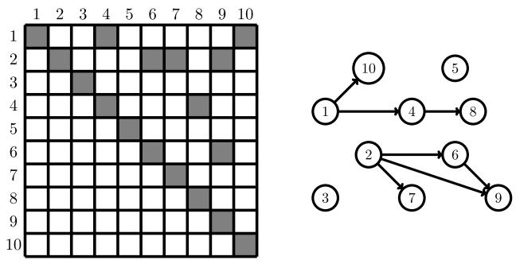
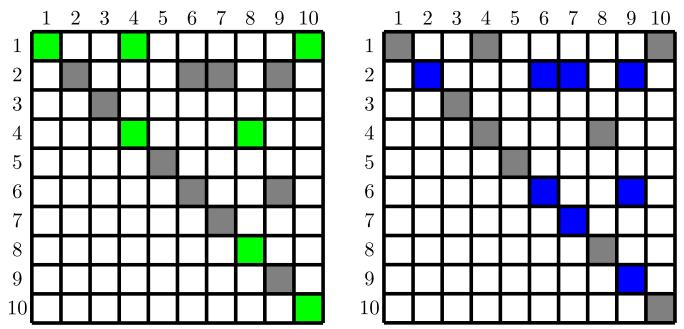
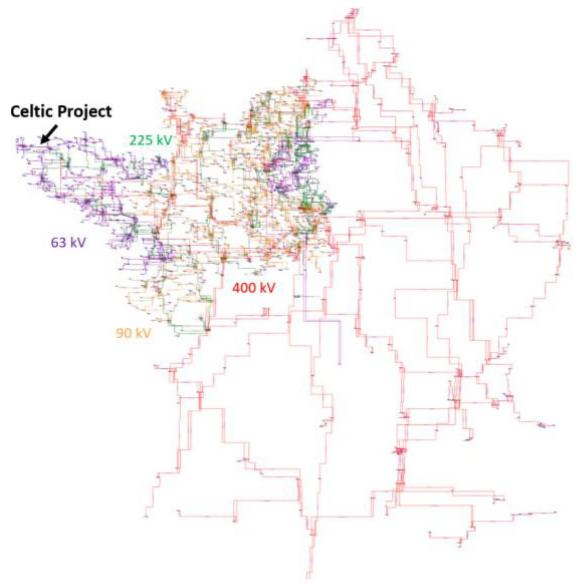
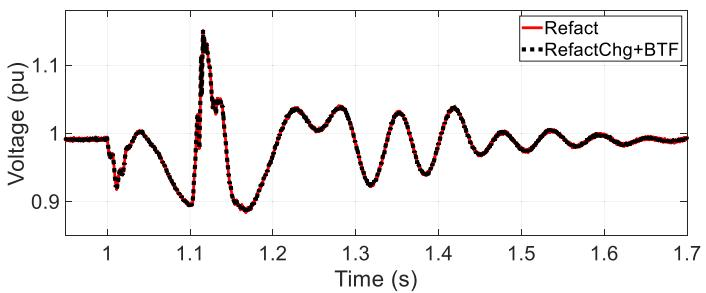
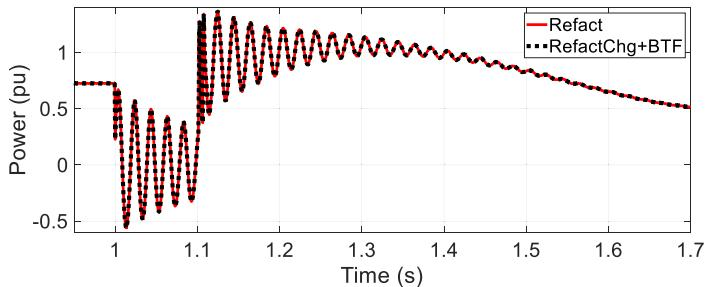

# Partial Refactorization Techniques for Electromagnetic Transient Simulations

Boris Bruned , Senior Member, IEEE, Anas Abusalah, Jean Mahseredjian , Life Fellow, IEEE, Sébastien Dennetière , Member, IEEE, and Omar Saad, Senior Member, IEEE

Abstract—This paper explores partial refactorization techniques to accelerate the simulation of Electromagnetic Transients (EMTs) in power systems. Direct sparse left-looking LU factorization from the KLU solver is used to solve network equations. The refactorization step can be time-consuming if the factorized matrix varies often as the simulation involves power electronics switching or nonlinear devices. A path-based partial refactorization technique is proposed to accelerate the re-computation of LU factors. In the left-looking algorithm, only a subset of columns that belong to the computed factorization path are refactorized. In addition, Block Triangular Factorization (BTF) is enhanced through partial refactorization, which further accelerates computation through smaller, evolving submatrices. The new techniques are tested on large power grids. Substantial performance gains are achieved.

Index Terms—Electromagnetic transient (EMT) simulation, direct sparse linear solver, left-looking LU factorization, partial refactorization, factorization path.

# I. INTRODUCTION

N the scope of Energy Transition, the circuit-based Electromagnetic Transient (EMT) simulation approach is required for grid operators [1] to study the stability of grids with massive integration of renewable energy sources. This approach delivers highly accurate computations with detailed models of controls and power electronics circuits. The challenge is in terms of numerical performance of EMT computations for large-scale grids with numerous inverter-based resources. Sparse-matrix based solvers can be used in EMT-type software [2] for efficient solution of large systems of equations based on the companion circuit modeling approach. Direct sparse LU decomposition [3] is commonly used to solve such systems. Previous works have integrated the KLU solver [4], [5] into EMT-type simulators in off-line [6] and real-time [7] modes. Efficient sparse solver techniques (fill-in reduction by reordering, parallelization,

Received 13 September 2024; revised 3 April 2025; accepted 17 May 2025. Date of publication 30 May 2025; date of current version 25 July 2025. Paper no. TPWRD-01434-2024. (Corresponding author: Boris Bruned.)

Boris Bruned and Sébastien Dennetière are with Campus Transfo, RTE, 69330 Jonage, France (e-mail: boris.bruned@rte-France.com; sebastien. dennetiere@rte-France.com).

Anas Abusalah is with PGSTech, Montréal, QC H3C3A7, Canada (e-mail: anas.abusalah@emtp.com).

Jean Mahseredjian is with Polytechnique Montreal, Montréal, QC H3C3A7, Canada (e-mail: jean.mahseredjian@polymtl.ca).

Omar Saad is with Hydro-Québec, Montréal, QC H3C3A7, Canada (e-mail: omar.saad@hydro-quebec.com).

Color versions of one or more figures in this article are available at https://doi.org/10.1109/TPWRD.2025.3574482.

Digital Object Identifier 10.1109/TPWRD.2025.3574482

partial pivoting) can significantly speed up EMT simulations. An important bottleneck is the requirement for repetitive refactorization steps to account for switching devices and nonlinear models.

In KLU, the LU factors are computed by the left-looking Gilbert-Peierls (G-P) factorization algorithm [8] with partial pivoting. This paper focuses on the LU factors re-computations (refactorization) problem. Originally in KLU, a refactorization is proposed using a G-P algorithm version without pivoting. Previous work [6] has enhanced it by offering the possibility to switch to full factorization only when the pivot is no longer valid through a pivot validity test. Partial refactorization aims to re-compute LU factors in a faster manner considering only the matrix elements which have changed at each time-point. It avoids performing LU refactorization through all columns in the left-looking algorithm. The partial refactorization technique applied in [6] exploits the left-looking column-based procedure of the factorization algorithm by restarting it from the minimal index of columns which have changed in the matrix. This paper enhances this latter method by exploring the path-based refactorization approach. For each changed value in the original matrix, it computes a factorization path. This path is a minimum sequence of columns which need to be refactorized to update LU factors. The reunion of all factorization paths proposes a minimal column subset which must be proceeded by the left-looking refactorization algorithm. This approach has been originally proposed in [9] to accelerate the solution phase (backward and forward substitutions) when the right member is sparse. Then, it has been applied in [10] to speed up LU refactorization without pivoting using the Crout factorization algorithm. Recent research has applied it to parallelize refactorization [11] or perform partial refactorization in real-time EMT simulation [12] for symmetric LU factors.

For the first time, a generic formulation of the path-based refactorization technique is proposed, which can be applied to unsymmetric LU factors. This paper also uses Block Triangular Factorization (BTF) ordering method [13] which has been previously employed in [6] as a decoupling technique for parallelization. This paper speeds up partial refactorization by considering only the changed matrices in the left-looking algorithm. All implementations have been done in the MKLU solver, a modified version of KLU which includes the previous partial refactorization technique used in EMTP [2]. The new partial refactorization techniques are tested on large-scale practical power systems.

The focus of this paper is on fast computation methods which can be reused in sequential or parallel mode.

This paper is organized as follows. Firstly, in Section II, all solution steps of sparse linear systems for EMT simulations are briefly presented. Then, Section III focuses on the partial refactorization techniques, the path-based approach, and the use of BTF. Finally, the efficiency of each partial refactorization technique is validated on practical power system test cases.

# II. SOLUTION OF SPARSE LINEAR SYSTEMS IN EMT SIMULATIONS

Using Modified-Augmented-Nodal Analysis (MANA) formulation [2] with companion circuit models, network equations can be written in a linear form to be solved at each time-point:

$$
\boldsymbol {A} \boldsymbol {x} = \boldsymbol {b} \tag {1}
$$

In its detailed form (1) becomes:

$$
\left[ \begin{array}{l l} Y _ {n} & A _ {c} \\ A _ {d} & A _ {x} \end{array} \right] \quad \left[ \begin{array}{l} v _ {n} \\ x _ {x} \end{array} \right] = \left[ \begin{array}{l} i _ {n} \\ b _ {x} \end{array} \right] \tag {2}
$$

It contains the classic nodal admittance matrix $Y _ { n }$ and an augmented section created through the addition of supplementary equations with the matrices $A _ { c } , \ A _ { d }$ and $A _ { x } . \ v _ { n }$ is the vector of unknown node voltages and ${ \pmb x } _ { \pmb x }$ represents other types of unknowns, such as generic branch currents, ideal switch currents, or other branch-type equations. The vector $\scriptstyle { i _ { n } }$ contains nodal current injections from current sources, including history terms from the discretized companion circuits. The vector $b _ { x }$ represents known values for the augmented equations. In the case of nonlinearities, linearized Norton equivalents [2], [14] are provided to A and updated at each iteration. This is a Newton method where A is the Jacobian matrix.

The matrix A is generally sparse and can be unsymmetric. A direct sparse LU factorization method is commonly used to solve (1). The augmented matrix is factorized as

$$
\boldsymbol {A} = \boldsymbol {L U} \tag {3}
$$

Then, a forward substitution is first performed using

$$
L x ^ {\prime} = b \tag {4}
$$

A backward substitution follows it with

$$
\boldsymbol {U} \boldsymbol {x} = \boldsymbol {x} ^ {\prime} \tag {5}
$$

Prior (3), fill-in reduction techniques are adopted to minimize the number of extra non-zero values in the LU factorization process. It can be written as follows:

$$
A ^ {\prime} = P A Q \tag {6}
$$

Where P the row permutation matrix and Q is the column permutation matrix. The LU fill-ins of the newly reordered matrix $A ^ { \prime }$ aim to be less than the ones of the original matrix A. For circuit-based matrices, Approximate Minimum Degree (AMD) ordering [15] is commonly used.

In direct sparse LU solver, the below left-looking G-P factorization algorithm [8] with partial pivoting is used to compute the LU factors of (3) on the newly reordered matrix A- .

Algorithm 1: Factorization With Partial Pivoting.   
$\begin{array}{rl} & L\gets I\\ & \text{for} k = 1\text{to} n\text{do}\\ & \text{solve} Lx = A^{\prime}(:,k)\\ & \text{partial pivoting on} x\\ & U(1:k,k)\leftarrow x(1:k)\\ & L(k:n,k)\leftarrow x(k:n) / U(k,k)\\ & \text{end for} \end{array}$ Algorithm 2: Partial Refactorization Without Pivoting. $\begin{array}{rl} & L\gets I\\ & \text{for} k\in C\text{do}\\ & \text{solve} Lx = A^{\prime \prime}(:,k)\\ & \text{check pivot} U(k,k)\text{validity}\\ & U(1:k,k)\leftarrow x(1:k)\\ & L(k:n,k)\leftarrow x(k:n) / U(k,k)\\ & \text{end for} \end{array}$

Partial pivoting may modify the row ordering if diagonal elements in $A ^ { \prime }$ are not chosen as pivots. After the factorization, the final reordered matrix $A ^ { \prime \prime }$ is defined as follows

$$
A ^ {\prime \prime} = P _ {p} A ^ {\prime} \tag {7}
$$

where $P _ { p }$ is the row permutation matrix due to partial pivoting.

# III. PARTIAL REFACTORIZATION TECHNIQUES

# A. Principle

After the initial factorization, during the simulation, the values in A may change due to nonlinear or time-varying devices, such as switches for power electronics. This is the case, for example, for networks with several connected power electronics devices where A is continuously updated to account for repetitive commutations. LU factors must also be numerically updated through refactorization. All the symbolic analysis is retained, as pivot row permutations $( P _ { p } )$ and sparse patterns of LU factors are already known. KLU proposes to apply the G-P algorithm without pivoting on the final reordered matrix $A ^ { \prime \prime }$ for the refactorization. It has been enhanced in recent work [6] with pivot validity testing, as shown in the Algorithm 2. This allows for a return to full factorization when a pivot is no longer valid. This modified version of KLU, MKLU, has been integrated into the EMT simulation environment of [2].

In this algorithm, C is the set of columns from which the refactorization proceeds. In the original version of refactorization [4], [5], the Refact method, refactorization is done for all columns, stated as

$$
C _ {R e f a c t} = \llbracket 1, n \rrbracket \tag {8}
$$

In [6], the concept of partial refactorization has been used and only a subset of columns is processed. The idea is to determine the minimum index $n _ { c h g }$ of columns of $A ^ { \prime \prime }$ that have been updated. Refactorization starts from that column index. For this RefactChg method, we have

$$
C _ {R e f a c t C h g} = \llbracket n _ {c h g}, n \rrbracket \tag {9}
$$

Algorithm 3: Solve $L x \ = \ b ,$ with $\pmb { b } = \pmb { A } ^ { \prime \prime } \left( : , k \right)$ .   
$\pmb{x}\gets \pmb{b}$ for $\mathbf{j} = 1$ to $k - 1$ where $U(j,k)\neq 0$ do $\pmb {x}(j + 1:n)\leftarrow \pmb {x}(j + 1:n) - \pmb {L}(j + 1:n,j)\pmb {x}(j)$ end for

# B. Path-Based Partial Refactorization

The path-based approach aims to minimize the subset of columns that need refactoring in the left-looking algorithm. For each changed value in the original matrix, it computes a factorization path. A factorization path is the minimum sequence of ordered columns that need to be refactorized to update LU factors. Its computation involves determining column dependencies. This approach has been used in [11] to parallelize refactorization without pivoting. The same principle can be applied to partial refactorization.

Column dependencies can be deduced from the Algorithm 3 below, which details the solution of the triangular system in the G-P method without pivoting.

It can be noticed that if $U _ { j k } \neq 0$ then the computation of factor jkk column depends on the values of the j column. This relationship can be reformulated using a graph representation approach. Let $G \boldsymbol { \upsilon } = \left( V \boldsymbol { \upsilon } , E \boldsymbol { \upsilon } \right)$ be the oriented graph associated with the matrix factor $U$ of dimension $n .$ . The set of vertices $V _ { U }$ has size $n ,$ and the set of edges is defined as $( i , j ) \in E _ { U }$ if $U _ { i j } \neq 0$ . The graph $G _ { U }$ is also referred to as the Elimination ijGraph (EGraph) in [11]. When a column k changes in $A ^ { \prime \prime }$ , by transitivity, all columns with an index reachable from k in $G _ { U }$ , denoted as $R e a c h _ { G _ { U } } ( k )$ , should be updated during the refactorization. As pointed out in [5], reachable vertices are identified using a Depth-First Search (DFS) starting from k. Thus, the factorization path associated with k can be deduced.

$$
\boldsymbol {C} _ {k} = \operatorname {R e a c h} _ {\boldsymbol {G} _ {U}} (k) \tag {10}
$$

Finally, for each column that has been updated in $A ^ { \prime \prime } .$ , set $C ,$ all factorization paths are combined to get the set $C _ { R e f a c t P a t h }$ of columns, which need to be refactorized.

$$
C _ {R e f a c t P a t h} = \bigcup_ {k \in C} C _ {k} \tag {11}
$$

To illustrate this algorithm for computing the factorization path, consider the simple case in Fig. 1, which displays the sparse pattern of U and its associated graph $G _ { U }$ . The Fig. 2 illustrates the non-zeros explored during the DFS that starts from updated columns (1 and 2) to determine the factorization path.

For instance, if column 1 needs to be refactorized due to updates in $A ^ { \prime \prime }$ , a DFS is initiated from that column. In row 1, apart from the diagonal, non-zeros are located in (1,4) and (1,10). Therefore, column 4 and 10 depend on column 1 values and require refactorization. This process continues recursively by examining non-diagonal non-zeros in rows 4 and 10. The search stops when there are no diagonal non-zeros in the current row or when the row has already been processed. For column 1, the ordered list of columns that need to undergo refactorization is {4,8,10}. Similarly, for column 2, the factorization path is

  
Fig. 1. Left, sparse pattern of a U matrix (non-zeros in gray), right, its graph representation $G _ { U }$ .

  
Fig. 2. Explored non-zeros (green or blue cells) during the DFS to compute factorization path from updated column (left, column 1, right column 2).

{6,7,9}. By combining both paths, $C _ { R e f a c t P a t h }$ is obtained. As $n _ { c h g } = 1$ , C sets for other partial refactorization techniques chgcan be deduced:

$$
C _ {R e f a c t} = \{1, 2, 3, 4, 5, 6, 7, 8, 9, 1 0 \}
$$

$$
C _ {R e f a c t C h g} = \{1, 2, 3, 4, 5, 6, 7, 8, 9, 1 0 \}
$$

$$
C _ {R e f a c t P a t h} = \{4, 6, 7, 8, 1 0 \} \tag {12}
$$

Since the size of $C _ { R e f a c t P a t h }$ is the smallest, refactorization should be faster.

To accelerate the DFS, U should be in Compressed Sparse Row (CSR) format [16], where non-zeros values are readily available for each row. In [12], the computation of the factorization path is performed on the L matrix in Compressed Sparse Column (CSC) format. However, this is not applicable in cases where $G _ { L } \neq G _ { U ^ { T } }$ since the left-looking G-P algorithm may not maintain symmetry.

From a changed value $( i , j )$ in the original matrix A, the updated column $j ^ { \prime }$ in U is obtained using the reverse column permutation ordering $Q ^ { - 1 } , j ^ { \prime } = Q ^ { - 1 } \left( j \right)$ . The DFS on $G _ { U }$ starts from $j ^ { \prime }$ to compute its factorization path. Since all potential changes in variable values of A are known prior to simulation, all factorization paths can be pre-computed in advance. However, the graph structure of $U$ depends on pivot row permutations $P _ { p } ,$ which may change during the simulation if a pivot becomes invalid. Therefore, all factorization paths must be re-computed each time a full factorization is required. Algorithm 4 below outlines the pre-computation of all factorization paths, which can be utilized for partial refactorization until a pivot changes.

Algorithm 4: Pre-Computation of all Factorization Paths.   
for $(i,j)\in$ variable values of A do $j^{\prime}\gets Q^{-1}(j)$ if $C_{j^{\prime}} = \emptyset$ then Compute $C_{j^{\prime}}$ from DFS on $G_{u}$ starting from $j^{\prime}$ end if   
end for

Algorithm 5: Get $C _ { R e f a c t P a t h }$ for Partial Refactorization.   
$C_{\text{RefactPath}} \gets \emptyset$ for $(i,j) \in \text{values updated in } A$ do $j' \gets Q^{-1}(j)$ $C_{\text{RefactPath}} \gets C_{\text{RefactPath}} \cup C_{j'}$ end for

Algorithm 6: Factorization Paths Computed Gradually.   
$C_{\text{RefactPath}} \gets \emptyset$ for $(i,j) \in \text{values updated in } A$ do $j' \gets Q^{-1}(j)$ if $C_{j'} = \emptyset$ then  
Compute $C_{j'}$ from DFS on $G_U$ starting from $j'$ end if $C_{\text{RefactPath}} \gets C_{\text{RefactPath}} \cup C_{j'}$ end for

Then, during partial refactorization in Algorithm 5, $C _ { R e f a c t P a t h }$ can be computed from the union of all factorization paths from updated values in A.

Computing all factorization paths linked to variable values in A at once may be inefficient when invalid pivots occur repeatedly, necessitating multiple full factorizations. Therefore, a gradual computation of factorization paths may be preferred. In Algorithm 6, at each time-point, when a value in A is updated, its factorization path is computed if it has not been stored previously.

In total, two methods are considered, RefactPath (Algorithm 6) and RefactPathPre (Algorithms 4 and 5).

# C. Partial Refactorization With BTF

The Block Triangular Factorization (BTF) method [5], [13] can be applied during the symbolic analysis of A to transform it into a block-triangular form as follows.

$$
A _ {B T F} = P _ {B T F} A Q _ {B T F}
$$

$$
\boldsymbol {A} _ {B T F} = \left[ \begin{array}{c c c c} \boldsymbol {A} _ {1 1} & \boldsymbol {A} _ {1 2} & \dots & \boldsymbol {A} _ {1 m} \\ 0 & \boldsymbol {A} _ {2 2} & & \vdots \\ \vdots & \ddots & \ddots & \vdots \\ 0 & \dots & 0 & \boldsymbol {A} _ {m m} \end{array} \right] \tag {13}
$$

where $P _ { B T F }$ and $Q _ { B T F }$ are respectively the row and column permutation matrices and m is the number of blocks. The LU decomposition is then applied only to the diagonal blocks $A _ { i i }$ Network matrices commonly exhibit a symmetric sparse pattern.

TABLE I TESTED PARTIAL REFACTORIZATION TECHNIQUES   

<table><tr><td>Name</td><td>Solution methods</td></tr><tr><td>Refact</td><td>Refactorization method in (KLU).</td></tr><tr><td>RefactChg</td><td>Partial Refactorization based on minimum changed column index (MKLU).</td></tr><tr><td>RefactChg+BTF</td><td>RefactChg combined with BTF (MKLU).</td></tr><tr><td>RefactPath</td><td>Path-based partial Refactorization (MKLU) with factorization paths computed gradually.</td></tr><tr><td>RefactPathPre</td><td>Path-based partial Refactorization (MKLU) with all factorization paths pre-computed.</td></tr></table>

Therefore, using BTF transforms A into a block-diagonal form.

$$
\boldsymbol {A} _ {B T F} = \left[ \begin{array}{c c c c} \boldsymbol {A} _ {1 1} & & & \\ & \boldsymbol {A} _ {2 2} & & \\ & & \ddots & \\ & & & \boldsymbol {A} _ {m m} \end{array} \right] \tag {14}
$$

It has been applied for parallelization [6]. Each subsystem $A _ { i i }$ is independent and can be solved in parallel. The block-diagonal form arises from transmission line modeling, where propagation delays allow for parallel decoupling.

Furthermore, BTF can be useful for the sequential case. It reduces fill-in [5] and can also speed up partial refactorization. At each simulation time-point, submatrices $A _ { i i }$ that have been updated are identified. Only these matrices need refactorization. Then, the left-looking algorithm, applying RefactChg, can process fewer columns on the updated submatrices.

# IV. PERFORMANCE ANALYSIS

Table I presents the different partial refactorization techniques tested in this paper. The first two techniques have already been used in the literature, the initial KLU refactorization (Refact) [4], [5] and the partial refactorization used in MKLU (RefactChg) [6]. The solution methods in bold have been solely proposed in this paper. These include the combination of RefactChg with BTF (RefactChg+BTF) and the path-based partial refactorization with a pre-computation (RefactPathPre) or gradually one (RefactPath). All tests have been performed on the AMD Ryzen Threadripper PRO 5995WX @ 2.70 GHz computer.

The tested practical power system examples are as follows:

- Test case IEEE-39 [17] with 10 synchronous machines (SMs). Simulation interval: 2 s.   
- The WP-grid is a test case available in [2]. It consists of a long transmission grid on which 5 wind parks with aggregated wind generators have been added using average value modeling for converters. Simulation interval: 2 s.   
- The 400 kV French Transmission grid (400kV-Fr-grid) with 62 SMs. They include all major production sources: Nuclear, Thermal and Hydraulic. Simulation interval: 2 s.

  
Fig. 3. Overview of the Celtic-grid.

- Test case IEEE-118 with 69 SMs. Simulation interval: 2 s.   
- CIGRE HVDC-BM5 benchmark [20] is a medium size LCC-VSC hybrid HVDC grid model for the integration and transmission of renewables. Simulation interval: 2 s.   
- T0-grid-AVM [17] with 72 SMs and 10 wind parks with aggregated wind generators. Converters are represented using average value modeling. Simulation interval: 2 s.   
- T0-grid-DM [17] is the same network as T0-grid-AVM, except detailed modeling is used for converters. Simulation interval: 1 s.   
- The Celtic-grid model, imported from a grid planning tool [18], has been used to study potential interactions for the Celtic Interconnector HVDC project between France and Ireland [19]. It includes the 400 kV French grid with 40 SMs, as well as parts of the 225/90/63 kV grids, as shown in Fig. 3. Simulation interval: 2 s.

A 100 ms three phase-to-ground fault occurs at t = 1 s. A 50 μs time-step is selected for all cases, except for T0-grid-DM, where converter detailed modeling requires a lower time-step (10 μs), and for the IEEE-39 case, where some short transmission line usage requires 20 μs. All simulations are automatically initialized from the Load-Flow solution in EMTP. This includes the initialization of converter-based components and control systems.

Table II presents complexity data for each test case. The first two columns indicate the dimension of A (n) and the number of non-zeros (nnz). The last two columns display the result of BTF in terms of the number of blocks (decoupled subnetworks) and the maximum sizes of the blocks.

Table III indicates the type and number of time-varying and nonlinear components in each test case that require refactorizations or even full factorizations. These include nonlinear devices with piece-wise linear characteristics such as nonlinear resistors (Rnon) and nonlinear inductances (Lnon) for transformer magnetization modeling. For metal oxide surge arresters, a piece-wise exponential characteristic (ZnO) can be used

TABLE II TEST CASES COMPLEXITY DATA   

<table><tr><td>Test cases</td><td>n</td><td>nnz</td><td>BTF blocks</td><td>BTF Max Block size</td></tr><tr><td>IEEE-39</td><td>499</td><td>1711</td><td>26</td><td>60</td></tr><tr><td>WP-grid</td><td>1393</td><td>5073</td><td>23</td><td>240</td></tr><tr><td>400kV-Fr-Grid</td><td>1516</td><td>6322</td><td>47</td><td>76</td></tr><tr><td>IEEE-118</td><td>3786</td><td>16908</td><td>12</td><td>1275</td></tr><tr><td>HVDC-BM5</td><td>4228</td><td>15264</td><td>12</td><td>828</td></tr><tr><td>T0-grid-AVM</td><td>5105</td><td>27863</td><td>37</td><td>672</td></tr><tr><td>T0-grid-DM</td><td>5093</td><td>26681</td><td>28</td><td>687</td></tr><tr><td>Celtic-grid</td><td>27652</td><td>173296</td><td>428</td><td>1261</td></tr></table>

TABLE III SUMMARY OF TIME-VARYING AND NONLINEAR COMPONENTS   

<table><tr><td>Test cases</td><td>Rnon</td><td>Lnon</td><td>ZnO</td><td>SW</td><td>TH</td><td>SM</td><td>ASM</td></tr><tr><td>IEEE-39</td><td>-</td><td>87</td><td>-</td><td>-</td><td>-</td><td>10</td><td>-</td></tr><tr><td>WP-grid</td><td>15</td><td>63</td><td>12</td><td>235</td><td>12</td><td>2</td><td>5</td></tr><tr><td>400kV-Fr-grid</td><td>-</td><td>126</td><td>-</td><td>78</td><td>-</td><td>62</td><td>-</td></tr><tr><td>IEEE-118</td><td>-</td><td>519</td><td>-</td><td>107</td><td>-</td><td>69</td><td>-</td></tr><tr><td>HVDC-BM5</td><td>346</td><td>-</td><td>-</td><td>1133</td><td>96</td><td>2</td><td>2</td></tr><tr><td>T0-grid-AVM</td><td>30</td><td>564</td><td>-</td><td>457</td><td>-</td><td>72</td><td>10</td></tr><tr><td>T0-grid-DM</td><td>270</td><td>564</td><td>-</td><td>504</td><td>-</td><td>72</td><td>10</td></tr><tr><td>Celtic-grid</td><td>-</td><td>840</td><td>-</td><td>48</td><td>-</td><td>40</td><td>0</td></tr></table>

TABLE IV RELATIVE NUMERICAL ERROR (e%), BASED ON REFACT   

<table><tr><td rowspan="2">Test cases</td><td colspan="4">e%</td></tr><tr><td>Refact</td><td>RefactChg</td><td>RefactChg+ BTF</td><td>RefactPath</td></tr><tr><td>IEEE-39</td><td>0</td><td>0</td><td>0</td><td>0</td></tr><tr><td>WP-grid</td><td>0</td><td>0</td><td>2.96e-8</td><td>0</td></tr><tr><td>400kV-Fr-grid</td><td>0</td><td>0</td><td>1.74e-9</td><td>0</td></tr><tr><td>IEEE-118</td><td>0</td><td>0</td><td>0</td><td>0</td></tr><tr><td>HVDC-BM5</td><td>0</td><td>0</td><td>4.9e-2</td><td>0</td></tr><tr><td>T0-grid-AVM</td><td>0</td><td>0</td><td>4.39e-9</td><td>0</td></tr><tr><td>T0-grid-DM</td><td>0</td><td>0</td><td>1.56e-8</td><td>0</td></tr><tr><td>Celtic-grid</td><td>0</td><td>0</td><td>2.03e-9</td><td>0</td></tr></table>

instead of the nonlinear resistor model. Then, the test cases may include ideal controlled switches (SW), ideal Thyristors (TH), and synchronous (SM) and asynchronous machines (ASM).

For precision comparisons of each partial refactorization technique, the relative numerical error between a reference solution vector f and a given solution f ˜ is used. It is calculated using the 2-norm:

$$
e \% = 100 \times \left(\| \tilde {\boldsymbol {f}} - \boldsymbol {f} \| _ {2} / \| \boldsymbol {f} \| _ {2}\right) \tag{15}
$$

Table IV displays the relative numerical error for each partial refactorization technique. The precision reference is Refact. Numerical errors have been computed on machine power values close to the fault location, except for HVDC-BM5 where DC voltage is considered.

RefactChg and RefactPath preserve exactly the simulation accuracy avoiding unnecessary column refactorizations. RefactChg+BTF changes the column ordering when compared to Refact. The same accuracy is kept as the relative numerical

  
Fig. 4. DC voltage (HVDC-BM5) for Refact and RefactChg+BTF.   
Fig. 5. Machine power (Celtic-grid) for Refact and RefactChg+BTF.

TABLE V COMPUTATION TIMES WITH REFACTCHG   

<table><tr><td>Test cases, simulation interval</td><td>Solver Time (s)</td><td>Total Time (s)</td><td>Nb Iter</td><td>Refact Freq (%)</td><td>Fact Nb</td><td>Fact Freq (%)</td></tr><tr><td>IEEE-39, 2s</td><td>2.19</td><td>6.71</td><td>1.15</td><td>32.36</td><td>4</td><td>ε</td></tr><tr><td>WP-grid, 2s</td><td>6.63</td><td>35.05</td><td>2.06</td><td>64.59</td><td>2975</td><td>4.04</td></tr><tr><td>400kV-Fr-grid, 2s</td><td>7.13</td><td>23.45</td><td>1.83</td><td>33.63</td><td>4</td><td>ε</td></tr><tr><td>IEEE-118, 2s</td><td>19.67</td><td>79.16</td><td>1.52</td><td>50.08</td><td>4</td><td>ε</td></tr><tr><td>HVDC-BM5, 2s</td><td>38.27</td><td>125.47</td><td>3.64</td><td>37.45</td><td>17657</td><td>19.90</td></tr><tr><td>T0-grid-AVM, 2s</td><td>33.51</td><td>109.33</td><td>2.04</td><td>41.64</td><td>49</td><td>0.08</td></tr><tr><td>T0-grid-DM, 1s</td><td>551.29</td><td>748.11</td><td>6.42</td><td>87.63</td><td>242390</td><td>21.69</td></tr><tr><td>Celtic-grid, 2s</td><td>254.45</td><td>327.43</td><td>1.96</td><td>99.59</td><td>60</td><td>0.04</td></tr></table>

error is below 5e-2% for all test cases. Figs. 4 and 5 confirm the good accuracy of RefactChg+BTF by showing a good superposition of simulation results.

Table V presents simulation performances for RefactChg which is the reference method for further comparisons. In the first two columns, the computation time for the solution of Ax = b (Solver time) and for the complete time-domain simulation (Total Time), which includes the update of historical values and the solution of control systems, are displayed. The average number of iterations per time-point is given by “Nb Iter” and the refactorization frequency is denoted by “Refact Freq”. The two last columns present the numbers of full factorizations that require pivoting (Fact Nb) and the frequency of refactorizations (Fact Freq) when a pivot is no longer valid and requires full factorization. The symbol ε indicates a very small value.

Performance gains against RefactChg (base method) are displayed in Table VI for the solution of the sparse linear system.

TABLE VI PERFORMANCE GAIN (SPEEDUP S), BASED ON REFACTCHG   

<table><tr><td rowspan="2">Test cases</td><td colspan="4">S</td></tr><tr><td>Refact</td><td>RefactChg</td><td>RefactChg+ BTF</td><td>RefactPath</td></tr><tr><td>IEEE-39</td><td>0.94</td><td>1</td><td>1.12</td><td>1.25</td></tr><tr><td>WP-grid</td><td>0.73</td><td>1</td><td>1.10</td><td>1.41</td></tr><tr><td>400kV-Fr-grid</td><td>0.96</td><td>1</td><td>1.17</td><td>1.47</td></tr><tr><td>IEEE-118</td><td>0.93</td><td>1</td><td>1.14</td><td>1.70</td></tr><tr><td>HVDC-BM5</td><td>0.83</td><td>1</td><td>1.14</td><td>1.15</td></tr><tr><td>T0-grid-AVM</td><td>0.90</td><td>1</td><td>1.34</td><td>1.64</td></tr><tr><td>T0-grid-DM</td><td>0.95</td><td>1</td><td>1.38</td><td>1.33</td></tr><tr><td>Celtic-grid</td><td>0.93</td><td>1</td><td>2.80</td><td>3.01</td></tr></table>

TABLE VII PERFORMANCE COMPARISONS BETWEEN REFACTPATH AND REFACTPATHPRE   

<table><tr><td>Test cases</td><td>RefactPath</td><td>RefactPathPre</td></tr><tr><td>HVDC-BM5</td><td>1</td><td>0.57</td></tr><tr><td>T0-grid-DM</td><td>1</td><td>0.53</td></tr></table>

Table VII compares the two approaches for the computation of factorization paths, the pre-computed (RefactPathPre) and gradually computed (RefactPath).

The partial refactorization technique, RefactChg, provides speedup compared to the initial KLU refactorization, as has been previously noted in [6]. BTF further improves RefactChg by gaining up to 2.8 times since it significantly reduces the sizes of the factorized matrices. RefactPath offers even higher speedups for most test cases, reaching up to 3 times. It is particularly efficient when the test case requires multiple refactorizations and with only a few times when the pivot needs to be re-computed. Factorization paths remain valid for several time-points. Refact-Path has the same accuracy as RefactChg while avoiding unnecessary computations of columns not impacted by updates.

When the pivot changes a lot (close to 20% in terms of frequency), performance gains from RefactPath remain significant but are closer to RefactChg+BTF. In such cases, factorization paths are dropped and need to be re-computed frequently. Table VII confirms that factorization paths should be computed incrementally (RefactPath) based on updated values in the matrix. A full pre-computation is time-consuming and must be discarded each time the pivot becomes invalid. Even though RefactChg+BTF demonstrates efficiency in highly nonlinear cases, RefactPath can be useful for any case in general. For instance, if there are no transmission lines, the BTF form collapses into a single block and does not provide additional benefits for further refactorization. In contrast, RefactPath remains efficient regardless of the presence of transmission lines.

Another strategy to further improve computation time is to propose a partial factorization technique that initiates full factorization on a subset of columns. Inspired by RefactChg, the full factorization can start from the minimal index of the column where the pivot is invalid. Alternatively, a factorization path-based approach can be explored using the Elimination tree of the original matrix (as utilized in [21] for parallelization purposes). This method identifies column dependencies that are completely independent of the pivot choice. The downside is that the number of dependencies is higher than the refactorization

case. Implementing such techniques is non-trivial as they require effective management of partial reallocation of LU factors. This is left for further work.

# V. CONCLUSION

This paper proposed two partial refactorization techniques to accelerate the solution via LU decomposition of large sparse linear systems during electromagnetic transient (EMT) simulations. The focus is on the re-computation step (refactorization) of LU factors after required value updates in the network matrix.

Firstly, a refactorization path-based approach aims to determine the minimal subset of columns that must be processed in the left-looking factorization algorithm to update LU factors from an updated value in the original matrix. A generic formulation of this technique has been proposed and can be reused in any direct sparse solver employing a left-looking refactorization algorithm. This approach can achieve significant performance gains when pivots remain valid for most of the refactorizations.

Secondly, Block Triangular Factorization (BTF) is combined with the previous partial refactorization technique, starting refactorization from the minimal index of columns updated in the network matrix. Since smaller matrices are handled in the refactorization and it is not pivot-dependent, this method provides substantial speedups, up to 2.8, across all tested cases. The BTF approach can also be implemented in parallel for further gains in computing times.

In general, the refactorization path technique outperforms the BTF approach, especially when few full factorizations are required. Otherwise, its performance is comparable when full factorizations are more frequent.

For additional performance gains, further research could explore adapting the refactorization path-based approach to accelerate full factorization.

# REFERENCES

[1] S. Dennetiere, H. Saad, Y. Vernay, P. Rault, C. Martin, and B. Clerc, “Supporting energy transition in transmission systems: An operator’s experience using electromagnetic transient simulation,” IEEE Power Energy Mag., vol. 17, no. 3, pp. 48–60, May/Jun. 2019.   
[2] J. Mahseredjian, S. Dennetière, L. Dubé, B. Khodabakhchian, and L. Gérin-Lajoie, “On a new approach for the simulation of transients in power systems,” Electric Power Syst. Res., vol. 77, no. 11, pp. 1514–1520, 2007.   
[3] I. S. Duff, A. M. Erisman, and J. K. Reid, Direct Methods for Sparse Matrices, 2nd ed. London, U.K.: Oxford Univ. Press, 2017.

[4] E. P. Natarajan, “KLU A high performance sparse linear solver for circuit simulation problems,” M.S. thesis, Univ. Florida, Gainesville, FL, USA, 2005.   
[5] T. A. Davis and E. P. Natarajan, “Algorithm 907: KLU, a direct sparse solver for circuit simulation problems,” ACM Trans. Math. Softw., vol. 37, no. 3, Sep. 2010, Art. no. 36.   
[6] A. Abusalah, O. Saad, J. Mahseredjian, U. Karaagac, and I. Kocar, “Accelerated sparse matrix-based computation of electromagnetic transients,” IEEE Open J. Power Energy, vol. 7, pp. 13–21, 2020.   
[7] B. Bruned, J. Mahseredjian, S. Dennetière, A. Abusalah, and O. Saad, “Sparse solver application for parallel real-time electromagnetic transient simulations,” Electric Power Syst. Res., vol. 223, Oct. 2023, Art. no. 109585.   
[8] J. R. Gilbert and T. Peierls, “Sparse partial pivoting in time proportional to arithmetic operations,” SIAM J. Sci. Statist. Comput., vol. 9, no. 5, pp. 862–874, 1988.   
[9] W. F. Tinney, V. Brandwajn, and S. M. Chan, “Sparse vector methods,” IEEE Trans. Power App. Syst., vol. PAS-104, no. 2, pp. 295–301, Feb. 1985.   
[10] S. M. Chan and V. Brandwajn, “Partial matrix refactorization,” IEEE Trans. Power Syst., vol. TPWRS-1, no. 1, pp. 193–199, Feb. 1986.   
[11] X. Chen, W. Wu, Y. Wang, H. Yu, and H. Yang, “An EScheduler-based data dependence analysis and task scheduling for parallel circuit simulation,” IEEE Trans. Circ. Syst. II: Exp. Briefs, vol. 58, no. 10, pp. 702–706, Oct. 2011.   
[12] J. Dinkelbach, L. Schumacher, L. Razik, A. Benigni, and A. Monti, “Factorisation path based refactorisation for high-performance LU decomposition in real-time power system simulation,” Energies, vol. 14, no. 23, Nov. 2021, Art. no. 7989.   
[13] I. S. Duff and J. K. Reid, “Algorithm 529: Permutations to block triangular form,” ACM Trans. Math. Softw., vol. 4, no. 2, pp. 189–192, Jun. 1978.   
[14] J. Mahseredjian, I. Kocar, and U. Karaagac, “Solution techniques for electromagnetic transients in power systems,” in Transient Analysis of Power Systems: Solution Techniques, Tools, and Applications. Hoboken, NJ, USA: Wiley, 2014, pp. 9–38, doi: 10.1002/9781118694190.ch2.   
[15] P. R. Amestoy, T. A. Davis, and I. S. Duff, “An approximate minimum degree ordering algorithm,” SIAM J. Matrix Anal. Appl., vol. 17, no. 4, pp. 886–905, Dec. 1996.   
[16] S. C. Eisenstat, M. C. Gursky, M. H. Schultz, and A. H. Sherman, “Yale sparse matrix package, I: The symmetric codes,” Int. J. Numer. Methods Eng., vol. 18, pp. 1145–1151, 1982.   
[17] A. Haddadi and J. Mahseredjian, “Power system test cases for EMTtype simulation studies,” CIGRE, Paris, France, Tech. Rep. CIGRE WG C4.503, 2018.   
[18] C. Martin and Y. Fillion, “Automation of model exchange between planning and EMT tools,” in Proc. Int. Conf. Power Syst. Transients, 2017, pp. 1–7.   
[19] B. Bruned, M. Ouafi, A. Petit, V. Costan, and Y. Vernay, “Parallel simulation of a wide-area EMT model with high penetration of power electronic converters using co-simulation: A real case study,” in Proc. Paris CIGRE Session, 2024, pp. 1–9.   
[20] “DC grid benchmark models for system studies,” CIGRE, Paris, France, Tech. Rep. CIGRE WG B4.72, 2020.   
[21] X. Chen, “Numerically-stable and highly-scalable parallel LU factorization for circuit simulation,” in Proc. IEEE/ACM Int. Conf. Comput. Aided Des., 2022, pp. 1–9.