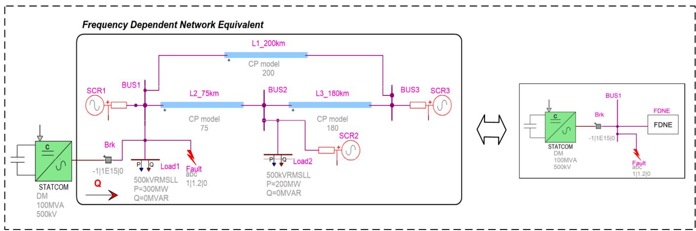
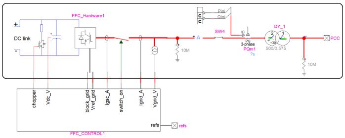
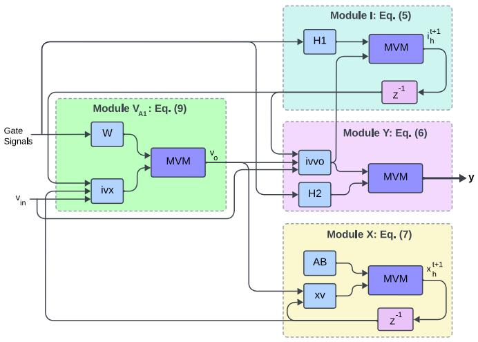
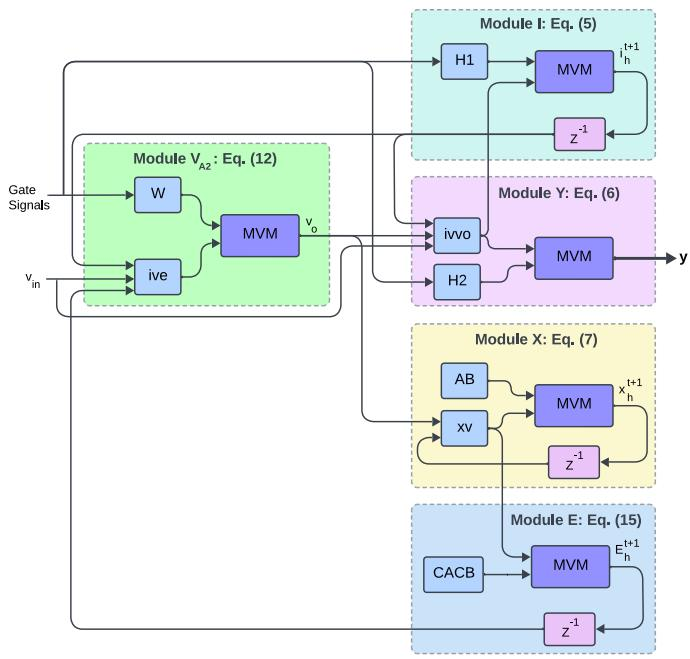
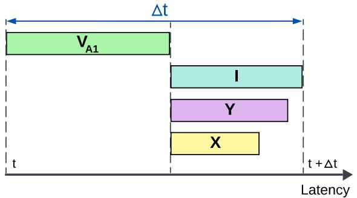
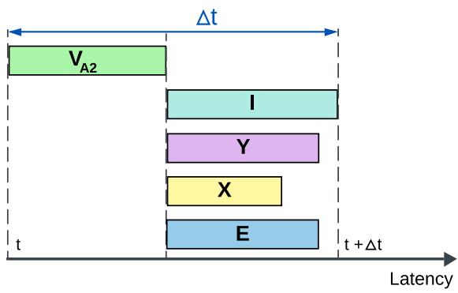
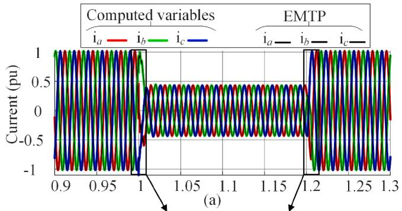
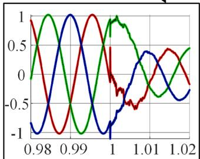
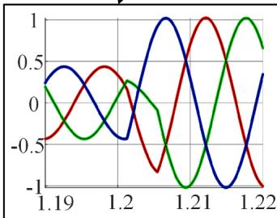

# FPGA-based simulation of grid-tied converters using frequency-dependent network equivalent⋆

Fahimeh Hajizadeh a,∗, Alireza Masoom b, Tarek Ould-Bachir c, Jean-Pierre David a

a Dept. electrical engineering, Polytechnique Montréal, Montreal, Canada   
b Hydro-Québec Research Institute (IREQ), Varennes, Canada   
c MOTCE Laboratory, DGIGL, Polytechnique Montréal, Canada

# a r t i c l e i n f o

Keywords:

FPGA

FDNE

Real-time simulation

Electromagnetic simulation

STATCOM

# a b s t r a c t

This paper introduces a real-time simulation framework for grid-tied converters, implemented on fieldprogrammable gate arrays (FPGAs). The framework incorporates a Frequency-Dependent Network Equivalent (FDNE) to reduce the original part of the circuit that is not directly under study into a frequency-dependent admittance model, enabling precise modeling of the power network’s frequency-dependent dynamics while streamlining the onboard simulation and modeling process. The proposed framework is implemented on the Alveo U280 FPGA, achieving sub-microsecond latencies, low resource utilization, and high computational fidelity across various data types, including single-, double-precision, and customized floating-point formats. The numerical test and validation were conducted using a high-voltage power network that includes detailed models of transmission lines, loads, and a Static Synchronous Compensator (STATCOM), etc. Simulation results show strong alignment with reference models developed in the EMTP, achieving faster-than-real-time performance. These findings demonstrate the effectiveness of the proposed solution in delivering high-speed, resource-efficient, and scalable real-time simulations, providing a promising approach for testing and validating advanced control strategies in modern power systems.

# 1. Introduction

The integration of power converters in modern power systems has become essential to accommodate the growing adoption of distributed energy resources (DER) such as wind turbines, solar photovoltaics and charging stations for electric vehicles [1]. Power converters are essential for connecting renewable energy sources to the grid, facilitating efficient energy transfer, and improving grid stability through active and reactive power management [2,3]. These converters connect various renewable energy sources to the power grid, facilitating cleaner energy consumption and addressing intermittency and fluctuating load demands [4–6]. However, the extensive use of power electronic devices, especially in grids with many DERs, poses distinct challenges to grid stability. This situation requires advanced control solutions to address potential power quality issues.

However, using power converters, such as voltage source converters (VSCs) and other inverter-based resources, presents challenges for grid stability. These devices can interact with conventional synchronous machines and other grid elements, causing oscillations, higher frequency

change rates, and frequency overshoots [7,8]. Moreover, control strategies to manage the dynamic performance of these converters must be meticulously designed to minimize harmonic distortion and maintain unity power factor for improved grid resilience [9]. As the use of such devices grows, it is essential to establish effective control methodologies to manage interactions with traditional grid infrastructure.

This paper presents a simulation framework for grid-connected converters to address these challenges, designed using field-programmable gate arrays (FPGAs). The framework integrates a Frequency-Dependent Network Equivalent (FDNE) model to accurately represent the frequency-dependent behavior of the grid. The framework achieves sub-microsecond latencies while preserving computational accuracy. A Static Synchronous Compensator (STATCOM) is employed as a test case to validate the effectiveness of the proposed approach.

The primary contributions of this work include: 1) The development of two novel FDNE integration approaches based on state-space equations, enabling efficient real-time simulation of an FDNE-integrated STATCOM model on FPGA. These formulations leverage matrix-based computations, optimizing execution speed and numerical stability. 2)

  
Fig. 1. A +100 Mvar/-100 Mvar STATCOM implemented by two-level VSC.

The implementation of a resource-efficient FPGA framework, utilizing high-level synthesis (HLS) for FPGA programming and integrating Customized Floating-Point based (CuFP-based) arithmetic. CuFP allows customizable precision, balancing accuracy, and hardware efficiency to achieve optimal FPGA utilization. 3) A demonstration that the proposed model achieves faster-than-real-time performance, significantly reducing simulation latencies. This capability positions the framework as a powerful tool for accelerating electromagnetic transient (EMT) simulation applications. 4) An in-depth analysis of resource utilization and computational trade-offs, emphasizing the role of the CuFP library in delivering optimal results.

The remainder of this paper is organized as follows: Section 2 provides an overview of the key concepts. Section 3 outlines the proposed implementation methodology. Section 4 describes the test case used to assess the proposed model’s performance compared to the commercial tool EMTP®. Section 5 offers a comprehensive analysis of the FPGA implementation, focusing on latency, resource utilization, and accuracy. Finally, Section 6 presents the conclusions.

# 2. Background

# 2.1. FPGA-based power system simulation

FPGAs have been used in real-time simulation applications for many years, particularly in hardware-in-the-loop (HIL) configurations. The inherent parallelism of FPGAs allows for the simulation of complex power electronic circuits with small time steps, ensuring high fidelity and precise interfacing with physical controllers [10,11]. Beyond real-time simulation, research has extended the use of FPGAs to faster-than-real-time (FTRT) simulation. This approach allows for simulating the behavior of systems in less time than their actual operation, which is beneficial for offline analysis, optimization, and design validation [12,13]. The authors in [10] provide a comprehensive review of the current state of realtime simulation technologies for power systems. The study focuses on digital real-time simulation (DRTS) and HIL simulation, examining their evolution, computing capabilities, common features, hardware and software components, and solution methodologies across various simulator platforms. The work has demonstrated the simulation of power electronics systems with time steps in the range of a few microseconds. The paper [14] emphasizes the role of real-time simulation technologies in design, prototyping, testing, and teaching, categorizing applications by field, fidelity, and multiphysics aspects, with a focus on transmission and distribution systems. It highlights that the time-step in real-time simulation is critical and varies by application: microsecond-range steps are used for HVdc systems and EMT simulations, while millisecond-range steps are typical for phasor simulations. Paper [15] presents a wideband multi-port system equivalent for real-time digital simulators, inte-

grating a FDNE for high-frequency EMT and Transient Stability Analysis (TSA) for electromechanical transients. This approach enables accurate simulation of both fast and slow power system dynamics while reducing hardware costs. The multi-port equivalent can be directly connected to the system boundary, allowing TSA to run on a real-time platform. The achieved time-steps vary by simulation type, with 25-50 µs for EMT simulations and 1-2 ms for TSA solutions.

# 2.2. FDNE

FDNE aims to reduce the computational burden of Transient simulations of large networks are done by dividing the network under study into two zones: the study zone and the external zone. Assuming that the external zone has a minor impact on a given transient study occurring within the study zone. An FDNE model consists of a rational model [16], its coefficients are calculated to match the frequency response of the subnetwork to replace (external zone) for a finite frequency band as:

$$
\mathbf {Y} (s) \cong \mathbf {Y} _ {\text {f i t t e d}} (s) = \mathbf {G} _ {0} + s \mathbf {E} + \sum_ {k = 1} ^ {n} \frac {\mathbf {R} _ {k}}{s - p _ {k}} \tag {1}
$$

where $\mathbf { Y } ( s )$ is a ?? × ?? frequency-dependent admittance matrix, and coefficients $p _ { k }$ and $\mathbf { R } _ { k }$ are poles and residues matrices, respectively; ?? denotes the number of poles of the model; and $\mathbf { G } _ { 0 }$ and ?? are constant matrices (?? is typically a zero matrix). The proposed method is sensitive to the quality of the rational fitting of the FDNE, as poor fitting can lead to inaccuracies in the simulation results.

The FDNE model can be expressed using state-space equations as follows:

$$
\left[ \begin{array}{l} \dot {\mathbf {x}} (t) \\ \mathbf {i} _ {F} (t) \end{array} \right] = \left[ \begin{array}{l l} \mathbf {A} & \mathbf {B} \\ \mathbf {C} & \mathbf {D} \end{array} \right] \left[ \begin{array}{l} \mathbf {x} (t) \\ \mathbf {v} (t) \end{array} \right] \tag {2}
$$

where ??(??) is the FDNE state variable. The matrices ?? and ?? contain the FDNE model poles and residues, with dimensions (????) × (????) and $p \times ( p n )$ , respectively. The matrix ?? consists of ones and zeros, structured accordingly, with a size of $( p n ) \times p .$ The matrix ?? is the same as in Eq. (1), with dimensions $p \times p .$ the input and output vectors $\mathbf { v } ( t )$ and $\mathbf { i } _ { F } ( t )$ represent voltages and currents, respectively. The Backward Euler method is applied in solving the state-space equations, where the next time-step is computed using precomputed system matrices, reducing computational complexity while preserving accuracy.

$$
\left[ \begin{array}{l} \mathbf {x} (t + \Delta t) \\ \mathbf {i} _ {F} (t) \end{array} \right] = \left[ \begin{array}{l l} \mathbf {A} _ {d} & \mathbf {B} _ {d} \\ \mathbf {C} _ {d} & \mathbf {D} _ {d} \end{array} \right] \left[ \begin{array}{l} \mathbf {x} (t) \\ \mathbf {v} (t) \end{array} \right] \tag {3}
$$

where $\mathbf { A } _ { d } , \mathbf { B } _ { d } , \mathbf { C } _ { d } ,$ and $\mathbf { D } _ { d }$ are discrete versions of matrices $\mathbf { A } , \mathbf { B } , \mathbf { C } ,$ and ??, respectively.

  
Fig. 2. Detailed view of the STATCOM.

# 2.3. FPGA-based FDNE simulation

FPGA-based FDNE simulations have gained prominence for achieving ultra-low latency and high parallelism, enabling sub-microsecond time steps. Additionally, in [17], the potential of real-time FDNE models was explored on both CPUs and FPGAs, focusing on parallelizing the FDNE algorithm and proposing a partitioning method to optimize computations. Moreover, an FPGA-based FDNE model for accurate real-time simulation of aircraft power systems was presented in [18], employing FDNE models to precisely represent aircraft power cables within an HIL simulation environment. Our work achieves sub-microsecond time-steps for a more intricate test case, highlighting the capability of FPGA-based simulations to efficiently model complex FDNE systems with excellent accuracy and precision for both real-time and FTRT applications.

# 2.4. HLS FPGA programming

HLS bridges the gap between software-oriented design and hardware-level implementation, offering a streamlined approach to developing complex systems [19]. By enabling developers to describe digital system behavior using high-level programming languages like C or C++, HLS tools simplify FPGA programming. Furthermore, HLS tools automate numerous optimization tasks, reducing manual effort and significantly accelerating the development process.

The CuFP library enhances FPGA resource efficiency while ensuring scalability and computational accuracy, making it a powerful tool for future advancements in grid-tied converter simulations [20]. This work demonstrates how CuFP leverages high-level descriptions to reduce computational latency, optimizing performance while maintaining precision and adaptability in complex scenarios.

# 3. Implementation methodology

# 3.1. Brief test case presentation

Fig. 1 illustrates the test circuit implemented in EMTP® and used for voltage regulation in electrical power systems. This model represents a 500 kV, 100 MVA STATCOM connected to a 500 kV bus, typically used to stabilize the voltage at a high-voltage transmission line. The STAT-COM includes a two-level voltage source converter (VSC) block, power transformer, and associated control and protection systems.

The detailed two-level topology is used for the VSC, and the valve comprises one IGBT switch, two non-ideal (series and anti-parallel) diodes, and a snubber circuit, as shown in Fig. 2. A non-ideal switch represents the diodes. The figure displays the configuration of the STAT-COM and its integration within the power system, highlighting the components such as the coupling transformer, AC filters, and the control mechanism that manages the reactive power injection or absorption.

# 3.2. Integration of STATCOM and FDNE

This section examines two distinct approaches for integrating the STATCOM with the FDNE. While the equations presented in this work

are explicitly derived for the STATCOM test case, the underlying methodology is broadly applicable and can be easily generalized to other grid-tied converter applications.

# 3.2.1. Approach 1

To characterize the dynamic behavior of the STATCOM, we start by defining its mathematical formulation as outlined in [11]:

$$
\left[ \begin{array}{l} \mathbf {i} _ {h} (t + \Delta t) \\ \mathbf {i} _ {C} (t) \end{array} \right] = \left[ \begin{array}{c c c} \mathbf {H} _ {1 1} ^ {\sigma} & \mathbf {H} _ {1 2} ^ {\sigma} & \mathbf {H} _ {1 3} ^ {\sigma} \\ \mathbf {H} _ {2 1} ^ {\sigma} & \mathbf {H} _ {2 2} ^ {\sigma} & \mathbf {H} _ {2 3} ^ {\sigma} \end{array} \right] \left[ \begin{array}{l} \mathbf {i} _ {h} (t) \\ \mathbf {v} _ {i n} (t) \\ \mathbf {v} (t) \end{array} \right] \tag {4}
$$

where $\mathbf { H } _ { i j }$ are the matrices associated with switch combinations that result from the algebraic manipulations of the MANA matrix, the notation ?? refers to the switch combination, $\mathbf { i } _ { h }$ are history terms of the STAT-COM, $\mathbf { v } _ { i n }$ internal voltage sources, ?? external voltage sources, and $\mathbf { i } _ { C }$ the current drawn from the external sources (FDNE). The size of the matrix ?? depends on the number of history terms and the number of internal and external voltages. State update and output expressions in (4) can be separated, as shown in (5), (6):

$$
\mathbf {i} _ {h} (t + \Delta t) = \left[ \begin{array}{l l l} \mathbf {H} _ {1 1} ^ {\sigma} & \mathbf {H} _ {1 2} ^ {\sigma} & \mathbf {H} _ {1 3} ^ {\sigma} \end{array} \right] \left[ \begin{array}{l} \mathbf {i} _ {h} (t) \\ \mathbf {v} _ {i n} (t) \\ \mathbf {v} (t) \end{array} \right] \tag {5}
$$

$$
\mathbf {i} _ {C} (t) = \left[ \begin{array}{l l l} \mathbf {H} _ {2 1} ^ {\sigma} & \mathbf {H} _ {2 2} ^ {\sigma} & \mathbf {H} _ {2 3} ^ {\sigma} \end{array} \right] \left[ \begin{array}{l} \mathbf {i} _ {h} (t) \\ \mathbf {v} _ {i n} (t) \\ \mathbf {v} (t) \end{array} \right] \tag {6}
$$

Same state update and output expressions separation can be applied for the FDNE in (3), we have (7), (8):

$$
\mathbf {x} (t + \Delta t) = \left[ \begin{array}{l l} \mathbf {A} _ {d} & \mathbf {B} _ {d} \end{array} \right] \left[ \begin{array}{l} \mathbf {x} (t) \\ \mathbf {v} (t) \end{array} \right] \tag {7}
$$

$$
\mathbf {i} _ {F} (t) = \left[ \begin{array}{l l} \mathbf {C} _ {d} & \mathbf {D} _ {d} \end{array} \right] \left[ \begin{array}{l} \mathbf {x} (t) \\ \mathbf {v} (t) \end{array} \right] \tag {8}
$$

When the STATCOM and FDNE are integrated into the system, the following relationship is established: $\mathbf { i } _ { F } ( t ) = - \mathbf { i } _ { C } ( t )$ . Thus, by combining the (6), and (8), the following expression for computing the voltage is obtained:

$$
\mathbf {v} (t) = \left[ \begin{array}{l l l} \mathbf {W} _ {1} ^ {\sigma} & \mathbf {W} _ {2} ^ {\sigma} & \mathbf {W} _ {3} ^ {\sigma} \end{array} \right] \left[ \begin{array}{l} \mathbf {i} _ {h} (t) \\ \mathbf {v} _ {i n} (t) \\ \mathbf {x} (t) \end{array} \right] \tag {9}
$$

where

$$
\left\{ \begin{array}{l} \mathbf {W} _ {1} ^ {\sigma} = - \left(\mathbf {H} _ {2 3} ^ {\sigma} + \mathbf {D}\right) ^ {- 1} \mathbf {H} _ {2 1} ^ {\sigma} \\ \mathbf {W} _ {2} ^ {\sigma} = - \left(\mathbf {H} _ {2 3} ^ {\sigma} + \mathbf {D}\right) ^ {- 1} \mathbf {H} _ {2 2} ^ {\sigma} \\ \mathbf {W} _ {3} ^ {\sigma} = - \left(\mathbf {H} _ {2 3} ^ {\sigma} + \mathbf {D}\right) ^ {- 1} \mathbf {C} \end{array} \right. \tag {10}
$$

The following algorithm simulates the model in the time domain with a fixed time-step Δ?? for Approach 1.

# Algorithm 1 Simulation procedure for approach 1.

1: Precompute matrices ??, ??, ???????? , ????, ????, and ????.   
2: for each time point ?? do   
3: Solve for ??(??) using (9).   
4: Optional: compute any output needed, e.g., using (6).   
5: Update states of the STATCOM ${ \bf i } _ { \bf h } ( t )$ using (5).   
6: Update states of the FDNE ??(??) using (7).   
7: end for

# 3.2.2. Approach 2

The purpose of Approach 2 is to reduce the computation latency at each time-point with a few additional precomputations. The idea here is to reduce matrix sizes in (9). Let’s define ??(??) as follows:

$$
\xi (t) = \mathbf {C x} (t) \tag {11}
$$

  
Fig. 3. Integration of STATCOM and FDNE according to Approach 1. ??−1 denotes a single time-step delay.

Hence allowing one to rewrite (9) as:

$$
\mathbf {v} (t) = \left[ \begin{array}{l l l} \mathbf {W} _ {1} ^ {\sigma} & \mathbf {W} _ {2} ^ {\sigma} & \mathbf {W} _ {4} ^ {\sigma} \end{array} \right] \left[ \begin{array}{l} \mathbf {i} _ {h} (t) \\ \mathbf {v} _ {i n} (t) \\ \boldsymbol {\xi} (t) \end{array} \right] \tag {12}
$$

where

$$
\mathbf {W} _ {4} ^ {\sigma} = - \left(\mathbf {H} _ {2 3} ^ {\sigma} + \mathbf {D}\right) ^ {- 1} \tag {13}
$$

As we can rewrite (11) as follows:

$$
\xi (t + \Delta t) = \mathbf {C} \mathbf {x} (t + \Delta t) \tag {14}
$$

Combining with (7), we have:

$$
\xi (t + \Delta t) = \left[ \begin{array}{l l} \mathbf {C A} & \mathbf {C B} \end{array} \right] \left[ \begin{array}{l} \mathbf {x} (t) \\ \mathbf {v} (t) \end{array} \right] \tag {15}
$$

The simulation algorithm becomes as follows: The CPU is responsi-

# Algorithm 2 Simulation procedure for approach 2.

1: Precompute matrices ????, ????, ???????? , ????1 , ????2 , and $\mathbf { W } _ { 4 } ^ { \sigma } .$   
2: for for each time point ?? do   
3: Solve for ??(??) using (12).   
4: Optional: Compute any output needed, $\mathrm { e . g . , }$ using (6).   
5: Update states of the STATCOM ${ \bf i } _ { \bf h } ( t )$ using (5).   
6: Update states of the FDNE ??(??) using (7).   
7: Update variable ??(??) using (15).   
8: end for

ble for the precomputation of matrices (??, ??, ???? , ????, ????, and ????) and (????, ????, ???? , ????, ????, and $\mathbf { W } _ { 4 } ^ { \sigma } ) _ { i }$ , in approaches 1 and 2, respectively, ensuring efficient handling of computationally intensive operations. Once precomputed, these matrices are transferred to the FPGA, which performs real-time execution, solving system equations and updating states at each time step.

# 3.3. Latency analysis for approach 1 and approach 2

Fig. 3 illustrates the datapath resulting from the integration of the STATCOM and the FDNE models within a unified simulation framework, according to Approach 1, whereas Fig. 4 shows the integration according to Approach 2. Fig. 5 illustrates the computational latency for Approach 1 and Approach 2. As shown in Fig. 3, the maximum latency in Approach 1 is governed by two factors: (1) the latency of module $\mathbf { V } _ { \mathrm { A 1 : } }$ , and (2) the maximum latency of the modules ??, ??, and ??, which are executed in parallel. Since these modules operate concurrently, their collective

  
Fig. 4. Integration of STATCOM and FDNE according to Approach 2. ??−1 denotes a single time-step delay.

  
(a) Approach 1

  
(b) Approach 2   
Fig. 5. Comparison of latency for different approaches.

latency is determined by the module with the highest computational delay. This approach ensures efficient parallelism within the constraints of the design Algorithms 1 and 2.

$$
\ell_ {\text {A p p r o a c h} 1} = \ell_ {\mathrm {V} _ {\mathrm {A} 1}} + \max  \left(\ell_ {\mathrm {I}}, \ell_ {\mathrm {Y}}, \ell_ {\mathrm {X}}\right) \tag {16}
$$

On the other hand, Fig. 5(b) illustrated the computational latency of Approach 2, which is determined by the latency of module $\mathbf { V } _ { \mathbb { A } 2 }$ and the maximum latency of the modules ??, ??, ??, and ??, which also operate in

parallel.

$$
\ell_ {\text {A p p r o a c h} 2} = \ell_ {\mathrm {V} _ {\mathrm {A} 2}} + \max  \left(\ell_ {\mathbf {I}}, \ell_ {\mathbf {Y}}, \ell_ {\mathbf {X}}, \ell_ {\mathbf {E}}\right) \tag {17}
$$

A key observation is that the latency of module $\mathbf { V } _ { \mathrm { A 1 } }$ is higher than $\mathbf { V } _ { \mathbf { A } 2 }$ . Hence, By introducing module ?? into the parallel pipeline, Approach 2 further distributes the workload, optimizing the overall latency.

# 4. Test case

Fig. 1 illustrates the test circuit implemented in $\mathbf { E M T P } ^ { \mathbb { ( B ) } }$ and used for voltage regulation in electrical power systems. This model represents a 500 kV, 100 MVA STATCOM connected to a 500 kV bus, typically used to stabilize the voltage at a high-voltage transmission line. The figure displays the configuration of the STATCOM and its integration within the power system, highlighting the components such as the coupling transformer, AC filters, and the control mechanism that manages the reactive power injection or absorption. The FDNE model contains an ideal current source to represent the steady-state conditions of the original circuit, connected in parallel to the state-space model described by Eq. (2). EMTP computes the parameters of FDNE by employing the vector fitting method combined with the Loewner-Matrix method [21] to determine the model order automatically. The frequency range spans from 1 Hz to 1 MHz, with a tolerance set to $1 ^ { - 6 }$ , which results in 52 poles in the model. Therefore, the dimensions of the state-space matrices are as follows: ?? is $1 5 6 \times 1 5 6 ,$ , ?? is $1 5 6 \times 3 ,$ , ?? is $3 \times 1 5 6 ,$ , and ?? is $3 \times 3 .$ .

For a dynamic response of STATCOM, a three-phase fault occurs on BUS 1 at ?? = 1 s and lasts for 200 ms. During the fault, the voltage at Bus 1 decreases from the reference voltage, $V _ { \mathrm { r e f } } = 1$ pu. The STATCOM reacts to the event by generating the reactive power to increase the bus voltage.

# 5. Experimental results

# 5.1. Simulation accuracy

To validate the accuracy and fidelity of the proposed implementation, the results are compared with a reference model developed in EMTP®. Fig. 6(a) presents the superimposed phase currents at the receiving end, as computed by the proposed implementation and the $\mathbf { E M T P } ^ { \bar { \mathbb { B } } }$ model, for the 0.9 to 1.3 seconds of the simulation. Detailed close-up views at critical events are shown in Fig. 6(b) and (c), illustrating the system’s behavior during fault initiation and clearing, respectively. As observed, the proposed implementation perfectly matches the reference model, confirming its high accuracy and reliability.

# 5.2. Area occupation and speed performance

This section details the experimental results of implementing the proposed model on an Alveo U280 FPGA using Vitis HLS 2023.2. The selected FPGA platform, the xcu280-fsvh2892-2L-e, enables high-speed, real-time operation, with results reported at RTL simulation level, after post-routing to reflect actual hardware performance rather than simulation estimates. The offline simulations are carried out on $\mathbf { E M T P } ^ { \mathbb { ( B ) } }$ v4.5 to validate the FPGA implementation. The simulations are run on a laptop with an 11th Gen Intel i9-11950H processor and 64 GB DDR5 RAM.

The FDNE model size directly impacts FPGA resource utilization and execution time. As the number of poles in the admittance matrix increases, the state-space representation expands, leading to a larger system matrix. This results in higher memory usage and increased computational load due to additional state updates, affecting occupation and execution time. However, since our FPGA implementation leverages parallel computation and precomputed matrices, the latency increase remains moderate.

  
Time (s)   
Fig. 6. Comparison of the computed current with the reference current from the EMTP® model; (a) Close-up view of phase-currents during fault initiation; and (b) Close-up view of phase-currents during fault clearing.

The proposed model is evaluated based on execution cycles, FPGA resource utilization, and accuracy. The model operates at a clock frequency of 250 MHz, and its performance is assessed using different data types: single, double, and customized floating-point formats provided by the CuFP library [20]. For the CuFP data type, three different configurations are chosen for comparison. In this library, the notation $\mathsf { C u F P } ( w _ { e } , w _ { m } )$ represents a floating-point number with an exponent bit width of $w _ { e }$ and a mantissa bit width of $w _ { m } .$ . To enable meaningful comparisons with IEEE 754 single- and double-precision formats, CuFP (8, 24) and CuFP (11, 53) were specifically selected for this study. While fixed-point arithmetic could reduce FPGA resource usage, particularly for DSPs and LUTs, it requires careful bit-width optimization to avoid numerical instability due to its limited dynamic range. This is particularly challenging in power system simulations, where wide dynamic ranges are common.

To assess the accuracy of the proposed model, the 2-norm relative error $( \mathrm { R E _ { 2 \cdot n o r m } } )$ is employed as the primary metric. This error metric, shown in (18), quantifies the relative discrepancy between the computed output from FPGA $( o u t _ { \mathrm { f p g a } } )$ and the reference output from EMTP® $( o u t _ { \mathrm { e m t p } } )$ . Specifically, the $\operatorname { R E } _ { 2 \cdot \mathrm { n o r m } }$ is calculated as follows:

$$
\mathrm {RE} _ {2 - \text {norm}} (\%) = \frac {\left\| \text {out} _ {\text {emtp}} - \text {out} _ {\text {fpga}} \right\| _ {2}}{\left\| \text {out} _ {\text {emtp}} \right\| _ {2}} \times 100 \tag{18}
$$

where $o u t _ { \mathrm { e m t p } }$ represents the reference output and $o u t _ { \mathrm { f p g a } }$ represents the computed output. The symbol ‖??????‖ represents the 2-norm of the output.

Table 1 presents a comprehensive analysis of the performance metrics, including resource utilization and accuracy, of the proposed model for Approach 1 and Approach 2, evaluated across various data types. Key parameters such as latency, FPGA resource usage (BRAM, DSPs, LUTs, and Registers), and accuracy are compared.

In Approach 1, in the case of single-precision floating-point, the model achieves a latency of 580 ns and an RE -norm of 0.0782 %. This represents a relatively low latency but with limited accuracy. CuFP (8, 24) shows a promising alternative, achieving a latency of 408 ns with slightly higher accuracy, offering comparable accuracy to single-

Table 1 Comparison of the proposed model’s performance in terms of number of cycles, resource utilization, and accuracy for Approach 1 and Approach 2.   

<table><tr><td>Approach</td><td>Data Type</td><td>Frequency (MHz)</td><td># of Cycles</td><td>Latency (ns)</td><td>BRAM</td><td>DSPs</td><td>LUTs</td><td>Registers</td><td>RE2-norm (%)</td></tr><tr><td rowspan="5">Approach 1</td><td>Single-Precision Floating-Point</td><td>250</td><td>145</td><td>580</td><td>260 (6.44%)</td><td>470 (5.20%)</td><td>72,232 (5.57%)</td><td>86,106 (3.32%)</td><td>7.82 × 10-2</td></tr><tr><td>Double-Precision Floating-Point</td><td>250</td><td>180</td><td>720</td><td>403 (9.99%)</td><td>777 (8.43%)</td><td>163,013 (12.57%)</td><td>206,860 (7.98%)</td><td>1.03 × 10-2</td></tr><tr><td>CuFP (8, 24) [20]</td><td>250</td><td>102</td><td>408</td><td>254 (6.30%)</td><td>343 (3.80%)</td><td>122,036 (9.36%)</td><td>98,478 (3.78%)</td><td>8.7 × 10-2</td></tr><tr><td>CuFP (8, 34) [20]</td><td>250</td><td>116</td><td>464</td><td>300 (7.45%)</td><td>671 (7.44%)</td><td>182,332 (13.99%)</td><td>141,551 (5.43%)</td><td>5.07 × 10-2</td></tr><tr><td>CuFP (11, 53) [20]</td><td>250</td><td>139</td><td>556</td><td>326 (8.09%)</td><td>756 (10.61%)</td><td>227,619 (17.35%)</td><td>183,480 (6.75%)</td><td>1.08 × 10-2</td></tr><tr><td rowspan="5">Approach 2</td><td>Single-Precision Floating-Point</td><td>250</td><td>123</td><td>492</td><td>263 (6.52%)</td><td>874 (9.68%)</td><td>90,303 (6.92%)</td><td>121,277 (4.65%)</td><td>7.81 × 10-2</td></tr><tr><td>Double-Precision Floating-Point</td><td>250</td><td>157</td><td>628</td><td>486 (12.05%)</td><td>1676 (18.57%)</td><td>218,044 (16.72%)</td><td>270,270 (10.36%)</td><td>1.03 × 10-2</td></tr><tr><td>CuFP (8, 24) [20]</td><td>250</td><td>78</td><td>312</td><td>264 (6.61%)</td><td>374 (4.14%)</td><td>116,534 (8.94%)</td><td>87,178 (3.23%)</td><td>8.68 × 10-2</td></tr><tr><td>CuFP (8, 34) [20]</td><td>250</td><td>86</td><td>344</td><td>359 (8.92%)</td><td>780 (8.64%)</td><td>185,911 (14.26%)</td><td>140,549 (5.39%)</td><td>5.06 × 10-2</td></tr><tr><td>CuFP (11, 53) [20]</td><td>250</td><td>107</td><td>428</td><td>335 (8.31%)</td><td>957 (10.61%)</td><td>226,217 (17.35%)</td><td>175,961 (6.75%)</td><td>1.07 × 10-2</td></tr></table>

precision while using fewer resources. This demonstrates the efficiency of CuFP (8, 24) in scenarios where resource constraints and latency are critical. CuFP (8, 34) configuration provides an even higher accuracy, as it uses more bits for the mantissa. However, this comes with an increase in latency and higher resource utilization. This configuration is suitable for applications where accuracy is more critical than latency, but the higher resource requirements must be considered when working within resource-constrained environments. Finally, the double-precision floating-point implementation comes with a higher latency of 720 ns and higher resource consumption. In contrast, CuFP (11, 53) achieves a similar level of accuracy while maintaining a lower latency of 556 ns, and fewer resources than doubleprecision. This data type balances performance and efficiency, enabling fast computation with minimal resources, making it ideal for real-time simulation.

Moving to Approach 2, the single-precision floating-point implementation offers a latency of 492 ns and an RE -norm of 0.0781 %. Resource utilization includes 263 BRAMs, 874 DSPs, 90,303 LUTs, and 121,277 registers. Compared to Approach 1, the latency is reduced, but the resource utilization is higher, reflecting the increased demand on resources in this approach. For double-precision floating-point, the latency is 628 ns and is reduced compared to Approach 1. However, the area is more than in Approach 1. When CuFP (8, 24) is utilized, the latency drops to 312 ns, with an RE -norm of 0.0868 %, making it a highly efficient choice for applications requiring low latency and moderate accuracy. This configuration uses 264 BRAMs, 374 DSPs, 116,534 LUTs, and 87,178 registers, showcasing significant latency and resource efficiency improvements over floating-point implementations. For those applications that need more accuracy, the CuFP (8, 34) configuration can be a better option rather than CuFP (8, 24). This configuration offers an improved accuracy of 0.0506 %, with a latency of 344 ns. Although the increased accuracy comes with higher resource utilization, the configuration offers a good balance between precision and performance. Similarly, CuFP (11, 53) achieves a latency of 428 ns, closely matching the accuracy of double-precision floating-point with an RE - norm of 0.0107 %. Moreover, it consumes fewer resources than the double-precision implementation, demonstrating a balance between accuracy and resource utilization.

The proposed model demonstrates efficient resource utilization, low latency, and high accuracy across different data types and configu-

rations. In particular, approach 2 with CuFP configurations offers a promising trade-off between latency, accuracy, and resource efficiency, making it an excellent choice for real-time applications. Additionally, the flexibility of the CuFP library allows users to customize the floatingpoint configuration to meet specific needs, providing enhanced control over performance and resource usage. The reduction in latency in Approach 2, however, comes at the expense of increased resource utilization. The additional computational resources required to support the expanded parallel pipeline result in a larger hardware footprint. This tradeoff reflects a deliberate design choice to prioritize latency reduction over resource constraints. The comparative analysis highlights the benefits of leveraging parallelism to optimize latency. Approach 2 significantly reduces computational delay, making it suitable for latency-sensitive applications, although with higher area requirements. The choice between these approaches depends on the specific application requirements and the hardware constraints of the target system. For applications where accuracy is the priority, CuFP (11, 53) or double-precision floating-point should be used to minimize numerical errors. If latency is the primary concern, particularly for real-time control applications, configurations in the second approach, such as CuFP (8, 24), provide a good balance between resource efficiency and numerical precision, significantly reducing execution time while maintaining acceptable accuracy. CuFP (8, 34) serves as a middle ground, offering improved accuracy over CuFP (8, 24) while keeping latency lower than full double-precision arithmetic. These results demonstrate that CuFP gives the flexibility to balance precision and computational efficiency, making it well-suited for various power system applications.

# 5.3. Speed-up performance

In real-time simulation, a system is considered real-time if its execution time per step does not exceed the simulation time step (Δ??). In our work, the latency per time step is in the nanosecond range (as shown in Table 1), significantly faster than the required microsecond-level time steps for power electronics simulations. The results highlight that the implementation achieved nanosecond-level latencies, making it well-suited for real-time applications. In comparison, the reference model, developed using EMTP® and executed on a system with the previously described configuration, was evaluated for specific time points, e.g. 50,000 time-points, with a fixed time-step. Under these

conditions, the reference model exhibited a latency of 6.0625 seconds. By contrast, the proposed model, executed for the same number of time points, completed the task in just 24.6 ms using the single-precision data type, as detailed in (19).

$$
\text {T o t a l} = 4 9 2 \times 1 0 ^ {- 9} \times 5 0, 0 0 0 = 2 4. 6 \mathrm {m s} \tag {19}
$$

This achievement represents a performance improvement of approximately 246 times compared to the reference model, highlighting that the proposed implementation is suitable for real-time applications and capable of operating faster than real-time.

# 6. Conclusions

This paper presented an efficient FPGA-based real-time simulation framework for grid-connected converters, integrating a STATCOM model with an FDNE approach. The proposed implementation was validated against a high-fidelity reference model developed in EMTP®, demonstrating strong agreement in waveform accuracy and achieving minimal relative error across various floating-point formats. The results confirm the effectiveness of the proposed framework in replicating dynamic system behaviors with high precision. The FPGA implementation, tested on the Alveo U280 platform, showcases the potential for scalable and efficient real-time simulation systems. With sub-microsecond latencies and low resource utilization, the model is well-suited for integration into real-time control systems for power networks, where speed and accuracy are critical. Notably, the proposed approach achieved a remarkable 246 times speed improvement compared to the reference model, demonstrating its capability to perform faster-than-real-time simulations without compromising accuracy. Furthermore, the flexibility of the CuFP library enables future adaptations for different precision requirements and hardware configurations. Future work will focus on extending the methodology to multi-converter systems, such as multiple STATCOMs or active power filters, to assess scalability and performance trade-offs. Additionally, HIL validation will be conducted to confirm real-time execution in practical scenarios. Another research direction is adaptive precision selection, where CuFP bit-widths dynamically adjust based on system operating conditions to optimize computational efficiency further.

# CRediT authorship contribution statement

Fahimeh Hajizadeh: Data curation, Methodology, Conceptualization, Resources, Writing – original draft, Visualization, Validation, Software, Investigation, Formal analysis; Alireza Masoom: Data curation, Writing – original draft, Validation, Software, Resources; Tarek Ould-Bachir: Validation, Supervision, Writing – review & editing, Investigation, Conceptualization, Visualization, Project administration, Formal analysis, Methodology; Jean-Pierre David: Supervision, Project administration, Methodology, Writing – review & editing, Conceptualization.

# Data availability

Data will be made available on request.

# Declaration of competing interest

The authors declare that they have no known competing financial interests or personal relationships that could have appeared to influence the work reported in this paper.

# Funding

This research was funded in part by a collaborative research and development grant from CRIAQ/NSERC, in partnership with the industrial collaborators Bombardier Aviation, Pratt & Whitney Canada Inc., OPAL-RT, and IDS North America Ltd.

# References

[1] N. Burham, Study of STATCOM for Voltage Compensation in 14-Bus IEEE Grid, Thesis, uppsala university, 2024.   
[2] C.K. Tse, M. Huang, X. Zhang, D. Liu, X.L. Li, Circuits and systems issues in power electronics penetrated power grid, IEEE Open J. Circ. Syst. 1 (2020) 140–156.   
[3] S. Kouro, J.I. Leon, D. Vinnikov, L.G. Franquelo, Grid-connected photovoltaic systems: an overview of recent research and emerging PV converter technology, IEEE Ind. Electron. Mag. 9 (1) (2015) 47–61.   
[4] S. Rivera, S. Kouro, S. Vazquez, S.M. Goetz, R. Lizana, E. Romero-Cadaval, Electric vehicle charging infrastructure: from grid to battery, IEEE Ind. Electron. Mag. 15 (2) (2021) 37–51.   
[5] N. Kumar, P. Wagh, D. Kolhe, P. Arane, P. Kadlag, Power quality improvement in distributed energy resources for EV charging using STATCOM, in: International Conference on Sustainable Technology for Power and Energy Systems (STPES), 2022, pp. 1–4.   
[6] R. Sahoo, M. Roy, An FPGA-Based balancing of capacitor voltage for a five-Level CHB inverter, Arab. J. Sci. Eng. 49 (2024) 16335–16346.   
[7] C.-Y. Tang, J.-H. Jheng, An active power ripple mitigation strategy for three-phase grid-tied inverters under unbalanced grid voltages, IEEE Trans. Power Electron. 38 (1) (2023) 27–33.   
[8] Y. Chen, B. Zhang, D. Qiu, Y. Chen, F. Xie, H. Sun, Switched active power control of a grid-connected inverter with reduced rocof and frequency overshoot, IEEE Trans. Power Electron. 39 (4) (2024) 4062–4077.   
[9] A.P. Murdan, I. Jahmeerbacus, S.Z.S. Hassen, Modeling and simulation of a STAT-COM for reactive power control, in: International Conference on Emerging Trends in Electrical, Electronic and Communications Engineering (ELECOM), 2022, pp. 1–6.   
[10] M.D. Omar Faruque, T. Strasser, G. Lauss, V. Jalili-Marandi, P. Forsyth, C. Dufour, V. Dinavahi, A. Monti, P. Kotsampopoulos, J.A. Martinez, K. Strunz, M. Saeedifard, X. Wang, D. Shearer, M. Paolone, Real-time simulation technologies for power systems design, testing, and analysis, IEEE Power Energy Technol. Syst. J. 2 (2) (2015) 63–73.   
[11] H. Chalangar, T. Ould-Bachir, K. Sheshyekani, J. Mahseredjian, Methods for the accurate real-time simulation of high-frequency power converters, IEEE Trans. Ind. Electron. 69 (9) (2022) 9613–9623.   
[12] B. Sullivan, J. Shi, M. Mazzola, B. Saravi, Faster-than-real-time power system transient stability simulation using parallel general norton with multiport equivalent (PGNME), in: IEEE Power & Energy Society General Meeting (PESGM), 2017, pp. 1–5.   
[13] X. Liu, J. Ospina, I. Zografopoulos, A. Russel, C. Konstantinou, Faster than real-time simulation: methods, tools, and applications, in: Proceedings of the 9th Workshop on Modeling and Simulation of Cyber-Physical Energy Systems, MSCPES ’21, Association for Computing Machinery, New York, NY, USA, 2021.   
[14] X. Guillaud, M.O. Faruque, A. Teninge, A.H. Hariri, L. Vanfretti, M. Paolone, V. Dinavahi, P. Mitra, G. Lauss, C. Dufour, P. Forsyth, A.K. Srivastava, K. Strunz, T. Strasser, A. Davoudi, Applications of real-time simulation technologies in power and energy systems, IEEE Power Energy Technol. Syst. J. 2 (3) (2015) 103–115.   
[15] X. Lin, A.M. Gole, M. Yu, A wide-band multi-port system equivalent for real-time digital power system simulators, IEEE Trans. Power Syst. 24 (1) (2009) 237–249. https://doi.org/10.1109/TPWRS.2008.2007000   
[16] J. Morales Rodriguez, E. Medina, J. Mahseredjian, A. Ramirez, K. Sheshyekani, I. Kocar, Frequency-domain fitting techniques: a review, IEEE Trans. Power Del. 35 (3) (2020) 1102–1110.   
[17] F. Dicler, Contributions to the FPGA and CPU Implementation of Frequency-Dependent Network Equivalents for Real-Time and Offline Electromagnetic Transient Power System Simulators, Thesis, 2021.   
[18] F. Hajizadeh, L. Alavoine, T. Ould-Bachir, F. Sirois, J.P. David, FPGA-based FDNE models for the accurate real-time simulation of power systems in aircrafts, in: International Conference on Renewable Energy Research and Applications (ICRERA), 2023, pp. 344–348.   
[19] Y. Uguen, F.D. Dinechin, V. Lezaud, S. Derrien, Application-specific arithmetic in high-level synthesis tools, ACM Trans. Archit. Code Optim. 17 (1) (2020).   
[20] F. Hajizadeh, T. Ould-Bachir, J.P. David, CuFP: an HLS library for customized floating-point operators, Electronics 13 (14) (2024).   
[21] J. Morales, J. Mahseredjian, A. Ramirez, K. Sheshyekani, I. Kocar, A loewner/MPM-VF combined rational fitting approach, IEEE Trans. Power Del. 35 (2) (2019) 802–808.