# Algorithm for fast calculating the energization overvoltages along a power cable based on modal theory and numerical inverse Laplace transform

Han Li a , Peixin Yu a , Shurong Li a , Xuefeng Zhao b , Junbo Deng a, *, Guanjun Zhang a

a State Key Laboratory of Electrical Insulation and Power Equipment, Xi’an Jiaotong University, Xi’an, 710049, China   
b Electric Power Research Institute of State Grid Shaanxi Electric Power Company, Xi’an, 710054, China

# A R T I C L E I N F O

Keywords:

Power cable

Energization overvoltage

Modal theory

Laplace transform

Numerical inverse Laplace transform

Frequency dependent phase model

# A B S T R A C T

Transient overvoltage caused by energization may damage the insulation in a power cable transmission system. Therefore, overvoltage along the cable should be calculated and evaluated carefully. Calculation based on traditional commercial software is time-consuming, therefore, there is a need to develop a new algorithm to improve the computational efficiency. First, coupled cable conductors are transformed into independent modes through phase-mode transformation. Then, the voltage formula of each independent mode in the complex frequency domain is obtained through Laplace transform. Finally, energization overvoltages along the cable are calculated using numerical inverse Laplace transform (NILT) and mode-phase transformation. The proposed algorithm is applied to a 330 kV cable line with a length of 9.6 km to certify the accuracy and computational efficiency. Compared with frequency dependent phase model (FDPM) in PSCAD/EMTDC, relative errors of the obtained results are less than 1%, and the maximum CPU time consumed is only about 8%. The proposed algorithm can improve the computational speed of cable energization overvoltages greatly on the premise of ensuring accuracy and may be contributing to actual applications.

# 1. Introduction

With rapid urbanization, there is a strong demand to transfer tradi tional overhead lines (OHL) into underground power cable lines [1]. The risk of suffering severe overvoltages increases owing to their larger capacitance compared with OHLs [2]. For high-voltage cable power transmission systems, energization overvoltage is one of the severest overvoltages that can occur in the system, which should be simulated or calculated before the construction of the cable transmission project [3]. When equipment such as a circuit breaker is operated in an actual transmission system, energization overvoltages should be checked to avoid damages to the insulation [4].

A commercial program for electromagnetic transient (EMT) calculation such as PSCAD/EMTDC and EMTP, adopts the pi model, Bergeron model, Noda model, J. Marti model, and FDPM to model the power cable [5]. The PI model is a lumped-parameter model, and the other models are all distributed-parameter models. The application of the PI model is limited, and it can only be considered for modeling when the length of the cable is very short or the wave propagation time does not exceed the time step in the simulation [6]. The Bergeron model is a Norton equivalent model based on the traveling wave theory, which combines a

lossless transmission line that takes into account the wave impedance Z0 and the wave speed c with a resistance R that characterizes the attenuation [7]. It is a single-frequency parameter model and is often used in steady-state calculations. The Noda model is a frequency-dependent model which calculates the cable parameters in the phase domain rather than the frequency domain. However, not only full parameter matrices of the power cable are supposed to be calculated in this model, but the convolution processes are also introduced, which will lead to a significant decrease in computational speed [8]. The J. Marti model is a frequency-dependent model with relatively high accuracy, which performs rational function fitting in the s-domain. It is suitable for OHL modeling. However, it requires the user to specify the dominant frequency manually before the simulation, which may lead to a more complex modeling process and lower accuracy [9]. The FDPM is the most accurate and commonly used frequency-dependent model in the simulation software and is also the reference model for comparison in this study. It operates on the principle that the full frequency-dependence of a transmission system can be represented by the propagation function and characteristic admittance [10,11].

The aim of all distributed-parameter models mentioned above is to solve the telegrapher’s equations with higher accuracy and faster

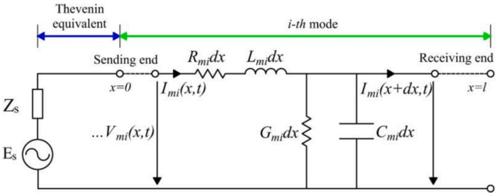  
Fig. 1. Diagram of the distributed parameter circuit of single-phase transmission line.

computational speed. In addition to the methods employed in these models, the telegrapher’s equations can also be solved by applying the combination of the modal theory and NILT. At present, there have already existed some classical NILT algorithms such as the Gaver-Stehfest method, Schapery method, Weeks method, Talbot method, and Fourier series method, which are powerful when the expressions in the complex frequency domain are too complicated to be converted to the time domain by the analytical Laplace transform [12]. Kuhlman compared the efficiency of the above five algorithms based on the boundary element method, and the results show that the Fourier series method is more suitable for common time behaviors and is more robust to free parameters [13]. Rani et.al established a new NILT algorithm by using the Bernoulli polynomials operation matrix and verified the accuracy of the results by some nonlinear differential equations [14]. Baumann et.al proposed a Sinc based NILT algorithm and verified its accuracy for solving fractional differential equations [15]. In addition to the theoretical studies on the NILT algorithms, there also exist some studies applying NILT algorithms to the modeling of transmission lines. For example, Branˇcík et.al proposed a multi-dimensional NILT algorithm based on the fast Fourier transform (FFT) and quotient-difference (q-d) algorithm and applied this algorithm to the calculation of single-phase transmission lines [16,17]. They also performed the modeling on nonuniform lossy transmission lines with fractional-order elements by using NILT methods [18]. Griffith et.al proposed a NITL-based method, which is able to analyze the lossy coupled transmission lines with arbitrary linear terminal and interconnecting networks [19]. Ghnimi et. al presented a study to compare the performance and accuracy of different NILT algorithms for multiconductor transmission line systems modeling, and the result showed that the algorithm based on FFT and q-d is the best [20].

The energization overvoltages of power cables can be easily calculated by using the models integrated into commercial EMT simulation software. However, all these models treat the power cable as a two-port network, which means that only the overvoltages at the sending and receiving ends of the power cable are to be calculated. When overvoltages along a power cable with a large number of cable sections are to be calculated, the modeling process is supposed to be relatively complicated. Besides, it’s necessary to calculate energization overvoltages faster in some emergency situations, but the computational speed of the above methods still needs to be improved. In addition, most of the existing NILT algorithms are simply applied to single-phase uniform transmission lines or multi-conductor uniform transmission lines, few studies combine their algorithms with overvoltage calculations along the power cable. On the basis of these reasons, a novel algorithm is proposed for fast calculating the energization overvoltages along the cross-bonded power cable based on modal theory and NILT. In the calculation process, the power cable is not simply considered as a twoport network, but the voltage formula in the complex frequency domain depending on position is deduced, which greatly simplifies the

modeling process of the power cable with a large number of cable sections. By using the modal theory, unnecessary coupling of cable loops can be avoided, and the combination of Laplace transform and NILT can eliminate the limitation on the minimum time step, which may be helpful in improving the computational efficiency and bringing faster computational speeds. The energization overvoltage calculation algorithm based on modal theory and NILT is an important supplement to the existing commercial software, which may also be contributing to the actual projects.

The paper is structured as follows: Section 2 introduces the energization overvoltage calculation algorithm based on modal theory and NILT in detail, and it is applied to an actual 330 kV cross-bonded power cable line in Section 3, the accuracy of the obtained overvoltages is also verified in this section; Section 4 shows the advantages of the modal theory and NILT based algorithm. In Section 5, the frequency dependence of the energization overvoltage calculation algorithm is discussed, and finally, conclusions are presented in Section 6.

# 2. Calculation of energization overvoltages along the cable

# 2.1. Telegrapher’s equations and modal theory

Telegrapher’s equations are of great importance in the analysis of EMT processes on power cable lines [21,22], whose phasor forms are as follows:

$$
\left\{ \begin{array}{l} \frac {d ^ {2} \boldsymbol {V} _ {p}}{d x ^ {2}} = \boldsymbol {Z} _ {p} \cdot \boldsymbol {Y} _ {p} \cdot \boldsymbol {V} _ {p} \\ \frac {d ^ {2} \boldsymbol {I} _ {p}}{d x ^ {2}} = \boldsymbol {Y} _ {p} \cdot \boldsymbol {Z} _ {p} \cdot \boldsymbol {I} _ {p} \end{array} \right. \tag {1}
$$

where $\mathbf { } v _ { p }$ and $I _ { p }$ represent the frequency-dependent voltage and current at position x of the cable, respectively; and $z _ { p }$ and $\mathbf { Y } _ { p }$ denote the frequency-dependent series impedance matrix and parallel admittance matrix of the cable, respectively.

$z _ { p }$ and $\mathbf { Y } _ { p }$ are not diagonal matrices because of the mutual coupling between the loops in the cable, which makes it complex to solve the differential equations shown in Eq. (1). To solve this problem, the voltage transformation matrix $\mathbf { \delta } _ { T _ { \nu } }$ and current transformation matrix Ti are introduced, as shown in Eq. (2). The diagonalization process is shown in $\operatorname { E q } . \ ( 3 )$ , in which Λ is the diagonalized matrix.

$$
\left\{ \begin{array}{l} V _ {p} = T _ {v} \cdot V _ {m} \\ I _ {p} = T _ {i} \cdot I _ {m} \end{array} \right. \tag {2}
$$

$$
\left\{ \begin{array}{l} \frac {d ^ {2} V _ {m}}{d x ^ {2}} = T _ {v} ^ {- 1} \cdot Z _ {p} \cdot Y _ {p} \cdot T _ {v} \cdot V _ {m} = \Lambda \cdot V _ {m} \\ \frac {d ^ {2} I _ {m}}{d x ^ {2}} = T _ {i} ^ {- 1} \cdot Y _ {p} \cdot Z _ {p} \cdot T _ {i} \cdot I _ {m} = \Lambda \cdot I _ {m} \end{array} \right. \tag {3}
$$

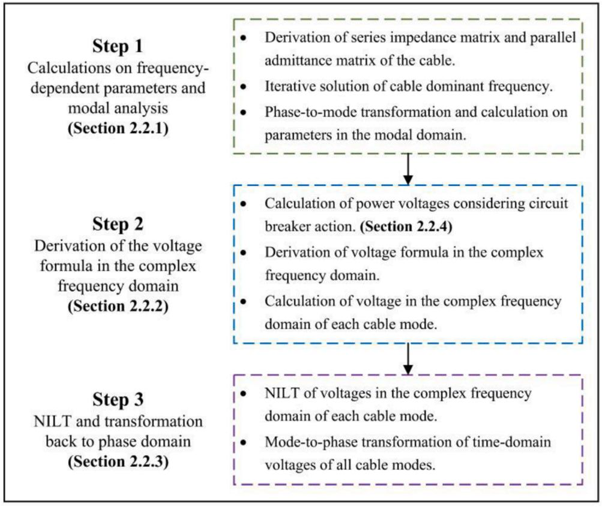  
Fig. 2. Workflow of energization overvoltage calculation algorithm.

where m indicates that this parameter is calculated in the modal domain.

The modes can be connected to the circuit shown in Fig. 1, where in the left side is the Thevenin equivalent power source and impedance, the right side is the i-th obtained mode. Further, $R _ { m i } , ~ L _ { m i } , ~ G _ { m i } ,$ and $C _ { m i }$ represent the resistance, inductance, conductance, and capacitance per unit length of the i-th modal domain.

Since $T _ { \nu } , \ z _ { p } ,$ and $Y _ { p }$ used in the above process are frequencydependent, it is necessary to determine the dominant mode and dominant frequency $f _ { d }$ of the cable to ensure accurate overvoltage calculation. For a single-core coaxial power cable, dominant modes change between intersheath and coaxial modes [23]. For the case satisfying

$$
d > H _ {S} \operatorname {o r f} _ {d} > f _ {c} \tag {4}
$$

the dominant mode is the coaxial mode; otherwise, the dominant mode becomes the intersheath mode [21]. In Eq. (4), $H _ { S }$ denotes the penetration depth, and $f _ { c }$ denotes the critical frequency shown in

$$
\left\{ \begin{array}{l} H _ {S} = \sqrt {\rho_ {S} / \left(\omega \mu_ {S}\right)} \\ f _ {c} \approx \rho_ {S} / \left(\pi \mu_ {S} d ^ {2}\right) \end{array} \right. \tag {5}
$$

where $\rho _ { s } , \ \mu _ { s } ,$ and d denote the resistivity of sheath, permeability of sheath, and thickness of the metallic sheath, respectively.

For a specific mode, $f _ { d }$ can be calculated approximately when impedances of the power source and the load are not considered by [20]

$$
f _ {d} = 1 / (4 \tau) = 1 / \left(4 \sqrt {L _ {m i} C _ {m i}} l\right) \tag {6}
$$

where τ denotes the wave propagation time, l denotes the length of the cable line, and $L _ { m i }$ and $C _ { m i }$ represent the inductance and capacitance per unit length of the corresponding modes, respectively.

# 2.2. Energization overvoltage calculation algorithm

The analysis of the energization overvoltages along the cross-bonded cable and the corresponding overvoltage calculation algorithm is shown in $\mathrm { F i g . 2 . }$ .

There are three steps shown in the algorithm flow; each step involves mutual transformations between the time, phase, modal, and complex frequency domains, as shown in Fig. 3.

2.2.1. Calculation on frequency-dependent parameters and modal analysis

A cross-bonded cable refers to a cable whose metallic sheaths are transposed. It includes the major and minor sections, as shown in Fig. 4.

To calculate the energization overvoltages along the cross-bonded cable, the dominant frequency $f _ { d }$ should be calculated at first. It is

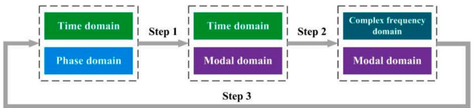  
Fig. 3. Mutual transformations between domains in each step.

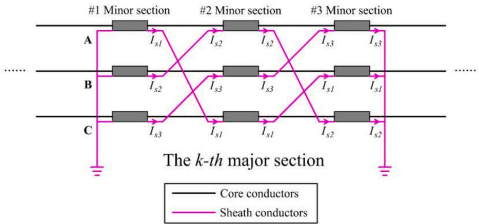  
Fig. 4. Structural diagram of cross-bonded cable.

necessary to use the iterative calculation frequency $f _ { c a l } ^ { ( q ) }$ to calculate the cable parameters temporarily when solving the dominant frequency; here, q denotes the number of iterations. $f _ { c a l } ^ { ( q ) }$ can be considered the dominant frequency of the cable when it satisfies

$$
f _ {c a l} ^ {(q)} \approx f _ {c a l} ^ {(q - 1)} (q \geq 2) \tag {7}
$$

In the (q-1)-th iteration process, the series impedance and parallel admittance matrices of the cross-bonded cable are derived from the corresponding matrices of the minor cable sections. For the minor section of the cable, the matrices are derived through cable parameters related to $f _ { c a l } ^ { ( q - 1 ) }$ by equations in Appendix, as shown in

$$
\mathbf {Z} _ {p} = \left[ \begin{array}{l l l l l l} Z _ {C C} & Z _ {m} & Z _ {m} & Z _ {C S} & Z _ {m} & Z _ {m} \\ Z _ {m} & Z _ {C C} & Z _ {m} & Z _ {m} & Z _ {C S} & Z _ {m} \\ Z _ {m} & Z _ {m} & Z _ {C C} & Z _ {m} & Z _ {m} & Z _ {C S} \\ Z _ {C S} & Z _ {m} & Z _ {m} & Z _ {S S} & Z _ {m} & Z _ {m} \\ Z _ {m} & Z _ {C S} & Z _ {m} & Z _ {m} & Z _ {S S} & Z _ {m} \\ Z _ {m} & Z _ {m} & Z _ {C S} & Z _ {m} & Z _ {m} & Z _ {S S} \end{array} \right] \tag {8}
$$

$$
\boldsymbol {Y} _ {p} = \left[ \begin{array}{c c c c c c} y _ {C C} & 0 & 0 & - y _ {C C} & 0 & 0 \\ 0 & y _ {C C} & 0 & 0 & - y _ {C C} & 0 \\ 0 & 0 & y _ {C C} & 0 & 0 & - y _ {C C} \\ - y _ {C C} & 0 & 0 & y _ {S S} & 0 & 0 \\ 0 & - y _ {C C} & 0 & 0 & y _ {S S} & 0 \\ 0 & 0 & - y _ {C C} & 0 & 0 & y _ {S S} \end{array} \right] \tag {9}
$$

After obtaining the series impedance and parallel admittance matrices of the cable minor section, the matrices of the cross-bonded cable can be calculated by applying [23]

$$
\left\{ \begin{array}{l} \mathbf {Z} _ {p} ^ {(c)} = \left(\mathbf {Z} _ {p} + \mathbf {R} \cdot \mathbf {Z} _ {p} \cdot \mathbf {R} ^ {- 1} + \mathbf {R} ^ {- 1} \cdot \mathbf {Z} _ {p} \cdot \mathbf {R}\right) / 3 \\ \mathbf {Y} _ {p} ^ {(c)} = \left(\mathbf {Y} _ {p} + \mathbf {R} \cdot \mathbf {Y} _ {p} \cdot \mathbf {R} ^ {- 1} + \mathbf {R} ^ {- 1} \cdot \mathbf {Y} _ {p} \cdot \mathbf {R}\right) / 3 \end{array} \right. \tag {10}
$$

where superscript (c) indicates that this variable is for cross-bonded cables and R denotes the rotation matrix,

$$
\boldsymbol {R} = \left[ \begin{array}{c c c c c c} 1 & 0 & 0 & 0 & 0 & 0 \\ 0 & 1 & 0 & 0 & 0 & 0 \\ 0 & 0 & 1 & 0 & 0 & 0 \\ 0 & 0 & 0 & 0 & 0 & 1 \\ 0 & 0 & 0 & 1 & 0 & 0 \\ 0 & 0 & 0 & 0 & 1 & 0 \end{array} \right] \tag {11}
$$

The product of the series impedance and parallel admittance matrices is

$$
\left(\boldsymbol {Z} \boldsymbol {Y}\right) _ {p} ^ {(c)} = \boldsymbol {Z} _ {p} ^ {(c)} \cdot \boldsymbol {Y} _ {p} ^ {(c)} \tag {12}
$$

Eq. (3) indicates that $( Z Y ) _ { p } ^ { ( c ) }$ can be diagonalized by the voltage transformation matrix Tv. Suppose $\begin{array} { r } { \begin{array} { l l l } { \pmb { T } _ { \pmb { \nu } } = } & { ( \pmb { \alpha } _ { I } , \ \pmb { \alpha } _ { 2 } , \ \cdots , \ \pmb { \alpha } _ { 6 } ) } \end{array} } \end{array}$ , where

$\pmb { \alpha } _ { i } ( i = 1 , 2 , \cdots , 6 )$ denotes the column vector. Then each αi represents an eigenvector of $( Z Y ) _ { p } ^ { ( c ) }$ , and the diagonal elements $\lambda _ { m i }$ of the obtained diagonal matrix Λ are the eigenvalues corresponding to the eigenvectors; the satisfied relational expression is

$$
\left(\mathbf {Z} \mathbf {Y}\right) _ {\boldsymbol {p}} ^ {(c)} \cdot \boldsymbol {\alpha} _ {i} = \lambda_ {m i} \cdot \boldsymbol {\alpha} _ {i} (i = 1, 2, \dots , 6) \tag {13}
$$

where $\lambda _ { m i }$ represents the product of the series impedance and parallel admittance in the modal domain per unit length of the corresponding mode. The product $\lambda _ { m i }$ can be simplified because the resistance and conductance of the cable are negligible compared with the inductance and capacitance, as shown in

$$
\lambda_ {m i} = \left(R _ {m i} + j \omega L _ {m i}\right) \cdot \left(G _ {m i} + j \omega C _ {m i}\right) \approx - \omega^ {2} L _ {m i} C _ {m i} \tag {14}
$$

where $\omega = 2 \pi f _ { c a l } ^ { ( q - 1 ) }$

Although $\mathbf { \delta } _ { T _ { \nu } }$ varies with $f _ { c a l } ,$ the ratio between elements in each column vector of $\mathbf { \delta } _ { T _ { \nu } }$ remains almost unchanged. When $f _ { c a l } = 2 0 \mathrm { k H z }$ , the typical $\mathbf { \delta } _ { T _ { \nu } }$ is given as [22]

$$
T _ {\nu} = (\alpha_ {1}, \alpha_ {2}, \dots , \alpha_ {6})
$$

$$
= \left[ \begin{array}{c c c c c c} 0. 4 0 8 2 & 0 & 0 & 0. 8 1 6 5 & 0 & 0. 5 7 7 4 \\ 0. 4 0 8 2 & 0 & 0 & 0. 4 0 8 2 & - 0. 7 0 7 1 & 0. 5 7 7 4 \\ 0. 4 0 8 2 & 0 & 0 & - 0. 4 0 8 2 & 0. 7 0 7 1 & 0. 5 7 7 4 \\ 0. 4 0 8 2 & - 0. 4 0 8 2 & - 0. 7 0 7 1 & 0 & 0 & 0 \\ 0. 4 0 8 2 & - 0. 4 0 8 2 & 0. 7 0 7 1 & 0 & 0 & 0 \\ 0. 4 0 8 2 & 0. 8 1 6 5 & 0 & 0 & 0 & 0 \end{array} \right] \tag {15}
$$

where ${ \pmb { \alpha } } _ { I } , { \pmb { \alpha } } _ { 2 } , \cdots , { \pmb { \alpha } } _ { 6 }$ represent the ground, #1 intersheath, #2 intersheath, #1 coaxial, #2 coaxial, and #3 coaxial modes, respectively [22].

In the iterative process of $f _ { c a l } ^ { ( q - 1 ) }$ , the eigenvalue decomposition process shown in Eqs. (13) and (14) is not used directly; instead, the expression of $\lambda _ { m i }$ is deduced in advance to improve the computational speed. When there is no power impedance at the sending end and the circuit breaker is opened at the receiving end, $\lambda _ { m i }$ can be obtained by substituting the corresponding column vectors in Eq. (15) into $\operatorname { E q . }$ (13) as

$$
\lambda_ {m i} = \left\{ \begin{array}{l} \left(Z _ {C S} - Z _ {m}\right) \cdot y _ {C C} (i = 2, 3) \\ \left(Z _ {C C} - Z _ {m}\right) \cdot y _ {C C} (i = 4, \dots , 6) \end{array} \right. \tag {16}
$$

where the dominant mode is the intersheath mode when $i = 2 , 3 ,$ , and the dominant mode is the coaxial mode when $i = 4 , . . . , 6 ,$ . After obtaining the $\lambda _ { m i }$ of the dominant mode, Eq. (16) can be combined with Eq. (14) and Eq. (6) to obtain

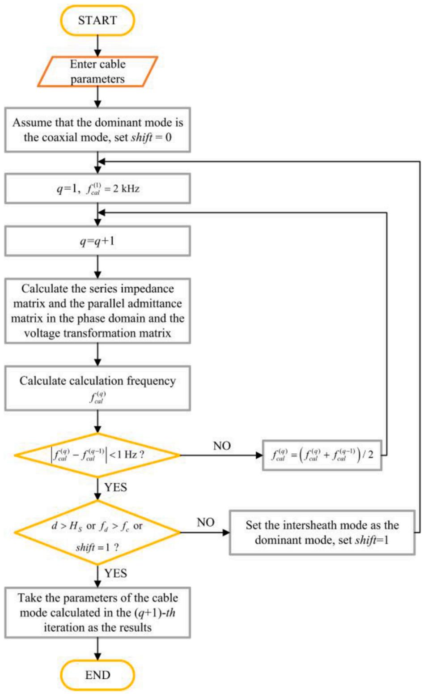  
Fig. 5. Iterative calculation workflow of calculation frequency.

$$
f _ {c a l} ^ {(q)} = \left\{ \begin{array}{l} \pi \cdot f _ {c a l} ^ {(q - 1)} / 2 \sqrt {\operatorname {r e a l} \left[ \left(Z _ {C S} - Z _ {m}\right) y _ {C C} \right]}, (i = 2, 3) \\ \pi \cdot f _ {c a l} ^ {(q - 1)} / 2 \sqrt {\operatorname {r e a l} \left[ \left(Z _ {C C} - Z _ {m}\right) y _ {C C} \right]}, (i = 4, \dots , 6) \end{array} \right. \tag {17}
$$

where the symbol “real (M)” represents the real part of M.

In this algorithm, the dichotomy method is used for iterative calculation, whose algorithm flow is shown in Fig. 5. The forward iterative process is continued by using Eq. (17). When $| f _ { c a l } ^ { ( q ) } - f _ { c a l } ^ { ( q - 1 ) } | < 1 \mathrm { H z } , f _ { d } =$ $f _ { c a l } ^ { ( q ) }$ . If Eq. (4) is not satisfied, the dominant mode should be reset to the

intersheath mode and the calculation process should be repeated.

The calculation process shown in Fig. 5 is for the case where there is no power impedance at the sending end and the circuit breaker is opened at the receiving end. For the case where there exist impedances both at the sending and receiving ends [23],

$$
\left\{ \begin{array}{l} z _ {0} = Z _ {0} \cdot \pi^ {2} / (4 l) \\ z _ {l} = Z _ {l} \cdot \pi^ {2} / (4 l) \end{array} \right. \tag {18}
$$

can be used to convert the impedances from lumped parameters to

distributed parameters. Then Eq. (17) can be rewritten as

$$
\begin{array}{l} f _ {d} ^ {(c)} = \pi \cdot f _ {c a l} ^ {(c)} / \left(2 \sqrt {\operatorname {r e a l} [ (z _ {0} + z _ {l} + Z _ {C C} - Z _ {m}) \cdot y _ {C C} ]}\right), \tag {19} \\ (i = 1, \dots , 6) \\ \end{array}
$$

where $z _ { O }$ and $Z _ { l }$ denote the lumped-parameter power impedance and load impedance, respectively. z and z represent the distributedparameter power impedance and load impedance, respectively.

After $f _ { d }$ and $\scriptstyle { T _ { \nu } }$ are obtained, the modal-domain series impedance matrix $z _ { m }$ and parallel admittance matrix $\mathbf { Y } _ { m } ,$ both of which are diagonal matrices, can be obtained using

$$
\begin{array}{l} \left\{ \begin{array}{l} \mathbf {Z} _ {m} = \mathbf {T} _ {v} ^ {- 1} \cdot \mathbf {Z} _ {p} \cdot \mathbf {T} _ {i} \\ v _ {1} = v _ {2} ^ {- 1} v _ {3} - v _ {4} \end{array} \right. \tag {20} \\ \left. \boldsymbol {Y} _ {m} = \boldsymbol {T} _ {i} ^ {- 1} \cdot \boldsymbol {Y} _ {p} \cdot \boldsymbol {T} _ {v} \right. \\ \end{array}
$$

The diagonal elements represent the series impedances and parallel admittances per unit length of the corresponding modes. Therefore, the resistance, inductance, conductance, and capacitance parameters of each cable mode can be obtained through these elements.

# 2.2.2. Derivation of voltage formula in the complex frequency domain

The above content is related to the application of the telegrapher’s equations and the modal theory, which can divide the cable into several uncoupled modes. However, the obtained telegrapher’s equations are still linear partial differential equations. Thus, the Laplace transform is used to simplify the calculation process.

In the i-th mode, the complex-frequency form of the telegrapher’s equations is

$$
\left\{ \begin{array}{l} - \frac {d V _ {m i} (x , s)}{d x} = \left[ R _ {m i} (s) + s L _ {m i} (s) \right] \cdot I _ {m i} (x, s) \\ - \frac {d I _ {m i} (x , s)}{d x} = \left[ G _ {m i} (s) + s C _ {m i} (s) \right] \cdot V _ {m i} (x, s) \end{array} \right. \tag {21}
$$

The boundary conditions at the sending and receiving ends are [24]

$$
\begin{array}{l} \left\{ \begin{array}{l} V _ {m i} (0, s) = V _ {m i S} (s) - I _ {m i} (0, s) Z _ {S} (s) \\ \vdots \end{array} \right. \tag {22} \\ \left\lceil V _ {m i} (l, s) = I _ {m i} (l, s) Z _ {L} (s) \left. \right. \\ \end{array}
$$

where m indicates that the variable is in the modal domain, i indicates the i-th mode, and x indicates the distance from the sending end of the cable. $V _ { m i } ( \theta , s )$ and $V _ { m i } ( l , s )$ indicate the modal-domain voltages at the sending and receiving ends in the complex frequency domain. $I _ { m i } ( 0 , s )$ and $I _ { m i } ( l , s )$ are the currents at the same positions. $Z _ { S } ( s )$ and $Z _ { L } ( s )$ denote the impedances at the sending and receiving ends of the cable.

The voltage expression in the complex frequency domain for the i-th mode can be derived by combining Eqs. (21) and (22), as shown by

$$
\begin{array}{l} V _ {m i} (x, s) = \frac {\exp \left[ \gamma_ {m i} (s) (2 l - x) \right] + n _ {m i 2} (s) \exp \left[ \gamma_ {m i} (s) x \right]}{\exp \left[ 2 \gamma_ {m i} (s) l \right] - n _ {m i 1} (s) n _ {m i 2} (s)} \tag {23} \\ \cdot k _ {m t} (s) \cdot V _ {m s} (s) \\ \end{array}
$$

where l denotes the length of the cable, $\gamma _ { m i } ( s )$ represents the characteristic impedance of the mode in the complex frequency domain, as shown by

$$
\gamma_ {m i} (s) = \sqrt {\left(R _ {m i} + s L _ {m i}\right) \cdot \left(G _ {m i} + s C _ {m i}\right)} \tag {24}
$$

Further, $n _ { m i 1 } ( s )$ and $n _ { m i 2 } ( s )$ represent the reflection coefficients of the mode at the sending and receiving ends, and their expressions are given as

$$
n _ {m i 1} (s) = \left(Z _ {S} (s) - Z _ {m i C} (s)\right) / \left(Z _ {S} (s) + Z _ {m i C} (s)\right) \tag {25}
$$

$$
n _ {m i 2} (s) = \left(Z _ {L} (s) - Z _ {m i C} (s)\right) / \left(Z _ {L} (s) + Z _ {m i C} (s)\right) \tag {26}
$$

k (s) is a specific coefficient related to the characteristic impedance of the mode, as shown in

$$
k _ {m i} (s) = Z _ {m i C} (s) / \left(Z _ {S} (s) + Z _ {m i C} (s)\right) \tag {27}
$$

$$
Z _ {m i C} (s) = \sqrt {\left(R _ {m i} + s L _ {m i}\right) / \left(G _ {m i} + s C _ {m i}\right)} \tag {28}
$$

# 2.2.3. NILT and transformation back to phase domain

Vector $V _ { m } ( x , s )$ comprising $V _ { m i } ( x , s )$ can be obtained by applying Eq. (23) to all modes of the cable. It is almost impossible to obtain its corresponding time-domain solution through the analytical inverse Laplace transform because the obtained voltage formula is relatively complicated. Therefore, the NILT based on the fast Fourier transform (FFT) and quotient-difference (q-d) algorithm is used for the calculation, whose deviation formula is shown as [17]

$$
\delta = 1 / \left\{\exp \left[ 2 \cdot N _ {s} \cdot t _ {m} \cdot (c - \alpha) / \left(N _ {s} - 1\right) \right] - 1 \right\} \tag {29}
$$

where δ is the relative error, $N _ { s }$ is the number of sampling points used for FFT in NILT, $t _ { m }$ is the total calculation time of the time domain solution, c is the real part of $\begin{array} { r } { \pmb { s } = \pmb { c } + j \omega , } \end{array}$ α is the minimal abscissa of convergence. In this study, it is assumed that $N _ { s } = 5 0 0 0 , \alpha = 0 ,$ and $\delta = 1 \times 1 0 ^ { - 1 0 }$ , and the value of c is determined approximately according to the target of δ.

The corresponding time-domain $V _ { m } ( x , t )$ ) can be obtained through the above NILT algorithm. However, $V _ { m } ( x , t )$ is still not the final voltage solution, but the solution in the modal domain. It is necessary to transform the obtained voltage vector using Eq. (2) to calculate the voltage in the time domain (i.e. V(x,t)). The conversion from $V _ { m } ( x , s )$ to V(x,t) proceeds as follows.

$$
\mathbf {V} _ {\mathbf {m}} (x, s) \stackrel {N L T} {\rightarrow} \mathbf {V} _ {\mathbf {m}} (x, t) \xrightarrow {E q . (2)} \mathbf {V} (\mathbf {x}, \mathbf {t}) \tag {30}
$$

# 2.2.4. Calculation of power voltages considering the circuit breaker action

The three-phase energization times of the circuit breaker tend to be slightly different (i.e. asynchronous energization) in actual situations. Therefore, it is necessary to calculate power voltages considering the circuit breaker action. Assuming the three-phase source voltages are as following equations

$$
\left\{ \begin{array}{l} V _ {S 1} (t) = A _ {0} \cdot \sin \left(\omega_ {0} t + \phi\right) \\ V _ {S 2} (t) = A _ {0} \cdot \sin \left(\omega_ {0} t + \phi - 1 2 0 ^ {\circ}\right) \\ V _ {S 3} (t) = A _ {0} \cdot \sin \left(\omega_ {0} t + \phi + 1 2 0 ^ {\circ}\right) \end{array} \right. \tag {31}
$$

where $A _ { 0 }$ is the magnitude of the source voltage, $\omega _ { 0 }$ is the angular velocity under 50 Hz, and φ is the initial phase angle of the source voltage.

It is necessary to convert the above voltages to the modal domain. Suppose a $6 \times 1$ Vage vector ${ \pmb V } _ { S } ( t )$ , where the first three terms are

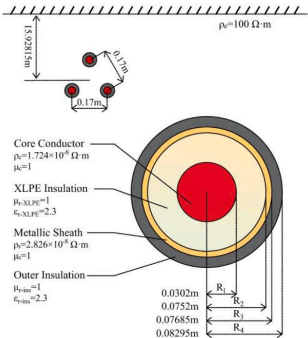  
Fig. 6. Electrical parameters and geometric structures of the single-core cable.

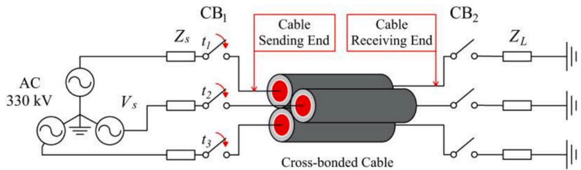  
Fig. 7. Circuit diagram of 330 kV cable transmission line.

composed of voltages shown in Eq. (30), and the last three terms are approximated to 0. Assuming $\pmb { T } _ { \pmb { \nu } } ^ { - 1 } = ( \pmb { \beta } _ { I } \pmb { \beta } _ { 2 } , \cdots \pmb { \beta } _ { 6 } ) ^ { \mathrm { T } }$ , where $\beta _ { i } ( i = 1 , 2 , \cdots ,$ 6)is the i-th row vector of $\pmb { T } _ { \pmb { \nu } } ^ { - 1 }$ , then the power voltage $V _ { m i s } ( t )$ is shown as

$$
\begin{array}{l} V _ {m i S} (t) = \boldsymbol {\beta} _ {\mathbf {i}} \cdot \boldsymbol {V} _ {\mathbf {S}} (t) = A _ {0} \cdot \beta_ {i} (1) \cdot \sin (\omega_ {0} t + \phi) \\ + A _ {0} \cdot \beta_ {i} (2) \cdot \sin \left(\omega_ {0} t + \phi - 1 2 0 ^ {\circ}\right) + A _ {0} \cdot \beta_ {i} (3) \cdot \sin \left(\omega_ {0} t + \phi + 1 2 0 ^ {\circ}\right) \tag {52} \\ \end{array}
$$

Then, the Laplace transform can be applied to convert $V _ { m i s } ( t )$ into the expression in the complex frequency domain. Assuming that the threephase energization times of the circuit breaker are t , t , and $t _ { 3 } ,$ the corresponding power voltage in the complex frequency domain can be obtained, as shown in

$$
V _ {m i S} (s) = A _ {0} \cdot \left[ E _ {m i S 1} (s) + E _ {m i S 2} (s) + E _ {m i S 3} (s) \right] \tag {33}
$$

where

$$
\left\{ \begin{array}{l} E _ {m i S 1} (s) = \exp (- s t _ {1}) \cdot \beta_ {i} (1) \cdot \cos \left(\omega_ {0} t _ {1} + \phi\right) \cdot \omega_ {0} / \left(s ^ {2} + \omega_ {0} ^ {2}\right) \\ + \exp (- s t _ {1}) \cdot \beta_ {i} (1) \cdot \sin \left(\omega_ {0} t _ {1} + \phi\right) \cdot s / \left(s ^ {2} + \omega_ {0} ^ {2}\right) \\ E _ {m i S 2} (s) = \exp (- s t _ {2}) \cdot \beta_ {i} (2) \cdot \cos \left(\omega_ {0} t _ {2} + \phi - 1 2 0 ^ {\circ}\right) \cdot \omega_ {0} / \left(s ^ {2} + \omega_ {0} ^ {2}\right) \\ + \exp (- s t _ {2}) \cdot \beta_ {i} (2) \cdot \sin \left(\omega_ {0} t _ {2} + \phi - 1 2 0 ^ {\circ}\right) \cdot s / \left(s ^ {2} + \omega_ {0} ^ {2}\right) \\ E _ {m i S 3} (s) = \exp (- s t _ {3}) \cdot \beta_ {i} (3) \cdot \cos \left(\omega_ {0} t _ {3} + \phi + 1 2 0 ^ {\circ}\right) \cdot \omega_ {0} / \left(s ^ {2} + \omega_ {0} ^ {2}\right) \\ + \exp (- s t _ {3}) \cdot \beta_ {i} (3) \cdot \sin \left(\omega_ {0} t _ {3} + \phi + 1 2 0 ^ {\circ}\right) \cdot s / \left(s ^ {2} + \omega_ {0} ^ {2}\right) \end{array} \right. \tag {34}
$$

By substituting Eq. (33) into Eq. (23), the overvoltages can be calculated when the three-phase contacts of the circuit breaker are energized at $t _ { 1 } , t _ { 2 } ,$ and t3 respectively.

# 3. Model assumptions

A three-phase single-core cross-bonded power cable line with a voltage level of 330 kV is considered in this section. The electrical

Table 1 Parameters used for modeling and calculation.   

<table><tr><td>Parameters</td><td>Values</td></tr><tr><td>Cable length</td><td>9.6 km</td></tr><tr><td>Number of cable minor sections</td><td>24</td></tr><tr><td>Power voltage (Line voltage)</td><td>345 kV</td></tr><tr><td>Total calculation time</td><td>0.08 s</td></tr><tr><td>Number of sampling points</td><td>5000</td></tr><tr><td>Closing phase angle of CB1</td><td>90°</td></tr><tr><td>Impedance at the sending end</td><td>5 + j6.28 (Ω)</td></tr><tr><td>Impedance at the receiving end</td><td>Open circuit</td></tr></table>

parameters and geometric structures of each single-core cable are the same, as shown in Fig. 6. The cable is connected to the circuit shown in Fig. 7, in which $Z _ { S }$ and $Z _ { L }$ are impedances at the sending and receiving ends of the cable, and $\mathrm { C B _ { 1 } }$ and $\mathrm { C B } _ { 2 }$ are the circuit breakers at the same positions.

The closing phase angle of $\mathrm { C B _ { 1 } }$ can be controlled through the method described in Section 2.2.4. In this study, the energization overvoltages along the power cable were calculated when the closing phase angle of the circuit breaker changes from 0◦ to 90◦ for every $3 0 ^ { \circ }$ The relevant parameters used for calculation are summarized in Table 1. The locations of the voltmeters along the cable are shown in Fig. 8.

# 4. Validity verification and algorithms comparison

# 4.1. Calculation and comparison of results

The results of phase A were considered as examples to verify the accuracy of the calculation results more concisely. The voltage-time curves at the receiving end as well as the curves of maximum energization overvoltages along the cable can be drawn by applying the proposed algorithm and FDPM, which are shown in Figs. 9 and 10.

Fig. 9 shows that the voltage curves obtained by the proposed algorithm are in good agreement with the voltage curves obtained by FDPM. The maximum relative error occurs when the closing phase angle is $3 0 ^ { \circ }$ , which is 0.894%, and the minimum relative error occurs when the closing phase angle is 0◦, which is only 0.053%, suggesting that the accuracy of the proposed algorithm is relatively high in the above cases.

Fig. 10 shows the comparison of the maximum energization overvoltages along the power cable obtained by the proposed algorithm and FDPM. The maximum relative error is the same as that shown in Fig. 9 (b), which appears at the receiving end when the closing phase angle is 30◦ The minimum relative error appears at the seventh voltmeter (2.4 km away from the sending end of the cable) when the closing phase angle is $6 0 ^ { \circ } ;$ this value is only 0.005%. The results shown above further guarantee the accuracy of the calculation results when using the proposed algorithm.

It can be seen from the comparative analysis in this chapter that the proposed algorithm has high calculation accuracy, which fundamentally guarantees the reliability of the algorithm.

# 4.2. Computational speed and memory consumption comparison

Cable parameters shown in Table 1 were used in this section, and it

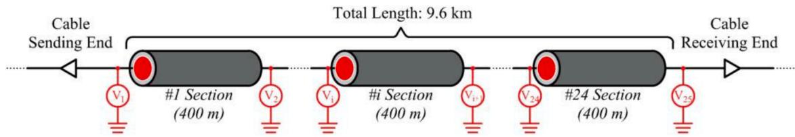  
Fig. 8. Locations of voltmeters along the cable.

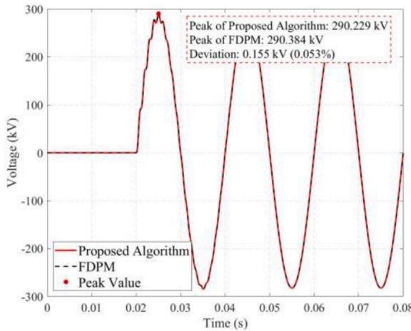  
(a)0°

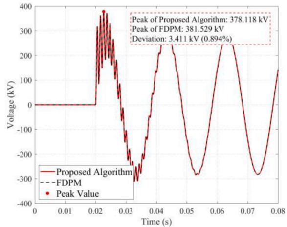  
(b)30°

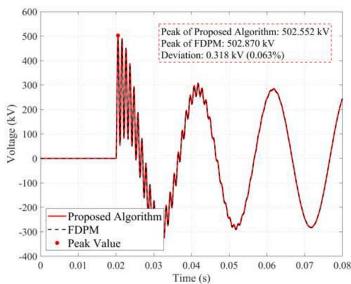  
(c） $6 0 ^ { \circ }$

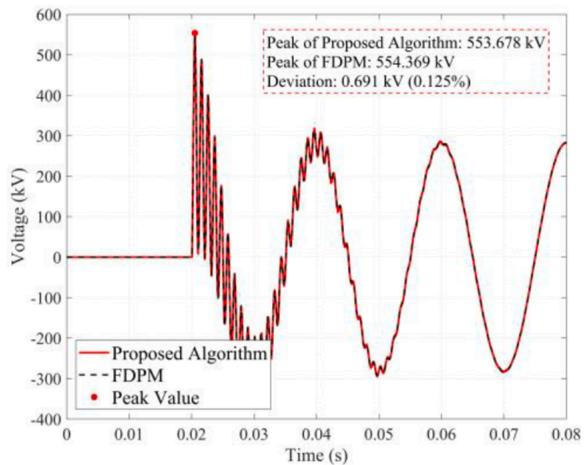  
(d) $9 0 ^ { \circ }$   
Fig. 9. Voltage curves with different closing phase angles at the cable receiving end.

was specified that the closing phase angle of $\mathrm { C B _ { 1 } }$ is $0 ^ { \circ }$ . For the computational speed comparison, the influences of the cable length and number of voltmeters on computational speed were considered. Each calculation was repeated 10 times and the time spent was averaged. The time step of FDPM is specified as 1 μs, the number of sampling points (N ) of the proposed algorithm is set to 5000, and the CPU of the computing platform is AMD RYZEN 7 Pro 4750 G. The results of the above cases are illustrated in Fig. 11.

Fig. 11(a) shows that the computational speed of the proposed algorithm is greatly improved compared with that of FDPM. When the length of the cable changes, the time consumed by the proposed algorithm is only about 8.073% – 8.651% of that consumed by FDPM. Further, the CPU time changes slightly with a change in only the length of the cable; this implies that the calculation speed is not sensitive to changes in cable length.

Fig. 11(b) shows that the proposed algorithm still has a great speed advantage compared to FDPM, whose time consumption is only 7.195%–8.760% of the latter when the number of voltmeters changes. Unlike the results shown in Fig. 11(a), the CPU times tend to increase as the number of voltmeters increases, and the differences between the two methods also increase, which indicates that the performance of the algorithm will become more important with an increase in the number of voltmeters.

The advantage of the computational speed partly originates from the Laplace transform and NILT processes since the limitation on the minimum time step can be eliminated. In the case where $N _ { s }$ is 5000, the time step is 16 us. Although this value is much larger than that of FDPM, it is

still able to obtain results with relatively high accuracy. The change of $N _ { s }$ may mainly affect the computational speed and the memory consumption, but its impact on accuracy is relatively small. The computational speed and peak memory consumption varying with $N _ { s }$ when the closing phase angle is $0 ^ { \circ }$ are shown in Fig. 12. Calculation results of maximum overvoltages at the cable receiving end are shown in Table $^ { 2 , }$ and the relative errors compared with FDPM are shown in Fig. 13.

Fig. 12 shows that with the change of $N _ { s } ,$ the CPU time of the proposed algorithm varies between 1.621 s and 2.759 s, and the peak memory consumption varies between 0.723 MB and 2.684 MB. Besides, both of the CPU time and the peak memory consumption decrease as $N _ { s }$ decreases, indicating that the reduction in $N _ { s }$ may bring benefits to the calculation process.

For calculation results of maximum overvoltages at the cable receiving end, it can be seen from Table 2 that the change of $N _ { s }$ may not cause a significant deviation of them, and Fig. 13 further illustrates this conclusion, in which the relative errors decrease slightly when $N _ { s }$ increases. The above results show that it is still conservative to set $N _ { s }$ to 5000 in Table 1. When performing larger-scale overvoltage calculations (such as calculations of statistical overvoltages), faster computational speed and lower memory consumption could be achieved by reducing $N _ { s }$ to a smaller value at a cost of a small reduction in accuracy.

# 5. Discussion

The proposed algorithm in this study is able to calculate energization overvoltages along the cross-bonded power cable lines with relatively

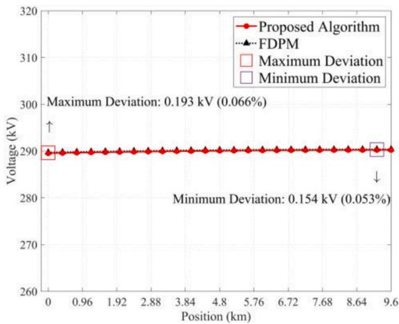  
(a) $0 ^ { \circ }$

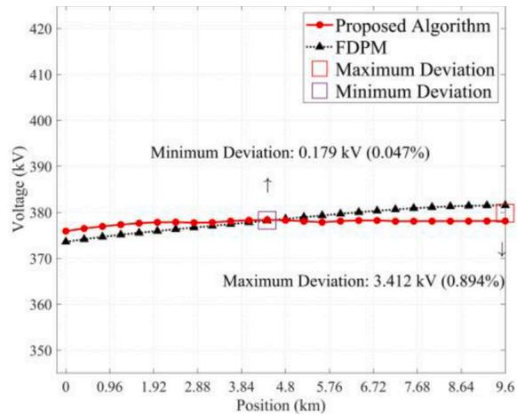  
(b) $3 0 ^ { \circ }$

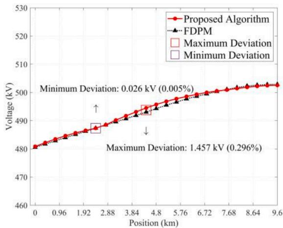  
(c） $6 0 ^ { \circ }$

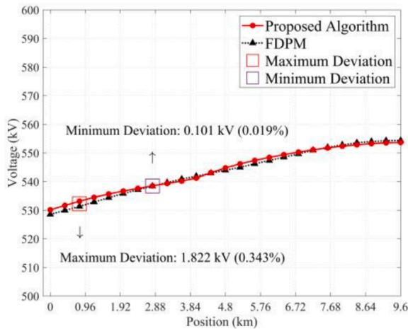  
(d) $9 0 ^ { \circ }$

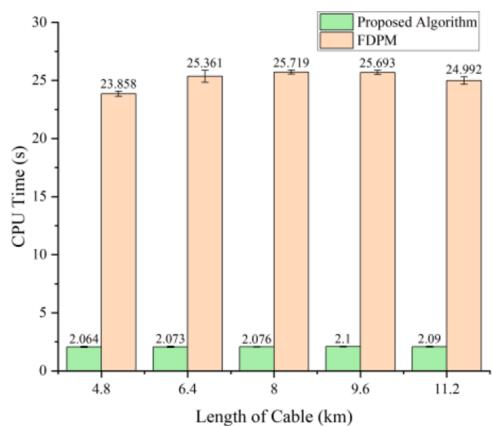  
Fig. 10. Maximum overvoltages with different closing phase angles along the cable.   
(a) Cable length

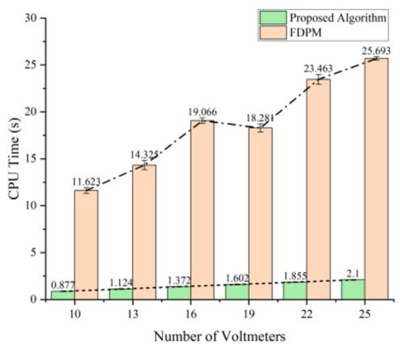  
(b) Number of voltmeters   
Fig. 11. Comparison of CPU times between the proposed method and FDPM.

high accuracy and computational speed. However, the transformation matrices and cable parameters are all computed at the dominant frequency. This may have a minor impact on the accuracy compared to a full frequency dependent modeling. In fact, the full frequency dependent algorithm can be realized by sampling the complex frequency s at the beginning of the calculation process. Processes of modal analysis, voltage formula derivation in the complex frequency domain, and NILT

are all based on the sampled s mentioned above. Since the sampling process is finished before the modal analysis, there is no need to calculate the dominant frequency. The comparison between the peak values obtained by the proposed algorithm in Section 2, the full frequency dependent algorithm, and FDPM is shown in Table 3 (cable parameters shown in Table 1 are used).

As can be seen from the table, the accuracy of the full frequency

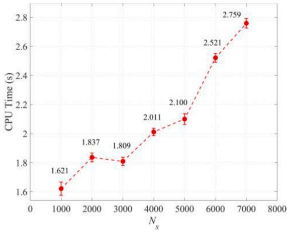  
(a) CPU Time

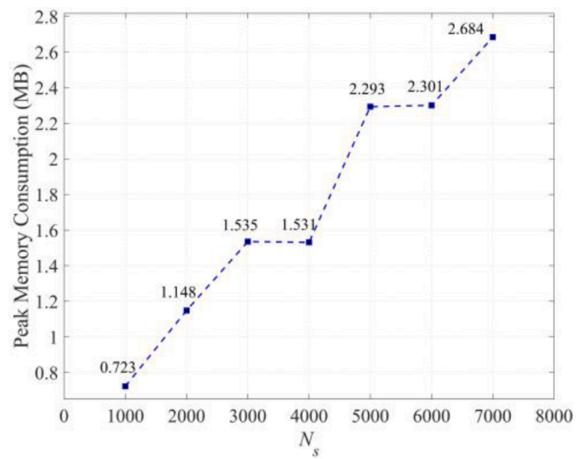  
(b) Peak Memory Consumption   
Fig. 12. CPU times and peak memory consumption varying with Ns.

Table 2 Maximum overvoltages with different Ns at the cable receiving end.   

<table><tr><td rowspan="2">Ns</td><td colspan="4">Voltages (kV)</td></tr><tr><td>0°</td><td>30°</td><td>60°</td><td>90°</td></tr><tr><td>1000</td><td>290.077</td><td>377.604</td><td>500.549</td><td>549.649</td></tr><tr><td>2000</td><td>290.172</td><td>377.931</td><td>502.080</td><td>553.318</td></tr><tr><td>3000</td><td>290.213</td><td>378.029</td><td>501.920</td><td>552.139</td></tr><tr><td>4000</td><td>290.225</td><td>378.170</td><td>502.083</td><td>553.837</td></tr><tr><td>5000</td><td>290.229</td><td>378.118</td><td>502.552</td><td>553.678</td></tr><tr><td>6000</td><td>290.230</td><td>378.157</td><td>502.390</td><td>553.636</td></tr><tr><td>7000</td><td>290.231</td><td>378.316</td><td>502.338</td><td>553.779</td></tr><tr><td>FDPM</td><td>290.384</td><td>381.529</td><td>502.870</td><td>554.369</td></tr></table>

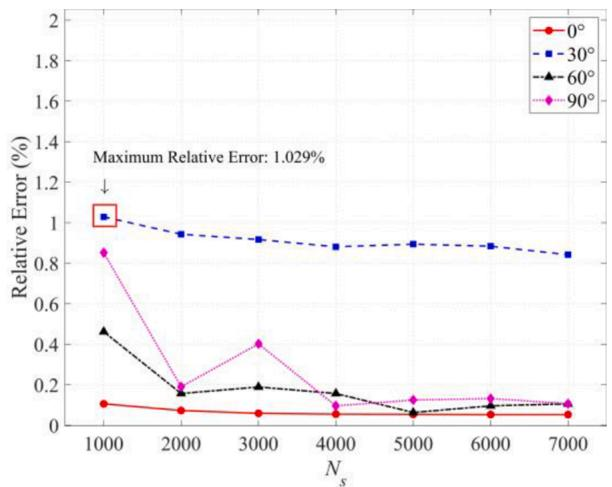  
Fig. 13. Relative error comparison with different Ns and closing phase angles.

Table 3 Comparison between the peak values obtained by the two algorithms and FDPM.   

<table><tr><td rowspan="2">Closing phase angle</td><td rowspan="2">Proposed algorithm</td><td colspan="2">Voltages (kV)</td><td colspan="2">Relative error</td></tr><tr><td>Full frequency dependent algorithm</td><td>FDPM</td><td>Proposed algorithm</td><td>Full frequency dependent algorithm</td></tr><tr><td>0°</td><td>290.229</td><td>290.354</td><td>290.384</td><td>0.053%</td><td>0.010%</td></tr><tr><td>30°</td><td>378.118</td><td>380.926</td><td>381.529</td><td>0.894%</td><td>0.158%</td></tr><tr><td>60°</td><td>502.552</td><td>502.695</td><td>502.870</td><td>0.063%</td><td>0.035%</td></tr><tr><td>90°</td><td>553.678</td><td>553.680</td><td>554.369</td><td>0.125%</td><td>0.124%</td></tr></table>

dependent algorithm is slightly better than that of the proposed algorithm. But compared with the FDPM, the relative errors of the two algorithms are both very small, indicating that both methods are effective for overvoltage calculation.

Although the full frequency dependent algorithm can obtain calculation results more accurately, it consumes a relatively long CPU time in the calculation process. The comparison of CPU times consumed by the proposed algorithm, the full frequency dependent algorithm, and the FDPM is shown in Fig. 14 below.

It can be seen from Fig. 14 that the computational speed of the full frequency dependent algorithm is much slower than that of the proposed algorithm, and is even slower than the FDPM, which means that the full frequency dependent algorithm does not have the advantage of computational speed anymore. Therefore, the algorithm proposed in Section 2 in this study is more valuable even though its accuracy is slightly lower.

# 6. Conclusion

In this study, a novel algorithm based on modal theory and NILT is proposed for fast calculating the energization overvoltages along the cross-bonded power cable lines. First, coupled cable conductors are transformed into independent modes through phase-mode transformation. Then, the voltage formula of each independent mode in the complex frequency domain is obtained through Laplace transform. Finally, energization overvoltages along the power cable are calculated using NILT and mode-phase transformation.

Under the cable parameters considered in this study, the relative errors of maximum overvoltages at the cable receiving end and maximum overvoltages along the power cable compared with FDPM are 0.053%–0.894% and 0.005%–0.894% respectively, which demonstrates the high accuracy of the proposed algorithm. Besides, the CPU time consumed is only 7.195%–8.760% of FDPM, which implies the proposed algorithm has a high computational performance. By reducing the number of sampling points used for FFT in NILT, faster computational speed and lower memory consumption could be achieved at a cost of a small reduction in accuracy.

The algorithm proposed in this study is an important supplement to the existing algorithms in commercial software, and it is expected to have valuable practical applications due to its advantages in faster computational speed and simpler modeling process, etc.

# CRediT authorship contribution statement

Han Li: Conceptualization, Methodology, Software, Validation,

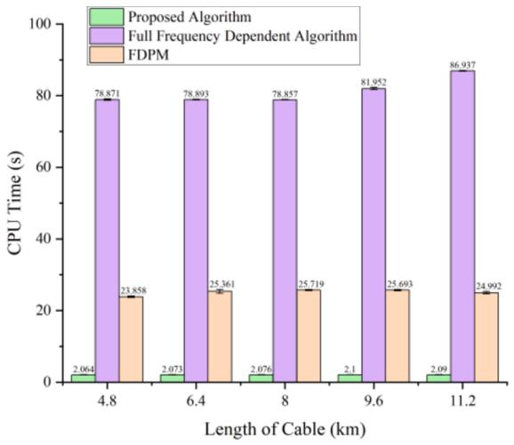  
(a) Cable length

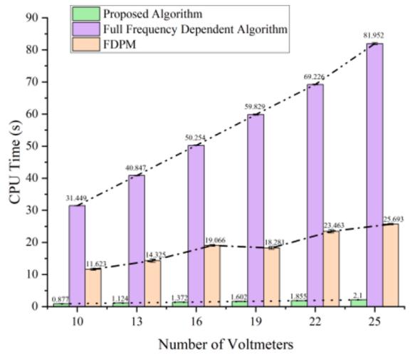  
(b) Number of voltmeters   
Fig. 14. Comparison on CPU times between the two algorithms and FDPM.

Formal analysis, Investigation, Data curation, Writing – original draft, Writing – review & editing, Visualization. Peixin Yu: Conceptualization, Methodology, Validation, Writing – review & editing. Shurong Li: Writing – review & editing. Xuefeng Zhao: Resources. Junbo Deng: Conceptualization, Writing – review & editing, Supervision. Guanjun Zhang: Resources.

# Declaration of Competing Interest

The authors declare that they have no known competing financial

# Appendix

In this part, the frequency-dependent parameter equations of the power cable are introduced. For the structure of cable considered in this study, the frequency-dependent parameters mainly include the conductor series impedance $Z _ { C o u t e r } ,$ sheath inner series impedance $Z _ { S i n n e r } ,$ sheath outer series impedance $Z _ { S o u t e r } ,$ , mutual series impedance of two loops $Z _ { S m u n a l s }$ insulation series impedance $Z _ { C S i n s u l s }$ sheath insulation series impedance $Z _ { S G i n s u l s }$ earth series self-impedance $Z _ { e a r t h }$ and mutual earth impedance $Z _ { e a r t h , m u t u a l }$ [19]. The expressions of the above parameters are shown in Eqs. $( \mathtt { A . 1 } ) \mathtt { - } ( \mathtt { A . 1 6 } )$ .

$$
Z _ {\text {C o u t e r}} (\omega) = \rho_ {C} m _ {C} \cdot J _ {0} \left(m _ {C} R _ {1}\right) / \left[ 2 \pi R _ {1} \cdot J _ {1} \left(m _ {C} R _ {1}\right) \right] \tag {A.1}
$$

where $\rho _ { C }$ is the resistivity of the conductor. $m _ { C }$ is the reciprocal of the complex penetration depth for the conductor, as shown in Eq. (A.2).

$$
m _ {C} = \sqrt {j \omega \mu / \rho_ {C}} \tag {A.2}
$$

$$
Z _ {\text {S i n n e r}} (\omega) = \rho_ {S} m _ {S} \cdot \coth \left[ m _ {S} \left(R _ {3} - R _ {2}\right) \right] / \left(2 \pi R _ {2}\right) - \rho_ {S} / \left[ 2 \pi R _ {2} \left(R _ {2} + R _ {3}\right) \right] \tag {A.3}
$$

$$
Z _ {\text {S o u t e r}} (\omega) = \rho_ {S} m _ {S} \cdot \coth \left[ m _ {S} \left(R _ {3} - R _ {2}\right) \right] / \left(2 \pi R _ {3}\right) + \rho_ {S} / \left[ 2 \pi R _ {3} \left(R _ {2} + R _ {3}\right) \right] \tag {A.4}
$$

$$
Z _ {\text {S m u t u a l}} (\omega) = \rho_ {S} m _ {S} \cdot \operatorname {c s c h} \left[ m _ {S} \left(R _ {3} - R _ {2}\right) \right] / \left[ \pi \left(R _ {2} + R _ {3}\right) \right] \tag {A.5}
$$

where $\rho _ { S }$ is the resistivity of the metallic sheath. $m _ { C }$ is the reciprocal of the complex penetration depth for the metallic sheath, as shown in Eq. (A.6).

$$
m _ {S} = \sqrt {j \omega \mu / \rho_ {S}} \tag {A.6}
$$

$$
Z _ {C S i n s u l} (\omega) = \left[ j \omega \mu_ {i n s} \cdot \ln \left(R _ {2} / R _ {1}\right) \right] / (2 \pi) \tag {A.7}
$$

$$
Z _ {S G i n s u l} (\omega) = \left[ j \omega \mu_ {\text {o u t - i n s}} \cdot \ln \left(R _ {4} / R _ {3}\right) \right] / (2 \pi) \tag {A.8}
$$

$$
Z _ {\text {e a r t h}} (\omega) = \rho_ {e} m _ {e} ^ {2} \cdot K _ {0} \left(m _ {e} R _ {4}\right) / (2 \pi) + 2 \cdot \rho_ {e} m _ {e} ^ {2} \tag {A.9}
$$

$$
\cdot \exp (- 2 h m _ {e}) / \left[ 2 \pi \cdot \left(4 + m _ {e} ^ {2} R _ {4} ^ {2}\right) \right]
$$

$$
\begin{array}{r l} Z _ {\text {e a r t h - m u t u a l}} (\omega) & = \rho_ {e} m _ {e} ^ {2} \cdot K _ {0} (m _ {e} d) / (2 \pi) + 2 \cdot \rho_ {e} m _ {e} ^ {2} \\ & \cdot \exp (- 2 h m _ {e}) / [ 2 \pi \cdot (4 + m _ {e} ^ {2} d ^ {2}) ] \end{array} \tag {A.10}
$$

where $\rho _ { e }$ is the resistivity of the earth. $m _ { C }$ is the reciprocal of the complex penetration depth for the earth, as shown in Eq. (A.11).

$$
m _ {e} = \sqrt {j \omega \mu / \rho_ {e}} \tag {A.11}
$$

The series impedance matrix can be obtained by using the above frequency-dependent parameter equations, as shown in Eq. (A.12).

$$
\mathbf {Z} _ {p} = \left[ \begin{array}{l l l l l l} Z _ {C C} & Z _ {m} & Z _ {m} & Z _ {C S} & Z _ {m} & Z _ {m} \\ Z _ {m} & Z _ {C C} & Z _ {m} & Z _ {m} & Z _ {C S} & Z _ {m} \\ Z _ {m} & Z _ {m} & Z _ {C C} & Z _ {m} & Z _ {m} & Z _ {C S} \\ Z _ {C S} & Z _ {m} & Z _ {m} & Z _ {S S} & Z _ {m} & Z _ {m} \\ Z _ {m} & Z _ {C S} & Z _ {m} & Z _ {m} & Z _ {S S} & Z _ {m} \\ Z _ {m} & Z _ {m} & Z _ {C S} & Z _ {m} & Z _ {m} & Z _ {S S} \end{array} \right] \tag {A.12}
$$

where

$$
\left\{ \begin{array}{l} Z _ {C C} = Z _ {\text {C o u t e r}} + Z _ {C \text {S i n s u l}} + Z _ {\text {S i n n e r}} + Z _ {\text {S o u t e r}} + Z _ {S G \text {i n s u l}} + Z _ {\text {e a r t h}} - 2 Z _ {S \text {m u t u a l}} \\ Z _ {C S} = Z _ {\text {S o u t e r}} + Z _ {S G \text {i n s u l}} + Z _ {\text {e a r t h}} - Z _ {S \text {m u t u a l}} \\ Z _ {S S} = Z _ {\text {S o u t e r}} + Z _ {S G \text {i n s u l}} + Z _ {\text {e a r t h}} \\ Z _ {m} = - Z _ {\text {e a r t h} \_ \text {m u t u a l}} \end{array} \right. \tag {A.13}
$$

The parallel admittance matrix of the power cable is shown in Eq. (A.14).

$$
Y _ {p} = j \omega P ^ {- 1} \tag {A.14}
$$

where P is the potential coefficient matrix, which is shown in Eq.(A.15).

$$
\boldsymbol {P} = \left[ \begin{array}{c c c c c c} P _ {1 1} & 0 & 0 & P _ {1 2} & 0 & 0 \\ 0 & P _ {1 1} & 0 & 0 & P _ {1 2} & 0 \\ 0 & 0 & P _ {1 1} & 0 & 0 & P _ {1 2} \\ P _ {1 2} & 0 & 0 & P _ {2 2} & 0 & 0 \\ 0 & P _ {1 2} & 0 & 0 & P _ {2 2} & 0 \\ 0 & 0 & P _ {1 2} & 0 & 0 & P _ {2 2} \end{array} \right] \tag {A.15}
$$

where

$$
\left\{P _ {1 1} = P _ {C} + P _ {S} = \ln \left(R _ {2} / R _ {1}\right) / \left(2 \pi \varepsilon_ {0} \varepsilon_ {1}\right) + \ln \left(R _ {4} / R _ {3}\right) / \left(2 \pi \varepsilon_ {0} \varepsilon_ {2}\right) P _ {2 2} = P _ {1 2} = P _ {S} = \ln \left(R _ {4} / R _ {3}\right) / \left(2 \pi \varepsilon_ {0} \varepsilon_ {2}\right) \right. \tag {A.16}
$$

The above equations for calculating the parameters of the series impedance matrix and parallel admittance matrix are valid at various frequencies and have been widely used in famous algorithms such as FDPM.

# References

[1] Y. Zhou, J. Zhao, R. Liu, Z.Z. Chen, Y.X. Zhang, Key technical analysis and prospect of high voltage and extra-high voltage power cable. High Voltage Eng. 40(9) (2014) 2593–2612. https://doi.org/10.13336/j.1003-6520.hve.2014.09.001.   
[2] H. Khalilnezhad, M. Popov, L. van der Sluis, J.P.W. de Jong, N. Nenadovic, J. A. Bos, Assessment of line energization transients when increasing cable length in 380 KV power grids, in: 2016 IEEE International Conference on Power System Technology (POWERCON), 2016, pp. 1–6, https://doi.org/10.1109/ POWERCON.2016.7753908. September.   
[3] H. Khalilnezhad, M. Popov, L. van der Sluis, J.A. Bos, A. Ametani, Statistical analysis of energization overvoltages in EHV hybrid OHL–cable systems, IEEE Trans. Power Del. 33 (6) (2018) 2765–2775, https://doi.org/10.1109/ TPWRD.2018.2825201.   
[4] P. Thanassoulis, N. De Franco, A. Clerici, M. Cazzani, Overvoltages on a seriescompensated 750 kV system for the 10000 MW Itaipu project, IEEE Trans. Power Apparatus Syst. 94 (2) (1975) 622–631, https://doi.org/10.1109/T-PAS.1975.31890.   
[5] A.B. Sukardi, M. Rohani, M. Isa, B. Ismail, W.A. Mustafa, Modelling of single power line by ATP-draw for partial discharge signal measurement, in: 5th IET International Conference on Clean Energy and Technology (CEAT2018), 2018, https://doi.org/10.1049/cp.2018.1328. January.   
[6] N. Watson, J. Arrillaga, 2003. Power Systems Electromagnetic Transients Simulation. Inst. Eng. Technol. https://doi.org/10.1049/PBPO039E.   
[7] P.T. Caballero, E.C. Marques Costa, S. Kurokawa, Frequency-dependent multiconductor line model based on the Bergeron method, Electr. Power Syst. Res. 127 (oct) (2015) 314–322, https://doi.org/10.1016/j.epsr.2015.05.019.   
[8] T. Noda, N. Nagaoka, A. Ametani, Phase domain modeling of frequency-dependent transmission lines by means of an ARMA model, IEEE Trans. Power Del. 11 (1) (1996) 401–411, https://doi.org/10.1109/61.484040.

[9] J.R. Marti, Accurate modelling of frequency-dependent transmission lines in electromagnetic transient simulations, IEEE Trans. Power Apparatus Syst. PAS 101 (1) (1982) 147–157, https://doi.org/10.1109/TPAS.1982.317332.   
[10] A. Morched, B. Gustavsen, M. Tartibi, A universal model for accurate calculation of electromagnetic transients on overhead lines and underground cables, IEEE Trans. Power Del. 14 (3) (1999) 1032–1038, https://doi.org/10.1109/61.772350.   
[11] F. Castellanos, J.R. Marti, Full frequency-dependent phase-domain transmission line model, IEEE Trans. Power Syst. 12 (3) (1997) 1331–1339, https://doi.org/ 10.1109/59.630478.   
[12] S.C. Kim, Y.I. Song, C.G. Han, Improved numerical inverse Laplace transformation to improve the accuracy of type curve for analyzing well-testing data, Acta Geophys 69 (3) (2021) 919–930, https://doi.org/10.1007/s11600-021-00585-7.   
[13] K.L. Kuhlman, Review of inverse Laplace transform algorithms for Laplace-space numerical approaches, Numer. Algor 63 (2) (2013) 339–355, https://doi.org/ 10.1007/s11075-012-9625-3.   
[14] D. Rani, V. Mishra, Numerical inverse Laplace transform based on Bernoulli polynomials operational matrix for solving nonlinear differential equations, Results Phys 16 (2020), 102836, https://doi.org/10.1016/j.rinp.2019.102836   
[15] G. Baumann, Sinc based inverse Laplace transforms, Mittag-Leffler functions and their approximation for fractional calculus, Fractal Fract 5 (2) (2021) 43, https:// doi.org/10.3390/fractalfract5020043.   
[16] N.A.Z. R-Smith, A. Kartci, L. Branˇcík, Application of numerical inverse Laplace transform methods for simulation of distributed systems with fractional-order elements, J. Circuits, Syst. Comput 27 (11) (2018), 1850172, https://doi.org/ 10.1142/S0218126618501724.   
[17] L. Branˇcík, K. Perutka, 2011. Numerical inverse Laplace transforms for electrical engineering simulation. MATLAB for Engineers—Applications in Control, Electrical Engineering, IT and Robotics. Intech. https://doi.org/10.5772/19824.   
[18]N.A.Z.R-Smith,L.Brancik,Nonuniform lossy transmission lines with fractionalorder elements using NILT method, in: 2017 Progress in Electromagnetics Research Symposium-Fall (PIERS-FALL), 2017, pp. 2540–2547, https://doi.org/10.1109/ PIERS-FALL.2017.8293565. November.

[19] J.R. Griffith, M.S. Nakhla, Time-domain analysis of lossy coupled transmission lines, IEEE Trans. Microwave Theory Tech. 38 (10) (1990) 1480–1487, https://doi. org/10.1109/22.58689.   
[20] S. Ghnimi, A. Rajhi, A. Gharsallah, Optimal algorithm for the numerical inversion Laplace transforms method in a multiconductor transmission line system, in: 2008 5th International Multi-Conference on Systems, Signals and Devices, 2008, pp. 1–6, https://doi.org/10.1109/SSD.2008.4632803. July.   
[21] A. Ametani, T. Ohno, N. Nagaoka, Cable System Transients: Theory, Modeling and Simulation, John Wiley & Sons, 2015, https://doi.org/10.1002/9781118702154. ch6.

[22] F.F. Da Silva, C.L. Bak, Electromagnetic Transients in Power Cables, Springer, London, UK, 2013, pp. 47–66, https://doi.org/10.1007/978-1-4471-5236-1.   
[23] T. Ohno, C.L. Bak, A. Akihiro, W. Wiechowski, T.K. Sorensen, Derivation of theoretical formulas of the frequency component contained in the overvoltage related to long EHV cables, IEEE Trans. Power Del. 27 (2) (2012) 866–876, https:// doi.org/10.1109/TPWRD.2011.2179948.   
[24] T. Sun, X.Z. Liu, Z.J. Jiang, An analytical solution of distortionless transmission line equations, J. Circuits Syst 12 (6) (2007) 70–74, https://doi.org/10.3969/j. issn.1007-0249.2007.06.016.