# Direct Interfacing of Parametric Average-Value Models of AC–DC Converters for Nodal Analysis-Based Solution

Seyyedmilad Ebrahimi , Member, IEEE, Hamid Atighechi, Member, IEEE, Sina Chiniforoosh , Senior Member, IEEE, and Juri Jatskevich , Fellow, IEEE

Abstract—AC–DC converters are widely used in many powerelectronic-based systems. There is an increasing need to simulate such systems using larger time-steps in offline and/or real-time electromagnetic transient (EMT or EMTP) simulators. The so-called parametric average-value models (PAVMs) have been developed to allow larger time-steps and provide fast simulations. However, the application of PAVMs in nodal-analysis-based EMTP programs typically requires a one-time-step delay between the interfacing sources and the network solution (i.e., indirect interfacing), causing inaccuracy and numerical instability at medium-to-large timesteps. This paper presents a direct interfacing method for PAVMs of line-commutated rectifiers (LCRs). The proposed method linearizes the PAVM interfacing equations and incorporates the respective sub-matrices and history terms into the network nodal equations, which eliminates the need for a time-step delay. Simulation studies verify the effectiveness of the proposed method in EMTP-type solution wherein very good accuracy and numerical stability is achieved at fairly large time-steps, which has not been previously possible with conventional methods.

Index Terms—Ac–dc converters, average-value model, direct interfacing, discretization, EMTP simulation, nodal analysis.

# I. INTRODUCTION

P OWER-ELECTRONIC ac–dc converters play a vital rolein integrating modern energy resources with conventional in integrating modern energy resources with conventional power systems. More specifically, the line-commutated converters (LCCs) and rectifiers (LCRs) composed of diodes or thyristor switches have been widely used in classic HVDC systems [1], wind generation systems [2], exciters of synchronous generators [3], vehicular, marine and aircraft power systems [4]–[6], melting induction furnaces [7], etc.

Analysis of such power systems heavily relies on simulation studies that are conducted offline and/or real-time in either statevariable-based programs (SVB, e.g., PLECS, RT-Lab, Typhoon

Manuscript received 16 October 2021; revised 17 February 2022; accepted 6 May 2022. Date of publication 23 May 2022; date of current version 30 November 2022. This work was supported by the Natural Science and Engineering Research Council of Canada under the Collaborative Research and Development Grant. Paper no. TEC-01128-2021. (Corresponding author: Juri Jatskevich.)

Seyyedmilad Ebrahimi, Sina Chiniforoosh, and Juri Jatskevich are with the Electrical and Computer Engineering Department, The University of British Columbia, Vancouver, BC V6T 1Z4, Canada (e-mail: ebrahimi@ece.ubc.ca; sinach@ece.ubc.ca; jurij@ece.ubc.ca).

Hamid Atighechi is with the Powerex Corp., Vancouver, BC V6C 2X8, Canada (e-mail: h.atighechi@gmail.com).

Color versions of one or more figures in this article are available at https://doi.org/10.1109/TEC.2022.3177131.

Digital Object Identifier 10.1109/TEC.2022.3177131

HIL, etc.) or nodal-analysis-based electromagnetic transient programs (EMTP, e.g., EMTP-RV, PSCAD, RTDS, etc.). The SVB- and EMTP-type programs have their own merits and solve the network differently; however, the vendors of both are trying to enhance their engines and allow simulations at large time-steps to accommodate studies of larger power systems using given simulator hardware. Examples include, but are not limited to, Opal-RT’s ePHASORSIM [8], superstep in RTDS NovaCor [9], etc.

The detailed switching models of ac–dc converters have always been simulation bottlenecks for large-scale systems. Although being easy to implement and highly accurate, they require special handling of discrete switching events, e.g., using zero-crossing detection, interpolation, etc., [10]–[12], which imposes a computational burden, limiting the size of the power system and the number of switches that can be simulated.

To address this issue for system-level studies, dynamic phasor models [13]–[14] as well as average-value models (AVMs) [15]–[26] have been developed for ac–dc converters, where the individual switching is neglected. Therefore, the AVMs become independent of switching events and can adopt larger time-steps. Analytically derived AVMs (AAVMs) [15]–[18] are valid only in the specific mode of operation for which the formulations are derived. However, the parametric AVMs (PAVMs) [19]–[26] have proven accurate over a wide range of operating conditions of the LCR. An interested reader is referred to [25, Table I] for a comparison between different state-of-the-art AAVMs and PAVMs.

In both SVB and EMTP-type programs, the AVMs are typically interfaced with external networks using controlled voltage/current sources [26]. Some SVB packages are able to solve the external networks simultaneously with the AVMs. However, in EMTP-type simulators, the discretization is done at the component level (based on the nodal approach), which, when implemented without iterations, requires a one-time-step delay between the interfacing sources of the AVMs (in most EMTP programs, e.g., [9], [11]). The method of incorporating a time-step delay is often referred to as indirect interfacing [17], [20]–[21]. Consequently, with this method, to maintain the accuracy and avoid numerical instability, the simulation time-step size should be fairly small. This limits the advantage of AVMs in EMTP simulations and defies one of the original purposes of developing AVMs (which is to allow using larger time-steps for

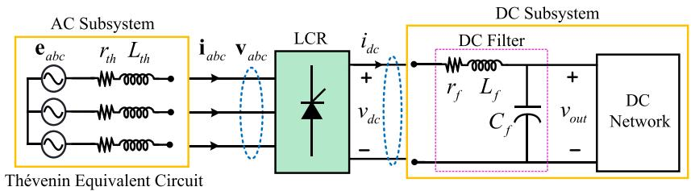  
Fig. 1. A simplified diagram of generic three-phase ac–dc system consisting of a 6-pulse thyristor-controlled line-commutated rectifier.

system-level studies). Some packages have adopted the MANA (Modified-Augmented-Nodal-Analysis) method (e.g., [27]) to eliminate the time-step delay. However, it requires iterations and is therefore not suitable for real-time EMT programs.

A direct interfacing technique has been presented in [18] for the AAVMs of diode rectifier systems to avoid the time-step delay when interfacing with external networks. However, the model in [18] has the general limitations of analytical models and is valid only for CCM-1 [28] operating mode.

In this paper, a direct interfacing method is proposed for the PAVMs of controlled/uncontrolled LCR systems. This is done by linearizing the nonlinear equations of the PAVM and incorporating the resulting sub-matrices and history terms into the network nodal equation. This eliminates the time-step delay and allows a simultaneous and non-iterative solution of the external network together with the PAVM, thus making it suitable for real-time EMT programs. It is demonstrated the proposed direct interfacing of PAVMs permits fairly large time-steps (up to 1000 2000 µs) without compromising accuracy and numerical stability. To the best of the authors’ knowledge, this has not been possible with the previously established methods of interfacing AVMs.

# II. PARAMETRIC AVERAGE-VALUE MODELING

To focus on the proposed methodology, a simplified generic ac–dc system is considered as shown in Fig. 1. Here, the ac subsystem may consist of an arbitrary ac network, e.g., an ac grid including generators, transmission lines, loads, etc., which is represented by its Thévenin equivalent circuit. The dc subsystem may be composed of an arbitrary dc network supplied through a low-pass dc filter. The ac–dc power electronic converter may also be a line-commutated rectifier (LCR) circuit composed of semiconductor switches that can be either uncontrolled (i.e., diodes) or controlled (i.e., thyristors).

For the purpose of modeling in this paper, it is assumed that the Thévenin equivalent source voltages are balanced and purely sinusoidal, and can be expressed as

$$
\mathbf {e} _ {a b c} = \sqrt {2} E _ {\mathrm {r m s}} \left[ \begin{array}{c} \cos (\theta_ {s}) \\ \cos (\theta_ {s} - 2 \pi / 3) \\ \cos (\theta_ {s} + 2 \pi / 3) \end{array} \right], \tag {1}
$$

where $E _ { \mathrm { r m s } }$ is the rms value of the phase voltages, and $\theta _ { s }$ is the angle of the three-phase equivalent voltages.

Due to the discrete and nonlinear operation of the LCR, its terminal voltages/currents contain harmonics. For example, the

phase a voltage and current can be expressed using their Fourier series as

$$
v _ {a} = \sum_ {n = 1} ^ {\infty} V ^ {n} \cos \left(n \theta_ {e} + \theta_ {v} ^ {n}\right), \quad i _ {a} = \sum_ {n = 1} ^ {\infty} I ^ {n} \cos \left(n \theta_ {e} + \theta_ {i} ^ {n}\right), \tag {2}
$$

with similar expressions for phases b and c by replacing $\theta _ { e }$ with $( \theta _ { e } \mp { ^ 2 \pi } _ { \mathit { \left/ 3 \right) } }$ . Here, n is the harmonic order, $V ^ { n }$ and $I ^ { n }$ are the amplitudes of the n-th harmonic of ac voltages and currents with $\theta _ { v } ^ { n }$ and $\theta _ { i } ^ { n }$ as their phase angles, respectively. For consistency with [25], the fundamental component of the LCR phase a voltage is considered as reference (i.e., $\theta _ { v } ^ { 1 } = 0 )$ . Also, $\theta _ { e }$ is the angle of the fundamental frequency component of phase a of the LCR ac voltages $( \mathrm { i } . \mathrm { e } . , v _ { a } ^ { 1 } )$ , expressed as

$$
\theta_ {e} = \int \omega_ {e} d t, \quad \omega_ {e} = 2 \pi f _ {e}, \tag {3}
$$

where $f _ { e }$ and $\omega _ { e }$ are the frequency of the ac subsystem in Hz and rad/s. Also, in the rectification mode of operation, $\theta _ { e }$ lags the angle of the equivalent source voltages θs by the angle δ , as shown in Fig. 2, expressed as

$$
\delta = \theta_ {s} - \theta_ {e}. \tag {4}
$$

The dc terminal variables of LCR also contain oscillatory components (i.e., ripples), which can be expressed as

$$
v _ {d c} = \bar {v} _ {d c} + \tilde {v} _ {d c}, \quad i _ {d c} = \bar {i} _ {d c} + \tilde {i} _ {d c}, \tag {5}
$$

where $\bar { v } _ { d c }$ and $\bar { i } _ { d c }$ are the average values of the dc voltage and current, with $\tilde { v } _ { d c }$ and $\tilde { i } _ { d c }$ as their ripples, respectively.

In the PAVM [19], the average values of the LCR dc-side variables $( \mathrm { i . e . , } \bar { v } _ { d c } \mathrm { a n d } \bar { i } _ { d c } )$ are related to the fundamental components of ac-side variables $( \mathrm { i } . \mathrm { e } . , \mathbf { v } _ { a b c } ^ { 1 }$ and $\mathbf { i } _ { a b c } ^ { 1 } )$ ), using the so-called parametric functions. For this purpose, the average values of dc-side variables are obtained using fast averaging as

$$
\bar {x} (t) = \frac {1}{T} \int_ {t - T} ^ {t} x (t) d \tau , \quad T = \frac {1}{6 f _ {e}} \tag {6}
$$

where x denotes the variable and x¯ is its average value. To obtain the fundamental components of ac-side variables of the LCR, first, the ac terminal variables $\mathbf { v } _ { a b c s }$ and $\mathbf { i } _ { a b c s }$ are transformed to the synchronously rotating converter reference frame $q d ^ { e }$ using the Park’s transformation [15] as

$$
\mathbf {v} _ {q d} ^ {e} = \mathbf {K} \left(\theta_ {e}\right) \mathbf {v} _ {a b c}, \quad \mathbf {i} _ {q d} ^ {e} = \mathbf {K} \left(\theta_ {e}\right) \mathbf {i} _ {a b c}. \tag {7}
$$

Here, K is the transformation matrix defined in (A1), presented in Appthe variables ix A.and the synchronous reference frame are composed of dc average-va $q d ^ { e }$ $\mathbf { v } _ { q d } ^ { e }$ $\mathbf { i } _ { q d } ^ { e }$

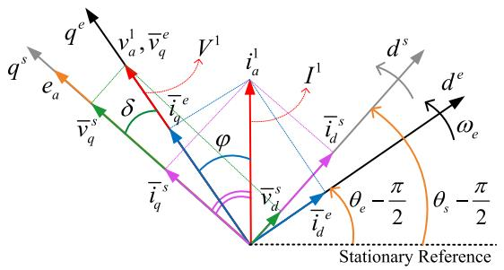  
Fig. 2. Phasor representation of fundamental components of ac variables of the LCR in synchronously rotating source and converter qd reference frames.

(corresponding to the fundamental components $\mathbf { v } _ { a b c } ^ { 1 }$ and $\mathbf { i } _ { a b c } ^ { 1 } ,$ respectively) as well as some oscillatory components (corresponding to the sum of all harmonics of $\mathbf { v } _ { a b c s }$ and $\mathbf { i } _ { a b c s } )$ . Consequently, to capture the fundamental components of ac variables in abc coordinates, the average values of the variables in $q d ^ { e }$ coordinates are obtained by applying averaging (6) to (7), yielding

$$
\bar {v} _ {q} ^ {e} = V ^ {1}, \quad \bar {v} _ {d} ^ {e} = 0. \tag {8}
$$

$$
\bar {i} _ {q} ^ {e} = I ^ {1} \cos (\varphi), \quad \bar {i} _ {d} ^ {e} = I ^ {1} \sin (\varphi), \tag {9}
$$

where $\varphi$ is equal to $( \theta _ { v } ^ { 1 } - \theta _ { i } ^ { 1 } )$ , i.e., the power factor angle of the LCR. The phasor diagrams of the fundamental components of ac variables in the converter $q d ^ { e }$ and source $q d ^ { s }$ reference frames are shown in Fig. 2, where the latter uses the source angle $\theta _ { s }$ for transformations in (7).

To relate the amplitude of the fundamental component of ac-side currents to the average value of the dc-side current, a parametric function is defined as

$$
w _ {i} (\cdot) = \frac {\bar {i} _ {d c}}{\left\| \bar {\mathbf {i}} _ {q d} ^ {e} \right\|}. \tag {10}
$$

Similarly, the amplitude of the fundamental component of acside voltages is related to the average value of the dc-side voltage using a parametric function defined as

$$
w _ {v} (\cdot) = \frac {\left\| \bar {\mathbf {v}} _ {q d} ^ {e} \right\|}{\bar {v} _ {d c}}. \tag {11}
$$

Also, the relationship between ac voltages and currents is captured through the power factor angle of the LCR using a parametric function $\varphi ( \cdot )$ defined based on Fig. 2 as

$$
\varphi (\cdot) = \tan^ {- 1} \left(\frac {\bar {i} _ {d} ^ {e}}{\bar {i} _ {q} ^ {e}}\right). \tag {12}
$$

In the PAVM technique, the parametric functions (10)–(12), are obtained numerically [19], [25] and stored in lookup tables in terms of the LCR firing angle (if thyristor switches are used) and the so-called dynamic impedance [19] defined as

$$
z _ {d} = \frac {\bar {v} _ {d c}}{\left\| \overline {{\mathbf {i}}} _ {q d} ^ {e} \right\|}, \tag {13}
$$

which specifies the loading condition of the LCR.

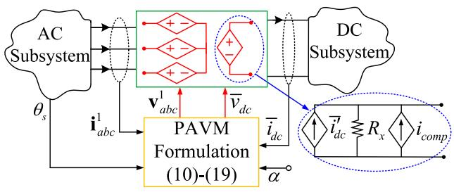  
Fig. 3. Indirect interfacing of the PAVM of LCRs with external ac and dc subsystems using controlled voltage/current sources.

# A. Indirect Interfacing Method

Once the parametric functions are established, in the indirect interfacing method of PAVMs [26], the discrete switching models are replaced with continuous controlled voltage/current sources to interface with external ac and dc subsystems, as illustrated in Fig. 3. Therein, the ac and dc currents of the LCR $( \mathrm { i } . \mathrm { e } . , \mathbf { i } _ { a b c } ^ { 1 }$ and $\bar { i } _ { d c } )$ and its firing angle (if thyristors are used) are the inputs to the PAVM; while the ac and dc voltages $( \mathrm { i } . \mathrm { e } . , \mathbf { v } _ { a b c } ^ { 1 }$ and $\bar { v } _ { d c } )$ are the interfacing outputs.

First, using the inputs and $\bar { v } _ { d c }$ calculated from the previous time-step, the dynamic impedance is calculated based on (13) and used (along with firing angle in case of thyristor switches) to compute the value of parametric functions. Then, using the input ac currents and the computed parametric functions, the intermediate dc current $\bar { i ^ { \prime } } _ { d c }$ is calculated based on (10) as

$$
\bar {i} _ {d c} ^ {\prime} = w _ {i} (\cdot) \left\| \overline {{\mathbf {i}}} _ {q d} ^ {s} \right\|. \tag {14}
$$

The compensating current source $i _ { c o m p }$ (used to eliminate the steady-state error due to snubber $R _ { x } \ : [ 2 6 ] )$ is calculated as

$$
i _ {c o m p} (t) = \frac {\bar {v} _ {d c} (t - \Delta t)}{R _ {x}}, \tag {15}
$$

using the dc voltage at the previous time-step. Subsequently, the interfacing dc voltage $\bar { v } _ { d c }$ is computed as

$$
\bar {v} _ {d c} = R _ {x} \left(\bar {i} _ {d c} ^ {\prime} + i _ {c o m p} - \bar {i} _ {d c}\right). \tag {16}
$$

The LCR ac voltages in the source $q d ^ { s }$ coordinates are also computed as

$$
\bar {v} _ {q} ^ {s} = w _ {v} (\cdot) \bar {v} _ {d c} \cos (\delta), \quad \bar {v} _ {d} ^ {s} = w _ {v} (\cdot) \bar {v} _ {d c} \sin (\delta), \tag {17}
$$

where δ is calculated based on Fig. 2 as

$$
\delta = \tan^ {- 1} \left(\frac {\bar {i} _ {d} ^ {s}}{\bar {i} _ {q} ^ {s}}\right) - \varphi (\cdot). \tag {18}
$$

Finally, the interfacing three-phase ac voltages of the LCR PAVM are obtained by transforming the computed $\bar { \mathbf { v } } _ { q d } ^ { s }$ voltages into the abc coordinates as

$$
\mathbf {v} _ {a b c} ^ {1} = \left[ \mathbf {K} \left(\theta_ {s}\right) \right] ^ {- 1} \bar {\mathbf {v}} _ {q d} ^ {s}. \tag {19}
$$

It should be noted that in the EMTP-type programs, one time-step delay is needed between the controlled voltage /current sources in Fig. 3 to establish their relationship [20]–[21]. The existence/requirement of the one time-step delay between the ac

and dc subsystems generally necessitates the use of small integration time-steps to produce numerically stable and sufficiently accurate solutions; and leads to poor accuracy and/or numerical instability when large time-steps are used [17]–[18], [20]–[21].

# B. Proposed Direct Interfacing Method

In the nodal-analysis-based technique, each component is discretized based on an integration rule, and the network is solved based on the general nodal equation as

$$
\mathbf {V} = \mathbf {G} ^ {- 1} \cdot \mathbf {I}. \tag {20}
$$

Here, V is the vector containing node voltages, and I is the vector consisting of the sum of all (i.e., independent and history) currents injected into the nodes. Also, G is the system nodal conductance matrix. It is worth mentioning that EMTP simulators do not calculate the inverse of G directly. Instead, (20) is solved using forward triangularization and back-substitution, i.e., LU decomposition [11], [12].

Here, the purpose is to discretize and reformulate the PAVM so that it can be written in the form of (20). This allows inserting the assembled sub-matrices of the discretized PAVM directly into the network nodal matrices. As a result, the PAVM becomes part of the overall discretized network and is solved together with the external subsystems without a time-step delay.

For the purpose of derivations, the LCR nodal equations are expressed as

$$
\mathbf {V} _ {\mathrm {L C R}} = \mathbf {Z} _ {\mathrm {L C R}} \mathbf {I} _ {\mathrm {L C R}} + \mathbf {e} _ {h, \mathrm {L C R}}, \tag {21}
$$

where $\mathbf { V } _ { \mathrm { L C R } }$ is the vector consisting of ac and dc voltages as

$$
\mathbf {V} _ {\mathrm {L C R}} = \left[ v _ {a} ^ {1} v _ {b} ^ {1} v _ {c} ^ {1} \bar {v} _ {d c} \right] ^ {T}, \tag {22}
$$

and $\mathbf { I } _ { \mathrm { L C R } }$ is the vector consisting of ac and dc currents as

$$
\mathbf {I} _ {\mathrm {L C R}} = \left[ i _ {a} ^ {1} i _ {b} ^ {1} i _ {c} ^ {1} \bar {i} _ {d c} \right] ^ {T}. \tag {23}
$$

Also, the $\mathbf { e } _ { h , \mathrm { L C R } }$ vector consists of history terms in node voltages as

$$
\mathbf {e} _ {h, \mathrm {L C R}} = \left[ e _ {h, a} e _ {h, b} e _ {h, c} e _ {h, d c} \right] ^ {T}. \tag {24}
$$

To obtain the nodal equations, the ac voltages $\bar { \mathbf { v } } _ { q d } ^ { s }$ and the dc voltage can be written based on (14)–(18) as

$$
\left\{ \begin{array}{l} \bar {v} _ {q} ^ {s} (t) = w _ {v} (\cdot) \bar {v} _ {d c} (t) \cos \left(\tan^ {- 1} \left(\frac {\bar {i} _ {d} ^ {s} (t)}{\bar {i} _ {q} ^ {s} (t)}\right) - \varphi (\cdot)\right) \\ \bar {v} _ {d} ^ {s} (t) = w _ {v} (\cdot) \bar {v} _ {d c} (t) \sin \left(\tan^ {- 1} \left(\frac {\bar {i} _ {d} ^ {s} (t)}{\bar {i} _ {q} ^ {s} (t)}\right) - \varphi (\cdot)\right) \\ \bar {v} _ {d c} (t) = R _ {x} \left(w _ {i} (\cdot) \sqrt {\left(\bar {i} _ {q} ^ {s} (t)\right) ^ {2} + \left(\bar {i} _ {d} ^ {s} (t)\right) ^ {2}} + i _ {\text {c o m p}} - \bar {i} _ {d c}\right) \end{array} . \right. \tag {25}
$$

Using the trigonometric relations in (A3), presented in Appendix B, the voltages in (25) can be expressed as

$$
\left\{ \begin{array}{l} \bar {v} _ {q} ^ {s} (t) = R _ {x} w _ {i} (\cdot) w _ {v} (\cdot) \left[ \bar {i} _ {q} ^ {s} (t) \cos (\varphi (\cdot)) + \bar {i} _ {d} ^ {s} (t) \sin (\varphi (\cdot)) \right] \\ + \dots R _ {x} w _ {v} (\cdot) \left(i _ {\text {c o m p}} - \bar {i} _ {d c}\right) \cos \left(\tan^ {- 1} \left(\frac {\bar {i} _ {d} ^ {s} (t)}{\bar {i} _ {q} ^ {s} (t)}\right) - \varphi (\cdot)\right) \\ \bar {v} _ {d} ^ {s} (t) = R _ {x} w _ {i} (\cdot) w _ {v} (\cdot) \left[ - \bar {i} _ {q} ^ {s} (t) \sin (\varphi (\cdot)) + \bar {i} _ {d} ^ {s} (t) \cos (\varphi (\cdot)) \right] \\ + \dots R _ {x} w _ {v} (\cdot) \left(i _ {\text {c o m p}} - \bar {i} _ {d c}\right) \sin \left(\tan^ {- 1} \left(\frac {\bar {i} _ {d} ^ {s} (t)}{\bar {i} _ {q} ^ {s} (t)}\right) - \varphi (\cdot)\right) \\ \bar {v} _ {d c} (t) = R _ {x} \left(w _ {i} (\cdot) \sqrt {\left(\bar {i} _ {q} ^ {s} (t)\right) ^ {2} + \left(\bar {i} _ {d} ^ {s} (t)\right) ^ {2}} + i _ {\text {c o m p}} - \bar {i} _ {d c}\right) \end{array} \right. \tag {26}
$$

As it can be observed in (26), the ac and dc voltages are nonlinear functions of the currents. As a result, they cannot be directly organized in the form of (21). For that purpose, the equations in (26) need to be linearized first. It is instructive to recall that the linear approximation of a function $f ( x , y )$ at point $( x _ { 0 } , y _ { 0 } )$ is defined as

$$
f (x, y) \approx f \left(x _ {0}, y _ {0}\right) + \underbrace {\left(\frac {\partial f}{\partial x}\right)} _ {\left(x _ {0}, y _ {0}\right)} \left(x - x _ {0}\right) + \underbrace {\left(\frac {\partial f}{\partial y}\right)} _ {\left(x _ {0}, y _ {0}\right)} \left(y - y _ {0}\right). \tag {27}
$$

Applying linearization (27) to voltage equations (26) results in

$$
\left[ \begin{array}{l} \bar {v} _ {q} ^ {s} (t) \\ \bar {v} _ {d} ^ {s} (t) \\ \bar {v} _ {d c} (t) \end{array} \right] = \left[ \begin{array}{c c c} Z _ {q q} & Z _ {q d} & Z _ {q d c} \\ Z _ {d q} & Z _ {d d} & Z _ {d d c} \\ - Z _ {d c q} & - Z _ {d c d} & - Z _ {d c d c} \end{array} \right] \left[ \begin{array}{c} \bar {i} _ {q} ^ {s} (t) \\ \bar {i} _ {d} ^ {s} (t) \\ \bar {i} _ {d c} (t) \end{array} \right] + \left[ \begin{array}{c} e _ {h, q} \\ e _ {h, d} \\ e _ {h, d c} \end{array} \right], \tag {28}
$$

where the elements in the impedance matrix above are

$$
\left\{ \begin{array}{l} Z _ {q q} = \frac {\partial \bar {v} _ {q} ^ {s}}{\partial \bar {i} _ {q} ^ {s}} = (A + B \cdot D) \cos (\varphi (\cdot) _ {(t - \Delta t)}) \\ \quad - (B \cdot E) \sin (\varphi (\cdot) _ {(t - \Delta t)}) \\ Z _ {q d} = \frac {\partial \bar {v} _ {q} ^ {s}}{\partial \bar {i} _ {d} ^ {s}} = (A + B \cdot C) \sin (\varphi (\cdot) _ {(t - \Delta t)}) \\ \quad - (B \cdot E) \cos (\varphi (\cdot) _ {(t - \Delta t)}) \\ Z _ {q d c} = \frac {\partial \bar {v} _ {q} ^ {s}}{\partial \bar {i} _ {d c} ^ {s}} = - F \cos (\delta (t - \Delta t)) \\ Z _ {d q} = \frac {\partial \bar {v} _ {d} ^ {s}}{\partial \bar {i} _ {q} ^ {s}} = - (A + B \cdot D) \sin (\varphi (\cdot) _ {(t - \Delta t)}) \\ \quad - (B \cdot E) \cos (\varphi (\cdot) _ {(t - \Delta t)}) \\ Z _ {d d} = \frac {\partial \bar {v} _ {d} ^ {s}}{\partial \bar {i} _ {d} ^ {s}} = (A + B \cdot C) \cos (\varphi (\cdot) _ {(t - \Delta t)}) \\ \quad + (B \cdot E) \sin (\varphi (\cdot) _ {(t - \Delta t)}) \\ Z _ {d d c} = \frac {\partial \bar {v} _ {d} ^ {s}}{\partial \bar {i} _ {d c} ^ {s}} = - F \sin (\delta (t - \Delta t)) \\ Z _ {d c q} = - \frac {\partial \bar {v} _ {d c}}{\partial \bar {i} _ {q} ^ {s}} = - G \times \bar {i} _ {q} ^ {s} (t - \Delta t) \\ Z _ {d c d} = - \frac {\partial \bar {v} _ {d c}}{\partial \bar {i} _ {d} ^ {s}} = - G \times \bar {i} _ {d} ^ {s} (t - \Delta t) \\ Z _ {d c d c} = - \frac {\partial \bar {v} _ {d c}}{\partial \bar {i} _ {d c}} = R _ {x} \end{array} . \right. \tag {29}
$$

The history terms in (28) are also calculated as

$$
\left\{ \begin{array}{l} e _ {h, q} = \left[ - B \cdot D \cos (\varphi (\cdot) _ {(t - \Delta t)}) + B \cdot E \sin (\varphi (\cdot) _ {(t - \Delta t)}) \right] \\ \times \bar {i} _ {q} ^ {s} (t - \Delta t) \\ + \dots \left[ - B \cdot C \sin (\varphi (\cdot) _ {(t - \Delta t)}) + B \cdot E \cos (\varphi (\cdot) _ {(t - \Delta t)}) \right] \\ \times \bar {i} _ {d} ^ {s} (t - \Delta t) \\ + \dots [ F \cos (\delta (t - \Delta t)) ] \times \bar {i} _ {d c} (t - \Delta t) + B \cos (\delta (t - \Delta t)) \\ e _ {h, d} = \left[ B \cdot D \sin (\varphi (\cdot) _ {(t - \Delta t)}) + B \cdot E \cos (\varphi (\cdot) _ {(t - \Delta t)}) \right] \\ \times \bar {i} _ {q} ^ {s} (t - \Delta t) \\ + \dots \left[ - B \cdot C \cos (\varphi (\cdot) _ {(t - \Delta t)}) - B \cdot E \sin (\varphi (\cdot) _ {(t - \Delta t)}) \right] \\ \times \bar {i} _ {d} ^ {s} (t - \Delta t) \\ + \dots [ F \sin (\delta (t - \Delta t)) ] \times \bar {i} _ {d c} (t - \Delta t) + B \sin (\delta (t - \Delta t)) \\ e _ {h, d c} = R _ {x} (i _ {\text {c o m p}}) \end{array} \right. \tag {30}
$$

In (29), (30), the coefficients $\{ A , B , . . . , G \}$ are calculated to be

$$
\left\{ \right.\begin{array}{l}A = R _ {x} \left(w _ {i} (\cdot) w _ {v} (\cdot)\right) _ {(t - \Delta t)}\\B = R _ {x} \left(i _ {\text {c o m p}} - \bar {i} _ {d c} (t - \Delta t)\right) \left(w _ {v} (\cdot)\right) _ {(t - \Delta t)}\\C = \frac {\left(\bar {i} _ {q} ^ {s} (t - \Delta t)\right) ^ {2}}{\left(\left(\bar {i} _ {q} ^ {s} (t - \Delta t)\right) ^ {2} + \left(\bar {i} _ {d} ^ {s} (t - \Delta t)\right) ^ {2}\right) ^ {3 / 2}}\\D = \frac {\left(\bar {i} _ {d} ^ {s} (t - \Delta t)\right) ^ {2}}{\left(\left(\bar {i} _ {q} ^ {s} (t - \Delta t)\right) ^ {2} + \left(\bar {i} _ {d} ^ {s} (t - \Delta t)\right) ^ {2}\right) ^ {3 / 2}}\\E = \frac {\bar {i} _ {q} ^ {s} (t - \Delta t) \times \bar {i} _ {d} ^ {s} (t - \Delta t)}{\left(\left(\bar {i} _ {q} ^ {s} (t - \Delta t)\right) ^ {2} + \left(\bar {i} _ {d} ^ {s} (t - \Delta t)\right) ^ {2}\right) ^ {3 / 2}}\\F = R _ {x} \left(w _ {v} (\cdot)\right) _ {(t - \Delta t)}\\G = \frac {R _ {x} \left(w _ {i} (\cdot)\right) _ {(t - \Delta t)}}{\sqrt {\left(\bar {i} _ {q} ^ {s} (t - \Delta t)\right) ^ {2} + \left(\bar {i} _ {d} ^ {s} (t - \Delta t)\right) ^ {2}}}\end{array}. \tag {31}
$$

It is worth mentioning that the minus sign in the last row of the impedance matrix in (28) is due to the direction of the dc current, being outward of the LCR (see Fig. 1). Hence, the dc voltage equation is in the form of $( \bar { v } _ { d c } = - { \bf Z } \cdot { \bf I } + e _ { h , d c } )$ .

It is noted that (28) is not yet completely in the form of (21). To achieve that, it should be reformulated by transforming the qd variables into the abc coordinates. The ac qd voltages in (28) can be written as

$$
\left[ \begin{array}{l} \bar {v} _ {q} ^ {s} (t) \\ \bar {v} _ {d} ^ {s} (t) \end{array} \right] = \left[ \begin{array}{l l} Z _ {q q} & Z _ {q d} \\ Z _ {d q} & Z _ {d d} \end{array} \right] \left[ \begin{array}{l} \bar {i} _ {q} ^ {s} (t) \\ \bar {i} _ {d} ^ {s} (t) \end{array} \right] + \left[ \begin{array}{l} Z _ {q d c} \\ Z _ {d d c} \end{array} \right] \bar {i} _ {d c} (t) + \left[ \begin{array}{l} e _ {h, q} \\ e _ {h, d} \end{array} \right]. \tag {32}
$$

Multiplying both sides of (32) by $[ \mathbf { K } ( \theta _ { s } ) ] ^ { - 1 }$ , the qd voltages are transformed into the abc coordinates yielding

$$
\begin{array}{l} \left[ \begin{array}{l} v _ {a} ^ {1} (t) \\ v _ {b} ^ {1} (t) \\ v _ {c} ^ {1} (t) \end{array} \right] = [ \mathbf {K} (\theta_ {s}) ] ^ {- 1} \left[ \begin{array}{l l} Z _ {q q} & Z _ {q d} \\ Z _ {d q} & Z _ {d d} \end{array} \right] [ \mathbf {K} (\theta_ {s}) ] \left[ \begin{array}{l} i _ {a} ^ {1} (t) \\ i _ {b} ^ {1} (t) \\ i _ {c} ^ {1} (t) \end{array} \right] \\ + \dots \left[ \mathbf {K} \left(\theta_ {s}\right) \right] ^ {- 1} \left[ \begin{array}{l} Z _ {q d c} \\ Z _ {d d c} \end{array} \right] \bar {i} _ {d c} (t) + \left[ \mathbf {K} \left(\theta_ {s}\right) \right] ^ {- 1} \left[ \begin{array}{l} e _ {h, q} \\ e _ {h, d} \end{array} \right]. \tag {33} \\ \end{array}
$$

In (33), $\bar { \mathbf { i } } _ { q d } ^ { s }$ has been also replaced by $\big [ \mathbf { K } ( \theta _ { s } ) \big ] \mathbf { i } _ { a b c } ^ { 1 } .$ . The average dc voltage $\bar { v } _ { d c }$ in (28) can also be expressed as

$$
\begin{array}{l} \bar {v} _ {d c} (t) = - 2 / 3 \left\{\left[ Z _ {d c q} \cos (\theta_ {s}) + Z _ {d c d} \sin (\theta_ {s}) \right] i _ {a} ^ {1} (t) \right. \\ + \dots \left[ Z _ {d c q} \cos \left(\theta_ {s} - 2 \pi / 3\right) + Z _ {d c d} \sin \left(\theta_ {s} - 2 \pi / 3\right) \right] i _ {b} ^ {1} (t) \\ + \dots \left[ Z _ {d c q} \cos \left(\theta_ {s} + 2 \pi / 3\right) + Z _ {d c d} \sin \left(\theta_ {s} + 2 \pi / 3\right) \right] i _ {c} ^ {1} (t) \bigg \} \\ - \dots \left[ Z _ {d c d c} \right] \bar {i} _ {d c} (t) + e _ {h, d c}, \tag {34} \\ \end{array}
$$

where $\bar { i } _ { q } ^ { s } ( t )$ and $\bar { i } _ { d } ^ { s } ( t )$ has been replaced with their abc equivalents $( \mathrm { i . e . , } i _ { a } ^ { 1 } ( t ) , i _ { b } ^ { 1 } ( t )$ , and $i _ { c } ^ { 1 } ( t ) )$ using (7), (A1).

Ultimately, the nodal voltages can be written in the form of (21) based on (33), (34) as

$$
\begin{array}{l} \left[ \begin{array}{c} v _ {a} ^ {1} (t) \\ v _ {b} ^ {1} (t) \\ v _ {c} ^ {1} (t) \\ \vdots \\ \bar {v} _ {d c} (t) \end{array} \right] = \underbrace {\left[ \begin{array}{c c c c} Z _ {a a} & Z _ {a b} & Z _ {a c} & Z _ {a d c} \\ Z _ {b a} & Z _ {b b} & Z _ {b c} & Z _ {b d c} \\ Z _ {c a} & Z _ {c b} & Z _ {c c} & Z _ {c d c} \\ - Z _ {d c a} & - Z _ {d c b} & - Z _ {d c c} & - Z _ {d c d c} \end{array} \right]} _ {\mathbf {Z} _ {\mathrm {L C R}}} \left[ \begin{array}{c} i _ {a} ^ {1} (t) \\ i _ {b} ^ {1} (t) \\ i _ {c} ^ {1} (t) \\ \vdots \\ \bar {i} _ {d c} (t) \end{array} \right] \\ + \left[ \begin{array}{l} e _ {h, a} \\ e _ {h, b} \\ e _ {h, c} \\ \dots \dots \dots . \\ e _ {h, d c} \end{array} \right], \tag {35} \\ \end{array}
$$

where the impedance matrix $\mathbf { Z } _ { \mathrm { L C R } }$ is composed of

$$
\begin{array}{l} \left[ \begin{array}{l l l} Z _ {a a} & Z _ {a b} & Z _ {a c} \\ Z _ {b a} & Z _ {b b} & Z _ {b c} \\ Z _ {c a} & Z _ {c b} & Z _ {c c} \end{array} \right] = \left[ \mathbf {K} \left(\theta_ {s}\right) \right] ^ {- 1} \left[ \begin{array}{l l} Z _ {q q} & Z _ {q d} \\ Z _ {d q} & Z _ {d d} \end{array} \right] \left[ \mathbf {K} \left(\theta_ {s}\right) \right], (36) \\ \left[ \begin{array}{l} Z _ {a d c} \\ Z _ {b d c} \\ Z _ {c d c} \end{array} \right] = \left[ \mathbf {K} \left(\theta_ {s}\right) \right] ^ {- 1} \left[ \begin{array}{l} Z _ {q d c} \\ Z _ {d d c} \end{array} \right], (37) \\ \end{array}
$$

$$
\begin{array}{l} \left[ \begin{array}{c} - Z _ {d c a} \\ - Z _ {d c b} \\ - Z _ {d c c} \end{array} \right] ^ {T} \\ = \frac {- 2}{3} \left[ \begin{array}{c} Z _ {d c q} \cos \left(\theta_ {s}\right) + Z _ {d c d} \sin \left(\theta_ {s}\right) \\ Z _ {d c q} \cos \left(\theta_ {s} - 2 \pi / 3\right) + Z _ {d c d} \sin \left(\theta_ {s} - 2 \pi / 3\right) \\ Z _ {d c q} \cos \left(\theta_ {s} + 2 \pi / 3\right) + Z _ {d c d} \sin \left(\theta_ {s} + 2 \pi / 3\right) \end{array} \right] ^ {T}, \tag {38} \\ \end{array}
$$

and $( - Z _ { d c d c } = - R _ { x } )$ given in (29). The impedances in the righthand-side expressions in (36)–(38) have also been defined in (29). Also, the abc history terms in (35) are expressed based on (33) as

$$
\left[ \begin{array}{l} e _ {h, a} \\ e _ {h, b} \\ e _ {h, c} \end{array} \right] = \left[ \mathbf {K} \left(\theta_ {s}\right) \right] ^ {- 1} \left[ \begin{array}{l} e _ {h, q} \\ e _ {h, d} \end{array} \right], \tag {39}
$$

and $e _ { h , d c }$ is defined in (30).

The equations (13), (29)–(31) and (35)–(39) collectively constitute the discretized Thévenin equivalent of the PAVM of LCR. The direct interfacing of the discretized PAVM with the external ac and dc subsystems is shown in Fig. 4, which utilizes coupled resistive branches and history voltage sources. It is noted that

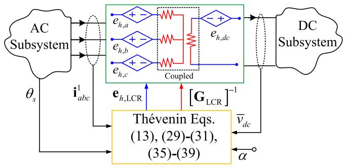  
Fig. 4. Proposed direct interfacing of the discretized PAVM with external ac and dc subsystems using the Thévenin equivalent circuit.

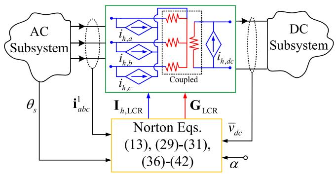  
Fig. 5. Proposed direct interfacing of the discretized PAVM with external ac and dc subsystems using the Norton equivalent circuit.

(21) and (35) can also be written in the form of

$$
\mathbf {I} _ {\mathrm {L C R}} = \mathbf {G} _ {\mathrm {L C R}} \cdot \mathbf {V} _ {\mathrm {L C R}} + \mathbf {I} _ {h, \mathrm {L C R}}, \tag {40}
$$

where

$$
\mathbf {G} _ {\mathrm {L C R}} = \left[ \mathbf {Z} _ {\mathrm {L C R}} \right] ^ {- 1}, \tag {41}
$$

and

$$
\mathbf {I} _ {h, \mathrm {L C R}} = \left[ \begin{array}{l l l l} i _ {h, a} & i _ {h, b} & i _ {h, c} & i _ {h, d c} \end{array} \right] ^ {T} = - \left[ \mathbf {Z} _ {\mathrm {L C R}} \right] ^ {- 1} \mathbf {e} _ {h, \mathrm {L C R}}. \tag {42}
$$

The Norton equivalent of the PAVM of LCR can thus be realized using (13), (29)–(31), and (36)–(42), and directly interfaced with the external subsystems using coupled resistive branches and history current sources, as shown in Fig. 5.

It is worth mentioning that equivalently to the methods shown in Figs. 4–5, the DI-PAVM can be implemented in EMTP-type programs as a user-defined model (if the package allows) using the resultant conductance matrix and the history terms which are updated during the simulation run-time.

In this paper, it is assumed that $\theta _ { s }$ (the angle of the three-phase equivalent voltages, or rotor angle of generators) is available from the ac subsystem as an input to the IDI-PAVM and the proposed DI-PAVM, as illustrated in Figs 3–5. However, if it is required to model the electromechanical dynamics of the ac subsystem, θs should be predicted/ extrapolated in an EMTPtype solution [29].

The procedure for implementing the proposed DI-PAVM in nodal-analysis-based programs is summarized as a flowchart in

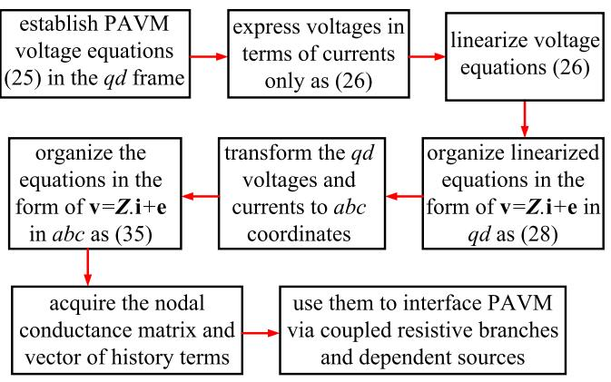  
Fig. 6. Flowchart of procedure for implementing the proposed DI-PAVM method in EMTP-type solution.

Fig. 6. As depicted in Fig. 6, first the PAVM voltage equations (25) should be expressed in terms of currents only, as in (26). Then, the equations are linearized and written in the form of v = Zi + e as (28) where the ac variables are in qd coordinates. Thereafter, the qd variables are transformed to abc coordinates and the equations are written in abc coordinates as (35). Finally, the resultant conductance sub-matrix and history terms of the LCR are obtained from (35) which are used to interface the DI-PAVM with the external network.

# III. COMPUTER STUDIES

Here, the performance of the direct interfacing method, proposed in Section II-B, is investigated against the previous indirect interfacing method, presented in Section II-A. For this purpose, the system in Fig. 1 has been implemented (in PSCAD and MATLAB) using three different models of the thyristorcontrolled LCR: detailed switching model (labeled as Detailed Model), indirectly-interfaced PAVM (labeled as IDI-PAVM), and the proposed directly-interfaced PAVM (labeled DI-PAVM). Also, a reference solution is obtained using (either of) the two PAVMs run with a very small time-step of 0.1 µs, labeled as Reference PAVM. The dc network is also represented with a resistive load rl. The parameters of the system for these studies are summarized in Appendix C.

It is assumed that the system starts up with zero initial conditions and then the LCR operates near CCM-2 mode [28] where the firing angle of thyristors is set at $\alpha = 3 0 ^ { \circ }$ and the dc load is $r _ { l } = 0 . 5 \Omega$ . Then, at t = 2.5 s the firing angle is stepped down to zero (i.e., diode operation) and the load resistance is stepped up to $r _ { l } = 4 \Omega$ resulting in CCM-1 mode [28]. The simulations continue for 5 seconds. The transient response of the ac- and dc-terminal variables of the LCR at the moment of transient is shown in Fig. 7, as obtained by the subject models when the simulation time-step size is 50 µs (typical in EMTP) for the detailed model, IDI-PAVM, and the DI-PAVM.

As it can be observed in Fig. 7, the two PAVMs provide consistent results with the Reference PAVM, since the simulation time-step is fairly small (50 µs). It is also seen that the PAVMs obtain the average values of the dc variables and the fundamental

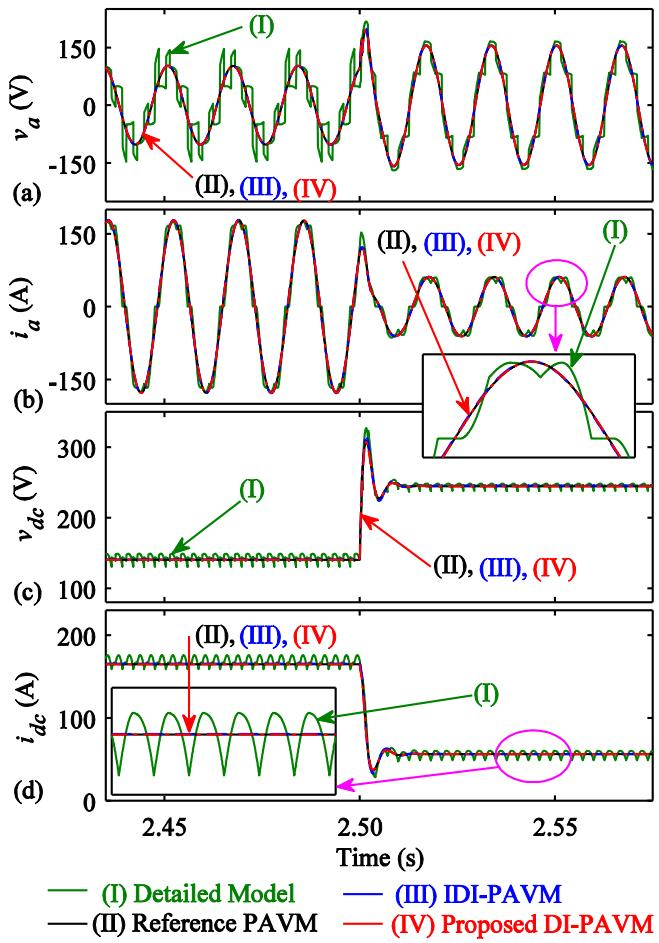  
Fig. 7. Transient response of the ac- and dc-terminal variables of the LCR obtained by the subject models for: (a) phase a voltage $\nu _ { a } , ( \mathsf { b } )$ phase a current ia, (c) dc voltage $\nu _ { d c } .$ , and (d) dc current $i _ { d c } .$ . The simulation time-step for IDI-PAVM and proposed DI-PAVM is $\Delta t = 5 0 ~ \mu$ s.

components of ac variables accurately (both steady-state and dynamics) compared to the detailed model.

Consequently, in the subsequent studies, the results of the IDI-PAVM and the DI-PAVM at larger time-steps are compared to the Reference PAVM (only).

The transient response of the variables when the simulation time-step is increased to 250 µs for the IDI-PAVM and the DI-PAVM is shown in Figs. 8–9. As it can be observed in Figs. 8–9, not only the dynamic behavior of the IDI-PAVM is compromised with this time-step, but also the steady-state solution of the IDI-PAVM diverges from the reference solution. This is due to the one-time-step delay between the dc and ac interfacing controlled sources in Fig. 3. In the meantime, the proposed DI-PAVM provides accurate results (both steady-state and dynamic) compared to the reference solution, due to avoiding the time-step delay.

The impact of the one-time-step delay is more remarkable at larger time-steps, as illustrated in Figs. 10–11 where the results are obtained with $\Delta t = 5 5 0 ~ \mu \mathrm { s }$ for the IDI-PAVM and DI-PAVM. As it can be observed in Figs. 10–11, the IDI-PAVM fails to obtain valid results, and its solution visibly diverges from the reference solution for both ac and dc variables (even

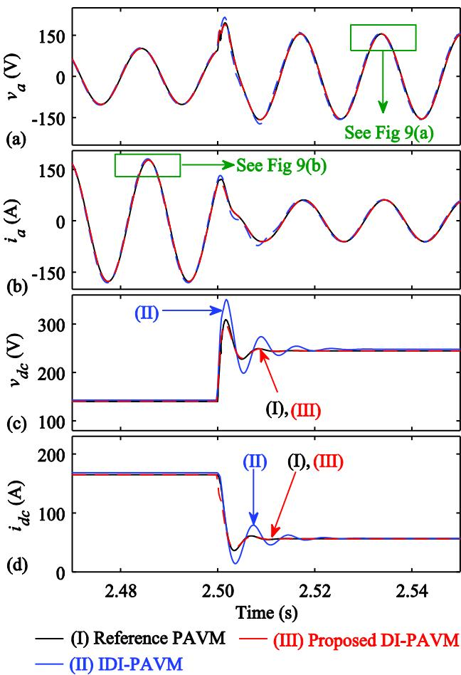  
Fig. 8. Transient response of the ac- and dc-terminal variables of the LCR obtained by the subject models for: (a) $\nu _ { a } , ( { \mathsf b } ) \ i _ { a } , ( { \mathsf c } ) \ \nu _ { d c } ,$ , and (d) idc. The simulation time-step for IDI-PAVM and proposed DI-PAVM is $\Delta t = 2 5 0$ µs.

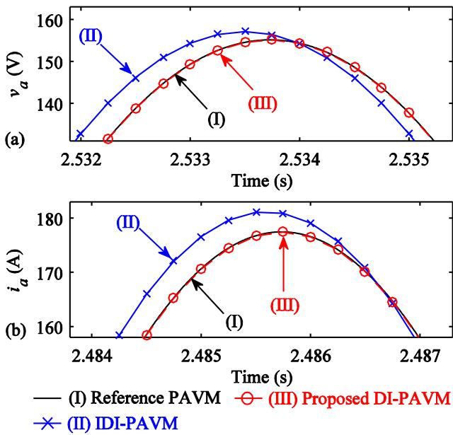  
Fig. 9. Magnified view of ${ \mathrm { F i g . } }$ . 8 when $\Delta t = 2 5 0 ~ \mu \mathrm { s }$ for the IDI-PAVM and the proposed DI-PAVM for the ac variables: $\left( \mathrm { a } \right) \nu _ { a } , \left( \mathrm { b } \right) i _ { a }$ .

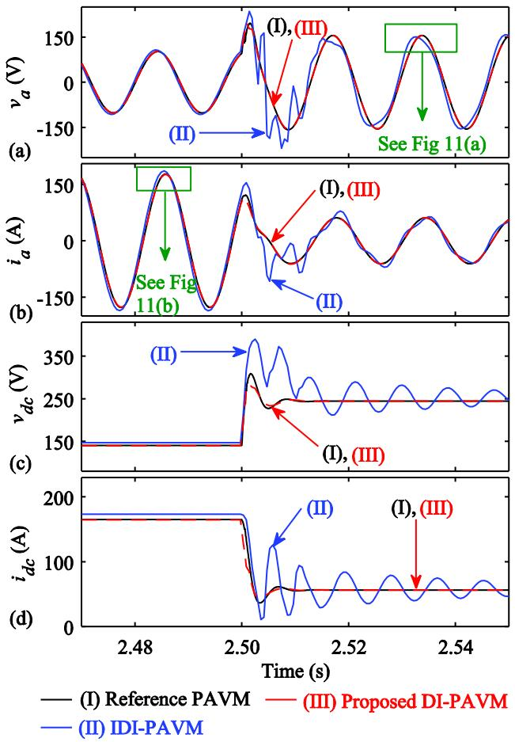  
Fig. 10. Transient response of the ac- and dc-terminal variables of the LCR obtained by the subject models for: (a) $\nu _ { a } , ( { \mathsf b } ) \ i _ { a } , ( { \mathsf c } ) \ \nu _ { d c } ,$ and (d) $i _ { d c } .$ The simulation time-step for IDI-PAVM and proposed DI-PAVM is $\Delta t = 5 5 0$ µs.

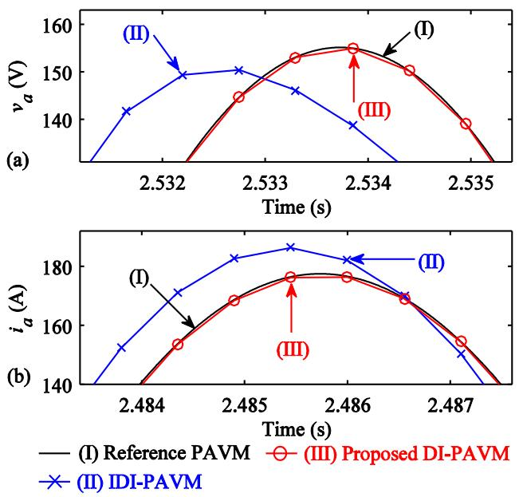  
Fig. 11. Magnified view of Fig. 10 when $\Delta t = 5 5 0$ µs for IDI-PAVM and proposed DI-PAVM for the ac variables: $( { \mathrm { a } } ) \nu _ { a } , ( { \mathrm { b } } ) i _ { a } .$ .

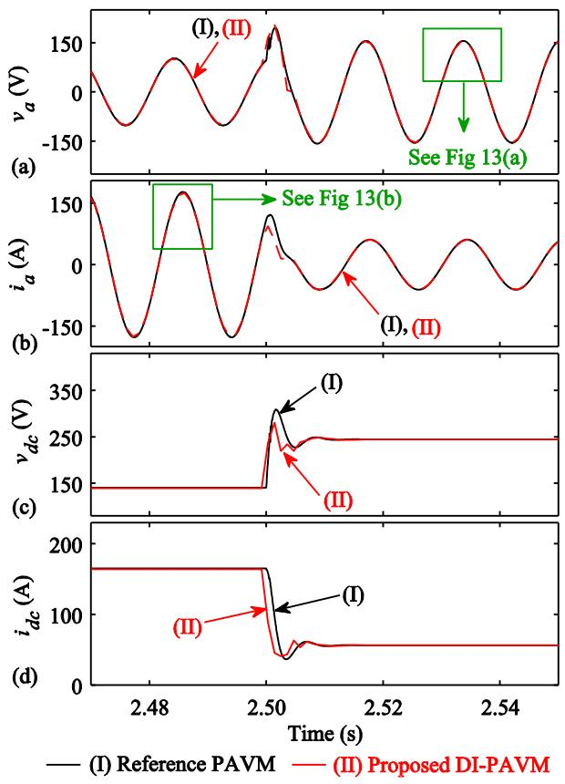  
Fig. 12. Transient response of the ac- and dc-terminal variables of the LCR obtained by the subject models for: (a) $\nu _ { a } ,$ (b) ia, (c) vdc, and (d) $i _ { d c }$ . The simulation time-step for the proposed DI-PAVM is $\Delta t = 1 1 0 0 ~ \mathrm { \mu s }$ .

in steady-state). However, the proposed DI-PAVM provides accurate results for both ac and dc variables.

To show the accuracy and superiority of the proposed direct interfacing method, the results of the DI-PAVM with $\Delta t$ $= \ 1 1 0 0 \ { \mu \mathrm { s } }$ are shown in Figs. 12–13. In Fig. 13, the solution of the DI-PAVM with $\Delta t = 2 2 0 0$ µs is also superimposed. As seen in Figs. 12–13, the proposed DI-PAVM is capable of providing accurate results even at such very large time-steps, and its solution exactly lands on the reference solution.

The 2-norm error of the IDI-PAVM and the DI-PAVM for the subject transient study is depicted in Fig. 14 for a wide range of time-step sizes. As seen, the IDI-PAVM loses its accuracy at large (∼ more than 150 µs) time-steps, while the proposed DI-PAVM provides acceptable accuracy (1∼2%) even at very large time-step sizes (1000 2000 µs).

It is important to mention the results for the proposed DI-PAVM in Figs. 7–14 were obtained without any iterations, making this method suitable for real-time applications. Iterations can be applied for computing the Jacobian matrix in (28)–(31) to further improve the accuracy of the DI-PAVM, at the cost of additional computations.

It is also worth mentioning that three interfacing methods were analyzed in [26], namely current source (CS)

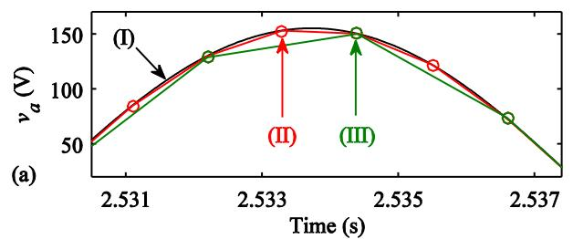

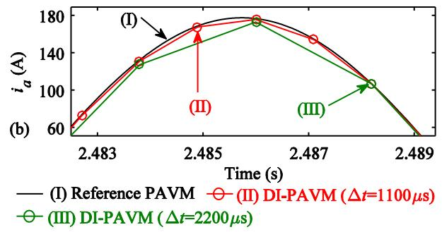  
Fig. 13. Magnified view of Fig. 12 when $\Delta t = 1 1 0 0$ µs as well as $\Delta t = 2 2 0 0$ µs for the proposed DI-PAVM for the ac variables: (a) va, (b) ia.

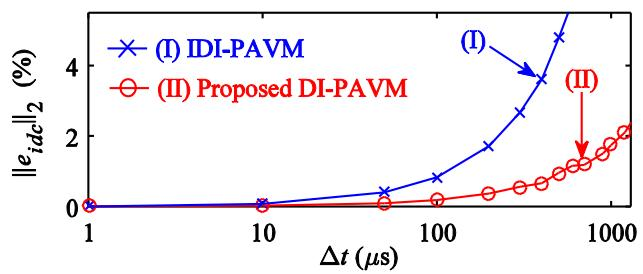  
Fig. 14. The 2-norm error of the IDI-PAVM and the proposed DI-PAVM for the subject transient study with different time-step sizes.

interface, voltage source (VS) interface, and compensated voltage source (CVS) interface. It was shown in [26] that these methods had similar computational efficiency, although CVS was superior in terms of accuracy and numerical stability. However, the developed models were state-variable-based, not nodal-analysis-based. The CVS interface in [26] is equivalent to the IDI-PAVM with EMTP formulation in this paper, which requires one time-step delay between the interfacing sources.

To compare the numerical efficiency of the proposed DI-PAVM against the IDI-PAVM, the computational performance of the subject models has been summarized in Table I for the 5s transient study with different time-step sizes on a PC with Intel CoreTM i7-9750H @2.60GHz. As it can be seen in Table I, the DI-PAVM is computationally more expensive (i.e., requires ∼460 µs time-per-step) compared to the IDI-PAVM (which requires 395 µs). However, as illustrated in Figs. 7–11 and Fig. 14, the accuracy of the IDI-PAVM degrades with large time-steps (due to the one time-step delay), requiring $\Delta t$ to be kept as small as 50 150 µs. However, the proposed DI-PAVM can provide reasonably accurate results with time-steps as large as 1000–2000 µs. Therefore, one can run the same 5s transient

TABLE I COMPUTATIONAL PERFORMANCE OF THE SUBJECT INTERFACING TECHNIQUES FOR THE CONSIDERED 5S TRANSIENT STUDY WITH DIFFERENT FIXED TIME-STEP SIZES   

<table><tr><td>Interfacing Method</td><td>Time-Step</td><td>Δt=50 μs</td><td>Δt=250 μs</td><td>Δt=550 μs</td><td>Δt=1100 μs</td></tr><tr><td rowspan="2">IDI-PAVM</td><td>CPU Time</td><td>39 s</td><td>7.8 s</td><td rowspan="2">Not Valid</td><td rowspan="2">Not Valid</td></tr><tr><td>Time-per-Step</td><td>390 μs</td><td>390 μs</td></tr><tr><td rowspan="2">DI-PAVM</td><td>CPU Time</td><td>46 s</td><td>9.22 s</td><td>4.18 s</td><td>2.1 s</td></tr><tr><td>Time-per-Step</td><td>460 μs</td><td>461 μs</td><td>460 μs</td><td>462 μs</td></tr></table>

study in 2∼4 s using the DI-PAVM as opposed to ∼39 s using the IDI-PAVM.

Moreover, the methodology presented in this paper can be applicable to other types of converters. For example, the relations for AVMs of voltage-source inverters were presented in [30] for several commonly-used modulation strategies (i.e., basic six-step, PWM, sine-triangle, and space-vector modulation). As shown in [30, see (5), (6), Table I], the AVMs of such converters can also be established in the form of (10) and (11), with the difference that the parametric functions would have different values. Once these AVM relationships (for any type of converters) are established, the methodology presented in this paper can be used to directly interface them with external networks in EMTP-type programs following the procedure summarized in Fig. 6.

# IV. CONCLUSION

In most EMTP-type simulation software, interfacing the parametric average-value models (PAVMs) of rectifiers requires one time-step delay between the interfacing sources. This limits the time-steps in simulations (approximately to 50 ∼150 µs max) due to the inaccuracy and numerical instability at larger timesteps. In this paper, a direct interfacing method has been developed which avoids the time-step delay. This has been achieved by discretizing the PAVM nonlinear relations and formulating them based on the nodal approach and then merging the sub-matrices of the linearized PAVM into the network nodal equations through the conductance matrix and the history terms. It has been verified that the proposed DI (directly-interfaced)-PAVM allows using up to 1000 2000 µs time-step sizes in transient simulations while maintaining good accuracy without compromising the numerical stability. It is envisioned that the proposed DI-PAVM can be used in many EMTP-type offline/real-time simulation programs when PAVMs of rectifiers are inevitable for power system studies.

# APPENDIX

A. Park’s Transformation Matrix and its Inverse

$$
\mathbf {K} \left(\theta_ {s}\right) = \frac {2}{3} \left[ \begin{array}{l} \cos \left(\theta_ {s}\right) \cos \left(\theta_ {s} - 2 \pi / 3\right) \cos \left(\theta_ {s} + 2 \pi / 3\right) \\ \sin \left(\theta_ {s}\right) \sin \left(\theta_ {s} - 2 \pi / 3\right) \sin \left(\theta_ {s} + 2 \pi / 3\right) \end{array} \right], \tag {A1}
$$

$$
\left[ \mathbf {K} \left(\theta_ {s}\right) \right] ^ {- 1} = \left[ \begin{array}{c c} \cos \left(\theta_ {s}\right) & \sin \left(\theta_ {s}\right) \\ \cos \left(\theta_ {s} - 2 \pi / 3\right) \sin \left(\theta_ {s} - 2 \pi / 3\right) \\ \cos \left(\theta_ {s} + 2 \pi / 3\right) \sin \left(\theta_ {s} + 2 \pi / 3\right) \end{array} \right]. \tag {A2}
$$

B. Applicable Trigonometric Relations

$$
\left\{ \begin{array}{l} \cos \left(\tan^ {- 1} \left(\frac {x}{y}\right)\right) = \frac {y}{\sqrt {x ^ {2} + y ^ {2}}} \\ \sin \left(\tan^ {- 1} \left(\frac {x}{y}\right)\right) = \frac {x}{\sqrt {x ^ {2} + y ^ {2}}} \\ \cos (x - y) = \cos (x) \cos (y) + \sin (x) \sin (y) \\ \sin (x - y) = \sin (x) \cos (y) - \cos (x) \sin (y) \end{array} . \right. \tag {A3}
$$

C. Parameters of the Case-Study System

$$
E _ {r m s} = 1 2 0 \mathrm {V}, f _ {e} = 6 0 \mathrm {H z}, r _ {t h} = 0. 1 \Omega , L _ {t h} = 1. 2 \mathrm {m H},
$$

$$
r _ {f} = 0. 3 5 \Omega , L _ {f} = 0. 2 5 \mathrm {m H}, C _ {f} = 6 0 0 \mu \mathrm {F}, R _ {x} = 2 \Omega .
$$

# REFERENCES

[1] S. Mirsaeidi, D. Tzelepis, J. He, X. Dong, D. M. Said, and C. Booth, “A controllable thyristor-based commutation failure inhibitor for LCC-HVDC transmission systems,” IEEE Trans. Power Electron, vol. 36, no. 4, pp. 3781–3792, Apr. 2021.   
[2] H. Zhou, G. Yang, and J. Wang, “Modeling, analysis, and control for the rectifier of hybrid HVDC systems for DFIG-based wind farms,” IEEE Trans. Energy Convers., vol. 26, no. 1, pp. 340–353, Mar. 2011.   
[3] J. K. Nøland, S. Nuzzo, A. Tessarolo, and E. F. Alves, “Excitation system technologies for wound-field synchronous machines: Survey of solutions and evolving trends,” IEEE Access, vol. 7, pp. 109699–109718, 2019.   
[4] A. Emadi, M. Ehsani, and J. M. Miller, Vehicular Electric Power Systems: Land, Sea, Air, and Space Vehicles. New York, NY, USA:Marcel-Dekker, 2004.   
[5] B. Zahedi and L. E. Norum, “Modeling and simulation of all-electric ships with low-voltage DC hybrid power systems,” IEEE Trans. Power Electron., vol. 28, no. 10, pp. 4525–4537, Oct. 2013.   
[6] A. Cross, A. Baghramian, and A. Forsyth, “Approximate, average, dynamic models of uncontrolled rectifiers for aircraft applications,” IET Power Electron., vol. 2, no. 4, pp. 398–409, Jul. 2009.   
[7] I. Yilmaz, M. Ermis, and I. Cadirci, “Medium-frequency induction melting furnace as a load on the power system,” IEEE Trans. Ind. Appl., vol. 48, no. 4, pp. 1203–1214, Jul./Aug. 2012.   
[8] ePHASORSIM, Opal-RT Technologies. [Online]. Available: https://www. opal-rt.com/wp-content/uploads/2019/04/one-pager-ephasorsim_web. pdf   
[9] RTDS Technologies Applications, Superstep, 2022. [Online]. Available: https://knowledge.rtds.com/hc/en-us/articles/360034827413-Superstep   
[10] M. O. Faruque, V. Dinavahi, and W. Xu, “Algorithms for the accounting of multiple switching events in digital simulation of power-electronic systems,” IEEE Trans. Power Del., vol. 20, no. 2, pp. 1157–1167, Apr. 2005.   
[11] EMTDC User’s Guide v4.6, Chapter 4, Interpolation and switching. 2018. [Online]. Available: https://www.pscad.com/knowledge-base/article/163

[12] H. W. Dommel, EMTP Theory Book. Vancouver, BC, Canada: MicroTran Power System Analysis Corp., 1992.   
[13] P. Mattavelli, G. C. Verghese, and A. M. Stankovic, “Phasor dynamics of thyristor controlled series capacitor systems,” IEEE Trans. Power Syst., vol. 12, no. 3, pp. 1259–1267, Aug. 1997.   
[14] M. Daryabak, S. Filizadeh, and A. Bagheri Vandaei, “Dynamic phasor modeling of LCC-HVDC systems: Unbalanced operation and commutation failure,” Can. J. Elect. Comput. Eng., vol. 42, no. 2, pp. 121–131, Jun. 2019.   
[15] P. C. Krause, O. Wasynczuk, S. D. Sudhoff, and S. Pekarek, Analysis of Electric Machinery and Drive Systems, 3rd ed. Piscataway, NJ, USA: IEEE Press, 2013.   
[16] S. D. Sudhoff and O. Wasynczuk, “Analysis and average-value modeling of line-commutated converter-synchronous machine systems,” IEEE Trans. Energy Convers., vol. 8, no. 1, pp. 92–99, Mar. 1993.   
[17] S. Chiniforoosh, A. Davoudi, and J. Jatskevich, “Averaged-circuit modeling of line-commutated rectifiers for transient simulation programs,” in Proc. IEEE Int. Symp. Circuits Syst., 2010, pp. 2318–2321.   
[18] S. Chiniforoosh, H. Atighechi, and J. Jatskevich, “Direct interfacing of dynamic average models of line-commutated rectifier circuits in nodal analysis EMTP-type solution,” IEEE Trans. Circuits Syst. I: Regular Papers, vol. 61, no. 6, pp. 1892–1902, Jun. 2014.   
[19] J. Jatskevich, S. D. Pekarek, and A. Davoudi, “Parametric average-value model of a synchronous machine-rectifier system,” IEEE Trans. Energy Convers., vol. 21, no. 1, pp. 9–18, Mar. 2006.   
[20] S. Chiniforoosh, J. Jatskevich, V. Dinavahi, R. Iravani, J. A. Martinez, and A. Ramirez, “Dynamic average modeling of line-commutated converters for power systems applications,” in Proc. IEEE Power Energy Soc. Gen. Meeting, 2009, pp. 1–8.   
[21] H. Atighechi et al., “Dynamic average-value modeling of CIGRE HVDC benchmark system,” IEEE Trans. Power Del., vol. 29, no. 5, pp. 2046–2054, Oct. 2014.   
[22] P. Norman, J. Timothy Alt, and G. Burt, “Parametric average-value converter modeling for aerospace applications,” in Proc. SAE Int. Conf., 2012, pp. 318–324.   
[23] H. Atighechi, S. Ebrahimi, S. Chiniforoosh, and J. Jatskevich, “Parametric average-value modeling of diode rectifier circuits in nodal analysis EMTP-type solution,” in Proc. IEEE Int. Symp. Circuits Syst., 2016, pp. 2150–2153.   
[24] Y. Zhang and A. M. Cramer, “Formulation of rectifier numerical averagevalue model for direct interface with inductive circuitry,” IEEE Trans. Energy Convers., vol. 34, no. 2, pp. 741–749, Jun. 2019.   
[25] S. Ebrahimi, N. Amiri, H. Atighechi, Y. Huang, L. Wang, and J. Jatskevich, “Generalized parametric average-value model of line-commutated rectifiers considering AC harmonics with variable frequency operation,” IEEE Trans. Energy Convers., vol. 33, no. 1, pp. 341–353, Mar. 2018.   
[26] S. Ebrahimi, N. Amiri, and J. Jatskevich, “Interfacing of parametric average-value models of LCR systems in fixed-time-step real-time EMT simulations,” IEEE Trans. Energy Convers., vol. 35, no. 4, pp. 1985–1988, Dec. 2020.   
[27] Electromagnetic Transient Program EMTP Alliance. 2022. [Online]. Available: http://www.emtp.com   
[28] N. Mohan, T. M. Undeland, and W. P. Robbins, Power Electronics, 3rd ed. New York, NY, USA: Wiley,. 2003.   
[29] L. Wang and J. Jatskevich, “A voltage-behind-reactance synchronous machine model for the EMTP-type solution,” IEEE Trans. Power Syst., vol. 21, no. 4, pp. 1539–1549, Nov. 2006.   
[30] S. Chiniforoosh et al., “Definitions and applications of dynamic average models for analysis of power systems,” IEEE Trans. Power Del., vol. 25, no. 4, pp. 2655–2669, Oct. 2010.

Seyyedmilad Ebrahimi (Member IEEE) received the B.Sc. and M.Sc. degrees in electrical engineering from the Sharif University of Technology, Tehran, Iran, in 2010 and 2012, respectively, and the Ph.D. degree in electrical and computer engineering from The University of British Columbia (UBC), Vancouver, BC, Canada, in 2019. He is currently a Postdoctoral Teaching and Research Fellow with the Department of Electrical and Computer Engineering, UBC. His research interests include modeling and analysis of power electronic converters and electrical machines,

application of power electronics to power systems, modeling and control of power systems, and simulation of electromagnetic transients.

  
systems, modeling and electrical machinery.

Hamid Atighechi (Member IEEE) received the B.Sc. degree from the Isfahan University of Technology, Isfahan, Iran, in 2006, the M.Sc. degree from the Iran University of Science and Technology, Tehran, Iran, in 2009, and the Ph.D. degree from The University of British Columbia, Vancouver, BC, Canada, in 2013. He is currently with Powerex Corp., Vancouver, BC, Canada, and also an adjunct faculty with the New York Institute of Technology, Vancouver, BC, Canada. His research interests include power system operation, stability analysis, energy markets, HVDC

design of switching converters, soft switching, and

Sina Chiniforoosh (Senior Member IEEE) received the B.Sc. degree in electrical engineering from Shiraz University, Shiraz, Iran, in 2005, the M.Sc. degree in electrical engineering from the Sharif University of Technology, Tehran, Iran, in 2007, and the Ph.D. degree in electrical and computer engineering from The University of British Columbia, Vancouver, BC, Canada, in 2012. In 2012, he joined BC Hydro, Vancouver, BC, Canada, where he was a Senior Transmission Planning Engineer, from 2017 to 2021. Since 2021, he has been a Specialist Engineer in Integrated

Planning Mandatory Reliability Standards (IP MRS). Dr. Chiniforoosh was also affiliated with UBC as a Sessional Lecturer, from 2012 to 2015, and has been an Adjunct Professor since 2015. His research interests include dynamic modeling of electric machines and power electronic converters, transmission system planning, and renewable energy systems.

Juri Jatskevich (Fellow, IEEE) received the M.S.E.E. and Ph.D. degrees in electrical engineering from Purdue University, West Lafayette IN, USA, in 1997 and 1999, respectively. Since 2002, he has been with The University of British Columbia, Vancouver, BC, Canada, where he is currently a Professor with the Department of Electrical and Computer Engineering. His research interests include power electronic systems, electrical machines and drives, and modeling and simulation of electromagnetic transients. Dr. Jatskevich chaired the IEEE CAS Power Systems

and Power Electronic Circuits Technical Committee during 2009–2010, and was an Associate Editor for the IEEE TRANSACTIONS ON POWER ELECTRONICS during 2008–2013, the Editor-in-Chief of the IEEE TRANSACTIONS ON ENERGY CONVERSION during 2013–2019, and the Editor-in-Chief At-Large for the IEEE PES journals during 2019–2020. He was the General Chair for the 2015 IEEE Control and Modeling for Power Electronics (COMPEL) conference. He is also chairing the IEEE Task Force on Dynamic Average Modeling, under Working Group on Modeling and Analysis of System Transients Using Digital Programs.