# Massively Parallel Modeling of Battery Energy Storage Systems for AC/DC Grid High-Performance Transient Simulation

Ning Lin , Member, IEEE, Shiqi Cao , Graduate Student Member, IEEE, and Venkata Dinavahi , Fellow, IEEE

Abstract—Extensive integration of power electronics apparatuses complicates the modern power grid and consequently necessitates time-domain transients study for its planning and operation. In this work, a heterogeneous computing architecture utilizing the CPU and graphics processing unit (GPU) is proposed for the efficient study of interactions between a power grid network and massive utility-scale battery energy storage systems (BESSs). The device-level electromagnetic transient (EMT) simulation aiming at enhanced fidelity of the BESS is conducted simultaneously with electro-mechanical transient stability (TS) simulation which suffices system-level dynamic security assessment. Since the reservation of a large amount of energy storage units is computationally intensive for the CPU, the concurrent multi-streaming, multithreading capability of GPU is exploited to achieve asynchronous sequential-parallel processing, so that the proposed EMT-TS cosimulation can flexibly harness all available computing resources. The multi-rate scheme is adopted for further computational burden alleviation in addition to achieving timely information exchange. It shows that the heterogeneous computation of an IEEE 118-bus system integrated with a substantial number of distributed batteries becomes feasible following the achievement of a remarkable speedup of over 200, and the device- as well as system-level accuracy are validated by MATLAB/Simulink and DSAToolsTM/TSAT simulation, respectively.

Index Terms—AC/DC grid, battery energy storage, electromagnetic transients, graphics processing unit, highperformance computing, parallel processing, power system transient stability.

# I. INTRODUCTION

M ASSIVE integration of power-converter-based appara-tuses such as renewable energies and microgrids into a tuses such as renewable energies and microgrids into a regional transmission and distribution grid diversifies its power supply, whilst posing a challenge to the system dynamic security [1], [2]. The semi-autonomy of these devices leads to more

Manuscript received 2 January 2022; revised 29 April 2022 and 2 July 2022; accepted 1 August 2022. Date of publication 3 August 2022; date of current version 24 April 2023. This work was supported by the Natural Science and Engineering Research Council of Canada (NSERC). Paper no. TPWRS-00008- 2022. (Corresponding author: Ning Lin.)

Ning Lin is with Powertech Labs Inc., Surrey, BC V3W 7R7, Canada (e-mail: ning3@ualberta.ca).

Shiqi Cao and Venkata Dinavahi are with the Department of Electrical and Computer Engineering, University of Alberta, Edmonton, AB T6G 2R3, Canada (e-mail: sc5@ualberta.ca; dinavahi@ualberta.ca).

Color versions of one or more figures in this article are available at https://doi.org/10.1109/TPWRS.2022.3196286.

Digital Object Identifier 10.1109/TPWRS.2022.3196286

complex electric network operation scenarios as it implies the very likelihood of their sudden connection or disconnection that consequently causes a powerflow redistribution or momentary disequilibrium which could gradually intensify and eventually cause instability. Hence, extensive utility-scale battery energy storage systems (BESSs) are envisioned for voltage and frequency support [3], and some work with aggregated units have been carried out [4], [5]. To gain an accurate insight into their efficacy for grid operation and planning purpose, it requires a system-wide study with each individual unit modeled in detail [6], which is infeasible to commercial simulation software due to a heavy computational burden.

Dynamic security assessment with electro-mechanical modeling in the phasor domain is prevalent regarding investigating the voltage, angle, and frequency stability of AC and DC grids [7], [8]. It is carried out at the system level where various types of converter-based energy sources and loads are lumped or simplified [9], [10]. Although it suffices to show the entire grid operation status, the positive-sequence transient stability (TS) simulation falls short of providing detailed device-level information, and the impact of an individual energy system with an actual configuration and an exact control scheme on the bulk AC network could also be unavailable. Additionally, a regular time-step of a few milliseconds excludes typical power converter transients.

The electromagnetic transient (EMT) simulation based on time-domain model discretization and linearization, in contrast, can capture fast transients even in sub-microseconds [11]. The detailed models incorporated enable it to be a highly accurate approach to evaluate electric power components and systems [12]– [14], especially a power converter controller. In the meantime, a mandatory time-step typically ranging from a few to dozens of microseconds implies that it is more time-consuming than TS assessment [15], [16]. Nevertheless, owing to a dominant sequential processing manner, the efficiency of commercial EMT simulation software plunges alongside an increasing number of components as well as an expanding scale of the network. To cater to the tremendous computing resource demand, multi-core CPUs and their clusters are adopted as a solution [17]–[19].

The graphics processing unit (GPU) with an improving computational capability supported by thousands of cores is an emerging platform for high-performance computing (HPC) of power systems and power electronics [20], [21], and remarkable

speedups were gained with very limited computing hardware resources in some scenarios which possess an explicit homogeneity, or have an ideal system configuration consisting of multiple identical subsystems which topologically exhibit perfect symmetry that caters to coarse parallelism [22]. Nevertheless, the GPU is not superior to the CPU in handling inhomogeneity which is common in an electrical system. The evolving PCIe and RAM technologies in the meantime enable efficient data exchange with other processors [23], especially the CPU, making a thorough utilization of all available computing resources in a computer feasible for fast online and offline study of practical power grids.

Therefore, in this work, heterogeneous CPU-GPU computing of large-scale electric power systems with both homogeneity and inhomogeneity for more efficient simulation is investigated as an extension of pure-GPU application since it would be computationally overwhelming to conventional methods. A TS-EMT co-simulation taking their respective merits into account is formed for transient analysis of a regional energy network integrated with distributed grid-supporting BESSs. EMT modeling is carried out for power converters with fast transients, while its counterpart targets the bulk power system. A detailed power converter model based on the transmission line link (TLL) model and state-space equation is proposed for a matrix dimension reduction as well as converting the BESS inhomogeneity into its opposite so that fine-grained parallelism can be achieved and ultimately a faster simulation speed. In addition to the single-instruction multiple-threading (SIMT) paradigm, the multi-stream (MS) asynchronicity is explored for further efficiency improvement. Since the proposed heterogeneous HPC methodology can address different types of computational burdens accordingly with limited CPU and GPU resources, it provides a benchmark solution for the efficient and comprehensive offline simulation of future power grids which are topologically becoming increasingly complex.

The paper is organized as follows: Section II introduces the detailed parallel BESS model, followed by AC/DC power system modeling and TS-EMT co-simulation in Section III. Section IV describes heterogeneous computing architecture for simulation acceleration, and the results are given in Section V. Section VI presents the conclusions.

# II. DEVICE-LEVEL BESS PARALLEL EMT MODELING

# A. Vectorized Battery Model

The battery model can be depicted as a Thévenin equivalent circuit with a voltage source $V _ { B a t }$ in series with an internal impedance $Z _ { B }$ . The controlled voltage source $V _ { B a t }$ contains 5 parts, i.e., the constant voltage $E _ { 0 }$ , the polarization voltage $E _ { p o l }$ , the exponential zone voltage $E _ { e x p } ,$ and voltages induced by the dynamic charge or discharge process $E _ { c h g }$ and $E _ { d s c }$ , as expressed below,

$$
V _ {B a t} = E _ {0} + E _ {p o l} + E _ {e x p} + S _ {c h} E _ {c h g} + (1 - S _ {c h}) E _ {d s c}, \tag {1}
$$

where $S _ { c h }$ is a binary indicating the charging status with 1. As various types of batteries have different $E _ { e x p }$ and $E _ { c h g } ,$ the battery voltage is vectorized for parallel processing. Arranged in the sequence of lithium-ion, lead-acid, and nickel-cadmium

batteries, the simple 3-dimensional vectors for exponential zone voltage and the charging dynamics in an arbitrary EMT time-step take the forms of

$$
\begin{array}{l} \mathbf {E} _ {\mathbf {e x p}} (t) = \left[ A e ^ {- B \cdot i _ {s a t}}, \mathcal {L} ^ {- 1} \left(S _ {c h} \frac {A / s}{s / (B \cdot | i |) + 1}\right), \right. \\ \left. \times \mathcal {L} ^ {- 1} \left(S _ {c h} \frac {A / s}{s / (B \cdot | i |) + 1}\right) \right], \tag {2} \\ \end{array}
$$

$$
\mathbf {E} _ {\mathbf {c h g}} (t) = \left[ \frac {K \cdot Q \cdot \tilde {i} (t)}{i _ {s a t} + K _ {Q} Q}, \frac {K \cdot Q \cdot \tilde {i} (t)}{i _ {s a t} + K _ {Q} Q}, \frac {K \cdot Q \cdot \tilde {i} (t)}{| i _ {s a t} | + K _ {Q} Q} \right], \tag {3}
$$

where A, B, $K _ { Q }$ are coefficients, i and $\tilde { i }$ are the battery current and its low frequency value, t is the time instant, K means the polarization constant, Q denotes the capacity, and $i _ { s a t }$ is current capacity [24]. Similarly, the discharging dynamics of various battery types can also be assembled as a vector that shows an identical expression for all elements,

$$
\mathbf {E} _ {\mathbf {d s c}} = \left[ \frac {K \cdot Q \cdot \tilde {i}}{Q - i _ {s a t}}, \frac {K \cdot Q \cdot \tilde {i}}{Q - i _ {s a t}}, \dots \right]. \tag {4}
$$

It can be inferred that the vectors in (2)–(4) expand alongside an increase of BESSs in the regional grid, with all elements duplicated by corresponding times.

The presence of the s-domain function in (2) means vector $\mathbf { E _ { e x p } }$ is not imminently available for EMT simulation. Application of the Inverse Laplace Transform ${ \mathcal L } ^ { - 1 }$ yields the following differential equation in the time domain,

$$
\frac {d}{d t} E _ {e x p} (t) = \left(B \cdot | i (t) |\right) \left(S _ {c h} A - E _ {e x p} (t)\right), \tag {5}
$$

which can then be discretized by approaches such as the Backward Euler method, i.e.,

$$
E _ {e x p} (t) = (1 - | i (t) | B \Delta t) E _ {e x p} (t - \Delta t) + B \cdot | i (t) | S _ {c h} A \Delta t, \tag {6}
$$

where Δt is the simulation time-step.

It is noticed that $A e ^ { - B i _ { s a t } }$ , the exponential zone voltage of the lithium-ion battery, can be obtained directly, whereas that of the other two types is iterative according to (6) and consequently a proper initialization of each $E _ { e x p }$ is needed.

The state-of-charge (SOC) defined as the percentage of remaining charge to its nominal value is a critical factor that determines the operation status of a BESS. Knowing the value at an initial time instant $t _ { 0 } ,$ it can be formulated as

$$
S O C (t) = S O C \left(t _ {0}\right) + \int_ {t _ {0}} ^ {t} \frac {i (\tau)}{Q} d \tau . \tag {7}
$$

When all elements are grouped into corresponding vectors and matrices for parallel processing, element-wise operations are applied to their discrete forms. Take the dynamic charging voltage vector of an array of batteries, for example, each element is calculated independently, involving element-wise multiplication ◦ and division ,

$$
\begin{array}{l} \mathbf {E} _ {\mathrm {c h g}} = \mathbf {K} \circ \mathbf {Q} \circ \tilde {\mathbf {i}} \circ [ \mathbf {1} \oslash (\mathbf {i} _ {\mathrm {s a t}} + K _ {Q} \circ Q), \\ \mathbf {1} \oslash (\mathrm {i} _ {\mathrm {s a t}} + K _ {Q} \circ Q), \mathbf {1} \oslash (| \mathrm {i} _ {\mathrm {s a t}} | + \mathbf {K} _ {\mathbf {Q}} \circ \mathbf {Q}) ]. \tag {8} \\ \end{array}
$$

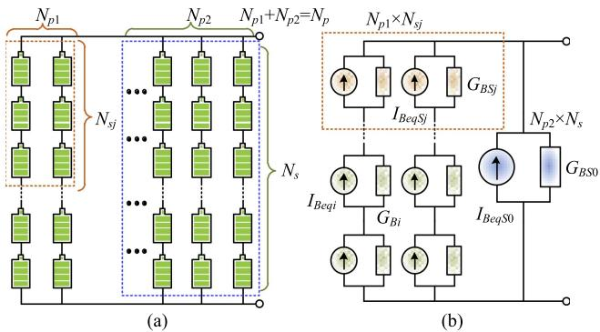  
Fig. 1. A battery array: (a) configuration, (b) scalable model.

Similarly, the general expression for the charging and discharging processes of various batteries can be vectorized for parallel processing on the GPU,

$$
\begin{array}{l} \mathbf {V} _ {\mathbf {B a t}} = E _ {0} + E _ {p o l} + E _ {e x p} + S _ {c h} \circ E _ {c h g} \\ + \left(I - S _ {c h}\right) \circ E _ {d s c}, \\ \end{array}
$$

$$
\mathbf {V} _ {\text {B a t}} \in \left[ \mathbf {V} _ {\text {B m i n}}, \mathbf {V} _ {\text {B m a x}} \right] \tag {9}
$$

where $\mathbf { V _ { B m i n } } , \mathbf { V _ { B m a x } }$ are vectors denoting the cut-off voltages and fully-charged voltages.

In the circuit EMT simulation, when nodal voltages, instead of mesh currents, are to be solved using Kirchhoff’s current law, the Thévenin equivalent circuit of the battery model $V _ { B a t ^ { - } } Z _ { B }$ needs to be transformed into its Norton counterpart with an equivalent current source $\scriptstyle I _ { B e q }$ in parallel with the conductance $G _ { B }$ . Assuming the internal resistances of all batteries under study are converted into the conductance and then grouped as a vector $\mathbf { G } _ { \mathbf { B } } = [ G _ { B 1 } , G _ { B 2 } , \dots ]$ , the current contribution of the batteries can be expressed as

$$
\mathbf {I} _ {\mathrm {B e q}} = \mathbf {V} _ {\mathrm {B a t}} \circ \mathbf {G} _ {\mathrm {B}}. \tag {10}
$$

where the vector $\mathbf { I _ { B e q } } = [ I _ { B e q 1 } , I _ { B e q 2 } , \ldots ] .$ .

The Norton equivalent circuit $G _ { B } \mathrm { - } I _ { B e q }$ of a battery can be extended to an array of batteries for design, online monitoring, and management purposes. As shown in Fig. 1(a), all the batteries of a BESS are organized in an $N _ { p } \times N _ { s }$ array so that each basic unit can be monitored. However, this micro-level modeling leads to a computational burden much higher than that of a lumped single unit. A scalable model is thus proposed, as given in Fig. 1(b), where an array of $N _ { p 2 } \times N _ { s }$ batteries can be lumped, and in each of the remaining $N _ { p 1 } ( N _ { p 1 } \in [ 0 , N _ { p } ] )$ branches, $N _ { s } – N _ { s j } ( N _ { s j } \in$ [0, Ns-1]) batteries need to be modeled individually. Then, the Norton equivalent circuit for the array can be expressed as

$$
G _ {B} = G _ {B S 0} + \sum_ {j = 0} ^ {N _ {p 1}} \left(G _ {B S j} ^ {- 1} + \sum_ {i = 1} ^ {N _ {s} - N _ {s j}} G _ {B i} ^ {- 1}\right) ^ {- 1}. \tag {11}
$$

$$
I _ {B e q} = I _ {B e q S 0} + \sum_ {j = 0} ^ {N _ {p 1}} \frac {I _ {B e q S j} G _ {B S j} ^ {- 1} + \sum_ {i = 1} ^ {N _ {s} - N _ {s j}} \left(I _ {B e q i} G _ {B i} ^ {- 1}\right)}{G _ {B S j} ^ {- 1} + \sum_ {i = 1} ^ {N _ {s} - N _ {s j}} G _ {B i} ^ {- 1}}. \tag {12}
$$

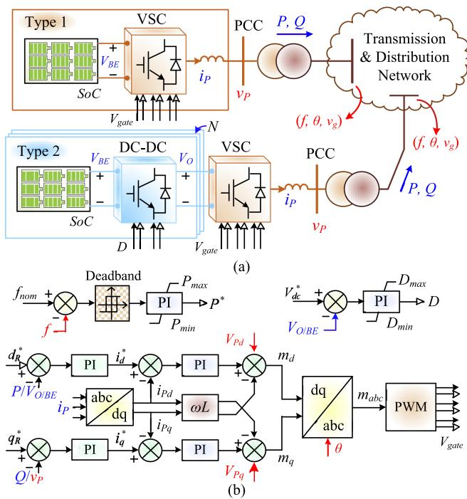  
Fig. 2. Grid-connected BESSs: (a) Integration types, (b) control scheme.

where $G _ { B S 0 } – I _ { B e q S 0 }$ and $G _ { B S j } – I _ { B e q S j }$ represent the Norton equivalent circuit of the $N _ { p 2 } \times N _ { s }$ array and a $N _ { p 1 } \times N _ { S j }$ array, respectively. As can be seen, the scalable model can flexibly be as detailed as an entire $N _ { p } \times N _ { s }$ array, and as computationally efficient as a lumped equivalent unit by simply adjusting $N _ { p 1 }$ and $N _ { s j }$ . For a grid-wide study of an AC/DC grid, the lumped battery array model is sufficient when the main focuses are converter transient performance and the consequent impact on system stability.

# B. Grid-Connected BESS

A power transmission and distribution network may incorporate a substantial number of utility-scale BESSs, which work as part of a virtual power plant (VPP) for grid resilience enhancement, or for temporary power supply. Despite different functions, they interact with the AC grid via 2 main structures [25], i.e., a single 3-phase voltage-source converter (VSC) denoted as Type 1, and the multi-section Type 2 which typically combines several serial or parallel bidirectional DC-DC converters and a VSC, as given in Fig. 2(a).

The VSC controller in the $d \ – q$ frame as shown in Fig. 2(b) applies to both BESS grid-integration manners. When the SOC is below its threshold $S O C _ { 0 }$ , the battery starts to charge or remain idle; otherwise, in addition to smoothing the power curve of synchronous generators, it may be utilized for rapid frequency control of the grid. In this case, the power order is dependent on the frequency deviation,

$$
P ^ {*} (s) = \operatorname {s g n} \left(\left| f _ {\text {n o m}} - f \right| - \zeta\right) \left(f _ {\text {n o m}} - f\right) \left(K _ {f P} + \frac {K _ {f I}}{s}\right), \tag {13}
$$

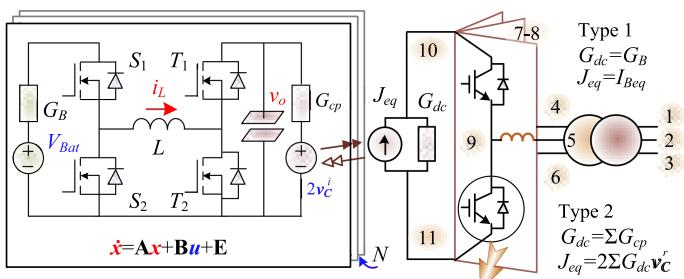

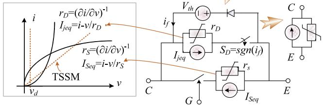  
Fig. 3. Generic TLL-state-space model with nonlinear power switch for BESS EMT simulation.

where ζ is the grid frequency deviation tolerance, $f _ { n o m }$ is the nominal frequency, $K _ { f p }$ and $K _ { k I }$ are control parameters. The active power order is then taken as a reference of the outerloop controller in the $d \ – q$ frame, and the output $i _ { d } ^ { * }$ is then used in inner-loop current control that generates the VSC switching signals $V _ { g a t e }$ along with the $q \cdot$ -axis regulation which is virtually identical. The VSC is also able to control its DC bus voltage by setting the d-axis reference $d _ { R } ^ { * }$ as voltage; similarly, in the $q \mathrm { . }$ -axis, the control object $q _ { R } ^ { * }$ can be either the voltage or reactive power at the point of common coupling (PCC).

1) Voltage Source Converter: The VSC in both schemes connects to the AC grid via a step-up transformer. In Fig. 3, taking its DC side as a Norton equivalent circuit $G _ { d c }$ and $J _ { e q } { \mathrm { : } }$ the converter contains up to 11 nodes if the transformer is taken into consideration, briefly expressed as

$$
\left[ \begin{array}{l} \mathbf {U} _ {1 - 6} \\ \mathbf {U} _ {7 - 1 1} \end{array} \right] = \left[ \begin{array}{c} \mathbf {G} _ {\mathrm {T r}} + \left[ \begin{array}{l} \mathbf {0} _ {\mathbf {3} \times \mathbf {3}}, \mathbf {0} _ {\mathbf {3} \times \mathbf {3}} \\ \mathbf {0} _ {\mathbf {3} \times \mathbf {3}}, \mathbf {G} _ {\mathbf {L} \mathbf {3} \times \mathbf {3}} \end{array} \right] \left[ \begin{array}{l} \mathbf {0} _ {\mathbf {3} \times \mathbf {3}}, \mathbf {0} _ {\mathbf {3} \times \mathbf {2}} \\ - \mathbf {G} _ {\mathbf {L} \mathbf {3} \times \mathbf {3}}, \mathbf {0} _ {\mathbf {3} \times \mathbf {2}} \end{array} \right] \\ \left[ \begin{array}{l} \mathbf {0} _ {\mathbf {3} \times \mathbf {3}}, - \mathbf {G} _ {\mathbf {L} \mathbf {3} \times \mathbf {3}} \\ \mathbf {0} _ {\mathbf {2} \times \mathbf {3}}, \mathbf {0} _ {\mathbf {2} \times \mathbf {3}} \end{array} \right] \left[ \begin{array}{l} \mathbf {Y} _ {\mathbf {1 1}}, \mathbf {Y} _ {\mathbf {1 2}} \\ \mathbf {Y} _ {\mathbf {2 1}}, \mathbf {Y} _ {\mathbf {2 2}} \end{array} \right] _ {\mathbf {5} \times 5} \end{array} \right] ^ {- 1}
$$

$$
\cdot \left[ {\bf J} _ {\mathrm {T r 1} \times 6} + [ {\bf 0} _ {1 \times 3}, {\bf J} _ {\mathrm {L 1} \times 3} ], [ - {\bf J} _ {\mathrm {L 1} \times 3}, {\bf I} _ {\mathrm {D C e q}}, - {\bf I} _ {\mathrm {D C e q}} ] \right] ^ {T},
$$

(14)

where $\mathbf { J } _ { \mathbf { T r } }$ and $\mathbf { J _ { L } }$ are the companion current of the transformer model and the 3-phase inductor, respectively, $\mathbf { G } _ { \mathbf { T r } }$ is the transformer admittance matrix, $G _ { L }$ is the inductor conductance, and Matrix $\mathbf { Y _ { i j } }$ containing the status of converter switches has a minimal dimension of $5 \times 5$ .

The amount of computations arising from solving the 11-D matrix equation is dependent on the way that matrix $\mathbf { Y _ { i j } }$ is handled. Detailed VSC modeling methods can be categorized as the device-level model and two-state switch model (TSSM) [26]. To reflect the capacity limit as well as to reproduce the behaviors of a real converter under an actual configuration and control

scheme, the diode unidirectional conduction should be considered, alongside the static I-V characteristics, which are two main contributors to the non-linearity of the power switch. Fig. 3 shows a complete model of the IGBT and its anti-parallel diode, which can eventually be converted into a Norton equivalent circuit.

The nonlinear semiconductor switch model determines that the entire VSC circuit undergoes Newton-Raphson iteration for numerical convergence and accuracy, thus prolonging the execution time. The TSSM-based converter model, on the other hand, omits the nonlinear static characteristics of the power switch. Instead, it uses a distinct small and large conductance for OFF- and ON-state, respectively. The consequent exemption from Newton-Raphson iteration accelerates the matrix equation solution as well as the simulation.

When bus voltages of the AC network are known, the VSC PCC voltage can be obtained instantly according to the transformer turn ratio. In this case, (14) takes the form of

$$
\left[ \begin{array}{l} \mathbf {U} _ {4 - 6} \\ \mathbf {U} _ {7 - 1 1} \end{array} \right] = \left[ \begin{array}{l} \mathbf {A} _ {1 1} \mathbf {A} _ {1 2} \\ \mathbf {A} _ {2 1} \mathbf {A} _ {2 2} \end{array} \right] ^ {- 1} \cdot \left[ \begin{array}{l} \mathbf {J} _ {1} \\ \mathbf {J} _ {2} \end{array} \right], \tag {15}
$$

where

$$
\mathbf {A} _ {1 1} = \mathbf {G} _ {\mathbf {L} 3 \times 3}, \mathbf {A} _ {1 2} = \left[ - \mathbf {G} _ {\mathbf {L} 3 \times 3}, \mathbf {0} _ {3 \times 2} \right],
$$

$$
\mathbf {A} _ {2 1} = \left[ \begin{array}{c} - \mathbf {G} _ {\mathbf {L} 3 \times 3} \\ \mathbf {0} _ {2 \times 3} \end{array} \right],
$$

$$
\mathbf {A} _ {2 2} = \mathbf {Y} _ {5 \times 5}, \mathbf {J} _ {1} = \mathbf {J} _ {\mathbf {L} 3 \times 1}, \mathbf {J} _ {2} = \left[ - \mathbf {J} _ {\mathbf {L} 1 \times 3}, I _ {D C e q}, - I _ {D C e q} \right] ^ {T}. \tag {16}
$$

Knowing the PCC voltage $\mathbf { U } _ { 4 - 6 }$ results in the direct solution of converter nodal voltages,

$$
\mathbf {U} _ {7 - 1 1} = \mathbf {A} _ {2 2} ^ {- 1} \left(\mathbf {J} _ {2} - \mathbf {A} _ {2 1} \mathbf {U} _ {4 - 6}\right). \tag {17}
$$

2) Generic TLL-State-Space Model: In the Type 2 scheme, a battery group has a small capacity and the bidirectional DC-DC converter has an ultrahigh switching frequency typically above dozens of kilohertz. Consequently, it brings a considerable challenge to computation efficiency, as the time-step should not exceed a few microseconds to maintain the accuracy, especially when pulse-width modulation which requires a high density of carrier data is utilized.

The state-space model is adopted for the DC-DC converter to ensure an alignment in the time-step. As shown in Fig. 3, the battery represented by its Thévenin equivalent circuit is taken as an input; on the other hand, the VSC is nevertheless incompatible with the state-space model. The transmission line link model [27] is thus introduced noticing that both converters share the same DC bus. Take battery discharging mode for instance, when switches $S _ { 1 }$ and $T _ { 2 }$ are under conduction, the mixed TLL-state-space model is

$$
\left[ \begin{array}{c} i _ {L} \\ v _ {o} \end{array} \right] = \left[ \begin{array}{c c} \frac {- 1}{G _ {B} L} & 0 \\ 0 & \frac {- G _ {C p}}{C} \end{array} \right] \left[ \begin{array}{c} i _ {L} \\ v _ {o} \end{array} \right] + \left[ \begin{array}{c c} \frac {1}{L} & 0 \\ 0 & \frac {2 G _ {C p}}{C} \end{array} \right] \left[ \begin{array}{c} v _ {B a t} \\ v _ {C} ^ {i} \end{array} \right] + \left[ \begin{array}{c} 0 \\ 0 \end{array} \right] v _ {d}, \tag {18}
$$

and when $S _ { 1 }$ and $T _ { 1 }$ are on, it is

$$
\left[ \begin{array}{c} \dot {i _ {L}} \\ \dot {v _ {o}} \end{array} \right] = \left[ \begin{array}{c c} \frac {- 1}{G _ {B} L} & \frac {- 1}{L} \\ \frac {1}{C} & \frac {- G _ {C p}}{C} \end{array} \right] \left[ \begin{array}{c} i _ {L} \\ v _ {o} \end{array} \right] + \left[ \begin{array}{c c} \frac {1}{L} & 0 \\ 0 & \frac {2 G _ {C p}}{C} \end{array} \right] \left[ \begin{array}{c} v _ {B a t} \\ v _ {C} ^ {i} \end{array} \right] + \left[ \begin{array}{c} \frac {- 1}{L} \\ 0 \end{array} \right] v _ {d}. \tag {19}
$$

Averaging the 2 equations according to the switching duty $D$ leads to the following general state-space equation

$$
\dot {\mathbf {x}} = \mathbf {A} \mathbf {x} + \mathbf {B} \mathbf {u} + \mathbf {E}, \tag {20}
$$

where $\mathbf x = [ i _ { L } , v _ { o } ] ^ { T } , \mathbf u = [ v _ { B a t } , v _ { C } ^ { i } ] ^ { T }$ , and

$$
\mathbf {A} = \left[ \begin{array}{c c} \frac {- 1}{G _ {B} L} & \frac {D - 1}{L} \\ \frac {1 - D}{C} & \frac {- G _ {C p}}{C} \end{array} \right], \mathbf {B} = \left[ \begin{array}{c c} \frac {1}{L} & 0 \\ 0 & \frac {2 G _ {C p}}{C} \end{array} \right], \mathbf {E} = \left[ \begin{array}{c} \frac {D - 1}{L} \\ 0 \end{array} \right] v _ {d}. \tag {21}
$$

Discretization of (20) by the Trapezoidal rule yields the solution to proceed with EMT simulation,

$$
\begin{array}{l} \mathbf {x} _ {n} = \left(\mathbf {I} - \frac {\mathbf {A} \Delta t}{2}\right) ^ {- 1} \left[ \left(\mathbf {I} + \frac {\mathbf {A} \Delta t}{2}\right) \mathbf {x} _ {n - 1} \right. \\ \left. + \frac {\mathbf {B} \Delta t}{2} \left(\mathbf {u} _ {n} + \mathbf {u} _ {n - 1}\right) + \mathbf {E} \Delta t \right]. \tag {22} \\ \end{array}
$$

The bidirectional DC-DC converter is linked to the VSC by the TLL signal $v _ { C } ^ { i }$ . Following the derivation of output voltage $v _ { o }$ at time instant t, the TLL reflection pulse at the DC-DC converter side which is also deemed as the incident pulse of the VSC at the next time-step can be formulated as

$$
v _ {C} ^ {r} (t + \Delta t) = v _ {o} (t) - v _ {C} ^ {i} (t). \tag {23}
$$

As mentioned, the DC side of VSC is always represented by a Norton equivalent circuit, regardless of the component it connects to for a better model compatibility with various IGBT models. Therefore, for BESS Type 2 integration, a Thévenin-Norton transformation is conducted and $G _ { d c }$ and $J _ { e q }$ are dependent on $v _ { C } ^ { r }$ and $G _ { C p }$ . When the DC terminal voltage is solved by (17), the reflected pulse from the VSC should be updated and subsequently taken as the incident pulse $v _ { C } ^ { i }$ for its DC-DC counterpart solution in the next time-step. It is noted that a TLL decouples the two converters, which can be processed in parallel for simulation acceleration.

# III. MULTI-RATE TS-EMT MODEL OF AC/DC GRID

Fig. 4 shows the test bench where the AC grid based on the IEEE 118-bus system consists of 3 zones, with a total generation of 4.4 GW from synchronous generators, and an extra amount of 800 MW from the wind farm (WF) and photovoltaic (PV) plant, which are integrated via a 4-terminal DC grid. They compose a VPP along with BESSs which can be distributed on every bus to enhance grid resilience. However, for simplicity of description, 5 groups of 100 BESS units are installed on Buses 56, 63, 43, 33, and 83, respectively.

Transient stability simulation is dominant in the time-domain analysis of large-scale power systems mainly comprising of generators, transmission lines, transformers, shunts, etc., all of which tolerate a time-step of several milliseconds. The extensive integration of power converters, however, implies that a smaller

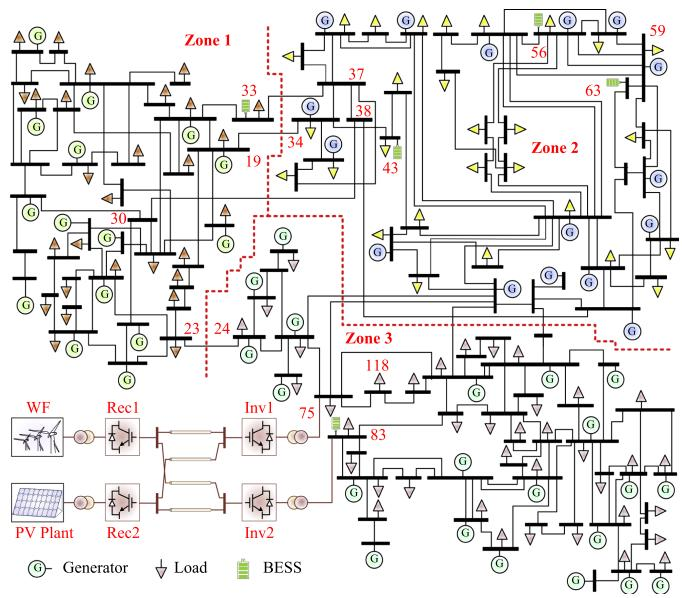  
Fig. 4. AC/DC grid integrated with renewable energies and BESSs.

time-step is required to test the controller whilst ensuring numerical convergence. Thus, a hybrid AC/DC grid can be deemed as a multi-rate simulation system, and the general modeling is carried out for the AC and DC grids irrespective of their layouts or configurations.

# A. Transient Stability Simulation

The AC grid under TS simulation can be divided into 2 categories from a numerical solution perspective, i.e., nonlinear components which are expressed by a set of differential equations, and the linear network with its nodal voltages solved by an algebraic matrix equation, i.e.,

$$
\dot {\mathbf {x}} (t) = \mathbf {f} (\mathbf {x} (t), \mathbf {u} (t)), \tag {24}
$$

$$
\mathbf {V} (t) = \mathbf {Y} _ {\mathbf {N}} ^ {- 1} \cdot \mathbf {I} (\mathbf {x} (t)), \tag {25}
$$

where $\mathbf { Y _ { N } }$ represents the network admittance matrix. Linearization of the differential equation leads to the state-space form of (20) where A becomes the Jacobian matrix,

$$
\mathbf {A} = \left[ \begin{array}{c c c} \frac {\partial f _ {1}}{\partial x _ {1}}, & \dots , & \frac {\partial f _ {1}}{\partial x _ {n}} \\ & \ddots & \\ \frac {\partial f _ {n}}{\partial x _ {1}}, & \dots , & \frac {\partial f _ {n}}{\partial x _ {n}} \end{array} \right], \mathbf {B} = \left[ \begin{array}{c c c} \frac {\partial f _ {1}}{\partial u _ {1}}, & \dots , & \frac {\partial f _ {1}}{\partial u _ {n}} \\ & \ddots & \\ \frac {\partial f _ {n}}{\partial u _ {1}}, & \dots , & \frac {\partial f _ {n}}{\partial u _ {n}} \end{array} \right], \mathbf {E} = \mathbf {0}. \tag {26}
$$

The generator is such a nonlinear component that the state-space equation applies, with a fundamental sixth-order model [28], two of which, i.e., rotor angle δ and speed ω, contributed by the rotor mechanical characteristics,

$$
\dot {\delta (t)} = \omega_ {R} \cdot \Delta \omega (t), \tag {27}
$$

$$
\Delta \dot {\omega} (t) = \frac {1}{2 H} \left[ T _ {m} (t) - T _ {e} (t) - D \cdot \Delta \omega (t) \right], \tag {28}
$$

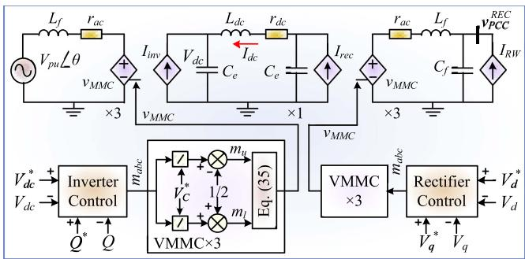  
Fig. 5. MMC-based DC link dynamic model: circuit and controller.

and the other four which are fluxes ψ from the equivalent circuit of its windings under the $d \ – q$ frame,

$$
\dot {\psi} _ {f d} (t) = \omega_ {R} \cdot \left[ e _ {f d} (t) - R _ {f d} i _ {f d} (t) \right], \tag {29}
$$

$$
\dot {\psi} _ {1 d} (t) = - \omega_ {R} \cdot R _ {1 d} i _ {1 d} (t), \tag {30}
$$

$$
\dot {\psi} _ {1 q} (t) = - \omega_ {R} \cdot R _ {1 q} i _ {1 q} (t), \tag {31}
$$

$$
\dot {\psi} _ {2 q} (t) = - \omega_ {R} \cdot R _ {2 q} i _ {2 q} (t), \tag {32}
$$

where $R _ { f d } , R _ { 1 d } , R _ { 1 q } ,$ and $R _ { 2 q }$ are winding parameters, H and D are generator inertia and damping coefficient, $\omega _ { R }$ is the rated speed, and the remaining variables constitute the input vector u. The generator model order will have a further increase when its controller is taken into account. For example, 3 additional states induced by the following excitation system,

$$
v _ {1} (s) = \frac {1}{1 + s T _ {R}} v _ {c} (s) + \Lambda \left(v _ {1} (0)\right), \tag {33}
$$

$$
v _ {2} (s) = K _ {P S S} \frac {s T _ {W}}{1 + s T _ {W}} \Delta \omega (s) + \Lambda (\Delta \omega (0), v _ {2} (0)), \tag {34}
$$

$$
v _ {3} (s) = \frac {1 + s T _ {1}}{1 + s T _ {2}} v _ {2} (s) + \Lambda \left(v _ {2} (0), v _ {3} (0)\right), \tag {35}
$$

where $T _ { 1 } , T _ { 2 } , T _ { R } , T _ { W }$ , and $K _ { P S S }$ are AVR and PSS constants, and Λ() denotes a constant as a function of initial values.

Using (20) and (26), the state vector x in (27)–(35) can be solved. The subsequent acquirement of the current vector I enables the network nodal voltages to be derivable from (25) since the admittance matrix $\mathbf { Y _ { N } }$ is always known.

# B. DC Links for Renewable Energy Integration

The high-voltage direct current (HVDC) link based on the modular multilevel converter (MMC) is favored in delivering renewable energies from remote areas to the main grid. The HVDC converters and renewable generation units can be modeled in detail in a similar vectorized manner for massively parallel processing; however, when their powerflow conditions are the primary focus, the lumped averaged model is sufficient. The rectifier acts as a grid-forming converter that provides a stable three-phase voltage for the wind farm and PV plant, while the inverter regulates the DC link voltage, as given in Fig. 5, where the controller has an identical $d \ – q$ frame scheme given in

Fig. 2(b) to yield the three-phase modulation signals $m _ { a b c }$ . On the rectifier side, the current reference is obtained by

$$
I _ {d / q} ^ {*} = K _ {v p} \left(V _ {d / q} ^ {*} - V _ {d / q}\right) + K _ {v i} \int \left(V _ {d / q} ^ {*} - V _ {d / q}\right) d t, \tag {36}
$$

where quantities with superscript ∗ denote reference values, $V _ { d } ^ { * }$ and $V _ { q } ^ { * }$ decide the AC voltage $v _ { M M C }$ , and $K _ { v p }$ and $K _ { v i }$ are controller parameters.

The submodule capacitor dynamics can be omitted in TS analysis since the converter output active and reactive powers are the focus. Therefore, using phase-shift control, the instantaneous output phase voltage of the grid-forming MMC can be determined by the upper-arm and lower-arm modulation signals $m _ { u }$ and ml, as

$$
\begin{array}{l} v _ {M M C} = \frac {V _ {d c}}{N _ {L}} \left[ \sum_ {i = 1} ^ {N _ {L}} s g n (m _ {u} - \mathbf {c} [ i ]) \right. \\ \left. - \sum_ {j = N _ {L} + 1} ^ {2 N _ {L}} \operatorname {s g n} \left(m _ {l} - \mathbf {c} [ j ]\right) \right], \tag {37} \\ \end{array}
$$

where $N _ { L }$ is the number of submodules per arm, c denotes the carrier signals and in each phase,

$$
m _ {u} = \frac {m _ {a b c}}{V _ {d c} / N _ {L}} - 0. 5, m _ {d} = \frac {m _ {a b c}}{V _ {d c} / N _ {L}} + 0. 5. \tag {38}
$$

Then, based on a DC link equivalent circuit on the rectifier side, the phase voltage at the PCC can be expressed as

$$
v _ {P C C} ^ {R E C} = \frac {G _ {L _ {f}} v _ {M M C} - I _ {L e q} + I _ {C e q} + i _ {R W}}{G _ {L _ {f}} + G _ {C _ {f}}}, \tag {39}
$$

where $i _ { R W }$ is the current injection of the WF and PV plant, $G _ { L _ { f } } , G _ { C _ { f } } , I _ { L e q }$ , and $I _ { C e q }$ compose the discretized forms of the $L _ { f } { - } C _ { f }$ filter in the AC yard. The 3-phase PCC voltage as the control object subsequently undergoes Park’s transformation so that $V _ { d }$ and $V _ { q }$ in (36) can be obtained.

The inverter stations, as well as BESSs, are connected directly to the main grid. Following the AC network solution of (25), the PCC voltage magnitude $V _ { p u }$ and angle θ are known, which participate in the BESS’s VSC control and solution, as in (17), and also in the MMC phase current derivation,

$$
i _ {P C C} ^ {I N V} = G _ {L} \left(v _ {M M C} - 2 v _ {L} ^ {i} - V _ {n o m} V _ {p u} \cos (\theta)\right), \tag {40}
$$

where $V _ { n o m }$ is the PCC nominal voltage. Then, the power of each inverter station and BESS can be calculated and used for the main grid simulation.

# IV. HETEROGENEOUS COMPUTING ARCHITECTURE

# A. Modular BESS Kernel Design

Since a grid-connected BESS contains multiple types of components, including the battery, VSC, DC-DC converter, and controllers, each of them is taken independently and designed into a CUDA C++ kernel [29], i.e., a global function that can launch a predefined number of threads corresponding to components of the same type when being invoked on the GPU using the SIMT paradigm. The IGBT/diode as a fundamental

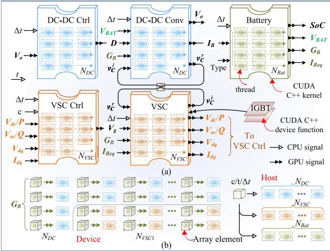  
Fig. 6. Modular BESS kernels design: (a) SIMT paradigm and global signal flow, (b) memory dispatch on device (left) and host (right).

component of power converters, on the other hand, is taken as a CUDA C++ device function which can be directly called by a kernel, as shown in Fig. 6(a). This modular software architecture provides a kernel-based library that enables a flexible combination of batteries and converters in the high-performance simulation.

Based on the vectorized parallel EMT modeling, electrical quantities including inputs and outputs (I/Os) of each BESS kernel are represented by arrays in the CUDA C++ program design. For instance, the main I/Os of the battery kernel include its type, current, voltage, state of charge, and the Thévenin and Norton equivalent circuits. The VSC kernel and its controller kernel are shared by Type 1 and Type 2 utility-scale BESSs due to the proposal of the generic TLL-state-space model, where the DC-DC converter kernel is peculiar to Type 2.

Initialization of the I/O arrays is generally required, and since kernels are invoked from the host CPU, these variables are defined and initialized in the host before being copied to the device GPU. Nevertheless, not all signals shall be handled in the same manner – the simulation time instant and step size, as well as the VSC PWM carrier $c ,$ can be accessed directly by the GPU as an individual quantity, albeit they are not defined on the device. Fig. 6(b) shows that once a kernel is invoked, a CPU signal is shared by all threads, and elements in an array will be dispatched to each thread according to their addresses in the memory and corresponding thread indices.

The coexistence of both BESS types determines that the total thread number of the battery kernel $N _ { B a t }$ is a summation of the number of DC converters and Type 1 VSCs,

$$
N _ {b a t} = N _ {V S C} - \frac {N _ {D C}}{N _ {p l}} + N _ {D C}. \tag {41}
$$

The battery internal conductance array $\mathbf { G _ { B } }$ is the input of both VSC and DC converter models. Thus, its elements are dispatched to all threads launched by these two kernels.

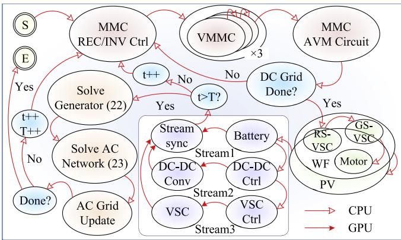  
Fig. 7. AC/DC grid multi-rate, multi-stream CPU-GPU computing.

# B. Heterogeneous Multi-Stream Computing Paradigm

Due to a lower clock frequency and thread synchronization, the GPU is not always more efficient than its counterpart, especially when handling a system with insufficient homogeneity or dominated by inhomogeneity. Hence, the heterogeneous CPU-GPU HPC paradigm which leads to a higher computing resource utilization is adopted for simulating the AC/DC grid more efficiently. The extent of homogeneity is taken as a core criterion in terms of task assignment to the processors, along with the expected simulation duration. CPU functions are designed for the IEEE 118-bus system and the 4-terminal DC grid including its source renewable energies since they demonstrate insufficient homogeneity and consequently are all inherently processed successively, as shown in Fig. 7.

Though the SIMT paradigm enables concurrency of threads launched by the same CUDA C++ kernel, different types of BESS components are still implemented sequentially. A pipelined scheme is applied to these kernels so that additional parallelism can be gained. Then, the three components, i.e., the VSC, DC-DC converter, and the battery, are invoked in separate CUDA C++ streams, while the controllers are grouped with the corresponding converters so that they are still implemented sequentially in the program. In the end, these streams are synchronized before stepping out of the device.

The converters and AC grid are processed with a time-step of 20 $\mu \mathrm { s }$ and 5 ms, respectively, and this multi-rate scheme is realized by adopting two indices t and $T$ representing their time instants. Once the host takes over again, it either continues the converters computation when t is smaller than T , or, if the reverse is the case, proceeds with the AC grid dynamic simulation, which starts with solving the synchronous generators’ differential equation (24), followed by the network equation (25) to derive bus voltages. A full simulation loop completes after all history variables are updated.

Simulations of a 20-second duration are conducted on a server with 20-core Intel Xeon E5-2698 CPU, 192 GB RAM, and an NVIDIA Tesla V100 GPU. The computing speeds with Type 1 BESS under different scales are summarized in Table I. With the nonlinear IGBT model, the default GPU simulation speeds are lower than that of the CPU when the number of BESS is

TABLE I TYPE 1 BESS SIMULATION SPEED COMPARISON   

<table><tr><td rowspan="2">BESS Scale</td><td colspan="4">Nonlinear IGBT (t: s)</td><td colspan="4">TSSM (t: s)</td></tr><tr><td>\( t_{CPU} \)</td><td>\( t_{GPU} \)</td><td>\( t_{MS-GPU} \)</td><td>SP</td><td>\( t_{CPU} \)</td><td>\( t_{GPU} \)</td><td>\( t_{MS-GPU} \)</td><td>SP</td></tr><tr><td>1</td><td>0.6</td><td>25</td><td>22</td><td>0.03</td><td>0.32</td><td>20</td><td>17</td><td>0.02</td></tr><tr><td>10</td><td>4.6</td><td>26</td><td>22</td><td>0.2</td><td>3.0</td><td>21</td><td>17</td><td>0.2</td></tr><tr><td>100</td><td>42</td><td>27</td><td>23</td><td>1.8</td><td>27</td><td>22</td><td>18</td><td>1.5</td></tr><tr><td>1K</td><td>422</td><td>27</td><td>23</td><td>18</td><td>284</td><td>22</td><td>18</td><td>16</td></tr><tr><td>10K</td><td>4230</td><td>34</td><td>30</td><td>141</td><td>2880</td><td>27</td><td>22</td><td>131</td></tr><tr><td>20K</td><td>8550</td><td>54</td><td>45</td><td>190</td><td>5600</td><td>39</td><td>33</td><td>170</td></tr><tr><td>30K</td><td>12800</td><td>69</td><td>60</td><td>213</td><td>9980</td><td>51</td><td>41</td><td>243</td></tr><tr><td>40K</td><td>17100</td><td>90</td><td>79</td><td>216</td><td>11000</td><td>63</td><td>52</td><td>212</td></tr><tr><td>50K</td><td>21200</td><td>108</td><td>93</td><td>228</td><td>14100</td><td>74</td><td>60</td><td>235</td></tr></table>

TABLE II TYPE 2 BESS SIMULATION SPEED COMPARISON   

<table><tr><td rowspan="2">BESS VSC:DC</td><td colspan="4">Nonlinear IGBT (t: s)</td><td colspan="4">TSSM (t: s)</td></tr><tr><td>\( t_{CPU} \)</td><td>\( t_{GPU} \)</td><td>\( t_{MS-GPU} \)</td><td>SP</td><td>\( t_{CPU} \)</td><td>\( t_{GPU} \)</td><td>\( t_{MS-GPU} \)</td><td>SP</td></tr><tr><td>1:20</td><td>1.4</td><td>29</td><td>26</td><td>0.05</td><td>1.2</td><td>24</td><td>22</td><td>0.05</td></tr><tr><td>10:200</td><td>11.8</td><td>30</td><td>27</td><td>0.44</td><td>10.7</td><td>26</td><td>23</td><td>0.47</td></tr><tr><td>100:2K</td><td>117</td><td>31</td><td>28</td><td>4.2</td><td>103</td><td>27</td><td>24</td><td>4.3</td></tr><tr><td>1K:20K</td><td>1100</td><td>34</td><td>29</td><td>38</td><td>1000</td><td>29</td><td>25</td><td>40</td></tr><tr><td>5K:100K</td><td>5400</td><td>68</td><td>64</td><td>84</td><td>4800</td><td>62</td><td>59</td><td>81</td></tr><tr><td>10K:200K</td><td>18000</td><td>108</td><td>101</td><td>178</td><td>16300</td><td>103</td><td>100</td><td>163</td></tr></table>

small. The multi-stream GPU execution gains about 1.8 times of speedup over CPU when the computing objective is 100 BESSs, and the acceleration rate SP keeps increasing alongside the BESS scales, reaching up to 228 when 50,000 BESSs are simulated. A similar phenomenon is witnessed for the ideal TSSM-based systems, and without Newton-Raphson iteration, the simulation speed becomes faster. It can also be noticed that the multi-stream scheme brings approximately an extra 10% speedup over the default mode. With each VSC linking to 20 parallel DC-DC converters, the speedups could reach around 178 and 163 respectively for the nonlinear IGBT and TSSM cases when 200,000 batteries are involved, as listed in Table II. With the AC/DC grid taking merely 1.5 seconds for the same simulation duration, it becomes feasible to accurately study a large-scale system with numerous BESSs by the proposed heterogeneous multi-stream computing architecture, e.g., the total computational time for the AC/DC grid shown in Fig. 4 is around 20 secs when all BESSs are Type 1, or 27 secs even if all BESSs integrated into are Type 2.

As for the scalable model, the computational burden reaches its heaviest when all the battery units need to be simulated. Fig. 8 provides the speeds of computing all the battery arrays in 1 BESS and 100 BESSs, where each array is $N _ { p } \times N _ { s }$ . It can be seen that while a larger $N _ { p }$ or $N _ { s }$ leads to a higher speedup by the GPU, the actual execution time $t _ { e x e }$ is also longer. Since a more detailed model always exists, the modeling level is determined by the study purpose. Therefore, the individuality of a battery unit can be omitted in grid-scale analysis.

# V. AC/DC GRID SIMULATION RESULTS

Since the TS analysis of an AC/DC grid integrated with massive quantity of BESS EMT models is infeasible by pure TS or EMT simulation packages or even conventional hybrid EMT-TS approach due to the simulation type constraint or

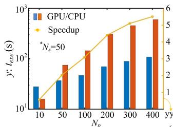

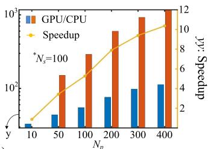

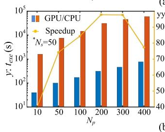

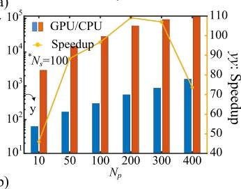  
Fig. 8. Summary of CPU and GPU computing performance: (a) 1 BESS, (b) 100 BESSs.

a tremendous computational burden, the proposed modeling method and heterogeneous computing concept are validated in a two-step manner using commercial tools MATLAB/Simulink and DSAToolsTM/TSAT, respectively.

# A. Model Testing

The battery parallel EMT model is validated by the charging and discharging processes of a group of lead-acid batteries with a total rated capacity of 1350 Ah. Since GPU programming allows threads to have different parameters, the proposed computing method only requires one simulation for various circuit conditions. In Fig. 9(a), 3 GPU threads representing a discharging resistance of 1 Ω, 0.67 Ω, and 0.33 Ω are plotted. It shows that both the battery voltages and SOCs have a good agreement with Simulink results. With the same resistances, the batteries are charged till SOC = 100% in Fig. 9(b), which also gives identical curves. The results demonstrate that the duration of both processes is approximately proportional to the charging or discharging resistance. Fig. 9(c) provides 1 MW step-up and step-down test results of a Type 1 BESS unit in the HPC program and MATLAB/Simulink. The identical curves indicate an accurately implemented power converter model, including its controller.

The power step test is also conducted for AC grid model validation and assuming that the BESS group at Bus 83 has a sufficient capacity, the results of a single-bus injection are given in Fig. 10. At t = 10 s, an extra 500 MW load is added to Bus 59. Consequently, the generators witness a dramatic perturbation with several bus voltages sagging below 0.9 p.u. momentarily, and decreasing generator frequencies due to a deficiency of active power. Then, 3.5 s later, 834 MW is injected into the network via Bus 83, the generator voltages and frequencies are generally restored after a few oscillations, and the rotor angles enter a new steady-state. The DSAToolsTM/TSAT results are also provided for comparison to verify the modeling and simulation method of the AC grid.

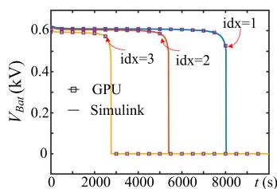

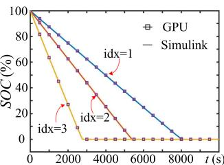

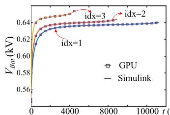

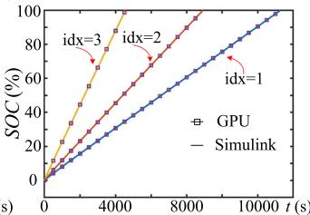

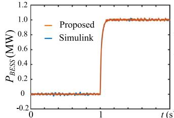

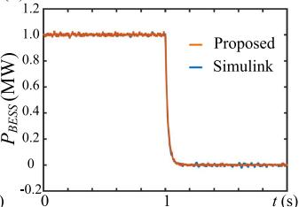  
  
Fig. 9. BESS model validation: (a) battery discharging process, (b) battery charging process, and (c) step responses of a BESS unit.

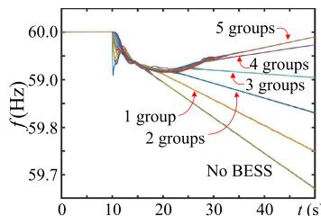

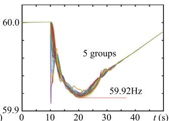

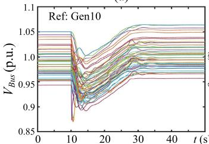

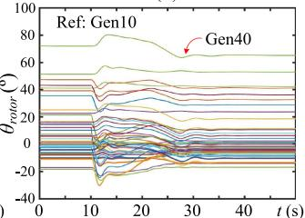

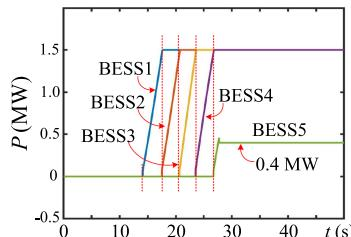

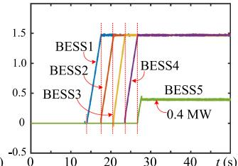  
(f)   
Fig. 11. Overload test: (a), (b) generator frequencies, (c) generator bus voltages, (d) generator rotor angle, (e), (f) power order and actual output of BESSs.

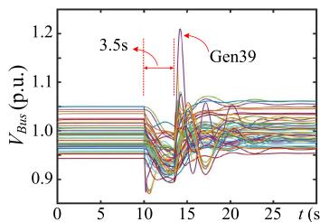

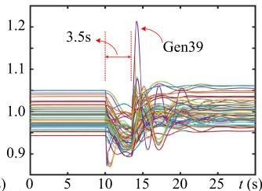

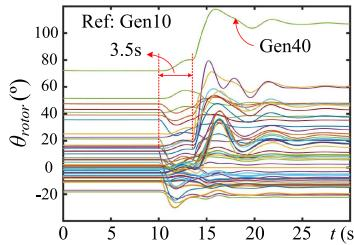

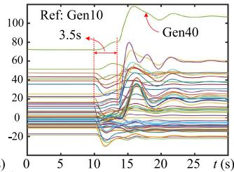

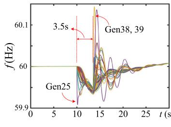

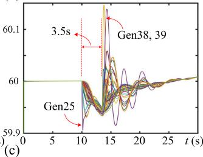  
  
Fig. 10. AC grid model test (left: proposed HPC method; right: TSAT): (a) generator bus voltages, (b) relative rotor angles, and (c) generator speeds.

# B. Post-Contingency Stability Restoration

As a single BESS group has limited capacity, power injections at the 5 buses which have BESS installations as indicated in Fig. 4 are then carried out, assuming that each of the 500 BESS units has a capacity of 2.0 MVA. When the same overload occurs, the BESSs are activated in a sequence of Buses 56, 63, 43, 33, and 83 to provide an adaptive active power compensation and a constant 0 MVAr injection, and Fig. 11 provides the results from the proposed heterogeneous simulation. Fig. 11(a), (b) give generator frequencies under various power compensation schemes. Frequency instability is witnessed if all 5 BESSs remain idle. Similarly, the 3 BESS groups in Zone 2 are inadequate to maintain the AC/DC grid stable as the bus frequencies continue to drop. The participation of Zone 1 BESSs enables the generators to restore their frequencies, and the remedial process can be expedited with an extra contribution from its Zone 3 counterparts. Additionally, Fig. 11(c), (d) show that the entire grid remains stable under a new equilibrium. The activation of an individual BESS unit in these 5 groups is given in Fig. 11(e), (f), which show that the subsequent group partakes grid recovery only when its immediate previous counterpart reaches its maximum capacity, and since a power surplus is available, the last group remains below its limit.

In Fig. 12, the corresponding stability reinstatement results from DSAToolsTM/TSAT are provided for validation under the condition that all 5 groups of BESS are available. The output power of each BESS unit from EMT simulation is averaged

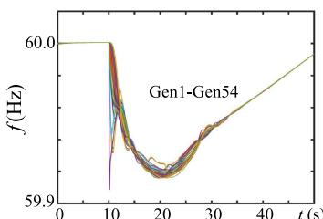

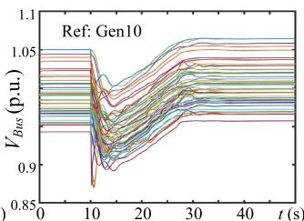

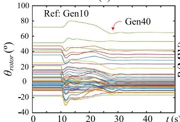

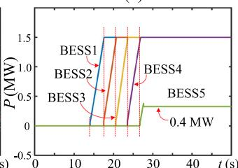

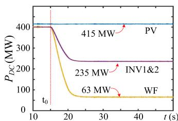  
Fig. 12. Overload test validation by DSAToolsTM/TSAT: (a) generator frequencies, (b) generator bus voltages, (c) generator rotor angle, (d) TSAT BESS equivalent power injection.

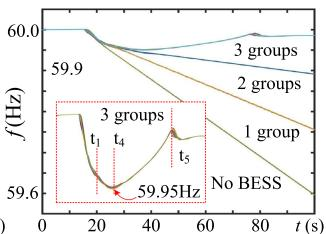

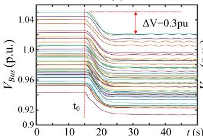

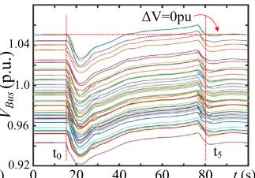  
(d）

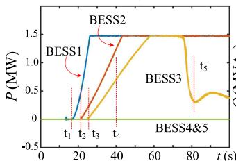

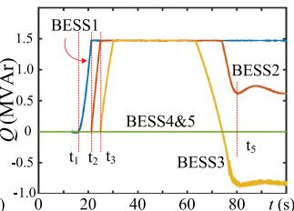  
  
Fig. 13. Remedy for WF generation reduction: (a) DC grid terminal power, (b) generator frequencies under various BESS compensations, (c) generator bus voltages without BESS, (d) generator bus voltages with 3 BESS groups, (e) one BESS unit active power, (f) one BESS unit reactive power.

with a window equal to the time-step of TS simulation and then injected into the AC bus. The fact that the generator quantities are virtually identical to those from the heterogeneous simulation in Fig. 11 demonstrates a sufficient accuracy of the proposed modeling and computing method.

The stochasticity of renewable energies also has a profound impact on the AC grid stability. Fig. 13(a) shows the active

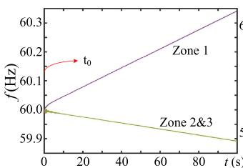

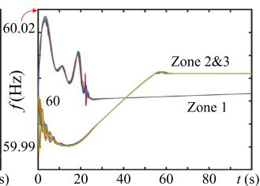

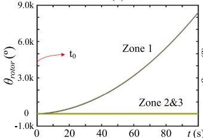

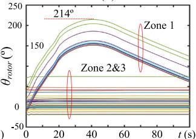

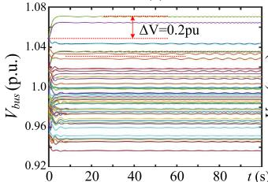

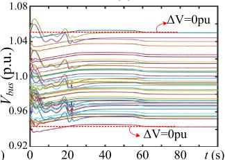  
  
Fig. 14. AC grid dynamics under zone separation: (a), (c), (e) grid frequency, rotor angle, and bus voltage without BESS, (b), (d), (f) grid frequency, rotor angle, and bus voltage with one BESS group in each zone.

powers of the 4 converter stations in the DC grid when the wind velocity drops linearly from 11 m/s to 6 m/s between 15–20 seconds. Assuming the 4 DC lines are identical, the total power generated by wind farms and PV plants are evenly shared by the 2 inverter stations, meaning both of them have lost over 150 MW. The inadequacy of active power caused a frequency instability, as well as potential voltage insecurity, if no further action is taken, as shown in Fig. 13(b), (c). The 5 groups of BESSs intervene in a reverse sequence for resilience enhancement. It is noted that with 1 group in Zone 3 or 2 groups in Zone 1 and 3, the grid is still insecure in terms of frequency stability; the involvement of the third group in Zone 2 yields abundant active power for remedy of the frequency as it begins to rise. Fig. 13(d) demonstrates that all bus voltages of this large-scale system can recover. It is observed from Fig. 13(e), (f) that once the contingency occurs, the first group immediately participates in the remedial action at $t _ { 1 } ;$ nevertheless, it quickly reaches its reactive power capacity so that the second and third groups are activated at time instant $t _ { 2 }$ and $t _ { 3 } .$ . The grid frequency begins to rise at around $t _ { 4 } .$ , and then at $t _ { 5 } ,$ , when the grid frequency has already been within its deviation tolerance, the third BESS group reduces its output power so that the bus voltages can eventually maintain at the pre-contingency level.

When a severe contingency, such as simultaneous faults on Bus 33, 30, and 23, appears at $t _ { 0 } ,$ out-of-step and consequent zone separation could occur if Tie Line 19–34 has a small capacity. As given in Fig. 14(a), generators in Zone 1 have a rising frequency, whilst their counterparts in Zone 2 and 3 are slowing down. Due to the asynchronism, the relative angles of

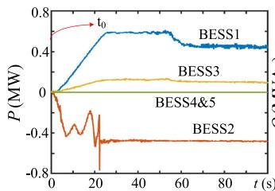

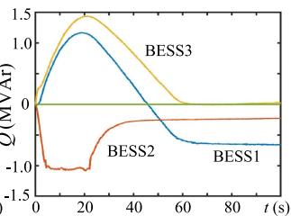

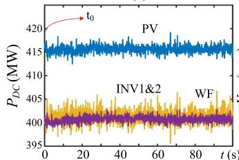  
（c）

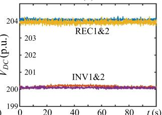  
  
Fig. 15. Converter transients under zone separation: (a) BESS active power, (b) BESS reactive power, (c) DC grid power, and (d) DC grid terminal voltage.

generators in Zone 1 keep climbing and therefore, the entire system is insecure in terms of angle stability, along with voltage instability since some bus voltages approach 1.08 pu, as shown in Fig. 14(c) and (e). In contrast, with 3 BESS groups on Bus 33, 43, and 83 activated, no violation of any of the 3 system stability indices is witnessed. Fig. 14(b) demonstrates that the generator frequencies are restricted within ±0.03 Hz. In the meantime, a maximum angle difference slightly above 200 degrees as given in Fig. 14(d) implies that the AC/DC grid does not have any concern on angle stability. Fig. 14(f) shows that with the d-q frame controller of BESSs, the bus voltages can restore their pre-contingency levels.

Fig. 15 provides some power converter transients after the grid separation. The rising and falling frequencies in Zone 1 and Zone 2-3 respectively indicate a power surplus and deficiency in these zones. Therefore, each BESS unit in Zone 1 absorbs approximately 0.5 MW, and units in the other 2 zones are discharging with a power of 0.4 MW and 0.1 MW. Similarly, a BESS unit in Zone 2 and 3 also provides about 0.25 MVAr and 0.6 MVAr to maintain stable bus voltages. The DC grid, as expected, is not significantly affected by the grid separation since the MMCs possess the functionality of regulating the DC voltages so long as their PCC voltages are not subjected to severe distortions.

# VI. CONCLUSION

This work illustrates heterogeneous sequential-parallel modeling and high-performance computing of an entire large-scale AC/DC grid integrated with massive utility-scale battery energy storage systems for accurate power system stability study. Prompted by its extensive distribution in the modern power system for resilience enhancement, various types of battery EMT models are vectorized and modularized for element-wise parallel multi-threading processing. The proposal of a generic TLL-state-space model improves parallelism so that prevalent BESS configurations can be programmed uniformly in the same

CUDA C++ kernels once they are implemented on the manycore GPU. In the meantime, the high clock frequency of CPU suggests the deployment of less homogeneous components in the AC/DC grid on it, so that a twofold hybrid simulation with a dramatically improved efficiency is formed, i.e., EMT-TS and CPU-GPU co-simulation. Remarkable speedups over pure CPU processing were obtained by the GPU in handling BESSs; nevertheless, an extra margin can still be sought by utilizing the multi-stream architecture. Therefore, it demonstrates that the HPC methodology utilizing diverse processors expands the scope of AC/DC systems that can be simulated efficiently since it caters to an increasingly heterogeneous energy network for which a grid-wide study of the interactions among numerous energy systems requires that their components are modeled in detail and computed which would otherwise be computationally overwhelming for conventional simulation methods.

# REFERENCES

[1] N. Miller, “Keeping it together: Transient stability in a world of wind and solar generation,” IEEE Power Energy Mag., vol. 13, no. 6, pp. 31–39, Nov./Dec. 2015.   
[2] K. Ahmad, H. Mohsen, S. Mohammad, B. Sertac, and A. Haitham, “On the stability of the power electronics-dominated grid: A new energy paradigm,” IEEE Ind. Electron. Mag., vol. 14, no. 4, pp. 65–78, Dec. 2020.   
[3] A. Prasanna, K. McCabe, B. Sigrin, and N. Blair, “Storage futures study: Distributed solar and storage outlook: Methodology and scenarios,” National Renewable Energy Laboratory, Golden, CO, USA, Tech. Rep. NREL/TP-7A40-79790, Jul. 2021.   
[4] V. Knap, S. Chaudhary, D. Stroe, M. Swierczynski, B. Craciun, and R. Teodorescu, “Sizing of an energy storage system for grid inertial response and primary frequency reserve,” IEEE Trans. Power Syst., vol. 31, no. 5, pp. 3447–3456, Sep. 2016.   
[5] U. Datta, A. Kalam, and J. Shi, “Battery energy storage system to stabilize transient voltage and frequency and enhance power export capability,” IEEE Trans. Power Syst., vol. 34, no. 3, pp. 1845–1857, May 2019.   
[6] M. Farrokhabadi, S. König, C. Cañizares, K. Bhattacharya, and T. Leibfried, “Battery energy storage system models for microgrid stability analysis and dynamic simulation,” IEEE Trans. Power Syst., vol. 33, no. 2, pp. 2301–2312, Mar. 2018.   
[7] A. Mohammad and Q. Ahsan, “A mathematical model for the transient stability analysis of a simultaneous AC–DC power transmission system,” IEEE Trans. Power Syst., vol. 33, no. 4, pp. 3510–3520, Jul. 2018.   
[8] I. Calero, C. Cañizares, and K. Bhattacharya, “Implementation of transient stability model of compressed air energy storage systems,” IEEE Trans. Power Syst., vol. 35, no. 6, pp. 4734–4744, Nov. 2020.   
[9] D. Kim, Y. Moon, and H. Nam, “A new simplified doubly fed induction generator model for transient stability studies,” IEEE Trans. Energy Convers., vol. 30, no. 3, pp. 1030–1042, Sep. 2015.   
[10] G. Lammert, D. Premm, L. Ospina, J. Boemer, M. Braun, and T. Cutsem, “Control of photovoltaic systems for enhanced short-term voltage stability and recovery,” IEEE Trans. Energy Convers., vol. 34, no. 1, pp. 243–254, Mar. 2019.   
[11] V. Dinavahi and N. Lin, Real-Time Electromagnetic Transient Simulation of AC-DC Networks. Hoboken, NJ, USA: Wiley-IEEE, 2021.   
[12] T. Lan and K. Strunz, “Multiphysics transients modeling of solid oxide fuel cells: Methodology of circuit equivalents and use in EMTP-type power system simulation,” IEEE Trans. Energy Convers., vol. 32, no. 4, pp. 1309–1321, Dec. 2017.   
[13] N. Herath, S. Filizadeh, and M. Toulabi, “Modeling of a modular multilevel converter with embedded energy storage for electromagnetic transient simulations,” IEEE Trans. Energy Convers., vol. 34, no. 4, pp. 2096–2105, Dec. 2019.   
[14] T. Pereira and M. Tavares, “Development of a voltage-dependent line model to represent the corona effect in electromagnetic transient program,” IEEE Trans. Power Del., vol. 36, no. 2, pp. 731–739, Apr. 2021.   
[15] A. Constantin, A. Ellerbrock, F. Fernandez, and J. Rueb.beta, “cosimulation of power electronic dominated networks,” IEEE Power Energy Mag., vol. 18, no. 2, pp. 84–89, Mar./Apr. 2020.

[16] K. Sano, S. Horiuchi, and T. Noda, “Comparison and selection of grid-tied inverter models for accurate and efficient EMT simulations,” IEEE Trans. Power Electron., vol. 37, no. 3, pp. 3462–3472, Mar. 2022.   
[17] S. Jin, Z. Huang, R. Diao, D. Wu, and Y. Chen, “Comparative implementation of high performance computing for power system dynamic simulations,” IEEE Trans. Smart Grid, vol. 8, no. 3, pp. 1387–1395, May 2017.   
[18] R. Diao et al., “On parallelizing single dynamic simulation using HPC techniques and APIs of commercial software,” IEEE Trans. Power Syst., vol. 32, no. 3, pp. 2225–2233, May 2017.   
[19] S. Fan, H. Ding, A. Kariyawasam, and A. Gole, “Parallel electromagnetic transients simulation with shared memory architecture computers,” IEEE Trans. Power Del., vol. 33, no. 1, pp. 239–247, Feb. 2018.   
[20] Z. Zhou and V. Dinavahi, “Parallel massive-thread electromagnetic transient simulation on GPU,” IEEE Trans. Power Del., vol. 29, no. 3, pp. 1045–1053, Jun. 2014.   
[21] N. Lin and V. Dinavahi, “Exact nonlinear micromodeling for fine-grained parallel EMT simulation of MTDC grid interaction with wind farm,” IEEE Trans. Ind. Electron., vol. 66, no. 8, pp. 6427–6436, Aug. 2019.   
[22] T. Cheng, N. Lin, and V. Dinavahi, “Hybrid parallel-in-time-andspace transient stability simulation of large-scale AC/DC grids,” IEEE Trans. Power Syst., early access, Feb. 25, 2022, doi: 10.1109/TP-WRS.2022.3153450.   
[23] NVIDIA Corp., “NVIDIA Ampere GA102 GPU architecture,” 2021.   
[24] O. Tremblay and L. Dessaint, “Experimental validation of a battery dynamic model for EV applications,” World Electric Veh. J., vol. 3, pp. 289–298, 2009.   
[25] G. Wang et al., “A review of power electronics for grid connection of utility-scale battery energy storage systems,” IEEE Trans. Sustain. Energy, vol. 7, no. 4, pp. 1778–1790, Oct. 2016.   
[26] Working Group B4. 57, “Guide for the development of models for HVDC converters in a HVDC grid,” CIGRE, Paris, France, Tech. Rep. 604, 2014.   
[27] S. Hui, K. Fung, and C. Christopoulos, “Decoupled simulation of DClinked power electronic systems using transmission-line links,” IEEE Trans. Power Electron., vol. 9, no. 1, pp. 85–91, Jan. 1994.   
[28] P. Kundur, Power System Stability and Control., New York, NY, USA: McGraw-Hill, 1994.   
[29] NVIDIA Corp, “CUDA C programming guide,” Nov. 2021.

Shiqi Cao (Graduate Student Member, IEEE) received the B.Eng. degree in electrical engineering and automation from the East China University of Science and Technology, Shanghai, China, in 2015, and the M.Eng. degree in power system from Western University, London, ON, Canada, in 2017. He is currently working toward the Ph.D. degree in electrical and computer engineering with the University of Alberta, Edmonton, AB, Canada. His research interests include transient stability analysis, real-time simulation, and field programmable gate arrays.

Venkata Dinavahi (Fellow, IEEE) received the B.Eng. degree in electrical engineering from the Visvesvaraya National Institute of Technology, Nagpur, India, in 1993, the M.Tech. degree in electrical engineering from the Indian Institute of Technology Kanpur, Kanpur, India, in 1996, and the Ph.D. degree in electrical and computer engineering from the University of Toronto, Toronto, ON, Canada, in 2000. He is currently a Professor with the Department of Electrical and Computer Engineering, University of Alberta, Edmonton, AB, Canada. His research in-

terests include real-time simulation of power systems and power electronic systems, electromagnetic transients, device-level modeling, large-scale systems, and parallel and distributed computing. He is a fellow of the Engineering Institute of Canada.

Ning Lin (Member, IEEE) received the B.Sc. and M.Sc. degrees in electrical engineering from Zhejiang University, Hangzhou, China, in 2008 and 2011, respectively, and the Ph.D. degree in electrical and computer engineering from the University of Alberta, Edmonton, AB, Canada, in 2018. He was an Engineer on substation automation, flexible AC transmission systems, and HVDC transmission control and protection. He is currently a Senior Power System Consultant. His research interests include AC/DC grids, electromagnetic transient simulation, transient

stability analysis, real-time emulation, and heterogeneous high-performance computing of power systems, and power electronics systems.