# Accelerated Electromagnetic Transient (EMT) Equivalent Model of Solid-State Transformer

Chenxiang Gao , Student Member, IEEE, Moke Feng , Graduate Student Member, IEEE, Jiangping Ding, Hang Zhang , Jianzhong Xu , Senior Member, IEEE, Chengyong Zhao, Senior Member, IEEE, Zixin Li , Senior Member, IEEE, and Gen Li , Member, IEEE

Abstract— Accurate and efficient electromagnetic transient (EMT) simulation of various types of solid-state transformers (SSTs) is extremely time-consuming due to the complex module structure, flexible topology connections, large number of electrical nodes, and simulation time steps limited in the range of microseconds. Therefore, it is urgent to develop the EMT equivalent modeling and fast simulation of SSTs for system-level studies. Taking the modular multilevel converter (MMC)-based SST as an example, this article proposes an accelerated EMT model, which focuses on the equivalence of the dual-active-bridge (DAB)-based high-frequency link (HFL) in the SST. Compared with the existing algorithms, two critical factors of the proposed method that contribute the most to the efficiency improvement are the preprocessing of the nodal admittance equation and the conversion of the short-circuit admittance parameters. The proposed model is verified in PSCAD/EMTDC by comparing it with the detailed EMT model. The results show that the accelerated model is one-to-two orders of magnitude faster than the detailed model without sacrificing accuracy. The experiment validation also confirms the validity of the proposed model.

Index Terms— Accelerated equivalent model (EM), electromagnetic transient (EMT) simulation, parameter conversion, preprocessing, solid-state transformer (SST).

# I. INTRODUCTION

OLID-STATE transformer (SST), which is able to realize the transformation of multiple voltage levels and integration of various energy sources, can play an important role in achieving a low-carbon smart grid [1]–[5]. To meet the needs of different application scenarios, there are various

Manuscript received 19 March 2021; revised 27 May 2021; accepted 27 June 2021. Date of publication 2 July 2021; date of current version 2 August 2022. This article was presented at the 4th International Conference on HVDC, Xi’an, China, 2020. Recommended for publication by Associate Editor Levy F. Costa. (Corresponding authors: Jianzhong Xu; Zixin Li.)

Chenxiang Gao, Moke Feng, Jianzhong Xu, and Chengyong Zhao are with the State Key Laboratory of Alternate Electrical Power System with Renewable Energy Sources, North China Electric Power University (NCEPU), Beijing 102206, China (e-mail: xujianzhong@ncepu.edu.cn).

Jiangping Ding is with Guangzhou Power Supply Bureau Company Ltd., Guangzhou, Guangdong 510620, China.

Hang Zhang and Zixin Li are with the Key Laboratory of Power Electronics and Electric Drive, Institute of Electrical Engineering, Chinese Academy of Sciences, Beijing 100190, China, and also with the University of Chinese Academy of Sciences, Beijing 10049, China (e-mail: lzx@mail.iee.ac.cn).

Gen Li is with the School of Engineering, Cardiff University, Cardiff CF24 3AA, U.K.

Color versions of one or more figures in this article are available at https://doi.org/10.1109/JESTPE.2021.3094278.

Digital Object Identifier 10.1109/JESTPE.2021.3094278

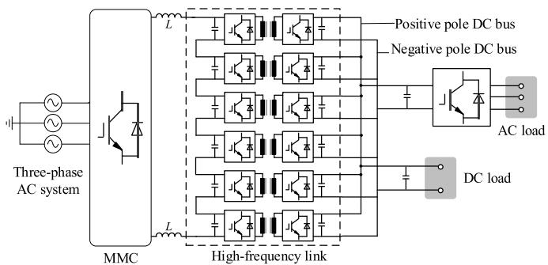

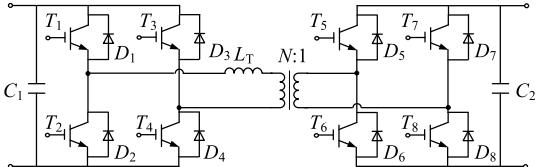  
  
(b)   
Fig. 1. MMC-based SST. (a) Converter structure. (b) DAB PM structure.

power module (PM) structures of SSTs. Specifically, cascaded H-bridge (CHB) and modular multilevel converter (MMC) can be deployed in the medium-voltage (MV) side as ac/dc converters, while dual active bridge (DAB), multiple active bridge (MAB), and single active bridge (SAB) can be used in the low-voltage (LV) side as dc/dc converters [6]–[11]. Moreover, multiple connection configurations of the PMs have been proposed to address the dilemma of increasing the converter capacity and reducing the device rating [12], [13], such as the input-series-output-parallel (ISOP), input-seriesoutput-series (ISOS), input-parallel-output-parallel (IPOP), and input-parallel-output-series (IPOS).

Combining the advantages of MMCs and the ISOP configuration, a typical MMC-based SST is presented in [14], as shown in Fig. 1(a). Its high-frequency link (HFL) is based on the DAB PM shown in Fig. 1(b). The large number of submodules (SMs) leads to a high order of admittance matrix in the electromagnetic transient (EMT) simulation using fully detailed models (DMs), which requires the simulation time steps to be in the range of microseconds due to the power electronic switches and high-frequency isolation transformers [15], [16]. Hence, both MMC and HFL face very urgent needs for EMT equivalent modeling and fast simulation.

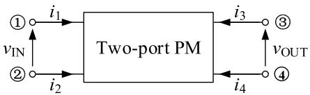  
Fig. 2. Two-port PM topology.

Recently, the research on the accelerated equivalent models (EMs) of MMCs has been relatively mature [17]–[20]. Specifically, the EMs in [19] and [20] create a single-port or multiport Norton equivalent circuit by recursively eliminating internal nodes. Their modeling methods show good acceleration and accuracy without losing the information of internal nodes. However, these methods are designed for MMCs and, therefore, cannot be directly applied to the HFL because the topologies and connection configurations of PMs are more complicated in HFLs.

To bridge the research gap of developing acceleration models for HFLs, efforts have been made in the open literature. The accelerated equivalent mathematical model for the SAB PM has been established in [21], which is based on the accurate mode division and complex high-order integration algorithm. Zhao et al. [22] and Ouyang et al. [23] proposed average models for SSTs, which can highly improve the simulation speed. However, these models sacrifice the capability of describing the transient behaviors inside PMs.

In the newly reported high-speed equivalent modeling algorithm of CHB-based SST [24], the HFL is represented by a two single-port circuit through eliminating the internal nodes and discretizing the isolation transformer into two-port Norton circuits. The EM shows good performances in the aspects of efficiency, accuracy, and scalability. However, it needs to conduct the approximation of circuit equations, which may result in additional errors. Moreover, there are still several matrix inversion operations in the calculation process of each time step, and therefore, the equivalent algorithm still has room for further speedup.

This article proposes an accelerated EMT equivalent modeling method focusing on the HFL. The developed models are compared against DMs and experimental results. Very high accuracy along with a speedup of 2–3 orders of magnitude can be achieved.

# II. PROPOSED ACCELERATED MODELING METHOD

Different from the single-port SMs such as half-bridge (HB) and full-bridge (FB) in MMCs, there are at least two ports in the SST PMs. Meanwhile, the connection configurations of SST PMs are varied, which includes four typical connections, i.e., ISOP, ISOS, IPOS, IPOP, and their nested forms [12], [13].

The topology of the two-port PM is shown in Fig. 2, where the subscripts “IN” and “OUT” represent the input and output ports, respectively.

Due to the isolated transformer, the two-port characteristics, i.e., $i _ { 1 } + i _ { 2 } = 0$ and $i _ { 3 } + i _ { 4 } = 0 .$ , are satisfied in mathematics [20]. For such isolated networks, four types of port parameters are defined in [24] to describe the relationship between the currents and voltages of the input and output ports,

TABLE I TYPE OF PARAMETERS FOR DIFFERENT CONNECTION CONFIGURATIONS   

<table><tr><td>Type of port parameters</td><td>Common variables</td><td>Connection configurations</td></tr><tr><td>Hybrid parameters, H</td><td>iIN and vOUT</td><td>ISOP</td></tr><tr><td>Open-circuit impedance parameters, Z</td><td>iIN and iOUT</td><td>ISOS</td></tr><tr><td>Inverse hybrid parameters, G</td><td>vIN and iOUT</td><td>IPOS</td></tr><tr><td>Short-circuit admittance parameters, Y</td><td>vIN and vOUT</td><td>IPOP</td></tr></table>

as listed in the first column of Table I. Among them, the shortcircuit admittance parameters are closely related to the node admittance matrix of the system and can be converted to the other three types.

Taking the hybrid parameters as an example, the PM port equation can be written as follows

$$
\begin{array}{l} \left[ \begin{array}{l} v _ {\mathrm {I N}} \\ i _ {\mathrm {O U T}} \end{array} \right] = \left[ \begin{array}{l l} h _ {1 1} & h _ {1 2} \\ h _ {2 1} & h _ {2 2} \end{array} \right] \cdot \left[ \begin{array}{l} i _ {\mathrm {I N}} \\ v _ {\mathrm {O U T}} \end{array} \right] + \left[ \begin{array}{l} v _ {\mathrm {I N} _ {-} \mathrm {O C}} \\ i _ {\mathrm {O U T} _ {-} \mathrm {S C}} \end{array} \right] \\ \triangleq \boldsymbol {H} \cdot \left[ \begin{array}{l} i _ {\mathrm {I N}} \\ v _ {\mathrm {O U T}} \end{array} \right] + \left[ \begin{array}{l} v _ {\mathrm {I N} - \mathrm {O C}} \\ i _ {\mathrm {O U T} - \mathrm {S C}} \end{array} \right] \tag {1} \\ \end{array}
$$

where $h _ { 1 1 } , h _ { 1 2 } , h _ { 2 1 }$ , and $h _ { 2 2 }$ are the hybrid parameters, H is the hybrid parameter matrix, and $\upsilon _ { \mathrm { I N } }$ and $i _ { \mathrm { O U T } }$ are the independent sources.

It is known that all PMs connected in the ISOP configuration share the common input-port current $i _ { \mathrm { I N } }$ and output-port voltage vOUT. Hence, the port equation of the HFL can be obtained as (2), by directly summing the corresponding parameters in the hybrid parameter port equations of all PMs

$$
\begin{array}{l} \left[ \begin{array}{c} v _ {\text {I N}} ^ {\text {t o t}} \\ i _ {\text {O U T}} ^ {\text {t o t}} \end{array} \right] = \left[ \begin{array}{c} \sum_ {i = 1} ^ {N} v _ {\text {I N}} ^ {i} \\ \sum_ {i = 1} ^ {N} i _ {\text {O U T}} ^ {i} \end{array} \right] = \sum_ {i = 1} ^ {N} \boldsymbol {H} _ {i} \cdot \left[ \begin{array}{c} i _ {\text {I N}} \\ v _ {\text {O U T}} \end{array} \right] + \left[ \begin{array}{c} \sum_ {i = 1} ^ {N} v _ {\text {I N - O C}} ^ {i} \\ \sum_ {i = 1} ^ {N} i _ {\text {O U T - S C}} ^ {i} \end{array} \right] \\ \triangleq \left[ \begin{array}{l l} h _ {\text {t o t} _ {1 1}} & h _ {\text {t o t} _ {1 2}} \\ h _ {\text {t o t} _ {2 1}} & h _ {\text {t o t} _ {2 2}} \end{array} \right] \cdot \left[ \begin{array}{l} i _ {\mathrm {I N}} \\ v _ {\mathrm {O U T}} \end{array} \right] + \left[ \begin{array}{l} v _ {\mathrm {I N} _ {-} \mathrm {O C}} ^ {\mathrm {t o t}} \\ i _ {\mathrm {O U T} _ {-} \mathrm {S C}} ^ {\mathrm {t o t}} \end{array} \right] \tag {2} \\ \end{array}
$$

where N is the number of PMs and $\upsilon _ { \mathrm { I N } } ^ { \mathrm { t o t } }$ and $i _ { \mathrm { O U T } } ^ { \mathrm { t o t } }$ are the input-port voltage and output-port current of the converter, respectively.

However, it is not easy to directly obtain the hybrid parameters of SST PMs. Fortunately, the hybrid parameters can be converted by (3) using the short-circuit admittance parameters, which are defined in (4)

$$
\begin{array}{l} \left[ \begin{array}{l} v _ {\mathrm {I N}} \\ i _ {\mathrm {O U T}} \end{array} \right] = \left[ \begin{array}{c c} \frac {1}{y _ {1 1}} & - \frac {y _ {1 2}}{y _ {1 1}} \\ \frac {y _ {2 1}}{y _ {1 1}} & \frac {y _ {1 1} y _ {2 2} - y _ {1 2} y _ {2 1}}{y _ {1 1}} \end{array} \right] \cdot \left[ \begin{array}{l} i _ {\mathrm {I N}} \\ v _ {\mathrm {O U T}} \end{array} \right] \\ + \left[ \begin{array}{l} \frac {1}{y _ {1 1}} j _ {S 1} \\ \frac {y _ {2 1}}{y _ {1 1}} j _ {S 1} - j _ {S 2} \end{array} \right] \tag {3} \\ \end{array}
$$

$$
\begin{array}{l} \left[ \begin{array}{c} i _ {\mathrm {I N}} \\ i _ {\mathrm {O U T}} \end{array} \right] = \left[ \begin{array}{c c} y _ {1 1} & y _ {1 2} \\ y _ {2 1} & y _ {2 2} \end{array} \right] \cdot \left[ \begin{array}{c} v _ {\mathrm {I N}} \\ v _ {\mathrm {O U T}} \end{array} \right] + \left[ \begin{array}{c} j _ {S 1} \\ j _ {S 2} \end{array} \right] \\ \triangleq Y \cdot \left[ \begin{array}{l} v _ {\mathrm {I N}} \\ v _ {\mathrm {O U T}} \end{array} \right] + \left[ \begin{array}{l} j _ {S 1} \\ j _ {S 2} \end{array} \right] \tag {4} \\ \end{array}
$$

where $y _ { 1 1 }$ and $y _ { 2 2 }$ represent the input admittance of the two ports, $y _ { 1 2 }$ and $y _ { 2 1 }$ represent transfer admittances, and Y is the short-circuit admittance matrix, and $j _ { S 1 }$ and $j _ { S 2 }$

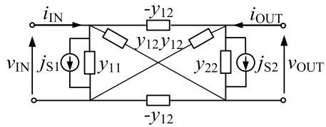  
Fig. 3. Two-port equivalent circuit using short-circuit admittance parameters.

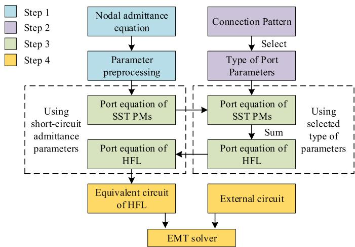  
Fig. 4. Procedures of the accelerated equivalent modeling method.

represent the independent current sources of the two ports [24]. Since the SST PM is composed of passive components, the port equation in (4) meets the reciprocity characteristics, i.e., $y _ { 1 2 } = y _ { 2 1 }$ , which is proved in Section III.

Similar to the EM of the isolated transformer given in [16], the port equations using short-circuit admittance parameters in (4) have actual physical meanings, as shown in the equivalent circuit in Fig. 3.

To facilitate the EMT simulation, the port equations of HFL in (2) need to be reversed to the short-circuit admittance parameters. Furthermore, once the external information iIN and vOUT is calculated at each simulation time step of the EMT solver, vIN and iOUT of each SST PMs can be directly calculated by (1).

Note that, the method is also applied to other connection configurations. According to the common variables shared by SST PMs, the type of the port parameters can be selected, as listed in Table I. The port parameter matrix of HFL, i.e., Z, G, or Y, is the sum of the corresponding parameter matrices of PMs. This is also the case for independent sources. Besides, when the port number of PMs increases, such as MAB, the order of the parameter matrix will increase accordingly.

The procedures of the proposed accelerated EMT modeling method of SST are given in Fig. 4, which include the following four steps.

Step 1: Obtain the port equation using short-circuit admittance parameters of SST PMs through parameter preprocessing of the nodal admittance equation. This progress is complicated and will be carefully discussed in Section III.

Step 2: Select the type of port parameters according to the SST connection pattern.

Step 3: Calculate the port equation of HFL by the conversion between the short-circuit admittance parameters and the selected type of parameters.

Step 4: Form the equivalent circuit of HFL using the shortcircuit admittance parameters. Then, the EMT solver is used to solve the full network combined with the external circuit.

A portion of this method has been presented in [26], which is significantly improved in this article. In addition, the equivalent modeling method of the blocking mode can be effectively solved by calling the subfunction of the diode model from the EMT solver [24], which is out of the scope of this article.

# III. OBTAIN THE PORT EQUATION OF THE POWER MODULE

In this section, a method is proposed to obtain the port equation of SST PMs using short-circuit admittance parameters. Different from the equivalent modeling method in [24], the preprocessing of the nodal admittance equation is used to minimize the algebraic operations. Here, the study focuses on the DAB PM, but this method is also applicable to other types of SST PMs, as discussed in Section IV.

# A. Relationship Between the Nodal Admittance Equation and the Port Equation Using Short-Circuit Admittance Parameters

As for the isolated two-port network shown in Fig. 2, the complete matrix expressions of the port characteristics are

$$
\left[ \begin{array}{c c} 1 & 0 \\ - 1 & 0 \\ 0 & 1 \\ 0 & - 1 \end{array} \right] \cdot \left[ \begin{array}{c} i _ {\text {I N}} \\ i _ {\text {O U T}} \end{array} \right] = \left[ \begin{array}{c} i _ {1} \\ i _ {2} \\ i _ {3} \\ i _ {4} \end{array} \right],
$$

$$
\left[ \begin{array}{c c c c} 1 & - 1 & 0 & 0 \\ 0 & 0 & 1 & - 1 \end{array} \right] \cdot \left[ \begin{array}{l} v _ {1} \\ v _ {2} \\ v _ {3} \\ v _ {4} \end{array} \right] = \left[ \begin{array}{c} v _ {\mathrm {I N}} \\ v _ {\mathrm {O U T}} \end{array} \right] \tag {5}
$$

where $\upsilon _ { 1 } { - } v _ { 4 }$ and $i _ { 1 } { - } i _ { 4 }$ are the voltages and injection currents of the four terminals of the two-port network.

Combining (4) and (5), the relationship between the nodal admittance equation and the port equation using short-circuit admittance parameters is given in the following equation:

$$
\begin{array}{l} \left[ \begin{array}{l} i _ {1} \\ i _ {2} \\ i _ {3} \\ i _ {4} \end{array} \right] = \left[ \begin{array}{c c} 1 & 0 \\ - 1 & 0 \\ 0 & 1 \\ 0 & - 1 \end{array} \right] \cdot \left[ \begin{array}{l l} y _ {1 1} & y _ {1 2} \\ y _ {2 1} & y _ {2 2} \end{array} \right] \cdot \left[ \begin{array}{c c c c} 1 & - 1 & 0 & 0 \\ 0 & 0 & 1 & - 1 \end{array} \right] \\ \cdot \left[ \begin{array}{c} v _ {1} \\ v _ {2} \\ v _ {3} \\ v _ {4} \end{array} \right] + \left[ \begin{array}{c c} 1 & 0 \\ - 1 & 0 \\ 0 & 1 \\ 0 & - 1 \end{array} \right] \cdot \left[ \begin{array}{c} j _ {S 1} \\ j _ {S 2} \end{array} \right] \\ = \left[ \begin{array}{l} y _ {1 1} \cdot \left[ \begin{array}{c c} 1 & - 1 \\ - 1 & 1 \end{array} \right] y _ {1 2} \cdot \left[ \begin{array}{c c} 1 & - 1 \\ - 1 & 1 \end{array} \right] \\ y _ {2 1} \cdot \left[ \begin{array}{c c} 1 & - 1 \\ - 1 & 1 \end{array} \right] y _ {2 2} \cdot \left[ \begin{array}{c c} 1 & - 1 \\ - 1 & 1 \end{array} \right] \end{array} \right] \cdot \left[ \begin{array}{l} v _ {1} \\ v _ {2} \\ v _ {3} \\ v _ {4} \end{array} \right] \\ + \left[ \begin{array}{l} j _ {S 1} \cdot \left[ \begin{array}{l} 1 \\ - 1 \end{array} \right] \\ j _ {S 2} \cdot \left[ \begin{array}{l} 1 \\ - 1 \end{array} \right] \end{array} \right]. \tag {6} \\ \end{array}
$$

Therefore, once the nodal admittance equation containing the external terminal node of DAB PM is calculated, the shortcircuit admittance parameters can be obtained directly.

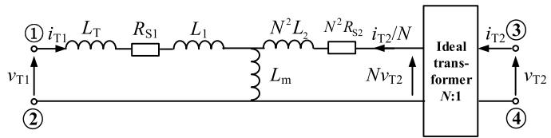  
(a)

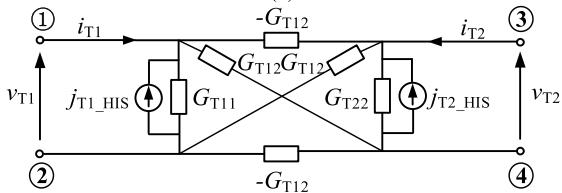  
  
Fig. 5. Transformer models. (a) T-type equivalent circuit. (b) Discretized model using the TR integration method.

# B. Nodal Admittance Equation of DAB Power Module

A classical DAB PM structure is shown in Fig. 1(b). It is known from [24] that the equivalent modeling of the transformer is the key challenge of DAB PM. First, the model of the transformer in [24] takes one time-step approximation, which may result in some additional errors. Second, the transformer resistances are comparable to the semiconductor switch resistances, which are necessary to be considered to increase the accuracy and expand the application scopes of the model. Hence, an improved transformer model is introduced in this section.

The T-type equivalent circuit of the transformer in Fig. 1(b) is shown in Fig. 5(a).

The inductances include the auxiliary inductance $L _ { T } .$ , the primary-side leakage reactance $L _ { 1 }$ , the excitation reactance $L _ { m }$ , and the secondary-side leakage reactance $L _ { 2 }$ . They have been referred to the primary side of the transformer [16]. $R _ { S 1 }$ and $R _ { S 2 }$ are the primary and secondary winding resistances, respectively. Moreover, the ideal transformer is used between the primary and secondary sides so that the port voltages $( \upsilon _ { T 1 } , ~ \upsilon _ { T 2 } )$ and currents $( i _ { T 1 } , ~ i _ { T 2 } )$ are electrically isolated as the actual transformer. The discretized model of the transformer using the trapezoidal rule (TR) is proposed, as shown in Fig. 5(b), where the subscript $^ { 6 6 } \mathrm { T } 1 ^ { \circ }$ represents the primary side and “T2” represents the secondary side.

The KVL of the T-type equivalent circuit in Fig. 5(a) is written as

$$
\left[ \begin{array}{c} v _ {T 1} (t) \\ v _ {T 2} (t) \end{array} \right] = \left[ \begin{array}{c c} L _ {T} + L _ {1} + L _ {m} & L _ {m} / N \\ L _ {m} / N & L _ {2} + L _ {m} / N ^ {2} \end{array} \right] \cdot \left[ \begin{array}{c} \frac {d i _ {T 1} (t)}{d t} \\ \frac {d i _ {T 2} (t)}{d t} \end{array} \right]
$$

$$
+ \left[ \begin{array}{c c} R _ {S 1} & 0 \\ 0 & R _ {S 2} \end{array} \right] \cdot \left[ \begin{array}{l} i _ {T 1} (t) \\ i _ {T 2} (t) \end{array} \right]. \tag {7}
$$

Define

$$
\left\{ \begin{array}{l} \boldsymbol {Y} _ {T} = \frac {\Delta t}{2} \cdot \left[ \begin{array}{c c} L _ {T} + L _ {1} + L _ {m} & L _ {m} / N \\ L _ {m} / N & L _ {2} + L _ {m} / N ^ {2} \end{array} \right] ^ {- 1} \\ \boldsymbol {R} = \left[ \begin{array}{c c} R _ {S 1} & 0 \\ 0 & R _ {S 2} \end{array} \right], \boldsymbol {I} = \left[ \begin{array}{c c} 1 & 0 \\ 0 & 1 \end{array} \right]. \end{array} \right. \tag {8}
$$

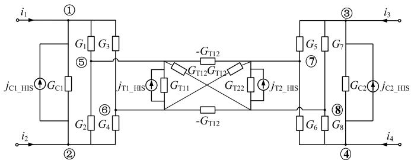  
Fig. 6. Companion circuit of DAB PM.

Discretize (7) with the TR integration method, and then

$$
\left[ \begin{array}{l} i _ {T 1} (t) \\ i _ {T 2} (t) \end{array} \right] = \boldsymbol {G} _ {T} \cdot \left[ \begin{array}{l} v _ {T 1} (t) \\ v _ {T 2} (t) \end{array} \right] - \left[ \begin{array}{l} j _ {T 1 \_ H I S} (t) \\ j _ {T 2 \_ H I S} (t) \end{array} \right]. \tag {9}
$$

The expression of $G _ { T }$ is given in (10), where $G _ { T 1 1 }$ and $G _ { T 2 2 }$ both represent the self-admittance, $G _ { T 1 2 }$ and $- G _ { T 1 2 }$ represent the mutual admittance, and K is a coefficient matrix. These parameters will be constants once the step size, integration method, and parameters of the transformer are determined [16]. $j _ { T 1 }$ and $j _ { T 2 }$ represent the history current sources, which can be obtained before the EMT calculation of each time step

$$
\left\{ \begin{array}{l} \boldsymbol {G} _ {T} = \left[ \boldsymbol {I} + \boldsymbol {Y} _ {T} \cdot \boldsymbol {R} \right] ^ {- 1} \cdot \boldsymbol {Y} _ {T} = \left[ \boldsymbol {Y} _ {T} ^ {- 1} + \boldsymbol {R} \right] ^ {- 1} \\ = \left[ \begin{array}{l l} G _ {T 1 1} & G _ {T 1 2} \\ G _ {T 1 2} & G _ {T 2 2} \end{array} \right] \\ \boldsymbol {K} = \left[ \boldsymbol {I} + \boldsymbol {Y} _ {T} \cdot \boldsymbol {R} \right] ^ {- 1} \left[ \boldsymbol {I} - \boldsymbol {Y} _ {T} \cdot \boldsymbol {R} \right] \left[ \begin{array}{l} j _ {T 1 _ {\text {H I S}}} (t) \\ j _ {T 2 _ {\text {H I S}}} (t) \end{array} \right] \\ = - \boldsymbol {G} _ {T} \cdot \left[ \begin{array}{l} v _ {T 1} (t - \Delta t) \\ v _ {T 2} (t - \Delta t) \end{array} \right] \\ - \boldsymbol {K} \cdot \left[ \begin{array}{l} i _ {T 1} (t - \Delta t) \\ i _ {T 2} (t - \Delta t) \end{array} \right]. \end{array} \right. \tag {10}
$$

After that, the companion circuit of DAB PM can be obtained, as shown in Fig. 6, in which the switches are represented by ON-state conductance $G _ { \mathrm { O N } }$ and OFF-state conductance $G _ { \mathrm { O F F } }$ [27] and the internal capacitors are discretized to the Norton equivalent circuit $( G _ { \mathrm { C } } / / j _ { \mathrm { C } } \underline { { \mathrm { _ { H I S } } } } )$ based on Dommel’s method [28]. The simplification may lead to inapplicability when simulating the device-level behaviors, but it is enough for simulating the module-level dynamics [29].

Using the idea of partitioned matrix separating the internal and external nodes, the nodal admittance equation of DAB PM is written as in (11), as shown at the bottom of the next page, which can be simply expressed as

$$
\left[ \begin{array}{l l} \boldsymbol {A} & \boldsymbol {B} \\ \boldsymbol {B} ^ {T} & \boldsymbol {C} \end{array} \right] \cdot \left[ \begin{array}{l} \boldsymbol {v} _ {\mathrm {E X}} \\ \boldsymbol {v} _ {\mathrm {I N}} \end{array} \right] = \left[ \begin{array}{l} \boldsymbol {j} _ {\mathrm {E X}} \\ \boldsymbol {j} _ {\mathrm {I N}} \end{array} \right] + \left[ \begin{array}{l} \boldsymbol {i} _ {\mathrm {E X}} \\ \boldsymbol {0} \end{array} \right] \tag {12}
$$

where A, B, and C are $4 \times 4$ sized partitioned matrices, the subscript $\ddot { \mathbf { \mu } } ^ { 6 6 } \mathbf { E X } ^ { 5 }$ represents the external nodes, and “IN” represents the internal nodes.

# C. Preprocessing of Nodal Admittance Equation

Referring to [19] and [20], the internal nodes can be eliminated by (13) to obtain the equivalent circuit only containing

the external terminals

$$
\left\{ \begin{array}{l} \boldsymbol {i} _ {\mathrm {E X}} = \boldsymbol {Y} _ {\mathrm {E X}} \boldsymbol {v} _ {\mathrm {E X}} + \boldsymbol {j} _ {S} \\ \boldsymbol {Y} _ {\mathrm {E X}} = \boldsymbol {A} - \boldsymbol {B} \cdot \boldsymbol {C} ^ {- 1} \cdot \boldsymbol {B} ^ {T} \\ \boldsymbol {j} _ {S} = \boldsymbol {B} \cdot \boldsymbol {C} ^ {- 1} \cdot \boldsymbol {j} _ {\mathrm {I N}} - \boldsymbol {j} _ {\mathrm {E X}} \end{array} \right. \tag {13}
$$

where $Y _ { \mathrm { E X } }$ and $j _ { S }$ represent the equivalent nodal admittance matrix and equivalent historical current sources, respectively. After that, (14) is used to update the internal information

$$
\boldsymbol {v} _ {\mathrm {I N}} = \boldsymbol {C} ^ {- 1} \cdot \left(\boldsymbol {j} _ {\mathrm {I N}} - \boldsymbol {B} ^ {T} \cdot \boldsymbol {v} _ {\mathrm {E X}}\right). \tag {14}
$$

It is observed that the nodal admittance matrix in (12) has high sparsity, and hence, (15) is obtained by dividing A, B, and C into four $2 \times 2$ sized partitioned matrices

$$
\boldsymbol {A} = \left[ - \frac {\boldsymbol {A} _ {1 1}}{0}, \frac {0}{\boldsymbol {A} _ {2 2}} - \right], \boldsymbol {B} = \left[ - \frac {\boldsymbol {B} _ {1 1}}{0}, \frac {0}{\boldsymbol {B} _ {2 2}} - \right], \boldsymbol {C} = \left[ \begin{array}{l} \boldsymbol {C} _ {1 1} \\ \boldsymbol {C} _ {1 2} \end{array} \right] ^ {- 1} \begin{array}{l} \boldsymbol {C} _ {1 2} \\ \boldsymbol {C} _ {2 2} \end{array} - \tag {15}
$$

For more convenient representations, $c ^ { - 1 }$ in (13) and (14) is rewritten as $4 \times 4$ sized matrix $\varrho ,$ which is also divided into four $2 \times 2$ partitioned matrices as follows

$$
\begin{array}{l} Q = \left[ \begin{array}{l l} Q _ {1 1} & Q _ {1 2} \\ Q _ {1 2} ^ {T} & Q _ {2 2} \end{array} \right] \\ = \left[ \begin{array}{c c} \bar {C} _ {1 1} ^ {- 1} + & \bar {C} _ {1 1} ^ {- 1} \cdot C _ {1 2} ^ {- 1} \cdot M _ {2 2} ^ {- 1} \cdot C _ {1 2} ^ {- 1} \cdot C _ {1 1} ^ {- 1} - \\ & - \bar {M} _ {2 2} ^ {- 1} \cdot \bar {C} _ {1 2} ^ {- 1} \cdot C _ {1 1} ^ {- 1} \end{array} \right] \tag {16} \\ \end{array}
$$

where

$$
\boldsymbol {M} _ {2 2} = \boldsymbol {C} _ {2 2} - \boldsymbol {C} _ {1 2} \cdot \boldsymbol {C} _ {1 1} ^ {- 1} \cdot \boldsymbol {C} _ {1 2}. \tag {17}
$$

According to (15)–(17), $Y _ { \mathrm { E X } }$ and $j _ { \mathrm { S } }$ in (13) are reorganized as

$$
\left\{ \begin{array}{l} \mathbf {Y} _ {\mathrm {E X}} = \left[ \begin{array}{c c c} - \frac {\mathbf {A} _ {1 1} - \mathbf {B} _ {1 1} \cdot \mathbf {Q} _ {1 1} \cdot \mathbf {B} _ {1 1} ^ {T}}{- \mathbf {B} _ {2 2} \cdot \mathbf {Q} _ {1 2} ^ {T} \cdot \mathbf {B} _ {1 1} ^ {T}} & - \mathbf {B} _ {1 1} \cdot \mathbf {Q} _ {1 2} \cdot \mathbf {B} _ {2 2} ^ {T} \\ & \mathbf {A} _ {2 2} - \mathbf {B} _ {2 2} \cdot \mathbf {Q} _ {2 2} \cdot \mathbf {B} _ {2 2} ^ {T} \end{array} \right] \\ j _ {S} = \left[ \begin{array}{c c c} \mathbf {B} _ {1 1} \cdot \mathbf {Q} _ {1 1} & \mathbf {B} _ {1 1} \cdot \mathbf {Q} _ {1 2} \\ \mathbf {B} _ {2 2} \cdot \mathbf {Q} _ {1 2} & \mathbf {B} _ {2 2} \cdot \mathbf {Q} _ {2 2} \end{array} \right] \cdot j _ {\mathrm {I N}} - j _ {\mathrm {E X}} \end{array} . \right. \tag {18}
$$

In addition, under the nonblocking mode, the four insulated-gate bipolar transistors (IGBTs) in the H-bridge will be in two switching pairs to prevent the short-circuit of the capacitor, hence

$$
\begin{array}{l} G _ {1} + G _ {2} = G _ {3} + G _ {4} = G _ {5} + G _ {6} = G _ {7} + G _ {8} \\ = G _ {\mathrm {O N}} + G _ {\mathrm {O F F}}. \tag {19} \\ \end{array}
$$

Define $G _ { x } \triangleq G _ { \mathrm { O N } } + G _ { \mathrm { O F F } }$ . Then, $G _ { \mathrm { X } } , G _ { \mathrm { T 1 1 } } , G _ { \mathrm { T 1 2 } }$ , and $G _ { \mathrm { T } 2 2 }$ in (10) are constants. Hence, it can be observed that C is a symmetric constant matrix regardless of the switching pulses, which indicates that Q is also a symmetric constant matrix. Combining (16), (17), and (19), $\varrho$ can be simplified as follows:

$$
\boldsymbol {Q} = \left[ \begin{array}{c c c} & \left[ \begin{array}{l l} q _ {1} & q _ {2} \\ q _ {2} & q _ {1} \end{array} \right] & q _ {3} \cdot \left[ \begin{array}{l l} 1 & - 1 \\ - 1 & 1 \end{array} \right] \\ - - & - - \frac {\left[ \begin{array}{l l} 1 & - 1 \\ - 1 & 1 \end{array} \right]}{\left[ \begin{array}{l l} - 1 & - 1 \\ - 1 & 1 \end{array} \right]} + - & \left[ \begin{array}{l l} q _ {4} & q _ {5} \\ q _ {5} & q _ {4} \end{array} \right] - \\ q _ {3} \cdot \left[ \begin{array}{l l} - 1 & - 1 \\ - 1 & 1 \end{array} \right] & \end{array} \right] \tag {20}
$$

where $q _ { 1 } { - } q _ { 5 }$ are constant parameters as given in the following equation (21), as shown at the bottom of the next page.

Moreover, $Y _ { \mathrm { E X } }$ and $j _ { \mathrm { S } }$ in (18) are preprocessed based on (19)–(21) as

$$
\boldsymbol {Y} _ {\mathrm {E X}} = \left[ \begin{array}{c c c} y _ {1 1} \cdot & \left[ \begin{array}{c c} 1 & - 1 \\ - 1 & 1 \end{array} \right] _ {1} ^ {\prime} y _ {1 2} \cdot & \left[ \begin{array}{c c} 1 & - 1 \\ - 1 & 1 \end{array} \right] \\ - - - y _ {1 2} \cdot & \left[ \begin{array}{c c} 1 & - 1 \\ - 1 & 1 \end{array} \right] _ {1} ^ {\prime} y _ {2 2} \cdot & \left[ \begin{array}{c c} 1 & - 1 \\ - 1 & 1 \end{array} \right] \end{array} \right];
$$

$$
\boldsymbol {j} _ {S} = \left[ \begin{array}{l} j _ {S 1} \cdot \left[ \begin{array}{l} 1 \\ - 1 \end{array} \right] \\ j _ {S 2} \cdot \left[ \begin{array}{l} 1 \\ - 1 \end{array} \right] \end{array} \right] \tag {22}
$$

in which the values of $y _ { 1 1 } , y _ { 1 2 } , y _ { 2 2 } , j _ { \mathrm { S 1 } }$ , and $j _ { \mathrm { S } 2 }$ can be directly calculated using (23).

The variables $K _ { 1 } – K _ { 5 }$ are controlled by the firing pulses of IGBTs $T _ { 1 } { - } T _ { 8 } ,$ , as shown in (24). Other parameters related to $q _ { 1 } { - } q _ { 5 }$ , $G _ { \mathrm { O N } } .$ , and $G _ { \mathrm { O F F } }$ are constants, which need to be

$$
\left[ \begin{array}{c c c c} G _ {C 1} + G _ {1} + G _ {3} & - G _ {C 1} & 0 & 0 \\ - G _ {C 1} & G _ {C 1} + G _ {2} + G _ {4} & 0 & 0 \\ 0 & 0 & G _ {C 2} + G _ {5} + G _ {7} & - G _ {C 2} \\ \hline - - - - - - - - - - - - - - - - - - - - - - - - - - - - - - - - - - - - - - - - - - - - - - - - - - - - - - - - - - - - - - - - - - - - - - - - - - - - - - - - - - - - - - - - - - - - - - - - - - - - \\ - G _ {1} & - G _ {2} & 0 & 0 \\ - G _ {3} & - G _ {4} & 0 & 0 \\ 0 & 0 & - G _ {5} & - G _ {6} \\ 0 & 0 & - G _ {7} & - G _ {8} \end{array} \right]
$$

$$
\left. \begin{array}{c c c c} - G _ {1} & - G _ {3} & 0 & 0 \\ - G _ {2} & - G _ {4} & 0 & 0 \\ 0 & 0 & - G _ {5} & - G _ {7} \\ 0 & 0 & - G _ {6} & - G _ {8} \\ G _ {T 1 1} + G _ {1} + G _ {2} & - G _ {T 1 1} & G _ {T 1 2} & - G _ {T 1 2} \\ - G _ {T 1 1} & G _ {T 1 1} + G _ {3} + G _ {4} & - G _ {T 1 2} & G _ {T 1 2} \\ G _ {T 1 2} & - G _ {T 1 2} & G _ {T 2 2} + G _ {5} + G _ {6} & - G _ {T 2 2} \\ - G _ {T 1 2} & G _ {T 1 2} & - G _ {T 2 2} & G _ {T 2 2} + G _ {7} + G _ {8} \end{array} \right]
$$

$$
\cdot \left[ \begin{array}{l} v _ {1} \\ v _ {2} \\ v _ {3} \\ v _ {4} \\ v _ {5} \\ v _ {6} \\ v _ {7} \\ v _ {8} \end{array} \right] = \left[ \begin{array}{c} j _ {C 1 \_ H I S} \\ - j _ {C 1 \_ H I S} \\ j _ {C 2 \_ H I S} \\ - \frac {- j _ {C \_ H I S}}{j _ {T 1 \_ H I S}} \\ - j _ {T 1 \_ H I S} \\ j _ {T 2 \_ H I S} \\ - j _ {T 2 \_ H I S} \end{array} \right] + \left[ \begin{array}{l} i _ {1} \\ i _ {2} \\ i _ {3} \\ i _ {4} \\ 0 \\ 0 \\ 0 \\ 0 \end{array} \right] \tag {11}
$$

calculated only once at the beginning of the simulation

$$
\begin{array}{l} \left\{y _ {1 1} = G _ {C 1} + \left(q _ {1} + q _ {2}\right) \cdot 2 \cdot G _ {\mathrm {O N}} \cdot G _ {\mathrm {O F F}} \right. \\ + K _ {1} \cdot q _ {2} \cdot \left(G _ {\mathrm {O N}} - G _ {\mathrm {O F F}}\right) ^ {2} \\ y _ {1 2} = - K _ {2} \cdot q _ {3} \cdot (G _ {\mathrm {O N}} - G _ {\mathrm {O F F}}) ^ {2} \\ y _ {2 2} = G _ {C 2} + \left(q _ {4} + q _ {5}\right) \cdot 2 \cdot G _ {\mathrm {O N}} \cdot G _ {\mathrm {O F F}} \\ + K _ {3} \cdot q _ {5} \cdot \left(G _ {\mathrm {O N}} - G _ {\mathrm {O F F}}\right) ^ {2} (23) \\ j _ {S 1} = K _ {4} \cdot \left(q _ {1} - q _ {2}\right) \cdot \left(G _ {\text {O F F}} - G _ {\text {O N}}\right) \cdot j _ {T 1 \_ H I S} \\ + K _ {4} \cdot q _ {3} \cdot 2 \cdot \left(G _ {\text {O F F}} - G _ {\text {O N}}\right) \cdot j _ {T 2 \_ H I S} - j _ {C 1 \_ H I S} \\ j _ {S 2} = K _ {5} \cdot \left(q _ {4} - q _ {5}\right) \cdot \left(G _ {\mathrm {O F F}} - G _ {\mathrm {O N}}\right) \cdot j _ {T 2 \_ H I S} \\ + K _ {5} \cdot q _ {3} \cdot 2 \cdot \left(G _ {\text {O F F}} - G _ {\text {O N}}\right) \cdot j _ {T 1 \_ H I S} - j _ {C 2 \_ H I S} \\ \left\{ \begin{array}{l} K _ {1} = \left\{ \begin{array}{l l} 1, & T _ {1} = T _ {4} \\ 0, & T _ {1} = T _ {3} \end{array} ; \right. \quad K _ {3} = \left\{ \begin{array}{l l} 1, & T _ {5} = T _ {8} \\ 0, & T _ {5} = T _ {7} \end{array} \right. \\ K _ {2} = \left\{ \begin{array}{l l} 0, & T _ {1} = T _ {3} \text {o r} \\ & T _ {5} = T _ {7} \\ 1, & T _ {1} = T _ {5} \text {a n d} \\ & (T _ {1} = T _ {4}, T _ {5} = T _ {8}) \\ - 1, & T _ {1} \neq T _ {5} \text {a n d} \\ & (T _ {1} = T _ {4}, T _ {5} = T _ {8}) \end{array} \right. \end{array} \right. \\ \left[ K _ {4} = \left\{ \begin{array}{l l} 1, & T _ {1} = T _ {4} = 1 \\ 0, & T _ {1} = T _ {3} \\ - 1, & T _ {1} = T _ {4} = 0 \end{array} ; \quad K _ {5} = \left\{ \begin{array}{l l} 1, & T _ {5} = T _ {8} = 1 \\ 0, & T _ {5} = T _ {7} \\ - 1, & T _ {5} = T _ {8} = 0. \end{array} \right. \right. \right. (24) \\ \end{array}
$$

Equation (22) has the same form as (6), and hence, the equivalent circuit of DAB PM is the same as in Fig. 3. Meanwhile, DAB PM is a reciprocal two-port since $Y _ { \mathrm { E X } }$ is symmetric.

Moreover, the transformer terminal voltages $\upsilon { 5 ^ { - } } { \upsilon } { 8 }$ in (11) will not directly affect the equivalent modeling of the PMs. They are reflected in the port voltages $\upsilon _ { \mathrm { T 1 } }$ and $\scriptstyle { \mathcal { D } } _ { \mathrm { T 2 } }$ in (10). Hence, the reverse of the internal information in (14) can be transformed into the calculation of new values of $\scriptstyle { \mathcal { D } } _ { \mathrm { T 1 } }$ and vT2. Using the same idea of preprocessing and substituting (20) into (22), the reverse process in (14) can also be simplified as

$$
\left\{ \begin{array}{l} v _ {T 1} = 2 \cdot \left(q _ {2} - q _ {1}\right) \cdot j _ {T 1 \_ H I S} - 4 \cdot q _ {3} \\ \cdot j _ {T 2 \_ H I S} - \left(G _ {\text {O F F}} - G _ {\text {O N}}\right) \\ \cdot \left[ K _ {4} \cdot \left(q _ {1} - q _ {2}\right) \cdot v _ {\text {I N}} + 2 \cdot K _ {5} \cdot q _ {3} \cdot v _ {\text {O U T}} \right] \\ v _ {T 2} = 2 \cdot \left(q _ {5} - q _ {4}\right) \cdot j _ {T 2 \_ H I S} - 4 \cdot q _ {3} \\ \cdot j _ {T 1 \_ H I S} - \left(G _ {\text {O F F}} - G _ {\text {O N}}\right) \\ \cdot \left[ K _ {5} \cdot \left(q _ {4} - q _ {5}\right) \cdot v _ {\text {O U T}} + 2 \cdot K _ {4} \cdot q _ {3} \cdot v _ {\text {I N}} \right] \end{array} \right. \tag {25}
$$

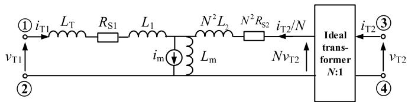

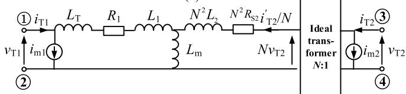  
(a)   
(b)   
Fig. 7. Transformer models considering saturation. (a) T-type equivalent circuit. (b) Mathematical EM.

where $\upsilon _ { \mathrm { I N } }$ and $\scriptstyle v _ { \mathrm { O U T } }$ are the new port voltages of DAB PMs obtained from the EMT solver and (1) and $K _ { 4 }$ and $K _ { 5 }$ are controlled by (24).

# IV. ANALYSIS OF APPLICABILITY

# A. Applicability Considering Transformer Saturation

In Fig. 5, the transformer saturation is ignored to simplify the model without sacrificing its accuracy and applicability. To improve the performance of the EM in more conditions, the transformer saturation is discussed in this section.

Salimi et al. [30] presented a T-type EM considering transformer saturation. As shown in Fig. 7(a), the magnetizing current is divided into two components: the compensating current source $i _ { m }$ and the current in the linear inductance $L _ { m } .$ . In particular, with strict mathematical derivation, Salimi et al. [30] further divided the saturation current into terminal current sources $i _ { m 1 }$ and $i _ { m 2 } ,$ as shown in Fig. 7(b).

Based on the EM in Fig. 7(b), the KVL in (7) is rewritten as

$$
\begin{array}{l} \left[ \begin{array}{c} v _ {T 1} (t) \\ v _ {T 2} (t) \end{array} \right] \\ = \left[ \begin{array}{c c} L _ {T} + L _ {1} + L _ {m} & L _ {m} / N \\ L _ {m} / N & L _ {2} + L _ {m} / N ^ {2} \end{array} \right] \\ \cdot \left[ \frac {\frac {d \left[ i _ {T 1} (t) - i _ {m 1} (t) \right]}{d t}}{\frac {d \left[ i _ {T 2} (t) - i _ {m 2} (t) \right]}{d t}} \right] + \left[ \begin{array}{l l} R _ {1} & 0 \\ 0 & R _ {2} \end{array} \right] \cdot \left[ \begin{array}{l} i _ {T 1} (t) - i _ {m 1} (t) \\ i _ {T 2} (t) - i _ {m 2} (t) \end{array} \right]. \tag {26} \\ \end{array}
$$

It can be observed that the discretized expression and equivalent circuit of the transformer can be determined once

$$
\left\{ \begin{array}{l} q _ {1} = \frac {1}{2 \times G _ {X}} + \frac {2 G _ {T 2 2} + G _ {X}}{2 \times [ (2 G _ {T 2 2} + G _ {X}) \times (2 G _ {T 1 1} + G _ {X}) - 4 G _ {T 1 2} \times G _ {T 1 2} ]} \\ q _ {2} = \frac {1}{2 \times G _ {X}} - \frac {2 G _ {T 2 2} + G _ {X}}{2 \times [ (2 G _ {T 2 2} + G _ {X}) \times (2 G _ {T 1 1} + G _ {X}) - 4 G _ {T 1 2} \times G _ {T 1 2} ]} \\ q _ {3} = \frac {- G _ {T 1 2}}{(2 G _ {T 2 2} + G _ {X}) \times (2 G _ {T 1 1} + G _ {X}) - 2 G _ {T 1 2} \times 2 G _ {T 1 2}} \\ q _ {4} = \frac {(2 G _ {T 1 1} + G _ {X}) \times (G _ {T 2 2} + G _ {X}) - 2 G _ {T 1 2} \times G _ {T 1 2}}{G _ {X} \times [ (2 G _ {T 2 2} + G _ {X}) \times (2 G _ {T 1 1} + G _ {X}) - 4 G _ {T 1 2} \times G _ {T 1 2} ]} \\ q _ {5} = \frac {(2 G _ {T 1 1} + G _ {X}) \times G _ {T 2 2} - 2 G _ {T 1 2} \times G _ {T 1 2}}{G _ {X} \times [ (2 G _ {T 2 2} + G _ {X}) \times (2 G _ {T 1 1} + G _ {X}) - 4 G _ {T 1 2} \times G _ {T 1 2} ]} \end{array} \right. \tag {21}
$$

$i _ { m 1 }$ and $i _ { m 2 }$ are obtained, as shown in the following equations:

$$
\left[ \begin{array}{l} i _ {T 1} (t) \\ i _ {T 2} (t) \end{array} \right] = \boldsymbol {G} _ {T} \cdot \left[ \begin{array}{l} v _ {T 1} (t) \\ v _ {T 2} (t) \end{array} \right] - \left[ \begin{array}{l} j _ {T 1 \_ H I S} ^ {*} (t) \\ j _ {T 2 \_ H I S} ^ {*} (t) \end{array} \right] \tag {27}
$$

$$
\begin{array}{l} \left[ \begin{array}{c} j _ {T 1 \_ \text {H I S}} ^ {*} (t) \\ j _ {T 2 \_ \text {H I S}} ^ {*} (t) \end{array} \right] = - \boldsymbol {G} _ {T} \cdot \left[ \begin{array}{c} v _ {T 1} (t - \Delta t) \\ v _ {T 2} (t - \Delta t) \end{array} \right] - \boldsymbol {K} \cdot \left[ \begin{array}{c} i _ {T 1} (t - \Delta t) \\ i _ {T 2} (t - \Delta t) \end{array} \right] \\ + \boldsymbol {K} \cdot \left[ \begin{array}{l} i _ {m 1} (t - \Delta t) \\ i _ {m 2} (t - \Delta t) \end{array} \right] - \left[ \begin{array}{l} i _ {m 1} (t) \\ i _ {m 2} (t) \end{array} \right] \tag {28} \\ \end{array}
$$

where $G _ { T }$ and K can be obtained from (10). Since (9) and (27) have the same expression, the transformer equivalent circuits are identical as well. Therefore, considering the transformer saturation in the proposed EM will not bring too much additional preprocessing burden and, thereby, will not limit its applicability.

# B. Applicability to CHB and MAB PMs

Due to the isolation transformers, the port characteristics represented in (5) are also applicable for other types of SST PMs, such as CHB and MAB. The degree of freedom of the nodes in such PMs is usually 2 or 3, resulting in a high sparsity of the node admittance matrix. Therefore, it is easy to apply the preprocessing method of the nodal admittance equation in Section III to other SST PMs.

Taking CHB as an example, its PM structure is shown in Fig. 8(a). Based on the equivalent circuit of DAB PM in Fig. 3, the companion circuit of the CHB can be directly simplified as the circuit in Fig. 8(b), where $G _ { \mathrm { H 1 } } { - } G _ { \mathrm { H 4 } }$ are the ON-state or OFF-state of the four switches in the input H-bridge.

Similar to (11), the nodal admittance equation of CHB is (29), as shown at the bottom of the next page.

It can be seen that the nodal admittance matrix exhibits a high sparsity and symmetry. Therefore, the short-circuit admittance equation of CHB PM can be obtained by performing the same preprocessing process as (15)–(24), which is given in the following equation:

$$
\left[ \begin{array}{l} i _ {\mathrm {I N}} \\ i _ {\mathrm {O U T}} \end{array} \right] = \left[ \begin{array}{l l} y _ {1 1} ^ {\mathrm {C H B}} & y _ {1 2} ^ {\mathrm {C H B}} \\ y _ {1 2} ^ {\mathrm {C H B}} & y _ {2 2} ^ {\mathrm {C H B}} \end{array} \right] \cdot \left[ \begin{array}{l} v _ {\mathrm {I N}} \\ v _ {\mathrm {O U T}} \end{array} \right] + \left[ \begin{array}{l} j _ {S 1} ^ {\mathrm {C H B}} \\ j _ {S 2} ^ {\mathrm {C H B}} \end{array} \right] \tag {30}
$$

where $y _ { 1 1 } ^ { \mathrm { C H B } } , y _ { 1 2 } ^ { \mathrm { C H B } }$ , and $y _ { 2 2 } ^ { \mathrm { C H B } }$ yCH22 and $j _ { S 1 } ^ { \mathrm { C H B } }$ and $j _ { S 2 } ^ { \mathrm { C H B } }$ can be calculated using the following equation:

$$
\left\{ \begin{array}{l} y _ {1 1} ^ {\mathrm {C H B}} = \left[ y _ {1 1} \cdot \left(G _ {\mathrm {O N}} + G _ {\mathrm {O F F}}\right) ^ {2} + 2 \cdot G _ {\mathrm {O N}} \right. \\ \cdot G _ {\mathrm {O F F}} \cdot \left(G _ {\mathrm {O N}} + G _ {\mathrm {O F F}}\right) ] / \Delta \\ y _ {1 2} ^ {\mathrm {C H B}} = \left[ K _ {6} \cdot y _ {1 2} \cdot \left(G _ {\mathrm {O N}} ^ {2} - G _ {\mathrm {O F F}} ^ {2}\right) \right] / \Delta \\ y _ {2 2} ^ {\mathrm {C H B}} = y _ {2 2} - \left[ 2 \cdot y _ {1 2} ^ {2} \cdot \left(G _ {\mathrm {O N}} + G _ {\mathrm {O F F}}\right) \right] / \Delta \\ j _ {S 1} ^ {\mathrm {C H B}} = \left[ K _ {6} \cdot j _ {S 1} \cdot \left(G _ {\mathrm {O N}} ^ {2} - G _ {\mathrm {O F F}} ^ {2}\right) \right] / \Delta \\ j _ {S 2} ^ {\mathrm {C H B}} = j _ {S 2} - \left[ 2 \cdot j _ {S 1} \cdot y _ {1 2} \cdot \left(G _ {\mathrm {O N}} + G _ {\mathrm {O F F}}\right) \right] / \Delta \\ \Delta = 2 \cdot y _ {1 1} \cdot \left(G _ {\mathrm {O N}} + G _ {\mathrm {O F F}}\right) + K _ {7} \cdot \left(G _ {\mathrm {O N}} + G _ {\mathrm {O F F}}\right) ^ {2} \\ + (1 - K _ {7}) \cdot 4 \cdot G _ {\mathrm {O N}} \cdot G _ {\mathrm {O F F}}. \end{array} \right. \tag {31}
$$

Compared with DAB PM, there are two new variables $K _ { 6 }$ and $K _ { 7 }$ in (31) for CHB PM, which are controlled by the firing pulses of $T _ { \mathrm { H 1 } } { - } T _ { \mathrm { H 4 } }$ shown in (32). The equivalent circuit of CHB PM is shown in Fig. 7(c)

$$
K _ {6} = \left\{ \begin{array}{l l} 1, & T _ {H 1} = T _ {H 4} = 1 \\ 0, & T _ {H 1} = T _ {H 3} \\ - 1, & T _ {H 1} = T _ {H 4} = 0 \end{array} ; K _ {7} = \left\{ \begin{array}{l l} 1, & T _ {H 1} = T _ {H 4} \\ 0, & T _ {H 1} = T _ {H 3}. \end{array} \right. \right. \tag {32}
$$

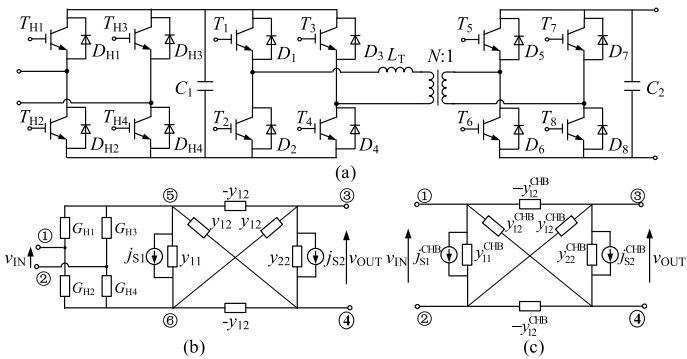  
Fig. 8. Equivalent circuit of CHB PM. (a) Structure. (b) Companion circuit. (c) Equivalent circuit.

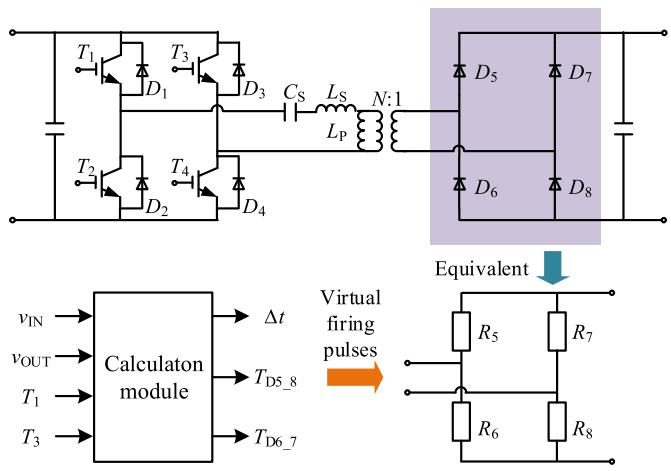  
Fig. 9. Equivalent process of the LLC resonance converters.

It is noted that both DAB and CHB are two-port PMs, which means that their short-circuit admittance parameter matrices are second order. However, for MAB, the order of the matrix will increase with the number of PM ports.

# C. Applicability to SAB and Resonant Converters

Besides DAB, CHB, and MAB PMs, the SST can be made of SAB and various types of resonant converters. Taking the LLC resonant converter shown in Fig. 9 as an example, it contains a resonant unit consists of the series resonance inductance $L _ { S } ,$ , parallel resonance inductance $L _ { P }$ , and series resonance capacitance $C _ { S }$ .

Compared with the fully controlled PMs, there are two main difficulties when developing the equivalent circuit containing stand-alone diodes. First, the ON–OFF states of these diodes are determined by the device currents and voltages. Therefore, the previous equivalent modeling method cannot be used directly. Second, in software with fixed time-step simulation such as PSCAD/EMTDC, the diode switching process may occur between two time steps. It may lead to additional errors and instability due to the lack of interpolation.

To improve the performance of the proposed model, an improved simulation solution of the LLC resonant converter is proposed as follows.

Step 1: Generate the virtual firing pulses of diodes. According to [21], the mathematical model of the LLC resonant converter can be obtained. Then, the switching time of the diodes will be predicted by a calculation module, as shown in Fig. 9. Therefore, the uncontrolled diodes are modeled as

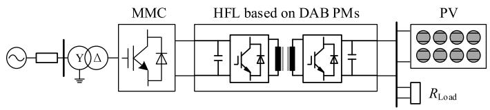  
Fig. 10. MMC-based SST test system.

ON- or OFF-state resistances controlled by the virtual firing pulses $T _ { \mathrm { D 5 } \_ 8 }$ and $T _ { \mathrm { D 6 } _ { - } 7 }$ .

Step 2: Obtain the equivalent circuit of the PM. Using the proposed modeling method in Sections II and III, the equivalent parameters can be calculated.

Step 3: Simulate using variable time steps. Through the calculation in Step 1, the suitable time step -t will be selected considering both the simulation accuracy and switching time.

It should be mentioned that the calculation in Step 1 requires a high-order integration algorithm to meet the accuracy requirements, which will bring a lot of calculations and slow down the simulation speed. Then, the existence of $L _ { \mathrm { S } } , L _ { \mathrm { P } }$ , and $C _ { \mathrm { { S } } }$ will increase the difficulty of the preprocessing process in Step 2.

# V. SIMULATION VERIFICATION

In this section, the accuracy and efficiency of the proposed equivalent MMC-based SST model (EM1) are verified by the comparisons with the DM and the developed EM (EM2) using the existing equivalent modeling algorithm in [24]. The Thevenin EM of the MMC mentioned in [31] is used in the simulation.

All simulations are performed on a computer with a 1.80-GHz AMD A8-7100 Radeon R5, 8 Compute Cores 4C+4G CPU, and PSCAD/EMTDC Professional V4.6. The simulation time step is set as $5 ~ \mu \mathrm { { s } . }$ .

# A. Configuration and Control Strategy of the Test System

The schematic of the test SST system is shown in Fig. 10, which is composed of MMC, HFL based on DAB PMs, a photovoltaic (PV) station, and a dc resistive load. The parameters are given in Table II.

The control mode, including the outer voltage loop and inner current loop, is used in the MMC to regulate the medium-voltage direct current (MVdc) bus voltage. There is a boost circuit at the terminal of the PV station to manage its output power. Moreover, the single-phase shift (SPS) control is applied to balance the DAB’s output dc voltage [32].

# B. Accuracy Test

Typically, the switching frequency of the IGBTs and transformers ranges from 1 to 20 kHz, which requires a simulation time step between 1 and 10 μs [15]. The increase of the

TABLE II SYSTEM PARAMETERS OF THE MMC-BASED SST   

<table><tr><td>Symbols</td><td>Items</td><td>Values</td></tr><tr><td>Nsm</td><td>Number of SMs in MMC</td><td>10</td></tr><tr><td>Csm</td><td>MMC SM capacitance</td><td>10 mF</td></tr><tr><td>Vac</td><td>Voltage of the AC source</td><td>10 kV</td></tr><tr><td>VH</td><td>Rated voltage of the MV DC bus</td><td>16 kV</td></tr><tr><td>VL</td><td>Rated voltage of the LV DC bus</td><td>1.5 kV</td></tr><tr><td>NDAB</td><td>Number of DAB PMs</td><td>10</td></tr><tr><td>Str</td><td>Rated capacity of transformer</td><td>0.25 MVA</td></tr><tr><td>Ltr</td><td>Stray inductance of the transformer</td><td>100 μH</td></tr><tr><td>k</td><td>Transformer ratio</td><td>1</td></tr><tr><td>CIN</td><td>Capacitance of input-side of DAB</td><td>1 mF</td></tr><tr><td>COUT</td><td>Capacitance of output-side of DAB</td><td>2 mF</td></tr><tr><td>RLoad</td><td>DC load</td><td>3 Ω</td></tr></table>

TABLE III AVERAGE VALUES OF MAXIMUM RELATIVE ERRORS   

<table><tr><td>Frequency (kHz)</td><td>EM1 (%)</td><td>EM2 (%)</td></tr><tr><td>1</td><td>1.84</td><td>2.14</td></tr><tr><td>10</td><td>6.54</td><td>12.7</td></tr></table>

frequency will decrease the control accuracy and further increase the truncation error of different integration methods. In addition, compared to EM1, EM2 contains a single time-step approximation, whose accuracy is more sensitive to the increase of frequency. Therefore, two different frequencies, i.e., 1 and 10 kHz, are set to verify the accuracy in comparing DM, EM1, and EM2.

Different working conditions are set to test the simulation accuracy: 1) before t  3.5 s, MMC is charged and HFL remains blocked; 2) at t = 3.5 s, HFL is deblocked and enters the startup process; 3) at t = 4 s, the SST system reaches the steady state; 4) at t = 5 s, DAB’s output voltage is changed to 0.8 p.u.; 5) at t = 5.5 s, an LVdc side pole-to-pole short circuit with a fault resistance 0.1  occurs and is cleared after 0.003 s; and 6) at $t = 6 \ : \mathrm { s } ,$ the PV station is deployed to replace the dc resistance and the power is reversed.

The power under 1 and 10 kHz is shown in Fig. 11. Fig. 11(a) and (b) shows the whole process. Four different states, including the startup, voltage change, fault and recovery, and power reversal, are shown in Fig. 11(c)–(f). The average values of the maximum relative errors (AMEs) of the four states under different switching frequencies are given in Table III.

Under low frequency as 1 kHz, EM1 and EM2 show similar high accuracy with the AME below 2.2%. The AMEs of the two EMs increase with the frequency, and the AME of

$$
\left[ \begin{array}{c c c c c c} G _ {H 1} + G _ {H 2} & 0 & 0 & 0 & - G _ {H 1} & - G _ {H 2} \\ 0 & G _ {H 3} + G _ {H 4} & 0 & 0 & - G _ {H 3} & - G _ {H 4} \\ 0 & 0 & y _ {2 2} & - y _ {2 2} & y _ {1 2} & - y _ {1 2} \\ 0 & 0 & - y _ {2 2} & y _ {2 2} & - y _ {1 2} & y _ {1 2} \\ - G _ {H 1} & - G _ {H 3} & y _ {1 2} & - y _ {1 2} & y _ {1 1} + G _ {H 1} + G _ {H 3} & - y _ {1 1} \\ - G _ {H 2} & - G _ {H 4} & - y _ {1 2} & y _ {1 2} & - y _ {1 1} & y _ {1 1} + G _ {H 2} + G _ {H 4} \end{array} \right]. \left[ \begin{array}{l} v _ {1} \\ v _ {2} \\ v _ {3} \\ v _ {4} \\ v _ {5} \\ v _ {6} \end{array} \right] = \left[ \begin{array}{l} i _ {1} \\ i _ {2} \\ i _ {3} \\ i _ {4} \\ 0 \\ 0 \end{array} \right] + \left[ \begin{array}{l} 0 \\ 0 \\ - j _ {S 2} \\ j _ {S 2} \\ - j _ {S 1} \\ j _ {S 1} \end{array} \right] \tag {29}
$$

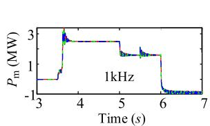  
(@)

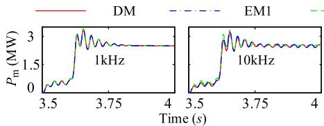

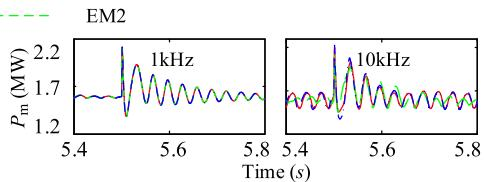

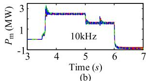

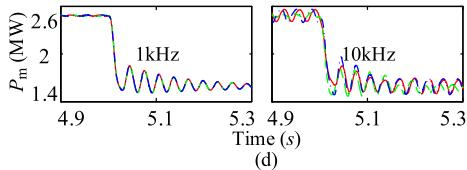

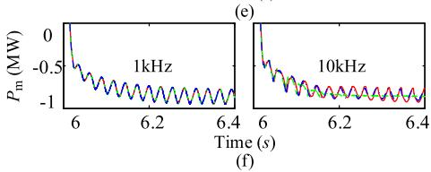  
Fig. 11. Behavior of the power. (a) Whole process (1 kHz). (b) Whole process (10 kHz). Zoomed-in views: (c) startup, (d) voltage change, (e) fault and recovery; and (f) power reversal.

TABLE IV COMPUTATION TIME OF DC/DC CONVERTER   

<table><tr><td>No.</td><td>DM (s)</td><td>EM1 (s)</td><td>Factor1</td><td>EM2 (s)</td><td>Factor2</td></tr><tr><td>3</td><td>56.27</td><td>6.36</td><td>8.84</td><td>7.47</td><td>7.53</td></tr><tr><td>5</td><td>86.53</td><td>8.24</td><td>10.50</td><td>9.19</td><td>9.42</td></tr><tr><td>10</td><td>253.56</td><td>12.82</td><td>19.78</td><td>14.41</td><td>17.59</td></tr><tr><td>20</td><td>919.08</td><td>21.60</td><td>42.55</td><td>24.89</td><td>36.93</td></tr><tr><td>50</td><td>6774.18</td><td>41.40</td><td>163.63</td><td>58.59</td><td>115.62</td></tr><tr><td>100</td><td>23080.35</td><td>74.51</td><td>309.76</td><td>122.77</td><td>187.99</td></tr></table>

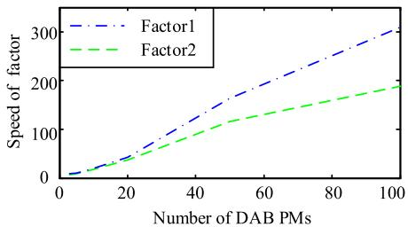  
Fig. 12. Comparison of speedup capability.

EM2 rises faster than EM1. When the frequency reaches 10 kHz, the AME of EM2 exceeds 12%, while the proposed EM1 still maintains a low level less than 6.6%. It means that EM1 is more suitable for the equivalent simulation of complex coupled SST systems.

# C. Computation Efficiency Test

In this section, the models of independent open-loop HFL based on the DM, EM1, and EM2 are tested. In these models, the input side of the converter is represented by a dc voltage source, and a fixed phase shift ratio is used in the controller.

The simulation duration and the frequency are set as 5 s and 1 kHz, respectively. The computation time, as well as the speedup factors of EM1 and EM2 varying with the number of DAB PMs, is listed in Table IV, and the results are also shown in Fig. 12.

With the increasing number of DAB PMs, the computation times of DM increase exponentially, while EM1 and EM2 increase linearly. When the DAB number reaches 50, the speedup of EM1 is over two orders of magnitude faster than the DM and is also 1.5 times faster than EM2.

The whole closed-loop MMC-based SST system is also tested. The results are given in Table V. The parameters of the system are the same as in Section IV-B and the

TABLE V COMPUTATION TIME OF MMC-BASED SST   

<table><tr><td>Frequency (kHz)</td><td>DM (s)</td><td>EM1 (s)</td><td>Factor1</td><td>EM2 (s)</td><td>Factor2</td></tr><tr><td>1</td><td>1399.67</td><td>201.24</td><td>6.96</td><td>214.91</td><td>6.51</td></tr><tr><td>5</td><td>2246.52</td><td>200.76</td><td>11.19</td><td>210.23</td><td>10.68</td></tr><tr><td>10</td><td>2880.13</td><td>202.22</td><td>14.24</td><td>211.55</td><td>13.61</td></tr></table>

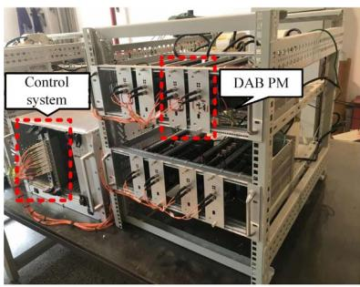

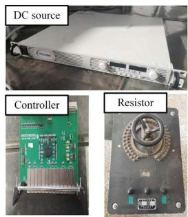  
Fig. 13. Experimental platform setup.

TABLE VI PARAMETERS OF THE SST EXPERIMENTAL PLATFORM   

<table><tr><td>Symbols</td><td>Items</td><td>Values</td></tr><tr><td>NDAB</td><td>Number of DAB PMs</td><td>3</td></tr><tr><td>VH</td><td>Input DC voltage</td><td>150 V</td></tr><tr><td>VL</td><td>Output DC voltage</td><td>50 V</td></tr><tr><td>fS</td><td>Switching frequency</td><td>5 kHz</td></tr><tr><td>k</td><td>Transformer ratio</td><td>1</td></tr><tr><td>CIN</td><td>Capacitance of input-side of DAB</td><td>6.56 mF</td></tr><tr><td>COUT</td><td>Capacitance of output-side of DAB</td><td>6.56 mF</td></tr><tr><td>Ltr</td><td>Stray inductance of the transformer</td><td>62.5 μH</td></tr><tr><td>Rs1</td><td>Primary winding resistance</td><td>0.1 Ω</td></tr><tr><td>Rs2</td><td>Secondary winding resistance</td><td>0.1 Ω</td></tr></table>

frequency range is from 1 to 10 kHz. The results show that the computation time of the EM1 does not change with frequency, but the computation time of the DM increases significantly. Although there is an MMC and the control system reduces the speedup factor of EM1 comparing with the independent HFL, the factors of EM1 still maintain at a higher level over 10.

# D. Benefits of the Proposed Model

Compared with the existing models of the SSTs mentioned in Section I, especially the decoupled EM in [24], the proposed EMT EM has the following advantages.

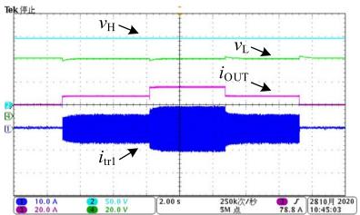

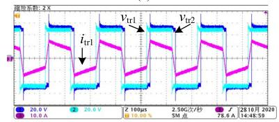  
  
(b)

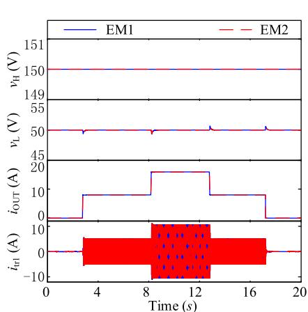  
（c）

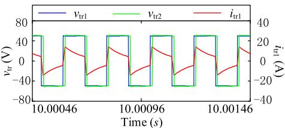  
@

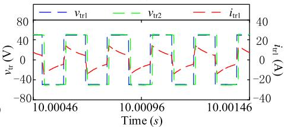  
  
Fig. 14. Waveforms from the simulation and experiment. (a) Whole experiment waveforms. (b) Zoomed-in experiment waveforms. (c) Whole simulation waveforms of EM1 and EM2. (d) Zoomed-in simulation waveforms of EM1. (e) Zoomed-in simulation waveforms of EM2.

TABLE VII COMPARISON OF THE SIMULATION AND EXPERIMENT   

<table><tr><td>Transferred Power (W)</td><td>Items</td><td>Experiment results</td><td>Simulation results of EM1</td><td>Relative error of EM1 (%)</td><td>Simulation results of EM2</td><td>Relative error of EM2(%)</td></tr><tr><td>0</td><td>\( v_L \)</td><td>50.0V</td><td>50.2V</td><td>0.10</td><td>50.2V</td><td>0.10</td></tr><tr><td rowspan="3">400</td><td>\( v_L \)</td><td>50.0V</td><td>50.1V</td><td>0.20</td><td>50.4V</td><td>0.80</td></tr><tr><td>\( i_{out} \)</td><td>8.1A</td><td>8.0A</td><td>1.23</td><td>7.9A</td><td>2.64</td></tr><tr><td>Peak of \( i_{tr1} \)</td><td>5.9A</td><td>5.7A</td><td>3.39</td><td>5.6A</td><td>5.08</td></tr><tr><td rowspan="3">800</td><td>\( v_L \)</td><td>50.1V</td><td>50.2V</td><td>2.00</td><td>50.3V</td><td>3.99</td></tr><tr><td>\( i_{out} \)</td><td>16.2A</td><td>16.0A</td><td>1.25</td><td>15.8A</td><td>2.46</td></tr><tr><td>Peak of \( i_{tr1} \)</td><td>12.0A</td><td>11.8A</td><td>1.67</td><td>11.6A</td><td>3.33</td></tr></table>

1) Using the conversion of the port equation parameters in Section II and the preprocessing of the nodal admittance equation in Section III, the SST equivalent circuits can be directly obtained through simple multiplication and addition of the constants in (2) and (23). It avoids the multiplication and inversion of high-order matrices and, therefore, effectively accelerates the calculation speed.   
2) The equivalent modeling process does not involve approximations. It achieves a high accuracy under different conditions compared with the DM. Moreover, the internal information can be accurately updated using (1) and (25) once the external information is obtained.   
3) The accelerated modeling method is applicable to other types of SST PMs and connection configurations, even considering the transformer saturation.   
4) The modeling method has good parallelism and can easily realize multithreaded parallel simulation and real-time simulation.

It should be mentioned that the above benefits are achieved by conducting the formula derivation and code programming in advance. However, as long as the converter topology is determined, these tasks only need to be performed once.

# VI. EXPERIMENTAL VALIDATION

To validate the proposed accelerated equivalent modeling method, a scale-down SST system in [33] is used to compare with the simulation results.

Fig. 13 shows the setup of the experimental platform. The parameters are given in Table VI. The SST system consists of a 150-V dc source, four DAB PMs (one of them is used

as a redundant module), a control system, and a variable load resistor. The corresponding EMs of EM1 and EM2 are also developed in PSCAD/EMTDC using the same parameters.

The control system is built on the PowerPC P2020+FPGA_ 6SL X45 and adopts the SPS method to keep the output voltage at 50 V. The power stepped up from 0 to 400 W first and then to 800 W, then stepped down from 800 to 400 W, and then to 0 by switching the load resistor.

Fig. 14 and Table VII show the simulation and experiment results of EM1 and EM2. The external information for the converter, such as the input and output dc voltages $\upsilon _ { \mathrm { H } }$ and $\upsilon _ { \mathrm { L } }$ , output current iOUT, and the internal information in each PMs, such as the high-frequency voltages and currents $\upsilon _ { \mathrm { t r } 1 }$ , $\upsilon _ { \mathrm { t r } 2 }$ , and $i _ { \mathrm { t r 1 } }$ , are all included. Note that, the units of the experimental waveforms are displayed at the bottom of the subplots.

Under different conditions, the simulation waveforms match very well with the experimental results with a relative error less than 4%. The results show that the relative errors of all waveforms of EM1 are smaller than EM2, which is consistent with the theoretical analysis and the simulation results in Section V-B. The results also show that the proposed EM has very high accuracy and can meet the requirement of simulating the internal and external performances of the SST systems.

# VII. CONCLUSION

This article proposes an accelerated EMT EM of MMC-based SSTs. The proposed method develops the equivalent circuit of the HFL containing only four external terminals by eliminating all internal nodes. Moreover, the port parameters of the HFL are calculated through the preprocessing of the

nodal admittance equation and the conversion of short-circuit admittance parameters.

The simulation results show that, with more than 50 PMs, the accelerated EM (EM1) is two orders of magnitude faster than the fully DM and is also about 1.5 times more efficient than the EM (EM2) based on the existing algorithms. Under low frequency as 1 kHz, EM1 and EM2 both show high accuracy with the average value of maximum relative errors (AMEs) below 2.2%. Due to the complex coupling of MMC, the applicability of EM2 will be limited under a higher frequency of 10 kHz. However, the proposed EM1 still maintains the AME at a low level of 6.6%. Moreover, a scale-down SST experimental platform is built to verify the simulation results. The comparisons show that EM1 matches very well with the experimental results with a relative error less than 4%.

In addition, this proposed method is applicable to the equivalent modeling of other SST PMs and connection configurations. Therefore, the proposed accelerated equivalent modeling method is significant for the EMT simulation of SSTs.

# REFERENCES

[1] J. E. Huber and J. W. Kolar, “Solid-state transformers: On the origins and evolution of key concepts,” IEEE Ind. Electron. Mag., vol. 10, no. 3, pp. 19–28, Sep. 2016.   
[2] A. Q. Huang, “Medium-voltage solid-state transformer: Technology for a smarter and resilient grid,” IEEE Ind. Electron. Mag., vol. 10, no. 3, pp. 29–42, Sep. 2016.   
[3] L. F. Costa, G. D. Carne, G. Buticchi, and M. Liserre, “The smart transformer: A solid-state transformer tailored to provide ancillary services to the distribution grid,” IEEE Power Electron. Mag., vol. 4, no. 2, pp. 56–67, Jun. 2017.   
[4] X. She, A. Q. Huang, and R. Burgos, “Review of solid-state transformer technologies and their application in power distribution systems,” IEEE J. Emerg. Sel. Topics Power Electron., vol. 1, no. 3, pp. 186–198, Sep. 2013.   
[5] J. E. Huber and J. W. Kolar, “Applicability of solid-state transformers in today’s and future distribution grids,” IEEE Trans. Smart Grid, vol. 10, no. 1, pp. 317–326, Jan. 2019.   
[6] C. D. Townsend, Y. Yu, G. Konstantinou, and V. G. Agelidis, “Cascaded H-bridge multilevel PV topology for alleviation of per-phase power imbalances and reduction of second harmonic voltage ripple,” IEEE Trans. Power Electron., vol. 31, no. 8, pp. 5574–5586, Aug. 2016.   
[7] T. Liu et al., “Design and implementation of high efficiency control scheme of dual active bridge based 10 kV/1 MW solid state transformer for PV application,” IEEE Trans. Power Electron., vol. 34, no. 5, pp. 4223–4238, May 2019.   
[8] B. Zhao, Q. Song, J. Li, X. Xu, and W. Liu, “Comparative analysis of multilevel-high-frequency-link and multilevel-DC-link DC-DC transformers based on MMC and dual-active bridge for MVDC application,” IEEE Trans. Power Electron., vol. 33, no. 3, pp. 2035–2049, Mar. 2018.   
[9] L. F. Costa, F. Hoffmann, G. Buticchi, and M. Liserre, “Comparative analysis of multiple active bridge converters configurations in modular smart transformer,” IEEE Trans. Ind. Electron., vol. 66, no. 1, pp. 191–202, Jan. 2019.   
[10] C. Zhao et al., “Power electronic traction transformer—Medium voltage prototype,” IEEE Trans. Ind. Electron., vol. 61, no. 7, pp. 3257–3268, Jul. 2014.   
[11] L. H. S. C. Barreto, D. de A. Honorio, D. de Souza Oliveira, and P. P. Praca, “An interleaved-stage AC–DC modular cascaded multilevel converter as a solution for MV railway applications,” IEEE Trans. Ind. Electron., vol. 65, no. 4, pp. 3008–3016, Apr. 2018.   
[12] A. J. B. Bottion and I. Barbi, “Input-series and output-series connected modular output capacitor full-bridge PWM DC–DC converter,” IEEE Trans. Ind. Electron., vol. 62, no. 10, pp. 6213–6221, Oct. 2015.   
[13] F. Ruiz, M. A. Perez, J. R. Espinosa, T. Gajowik, S. Stynski, and M. Malinowski, “Surveying solid-state transformer structures and controls: Providing highly efficient and controllable power flow in distribution grids,” IEEE Ind. Electron. Mag., vol. 14, no. 1, pp. 56–70, Mar. 2020.

[14] F. Gao et al., “Prototype of smart energy router for distribution DC grid,” in Proc. 17th Eur. Conf. Power Electron. Appl. (EPE ECCE-Eur.), Geneva, Switzerland, Sep. 2015, pp. 1–9.   
[15] A. M. Gole et al., “Guidelines for modeling power electronics in electric power engineering applications,” IEEE Trans. Power Del., vol. 12, no. 1, pp. 505–514, Jan. 1997.   
[16] N. Watson and J. Arrillaga, Power Systems Electromagnetic Transients Simulation. Lucknow, India: Institute of Engineering and Technology, 2003, p. 448.   
[17] J. Peralta et al., “Detailed and averaged models for a 401-level MMC–HVDC system,” IEEE Trans. Power Del., vol. 27, no. 3, pp. 1501–1508, Jul. 2012.   
[18] G. P. Adam and B. W. Williams, “Half- and full-bridge modular multilevel converter models for simulations of full-scale HVDC links and multiterminal DC grids,” IEEE J. Emerg. Sel. Topics Power Electron., vol. 2, no. 4, pp. 1089–1108, Dec. 2014.   
[19] J. Xu, Y. Zhao, C. Zhao, and H. Ding, “Unified high-speed EMT equivalent and implementation method of MMCs with single-port submodules,” IEEE Trans. Power Del., vol. 34, no. 1, pp. 42–52, Feb. 2019.   
[20] J. Xu, S. Fan, C. Zhao, and A. M. Gole, “High-speed EMT modeling of MMCs with arbitrary multiport submodule structures using generalized Norton equivalents,” IEEE Trans. Power Del., vol. 33, no. 3, pp. 1299–1307, Jun. 2018.   
[21] R. Yin, M. Shi, W. Hu, J. Guo, P. Hu, and Y. Wang, “An accelerated model of modular isolated DC/DC converter used in offshore DC wind farm,” IEEE Trans. Power Electron., vol. 34, no. 4, pp. 3150–3163, Apr. 2019.   
[22] T. Zhao et al., “An average model of solid state transformer for dynamic system simulation,” in Proc. IEEE Power Energy Soc. Gen. Meeting, Calgary, AB, USA, Jul. 2009, pp. 1–8.   
[23] S. Ouyang et al., “The average model of a three-phase three-stage power electronic transformer,” in Proc. Int. Power Electron. Conf. (IPEC-Hiroshima-ECCE ASIA), Hiroshima, Japan, 2014, pp. 2815–2820.   
[24] J. Xu et al., “High-speed electromagnetic transient (EMT) equivalent modelling of power electronic transformers,” IEEE Trans. Power Del., vol. 36, no. 2, pp. 975–986, Apr. 2021.   
[25] N. Balabanian et al., Electrical Network Theory. New York, NY, USA: Wiley, 1969.   
[26] C. Gao, M. Feng, J. Ding, J. Xu, and C. Zhao, “Enhanced equivalent model of MMC-based power electronic transformer,” in Proc. 4th Int. Conf. HVDC (HVDC), Xi’an, China, Nov. 2020, pp. 628–633.   
[27] PSCAD X4 User’s Guide, Manitoba Res. Center, Winnipeg, MB, Canada, 2009.   
[28] K. Strunz and E. Carlson, “Nested fast and simultaneous solution for time-domain simulation of integrative power-electric and electronic systems,” IEEE Trans. Power Del., vol. 22, no. 1, pp. 277–287, Jan. 2007.   
[29] B. Shi, Z. Zhao, and Y. Zhu, “Piecewise analytical transient model for power switching device commutation unit,” IEEE Trans. Power Electron., vol. 34, no. 6, pp. 5720–5736, Jun. 2019.   
[30] M. Salimi, A. M. Gole, and R. P. Jayasinghe, “Improvement of transformer saturation modeling for electromagnetic transient programs,” in Proc. Int. Conf. Power Syst. Transients (IPST), Vancouver, BC, Canada, 2013, pp. 1–6.   
[31] J. Xu, H. Ding, S. Fan, A. M. Gole, and C. Zhao, “Enhanced high-speed electromagnetic transient simulation of MMC-MTdc grid,” Int. J. Electr. Power Energy Syst., vol. 83, pp. 7–14, Dec. 2016.   
[32] F. An, B. Zhao, J. Wang, B. Cui, Q. Song, and T. Xiong, “An adaptive control method of DC transformers imitating AC transformers for flexible DC distribution application,” in Proc. IEEE Appl. Power Electron. Conf. Expo. (APEC), New Orleans, LA, USA, Mar. 2020, pp. 332–337.   
[33] H. Zhang et al., “Model predictive control of input-series outputparallel dual active bridge converters based DC transformer,” IET Power Electron., vol. 13, no. 6, pp. 1144–1152, May 2020.

Chenxiang Gao (Student Member, IEEE) was born in Shanxi, China. He received the B.S. degree in power system and its automation from North China Electric Power University (NCEPU), Beijing, China, in 2019, where he is currently pursuing the master’s degree.

His research interests include the electromagnetic transient (EMT) equivalent modeling of modular multilevel converter (MMC)-HVdc and solid-state transformers (SST) in dc grid.

Moke Feng (Graduate Student Member, IEEE) was born in Sichuan, China. He received the B.S. degree in power system and automation from North China Electric Power University (NCEPU), Beijing, China, in 2017, where he is currently pursuing the Ph.D. degree.

His research interests include HVdc systems and electromagnetic transient (EMT) modeling of power electronic converters.

Chengyong Zhao (Senior Member, IEEE) was born in Zhejiang, China. He received the B.S., M.S., and Ph.D. degrees in power system and its automation from North China Electric Power University (NCEPU), Beijing, China, in 1988, 1993, and 2001, respectively.

He was a Visiting Professor at the University of Manitoba, Winnipeg, MB, Canada, from January 2013 to April 2013 and September 2016 to October 2016. He is currently a Professor at the School of Electrical and Electronic Engineering,

NCEPU. His research interests include HVdc systems and dc grid.

Jiangping Ding was born in Jiangxi, China. She received the B.S. degree in power systems and its automation and the master’s degree in electrical engineering from North China Electric Power University, Beijing, China, in 2018 and 2021, respectively.

In July 2021, she joined Guangzhou Power Supply Bureau Company Ltd., Guangzhou, China, as an Engineer.

Hang Zhang was born in Hebei, China, in 1991. He received the B.S. degree in electrical engineering from Shijiazhuang Railway University, Shaoxing, China, in 2015, and the Ph.D. degree in power electronics and power drives from the Institute of Electrical Engineering, Chinese Academy of Sciences, Beijing, China, in 2020.

Since 2020, he has been with the Key Laboratory of Power Electronics and Electric Drive, Institute of Electrical Engineering, Chinese Academy of Sciences, where he is currently an Assistant Research

Fellow. His research interests include circuit topology, analysis, and control of high-power electronic converters, especially its applications in high- or medium-voltage direct current fields.

Jianzhong Xu (Senior Member, IEEE) was born in Shanxi, China. He received the B.S. and Ph.D. degrees from North China Electric Power University (NCEPU), Beijing, China, in 2009 and 2014, respectively.

From 2012 to 2013 and 2016 to 2017, he was a Visiting Ph.D. Student and a Post-Doctoral Fellow at the University of Manitoba, Winnipeg, MB, Canada. He is currently an Associate Professor and a Ph.D. Supervisor with the State Key Laboratory of Alternate Electrical Power System with Renewable

Energy Sources, NCEPU. He has published 24 IEEE transaction/journal articles and four of them are “Scopus Top 1% highly cited paper.” He is now working on the electromagnetic transient (EMT) equivalent modeling, fault analysis, and protection of HVdc grids.

Dr. Xu also serves as a reviewer for ten IEEE/IET journals and nine Chinese journals. He is also an Associate Editor of the CSEE Journal of Power and Energy Systems.

Zixin Li (Senior Member, IEEE) was born in Hebei, China, in 1981. He received the B.Eng. degree in industry automation from the North China University of Technology, Beijing, China, in 2005, and the Ph.D. degree (Hons.) in power electronics and electric drives from the Institute of Electrical Engineering, Chinese Academy of Sciences, Beijing, in 2010.

Since 2010, he has been with the Institute of Electrical Engineering, Chinese Academy of Sciences, where he is currently a Professor. He is also a Post

Professor with the University of Chinese Academy of Sciences, Beijing. He has authored or coauthored more than 100 academic articles and holds more than 20 invention patents in China. His research interests include circuit topology, modulation, control, and analysis of power converters, especially multilevel converters in high-power fields.

Dr. Li was selected as a fellow of the Institution of Engineering and Technology (FIET) in 2019. He was a recipient of the IEEE Power Electronics Society Richard M. Bass Outstanding Young Power Electronics Engineer Award in 2015 for his contributions to multilevel and HVdc converters. He is also an Associate Editor of the IEEE TRANSACTIONS ON POWER ELECTRONICS, the IET High Voltage, and the Journal of Power Electronics.

Gen Li (Member, IEEE) received the B.Eng. degree in electrical engineering from Northeast Electric Power University, Jilin, China, in 2011, the M.Sc. degree in power engineering from Nanyang Technological University, Singapore, in 2013, and the Ph.D. degree in electrical engineering from Cardiff University, Cardiff, U.K., in 2018.

From 2013 to 2016, he was a Marie Curie Early-Stage Research Fellow funded by the European Commission’s MEDOW project. He has been a Visiting Researcher at the China Electric Power

Research Institute and the Global Energy Interconnection Research Institute, Beijing, China; Elia, Brussels, Belgium; and Toshiba International (Europe), London, U.K. He has been a Research Associate at the School of Engineering, Cardiff University, Cardiff, U.K., since 2017. His research interests include control and protection of HVdc and medium-voltage direct current (MVdc) technologies, power electronics, reliability modeling, and evaluation of power electronics systems.

Dr. Li is an Editorial Board Member of CIGRE Electra. His Ph.D. thesis received the First CIGRE Thesis Award in 2018. He is the Vice-Chair of IEEE PES Young Professionals and the Technical Panel Sectary of CIGRE B5 Protection and Automation. He is a Chartered Engineer in U.K. He is also an Associate Editor of the CSEE Journal of Power and Energy Systems.