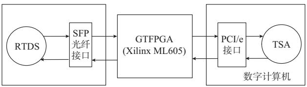
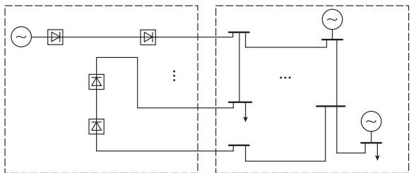
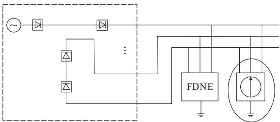
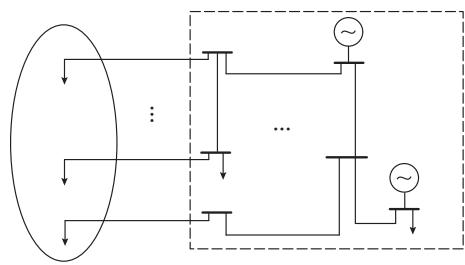
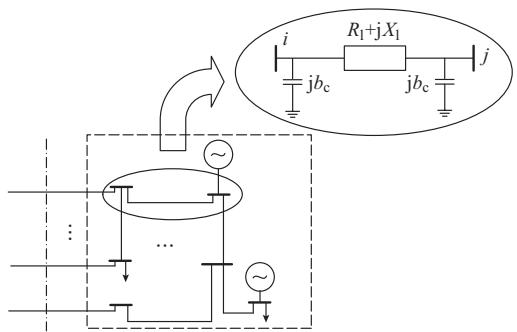
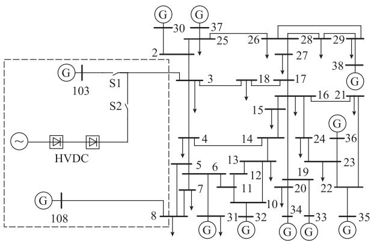
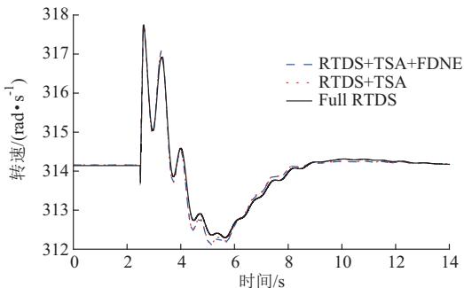
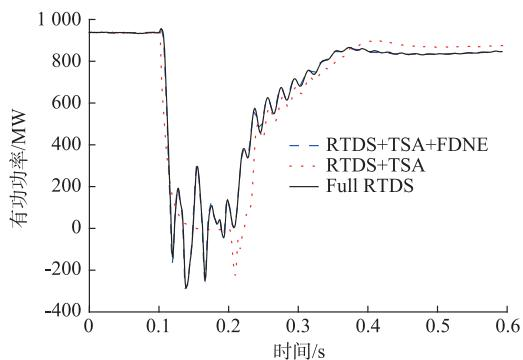

# 采用频率相关网络等值的 RTDSGTSA异构混合仿真平台开发

胡一中1,2,吴文传1,2,张伯明1,2

( 清华大学电机工程与应用电子技术系,北京市 ;

电力系统及发电设备控制和仿真国家重点实验室 清华大学 北京市

摘要:大规模交直流混联电网的仿真,既需要考虑直流部分仿真的精细性,也要兼顾整体的仿真效率.因此文中将实时数字仿真器( )和机电暂态稳定分析( )程序结合在一起提出一种异构的 实时混合仿真平台.该平台采用 板卡作为两者间高速数字化通信接口,同时实现了频率相关网络等值( )以提高仿真精度.通过一个由新英格兰 节点系统更改而来的含直流线路的测试系统,验证了所开发平台的正确性.

关键词:混合仿真;电磁暂态仿真;暂态稳定分析;频率相关网络等值;实时数字仿真器

# 0 引言

近年来,高压直流( ,)输电线路已逐渐成为一些电网重要组成部分 使得这些电网由传统的大规模交流电网演变成为大规模交直流混联电网.其中非常典型的就是中国南方电网 它的 西电东送走廊 目前已包含八回交流 五回 直流和两回直流线路[1].针对这样的电网,孤立地分别仿真直流部分与交流部分是不恰当的 必须考虑它们之间的互相影响 即大规模交直流混联电网的仿真是客观存在的一个问题,而目前仍缺乏一种受到广泛认可的仿真工具.

实时数字仿真器( ,)作 为 一 种 电 磁 暂 态 (仿真工具 由于其具有实时仿真硬件闭环( , )[2]等优点,在国内外直流输电研究方面得到了广泛应用.通过在中用精细的电磁暂态模型对直流系统建模可以方便地仿真、观测直流设备中的电磁暂态过程;通过 外接实际的直流控制 保护设备 可以有效地测试这些设备 但 是一个并行计算平台,随着仿真系统规模的增大,所需的硬件规模以 作为硬件基本单位 个 是一个包含若干计算板卡的机柜[2] 几乎以线性方式增加[3]每个 的价格昂贵 且 存在建模周期长

难以调节大规模仿真系统工况的问题 交流网络仿真得到的精细电磁暂态过程必要性也不大.由此可见 将大规模交直流混联电网都在 中建模是不经济且不可持续的

传统的机电暂态稳定分析(, )程序采用机电暂态模型并基于相量运算,在大规模交流电网仿真中得到广泛应用,例如研究发电机功角稳定 但由于 程序无法对直流线路中的电力电子器件建模 因此不能精确仿真大规模交直流混联电网中的直流部分

综合 和 程序各自的优缺点 一个自然的想法就是开发 实时混合仿真平台 在 中精细地仿真直流部分而在 程序中高效地仿真交流部分 从而实现对大规模交直流混联电网的仿真

文献 是这一想法的早期工作 提出了一种基于数字计算机和 的实时混合仿真平台 利用 的模拟量输出 通过模数转换作为两者的通信接口,同时采用预估补偿的接口技术.但本身作为数字仿真器,采用模拟量输出再经模数转换变为数字量,通信时延大且精度不易得到保证 预估补偿技术是一种工程化的应用 并非普适技术 文献 提出了一种用 仿真大规模电网 的 方 案,用 频 率 相 关 网 络 等 值 (dependent network equivalent,FDNE)结合简化的模块,对不需要细致仿真的交流部分作等值,从而大大缩减电网规模 文献 在此基础上又运用同调等值方法 减少待等值交流部分的发电机数目 但这类方法将整个交流网络作等值 彻底忽略了交流部分内部信息 且 模块是内嵌在中实现,不利于扩展.

针对上述问题 本文采用 公司最新的[8]板卡作为 与 程序之间高速数字化通信接口 同时实现了 [9G13]以提高仿真精度,开发了一种异构的 实时混合仿真平台.与由中国电力科学研究院研发的电力系统实时仿真装置 [14G16]相比,本文提出的仿真平台有着两点明显区别 是基于同一数字计算机的同构平台,而本文采用 板卡实现了 与基于计算机的 互联 实现了一种异构的平台 本文引入了一种网络宽频等值技术提高了混合仿真精度

基于一个由新英格兰 节点系统更改而来的含直流线路的测试系统 本文所提仿真平台的正确性得到了验证

# 1 仿真平台架构

本文所提 混合仿真平台的硬件架构如图 所示 与运行着 程序的数字计算机通过一块 板卡相连.板卡作为高速数字化通信接口

  
图1 混合仿真平台硬件架构   
Fi．1 Hardwareframeworkofhbrid simulationplatform

其实是一块 通用开发板卡 如附录 图 所示 更多关于板卡本身的技术细节参阅文献 在本文的工作中 用到了板卡上的两个接口 光纤接口和接口 前者通过光纤可以连接到 的计算板卡上,而后者可以直接插在数字计算机主板的/ 插槽上.

除了硬件连接 通信接口的实现还需要通信协议 与 之间的数据交互基于一个由RTDS公司开发的协议RTDSInterfaceModule;而 和数字计算机之间的通信则采用一个用户自定义的 基于 标准的协议

附录 图 是本文所开发的 混合仿真平台实物图

# 2 网络等值策略

混合仿真需要考虑机电 电磁仿真网络的等值以及 和 程序间的数据交互策略.以在

中仿真的部分系统为例 除了精细地建立起直流网络的模型之外 还需要建立交流网络的等值模型.并且等值模型的某些参数应该依据 程序的计算结果不断更新.这样,才能够在充分考虑交流系统影响的前提下独立地仿真直流系统.在程序中的仿真模型也是如此.

本文所提 混合仿真平台的网络等值策略如图 所示 该策略展示了如何通过混合仿真的方式来仿真交直流混联系统(见图 ()).从图 中可以看到 在 中 见图 采用一个 和等效电流源作为交流部分的网络等值模型;在 程序中(见图 ()),采用等效负荷作为直流部分的网络等值模型 并且等效电流源和等效负荷的数值大小会在每一次 和 程序的数据交互时更新

  
(a) -35

  
(b) 
RTDS-,G35

  
(c) 
TSA0-,G35   
图2 仿真平台所采用的网络等值策略  
Fig．2 Equivalentstrategyofsimulation networkmodel

交流部分在 中的等值策略类似于诺顿等值 唯一的区别在于用 替代了传统的节点导纳矩阵 这是因为节点导纳矩阵是在系统基频下形成的,只能描述网络在基频下的特性,而可以描述网络的宽频特性,为谐波提供通道.

直流部分在 程序中的等值策略源于一个简单的想法 即直流网络主要通过有功功率注入的方式影响交流网络的机电振荡过程[6] 所以本文采用了由文献[]提出的一种基于能量平衡的等值负荷方法.根据直流系统在接口处注入的有功功率,设立一个具有相同有功功率的恒电流负荷,作为直流系统的网络等值

需要说明的是 没有必要一定要求在 中详细建模的系统必须是纯直流网络,可以把一部分关键的交流网络也放到 上详细建模

# 3 FDNE实现

[6G7,17G18]可以看做是一种特殊的节点导纳矩阵Y s 只不过它的每个元素都是频率的函数在数学上可以表示为

$$
\mathbf {Y} (s) = \left[ \begin{array}{c c c c} y _ {1 1} (s) & y _ {1 2} (s) & \dots & y _ {1 N} (s) \\ y _ {2 1} (s) & y _ {2 2} (s) & \dots & y _ {2 N} (s) \\ \vdots & \vdots & & \vdots \\ y _ {N 1} (s) & y _ {N 2} (s) & \dots & y _ {N N} (s) \end{array} \right] \tag {1}
$$

式中 $\scriptstyle : s = \mathrm { j } 2 \pi f , f$ 为频率;N 为端口数.

用于在一个较宽的频率范围内 本文选择 )描述交流网络的特性,所以Y(s)应该和原始网络在该频率范围内有着相同的频率特性注意到 $, \pmb { Y } ( s )$ 在 下的频率特性就是节点导纳矩阵).为了方便在程序中实现,每个元素 y(s)可以用如下的有理多项式拟合

$$
y (s) = \sum_ {i = 1} ^ {n} \frac {c _ {i}}{s - a _ {i}} + d + s h \tag {2}
$$

式中: ${ \bf \Phi } ; a _ { i } , c _ { i } , d , h$ 为待确定参数;n 为模型阶数.

为了将 应用到混合仿真平台中 需要求得每个元素中的未知参数,然后在 中实现.下面叙述具体的步骤

# 获取采样值

本文通过拟合的方式求解 每个元素的未知参数 所以首先要获取原始交流网络的频率特性采样值

本文采用一种基于简化模型的网络频率特性求取方法[18] 思路很简单 以图 所示的一条连接母线 i 和j 的传输线为例 采用 模型描述 线路电抗$X _ { 1 }$ 和充电电纳 $b _ { \textrm { c } }$ 是频率相关的， $R _ { 1 }$ 为线路电阻。在某个特定的采样频率下 这条传输线的线路导纳矩阵可以得到 类似地 变压器采用由理想变比和漏阻抗组成的简化模型,发电机采用由电压源和次暂态电抗组成的简化模型 负荷采用阻抗 电流 功率 简化模型 这样 在某个采样频率下 可以得到整个交流网络的节点导纳矩阵 再向边界作网

络收缩 即可得到原始交流网络频率特性的一个采样值 重复上述步骤即可完成所有采样值的获取

  
图3 基于简化模型的网络频率特性求取方法  
Fig．3 Simplifiedmodelbasedmethodfor obtainingnetworkfrequencycharateristics

# 矢量拟合法生成

在有了原始交流网络的频率特性采样值基础上,可以通过矢量拟合法生成 [9G11].该方法的核心思想是在Y s 和采样值最接近的意义下 构建线性最小二乘问题 求解得到每个元素中的未知参数.具体的步骤和原理可以参见文献[ ].

# 无源性校正

与节点导纳矩阵有着相同的物理含义就要求 在所关心频段下都是无源的.所谓无源 就是只消耗能量而不发出能量 因此 还需要对 进行无源性校正以保证仿真的稳定性.本文采用一种基于摄动留数矩阵特征根的快速无源性校正方法[12G13] 该方法的核心思想是在尽可能不改变Y s 的频率响应的前提下 摄动某些参数 使得Y s 在所关心频段内都是无源的 具体的步骤和原理可以参见文献

# ) 中的实现

一旦上 述 步 骤 完 成 可 以 得 到 如 下 形 式 的$\pmb { Y } ( s )$

$$
\mathbf {Y} (s) = \mathbf {C} (s \mathbf {E} - \mathbf {A}) ^ {- 1} \mathbf {B} + \mathbf {D} \tag {3}
$$

式中 E 为单位矩阵 A B C D 为已知的系数矩阵.

注意到 $\pmb { Y } ( s )$ 本质是电流和电压的传递函数

$$
\mathbf {Y} (s) = \frac {\mathbf {I} (s)}{\mathbf {U} (s)} \tag {4}
$$

根据式()和式(),引入状态变量 x,即可在时域上建立起关于注入电流 I 和节点电压 U 的状态空间方程

$$
\left\{ \begin{array}{l} \dot {\boldsymbol {x}} = \boldsymbol {A} \boldsymbol {x} + \boldsymbol {B} \boldsymbol {U} \\ \boldsymbol {I} = \boldsymbol {C} \boldsymbol {x} + \boldsymbol {D} \boldsymbol {U} \end{array} \right. \tag {5}
$$

通过隐式梯形积分法则进行差分 得到离散时间形式的方程:

$$
\left\{ \begin{array}{l} \boldsymbol {X} (t) = \boldsymbol {\alpha} \boldsymbol {x} (t - \Delta t) + \boldsymbol {\lambda} \boldsymbol {U} (t - \Delta t) + \boldsymbol {\lambda} \boldsymbol {U} (t) \\ \boldsymbol {I} (t) = \boldsymbol {C x} (t) + \boldsymbol {D U} (t) \end{array} \right. \tag {6}
$$

$$
\boldsymbol {\alpha} = \left(\boldsymbol {E} - \frac {\Delta t}{2} \boldsymbol {A}\right) ^ {- 1} \left(\boldsymbol {E} + \frac {\Delta t}{2} \boldsymbol {A}\right) \tag {7}
$$

$$
\boldsymbol {\lambda} = \frac {\Delta t}{2} \left(\boldsymbol {E} - \frac {\Delta t}{2} \boldsymbol {A}\right) ^ {- 1} \boldsymbol {B} \tag {8}
$$

式中:t 为积分步长(也是仿真步长).

把式()的第 个方程代入第 个,得到:

$$
\boldsymbol {I} (t) = \boldsymbol {I} _ {\text {h i s}} + \boldsymbol {G} _ {\text {e q}} \boldsymbol {U} (t) \tag {9}
$$

$$
\boldsymbol {I} _ {\text {h i s}} = \boldsymbol {C} \boldsymbol {\alpha} \boldsymbol {x} (t - \Delta t) + \boldsymbol {C} \boldsymbol {\lambda} \boldsymbol {U} (t - \Delta t) \tag {10}
$$

$$
\boldsymbol {G} _ {\mathrm {e q}} = \boldsymbol {C} \boldsymbol {\lambda} + \boldsymbol {D} \tag {11}
$$

式 是电磁暂态仿真程序中模型的经典描述形式[19] 也是 提供的用户自定义模型的描述形式 通 过 中 用 户 自 定 义 模 型 工 具,用 语言实现式( )和式( )两式,即可在 中实现 .

# 4 算例分析

本文采用的测试系统由新英格兰 节点系统修改而来 如图 所示 该系统中设计了两个开关和 使得系统能够在纯交流系统和交直流混联系统之间切换 系统中的直流线路及其控制采用自带的模型 当采用本文所提的混合仿真平台仿真该系统时,图 左侧虚线框所包围部分在 中建模 而剩余部分在程序中建模 母线 和母线 作为边界节点 在和 程序中都需要建模.

  
图4 测试系统示意图  
Fig．4 Schematicdiagramoftestsystem

在这一小节的算例分析中 会展示采用 种不同方式仿真得到的结果,包括以下内容: 使用本文所开发的 混合仿真平台 并且采用所 得 仿 真 结 果 标 记 为使用本文所开发的 混合仿真平台 但不采用 而用传统的节点导纳矩阵代

替,所得仿真结果标记为 ; 作为基准 不采用本文所开发的仿真平台 而将整个测试系统在 中建模 所得仿真结果标记为RTDS.

与本文所提平台均为实时仿真平台 故本文算例也都是实时仿真,即消耗时间与物理时间一致 当使用 混合仿真平台仿真测试系统时,只需要 个 的 . 的仿真步长为 , 程序的仿真步长为 .每个 仿真步长 等于一个 程序仿真步长 两者就会进行一次数据交互 根据程序的计算结果刷新图 ()中的等效电流源数值大小 程 序 根 据 的 计 算 结 果 刷 新图 中等效负荷的数值大小

当将整个测试系统都放在 中建模时,采用仿真步长为 需要 个 的 由于测试系统规模相对较小 还是可以把整个系统都在 上建模 清华大学目前一共有 个的 为了通过算例验证本文所提仿真平台的正确性以及采用 带来的精度提升 希望看到的结果是：①RTDS+TSA＋FDNE 和 Ful基本一致 那么说明仿真平台是正确的 以FullRTDS为标准,RTDS＋TSA+FDNE 要明显好于 那么说明 的确能够提升仿真精度.

# 41 纯交流系统仿真

把图 中的 闭合 打开 测试系统成为一个纯交流系统.当一个持续时间为 的三相接地故障发生在边界母线 上时,由上述 种不同方式仿真得到的 号发电机 即连接于母线的发电机 的转速如图 所示

  
图5 仿真纯交流系统时103号发电机转速  
Fig．5 RotorspeedofNo．103generatorwhen simulatin ureACsstem

从 种方式得到的仿真结果中 能够看到 三条曲线总体上非常接近,本文所开发的混合仿真平台的正确性得到初步验证

与 几乎完全一致 似乎 在这个例子中并没有起到任何作用与 还是存在一定的偏差,但可以接受.

在这个纯交流系统的例子中, 之所以没有起到明显作用,是因为由于接地故障引起的系统高频分量在一个周期内( )内就快速衰减了,掩盖了 捕捉网络宽频特性的优势[6]与 程序在算法和模型上都有着本质的区别,所以由混合仿真平台得到的结果与完全由 仿真得到的结果不能完全一致 也是可以理解的

# 42 交直流混联系统仿真

把图 中的 打开 闭合 测试系统成为一个交直流混联系统 当一个持续时间为 的三相接地故障发生在边界母线 上时,由上述 种不同方式仿真得到的直流线路输送有功功率如图所示.

  
图6 仿真交直流混联系统时的直流传输有功功率  
Fig．6 ActivepowerdeliveredbyHVDCwhen simulatingAC/DChybridsystem

从 种方式得到的仿真结果中 能够看到①RTDS+TSA+FDNE 能够很好地与 Full RTDS吻合 本文所提混合仿真平台是正确的和 之间有着明显的差别 尤其是在故障阶段 可见缺少 使得精度明显下降 即是必要的

在交直流混联系统中 由于直流部分电力电子器件不断地开关动作,使得系统高频分量一直存在.此时就非常有必要用 来捕捉交流网络宽频特性.这样就很容易解释为什么用节点导纳矩阵代替 时 精度有明显下降

# 5 结语

为了精确而高效地仿真大规模交直流混联电网 本文开发了一种异构的 实时混合仿真平台 应用最新的 板卡来满足

与 程序间高速数字化通信需求 同时实现了技术来捕捉交流网络宽频特性 提高了仿真精度.

但总体来讲,本文开发的混合仿真平台仍处于初步阶段.若要应用于实际大规模交直流电网仿真,主要存在两个技术挑战.其一, 的引入提升了仿真精度的同时,计算量也明显增加.若是应用于实际电网,需要采用大规模端口的 时,还难以实现实时仿真.其二,当故障发生在 侧时 仿真涉及 的切换与初始化[20] 这仍是个待解决的难题 这两点都是作者目前正在进行的研究课题.

感谢国家电网调度控制中心张怡对本文的建议.感谢加拿大 公司 、梁玥峰在 使用方面所提供的帮助.

附 录 见 本 刊 网 络 版 (htt ://www．aesGinfo/ / / ).

# 参 考 文 献

[]中 国 南 方 电 网 公 司 基 本 情 况 [ / ] :// /gynw/gsjj/201310/t20131021_70288.html.  
[2]KUFFELR，GIESBRECHTJ，MAGUIRE T，et al.RTDS一a fully digital power system simulator operating in real time[C]// ICDS'95 First International Conference on Digital Power System Simulators，April 5-7，1995，Texas，USA   
[3]FORSYTHP,KUFFELR，WIERCKXR，et al.Comparison of transient stability analysis and large-scale real time digital simulation[C]//Proceedings of IEEE Power Tech，September 10-13，2001，Porto，Portugal.   
张树卿 童陆园 薛巍 等 基于数字计算机和 的实时混合仿真 电力系统自动化ZHANG Shuqing，TONG Luyuan，XUE Wei，et al. Digitalcomputer and RTDS based real-time hybrid simulation[J].Automation of Electric Power Systems，20o9，33(18)：61-66.  
王栋 童陆园 洪潮 数字计算机机电暂态与 电磁暂态混合实时仿真系统 电网技术WANG Dong，TONG Luyuan，HONG Chao.Digital computerelectromechanical transient and RTDS electromagnetic transienthybrid real-time simulation system [J]. Power SystemTechnology，2008，32(6)：42-46.  
[6]LINX，GOLE A M,YU M.A wide-band multi-port systemequivalent for real-time digital power system simulators[J].IEEE Trans on Power Systems，2009，24(1)：237-249.  
[7] LIANG Y，LIN X，GOLE A M，et al. Improved coherency based wide-band equivalents for real-time digital simulators[J]. IEEE Trans on Power Systems，2011，26(3)：1410-1417.   
[8] SLODERBECK M，ANDRUS M,LANGSTON J，et al. High speed digital interface for a real-time digital simulator[C]// Proceedings of the 2olo Conference on Grand Challenges in Modeling&.Simulation，July 11-14，201o，Ottawa，Canada.   
[9]GUSTAVSEN B，SEMLYEN A. Rational approximation of

frequency domain responses by vector fiting[J]. IEEE Trans onPower Delivery，1999，14(3)：1052-1061.  
[10]GUSTAVSEN B. Improving the pole relocating properties of vector fitting[J]．IEEE Trans on Power Delivery，2006, ():   
[11]DESCHRIJVER D，MROZOWSKI M，DHAENE T，et al.Macromodelin of multiort sstems usin a fastimplementation of the vector fitting method[J].IEEE Trans onMicrowave and Wireless Components Letters，2oo8，18（6）：383-385.  
[12]GUSTAVSEN B. Fast passivity enforcement for pole-residue models by perturbation of residue matrix eigenvalues[J].IEEE Trans on Power Delivery，2008，23(4)：2278-2285.   
[13] SEMLYEN A，GUSTAVSEN B. A half-size singularity test matrix for fast and reliable passivity assessment of rational models[J].IEEE Trans on Power Delivery，2009，24(1)：345- 351.   
岳程燕 田芳 周孝信 等 电力系统电磁暂态 机电暂态混合仿真接口原理 电网技术YUE Chengyan，TIAN Fang，ZHOU Xiaoxin，et al.Principleofinterfaces forhybridsimulation ofpowersystemelectromagnetic-electromechanical transient process[J].PowerSystem Technology，2006，30(1)：23-27.  
[ ]岳程燕,田芳,周孝信,等 电力系统电磁暂态 机电暂态混合仿真接口实现 电网技术YUE Chengyan， TIAN Fang， ZHOU Xiaoxin， etalImplementation of interfaces for hybrid simulation of powersystem electromagnetic-electromechanical transient process[J].Power System Technology，2006，30(4)：6-10.  
岳程燕 田芳 周孝信 等 电力系统电磁暂态 机电暂态混合仿真的应用 电网技术YUEChengyan， TIAN Fang， ZHOU Xiaoxin， etalApplicationofhybridsimulationofpowersystemelectromagnetic-electromechanical transient process[J].Power

, , ( ):   
[17] ZHANG Y，GOLE A M，WU W，et al.Development and analysis of applicability of a hybrid transient simulation platform combining TSA and EMT elements[J].IEEE Trans on Power Systems，2013，28(1)：357-366.   
[ ]张怡,吴文传,张伯明,等 电磁 机电暂态混合仿真中的频率相关网络等值 中国电机工程学报ZHANG Yi，WU Wenchuan，ZHANG Boming，et al.Frequency dependent network equivalent for electromagneticand electromechanical hybrid simulation[J].Proceedings of theCSEE，2012，32(13)：61-68.  
[19] DOMMEL H W.Digital computer solution of electromagnetic transients in single-and multi-phase networks[J]. IEEE Trans on Power Apparatus and Systems，1969，88(4)：388-399.   
张怡 吴文传 张伯明 等 电磁 机电暂态混合仿真中机电侧故障的仿真方法 中国电机工程学报ZHANG Yi，WU Wenchuan，ZHANG Boming， et al.Simulation method of faults on electromechanical side inelectromagnetic and electromechanical hybrid simulation[J].Proceedings of the CSEE，2012，32(19)：81-88.

(编辑 顾晓荣)

# DevelopmentofaFrequencyDependentNetworkEquivalentBasedRTDSGTSAHybridTransient SimulationPlatformwithHeterogeneousArchitecture

1 2 WU Wenchuan1 2 ZHANG Boming1 2

1敭DeartmentofElectricalEnineerin TsinhuaUniversit Beiin 100084 China

2.State Key Laboratory of Control and Simulation of Power Systems and Generation Equipments, Tsinghua University，Beijing looo84，China)

Abstract:Forthe simulationoflarge-scaleAC/DChybridsystems，boththe precisionoftheDCpartsandtheeficiencyof the whole system should beconsidered.Thusareal-timehybrid transient simulation platform is proposed bycombining the realtime digital simulator(RTDS)and atransient stability analysis（TSA）program.Alatest GTFPGAcardis used torealize the hihseeddiitalcommunicationbetween RTDSandthecom uterdeloin TSA roram敭Moreover thefreuenc dependent network equivalent（FDNE）is implemented in this simulation platform to improve the accuracyof simulation results.By simulating amodified New England 39-bus testsystem incorporating high-voltage direct current（HVDC) components，the validity of the proposed simulation platform is verified.

Thisworkissu ortedb NationalBasicResearchProramofChina 973Proram No敭2013CB228206 andProram for New Century Excellent Talents in University（No. NCET-11-0281).

Key words:hybrid simulation;electromagnetic transient simulation；transient stabilityanalysis；frequencydependent network equivalent；real-time digital simulator