Received 18 November 2024, accepted 14 December 2024, date of publication 23 December 2024, date of current version 30 December 2024.

Digital Object Identifier 10.1109/ACCESS.2024.3521284

# RESEARCH ARTICLE

# A Transient Conducted EM Disturbances Source Modeling Method for Electromagnetic Launch System Based on the Cascaded Multi-Port Circuit Model

BAILIN MOU 1, QI-FENG LIU 1, (Member, IEEE), ZHENYA CHEN1,2, XIAOWEN WU1, YONGMING LI1, CHEN HUANG3, AND HUAI-QING ZHANG 1, (Member, IEEE)

1School of Electrical Engineering, Chongqing University, Chongqing 400044, China   
2State Grid Zhejiang Hangzhou Power Supply Company, Hangzhou 311499, China   
3Science and Technology on EMC Laboratory, China Ship Development and Design Centre, Wuhan 430064, China

Corresponding author: Qi-Feng Liu (liuqifeng@cqu.edu.cn)

This work was supported in part by the Natural Science Foundation of Chongqing, China, under Grant cstc2021ycjh-bgzxm033; and in part by the National Natural Science Foundation of China under Grant 52377002.

ABSTRACT Electromagnetic launch (EML) systems with energy storage units in transient operating states are gradually being applied in modern ships, satellite launches, etc., power switching devices with higher voltage and switching frequency, Additionally, innovative topologies are being developed to enhance the electromagnetic performance of the EML systems. This inevitably leads to significant EMI issues. Therefore, this paper proposes a transient conducted EMI source modeling method for EML systems based on a multi-port equivalent circuit cascade model. Initially, a multi-port transient conducted EMI source model for supercapacitors is developed, taking into account the time-varying load characteristics of supercapacitors during charging and transient high-current discharge characteristics during discharging. Subsequently, a multi-port transient conducted EMI source model of the dual three-phase linear motor has been developed utilizing experimental measurement data. Leveraging the port-to-port cascade characteristics of various devices in the EML system, a dual three-phase dc-ac inverter multi-port conducted EMI model with high-frequency parasitic effects has been developed. A system-level modeling method based on the multi-port equivalent circuit cascade transient conducted EMI source modeling method is developed by cascading the multi-port equivalent circuit models of each functional component for the EML system. To evaluate the accuracy of this system-level modeling method, an experimental setup is constructed to assess transient conducted EM disturbances in a low-power EML system. The time-domain simulation results of the transient operating state are compared and analyzed with the actual operating conditions from the voltage, current, and energy perspectives, further validating the accuracy and efficacy of the EML system conducted EMI source modeling method based on a cascade of multi-port equivalent circuit models, as well as the transient conducted EM disturbances time-domain and frequency-domain characteristics.

INDEX TERMS Transient conducted EM disturbances, multi-port equivalent circuit, electromagnetic launch system.

# I. INTRODUCTION

Electromagnetic launch systems (EML) are a type of equipment that use electromagnetic force (EMF) generated

The associate editor coordinating the review of this manuscript and D approving it for publication was Mohamed Kheir

by pulse power generation equipment to propel the load to a high initial velocity. Essentially, they are energy conversion equipment that converts electrical energy into kinetic energy to launch the load [1], [2], [3], [4], [5]. The EML system utilizes a supercapacitor energy storage device to achieve launch through an instantaneous high-power linear motor.

It primarily consists of the energy storage subsystem, the electromagnetic propulsion subsystem, and the control and maintenance subsystem. The high-power energy transmission from the electrical energy conversion devices in this system increases both the power switching frequency and voltage level. Consequently, this can significantly impact the external power supply grid, resulting in serious conducted EMI problems [5]. Consequently, this impacts the safe and stable operation of equipment on the platform.

Currently, scholars and research institutions are primarily focused on the electromagnetic compatibility (EMC) of EML systems. Their primary focus is on the characteristics of wideband electromagnetic radiation through experimental measurements [6]. This research is carried out through both experimental measurements [7], [8], [9] and simulation modeling methods [10], [11], [12], [13], [14], [15], [16]. Considering the need for conducted EM disturbances in EML systems, and the electrical energy conversion device generates high du/dt and di/dt during the turn-on and turn-off processes, special attention must be paid to its EMI characteristics. The EMI sources modeling methods mainly can be divided into: frequency-domain and timedomain methods. The frequency-domain modeling method is used to establish the equivalent circuit model of differential mode (DM) and common mode (CM) interference [17]. This method facilitates the direct acquisition of its conducted EM disturbances spectrum. Therefore, it has been more widely used in the EMC literature. Previously, frequencydomain modeling was primarily focused on IGBT modules, cables, and converter modules in the device [18]. However, in practice, it is essential to predict the conducted EMI source generated by the electromagnetic propulsion system as a whole. To address this, an experimental measurement method for the EMI source was proposed [19], but no system-level EMI prediction model was established based on the measurement results.

On this basis, to accurately achieve prediction of conducted EMI source of electromagnetic devices or systems, and to propose simulation models to support the assessment of equipment compliance, several researchers have investigated frequency-domain equivalent circuit model and have proposed a two-port network model based on measurement data [20], a ‘‘black box’’ model [21], a linear equivalent-Thevenin circuit [22], and direct correlations with various distribution parameters [23], which can predict the conducted EM disturbances characteristics of the system in the frequency range of 100 kHz to 100 MHz.

Compared with the frequency-domain modeling, the time-domain method has higher simulation accuracy. Wang et al. [24] established the time-domain circuit model for each component to predict the overall conducted EM disturbances of the device. Additionally, based on the mechanisms of conducted EMI source generation in medium-voltage dc traffic electrification systems, a frequency-dependent timedomain transmission line model was established [25], which effectively improves the simulation accuracy.

However, given that EM disturbances signal crosspropagate between devices, it is critical to analyze and model the mechanisms of conducted EMI from a system perspective. Therefore, Yang et al. investigated the mechanisms of EM disturbances interaction between various equipment in the system [26], developed high-frequency models for typical equipment and the system, and performed simulation analysis based on the new resonant problems created by EM disturbances paths between devices under different operating conditions. Due to the high-current during equipment operation, the current probe may become magnetically saturated. To ensure accurate measurement of high-frequency interference currents in high-current systems, reference [27] proposed a flexible current probe that utilizes Rogowski coils and passive matching resistors, facilitating the detection of time-domain DM and CM currents.

However, no relevant research findings on the transient conducted EMI source system-level modeling and simulation of EML systems. Due to the inability to accurately model the EM disturbances behavior of EML, it is challenging to establish design constraints and requirements for the optimal design of EMI filters to suppress transient conducted EM disturbances. Therefore, it is necessary to establish suitable modeling for transient conducted EMI source in the EMLs to accurately predict its transient EMI source characteristics.

This paper is organized as follows: firstly, the multi-port transient conducted EM disturbances models of a supercapacitor, the dual three-phase linear motor, and the inverter are introduced in Section II. An experimental system for transient conducted EM disturbances of a low-power electromagnetic launch system is established and the accuracy of the transient conducted EMI source system-level modeling method based on multi-port equivalent circuit cascading is verified in Section III. A system-level model of transient conducted EMI source of a typical EML is established. This model reveals its transient EM disturbances characteristics and offers guidance for subsequent EM disturbances suppression in Section IV. Finally, conclusions are given in Section V.

# II. TRANSIENT CONDUCTED EMI MODELING METHOD FOR ELECTROMAGNETIC LAUNCH SYSTEMS BASED ON CASCADING OF MULTI-PORT EQUIVALENT CIRCUIT MODELS

The EML system, shown in FIGURE 1, consists of a dcdc converter, a supercapacitor energy storage unit, a dual three-phase dc-ac inverter, and a dual three-phase linear motor. Because the transient operation mode of the highpower EML differs from the traditional periodic operation mode used in the past, it is critical to develop a transient conducted EM disturbances model for each device in the system to predict the EML system’s transient conducted EMI source characteristics. The flow chart of the electromagnetic launch system modeling method is shown in FIGURE 2.

Firstly, a multi-port transient conducted EM disturbances model of the supercapacitor is developed, considering its time-varying load characteristics during charging and

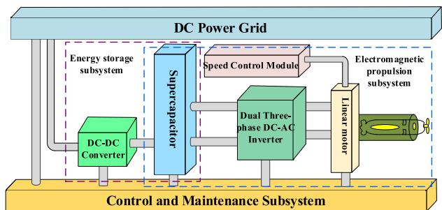  
FIGURE 1. Block diagram of a supercapacitor-powered electromagnetic launch system.

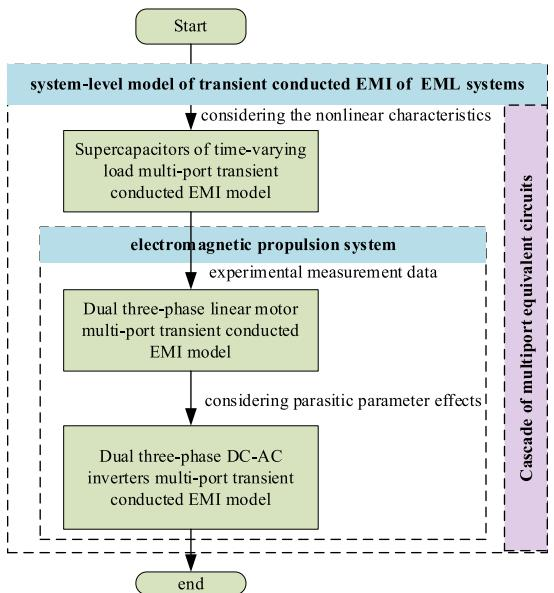  
FIGURE 2. The flow chart of the electromagnetic launch system modeling method.

high-current strong discharge characteristics during discharging. Following that, a multi-port transient conducted EM disturbances model of a dual three-phase linear motor is established using experimental measurement data, followed by the construction of a multi-port transient conducted EMI model of a dual three-phase dc-ac inverter while accounting for parasitic effects. Finally, the cascading of the multi-port equivalent circuit results in a system-level model of the EML system’s transient conducted EMI source. The transient EM disturbances multi-port equivalent circuit model for each part is as follows.

# A. MULTIPORT TRANSIENT CONDUCTED EMI MODEL OF SUPERCAPACITOR

Considering the states of the supercapacitor energy storage unit in an EML system typically involves two stages. Firstly, charging the supercapacitor using a constant current charging method. Next, disconnecting the supercapacitor from the charging system based on operational requirements and using the instantaneous high-current and high-power discharge energy characteristics as a pulse power supply to provide energy for the electromagnetic propulsion subsystem. Consequently, when accounting for the supercapacitor’s dual

function as both a charging load and a pulse power supply, it is essential to develop a transient conducted EM disturbances model applicable to a multi-port cascade equivalent circuit.

# 1) TRANSIENT EMI MODEL FOR SUPERCAPACITOR CHARGING STAGE

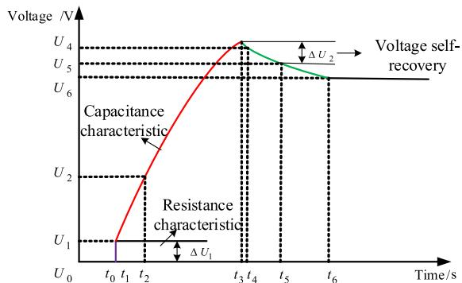  
FIGURE 3. Dc charging characteristic diagram of supercapacitor.

① The dc charging characteristic curve of a supercapacitor consists of three distinct stages, as shown in FIGURE 3. Initially, the sudden increase in terminal voltage indicates that the supercapacitor has instantaneous resistance. As time passes, the subsequent terminal voltage exhibits an approximately nonlinear relationship with time, demonstrating capacitance properties. Furthermore, since the du/dt varies over time, a combination of time-varying capacitors and fixed capacitors to model the nonlinear variation characteristics.   
② After the charging process ends, a self-recovery phenomenon occurs in the terminal voltage, indicating that charge redistributes within the supercapacitor. Parallel RC branches with varying time constants are employed to interpret the characteristics of charge distribution.   
③ When a supercapacitor is idle for a long time, the voltage gradually decreases. Therefore, it’s recommended to use a higher resistance for equivalence.

In conclusion, considering the nonlinear characteristics of the supercapacitor port during the charging stage [28], a model for the time-varying load EM disturbances model is proposed, and its equivalent circuit model is shown in FIGURE 4. For more information, please see the author’s published work [29], which is not included here due to space constraints.

The supercapacitor time-varying load EM disturbances model consists of three branches: the transient branch, the voltage balance branch, and the self-discharge branch.

Among them, the transient branch consists of $R _ { 0 }$ along with $C _ { f 0 }$ and $C _ { f 1 } ( u ) , R _ { 0 }$ is used to simulate the characteristics of the transient voltage jump at the SC terminal during the initial stage of charging. $C _ { f 0 }$ is a fixed capacitor in the branch, while $C _ { f 1 } ( u )$ is a variable capacitor. The voltage at the SC terminal is linear, i.e., $C _ { f 1 } ( u ) = k u ( t )$ ; the voltage balance branch is composed of $R _ { 1 }$ in series with $C _ { 1 }$ to simulate the voltage re The time constant is much larger than that of the

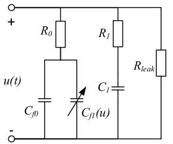  
FIGURE 4. Time-varying load EM disturbances model diagram of supercapacitor.

instantaneous branch. The self-discharge branch consists of $R _ { l e a k }$ alone, which simulates the static state of SC for a long time. The solution procedure for each branch parameter is detailed in [29].

# 2) TRANSIENT EMI MODEL FOR SUPERCAPACITOR DISCHARGE STAGE

During the discharge stage, the supercapacitor’s instantaneous and high-current discharge characteristics generate high-power pulse energy for the electromagnetic propulsion subsystem. As a result, in the study of transient EM disturbances modeling for the electromagnetic propulsion subsystem, the supercapacitor serves as the pulse power source. The transient conducted EM disturbances model of the supercapacitor is shown in FIGURE 5.

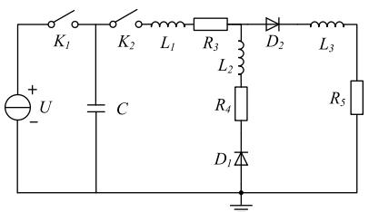  
FIGURE 5. Transient EM disturbances model of supercapacitor pulse power supply.

U represents the dc charging power supply; $K _ { 1 }$ and $K _ { 2 }$ represent the switches; $D _ { 1 }$ and $D _ { 2 }$ represent the diodes; $L _ { 1 } , L _ { 2 } , R _ { 3 }$ , and $R _ { 4 }$ are the parasitic parameters of the line, which can be obtained according to the solution method of the switching device and line parasitic parameters proposed in $[ 3 0 ] ; L _ { 3 }$ and $R _ { 5 }$ represent the load. When the $K _ { 1 }$ is turnon, the supercapacitor (actually the equivalent model of the energy storage unit) is charged. After the voltage of the supercapacitor stabilizes, $K _ { 1 }$ is turn-off, and $K _ { 2 }$ is turn-on, the supercapacitor discharges through $D _ { 2 } , D _ { 1 }$ mainly plays the role of continuous current after the end of the discharge of the supercapacitor.

# 3) SUPERCAPACITOR MULTIPORT TRANSIENT CONDUCTED EM DISTURBANCES MODEL

As previously discussed, a transient conducted EMI model of a supercapacitor energy storage unit applicable to a multi-port equivalent circuit cascade is developed by combining the supercapacitor’s EM disturbances model with the pulsed power supply’s transient conducted EM disturbances model.

This model, shown in FIGURE 6, can be used to implement and characterize transient conducted EMI source modeling in the EML system.

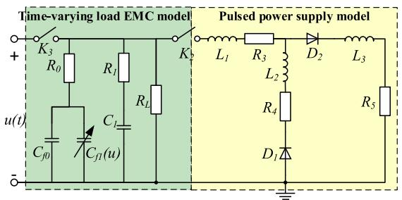  
FIGURE 6. Transient conducted EM disturbances model of charging and discharging of supercapacitor energy storage unit.

$K _ { 3 }$ represents the supercapacitor as a switching switch between the charging load and the pulsed power supply, respectively. The first stage of this model is the time-varying load model, and the second stage is the pulsed power supply model.

# B. MULTI-PORT TRANSIENT EMI MODEL OF THE ELECTROMAGNETIC PROPULSION SUBSYSTEMS

# 1) TRANSIENT EM DISTURBANCES MODEL FOR DUAL THREE-PHASE LINEAR MOTOR

Given that the neutral point isolated dual three-phase linear motor has no neutral connection between the two sets of stator windings, no zero-sequence current component, and effective electrical isolation, it is particularly well-suited for high-voltage and transient high-power operating scenarios. Therefore, it’s selected for the transient conducted EMI source modeling. The physical model and stator winding structure of the neutral-point isolated dual three-phase linear motor is shown in FIGURE 7, respectively.

Since the details of the electromagnetic structure such as dimensions and windings of the dual three-phase linear motors, are difficult to accurately grasp, the impedance measurements method has been utilized to build corresponding DM and CM equivalent circuits. This process helps fit the behavioral characteristics of the dual three-phase linear motor. The CM impedance $\left( Z _ { C M } \right)$ and DM $( Z _ { D M } )$ measurements as shown in FIGURE 8.

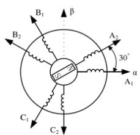  
(a)

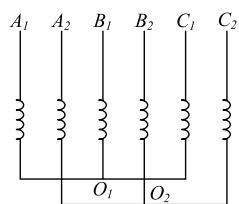  
(b)   
FIGURE 7. High thrust density dual three-phase linear motor. (a) physical model; (b) non-isolated neutral point.

Subsequently, the RLC circuit parameters are extracted based on the peaks and troughs in the impedance measurement curve [24], which correspond to the parallel and series

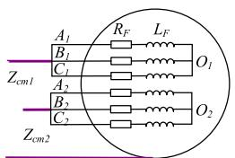  
(a)

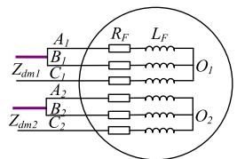  
  
FIGURE 8. Impedance measurement method for dual three-phase linear motors. (a) CM impedance; (b) DM impedance.

resonant frequencies, respectively. Furthermore, to calculate the parameters of the initial model of the dual three-phase linear motor. Therefore, it is sufficient to consider only a few frequency points where the impedance amplitude varies considerably. The single-phase equivalent circuits corresponding to the DM impedance and the CM impedance measurements are shown in FIGURE 9.

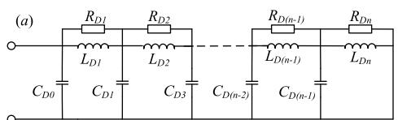

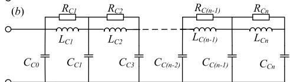  
FIGURE 9. Impedance measurement corresponding to single-phase equivalent circuit. (a) differential mode; (b) common mode.

Considering the time-domain characteristics of the dual three-phase linear motor, when modeling the transient conducted EM disturbances of the dual three-phase motor, a voltage source module needs to be added at each phase of the motor winding and neutral connection to simulate the end voltage characteristics during the actual operation of the dual three-phase linear motor, the voltage sources of $E _ { a } , ~ E _ { b } ,$ and $E _ { c }$ represent the reverse EMF of the dual three-phase motor at the fundamental frequency, whose parameters derived from the steady-state operating points (voltage, fundamental frequency current, and speed) [24]. Finally, FIGURE 10 depicts the time-domain model of transient conducted electromagnetic disturbances for one set of windings in a dual three-phase motor. Because the dual three-phase linear motor is neutral point isolated, only two sets of winding equivalent circuit models must be connected in parallel when constructing the overall model.

# 2) MULTI-PORT TRANSIENT CONDUCTION EM DISTURBANCES MODEL FOR DUAL THREE-PHASE INVERTERS

Considering that the motor load is a neutral isolated dual three-phase linear motor and the dual three-phase inverter is directly cascaded with the linear motor, the dual three-phase inverter circuit topology shown in FIGURE 11 is chosen for study. The dual three-phase inverter requires a more accurate conducted EM disturbances model of the switching

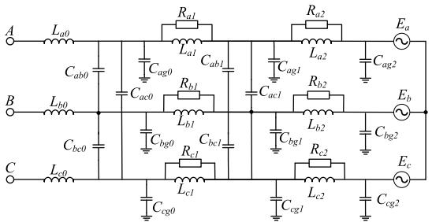  
FIGURE 10. A set of conducted EM disturbances time-domain models of resistance in dual three-phase linear motors.

bridge arms for transient conducted EMI analysis of the electromagnetic propulsion subsystem, due to the significant du/dt generated by the switching devices during the turn-on and turn-off processes.

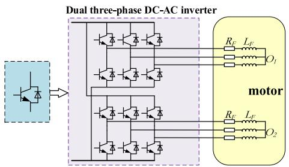  
FIGURE 11. Circuit topology of dual three-phase dc-ac inverter.

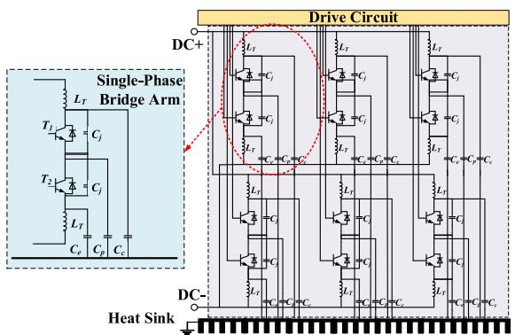  
FIGURE 12. Dual three-phase dc-ac inverter model considering parasitic parameters.

The dual three-phase inverter mainly consists of six bridge arms with twelve IGBT modules. Since the transient conducted EM disturbances generated by the dual three-phase inverter circuit are essentially the same as the single-phase bridge arm, due to the du/dt generated during the switching process, and the structure of each phase of the bridge arm in the dual three-phase inverter is the same, it is only the signals controlling the turn-on and turn-off of the bridge arm that are different. Therefore, to simply and accurately describe the generation and propagation of EMI, only one phase bridge arm in a dual three-phase inverter needs to be analyzed specifically. Based on this, a dual threephase inverter transient conducted EM disturbances model containing parasitic effects can be established through a simple parallel connection, as shown in FIGURE 12.

# III. EXPERIMENTAL VALIDATION OF TRANSIENT CONDUCTED EMI MODELING METHOD

# A. CONSTRUCTION OF EXPERIMENTAL PLATFORM

To verify the accuracy of the system-level conducted EMI source modeling method of the EML system based on the cascaded multi-port equivalent circuit, a corresponding EML system was constructed.

FIGURE 13 depicts a diagram of the experimental measurement for conducted interference of an EML system, which is used to simulate the system’s no-load operation. The experimental platform primarily consists of a dc-dc converter, a supercapacitor energy storage unit, LISNs, a dcac inverter, a permanent magnet synchronous motor, and supporting equipment. All equipment platforms are mounted on aluminum plates to ensure proper contact between the equipment shells and the aluminum plates.

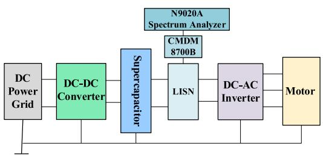

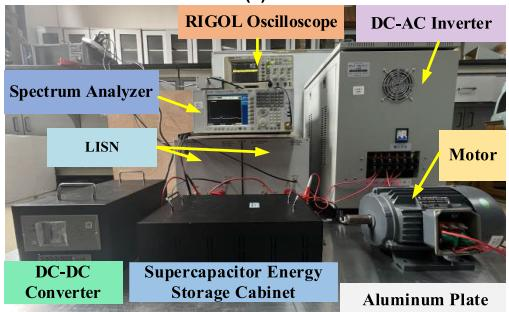  
  
  
FIGURE 13. The layout of the EM disturbances measurement system of the EML system. (a) schematic diagram; (b) measurement diagram.

The CM voltage on the dc output side of the supercapacitor and the three-phase voltages (uU , uV and uW ) on the motor input side are measured by a high-voltage differential probe (model: CYBERTEK DP6070). The measurement conditions were set as follows: the EML system was powered by a 350 V supercapacitor energy storage unit (model: MK-360V-P1FLJD) with a rated capacity of 1 F and a voltage variation range of 0 to 360 V. The LISN (model: NNBL 8229-HV), the spectrum analyzer N9020A, the CMDM 8700 CM/DM switch, and the oscilloscope (model: RIGOL TDS3054B). The motor speed was 3600 r/min, the inverter switching frequency was 4 kHz, and the Eu, Ev, and Ew frequency and amplitude were 50 Hz and 380 V respectively. The motor is controlled by SPWM modulation. It works continuously 3 times, with 2 s for each operation and 1 s for the interval.

# B. EXPERIMENTAL VERIFICATION

Based on the supercapacitor energy storage unit’s EMC model, the simulation analysis of the EM disturbances characteristics on the dc grid side, as well as the comparison results of the current spectrum under the constant current charging method and the constant voltage charging method, are shown in FIGURE 14.

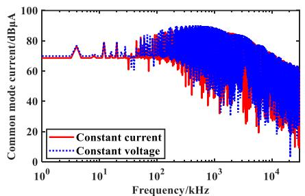

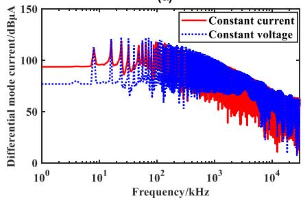  
  
  
FIGURE 14. Comparison of the current spectrum under different charging methods. (a) common model; (b) differential mode.

It can be found that the constant voltage charging method has a higher CM interference compared to the constant current charging method. The difference is nearly 5 dB at the main interference frequency point, and it is more pronounced in frequency bands above 1 MHz. Similarly, the DM interference has a similar envelope to the CM interference. The amplitude of the DM current is greater in the constant voltage charging method than in the constant current charging method, with an amplitude difference of approximately 8 dB at the main interference frequency point. Furthermore, the experimental data was used to compare the EM disturbances spectrum on the dc grid side under various charging methods, as shown in FIGURE 15.

From FIGURE 15, it can be seen that the conducted EM disturbances frequency point under constant current charging and constant voltage charging is the same. Furthermore, as for CM interference, the experimental data and simulation results are approximately the same, which can be seen as the envelope of its spectrum and the maximum error is within 5 dB. As for DM interference, the simulation results and experimental data align well in the low-frequency. However, at 15 MHz, the error is approximately 15 dB. This difference is due to the high-frequency series resonance between the cable and the measurement equipment, as well as the fact that the equalizer plate was not included in the SC energy storage cabinet modeling.

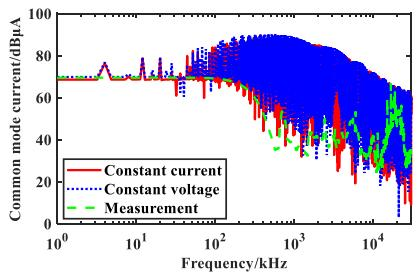

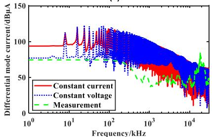  
(a)   
(b)   
FIGURE 15. Comparison between the simulation and experimental data. (a) common model current; (b) differential mode current.

# C. EXPERIMENTAL VERIFICATION OF DC DISCHARGING PROCESS

To begin, to verify the accuracy of the motor modeling method described above, a three-phase permanent magnet synchronous motor impedance was measured in the laboratory, as shown in FIGURE 16. FIGURE 8 depicts the CM and DM connection methods for the motor stator winding during measurement. The equivalent circuit model of the three-phase motor, as shown in FIGURE 10, is created using the parameter values from Table 1, and the fitting results are shown in FIGURE 17.

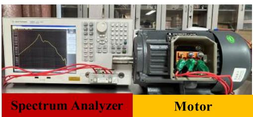  
FIGURE 16. Impedance measurement of the three-phase motor.

TABLE 1. Parameter table of the equivalent circuit model of a three-phase motor.   

<table><tr><td>Parameters</td><td>Values</td><td>Parameters</td><td>Values</td></tr><tr><td>La0 = Lb0 = Lc0</td><td>653.24 μH</td><td>Ra1 = Rb1 = Rc1</td><td>4.25 kΩ</td></tr><tr><td>La1 = Lb1 = Lc1</td><td>4.80 mH</td><td>Ra2 = Rb2 = Rc2</td><td>10.5 kΩ</td></tr><tr><td>La2 = Lb2 = Lc2</td><td>8.702 mH</td><td>Cab0 = Cac0 = Cbc0</td><td>-285.88 pF</td></tr><tr><td>Ea = Eb =Ec</td><td>220 V</td><td>Cab1 = Cac1 = Cbc1</td><td>-2.079 nF</td></tr><tr><td>Cag0 = Cbg0 = Ccg0</td><td>1.1 nF</td><td>Cag2 = Cbg2 = Ccg2</td><td>8.47 nF</td></tr><tr><td>Cag1 = Cbg1 = Ccg1</td><td>6.98 nF</td><td>f</td><td>50 Hz</td></tr></table>

Secondly, we conduct an experimental verification of the discharging process. The terminal voltages of the

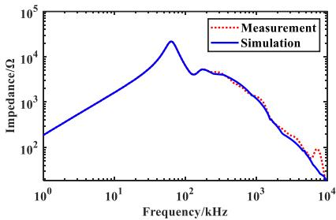

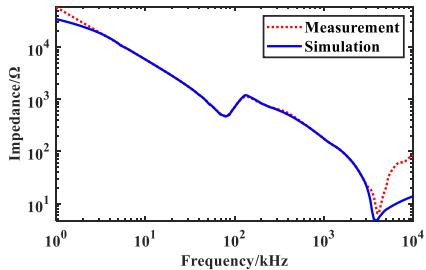  
（a)  
  
FIGURE 17. Comparison of the three-phase motor simulation model and impedance measurement. (a) differential mode; (b) common mode.

supercapacitor energy storage unit obtained from the measurement during three times discharging processes are shown in FIGURE 18. The comparison between the simulated and the experimental results of the terminal voltage under a single discharge is shown in FIGURE 19, which shows the simulated results can accurately fit the experimental results. During the discharging process, the terminal voltage gradually decreases continuously with the discharge time and the supercapacitor energy storage unit can be turn-off in 1 s.

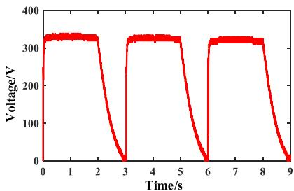  
FIGURE 18. The terminal voltage of the supercapacitor energy storage unit for three discharges.

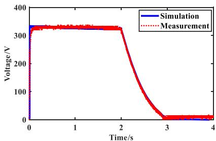  
FIGURE 19. Comparison of terminal voltage between simulation and experimental result in a single discharge.

Then, the CM and DM voltage spectrum at the output of the supercapacitor were measured by the interference signal separation module CMDM 8700B, and the measurement

results of the N9020A spectrum analyzer were compared with the simulation results, as shown in FIGURE 20.

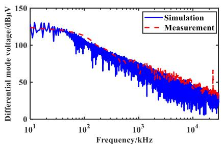

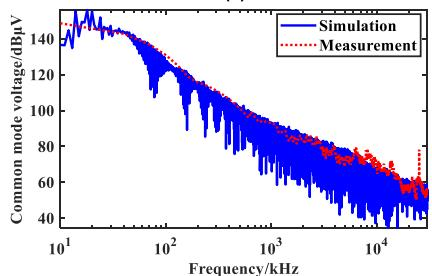  
（a)  
(b)   
FIGURE 20. Comparison of prediction results based on simulation and measurement. (a) differential mode; (b) common mode.

The experimental results in the wide-frequency domain can be regarded as the spectral envelope of the simulated results of CM voltage and DM voltage. The prediction and experimental results are in good agreement, with an error margin of within 5 dB. This indicates that the modeling method can realize the system-level modeling of transient conducted EM disturbances for typical electric drive systems. Subsequently, this modeling method is used in Section IV to model EML systems.

# IV. SIMULATION AND ANALYSIS OF TRANSIENT CONDUCTED EM DISTURBANCES OF A TYPICAL ELECTROMAGNETIC LAUNCH SYSTEM

When the supercapacitor energy storage unit is fully charged, the EML system transitions from a charging state to a transient discharge state. At this time, the output energy of the supercapacitor storage unit will convert from dc into ac through the dual three-phase inverter. It will generate a strong electromagnetic induction force to drive the linear motor to push the launch target to the preset launch speed. Based on the transient conducted EM disturbances model of the supercapacitor storage unit, the dual three-phase dcac inverter and dual three-phase linear motor established in Sections II and III, the transient conducted EM disturbances model of the EML system with a multi-port equivalent circuit cascade is finally established as FIGURE 21, and the transient simulation is then performed to analyze its transient conducted EM disturbances characteristics.

To further verify the accuracy of the proposed method, the measurement data and experimental parameters in [27] are cited here, which conducted experimental measurements on an actual EML system, measuring the DM and CM

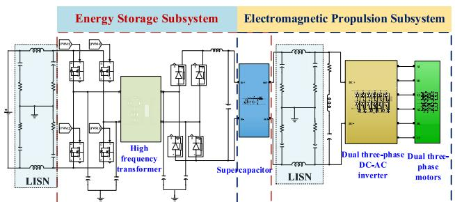  
FIGURE 21. Transient conducted EM disturbances model for the electromagnetic launch system.

TABLE 2. Table of parasitic parameters of a dual three-phase DC-AC inverter.   

<table><tr><td>Parameters</td><td>Values</td><td>Parameters</td><td>Values</td></tr><tr><td>Ce</td><td>370 pF</td><td>Cj</td><td>12 nF</td></tr><tr><td>Cc</td><td>88 pF</td><td>LT</td><td>9 nH</td></tr><tr><td>Cp</td><td>370 pF</td><td>-</td><td>-</td></tr></table>

TABLE 3. Parameter table of dual three-phase linear motor.   

<table><tr><td>Parameters</td><td>Values</td><td>Parameters</td><td>Values</td></tr><tr><td>La0 = Lb0 = Lc0</td><td>600 nH</td><td>Ra1 = Rb1 = Rc1</td><td>6 kΩ</td></tr><tr><td>La1 = Lb1 = Lc1</td><td>300 μH</td><td>Ra2 = Rb2 = Rc2</td><td>15 kΩ</td></tr><tr><td>La2 = Lb2 = Lc2</td><td>800 μH</td><td>Cab0 = Cac0 = Cbc0</td><td>-71.47 pF</td></tr><tr><td>Ea = Eb = Ec</td><td>114 V</td><td>Cab1 = Cac1 = Cbc1</td><td>-667.53 pF</td></tr><tr><td>Cag0 = Cbg0 = Ccg0</td><td>2.11 nF</td><td>Cag2 = Cbg2 = Ccg2</td><td>4.47 nF</td></tr><tr><td>Cag1 = Cbg1 = Ccg1</td><td>7.66 nF</td><td>f</td><td>117 Hz</td></tr></table>

interference current on the dc side of the electromagnetic propulsion system in the frequency band from 1 kHz to 10 MHz, the output current of the inverter is 2 kA-10 kA, and the duration is 4 s-20 s under different working conditions.

The parameters for the multi-port equivalent circuit models of a supercapacitor energy storage unit, a dual three-phase dc-ac inverter, and a linear motor were determined by [27], as shown in Tables 2 and 3. In this paper, we first study the frequency domain characterization of a transient conducted EM disturbances of an EML system, then focus on simulating of its transient EM disturbances characteristics.

# A. TIME-DOMAIN SIMULATION OF ELECTROMAGNETIC LAUNCH SYSTEM TRANSIENT CONDUCTED EM DISTURBANCES

According to FIGURE 1 and FIGURE 21, it is evident that during the discharge process of the EML system, the supercapacitor acts as a pulse power, which transiently drives the dual three-phase linear motor through the dual threephase dc-ac inverter. In this condition, the electromagnetic propulsion subsystem of the EML system is shown in FIGURE 22. The front end of the electromagnetic launcher is a pulsed power supply composed of a 33 F supercapacitor, the dc side connects the LISN, and the control mode of

the dual three-phase inverter employs SPWM control with a $3 0 ^ { \circ }$ electrical angle difference and a switching frequency of 6 kHz, as shown in FIGURE 23.

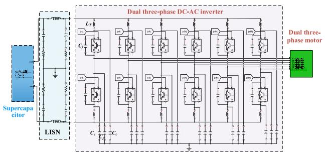  
FIGURE 22. The electromagnetic propulsion subsystem conducted EM disturbances circuit model.

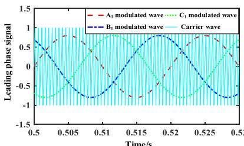

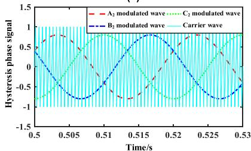  
  
  
FIGURE 23. SPWM control diagram of dual three-phase inverter. (a) leading phase signal; (b) lagging phase signal.

According to the EML system working situation, the simulation duration is set to 15 seconds. The first stage involves constant current charging from 0 s to 6 s. The second stage is discharging, instantaneous discharge simulations commence at 6 s, with each discharge lasting 2 s, followed by a turn-off period of 1 s. The supercapacitor energy storage unit’s switching control diagram is shown in FIGURE 24.

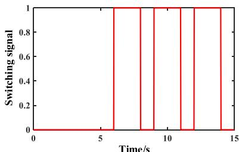  
FIGURE 24. Switch control diagram of supercapacitor energy storage unit.

In this paper, the results of [27] are used to compare normalizations. The overrun phase current waveform on the output side of the dual three-phase dc-ac inverter is shown in FIGURE 25, with a partial enlargement of the

current waveform during the discharge time between 7 s and 7.1 s. It can be seen that the peak phase current on the output side of the dc-ac inverter matches the current in [27], which is in accordance with the output currents in the actual operation, and proves the accuracy of the multi-port equivalent circuit modeling method of the electromagnetic propulsion subsystem is demonstrated. The phase current on the output side of the inverter is found to be 8 kA by simulation.

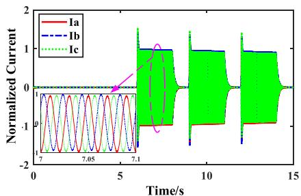  
FIGURE 25. Waveform diagram of the leading three-phase current on the output side of the dual three-phase dc-ac inverter.

In addition, comparing the overrunning A1 phase current with the lagging A2 phase current on the output side of the dual three-phase dc-ac inverter is shown in FIGURE 26, it can be seen that the overrunning and lagging phase currents satisfy the $3 0 ^ { \circ }$ electrical angle difference in space. The line voltage on the output side of the inverter is shown in FIGURE 27, and the overall EML system is simulated in accordance with the actual discharge of the EMF propulsion subsystem as described in [27].

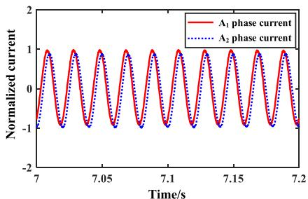  
FIGURE 26. Comparison of A-phase current of leading and lagging bridge at the inverter output side

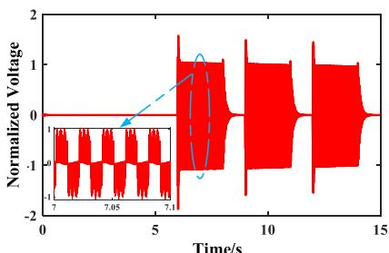  
FIGURE 27. Line voltage on the output side of the dc-ac inverter.

When the supercapacitor energy storage is complete, the terminal voltage anPd discharge current of the energy storage unit change, as illustrated in FIGURE 28. The simulation

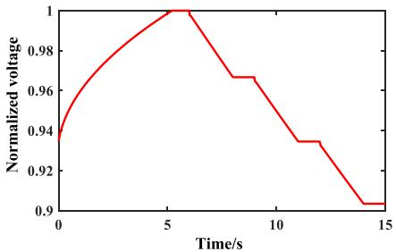

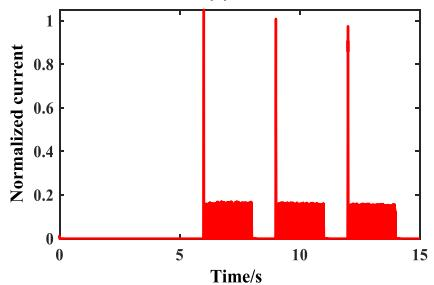  
(a)   
(b)   
FIGURE 28. Transient output characteristic of supercapacitor energy storage unit. (a) terminal voltage; (b) discharge current.

reveals that the terminal voltage of the supercapacitor storage unit changes within 20 V during a single discharge process, and the discharge current of the storage unit can reach 7 kA, which is broadly consistent with the working conditions of the electromagnetic propulsion subsystem of an equipment platform in [27].

# B. FREQUENCY-DOMAIN CONDUCTED EM DISTURBANCES CHARACTERIZATION OF ELECTROMAGNETIC LAUNCH SYSTEM

To further verify the accuracy of the proposed method, the CM and DM interference on the dc side of the EML system, have been compared with the traditional frequency-domain modeling method, and further compared with the measurement data in [27], which is shown in FIGURE 29.

In general, the proposed modeling method demonstrates excellent overall agreement for both CM and DM measurement data in the frequency range of 10 kHz to 10 MHz. For DM interference in the 10 kHz-150 kHz, the maximum error between simulation and measurement data is less than 3 dB. Because of the segmented measurements of the DM interference, which cause a large jump in the measurement results at 150 kHz, the maximum error is about 13 dB between 150 kHz and 300 kHz; in the high-frequency range, the maximum error is less than 3 dB, and the simulation fits the peak points of measurement data well. Compared to traditional frequency-domain modeling methods, the method proposed in this paper improves prediction accuracy by 3-5 dB, and the model can better predict the peak points at high frequency.

For CM interference, the maximum error between simulation results and measurement data is less than 5 dB in the 10 kHz-150 kHz; similarly, due to segmented measurements of the CM interference, the maximum error is about 8 dB

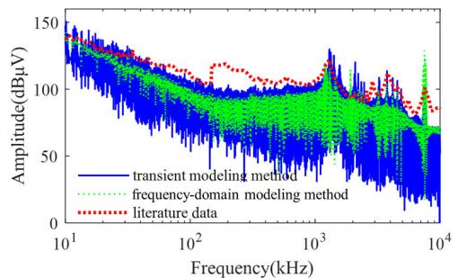

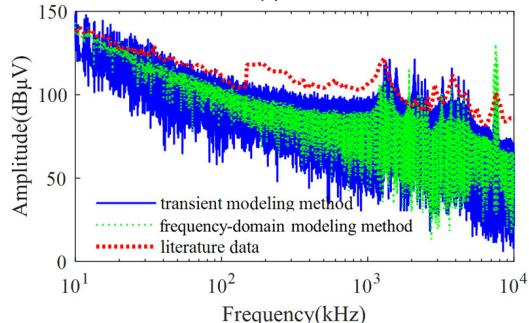  
(b)   
FIGURE 29. Transient conducted EM disturbances current spectrum on the dc side of an electromagnetic propulsion subsystem. (a) differential mode; (b) common mode.

within 150 kHz-500 kHz; in the high-frequency range, this method can well fit the peak points of noise. Compared to traditional frequency-domain modeling, this method improves prediction accuracy by 4-6 dB and accurately predicts high-frequency peak points.

Furthermore, the DM and CM interference generated during the EML system’s transient operation is higher at low frequencies and gradually decreases as frequency increases. The main interference frequency points are concentrated above the even frequency points, and the interference amplitude grows beyond 10 MHz. This increase is caused by the parasitic parameters’ series resonance in their transmission path.

# V. CONCLUSION

This paper proposes a transient conducted EMI source modeling method for EML systems based on the cascaded multiport equivalent circuit models. Firstly, a multi-port transient conducted EM disturbances model of a supercapacitor is developed, which can accurately describe both its time-varying load characteristics during charging and its transient high-current strong discharge characteristics during discharging.

Secondly, a multi-port EM disturbances model of a dual three-phase linear motor is established, which is verified by using a three-phase motor; then a multi-port EM disturbances model of a dual three-phase dc-ac inverter with parasitic effects is established based on the characteristics of each device port cascade in the EML system; Finally, an experimental platform is built for the EML system for verification, it can maintain good consistency in the frequency domain,

and the error between the simulation and experimental data is within 5 dB.

Thirdly, the system-level transient EMI source model of an EML system is obtained. The CM and DM conducted EM disturbances are found to be concentrated above the even frequency multiplier, primarily at the low-frequency end and near the 10 MHz band, and the interference amplitude at the main frequency points is approximately equal to measurement data in [27], with an error of less than 5 dB. The transient conducted EMI source modeling method of the EML system proposed can provide a modeling method to obtain the conducted EMI source of a high-power, strong electromagnetic system operating in transient conditions. This method provides a simulation model and technical support for the EMC prediction and design of the dc grid side of the modern ships, satellite launchings, etc.

# REFERENCES

[1] W. Ma, J. Lu, and Y. Liu, ‘‘Research progress of electromagnetic launch technology,’’ IEEE Trans. Plasma Sci., vol. 47, no. 5, pp. 2197–2205, May 2019.   
[2] B. Zhu, J. Lu, X. Zhang, T. Ma, and Y. Dai, ‘‘A novel hybrid energy storage system for large shipborne electromagnetic railgun,’’ IEEE Trans. Plasma Sci., vol. 49, no. 8, pp. 2420–2427, Aug. 2021.   
[3] Z. Wang, Z. Li, H. Li, T. Lu, and Z. Li, ‘‘Modeling of the rail type electromagnetic launch system with superconducting pulsed power supply considering resistance,’’ IEEE Trans. Appl. Supercond., vol. 31, no. 8, pp. 1–4, Nov. 2021.   
[4] C. Deng, C. Ye, J. Yang, S. Sun, and D. Yu, ‘‘A novel permanent magnet linear motor for the application of electromagnetic launch system,’’ IEEE Trans. Appl. Supercond., vol. 30, no. 4, pp. 1–5, Jun. 2020.   
[5] S. Guan, D. Wang, X. Guan, D. Guo, S. Wang, and B. Liu, ‘‘Current sharing analysis of coil for electromagnetic launching,’’ IEEE Trans. Plasma Sci., vol. 47, no. 5, pp. 2393–2398, May 2019.   
[6] R. Cao, Z. Duo, and M. Su, ‘‘Analysis of magnetic field waveforms of different launching stages of rail gun based on wavelet transform,’’ IEEE Trans. Plasma Sci., vol. 47, no. 1, pp. 500–507, Jan. 2019.   
[7] X. Xue, T. Shu, Z. Yang, and G. Feng, ‘‘A new electromagnetic launcher by sextupole rails: Electromagnetic propulsion and shielding numerical validation,’’ IEEE Trans. Plasma Sci., vol. 45, no. 9, pp. 2541–2545, Sep. 2017.   
[8] G. Bandini, M. Marracci, G. Caposciutti, P. Delmote, and B. Tellini, ‘‘Current distribution in railgun rails through barycenter filament model,’’ IEEE Trans. Instrum. Meas., vol. 70, pp. 1–8, 2021.   
[9] S. Hundertmark and G. Vincent, ‘‘Investigating a radio data link to a railgun projectile—The active projectile,’’ IEEE Trans. Plasma Sci., vol. 39, no. 1, pp. 422–425, Jan. 2011.   
[10] C. Li, S. Xia, L. Chen, J. He, Y. Xiong, C. Zhang, and J. Yao, ‘‘Simulations on current distribution in railgun under imperfect contact conditions,’’ IEEE Trans. Plasma Sci., vol. 47, no. 5, pp. 2264–2268, May 2019.   
[11] C. Li, L. Chen, S. Xia, J. He, C. Zhang, Y. Xiong, and J. Yao, ‘‘Simulations on saddle armature with concave arc surface in small caliber railgun,’’ IEEE Trans. Plasma Sci., vol. 47, no. 5, pp. 2347–2353, May 2019.   
[12] Y. Xing, B. Lei, Q.-A. Lv, H. Xiang, J. Chen, and R. Zhu, ‘‘Simulations, experiments, and launch characteristics of a multiturn series–parallel rail launcher,’’ IEEE Trans. Plasma Sci., vol. 47, no. 1, pp. 603–610, Jan. 2019.   
[13] F. Yang, X. Zhai, Z. Zhao, H. Liu, and Z. Peng, ‘‘Research on the armature– rail dynamic contact characteristics of the series enhanced electromagnetic rail launcher,’’ IEEE Trans. Plasma Sci., vol. 50, no. 4, pp. 1040–1047, Apr. 2022.   
[14] L. Xiangping, J. Lu, and J. Feng, ‘‘Simulation of sabot discard for electromagnetic launch integrated projectile,’’ IEEE Trans. Plasma Sci., vol. 46, no. 7, pp. 2636–2641, Jul. 2018.   
[15] N. Shen, X. Zhang, Q. Liao, and M. Zhang, ‘‘Design and experimental analysis of magnetic shielding of electronic-magnetic rail gun ammunition fuse,’’ Int. J. Appl. Electromagn. Mech., vol. 53, no. 2, pp. 337–358, Feb. 2017.

[16] Z. Peng, X. Zhai, X. Zhang, and H. Liu, ‘‘Analysis of transient characteristics of electromagnetic launchers using analytical method,’’ IEEE Trans. Plasma Sci., vol. 50, no. 9, pp. 3251–3261, Sep. 2022.   
[17] J. Meng, W. Ma, Q. Pan, Z. Zhao, and L. Zhang, ‘‘Noise source lumped circuit modeling and identification for power converters,’’ IEEE Trans. Ind. Electron., vol. 53, no. 6, pp. 1853–1861, Dec. 2006.   
[18] R. Phukan, X. Zhao, C.-W. Chang, D. Dong, R. Burgos, M. Debbou, A. Platt, and P. Asfaux, ‘‘Characterization and mitigation of conducted emissions in a SiC based three-level T-type motor drive for aircraft propulsion,’’ IEEE Trans. Ind. Appl., vol. 59, no. 3, pp. 3400–3412, Jun. 2023.   
[19] X. Gao and D. Su, ‘‘Suppression of a certain vehicle electrical field and magnetic field radiation resonance point,’’ IEEE Trans. Veh. Technol., vol. 67, no. 1, pp. 226–234, Jan. 2018.   
[20] M. Sarkar and B. R. Raghu, ‘‘Improved complex receiver system design strategies to overcome EMI/EMC challenges,’’ IEEE Electromagn. Compat. Mag., vol. 11, no. 2, pp. 37–48, 2nd Quart., 2022.   
[21] S. Negri, G. Spadacini, F. Grassi, and S. A. Pignari, ‘‘Black-box modeling of EMI filters for frequency and time-domain simulations,’’ IEEE Trans. Electromagn. Compat., vol. 64, no. 1, pp. 119–128, Feb. 2022.   
[22] L. Guibert, J.-P. Parmantier, I. Junqua, and M. Ridel, ‘‘Determination of conducted EM emissions on DC–AC power converters based on linear equivalent Thevenin block circuit models,’’ IEEE Trans. Electromagn. Compat., vol. 64, no. 1, pp. 241–250, Feb. 2022.   
[23] K. Wang, H. Lu, and X. Li, ‘‘High-frequency modeling of the high-voltage electric drive system for conducted EMI simulation in electric vehicles,’’ IEEE Trans. Transp. Electrific., vol. 9, no. 2, pp. 2808–2819, Jun. 2023.   
[24] K. Wang, H. Lu, C. Chen, and Y. Xiong, ‘‘Modeling of system-level conducted EMI of the high-voltage electric drive system in electric vehicles,’’ IEEE Trans. Electromagn. Compat., vol. 64, no. 3, pp. 741–749, Jun. 2022.   
[25] R. Zhu, T. Liang, V. Dinavahi, and G. Liang, ‘‘Wideband modeling of power SiC MOSFET module and conducted EMI prediction of MVDC railway electrification system,’’ IEEE Trans. Electromagn. Compat., vol. 62, no. 6, pp. 2621–2633, Dec. 2020.   
[26] L. Yang, H. Zhao, S. Wang, and Y. Zhi, ‘‘Common-mode EMI noise analysis and reduction for AC–DC–AC systems with paralleled power modules,’’ IEEE Trans. Power Electron., vol. 35, no. 7, pp. 6989–7000, Jul. 2020.   
[27] J. Li, Z. Zhao, X. Zhang, and L. Zhang, ‘‘Measurement technology of high frequency interference current of the electric energy conversion device in the electromagnetic launch system,’’ (in Chinese), Trans. China Electrotech. Soc., vol. 33, no. 24, pp. 5805–5810, Jun. 2018.   
[28] D. Xu, L. Zhang, B. Wang, and G. Ma, ‘‘Modeling of supercapacitor behavior with an improved two-branch equivalent circuit,’’ IEEE Access, vol. 7, pp. 26379–26390, 2019.   
[29] Z. Chen, F. Liu, Y. Li, and H. Zhang, ‘‘Influence of DC component and harmonic component on transmission characteristics of current transformer,’’ (in Chinese), Electric. Mach. Control, vol. 27, no. 7, pp. 11–19, 2023.   
[30] Y. Zhou, D. Zhang, and P. Yan, ‘‘Modeling of electromagnetic rail launcher system based on multifactor effects,’’ IEEE Trans. Plasma Sci., vol. 43, no. 5, pp. 1516–1522, May 2015.

BAILIN MOU received the B.S. degree in electrical engineering from Southwestern Jiaotong University, Chengdu, China. He is currently pursuing the M.S. degree in electrical engineering with Chongqing University, China. His research interests include electromagnetic interference (EMI) in power converters and EMI filter design.

QI-FENG LIU (Member, IEEE) received the M.Sc. degree from Anhui University, China, in 2006, and the Ph.D. degree from Shanghai Jiao Tong University (SJTU), Shanghai, China, in 2010.

He was as a Staff Engineer and a Senior Engineer at Science and Technology, EMC Laboratory, China Ship Development and Design Center (CSDDC), until May 2019. In June 2019, he joined as an Associate Research Fellow with the

State Key Laboratory of Power Transmission Equipment Technology, School of Electrical Engineering, Chongqing University, China. As a leading author, he has published more than 60 international journal articles and conference papers. His research interests include EMC, EMI, and EM protection, computational electromagnetics, and wireless power transmission. He was a recipient of the Best Paper Awards of Microwave, Antenna, Propagation, and EMC Technologies for Wireless Communications (MAPE), in 2013, the International Union of Radio Science Young Scientist Award, in 2011, and the Best Paper Awards of Asia Pacific Electromagnetic Compatibility Conference (APEMC), in 2008. He was also a recipient of the Defense Technology Progress Award of the First Class of China, in 2019, the Army Technology Progress Award of the Second Class of China, in 2020, and the Science and Technology Progress Award of the First Class from China Shipbuilding Industry Corporation, in 2017, and several honors from local Hubei and Center Government of China.

ZHENYA CHEN received the B.S. degree in electrical engineering from Northeast Electric Power University, Jilin, China, and the M.S. degree in electrical engineering from Chongqing University, Chongqing, China, in 2023. He is currently working with State Grid Zhejiang Hangzhou Power Supply Company Ltd. His research interests include electromagnetic compatibility prediction for power electronics and electromagnetic compatibility measurement techniques.

XIAOWEN WU received the B.S. degree in electrical engineering from Wuhan University of Technology, Wuhan, China. She is currently pursuing the M.S. degree in electrical engineering with Chongqing University, China. Her current research interests include frequency selective surface, metamaterial, and metasurface.

YONGMING LI received the B.S. degree from the Department of Astronomy, Beijing Normal University, Beijing, China, in 1985, and the M.S. and Ph.D. degrees in electrical engineering from Chongqing University, Chongqing, China. He has done postdoctoral research in the Post-Doctoral Mobile Station of Instrument Science and Technology, Chongqing University. He is currently working as an Associate Professor with the Department of Electrical Engineering, Chongqing

University, and a Tutor of the Collaborative Innovation Center of High Performance Automobile of Chongqing. His research interests include electromagnetic field numerical calculation and the electromagnetic compatibility of power systems. He is a member of the International Society of Computational Electromagnetism, a Senior Member of Chinese Society of Electrical Engineering, and a member of the electromagnetic Interference Committee of the Chinese Society of Electrical Engineering.

CHEN HUANG received the Ph.D. degree from the School of Mechanical Science and Engineering, Huazhong University of Science and Technology, Wuhan, China, in 2011. He is currently working with the National Key Laboratory on Electromagnetic Compatibility, China Ship Development and Design Center, Wuhan. His current research interests include harmonic suppression technology in power grids, extra-low frequency magnetic field shielding, and measurement.

HUAI-QING ZHANG (Member, IEEE) was born in Anhui, China, in 1979. He received the B.S., M.S., and Ph.D. degrees in electrical engineering from Chongqing University, Chongqing, China, in 2000, 2003, and 2008, respectively. From 2012 to 2013, he was a Visiting Scholar at the Department of Consortium for Electromagnetic Modeling and Inversion, The University of Utah, Salt Lake City, UT, USA. He is currently working as a Professor with the Department of Electrical

Engineering, Chongqing University, where he is also the Director of the Space Power Science and Engineering Research Center. He has authored or co-authored more than 100 articles in journal or conference proceedings. His current research interests include microwave power transmission applications, power signal processing, electromagnetic field theory, and applications. He serves as an Executive Editor-in-Chief for the Space Solar Power and Wireless Transmission.