# Average-Value Modeling of Line-Commutated AC–DC Converters With Unbalanced AC Network

Seyyedmilad Ebrahimi , Member, IEEE, Navid Amiri , Member, IEEE, and Juri Jatskevich , Fellow, IEEE

Abstract—AC–DC line-commutated converters (LCCs) are widely utilized in existing and emerging ac–dc power systems. Analysis of such systems under balanced and unbalanced conditions is often carried out using electromagnetic transient (EMT) simulation programs. Therein, the detailed switching models of LCCs are often the computational bottlenecks for system-level studies. Recently, the parametric average-value models (PAVMs) have been developed to achieve fast and efficient simulations of switching converters. In this paper, the PAVM methodology is extended to consider operation of LCCs under unbalanced conditions in the ac network. This is done in the extended PAVM by formulating the ac-side harmonics in positive and negative sequences as well as the dc-side harmonics (i.e., ripples) with respect to the ac network imbalance. The new PAVM is validated experimentally and by simulations, and is demonstrated to be accurate in reconstructing the ac and dc waveforms under unbalanced conditions in the ac network. Meanwhile, the proposed PAVM is computationally much faster than its detailed switching model counterpart.

Index Terms—AC–DC converter, average-value model, linecommutated, parametric, simulations, unbalanced conditions.

## I. INTRODUCTION

A C–DC power-electronic converters play an enabling rolein the development of modern energy systems and their integration with conventional power systems. Therein, linecommutated rectifiers (LCRs) are often utilized due to their simplicity, reliability, high-power capability, high efficiency and low cost. Examples of LCRs applications include (but are not limited to) classic HVDC systems [1], distributed energy resources (DERs) [2], exciters of synchronous generators [3], vehicular [4], marine [5], and avionic power systems [6], induction furnace systems [7], etc. However, LCRs contribute to the harmonics in the system.

Reliable planning, design and development of such LCRbased systems require comprehensive studies and analyses of the system under normal and unbalanced/faulty conditions. This is due to the fact that in addition to the harmonics that result from the LCR operation, the imbalance of the system can also significantly influence the operation of power system equipment, e.g., protection relays, controllers, etc., [8]–[10]. The imbalance in the system may be a result of various phenomena, e.g., internal faults of LCR switches, asymmetric faults on and/or unequal impedances of the lines/cables, as well as unbalanced loads and/or sources, etc.

Such studies are conventionally done using electromagnetic transient (EMT) simulation programs, e.g., PSCAD/EMTDC, EMTP-RV, MATLAB/Simulink [11], Simscape Electrical, PLECS [12], as well as real-time simulators such as Typhoon HIL, Opal-RT, RTDS, etc. In these programs, the detailed switching models of LCRs are commonly available as standard library components which provide high-fidelity and accurate results by computing all the discrete switching and commutations of all individual devices. Such models typically rely on accurate handling of discrete switching events, which is achieved using small time-steps, zero-crossing detection, interpolation [13]–[14], etc., which make these models computationally expensive. Detailed switching models may quickly become computational bottlenecks in systems with multiple converters and/or when the simulations have to be done many times for optimization of parameters and design of controllers [15]. At the same time, many EMT simulators have been pushing to expand their computational capabilities by permitting larger time-steps (up to hundreds of microseconds, at least for parts of their systems, e.g., super-step in RTDS [16]) and/or including the dynamic phasor-type average solution techniques with larger time-steps [17].

As an alternative to the detailed switching models, dynamic average-value models (AVMs) [3], [6], [17]–[30] have been developed for LCRs, wherein the individual discrete switching is neglected, and slower non-switching dynamics are captured by relating the ac- and dc-side variables through their averagevalue relationships. This makes the AVMs fast and efficient for system-level simulations. The AVMs may be classified as analytical (AAVMs) [3], [6], [17]–[21] and parametric (PAVMs) [22]–[30]. The PAVMs have appeared to be very promising for their high accuracy and subsequent automatic generation and realization in EMT simulators. Interested reader is referred to [27, Table I] for a list of state-of-the-art AAVMs and PAVMs with details on their features and limitations.

In [17]–[18], analytical dynamic phasor models have been developed in phasor-domain for LCC-HVDC converters under unbalanced system operation (i.e., asymmetrical faults and commutation failure). However, they have the general limitations of AAVMs, i.e., being applicable only to a single operating mode for which they are derived. In [28]–[29], PAVMs have been developed for LCRs when imbalance occurs due to internal faults of switches. However, to the best of authors’ knowledge, a PAVM that formulates the unbalanced ac-side harmonics as well as the oscillatory components of dc-side variables of the LCR due to imbalance in the ac network has not been reported in the literature. This paper proposes such PAVM for the first time, and makes the following contributions:

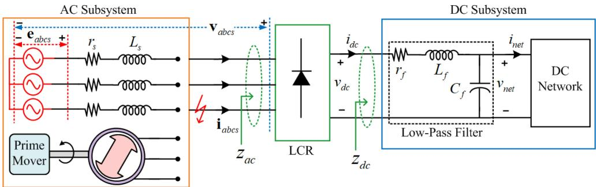  
Fig. 1. An example generic three-phase ac–dc system consisting of a line-commutated rectifier powered through an unbalanced ac network.

- The PAVM methodology is extended to consider the unbalanced operations of LCRs due to imbalance in the ac network by formulating the ac-side harmonics in positive and negative sequences as well as the dc-side harmonics (i.e., ripples) in the model.

- The harmonic terms are formulated using both dynamic and algebraic representations, where the latter may be used for computationally cheaper implementation.

- The proposed PAVM is validated experimentally as well as through extensive simulations in time-domain and impedance prediction in frequency domain; which is shown to be capable of reconstructing the ac- and dc-side waveforms very accurately under unbalanced ac network conditions.

Using computer simulations, the new extended PAVM is demonstrated to be orders of magnitude faster than the detailed switching model, which makes this approach attractive for possible implementation in EMT simulators for efficient studies of large ac–dc systems.

## II. MODELING OF AC AND DC SUBSYSTEMS

To clearly define the methodology, without loss of generality, a generic three-phase ac–dc system shown in Fig. 1 is considered in this paper. The ac subsystem may be a grid (represented by its Thévenin equivalent) or a network of interconnected ac generators (represented by a lumped equivalent generator). The LCR may be composed of either diode or thyristor switches. The dc subsystem may include an RLC filter whose output feeds a dc network. For compactness of notations, the vectors of three-phase variables are denoted by lower-case bold letters as f abcs = [ fas fbs fcs ] T , where f may represent voltage v or current i.

## A. Formulation of the AC Subsystem With Imbalance

To model the imbalance in the ac subsystem of Fig. 1, the equivalent source voltages eabcs are decomposed into positive

and negative sequence components [31] as

$$
\tag{1}
$$

where eabcs is assumed to contain only the fundamental frequency components. Since there is no neutral connection between the LCR and the ac subsystem, there is no zero-sequence in system of Fig. 1. Assuming θs being the angle of positive sequence component in phase a of source voltages (or rotor angle of the equivalent generator), the positive and negative sequence components in (1) are expressed as

$$
\tag{2}
$$

$$
\tag{3}
$$

In (2)–(3), E and E are the amplitudes of the positive pos negand negative sequence source voltages, respectively. Also, γ imbin (3) is a possible phase displacement of the negative sequence. To quantify the amount of imbalance in the source voltages, an amplitude-imbalance factor is defined as

$$
\tag{4}
$$

Here, A can range anywhere between (0∼100%); where imbA = 0 denotes a balanced three-phase source (E = 0); imb negand A = 100% implies that the source consists of only negative sequence voltages (E = 0). The definition (4) allows to consider the full range of balanced and unbalanced conditions.

The LCR ac-side terminal voltages vabcs and currents iabcs typically contain harmonics, and considering the unbalanced operation can be expressed using their Fourier series as

$$
\tag{5}
$$

$$
\tag{6}
$$

where n is the ac harmonic order. The positive and negative sequence voltage and current harmonics in (5)–(6) are

$$
\tag{7}
$$

$$
\tag{8}
$$

$$
\tag{9}
$$

$$
\tag{10}
$$

In (7)–(8), V n and V n are the amplitudes of the n-th pos neg pos negharmonics of ac voltages in positive and negative sequences, with θnv, pos and θnv,neg as their phase displacements. Also, in(9)–(10), In and In are the amplitudes of the n-th harmonics pos negof ac currents in positive and negative sequences, with θni, and posθni, as their phase displacements, respectively. Also, θe is the negphase angle of positive sequence fundamental frequency (n = 1) component in phase a of LCR voltages [which is chosen as reference such that θ1v, = 0 in (7)], and is defined as

$$
\tag{11}
$$

where fe (in Hz) and ωe (in rad/s) are the ac subsystem electrical frequency. Also, θe and θs are related as

$$
\tag{12}
$$

where δ is a phase shift between the source voltages eabcs, posand the fundamental frequency components of LCR terminal voltages v1abcs, .

posWith 6-pulse LCRs, the ac voltages and currents normally contain n = (6k±1)th k ∈ {1, 2, 3, . . .}(i.e., 5th, 7th, 11th, 13th, …) harmonics of the line frequency in addition to the fundamental frequency components (n = 1). Under unbalanced conditions, the third harmonic components (and their odd multiples) are no longer zero-sequence, and consequently n = (6k–3)th harmonics can also be present. Therefore, in (5)–(10)

$$
\tag{13}
$$

## B. Formulation of the DC Subsystem with Harmonics

The dc-side variables of the LCR are composed of dc average values as well as oscillatory components (i.e., ripples), which can be expressed as

$$
\tag{14}
$$

$$
\tag{15}
$$

where v¯dc and ¯idc are the average values of dc voltage and current, respectively. The oscillatory components vhdc and i hdc can be expressed as h-order harmonics of fundamental frequency of ac variables as

$$
\tag{16}
$$

$$
\tag{17}
$$

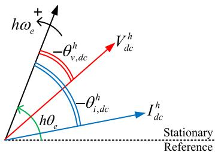  
Fig. 2. Phasor diagram of the h-order harmonics of the dc-side voltage and current with respect to the multiple of the LCR phase a voltage angle in positive sequence (i.e., hθe).

where V hdc and Ihdc are the amplitudes of the h-th harmonics inthe dc-side voltage and current ripples, respectively; with θhv,dc and θhi,dc as their corresponding phase displacements as shown in Fig. 2. Since harmonics rotate with higher frequency, their angles in Fig. 2 are shown with respect to the multiple of the rectifier terminal angle (i.e., hθe).

The oscillatory components on the dc-side variables of the LCR are normally (under balanced conditions) composed of h = (6k) th harmonics of the line frequency (i.e., 6th, 12th, …). However, under unbalanced conditions, the dc-side variables contain more oscillatory components corresponding to negative sequence components; thus, in (14)–(17)

$$
\tag{18}
$$

It is noted that under unbalanced conditions, h = 2 is typically the dominant oscillatory component in the dc-side variables.

C. Dynamic and Algebraic (i.e., Phasor) Representation of AC and DC Subsystems

The dynamics of the ac subsystem shown in Fig. 1 can be expressed using the instantaneous time-domain variables as

$$
\tag{19}
$$

For the purpose of this paper, an algebraic representation is also considered for harmonics (n-1) of ac variables through their phasor relationships. Based on (19) and noting that the source voltages eabcs are composed of fundamental frequency (n = 1) components only, the positive and negative sequence components of ac harmonics can be algebraically expressed as

$$
\tag{20}
$$

It is instructive to recall that if f = ˆf ∠ξ is the phasor of the time-domain variable f that has angular frequency ω, then f (t) = ˆf cos(ωt + ξ).

The dynamics of the dc subsystem shown in Fig. 1 can also be expressed based on the instantaneous dc variables as

$$
\tag{21}
$$

In this paper, the oscillatory components on the dc-side variables (i.e., vhdc and i hdc) are also expressed algebraically using

their phasor representations based on (21) as

$$
\tag{22}
$$

It is noted that the relationship between voltage vnet and current inet (or vhnet and i hnet) depends on the composition of the dc network.

## III. DECOMPOSITIONS OF AC AND DC VARIABLES

It is straightforward to obtain the average values of dc-side variables in (14)–(15) (i.e., v¯dc and ¯idc) using averaging as

$$
\tag{23}
$$

where x¯ is the average value of the subject voltage or current represented by variable x. To obtain their h-order harmonics (i.e., vhdc and i hdc), first their Fourier series coefficients should be calculated as

$$
\tag{24}
$$

$$
\tag{25}
$$

The amplitudes of the dc-side harmonics in (16)–(17) are then calculated as

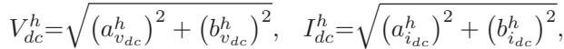

and their associated phase shifts as

(26)

$$
\tag{27}
$$

To obtain the decomposition of source voltages (2)–(3), the voltages eabcs are transformed to two synchronously rotating [with speed corresponding to fundamental frequency] qd reference frames, one rotating in positive direction with angle θs denoted by qd s, and the other one rotating in negative direction +with angle −θs denoted by qd−s, as

$$
\tag{28}
$$

where Ks is the Park’s transformation matrix [21].

After transformations (28), the positive sequence components in eabcs will appear as dc quantities in e+sqds and as oscillatory components in e−sqds S . Similarly, the negative sequence components in eabcs become dc quantities in e−sqds and appear as ripples in e+s qds . Afterwards, the averaging (23) [here with θs] is applied to e+sqds and e−sqds to remove their oscillatory terms and obtain ¯e s +qds and ¯e−sqds corresponding to positive and negative sequence source voltages, respectively. The phasor diagrams of ¯e+sqds and ¯e−s qds components in qd s and qd−s frames are shown in Fig. 3. +Based on Fig. 3, the amplitudes of positive and negative sequence components of source voltages are calculated as

$$
\tag{29}
$$

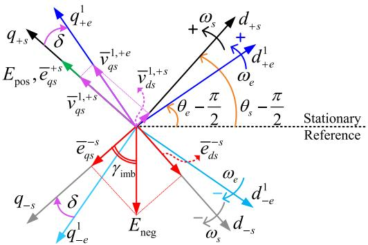  
Fig. 3. Phasor diagram of positive and negative sequence components of ac source voltages in qd reference frames synchronously rotating in positive and negative directions.

The phase displacement of the imbalance in (3) is obtained as

$$
\tag{30}
$$

Using a similar approach, the positive and negative sequence n-th harmonics of vabcs and iabcs (including fundamental frequency components with n = 1) in (7)–(10) are obtained by transforming the instantaneous ac variables to two qd reference frames, rotating with n-times the synchronous speed in positive and negative directions, respectively. Specifically, the frame denoted by qdn e rotates in positive direction with angle nθe, +and the frame denoted by qdn−e rotates in negative direction with angle −nθe. The transformed LCR ac-side terminal voltages and currents in the two qd coordinates are obtained using Park’s transformations as

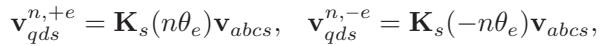

$$
\tag{31}
$$

(32)

After (31)–(32), the n-th harmonic positive sequence components in vabcs and iabcs appear as dc quantities in vn,+eqds and in, e , +qds respectively, while all other positive and negative sequence harmonic components appear as ripples. Similarly, the n-th harmonic negative sequence components in vabcs and iabcs become dc values in vn,−eqds and in,−e , qds  respectively, and all other components become ripples. Then the averaging (23) is applied to vn,+eqds , vn,−eqds and i n,+e , i n,−e , qds qds  to obtain n, e +qds v¯n,−e qds and ¯i n,+eqds , ¯i n,−eqds which correspond to the n-th harmonic positive and negative sequence components of vabcs and iabcs, respectively. A phasor diagram depicting the LCR terminal voltages and currents in multiple qdn e and qdn−e coordinates +rotating in positive and negative directions is shown in Fig. 4. Based on Fig. 4, the amplitudes of the positive and negative sequence n-th harmonics in terminal voltages and currents can be calculated as

$$
\tag{33}
$$

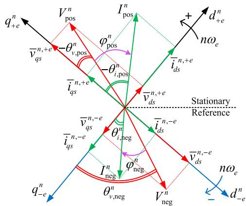  
Fig. 4. Phasor diagram of the positive and negative sequence n-th harmonics of LCR ac terminal voltages and currents in multiple qd reference frames rotating with n-times the synchronous speed in positive/negative directions.

$$
\tag{34}
$$

The respective phase shifts in (7)–(10) are computed as

$$
\tag{35}
$$

$$
\tag{36}
$$

It is noted that since the angle of fundamental frequency phase a voltage (i.e., θe) is used as the reference for transformation (31), for n = 1, v¯1 +ds 1,+e e = 0 in (35), corresponding to θ1v, = 0.

## IV. PROPOSED EXTENDED PAVM OF LCR

In the proposed extended PAVM, the LCR ac-side terminal variables vabcs and iabcs, including all their positive and negative sequence harmonics, are algebraically related to the dc-side terminal variables vdc and idc, including their average-values and oscillatory components.

## A. Construction of the Proposed PAVM

The relationships between the amplitudes of the n-th harmonics of ac variables in positive and negative sequences (i.e., magnitudes of averaged transformed qd variables) and the dc-side variables of the LCR are obtained using parametric functions wni, (·) and wni,neg(·) defined for each harmonic as

$$
\tag{37}
$$

The phase shifts of the n-th harmonic currents in positive and negative sequence defined based on (36) are also captured using

parametric functions as

$$
\tag{38}
$$

For the fundamental frequency components, the phase shift of i 1as, with respect to v1as, is also captured using a parametric pos pofunction ϕ1 (·) defined as

$$
\tag{39}
$$

which is the power factor angle of the LCR.

For dc-side variables, the average values and amplitudes of their h-order harmonics are related to the ac-side variables using parametric functions w0v,dc(·) and whv,dc(·) defined as

$$
\tag{40}
$$

The phase shifts of these oscillatory components are also captured using a parametric function θhv,dc(·) defined based on (27) for each h-order harmonic as

$$
\tag{41}
$$

Generally, it is impractical to calculate the parametric functions (37)–(41) analytically, and in PAVM methodology these functions are established numerically using several brief simulations of the system with detailed switching model of LCR. Using this approach, various operating conditions (e.g., different source imbalance, LCR loading, etc.) are simulated, and the parametric functions are computed and saved in appropriate lookup tables. For the purpose of this paper, the parametric functions (37)–(41) are stored in 3-D lookup tables in terms of source imbalance-factor A , phase displacement of the imbimbalance γ , as well as the LCR loading condition specified using a dynamic admittance defined as

$$
\tag{42}
$$

Although the requirement of running several simulations of the system with switching model of LCR may seem an impediment for establishing the parametric functions, this step is a fairly straightforward numerical procedure that can be summarized as Algorithm-1 in Fig. 5. The amount of time required to construct the parametric functions depends on the range of considered loading conditions and operating modes as well as the desired resolution of lookup tables (e.g., A for minimum imb,minand A for maximum imbalance with the resolution of imb,maxA ). Choosing a higher resolution for the lookup tables imb,stepallows a more precise prediction of the waveforms in the PAVM. However, this is a compromise between the required accuracy and the size (and construction time) of the parametric functions. It is noted that construction of lookup tables is a one-time process that can be even executed by simulation program automatically (e.g., during the compilation process) and using the fast approach in [24].

Algorithm 1.Numerical method for establishing parametric functions for the proposed extended PAVM.  
1. for Aimb =Amb,min to Amb,max StepAmb,step do   
2.for Yimbintbaxtebpd   
Initialize the system with the LCR switching model   
4. Start simulation, vary dc load over the desired range   
Calculate dynamic admittance ya (42)   
6. Compute and process parametric functions (37)-(41)   
Save parametric functions in 3-D lookup tables with   
respect to Aimb ,Yimb and yd   
8. End simulation   
9. end for   
10.end for  
Fig. 5. Pseudo-code for computing parametric functions of the PAVM.

To construct the proposed PAVM for thyristor-controlled LCRs, the firing angle of thyristors is used as an additional dimension for the parametric functions. The corresponding lookup tables can be readily extracted using the same Algorithm-1 with the addition of one for-loop for the firing angle. The rest of the methodology is applicable to thyristor-controlled LCRs as well.

## B. Implementation of the Proposed PAVM

The implementation of the proposed extended PAVM is illustrated in Fig. 6. In this paper, it is asuumed that the PAVM model takes the ac-side voltages eabcs, vabcs and the dc current idc as its inputs, and it calculates the ac currents iabcs and the dc voltage vdc as the outputs.

The input voltages vabcs are used in (31) to calculate v¯1,+eqds , which is used together with the dc current idc to calculate yd in (42). Then, the calculated yd is used with A and γ imb imb[which are computed from eabcs using (4), (28)–(30)] as inputs to the lookup tables to calculate the parametric functions (37)– (41). Using the computed parametric functions and the input dc current, the fundamental frequency (n = 1) positive sequence components of the ac currents in qd1 e coordinates are calculated based on (37), (39) as

$$
\tag{43}
$$

$$
\tag{44}
$$

Also, the n-th harmonic positive and negative sequence components of the ac currents in qdn e and qdn−e coordinates are obtained based on (37), (38) as

$$
\tag{45}
$$

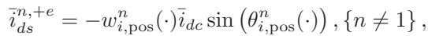

$$
\tag{46}
$$

$$
\tag{47}
$$

(48)

The total ac currents as outputs of the PAVM are then obtained by transforming the qd currents computed in (43)– (48) back to

abc coordinates and adding them as

$$
\tag{49}
$$

where nmax is the highest-order ac harmonic based on (13) included in PAVM. In (49), the angle θe can be obtained from the LCR ac terminal voltages using a phase-locked-loop (PLL). Alternatively, it may be calculated using the angle of source voltages θs based on (12), where δ is calculated based on Fig. 3 as

$$
\tag{50}
$$

To calculate the dc-side outputs, the computed v¯1,+eqds  is used with the parametric functions to calculate the average value of the dc voltage based on (40) as

$$
\tag{51}
$$

The dc voltage harmonics are also calculated based on (16), (40)–(41) as

$$
\tag{52}
$$

Combining (51) and (52), the total dc-side output voltage is obtained as

$$
\tag{53}
$$

where hmax is the maximum order of harmonics based on (18) included in PAVM to reconstruct the dc-side variables.

It is noted that proper selection of nmax in (49) and hmax in (53) is a compromise between the accuracy and the simulation speed; where including higher-order harmonics requires more computations.

To connect the PAVM with external networks, the discrete switches of the LCR are replaced with continuous controlled current and voltage sources which are interfaced with ac and dc subsystems, respectively, as shown in Fig. 7. It is assumed that the circuits of ac and dc subsystems are implemented in the native environment of the considered EMT simulation program. It is also noted that some simulation packages may require use of artificial snubbers in parallel with current sources for proper interfacing, as demonstrated in Fig. 7.

## V. VERIFICATION OF THE PROPOSED EXTENDED PAVM

Here, performance of the proposed extended PAVM is investigated in reconstructing the waveforms of ac–dc system under unbalanced ac network conditions. For this purpose, a reduced-scale experimental setup of the system in Fig. 1(similar to the setup in [27, Fig. 8], [28]) has been used in the laboratory. Therein, a three-phase permanent magnet synchronous generator is used as the ac subsystem whose speed is fixed corresponding to 60 Hz electrical frequency, generating harmonicfree sinusoidal voltages, emulating a three-phase equivalent network/source. The RLC low-pass filter in the dc subsystem is formed using passive (non-ideal) inductor and capacitor elements. Also, a resistive load is considered for the dc network, whose value (combined with connecting wires, etc.) is set to rl = 32.78 Ω in order to operate the LCR in CCM-1 [32] mode. The parameters of the system are summarized in the Appendix [28].

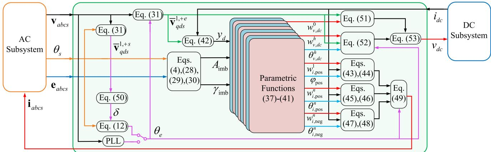  
Fig. 6. Implementation of the proposed extended PAVM capable of considering unbalanced conditions in the ac network.

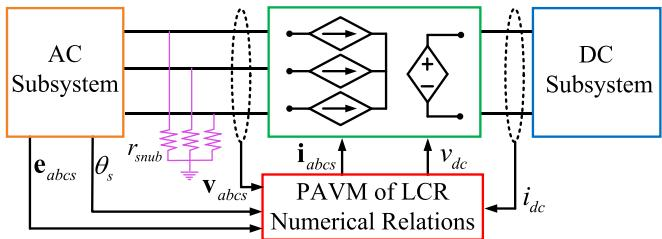  
Fig. 7. Interfacing of the proposed extended PAVM with the ac and dc subsystems using continuous controlled current and voltage sources.

For time-domain simulations, the detailed model of the system in Fig. 1 has been implemented in MATLAB/Simulink [11] using PLECS toolbox [12]. The coupled-circuit phase-domain (CCPD) model [21] is used for the synchronous generator and standard library components for the remaining elements. The detailed model of the LCR is realized using semiconductor switches in the library of PLECS.

The proposed PAVM has also been implemented in Simulink based on Figs. 6–7 using (37)–(53) considering up to 7th harmonics for ac-side variables (i.e., nmax = 7) and 2nd-order harmonics for dc-side variables (i.e., hmax = 2). The qd model [21] is used for the generator in ac subsystem, and (21) is used to model the dc subsystem in Simulink. The system model is labeled as PAVM-DH, where the PAVM is used for LCR and the full dynamic model is used to represent all considered harmonics (DH: Dynamic Harmonics). Another model labeled as PAVM-PH is also considered, where the LCR is modeled using the proposed PAVM while the steady-state (algebraic) phasors (20), (22) are used for ac- and dc-side harmonics, respectively, (PH: Phasor Harmonics).

## A. Comparison of Time-Domain Transients

For the considered study, the system is assumed to initially operate in steady-state without any fault/imbalance. Then, at t = 2.13 s, a single-phase fault occurs and phase c of the ac source (as shown in Fig. 1) is disconnected from the LCR. Series connected switches are used in experiments and the detailed switching model to disconnect one of the phases from the LCR terminals. In the two proposed PAVM-DH and PAVM-PH models, the disconnection of phase c is equivalent to changing A from zero to %50. The measured and simulated (with all imbconsidered models) transient response of the ac- and dc-side variables are shown in Fig. 8. Also, the magnified views of several representative variables from Fig. 8 are shown in Fig. 9 for better clarity.

As seen in Figs. 8–9, the detailed switching model provides results that are very close to the measurements from the experimental setup, both in steady-state and in transient. This first of all verifies the accuracy of the detailed switching model (based on which the proposed PAVMs have been constructed). It is also seen that disconnection of phase c (whose current becomes zero in Fig. 8(h)) distorts the ac and dc variables. In configuration after the fault, the ac–dc system becomes effectively a single-phase LCR with dc load.

It is also observed in Figs. 8–9 that both PAVM-DH and PAVM-PH models are capable of effectively reconstructing the distorted ac- and dc-side variables under unbalanced conditions in steady-state and capture their dynamics in transients, with high accuracy compared to the detailed switching model and experiments. It is also seen in Figs. 8(c)–8(h) and Figs. 9(c)–9(d) that including up to the 7th harmonics in positive and negative sequences is adequate for the extended PAVM to accurately reconstruct the ac waveforms. It is also observed in Figs. 8(a)–(b) and Figs. 9(a)–9(b), that including only the 2nd-order harmonics for the dc-side variables is sufficient for reproducing the dc-current, and fairly adequate for reconstructing the major ripples on the dc-voltage. This is due to the fact that higher-order harmonics become less significant very quickly.

The harmonic spectrums of the measured and simulated ac and dc currents are depicted in Figs. 10–11, respectively, when phase c is disconnected. It is noted that both PAVM-DH and PAVM-PH models are equivalent in steady-state, and thus produce identical spectrums in Figs. 10–11(labeled as PAVM). Fig. 10 shows that the 7th harmonic is fairly small, and considering higher-order harmonics may not be necessary. It also verifies that the proposed PAVM can accurately extract the harmonic content of ac currents (hence ac voltages) compared to the detailed model and experiments.

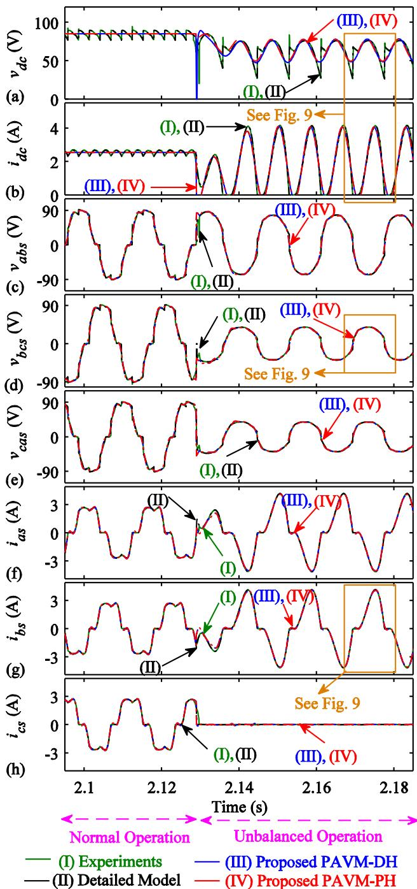  
Fig. 8. Transient response of the dc- and ac-side variables of the LCR as measured from experiments and predicted by the subject models. Initially, the LCR operates normally in CCM-1 mode; and at t = 2.13 s, phase c becomes disconnected: (a) vdc, (b) idc, (c) vabs, (d) vbcs, (e) vcas, (f) ias, (g) ibs and (h) ics.

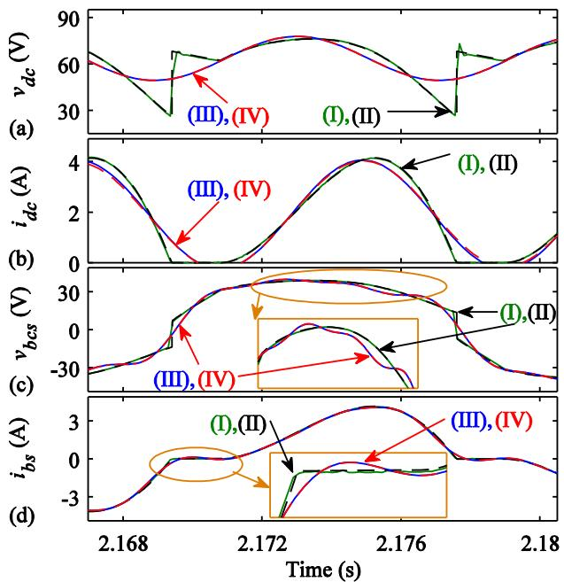  
(I) Experiments (III) Proposed PAVM-DH (I) Detailed Model (IV) Proposed PAVM-PH

Fig. 9. A magnified view of Fig. 8 at the moment of fault for transient response of the dc and several ac variables: (a) vdc, (b) idc, (c) vbcs, and (d) ibs.  
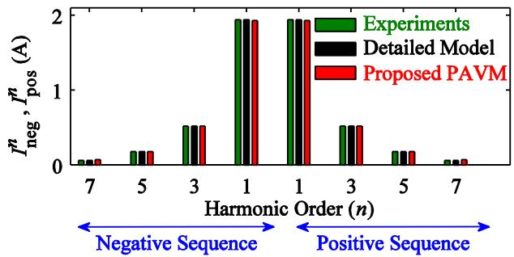

Fig. 10. Spectrum of ac current harmonics in positive and negative sequences when phase c is disconnected, as obtained from experiments and predicted by the subject models.  
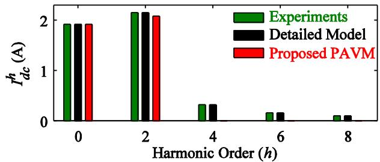  
Fig. 11. Spectrum of dc current harmonics when phase c is disconnected, as obtained from experiments and predicted by the subject models. The h = 0 component represents the average-value of dc current.

It is also seen in Fig. 11 that the PAVM can accurately predict the average-value and 2nd-order harmonic of dc current (hence dc voltage), where higher-order components are not included. Moreover, it is seen in Fig. 11 that the 2nd-order harmonic is the dominant component in the dc current and even larger than the average value, that is consistent with observations in Figs. 8(b)

TABLE I.  
COMPUTATIONAL PERFORMANCE OF THE SUBJECT MODELS FOR A SAMPLE 5-SECOND TRANSIENT STUDY  
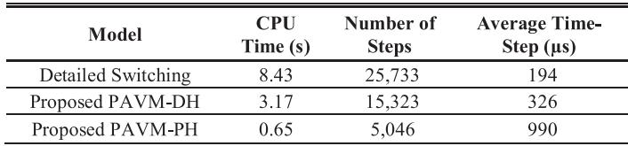

and 9(b). The higher-order harmonics (i.e., 4th, 6th, 8th, etc.) are less significant as seen in Fig. 11, although can be included in the extended PAVM for higher accuracy of reconstructing the dc-side variables, if desired.

## B. Computational Performance

Here, the simulation speed and numerical efficiency of the two proposed PAVM-DH and PAVM-PH models of the LCR are benchmarked against its switching detailed model. The same transient study of Section V-A (see Fig. 8) is run in MATLAB/Simulink with the three subject models, where the simulations continue until t = 5s. The same solver ode23tb (with maximum time-step of 10-3 s and relative/absolute tolerance of 10-3) is selected for all models. All simulations are executed on a computer with Intel CoreTM i7-4510U @2.00GHz processor. The computational performance of the subject models is summarized in Table I.

As seen in Table I, the PAVM-PH and PAVM-DH models are much faster than the detailed switching model, i.e., 0.65s vs. 3.17s vs. 8.43s of CPU time, respectively, while providing almost identical waveforms for ac- and dc-side variables of the LCR, as verified in Figs. 8–11. The PAVM-PH and PAVM-DH models are also numerically more efficient than the detailed switching model, i.e., each taking 5046 vs. 15323, vs. 25733 time-steps, respectively. Also, the average time-step taken during the simulation is much larger with PAVM-PH and PAVM-DH models, i.e., 990µs and 326µs, compared to 194µs for the switching model. Since PAVMs avoid discrete switching events, they do not require to detect zero-crossings and naturally permit larger time-steps sizes.

It is also observed in Table I that algebraic/phasor representation of the ac and dc harmonics in the subsystems of PAVM-PH has resulted in a faster and more efficient model compared to the PAVM-DH (i.e., CPU time 0.65s vs. 3.17s; average-time step 990µs vs. 326µs; and number of time-steps 5046 vs. 15323). This is achieved due to avoiding additional calculations when harmonics are represented with dynamics.

It should also be noted that the application of the PAVM-PH requires a simulation package that allows both dynamic and phasor implementation of ac variables simultaneously.

## C. Verification of PAVM in Frequency-Domain

The frequency-domain small-signal impedance-based analysis is a practical and widely used method for assessing dynamic stability of ac–dc power-electronic-based systems. Therein, small-signal impedance of the ac–dc converters is utilized with a Nyquist-type criterion [33]. However, determining the smallsignal impedances of the nonlinear line-commutated ac–dc converters has always been a challenge. An analytical approach has been developed in [34], where the impedance of the dc subsystem is mathematically mapped into the ac subsystem and used to derive the small-signal input impedance of the LCR. The positive and negative sequence ac-side input impedances (Zac in Fig. 1) of the LCR are analytically expressed based on the impedance of the dc subsystem (Zdc in Fig. 1) as [34]

$$
\tag{54}
$$

$$
\tag{55}
$$

The accuracy and usefulness of the proposed PAVM (PAVM-DH and PAVM-PH are equivalent in this case) for obtaining the small-signal impedances of the LCR system are compared here with the detailed switching model and the analytical formulations (54)–(55). For this purpose, small- signal perturbations in positive and negative sequences are injected into the ac sources in Fig. 1 at different frequencies during the simulation with the detailed switching model, and the input impedance is calculated at each frequency. For consistency, the linearization procedure is also done for the PAVM, while (54)–(55) are used as the analytical method.

The corresponding results for the magnitude and phase of positive and negative sequence small-signal input impedances are illustrated in Figs. 12–13, respectively. Therein, the magnitude and phase of the dc subsystem impedance (Zdc) is also depicted to show how it is mapped into ac impedances (Zac) through the nonlinear LCR. It is worth mentioning that average-value models are in general only capable of capturing the dynamics up to half of the switching frequency [35]–[36]. In case of a 6-pulse LCR with a 60Hz ac network, the switching frequency becomes 360 Hz; therefore, the results are obtained up to 180 Hz in Figs. 12–13.

As it can be observed from Figs. 12–13, the analytical method is not able to accurately predict the positive and negative sequence input impedances in the considered range of frequencies. This mismatch is due to the required simplifying assumptions (e.g., ideal switches, no harmonics, no commutating inductances, etc.) that have been used in [34] for deriving the analytical formulations (54)–(55). The correctness of (54)–(55) for the idealized LCR system has been confirmed by setting the corresponding nonidealities of the system in Fig. 1 to zero and reproducing the results [which then converge to the results of analytical method (54)–(55)].

Meanwhile, it is seen in Figs. 12–13 that the proposed PAVM provides an excellent match compared to the results of the detailed switching model for calculating the small-signal input impedance of LCR in both positive and negative sequences.

Given the fact that the PAVM is continuous (suitable for linearization) and is orders of magnitude faster than the detailed switching model [as verified in Section V–B and observed from Table I (e.g., PAVM-PH is almost 13 times faster than the switching model)], it is envisioned that it can be effectively utilized for computing the small-signal input impedance of the LCRs for efficient and practical dynamic stability analysis of ac–dc power systems.

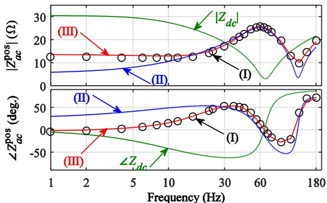  
O O (I) Detailed Model ─ (II) Analytical Method (III) Proposed PAVM

Fig. 12. Magnitude and phase of positive sequence input impedance of LCR as obtained by the detailed model, analytical method and proposed PAVM.  
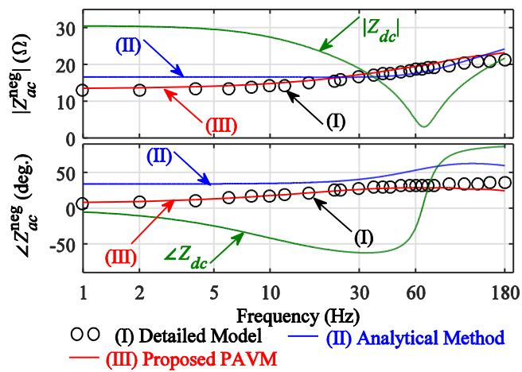  
Fig. 13. Magnitude and phase of negative sequence input impedance of LCR as obtained by the detailed model, analytical method and proposed PAVM.

## D. Verification of PAVM With Sub-Synchronous Oscillations

The sub-synchronous oscillations may occur in power systems due to disturbances, switching, and interactions among various components as well as controllers [37]–[38]. Here, the capability of the proposed extended PAVM is investigated in reconstructing such lower-frequency dynamics through timedomain transient studies. For this purpose, it is assumed that the system of Fig. 1 is initially operating in a steady-state condition. Then, at t = 1.5s, speed of the generator is subjected to some sub-synchronous oscillations, and correspondingly the electrical frequency undergoes fluctuation modeled as

$$
\tag{56}
$$

where u(t) is the unity step function. Also, f ocs is the subsynchronous component, which is assumed to be in the form

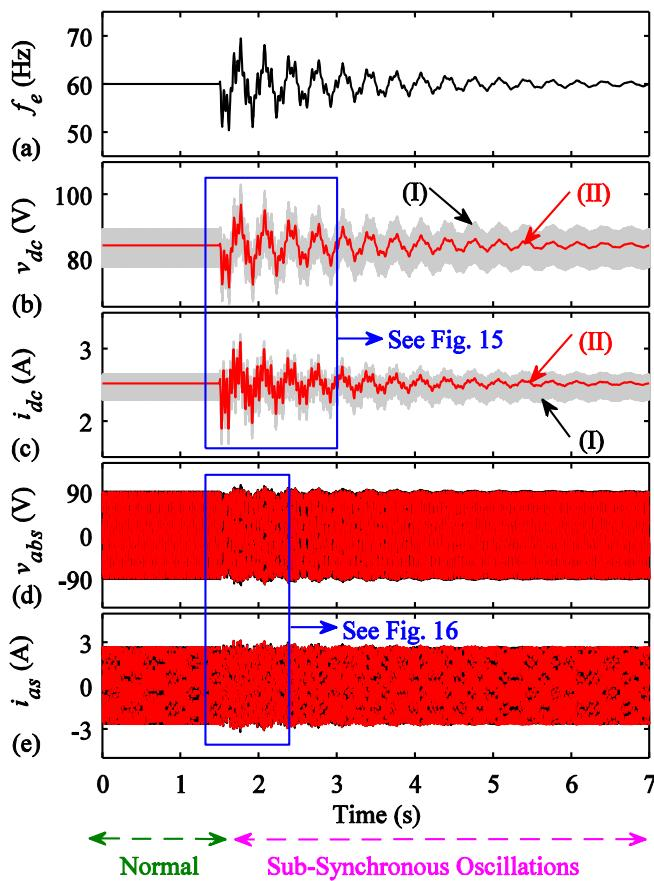  
— (I) Detailed Model (II) Proposed PAVM  
Fig. 14. Transient response of several system variables due to subsynchronous oscillations introduced at t = 1.5s as obtained by the detailed model and proposed PAVM for: (a) ac frequency, (b) rectifier dc voltage, (c) dc current, (d) ac line voltage vabs, and (e) phase a current.

of

$$
\tag{57}
$$

composed of a 3Hz slow-damped component, and two fasterdamped 10Hz and 23 Hz components, respectively. It is noted that f ocs considered in (57) is an example, and may be defined differently. The exact form of sub-synchronous transient depends on many factors and parameters of the system, and it may have several damped or growing low frequency components [38].

The transient response of dc and several ac variables is shown in Fig. 14. Also, magnified views of the variables at the moment of transient are shown in Figs. 15–16 for better clarity. As it can be observed in Figs. 14–16, the oscillations in the speed/frequency cause similar-profile oscillations in both dcand ac-side variables. This is due to the fact that the amplitude of the ac voltage generated by the considered permanent magnet synchronous machine is directly proportional to the speed/frequency. It is also verified that the proposed PAVM has an excellent accuracy in capturing the sub-synchronous dynamics on ac variables and average values of dc variables compared to the detailed switching model.

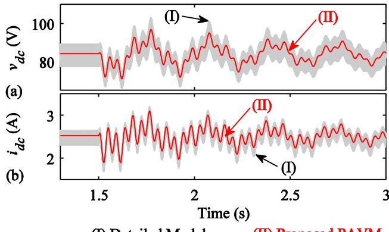  
— (I) Detailed Model (II) Proposed PAVM

Fig. 15. Magnified view of the dc variables in Fig. 14 at the moment of transient as obtained by the detailed model and the proposed PAVM for: (a) vdc, and (b) idc.  
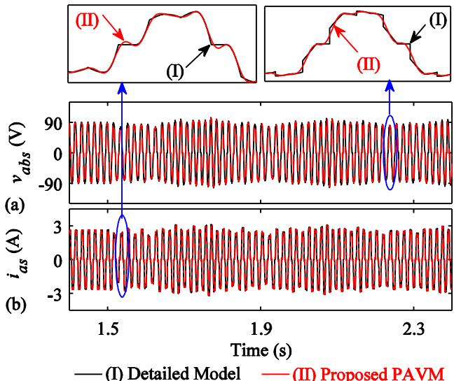  
Fig. 16. Magnified view of the ac variables in Fig. 14 at the moment of transient as obtained by the detailed model and the proposed PAVM for: (a) vabs, and (b) ias.

## VI. CONCLUSION

A new parametric average-value model (PAVM) has been developed for line-commutated rectifiers operating under unbalanced conditions created due to imbalance in the ac network. This has been achieved by formulating the ac harmonics in positive and negative sequences as well as the dc-side harmonics (ripples), all with respect to the imbalance of the ac network. Specifically, the ac- and dc-side harmonics have been formulated using both their dynamic and algebraic (i.e., steady-state phasor) representations that resulted in two implementations referred to as PAVM-DH and PAVM-PH, each of which may find their application depending on the available simulation environment. The proposed PAVMs have been validated experimentally and by extensive steady-state and transient simulations in timedomain, as well as impedance prediction in frequency-domain. The new PAVMs have been demonstrated to reconstruct the ac and dc variables very accurately under significant unbalanced ac network conditions; while being orders of magnitude faster than the switching model of the LCR. The advantageous features of the proposed PAVMs makes them attractive for possible implementation in offline and/or real-time EMT simulation platforms for faster and more efficient studies as well as stability analysis of ac–dc networks, e.g., HVDC systems, when unbalanced conditions, faults, and sub-synchronous oscillations need to be considered in the power system.

## APPENDIX

Permanent Magnet Synchronous Generator Parameters [28]: Number of poles: 8, voltage constant: 0.153 V.s/rad, rs = 0.748 Ω, Ld = 6.06 mH, Lq = 7.6 mH.

Parameters of LCR Diodes:

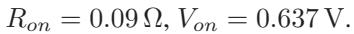

DC Filter Parameters: rf = 0.605 Ω, Lf = 12.40 mH, Cf = 470 μF.

## REFERENCES

[1] C. Guo, Y. Zhang, A. M. Gole, and C. Zhao, “Analysis of dual-infeed HVDC with LCC-HVDC and VSC-HVDC,” IEEE Trans. Power Del., vol. 27, no. 3, pp. 1529–1537, Jul. 2012.

[2] J. M. Carrasco et al., “Power electronic systems for the grid integration of renewable energy sources: A survey,” IEEE Trans. Ind. Electron., vol. 53, no. 4, pp. 1002–1016, Jun. 2006.

[3] D. C. Aliprantis, S. D. Sudhoff, and B. T. Kuhn, “A brushless exciter model incorporating multiple rectifier modes and preisach’s hysteresis theory,” IEEE Trans. Energy Convers., vol. 21, no. 1, pp. 136–147, Mar. 2006.

[4] A. Emadi, M. Ehsani, and J. M. Miller, Vehicular Electric Power Systems: Land, Sea, Air, and Space Vehicles. USA: Marcel-Dekker, 2004.

[5] B. Zahedi and L. E. Norum, “Modeling and simulation of all-electric ships with low-voltage dc hybrid power systems,” IEEE Trans. Power Electron., vol. 28, no. 10, pp. 4525–4537, Oct. 2013.

[6] A. Cross, A. Baghramian, and A. Forsyth, “Approximate, average, dynamic models of uncontrolled rectifiers for aircraft applications,” IET Power Electron., vol. 2, no. 4, pp. 398–409, Jul. 2009.

[7] I. Yilmaz, M. Ermis, and I. Cadirci, “Medium-frequency induction melting furnace as a load on the power system,” IEEE Trans. Ind. Appl., vol. 48, no. 4, pp. 1203–1214, Jul./Aug. 2012.

[8] J. F. Fuller, E. F. Fuchs, and D. J. Roesler, “Influence of harmonics on power distribution system protection,” IEEE Trans. Power Del., vol. 3, no. 2, pp. 549–557, Apr. 1988.

[9] P. M. Donohue and S. Islam, “The effect of non-sinusoidal current waveforms on electromechanical and solid-state overcurrent relay operation,” IEEE Trans. Ind. Appl., vol. 46, no. 6, pp. 2127–2133, Nov./Dec. 2010.

[10] “IEEE recommended practices and requirements for harmonic control in electric power systems,” IEEE Standard. pp. 519–2014, Jun. 2014.

[11] Simulink Dynamic System Simulation Software, User’s Manual (Math-Works Inc.), 2018. [Online]. Available: http://www.mathworks.com

[12] Piecewise Linear Electrical Circuit Simulation (PLECS), User’s Manual, Version 3.7 (Plexim GmbH), 2018. [Online]. Available: www.plexim.com

[13] M. O. Faruque, V. Dinavahi, and W. Xu, “Algorithms for the accounting of multiple switching events in digital simulation of power-electronic systems,” IEEE Trans. Power Del., vol. 20, no. 2, pp. 1157–1167, Apr. 2005.

[14] EMTDC User’s Guide, Chapter 4, Interpolation and switching, 2018. [Online]. Available: http://www.hvdc.ca

[15] A. M. Gole, S. Filizadeh, R. W. Menzies, and P. L. Wilson, “Optimizationenabled electromagnetic transient simulation,” IEEE Trans. Power Del., vol. 20, no. 1, pp. 512–518, Jan. 2005.

[16] RTDS Technologies, “Modelling large systems - Alternatives for network equivalents.pdf”. [Online]. Available: https://knowledge.rtds.com/hc/enus/articles/360034827413-Superstep

[17] M. Daryabak, S. Filizadeh, and A. Bagheri Vandaei, “Dynamic phasor modeling of LCC-HVDC systems: Unbalanced operation and commutation failure,” Can. J. Elect. Comput. Eng., vol. 42, no. 2, pp. 121–131, Jun. 2019.

[18] C. Liu, A. Bose, and P. Tian, “Modeling and analysis of HVDC converter by three-phase dynamic phasor,” IEEE Trans. Power Del., vol. 29, no. 1, pp. 3–12, Feb. 2014.

[19] S. D. Sudhoff, “Waveform reconstruction from the average-value model of line-commutated converter-synchronous machine system,” IEEE Trans. Energy Convers., vol. 8, no. 3, pp. 404–410, Sep. 1993.

[20] S. D. Sudhoff, K. A. Corzine, H. J. Hegner, and D. E. Delisle, “Transient and dynamic average-value modeling of synchronous machine fed loadcommutated converters,” IEEE Trans. Energy Convers., vol. 11, no. 3, pp. 508–514, Sep. 1996.

[21] P. C. Krause, O. Wasynczuk, S. D. Sudhoff, and S. Pekarek, Analysis of Electric Machinery and Drive Systems, 3rd ed. Piscataway, NJ, USA: IEEE Press, 2013.

[22] I. Jadric, D. Borojevic, and M. Jadric, “Modeling and control of a synchronous generator with an active DC load,” IEEE Trans. Power Electron., vol. 15, no. 2, pp. 303–311, Mar. 2000.

[23] J. Jatskevich, S. D. Pekarek, and A. Davoudi, “Parametric average-value model of a synchronous machine-rectifier system,” IEEE Trans. Energy Convers., vol. 21, no. 1, pp. 9–18, Mar. 2006.

[24] J. Jatskevich, S. D. Pekarek, and A. Davoudi, “Fast procedure for constructing an accurate dynamic average-value model of synchronous machine-rectifier system,” IEEE Trans. Energy Convers., vol. 21, no. 2, pp. 435–441, Jun. 2006.

[25] S. Chiniforoosh et al., “Dynamic average modeling of front-end diode rectifier loads considering discontinuous conduction mode and unbalanced operation,” IEEE Trans. Power Del., vol. 27, no. 1, pp. 421–429, Jan. 2012.

[26] S. Ebrahimi, N. Amiri, H. Atighechi, J. Jatskevich, and L. Wang, “Performance verification of parametric average-value model of line-commutated rectifiers under unbalanced conditions,” in Proc. IEEE 16th Workshop Control Model. for Power Electron., Vancouver, Canada, 2015, pp. 1–6.

[27] S. Ebrahimi et al., “Generalized parametric average-value model of linecommutated rectifiers considering ac harmonics with variable frequency operation,” IEEE Trans. Energy Convers., vol. 33, no. 1, pp. 341–353, Mar. 2018.

[28] S. Ebrahimi, N. Amiri, Y. Huang, L. Wang, and J. Jatskevich, “Averagevalue modeling of diode rectifier systems under asymmetrical operation and internal faults,” IEEE Trans. Energy Convers., vol. 33, no. 4, pp. 1895–1906, Dec. 2018.

[29] S. Ebrahimi, N. Amiri, L. Wang, and J. Jatskevich, “Parametric averagevalue modeling of thyristor-controlled rectifiers with internal faults and asymmetrical operation,” IEEE Trans. Power Del., vol. 34, no. 2, pp. 773–776, Apr. 2019.

[30] Y. Zhang and A. M. Cramer, “Formulation of rectifier numerical averagevalue model for direct interface with inductive circuitry,” IEEE Trans. Energy Convers., vol. 34, no. 2, pp. 741–749, Jun. 2019.

[31] C. L. Fortescue, “Method of symmetrical co-ordinates applied to the solution of polyphase networks,” Trans. Amer. Inst. Elect. Eng., vol. 37, no. 2, pp. 1027–1140, Jul. 1918.

[32] N. Mohan, T. M. Undeland, and W. P. Robbins, Power Electronics, 3rd ed., New York, NY, USA: Wiley, 2003.

[33] J. Sun, “Impedance-based stability criterion for grid-connected inverters,” IEEE Trans. Power Electron., vol. 26, no. 11, pp. 3075–3078, Nov. 2011.

[34] Z. Bing, K. J. Karimi, and J. Sun, “Input impedance modeling and analysis of line-commutated rectifiers,” IEEE Trans. Power Electron., vol. 24, no. 10, pp. 2338–2346, Oct. 2009.

[35] G. W. Wester and R. D. Middlebrook, “Low-frequency characterization of switched DC–DC converters,” IEEE Trans. Aerosp. Electron. Syst., vol. 9, no. 3, pp. 376–385, May 1973.

[36] X. Wang and F. Blaabjerg, “Harmonic stability in power electronic-based power systems: Concept, modeling, and analysis,” IEEE Trans. Smart Grid, vol. 10, no. 3, pp. 2858–2870, May 2019.

[37] L. Chen, W. Zhao, F. Wang, Q. Wang, and S. Huang, “An interharmonic phasor and frequency estimator for subsynchronous oscillation identification and monitoring,” IEEE Trans. Instr. Meas., vol. 68, no. 6, pp. 1714–1723, Jun. 2019.

[38] Y. Li, L. Fan, and Z. Miao, “Wind in weak grids: Low-frequency oscillations, subsynchronous oscillations, and torsional interactions,” IEEE Trans. Power Syst., vol. 35, no. 1, pp. 109–118, Jan. 2020.

Seyyedmilad Ebrahimi (Member, IEEE) received the B.Sc. and M.Sc. degrees in electrical engineering from the Sharif University of Technology, Tehran, Iran, in 2010 and 2012, respectively, and the Ph.D. degree in electrical and computer engineering from The University of British Columbia, Vancouver, BC, Canada, in 2019. He is currently a Postdoctoral Research Fellow with Electrical and Computer Engineering Department, The University of British Columbia. His research interests include modeling and analysis of power electronic converters and electrical machines, application of power electronics to power systems, modeling and control of power systems, and simulation of electromagnetic transients.

Navid Amiri (Member, IEEE) received the B.Sc. and M.Sc. degrees in electrical engineering in the field of power and electrical machines from the Isfahan University of Technology, Isfahan, Iran, in 2008 and 2011, respectively, and the Ph.D. degree in electrical and computer engineering from The University of British Columbia, Vancouver, BC, Canada, in 2019. He is currently a Postdoctoral Research Fellow with Electrical and Computer Engineering Department, The University of British Columbia. His research interests include numerically efficient modeling of

electric machines, real-time simulation, electromechanical energy conversion systems, electric machine design, and power electronics.

Juri Jatskevich (Fellow, IEEE) received the M.S.E.E. and Ph.D. degrees in electrical engineering from Purdue University, West Lafayette IN, USA, in 1997 and 1999, respectively. Since 2002, he has been with The University of British Columbia, Vancouver, BC, Canada, where he is currently a Professor with the Department of Electrical and Computer Engineering. His research interests include power electronic systems, electrical machines and drives, and modeling and simulation of electromagnetic transients. He chaired the IEEE CAS Power Systems and Power

Electronic Circuits Technical Committee from 2009 to 2010, and was an Associate Editor for IEEE TRANSACTIONS ON POWER ELECTRONICS from 2008 to 2013, the Editor-in-Chief of the IEEE TRANSACTIONS ON ENERGY CONVERSION from 2013 to 2019, and the Editor-in-Chief At-Large for the IEEE PES journals in 2019–2020. He was the General Chair for the 2015 IEEE Control and Modeling for Power Electronics conference. He is also chairing the IEEE Task Force on Dynamic Average Modeling, under Working Group on Modeling and Analysis of System Transients Using Digital Programs.