Received 15 May 2022; revised 5 September 2022; accepted 25 October 2022. Date of publication 26 October 2022; date of current version 12 January 2023.

Digital Object Identifier 10.1109/OAJPE.2022.3217601

# Faster-Than-Real-Time Hardware Emulation of Transients and Dynamics of a Grid of Microgrids

SHIQI CAO (Graduate Student Member, IEEE), NING LIN (Member, IEEE), AND VENKATA DINAVAHI (Fellow, IEEE)

Department of Electrical and Computer Engineering, University of Alberta, Edmonton, AB T6G 2V4, Canada CORRESPONDING AUTHOR: S. CAO (sc5@ualberta.ca)

This work was supported by the Natural Sciences and Engineering Research Council of Canada (NSERC).

ABSTRACT Enhanced environmental standards are leading to an increasing proportion of microgrids (MGs) being integrated with renewable energy resources in modern power systems, which brings new challenges to simulate such a complex system. In this work, comprehensive modeling of a grid of microgrids for faster-than-real-time (FTRT) emulation is proposed, which can be utilized in the energy control center for contingencies analysis and dynamic security assessment. Electromagnetic transient (EMT) modeling is applied to the microgrid in order to reflect the detailed device processes of the converter and renewable energy sources, while the AC grid utilizes the transient stability modeling to reduce the computational burden and obtain a high acceleration value over real-time execution. Consequently, a dynamic power injection interface is proposed for the coexistence of the two simulation types. The reconfigurability and parallelism of the field-programmable gate arrays (FPGAs) enable the whole system to be executed in FTRT mode with 51 times acceleration over real-time. Meanwhile, three case studies are emulated and the results are validated by the off-line simulation tool Matlab/Simulink
R .

INDEX TERMS Battery energy storage system, doubly fed induction generator, dynamic simulation, electromagnetic transients, faster-than-real-time, field programmable gate arrays, hardware emulation, hardwarein-the-loop simulation, microgrids, parallel processing, photovoltaic array, predictive control, real-time systems, transient stability simulation, wind turbine.

# I. INTRODUCTION

HE penetration of microgrids (MGs) with renewable energy resources has been increasing in the power system to alleviate the energy crisis and environmental issues [1]. The traditional centralized structure of the power systems is not efficient to meet the growing electricity demand due to the power loss in the transmission network [2]. Therefore, modern power systems are experiencing a shift from centralized generation to distributed generation [3]. The distributed generation with multiple MGs integrated may bring new challenges including designing, operating, and coordinating the complex system. Considering that in such an integrated network a small disturbance may spread to other areas and cause severe damage to the whole system, it further increases the complexity of controlling the microgrid cluster.

To deal with the complexity caused by the integration of MGs, a variety of models and control strategies have been developed and investigated in the literature. Most of the existing microgrid technologies focus on one specific aspect, such as energy management, control methods [4], [5], [6], [7], optimal power flow [8], or protection schemes [9], [10]. Meanwhile, some simulation models for analyzing the microgrids are also investigated, e.g., the detailed and simplified models for the energy storage system (ESS) in MGs are presented in [11] and [12]. Although significant progress has been made, these research results lack hardware support and the simulation models mentioned above are hard to realize in real-time, which is insufficient for modern energy control center that requires taking remedial actions immediately after a disturbance. Furthermore, it falls short of revealing the

impact of multiple MGs on the AC grid with which they are integrated.

While there is still further research needed related to real-time simulation of the MGs, significant progress has been made in the literature which can be categorized into four aspects: 1) the design and modeling of MG components to achieve real-time simulation [13], [14], [15], [16], [17], [18], [19], [20]; 2) the utilization of existing commercial real-time simulators [21], [22], [23], [24]; 3) the development of real-time virtual test bed for MGs [25], [26], [27]; 4) novel computational approaches for distribution grids [29], [30]. Real-time simulation prefers the models with lower computational burden, and therefore, the relatively simpler models or equivalent dynamic models have been developed. Machine learning (ML) based models have also been investigated to selectively model and simulate MG components [15], [16], which significantly reduced the hardware consumption; however, the ML-based models may ignore some dynamics of the MG components to obtain a higher simulation speed. Thus, these modeling approaches still require further research to meet the requirements of modern power systems for dynamic security assessment. Commercial real-time simulators are usually executed on high-performance processors or supercomputers to realize the high-speed simulation for microgrids [35], which are able to conduct the simulation of MG components in real-time. Although their accuracy and efficiency can be guaranteed due to the high processing frequency, the cost of the computing equipment is the main factor that limits their widespread application. Meanwhile, the hardware-in-the-loop (HIL) simulation is also utilized in modern power systems and has also been applied to investigating microgrids [26], [36]. The hardware resources of the existing simulators restricts the scale of MG or MG clusters. Only a relatively small scale microgrid is tested and neither power dispatch nor interactions among grid components are investigated in the above papers. Virtual testbeds for cyber and physical data acquisition have caught a lot of attention in MG simulation, which can also coordinate with other unconventional modeling methods to realize real-time simulation [27]. Due to their flexibility and scalability, virtual testbeds are convenient to reconfigure and adapt to various systems without depending on specialized hardware; however, they have limited real-time simulation capabilities, especially in applications that require deterministic, low-latency feedback loops for real hardware [27]. The lack of efficient physical interfaces is also another one of their drawbacks. Furthermore, some novel approaches were also proposed for real-time simulation of MGs. Commonly, EMT simulation method is adopted for detailed representation of MG components described by non-linear differential algebraic equations. Parallel solution approaches were therefore put forward to gain a high-speed execution. These methods usually require sufficient hardware resources for parallel processing, and multiple FPGA boards are utilized to realize real-time simulation [30], [31].

Recently, the FPGA-based platform has caught a lot of attention due to its strong computation capability. The FPGA is capable of performing high-speed real-time simulations with time-steps in the sub-microsecond range [32], [33], [29], however, a single FPGA board is limited by its finite amount of logical resources to perform parallel computations in solving a large-scale system. As presented in [34], a large system is deployed on a single FPGA board by utilizing parallel computation method, and the real-time simulation can be achieved. However, the steady-state estimation is taken into consideration in [34], which only provides a single state power estimation. The emulation of modern power grids requires each circuit component to be modeled in detail to properly reflect the dynamic processed and performance of the system. Nevertheless, low latency and hardware resource occupation are also critical for industrial practice. In this work, comprehensive modeling of microgrids for faster-thanreal-time (FTRT) emulation on multiple FPGA boards is proposed, which can not only provide real-time HIL simulation services for testing local MG control and protection functions, but also enable the energy control center with effective strategies to improve the stability and security of the larger grid. It is quite challenging, even for real-time HIL simulation, to model and emulate a microgrid cluster.

Compared with the available commercial real-time simulation tools, the FPGA-based FTRT emulation has following advantages: firstly, both the FPGAs and RT tools are able to realize the HIL emulation, however, the FPGAs can achieve the FTRT emulation with the help of a creative solution algorithm, and efficient parallel implementation, which is much faster than the RT tools. Secondly, the capability and scalability of the FPGA-based FTRT platform are better than currently available commercial RT simulators. Take the case study in [32] (which was done with RTDS Technologies Inc., Winnipeg, Canada) for example, the 141-bus system with 38 generators is simulated using RTDS and 4 PB5 racks were needed [32]. To reduce the hardware resource cost, only 5 buses and 2 generators are simulated on RTDS, while the rest of the system parts are simulated on FPGA boards. The cost and the hardware resource occupation of an FPGA-based platform are much lower than the RT simulators if the system scale becomes larger. Due to its accelerated mode of execution, an FTRT emulator can conduct traditional control center functions such as dynamic state estimation, power flow, and contingency analysis much faster to predict the system condition in response to adverse events. It can then run multiple scenarios in parallel to devise and recommend viable solutions to dynamically restore the voltages and frequencies to nominal values.

For a realistic power system, the role of the FTRT emulation might be more prominent, as it is able to collect real-time data from the field and provide an optimal solution without cutting off the fault area. FTRT emulation improves the grid stability by predicting the grid performance, which is beyond the capability of real-time (RT) simulation tools [37]. Furthermore, the FPGAs require lower cost and power consumption

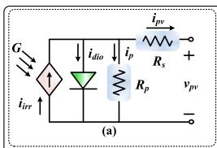

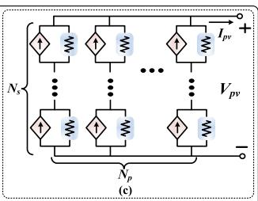

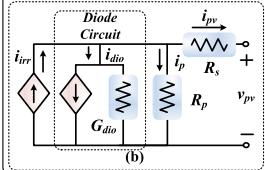

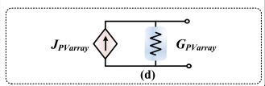  
FIGURE 1. Configuration of a PV array model.

compared with RT tools, enabling them to be of service in dynamic security assessment (DSA). With the help of creative solution algorithm and efficient parallel implementation, FTRT emulation provides sufficient time for DSA to take remedial actions [38].

Apart from the hardware, the solution strategy also has a significant impact on emulation efficiency. To reflect the detailed operating conditions of the components in MGs, the electromagnetic transient (EMT) simulation is adopted, while transient stability simulation is applied to the host system to reduce the hardware resource utilization. Due to the various simulation types, a dynamic voltage injection interface strategy for hardware emulation with less data communication is also proposed, which significantly reduces the hardware resource utilization and accelerates the hardware emulation.

The rest of this paper is expanded as follows: Section II introduces the detailed modeling of the components in a typical microgrid. The interface strategy of the integrated AC system and microgrids is specified in Section III. Section IV demonstrates the hardware design of proposed FTRT emulation on FPGAs. The validation of EMT-dynamic emulation results of MG cluster and case studies for power dispatch is given in Section V. Section VI presents the conclusion and future work.

# II. DETAILED EMT MODELING OF MICROGRID COMPONENTS

# A. PHOTOVOLTAIC (PV) AND BATTERY ENERGY STORAGE SYSTEM (BESS) EMT MODEL

Fig. 1 (a) provides the equivalent circuit representation of a solar cell, which consists of an irradiance-dependent current source, an anti-parallel diode, shunt resistor $( R _ { p } ) _ { : }$ , and series resistor $( R _ { s } )$ [39]. The output current of the single solar cell can be expressed based on Kirchhoff’s Current Law as:

$$
i _ {p v} = i _ {i r r} - i _ {d i o} - i _ {p}, \tag {1}
$$

where $i _ { i r r }$ and $i _ { d i o }$ refer to the irradiance current and the current flowing through the anti-parallel diode as given in (2) and (3), respectively.

$$
\begin{array}{l} i _ {i r r} = i _ {i r r, r e f} \cdot \frac {G}{G _ {r e f}} [ 1 + \alpha_ {T} \cdot (T - T r e f) ], (2) \\ i _ {d i o} (t) = I _ {0} \cdot \left(e ^ {\frac {v _ {d i o} (t)}{V _ {T}}} - 1\right), (3) \\ \end{array}
$$

where the variables with the subscription ref are the reference values, G denotes the solar irradiance, αT refers to the temperature coefficient, $V _ { T }$ is the thermal voltage, and T represents the absolute temperature. Meanwhile, I0 is the diode saturation current.

In a practical PV array, a large amount of PV panels are arranged in an array to provide sufficient energy. The topology of a typical PV array with $N _ { p }$ parallel strings and each of them containing $N _ { s }$ series panels is given in Fig. 1 (c). The equivalent circuit is still available in a PV array, where the (1) can be expanded as

$$
\begin{array}{l} I _ {p v} = N _ {p} i _ {i r r} - N _ {p} I _ {0} \left(e ^ {\frac {V _ {p v} (t) + N _ {s} N _ {p} ^ {- 1} R _ {s} I _ {p v} (t)}{N _ {s} V _ {T}}} - 1\right) \\ - \frac {I _ {p v} (t) R _ {s} + N _ {p} N _ {s} ^ {- 1} V _ {p v} (t)}{R _ {p}}. \tag {4} \\ \end{array}
$$

The non-linear nature of the anti-parallel diode makes the emulation of the solar cell complex. To reduce the computational burden as well as shrink the emulation time. The equivalent circuit in Fig. 1 (c) can be further simplified by Norton’s Theorem, resulting in a two-node circuit as given in Fig. 1 (d), where

$$
G _ {P V a r r a y} = \frac {N _ {p} \left(G _ {d i o} + G _ {p}\right)}{N _ {s} \left(G _ {d i o} R _ {s} + R _ {s} G _ {p}\right) + N _ {s}}, \tag {5}
$$

$$
J _ {P V a r r a y} = \frac {N _ {p} (i _ {i r r} - I _ {D e q})}{G _ {d i o} R _ {s} + R _ {s} G _ {p} + 1}, \tag {6}
$$

where $G _ { p }$ refers to the conductance of the parallel resistor, the $G _ { d i o }$ and $I _ { D e q }$ are given as follows:

$$
G _ {d i o} = \frac {\partial i _ {d i o}}{\partial v _ {d i o}} = \frac {I _ {0} \cdot e ^ {\frac {v _ {d i o} (t)}{V _ {T}}}}{V _ {T}}, \tag {7}
$$

$$
I _ {D e q} = i _ {d i o} - G _ {d i o} \cdot v _ {d i o}. \tag {8}
$$

The operation of a microgrid under the islanded mode requires energy storage system to balance the generation and demand as well as regulate the grid voltage. A battery energy storage system (BESS) is applied in each microgrid, which contains a battery system, and a DC/AC converter. To emulate the non-linear part of the battery system, the EMT simulation is applied for calculating BESS. The battery is modeled [11] as an ideal controllable voltage source in series with an equivalent internal resistance $R _ { b a t t }$ , as given in Fig. 2 (a). The open-circuit voltage of the battery $V _ { o c }$ can be represented based on the actual battery charge (it) by a non-linear equation expressed as follows.

$$
V _ {o c} = V _ {0} - K \frac {Q}{Q - i t} \cdot i t + A \cdot \exp (- B (i t)), \tag {9}
$$

where $V _ { 0 }$ refers to the battery constant voltage, K is the polarisation voltage, $Q$ represents the battery capacity, and A and B denote exponential zone amplitude and exponential zone time constant inverse, respectively. According to Kirchhoff’s laws, the battery voltage $( V _ { b a t t } )$ can be derived as:

$$
V _ {b a t t} = V _ {o c} - I _ {b a t t} R _ {b a t t}. \tag {10}
$$

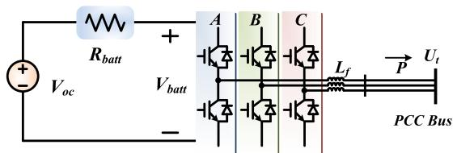

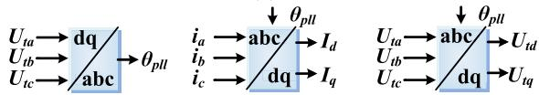  
（a)

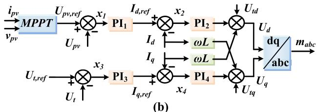  
FIGURE 2. (a) Equivalent circuit of BESS, and (b) control strategy of PV&BESS inverter.

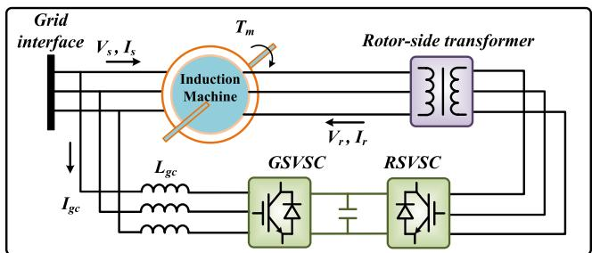  
FIGURE 3. Topology of a typical DFIG.

The controllers of the PV system and BESS also share some similarities since they are both based on the d-q frame, as given in Fig. 2 (b). For a PV converter, the controller regulates the DC voltage on the d-axis according to the reference voltage which is generated by the maximum power point tracking (MPPT) algorithm, while in BESS, the DC voltage or the active power is the control target. On the q-axis, depending on the grid condition, the converters can control either the PCC voltage or its reactive power.

# B. EMT MODEL OF WIND TURBINE

A typical doubly-fed induction generator (DFIG) is applied in the microgrid as shown in Fig. 3, which includes an induction machine, a grid side voltage source converter (GSVSC), and a rotor side voltage source converter (RSVSC). The principle of the DFIG is that the rotor windings are fed with a backto-back voltage source converter which controls the rotor and grid currents, while the stator windings are connected to the grid. The converter controls the rotor currents, which is possible to adjust the active and reactive power fed to the gird under various wind speed and grid conditions.

For FTRT hardware emulation, the induction machine in the DFIG is represented by $5 ^ { t h }$ order differential algebraic equations (DAEs). The state-space equation of the induction

machine can be expressed as:

$$
\frac {d \mathbf {x} (t)}{d t} = + \mathbf {A} \cdot + \mathbf {x} (t) + \mathbf {B} \cdot + \mathbf {u} (t), \tag {11}
$$

$$
\mathbf {y} (t) = + \mathbf {C} \cdot + \mathbf {x} (t), \tag {12}
$$

where $\mathbf { x } , \mathbf { y } ,$ and u are vectors that refer to the fluxes, currents, and input voltages, respectively. The DAEs of the induction machine contains 4 rotor and stator circuit equations in the $\alpha \cdot \beta$ frame [40], given as:

$$
\dot {\lambda_ {\alpha s}} (t) = \frac {- L _ {r} R _ {s} \lambda_ {\alpha s} (t)}{L _ {s} L _ {r} - L _ {m} ^ {2}} + \frac {L _ {m} R _ {s} \lambda_ {\alpha r} (t)}{L _ {s} L _ {r} - L _ {m} ^ {2}} + V _ {\beta s}, \tag {13}
$$

$$
\dot {\lambda_ {\beta s}} (t) = \frac {- L _ {r} R _ {s} \lambda_ {\beta s} (t)}{L _ {s} L _ {r} - L _ {m} ^ {2}} + \frac {L _ {m} R _ {s} \lambda_ {\beta r} (t)}{L _ {s} L _ {r} - L _ {m} ^ {2}} + V _ {\alpha s}, \tag {14}
$$

$$
\dot {\lambda_ {\alpha r}} (t) = \frac {L _ {m} R _ {r} \lambda_ {\alpha s} (t)}{L _ {s} L _ {r} - L _ {m} ^ {2}} + \frac {- L _ {s} R _ {r} \lambda_ {\alpha r} (t)}{L _ {s} L _ {r} - L _ {m} ^ {2}} - \omega_ {r} \lambda_ {\beta r} (t), \tag {15}
$$

$$
\dot {\lambda_ {\beta r}} (t) = \frac {L _ {m} R _ {r} \lambda_ {\beta s} (t)}{L _ {s} L _ {r} - L _ {m} ^ {2}} + \frac {- L _ {s} R _ {r} \lambda_ {\beta r} (t)}{L _ {s} L _ {r} - L _ {m} ^ {2}} + \omega_ {r} \lambda_ {\alpha r} (t), \tag {16}
$$

where the $\lambda _ { \alpha s } , \lambda _ { \beta s } , \lambda _ { \alpha r } .$ , and $\lambda _ { \beta r }$ refer to the fluxes of stator and rotor in α $- \beta$ frame, respectively, $V _ { \alpha s }$ and $V _ { \beta s }$ are the input voltages, $R _ { s }$ and $R _ { r }$ are the stator and rotor resistance, and $L _ { s }$ , $L _ { r }$ , and $L _ { m }$ represent the stator, rotor, and magnetizing inductance, respectively.

The 5th differential equation which describes the mechanical dynamics is given as

$$
\dot {\omega} _ {r} (t) = \frac {P}{2 J} \cdot \left(T _ {e} (t) - T _ {m} (t)\right), \tag {17}
$$

where P and J are constant values which refer to the poles and inertia of the induction machine, $\omega _ { r }$ refers to the electrical angular velocity. The electromagnetic torque $T _ { e }$ and mechanical torque $T _ { m }$ can be obtained by

$$
T _ {e} (t) = \frac {3}{2} P \left(i _ {\beta s} (t) \lambda_ {\alpha s} (t) - i _ {\alpha s} (t) \lambda_ {\beta s} (t)\right), \tag {18}
$$

$$
T _ {m} (t) = \frac {1}{2} \rho \pi r _ {T} ^ {3} v _ {w} ^ {2} F \left(r _ {T}, v _ {w}, \omega_ {r}\right), \tag {19}
$$

where $\rho$ represents the air density, $r _ { T }$ is the wind turbine radius, and F refers to a non-linear function of $\omega _ { r } , r _ { T }$ , and the wind speed $\nu _ { w } .$ where the detailed function $F$ can be found in [41]. The stator currents $i _ { \alpha s }$ and $i _ { \beta s }$ are calculated from (12), where the vector y can be expanded as

$$
\mathbf {y} = \left[ i _ {\alpha s} (t), i _ {\beta s} (t), i _ {\alpha r} (t), i _ {\beta r} (t) \right] ^ {T}, \tag {20}
$$

the corresponding coefficient matrix C can be expressed as

$$
\mathbf {C} = \left[ \begin{array}{c c c c} \frac {L _ {r}}{L _ {s} L _ {r} - L _ {m} ^ {2}} & 0 & \frac {- L _ {m}}{L _ {s} L _ {r} - L _ {m} ^ {2}} & 0 \\ 0 & \frac {L _ {r}}{L _ {s} L _ {r} - L _ {m} ^ {2}} & 0 & \frac {- L _ {m}}{L _ {s} L _ {r} - L _ {m} ^ {2}} \\ \frac {- L _ {m}}{L _ {s} L _ {r} - L _ {m} ^ {2}} & 0 & \frac {L _ {s}}{L _ {s} L _ {r} - L _ {m} ^ {2}} & 0 \\ 0 & \frac {- L _ {m}}{L _ {s} L _ {r} - L _ {m} ^ {2}} & 0 & \frac {L _ {s}}{L _ {s} L _ {r} - L _ {m} ^ {2}} \end{array} \right]. \tag {21}
$$

The continuous differential equations should be discretized before the numerical calculation. The corresponding time-discrete for (11) can be obtained after utilizing

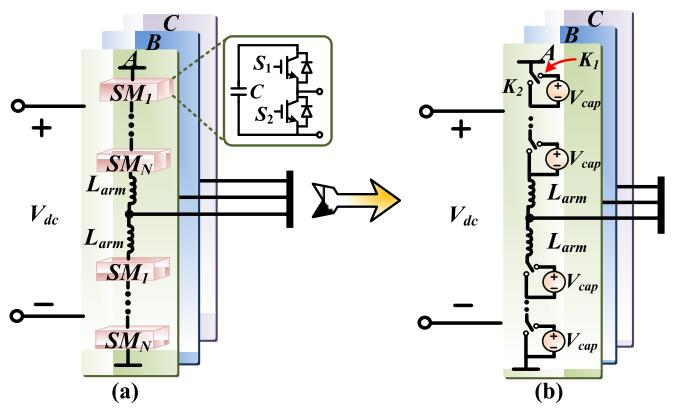  
FIGURE 4. Illustration of MMC modeling: (a) three-phase topology, (b) average value model.

the trapezoidal rule:

$$
\begin{array}{l} \mathbf {x} (t + \Delta t) = (\mathbf {I} - \mathbf {A} \frac {\Delta t}{2}) ^ {- 1} [ (\mathbf {I} + \mathbf {A} \frac {\Delta t}{2}) \mathbf {x} (t) ] \\ + \mathbf {B} \frac {\Delta t}{2} (\mathbf {u} (t + \Delta t) + \mathbf {u} (t)) ], \tag {22} \\ \end{array}
$$

where $\Delta t$ refers to the time-step of the EMT emulation utilized in the wind turbine, which is defined as $5 0 ~ \mu s ,$ and $\mathbf { x } ( t + \Delta t )$ denotes the vector of state variables of next timestep.

# C. MMC AVERAGE VALUE MODEL

The configuration of a MMC-based three-phase DC/AC converter integrated with the renewable energy is provided in Fig. 4 (a), where each phased contains 2N half-bridge submodules (HBSMs) and each arm has an arm inductor. To avoid asynchronous data communication between BESS and the converter system, the EMT simulation is also applied in emulating the integrated DC/AC converter as well as the MMC stations in the microgrids with a time-step of 200µs.

The hardware-based FTRT emulation prefers the models which require the least computational burden, and therefore, the average value model (AVM) for MMCs is utilized. The HBSMs can be simplified into the controlled voltages sources as given in Fig. 4 (b). When the upper switch $K _ { 1 }$ is turned on, the submodule is inserted, while the submodule is bypassed when the $K _ { 2 }$ is turned on. Assuming that the capacitor voltages are well balanced in the AVM, the average value of the capacitors and the equivalent voltage of an arbitrary submodule can be derived as.

$$
V _ {c a p 1} = V _ {c a p 2} = \dots = V _ {c a p 2} = \frac {V _ {d c}}{N}. \tag {23}
$$

$$
V _ {S M i} = \frac {V _ {d c}}{N} \cdot S _ {i}. \tag {24}
$$

where $S _ { i }$ represents the switching function which yields 1 and 0 when the submodule capacitor is inserted and bypassed, respectively. As a result of the well-balanced condition in AVM, the circulating current can be neglected the AC side

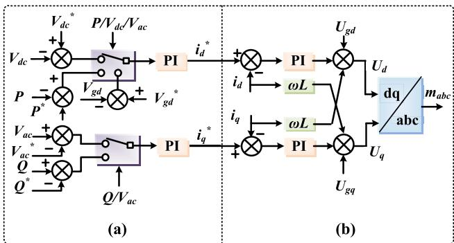  
FIGURE 5. MMC control strategy: (a) outer loop control, and (b) inner loop control.

output voltage can be expressed as:

$$
V _ {o} = \frac {V _ {d c}}{N} \cdot \left(\sum_ {i = 1} ^ {N} S _ {u i} + \sum_ {i = 1} ^ {N} S _ {l i}\right). \tag {25}
$$

where $S _ { u i }$ and $S _ { l i }$ refer to the switching functions of upper and lower arms, respectively. The control strategy for the MMC model is similar to the inverter controller without the MPPT part. The MMC adopts a two-loop control scheme where the outer-loop controller is in charge of converter functions which regulate the active/reactive power and bus voltage, as given in Fig. 5 (a). The reference current $i _ { d , q } ^ { * }$ is calculated as:

$$
i _ {d, q} ^ {*} = K _ {p} \left(V ^ {*} - V\right) + K _ {i} \int \left(V ^ {*} - V\right) d t, \tag {26}
$$

where the $K _ { p }$ and $K _ { i }$ are constants, $V ^ { * }$ and V refer to the control target reference and their feedback, respectively. The MMC current controller in $d { - } q$ frame is provided in Fig. 5 (b), where the signals with the superscription ∗ represent the reference values. The current controller amplifies the current error to obtain the voltage $V _ { d , q } ,$ , which is converted into three-phase signals $m _ { a b c }$ that are sent to the MMC inner-loop controller employing phase shift strategy.

# III. AC GRID MODELING AND INTERFACE STRATEGY

Fig. 6 shows a modified IEEE 39-bus system [42] integrated with seven DC microgrids, where the wind turbine (WT) and PV-BESS system in each microgrid are linked to a five terminal (5-T) LVDC system, where the 5-level MMC stations are utilized. Meanwhile, the voltage and current levels for the MMC station are 1 kV and 3 kA, respectively. Under a base power of 1 MVA for the host grid, each wind turbine has a rated 2 p.u. active power, both PV and BESS have a standard 1 $p . u .$ . rated power, and local loads of 500 kW and 1 MW are connected with the PV-BESS system and WT, respectively. When a microgrid operates under the islanded mode, the generated power from the renewable energy is utilized for supporting the local loads, while the extra active power is stored in the batteries. On the other hand, in the gridconnected mode, each microgrid provides up to 3 MW active power to the host system.

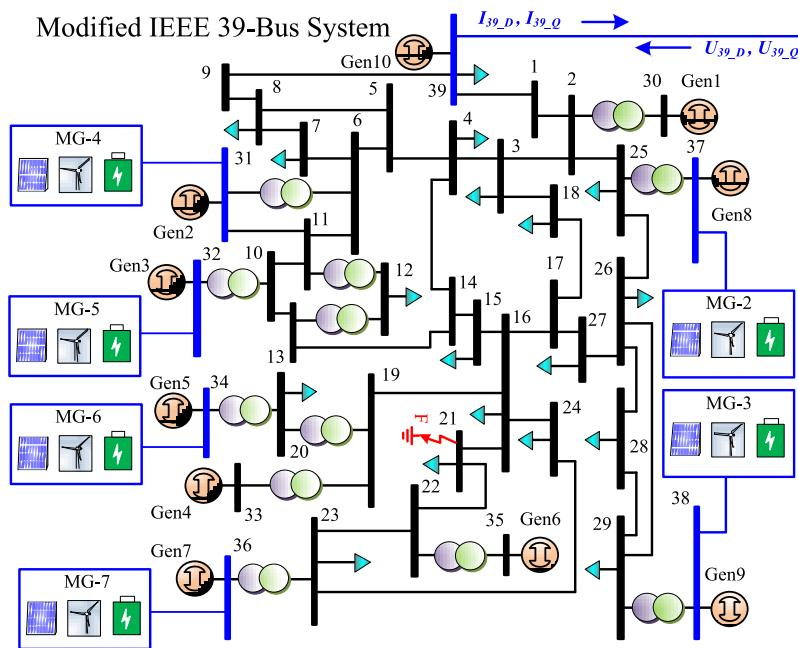

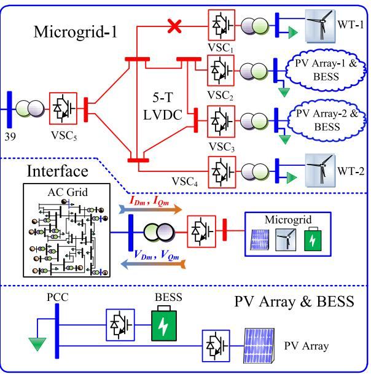  
FIGURE 6. Topology of the host grid connected with multiple microgrids.

# A. AC GRID MODELING

# 1) SYNCHRONOUS GENERATOR AND CONTROL SYSTEM

Transient stability simulation is basically solving a series of nonlinear differential algebraic equations (DAEs), which can represent the detailed dynamics of synchronous generators. Meanwhile, the network equations containing transmission lines and loads are given in (28), which calculate the non-generator bus voltages and generator output currents of the AC system.

$$
\dot {\mathbf {X}} (t) = F (\mathbf {X}, \mathbf {U}, t), \tag {27}
$$

$$
G (\mathbf {X}, \mathbf {U}, t) = \mathbf {0}, \tag {28}
$$

where U refers to the vector of inputs such as field voltages $( V _ { f d } )$ and mechanical torque $( T _ { m } )$ , X represents the vector of state variables of the synchronous machine. In this work, a detailed synchronous machine model is utilized, which contains two mechanical equations and four rotor electrical equations with 2 windings on the d-axis and 2 damping windings on the q-axis, and therefore, the vector X can be expressed as

$$
\mathbf {X} (t) = \left[ \delta (t), \Delta \omega (t), \psi_ {f d} (t), \psi_ {d 1} (t), \psi_ {q 1} (t), \psi_ {q 2} (t), \dots \right] ^ {T}, \tag {29}
$$

where δ refers to the rotor angle, and 1ω represents the derivative of angular velocity. Meanwhile, an excitation system with automatic voltage regulator (AVR) and power system stabilizer (PSS) is also included in the synchronous generator as given in Fig. 7, where v refers to the terminal voltage of the synchronous machine, $T _ { R } , K _ { s t a b } , T _ { w } , T _ { 1 }$ , and $T _ { 2 }$ are constant parameters, which can be found in [43], and $\nu _ { 1 } .$ , v , and $\nu _ { 3 }$ are the intermediate variables in the excitation system, which are solved together with the mechanical and

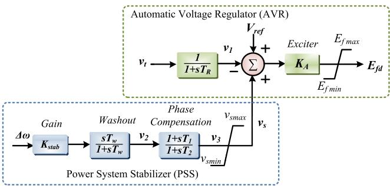  
FIGURE 7. Excitation system of the synchronous generator.

electrical equations. Therefore, the excitation system contributes 3 additional state variables in vector X and the $9 ^ { t h } .$ order differential equations are utilized for representing the synchronous generators of the proposed AC system, which are solved by the explicit $4 ^ { t h } .$ -order Adams-Bashforth (AB4) given as:

$$
\begin{array}{l} x (t + h) = x (t) + \frac {h}{2 4} \cdot [ 5 5 F (t) - 5 9 F (t - h) \\ + 3 7 F (t - 2 h) - 9 F (t - 3 h) ], \tag {30} \\ \end{array}
$$

where h refers to the time-step of AC grid, which is defined as 1 ms.

# 2) AC NETWORK EQUATIONS

The AC network mainly contains the transmission lines, transformers, and loads. In order to reduce the computational burden during the hardware execution, the transmission lines and transformers are represented by the lumped π model. According to [43], only the fundamental frequency is considered, which means the other frequency ranges except for the system fundamental frequency between the microgrids and the AC network are ignored. The fixed loads

and shunt compensators are integrated with the admittance matrix, given as

$$
Y _ {\text {L o a d}} = \frac {P _ {\text {L o a d}} + j Q _ {\text {L o a d}}}{V _ {\text {p c c}} ^ {2}}, \tag {31}
$$

where $P _ { L o a d }$ and $Q _ { L o a d }$ represent the active and reactive power of the load, respectively, and $V _ { p c c }$ refers to the bus voltage at the point of common coupling. Following the introduction of the admittance matrix of the AC grid, the network equations in (28) can be expanded as

$$
\left[ \begin{array}{l} \mathbf {I} _ {\mathbf {n}} \\ \mathbf {I} _ {\mathbf {r}} \end{array} \right] = \left[ \begin{array}{l l} \mathbf {Y} _ {\mathbf {n n}} & \mathbf {Y} _ {\mathbf {n r}} \\ \mathbf {Y} _ {\mathbf {r n}} & \mathbf {Y} _ {\mathbf {r r}} \end{array} \right] \left[ \begin{array}{l} \mathbf {V} _ {\mathbf {n}} \\ \mathbf {V} _ {\mathbf {r}} \end{array} \right], \tag {32}
$$

where the subscript n refers to the generator nodes with current injection, and r represents the remaining nodes without synchronous generators. Due to the absence of current injection in the non-generator buses, the current vector of the remaining nodes $\mathbf { I } _ { \mathbf { r } } = \left[ \mathbf { 0 } \right]$ and $\mathbf { I _ { n } }$ can be derived as

$$
\mathbf {I} _ {\mathbf {n}} = \mathbf {Y} _ {\text {r e d u c e d}} \cdot \mathbf {V} _ {\mathbf {n}}, \tag {33}
$$

$$
\mathbf {Y} _ {\text {r e d u c e d}} = \mathbf {Y} _ {\mathbf {n n}} - \mathbf {Y} _ {\mathbf {n r}} \mathbf {Y} _ {\mathbf {r r}} ^ {- 1} \mathbf {Y} _ {\mathbf {r n}}, \tag {34}
$$

Although the generator voltages $\mathbf { V _ { n } }$ are not directly known after solving the DAEs, the relationship between $V _ { n }$ and $I _ { n }$ can be expressed as

$$
V _ {D} = I _ {D} \cdot u _ {1} + I _ {Q} \cdot u _ {3} + u _ {5}, \tag {35}
$$

$$
V _ {Q} = I _ {D} \cdot u _ {2} + I _ {Q} \cdot u _ {4} + u _ {6}, \tag {36}
$$

where $u _ { 1 - 6 }$ can be obtained following the acquirement of new state variables, which are given below.

$$
u _ {1} = - R _ {a}, \tag {37}
$$

$$
u _ {2} = X _ {a d} ^ {\prime \prime} \sin^ {2} (\delta) + X _ {a q} ^ {\prime \prime} \cos^ {2} (\delta) + X _ {l}, \tag {38}
$$

$$
u _ {3} = - \left(X _ {a d} ^ {\prime \prime} \cos^ {2} (\delta) + X _ {a q} ^ {\prime \prime} \sin^ {2} (\delta) + X _ {l}\right), \tag {39}
$$

$$
u _ {4} = - R _ {a}, \tag {40}
$$

$$
u _ {5} = - \cos (\delta) E _ {d} ^ {\prime \prime} - \sin (\delta) E _ {q} ^ {\prime \prime}, \tag {41}
$$

$$
u _ {6} = \cos (\delta) E _ {q} ^ {\prime \prime} - \sin (\delta) E _ {d} ^ {\prime \prime}. \tag {42}
$$

Obviously, with the ascertained relationship between $\mathbf { V _ { n } }$ and $\mathbf { I } _ { \mathbf { n } } .$ , all the unknown vectors in (32) can be solved directly.

# B. PROPOSED MICROGRID AND AC GRID INTERFACE

Since transient stability simulation is adopted for AC grid analysis, an interface is proposed so that it is compatible with the aforementioned EMT models. As given in Fig. 1 (d), the PV arrays are modeled as the current sources, while the wind turbine and BESS are modeled as voltage sources. As for the interface strategy, theoretically, there are three available strategies that can be applied, which are P-Q interface, voltage interface, and current interface. In the P-Q interface, the converter stations can be treated as time-varying loads in transient stability simulation of a traditional AC/DC grid, however, the admittance matrix needs to be updated every time-step, resulting in a heavy computational burden. The utilization of dynamic voltage/current injection interface avoids solving the admittance matrix in every time-step,

which significantly increases the scalability of the proposed FTRT emulation. However, the current injection interface is not suitable for the proposed FTRT emulation. Since the synchronous generators are modeled as voltage sources and integrated with the network equations, the current injection interface will introduce additional calculations. Therefore, a voltage injection interface strategy is put forward in this work to maintain a constant admittance matrix and accelerate the hardware emulation.

Under this scheme, a converter is taken as a simplified synchronous generator with a varying voltage that does not have detailed electrical and excitation circuits. The reduced network equation (33) can be further expanded as

$$
\left[ \begin{array}{l} \mathbf {I} _ {\mathrm {i}} \\ \mathbf {I} _ {\mathrm {m}} \end{array} \right] = \left[ \begin{array}{l l} \mathbf {Y} _ {\mathrm {i i}} & \mathbf {Y} _ {\mathrm {i m}} \\ \mathbf {Y} _ {\mathrm {m i}} & \mathbf {Y} _ {\mathrm {m m}} \end{array} \right] \left[ \begin{array}{l} \mathbf {V} _ {\mathrm {i}} \\ \mathbf {V} _ {\mathrm {m}} \end{array} \right], \tag {43}
$$

where the matrix with subscription i refers to the generator node represented by the detailed Park’s equations, m denotes the buses where the converter stations connected to, and $i + m$ constitutes the n generator nodes in (32).

Since different synchronous machines and converter stations are interconnected together in a transmission network, the variables should be expressed in a common reference frame, which is called a synchronously rotating D-Q frame. The above complex matrix equation (43) yields 4 real matrix equations in D- and Q-axis, given as

$$
\mathbf {I} _ {\mathrm {D i}} = \mathbf {R} _ {\mathrm {i i}} \mathbf {V} _ {\mathrm {D i}} - \mathbf {B} _ {\mathrm {i i}} \mathbf {V} _ {\mathrm {Q i}} + \mathbf {R} _ {\mathrm {i m}} \mathbf {V} _ {\mathrm {D m}} - \mathbf {B} _ {\mathrm {i m}} \mathbf {V} _ {\mathrm {Q m}}, \tag {44}
$$

$$
\mathbf {I} _ {\mathbf {Q} \mathrm {i}} = \mathbf {R} _ {\mathrm {i i}} \mathbf {V} _ {\mathrm {Q} \mathrm {i}} + \mathbf {B} _ {\mathrm {i i}} \mathbf {V} _ {\mathrm {D} \mathrm {i}} + \mathbf {R} _ {\mathrm {i m}} \mathbf {V} _ {\mathrm {Q} \mathrm {m}} - \mathbf {B} _ {\mathrm {i m}} \mathbf {V} _ {\mathrm {D} \mathrm {m}}, \tag {45}
$$

$$
\mathbf {I} _ {\mathrm {D m}} = \mathbf {R} _ {\mathrm {m i}} \mathbf {V} _ {\mathrm {D i}} - \mathbf {B} _ {\mathrm {m i}} \mathbf {V} _ {\mathrm {Q i}} + \mathbf {R} _ {\mathrm {m m}} \mathbf {V} _ {\mathrm {D m}} - \mathbf {B} _ {\mathrm {m m}} \mathbf {V} _ {\mathrm {Q m}}, \tag {46}
$$

$$
\mathbf {I} _ {\mathbf {Q m}} = \mathbf {R} _ {\mathbf {m i}} \mathbf {U} _ {\mathbf {Q i}} + \mathbf {B} _ {\mathbf {m i}} \mathbf {V} _ {\mathbf {D i}} + \mathbf {R} _ {\mathbf {m m}} \mathbf {V} _ {\mathbf {Q m}} - \mathbf {B} _ {\mathbf {m m}} \mathbf {V} _ {\mathbf {D m}}, \tag {47}
$$

where R and B represent the real part and the imaginary part of the corresponding Y matrix. The values of $\mathbf { V } _ { D i }$ and $\mathbf { V } _ { Q i }$ associated with the detailed synchronous machines are not directly known, but the voltages under the reference d-$q$ frame can be represented by the state variables following each step of integration, given as

$$
v _ {d} = - R _ {a} i _ {d} + i _ {q} (X _ {a q} ^ {\prime \prime} + X _ {l}) - X _ {a q} ^ {\prime \prime} (\frac {\psi_ {q 1}}{X _ {q 1}} + \frac {\psi_ {q 2}}{X _ {q 2}}), \tag {48}
$$

$$
v _ {q} = - R _ {a} i _ {q} - i _ {d} \left(X _ {a d} ^ {\prime \prime} + X _ {l}\right) + X _ {a d} ^ {\prime \prime} \left(\frac {\psi_ {f d}}{X _ {f d}} + \frac {\psi_ {d 1}}{X _ {d 1}}\right), \tag {49}
$$

$$
X _ {a d} ^ {\prime \prime} = X _ {l} + \frac {L _ {a d} \cdot L _ {f d} \cdot L _ {d 1}}{L _ {a d} \cdot L _ {f d} + L _ {a d} \cdot L _ {d 1} + L _ {f d} \cdot L _ {d 1}}, \tag {50}
$$

$$
X _ {a q} ^ {\prime \prime} = X _ {l} + \frac {L _ {a q} \cdot L _ {q 1} \cdot L _ {q 2}}{L _ {a q} \cdot L _ {q 1} + L _ {a q} \cdot L _ {q 2} + L _ {q 1} \cdot L _ {q 2}}, \tag {51}
$$

where $R _ { a } , X _ { l } , X _ { q 1 } , X _ { q 2 } , X _ { f d } , X _ { d 1 } , L _ { a d } , L _ { f d } , L _ { d 1 } , L _ { a q } , L _ { q 1 }$ , and $L _ { q 2 }$ refer to stator resistance, stator leakage reactance, reactance of damper winding q1, reactance of damper winding $q 2 ,$ , field winding reactance, reactance of damper winding d1, $d -$ axis mutual inductance, field winding inductance, inductance of damper winding d1, q-axis mutual inductance, inductance of damper winding $q 1$ , inductance of damper winding $q 2 .$ , respectively, which are constant values of the synchronous

generator. Meanwhile, the variables with superscription 00 represent the subtransient reactance and electromotive force. In order to correlate the components of the voltages and currents expressed in $d { - } q$ frame to the rotating common reference $D – Q$ of the network, the following reference frame transformation equations are used,

$$
V _ {D} + j V _ {Q} = \left(v _ {d} + j v _ {q}\right) \cdot e ^ {j \delta}, \tag {52}
$$

$$
I _ {D} + j I _ {Q} = \left(i _ {d} + j i _ {q}\right) \cdot e ^ {j \delta}, \tag {53}
$$

where the variable δ in (52) and (53) represents the synchronous generator rotor angle given in (29). Therefore, by combining (48)-(53), the values of $\mathbf { V _ { D i } }$ and $\mathbf { V _ { Q i } }$ can be calculated by the new state variables. Following the solution of the microgrid functions, the components $\mathbf { V _ { D m } }$ and $\mathbf { V _ { Q m } }$ are available for solving $\mathbf { I _ { D m } }$ and $\mathbf { I _ { Q m } }$ in (46) and (47). Since distinct time-steps are adopted in TS and EMT emulation, the data synchronization of the proposed interface is as follows, the microgrid undergoing EMT emulation provides the voltages in $D – Q$ frame to the AC grid in every 5 EMT time-steps, and the injected voltages are solved together with the network equations in the AC system. Then the calculated currents at PCC are in return sent to microgrid systems to continue the EMT emulation, as shown in Fig. 6.

# IV. FTRT HARDWARE EMULATION OF GRID OF MICROGRIDS ON FPGAs

The full deployment of the AC system integrated with the microgrid cluster requires two Xilinx $\mathrm { V i r t e x } ^ { \mathbb { Q } }$ UltraScale+TM VCU118 boards containing XCVU9P FPGA which includes 6840 DSP slices, 1182240 look-up tables (LUTs), and 2364480 flip-flops (FFs). The host system as well as the microgrid-1 (MG-1) to MG-3 in Fig. 6 are deployed on the VCU118 Board-1, and the remaining four microgrids are implemented on the VCU118 Board-2. The sufficient hardware resources enable the MGs to be executed on the FPGA board in FTRT mode. The reconfigurability of FPGAs allows the hardware resources to be adjusted to accommodate and represent practical systems [44], and therefore it is suitable for the hardware-in-the-loop (HIL) emulation and dynamic security assessment in the energy control center.

The hardware implementation can be conducted in two ways: utilizing hardware programming language, and block design. The former method models each circuit part in hardware language such as VHDL, which is complicated and requires hardware programming experience of the researcher. The $\mathrm { \mathrm { X i l i n x } } ^ { \mathrm { ( R ) } }$ high-level synthesis software Vivado ${ \mathrm { H L S } } ^ { \textregistered }$ is able to transform the $\mathrm { C / C } { + + }$ code into intellectual property (IP) which contains corresponding input/output ports in VHDL format. The circuit parts and subsystems which consist of the microgrid cluster are programmed in C/C++ code before the hardware design. After IP generation, each circuit component is converted to a hardware module and exported to $\mathrm { \check { V i v a d o } ^ { \mathbb { R } } }$ for block design,, which significantly increases the flexibility and reduces the complexity of hardware implementation. In a practical real-time application,

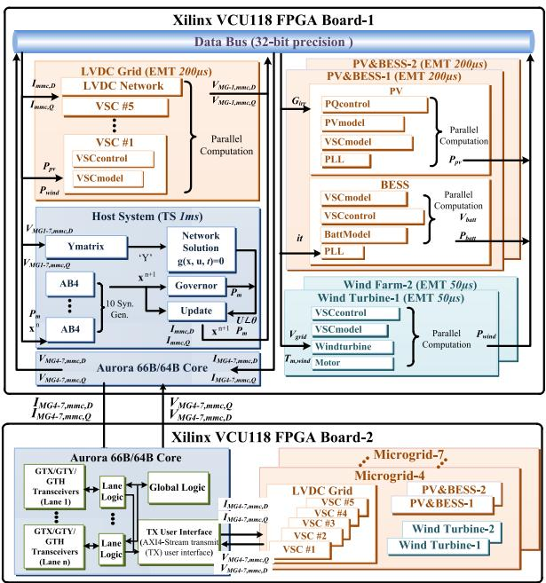  
FIGURE 8. Hardware block design for FTRT emulation of the host system integrated with 7 microgrids.

data exchange is realized by connecting the input/output ports among the hardware modules. According to the correlation among the subfunctions, the hardware modules are designed to be calculated in parallel or series. The hardware block design and the data stream are provided in Fig. 8. After design synthesis and device mapping, the bitstreams were downloaded to the target FPGA boards via the Joint Test Action Group (JTAG) interface as given in Fig. 9. The Quad Small Form Pluggable (QSFP) interfaces are connected with cable and the build-in IP Aurora 66B/64B core is utilized to realize the data communication. Due to the little data required of the proposed AC/Microgrid interface, the PCC voltages and currents in D-Q frame are chosen as the communication data between the FPGA boards. Since the MG 1-3 are conducted in Board-1, the data exchange only happens inside Board-1. As for Board-2, the output voltages $( V _ { M G 4 - 7 , M M C , D } .$ , and $V _ { M G 4 - 7 , M M C , Q } )$ of MG 4-7 are delivered to the build-in IP Aurora Core through the AXI bus, then the voltage data is sent to Board-1 via the QSFP bidirectional cable. After solving the network equation in Board-1, the calculated currents (IMG4−7,MMC,D, and $I _ { M G 4 - 7 , M M C , Q } )$ are delivered to Board-2 through the QSFP cable and sent to the Aurora core. Finally, the current data is solved together with the VSC stations to keep the EMT simulation going on. Meanwhile, the output digital data is transferred to analog data via the digital-toanalogic converter (DAC) board, so that the waveforms can be displayed on the oscilloscope.

Table 1 provides the hardware resource utilization and the latencies of the hardware modules in the FTRT emulation, where the Tclk in Table 1 refers to the unit of the latency. For example, the 39 Tclk means the latency of the PVmodel part is 39 clock cycles. As mentioned, the components in the microgrid including the PV array, wind turbine, and LVDC

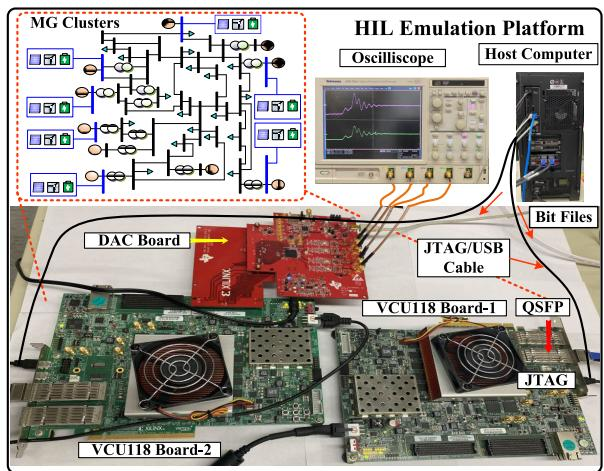  
FIGURE 9. Experimental hardware-in-the-loop (HIL) emulation platform.

TABLE 1. Details of major microgrid cluster hardware modules.   

<table><tr><td>Module</td><td>Latency</td><td>BRAM</td><td>DSP</td><td>FF</td><td>LUT</td></tr><tr><td colspan="6">PV array on VCU118 (100MHz)</td></tr><tr><td>PVmodel</td><td>39 Tclk</td><td>0</td><td>19</td><td>3329</td><td>11493</td></tr><tr><td>PQcontrol</td><td>32 Tclk</td><td>0</td><td>22</td><td>3497</td><td>8418</td></tr><tr><td>VSCmodel</td><td>41 Tclk</td><td>0</td><td>33</td><td>4489</td><td>9447</td></tr><tr><td>PLL</td><td>18 Tclk</td><td>0</td><td>8</td><td>892</td><td>1357</td></tr><tr><td colspan="6">BESS on VCU118 (100MHz)</td></tr><tr><td>BattModel</td><td>73 Tclk</td><td>0</td><td>44</td><td>2923</td><td>7497</td></tr><tr><td>VSCmodel</td><td>31 Tclk</td><td>0</td><td>34</td><td>3244</td><td>4673</td></tr><tr><td>VSCcontrol</td><td>28 Tclk</td><td>0</td><td>32</td><td>3450</td><td>5931</td></tr><tr><td>PLL</td><td>18 Tclk</td><td>0</td><td>8</td><td>892</td><td>1357</td></tr><tr><td colspan="6">Wind turbine on VCU118 (100MHz)</td></tr><tr><td>Windturbine</td><td>83 Tclk</td><td>0</td><td>43</td><td>5085</td><td>8929</td></tr><tr><td>Motor</td><td>79 Tclk</td><td>0</td><td>66</td><td>5128</td><td>9219</td></tr><tr><td>VSCcontrol</td><td>97 Tclk</td><td>18</td><td>196</td><td>13255</td><td>30652</td></tr><tr><td>VSCmodel</td><td>86 Tclk</td><td>0</td><td>38</td><td>3454</td><td>3752</td></tr><tr><td colspan="6">LVDC system on VCU118 (100MHz)</td></tr><tr><td>PQcontrol</td><td>45 Tclk</td><td>0</td><td>62</td><td>4398</td><td>5372</td></tr><tr><td>VSCmodel</td><td>96 Tclk</td><td>0</td><td>16</td><td>2582</td><td>5270</td></tr><tr><td>LVDCNetwork</td><td>73 Tclk</td><td>0</td><td>17</td><td>2209</td><td>2868</td></tr><tr><td colspan="6">IEEE 39-bus system on VCU118 (100MHz)</td></tr><tr><td>AB4</td><td>33 Tclk</td><td>0</td><td>36</td><td>2048</td><td>2547</td></tr><tr><td>Network</td><td>196 Tclk</td><td>16</td><td>678</td><td>48921</td><td>54732</td></tr><tr><td>Governor</td><td>29 Tclk</td><td>0</td><td>17</td><td>3783</td><td>4598</td></tr><tr><td>Update</td><td>21 Tclk</td><td>0</td><td>35</td><td>3639</td><td>3970</td></tr><tr><td>VCU118 Board-1</td><td>-</td><td>2.87%</td><td>82.16%</td><td>22.57%</td><td>82.52%</td></tr><tr><td>VCU118 Board-2</td><td>-</td><td>3.33%</td><td>85.32%</td><td>23.84%</td><td>95.35%</td></tr><tr><td colspan="6">Available hardware resources</td></tr><tr><td>VCU118</td><td>-</td><td>4320</td><td>6840</td><td>2364480</td><td>1182240</td></tr></table>

system are modeled by EMT emulation. The hardware modules of PV stations are fully parallelized, and therefore, the total latency of a PV system is 41 Tclk. The execution time of the PV array is calculated as $4 1 \times 1 0 n s = 0 . 4 1 \mu s .$ , where the clock cycle is defined as 10 ns under the FPGA frequency of 100 MHz. Then the FTRT ratio can be expressed as 0.41µs $\begin{array} { r } { \frac { \sum 0 0 \mu s } { 0 . 4 1 \mu s } \dot { } = 4 8 7 . } \end{array}$ . Similarly, due to the parallelism, the FTRT ratios of the BESS, wind turbine, and DC system can be solved as 73×10ns $\begin{array} { r } { \frac { 2 0 0 \mu s } { 7 3 \times 1 0 n s } = 2 7 3 , \frac { 5 0 \mu s } { 9 7 \times 1 0 n s } = 5 1 } \end{array}$ 200µs 97×10ns , and $\begin{array} { r } { \frac { \bar { 2 } 0 0 \mu s } { 9 6 \times 1 0 n s } = 2 0 8 , } \end{array}$ , respectively. Meanwhile, the latency of the AC system is 33+ $1 9 6 + 2 9 + 2 1 = 2 7 9 T c l k$ , thus the FTRT ratio reaches over $\frac { 1 m s } { 2 7 9 \times 1 0 n s } = 3 5 8$ . Although a 358 FTRT ratio can be achieved in the transient stability emulation, the overall FTRT ratio is determined by the EMT emulation part, since the AC system

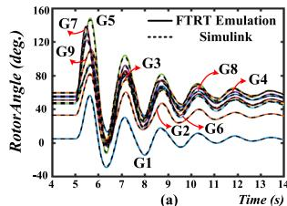

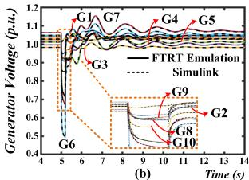

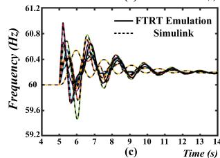

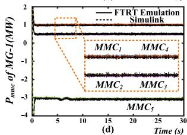  
FIGURE 10. FTRT emulation results of three-phase-to-ground fault: (a) rotor angles, (b) generator voltages (G6-G9), (c) generator frequencies, (d) output power of MMCs in MG-1.

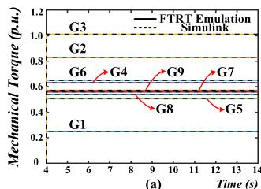

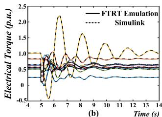

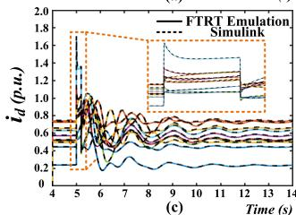

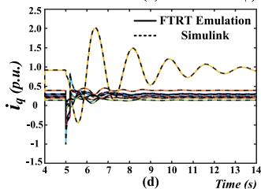  
FIGURE 11. Comparison of FTRT results and offline results: (a) mechanical torque, (b) electrical torque, (c) generator output $i _ { d }$ (G1-G10), and (d) generator output $i _ { q }$ (G1-G10).

should wait for the wind turbine part to finish computation to keep data synchronization. Therefore, the total FTRT ratio of the proposed microgrid cluster is about 51.

# V. FTRT EMULATION RESULTS AND VALIDATION

The hardware emulation of the AC grid integrated with microgrid cluster is conducted on the FPGA-based FTRT platform (Fig. 9), and the proposed FTRT emulation and the interface strategy are validated by comparing the results with those of the off-line simulation tool Matlab/Simulink
R .

# A. CASE 1: THREE-PHASE-TO-GROUND FAULT

At t = 5s, the three-phase-to-ground fault lasting 200 ms occurs at Bus 21 as given in Fig. 6. The rotor angles, output voltages, and frequencies of the synchronous generators start to oscillate immediately, as given in Fig. $1 0 \ : ( \mathrm { a } ) \mathrm { - } ( \mathrm { c } )$ , where the dashed lines refer to the results from Simulink
R and the solid lines represent the FTRT emulation results. Fig. 10 (d) provides the output power of the VSCs in MG-1, which indicates that the waveforms from the FTRT emulation match with

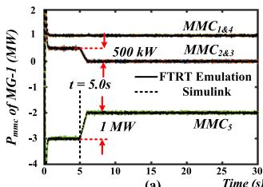

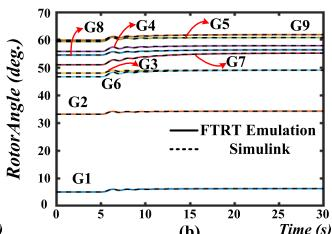

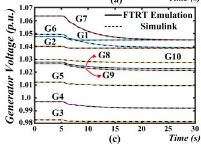

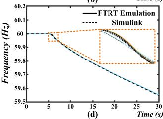  
FIGURE 12. Impact of lack of power generation in PV array: (a) generator relative rotor angles, (b) generator voltages, (c) frequencies, (d) output power of MMCs in MG-1.

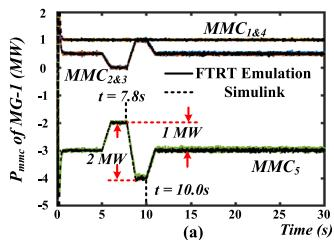

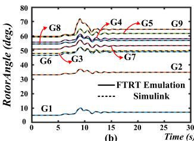

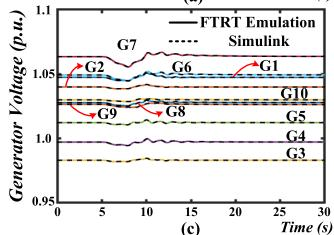

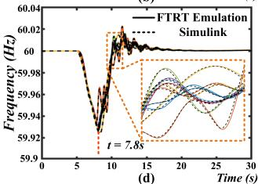  
FIGURE 13. Microgrid internal power balance results: (a) generator relative rotor angles, (b) generator voltages, (c) frequencies, (d) output power of MMCs in MG-1.

those obtained from the off-line simulation. Since the output power of the PV-BESS systems and wind turbines maintain stability, there is no significant change of the active power injections at the PCC, as given in Fig. 10 (d).

To further demonstrate the accuracy of the proposed FTRT emulation, the electrical torques, generator output $i _ { d } ,$ and $i _ { q }$ currents after the 200ms three-phase-to-ground fault are also provided in Fig. 11. As illustrated in the zoomed-in plots in Fig. 11. (c), the accuracy of the FTRT emulation can be guaranteed as the waveforms from the proposed emulation are matched with the results from the offline simulation tool.

# B. CASE 2: MICROGRID INTERNAL POWER BALANCE

Since the output power of renewable energy is highly dependent on the environment, such as irradiations or wind speed, low power generation may occur and last for a long period in the microgrids. This case study focuses on the microgrid internal balance and the predictive control of the proposed FTRT emulation. At the time of 5s, the output power of each PV array in MG-1 decreases by 500 kW , which induces a

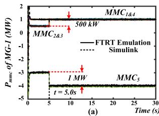

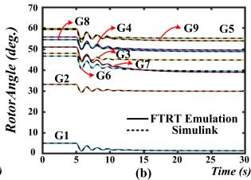

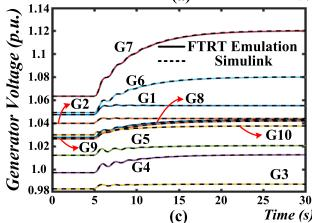

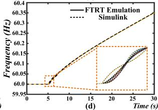  
FIGURE 14. Impacts of excess power injection to the host grid: (a) generator relative rotor angles, (b) generator voltages, (c) frequencies, (d) output power of MMCs in MG-1.

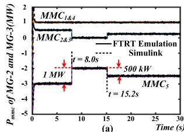

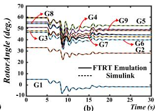

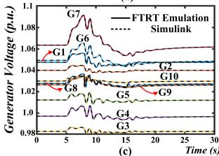

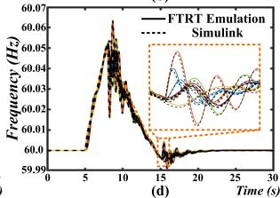  
FIGURE 15. Inter-MG coordination results: (a) generator relative rotor angles, (b) generator voltages, (c) frequencies, (d) output power of MMCs in MG-1.

lack of power injection at Bus 39, as given in Fig. 12 (a). Although the rotor angles can restore to a new steady-state as given in Fig. 12 (b), the impacts of reduced generation are severe, including the significant drop of the generator voltages and the unrecoverable generator frequencies as shown in Fig. 12 (c) and (d).

With the 51 times faster than real-time execution, the FTRT emulation equipped in the energy control center comes up with an optimal power control strategy following the detection of the abnormal condition to mitigate the adverse impacts, as given in Fig. 13 (a). At t = 7.8 s, each BESS in MG-1 provides extra 1 MW active power to the AC grid in 1s and lasts 1.2s until t = 10.0 s, resulting in an extra active power injection of 2 MW from MG-1 to Bus 39. As a result, the frequencies start to recover as given in Fig. 13 (d). After 10s, MG-1 reduces the power injection from 4 MW to 3 MW , then the generator frequencies restore to 60 Hz, meanwhile, the rotor angles and generator voltages recover to the previous working conditions. The zoomed-in plots in Fig. 12-13 (d) indicate that the FTRT emulation results matched with the off-line simulation tool.

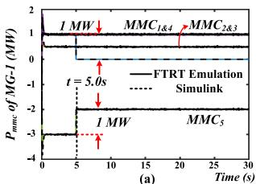

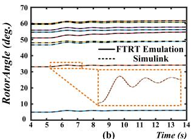

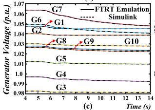

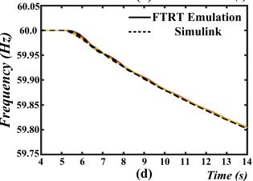  
FIGURE 16. FTRT emulation results for an open circuit fault occurs in DC grid.

# C. CASE 3: INTER-MG COORDINATION

In this case, assuming that the BESS in MG-1 is fully charged and cannot store the extra power generated from the PV array, so that the MG-1 injects 1 MW into the AC grid, as given in Fig. 14 (a). It brings significant impacts on the stability of the host grid, including the rotor angles, bus voltages, especially the increasing generator frequencies, as shown in Fig. 14 (b)-(d). After the detection of the abnormal frequency, the energy control center emulates several power control contingencies and provides an optimal solution to mitigate the increasing frequencies.

At t=8.0s, both MG-2 and MG-3 start to take action, and each microgrid absorbs 1 MW active power, As a result, the generator frequencies start to decrease as given in Fig. 15 (a) and (d). At the time of 15.2s, MG-2 and MG-3 reduce the absorption power to 0.5 MW , and the frequencies start to recover and return to 60 Hz. Meanwhile, the rotor angles and the bus voltages of the AC grids stabilize in a new steady-state as shown in Fig. 15 (b) and (c). Meanwhile, the zoomed-in plots are also provided in Fig. 14-15 (d), which thoroughly demonstrates the accuracy of the proposed method.

# D. CASE 4: OPEN CIRCUIT FAULT IN LVDC SYSTEM

The open circuit fault occurring in the 5-T LVDC line in MG-1 is also emulated, where the fault location is shown in Fig. 6. The influence of the open circuit fault is similar to the low power generation fault due to the lack of power injection at Bus 39. The zoomed-in plots in Fig. 16 (b) demonstrate that the proposed FTRT emulation still has high accuracy regarding the fault happens at one of the LVDC lines.

# VI. CONCLUSION

This paper proposed a comprehensive hardware-based fasterthan-real-time dynamic emulation of a grid of microgrids to study the impact of their integration on the host system. Since different emulation types and time-steps are adopted for the AC grid and microgrids, a dynamic voltage injection interface strategy with less hardware utilization and lower latency is therefore proposed to enable the compatibility

of EMT and TS models. Taking its inherent advantages of reconfigurability and parallelism, the FPGA-based hardware platform allows emulating the integrated microgrid cluster with an execution speed over 51 times faster than realtime. Meanwhile, an active power dispatch is emulated to deal with the various working conditions of the microgrids. The time-domain results indicate that the proposed FTRT emulation is numerically stable and accurate compared with the off-line simulation. Furthermore, the dynamic security assessment can be carried out on the proposed FPGA-based FTRT platform with significant acceleration. The detailed comprehensive FTRT emulation is also suitable for analyzing other severe disturbances, which is meaningful for modern power systems with high penetration of renewable energy.

# REFERENCES

[1] M. H. Saeed, W. Fangzong, B. A. Kalwar, and S. Iqbal, ‘‘A review on microgrids’ challenges & perspectives,’’ IEEE Access, vol. 9, pp. 166502–166517, 2021.   
[2] F. Blaabjerg, Y. Yang, D. Yang, and X. Wang, ‘‘Distributed powergeneration systems and protection,’’ Proc. IEEE, vol. 105, no. 7, pp. 1311–1331, Jul. 2017.   
[3] W. Hu, Z. Wu, X. Lv, and V. Dinavahi, ‘‘Robust secondary frequency control for virtual synchronous machine-based microgrid cluster using equivalent modeling,’’ IEEE Trans. Smart Grid, vol. 12, no. 4, pp. 2879–2889, Jul. 2021.   
[4] M. A. Ebrahim, R. M. A. Fattah, E. M. M. Saied, S. M. A. Maksoud, and H. E. Khashab, ‘‘Real-time implementation of self-adaptive salp swarm optimization-based microgrid droop control,’’ IEEE Access, vol. 8, pp. 185738–185751, 2020.   
[5] Y. Han, H. Li, P. Shen, E. A. A. Coelho, and J. M. Guerrero, ‘‘Review of active and reactive power sharing strategies in hierarchical controlled microgrids,’’ IEEE Trans. Power Electron., vol. 32, no. 3, pp. 2427–2451, Mar. 2017.   
[6] S. D’silva, M. Shadmand, S. Bayhan, and H. Abu-Rub, ‘‘Towards grid of microgrids: Seamless transition between grid-connected and islanded modes of operation,’’ IEEE Open J. Ind. Electron. Soc., vol. 1, pp. 66–81, 2020.   
[7] J.-H. Jeon et al., ‘‘Development of hardware in-the-loop simulation system for testing operation and control functions of microgrid,’’ IEEE Trans. Power Electron., vol. 25, no. 12, pp. 2919–2929, Dec. 2010.   
[8] Y. Zhang, S. Shen, and J. L. Mathieu, ‘‘Distributionally robust chanceconstrained optimal power flow with uncertain renewables and uncertain reserves provided by loads,’’ IEEE Trans. Power Syst., vol. 32, no. 2, pp. 1378–1388, Mar. 2017.   
[9] M. Usama et al., ‘‘A comprehensive review on protection strategies to mitigate the impact of renewable energy sources on interconnected distribution networks,’’ IEEE Access, vol. 9, pp. 35740–35765, 2021.   
[10] C. Yuan, M. A. Haj-ahmed, and M. S. Illindala, ‘‘Protection strategies for medium-voltage direct-current microgrid at a remote area mine site,’’ IEEE Trans. Ind. Appl., vol. 51, no. 4, pp. 2846–2853, Jul. 2015.   
[11] M. Farrokhabadi, S. König, C. A. Cañizares, K. Bhattacharya, and T. Leibfried, ‘‘Battery energy storage system models for microgrid stability analysis and dynamic simulation,’’ IEEE Trans. Power Syst., vol. 33, no. 2, pp. 2301–2312, Mar. 2018.   
[12] C. Lyu, N. Lin, and V. Dinavahi, ‘‘Device-level parallel-in-time simulation of MMC-based energy system for electric vehicles,’’ IEEE Trans. Veh. Technol., vol. 70, no. 6, pp. 5669–5678, Jun. 2021.   
[13] R. Rana, K. Berg, M. Z. Degefa, and M. Loschenbrand, ‘‘Modelling and simulation approaches for local energy community integrated distribution networks,’’ IEEE Access, vol. 10, pp. 3775–3789, 2022.   
[14] W. Chen et al., ‘‘DC-distributed power system modeling and hardwarein-the-loop (HIL) evaluation of fuel cell-powered marine vessel,’’ IEEE J. Emerg. Sel. Topics Ind. Electron., vol. 3, no. 3, pp. 797–808, Jan. 2022, doi: 10.1109/JESTIE.2021.3139471.   
[15] W. Chen, S. Zhang, and V. Dinavahi, ‘‘Real-time ML-assisted hardwarein-the-loop electro-thermal emulation of LVDC microgrid on the international space station,’’ IEEE Open J. Power Electron., vol. 3, pp. 168–181, Mar. 2022.

[16] J. Zhao, F. Li, S. Mukherjee, and C. Sticht, ‘‘Deep reinforcement learningbased model-free on-line dynamic multi-microgrid formation to enhance resilience,’’ IEEE Trans. Smart Grid, vol. 13, no. 4, pp. 2557–2567, Jul. 2022, doi: 10.1109/TSG.2022.3160387.   
[17] U. Tamrakar, D. A. Copp, T. A. Nguyen, T. M. Hansen, and R. Tonkoski, ‘‘Real-time estimation of microgrid inertia and damping constant,’’ IEEE Access, vol. 9, pp. 114523–114534, 2021.   
[18] L. M. Tolbert et al., ‘‘Reconfigurable real-time power grid emulator for systems with high penetration of renewables,’’ IEEE Open Access J. Power Energy, vol. 7, pp. 489–500, 2020.   
[19] F. Huerta, R. L. Tello, and M. Prodanovic, ‘‘Real-time power-hardware-inthe-loop implementation of variable-speed wind turbines,’’ IEEE Trans. Ind. Electron., vol. 64, no. 3, pp. 1893–1904, Mar. 2017.   
[20] N. Bazmohammadi et al., ‘‘Microgrid digital twins: Concepts, applications, and future trends,’’ IEEE Access, vol. 10, pp. 2284–2302, 2022.   
[21] M. H. Cintuglu and D. Ishchenko, ‘‘Real-time asynchronous information processing in distributed power systems control,’’ IEEE Trans. Smart Grid, vol. 13, no. 1, pp. 773–782, Jan. 2022.   
[22] A. A. Memon and K. Kauhaniemi, ‘‘Real-time hardware-in-the-loop testing of IEC 61850 GOOSE-based logically selective adaptive protection of AC microgrid,’’ IEEE Access, vol. 9, pp. 154612–154639, 2021.   
[23] H. F. Habib, N. Fawzy, and S. Brahma, ‘‘Performance testing and assessment of protection scheme using real-time hardware-in-the-loop and IEC 61850 standard,’’ IEEE Trans. Ind. Appl., vol. 57, no. 5, pp. 4569–4578, Sep. 2021.   
[24] M. Manbachi et al., ‘‘Real-time co-simulation platform for smart grid volt-VAR optimization using IEC 61850,’’ IEEE Trans. Ind. Informat., vol. 12, no. 4, pp. 1392–1402, Aug. 2016.   
[25] S. Nigam, O. Ajala, and A. D. Dominguez-Garcia, ‘‘A controller hardwarein-the-loop testbed: Verification and validation of microgrid control architectures,’’ IEEE Electrific. Mag., vol. 8, no. 3, pp. 92–100, Sep. 2020.   
[26] A. S. Vijay, S. Doolla, and M. C. Chandorkar, ‘‘Real-time testing approaches for microgrids,’’ IEEE J. Emerg. Sel. Topics Power Electron., vol. 5, no. 3, pp. 1356–1376, Sep. 2017.   
[27] D. L. Marino, C. S. Wickramasinghe, V. K. Singh, J. Gentle, C. Rieger, and M. Manic, ‘‘The virtualized cyber-physical testbed for machine learning anomaly detection: A wind powered grid case study,’’ IEEE Access, vol. 9, pp. 159475–159494, 2021.   
[28] C. Dufour and J. Belanger, ‘‘On the use of real-time simulation technology in smart grid research and development,’’ IEEE Trans. Ind. Appl., vol. 50, no. 6, pp. 3963–3970, Nov. 2014.   
[29] J. Xu, K. Wang, P. Wu, and G. Li, ‘‘FPGA-based sub-microsecond-level real-time simulation for microgrids with a network-decoupled algorithm,’’ IEEE Trans. Power Del., vol. 35, no. 2, pp. 987–998, Apr. 2020.   
[30] M. Milton, A. Benigni, and A. Monti, ‘‘Real-time multi-FPGA simulation of energy conversion systems,’’ IEEE Trans. Energy Convers., vol. 34, no. 4, pp. 2198–2208, Dec. 2019.   
[31] Y. Chen and V. Dinavahi, ‘‘Multi-FPGA digital hardware design for detailed large-scale real-time electromagnetic transient simulation of power systems,’’ IET Gener., Transmiss., Distrib., vol. 7, no. 5, pp. 451–463, May 2013.   
[32] C. Yang, Y. Xue, X.-P. Zhang, Y. Zhang, and Y. Chen, ‘‘Real-time FPGA-RTDS co-simulator for power systems,’’ IEEE Access, vol. 6, pp. 44917–44926, 2018.   
[33] J. Xu et al., ‘‘FPGA-based submicrosecond-level real-time simulation of solid-state transformer with a switching frequency of 50 kHz,’’ IEEE J. Emerg. Sel. Topics Power Electron., vol. 9, no. 4, pp. 4212–4224, Aug. 2021.   
[34] J. Zhu, L. Pan, Y. Yan, D. Wu, and H. He, ‘‘A fast application-based supply voltage optimization method for dual voltage FPGA,’’ IEEE Trans. Very Large Scale Integr. (VLSI) Syst., vol. 22, no. 12, pp. 2629–2634, Dec. 2014.   
[35] R. Dai, G. Liu, and X. Zhang, ‘‘Transmission technologies and implementations: Building a stronger, smarter power grid in China,’’ IEEE Power Energy Mag., vol. 18, no. 2, pp. 53–59, Mar. 2020.   
[36] Y. Huo and G. Gruosso, ‘‘Hardware-in-the-loop framework for validation of ancillary service in microgrids: Feasibility, problems and improvement,’’ IEEE Access, vol. 7, pp. 58104–58112, 2019.   
[37] S. Cao, N. Lin, and V. Dinavahi, ‘‘Faster-than-real-time hardware emulation of extensive contingencies for dynamic security analysis of largescale integrated AC/DC grid,’’ IEEE Trans. Power Syst., early access, Mar. 28, 2022, doi: 10.1109/TPWRS.2022.3161561.   
[38] S. Cao, N. Lin, and V. Dinavahi, ‘‘Flexible time-stepping dynamic emulation of AC/DC grid for faster-than-SCADA applications,’’ IEEE Trans. Power Syst., vol. 36, no. 3, pp. 2674–2683, May 2021.

[39] N. Lin, S. Cao, and V. Dinavahi, ‘‘Comprehensive modeling of large photovoltaic systems for heterogeneous parallel transient simulation of integrated AC/DC grid,’’ IEEE Trans. Energy Convers., vol. 35, no. 2, pp. 917–927, Jun. 2020.   
[40] N. Lin, S. Cao, and V. Dinavahi, ‘‘Adaptive heterogeneous transient analysis of wind farm integrated comprehensive AC/DC grids,’’ IEEE Trans. Energy Convers., vol. 36, no. 3, pp. 2370–2379, Sep. 2021.   
[41] G. Abad, J. López, M. Rodríguez, L. Marroyo, and G. Iwanski, Doubly Fed Induction Machine: Modeling and Control for Wind Energy Generation Applications. Hoboken, NJ, USA: Wiley, 2011.   
[42] Texas A&M University College of Engineering. Accessed: Nov. 21, 2022. [Online]. Available: https://electricgrids.engr.tamu.edu/electric-grid-testcases/new-england-ieee-39-bus-system/   
[43] P. Kundur, Power System Stability and Control. New York, NY, USA: McGraw-Hill, 1994.   
[44] V. Dinavahi and N. Lin, Real-Time Electromagnetic Transient Simulation of AC-DC Networks. Hoboken, NJ, USA: Wiley, 2021.

SHIQI CAO (Graduate Student Member, IEEE) received the B.Eng. degree in electrical engineering and automation from the East China University of Science and Technology, Shanghai, China, in 2015, and the M.Eng. degree in power system from Western University, London, ON, Canada, in 2017. He is currently pursuing the Ph.D. degree in electrical and computer engineering with the University of Alberta, Canada. His research interests include transient stability analysis, power

electronics, and field programmable gate arrays.

NING LIN (Member, IEEE) received the B.Sc. and M.Sc. degrees in electrical engineering from Zhejiang University, Hangzhou, China, in 2008 and 2011, respectively, and the Ph.D. degree in electrical and computer engineering from the University of Alberta, Edmonton, AB, Canada, in 2018. From 2011 to 2014, he was an Engineer of substation automation, flexible AC transmission systems, and high-voltage direct current transmission control and protection. Currently, he is a

Senior Power Systems Consultant. His research interests include AC/DC grids, electromagnetic transient simulation, real-time simulation, transient stability analysis, heterogeneous high-performance computing of power systems, and power electronics.

VENKATA DINAVAHI (Fellow, IEEE) received the B.Eng. degree in electrical engineering from the Visvesvaraya National Institute of Technology (VNIT), Nagpur, India, in 1993, the M.Tech. degree in electrical engineering from the IIT Kanpur, India, in 1996, and the Ph.D. degree in electrical and computer engineering from the University of Toronto, ON, Canada, in 2000. Currently, he is a Professor with the Department of Electrical and Computer Engineering, University

of Alberta, Edmonton, AB, Canada. He is a fellow of the Engineering Institute of Canada. His research interests include real-time simulation of power systems and power electronic systems, electromagnetic transients, devicelevel modeling, large-scale systems, and parallel and distributed computing.