# A state-variable-preserving method for the efficient modelling of inverter-based resources in parallel EMT simulation

Qiguo Wang1 Jin Xu1 Keyou Wang1 Guojie Li1 Zhenyuan Feng2

1Key Laboratory of Control of Power Transmission and Conversion (Shanghai Jiao Tong University), Ministry of Education, Shanghai, China   
2State Grid Jiaxing Power Supply Company, Jiaxing, Zhejiang, China

# Correspondence

Jin Xu, Key Laboratory of Control of Power Transmission and Conversion (Shanghai Jiao Tong University), Ministry of Education, Shanghai, China. Email: xujin20506@sjtu.edu.cn

# Funding information

National Key Research and Development Program of China, Grant/Award Number:

2022YFE0105200; State Grid Zhejiang Electric Power Co., LTD., Jiaxing power supply company, Grant/Award Number: 5211JX230004

# Abstract

The aggregation models of renewable energy power stations are difficult to apply to the stability research of the fault inside the station or the oscillation analysis between the station and the grid-side system, and the high dimensional characteristics of their detailed model will pose an enormous challenge to the simulation efficiency. To alleviate the contradiction between accuracy and efficiency, this paper proposes a state-variable-preserving method to efficiently model inverter-based resources and a node tearing method to realize parallel simulation of the renewable energy power station consisting of inverter-based resources. The state-variable-preserving model uses discrete state space expression to eliminate the internal nodes on the basis of preserving the original variables of the generation unit and reduces the solving scale of the generation station. The node tearing method reduces the solving complexity of the associated variables, which is more consistent with the topology characteristic that different power generation clusters are interconnected by the same bus. In the case study, the results of numerical accuracy analysis and numerical stability analysis of a photovoltaic power plant verify the reliability of the proposed method, and its simulation efficiency is verified by changing the scale of the photovoltaic power plant.

# 1 INTRODUCTION

The power system is transforming into a complex network with renewable energies as the main body. The proportion of power electronic equipment in the power system has increased significantly, greatly changing the basic structure of the power grid and the stability mechanism of the system [1]. Considering the cost and safety of the electric power test, electromagnetic transient (EMT) simulation is an important method to analyse the stable operation mechanism of renewable energy power systems.

For simulation scenarios with different precision and specific requirements, relevant research has improved the efficiency of EMT simulation of renewable energy power stations through model simplification. The device-level simplification mainly increased the simulation step size by establishing the average value model [2] and the dynamic phasor model [3] of the power electronic equipment. The station-level simplification was mainly to reduce the number of renewable energy power generation units through aggregation. The single-machine equivalent model used one equivalent generation unit to represent the

whole station [4], and its output power was the weighting of all the generation units in the station. Considering the different operating conditions of various units, the multi-machine equivalent model [5] performed equivalent processing for units in the same group according to different cluster indexes, further improving the accuracy of the aggregation model.

However, the simplified model at the device level ignores the switch action process, and the aggregation model at the station level cannot reflect the internal characteristics of the original system [6]. They are hard to apply to the stability research of the fault inside the station or the cascading accident of multiple stations [7] and the oscillation analysis between the renewable energy stations and the grid-side system [8].

The detailed modelling of renewable energy power stations based on the structure-preserving method retains the original circuit topology and introduces the microsecond switching process, which will dramatically increase the simulation burden of the system. Scholars put forward optimization methods to reduce the calculation amount of simulation and accelerate the solution process. The matrix exponential function [9]

This is an open access article under the terms of the Creative Commons Attribution-NonCommercial-NoDerivs License, which permits use and distribution in any medium, provided the original work is properly cited, the use is non-commercial and no modifications or adaptations are made.

© 2025 The Author(s). IET Generation, Transmission & Distribution published by John Wiley & Sons Ltd on behalf of The Institution of Engineering and Technology.

used large step size to speed up the simulation of the slow dynamic process, which realized the multi-time scale simulation of large-scale wind farms based on ensuring high fidelity. Then, an order reduction technique based on Krylov subspace [10] was further introduced to improve the simulation efficiency of high-dimensional EMT models of wind farms. The state space node method [11] used the state variables of dynamic components to form groups and the state space expression to solve the intra-group variables, which eliminated the internal nodes of each group. In [12], the integrated equivalent model of largescale offshore wind farms was established by combining the EMT circuit models of each device in the wind power generation system, which decreased the scale of system simulation. However, the model needs to be reconstructed when the system structure changes. Additionally, the number of nodes eliminated by the method mentioned in [12] is limited, and the system scale still shows an increasing trend with the growth of the number of renewable energies.

With the development of high-performance hardware platforms, using massive computing resources to realize parallel solutions of large-scale power systems has become an effective means to improve simulation efficiency. Network interface algorithms are divided into two types according to whether there is a delay: one is the delay-based method, and the other is the delay-free method.

In [13], a combination circuit of the capacitance branch and the inductance branch was selected to divide the distributed power supply and the grid-side system, which realized parallel simulation at the subsystem level. In [14] and [15], a semi-implicit delayed decoupling method was proposed to introduce multiple separated interfaces to achieve fine-grained decoupling of renewable energy power generation units. In addition, inspired by the finite-difference time-domain method, the latency insertion method [16, 17] was proposed to improve the design efficiency of large-scale integrated circuits, which was a component-level parallel simulation method. However, these approaches introduce delay in the data interaction of parallel solving units, and the existence of delay error often requires the system to use microsecond step size to ensure the numerical stability of the simulation.

In contrast, the delay-free decoupling method has better numerical stability. Diakoptics [18] was the earliest delay-free network partition idea, which was further developed by relevant scholars into a series of interface models such as bordered blocked diagonal matrix method [19, 20], compensation model [21, 22], and multi-area Thevenin equivalent model [23, 24]. These methods used the associated branch to divide independent subsystems, and they could also be called the branch cutting method. In [25], a node splitting method was proposed to realize system partitioning, which was also a branch cutting method in essence, and just the branch impedance used for segmentation was zero. However, when these methods apply to renewable energy power generation clusters interconnected by the common bus, the complexity of solving associated variables will be significantly increased. In addition, other decoupling methods, such as the loop current tearing method [26], the nested fast simultaneous solution method [27], and the linking-

domain extraction decomposition method [28], were proposed for specific topologies, all of which are also difficult to apply to decouple renewable energy power stations.

Therefore, a state-variable-preserving (SVP) method for the efficient modelling of inverter-based resources in parallel EMT simulation is proposed in this work. Firstly, the SVP method uses the combination of controlled admittances and controlled historical current sources determined by internal state variables to equivalent inverter-based resources. SVP eliminates the internal nodes while ensuring the modelling accuracy, and reduces the solving complexity of the detailed model of inverter-based resources. Secondly, the node tearing method reconstructs the node voltage equation using the voltage of the associated nodes, which reduces the solving complexity of associated variables compared with the branch cutting method. Finally, based on the independence of solving different power generation units and solving different power generation clusters, a hierarchical parallel algorithm is designed to improve the simulation efficiency of renewable energy power stations consisting of inverter-based resources.

The paper is organized as follows: Section 2 shows the structure of photovoltaic (PV) power plants. Section 3 elaborates on the state-variable-preserving modelling of PV power generation units. Section 4 represents the partition modelling of the PV power plant based on the node tearing method. Section 5 introduces the design of the hierarchical parallel simulation algorithm. The simulation case and results are given in Section 6. Section 7 presents the conclusions.

# 2 STRUCTURE OF PHOTOVOLTAICPOWER PLANTS

The collecting and distributing PV power generation system combines the advantages of traditional AC systems and group-string systems, enabling both decentralized control and centralized grid connection [29]. This system is suitable for large-scale ground-mounted PV power plants, particularly in areas with inconsistent orientations and severe shading, whose topology is shown in Figure 1. In the PV power generation unit of the system, the front-end DC/DC converter can achieve maximum power point tracking (MPPT) control, and the rear-end DC/AC converter is used for inversion functions.

Although the multi-branch structure of the PV power generation unit enhances the reliability and efficiency of the PV power generation system, it also increases the complexity of the topology. On the one hand, the increased number of converters expands the solving scale of each PV unit. On the other hand, the increased number of controllers leads to more control variables that need to be solved within each PV unit. When this increase in complexity is further reflected in the PV power plant, the solution efficiency becomes unacceptable.

To address the efficiency issue on the basis of maintaining model accuracy, a state-variable-preserving (SVP) method is proposed for modelling the PV power generation unit. The SVP method uses discrete state space expression to extract the output characteristics of the original circuit without considering

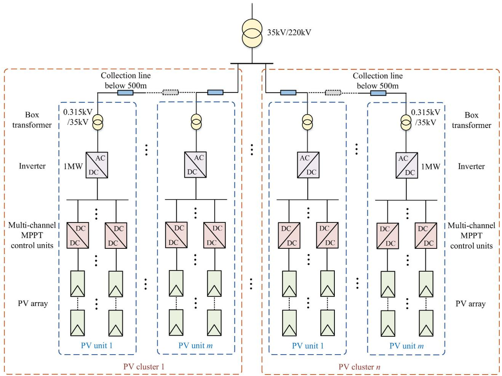  
FIGURE 1 Schematic diagram of the collecting and distributing photovoltaic power generation system.

its detailed topology, which retains all the state variables of the unit while reducing the scale it represents to the external system.

# 3 STATE-VARIABLE-PRESERVINGMODELLING OF PHOTOVOLTAIC POWERGENERATION UNITS

From the perspective of the control theory, the state space expression can completely describe the input and output characteristics of a system without considering the specific control block diagram implementations. Inspired by this, the SVP method uses discrete state space expression to extract the output characteristics of the original circuit after numerical integration without considering the circuit structure. The following describes the construction process of the discrete state space expression of the PV power generation unit.

# 3.1 Electrical equations

The electrical model of the PV power generation unit is shown in Figure 2, which consists of multiple PV arrays and boost converters, an inverter, and a filter.

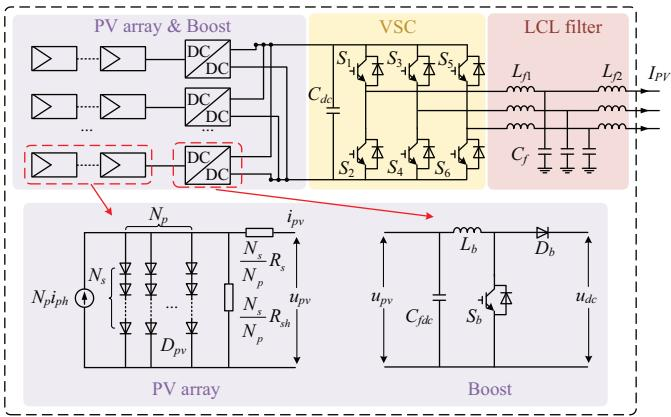  
FIGURE 2 Electrical model of the PV power generation unit.

# 3.1.1 Photovoltaic array equation

A complete PV array consists of multiple PV cell modules connected in parallel and series, and it is generally believed that the characteristic parameters of each PV cell module in a PV array are the same. Without considering the connection loss between different PV cell modules, the equivalent circuit of the PV array is shown in Figure 2. Its volt–ampere characteristic relationship

is shown as follows.

$$
\begin{array}{l} i _ {\mathrm {a r r a y}} = N _ {\mathrm {p}} i _ {\mathrm {p h}} - N _ {\mathrm {p}} i _ {\mathrm {s}} \left(e ^ {\frac {q}{\mathcal {A} k T} \left(\frac {u _ {\mathrm {a r r a y}}}{N _ {\mathrm {s}}} + \frac {i _ {\mathrm {a r r a y}} R _ {\mathrm {s}}}{N _ {\mathrm {p}}}\right)} - 1\right) \\ - \frac {N _ {\mathrm {p}}}{R _ {\mathrm {s h}}} \left(\frac {u _ {\mathrm {a r r a y}}}{N _ {\mathrm {s}}} + \frac {i _ {\mathrm {a r r a y}} R _ {\mathrm {s}}}{N _ {\mathrm {p}}}\right) \tag {1} \\ \end{array}
$$

where iarray $i _ { \mathrm { a r r a y } }$ and $u _ { \mathrm { a r r a y } }$ are the output current and output voltage of the PV array respectively; $i _ { \mathrm { p h } }$ is the photo-generated current; $i _ { \mathrm { s } }$ is the reverse saturation current of the diode; $R _ { \mathrm { s } }$ is the series equivalent resistance; $R _ { \mathrm { s h } }$ is the parallel equivalent resistance; $N _ { \mathrm { s } }$ is the number of series photovoltaic cells; $N _ { \mathrm { p } }$ is the number of parallel photovoltaic cells; q is the electron charge; A is the ideal factor of the diode; k is the Boltzmann constant; T is the absolute temperature.

# 3.1.2 Internal variable equation

Define the outlet nodes of the filter as output nodes of the PV power generation unit and the others as internal nodes. The node voltage equation of internal nodes can be formed following the solution process of the traditional nodal analysis method (NAM) [30], which is shown as Equation (2). The PV array is represented by a current source $i _ { \mathrm { a r r a y } }$ . The switch and diode are represented by a switching model with a small onresistance. The admittance $Y _ { \mathrm { s w } }$ of the switch is $1 0 ^ { 6 }$ when the switch is on and 0 when it is off. Dynamic components such as capacitors and inductors are represented by companion circuit models discretized by the trapezoidal method. The companion circuit model includes equivalent admittance and historical current [30].

$$
\left\{ \begin{array}{l} \boldsymbol {Y} _ {\mathrm {i n}} (t) \boldsymbol {U} _ {\mathrm {i n}} (t) = \boldsymbol {I} _ {\mathrm {i n}} (t) \\ \boldsymbol {I} _ {\mathrm {i n}} (t) = \boldsymbol {I} _ {\mathrm {i n j}} (t) - \boldsymbol {M} _ {\mathrm {h} - \mathrm {i n}} ^ {T} \boldsymbol {I} _ {\mathrm {h P V}} (t) + \boldsymbol {Y} _ {\mathrm {o} - \mathrm {i n}} ^ {T} \boldsymbol {U} _ {\mathrm {P V}} (t) \end{array} \right. \tag {2}
$$

where t represents the value of the variable at the current time; $Y _ { \mathrm { i n } }$ is the nodal admittance matrix of internal nodes; $U _ { \mathbf { i n } }$ is Ythe voltage vector of internal nodes; $I _ { \mathrm { i n } }$ Uis the inject current Ivector of internal nodes, which needs to consider the influence of internal current sources, historical currents of dynamic components, and external nodes; $I _ { \mathrm { i n j } }$ is the nodal injected cur-Irent vector under the influence of internal current sources $i _ { \mathrm { a r r a y } } ;$ $I _ { \mathrm { h P V } }$ is a vector composed of the historical currents of dynamic Icomponents; $U _ { \mathbf { P V } }$ is the voltage vector of output nodes; $M _ { \mathrm { h - i n } }$ and $Y _ { \mathrm { o - i n } }$ U Mare the associated coefficient matrix reflecting the Yinfluence of historical currents on injection currents and the associated admittance matrix reflecting the influence of output voltages on injection currents respectively, which are defined as follows.

If the historical current source of the ith dynamic component flows out of the internal node $j , M _ { \mathrm { h - i n } } ( i , j ) = 1$ ; If the histori-Mcal current source of the ith dynamic component flows into the

internal node $j , M _ { \mathrm { h - i n } } ( i , j ) = - 1 ;$ If the first two conditions are not satisfied, $M _ { \mathrm { h - i n } } ( i , j ) = 0$ .

MIf there is an equivalent admittance $Y _ { i j }$ between the output node i and internal node j, $Y _ { \mathrm { o - i n } } ( i _ { 3 } / ) = Y _ { i j } \backslash$ Otherwise, $Y _ { \mathrm { o - i n } } ( i , j )$ $= 0$ .

# 3.1.3 State variable equation

The expression of the historical currents of the companion circuit models of dynamic components is as follows:

$$
\begin{array}{l} \boldsymbol {I} _ {\mathrm {h P V}} (t) = 2 \boldsymbol {Y} _ {\mathrm {h - i n}} \boldsymbol {U} _ {\mathrm {i n}} (t - \Delta t) + 2 \boldsymbol {Y} _ {\mathrm {h - P V}} \boldsymbol {U} _ {\mathrm {P V}} (t - \Delta t) \\ + K I _ {\mathrm {h P V}} (t - \Delta t) \tag {3} \\ \end{array}
$$

$$
\boldsymbol {K} = \left[ \begin{array}{c c} - \mathbf {I} _ {N _ {\mathrm {C}} \times N _ {\mathrm {C}}} & \\ & \mathbf {I} _ {N _ {\mathrm {L}} \times N _ {\mathrm {L}}} \end{array} \right] \tag {4}
$$

where $\Delta t$ is the step size; $Y _ { \mathrm { h - i n } }$ and $Y _ { \mathrm { h - P V } }$ are also associated Y Yadmittance matrices, whose definition can refer to $Y _ { \mathrm { o - i n } } ;$ I is the identity matrix; $N _ { \mathrm { C } }$ is the number of capacitors; $N _ { \mathrm { L } }$ is the number of inductors.

# 3.1.4 Output variable equation

The output currents are expressed as follows:

$$
\boldsymbol {I} _ {\mathrm {P V}} (t) = \boldsymbol {Y} _ {\mathrm {o} - \mathrm {i n}} \boldsymbol {U} _ {\mathrm {i n}} (t) - \boldsymbol {Y} _ {\mathrm {o} - \mathrm {P V}} \boldsymbol {U} _ {\mathrm {P V}} (t) - \boldsymbol {M} _ {\mathrm {h} - \mathrm {P V}} ^ {T} \boldsymbol {I} _ {\mathrm {h P V}} (t) \tag {5}
$$

where $M _ { \mathrm { h - P V } }$ and $Y _ { \mathbf { o - P V } }$ are the associated coefficient matrix M Yand the associated admittance matrix respectively, whose definition can also refer to $M _ { \mathrm { h - i n } }$ and $Y _ { \mathrm { o - i n } }$ .

# 3.1.5 Discrete state space expression

Taking $I _ { \mathrm { h P V } }$ as the state variable, $U _ { \mathbf { P V } }$ as the input variable, $I _ { \mathrm { P V } }$ I U Ias the output variable, and considering the influence of the internal current source $I _ { \mathrm { i n j } } ,$ the electrical Equations $( 2 ) - ( 5 )$ of the IPV power generation unit can be sorted into the form of the following discrete state space expression:

$$
\left\{ \begin{array}{r l} \boldsymbol {I} _ {\mathrm {h P V}} (t) & = \boldsymbol {A} _ {\mathrm {P V}} \boldsymbol {I} _ {\mathrm {h P V}} (t - \Delta t) + \boldsymbol {B} _ {\mathrm {P V}} \boldsymbol {U} _ {\mathrm {P V}} (t - \Delta t) \\ & + \boldsymbol {E} _ {\mathrm {P V}} \boldsymbol {I} _ {\mathrm {i n j}} (t - \Delta t) \\ \boldsymbol {I} _ {\mathrm {P V}} (t) & = \boldsymbol {C} _ {\mathrm {P V}} \boldsymbol {I} _ {\mathrm {h P V}} (t) + \boldsymbol {D} _ {\mathrm {P V}} \boldsymbol {U} _ {\mathrm {P V}} (t) + \boldsymbol {F} _ {\mathrm {P V}} \boldsymbol {I} _ {\mathrm {i n j}} (t) \end{array} \right. \tag {6}
$$

where $A _ { \mathrm { P V } } , B _ { \mathrm { P V } } , C _ { \mathrm { P V } } , D _ { \mathrm { P V } } , E _ { \mathrm { P V } }$ , and $F _ { \mathbf { P V } }$ are coefficient Amatrices.

The expressions of coefficient matrices can be obtained by simultaneous solution of Equations $( 2 ) - ( 5 )$ :

$$
\left\{ \begin{array}{l} \boldsymbol {A} _ {\mathrm {P V}} = \boldsymbol {K} - 2 \boldsymbol {Y} _ {\mathrm {h} - \mathrm {i n}} \boldsymbol {Y} _ {\mathrm {i n}} ^ {- 1} (t - \Delta t) \boldsymbol {M} _ {\mathrm {h} - \mathrm {i n}} ^ {T} \\ \boldsymbol {B} _ {\mathrm {P V}} = 2 \boldsymbol {Y} _ {\mathrm {h} - \mathrm {i n}} \boldsymbol {Y} _ {\mathrm {i n}} ^ {- 1} (t - \Delta t) \boldsymbol {Y} _ {\mathrm {o} - \mathrm {i n}} ^ {T} + 2 \boldsymbol {Y} _ {\mathrm {h} - \mathrm {P V}} \\ \boldsymbol {C} _ {\mathrm {P V}} = - \boldsymbol {Y} _ {\mathrm {o} - \mathrm {i n}} \boldsymbol {Y} _ {\mathrm {i n}} ^ {- 1} (t) \boldsymbol {M} _ {\mathrm {h} - \mathrm {i n}} ^ {T} - \boldsymbol {M} _ {\mathrm {h} - \mathrm {P V}} ^ {T} \\ \boldsymbol {D} _ {\mathrm {P V}} = \boldsymbol {Y} _ {\mathrm {o} - \mathrm {i n}} \boldsymbol {Y} _ {\mathrm {i n}} ^ {- 1} (t) \boldsymbol {Y} _ {\mathrm {o} - \mathrm {i n}} ^ {T} - \boldsymbol {Y} _ {\mathrm {o} - \mathrm {P V}} \\ \boldsymbol {E} _ {\mathrm {P V}} = 2 \boldsymbol {Y} _ {\mathrm {h} - \mathrm {i n}} \boldsymbol {Y} _ {\mathrm {i n}} ^ {- 1} (t - \Delta t) \\ \boldsymbol {F} _ {\mathrm {P V}} = \boldsymbol {Y} _ {\mathrm {o} - \mathrm {i n}} \boldsymbol {Y} _ {\mathrm {i n}} ^ {- 1} (t) \end{array} \right. \tag {7}
$$

It can be found from Equation (6) that the output current of the PV power generation unit has nothing to do with the voltage of the internal nodes, and the circuit model of the SVP method presents a single three-phase node to the external system.

# 3.2 Control system equations

The coefficient matrices in Equation (7) are related to the switching states of the Boost converter and the inverter, so the complete SVP model of the PV power generation unit needs to calculate the coefficient matrices under different switching states. The switching signals of converters are related to control systems, and the control system models of the PV power generation unit are shown in Figure 3.

The controller of the Boost converter includes MPPT control and voltage-current dual-loop control. The MPPT control uses the perturb and observe method. The voltage outer-loop control compares the voltage reference value obtained from the MPPT control with the PV array output voltage to get the error signal, which is processed through a PI controller to obtain the inner-loop control reference signal. The current inner-loop control achieves error tracking of the current reference value. The mathematical model of the control system of the Boost converter is shown as Equation (8):

$$
\left\{ \begin{array}{l} u _ {\text {r e f}} = f _ {\text {m p p t}} \left(u _ {\text {a r r a y}}, i _ {\text {a r r a y}}\right) \\ i _ {\text {r e f}} = \left(k _ {\mathrm {p B 1}} + \frac {k _ {\mathrm {i B 1}}}{s}\right) \left(u _ {\text {r e f}} - u _ {\text {a r r a y}}\right) \\ D = \left(k _ {\mathrm {p B 2}} + \frac {k _ {\mathrm {i B 2}}}{s}\right) \left(i _ {\text {r e f}} - i _ {\text {a r r a y}}\right) \end{array} \right. \tag {8}
$$

where s is the Laplace operator; subscript ref represents the reference value of the variable; $f _ { \mathrm { m p p t } }$ represents the mathematical function corresponding to the MPPT control algorithm; $k _ { \mathrm { p B } 1 }$ and $k _ { \mathrm { i B 1 } }$ are the proportional and integral coefficients of the voltage controller; $k _ { \mathrm { p B } 2 }$ and $k _ { \mathrm { i B } 2 }$ are the proportional and integral coefficients of the current controller.

The switching pulse signals can be obtained by comparing the duty cycle modulation signal with the carrier signal. After Equation (8) is discretized by the trapezoidal method, the solving expression of the switching states of the boost converter at each simulation time can be obtained. Here is described by the

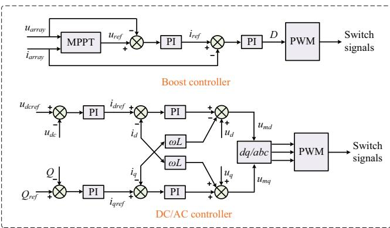  
FIGURE 3 Control system models of the PV power generation unit.

$f _ { \mathrm { s w - B } }$ function.

$$
\boldsymbol {Y} _ {\mathrm {s w - B}} (t) = f _ {\mathrm {s w - B}} \left(u _ {\mathrm {a r r a y}} (t - \Delta t), i _ {\mathrm {a r r a y}} (t - \Delta t)\right) \tag {9}
$$

Similarly, the mathematical model of the control system of the inverter is as follows:

$$
\left\{ \begin{array}{l} i _ {d \text {r e f}} = \left(k _ {p \mathrm {I} 1} + \frac {k _ {\mathrm {i I} 1}}{s}\right) \left(u _ {\mathrm {d c r e f}} - u _ {\mathrm {d c}}\right) \\ i _ {q \text {r e f}} = \left(k _ {p \mathrm {I} 2} + \frac {k _ {\mathrm {i I} 2}}{s}\right) \left(Q _ {\text {r e f}} - Q\right) \\ u _ {\mathrm {m} d} = \left(k _ {p \mathrm {I} 3} + \frac {k _ {\mathrm {i I} 3}}{s}\right) \left(i _ {d \text {r e f}} - i _ {d}\right) - \omega L i _ {q} + u _ {d} \\ u _ {\mathrm {m} q} = \left(k _ {p \mathrm {I} 4} + \frac {k _ {\mathrm {i I} 4}}{s}\right) \left(i _ {q \text {r e f}} - i _ {q}\right) + \omega L i _ {d} + u _ {q} \end{array} \right. \tag {10}
$$

where $i _ { d }$ and $i _ { q }$ are the d-axis and q-axis components of the current on the filter inductor respectively; $u _ { d }$ and $u _ { q }$ are the d-axis and $q -$ -axis components of the voltage on the filter capacitor respectively; ${ \boldsymbol { u } } _ { \mathrm { d c } }$ and $\mathcal { L }$ are the DC voltage and reactive power; $\mu _ { \mathrm { m } d }$ and $u _ { \mathrm { m } q }$ are the d-axis and q-axis modulation signals respectively; ωL is the coupling quantity; $k _ { \mathrm { p } }$ and $k _ { \mathrm { i } }$ are the proportional and integral coefficients of the PI controller.

The following $f _ { \mathrm { s w - I } }$ function can also be obtained to solve the switching states of the inverter:

$$
\mathbf {Y} _ {\mathrm {s w - I}} (t) = f _ {\mathrm {s w - I}} \left(u _ {\mathrm {d c}} (t - \Delta t), Q (t - \Delta t), u _ {d q} (t - \Delta t), i _ {d q} (t - \Delta t)\right) \tag {11}
$$

where subscript $d q$ represents that the variable contains the daxis and the q-axis component.

# 3.3 SVP model of the PV power generation unit

Equations $( 6 ) , ( 9 )$ , and (11) together constitute the SVP model of the PV power generation unit, and it can be found that the influence of the access of the PV power generation unit on the whole system can be characterized by a combination

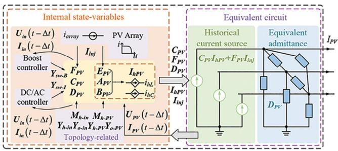  
FIGURE 4 State-variable-preserving model of the PV power generation unit.

of controlled equivalent admittance and controlled historical current sources. The controlled parameters are determined by the internal state variables of the PV unit, which include control system variables and dynamic component variables. Thus, the constructed SVP model of the PV power generation unit is shown in Figure 4. The variables not specially marked in Figure 4 are the variables at time t, and the variables in the following figures of the paper are the same unless otherwise specified.

It can be seen from Figure 4 that the SVP model of the PV power generation unit presents as a single three-phase node to the external system, which realizes the scale contraction of the original power generation unit. In addition, all coefficient matrices of its SVP model related to the topology can be obtained in advance from the known netlist information, such as the topology connection, component type, component parameter, and states of the switching devices, and all of them can be defined and stored during initialization. Therefore, it is suitable for computer programming and has universal application to the power electronic equipment composed of basic components and switching devices.

# 4 PARTITION MODELLING OF THEPHOTOVOLTAIC POWER PLANT BASEDON NODE TEARING METHOD

According to the constructed SVP model of the PV power generation unit in Section 3, the SVP model of the PV power generation plant can be established as shown in Figure 5. It can be seen that although the SVP model reduces the matrix-solving dimension of the system, the simulation scale of the system will still show an increasing trend with the growth of the number of PV power generation units.

Considering the consistency in solving different PV clusters formed by multiple PV power generation units in series, the grid-connected system shown in Figure 5 can be abstracted into a multi-partition system interconnected by a common node, as shown in Figure 6. It can be found that if the existing branch cutting method is used to decouple the system without delay, the solving dimension of associated currents is related to the number of partitions. When the branch cutting method [23, 25] is applied to the multi-partition system, as shown in Figure 6,

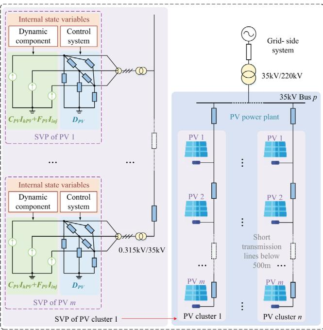  
FIGURE 5 State-variable-preserving model of the PV power plant.

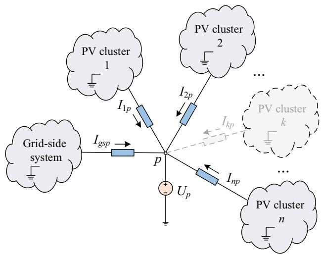  
FIGURE 6 Multi-partition system interconnected by a common node.

the solving order of the associated variables will be high, which makes the parallel simulation inefficient.

Therefore, the node tearing method is proposed to partition the PV power plant according to the topological characteristics, which can realize the decoupling of the PV plant and reduce the number of associated variables between different partitions. The node voltage equation reformed by taking the voltage of the common bus as the associated variable is shown as Equation (12). The main part of the parallel solution is still the node voltage equation of each partition (black part) except the associated partition, and the augmented part includes the node voltage equation of the associated partition (red part) and the correction effect of the node voltage of the associated partition on the

node voltage of the other partitions (blue part).

$$
\begin{array}{l} \left[ \begin{array}{c c c c c} \boldsymbol {Y} _ {\boldsymbol {g g}} (t) & & & & \boldsymbol {Y} _ {\boldsymbol {g p}} (t) \\ & \boldsymbol {Y} _ {1 1} (t) & & & \boldsymbol {Y} _ {1 p} (t) \\ & & \boldsymbol {Y} _ {2 2} (t) & & \boldsymbol {Y} _ {2 p} (t) \\ & & & \ddots & \vdots \\ & & & & \boldsymbol {Y} _ {n n} (t) \boldsymbol {Y} _ {n p} (t) \\ \boldsymbol {Y} _ {\boldsymbol {p g}} (t) & \boldsymbol {Y} _ {\boldsymbol {p 1}} (t) & \boldsymbol {Y} _ {\boldsymbol {p 2}} (t) & \dots & \boldsymbol {Y} _ {\boldsymbol {p n}} (t) \boldsymbol {Y} _ {\boldsymbol {p p}} (t) \end{array} \right] \left[ \begin{array}{c} \boldsymbol {U} _ {\boldsymbol {g}} (t) \\ \boldsymbol {U} _ {1} (t) \\ \boldsymbol {U} _ {2} (t) \\ \vdots \\ \boldsymbol {U} _ {n} (t) \\ \boldsymbol {U} _ {\boldsymbol {p}} (t) \end{array} \right] \\ = \left[ \begin{array}{c} I _ {g} (t) \\ I _ {1} (t) \\ I _ {2} (t) \\ \vdots \\ I _ {n} (t) \\ I _ {p} (t) \end{array} \right] \tag {12} \\ \end{array}
$$

where and are the node voltage vector and injection cur-U Irent vector respectively; Subscripts g, 1, 2, n, and p represent the grid-side system, PV cluster 1, PV cluster 2, PV cluster $n ,$ and associated system respectively; $Y _ { g g } , Y _ { 1 1 } , Y _ { 2 2 } , Y _ { n n }$ , and $Y _ { p p }$ Ygg Y Y Ynn Ypprepresent the nodal admittance matrix of each partition without considering the connection relationship between different partitions; Other admittance matrices represent the connection admittance between the associated partition and other partitions.

The associated variables $U _ { p }$ can be first obtained by the following equation:

$$
\begin{array}{l} \boldsymbol {U} _ {\boldsymbol {p}} (t) \\ = \left(\boldsymbol {Y} _ {\boldsymbol {p} \boldsymbol {p}} (t) - \boldsymbol {Y} _ {\boldsymbol {p} \boldsymbol {g}} (t) \boldsymbol {Y} _ {\boldsymbol {g} \boldsymbol {g}} ^ {- 1} (t) \boldsymbol {Y} _ {\boldsymbol {g} \boldsymbol {p}} (t) - \sum_ {k = 1} ^ {n} \boldsymbol {Y} _ {\boldsymbol {p} k} (t) \boldsymbol {Y} _ {\boldsymbol {k} k} ^ {- 1} (t) \boldsymbol {Y} _ {\boldsymbol {k} \boldsymbol {p}} (t)\right) ^ {- 1} \\ \cdot \left(I _ {p} (t) - Y _ {p g} (t) Y _ {g g} ^ {- 1} (t) I _ {g} (t) - \sum_ {k = 1} ^ {n} Y _ {p k} (t) Y _ {k k} ^ {- 1} (t) I _ {k} (t)\right) \tag {13} \\ \end{array}
$$

Then, the node voltages of each partition can be solved in parallel, as shown in Equation (14).

$$
\left[ \begin{array}{c} \boldsymbol {U} _ {g} (t) \\ \boldsymbol {U} _ {1} (t) \\ \boldsymbol {U} _ {2} (t) \\ \vdots \\ \boldsymbol {U} _ {n} (t) \end{array} \right] = \left[ \begin{array}{c} \boldsymbol {Y} _ {\boldsymbol {g} _ {\mathrm {g}}} ^ {- 1} (t) \boldsymbol {I} _ {\boldsymbol {g}} (t) \\ \boldsymbol {Y} _ {1 1} ^ {- 1} (t) \boldsymbol {I} _ {\boldsymbol {1}} (t) \\ \boldsymbol {Y} _ {2 2} ^ {- 1} (t) \boldsymbol {I} _ {\boldsymbol {2}} (t) \\ \vdots \\ \boldsymbol {Y} _ {n n} ^ {- 1} (t) \boldsymbol {I} _ {\boldsymbol {n}} (t) \end{array} \right] - \left[ \begin{array}{c} \boldsymbol {Y} _ {\boldsymbol {g} _ {\mathrm {g}}} ^ {- 1} (t) \boldsymbol {Y} _ {\boldsymbol {g} _ {\mathrm {p}}} (t) \\ \boldsymbol {Y} _ {1 1} ^ {- 1} (t) \boldsymbol {Y} _ {\boldsymbol {1 p}} (t) \\ \boldsymbol {Y} _ {2 2} ^ {- 1} (t) \boldsymbol {Y} _ {\boldsymbol {2 p}} (t) \\ \vdots \\ \boldsymbol {Y} _ {n n} ^ {- 1} (t) \boldsymbol {Y} _ {n p} (t) \end{array} \right] \boldsymbol {U} _ {\boldsymbol {p}} (t) \tag {14}
$$

It can be seen from the solution process that the delay-free decoupling method introduces a serial step for solving the associated variables, which is a critical factor affecting the efficiency of the parallel solution. As indicated by Equation (13), its solving speed depends on the scale of the node admittance matrix of each partition and the number of associated variables. In Figure $^ { 6 , }$ the scale of the node admittance matrix of each partition is the same for both the node tearing method and the branch cutting method. However, the dimension of the associated variable of the node tearing method is 3, and that of

the branch cutting method is 3n. Obviously, the node tearing method has higher computational efficiency when solving Equations (13) and (14).

Therefore, the proposed method can improve the solving speed of the associated variables from two perspectives. On the one hand, the SVP model eliminates the internal nodes of the PV power generation unit and reduces the system scale of each partition. On the other hand, the node tearing method partitions different PV power generation clusters using a single three-phase node and decreases the number of associated variables.

# 5 DESIGN OF THE HIERARCHICAL PARALLEL SIMULATION ALGORITHM

# 5.1 Solution process

The solution process of the grid-connected system of the PV power plant constructed based on the proposed method is shown in Figure 7, which includes the solution of the PV power plant and the solution of the grid-side system. The grid-side system is represented by the combination of the voltage source and line impedance, and its nodal admittance matrix and injection current vector are established by NAM based on their companion circuit models. The PV power plant is decoupled into multiple PV power generation clusters by the node tearing method, and the equivalent circuit model of the power generation unit is constructed by the SVP method to form the nodal admittance matrix and injection current vector of each power generation cluster. The difference between the proposed method and the traditional algorithm in the solution process is mainly reflected in the following aspects:

1. In the traditional algorithm, the switching action only affects the parameters of the switching model. In the proposed algorithm, the switch states can affect the parameters of the six coefficient matrices of the SVP model, where the feedforward matrix $D _ { \mathbf { P V } }$ corresponds to the traditional equivalent admittance.   
2. In the traditional algorithm, the historical current and the internal current source can be directly injected into each node. In the proposed algorithm, the historical current and the internal current source need to be multiplied by the coefficient matrix $C _ { \mathrm { P V } }$ and $F _ { \mathbf { P V } }$ before being injected into the Cnode, respectively.   
3. The traditional algorithm takes the branch as the basic unit to calculate the branch voltage, branch current, and branch historical current. The proposed algorithm takes the PV power generation unit as the basic unit to calculate its output voltage, output current, and internal historical current.

# 5.2 Parallel design

According to the solution process, it can be found that besides the coupling relationship between the voltage solving of the

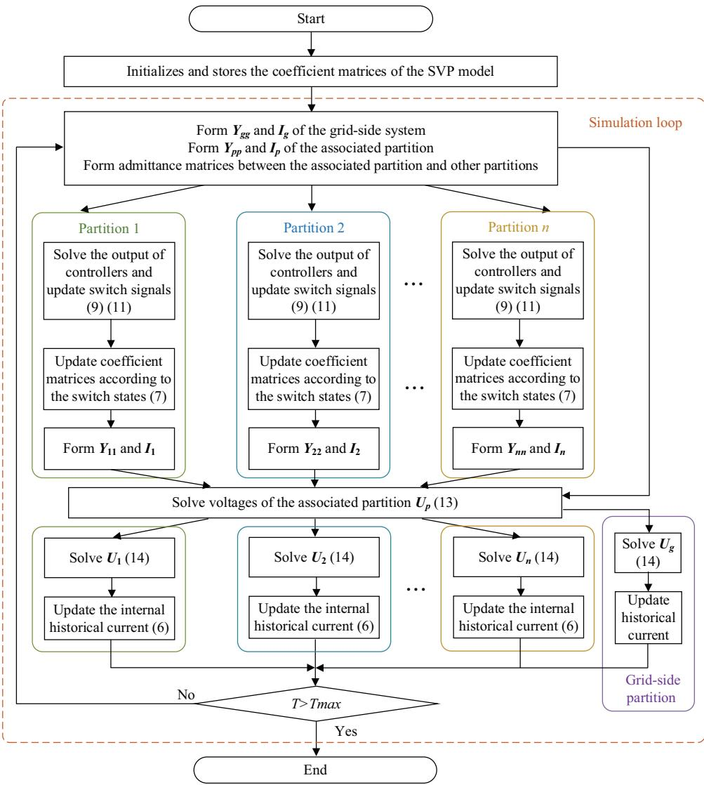  
FIGURE 7 The solution process of the proposed method.

associated partition and other partitions, the variable solving of all other partitions is independent of each other. Therefore, with the voltage solving of the associated partition as the boundary, the entire simulation process can be divided into the parallel solution of models at the bottom layer and the parallel solution of partitions at the top layer.

The constructed hierarchical parallel simulation architecture of the grid-connected system of the PV power plant is shown in Figure 8. The goal of the parallel solution of models at the bottom layer is to form the nodal admittance matrix and injection current vector of each partition. The solution of the SVP model of each PV power generation unit in the partition composed of the PV power generation cluster is independent of each other and can update its internal state variables and solve its equivalent admittance and historical current in parallel by using the multi-thread architecture. The nodal admittance matrix of the grid-side partition and the associated partition can be pre-stored before the simulation starts, and the historical currents of their dynamic components can be solved in parallel during the sim-

ulation. The goal of the parallel solution of partitions at the top layer is to obtain the voltages of each node in these partitions. Based on the voltage of the associated partition obtained, the node voltage equations of other partitions can be solved in parallel.

# 6 CASE STUDY

The grid-connected system of the PV power plant shown in Figure 9 is taken as an example to verify the simulation accuracy and efficiency of the proposed method, and the system parameters are given in Appendix. The PV plant consists of n PV power generation clusters connected to the 35 kV bus in parallel. Each cluster contains m PV power generation units connected by short transmission lines, and each unit contains k parallel DC/DC converters. The simulation is implemented in a multi-core CPU, and the type of the CPU is 12th Gen Intel(R) Core(TM) i7-12700H.

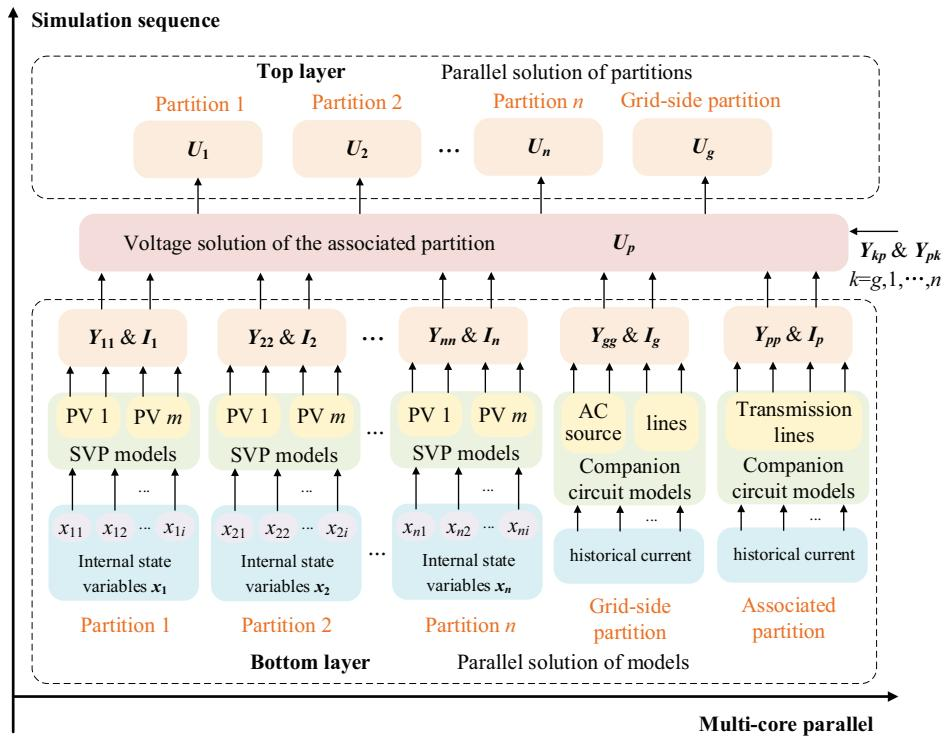  
FIGURE 8 Hierarchical parallel simulation architecture.

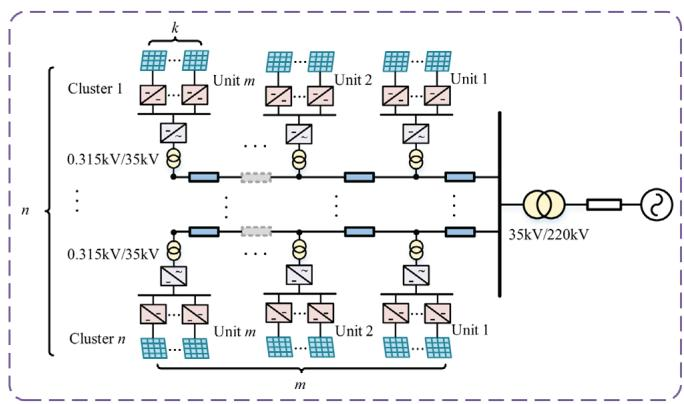  
FIGURE 9 Topology of the grid-connected system of the PV power plant.

# 6.1 Verification of algorithm accuracy

# 6.1.1 Performance of SVP in the case of the three-phase-to-ground fault inside the PV plant

The accuracy of the SVP model and the node tearing method is validated under a three-phase-to-ground fault by taking n = 3, m = 10, and $k = 6 .$ . The switching frequency is 5 kHz. The proposed method, called SVP for short, is compared with the fully detailed model (DM) constructed based on PSCAD. At 0.8 s, a three-phase-to-ground fault occurs at the outlet of the PV unit 2 in PV cluster 1, lasting for 40 ms. Figure 10 shows the changes in the voltage $V _ { \mathrm { c } }$ of the 35 kV bus, the DC voltage $V _ { \mathrm { d c } 2 }$ of PV unit $^ { 2 , }$ and the output active power $P _ { 2 }$ of PV unit 2. As can be observed, the simulation curves of both methods overlap

significantly, and relative errors are less than 3%, indicating that the SVP has similar simulation accuracy to DM.

# 6.1.2 Performance of SVP in the case of oscillation

Whether the SVP can reflect the oscillation characteristics of the original system is also an important criterion for testing its model accuracy. At 0.5 s, the gain of the voltage outer loop controller of the inverter of the PV unit 1 in PV cluster 1 steps from 1 to 10. Figure 11a shows the sub-synchronous oscillation waveforms of the voltage of the 35 kV bus under the change in controller parameters using the SVP, DM, and AM. AM represents the aggregation model of the PV power generation plant. The solving process of equivalent parameters of the aggregation model is described in [31]. Figure 11b further presents a Fourier analysis result of the voltage waveforms, in which the oscillation amplitude and frequency of the three models are marked. It can be seen that the SVP and DM curves are visually highly overlapping, indicating that the SVP can retain information about the internal state variables and reflect the oscillation characteristics of the original system. Additionally, the oscillation amplitude and frequency of AM show differences compared to the proposed method and DM, and the amplitude error is more significant. The discrepancies may lead to deviations in the timing and position of the protection action of the system, which makes it hard to reflect the operating state of the system accurately. Therefore, when studying oscillation issues of renewable energy power systems, the proposed method is more suitable.

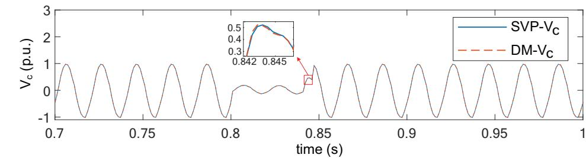

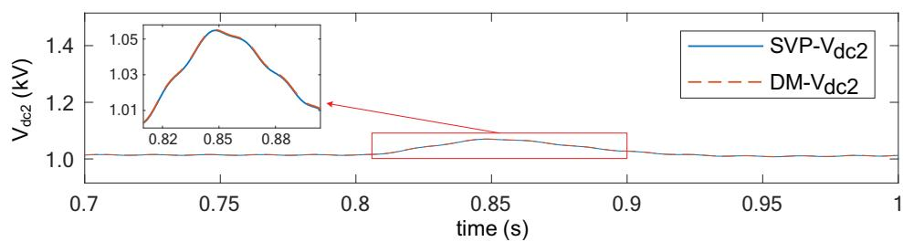

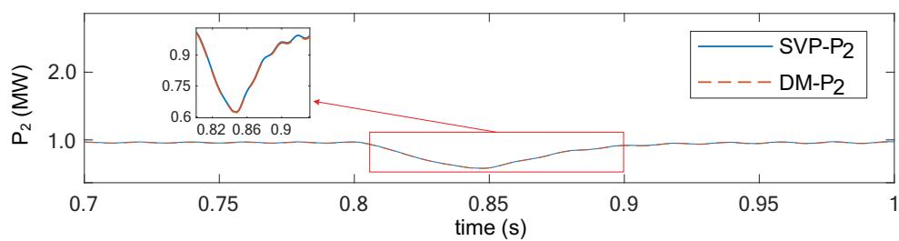  
FIGURE 10 Simulation results under a three-phase-to-ground fault inside the PV plant.

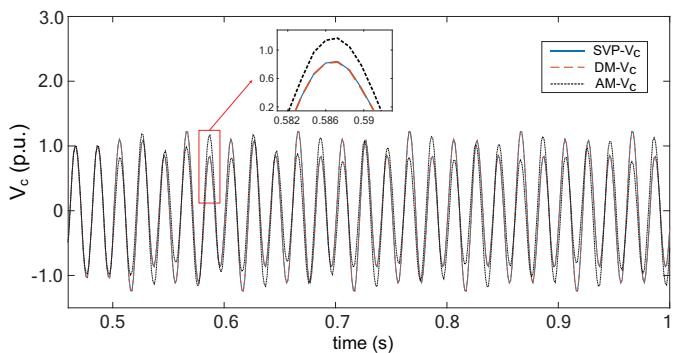  
(a)

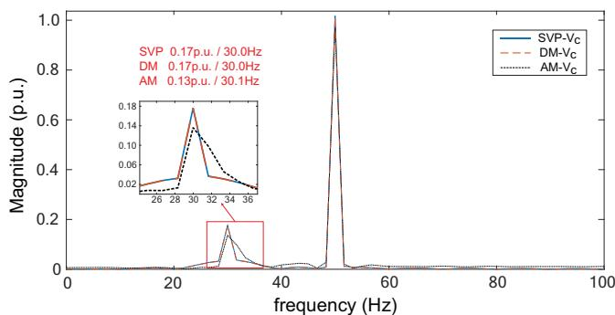  
  
FIGURE 11 Simulation results in the case of oscillation. (a) Voltage of the 35 kV bus; (b) Fourier analysis result.

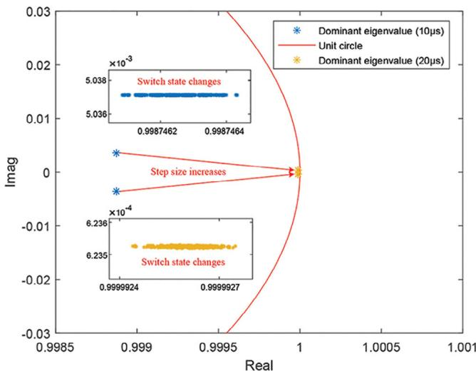  
FIGURE 12 Distribution of the dominant eigenvalues under different switch states and simulation step sizes.

# 6.1.3 Numerical stability analysis of SVP

This subsection analyses numerical stability by solving the eigenvalues of the state matrix of the system. Figure 12 illustrates the distribution of the dominant eigenvalues under different switch states and simulation step sizes. The dominant eigenvalue is defined as the largest eigenvalue, which

TABLE 1 Time consumption and speedup ratio with different numbers of PV power generation units.   

<table><tr><td rowspan="2">PV number</td><td rowspan="2">DM time (s)</td><td colspan="2">SVP</td><td rowspan="2">Speedup ratio</td></tr><tr><td>Partitions</td><td>Time (s)</td></tr><tr><td>1</td><td>12.146</td><td>2</td><td>7.778</td><td>1.56</td></tr><tr><td>10</td><td>1035.756</td><td>11</td><td>38.342</td><td>27.01</td></tr><tr><td>20</td><td>3432.948</td><td>11</td><td>62.863</td><td>54.61</td></tr><tr><td>50</td><td>13,367.593</td><td>11</td><td>134.287</td><td>99.55</td></tr><tr><td>100</td><td>47,851.882</td><td>11</td><td>328.594</td><td>145.63</td></tr></table>

plays a critical role in determining numerical stability. It can be observed that different switch states have no significant impact on the distribution of the dominant eigenvalues. However, increasing the simulation step size causes the dominant eigenvalues to shift toward the boundary of the unit circle, potentially leading to numerical oscillation issues. Therefore, an appropriate simulation step size is a crucial condition for ensuring numerical stability.

# 6.2 Verification of algorithm efficiency

In this subsection, the simulation efficiency of SVP is verified by changing the number of PV units in the PV plant. Table 1 shows the simulation time and speedup ratio of DM and SVP under different scales of the PV plant. The first column of Table 1 indicates the increasing number of PV units, where 1 represents n = 1, m = 1, and k = 6, 10 represents n = 10, m = 1, and k = 6, 20 represents n = 10, m = 2, and k = 6, and the rest can be understood similarly. The simulation time step is set to 10 µs, with a duration of 1 s. Both algorithms are implemented in a C++ programming environment, and the execution time is measured using Windows timing functions.

It can be seen that the solution efficiency of SVP has been greatly improved compared with that of DM, and this improvement will be more significant with the further expansion of the scale of the PV power generation plant. What can be further optimized is that the number of parallel threads of a multicore CPU cannot meet the solving requirements of independent internal state variables in SVP at one time, and multiple repeated calculations make the SVP solving time increase with the growth of the number of PV units. Therefore, high-performance hardware with more cores can be used to solve internal state variables with fine-grained solution characteristics, which will further promote the improvement of simulation efficiency.

# 7 CONCLUSION

This paper developed a state-variable-preserving model for inverter-based resources and proposed a node tearing method to decouple the renewable energy power station consisting of inverter-based resources. From the perspective of the solution

of the power generation unit at the bottom layer, the SVP model can eliminate internal nodes of the unit and present the unit as a single three-phase node to the external system, and the solution of the SVP model of each unit is independent of each other. From the perspective of the system simulation at the top layer, the SVP model reduces the solution scale of each partition, and the node tearing method decreases the solving dimension of associated variables between different partitions. These features of the proposed method are well displayed in the case study of the renewable energy power station. In the case study, a PV power plant is used as an example to verify the accuracy and efficiency of SVP compared to DM. Numerical analysis results show that the simulation error between SVP and DM is less than 3%, and the selected simulation step size can ensure the numerical stability of the system. Efficiency analysis results show that SVP can greatly reduce the simulation time of DM, and this improvement is more significant in large-scale PV power plants. It should be noted that the application of this approach to large-scale networks faces challenges, including an increased number of subsystems and an increased scale of individual subsystems. In such cases, high-performance hardware platforms, such as CPU clusters and GPUs, are needed to cooperate with the proposed approach to enhance simulation efficiency.

# AUTHOR CONTRIBUTIONS

Qiguo Wang: Conceptualization; formal analysis; investigation; methodology; validation; visualization; writing—original draft; writing—review & editing. Jin Xu: Conceptualization; investigation; methodology; writing—review & editing. Keyou Wang: Investigation; resources; visualization; writing—review & editing. Guojie Li: Funding acquisition; resources; supervision. Zhenyuan Feng: Funding acquisition; project administration.

# ACKNOWLEDGEMENTS

This work was supported in part by the National Key Research and Development Program of China (No. 2022YFE0105200) and in part by the project of State Grid Zhejiang Electric Power Co., LTD., Jiaxing power supply company (5211JX230004).

# CONFLICT OF INTEREST STATEMENT

The authors declare no conflicts of interest.

# DATA AVAILABILITY STATEMENT

The data that support the findings of this study are available upon reasonable request.

# ORCID

Qiguo Wang https://orcid.org/0000-0001-5407-8995

Jin Xu https://orcid.org/0000-0002-3021-2309

# REFERENCES

1. Wang, L., Xie, X., Shair, J., Mei, Y., Lei, A.: Frequency-domain admittance network model (FANM) based oscillatory stability analysis of hybrid AC-DC systems with MMCs. IEEE Trans. Power Syst. 39(2), 3444–3458 (2024)

2. Ebrahimi, S., Amiri, N., Jatskevich, J.: Average-value modeling of linecommutated AC–DC converters with unbalanced AC network. IEEE Trans. Energy Convers. 36(4), 3533–3544 (2021)   
3. Venkatramanan, D., John, V.: Dynamic phasor modeling and stability analysis of SRF-PLL-based grid-tie inverter under islanded conditions. IEEE Trans. Ind. Appl. 56(2), 1953–1965 (2020)   
4. Gu, R., Dai, J., Zhang, J., Miao, F., Tang, Y.: Research on equivalent modeling of PMSG-based wind farms using parameter identification method. In: 2020 12th IEEE PES Asia-Pacific Power and Energy Engineering Conference (APPEEC), pp. 1–5. IEEE, Piscataway, NJ (2020)   
5. Xu, M., Wang, J., Zhang, J., Wang, J., Liu, H., Wang, G.: Wind farm multi-machine aggregation equivalent method based on probability clustering. In: 2022 IEEE International Conference on Advances in Electrical Engineering and Computer Applications (AEECA), pp. 96–99. IEEE, Piscataway, NJ (2022)   
6. Wang, Q., Xu, J., Wang, K., et al.: Fine-grain parallel and multi-rate electromagnetic transient simulation of new energy power systems. Autom. Electr. Power Syst. 48(3), 113–121 (2024)   
7. Meng, F., Guo, Q., Kang, H., et al.: Cascading failure simulation for power system with utility-scale and distributed renewable energy. High Volt. Technol. 48(1), 189–201 (2022)   
8. Gan, F., Guo, C., Cheng, H., Tan, S., Du, D.: Analysis and evaluation of the applicability of doubly-fed wind farm equivalent impedance model in high frequency resonance research. Proc. CSEE 43(19), 7497–7509 (2023)   
9. Wang, C., Fu, X., Li, P., Wu, J., Wang, L.: Multiscale simulation of power system transients based on the matrix exponential function. IEEE Trans. Power Syst. 32(3), 1913–1926 (2017)   
10. Fu, X., Wang, C., Li, P., Wang, L.: Exponential integration algorithm for large-scale wind farm simulation with Krylov subspace acceleration. Appl. Energy 254, 113692 (2019)   
11. Dufour, C., Mahseredjian, J., Bélanger, J.: A combined state-space nodal method for the simulation of power system transients. IEEE Trans. Power Delivery 26(2), 928–935 (2011)   
12. Zou, M., Wang, Y., Zhao, C., et al.: Integrated equivalent model of permanent magnet synchronous generator-based wind turbine for large-scale offshore wind farm simulation. J. Mod. Power Syst. Clean Energy 11(5), 1415–1426 (2023)   
13. Xu, J., Wang, K., Wu, P., Li, G.: FPGA-based sub-microsecond-level realtime simulation for microgrids with a network-decoupled algorithm. IEEE Trans. Power Delivery 35(2), 987–998 (2020)   
14. Yao, S., Pang, B., Wu, G., et al.: A method of parallel computing for electromagnetic transient simulation based on semi-implicit latency decoupling technology (part I): theory and AC network partitioning and parallel. Proc. CSEE 42(7), 2486–2497 (2022)   
15. Yao, S., Zhang, C., Liu, G., Ma, J., Wang, Y.: Electromagnetic transient decoupling and fast simulation method for photovoltaic power generation units. Autom. Electr. Power Syst. 46(21), 170–178 (2022)   
16. Chen, W., Xu, J., Wang, K., Li, G., Wang, Q.: Fine-grained parallel electromagnetic transient simulation of three-phase transmission network based on block latency insertion method. Proc. CSEE 42(7), 2577–2588 (2022)   
17. Wang, Q., Xu, J., Wang, K., et al.: Parallel electromagnetic transient simulation of power systems with a high proportion of renewable energy based on latency insertion method. IET Renewable Power Gener. 17, 110–123 (2023)   
18. Schmill, J.V.: New scheme applicable to network analysis studies, diakoptics, and other fields. IEEE Trans. Power App. Syst. PAS-86(11), 1437–1448 (1967)   
19. Koester, D.P., Ranka, S., Fox, G.C.: Parallel block-diagonal-bordered sparse linear solvers for electrical power system applications. In: Proceedings of Scalable Parallel Libraries Conference, pp. 195–203. IEEE, Piscataway, NJ (1993)   
20. Fan, S., Ding, H., Kariyawasam, A., Gole, A.M.: Parallel electromagnetic transient simulation with shared memory architecture computers. IEEE Trans. Power Delivery 33(1), 239–247 (2018)   
21. Gao, L., Ji, F., Yan, H., Lin, C., Pang, H., Li, J.: Numerical stability and compensation method for equivalent controlled source in electromagnetic transient simulation. In: 2019 IEEE Innovative Smart Grid Technologies-Asia (ISGT Asia), pp. 2084–2089. IEEE, Piscataway, NJ (2019)

22. Bruned, B., Mahseredjian, J., Dennetière, S., Michel, J., Schudel, M., Bracikowski, N.: Compensation method for parallel and iterative realtime simulation of electromagnetic transients. IEEE Trans. Power Delivery 38(4), 2302–2310 (2023)   
23. Armstrong, M., Marti, J.R., Linares, L.R., Kundur, P.: Multilevel MATE for efficient simultaneous solution of control systems and nonlinearities in the OVNI simulator. IEEE Trans. Power Syst. 21(3), 1250–1259 (2006)   
24. Tomim, M.A., Martí, J.R., Passos Filho, J.A.: Parallel transient stability simulation based on multi-area thévenin equivalents. IEEE Trans. Smart Grid 8(3), 1366–1377 (2017)   
25. Mu, Q., Liang, J., Zhou, X., Li, G., Zhang, X.: A node splitting interface algorithm for multi-rate parallel simulation of DC grids. CSEE J. Power Energy 4(3), 388–397 (2018)   
26. Jin, C., Ji, Z., Liu, K., Chen, W., Zhao, J.: A region-folding electromagnetic transient simulation approach for large-scale power electronics system. IEEE Trans. Power Electr. 38(8), 9755–9766 (2023)   
27. Strunz, K., Carlson, E.: Nested fast and simultaneous solution for timedomain simulation of integrative power-electric and electronic systems. IEEE Trans. Power Delivery 22(1), 277–287 (2007)   
28. Duan, T., Dinavahi, V.: A novel linking-domain extraction decomposition method for parallel electromagnetic transient simulation of large-scale AC/DC networks. IEEE Trans. Power Deliver. 36(2), 957–965 (2021)   
29. Yao, M., Cai, X.: Comparative analysis of different topologies for large PV plants. Power Grid Technol. 41(5), 1406–1411 (2017)   
30. Dommel, H.W.: Digital computer solution of electromagnetic transients in single and multiphase networks. IEEE Trans. Power App. Syst. PAS-88(4), 388–399 (1969)   
31. Xie, Y., Wang, Y., He, Y., et al.: Applicability analysis of single-unit equivalent model of centralized photovoltaic power station for wide-band resonance. Therm. Power Gener. 53(4), 9–18 (2024)

How to cite this article: Wang, Q., Xu, J., Wang, K., Li, G., Feng, Z.: A state-variable-preserving method for the efficient modelling of inverter-based resources in parallel EMT simulation. IET Gener. Transm. Distrib. 19, e70013 (2025). https://doi.org/10.1049/gtd2.70013

# APPENDIX

Table A1

TABLE A1 Parameters of photovoltaic power generation units.   

<table><tr><td>Device</td><td>Parameter</td><td>Value</td></tr><tr><td rowspan="2">Photovoltaic power supply</td><td>Light intensity</td><td>1200 W/m2</td></tr><tr><td>Temperature</td><td>25°C</td></tr><tr><td rowspan="3">DC side circuit</td><td>Capacitor Cf</td><td>10 mF</td></tr><tr><td>Inductor Lb</td><td>2 mH</td></tr><tr><td>Capacitor Cdc</td><td>10 mF</td></tr><tr><td rowspan="3">AC side LCL filter circuit</td><td>Inductor L1, L2, L3</td><td>2 mH</td></tr><tr><td>Capacitor C1, C2, C3</td><td>0.1 mF</td></tr><tr><td>Inductor L4, L5, L6</td><td>0.5 mH</td></tr><tr><td rowspan="2">Low-voltage transformer</td><td>Short-circuit resistance</td><td>0.001 p.u.</td></tr><tr><td>Short-circuit reactance</td><td>0.15 p.u.</td></tr><tr><td rowspan="2">High-voltage transformer</td><td>Short-circuit resistance</td><td>0.001 p.u.</td></tr><tr><td>Short-circuit reactance</td><td>0.1 p.u.</td></tr></table>