# 基于电流过零点预计算的

# 单有源桥变换器等效建模方法

高晨祥，王晓婷，丁江萍，许建中\*，赵成勇

(新能源电力系统国家重点实验室(华北电力大学), 北京市 昌平区 102206)

# Equivalent Modelling Method of Single Active Bridge Converter by Pre-calculating the Current Zero-crossing

GAO Chenxiang, WANG Xiaoting, DING Jiangping, XU Jianzhong*, ZHAO Chengyong

(State Key Laboratory of Alternate Electrical Power System with Renewable Energy Sources

(North China Electric Power University), Changping District, Beijing 102206, China)

ABSTRACT: As an important scheme for grid connection of photovoltaic, wind power and other DC power sources, modular isolated DC/DC converter (MIDC) has received extensive attention. The input parallel output series (IPOS) type single active bridge (SAB) converter is one of the common topologies of MIDC. Due to the high node admittance order, low simulation step size and the existence of uncontrolled rectifier bridge, its electromagnetic transient simulation efficiency is extremely low. This paper proposed an equivalent modeling method of SAB converter by the pre-calculating current zero-crossing. First, the topology and working principle of the SAB converter were analyzed to solve the inductor current expression in different modes. Secondly, the expression of the zero-crossing point of the inductance current was given with the distinguishing conditions of different modes. Then, analogy to the DAB converter, the equivalent model of the IPOS type SAB converter was established. On this basis, Lyapunov method was used to prove the stability of the proposed equivalent model. Finally, the accuracy and acceleration ratio of the proposed model were verified in the PSCAD/EMTDC environment.

KEY WORDS: single active bridge (SAB); current zero-crossing; equivalent model; stability

摘要：模块化隔离型DC/DC变换器(modularisolatedDC/DCconverter，MIDC)作为光伏、风电等直流电源并网的重要方案，受到广泛关注。输入并联输出串联(input parallel outputseries，IPOS)型单有源桥(singleactivebridge，SAB)变换器是MIDC的常用拓扑之一，由于节点导纳矩阵阶数高、仿

真步长小以及不控整流桥的存在，其电磁暂态仿真效率很低。文中提出一种基于电流过零点预计算的SAB变换器等效建模方法。首先，针对SAB变换器的拓扑结构和工作原理进行分析，求解不同模式下电感电流表达式。其次，计算电感电流过零点，并给出不同模式的区分条件。然后，类比DAB变换器，建立IPOS型SAB变换器的等效模型。在此基础上，利用Lyapunov法证明所提等效模型的稳定性。最后，在PSCAD/EMTDC环境中验证所提出模型的精度和加速比。

# 关键词：单有源桥变换器；电流过零点；等效建模；稳定性0 引言

近年来，我国风电和光伏在电网中的装机容量实现了 $17\%$ 和 $44\%$ 的迅猛增长[1]，模块化隔离型DC/DC变换器(modularisolatedDC/DCconverter，MIDC)作为实现大功率直流电源并网的重要方案之一，因为其具有无器件均压、均流问题、可靠性高、易于冗余设计等优势受到广泛关注[2]。

现有的MIDC拓扑结构多样，包括移相控制全桥变换器、单有源桥式变换器(single active bridge, SAB)、LCC串并联谐振变换器、双有源桥式变换器(dual active bridge，DAB)和基于晶闸管的谐振变换器等[3-6]。文献[7]针对不同类型拓扑结构给出了元件应力、元件数与损耗方面的比较。在实际分布式电源并网过程的大多数时间内，电能为单向传输，因此双有源桥变换器会带来不必要的投资与损耗[2]。LCC等谐振变换器虽然可以提高效率，但是所需滤波电感较大，控制较为复杂[8]。因此本文以

SAB变换器为主要研究对象。同时，由于光伏、风电等直流电源的并网通常需要实现高增益、大容量的目标，因此常采用输入并联输出串联(input parallel output series，IPOS)的模块级联方式。

为满足大容量与高电压需求，IPOS型SAB变换器包含大量功率模块，仿真系统节点数高，在PSCAD/EMTDC的电磁暂态仿真中，矩阵求逆工作量大。并且，每个模块内开关器件与高频变压器工作于较高频率，限制了系统的仿真步长[9]，基于详细器件搭建的换流器模型的仿真效率很低。

对此，国内外学者针对仿真提速展开了很多研究工作。文献[10-11]针对高频链全桥换流器提出了连续状态空间平均模型和非线性函数降阶大信号简化模型；文献[12]提出了针对区域电能路由器的级间电容解耦算法，但由于未对隔离变压器进行处理，加速比和通用性受限。文献[13-14]利用变压器解耦思路与嵌套快速求解法结合，提出了针对DAB与CHB型变换器的等效模型；文献[15]进一步利用DAB单元的对称性和稀疏性，提出了基于节点导纳矩阵预处理的等效模型，大幅提高了仿真速度。但是这几种等效建模方法均不能直接应用于IPOS型SAB变换器的仿真提速。相比于DAB单元，SAB具有不控整流桥，其二极管的开关状态不是由触发信号直接决定；另一方面，SAB变换器的IPOS级联方式也会导致与ISOP型DAB变换器的差异。

本文提出一种基于电流过零点预计算的SAB变换器等效模型。首先通过对SAB拓扑及工作原理进行分析，得出电感电流的表达式，然后给出不同模式下电感电流过零点计算式及模式区分条件。在此基础上，类比ISOP型DAB变换器，提出IPOS型SAB变换器的等效模型，并进行等效算法的稳定性分析。

# 1 SAB变换器拓扑及原理

# 1.1 SAB变换器拓扑

IPOS型SAB变换器的拓扑如图1所示，其中： $U_{1}$ 和 $U_{2}$ 为SAB单元电容电压；P表示并联侧；S表示串联侧； $\nu_{\mathrm{P}}$ 和 $\nu_{\mathrm{S}}$ 分别表示H桥输出的交流方波电压； $i_{\mathrm{P}}$ 和 $i_{\mathrm{S}}$ 分别为对应的变压器原副边电流。 $L_{\mathrm{T}}$ 为辅助电感，用于承担变压器两侧电压差。

相比于DAB变换器，SAB只传输单向功率，因此，输出侧采用不控整流桥，输入侧常用控制方式为变占空比控制[16]，IGBT触发信号同桥臂互补，

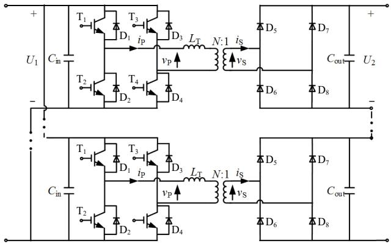  
图1 IPOS型SAB变换器拓扑图  
Fig.1 Topology of IPOS SAB converter

$\mathrm{T}_{1}$ 和 $\mathrm{T}_{3}$ 的触发相差 $180^{\circ}$ , 如图 2 所示。通过 $\mathrm{T}_{1}$ 触发信号的占空比为 $d_{\mathrm{P}}$ , 可以实现功率控制。同时, 输入侧 $\mathrm{H}$ 桥的输出电压仅由 IGBT 触发信号决定。

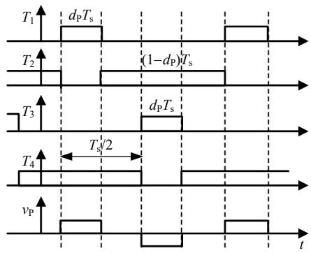  
图2 触发信号图  
Fig. 2 Waveform of the trigger signal

# 1.2 工作原理

随着占空比 $d_{\mathrm{P}}$ 的变化，SAB变换器有2种工作模式，分别为连续导通模式(continuousconductionmode，CCM)和非连续导通模式[8](discontinuousconduction mode，DCM)，如图3所示。

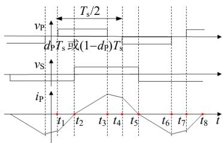  
(a) CCM模式

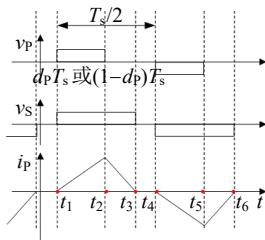  
(b) DCM模式  
图3 不同模式工作波形图  
Fig. 3 Waveform of different modes

其中， $i_{\mathrm{P}}$ 为流过辅助电感的电流，其正负决定了不控整流桥二极管的导通情况。这2种工作模式有明显区别：CCM模式电感电流连续，DCM模式电感电流有断续情况。

由于在一个周期内，电感电流波形呈现对称特

征，因此，本节分别选取2种模式的半周期进行分析，其不同阶段电流流通路径如图4所示。

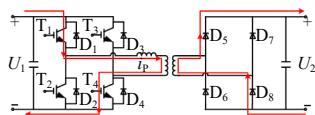  
(a) CCM 模式 $(t_{2} - t_{3})$

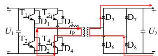  
(b) CCM 模式 $(t_{3} - t_{4})$

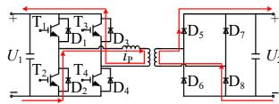  
(c) CCM模式 $(t_4 - t_5)$

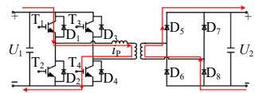  
(d) DCM 模式 $(t_{1} - t_{2})$

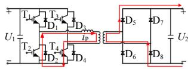  
(e) DCM模式 $(t_{2} - t_{3})$

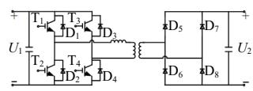  
(f) DCM 模式 $(t_{3} - t_{4})$   
图4 不同阶段电流流通路径图  
Fig. 4 Diagram of current flow path at different stages

# 1.2.1 CCM模式

针对如图3(a)所示CCM模式，取 $t_2 - t_5$ 时间段进行分析。此时流过电感的电流 $i_{\mathrm{P}} > 0$ ，变压器副边 $i_{\mathrm{S}} > 0$ ，所以 $\mathrm{D}_5$ 和 $\mathrm{D}_8$ 始终导通， $\mathrm{D}_6$ 和 $\mathrm{D}_7$ 始终关断，变压器原边电压恒为 $NU_{2}$ 。

在 $t_2 - t_3$ 时间内，触发 $\mathrm{T}_{1}$ 和 $\mathrm{T}_{4}$ ，此时电容经 $\mathrm{T}_{1}$ 和 $\mathrm{T}_{4}$ 向电感充电，电流路径如图4(a)所示，电感储能增加，电流表达式为

$$
i _ {\mathrm {P}} (t) = \frac {U _ {1} - N U _ {2}}{L _ {\mathrm {T}}} (t - t _ {2}) \tag {1}
$$

在 $t_3 - t_4$ 时间内，触发 $\mathrm{T}_2$ 和 $\mathrm{T}_4$ ，此时电流经 $\mathrm{D}_2$ 和 $\mathrm{T}_4$ 构成回流，路径如图4(b)所示，电感储能减小，电流表达式为

$$
i _ {\mathrm {p}} (t) = i _ {\mathrm {p}} \left(t _ {3}\right) - \frac {N U _ {2}}{L _ {\mathrm {T}}} \left(t - t _ {3}\right) \tag {2}
$$

在 $t_4 - t_5$ 时间内，触发 $\mathrm{T}_2$ 和 $\mathrm{T}_3$ ，此时电感经 $\mathbf{D}_2$ 和 $\mathrm{D}_3$ 向电容放电，路径如图4(c)所示，电感储能减小，电流表达式为

$$
i _ {\mathrm {P}} (t) = i _ {\mathrm {P}} \left(t _ {4}\right) - \frac {U _ {1} + N U _ {2}}{L _ {\mathrm {T}}} \left(t - t _ {4}\right) \tag {3}
$$

# 1.2.2 DCM模式

针对如图3(b)所示DCM模式，取 $t_1 - t_4$ 时间段进行分析。在 $t_1 - t_3$ 阶段，与CCM类似，对于右侧不控整流桥，同样有： $\mathrm{D}_5$ 和 $\mathrm{D}_8$ 导通， $\mathrm{D}_6$ 和 $\mathrm{D}_7$ 关断，变压器原边电压为 $NU_{2}$

DCM 模式的 $t_1 - t_2$ 和 $t_2 - t_3$ 阶段分别于 CCM 模式的 $t_2 - t_3$ 和 $t_3 - t_4$ 阶段类似，其电流流通路径如

图4(d)、(f)所示，电流表达式与式(1)、(2)一致。

# 2 基于电流过零点预计算的不控整流桥等效方法

# 2.1 算法原理

对于SAB的不控整流桥，二极管的开关状态由流过它的电流决定。在PSCAD仿真中，通过对二极管电流过零点所在步长进行插值计算，实现对实际开关过程的精确仿真，如图5所示[17]。其中， $t_{\mathrm{Z}}$ 为二极管实际过零点，介于2个仿真步长之间。利用插值方式从 $t_0$ 值求取 $t_0 + \Delta t$ 值时，需要经过3个步骤：1）确定 $t_{\mathrm{Z}}$ 时刻，经过插值处理，求解 $t_{\mathrm{Z}}$ 时刻网络信息；2）利用后退欧拉法求取 $t_{\mathrm{Z}} + \Delta t$ 时刻值；3）利用线性插值法求取 $t_0 + \Delta t$ 时刻值。

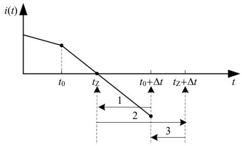  
图5 PSCAD二极管插值图  
Fig. 5 Interpolation process of diode in PSCAD

对于SAB变换器，由于变压器的高频特性，二极管的开关周期很短，在每个周期内均对二极管进行插值计算，会严重影响整个模型的仿真速度。

本章所提方法首先计算电感电流过零点(也即二极管电流过零点) $t_{\mathrm{Z}}$ ，然后通过 $t_{\mathrm{Z}}$ 与下一个步长的仿真时间比较，预测二极管的导通状态，并将其等效为二值电阻。即当电流过零点处导数小于0时，二极管由开通转为关断，取二极管等效电阻为

$$
R _ {\mathrm {D}} = \left\{ \begin{array}{l l} R _ {\mathrm {O N}}, & t <   t _ {\mathrm {Z}} \\ R _ {\mathrm {O F F}}, & t > t _ {\mathrm {Z}} \end{array} \right. \tag {4}
$$

当电流过零点处导数大于0，则反之。

这一方法不涉及 $t_{\mathrm{Z}}$ 时刻的网络重新求解以及相关插值过程，而是直接确定 $t_0 + \Delta t$ 的二极管开关状态，从 $t_0$ 时刻网络的状态出发，求解 $t_0 + \Delta t$ 时刻的网络，尤其适用于不具备插值功能的固定步长仿真。随着仿真步长的减小， $t_0$ 和 $t_0 + \Delta t$ 将逼近 $t_{\mathrm{Z}}$ ，采用电流过零点预计算方法产生的误差也将减小。

电力电子设备的精确仿真，需要保证仿真步长不超过开关周期的 $1 / 20^{[9]}$ ，由于SAB的高频特性，其仿真步长一般设置为 $1\sim 5\mu \mathrm{s}$ ，固有仿真步长较小，

这一特性为本章所提方法的使用提供了可能，即可以通过较小程度地缩小仿真步长，实现对详细模型的准确等效。

# 2.2 算法实现

对于CCM模式，由图2和图3(a)可知，在一个周期内， $t_1$ 可以通过检测 $\mathrm{T}_{1}$ 触发脉冲的上升沿获得。由电流波形的对称性可知：

$$
\left\{ \begin{array}{l} i \left(t _ {1}\right) = - i \left(t _ {4}\right) \\ t _ {4} - t _ {1} = \frac {T _ {\mathrm {S}}}{2} \end{array} \right. \tag {5}
$$

设 $t_2 - t_1 = XT_{\mathrm{S}}$ ，则根据式(1)一(3)可得：

$$
X \frac {U _ {1} + N U _ {2}}{L _ {\mathrm {T}}} = \frac {U _ {1} - N U _ {2}}{L _ {\mathrm {T}}} \left(d _ {\mathrm {P}} - X\right) - \frac {N U _ {2}}{L _ {\mathrm {T}}} \left(\frac {1}{2} - d _ {\mathrm {P}}\right) \tag {6}
$$

解得：

$$
X = \frac {d _ {\mathrm {P}}}{2} - \frac {N U _ {2}}{4 U _ {1}} \tag {7}
$$

所以电流过零点表达式为

$$
\left\{ \begin{array}{l} t _ {2} = t _ {1} + \left(t _ {2} - t _ {1}\right) = t _ {1} + \left(\frac {d _ {\mathrm {P}}}{2} - \frac {N U _ {2}}{4 U _ {1}}\right) T _ {\mathrm {S}} \\ t _ {5} = t _ {2} + \frac {T _ {\mathrm {S}}}{2} \end{array} \right. \tag {8}
$$

同理，对于如图3(b)所示DCM模式，电流过零点 $t_3$ 和 $t_6$ 表达式如下：

$$
\left\{ \begin{array}{l} t _ {3} = t _ {1} + \frac {U _ {1}}{N U _ {2}} d _ {\mathrm {P}} T _ {\mathrm {S}} \\ t _ {6} = t _ {3} + \frac {T _ {\mathrm {S}}}{2} \end{array} \right. \tag {9}
$$

由于不同模式电流过零点表达式不同，因此，还需对SAB进行工作模式识别。由图3可知，2种模式的边界条件为：对于CCM模式 $t_2 - t_1 = 0$ ，对于DCM模式 $t_4 - t_3 = 0$ 。令式(7)中 $X = 0$ ，解得临界占空比为

$$
d _ {\mathrm {P} _ {-} \lim } = \frac {1}{2} \frac {N U _ {2}}{U _ {1}} \tag {10}
$$

当 $d_{\mathrm{P}} > d_{\mathrm{P\_lim}}$ 时，SAB工作于CCM模式，当 $d_{\mathrm{P}} <   d_{\mathrm{P\_lim}}$ 时，工作于DCM模式。

综上，基于电流过零点预计算的不控整流桥等效过程如图6所示。其中，电流过零点预计算模块通过相应的输入，生成不控整流桥二极管的虚拟触发信号 $T_{\mathrm{D5\_8}}$ 和 $T_{\mathrm{D6\_7}}$ (0或1)，与SAB变换器的不控整流桥电路结构结合，将对应位置的二极管用二值电阻等效。

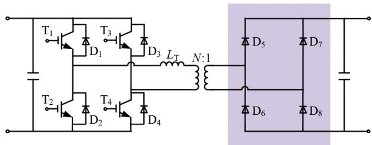

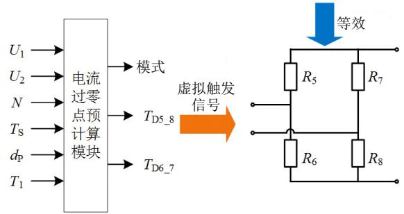  
图6 不控整流桥等效过程图  
Fig. 6 The equivalent process diagram of the uncontrolled rectifier bridge

值得注意的是，本章所提基于电流过零点预计算的不控整流桥等效方法同样适用于包含LC、LLC等谐振腔的SAB拓扑，只需根据相应拓扑建立对应电感电流表达式，分析模式分界条件，求取电流过零点，对式(8)—(10)做更新即可。

# 3 SAB变换器等效模型及稳定性分析

# 3.1 等效建模原理

基于第2章不控整流桥的等效过程，将IGBT开关组也用二值电阻等效，电容、电感、变压器等储能元件用梯形积分法离散化处理，可得图7所示SAB伴随网络，其中 $Y_{\mathrm{T11}}$ 、 $Y_{\mathrm{T12}}$ 、 $Y_{\mathrm{T22}}$ 为变压器等效导纳值，表达式如式(11)所示。

$$
\left[ \begin{array}{l l} Y _ {1 1} & Y _ {1 2} \\ Y _ {2 1} & Y _ {2 2} \end{array} \right] = \left[ \begin{array}{c c} L _ {\mathrm {T}} + L _ {1} + L _ {\mathrm {m}} & \frac {L _ {\mathrm {m}}}{N} \\ \frac {L _ {\mathrm {m}}}{N} & L _ {2} + \frac {L _ {\mathrm {m}}}{N ^ {2}} \end{array} \right] ^ {- 1} = \boldsymbol {Y} _ {\mathrm {T}} \tag {11}
$$

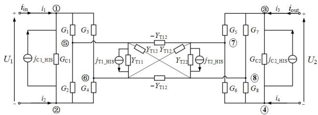  
图7SAB单元伴随电路  
Fig. 7 Companion circuit of SAB unit

列写SAB伴随电路的节点导纳矩阵如式(12)。类比文献[15]中针对DAB变换器的等效过程，利用节点导纳矩阵的对称性与稀疏性，可将式(12)转化为式(13)所示SAB单元的等效外端口方程。

$$
\begin{array}{l} \left[ \begin{array}{c c c c c c c c} G _ {\mathrm {C} 1} + G _ {1} + G _ {3} & - G _ {\mathrm {C} 1} & 0 & 0 & - G _ {1} & - G _ {3} & 0 & 0 \\ - G _ {\mathrm {C} 1} & G _ {\mathrm {C} 1} + G _ {2} + G _ {4} & 0 & 0 & - G _ {2} & - G _ {4} & 0 & 0 \\ 0 & 0 & G _ {\mathrm {C} 2} + G _ {5} + G _ {7} & - G _ {\mathrm {C} 2} & 0 & 0 & - G _ {5} & - G _ {7} \\ 0 & 0 & - G _ {\mathrm {C} 2} & G _ {\mathrm {C} 2} + G _ {6} + G _ {8} & 0 & 0 & - G _ {6} & - G _ {8} \\ \hline - \bar {G} _ {1} & - \bar {G} _ {2} & 0 & 0 & Y _ {\mathrm {T} 1 1} + \bar {G} _ {1} + \bar {G} _ {2} & - Y _ {\mathrm {T} 1 1} & Y _ {\mathrm {T} 1 2} & - Y _ {\mathrm {T} 1 2} \\ - G _ {3} & - G _ {4} & 0 & 0 & - Y _ {\mathrm {T} 1 1} & Y _ {\mathrm {T} 1 1} + G _ {3} + G _ {4} & - Y _ {\mathrm {T} 1 2} & Y _ {\mathrm {T} 1 2} \\ 0 & 0 & - G _ {5} & - G _ {6} & Y _ {\mathrm {T} 1 2} & - Y _ {\mathrm {T} 1 2} & Y _ {\mathrm {T} 2 2} + G _ {5} + G _ {6} & - Y _ {\mathrm {T} 2 2} \\ 0 & 0 & - G _ {7} & - G _ {8} & - Y _ {\mathrm {T} 1 2} & Y _ {\mathrm {T} 1 2} & - Y _ {\mathrm {T} 2 2} & Y _ {\mathrm {T} 2 2} + G _ {7} + G _ {8} \end{array} \right]. \\ \left[ \begin{array}{l} v _ {1} \\ v _ {2} \\ v _ {3} \\ \frac {v _ {4}}{v _ {5}} \\ v _ {6} \\ v _ {7} \\ v _ {8} \end{array} \right] = \left[ \begin{array}{l} j _ {\mathrm {C 1} - \mathrm {H I S}} \\ - j _ {\mathrm {C 1} - \mathrm {H I S}} \\ j _ {\mathrm {C 2} - \mathrm {H I S}} \\ - j _ {\mathrm {C} - \mathrm {H I S}} \\ - j _ {\mathrm {T 1} - \mathrm {H I S}} \\ j _ {\mathrm {T 1} - \mathrm {H I S}} \\ - j _ {\mathrm {T 2} - \mathrm {H I S}} \\ j _ {\mathrm {T 2} - \mathrm {H I S}} \end{array} \right] + \left[ \begin{array}{l} i _ {1} \\ i _ {2} \\ i _ {3} \\ \frac {i _ {4}}{0} \\ 0 \\ 0 \\ 0 \\ 0 \end{array} \right] \tag {12} \\ \end{array}
$$

$$
\left[ \begin{array}{l l} y _ {1 1} & y _ {1 2} \\ y _ {1 2} & y _ {2 2} \end{array} \right] \left[ \begin{array}{l} U _ {1} \\ U _ {2} \end{array} \right] = \left[ \begin{array}{l} j _ {\mathrm {S} 1} \\ j _ {\mathrm {S} 2} \end{array} \right] + \left[ \begin{array}{l} i _ {\mathrm {i n}} \\ i _ {\mathrm {o u t}} \end{array} \right] \tag {13}
$$

式中： $U_{1}$ 、 $U_{2}$ 为SAB端口电容电压； $i_{\mathrm{in}}$ 、 $i_{\mathrm{out}}$ 为端口的注入电流，等效节点导纳值和历史电流源由文献[15]可得，在附录A中给出，可直接通过乘法和加法计算得到。

考虑到SAB变压器的仿真步长一般取 $1\sim 10\mu \mathrm{s}$ 且 $U_{1}$ 、 $U_{2}$ 为SAB模块的端口电容电压，因此，在相邻2个步长内 $U_{1}$ 、 $U_{2}$ 不会发生突变，即：

$$
\left\{ \begin{array}{l} U _ {1} (t) \approx U _ {1} (t - \Delta t) \\ U _ {2} (t) \approx U _ {2} (t - \Delta t) \end{array} \right. \tag {14}
$$

对式(13)进行单步长约等可得：

$$
\begin{array}{l} \left[ \begin{array}{c c} y _ {1 1} & 0 \\ 0 & y _ {2 2} \end{array} \right] \left[ \begin{array}{l} U _ {1} (t) \\ U _ {2} (t) \end{array} \right] \approx \left[ \begin{array}{c} j _ {\mathrm {S} 1} (t) - y _ {1 2} U _ {2} (t - \Delta t) \\ j _ {\mathrm {S} 2} (t) - y _ {1 2} U _ {1} (t - \Delta t) \end{array} \right] + \\ \left[ \begin{array}{l} i _ {\text {i n}} (t) \\ i _ {\text {o u t}} (t) \end{array} \right] = \left[ \begin{array}{l} j _ {\mathrm {e q 1}} (t) \\ j _ {\mathrm {e q 2}} (t) \end{array} \right] + \left[ \begin{array}{l} i _ {\text {i n}} (t) \\ i _ {\text {o u t}} (t) \end{array} \right] \tag {15} \\ \end{array}
$$

由式(15)可知，SAB实现了输入输出侧的解耦，对应等效电路如图8所示。

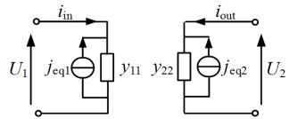  
图8SAB单元等效电路  
Fig. 8 Equivalent circuit of SAB unit

将图8进行级联，可得IPOS型SAB变换器等效电路，如图9所示。

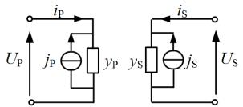  
图9 IPOS型SAB变换器等效电路  
Fig. 9 Equivalent circuit of IPOS type SAB converter

与DAB相比，其串并联侧互换，各参数计算式为

$$
\left\{ \begin{array}{l l} y _ {\mathrm {P}} = \sum_ {i = 1} ^ {N} y _ {1 1} ^ {i}, & j _ {\mathrm {P}} = \sum_ {i = 1} ^ {N} j _ {\mathrm {e q} 1} ^ {i} \\ y _ {\mathrm {S}} = \frac {1}{\sum_ {i = 1} ^ {N} \left(\frac {1}{y _ {2 2} ^ {i}}\right)}, & j _ {\mathrm {S}} = y _ {\mathrm {S}} \sum_ {i = 1} ^ {N} \left(\frac {j _ {\mathrm {e q} 2} ^ {i}}{y _ {2 2} ^ {i}}\right) \end{array} \right. \tag {16}
$$

# 3.2 稳定性分析

由于3.1节等效模型的建立过程中，使用电容电压 $U(t - \Delta t)$ 的值近似代替 $U(t)$ ，这种近似可能导致不稳定的仿真，为了提高等效模型的置信度，本节将通过数学推导检验仿真算法的稳定性。

# 3.2.1 实际物理系统稳定性

由图1可知，SAB单元的实际物理系统是由电容、电感、变压器等无源元件构成。

对于每一个SAB开关状态，可列状态方程为

$$
\dot {\boldsymbol {x}} = \boldsymbol {A} \boldsymbol {x} \tag {17}
$$

取二次型函数为SAB单元储能函数如下：

$$
\boldsymbol {E} = \boldsymbol {x} ^ {\mathrm {T}} \boldsymbol {P} \boldsymbol {x} \tag {18}
$$

其中：

$$
\left\{ \begin{array}{l} \boldsymbol {x} = \left[ \begin{array}{c} U _ {1} \\ U _ {2} \\ i _ {\mathrm {P}} \\ i _ {\mathrm {S}} \end{array} \right] \\ \boldsymbol {P} = \frac {1}{2} \cdot \left[ \begin{array}{c c c c} C _ {1} & 0 & 0 & 0 \\ 0 & C _ {2} & 0 & 0 \\ - 0 & 0 & - 0 & - 0 \\ 0 & 0 & Y _ {\mathrm {T}} ^ {- 1} \end{array} \right] \end{array} \right. \tag {19}
$$

由无源网络的性质可知 $\dot{E}(t) < 0$ ，即注入网络

的能量总是大于其存储的能量[18]，结合式(17)、(18)，则：

$$
\begin{array}{l} \dot {\boldsymbol {E}} (t) = \left(\boldsymbol {x} ^ {\mathrm {T}} \boldsymbol {P} \boldsymbol {x}\right) ^ {\prime} = \dot {\boldsymbol {x}} ^ {\mathrm {T}} \boldsymbol {P} \boldsymbol {x} + \boldsymbol {x} ^ {\mathrm {T}} \boldsymbol {P} \dot {\boldsymbol {x}} = \boldsymbol {x} ^ {\mathrm {T}} \boldsymbol {A} ^ {\mathrm {T}} \boldsymbol {P} \boldsymbol {x} + \\ \boldsymbol {x} ^ {\mathrm {T}} \boldsymbol {P} \boldsymbol {A} \boldsymbol {x} = \boldsymbol {x} ^ {\mathrm {T}} \left(\boldsymbol {A} ^ {\mathrm {T}} \boldsymbol {P} + \boldsymbol {P} \boldsymbol {A}\right) \boldsymbol {x} <   0 \tag {20} \\ \end{array}
$$

所以，二次函数 $\pmb{E}$ 满足Lyapunov条件： $\pmb{P}$ 正定，且 $A^{\mathrm{T}}P + PA$ 负定，该切换系统的每个开关状态Lyapunov稳定。由文献[19-20]可知，此时图1所示非自治切换系统BIBO稳定。

# 3.2.2 离散仿真系统稳定性

与连续系统稳定性类似，Lyapunov二次函数存在也是离散系统稳定的充分条件[19]，即：

$$
\boldsymbol {G} ^ {\mathrm {T}} \boldsymbol {P} \boldsymbol {G} - \boldsymbol {P} <   0 \tag {21}
$$

其中， $\pmb{G}$ 表示状态变量 $\pmb{x}$ 的单步长增益：

$$
\boldsymbol {x} (t) = \boldsymbol {G} \boldsymbol {x} (t - \Delta t) \tag {22}
$$

在本文的等效模型建立过程中，电容和变压器均采用梯形积分法离散，可以实现所有步长的稳定[18]。因此，本节主要针对式(15)所示约等过程进行稳定性分析。

记：

$$
\left\{ \begin{array}{l} \mathbf {Y} _ {1} = \left[ \begin{array}{c c} y _ {1 1} & 0 \\ 0 & y _ {2 2} \end{array} \right] \\ \mathbf {Y} _ {2} = - y _ {1 2} \left[ \begin{array}{c c} 0 & 1 \\ 1 & 0 \end{array} \right] \end{array} \right. \tag {23}
$$

则式(15)可重写为如下单步长迭代形式：

$$
\boldsymbol {Y} _ {1} \boldsymbol {U} (t) = \boldsymbol {Y} _ {2} \boldsymbol {U} (t - \Delta t) + \boldsymbol {\varphi} (t) \tag {24}
$$

式中 $\varphi(t)$ 为系统的输入信号。由文献[18]可知，式(24)所示非自治系统BIBO稳定的判定可以转化为对其相应自治系统Lyapunov稳定的判定，其自治系统下状态变量 $U$ 的单步长增益 $G$ 为

$$
\boldsymbol {G} = \boldsymbol {Y} _ {1} ^ {- 1} \boldsymbol {Y} _ {2} = - y _ {1 2} \left[ \begin{array}{l l} y _ {1 1} & 0 \\ 0 & y _ {2 2} \end{array} \right] \left[ \begin{array}{l l} 0 & 1 \\ 1 & 0 \end{array} \right] = - \left[ \begin{array}{c c} 0 & \frac {y _ {1 2}}{y _ {1 1}} \\ \frac {y _ {1 2}}{y _ {2 2}} & 0 \end{array} \right] \tag {25}
$$

由附录A所示等效导纳表达式可知 $|y_{12}|$ $\mid y_{11}\mid ,\mid y_{12}\mid \mid y_{22}\mid$ ，所以 $\pmb{G}$ 的所有特征根均在单位圆内。由文献[21]可知， $\pmb{G}$ 的所有特征根均在单位圆，等价于存在对称矩阵 $P > 0$ ，使得 $G^{\mathrm{T}}PG - P <   0$ 。因此，离散系统渐进稳定。

综上，式(15)所示约等过程不会导致仿真过程的不稳定，本文所提等效建模方法不会对仿真步长产生新的约束。

# 4 仿真测试

为了验证本文所提等效模型的仿真精度与加速比，本章在PSCAD/EMTDC中搭建了由库元件构成的IPOS型SAB变换器的详细模型(detailed model，DM)，其拓扑图如图1所示。同时，通过自定义Fortran代码实现了本文所提等效模型(equivalentmodel，EM)。

# 4.1 仿真精度测试

# 4.1.1 系统设置

本章建立如图10所示的光伏并网系统，其输入级为光伏(Photovoltaic，PV)电源和Boost电路，中间级为IPOS型SAB变换器，输出级为固定负载。其中，Boost电路用于实现光伏输出电压的稳定，IPOS型SAB变换器采用变占空比控制，实现并网电压稳定，系统参数设置如表1所示。

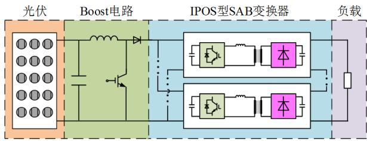  
图10 光伏并网系统结构图  
Fig. 10 Structure diagram of PV grid-connected system

表 1 光伏并网系统系统参数  
Table 1 Parameters of the PV grid-connected system   

<table><tr><td>参数</td><td>数值</td><td>参数</td><td>数值</td></tr><tr><td>Boost电路电容CB/μF</td><td>100</td><td>输入侧电容C1/μF</td><td>1000</td></tr><tr><td>Boost电路电感LB/mH</td><td>2.5</td><td>输出侧电容C2/μF</td><td>2000</td></tr><tr><td>输入侧母线电压额定值UP/kV</td><td>1.5</td><td>辅助电感LT/μH</td><td>1000</td></tr><tr><td>输出侧母线电压额定值US/kV</td><td>5</td><td>高频变压器变比N</td><td>3:5</td></tr><tr><td>额定负载Z/Ω</td><td>200</td><td>SAB单元数NSAB</td><td>3</td></tr><tr><td>高频变压器频率HF/kHz</td><td>1</td><td>-</td><td>-</td></tr></table>

为了反映等效模型对暂态工况的拟合效果，设置系统工况如下：

1）0~0.2s，启动并进入稳态，额定负载运行，输出电压参考值1pu。  
2)0.2s，功率跃变，输出电压参考值变为 $0.8\mathrm{pu}$   
3）0.4s，负载跃变，变为0.5pu。  
4）0.6s，直流输出侧发生小电阻接地故障，故障时间持续 4ms，然后故障切除，进入故障恢复阶段。  
5）1s，仿真结束。

由第2.1分析可知，本文所提等效方法的误差会随着仿真步长的减小而减小，因此，本节分别在

仿真步长 1 和 $5 \mu \mathrm{s}$ 下对详细模型和等效模型进行仿真, 记为: DM(1μs)、DM(5μs)、EM(1μs)、EM(5μs)。4.1.2 外特性测试

IPOS型SAB变换器输出电压的仿真波形如图11所示。由图11(a)可知，DM(1μs)、DM(5μs)、EM(1μs)、EM(5μs)的输出电压趋势基本一致，为精确比较不同模型各暂态工况下的仿真波形，图11(b)—(e)分别给出了启动、功率跃变、负载突变、故障恢复的直流电压局部放大波形。

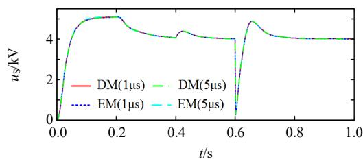  
(a) 整体波形

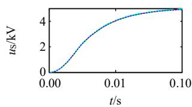  
(b) 启动

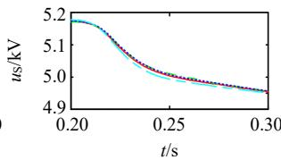  
(c) 功率跃变

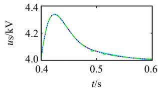  
(d) 负载突变

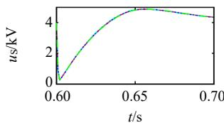  
(e) 故障恢复   
图11 输出电压波形  
Fig. 11 Waveform of the output voltage

对于DM模型，由于具备插值功能，当仿真步长改变时，虽然会由于梯形积分法的误差导致波形出现略微区别，但整体变化不大，二者最大相对误差为 $0.64\%$ ，因此，为提高仿真速度，详细模型一般采用 $5\mu s$ 仿真。对于EM模型，当采用 $5\mu s$ 仿真步长的 $\mathrm{EM}(5\mu s)$ 模型拟合 $\mathrm{DM}(5\mu s)$ 时，会出现较大误差，最大相对误差为 $4.7\%$ ；如果需要实现对详细模型更高精度的拟合，可以降低等效模型的仿真步长，用 $\mathrm{EM}(1\mu s)$ 模型等效 $\mathrm{DM}(5\mu s)$ ，此时最大相对误差为 $1\%$ 。

# 4.1.3 内特性测试

为更好体现本文所提等效模型对SAB变换器CCM与DCM2种工作模式的等效结果，本节给出了EM(1μs)与DM(5μs)2种模型下电感电流的仿真结果，如图12所示。由图可知，在合适的仿真步

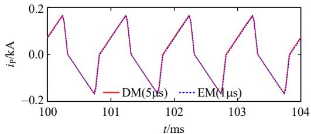  
(a) CCM模式

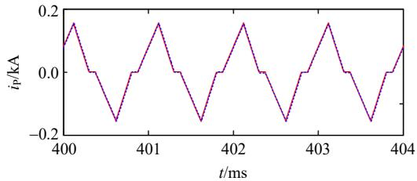  
(b) DCM模式  
图12 电感电流波形  
Fig. 12 Waveform of the inductance current

长下，本文所提电流过零点预计算方法可以对 CCM 与 DCM 2 种模式电流波形进行准确拟合。

综上，本文所提 IPOS 型 SAB 变换器的等效模型对详细模型的外特性与内特性均可以实现的较高精度的拟合，且最大相对误差会随着等效模型步长的降低而减小。

# 4.2 仿真加速比测试

本节分别设置IPOS型SAB变换器和光伏并网系统的SAB单元数为3、5、10、20、50、100，以测试其对等效模型加速效果的影响，系统参数与表1相同。所用测试机配置为AMD A8-7100 Radeon R5, 8 Compute Cores 4C+4G @ 1.80GHz，系统的仿真时间5s，详细模型仿真步长 $5\mu \mathrm{s}$ ，等效模型仿真步长分别取5和 $1\mu \mathrm{s}$ 。

# 4.2.1 IPOS型SAB变换器开环测试

为消除其他环节对等效算法加速效果的影响，本节SAB变换器采用固定占空比控制(即开环控制)，输入侧用直流电压源等效。不同仿真步长的等效模型CPU用时与加速比如表2和图13所示。

表 2 IPOS 型 SAB 变换器开环仿真时间  
Table 2 CPU timings of the IPOS type SAB converter under open-loop control   

<table><tr><td>Num</td><td>DM(5μs)/s</td><td>EM(5μs)/s</td><td>Factor(5μs)</td><td>EM(1μs)/s</td><td>Factor(1μs)</td></tr><tr><td>3</td><td>57.22</td><td>6.00</td><td>9.53</td><td>29.30</td><td>1.95</td></tr><tr><td>5</td><td>113.78</td><td>7.12</td><td>15.98</td><td>33.48</td><td>3.37</td></tr><tr><td>10</td><td>372.95</td><td>9.72</td><td>38.37</td><td>49.41</td><td>7.55</td></tr><tr><td>20</td><td>1318.55</td><td>14.66</td><td>89.94</td><td>78.32</td><td>16.83</td></tr><tr><td>50</td><td>13293.15</td><td>30.78</td><td>431.88</td><td>195.49</td><td>68.00</td></tr><tr><td>100</td><td>69083.50</td><td>60.23</td><td>1145.99</td><td>374.23</td><td>184.60</td></tr></table>

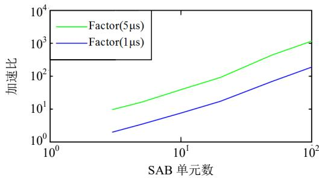  
图13 采用不同仿真步长的等效模型加速比  
Fig. 13 Speedup factor of the equivalent models using different simulation step

由表2可知，当仿真步长采用 $5\mu \mathrm{s}$ 时，IPOS型SAB变换器的等效模型可以实现对详细模型2到3个数量级的提速。对比附录B给出的相同系统设置下，采用 $5\mu \mathrm{s}$ 仿真步长的ISOP型DAB变换器等效模型的提速效果，可以看出，IPOS型SAB变换器的详细模型二极管插值过程独立，仿真用时大量增加(如单元数为10时，详细模型用时由253.56s增加到372.95s)，但等效模型采用电流过零点预计算，只是控制系统较为复杂，仿真用时增加不多(如单元数为10时，等效模型仿真用时仅由8.97s增加到9.72s)。因此，等效模型对SAB的提速效果更加显著。

即使考虑4.1节所述到仿真步长对精度的影响，为实现更高精度的等效，将等效模型的仿真步长降低到 $1\mu \mathrm{s}$ ，本文所提等效模型仍可实现较高的加速比，当SAB单元数上升到100时，可实现2个数量级的提速。

# 4.2.2 光伏并网系统闭环测试

为验证本文所提等效模型在较大规模换流器仿真中的提速效果，同时考虑用户实际仿真需求，本节针对图10所示包含电源、负荷和中间级IPOS型SAB变换器的光伏并网系统进行闭环加速比测试，其中SAB变换器为变占空比控制，画图步长 $200\mu s$ ，测试结果如表3所示。

对比表 2、3 可知，由于电源侧光伏与 Boost

表 3 光伏并网系统闭环仿真时间  
Table 3 CPU timings of the PV grid-connected system under close-loop control   

<table><tr><td>Num</td><td>DM(5μs)/s</td><td>EM(5μs)/s</td><td>Factor(5μs)</td><td>EM(1μs)/s</td><td>Factor(1μs)</td></tr><tr><td>3</td><td>240.71</td><td>23.01</td><td>10.46</td><td>87.05</td><td>2.76</td></tr><tr><td>5</td><td>409.04</td><td>23.79</td><td>17.19</td><td>104.88</td><td>3.901</td></tr><tr><td>10</td><td>1180.23</td><td>25.12</td><td>46.98</td><td>116.06</td><td>10.17</td></tr><tr><td>20</td><td>4734.79</td><td>34.79</td><td>136.10</td><td>148.05</td><td>31.98</td></tr><tr><td>50</td><td>35190.70</td><td>70.14</td><td>501.72</td><td>297.50</td><td>118.29</td></tr></table>

电路、控制系统以及画图环节的引入，详细模型与等效模型的仿真用时均增加，且详细模型仿真时间增加量远大于等效模型。

这是由于IPOS型SAB变换器外电路规模扩大后，随着SAB单元数的增加，同样的网络节点数提高带来的EMTDC计算负荷增量将更大(假设外电路节点数为10，SAB变换器节点数由10增加到20，整个系统节点数将由20增加到30，30节点与20节点网络解算之间的计算负荷差远大于20节点与10节点网络)。但是，等效模型的节点数并不会随着SAB变换器单元数上升，即系统节点数恒定。因此，等效模型的加速效果更加显著，当SAB单元数为50时，即可实现对详细模型2个数量级的提速。

# 5 算法适用性分析

第4节的仿真结果充分说明了本文所建等效模型可以实现对SAB变换器模块级电磁暂态特性的精确高效仿真。需要指出的是，当关注于SAB变换器模块内部故障下IGBT开关组、二极管等器件级暂态特性时，本文所建模型并不适用。下面分析不适用的原因及解决方案。

首先，为实现对详细模型的提速，在3.1节等效模型建立过程中，将SAB变换器内部节点进行了消去，所建等效模型仅保留4个外端子节点，未预留内部故障的接口。其次，模块内部故障包含IGBT控制信号缺失、直流电容过压击穿、高频变压器绝缘老化引起输出电压畸变等多种复杂工况[22]，且涉及IGBT和二极管的过压过流暂态过程，模型复杂度较高，不适于与本文所建较大规模SAB变换器模块级模型结合。

针对SAB变换器模块内部故障的电磁暂态仿真，通常需要根据指定工况，对特定元件进行模型功能优化，如建立IGBT的分段线性模型[23-24]、高频变压器的宽频模型[25-26]、电容电感的非线性模型等[18]，在此基础上，进一步对器件应力、谐波、损耗等进行分析，本文暂不做具体研究。

# 6 结论

本文提出一种基于电流过零点预计算的IPOS型SAB变换器等效建模方法。该方法通过对SAB拓扑与不同工作模式进行分析，得到了电感电流过零点的表达式，结合SAB拓扑结构，将不控整流

桥的二极管等效为由虚拟触发信号控制的二值电阻。进一步类比ISOP型DAB变换器的等效建模过程，给出了IPOS型SAB变换器的等效模型。在此基础上，本文还通过Lyapunov第二法证明了所提等效模型的稳定性。

通过PSCAD/EMTDC环境的仿真验证，本文所提等效模型可以较为准确的实现对详细模型的拟合，并且仿真步长越小，精度越高。同时，本文所提等效模型可以实现对等效模型2到3个数量级的提速。

# 参考文献

[1] ORTIZ G, BIELAJ, KOLAR JW. Optimized design of medium frequency transformers with high isolation requirements[C]/Proceedings of the IECON 2010-36th Annual Conference on IEEE Industrial Electronics Society. Glendale: IEEE, 2010.   
[2] 尹瑞．新型海上风电场拓扑及其关键技术研究[D].杭州：浙江大学，2017.YIN Rui. Research on novel offshore wind farm topologies and their key technologies[D]. Hangzhou: Zhejiang University, 2017(in Chinese).   
[3] SABATE J A, LEE F C. Off-line application of the fixed frequency clamped mode series-resonant converter[C]// Proceedings, Fourth Annual IEEE Applied Power Electronics Conference and Exposition. Baltimore: IEEE, 1989.   
[4] TSAI F S, SABATE J, LEE F C. Constant-frequency, zero-voltage-switched, clamped-mode parallel-resonant converter[C]//Conference Proceedings, Eleventh International Telecommunications Energy Conference. Florence: IEEE, 1989.   
[5] DE DONCKER R W A A, DIVAN D M, KHERALUWALA M H. A three-phase soft-switched high-power-density DC/DC converter for high-power applications[C]//Conference Record of the 1988 IEEE Industry Applications Society Annual Meeting. Pittsburgh: IEEE, 1988.   
[6] JOVCIC D. Step-up DC-DC converter for megawatt size applications[J]. IET Power Electronics, 2009, 2(6): 675-685.   
[7] ZHOU Y, MACPHERSON DE, BLEWITT W, et al. Comparison of DC-DC converter topologies for offshore wind-farm application[C]//Proceedings of the 6th IET International Conference on Power Electronics, Machines and Drives (PEMD 2012). Bristol: IET, 2012.   
[8] 孟繁煦, 李武华, 何湘宁, 等. 单向有源桥(SAB)DC-DC变换器典型拓扑研究[J]. 电工技术, 2019(8): 115-117,

121.   
MENG Fanxu, LI Wuhua, HE Xiangning, et al. Research on typical topology of single active bridge DC-DC converter[J]. Electric Engineering, 2019(8): 115-117, 121(in Chinese).   
[9] GOLE A M, KERIA, NWANKPAC, et al. Guidelines for modeling power electronics in electric power engineering applications[J]. IEEE Power Engineering Review, 1997, 17(1): 71.   
[10] ZHAO Tiefu, ZENG Jie, BHATTACHARYA S, et al. An average model of solid state transformer for dynamic system simulation[C]//Proceedings of the 2009 IEEE Power & Energy Society General Meeting. Calgary: IEEE, 2009.   
[11] PAVLOVIC T, BJAZIC T, BAN Z. Simplified averaged models of DC-DC power converters suitable for controller design and microgrid simulation[J]. IEEE Transactions on Power Electronics, 2013, 28(7): 3266-3275.   
[12] 易姝娴，袁立强，李凯，等．面向区域电能路由器的高效仿真建模方法[J].清华大学学报：自然科学版，2019，59(10)：796-806.  
YI Shuxian, YUAN Liqiang, LI Kai, et al. High-efficiency modeling method for regional energy routers[J]. Journal of Tsinghua University: Science and Technology, 2019, 59(10): 796-806(in Chinese).   
[13] 高晨祥，丁江萍，许建中，等．输入串联输出并联型双有源桥变换器等效建模方法[J]. 中国电机工程学报，2020，40(15)：4955-4964.  
GAO Chenxiang, DING Jiangping, XU Jianzhong, et al. Equivalent modeling method of input series output parallel type dual active bridge converter[J]. Proceedings of the CSEE, 2020, 40(15): 4955-4964(in Chinese).  
[14] 丁江萍，高晨祥，许建中，等．级联H桥型电力电子变压器的电磁暂态等效建模方法[J].中国电机工程学报，2020，40(21)：7047-7055.  
DING Jiangping, GAO Chenxiang, XU Jianzhong, et al. Electromagnetic transient equivalent modeling method of cascaded H-bridge power electronic transformer[J]. Proceedings of the CSEE, 2020, 40(21): 7047-7055(in Chinese).  
[15] 高晨祥，丁江萍，冯谟可，等．基于节点导纳方程预处理的ISOP型DAB变换器双端口解耦等效模型[J].中国电机工程学报，2021，41(6)：2255-2266.  
GAO Chenxiang，DING Jiangping，FENG Moke，et al. Two-port decoupling equivalent model of ISOP type DAB converter by preprocessing the node admittance equation[J].Proceedings of the CSEE，2021，41(6):2255-2266(in Chinese).   
[16] LENA M. Energy evaluation for DC/DC converters in DC-based wind farms[D]. Göteborg: Chalmers University

of Technology, 2007.   
[17] WATSON N, ARRILLAGA J. Power systems electromagnetic transients simulation[M]. London: Institution of Electrical Engineers, 2003: 188.   
[18] ZHAO Huanfeng, FAN Shengtao, GOLE A M. Stability of algorithms for electro-magnetic-transient simulation of networks with switches and non-linear inductors[J]. IEEE Transactions on Power Delivery, 2020, 35(1): 377-385.   
[19] LIN Hai, ANTSAKLIS P J. Stability and stabilizability of switched linear systems: a survey of recent results[J]. IEEE Transactions on Automatic Control, 2009, 54(2): 308-322.   
[20] MICHALETZKY G, GERENCSER L. BIBO stability of linear switching systems[J]. IEEE Transactions on Automatic Control, 2002, 47(11): 1895-1898.   
[21] 刘豹，唐万生．现代控制理论[M]. 3版．北京：机械工业出版社，2006：170-174. LIU Bao，TANG Wansheng. Modern control theory[M]. 3rd Ed. Beijing: Machinery Industry Press, 2006: 170-174(in Chinese).  
[22] 梁翔. $10\mathrm{kV} / 400\mathrm{V}$ 电子电力变压器电磁暂态建模与仿真[D]. 武汉：华中科技大学，2015. LIANG Xiang. The electromagnetic transient modeling and simulation of $10\mathrm{kV} / 400\mathrm{V}$ electronic power transformer[D]. Wuhan: Huazhong University of Science and Technology, 2015(in Chinese).   
[23] 施博辰，赵争鸣，蒋烨，等．功率开关器件多时间尺度瞬态模型(I)：开关特性与瞬态建模[J].电工技术学报，2017，32(12)：16-24.  
SHI Bochen，ZHAO Zhengming，JIANG Ye，et al. Multi-time scale transient models for power semiconductor devices (Part I): switching characteristics and transient modeling[J]. Transactions of China Electrotechnical Society，2017，32(12)：16-24(in Chinese).  
[24] 蒋烨，赵争鸣，施博辰，等．功率开关器件多时间尺度瞬态模型(II)：应用分析与模型互联[J].电工技术学报，2017，32(12)：25-32.  
JIANG Ye, ZHAO Zhengming, SHI Bochen, et al. Multi-time scale transient models for power semiconductor devices (Part II): applications analysis and model connection[J]. Transactions of China Electrotechnical Society, 2017, 32(12): 25-32(in Chinese).   
[25] 刘晨. 高压高频变压器宽频建模方法及其应用研究[D]. 北京：华北电力大学(北京)，2017. LIU Chen. Wideband modeling method and its application of high-voltage high-frequency transformers[D]. Beijing: North China Electric Power University (Beijing), 2017(in Chinese).  
[26] 张科科，齐磊，崔翔，等．多绕组中频变压器宽频建模

方法[J]. 电网技术，2019，43(2)：582-590.

ZHANG Keke, QI Lei, CUI Xiang, et al. Wideband modeling method of multi-winding medium frequency transformer[J]. Power System Technology, 2019, 43(2): 582-590(in Chinese).

# 附录A SAB单元的等效外端口方程参数计算式

将正文式(12)所示节点导纳方程写为分块矩阵形式如下：

$$
\left[ \begin{array}{l l} \boldsymbol {A} & \boldsymbol {B} \\ \boldsymbol {B} ^ {\mathrm {T}} & \boldsymbol {C} \end{array} \right] \left[ \begin{array}{l} \boldsymbol {V} _ {\mathrm {E X}} \\ \boldsymbol {V} _ {\mathrm {I N}} \end{array} \right] = \left[ \begin{array}{l} \boldsymbol {J} _ {\mathrm {E X}} \\ \boldsymbol {J} _ {\mathrm {I N}} \end{array} \right] + \left[ \begin{array}{l} \boldsymbol {I} _ {\mathrm {E X}} \\ \boldsymbol {0} \end{array} \right] \tag {A1}
$$

分块矩阵 $C$ 为常数，不随开关信号改变。记： $C^{-1} = Q$ 由式(15)可得：

$$
\boldsymbol {Q} = \left[ \begin{array}{l l} \underline {{\boldsymbol {Q}}} _ {1 1} & \underline {{\boldsymbol {Q}}} _ {1 2} \\ \overline {{\boldsymbol {Q}}} _ {1 2} ^ {\mathrm {T}} & \overline {{\boldsymbol {Q}}} _ {2 2} \end{array} \right] = \left[ \begin{array}{l l} - \frac {\left[ \begin{array}{l l} q _ {1} & q _ {2} \\ q _ {2} & q _ {1} \end{array} \right]}{q _ {3} \left[ \begin{array}{l l} 1 & - 1 \\ - 1 & 1 \end{array} \right]} & q _ {3} \left[ \begin{array}{l l} 1 & - 1 \\ - 1 & 1 \end{array} \right] \\ q _ {3} \left[ \begin{array}{l l} 1 & - 1 \\ - 1 & 1 \end{array} \right] & \left[ \begin{array}{l l} q _ {4} & q _ {5} \\ q _ {5} & q _ {4} \end{array} \right] \end{array} \right] \tag {A2}
$$

记 $G_{\mathrm{X}} = G_{\mathrm{OFF}} + G_{\mathrm{ON}}$ ，则 $q_{1}$ 一 $q_{5}$ 的表达式为

$$
\left\{\begin{array}{l}q _ {1} = \frac {1}{2 G _ {\mathrm {X}}} + \frac {2 Y _ {\mathrm {T} 2 2} + G _ {\mathrm {X}}}{2 \left[ \left(2 Y _ {\mathrm {T} 2 2} + G _ {\mathrm {X}}\right) \left(2 Y _ {\mathrm {T} 1 1} + G _ {\mathrm {X}}\right) - 2 Y _ {\mathrm {T} 1 2} \cdot 2 Y _ {\mathrm {T} 1 2} \right]}\\q _ {2} = \frac {1}{2 G _ {\mathrm {X}}} - \frac {2 Y _ {\mathrm {T} 2 2} + G _ {\mathrm {X}}}{2 \left[ \left(2 Y _ {\mathrm {T} 2 2} + G _ {\mathrm {X}}\right) \left(2 Y _ {\mathrm {T} 1 1} + G _ {\mathrm {X}}\right) - 2 Y _ {\mathrm {T} 1 2} \right. \cdot 2 Y _ {\mathrm {T} 1 2} ]}\\q _ {3} = - \frac {Y _ {\mathrm {T} 1 2}}{\left(2 Y _ {\mathrm {T} 2 2} + G _ {\mathrm {X}}\right) \left(2 Y _ {\mathrm {T} 1 1} + G _ {\mathrm {X}}\right) - 2 Y _ {\mathrm {T} 1 2} \cdot 2 Y _ {\mathrm {T} 1 2}}\\q _ {4} = \frac {(2 Y _ {\mathrm {T} 1 1} + G _ {\mathrm {X}}) (Y _ {\mathrm {T} 2 2} + G _ {\mathrm {X}}) - 2 Y _ {\mathrm {T} 1 2} Y _ {\mathrm {T} 1 2}}{G _ {\mathrm {X}} \left[ \left(2 Y _ {\mathrm {T} 2 2} + G _ {\mathrm {X}}\right) \left(2 Y _ {\mathrm {T} 1 1} + G _ {\mathrm {X}}\right) - 2 Y _ {\mathrm {T} 1 2} \cdot 2 Y _ {\mathrm {T} 1 2} \right]}\\q _ {5} = \frac {(2 Y _ {\mathrm {T} 1 1} + G _ {\mathrm {X}}) Y _ {\mathrm {T} 2 2} - 2 Y _ {\mathrm {T} 1 2} Y _ {\mathrm {T} 1 2}}{G _ {\mathrm {X}} \left[\left(2 Y _ {\mathrm {T} 2 2} + G _ {\mathrm {X}}\right)\left(2 Y _ {\mathrm {T} 1 1} + G _ {\mathrm {X}}\right) - 2 Y _ {\mathrm T} ^ {} ^ {} ^ {} ^ {} ^ {} ^ {} ^ {} ^ {} ^ {} ^ {} ^ {} ^ {} ^ {} ^ {} ^ {} ^ {} ^ {} ^ {} ^ {} ^ {} ^ {} ^ {} ^ {} ^ {} ^ {} ^ {} ^ {} ^ {} ^ {} ^ {} ^ {} ^ {} ^ {} ^ {} ^ {} ^ {} ^ {} ^ {} ^ {} ^ {} ^ {} ^ {} ^ {} ^ {} ^ {} ^ {} ^ {} ^ {} ^ {} ^ {} ^ {-}} \right.\left. \right.\end{array}\right. \tag {A3}
$$

所以，正文式(13)中等效节点导纳值 $y_{11}$ 、 $y_{12}$ 、 $y_{22}$ 和等效历史电流源 $j_{\mathrm{S1}}$ 、 $j_{\mathrm{S2}}$ 表达式如下：

$$
\left\{ \begin{array}{l} y _ {1 1} = G _ {\mathrm {C} 1} + \left(q _ {1} + q _ {2}\right) \cdot 2 G _ {\mathrm {O N}} G _ {\mathrm {O F F}} + K _ {1} q _ {2} \left(G _ {\mathrm {O N}} - G _ {\mathrm {O F F}}\right) ^ {2} \\ y _ {1 2} = - K _ {2} q _ {3} \left(G _ {\mathrm {O N}} - G _ {\mathrm {O F F}}\right) ^ {2} \\ y _ {2 2} = G _ {C 2} + \left(q _ {4} + q _ {5}\right) \cdot 2 G _ {\mathrm {O N}} G _ {\mathrm {O F F}} + K _ {3} q _ {5} \left(G _ {\mathrm {O N}} - G _ {\mathrm {O F F}}\right) ^ {2} \\ j _ {S 1} = j _ {\mathrm {C} 1 \_ \mathrm {H I S}} + K _ {4} \left(q _ {1} - q _ {2}\right) \left(G _ {\mathrm {O F F}} - G _ {\mathrm {O N}}\right) j _ {\mathrm {T} 1 \_ \mathrm {H I S}} + \\ K _ {4} q _ {3} \cdot 2 \left(G _ {\mathrm {O F F}} - G _ {\mathrm {O N}}\right) j _ {\mathrm {T} 2 \_ \mathrm {H I S}} \\ j _ {S 2} = j _ {\mathrm {C} 2 \_ \mathrm {H I S}} + K _ {5} \left(q _ {4} - q _ {5}\right) \left(G _ {\mathrm {O F F}} - G _ {\mathrm {O N}}\right) j _ {\mathrm {T} 2 \_ \mathrm {H I S}} + \\ K _ {5} q _ {3} \cdot 2 \left(G _ {\mathrm {O F F}} - G _ {\mathrm {O N}}\right) j _ {\mathrm {T} 1 \_ \mathrm {H I S}} \end{array} \right. \tag {A4}
$$

式中 $K_{1} - K_{5}$ 为符号函数，由触发信号决定，基于本文所提二极管电流预判断方法，可生成二极管的虚拟触发信号 $T_{\mathrm{D5\_8}}$ 和 $T_{\mathrm{D6\_7}}$ ，所以对于SAB变换器符号函数如式(A5)所示。

$$
\left\{ \begin{array}{l} K _ {1} = \left\{ \begin{array}{l l} 1, & T _ {1} \neq T _ {3} \\ 0, & T _ {1} = T _ {3} \end{array} \right. \\ K _ {2} = \left\{ \begin{array}{l l} 0, & T _ {1} = T _ {3} \\ 1, & T _ {1} = T _ {\mathrm {D} 5 \_ 8} \text {且} T _ {1} \neq T _ {3} \\ - 1, & T _ {1} \neq T _ {\mathrm {D} 5 \_ 8} \text {且} T _ {1} \neq T _ {3} \end{array} \right. \\ K _ {3} = 1 \\ K _ {4} = \left\{ \begin{array}{l l} 1, & T _ {1} = T _ {4} = 1 \\ 0, & T _ {1} = T _ {3} \\ - 1, & T _ {1} = T _ {4} = 0 \end{array} \right. \\ K _ {5} = \left\{ \begin{array}{l l} 1, & T _ {\mathrm {D} 5 \_ 8} = 1 \\ - 1, & T _ {\mathrm {D} 5 \_ 8} = 0 \end{array} \right. \end{array} \right. \tag {A5}
$$

将式(A5)、(A3)代入式(A4)，可证 $|y_{12}|\square |y_{11}|$ ， $|y_{12}|\square |y_{22}|$ 。以SAB参数为例，取结合实际变压器参数取值，取

$$
\begin{array}{r l} & {f = 1 \mathrm {k H z},   L _ {\mathrm {T}} = 1 0 0 \mu \mathrm {H},   V _ {\mathrm {T 1}} = V _ {\mathrm {T 2}} = 1. 5 \mathrm {k V},   S _ {\mathrm {T N}} = 0. 0 3 \mathrm {M V A},   I _ {\mathrm {M}} =} \\ & {0. 0 0 4,   X _ {\mathrm {S}} = 0. 0 8 8 \mathrm {p u},,   R _ {\mathrm {O N}} = 0. 0 1 \Omega ,   R _ {\mathrm {O F F}} = 1 0 ^ {6} \Omega ,   C _ {1} = 2 0 0 0 \mu \mathrm {F},} \\ & {C _ {2} = 1 0 0 0 \mu \mathrm {F},     \text {则 经 计 算},     \text {当}   T _ {1} \neq T _ {3} \text {时}:} \end{array}
$$

$$
\left\{ \begin{array}{l} \left| y _ {1 1} \right| = 8 0 0. 0 0 2 2 \\ \left| y _ {1 2} \right| = 0. 0 0 2 2 \\ \left| y _ {2 2} \right| = 4 0 0. 0 0 2 2 \end{array} \right. \tag {A6}
$$

当 $T_{1} = T_{3}$ 时：

$$
\left\{ \begin{array}{l} \left| y _ {1 1} \right| = 8 0 0 \\ \left| y _ {1 2} \right| = 0 \\ \left| y _ {2 2} \right| = 4 0 0. 0 0 2 2 \end{array} \right. \tag {A7}
$$

显然满足 $|y_{12}|\square |y_{11}|$ ， $|y_{12}|\square |y_{22}|$ ，符合理论推导。

# 附录B ISOP型DAB变换器等效模型提速效果

表 B1 ISOP 型 DAB 变换器仿真时间  
Table B1 CPU timings of the ISOP type DAB converter   

<table><tr><td>Num</td><td>DM/s</td><td>EM/s</td><td>Factor</td></tr><tr><td>3</td><td>56.27</td><td>5.27</td><td>10.68</td></tr><tr><td>5</td><td>86.53</td><td>6.27</td><td>13.80</td></tr><tr><td>10</td><td>253.56</td><td>8.97</td><td>28.27</td></tr><tr><td>20</td><td>919.08</td><td>13.07</td><td>70.32</td></tr><tr><td>50</td><td>6774.18</td><td>28.08</td><td>241.25</td></tr><tr><td>100</td><td>23080.35</td><td>51.95</td><td>444.28</td></tr></table>

  
高晨祥

在线出版日期：2021-01-05。

收稿日期：2020-09-16。

作者简介：

高晨祥(1997)，男，硕士研究生，研究方向为高压直流输电MMC电磁暂态建模，chenxianggao@ncepu.edu.cn;

王晓婷(1998)，女，硕士研究生，研究方向为高压直流输电MMC电磁暂态建模，825409549@qq.com;

丁江萍(1997)，女，硕士研究生，研究方向为高压直流输电MMC电磁暂态建模，jiangpingding@ncepu.edu.cn;

*通信作者：许建中(1987)，男，副教授，研究方向为高压直流输电和直流电网技术等，xujianzhong@ncepu.edu.cn;

赵成勇(1964)，男，教授，博士生导师，研究方向为直流输电等，chengyongzhao@ncepu.edu.cn。

(责任编辑 呂鲜艳)

# Equivalent Modelling Method of Single Active Bridge Converter by Pre-calculating the Current Zero-crossing

GAO Chenxiang, WANG Xiaoting, DING Jiangping, XU Jianzhong*, ZHAO Chengyong

(North China Electric Power University)

KEY WORDS: single active bridge (SAB); current zero-crossing; equivalent model; stability

As an important scheme for grid connection of photovoltaic, wind power and other DC power sources, the input parallel output series (IPOS) type single active bridge (SAB) converter has received extensive attention. Due to the high node admittance order, low simulation step size and the existence of uncontrolled rectifier bridge, its electromagnetic transient simulation efficiency is extremely low.

In this paper, an equivalent modeling method of SAB converter by the pre-calculating the current zero-crossing is proposed.

Firstly, the current waveforms of the SAB converter in continuous conduction mode (CCM) and discontinuous conduction mode (DCM) are analyzed. And the expressions of the zero-crossing point of the inductance current under in CCM and DCM are given with the demarcation condition of the modes.

On this basis, the uncontrolled rectifier bridge is equivalent to a virtual controlled rectifier bridge composed of 4 binary resistors through pre-calculating the current zero-crossing, as is shown in Fig. 1.

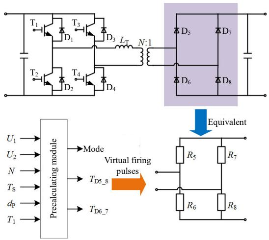  
Fig. 1 The equivalent process diagram of the uncontrolled rectifier bridge

Similar to the DAB converter, the equivalent model of the IPOS type SAB converter is established. And Lyapunov method is used to prove the stability of the proposed equivalent model.

The detailed model (DM) and proposed equivalent model (EM) of an IPOS type SAB converter are

established on PSCAD/EMTDC to verify the accuracy and the efficiency of the proposed model. Fig. 2 shows the waveforms of the DC output voltage during different transient conditions.

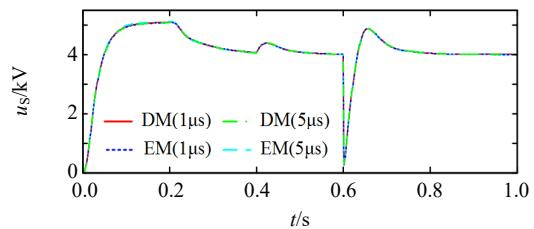  
(a) The whole process

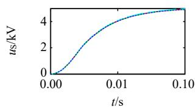  
(b) Start-up

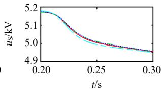  
(c) Voltage change

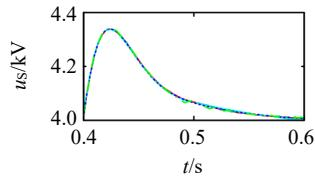  
(d) Load change

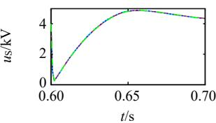  
(e) Fault and recovery   
Fig. 2 The simulation waveforms of SAB converter

And Table 1 shows the simulation time comparison between DMs and EMs. With the increasing of the number of SABs, the computation times of DMs increase exponentially while EMs are linearly increasing. When SAB number reaches 100, the speedup of EMs is over 2 orders of magnitude faster than the DMs.

Table 1 CPU timings of the IPOS type SAB converter under open-loop control   

<table><tr><td>Num</td><td>DM(5μs)/s</td><td>EM(5μs)/s</td><td>Factor(5μs)</td><td>EM(1μs)/s</td><td>Factor(1μs)</td></tr><tr><td>3</td><td>57.22</td><td>6.00</td><td>9.53</td><td>29.30</td><td>1.95</td></tr><tr><td>5</td><td>113.78</td><td>7.12</td><td>15.98</td><td>33.48</td><td>3.37</td></tr><tr><td>10</td><td>372.95</td><td>9.72</td><td>38.37</td><td>49.41</td><td>7.55</td></tr><tr><td>20</td><td>1318.55</td><td>14.66</td><td>89.94</td><td>78.32</td><td>16.83</td></tr><tr><td>50</td><td>13293.15</td><td>30.78</td><td>431.88</td><td>195.49</td><td>68.00</td></tr><tr><td>100</td><td>69083.50</td><td>60.23</td><td>1145.99</td><td>374.23</td><td>184.60</td></tr></table>

In summary, the proposed equivalent model is significant for the EMT simulation of IPOS type SAB converter.