# Dead-time effect modeling for hybrid modular multilevel converter using twin mapping

Moke Feng a,* , Jianzhong Xu b , Wenxia Sima a , Ming Yang a , Hang Jing b , Keying Pan b

a State Key Laboratory of Power Transmission Equipment Technology, Chongqing University, Chongqing 400044, China   
b State Key Laboratory of Alternate Electrical Power System with Renewable Energy Sources, North China Electric Power University, Beijing 102206, China

# A R T I C L E I N F O

Keyword:

Electromagnetic transient (EMT) modeling Dead-time

Hybrid MMC

Twin mapping

Thevenin equivalent

# A B S T R A C T

Dead-time control is essential for modular multilevel converters (MMCs), but it negatively impacts MMC performance. To support the development of control strategies to mitigate the adverse effects of dead-time, electromagnetic transient (EMT) simulations are crucial for analyzing MMCs’ dead-time behavior and developing strategies to mitigate these effects. However, simulating the impact of dead-time in high-level MMCs remains a challenge. The complex modular cascaded circuit significantly slows simulation speed, while the freewheeling conduction of submodule diodes during dead-time disrupts the integrity of submodules in each bridge-arm. This makes it difficult to represent the circuit as a unified Thevenin equivalent for simplification. To address the issue, the dead-time effect is modeled using a diode-H-bridge in this paper. Submodules are categorized into those affected by the dead-time effect and those not. This paper also proposes the capacitor state mapping approach, referred to as “twin mapping method”, to restore the submodules’ behavior during and outside the dead-time, eliminating the isolation of submodules and enabling the application of the Thevenin equivalent theorem. Finally, a Thevenin equivalent model (EM) is developed and compared with a detailed model (DM) and statespace model (SSM). PSCAD/EMTDC simulations demonstrate that the proposed EM effectively captures deadtime spikes and notches while significantly accelerating simulation speed.

# 1. Introduction

Modular multilevel converter (MMC) is a high-efficiency AC-DC power conversion equipment, characterized by its low harmonic content in output voltage, minimal current distortion, and reduced switching losses [1–3]. MMC greatly enhances the stability and reliability of the system, which is crucial for renewable energy power systems [4,5]. It has been extensively applied in the flexible high voltage direct current (HVDC) transmission projects and is progressively utilized in largecapacity aggregation and distribution systems such as offshore wind power and large-scale photovoltaic plants [6–8].

The hybrid MMC [9,10] stands out as it integrates half-bridge sub modules (HBSMs) and full-bridge submodules (FBSMs) in a balanced ratio, harnessing the strengths of both MMC configurations [11–13]. As depicted in Fig. 1, the hybrid MMC features a three-phase, six-bridgearm configuration, with each arm comprising a series of interconnected FBSMs and HBSMs. This design endows the hybrid MMC with the ability to handle DC fault current interruption and zero-voltage crossing, making it a promising candidate for a wide range of applications.

In hybrid MMC, insulated gate bipolar transistors (IGBTs) and diodes are required to turn on and off at specific time. If one IGBT in an Hbridge is not fully turned off before the other turns on, a short-circuit may occur between the positive and negative terminals of the submodule capacitor. This can result in capacitor burnout and potentially cause a cascading fault, damaging the converter. Generally, on switch state change, both IGBTs on the same side of the H-bridge are turned off simultaneously to avoid short circuits. This all-off period is called the dead-time.

Submodules’ uncertainty in the switching actions can cause deadtime signals to randomly elevate or reduce the output voltage of the bridge-arm, significantly affecting the operation of the MMC. Dead-time increases circulating harmonic currents by preventing switching actions, which distorts the output current waveform [14]. It amplifies commonmode voltage and current, posing risks to power electronic devices [15]. Additionally, dead-time influences capacitor voltages, reducing system efficiency and stability. Increased thermal losses from AC current paths affect component cooling and longevity. The output voltage experiences added fluctuations, slightly reducing output power [16–18]. These

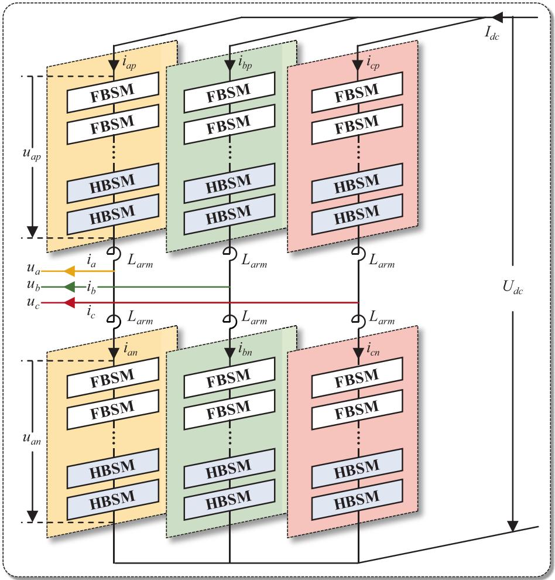  
Fig. 1. Topology of hybrid MMC.

effects must be alleviated to ensure optimal MMC performance.

Ref [19] highlights that dead-time effects can be mitigated through techniques such as dead-time compensation [20,21], minimization [22,23], and dead-time elimination (DTE) [24,25]. These methods have effect in reducing the effect of dead-time in low-level converters [26–28]. Nevertheless, the dead-time effect still cannot be completely eliminated, and the validation on high-level scenarios are not sufficient. Compared to two- or three-level VSCs, as well as low-level VSCs, highlevel MMCs accumulate a larger number of dead-time voltages, which randomly generate arm-voltage and DC-side voltage spikes that endanger equipment safety. However, existing dead-time suppression or elimination approaches validating on high-level MMC remains conspicuously scarce. This deficiency stems not only from the dearth of accurate dead-time models for high-level MMCs, but also from the prohibitive cost of constructing and testing such prototypes. Therefore, developing a model that faithfully reproduces dead-time effects is a costeffective and effective means of providing a solid validating foundation for dead-time-related research.

Electromagnetic transient (EMT) simulation is essential for investi gating the operational characteristics of MMC systems. However, the detailed EMT simulation is extremely slow. This is because the complex modular cascaded circuit of high-level MMC forms an ultra-high-order admittance matrix, and the time-consuming inverse computation of this matrix is executed in each time step. In solving this problem, various modeling techniques that simplify the circuit structure have been developed. For instance, ref [29,30] introduce an averaging model for MMCs, where submodules are replaced with an averaging voltage source, significantly simplifying the overall electric circuit. Ref [31]

proposes a decoupling strategy for MMC submodules, splitting the circuit into several less complex independent subcircuits to enhance computational speed.

As research advances, EMT models need to increasingly meet rigorous standards of accuracy while also considering simulation speed. Ref [32,33] describe the Thevenin equivalent model for MMC where all submodules in the bridge-arm are equivalent to a comprehensive Thevenin circuit, accurately representing the dynamics of switch operations and the charging/discharging processes of submodule capacitors. This model closely aligns with the original detailed EMT model while providing a robust and efficient simulation framework.

Yet, existing MMC equivalent models rarely address the dead-time effects. On one hand, submodule diodes conduct uncontrollably during dead-time, which requires the interpolation function to simulate such behavior. Interpolation is a low-level function of simulation software, and user-defined equivalent model does not have access to it; on the other hand, the freewheeling diodes disrupt the integrity of submodules in a bridge-arm, making the Thevenin equivalent theorem inapplicable. Therefore, to analyze dead-time effects, detailed model is the only choice, but its slow simulation efficiency is inadequate for highvoltage and large-scale MMC systems.

To develop an MMC model that is able to characterize the dead-time effect while possessing high simulation speed, this paper analyzes the dead-time operational modes of hybrid MMCs and introduces the twin mapping method to reconstruct the integrity of the bridge-arm submodules, making Thevenin equivalent method applicable again. The main contributions of this paper are summarized as follows:

1) Carrying out in-depth analysis of dead-time operational

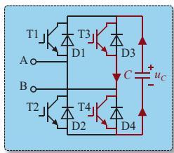  
(a)

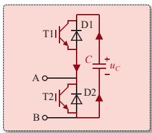  
(b)   
Fig. 2. IGBT short circuit without dead-time control: (a) FBSM; (b) HBSM.

states. This paper thoroughly examines all operational states during dead-time, providing a detailed analysis to uncover the fundamental principles of dead-time EMT simulation.

2) Addressing the issue that Thevenin equivalent models cannot simulate dead-time processes. This paper analyzes the dead-time modes and proposes the methodology to transform the dead-time state from an internal microscopic state at the submodule level to an external macroscopic state at the bridge-arm level, thereby circumventing the challenge of constructing dead-time-supportive Thevenin model. This facilitates the dead-time simulation by modifying the Thevenin bridge-

arms.

3) Proposing a twin-mapping-based Thevenin equivalent model for dead-time simulation. A diode-H-bridge is used to model the deadtime-freewheeling dynamics of high-level MMCs. Submodules are classified into two groups: those operating during dead-time and those outside it. Using the twin-mapping approach, capacitor states transition between these two groups, thereby contributing the corresponding EMT characteristics to the MMC system. This integration of submodules allows the Thevenin equivalent theorem to be applied, enabling both accurate and efficient EMT simulation for high-level MMCs.

# 2. Causes and effects of the dead-time

In this section, FBSM is used to analyze and explain the causes of the dead-time effect, with the HBSM analysis provided subsequently for simplicity.

As illustrated in Fig. 2, assuming the initial operational state of the FBSM is (1,0,0,1) (trigger signals of T1 to T4, with 1 for ON and 0 for OFF), a change in engagement state, such as from positive to negative, will cause the FBSM to first enter the dead-time state (0,0,0,0). Only after all IGBTs are reliably turned off will the transition to the final

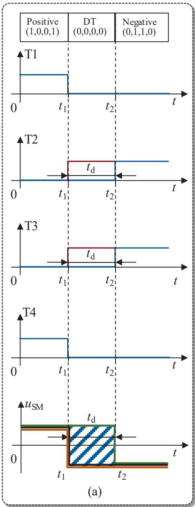

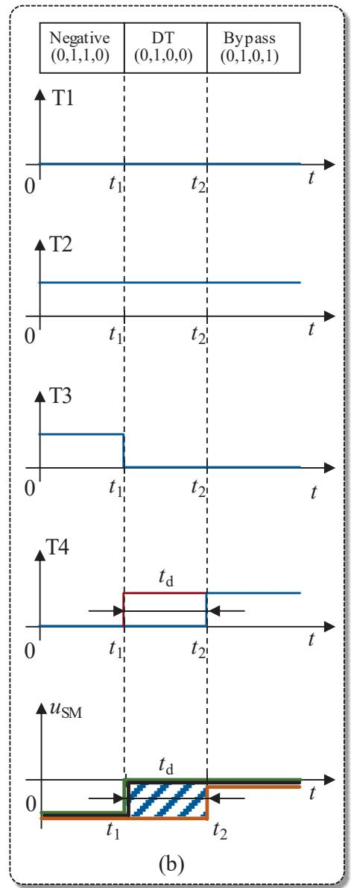  
Fig. 3. Trigger signals and output voltage during operational state changes: (a) positive to negative; (b) negative to bypass.

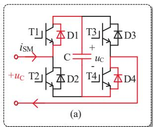

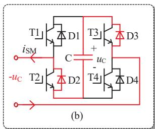  
Fig. 4. Output voltage during dead-time (positive engagement to negative): (a) iSM > 0, positive output; (b) iSM $< 0 ,$ negative output.

operational state (0,1,1,0) occur. Dead-time ensures that IGBTs on the same side do not conduct before the others have turned off, thus preventing direct capacitor discharge through the IGBTs.

Therefore, Dead-time inevitably creates a discrepancy between the expected and actual bridge-arm voltage, resulting in voltage spikes and notches, known as the dead-time effect. Fig. 3(a) illustrates the scenario when an FBSM transitions from a positive to a negative operational state. Different line colors represent trigger signals or output voltages: blue for actual trigger signals considering dead-time control, red for ideal trigger signals without dead-time control, orange for output voltage when submodule current $i _ { \mathrm { S M } } > 0 ,$ black for $i _ { \mathrm { S M } } < 0 ,$ and black for ideal output voltage.

In Fig. 3(a), dead-time control forces T2 and T3 to remain OFF. When iSM > 0 (orange line), the submodule maintains a positive voltage, as shown in Fig. 4(a), extending the positive level longer than expected. Consequently, the output voltage deviates from the desired negative level, generating a positive voltage spike. Conversely, when $i _ { \mathrm { S M } } < 0 ,$ the output

voltage remains negative during the dead-time, as depicted in Fig. 4(b), with no additional level occurring. Fig. 3(b) illustrates the condition when an FBSM transitions from a negative engagement to a bypass state. It is seen that when i $< 0 ,$ an unexpected negative level is generated.

The dead-time voltages are caused by model transitions, as summarized in Fig. A1 (for FBSM, see in Appendix) and Fig. 5 (for HBSM). In the figure caption, for example, Fig. 5 (a), $ { \mathbf { \ddot { p } } } \to b ^ {  { \mathbf { \ ' } } }$ represents that the figure corresponds to the situation where the submodule is transferring from $\mathbf { \mathit { \hat { p } } }$ (positively engaged)” state to “b (bypass)” state. The abbreviations of states are summarized in Table 1.

There are 24 and 4 dead-time states for FBSM and HBSM, respectively. Under certain conditions, for example, as shown in Fig. A1(a) and Fig. A1(d), the submodule output voltage during dead-time does not match the final state voltages, thereby leading to voltage spikes. Moreover, due to the randomness in submodule engagement and disengagement, the dead-time effect exhibits stochastic characteristics.

Table 1 Operational symbols.   

<table><tr><td>Symbols</td><td>Corresponding operational state</td></tr><tr><td>p</td><td>Positively engaged (1, 0, 0, 1) or (1, 0)</td></tr><tr><td>n</td><td>FBSM negatively engaged (0, 1, 1, 0)</td></tr><tr><td>b</td><td>HBSM bypass (0, 1)</td></tr><tr><td>b1</td><td>FBSM bypass mode 1 (1, 0, 1, 0)</td></tr><tr><td>b2</td><td>FBSM bypass mode 2 (0, 1, 0, 1)</td></tr></table>

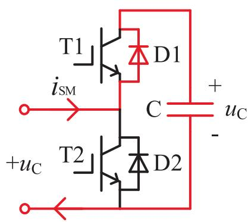  
(a) $p {  } b , i _ { \mathrm { S M } } { > } 0 , { + } u _ { \mathrm { C } }$

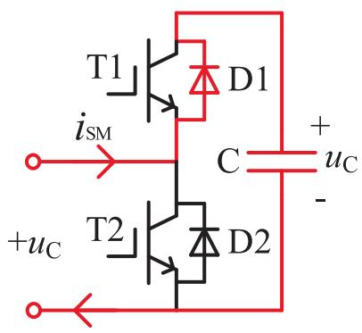  
(b) $b {  } p , i _ { \mathrm { S M } } { > } 0 , { + } u _ { \mathrm { C } }$

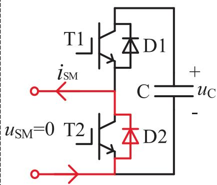  
（c） $p {  } b , i _ { \mathrm { S M } } { < } 0 , 0$

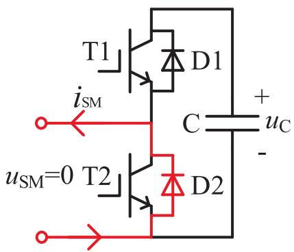  
(d) $b { \to } p , i _ { \mathrm { S M } } { < } 0 , 0$   
Fig. 5. Modal analysis of HBSM during the dead-time.

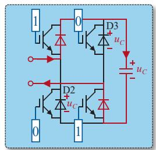  
(a)

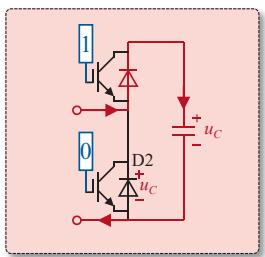  
(b)

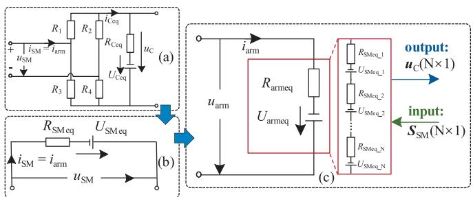  
Fig. 6. Diodes clamped by capacitor: (a) FBSM; (b) HBSM.   
Fig. 7. Bridge-arm equivalent circuit: (a) associated circuit of the FBSM; (b) Thevenin equivalent circuit of the FBSM; (c) Thevenin equivalent circuit of the bridge-arm.

# 3. EMT modeling method for hybrid mmc considering dead-time effect

In simulating the dead-time effect, existing Thevenin model faces critical challenges. As shown in Fig. 6, the validity of the Thevenin equivalent for MMC depends on the submodule capacitors clamping the diode voltages. For example, in the positively engaged state, diodes D2 and D3 in FBSM and D2 in HBSM are clamped by capacitor voltage. This ensures that the conduction state of the IGBT/diode switch assembly is uniquely determined by the trigger signals, and no diode conducts freewheelingly $( \mathrm { i . e . , }$ diodes do not conduct when the parallel IGBT receives a turn-off signal). However, as in Fig. A1 and Fig. 5, the dead-time dynamics include the freewheeling conducting actions of the diodes. The freewheeling conducting action disrupts the integrity of the submodules in each bridge-arm, breaking the premise of the Thevenin equivalence and makes it impossible to develop a submodule equivalent circuit that accounts for dead-time characteristics.

To address the issue, the twin-mapping method is proposed in this section to indirectly simulate the dead-time characteristics. Instead of constructing each submodule’s dead-time equivalent circuit, it considers the bridge-arm-level dead-time equivalent circuit, integrating the entire bridge-arm’s dead-time freewheeling behavior into a unified diode-Hbridge to represent it. In doing this, the integrity of submodules is retained and the Thevenin equivalent method becomes applicable.

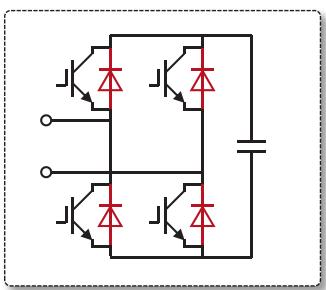  
(a)

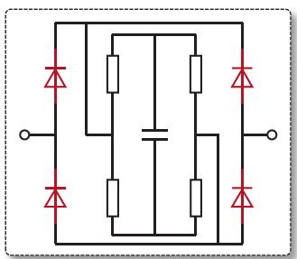  
(b)   
Fig. 8. Diode called: (a) inside submodule; (b) outside submodule.

In the following parts: first, the fundamental theory of the MMC’s Thevenin equivalent method is introduced. Next, the construction steps of the equivalent circuit based on the twin-mapping approach are described. Finally, the theoretical basis of the twin-mapping method is outlined.

# 3.1. The Thevenin equivalent of submodules under non-dead-time conditions

Ignoring the dead-time effect, the four IGBT/diode groups in the FBSM are modeled as two-value resistors that switch between high and low resistance values. Based on the trapezoidal integration method, the submodule is discretized as an associated circuit, as depicted in Fig. 7(a). The equivalent resistance value $R _ { \mathrm { C e q } }$ and voltage source value $U _ { \mathrm { C e q } }$ are given by:

$$
\left\{ \begin{array}{c} R _ {\mathrm {C e q}} = \frac {\Delta t}{2 C} \\ U _ {\mathrm {C e q}} (t) = - \left[ u _ {\mathrm {C}} (t - \Delta t) + i _ {\mathrm {C}} (t - \Delta t) R _ {\mathrm {C e q}} \right] \end{array} \right. \tag {1}
$$

where Δt is the simulation step and C is the capacitance of the submodule capacitor.

The capacitor current is thus obtained:

$$
i _ {C} (t) = \frac {R _ {k 3} (t) i _ {\text {a r m}} (t) - R _ {k 2} (t) U _ {\mathrm {C e q}} (t)}{R _ {k 1} (t) + R _ {k 2} (t) R _ {\mathrm {C e q}}} \tag {2}
$$

Through nodal voltage analysis, the submodule equivalent parameters $R _ { \mathrm { S M e q } }$ and $U _ { \mathrm { S M e q } }$ are obtained in (3), forming the submodule equivalent circuit as in Fig. 7(b).

$$
\left\{ \begin{array}{l} R _ {\mathrm {S M e q}} (t) = \frac {R _ {k 5} (t) + R _ {k 4} (t) R _ {\mathrm {C e q}}}{R _ {k 1} (t) + R _ {k 2} (t) R _ {\mathrm {C e q}}} \\ U _ {\mathrm {S M e q}} (t) = \frac {R _ {k 3} (t) U _ {\mathrm {C e q}} (t)}{R _ {k 1} (t) + R _ {k 2} (t) R _ {C}} \end{array} \right. \tag {3}
$$

Denote the instantaneous resistance of the IGBT/diode switch asseblies T1 to T4 as $R _ { 1 } ( t )$ to $R _ { 4 } ( t )$ . The coefficients in (2) and (3) are as follows. For simplicity, $" ( t ) "$ is omitted.

$$
\left\{ \begin{array}{c} R _ {k 1} = R _ {1} R _ {2} + R _ {1} R _ {4} + R _ {2} R _ {3} + R _ {3} R _ {4} \\ R _ {k 2} = R _ {1} + R _ {2} + R _ {3} + R _ {4} \\ R _ {k 3} = R _ {2} R _ {3} - R _ {1} R _ {4} \\ R _ {k 4} = R _ {1} R _ {3} + R _ {1} R _ {4} + R _ {2} R _ {3} + R _ {2} R _ {4} \\ R _ {k 5} = R _ {1} R _ {2} R _ {3} + R _ {1} R _ {2} R _ {4} + R _ {1} R _ {3} R _ {4} + R _ {2} R _ {3} R _ {4} \end{array} \right. \tag {4}
$$

The bridge-arm equivalent circuit is a cascading of the submodules, as depicted in Fig. $^ { 7 ( \mathrm { c ) , } }$ , in which the equivalent resistance $R _ { \mathrm { a r m e q } }$ and $U _ { \mathrm { a r m e q } }$ are:

$$
\left\{ \begin{array}{l} R _ {\text {a r m e q}} (t) = \sum_ {k = 1} ^ {N} R _ {\text {S M e q} - k} (t) \\ U _ {\text {a r m e q}} (t) = \sum_ {k = 1} ^ {N} U _ {\text {S M e q} - k} (t) \end{array} \right. \tag {5}
$$

Fig. 7(c) shows that during simulation, six equivalent bridge-arms receive trigger signals $\pmb { S } _ { \mathrm { S M } }$ from the control system. The resistances $R _ { 1 }$ to $R _ { 4 }$ in each submodule are determined by these trigger signals. Subsequently, the submodule equivalent circuit is generated based on (3) and the arm equivalent circuit is obtained according to (5). This equivalent circuit is then transferred to the external EMT solver to obtain the system dynamics, including the capacitor voltages u , which are fed back to the control system for nearest level modulation (NLM) control.

# 3.2. Dead-time modeling using twin mapping method

According to Fig. A1, Fig. 5 and the modal analysis in Section II, it is concluded that two main points must be addressed to simulate the dead-

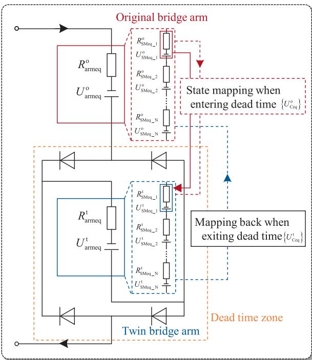  
Fig. 9. Schematic diagram of twin mapping.

time effect: 1) the freewheeling behavior of each submodule needs to be captured; and 2) the output voltage of the equivalent circuit should match the original one.

To invoke the low-level interpolation function in commercial simulation tools such as PSCAD/EMTDC and MATLAB/SIMULINK, calling the library diode component is the only way. Fig. 8 (a) shows the diodes called inside the submodule. This method is widely used in detailed models, but the submodule cannot be further equivalent and integrated into an overall Thevenin pattern because the submodule structure is split by library diode components. Fig. 8 (b) shows that a diode-H-bridge is called outside the submodule with the IGBT/diode assembly equivalent to two-value resistors. In this form, the submodule can be equivalent to its Thevenin pattern, and the interpolation function is retained.

If a bunch of submodules enter the dead-time at the same time, as they share the same arm current (or say, submodule input current), a common diode-H-bridge is capable of taking over all the behaviors of the submodule diodes. Therefore, a comprehensive “dead-time zone” can be constructed. when a submodule enters the dead-time, it is transferred into the “dead-time zone”.

Following the idea, the twin mapping method is proposed. It employs a twin bridge-arm nested in a diode-H-bridge, forming a “dead-time zone”, which contains the same number of submodules as the original bridge-arm and is connected in series with the original one. All submodules entering dead-time are transferred to the twin bridge-arm to utilize the features of the diode-H-bridge simultaneously. The modified model is shown in Fig. 9, where $R _ { \mathrm { S M e q } , i } ^ { 0 }$ and $R _ { \mathrm { S M e q } , i } ^ { \mathrm { t } }$ are the equivalent resistances of the original and twinning submodules.

When a submodule operates normally, it is simulated by the sub module model in the original bridge-arm. Upon entering the dead-time, its capacitor state is mapped to the twin submodule, and the dead-time characteristics continue two be simulated by the twin submodule model. This twin mapping process allows submodules to switch individually between normal operation and dead-time states, even in the Thevenin equivalent model.

# 3.3. Theoretical basis of twin mapping

The twin mapping method relies on transitioning the submodule

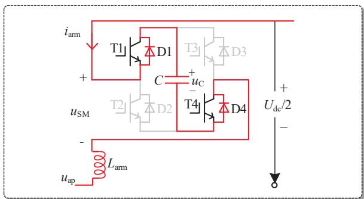  
Fig. 10. Current path when FBSM is positively engaged.

states. Here, state-space analysis is used to determine which variables to transition. When the FBSM is in the positive engagement state, with T1 and T4 turned on and T2 and T3 turned off, and the bridge-arm current $i _ { \mathrm { a r m } } > 0 ,$ the output voltage is +uC. The current flow path in this state is shown in Fig. 10.

According to the Kirchhoff's laws of voltage and current, the circuit equations of the FBSM are as follows:

$$
\left\{ \begin{array}{c} L _ {\mathrm {S}} \frac {\mathrm {d} i _ {\mathrm {a r m}} (t)}{\mathrm {d} t} = - 2 R _ {\mathrm {o n}} i _ {\mathrm {a r m}} (t) - u _ {\mathrm {C}} (t) - u _ {\mathrm {a p}} (t) + \frac {u _ {\mathrm {d c}} (t)}{2} \\ C \frac {\mathrm {d} u _ {\mathrm {C}} (t)}{\mathrm {d} t} = i _ {\mathrm {a r m}} (t) \\ u _ {\mathrm {S M}} (t) = 2 R _ {\mathrm {o n}} i _ {\mathrm {a r m}} (t) + u _ {\mathrm {C}} (t) \end{array} \right. \tag {6}
$$

where $L _ { S }$ is the equivalent inductance value of the bridge-arm.

Define the state variable vector x(t), input vector u(t), and output vector y(t) as follows:

$$
\boldsymbol {x} (t) = \left[ \begin{array}{l} i _ {\mathrm {a r m}} (t) \\ u _ {\mathrm {C}} (t) \end{array} \right] \boldsymbol {y} (t) = \left[ u _ {\mathrm {S M}} (t) \right], \boldsymbol {u} (t) = \left[ \begin{array}{l} \frac {u _ {\mathrm {d c}} (t)}{2} \\ u _ {\mathrm {a p}} (t) \end{array} \right] \tag {7}
$$

Substitute (7) into (6) and obtain the state-space equation of the FBSM:

$$
\left\{ \begin{array}{c} {\left[ \begin{array}{l l} L _ {\mathrm {S}} & 0 \\ 0 & C \end{array} \right] \frac {\mathrm {d}}{\mathrm {d} t} \boldsymbol {x} (t) = \left[ \begin{array}{c c} - 2 R _ {\mathrm {o n}} & - 1 \\ 1 & 0 \end{array} \right] \boldsymbol {x} (t) + \left[ \begin{array}{c c} 1 & - 1 \\ 0 & 0 \end{array} \right] \boldsymbol {u} (t)} \\ \boldsymbol {y} (t) = [ 2 R _ {\mathrm {o n}} \quad 1 ] \boldsymbol {x} (t) \end{array} \right. \tag {8}
$$

Denote:

$$
\left\{ \begin{array}{l} \boldsymbol {K} = \left[ \begin{array}{c c} L _ {\mathrm {S}} & 0 \\ 0 & C \end{array} \right], \boldsymbol {A} _ {1} = \left[ \begin{array}{c c} - 2 R _ {\mathrm {o n}} & - 1 \\ 1 & 0 \end{array} \right] \\ \boldsymbol {B} _ {1} = \left[ \begin{array}{c c} 1 & - 1 \\ 0 & 0 \end{array} \right], \boldsymbol {C} _ {1} = \left[ \begin{array}{c c} 2 R _ {\mathrm {o n}} & 1 \end{array} \right] \end{array} \right. \tag {9}
$$

Eq. (8) is simplified as:

$$
\left\{ \begin{array}{c} \boldsymbol {K} \frac {\mathrm {d}}{\mathrm {d} t} \boldsymbol {x} (t) = \boldsymbol {A} _ {1} \boldsymbol {x} (t) + \boldsymbol {B} _ {1} \boldsymbol {u} (t) \\ \boldsymbol {y} (t) = \boldsymbol {C} _ {1} \boldsymbol {x} (t) \end{array} \right. \tag {10}
$$

Similarly, the state-space expressions when the submodule is negatively engaged and bypassed are:

$$
\left\{ \begin{array}{c} K \frac {\mathrm {d}}{\mathrm {d} t} \boldsymbol {x} (t) = \boldsymbol {A} _ {2} \boldsymbol {x} (t) + \boldsymbol {B} _ {2} \boldsymbol {u} (t) \\ \boldsymbol {y} (t) = \boldsymbol {C} _ {2} \boldsymbol {x} (t) \end{array} \right. \tag {11}
$$

$$
\left\{ \begin{array}{c} \boldsymbol {K} \frac {\mathrm {d}}{\mathrm {d} t} \boldsymbol {x} (t) = \boldsymbol {A} _ {3} \boldsymbol {x} (t) + \boldsymbol {B} _ {3} \boldsymbol {u} (t) \\ \boldsymbol {y} (t) = \boldsymbol {C} _ {3} \boldsymbol {x} (t) \end{array} \right. \tag {12}
$$

where matrices $A _ { 2 } , B _ { 2 } , C _ { 2 } , A _ { 3 } , B _ { 3 }$ and $c _ { 3 }$ are as follows:

$$
\left\{ \begin{array}{l} \boldsymbol {A} _ {2} = \left[ \begin{array}{c c} - 2 R _ {\mathrm {o n}} & 1 \\ - 1 & 0 \end{array} \right], \boldsymbol {B} _ {2} = \left[ \begin{array}{c c} 1 & - 1 \\ 0 & 0 \end{array} \right], \boldsymbol {C} _ {2} = \left[ \begin{array}{c c} 2 R _ {\mathrm {o n}} & - 1 \end{array} \right] \\ \boldsymbol {A} _ {3} = \left[ \begin{array}{c c} - 2 R _ {\mathrm {o n}} & 0 \\ 0 & 0 \end{array} \right], \boldsymbol {B} _ {3} = \left[ \begin{array}{c c} 1 & - 1 \\ 0 & 0 \end{array} \right], \boldsymbol {C} _ {3} = \left[ \begin{array}{c c} 2 R _ {\mathrm {o n}} & 0 \end{array} \right] \end{array} \right. \tag {13}
$$

Define the switching function G(t):

$$
\boldsymbol {G} (t) = \left[ \begin{array}{l l l} g _ {1} (t) & g _ {2} (t) & g _ {3} (t) \end{array} \right] \tag {14}
$$

$$
g _ {i} (t) = \left\{ \begin{array}{l} 1, \text {s u b m o d u l e i s i n t h e} i ^ {\text {t h}} \text {s t a t e} \\ 0, \text {s u b m o d u l e n o t i n t h e} i ^ {\text {t h}} \text {s t a t e} \end{array} \right. \tag {15}
$$

where the 1st, 2nd and 3rd states represent the positive engagement state, negative engagement state and bypass state, respectively.

Combine (10)-(15), and the holistic state-space expression of the FBSM is obtained:

blue (16)

The coefficient matrices in (16) is the summation of the three states:

$$
\begin{array}{l} \boldsymbol {A} _ {\text {a l l}} (t) = \mathbf {g} _ {1} (t) \boldsymbol {A} _ {1} + \mathbf {g} _ {2} (t) \boldsymbol {A} _ {2} + \mathbf {g} _ {3} (t) \boldsymbol {A} _ {3} \\ = \left[ \begin{array}{c c} - 2 R _ {\text {o n}} & - g _ {1} (t) + g _ {2} (t) \\ g _ {1} (t) - g _ {2} (t) & 0 \end{array} \right] \tag {17} \\ \end{array}
$$

$$
\begin{array}{l} \boldsymbol {B} _ {\text {a l l}} = \boldsymbol {g} _ {1} (t) \boldsymbol {B} _ {1} + \boldsymbol {g} _ {2} (t) \boldsymbol {B} _ {2} + \boldsymbol {g} _ {3} (t) \boldsymbol {B} _ {3} \\ = \left[ \begin{array}{l l} 1 & - 1 \\ 0 & 0 \end{array} \right] \tag {18} \\ \end{array}
$$

$$
\begin{array}{l} \boldsymbol {C} _ {\text {a l l}} (t) = \boldsymbol {g} _ {1} (t) \boldsymbol {C} _ {1} + \boldsymbol {g} _ {2} (t) \boldsymbol {C} _ {2} + \boldsymbol {g} _ {3} (t) \boldsymbol {C} _ {3} \tag {19} \\ = \left[ \begin{array}{l l} 2 R _ {\text {o n}} & g _ {1} (t) - g _ {2} (t) \end{array} \right] \\ \end{array}
$$

For the HBSM, (16) still holds true, but the coefficient matrices within it change as described below (HBSM does not have negative engagement state):

$$
\left\{ \begin{array}{c} \boldsymbol {A} _ {\text {a l l}} ^ {\mathrm {H B}} (t) = g _ {1} ^ {\mathrm {H B}} (t) \boldsymbol {A} _ {1} ^ {\mathrm {H B}} + g _ {2} ^ {\mathrm {H B}} (t) \boldsymbol {A} _ {2} ^ {\mathrm {H B}} \\ = \left[ \begin{array}{c c} - R _ {\text {o n}} & - g _ {1} ^ {\mathrm {H B}} (t) \\ g _ {1} ^ {\mathrm {H B}} (t) & 0 \end{array} \right] \\ \boldsymbol {B} _ {\text {a l l}} ^ {\mathrm {H B}} = g _ {1} ^ {\mathrm {H B}} (t) \boldsymbol {B} _ {1} ^ {\mathrm {H B}} + g _ {2} ^ {\mathrm {H B}} (t) \boldsymbol {B} _ {2} ^ {\mathrm {H B}} = \left[ \begin{array}{c c} 1 & - 1 \\ 0 & 0 \end{array} \right] \\ \boldsymbol {C} _ {\text {a l l}} ^ {\mathrm {H B}} = g _ {1} ^ {\mathrm {H B}} (t) \boldsymbol {C} _ {1} ^ {\mathrm {H B}} + g _ {2} ^ {\mathrm {H B}} (t) \boldsymbol {C} _ {2} ^ {\mathrm {H B}} = \left[ \begin{array}{l l} R _ {\text {o n}} & g _ {1} ^ {\mathrm {H B}} (t) \end{array} \right] \end{array} \right. \tag {20}
$$

In order to fully transition the state, the state-space equations of both submodules must be completely consistent. Eq. (16) indicates that the state of a submodule is composed of four parts.

Part I: input quantities. Input variable $\pmb { u } ( t ) = [ 0 . 5 u _ { \mathrm { d c } } ( t ) u _ { \mathrm { a } } ( t ) ]$ represents the electrical quantity transmitted from the same external system. They are always equal.

Part II: coefficient matrices. ${ \pmb A } _ { \mathrm { a l l } } ( t ) , { \pmb B } _ { \mathrm { a l l } } ( t )$ and $C _ { \mathrm { a l l } } ( t )$ represent the operational state of the submodule, indicating that the trigger signals should be transitioned.

Part III: state variables. ${ \pmb x } ( t ) = [ i _ { \mathrm { a r m } } ( t ) u _ { \mathrm { C } } ( t ) ]$ . When transitioning, the original and twin submodules are connected in cascade and share the same operational state, ensuring that $i _ { \mathrm { a r m } }$ of both submodules are equal. uC(t) is a response of the system excitations and cannot be directly transitioned. Given the discretization of the capacitor, $u _ { \mathrm { C } } ( t )$ is determined by the equivalent voltage source $U _ { \mathrm { C e q } } ( t ) { \mathrm { : } }$

$$
\begin{array}{l} u _ {\mathrm {C}} (t) = i _ {\mathrm {C}} (t) R _ {\mathrm {C e q}} + U _ {\mathrm {C e q}} (t) \tag {21} \\ = \left[ g _ {1} (t) - g _ {2} (t) \right] i _ {\text {a r m}} (t) + U _ {\mathrm {C e q}} (t) \\ \end{array}
$$

Consequently, $U _ { \mathrm { C e q } } ( t )$ should be transitioned to reflect the state of

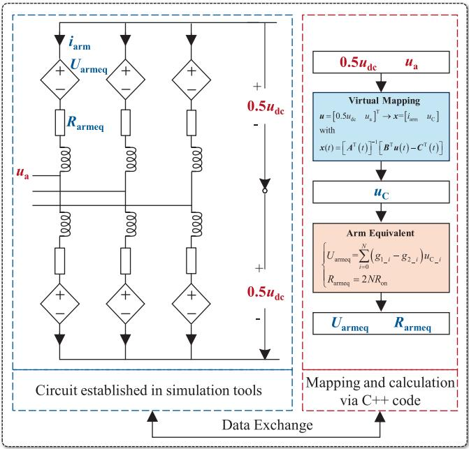  
Fig. 11. State-space equivalent circuit of the hybrid MMC.

uC(t).

Part IV: output quantities. y(t) is determined by $C _ { \mathrm { a l l } } ( t )$ and x(t), automatically satisfying the demand for equality.

Additionally, it is worthing mentioning that (16) also yields the statespace equivalent model of the hybrid MMC, as shown in Fig. 11.

By integrating both sides of (16)-①, we can obtain:

$$
\boldsymbol {x} (t) = \boldsymbol {x} (t - \Delta t) + \int_ {t - \Delta t} ^ {t} \boldsymbol {A} _ {\text {a l l}} (t) \boldsymbol {x} (t) + \boldsymbol {B} _ {\text {a l l}} \boldsymbol {u} (t) d t \tag {22}
$$

Reorganize (22):

$$
\boldsymbol {x} (t) = \left[ \boldsymbol {A} ^ {\mathrm {T}} (t) \right] ^ {- 1} \left[ \boldsymbol {B} ^ {\mathrm {T}} \boldsymbol {u} (t) - \boldsymbol {C} ^ {\mathrm {T}} (t) \right] \tag {23}
$$

in which the superscript $^ { \circ \circ } \mathrm { T } ^ { \prime \prime }$ indicates the trapezoidal integration method, and coefficient matrices $\pmb { A } ^ { \mathrm { T } } - \pmb { C } ^ { \mathrm { T } }$ are as follows:

$$
\left\{ \begin{array}{c} \boldsymbol {A} ^ {\mathrm {T}} (t) = \frac {\Delta t}{2} \boldsymbol {A} _ {\text {a l l}} (t) - \boldsymbol {E}, \boldsymbol {E} = \left[ \begin{array}{l l} 1 & 0 \\ 0 & 1 \end{array} \right] \\ \boldsymbol {B} ^ {\mathrm {T}} = \frac {\Delta t}{2} \boldsymbol {B} _ {\text {a l l}} \\ \boldsymbol {C} ^ {\mathrm {T}} (t) = [ \boldsymbol {E} + \boldsymbol {A} ^ {\mathrm {T}} (t - \Delta t) ] \boldsymbol {x} (t - \Delta t) + \boldsymbol {B} ^ {\mathrm {T}} \boldsymbol {u} (t - \Delta t) \end{array} \right. \tag {24}
$$

The equivalent model is composed of the circuit established in the simulation software and the calculation program by C++ code. It is noted that Fig. 11 only illustrates the situation in the upper arm of phase A. The situations are the same in other bridge-arms. With the simulation processes, u(t) is calculated by the simulation tool and is transitioned to the $\mathrm { C } { + } { + }$ program to generate x(t). x(t) is subsequently transformed into the equivalent quantities $U _ { \mathrm { a r m e q } }$ and $R _ { \mathrm { a r m e q } } .$ . They are finally transferred back for the circuit solution in the next simulation step. In this paper, the state-space model is added to the model comparison to evaluate the proposed model.

# 4. Validation

The detailed model (DM) composed of PSCAD/EMTDC library components, state-space model (SSM) and the proposed Thevenin equivalent model (EM) are established to carry out simulation validation. The model configuration is shown in Table 2.

Table 2 Model configuration.   

<table><tr><td>Symbols</td><td>Parameter Description</td><td>Value</td></tr><tr><td>Ts</td><td>Simulation duration period (s)</td><td>4.0</td></tr><tr><td>delt</td><td>The iteration step of the simulation (μs)</td><td>1.0</td></tr><tr><td>dt</td><td>Dead-time (μs)</td><td>2.0</td></tr><tr><td>NHBSM</td><td>Number of HBSM per arm</td><td>30</td></tr><tr><td>NFBSM</td><td>Number of FBSM per arm</td><td>30</td></tr><tr><td>VL-Lsys</td><td>Line-to-line RMS voltage on AC grid side (kV)</td><td>534</td></tr><tr><td>VL-Lval</td><td>Line-to-line RMS voltage on valve side (kV)</td><td>225</td></tr><tr><td>Str</td><td>Rated capacity of AC transformer (MVA)</td><td>250</td></tr><tr><td>UC</td><td>Rated submodule capacitor voltage (kV)</td><td>10</td></tr><tr><td>Udc</td><td>Rated DC voltage (kV)</td><td>±200</td></tr><tr><td>C</td><td>Submodule capacitance (μF)</td><td>20,000</td></tr><tr><td>Larm</td><td>Bridge-arm inductance (mH)</td><td>89</td></tr></table>

# 4.1. Steady state

In Fig. 12, at $t = 0 . 2 s ,$ the hybrid MMC finishes the uncontrolled charging and is deblocked. It is observed that the EM accurately reflects the abrupt voltage and current changes, while SSM fails to capture the voltage transient, and the current spikes and oscillations are deteriorated.

Fig. 13 indicates that both EM and SSM can effectively capture the voltage spikes and notches caused by dead-time, with the amplitudes of these spikes and notches aligning with those observed in DM. Therefore, they can be regarded as efficient models for the analysis of dead-time characteristics.

# 4.2. Transients

At t = 1.5 s, a bipolar short-circuit fault occurs. Rather than blocking the hybrid MMC, a non-blocking fault ride-through strategy is employed. As shown in Fig. 14, even if DC voltage drops to 0, the deadtime continues to impact the DC voltage. Both the EM and SSM accurately reflect the fault dynamics of the DC and arm voltage.

As shown in Fig. 15 and Fig. 16, when fault occurs and clears, the EM captures the fast transients with maximum relative error of 0.4%

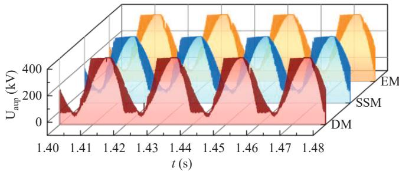  
Fig. 13. Upper arm voltage of phase A.

(FBSM), 0.21% (HBSM) and 0.15% (FBSM), 0.19% (HBSM). Although SSM has similar system-level characteristics (DC voltage $U _ { \mathrm { d c } } ,$ are voltage $U _ { \mathrm { a u p } } ,$ etc.) as DM in steady state, during the transient, SSM merely trends toward the DM, yet their results diverge markedly.

As in Fig. 17, the active power drops rapidly when the fault occurs. The reactive power remains − 300 MVA during fault. The EM and keeps up with DM accurately.

Simulations in this section demonstrate that SSM maintains high system-level accuracy under steady-state conditions, accurately representing DC voltage/current, arm voltage, active/reactive power, etc., while exhibiting noticeable deviation in module-level quantities such as submodule voltage. Under transient conditions, even system-level parameters (e.g., active/reactive power) display non-negligible errors.

In contrast, EM delivers consistently high fidelity for both system-

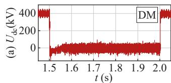

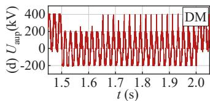  
Fig. 14. Transient voltages: (a)~(c) DC voltage; (d)~(f) upper arm voltage of phase A.

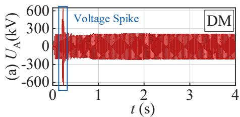

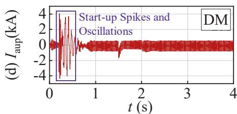

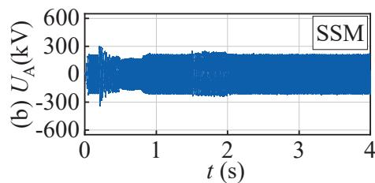

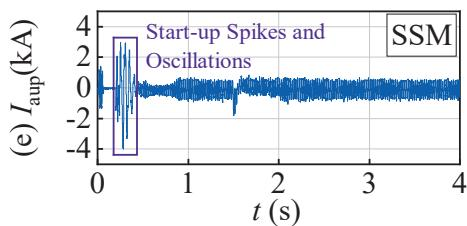

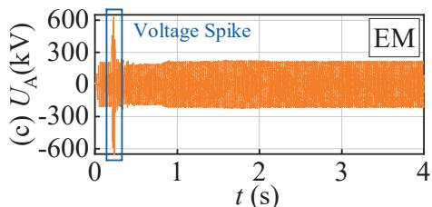

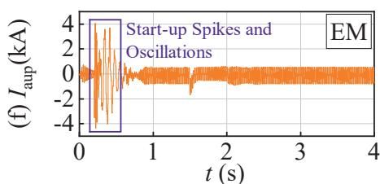  
Fig. 12. Steady state voltage and current: (a)~(c) line to line voltage of phase A; (d)~(f) upper arm current of phase A.

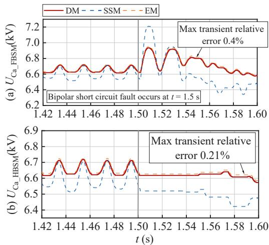  
Fig. 15. Submodule voltages when fault occurs: (a) FBSM; (b) HBSM.

and module-level variables across diverse steady-state and transient scenarios, with simulation error below 1%, thereby serving as a credible surrogate for the DM in further investigations.

# 4.3. High-level steady-state and transient results

To demonstrate the high-level simulation capability of the proposed EM, a 200-level hybrid MMC system comprising 100 HBSMs and 100 FBSMs is constructed; the steady-state and transient results are presented in Fig. 18 and Fig. 19, respectively.

Fig. 18 confirms that both EM and SSM remain numerically stable over long steady-state windows without divergence. In Fig. 18(a)(b), SSM exhibits larger submodule-capacitor voltage ripples, indicating that its averaging may delay control tracking and amplify capacitor swings under identical external conditions. Fig. 18(c)(e) show that each model preserves constant DC voltage and captures the random spikes induced by dead-time. Fig. 18(d)(f) reveal discrepancies in arm voltage and modulation index between EM and SSM, underscoring their inherent differences in primary-system behaviors.

During the fault transient, Fig. 19(a)(b) indicate that the active and reactive power trajectories of EM and SSM converge closely, and the SSM deviation is smaller than in the 30 HBSM + 30 FBSM case, implying that the averaging error is partially mitigated by the increased submodule count. Nevertheless, the higher-amplitude reactive-power

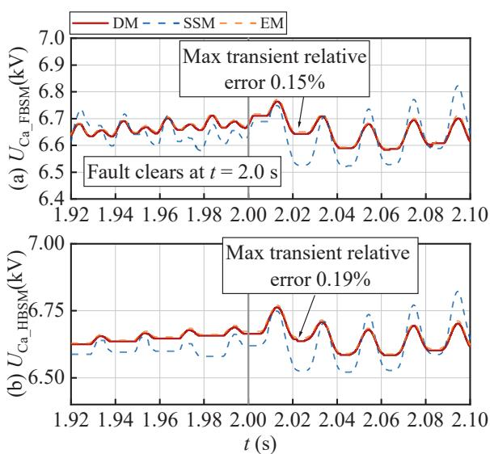  
Fig. 16. Submodule voltages when fault clears: (a) FBSM; (b) HBSM.

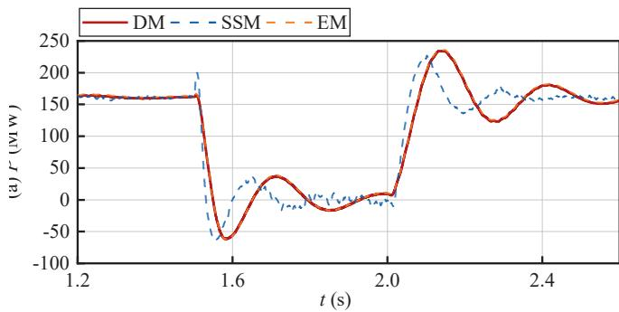

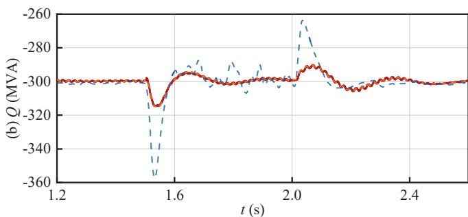  
Fig. 17. Power: (a) active power; (b) reactive power.

oscillation exhibited by SSM confirms residual transient inaccuracy. Fig. 19(c)(d) reveal enlarged ripple in submodule capacitor voltages. Although the DC voltage in Fig. 19(f) coincides with that of EM, its faultinterval ripple is amplified, and the DC current response in Fig. 19(e) is likewise distorted.

The simulations in Sections 4.2–4.3 establish that EM attains high accuracy: across all operating points it reproduces the stochastic voltage spikes induced by dead-time and matches DM at both system and submodule levels. SSM also captures dead-time effects and retains acceptable system-level steady-state accuracy, yet exhibits appreciable deviation in submodule quantities and during transients.

# 4.4. Speedup capability

The DM, EM and SSM of the hybrid MMC models with 20 to 500 submodules per arm are established in PSCAD/EMTDC. The simulation

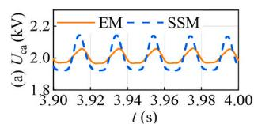

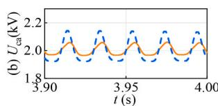

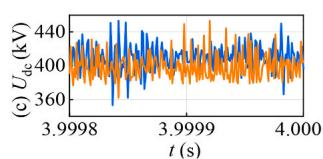

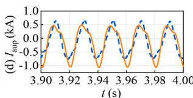

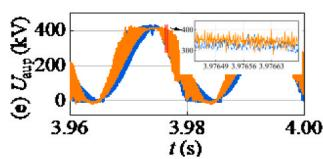

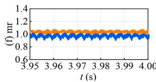  
Fig. 18. Steady-state simulation results of 100 HBSM + 100 FBSM system: (a) voltage of the first FBSM submodule of phase A; (b) voltage of the first HBSM submodule of phase A; (c) detailed DC voltage; (d) Arm current of the upper arm of phase A; (e) Arm voltage of the upper arm of phase A; (f) modulation ratio (mr).

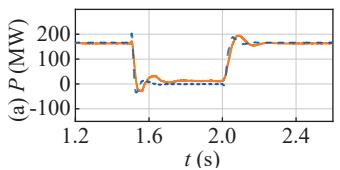

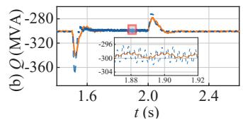

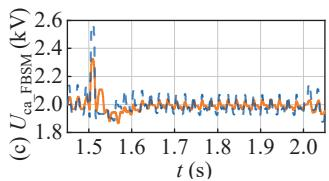

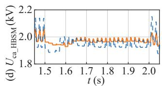

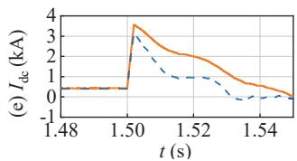

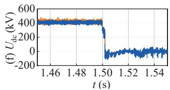  
Fig. 19. Transient simulation results of 100 HBSM + 100 FBSM system: (a) active power; (b) reactive power; (c) voltage of the first FBSM submodule of phase A; (d) voltage of the first HBSM submodule of phase A; (e) DC current when fault occurs; (e) DC voltage when fault occurs.

time-step is set to 10 μs and the duration is 6 s. The CPU is Intel(R) Core (TM) i9-10900 K @ 3.70 GHz. The CPU time is recorded by the PSCAD/ EMTDC built-in function. The speedup factors are defined as:

$$
F _ {1} = \frac {t _ {\mathrm {D M}}}{t _ {\mathrm {S S M}}}, F _ {2} = \frac {t _ {\mathrm {D M}}}{t _ {\mathrm {E M}}} \tag {25}
$$

where tDM, tSSM and tEM are the CPU times.

According to Table 3, both the EM and SSM achieve significant simulation acceleration while retaining a detailed dynamic characteristic of the dead-time. When the submodule number is less than 200, SSM is faster than EM. But when simulating a high-level MMC (201, 501 levels), the EM achieves much more speedup effect with a simulation acceleration of over 30,000 times.

In conclusion, during both steady-state and transient conditions, the EM and SSM effectively capture the main dynamics of the hybrid MMC. The dead-time effect is also reflected in the EM and SSM, manifested as abrupt voltage spikes and notches in the DC voltage, arm voltage, and common-mode voltage. Additionally, the required simulation time is significantly reduced, making in-depth analysis of high-level MMCs feasible.

# 5. Conclusion

This paper proposes a dead-time effect modeling approach for the

modular multilevel converter (MMC). The causes and effects of deadtime are analyzed in detail. Additionally, a thorough operational state analysis is conducted to investigate the electrical behavior of full-bridge submodules (FBSMs) and half-bridge submodules (HBSMs), resulting in a dead-time equivalent model (EM) where a twin bridge-arm surrounded by a diode-H-bridge is added to each bridge-arm. The twin mapping method is introduced to transition the submodule states between the original arm and the twin arm, enabling the simulation of each submodule’s dead-time dynamics. Finally, the dead-time equivalent models—the Thevenin model enhanced by twin mapping and the state-space model (SSM)—are established in PSCAD/EMTDC.

The simulation results demonstrate that the proposed twin mapping method and the dead-time model can reflect the dead-time dynamics of the MMC system under steady-state and transient conditions. The voltage spikes and notches caused by dead-time are restored. Meanwhile, the proposed model achieves significant simulation acceleration, making the dead-time simulation of high-level MMC possible.

# Declaration of generative AI and AI-assisted technologies in the writing process

During the preparation of this work the authors used OpenAI o1- preview in order to polish the English writing. After using this tool, the authors reviewed and edited the content as needed and took full

Table 3 Speedup capability test.   

<table><tr><td rowspan="2">Num.of SM</td><td colspan="3">CPU Time (s)</td><td rowspan="2">F1</td><td rowspan="2">F2</td></tr><tr><td>DM</td><td>SSM</td><td>EM</td></tr><tr><td>10+10</td><td>180.05</td><td>38.59</td><td>81.91</td><td>4.67</td><td>2.20</td></tr><tr><td>20+20</td><td>2414.05</td><td>68.39</td><td>121.55</td><td>35.30</td><td>19.86</td></tr><tr><td>40+40</td><td>43158.44</td><td>136.08</td><td>190.53</td><td>317.15</td><td>226.52</td></tr><tr><td>80+80</td><td>93650.59</td><td>172.66</td><td>212.36</td><td>542.40</td><td>441.00</td></tr><tr><td>100+100</td><td>886950.96</td><td>424.34</td><td>225.59</td><td>2090.19</td><td>3931.69</td></tr><tr><td>250+250</td><td>14966986.58</td><td>2079.31</td><td>471.09</td><td>7198.05</td><td>31770.97</td></tr></table>

responsibility for the content of the published article.

# CRediT authorship contribution statement

Moke Feng: Writing – review & editing, Writing – original draft, Visualization, Validation, Supervision, Software, Resources, Project administration, Methodology, Investigation, Funding acquisition, Formal analysis, Data curation, Conceptualization. Jianzhong Xu: . Wenxia Sima: . Ming Yang: . Hang Jing: . Keying Pan: .

# Declaration of competing interest

The authors declare that they have no known competing financial interests or personal relationships that could have appeared to influence the work reported in this paper.

# Acknowledgement

This work was supported by China Postdoctoral Science Foundation under Grant 2023M740387.

# Appendix

The modal analysis of FBSM is shown in Fig. A1.

  
Fig. A1. Modal analysis of FBSM during dead-time.

# Data availability

No data was used for the research described in the article.

# References

[1] Malinowski M, Gopakumar K, Rodrigue J, Ṕerez MA. A survey on cascaded multilevel inverters. IEEE Trans Ind Electron 2010;57(7):2197–207.   
[2] Li X, et al. HVDC reactor reduction method based on virtual reactor fault current limiting control of MMC. IEEE Trans Ind Electron Dec. 2020;67(12):9991–10000.   
[3] An T, Tang GF, Wang WN. Research and application on multi-terminal and DC grids based on VSC-HVDC technology in China. High Voltage Jun. 2017;2(1):1–10.   
[4] An T, Zhou XX, Han CD, Wu YN, He ZY, Pang H, et al. A DC grid benchmark model for studies of interconnection of power systems. CSEE J Power and Energy Systems Dec. 2015;1(4):101–9.   
[5] Sima W, Yang Y, Sun P, Shi Y, Yuan T, Yang M, et al. Self-reporting microsensors inspired by noctiluca scintillans for small-defect positioning and electrical-stress visualization in polymers. Adv Mater 2024;36.   
[6] Ji K, Tang G, Pang H, Yang J. Impedance modeling and analysis of MMC-HVDC for offshore wind farm integration. IEEE Trans Power Del Jun. 2020;35(3):1488–501.   
[7] Chao C, et al. High-sensitivity differential protection for offshore wind farms collection line with MMC-HVDC transmission. IEEE Trans Power Del Jun. 2024;39 (3):1428–39.   
[8] Rojas CA, Kouro S, Perez MA, Echeverria J. DC–DC MMC for HVdc grid interface of utility-scale photovoltaic conversion systems. IEEE Trans Ind Electron Jan. 2018;65 (1):352–62.   
[9] Xu J, et al. Reliability modeling and redundancy design of hybrid MMC considering decoupled sub-module correlation. Int J Electr Power Energy Syst 2019;105:690–8.   
[10] Li R, Adam GP, Holliday D, Fletcher JE, Williams BW. Hybrid cascaded modular multilevel converter with DC fault ride-through capability for the HVDC transmission system. IEEE Trans Power Del Aug. 2015;30(4):1853–62.   
[11] Lin WX, Jovcic D, Nguefeu S, Saad H. Full-bridge MMC converter optimal design to HVDC operational requirements. IEEE Trans Power Del Jun. 2016;31(3):1342–50.   
[12] Trainer DR, Davidson CC, Oates CDM, Macleod NM, Critchley DR, Crookes RW. A new hybrid voltage sourced converter for hvdc power transmission. Presented at the CIGRE Meeting, Paris, France, 2010, p. B4_111.   
[13] Qin J, Saeedifard M, Rockhill A, Zhou R. Hybrid design of modular multilevel converters for hvdc systems based on various submodule circuits. IEEE Trans Power Del Feb. 2015;30(1):385–94.   
[14] Chen B, Chen Y, Tian C, Yuan J, Yao X. Analysis and suppression of circulating harmonic currents in a modular multilevel converter considering the impact of dead time. IEEE Trans Power Electron Jul. 2015;30(7):3542–52.   
[15] Liu H, Jiang D, Chen J, Zhang J, Pei X. Common-mode voltage reduction for MMC with consideration of dead zone and switching delay. IEEE Trans Power Electron   
[16] Ji Y, Yang Y, Zhou J, et al. Control strategies of mitigating dead-time effect on power converters: an overview. Electronics, 8(2), pp. 196-221.

[17] Kouro S, et al. Recent advances and industrial applications of multilevel converters. IEEE Trans Ind Electron Aug. 2010;57(8):2553–80.   
[18] Vijeh M, Rezanejad M, Samadaei E, Bertilsson K. A general review of multilevel inverters based on main submodules: structural point of view. IEEE Trans Power Electron Oct. 2019;34(10):9479–502.   
[19] Xin Z, Xiao F, Hu L, Wu W, Lou X, Guo C. A novel dead-time elimination method for voltage source multilevel converters. IEEE Trans Power Electron Feb. 2023;38 (2):1708–19.   
[20] Ben Brahim L. On the compensation of dead time and zero-current crossing for a PWM-inverter-controlled AC servo drive. IEEE Trans Ind Electron 2004;51(5): 1113–8.   
[21] Hwang SH, Kim JM. Dead time compensation method for voltage-fed PWM inverter. IEEE Trans Energy Convers Mar. 2010;25(1):1–10.   
[22] Choi JS, Yoo JY, Lim SW, Kim YS. Novel dead time minimization algorithm of the PWM inverter. Conf Rec IEEE Ind Appl Conf 34th IAS Annu Meeting 1999: 2188–93.   
[23] Yuan J, et al. An immune-algorithm-based dead-time elimination PWM control strategy in a single-phase inverter. IEEE Trans Power Electron Jul. 2015;30(7): 3964–75.   
[24] Lin Y-K, Lai Y-S. Dead-time elimination of PWM-controlled inverter/converter without separate power sources for current polarity detection circuit. IEEE Trans Ind Electron Jun. 2009;56(6):2121–7.   
[25] Yan Q, Zhao R, Yuan X, Ma W, He J. A DSOGI-FLL-based deadtime elimination PWM for three-phase power converters. IEEE Trans Power Electron Mar. 2019;34 (3):2805–18.   
[26] Han D, Zhou B, Peng FZ, Dwari S. Dead-time effect compensation of a 5-level ANPC WBG inverter for high power density aviation applications. In Proc. IEEE Energy Convers. Congr. Expo., 2020, pp. 6212–6217.   
[27] Sheng W, Ge Q. A novel seven-level ANPC converter topology and its commutating strategies. IEEE Trans Power Electron 2018;33(9):7496–509.   
[28] Zhao J, He X, Han Y, Chen Y, Zhao R. A novel PWM control method to eliminate the effect of dead time on the output waveform for hybrid clamped multilevel inverters. In Proc. IEEE 25th Annu. Appl. Power Electron. Conf. Expo.; 2010. p. 1534–1541.   
[29] Saad H, et al. Dynamic averaged and simplified models for mmc-based HVDC transmission systems. IEEE Trans Power Del Jul. 2013;28(3):1723–30.   
[30] Xu J, Gole AM, Zhao C. The use of averaged-value model of modular multilevel converter in DC grid. IEEE Trans Power Del Apr. 2015;30(2):519–28.   
[31] Xu J, Zhao C, Liu W, Guo C. Accelerated model of modular multilevel converters in PSCAD/EMTDC. IEEE Trans Power Del Jan. 2013;28(1):129–36.   
[32] Gnanarathna UN, Gole AM, Jayasinghe RP. Efficient modeling of modular multilevel HVDC converters (MMC) on electromagnetic transient simulation programs. IEEE Trans Power Del Jan. 2011;26(1):316–24.   
[33] Xu J, Zhao Y, Zhao C, Ding H. Unified high-speed EMT equivalent and implementation method of MMCs with single-port submodules. IEEE Trans Power Del Feb. 2019;34(1):42–52.