# Parallelization of EMT simulations for integration of inverter-based resources

M. Ouafi a , J. Mahseredjian b , J. Peralta c , H. Gras d , S. Denneti`ere a,* , B. Bruned a

a RTE, Jonage, France   
b Polytechnique Montr´eal   
c Chilean ISO   
d PGSTech, Montreal

# A R T I C L E I N F O

Keywords:

Electromagnetic Transient

Co-simulation

Parallel computations

multi-rate

FMI

IBR

# A B S T R A C T

This paper presents a co-simulation tool to link multiple instances of an electromagnetic transient (EMT) simulation tool for parallel and fast computations. The tool exploits the propagation delays of transmission lines and cables to create network decoupling into several smaller sub-networks. These sub-networks are solved in parallel without approximations. A multi-rate option is also incorporated, in which the sub-networks can use different numerical integration time-steps. The Functional Mock-up Interface (FMI) is used for creating the cosimulation interface between multiple instances according to a master-slave communication scheme and the data sharing method is implemented using low-level synchronization primitives called semaphores. The interfaces between each subnetwork are automatically initialized for time-domain simulations using load-flow results.

# I. Introduction

The study of modern large electrical networks requires the modeling of massive numbers of inverter-based resources (IBRs), such as wind turbines and photovoltaics. The focus of this paper is on the detailed circuit-based electromagnetic transient (EMT) modeling and simulation of power grids with renewable energy sources. Such accurate simulations are computationally intensive and require research for accelerated solutions with maintained accuracy. The reliability of simulation results is of paramount importance, since simulation tools are used in various analysis stages required for integrating renewable energy sources. These stages have impact on construction costs, operation, reliability and maintenance of power grids.

An important challenge with EMT simulations is the computation time with power electronics components used in renewable energy sources. It constitutes a barrier to the massive establishment of EMTtype simulation tools in the power system industry. Several solutions have been proposed in the past for fast parallel computations. Well established real-time and off-line applications [1–4] are capable to simulate in parallel, using the most common decoupling method, which is based on the exploitation of natural propagation delays in transmission line (or cable) models (TLMs). The matrix solver-based

approach presented in [4] uses TLM delays for parallelizing network equations only, while maintaining control system solutions in sequential mode. A co-simulation type approach is applied in [5] for exchanging network models through the cloud for simulating renewable energy sources.

It is also possible to cut networks at arbitrary locations when TLMs are not available, by using the compensation method [6,7] or state-space nodal analysis [8]. Such decoupling requires code changes in related EMT solvers, which is not the purpose of this paper.

In this paper, the purpose is to apply and test TLM based decoupling for solving in parallel complete subnetworks using the Functional Mockup Interface (FMI) standard [9]. The target is to accelerate the computations of clusters (subnetworks) of wind and photovoltaic parks integrated into large scale power grids. The subnetworks can be executed on separate cores with their network and control system equations. The co-simulation approach is applied to execute the computational tasks of subnetworks in parallel. In the co-simulation approach each EMT-type software instance executes its subnetwork on a separate core and shares history information at each time-point, through the decoupling TLMs. One or more decoupling TLMs can be used. The FMI standard is implemented for establishing the co-simulation and the communication process is developed with low-level synchronization primitives, called

# semaphores.

The presented approach is implemented in EMTP® [10], but in fact it can be also directly implemented in any other EMT-type simulation tool. Its main advantage resides in the fact that it does not require any modification in the actual EMT-type software code by using only DLL interfacing. Which is a distinctive contribution against other existing solutions.

This work is based on initial research conducted in [11–13], by adding several improvements in actual implementation. The improvements include a new double-buffer (second co-simulation bus) scheme that guarantees data integrity during communications, simplified code structure for better efficiency, and a new multi-rate capability. Various other coding improvements have been used to accelerate computations and to generalize the proposed scheme. The complete FMI implementation has been automated to allow the automatic parallelization of selected subnetworks.

It is the first time that the proposed (FMI based) parallelization approach is tested on such large network cases with massive integration of IBRs. There are several distinctive features in this paper. Large networks with several aggregated wind and solar parks are simulated. A detailed wind park with manufacturer model DLLs is also simulated and demonstrates new capabilities for such studies. The existing Chilian grid with massive integration of IBRs is simulated with the proposed approach and demonstrates new benchmarking. All simulations are automatically started and initialized from a load-flow solution. An iterative solver is used with parallelization for accurate computations with nonlinear models, such as IBR converter IGBTs. The applied IBR models include automatic initialization from load-flow solution, which significantly reduces computing times. Initialization is a key factor for achieving fast computations by minimizing simulation time during initialization.

The presented demonstrations deliver new benchmarks and contribute to knowledge on FMI based co-simulation performance for practical cases with IBRs.

This paper starts by presenting the co-simulation (parallelization) approach in Section II. It is then followed by the presentation of test results in Section III.

# II. Parallel co-simulation using FMI and semaphores

This paper is based on a parallel co-simulation environment using the Functional Mock-up Interface (FMI) standard [9]. In this standard, it is possible to interface two or more simulation tools in a co-simulation environment using a master-slave communication method. This paper shows that in an EMT-type tool it is possible to implement such co-simulation using external DLLs (dynamic link libraries) and without any intervention into the software engine (code). Two or more EMT-type software instances can communicate to solve large and decoupled networks.

The new global architecture used in this paper is presented in Fig. 1 for the parallel solution of two subnetworks separated by one or more delay-based TLMs. This paper uses an asynchronous communication scheme only. The delay-based TLMs create a bridge with subnetworks using left hand-side and right hand-side decoupled circuits. Each TLM has left and right Norton equivalents in which the current sources represent delay-based history terms.

There is a total of 8 DLLs for the sample case of two subnetworks (blue and green blocks):

1. Two Master Device DLLs, one for each subnetwork, contain the transmission line(s) left-side circuits.   
2. Two Master Link DLLs are used to communicate data with semaphores to the two subnetwork instances. In simple words it is related to sending data through memory buffers. Two buffers are used in this paper for avoiding data collision problems.

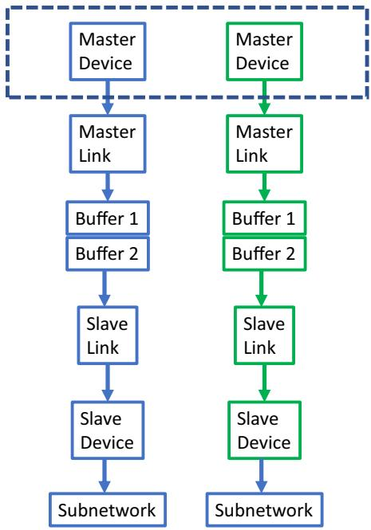  
Fig. 1. Co-simulation with two sub-networks (Slaves), in parallel with the Master.

3. Two Slave Link DLLs are used to communicate data on the two subnetwork sides.   
4. Two Slave Device DLLs are used for transmission line right-side circuits.

DLL templates are used to automatically generate all DLLs without user intervention. The programmed FMI packaging for starting separate software instances is also automatic. The implementation of Fig. 1 is software agnostic, which means that it can be easily adapted to other EMT-type software by changing the software calling procedures. In the current version the subnetworks are selected manually from the graphical user interface. Since the target for this research is the fast simulation of wind and photovoltaic parks (renewable energy sources, IBRs), it is also possible to automatically send all such tagged models onto separate processors. Each model is contained in a subnetwork (Slave subnetwork) with its own electrical circuits and control system blocks, and interfaced with the main grid (Master) through a delaybased TLM. Such TLMs are available by default in typical power systems, but if there is no line (or cable), then it is possible to automatically insert a stubline (single time-step delayed artificial line). In most cases, such a stubline does not cause significant errors.

The communication scheme with a subnetwork (Slave) is presented in Fig. 2. The co-simulation method is implemented with low-level synchronization primitives called semaphores [11–13]. They are used to solve concurrency problems where data is shared between multiple threads or processes during read/write operations on shared variables. Synchronization with semaphores is achieved with predefined functions Release and Wait, which can be used by any process or thread. Both master and slave instances manage one semaphore.

At t=0 the computations can start from the load-flow (steady-state) solution. The multiphase unbalanced load-flow solution is performed on the complete system without separation. Then it is automatically dispatched to the Master (main grid) and all subnetworks for automatic initialization. Automatic initialization is applied also in the IBRs with their control systems.

The master completes its current time-point and then passively waits for the Slave semaphore to be released. When the Slave instance completes its current time-point, it releases its semaphore. Data is exchanged through shared memory buffers (co-simulation buses). Asynchronous

Fig. 2. Communication scheme between Master and Slaves   

<table><tr><td>Time master</td><td>Master</td><td>Slave</td><td>Time slave</td></tr><tr><td>t=0</td><td>Steady-state solve
Start Slave
Release Slave</td><td>Not started</td><td>--</td></tr><tr><td>t=Δt</td><td>Solve
Write Buffer 1
Wait Slave
Release Slave</td><td>Steady-state solve
Wait for Master
Release Master</td><td>t=0</td></tr><tr><td>t=2Δt</td><td>Solve
Write Buffer 2
Wait Slave
Release Slave
Read Buffer 2</td><td>Solve
Wait Master
Read buffer 1
Write buffer 2
Release Master</td><td>t=Δt</td></tr><tr><td>t=3Δt</td><td>Solve
Write Buffer 1
Wait Slave
Release Slave
Read Buffer 1</td><td>Solve
Wait Master
Read buffer 2
Write buffer 1
Release Master</td><td>t=2Δt</td></tr></table>

communication requires double buffering (in this paper) in order to guarantee data integrity. By alternating writing and reading in the buffers at each time-point, it is ensured that data is indeed transmitted before being overwritten by a new write. The buffered information is on TLM history.

Other methods are available to lock memory access and prevent two instances from writing to the same memory location simultaneously, but this means adding a synchronization barrier and thus slowing down execution time. With the double buffer method presented in this paper, no barrier or security is necessary to protect data integrity. This method involves using two separate memory locations to store data. As long as one of the memory locations is in use, the other location can be modified without the risk of a write conflict. When the first location is ready to be read, the two locations are simply swapped, resulting in fast execution without compromising data reliability. We have decided to double the amount of memory instead of using a locking mechanism, as the cost of memory is negligible and has no impact on performance.

The system of Fig. 2 can be also used for the multi-rate version. A given renewable energy subnetwork may use, for example, a numerical integration time-step smaller than the main grid (Master). In this case, it may continue to solve from a given time-point, until the Master’s timestep is reached and to synchronize with the following time-point. There are no changes in data on the Master’s side during these computations. An integer subnetwork time-step multiplier is assumed.

# III. Test cases

The co-simulation tool described above is tested below on 4 test cases. The computation time gains (Speed-up) are based on single CPU usage. All simulations are started from a load-flow solution and reach stead-state rapidly despite the presence of IBRs with complicated circuits. Automatic initialization is used for IBRs from the given control settings. This initialization is a key factor for accelerating simulations.

Generic IBR models are used for all wind parks and photovoltaic (PV) parks, except when stated otherwise. The generic models are complete and complex with the inclusion of realistic control systems, protection systems, accurate generator model and transformers (park and inverter) with nonlinear magnetization modeling solved iteratively. The wind park models, for example, include near 2000 components.

Two computers are used in Windows 11 environment:

1. Computer 1 has 8 cores with 16 logical processors, 11th generation Intel i7-11800H @ 2.30GHz;   
2. Computer 2 has 64 cores with 128 logical processors, AMD Ryzen Threadripper PRO 5995WX @ 2.70GHz

# A. Test case Network-1

The first test case Network-1 shown in Fig. 3 is based on a realistic power system case (see [14]) for studying transients with integrated wind farms. Such a setup is also suitable for performing electromechanical transient analysis in addition to electromagnetic transients. The network contents are:

1. Aggregated wind parks (WPs): 2 full-converter (FC) and 2 DFIG. Each wind park is of 300 MVA. One of them (see (inside the red rectangle in Fig. 3), named WP_DFIG1, is modeled with a detailed converter including nonlinear IGBTs and requires a time-step $\Delta t = 1 0 \mu \mathrm { s } .$ . The others have an average-value model converter and can be accurately simulated with $\Delta t = 5 0 \mu \mathrm { s }$ .   
2. Transmission lines: 58 lines using the constant parameter model.   
3. Synchronous generators: 25 with governor and exciter controls, with saturation date when available.   
4. Transformers: 37, three-phase, with nonlinear magnetization branches.   
5. Loads: 105   
6. Total number of nodes: 791. The size of the solved modifiedaugmented-nodal analysis (MANA) matrix is 1244 × 1244.   
7. Control diagram blocks: 8016.

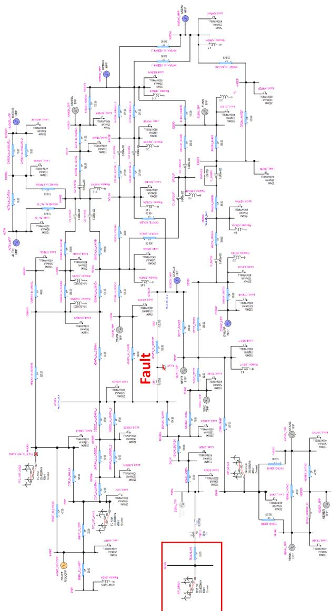  
Fig. 3. Simulated Network-1 in EMTP.

8. Test: 2-phase (a and b) to ground fault with line tripping at 2.25s at both ends.

The completion times of simulations are compared in TABLE I. The first case (Reference case) uses one CPU. In this case $\Delta t = 1 0 \mu \mathrm { s }$ due to the park with the detailed converter representation. The second case is performed using 2 CPUs. The wind park WP_DFIG1 is solved on a separate CPU with $\Delta t = 1 0 \mu \mathrm { s }$ when the rest of the grid is simulated using $\Delta t = 5 0 \mu \mathrm { s . } \mathrm { A }$ speed-up close to 5 times is achieved with 2 CPUs.

It is noted that since the presented FMI implementation is asynchronous, it was not possible to test in multi-rate mode on one core, but obviously the observed speed-up is mainly due to the usage of larger time-step in the solution of the grid part. If the grid is solved with $\Delta t =$ $1 0 \mu \mathrm { s } ,$ it requires 280 s as compared to 49 s with $\Delta t = 5 0 \mu \mathrm { s } ,$ , which results into a gain of 231 s (without WP_DFIG1) in computing time.

The simulation results of the first case are used as reference. Simulation accuracy using the presented two time-step solution is illustrated in Fig. 4, which shows the active power and the current of the park with detailed modeling. Despite the multi-rate approximation, a very good match is obtained for both signals.

# B. Test case Network-2

The case Network-2 (Fig. 5) represents a realistic system (see also [4, 14]) with the integration of 10 wind parks using detailed converter models. The network contents are:

1. Aggregated wind (farms, WFs) parks: 10, DFIG type, detailed converter models using detailed nonlinear IGBTs.   
2. Transmission lines: 58 three-phase lines using the constant parameter model.   
3. Synchronous generators: 72 with governor and exciter controls, with saturation data when available.   
4. Transformers: 202, three-phase, with nonlienar magnetization branches.   
5. Total number of nodes: 3611. The size of the MANA matrix is 5093 × 5093.   
6. Control diagram blocks: 15136.   
7. Test: phase-a-to-ground fault at 1s, line tripping at 1.58s after unsuccessful reclosing.

Each wind farm subnetwork is solved on a separate CPU. One instance solves the main network, and 10 other instances are used to solve the windfarm subnetworks. Ten stublines were added for this purpose. The computational performances are shown in TABLE II. A speed-up of more than 10 is achieved with 11 CPUs. Fig. 6 shows that a good accuracy is achieved despite the added ten stublines to decouple the network solution for parallel computing. Active power and current are measured at the connection point of wind park SB in Fig. 5.

To achieve further gains, it is also possible to simulate the master network in parallel using the decoupled sparse matrix approach of [4]. An extra CPU (the master has two CPUs) is added in TABLE II for the master network solution parallelization and achieves a gain of 14.4. Due to the fast performance of the master network, and available decoupling options, it was not possible to achieve further gains with more CPUs.

It is noticed that the above performance is achieved in the context of the iterative solver [10] required for the detailed/nonlinear IGBT

TABLE I Computing times, network-1 with Computer 1   

<table><tr><td>Simulation of 5 s</td><td>Time-step (μs)</td><td>Time (s)</td><td>Speed-up</td></tr><tr><td>Reference case (1 CPU)</td><td>10</td><td>714</td><td>1</td></tr><tr><td>Parallel version (2 CPUs)</td><td>10 for the WP and 50 for the Grid</td><td>150</td><td>4.76</td></tr></table>

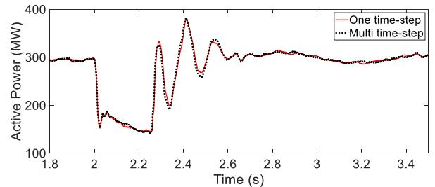

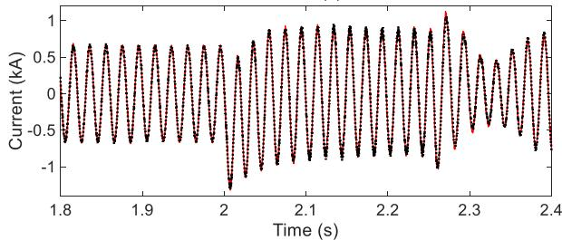  
Fig. 4. Active power (top), current (bottom) at the wind park WP_DFIG1 connection point, Network-1.

models. One advantage with parallelization is in the fact that the heavier numbers of iterations are confined to the smaller parallelized windfarm subnetworks and the number of iterations in the master network is also reduced.

# C. Test case Network-3

This test case, shown in Fig. 7, is the actual Saint-Nazaire wind park [15]. The objective is to simulate the detailed wind park without aggregation. Such simulations are required, for example, for studying park internal faults, protections, wind park power fluctuations; for accurate determination of fault right through capabilities and for wind park energization. The purpose here is also to demonstrate new capabilities for simulated complete wind parks. In fact, it is almost impossible to simulate such a system without parallel computing due to excessive computing times and memory allocation requirements on a single core.

The Saint-Nazaire wind park is composed of two sections of 240 MW. Each section includes 40 wind turbines, and each section has its own power plant controller. The 240MW section models are identical. Each wind turbine model is in a subcircuit connected to the wind park collector grid (33 kV) with a cable. Two step-up transformers are used to connect to the export grid of 225 kV.

In summary, the simulated grid is composed of:

1. 6MW Wind turbines: 40 models using manufacturer DLLs. Wind turbine converters are represented with detailed models. The manufacturer DLLs impose a fixed time step $\Delta { \mathfrak { t } } = 4 \mu { \mathrm { s } }$ .   
2. Transmission lines/cables: 40 lines using distributed line model (constant parameters).   
3. Transformers: 41, with nonlinear magnetization branches.   
4. Total number of nodes: 12353. The size of the MANA matrix is 18261 × 18261   
5. Control diagram blocks: 64491.   
6. Onshore grid: Thevenin equivalent.

Parallel computation performance is shown in TABLE III. Each wind turbine is simulated on a separate core using existing cables for task separation. 41 instances are run in parallel (40 wind turbines + the offshore and onshore grids). It is apparent from TABLE III, that a significant computational gain is achieved. In fact, the presented timing is close to the simulation timing of 1822 s for the aggregated version of this same wind park, which is an important achievement despite the penalizing numerical integration time-step.

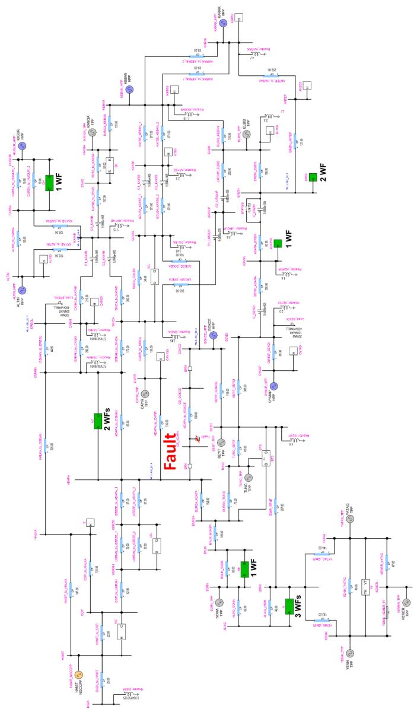  
Fig. 5. Simulated Network-2 in EMTP.

TABLE II Computing times, network-2 with Computer 1   

<table><tr><td>Simulation of 3 s, Δt = 10 μs</td><td>Time (s)</td><td>Speed-up</td></tr><tr><td>Reference case (1 CPU)</td><td>2340</td><td>1</td></tr><tr><td>Parallel version (11 CPUs)</td><td>219</td><td>10.7</td></tr><tr><td>Parallel version (12 CPUs)</td><td>162</td><td>14.4</td></tr></table>

# D. Test case Network-4

This test case is the actual Chilean power grid. The way the power grid is operated, and the market developed, is changing substantially in Chile due to the massive integration of Variable Renewable Energy (VRE) generation, and the goal to accelerate and ensure an efficient, secure and reliable energy transition is raising several challenges for the National Power Grid (NPG) and the wholesale energy markets (WEM). The penetration of VRE is increasing rapidly in Chile, having reached in 2021 levels of 22% in terms of energy, and 62% as instantaneous power peak at the hour of maximum variable renewable energy generation

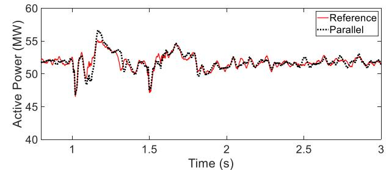

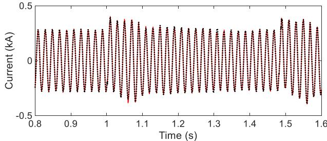  
Fig. 6. Active power (top), current (bottom) at one wind park connection point in the circuit identified as SB in Fig. 5, Network-2.

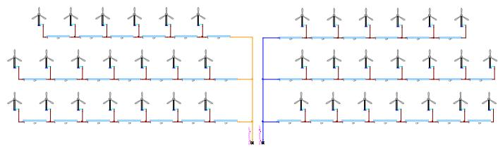  
Fig. 7. Detailed park model, Saint-Nazaire offshore wind park (partial view), Network-3.

TABLE III Computing times, Network-3 with Computer 2   

<table><tr><td>Simulation of 6.5 s, Δt = 4 μs</td><td>Time (s)</td><td>Speed-up</td></tr><tr><td>Reference case (1 CPU)</td><td>49672</td><td>1</td></tr><tr><td>Parallel version (41 CPUs)</td><td>2037</td><td>24.38</td></tr></table>

(maximum solar radiation). The VRE share is expected to reach 33% this year with an instantaneous peak participation of 68%, and this trend with much higher levels of VRE insertion is expected to continue and deepen in the coming years. In addition, the radial and extended topology of the main bulk grid (more than 3000 km long), along with the remote location of the VRE resources from the main load centers, make even more challenging to keep the NPG secure and stable.

The Chilean’s system operator (CEN-Coordinador Electrico Nacional) [16], a technical and independent entity in charge of the secure and economic operation of the National Power Grid (NPG), has defined as its corporate vision to contribute to the development of a sustainable power grid in Chile, which implies being facilitators of the transition to a 100% renewable energy system. For this reason, it has developed a roadmap to enable the decommissioning of fossil-fuel-based power plants and reaching a 100% share of renewable energies as of 2030 [17]. In order to make this accelerated energy transition scenario viable, it is necessary to meet the enabling conditions to prepare the grid to integrate new technologies, execute the necessary investments in renewable generation and storage, ensure a reliable supply of demand 24 hours a day, the 365 days of the year, and to implement the necessary regulatory changes to achieve such objective.

CEN has conducted system studies in phasor domain in order to assess the feasibility to integrate larger amount of VRE, 75% by 2025 and 100% by 2030 [18], considering the integration of new technologies

such battery energy storage (BESS) and grid-forming Inverter-Based Resources (IBRs). The results show the need to increase inertia and system strength to be able to reach such high levels of VRE in a reliable way. Additionally, the analysis demonstrated some inaccuracies in simulations due to the modeling issues which raises the need to model and simulate the system wide behavior in more advanced EMT-type of tools. The analysis will be a base for the preparation of technical specifications to incorporate synchronous condensers and, in future, grid-forming IBR-based technologies.

In addition, CEN has developed a procedure to facilitate model homologation and verification. I will facilitate the delivery of detailed EMT models by the market participants, to be incorporated into the digital twin of the NPG (EMT-NPG), currently under development by CEN [19]. CEN expects to use this EMT-NPG model to study the system stability and strength in a grid with very high levels of VRE, to test grid-forming IBR technologies and to develop new grid code requirements for VRE and storage technologies that will connect to the NPG in the future.

Modern system operators shall review, adapt and improve the planning methodologies and tools according to the new reality with a grid with a predominance of technologies based on power electronics. Therefore, CEN will continue performing detailed analyses of the system with greater frequency and accuracy, for which it requires new advanced operational tools and practices to support an increasingly complex operation of the power grid. The new tools and capabilities to be incorporated shall allow analyzing multiple scenarios and contingencies in short periods of time, with greater spatial and temporal granularity, managing and monitoring a large amount of data, models and information in real time, and under high uncertainty of the energy resources. It will be necessary to have new cutting-edge technologies and advanced modeling and simulation tools running in time domain (EMT environment) that allow representing in greater detail and more accurately the system behavior of a more complex and IBR dominated power grid.

Considering the above it was decided to develop a first complete model of the Chilean grid in EMTP®. The objective is to work on accelerated simulations for such a grid using the parallelization approach presented in this paper. Other techniques are being researched for this type of problem that will become more and more common.

The simulated Chilean grid is composed of:

1. Wind parks (WPs): 27, average value model   
2. Photovoltaic (PV) parks: 32, average value model   
3. Transmission lines/cables: 297 distributed line models (constant parameters) and 307 PI circuits.   
4. Transformers: 48, with nonlinear magnetization branches.   
5. Synchronous generators: 57 with governor and exciter controls, with saturation data when available.   
6. Total number of nodes: 6785. The size of the MANA matrix is 10664 × 10664   
7. Control diagram blocks: 57708.   
8. Test: fault applied at t=1s.

At this stage, only generic models have been used for wind and PV parks. All wind and PV farms are separated into subnetworks connected to the grid with TLMs. It was required to include a few stublines. Parallel computational performance is given in TABLE IVand TABLE V.

It is remarkable that even with single CPU usage, the presented numbers are acceptable for such a complex network.

Network decomposition strongly impacts simulation performance.

TABLE IV Computing times, Network-4 with Computer 1   

<table><tr><td>Δt=50 μs, 5 s simulation</td><td>Time (s)</td><td>Speed-up</td></tr><tr><td>Reference case (1 CPU)</td><td>604.35</td><td>1</td></tr><tr><td>Parallel solutions (16 CPUs)</td><td>302.09</td><td>2.00</td></tr></table>

TABLE V Computing times, Network-4 with Computer 2   

<table><tr><td>Δt=50 μs, 5 s simulation</td><td>Time (s)</td><td>Speed-up</td></tr><tr><td>Reference case (1 CPU)</td><td>620.55</td><td>1</td></tr><tr><td>Parallel solutions (10 CPUs)</td><td>496.13</td><td>1.25</td></tr><tr><td>Parallel solutions (20 CPUs)</td><td>392.73</td><td>1.58</td></tr><tr><td>Parallel solutions (30 CPUs)</td><td>288.22</td><td>2.15</td></tr><tr><td>Parallel solutions (40 CPUs)</td><td>195.87</td><td>3.16</td></tr><tr><td>Parallel solutions (50 CPUs)</td><td>102.14</td><td>6.07</td></tr><tr><td>Parallel solutions (56 CPUs)</td><td>74.4</td><td>8.34</td></tr><tr><td>Parallel solutions (60 CPUs)</td><td>65</td><td>9.55</td></tr></table>

The sharing of computational load between the cores of subnetworks remains an essential aspect and the gains in performance depend on the size and the models contained in the subnetworks. As can be seen in TABLE V, the most important speed-up is achieved with 60 CPUs where all IBR subnetworks are solved in parallel. In the other decompositions (10, 20, 30…) the main task, that requires the longer execution time, is the solution of the master network. When the master network includes IBRs, it creates disproportionate workload assigned to the master network compared to the subnetworks.

As expected, the balanced distribution of all IBR model tasks, achieves the best performance by equal distribution of the workload among the different CPUs and reduction of waiting times at each time-point solution.

As shown in Fig. 9, the acceleration of calculations is increasing even with large numbers of CPUs. This increase in performance is achieved because the communication time between CPUs is still shorter than the execution time on each CPU.

With 60 CPUs the largest individual computing times are those of wind parks with an average value of 12 s. The master network solution takes on average 17 s, the rest is spent in communication of data between master and slave cores at each time-point. It is noteworthy that for each TLM, 3 master and 3 slave signals must be communicated for a total of 360 (6*60) signals. In this case the automatic parallelization of the master network did not result in supplementary gains due to a limitative block and already highly efficient single-core performance.

A good match in simulation results is presented in Fig. 8 with 60 CPUs, although 16 stublines have been used for parallel decoupling.

# E. Analysis of results

The results obtained with parallel computing are in good agreement with those obtained with the single core solution (reference solution).

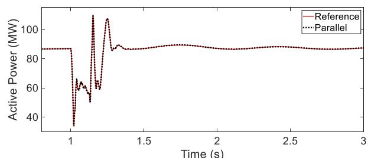

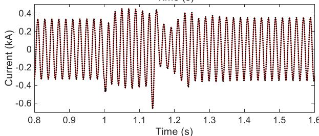  
Fig. 8. Active power (top), current (bottom) at one wind park connection point, Network-4.

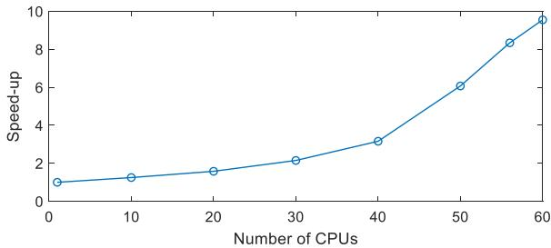  
Fig. 9. Speed-up as function of the number of CPUs, Network-4.

Stublines have been selected to limit as much as possible the impact on accuracy and to facilitate task separation.

Thanks to parallelization and mutli-rate solution, significant computational gains are achieved when simulating IBRs in parallel with the integrating grid. Such gains are achieved by parallelizing computationally demanding models, namely wind and PV parks.

The separation of subnetworks of IBRs for parallelization, is automatic, and can be performed without user intervention. In this work the focus was on the parallel solution of IBRs, but it is also possible to use TLMs to solve the actual grid portions in parallel and this can be done automatically (see [4], for example).

Further tests will be conducted, but it is already remarkable that significant gains can be achieved for huge practical grids using complex control systems with complex electrical networks that are solved using iterations [10], and without any user intervention for breaking algebraic loops in control block diagrams or adding fictitious network stabilization components.

It is also remarkable, that even with single CPU usage (without any parallelization), the presented performances remain very much acceptable for all cases with aggregated wind and PV parks. The increased speeds with new computer chips contribute to this aspect.

The startup from load-flow solution and achievement of quick steady-state even with complex IBR systems, is an absolute necessity for reaching the computational performances presented in this paper.

As shown in this paper, the acceleration of calculations also offers opportunities to use detailed wind park models while keeping reasonable calculation times.

Further research should help to develop automatic optimization methods based on test case content and topology. Moreover, advanced techniques (such as [7]) to split network solutions without time-step delay (stublines) will be tested in the simulation platform used in this research, to improve accuracy of the entire simulation.

# IV. Conclusion

This paper presented a parallel processing approach for the simulation of power system transients on grids with massive integration of renewable energy sources. The work presented in this paper is based on the Functional Mockup Interface for establishing a co-simulation environment where several instances of an EMT-type software can be executed in parallel. Main improvements include multi-rate capability, double-buffering for preserving data integrity, automatic initialization from load-flow solution including the IBR systems, and a generic implementation approach that could be applied in any EMT-type simulation tool.

The simulation of wind or PV parks on separate cores with their electrical networks and control systems, allows to achieve significant computing gains.

It has been shown that a multi-rate approach can be used for solving wind parks with smaller time-steps when required. Such a multi-rate approach remains sufficiently accurate and allows to achieve speed-up ratios greater than the number of CPUs.

It has been shown that using the proposed parallelization approach it

becomes possible to simulate detailed wind parks with computational speeds equivalent to their aggregated equivalents.

The simulation of the Chilean grid with 59 IBRs, demonstrates that it becomes possible to simulate such practical large systems within dramatically reduced computing times.

Above all, this paper presents research on improving EMT-type software performance with practical test case demonstrations.

# Credit Authors Statement

M. Ouafi: Implementation, J. Mahseredjian: theoritical approach and testing, J. Peralta: Provision of test case, H. Gras: testing and reviewing, S. Denneti`ere: Testing and reviewing, B. Bruned: Testing, reviewing and implementation

# Declaration of Competing Interest

The authors declare that they have no known competing financial interests or personal relationships that could have appeared to influence the work reported in this paper.

# Data availability

The authors do not have permission to share data.

# References

[1] P. Forsyth, R. Kuffel, Utility applications of a RTDS Simulator, in: Proc. Int. Power Engineering Conf, 2007, pp. 112–117.   
[2] V.Q. Do, J.-C. Soumagne, G. Sybille, G. Turmel, P. Giroux, G. Cloutier, S. Poulin, Hypersim, an integrated real-time simulator for power networks and control systems, Proc. ICDS’99 (May 1999) 1–6. Vasteras, Sweden.   
[3] R. Singh, A.M. Gole, P. Graham, J.C. Muller, R. Jayasinghe, B. Jayasekera, D. Muthumuni, Using Local Grid and Multi-core Computing in Electromagnetic Transients Simulation, in: Proc. Int. Conf. Power Syst. Transients (IPST), Vancouver, Canada, 2013.   
[4] A. Abusalah, O. Saad, J. Mahseredjian, U. Karaagac, I. Kocar, Accelerated Sparse Matrix-Based Computation of Electromagnetic Transients, IEEE Open Access Journal of Power and Energy 7 (2020) 13–21.   
[5] https://www.aemo.com.au/energy-systems/electricity/national-electricity-market -nem/participate-in-the-market/network-connections/connections-simulation-too.   
[6] B. Bruned, S. Denneti`ere, J. Michel, M. Schudel, J. Mahseredjian, N. Bracikowski, Compensation Method for parallel real-time EMT studies, Elect. Power Syst. Res. 198 (Sep. 2021).   
[7] B. Bruned, J. Mahseredjian, S. Denneti`ere, J. Michel, M. Schudel, N. Bracikowski, “Compensation Method for Parallel and Iterative Real-Time Simulation of Electromagnetic Transients”, IEEE Trans. on Power Delivery, DOI: 10.1109/ TPWRD.2023.3238422.   
[8] C. Dufour, J. Mahseredjian, J. B´elanger, A Combined State-Space Nodal Method for the Simulation of Power System Transients, IEEE Trans. on Power Delivery 26 (2) (April 2011) 928–935.   
[9] MODELISAR Consortium, Functional Mock-up Interface for Co-Simulation. ITEA 2, 2010, p. 07006.   
[10] J. Mahseredjian, S. Denneti`ere, L. Dub´e, B. Khodabakhchian, L. G´erin-Lajoie, On a new approach for the simulation of transients in power systems, Elect. Power Syst. Res 77 (11) (2007) 1514–1520.   
[11] X. Legrand, Outil de co-Simulation pour EMTP-RV, pr´esentation et application a` une ´etude EMTP/Simulink,” EDF R&D, Clamart, France, Internal technical report (2012). H-R26-2012-00810-FR.   
[12] S. Montplaisir-Gonçalves, J. Mahseredjian, O. Saad, X. Legrand, A. El-Akoulm, A Semaphore-based Parallelization of Networks for Electromagnetic Transients, in: Proc. Int. Conf. Power Syst. Transients (IPST), Cavtat, Croatia, 2015, pp. 1–6.   
[13] M. Cai, J. Mahseredjian, U. Karaagac, A. El-Akoum, X. Fu, Functional Mock-Up Interface Based Parallel Multistep Approach With Signal Correction for Electromagnetic Transients Simulations, IEEE Trans. Power Syst. 34 (3) (May 2019) 2482–2484.   
[14] A. Haddadi, J. Mahseredjian, Power system test cases for EMT-type simulation   
[15] Q. Piraud, X. M. Viel and J. Michel, “Harmonic studies performed by RTE for wind farm connection,” in Proc CIGRE Session, Paris, 2022, pp. 1-10.   
[16] Coordinador Electrico Nacional: www.coordinador.cl.

[17] Roadmap for an Accelerated Energy Transition: Vision of the Chilean System Operator, June 2022: www.coordinador.cl/wp-ontent/uploads/2022/11/9_Ingl es_digital_Informe_Coordinador_13.6.pdf.   
[18] Study of System Strength and Inertia, Coordinador Electrico Nacional, 2022. www. coordinador.cl/wp-content/uploads/2022/01/Informe-Estudio-Nivel-Iner cia-y-Cortocircuito-2022.pdf.

[19] Internal Procedure for Modeling and Homologation of Facilities in the NPG: www. coordinador.cl/wp-content/uploads/2022/08/Procedimiento-Modelacion-y-Homologacion-de-Instalaciones-del-SEN-Version-Definitva.pdf.