# Lightning-induced voltage analysis on a three-phase compact distribution line considering different line models

Alberto De Contia,⁎ , Osis E.S. Lealb,c , Alex C. Silvab

a LRC – Lightning Research Center / Department of Electrical Engineering, UFMG – Federal University of Minas Gerais, Av. Antônio Carlos, 6627, Pampulha, 31.270-901, Belo Horizonte, MG, Brazil   
b PPGEE – Graduate Program of Electrical Engineering, UFMG – Federal University of Minas Gerais, Av. Antônio Carlos, 6627, Pampulha, 31.270-901, Belo Horizonte, MG, Brazil   
c UTFPR – Federal University of Technology – Paraná, Via do Conhecimento, km 1, 85.503-390, Pato Branco, PR, Brazil

# A R T I C L E I N F O

# Keywords:

Lightning-induced voltages

Electromagnetic transients

Compact distribution lines

Transmission line models

# A B S T R A C T

This paper discusses the simulation of lightning-induced voltages on a three-phase compact distribution line considering either a first order finite-difference time-domain solution of telegrapher's equations or a version of Marti's transmission line model extended to include the influence of external electromagnetic fields, named EMD model. The validity of both models is first demonstrated by means of comparisons with lightning-induced voltages measured in rocket-triggered lightning experiments. It is then shown that the EMD model can be used in the simulation of lightning-induced voltages on compact distribution lines provided special attention is given to the model fitting in the modal domain, regardless if complex or real poles are used. Results obtained with the vector fitting technique are seen to be more reliable than those obtained using Bode's asymptotic method, which must be used with caution in the modeling of compact distribution lines. The obtained results are relevant because compact distribution lines contain both bare and covered conductors, which is likely to pose difficulties to the simulation of transients with transmission line models based on modal-domain theory.

# 1. Introduction

Several countries have been using compact distribution lines to reduce faults due to contact with tree branches, reduce clearances and increase the number of circuits sharing the same pole [1,2]. Fig. 1 illustrates a 15-kV class compact distribution line used in Brazil. A polymeric spacer holds the three phase conductors, labeled A, B, and C in Fig. 1, which are covered with an insulating layer that is usually made of cross-linked polyethylene (XLPE) or high-density polyethylene (HDPE) [3–5]. The spacer is supported by a bare steel cable, known as messenger (M), which is connected to the neutral conductor (N) at every grounding point.

Compact distribution lines such as the one of Fig. 1 have been experiencing a reduced number of outages compared to conventional lines installed in the same region [6]. This can be in part explained by the relative immunity of compact lines to high-impedance faults, but also by the increase of their impulse withstand voltage due to the use of covered conductors [3–5] and the reduction of lightning-induced overvoltage levels due to the shielding effect associated with the presence of two periodically-grounded conductors [7,8].

Despite the increasing use of compact distribution lines, the number of studies dedicated to characterize their transient performance is relatively scarce [7–10]. Recently, it was investigated whether the modaldomain transmission line model proposed by Marti [11] could be used for simulating transient phenomena on compact distribution lines [12]. This was motivated by the presence of both bare and covered conductors, which changes the per-unit-length parameters such that the application of this model could become unfavorable due to the larger variation of the associated eigenvectors. Despite such concern, it was shown that Marti's model is able to perform relatively well in the simulation of switching transients in compact distribution lines provided that special attention is given to the fitting of the model parameters [12]. However, it is not clear if similar results would be obtained for other types of transient phenomena.

This paper extends the analysis presented in Ref. [12] by investigating whether Marti's model can be successfully used in the calculation of lightning-induced voltages on a three-phase compact distribution line. For such, the solution method proposed in Ref. [13] is used. To check the validity of the results, a direct phase-domain solution of telegrapher's equations based on the finite-difference time-

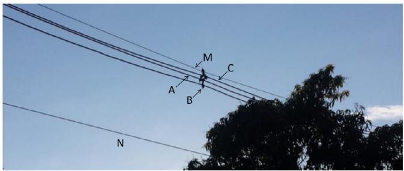  
Fig. 1. 15-kV class three-phase compact distribution line.

domain (FDTD) method is used as reference. This study is relevant because compact distribution lines are often subjected to lightning-induced voltages, and a reliable estimate of their lightning performance is only possible if accurate simulation tools are available.

This paper is organized as follows. Section 2 describes the main characteristics of the three-phase compact distribution line considered in this study. Section 3 presents the investigated models. The simulated cases are discussed in Section 4. Results and analyses are presented in Section $^ { 5 , }$ followed by conclusions in Section 6.

# 2. Three-phase compact distribution line data

The main characteristics of the three-phase compact distribution line of Fig. 1 are listed in Tables 1 and 2 [12]. The phase conductors are covered with an XLPE insulating layer with relative permittivity $\varepsilon _ { r } = 2 . 3$ , while the neutral and the messenger are bare.

# 3. Transmission line models

# 3.1. FDTD model

Telegrapher's equations describing the voltages and currents along an overhead line with N conductors above a finitely conducting ground in the presence of an external electromagnetic field can be written as [14, 15]

$$
\frac {\partial \mathbf {v} _ {s} (x , t)}{\partial x} + \boldsymbol {L} _ {e} \frac {\partial \boldsymbol {i} (x , t)}{\partial t} + \varsigma (t) ^ {*} \frac {\partial \boldsymbol {i} (x , t)}{\partial t} = \boldsymbol {E} _ {x} ^ {i} (x, t) \tag {1a}
$$

$$
\frac {\partial \boldsymbol {i} (x , t)}{\partial x} + \boldsymbol {G} \boldsymbol {v} _ {s} (x, t) + \boldsymbol {C} \frac {\partial \boldsymbol {v} _ {s} (x , t)}{\partial t} = 0 \tag {1b}
$$

where $\pmb { \nu } _ { s } ( x , t )$ and i(x,t) are $N \times 1$ vectors containing the scattered voltages and currents at coordinate x of the line, at time $t , L _ { e } , C ,$ and G are frequency-independent matrices of order $N \times N$ representing the external inductance, capacitance, and conductance per unit length, ‘*’ represents the convolution integral, $E _ { x } ^ { i } ( x , t )$ is the tangential component of the incident electric field calculated at the height of the conductors, and ς(t) is the transient impedance given by the inverse Laplace transform of $( Z _ { i } + Z _ { g } ) / s .$ In this equation, $\mathbf { { Z } } _ { i }$ and $z _ { g }$ are $N \times N$ matrices representing the internal impedance of the conductors and the groundreturn impedance, respectively, and s is the Laplace variable.

The total voltage v(x,t) is obtained from

Table 1 Coordinates of the system of conductors shown in Fig. 1.   

<table><tr><td rowspan="2">Cable</td><td rowspan="2">Label</td><td colspan="2">Coordinates (m)</td></tr><tr><td>Horizontal</td><td>Vertical</td></tr><tr><td>Phase A</td><td>A</td><td>-0.095</td><td>8.83</td></tr><tr><td>Phase B</td><td>B</td><td>0</td><td>8.67</td></tr><tr><td>Phase C</td><td>C</td><td>0.095</td><td>8.83</td></tr><tr><td>Messenger</td><td>M</td><td>0</td><td>9.00</td></tr><tr><td>Neutral</td><td>N</td><td>-0.354</td><td>7.00</td></tr></table>

Table 2 Conductor details.   

<table><tr><td>Conductor</td><td>Core radius (mm)</td><td>External radius (mm)</td><td>εr</td><td>DC Resistance (Ω/km)</td></tr><tr><td>A, B, C</td><td>4.10</td><td>7.10</td><td>2.3</td><td>0.822</td></tr><tr><td>M</td><td>4.75</td><td>4.75</td><td>-</td><td>4.5239</td></tr><tr><td>N</td><td>3.72</td><td>3.72</td><td>-</td><td>1.0949</td></tr></table>

$$
\boldsymbol {v} (x, t) = \boldsymbol {v} _ {s} (x, t) + \boldsymbol {v} _ {i} (x, t), \tag {2}
$$

where $\nu _ { i } ( x , t )$ is the incident voltage, given by

$$
\boldsymbol {v} _ {i} (x, t) = - \int_ {0} ^ {h} E _ {z} ^ {i} (x, z, t) d z. \tag {3}
$$

In (3), $E _ { z } ^ { i } ( x , z , t )$ corresponds to the vertical component of the incident electric field [14,15]. For simplicity, this equation can be represented as $\pmb { \nu } _ { i } ( x , t ) \approx - \pmb { h } E _ { z } ^ { i } ( x , z = 0 , t ) ,$ , where h is a diagonal matrix containing the conductor heights, and $E _ { z } ^ { i } ( x , z = 0 , t )$ is the vertical component of the incident electric field calculated at ground level [15].

Eq. (1) is solved using a 1st order FDTD scheme assuming $N _ { s e g }$ segments with length Δx and a time step Δt [16]. The transient impedance was fitted in the frequency domain using the vector fitting technique [17]. The convolution integral appearing in (1a) was solved recursively as in Ref. [16]. This same set of equations was used in Ref. [12] to investigate the response of compact distribution lines to switching transients and direct lightning strikes, with the difference that the influence of external electromagnetic fields was neglected.

The per-unit-length parameter calculation was performed using equations that are valid for widely-spaced conductors, which is a reasonable approximation for compact distribution lines [9]. The capacitance matrix C was modified to include the influence of the insulating layer covering the phase conductors using the same approach used in ATP [18]. The external inductance $L _ { e }$ was calculated considering a system of bare wires because the insulating layer covering the phase conductors presents no magnetic properties [16]. The internal impedance was calculated with the rigorous formulation for solid conductors based on Bessel's equations [16]. For a direct comparison with ATP, the ground-return impedance was calculated with Carson's equations [19], which neglect displacement currents in the soil. For a more rigorous modeling, Sunde's equations [20] should be used instead. A per-unit-length conductance of 18.64 nS/km was assumed in the diagonal matrix G. This corresponds to the default value of 30 nS/mi considered in ATP and was selected for comparison purposes.

As long as the Courant condition $\Delta t \le \Delta x / c$ is satisfied, where c is the speed of light, the FDTD method solves (1) directly in the phase domain with great accuracy [16]. For this reason, it is considered the reference model in this paper.

# 3.2. Marti's model

Assuming a single-phase line of length $\ell ,$ the voltages and currents at the sending $( V _ { k } , I _ { k } )$ and receiving $( V _ { m } , I _ { m } )$ ends of the line can be written in frequency domain as

$$
V _ {m} - Z _ {c} I _ {m} = A \left[ V _ {k} + Z _ {c} I _ {k} \right]
$$

$$
V _ {k} - Z _ {c} I _ {k} = A \left[ V _ {m} + Z _ {c} I _ {m} \right] \tag {4}
$$

where $Z _ { c } = \sqrt { Z / Y }$ is the characteristic impedance, $A = \exp ( - \sqrt { Z Y } \ell )$ is the propagation function, Z is the per-unit-length series impedance and Y is the per-unit-length shunt admittance of the line [11]. The time domain equivalent of (4) is given by (5), where $b _ { m } ( t ) = a ( t ) ^ { * } [ \nu _ { k } ( t ) + z _ { c } ( t ) ^ { * } i _ { k } ( t ) ]$ and $b _ { k } ( t ) = a ( t ) ^ { * } [ \nu _ { m } ( t ) + z _ { c } ( t ) ^ { * } i _ { m } ( t ) ] ,$ . Eq. (5) requires the convolution of terms involving z (t) and a(t), which are the inverse Laplace transforms of $Z _ { c }$ and A, respectively. In Marti's model implemented in ATP, these convolutions are performed

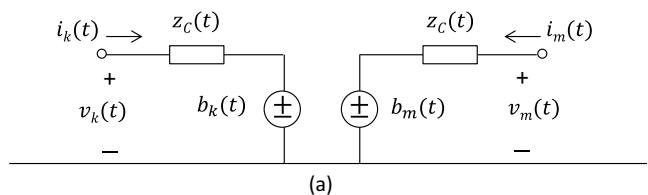

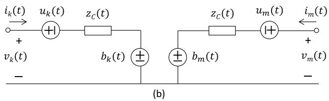  
Fig. 2. Equivalent circuit of Marti's model: (a) original form; (b) model extended to account for external electromagnetic fields.

recursively after fitting $Z _ { c }$ and A as sums of rational functions [11]. The equivalent circuit of (5) is shown in Fig. 2(a).

$$
v _ {m} (t) - z _ {c} (t) ^ {*} i _ {m} (t) = b _ {m} (t)
$$

$$
v _ {k} (t) - z _ {c} (t) ^ {*} i _ {k} (t) = b _ {k} (t) \tag {5}
$$

In order to solve transients on multiconductor lines, it is assumed in Marti's model that each propagation mode is represented independently as in (5). The phase-domain voltages and currents, v(t) and i(t), are then calculated with $\pmb { \nu } ( t ) = ( \pmb { t } _ { I } ^ { - 1 } ) ^ { t } \pmb { \nu } _ { m o d } ( t )$ and $\pmb { i } ( t ) = \pmb { t } _ { I } ~ \pmb { i } _ { m o d } ( t )$ , where $\pmb { \nu } _ { m o d } ( t )$ and $i _ { m o d } ( t )$ are vectors containing the modal voltages and currents, and $t _ { I } = \mathrm { R e } \{ T _ { I } ( f _ { 0 } ) \}$ is a real and constant transformation matrix of order N calculated at frequency f [11].

Marti's model can be successfully used in transient studies as long as the transformation matrix does not present a significant variation with frequency. However, this condition is not met for underground cables and strongly asymmetric overhead lines [21]. The three-phase compact distribution line shown in Fig. 1 is also prone to exhibit a greater variation of the transformation matrix with frequency due to the insulating layer covering the phase conductors [12]. As an example, Fig. 3 shows the real and imaginary parts of the first column of $T _ { I } ,$ calculated with the Newton-Raphson method [22] for a soil resistivity of 1000 Ωm. As seen in Fig. 3, the elements of TI cannot be considered purely real and constant. Nevertheless, it was shown in Ref. [12] that Marti's model could still be used for simulating switching transients on three-phase compact lines. It is not clear though if the same conclusion would hold

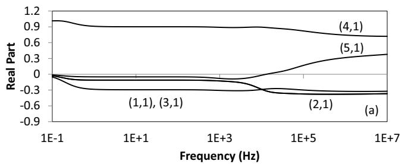

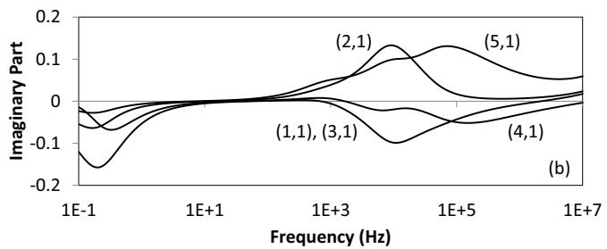  
Fig. 3. 1st column of the transformation matrix of the three-phase compact distribution line of Fig. 1 for a soil resistivity of 1000 Ωm.

for other transient phenomena, such as lightning-induced overvoltages. In order to investigate this possibility, Marti's model extended to include the influence of external electromagnetic fields is considered in this paper. This version of Marti's model, named extended modal-domain (EMD) model [13], represents the effect of incident electromagnetic fields by adding lumped sources at the ends of each line representing a mode as indicated in Fig. 2(b). These voltage sources are given by De Conti and Leal [13]

$$
u _ {k} (t) = - \int_ {0} ^ {\ell} a (x, t) ^ {*} E _ {x} ^ {i} (x, t) d x - h E _ {z, k} ^ {i} (t) + a (t) ^ {*} h E _ {z, m} ^ {i} (t)
$$

$$
u _ {m} (t) = \int_ {0} ^ {\ell} a (x, t) ^ {*} E _ {x} ^ {i} (\ell - x, t) d x - h E _ {z, m} ^ {i} (t) + a (t) ^ {*} h E _ {z, k} ^ {i} (t) \tag {6}
$$

where $E _ { z , k } ^ { i } ( t )$ and $E _ { z , m } ^ { i } ( t )$ are the vertical components of the incident electric field at nodes k and m, respectively, calculated at ground level for each mode, and a(x,t) is the modal propagation function associated with an arbitrary position of the line. To solve the integrals in (6), the line is divided in segments of length Δx and the modal propagation function $a _ { \Delta x } ( t )$ associated with each segment is used in cascade so that the effect of the longitudinal component of the incident electric field reaching the line at any coordinate is included in $u _ { k } ( t )$ and $u _ { m } ( t )$ (see Ref. [13] and the Appendix for details). In addition to the fitting of Zc and A associated with each mode as sums of rational functions, it is thus necessary to fit $A _ { \Delta x } ,$ the frequency-domain equivalent of $a _ { \Delta x } ( t )$ . To extend the model of Fig. 2(b) to the multiconductor case, a real and constant transformation matrix is used as in Marti's model. The modification of the equivalent circuit of Fig. 2(b) such that $u _ { k } ( t )$ and $u _ { m } ( t )$ 号 are transformed into shunt current sources that can be incorporated externally to Marti's model implemented in ATP is also discussed in detail in Ref. [13].

Two possibilities are considered here for the EMD model. One of them is a Matlab code implemented by the authors that is able to deal with complex poles obtained from the fitting of Zc, A, and $A _ { \Delta x }$ associated with each mode using the vector fitting technique [17]. The second possibility is to use Marti's model implemented in ATP, which requires the fitting of $Z _ { c }$ and A with real poles, and then include the external sources describing the inducing fields using the MODELS language available in the same platform. For this second possibility, the line parameters are calculated either with the Cable Constants (CC) routine available in ATP or in Matlab, from which a punch file compatible with ATP is generated [23].

# 3.3. Model validation

To validate the models discussed in the previous sections, lightninginduced voltage measurements resulting from rocket-triggered lightning experiments performed by Barker et al. [24] in Camp Blanding, Florida, are used as reference. The voltages were measured on a 682-m long line composed of two vertically spaced conductors, illustrated in Fig. 4. The lower conductor served as a neutral and was grounded at

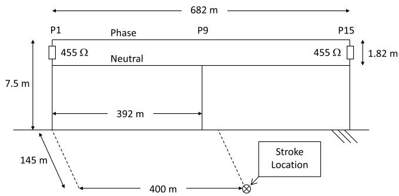  
Fig. 4. Details of the experiment of Barker et al. [24].

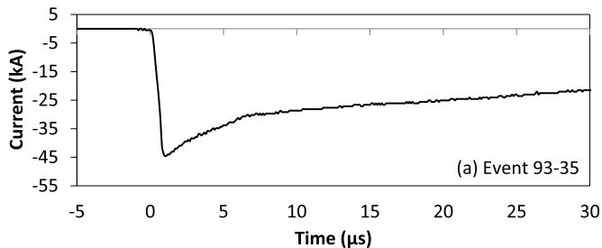

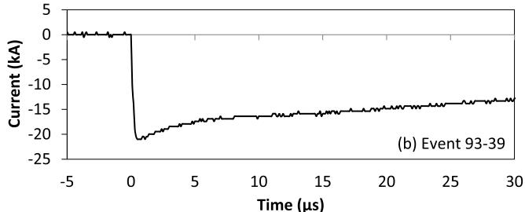  
Fig. 5. Channel-base currents measured in the events (a) 93–35 and (b) 93–39 in the experiments performed by Barker et al. [24].

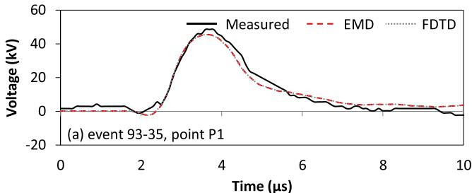

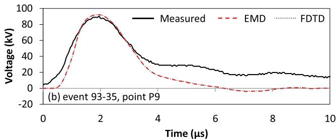  
Fig. 6. Measured and calculated lightning-induced voltages considering event 93–35 in the experiments performed by Barker et al. [24]: (a) point P1; (b) point P9.

poles P1, P9, and P15. The upper conductor served as a phase conductor and was terminated at both ends with 455-Ω resistors connected to the neutral. The rocket launcher was placed 145 m far from the line, at a point 400 m far from P1. The return-stroke current at the channel base and the phase-to-neutral voltages induced at poles P1 and P9 were measured simultaneously for several lightning events. Fig. 5 illustrates the return-stroke currents measured for events 93–35 and 93–39 [24]. The corresponding phase-to-neutral voltages induced on the line are shown in Fig. 6 (event 93–35) and Fig. 7 (event 93–39).

During the measurements, the grounding resistance at poles P1, P9 and P15 varied from experiment to experiment, but was always between 30 and 75 Ω [24]. However, the soil resistivity was not measured. Here, in order to reproduce the measured waveforms, grounding resistances of 50, 30 and 50 Ω were respectively considered at poles P1, P9, and P15. Different values within the limits specified in Ref. [24] were also tried, but the results were seen to be relatively insensitive to this parameter. In the simulations, a soil resistivity of 200 Ωm was assumed. This value is close to the 285 Ωm resistivity estimated from the numerical simulation of Barker's et al. experiment [24] using 2D

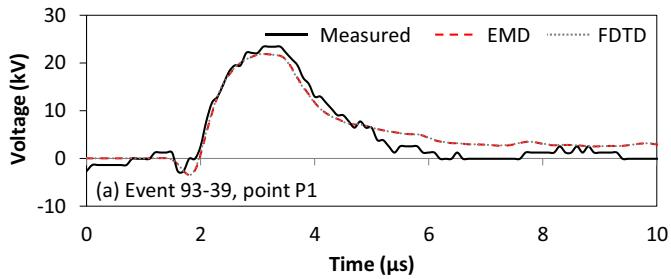

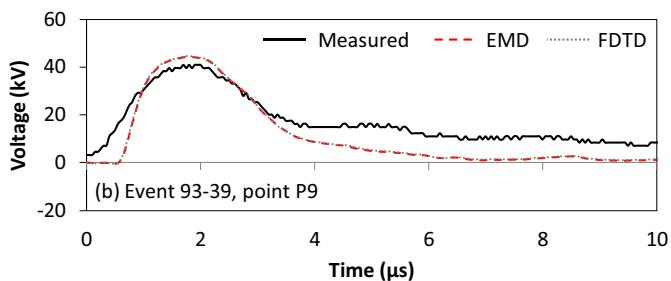  
Fig. 7. Measured and calculated lightning-induced voltages considering event 93–39 in the experiments performed by Barker et al. [24]: (a) point P1; (b) point P9.

[25] and 3D [26] FDTD models. It was selected from a parametric study that indicated its consistency in the simulation of events 93–35 and 93–39, which were measured in the same day.

For calculating the spatial and temporal distribution of the returnstroke current, the modified transmission line model with exponential decay with height (MTLE model [27]) was used with a propagation speed of $1 . 5 ~ \times ~ 1 0 ^ { 8 }$ m/s and a decay constant of 2 km. The electromagnetic fields were calculated using the formulations of Uman et al. [28] and Cooray-Rubinstein [29,30]. The results, shown in Figs. 6 and 7, were obtained assuming $\Delta t = 1 0$ ns and $\Delta x = 3 . 4 1$ m. In the FDTD model, 24 poles were used to fit the transient impedance. In the EMD model, the aerial/ground modes associated with $Z _ { c } , \ A$ and $A _ { \Delta x }$ were fitted with 14/21, 6/7, and 4/4 poles, respectively. It is observed that both models lead to equivalent results, reproducing the measured waveforms with good accuracy. Consequently, both models can be considered validated and are now used to calculate lightning-induced voltages on the compact distribution line of Fig. 1.

# 4. Simulated cases

All simulations considered a line length of 1 km with the terminal conditions shown in Fig. 8. In all cases, neutral and messenger were grounded with $R _ { G } = 1 0 \Omega$ at both ends. Two different possibilities were assumed for phases A, B, and C. They were either left open or grounded at both ends through 500 Ω resistors. The latter case approaches the condition of a matched line and is referred to as such throughout the text.

A lightning strike was assumed to hit the ground at a position

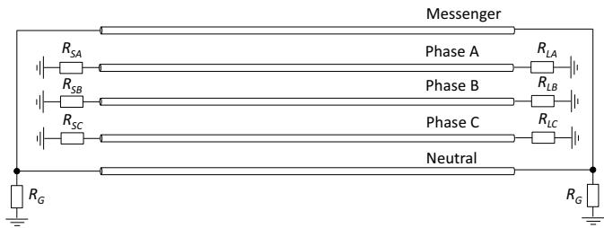  
Fig. 8. Terminal conditions assumed in the simulations. The resistors at the ends of the phase conductors are either infinite or equal to 500 Ω, and $R _ { G } = 1 0$ Ω.

equidistant from the line ends, 100 m far from the line center. The channel-base current corresponds to the median of subsequent stroke currents of negative downward lightning measured at Morro do Cachimbo station, Brazil [31]. The current was modeled as a sum of two Heidler functions as described in Ref. [32]. It reaches a peak value $I _ { p }$ of 16 kA, rises from 10% to 90% of $I _ { p }$ in 0.6 μs, decays to 50% of $I _ { p }$ in 16.6 μs, and presents a maximum steepness of 29.6 kA/μs at the wavefront. The electromagnetic fields were calculated as described in Section $3 . 3 ,$ , assuming a ground resistivity of 1000 Ωm and a relative ground permittivity of 10.

# 5. Results and analysis

# 5.1. Validity of the EMD model

This section investigates the validity of the EMD model to calculate lightning-induced voltages on the compact distribution line of Fig. 1, which presents both bare and covered conductors. In the simulations, a Matlab implementation of the EMD model was considered. In this case, the fitting of $Z _ { c } ,$ A and $A _ { \Delta x }$ was performed from 0.1 Hz to 10 MHz using the vector fitting technique allowing complex poles. The fitting of A and $A _ { \Delta x }$ required 4 to 6 poles for each mode, except the ground mode, which required 10 poles for $A _ { \Delta x } .$ The fitting of $Z _ { c }$ required 17 poles for the aerial modes and 22 poles for the ground mode. Finally, the fitting of the transient impedance in the FDTD method required 20 poles. The real and constant transformation matrix was calculated at 1 MHz, which can be considered representative for the phenomenon. The FDTD model presented in Section 3.1 was used as reference.

The results are shown in Fig. 9. They correspond to lightning-induced voltages calculated at the sending end of the line, on phase B, considering either matched or open-ended terminal conditions on the phase conductors. As seen in Fig. 9, the EMD model is able to reproduce the results obtained with the FDTD method with good accuracy. This indicates that the errors associated with solving (5) and (6) assuming a real and constant transformation matrix are acceptable even if the transformation matrix associated with the compact line of Fig. 1 is far from real and frequency-invariant (see Fig. 3). Similar results were obtained for the other conductors, other values of ground resistivity, and different load conditions. It must also be noted that the overvoltages shown in Fig. 9 are well below the impulse withstand voltage of compact distribution lines, which exceeds 200 kV [3]-[5].

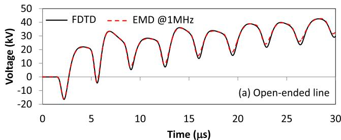

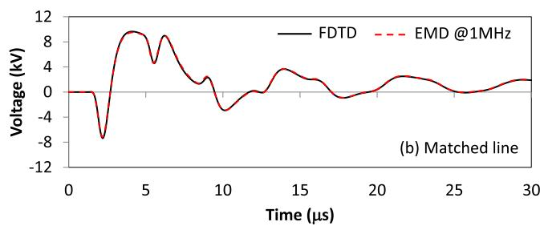  
Fig. 9. Lightning-induced voltages on phase B at the sending end of a 1-km long three-phase compact distribution line considering different line models and different load conditions.

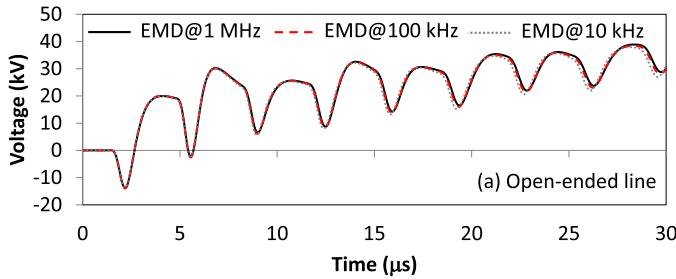

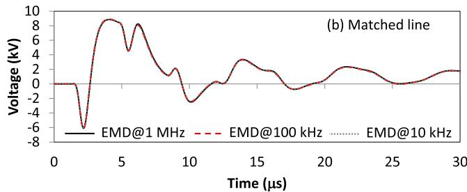  
Fig. 10. Lightning-induced voltages on phase A at the sending end of a 1-km long three-phase compact distribution line considering the EMD model with the transformation matrix calculated at different frequencies.

# 5.2. Influence of the transformation matrix

In order to investigate how sensitive to the transformation matrix are the results obtained with the EMD model, the analysis of the previous section was repeated considering $f _ { 0 } ~ = ~ 1 0$ kHz, 100 kHz, and 1 MHz. Fig. 10 shows the voltages at the sending end of the line, on phase A, for either matched of open-ended load conditions. As expected, the voltage waveforms are very similar to those shown in Fig. 9, which correspond to phase B. This happens because phases A and B are nearly at the same height, and essentially at the same distance from the lightning channel. It is also observed that the voltage waveforms are nearly insensitive to the frequency at which the transformation matrix is calculated. This confirms that, as long as some loss of accuracy is admitted, the EMD model (Marti's model extended to account for the influence of external electromagnetic fields) can be used in the calculation of lightning-induced voltages on compact distribution lines.

# 5.3. Influence of the fitting method

The results presented in the previous sections indicate that Marti's model can be accurately used for simulating lightning-induced voltages on a three-phase compact distribution line, which requires using the EMD model shown in Fig. 2(b). However, the simulations were performed entirely in Matlab, and the line parameters were fitted with the vector fitting technique assuming complex poles.

The model performance is further investigated in this section with the assumption that the rational fitting of the line parameters is now performed with real poles. This analysis is important because the fitting with real poles is less flexible than the fitting with complex poles, often leading to larger errors. Two approaches were considered. In the first case, $Z _ { c }$ , A and $A _ { \Delta x }$ were fitted from 0.1 Hz to 10 MHz using the vector fitting technique, assuming strictly real poles. The required number of poles is very similar to the one previously obtained for complex poles. The poles and residues were written in the form of a punch file that was simulated using Marti's model available in ATP following the procedure proposed in Ref. [23]. The external sources describing the influence of the incident electromagnetic fields were calculated in Matlab and incorporated into ATP using MODELS [13].

In the second approach, $Z _ { c } , ~ A$ and $A _ { \Delta x }$ were calculated using the option “single core cable” with cables in air in the CC routine in ATP and fitted with the built-in code based on Bode's asymptotic technique [11]. The fitting of A required 6 to 25 poles, the fitting of $A _ { \Delta x }$ required 4

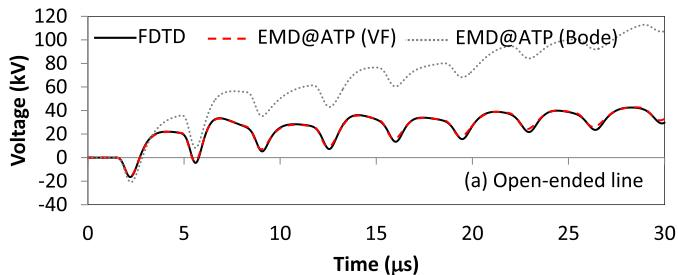

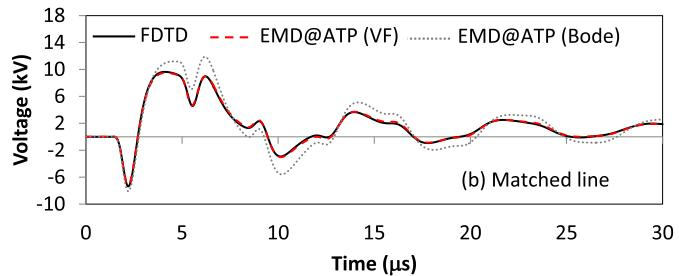  
Fig. 11. Lightning-induced voltages on phase B at the sending end of a 1-km long three-phase compact distribution line considering different line models, different fitting procedures, and different load conditions.

to 30 poles, and the fitting of Zc required 20 to 25 poles, depending on the considered mode. The calculation of the external sources was once again performed in Matlab, but now with the poles and residues obtained in ATP. The external sources were once again incorporated into ATP using MODELS, and Marti's model available in this platform was used. In all cases, the transformation matrix was calculated at 1 MHz.

Fig. 11 illustrates lightning-induced voltages on phase B at the sending end of the line obtained from ATP simulations considering either the fitting performed in Matlab with the vector fitting technique, labeled as “EMD@ATP (VF)”, or the fitting performed with the built-in method available in ATP, labeled as “EMD@ATP (Bode)”. Results obtained with the FDTD method are also included for reference. Fig. 12 presents similar analysis, but for the sending end voltages calculated on the neutral conductor.

It is observed in Figs. 11 and 12 that the results obtained in ATP considering the fitting in Matlab present a good agreement with the FDTD method. This means that, in principle, the use of real poles in the

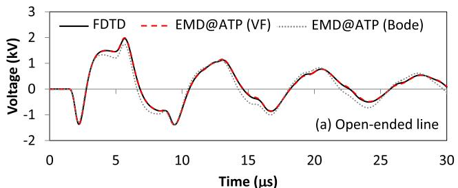

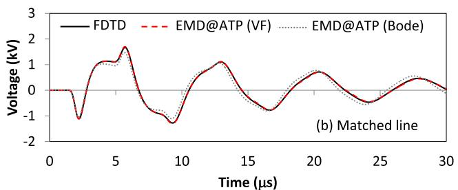  
Fig. 12. Lightning-induced voltages on the neutral at the sending end of a 1-km long three-phase compact distribution line considering different line models, different fitting procedures, and different load conditions.

fitting of the model parameters does not necessarily compromise the model performance. On the other hand, the results directly obtained in ATP (parameter calculation in the CC routine, asymptotic fitting of the model parameters, and simulation using Marti's model, only with the source calculation performed in Matlab) present noticeable deviations from the FDTD solution of (1). This is especially true for the voltage waveforms shown in Fig. 11(a), which were calculated on phase B assuming open phase conductors. For matched phase conductors and/or voltages calculated on the neutral, the differences are less significant, but still noticeable.

In order to understand the reasons for the observed discrepancy, the per-unit-length parameters calculated in ATP were first compared with their counterparts calculated in Matlab. The differences were not larger than 1% from 0.1 Hz to 10 MHz. This means that the parameters are correctly and equivalently calculated in both platforms. Then, attempts were made to improve the fitting of Zc, A and $A _ { \Delta x }$ x in ATP by adjusting the upper and lower frequency limits considered in the fitting, by increasing the number of poles, by changing the number of points per decade considered in the parameter calculation, and by varying the tolerance admitted in the fitting procedure. It was observed that the model performance is very sensitive to the fitting parameters, often leading to completely inconsistent induced-voltage calculations. In fact, in many cases the fitting did not even converge for some of the modes. It can thus be concluded that real poles can be used in the fitting of the model parameters for calculating lightning-induced voltages on the compact line configuration shown of Fig. 1 using Marti's model, but the built-in asymptotic fitting method available in ATP must be used with caution.

# 6. Conclusions

The analysis presented in this paper shows that an extended version of Marti's transmission line model to include the influence of external electromagnetic fields, named EMD model, can be used in the calculation of lightning-induced voltages on a three-phase compact distribution line configuration that contains both covered and bare conductors. It was observed that if complex poles are used in the fitting of the model parameters, the loss of accuracy associated with the use of a real and constant transformation matrix is minimal in the EMD model. The model performance is also shown to be in excellent agreement with the FDTD method even if real poles are used in the fitting of the model parameters. However, extra care must be taken in the fitting process. Good results were obtained only when the fitting was performed with the vector fitting technique, with the line model being exported to ATP via punch file. On the other hand, larger errors were observed in transient simulations when the model parameters were directly fitted in ATP.

# CRediT authorship contribution statement

Alberto De Conti: Conceptualization, Methodology, Software, Formal analysis, Writing - original draft, Visualization, Supervision, Funding acquisition. Osis E.S. Leal: Conceptualization, Methodology, Software, Validation, Investigation. Alex C. Silva: Methodology, Software.

# Acknowledgments

The authors would like to thank Thomas Short for providing the data necessary for the model validation, Philip Barker, who was responsible for designing and managing the induced-voltage measurement site in 1993 and 1994, and finally EPRI, which funded the development of the Camp Blanding site and the 1993 induced voltage measurements used in this paper. This work was supported in part by Brazilian agencies CNPq (Conselho Nacional de Desenvolvimento Científico e Tecnológico), grants 306006/2019–7 and 431948/2016–0,

and FAPEMIG (Fundação de Amparo à Pesquisa do Estado de Minas Gerais), grant TEC-PPM-00280–17.

# Appendix

Applying Simpson's integration rule to the integral in equation $( 6 \mathsf { a } ) , u _ { k } ( t )$ can be written as [13]

$$
u _ {k} (t) = - \bar {w} (t) - h E _ {z, k} ^ {i} (t) + a (t) ^ {*} h E _ {z, m} ^ {i} (t), \tag {A.1}
$$

where

$$
\bar {w} (t) = \frac {\Delta x}{3} \left\{E _ {x, 0} ^ {i} (t) + \sum_ {n = 1} ^ {N _ {\text {s e g}}} \left[ \rho_ {n} a _ {\Delta x} (t) ^ {\bar {n}} * E _ {x, n} ^ {i} (t) \right] \right\}. \tag {A.2}
$$

In (A.2), $E _ { x , n } ^ { i } ( t ) = E _ { x } ^ { i } ( n \Delta x , t ) , N _ { s e g }$ is the number of segments of length Δx in which the line is divided, ${ \rho } _ { n } = 4$ for odd $n , \rho _ { n } = 2$ for even n, $\rho _ { N _ { S e g } } = 1 ,$ , and $a _ { \Delta x } ( t ) ^ { \bar { n } }$ represents the successive convolution of n terms corresponding to $a _ { \Delta x } ( t )$ $[ \mathrm { e . g . } , a _ { \Delta x } ( t ) ^ { \bar { 3 } } = a _ { \Delta x } ( t ) ^ { * } a _ { \Delta x } ( t ) ^ { * } a _ { \Delta x } ( t ) ]$ [13]. Each convolution in (A.1) and (A.2) is solved by representing $\mathbf { } a _ { \Delta x } ( t )$ and a(t) as sums of exponentials and applying the recursive algorithm proposed in Ref. [33]. The solution of $u _ { m } ( t )$ given by (6b) follows a similar procedure. Equations (A.1) and (A.2) are written and solved for each mode. A constant and frequency independent transformation matrix is used to transform the modal-domain quantities into phase-domain quantities similarly as in Marti's transmission line model [11]. More details are given in Ref. [13].

# References

[1] R.C.C. Rocha, R.C. Berredo, R.A.O. Barnes, E.M. Gomes, F. Nishimura, L.D. Cicarelli, M.R. Soares, New technologies, standards, and maintenance methods in spacer cable systems, IEEE Trans. Power Deliv. 17 (2) (2002) 562–568.   
[2] J. He, S. Chen, R. Zheng, Compact covered distribution lines supported by triangle spacers: spacer design, Int. J. Emerg. Electr. Power Syst. 10 (2) (2009).   
[3] G.S. Lima, R.M. Gomes, R.E.S. Filho, A. De Conti, F.H. Silveira, S. Visacro, W.A. Souza, Impulse withstand voltage of single-phase compact distribution line structures considering bare and XPLE-covered cables, Electr. Power Syst. Res. 153 (2017) 88–93.   
[4] R.E.S. Souza, R.M. Gomes, G.S. Lima, F.H. Silveira, A. De Conti, S. Visacro, W.A. Souza, Analysis of the impulse breakdown behavior of covered cables used in compact distribution lines, Electr. Power Syst. Res. 159 (2018) 24–30.   
[5] R.E. Souza, F.H. Silveira, R.M. Gomes, G.S. Lima, A. De Conti, S. Visacro, Characterization of the effect of the insulating material of covered cables on the impulse breakdown behavior of single- and three-phase compact distribution lines, Electr. Power Syst. Res. 172 (2019) 161–166.   
[6] W.A. Souza, L.F. Dias, F.A.M. Silva, F.H. Silveira, S. Visacro, A. De Conti, A discussion on the electrical performance of compact distribution overhead lines, Proceedings of the GROUND 2014 - International Conference on Grounding and Earthing & 6th LPE - International Conference on Lightning Physics and Effects, Brazil, 2014.   
[7] A. De Conti, F.H. Silveira, J.V.P. Duarte, J.C.S. Ventura, Lightning-induced overvoltages in MV distribution lines: spacer-cable versus conventional line configurations, Proceedings of the XXVII ICLP – International Conference Lightning Protection, Avignon, 2004.   
[8] F. Napolitano, A. Borghetti, D. Messori, C.A. Nucci, M.L.B. Martinez, G.P. Lopes, J.I.L Uchoa, Assessment of the lightning performance of compact overhead distribution lines, IEEJ Trans. Power Energy 133 (12) (2013) 1–7.   
[9] A. De Conti, A.C. Silva, O.E.S. Leal, Transient analysis of compact distribution lines with dielectric-coated cables, Electr. Power Syst. Res. 181 (2020) 106173.   
[10] A. Borghetti, G.M.F. Ferraz, F. Napolitano, C.A. Nucci, A. Piantini, F. Tossani, Lightning protection of a multi-circuit HV-MV overhead line, Electr. Power Syst. Res. (2020) 180.   
[11] J. Marti, Accurate modeling of frequency-dependent transmission lines in electromagnetic transient simulations, IEEE Trans. Power App. Syst. PAS-101 (1) (1982) 147–157.   
[12] A. De Conti, A.C. Silva, Three-phase compact distribution line transient analysis considering different line models, Proceedings of the International Conference on Power Systems Transients Perpignan, 2019, pp. 1–6.   
[13] A. De Conti, O.E.S. Leal, Time-domain procedure for lightning-induced voltage calculation in electromagnetic transient simulators, paper submitted to, IEEE Trans. Power Deliv. (2020), https://doi.org/10.1109/TPWRD.2020.2982306 paper in press.   
[14] A.K. Agrawal, H.J. Price, S.H. Gurbaxani, Transient response of a multiconductor transmission line excited by a nonuniform electromagnetic field, IEEE Trans. Electromagn. Compat. 22 (2) (1980) 119–129.   
[15] C.A. Nucci, F. Rachidi, M.V. Michel, C. Mazzetti, Lightning-induced voltages on

overhead lines, IEEE Trans. Electromagn. Compat. 35 (1) (1993) 75–86.   
[16] C.R. Paul, Analysis of Multiconductor Transmission Lines, 2nd ed., Wiley, New York, 2008.   
[17] B. Gustavsen, A. Semlyen, Rational approximation of frequency domain responses by vector fitting, IEEE Trans. Power Deliv. 14 (3) (1999) 1052–1061.   
[18] A. Ametani, A general formulation of impedance and admittance of cables”, IEEE Trans. Power App. Syst. PAS-99 (3) (1980) 902–910.   
[19] J.R. Carson, Wave propagation in overhead wires with ground return, Bell Syst. Tech. J. 5 (4) (1926) 539–554.   
[20] E.D. Sunde, Earth Conduction Effects in Transmission Systems, Dover Publications, New York, 1968.   
[21] F. Castellanos, J.R. Marti, Full frequency-dependent phase-domain transmission line model, IEEE Trans. Power Syst. 12 (3) (1997) 1331–1339.   
[22] L.M. Wedepohl, H.V. Nguyen, G.D. Irwin, Frequency-dependent transformation matrices for untransposed transmission lines using Newton-Raphson method, IEEE Trans. Power Syst. 11 (3) (1996) 1538–1546.   
[23] A. De Conti, M.P.S. Emídio, Extension of a modal-domain transmission line to include frequency-dependent ground parameters, Electr. Power Syst. Res. 138 (2016) 120–130.   
[24] P.P. Barker, T.A. Short, A.R. Eybert-Berard, J.P. Berlandis, Induced voltage measurements on an experimental distribution line during nearby rocket triggered lightning flashes, IEEE Trans. Power Deliv. 11 (2) (1996) 980–995.   
[25] H. Ren, B. Zhou, V.A. Rakov, L. Shi, C. Gao, Jian-Hua Yang, Analysis of lightninginduced voltages on overhead lines using a 2-D FDTD method and Agrawal coupling model, IEEE Trans. Electromagn. Compat. 50 (3) (2008) 651–659.   
[26] H. Sumitani, T. Takeshima, Y. Baba, N. Nagaoka, A. Ametani, J. Takami, S. Okabe, V.A. Rakov, 3-D FDTD computation of lightning-induced voltages on an overhead two-wire distribution line, IEEE Trans. Electromagn. Compat. 54 (5) (2012) 1161–1168.   
[27] V.A. Rakov, M.A. Uman, Review and evaluation of lightning return stroke models including some aspects of their application, IEEE Trans. Electromagn. Compat 40 (4) (1998) 403–426.   
[28] M.A. Uman, D.K. McLain, Magnetic field of the lightning return stroke, J. Geophys. Res. 74 (1969) 6899–6910.   
[29] V. Cooray, Horizontal fields generated by return strokes, Radio Sci. (27) (1992) 529–537.   
[30] M. Rubinstein, An approximate formula for the calculation of the horizontal electric field from lightning at close, intermediate, and long range, IEEE Trans. Electromagn. Compat. 38 (3) (1996) 531–535.   
[31] S. Visacro, A. Soares Jr., M.A.O. Schroeder, L.C.L. Cherchiglia, V.J. Souza, Statistical analysis of lightning current parameters: measurements at Morro do Cachimbo station, J. Geophys. Res. (2004) 109.   
[32] A. De Conti, S. Visacro, Analytical representation of single- and double-peaked lightning current waveforms, IEEE Trans. Electromagn. Compat. 49 (2) (2007) 448–451.   
[33] A. Semlyen, A. Dabuleanu, Fast and accurate switching transient calculations on transmission lines with ground return using recursive convolutions, IEEE Trans. Power App. Syst. PAS-94 (1975) 561–571.