# Vacuum circuit breaker modelling for the assessment of transient recovery voltages: Application to various network configurations

C.L. Bak a, A. Borghetti b, J. Glasdam a, J. Hjerrild c, F. Napolitano b,∗, C.A. Nucci b, M. Paolone d

a Institute of Energy Technology, Aalborg University, Denmark   
b University of Bologna, Italy   
c DONG Energy, Denmark   
d École Polytechnique Fédérale de Lausanne, Switzerland

# a r t i c l e i n f o

Article history:

Received 24 October 2016

Received in revised form

22 September 2017

Accepted 12 November 2017

Available online 25 November 2017

Keywords:

Vacuum circuit breakers

Transient recovery voltages

Motor inrush currents

Cable inrush currents

Wind farms

EMTP simulations

# a b s t r a c t

Vacuum circuit breakers (VCBs) are widely used for medium voltage applications when low maintenance, long operating life, and large number of allowable switching cycles are required. The accurate estimation of the transient recovery voltages (TRVs) associated with their switching operation is indispensable for both VCB sizing and insulation coordination studies of the components nearby the switching device. In this respect, their accurate modelling, which is the object of the paper, becomes crucial. In particular, the paper illustrates two applications of a VCB model, which show the model capabilities of simulating TRVs due to opening/closing operation, namely the switching of large electrical motors and the switching of cables collecting offshore wind farms (OWFs). Data from digital fault recorder (DFR) in a water-pumping plant and from a measurement campaign in an OWF using a high-bandwidth GPS-synchronised measurement system, respectively, are used for model validation. It is shown that the inclusion of detailed VCB models significantly improves the agreement between the measurements related to both pre- and restrikes and the corresponding simulation results obtained by using two well-known electromagnetic transient simulation environments, namely, EMTP-RV and PSCAD/EMTDC. The procedure adopted for the identification of the VCB model parameters is described.

© 2017 Elsevier B.V. All rights reserved.

# 1. Introduction

Several international standards provide indications on the sizing of vacuum circuit breakers (VCBs) taking into account the effect of transient recovery voltages (TRVs) occurring during closing and opening switching operations (e.g., [1–3]). The sizing methods described in the standards cover most of the possible operating conditions of the VCBs, which are characterised by an improved reliability with respect other types of circuit breakers [4]. However, some peculiar scenarios exist that may require more detailed studies and the use of electromagnetic transient simulations. This paper deals with two of such typical scenarios: (a) the case in which the VCB is demanded to interrupt the inrush current of a large motor shortly after the closing sequence due to the intervention of a motor relay; (b) the switching of cables collecting offshore wind farms (OWFs).

In the former scenario, the VCB is requested to interrupt a large inductive current with a superposed a-periodic component. The combination of peculiar systems configurations, together with the VCB’s fast recovery of its dielectric strength and ability to interrupt high-frequency currents, might result in large TRVs and VCB current re-ignition [5].

The latter scenario is particularly interesting since the possible consequences of components failures associated to OWFs are more severe compared to land based ones due to higher repair costs and loss of revenue [6]. Since switching overvoltages are the possible cause of component failures observed in some existing OWFs [7], simulations are widely used for the identification of the overvoltages experienced by the electrical equipment in the OWF, as well as for assessment of the adequacy of the adopted design decisions [8]. In Refs. [8,9] it has been shown that insufficient representation of the VCB is the main cause of discrepancies between measurement and simulation results of inrushes occurring in OWFs.

The post-current zero period of VCBs is well described in the literature (e.g., [10,11] and references therein). In particular, the reignition behaviour when the VCB is called upon interrupting a low

amplitude inductive current has been investigated in several studies (e.g., [12–19]). Similarly, the occurrence of multiple prestrikes during the VCB closing sequence in OWFs have been investigated in, e.g., Refs. [8,9,20–23].

The purpose of this paper is to present the application of a VCB electromagnetic transient (EMT) model for the accurate assessment of the TRVs generated both during opening and closing switching operations and its implementation in two well-known simulation environments, namely, EMTP-RV and PSCAD/EMTDC. The VCB model is capable to represent the main phenomena taking place in the VCB, namely: (i) the current chopping; (ii) the cold withstand voltage characteristic (or cold gap breakdown voltage) and (iii) the high frequency current quenching. The corresponding parameters are tuned and the accuracy of the model is assessed by comparing the computer results with field measurements for the two above mentioned scenarios. In particular, the opening operation of large inductive currents is analysed with reference to actual manoeuvres in a water-pumping plant, whilst the analysis of the closing sequence in OWFs will be based on experimental data obtained during the energisation of a radial feeder in the Nysted OWF, also known as Rødsand (Denmark).

The paper is organised as follows. Section 2 briefly illustrates the two scenarios of interest and describes, in detail, both the implementations of the VCB model and of the complete models of the two plants where it is included, namely the water-pumping plant and the OWF. Section 3 describes the identification of the parameters and presents the comparison between the simulation results and the available field measurements. Section 4 concludes the paper.

# 2. Simulation models

# 2.1. VCB characteristics

During the closing of the VCB contacts, as a consequence of the decreasing contact gap distance, a number of so-called prestrikes are almost inevitable. Depending on the voltage impressed across the contacts, multiple prestrikes might occur generating high frequency currents.

Similarly, during a VCB opening, contacts usually start to separate at random with respect to the current waveform. If the contact separation starts just after current zero crossing, the gap has a long time (little less than half of the fundamental period) in order to recover its dielectric strength before the following current zero crossing. Since typical delay for the contacts to be mechanically fully separated is lower than 10 ms, no re-ignition would be expected. On the other hand, if the contact separation starts just before the natural current zero, the dielectric strength of the gap is low at the current zero crossing. The developed TRV will much likely exceed the dielectric strength of the gap and a process similar to the VCB closing sequence will occur. The difference is that as the length of the contact gap increases so does its dielectric strength, resulting in increased voltage level at which re-ignition occurs. This is generally referred to as voltage escalation [24,25].

The most known characteristic of the VCB is its capability of prematurely quenching a low amplitude AC current during the opening sequence. This peculiar characteristic is of particular concern when the VCB is requested to disconnect a large inductive load (e.g., an unloaded transformer), resulting in high overvoltages on the disconnected load and TRVs on the VCB [24].

The occurrence of multiple prestrikes and re-ignitions and their associated TRVs is difficult to predict, as it depends on many factors such as dielectric and current quenching properties of the VCB, surge impedances of the network, mechanical tolerances causing a spread in the contact velocity, point on wave of closing/opening switching operation, and so on.

These peculiar characteristics justifies the effort for the specific modelling of VBCs in electromagnetic simulations of TRVs.

# 2.2. VCB model

The specific characteristics of the VCB model are described in the following for the opening and closing sequences. As this paper deals with two scenarios, one relevant to the opening switching of the large inductive currents of motor start-ups, and the other relevant to the closing operation in an OWF, the VCB model is denoted as VCB1 for the first and VCB2 for the second one, respectively. VCB1 has been implemented in the model of a water-pumping plant developed in the EMTP-RV simulation environment. VCB2 has been implemented in the model of the Nysted OWF developed in the PSCAD/EMTDC simulation environment.

For both cases, due to the availability of actual measurements, the arcing time is assumed to be known.

The representation of the following properties, usually included in the model (e.g., [26,27]): (i) current chopping capability; (ii) contact dielectric strength; (iii) high frequency current quenching capability is described in the following.

# 2.2.1. VCB1 model

(i) Chopping current: a constant and known value of the chopping current has been assumed, although it depends on different parameters, such as the contact material or the load surge impedance, and may be considered statistically distributed [28].   
(ii) Dielectric strength: a linear relationship with the time can be assumed for the withstand voltage during the contact separation Ub,op: $U _ { b , o p } \mathrm { : }$

$$
U _ {b, o p} (t) = A _ {1} (t - t _ {o p}) + B _ {1} \tag {1}
$$

where $t _ { o p } ( \mathrm { i n } \mu s )$ is the time for contact separation. $A _ { 1 }$ is the rate of change of the dielectric strength of the contact gap $( \mathrm { i n } \lor \mu s ^ { - 1 } )$ as the contact gap d increases. $B _ { 1 }$ is the TRV withstand just before contact separation. $U _ { b , o p }$ is bounded by the maximum value of the TRV capability voltage $( U _ { b , m a x , o p } )$ . The parameters are typically provided by manufacturers or by means of fitting between available measurements and simulation results. The linear relationship (also assumed in Refs. [1,2]) is justified by the limited preceding arc current and the resulting breakdown voltage equal to the cold withstand voltage characteristic that depends on the contact gap length and therefore on the velocity of the contacts ([12,16]). The statistical distribution of the withstand voltage characteristic has been analysed in Ref. [29].

(iii) Quenching capability: the capability to quench the high frequency currents due to re-ignitions is represented by the slope QC of the re-ignited current at its zero crossing. QC is typically found in the range of several hundred amperes per microseconds and it is calculated according the following equation [12,16,17]:

$$
Q C _ {o p} (t) = D + C (t - t _ {o p}) \tag {2}
$$

where $C ( \mathrm { i n } \mathsf { A } \mathsf { \mu s } ^ { - 2 } )$ is the rate of rise of the quenching capability, D is the quenching capability prior to contact separation. The maximum current quenching capability $Q C _ { m a x , o p }$ is generally unknown and it requires a specific tuning to meet the simulations with the measurements.

Fig. 1 shows the implemented single-phase model of the VCB1 in the EMTP-RV environment. The VCB characteristics described above for the opening sequence are implemented using a flip-flop logic block, which produces an open or close signal to the VCB switch, depending on the output of the two blocks VCB closing and VCB opening.

An RLC branch is put in parallel to account for the open contact gap stray capacitance, resistance and inductance. The values of

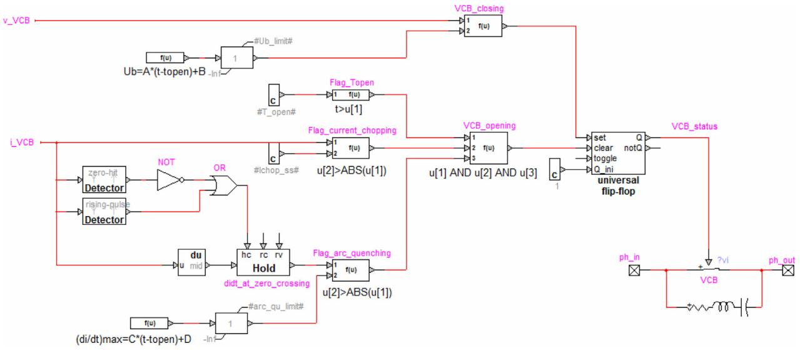  
Fig. 1. EMTP-RV implementation of the model relevant to a pole of the VCB (i VCB is the current in the pole and v VCB between the contacts).

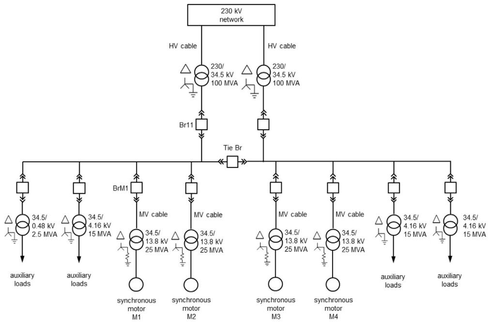  
Fig. 2. One line diagram of the water-pumping plant.

these parameters are: $R _ { s } = 1 0 0 \Omega , L _ { s } = 5 0$ nH and $C _ { s } = 1 0 0 \mathsf { p F }$ and are typically adopted in literature (see Ref. [17]).

The block VCB closing represents the re-ignition properties of the VCB by setting the closing command to the flip-flop block according to the condition:

$$
\left| U _ {b, o p} (t) \right| > U (t) \tag {3}
$$

where U(t) is the instantaneous voltage across the VCB contacts.

The VCB opening block sets an open command to the flip-flop block if the following three conditions are verified:

$$
t > t _ {o p} \tag {4}
$$

$$
\left| i (t) \right| <   i ^ {\text {c h o p}} \tag {5}
$$

$$
\left| \frac {d i (t)}{d t} \right| _ {i (t) = 0} <   Q C _ {o p} (t) \tag {6}
$$

where i(t) is the instantaneous current flowing through the generic pole of the VCB and $i ^ { c h o p }$ is the chopping current.

# 2.2.2. VCB2 model

(i) Chopping current: the current chopping capability is only of interest for the VCB opening sequence and therefore it is omitted.   
(ii) Dielectric strength: the closing signal is produced when $U _ { c } ( t ) \geq U _ { b , c l } ( t )$ , where Uc (t) is the contact gap voltage and $U _ { b , c l } ( t )$ is the withstand voltage of the contact gap which is assumed to be linearly dependent from the length d of the contact gap:

$$
U _ {b, c l} (t) = U _ {c, p e a k} - A _ {2} (t - t _ {c l}) + B _ {2} \tag {7}
$$

where $t _ { c l }$ is the start time of the closing sequence and $A _ { 2 }$ is the rate of change of the dielectric strength of the contact gap (in $\mathsf { V } \mu \mathsf { S } ^ { - 1 } )$ ) as d changes. $B _ { 2 }$ is the TRV just before current zero. $U _ { c , p e a k } \left( \mathrm { i n V } \right)$ is the peak value of the contact gap voltage calculated as [17]:

$$
U _ {c, p e a k} = k _ {p p} k _ {a f} \sqrt {\frac {2}{3}} U \tag {8}
$$

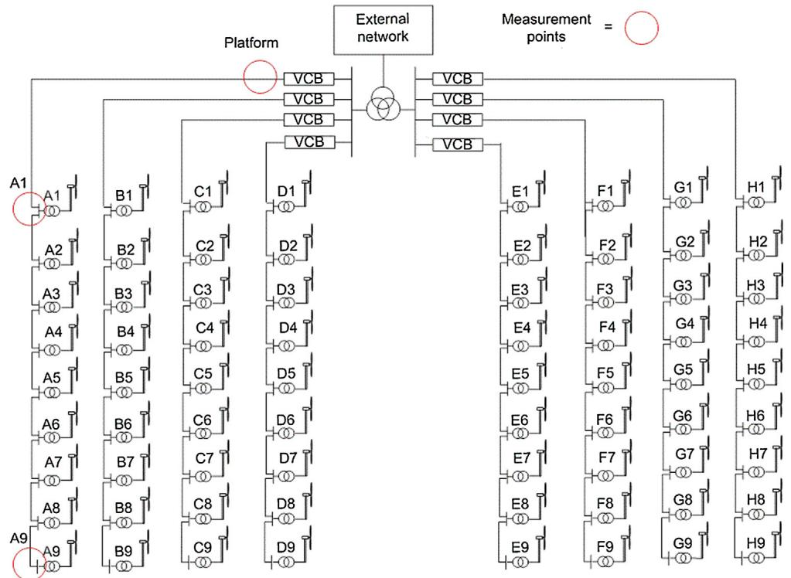  
Fig. 3. Schematic of the Nysted OWF.

where $k _ { p p }$ is the so-called first-pole-to-clear factor (set to 1.5), $k _ { a f }$ is a transient amplitude factor that depends on the characteristics of the circuit (set to 1.4), U is the RMS value of the voltage.

(iii) Quenching capability: the high-frequency current quenching capability $Q C _ { c l }$ has been set at a fixed value tuned using field measurements obtained during the inrush of the Nysted OWF as well as in Burbo Bank OWF [30]. The measurements show that all the installed VCBs were able to interrupt the high-frequency inrush currents. $Q C _ { m a x , c l }$ is in the interval between $1 5 0 { - } 6 0 0 \mathbb { A } \mu s ^ { - 1 } \left[ 1 2 , 1 6 \right]$

The opening signal is given if the time derivative of the current, numerically evaluated at the current zero crossing, becomes lower than $Q C _ { c l } .$ The time delay between current zero crossing and the opening signal is shorter than the simulation time step t that is 400 ns in this case study and is considered of the same order of the time between current extinction and the TRV development due to the post-arc current phenomena [27].

# 2.3. Models of the two plants

# 2.3.1. Model of the water-pumping plant

Fig. 2 is the electrical one line diagram of the water-pumping plant showing the only branches connected at the time of the manoeuvre considered in this study. As described in Ref. [31], the model includes a 230 kV equivalent source of the network composed by overhead lines, and two 230/34.5 kV transformers connected to the external network by two HV XLPE cable lines (each cable with cross section 800 mm2) a little longer than 100 m. Four 14.3 MVA synchronous motors are connected through 25 MVA 34.5/13.8 kV transformers. The motor transformer is connected to the VCB by three parallel coaxial cable lines (300 m long, each cable with cross sections equal to 240 mm2). The presence of low and medium voltage auxiliary loads is also modelled. The frequencydependent modal model [32] has been adopted to represent both the 230 kV and the 34.5 kV cables. Both the steady state and the high frequency response of the transformers is modelled, the latter by means of a -circuit of capacitances, as suggested in Ref. [1]. More complex models for the transformer need to be used when

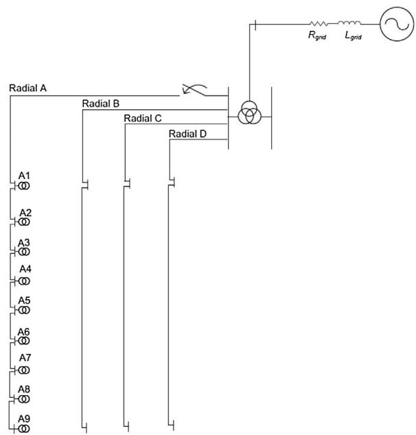  
Fig. 4. Schematic representation of the implemented network model of the Nysted OWF in PSCAD/EMTDC.

the response of the transformer is of interest (e.g., [33]). The nonlinear magnetization reactance of the motor transformers is taken into account and the values of the relevant parameters tuned to match the measured inrush currents. The motors in operation are represented by synchronous machines models, while the starting motor M1, for which the inrush current is mainly of interest, is represented by an induction motor model.

# 2.3.2. Model of the Nysted OWF

Fig. 3 shows a simplified diagram of Nysted OWF. Before the recent extension (called Rødsand II), Nysted OWF consisted of

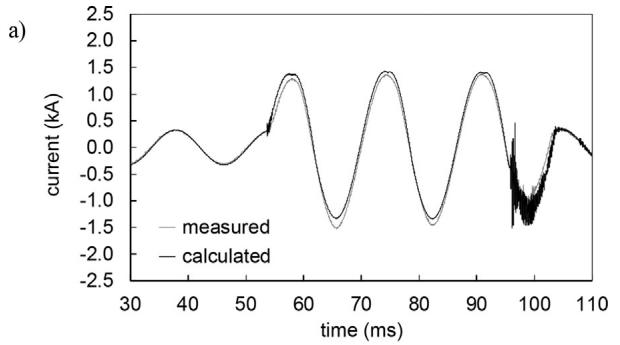

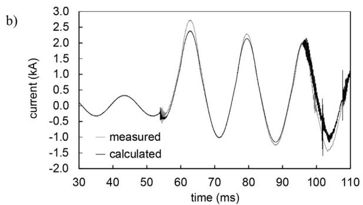

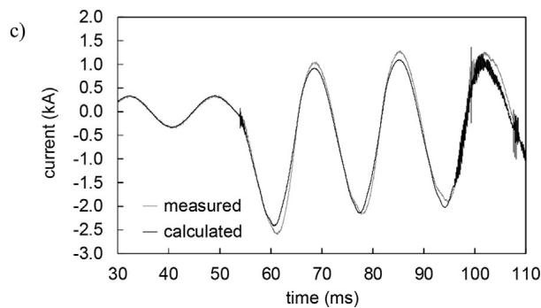  
Fig. 5. Comparison between simulated and DFR measured currents in correspondence of breaker Br11of Fig. 2 during the energisation of M1: (a) phase a; (b) phase b; (c) phase c.

72  2.3 MW Siemens wind turbines (WTs) connected through eight radials. The cable collecting grid is operated at 33 kV and the voltage is increased to 132 kV through the 90/90/180 MVA offshore park transformer. The locations of the installed high-frequency GPS synchronised measurement units are also shown in Fig. 3. Flexible Rogowski coil CTs with a minimum bandwidth of 55 mHz–3 MHz were used together with custom made capacitive voltage dividers with bandwidth of 1 Hz–1 MHz.

The PSCAD/EMTDC model of the Nysted OWF, as shown in Fig. 4, includes an equivalent circuit of the external network (composed by 10.5 km-long 3 500 mm2 submarine cable and an 18.3 kmlong land cable) and the radials connected to the same MV busbar (i.e., radials A–D). The array cables, assumed to be located under the seabed, are represented by frequency-dependent phase models [34] and the export cables by -equivalents (tuned at the fundamental frequency) for simplicity.

As discussed in Ref. [35], the simulation results are sensitive to the parameters of the cable model, which may be influenced by inaccuracies in the cable data provided by the manufacturer. In particular, the relative permittivity of the cable insulation has been set in order to fit the simulated and measured wave velocities.

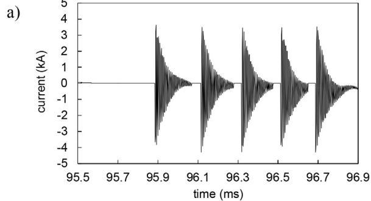

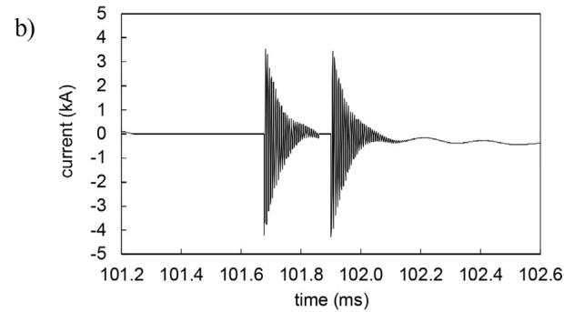

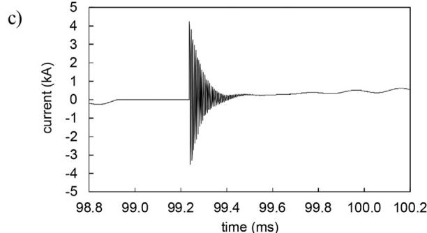  
Fig. 6. Currents flowing through VCB Br11 after the opening switching operation during the energisation of motor M1: (a) phase a; (b) phase b; (c) phase c.

In order to reduce the model complexity, only the transformers in radial A are represented (including a -circuit of capacitances). The core saturation is not of interest as the transformer saturation occurs after the VCB contacts are closed and the cable inrush currents have been damped out. Moreover in radials B–D, only the first and last WT are included in the model.

# 3. Identification of the VCB model parameters and simulation results

# 3.1. Interruption of a motor inrush current

Measurement results from the DFR of the water-pumping plant have been used to identify the values of the parameters of the VCB1 model not provided by the manufacturer as well as for the validation of the complete model. Table 1 shows the parameters provided by the manufacturer and the identified ones.

Fig. 5 shows the comparison of the measured and simulated current through breaker Br11 during the energisation of M1 (see Fig. 2). When motor M1 is being energised, M2 is not operating while all

Table 1 Overview of VCB1 parameters.   

<table><tr><td>Parameter</td><td>Value</td><td>Unit</td><td>Description</td></tr><tr><td>A1</td><td>568</td><td>V μs-1</td><td>Manufacturer data</td></tr><tr><td>B1</td><td>0</td><td>V</td><td>Manufacturer data</td></tr><tr><td>Ub,max,op</td><td>71</td><td>kV</td><td>Manufacturer data</td></tr><tr><td>C1</td><td>310</td><td>A ns-1</td><td>Identified</td></tr><tr><td>D1</td><td>155</td><td>A μs-1</td><td>Identified</td></tr><tr><td>QCmax,op</td><td>135</td><td>A μs-1</td><td>Identified</td></tr></table>

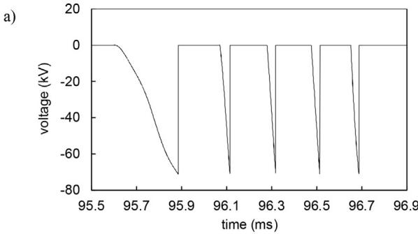

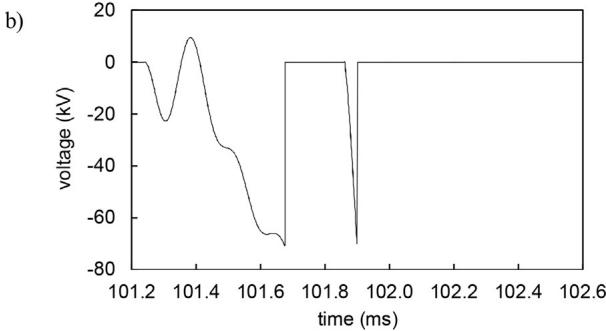

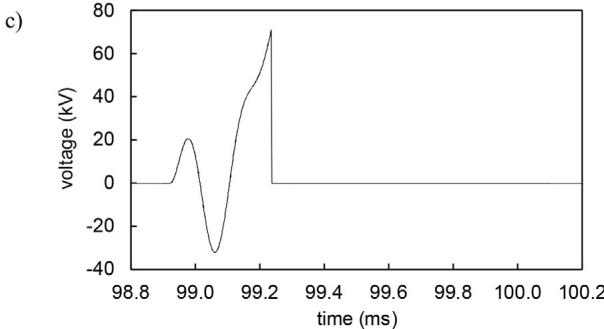  
Fig. 7. Voltages across the VCB Br11 poles after the opening operation during the energisation of motor M1: (a) phase a; (b) phase b; (c) phase c.

the transformers are energised and the tie-breaker is open. The VCB Br TM1 is closed at t = 53 ms and it is suddenly opened again at t = 95 ms. Different opening times have been adopted in each pole, in accordance with the measurements. It is worth observing that the bandwidth of the simulated response is much larger than the one provided by the DFR system, sampling at 23 kHz, and by the voltage and current transformers typically limited to a few kilohertz. The high frequency oscillations presented by the simulation results has been verified as mainly due to the resonances produced by the capacitances to ground of the transformers located near the VCB.

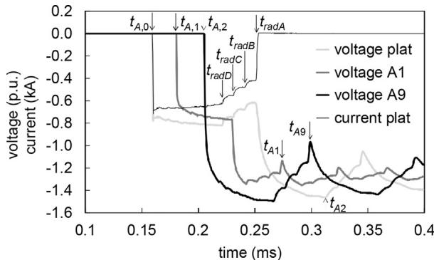  
Fig. 8. Measured voltages for phase A at the three locations and the current at the platform.

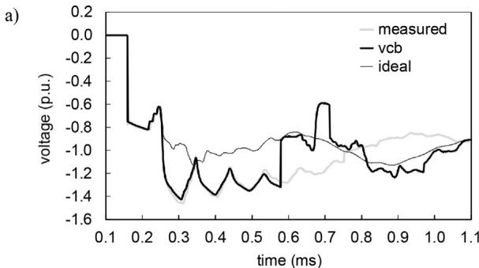

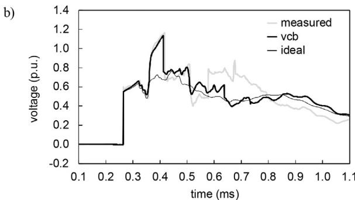

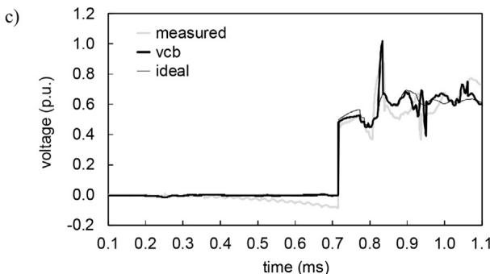  
Fig. 9. Comparison between measured and simulated phase voltages at the platform by using the VCB2 model and the ideal switch: (a) phase A; (b) phase B; (c) phase C.

Taking into account the complexity of the involved non-linear phenomena and the uncertainty of some model parameters, the agreement between measurement and simulation results is satisfactory. In particular, the obtained results show that the developed

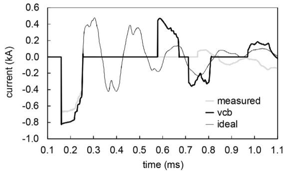  
a)

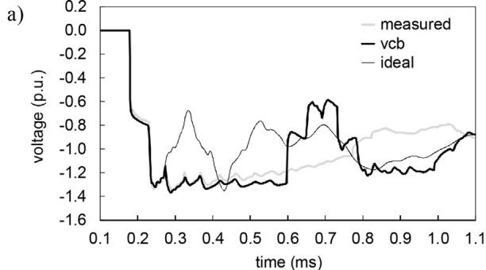

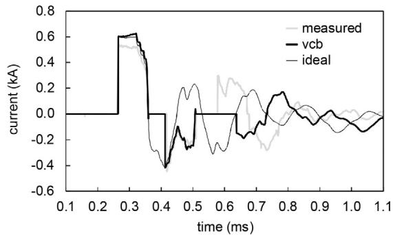  
b)

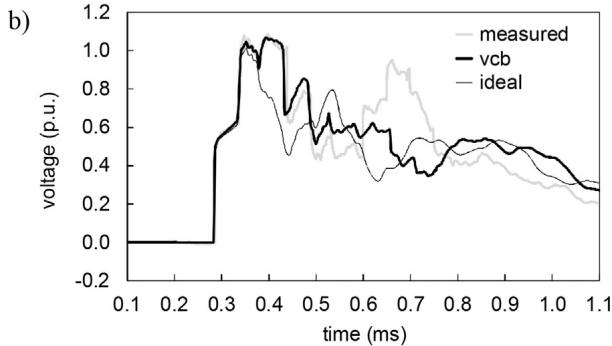

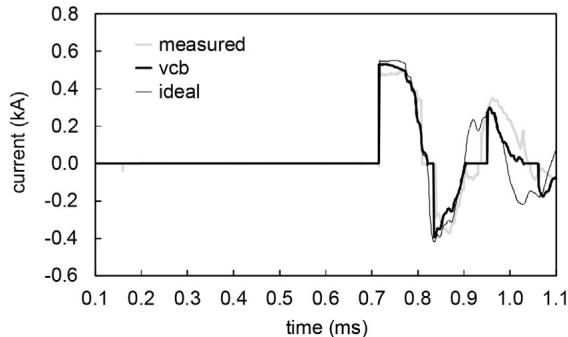  
c）

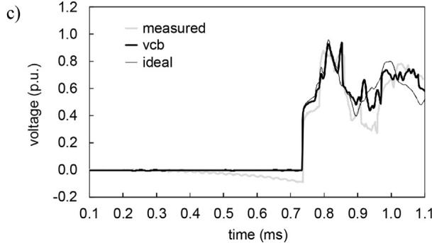  
Fig. 10. Comparison between measured currents at the platform and calculated ones by using the VCB2 model and the ideal switch: (a) phase A; (b) phase B; (c) phase C.   
Fig. 11. Comparison between measured voltages at WT A1 and calculated ones by using the VCB2 model and the ideal switch: (a) phase A; (b) phase B; (c) phase C.

model is able to correctly reproduce the asymmetrical opening of phase A and the re-ignitions in phase B and C.

Fig. 6 shows the simulated current flowing through VCB Br11 and Fig. 7 the simulated voltages across the VCB poles. The figures show several re-ignitions taking place after the VCB opening. The voltage rise-time across the VCB poles is in the order of $2 6 0 \mu s$ . This relatively high value is primarily due to the capacitance of the cable and of the transformers. The TRV rise has an average time derivative of $2 7 0 \mathrm { V } / \mu s$ , which is half of the rate of rise of VCB dielectric strength $\left( \mathsf { A } _ { 1 } \right)$ provided by the manufacturer (see Table 1). Therefore, the increase of $U _ { b , m a x , o p }$ can be considered an effective countermeasure to avoid the current re-ignitions.

# 3.2. Energisation of a long submarine cable in the OWF

Fig. 8 shows the measured phase-A voltage at the three locations shown in Fig. 3 together with the current measured at the platform. At $t _ { A , 0 }$ the first prestrike occurs in phase $\mathsf { A } ,$ initiating current and voltage transient waves propagating down the cable. At $t _ { A , 1 }$ and $t _ { A , 2 }$ the wave appears at A1 and A9, respectively. At $t _ { A , 3 }$ the wave

reappars at the platform and the current is being interrupted since the VCB contacts are not closed. This creates a new wave appearing at $t _ { \mathsf { A 1 } }$ and $t _ { A 9 }$ at WT A1 and WT A9, respectively.

Moreover, Fig. 8 shows the interaction between feeder A and feeders B to D, which are already energised when the VCB closes on feeder A. Associated waves propagate on these three feeders due to the voltage drop at the platform when feeder A is energised. The instant when the wave on each feeder reappears at the platform is different because of the different length of the feeders $( \mathsf { A }$ is the longest and D is the shortest). This explains the three steps in the voltage and current waveforms at $t _ { r a d D } , t _ { r a d C }$ and $t _ { r a d B }$ in the figure.

The parameters of the VCB2 model have been identified by using the measurement results. Table 2 shows the used values.

In Figs. 9 and 10 the measured voltages and currents at the platform, respectively, are shown together with the corresponding simulation results using both the VCB2 model and the ideal switch model available in the PSCAD/EMTDC library. Fig. 11 shows the corresponding comparison for the voltages at WT A1 and Fig. 12 at WT A9.

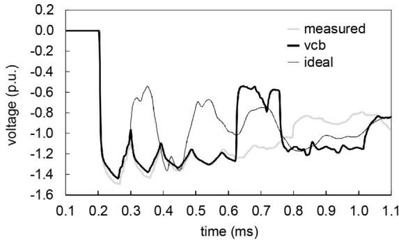  
a)

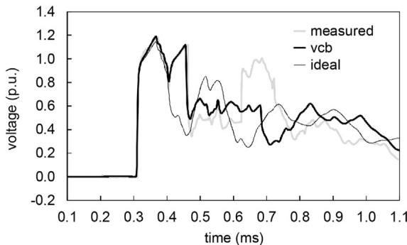

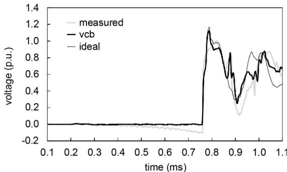  
  
Fig. 12. Comparison between measured voltages at WT A9 and calculated ones by using the VCB2 model and the ideal switch: (a) phase A; (b) phase B; (c) phase C.

Table 2 Overview of VCB2 parameters.   

<table><tr><td>Parameter</td><td>Value</td><td>Unit</td><td>Description</td></tr><tr><td>A2</td><td>30–40</td><td>V μs-1</td><td>Tuned to fit measurements</td></tr><tr><td>B2</td><td>0</td><td>V</td><td>Tuned to fit measurements</td></tr><tr><td>Uc,peak</td><td>58</td><td>kV</td><td>From Eq. (8)</td></tr><tr><td>QCmax,cl</td><td>600</td><td>A μs-1</td><td>Adapted from literature</td></tr></table>

The comparisons show that the inclusion of the more detailed VCB2 model significantly improves the agreement between the simulation and measurement results. Only by using the VCB2 model, the simulation results reproduce the experienced overvoltages at the platform, as shown in Fig. 9, whilst Figs. 11 and 12 show that also the simple built-in switch is able to calculate the over-voltage at both A1 and A9.

# 4. Conclusions

The paper has presented the application of a vacuum circuit breaker model for the accurate simulations of transient recovery

voltages during opening and closing switching operations and the comparison between simulation results and measurements for two test cases represented by a water-pumping plant and an offshore wind farm, respectively.

The water-pumping plant test case has been used for the assessment of the model adequacy for the analysis of the transient recovery voltages generated by the early interruption of the inrush currents of large motors. The offshore wind farm test case has been used for the assessment of the model adequacy for the analysis of cable energisation and the occurrence of multiple prestrikes.

The paper highlights and indicates the parameter values that have been tuned so that the simulated results match the measured ones, in order to overcome the lack of some data of the circuit breaker model.

The comparison between measurement and simulation results show that the inclusion of a specific VCB model makes it possible with good accuracy to replicate the multiple the re-ignitions during current interruptions and prestrikes during the cable energisation manoeuvres.

# References

[1] IEEE Std. C37.011, IEEE Guide for the application of transient recovery voltage for AC high-voltage circuit breakers, 2011.   
[2] IEEE Std. C37.06, IEEE Standard for AC high-voltage circuit breakers rated on a symmetrical current basis – preferred ratings and related required capabilities for voltages above 1000 V, 2009.   
[3] IEEE Std. C37.04, IEEE Standard rating structure for AC high-voltage circuit breakers, 1999 (R2006).   
[4] R. Smeets, L. van der Sluis, M. Kapetanovic, D.F. Peelo, A. Janssen, Switching in Electrical Transmission and Distribution Systems, John Wiley & Sons, 2015.   
[5] Joint Working Group A2/C439, “Electrical transient interaction between transformers and power systems,” CIGRÉ Brochure n. 577A, Part-1 Expertise, April, 2014.   
[6] L.S. Christensen, M.J. Ulletved, P. Sørensen, T. Sørensen, T. Olsen, H. Nielsen, GPS synchronized high voltage measuring system, in: Proc. of Nordic Wind Power Conference, Roskilde, Denmark, November, 2007.   
[7] W. Sweet, Danish wind turbines take unfortunate turn, IEEE Spectr. 41 (11) (2004) 30–34.   
[8] P. Sørensen, A.D. Hansen, T. Sørensen, C.S. Nielsen, H.K. Nielsen, L. Christensen, M. Ulletved, Switching transients in wind farm grids, Proc. of European Wind Energy Conference and Exhibition (2007).   
[9] I. Arana, J. Holbøll, T. Sørensen, A.H. Nielsen, P. Sørensen, O. Holmstrøm, Comparison of measured transient overvoltages in the collection grid of Nysted offshore wind farm with EMT simulations, Proc. of International Conference on Power Systems Transients (IPST) (2009).   
[10] B. Fenski, M. Lindmayer, Post arc currents of vacuum interrupters with radial and axial magnetic field contacts—measurements and simulations, in: Proc. of 19th International Conference on Electric Contact Phenomena, Nuremberg, Germany, September, 1998, pp. 259–267.   
[11] E.F.J. Huber, K.D. Weltmann, K. Froehlich, Influence of interrupted current amplitude on the post arc current and gap recovery after current zero experiment and simulation, IEEE Trans. Plasma Sci. 27 (1999) 930–937.   
[12] J. Helmer, M. Lindmayer, Mathematical modeling of the high frequency behavior of vacuum interrupters and comparison with measured transients in power systems, Proc. of XVIIth International Symposium on Discharges and Electrical Insulation in Vacuum (ISDEIV) 1 (1996) 323–331.   
[13] M. Popov, L. van der Sluis, Comparison of two vacuum circuit breaker arc models for small inductive current switching, Proc. of 19th International Symposium on Discharges and Electrical Insulation in Vacuum (ISDEIV) (2000).   
[14] R.B. Lastra, M. Barbieri, Fast transients in the operation of an induction motor with vacuum switches, in: Proc. of Int. Conf. on Power Systems Transients (IPST), paper 063, Rio de Janeiro, Brasil, 24–28 June, 2001.   
[15] M. Venu Gopala Rao, S.A. Naveed, J. Amaranath, S. Kamakshaiah, B.P. Singh, Reduction of switching transients in the operation of induction motor drives, Proc. of 12th International Symposium on Electrets (2005) 388–391.   
[16] S. Wong, L. Snider, E. Lo, Overvoltages and reignition behavior of vacuum circuit breaker, Proc. of Sixth International Conference on Advances in Power System Control, Operation and Management (ASDCOM) (2003) 653–658.   
[17] B.K. Rao, G. Gajjar, Development and application of vacuum circuit breaker model in electromagnetic transient simulation, Proc. of Power India Conference, IEEE (2006).   
[18] D. Penkov, C. Vollet, B. De Metz-Noblat, R. Nikodem, Overvoltage protection study on vacuum breaker switched MV motors, Proc. of the 5th Petroleum and Chemical Industry Conference Europe – Electrical and Instrumentation Applications (PCIC Europe) (2008).   
[19] G.-B. Wu, J.-J. Ruan, D.-C. Huang, S.-W. Shu, Voltage distribution characteristics of multiple-break vacuum circuit breakers, Proc. of 24th

International Symposium on Discharges and Electrical Insulation in Vacuum (ISDEIV) (2010).   
[20] L. Liljestrand, A. Sannino, H. Breder, S. Thorburn, Transients in collection grids of large offshore wind parks, Wind Energy 11 (2008) 45–61.   
[21] J. Glasdam, J. Bak, I. Arana, Transient studies in large offshore wind farms, taking into account network/circuit breaker interaction, in: Proc. of 10th International Workshop on Large-Scale Integration of Wind Power into Power Systems as well as Transmission Networks for Offshore Wind Farms, Aarhus, Denmark, 2011.   
[22] J. Glasdam, C.L. Bak, J. Hjerrild, Transient studies in large offshore wind farms, employing detailed circuit breaker representation, Energies 5 (7) (2012) 2214–2231.   
[23] S.M. Ghafourian, I. Arana, J. Holbøll, T. Sørensen, M. Popov, V. Terzija, General analysis of vacuum circuit breaker switching overvoltages in offshore wind farms, IEEE Trans. Power Deliv. 31 (October (5)) (2016) 2351–2359.   
[24] A. Greenwood, Vacuum switchgear, IEE Power Ser. 18 (1994).   
[25] P. Slade, The Vacuum Interrupter: Theory, Design, and Application, CRC Press, 2008.   
[26] M. Popov, L. van der Sluis, G.C. Paap, Investigation of the circuit breaker reignition overvoltages caused by no-load transformer switching surges, Eur. Trans. Electr. Power 11 (November (6)) (2001) 413–422.   
[27] Y. Xin, B. Liu, W. Tang, Q. Wu, Modeling and mitigation for high frequency switching transients due to energization in offshore wind farms, Energies 9 (December (12)) (2016) 1044.   
[28] J. Kosmuc, I. Zunko, A statistical vacuum circuit breaker model for simulation of transient overvoltages, IEEE Trans. Power Deliv. 10 (1) (1995) 294–300.

[29] R.P.P. Smeets, T. Funahashi, E. Kaneko, I. Ohshima, Types of reignition following high-frequency current zero in vacuum interrupters with two types of contact material, IEEE Trans. Plasma Sci. 21 (October (5)) (1993) 478–483.   
[30] I. Arana, Switching overvoltages in off-shore wind power grids. Measurements, modelling and validation in time and frequency domain, in: PhD Dissertation, Dept. Electrical Engineering, Technical University of Denmark, 2011.   
[31] A. Borghetti, F. Napolitano, C.A. Nucci, M. Paolone, M. Sultan, N. Tripaldi, Transient recovery voltages in vacuum circuit breakers generated by the interruption of inrush currents of large motors, in: Proc. of 9th International Conference on Power Systems Transients (IPST), Delft, Netherlands, June 14–17, 2011.   
[32] L. Marti, Simulation of transients in underground cables with frequency-dependent modal transformation matrices, IEEE Trans. Power Deliv. 3 (July (3)) (1988) 1099–1110.   
[33] A. Theocharis, M. Popov, R. Seibold, S. Voss, M. Eiselt, Analysis of switching effects of vacuum circuit breaker on dry-type foil-winding transformers validated by experiments, IEEE Trans. Power Deliv. 30 (February (1)) (2015).   
[34] A. Morched, B. Gustavsen, M. Tartibi, A universal model for accurate calculation of electromagnetic transients on overhead lines and underground cables, IEEE Trans. Power Deliv. 14 (July (3)) (1999) 1032–1038.   
[35] U.S. Gudmundsdottir, B. Gustavsen, C.L. Bak, W. Wiechowski, Field test and simulation of a 400 kV crossbonded cable system, IEEE Trans. Power Deliv. 26 (April (3)) (2011) 1403–1410.