# Comparison of Detailed Modeling Techniques for MMC Employed on VSC-HVDC Schemes

Antony Beddard, Student Member, IEEE, Mike Barnes, Senior Member, IEEE, and Robin Preece, Member, IEEE

Abstract—Modular multilevel converters (MMC) are presently the converter topology of choice for voltage-source converter high-voltage direct-current (VSC-HVDC) transmission schemes due to their very high efficiency. These converters are complex, yet fast and detailed electromagnetic transients simulation models are necessary for the research and development of these transmission schemes. Excellent work has been done in this area, though little objective comparison of the models proposed has yet been undertaken. This paper compares for the first time, the three leading techniques for producing detailed MMC VSC-HVDC models in terms of their accuracy and simulation speed for several typical simulation cases. In addition, an improved model is proposed which further improves the computational efficiency of one method. This paper concludes by presenting evidence-based recommendations for which detailed models are most suitable for which particular studies.

Index Terms—Accelerated model, electromagnetic-transient (EMT) simulation, HVDC transmission, modular multilevel converter (MMC), voltage-source converter (VSC).

# I. INTRODUCTION

T HE DEMAND for voltage-source converter (VSC) high-voltage direct-current (HVDC) transmission schemes has grown significantly in recent years. This growth is primarily due to the improvements in the voltage and power ratings of insulated-gate bipolar transistors (IGBTs) and a number of new VSC-HVDC applications, such as the connection of large offshore windfarms.

Since its inception in 1997 and until 2010, all VSC-HVDC schemes employed two- or three-level VSCs [1]. In 2010, the Trans Bay Cable Project became the first VSC-HVDC scheme to use modular multilevel converter (MMC) technology. The MMC has numerous benefits in comparison to two- or three-level VSCs; chief among these is reduced converter losses. Today, the three largest HVDC manufacturers offer a VSC-HVDC solution which is based on multilevel converter technology.

Manuscript received August 12, 2013; revised December 14, 2013 and March 12, 2014; accepted April 29, 2014. Date of publication June 09, 2014; date of current version March 20, 2015. This work was supported by the Engineering and Physical Sciences Research Council (EPSRC) under Grant EP/H018662/1- Supergen ‘Wind Energy Technologies’. Paper no. TPWRD-00903-2013.

The authors are with the School of Electrical and Electronic Engineering, University of Manchester, Manchester M13 9PL, U.K. (e-mail: antony. beddard@postgrad.manchester.ac.uk; mike.barnes@manchester.ac.uk).

Color versions of one or more of the figures in this paper are available online at http://ieeexplore.ieee.org.

Digital Object Identifier 10.1109/TPWRD.2014.2325065

Modelling MMCs in electromagnetic transient simulation (EMT) programs presents a significant challenge in comparison to modeling a two- or three-level VSC. The stack of series connected IGBT's in each arm of a two- or three-level VSC is switched at the same time. This simultaneous switching action enables the stack of IGBTs to be modeled as a single IGBT for many studies. The MMC topology, however, does not contain stacks of series-connected IGBT's which have identical firing signals and, therefore, comparable simplification in the model cannot be made.

The converter employed on the Trans Bay Cable Project is an MMC with approximately 201 levels. A traditional detailed model (TDM) of this converter would require more than 2400 IGBTs with antiparallel diodes and more than 1200 capacitors to be built and electrically connected in the simulation package's graphical user interface, resulting in a large admittance matrix. The admittance matrix must be inverted each switching cycle, for which MMCs can have hundreds of times per fundamental cycle which is extremely computationally intensive. This makes modeling MMCs for HVDC schemes using traditional modeling techniques impracticable.

To address this problem, an efficient model was proposed by Udana and Gole in [2], which is referred to as the detailed equivalent model (DEM) in this paper. In [2], the DEM was shown to significantly reduce the simulation time in comparison with a TDM without compromising accuracy. A drawback of the DEM is that the individual converter components are invisible to the user. This makes the model unsuitable for studies which require access to the individual converter components and it makes it difficult to reconfigure the converter submodule for different topologies. Only one other publication has compared the DEM with the TDM, which was performed in EMTP-RV [3].

A new model, referred to as the accelerated model (AM) was proposed by Xu et al. in [4]. This model was found to offer greater computational efficiency than a TDM without compromising accuracy and it gives the user access to the individual converter components. In [4], an attempt was made to compare the AM simulation time with the DEM simulation time data from [2]; however, a full and objective comparison could not be completed because the models were built by different researchers on different computers.

The objective of this paper is to perform a much needed independent comparison of the TDM, DEM, and AM models which will enable the reader to make a more informed decision when selecting which type of detailed MMC model to use and to have a greater degree of confidence in the MMC models' performance. In this paper, the TDM, DEM, and AM models are built in the same software on the same computer and compared

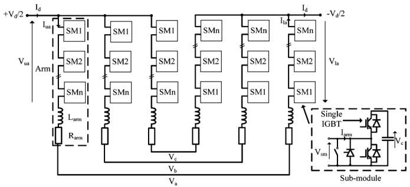  
Fig. 1. Three-phase MMC.

in terms of their accuracy and simulation speed. This enables a fair comparison between the DEM and the AM and it provides the first independent verification for the AM against the TDM, and the DEM against the TDM in PSCAD. Having completed this verification, this paper also highlights potential limitations of the AM and proposes an enhanced accelerated model (EAM) with improved simulation speed.

# II. MMC VSC-HVDC

The basic structure of an MMC is shown in Fig. 1. Each leg of the converter consists of two converter arms which contain a number of submodules, SMs, and a reactor $\operatorname { L } _ { \mathrm { a r m } }$ , connected in series. The SM contains a two-level half-bridge converter with two IGBT's and a parallel capacitor. The SM is also equipped with a bypass switch to remove the SM from the circuit in the event that an IGBT fails and a thyristor to protect the lower diode from overcurrent in the case of a dc-side fault. The bypass switch and thyristor are, however, typically omitted from steady-state and transient studies.

The SM terminal voltage $\mathrm { V _ { s m } }$ is effectively equal to the SM capacitor voltage $\mathrm { V _ { c } }$ when the upper IGBT is switched-on and the lower IGBT is switched-off; the capacitor will charge or discharge depending upon the arm current direction. With the upper IGBT switched off, and the lower IGBT switched on, the SM capacitor is bypassed and, hence, $\mathrm { V _ { s m } }$ is effectively 0 V. Each arm in the converter, therefore, acts like a controllable voltage source with the smallest voltage change being equal to the SM capacitor voltage.

With reference to Fig. 1, the following equation for the phase a converter voltage can be derived:

$$
V _ {a} = \frac {V _ {d}}{2} - V _ {u a} - L _ {a r m} \frac {d I _ {u a}}{d t} - R _ {a r m} I _ {u a} \tag {1}
$$

$$
V _ {a} = V _ {l a} - \frac {V _ {d}}{2} + L _ {a r m} \frac {d I _ {l a}}{d t} + R _ {a r m} I _ {l a}. \tag {2}
$$

The converter arm currents consist of three main components as given by (3) and (4). The circulating current $\operatorname { I } _ { \mathrm { c i r c } }$ is due to the unequal dc voltages generated by the three converter legs. Substituting (3) and (4) into (1) and (2), then summing the resulting equations gives

$$
I _ {u a} = \frac {I _ {d}}{3} + \frac {I _ {a}}{2} + I _ {\text {c i r c}} \tag {3}
$$

$$
I _ {l a} = \frac {I _ {d}}{3} - \frac {I _ {a}}{2} + I _ {\text {c i r c}} \tag {4}
$$

$$
V _ {a} = \frac {V _ {l a} - V _ {u a}}{2} - \frac {L _ {\mathrm {a r m}}}{2} \frac {d I _ {a}}{d t} - \frac {R _ {\mathrm {a r m}}}{2} I _ {a}. \tag {5}
$$

Equation (5) shows that the converter phase voltages are effectively controlled by varying the upper and lower arm voltages. Each converter arm contains a number of SMs: . The SM capacitor voltage can be described by (6), assuming the SM capacitance is sufficiently large enough to neglect ripple voltage and that the capacitor voltages are well balanced

$$
V _ {c} = \frac {V _ {d}}{n}. \tag {6}
$$

The voltage produced by a converter arm is equal to the number of SMs in the arm which are turned on, multiplied by the submodule capacitor voltage as given by (7) and (8). Through appropriate control of the SMs, the output voltage magnitude and phase can be controlled independently. The number of voltage levels that an MMC can produce at its output is equal to the number of SMs in a single arm plus one

$$
V _ {u a} = n _ {o n u a} \times V _ {c} \tag {7}
$$

$$
V _ {l a} = n _ {\text {o n l a}} \times V _ {c}. \tag {8}
$$

# III. DETAILED MMC MODELING TECHNIQUES

This section describes three detailed modelling techniques which represent the converter's IGBTs and diodes using a simple two-state resistance.

# A. Traditional Detailed Model

In a traditional detailed MMC model, each SM's IGBTs, diodes, and capacitors are built in the simulation package graphical user interface, and electrical connections are made between the SMs in each arm as shown in Fig. 1. This is the standard way of building a detailed MMC model and, hence, is why this type of model is referred to as the traditional detailed model (TDM). This method of modeling is intuitive and gives the user access to the individual components in each SM; however, for MMCs with a large number of SMs, this method is very computationally inefficient.

# B. Detailed Equivalent Model

The DEM uses the method of nested fast and simultaneous solution (NFSS) [5]. The NFSS approach partitions the network into small subnetworks, and solves the admittance matrix for each network separately [2]. Although this increases the number of steps to the solution, the size of admittance matrices is smaller, which can lead to reduced simulation time. A summary of the DEM is presented in the Appendix; however, further information can be found in [2]. The DEM employed in this comparison was obtained directly from PSCAD.

# C. Accelerated Model

The accelerated model (AM) was proposed by Xu et al. in [4]. In many respects, the AM is a hybrid between the TDM and the DEM. The user is able to access the SM components, as they can with the TDM, but the converter arm is modeled as a controllable voltage source, which is similar to the DEM. An overview of the AM is presented here; the reader is referred to [4] for further information.

In the AM, the series-connected SMs are removed from each converter arm, separated and driven by a current source with

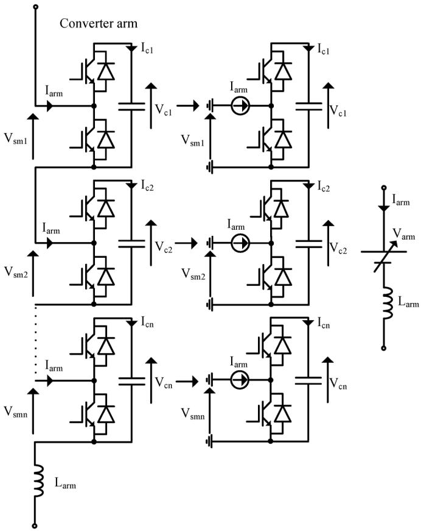  
Fig. 2. Implementation steps for the accelerated model.

a value equal to the arm current $\mathrm { I _ { a r m } }$ . A controllable voltage source is installed in place of the SMs as shown in Fig. 2, where the value of the controllable voltage source is given by

$$
V _ {\text {a r m}} = \sum_ {i = 1} ^ {n} V _ {s m i}. \tag {9}
$$

The AM reduces the size of the main network admittance matrix by solving the admittance matrix for each SM separately.

The AM has two key advantages in comparison to the DEM. The first is that the AM allows the user access to SM components. The second is that because the AM is implemented using standard PSCAD components, the internal structure of the SM can be easily modified; for example, changing from a half-bridge SM to a full-bridge SM.

# IV. SIMULATION MODELS

A detailed MMC model for a typical VSC-HVDC scheme, employing the traditional detailed model (TDM) converter arm representation, has been developed. This model is used as the TDM simulation model base case. The simulation models for the DEM and for the accelerated model (AM) are identical to the TDM, except that the TDM converter arms are replaced with the converter arms required for the DEM and AM, respectively. This approach ensures that fair comparisons between the different modeling techniques can be made.

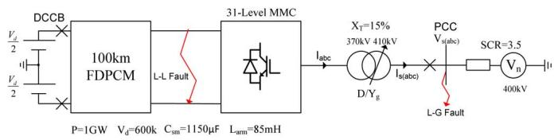  
Fig. 3. Basic simulation model structure.

# A. Model Structure

This model is similar in scope to [2] and [4] but represents a subsection of the network rather than just the converter used in [4]. This gives a more realistic timing comparison since one would not normally just be simulating the converter in typical power system studies. The basic structure of the simulation model and the key parameters are shown in Fig. 3.

Developing a TDM for an MMC with hundreds of SMs, such as a commercial installation, would result in lengthy simulation times. A 31-level MMC was selected for this model since it produces acceptable harmonic performance $( \mathrm { V _ { L - L } T H D } < 1 . 5 \%$ at the PCC) [6] with a nearest level controller (NLC) without unnecessarily increasing the simulation time and yet still providing a sufficient converter complexity to provide a fair test. The key factor which determines the required number of SMs in commercial HVDC installations is the dc voltage and the maximum permissible voltage stress per IGBT, rather than the harmonic content of the output waveform. Therefore, more levels would be used in commercial installations.

The selection of the SM capacitance value is a tradeoff between the capacitance ripple voltage and the size of the capacitor. The SM capacitance was calculated to give a ripple voltage of 10%.

The arm reactors have two main functions. The first function is to suppress the circulating currents between the legs of the converter, which exist because the dc voltages generated by each converter leg are not exactly equal. The second function of the arm reactor is to limit the fault current rate of rise to within acceptable levels. According to [7], the Siemens HVDC Plus MMC arm reactors limit the fault current to tens of amperes per microsecond even for the most critical fault conditions. The arm reactor for this model was dimensioned to ensure that the fault current rate of rise does not exceed 20 $\mathbf { A } / \mu \mathbf { s }$ for a short circuit between the dc terminals of the converter, and to limit the circulating current to approximately 0.15 p.u.

The dc system is modeled as a dc voltage source connected in series with a frequency-dependent phase cable model (FDPCM) which represents two 300-kV 100-km XLPE cables. The ac network is modelled as a voltage source connected in series with a resistor and an inductor, to give a relatively strong short-circuit ratio (SCR) of 3.5. The converter transformer employs a delta/ star winding with a tap changer.

# B. MMC VSC-HVDC Control Systems

A simplified diagram for the three-phase 31-level MMC control system is shown in Fig. 4.

1) Current Controller: The impedance between the internal voltage control variables $\mathrm { V _ { c ( a b c ) } }$ and the ac system voltage

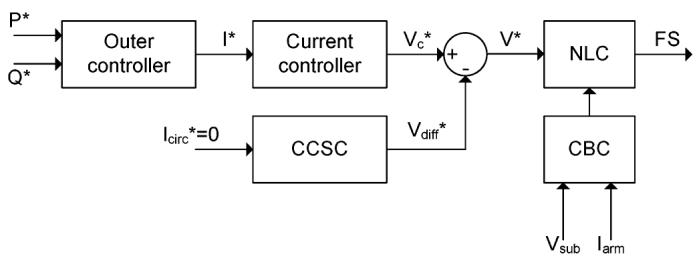  
Fig. 4. Simplified MMC control system.

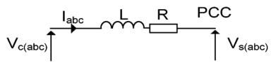  
Fig. 5. MMC phase a connection to an ac system.

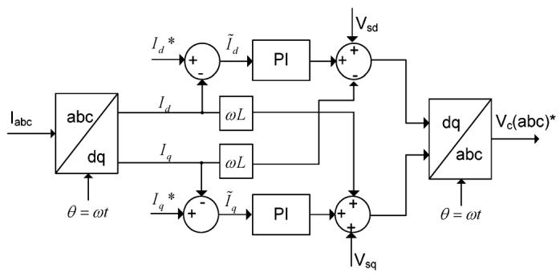  
Fig. 6. Implementation of the current controller.

$\mathrm { V _ { s ( a b c ) } }$ is shown in Fig. 5. Equation (10) describes the relationship between the internal voltage control variable and the ac system voltage for the three phases

$$
V _ {c s (a b c)} = L \frac {d I _ {a b c}}{d t} + R I _ {a b c} \tag {10}
$$

where

$$
V _ {c s (a b c)} = V _ {c (a b c)} - V _ {s (a b c)}
$$

$$
L = \frac {L _ {\text {a r m}}}{2} + L _ {T} \quad R = \frac {R _ {\text {a r m}}}{2} + R _ {T}. \tag {11}
$$

Equation (10) in the synchronous reference frame gives (12), where $\mathrm { \Delta p } = \mathrm { d } / \mathrm { d t }$

$$
\left[ \begin{array}{l} V _ {d} \\ V _ {q} \end{array} \right] = R \left[ \begin{array}{l} I _ {d} \\ I _ {q} \end{array} \right] + L p \left[ \begin{array}{l} I _ {d} \\ I _ {q} \end{array} \right] + \omega L \left[ \begin{array}{c c} 0 & - 1 \\ 1 & 0 \end{array} \right] \left[ \begin{array}{l} I _ {d} \\ I _ {q} \end{array} \right]. \tag {12}
$$

The current controller employed in this model is a fast feedback decoupled controller, which produces a voltage reference for the MMC based upon the current setpoint from the outer controllers. The implementation of the controller is shown in Fig. 6.

2) Outer Controllers: In the magnitude invariant synchronous reference frame with the -axis aligned with $\mathrm { { V _ { a } } , }$ , the real and reactive power flow at the point of common coupling can be described by (13) and (14), respectively. Feedforward

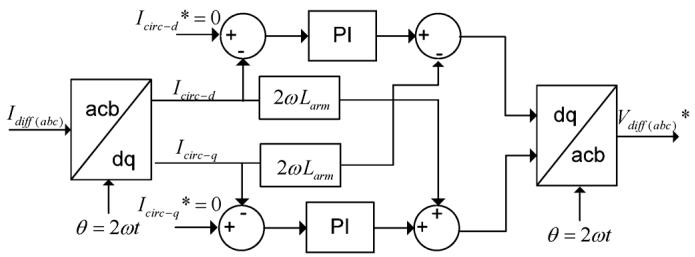  
Fig. 7. Implementation of CCSC.

controllers are used to set the $\mathrm { I _ { d } }$ and $I _ { \mathrm { q } }$ values to control the real and reactive power, respectively

$$
P = \frac {3}{2} V _ {s d} I _ {d} \tag {13}
$$

$$
Q = - \frac {3}{2} V _ {s d} I _ {q}. \tag {14}
$$

3) Circulating Current Suppressing Controller: The circulating current is a negative-sequence (a-c-b) current at double the fundamental frequency [8]. This current is found to increase the rms value of the arm current leading to increased converter losses [8]. The circulating current suppressing controller (CCSC) is able to suppress the circulating current by controlling the voltage across the arm impedance. The development of this controller is based on work carried out in [8]. Using phase a, as an example, the dc voltage can be described by (15). Substituting (3) and (4) into (15) and then rearranging gives

$$
V _ {d} = V _ {u a} + I _ {u a} (R + L p) + I _ {l a} (R + L p) + V _ {l a} \tag {15}
$$

$$
V _ {\text {d i f f} - \mathrm {a}} = I _ {\text {d i f f} - \mathrm {a}} \left(R _ {\text {a r m}} + L _ {\text {a r m}} p\right) \tag {16}
$$

where

$$
V _ {\text {d i f f - a}} = \frac {V _ {d}}{2} - \frac {V _ {u a} + V _ {l a}}{2} \tag {17}
$$

$$
I _ {\text {d i f f} - \mathrm {a}} = \frac {I _ {d}}{3} + I _ {\text {c i r c} - \mathrm {a}}. \tag {18}
$$

In matrix form, (16) for the three phases can be written as (19). Applying the $a b c / d q$ transform to (19) gives (20). The zero-sequence quantities do not affect the -axis and -axis values and, hence, the use of $\operatorname { I } _ { \mathrm { c i r c } }$ in

$$
\left[ \begin{array}{l} V _ {\text {d i f f - a}} \\ V _ {\text {d i f f - c}} \\ V _ {\text {d i f f - b}} \end{array} \right] = R \left[ \begin{array}{l} I _ {\text {d i f f - a}} \\ I _ {\text {d i f f - c}} \\ I _ {\text {d i f f - b}} \end{array} \right] + L p \left[ \begin{array}{l} I _ {\text {d i f f - a}} \\ I _ {\text {d i f f - c}} \\ I _ {\text {d i f f - b}} \end{array} \right] \tag {19}
$$

$$
\begin{array}{l} \left[ \begin{array}{c} V _ {\text {d i f f - d}} \\ V _ {\text {d i f f - q}} \end{array} \right] = R _ {\text {a r m}} \left[ \begin{array}{c} I _ {\text {c i r c - d}} \\ I _ {\text {c i r c - q}} \end{array} \right] + L _ {\text {a r m}} p \left[ \begin{array}{c} I _ {\text {c i r c - d}} \\ I _ {\text {c i r c - q}} \end{array} \right] \\ + \left[ \begin{array}{c c} 0 & - 2 \omega L _ {\mathrm {a r m}} \\ 2 \omega L _ {\mathrm {a r m}} & 0 \end{array} \right] \left[ \begin{array}{l} I _ {\mathrm {c i r c - d}} \\ I _ {\mathrm {c i r c - q}} \end{array} \right]. \tag {20} \\ \end{array}
$$

A decoupled circulating current controller is employed with the $\mathrm { I _ { c i r c - d q } ^ { * } }$ reference values set to zero as shown in Fig. 7.

4) Capacitor Balancing Controller: The capacitor balancing controller (CBC) ensures that the energy variation in each converter arm is shared equally between the submodules within that arm. The CBC method proposed in [9] has formed the basis of many of capacitor balancing controllers for VSC–HVDC

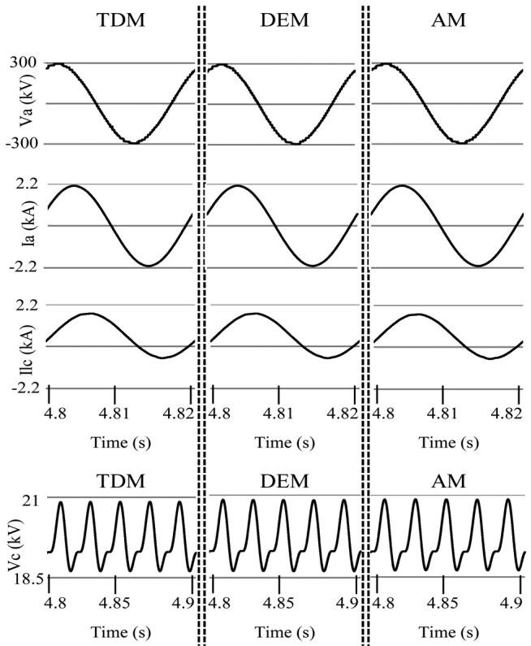  
Fig. 8. Steady-state simulation results for the three models. From top to bottom: (a) Phase A output voltage. (b) Phase A output current. (c) Phase C lower arm current. (d) Phase A upper arm mean capacitor voltage.

MMCs [2], [10]–[12]. The CBC employed here is also based on this method.

5) Nearest Level Controller: A number of modulation methods have been proposed for MMCs [9], [11], [12]. The nearest level controller (NLC) method produces waveforms with an acceptable amount of harmonic content when a suitable number of MMC levels are employed. It is the least computational complex method of the aforementioned techniques and, thus, is used for the model in this paper.

# V. RESULTS

In this section, the three models are compared in terms of their accuracy and simulation speed.

# A. Accuracy

The models' accuracy is assessed for steady-state and transient events through conducting a range of typical studies. Their accuracy is evaluated graphically and numerically by calculating the mean absolute error (MAE) of the waveforms produced by the DEM and AM with respect to the TDM. The MAE is normalized to the mean value of the TDM waveform.

1) Steady-State: The steady-state waveforms produced by the models for the converter operating as an inverter at 1000 MW are shown in Fig. 8. The waveforms are virtually identical and this is confirmed by the very small ( 1%) normalized MAE values given in Table I. The models were re-simulated for the converter operating as an inverter at 500 MW and 100 MW, and their normalized MAE values are given in Tables II and III, respectively. The results generally show that the accuracy of the

TABLE INORMALIZED MEAN ABSOLUTE ERROR FOR THE DEM AND AM WAVEFORMSWHEN OPERATING IN STEADY STATE AT 1000 MW  

<table><tr><td colspan="3">1000MW Steady-state</td></tr><tr><td>Signal</td><td>DEM error (%)</td><td>AM error (%)</td></tr><tr><td>Va</td><td>0.27</td><td>0.81</td></tr><tr><td>Ia</td><td>0.12</td><td>0.48</td></tr><tr><td>Iua</td><td>0.32</td><td>0.61</td></tr><tr><td>Vc</td><td>0.11</td><td>0.21</td></tr></table>

TABLE IINORMALIZED MEAN ABSOLUTE ERROR FOR THE DEM AND AM WAVEFORMSWHEN OPERATING IN STEADY STATE AT 500 MW  

<table><tr><td colspan="3">500MW Steady-state</td></tr><tr><td>Signal</td><td>DEM error (%)</td><td>AM error (%)</td></tr><tr><td>Va</td><td>0.27</td><td>0.54</td></tr><tr><td>Ia</td><td>0.35</td><td>0.66</td></tr><tr><td>Iua</td><td>0.77</td><td>1.07</td></tr><tr><td>Vc</td><td>0.03</td><td>0.07</td></tr></table>

TABLE IIINORMALIZED MEAN ABSOLUTE ERROR FOR THE DEM AND AM WAVEFORMSWHEN OPERATING IN STEADY STATE AT 100 MW  

<table><tr><td colspan="3">100MW Steady-state</td></tr><tr><td>Signal</td><td>DEM error (%)</td><td>AM error (%)</td></tr><tr><td>Va</td><td>0.47</td><td>0.85</td></tr><tr><td>Ia</td><td>2.37</td><td>2.64</td></tr><tr><td>Iua</td><td>3.27</td><td>4.76</td></tr><tr><td>Vc</td><td>0.04</td><td>0.05</td></tr></table>

models decreases as the operating point decreases. This is especially the case for the phase current and arm current. At lower operating points, the magnitude of the arm and phase currents are smaller and the switching noise is more noticeable. It appears to be the case that the effect of this switching noise on the dominant signal and the model's inability to replicate it is impacting the normalized MAE values. The average THD of the phase A output voltages for the three models, when operating at 1000 MW in steady state, was found to be between 1.35% and 1.36%.

2) DC-Side Line-to-Line Fault: A dc line-to-line fault is applied at 4.5 s to the MMC terminals as shown in Fig. 3. The dc circuit breakers (DCCBs) are opened 2 ms after the fault is applied so that the dc voltage sources do not continue to contribute to the fault current. The MMC converter is blocked at 4.502 s, and the ac-side circuit breakers (CBs) are opened at 4.56 s. In this paper, the converter is considered to be blocked when both IGBTs are switched off. The waveforms produced by the models are shown in Fig. 9 and their normalized MAE values are given in Table IV. The waveforms produced by the DEM and the AM are virtually identical ( 1%) and very similar ( 2.5%) to the TDM, respectively. An error in the AM model's

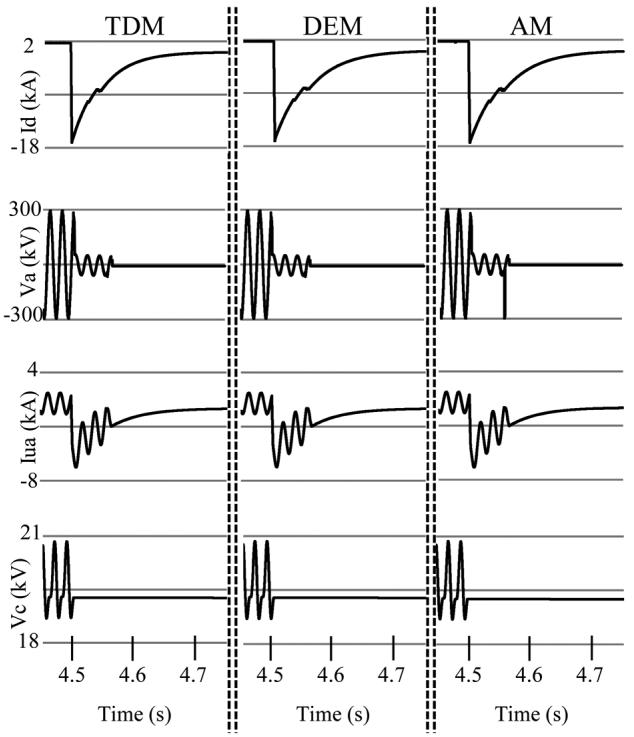  
Fig. 9. DC line current for a dc line-to-line fault applied at 4.5 s. From top to bottom: (a) dc current, (b) phase A output voltage, (c) phase A upper arm current, and (d) phase A upper arm mean capacitor voltage.

TABLE IVNORMALIZED MEAN ABSOLUTE ERROR FOR THE DEM AND AM WAVEFORMSFOR A DC LINE-TO-LINE FAULT  

<table><tr><td colspan="3">DC Fault</td></tr><tr><td>Signal</td><td>DEM error (%)</td><td>AM error (%)</td></tr><tr><td>Id</td><td>0.41</td><td>2.29</td></tr><tr><td>Va</td><td>0.22</td><td>1.12</td></tr><tr><td>Iua</td><td>0.51</td><td>1.83</td></tr><tr><td>Vc</td><td>0.07</td><td>0.07</td></tr></table>

phase voltage is shown in Fig. 9 at the instances when the arm current goes through zero. This issue occurs because the AM is not able to correctly determine the ON/OFF status of the SM diodes in a single time step when the converter is blocked. This issue is discussed further in Section V-A-4.

3) AC Line-to-Ground Fault: A line-to-ground fault is applied to phase A at the point of common coupling (PCC) for 60 ms at 4.5 s as shown in Fig. 3. The waveforms produced by the models are shown in Fig. 10, and their normalized MAE values are given in Table V.

With the exception of the Phase A upper arm current, the waveforms produced by the DEM and the AM are virtually identical ( 1%) and very similar ( 2.5%) to the TDM, respectively. From all of the simulations conducted, the greatest difference between the three models was found to be in the Phase A upper arm current a few cycles after the fault is cleared when the MMC becomes overmodulated as highlighted in Fig. 10(d). This difference lasts for a few cycles, and there is no significant difference in the peak current values for the three models.

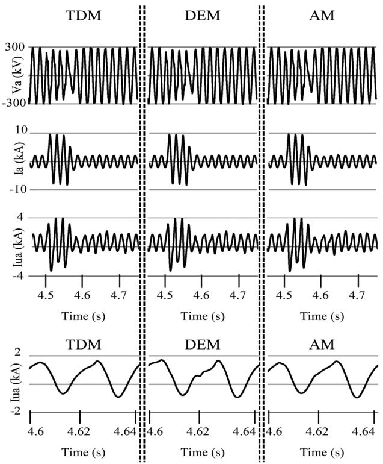  
Fig. 10. Line-to-ground fault for the phase applied at 4.5 s. (a) Phase A output voltage. (b) Phase A output current. (c) Phase A upper arm current. (d) Phase A arm current, zoomed.

TABLE VNORMALIZED MEAN ABSOLUTE ERROR FOR THE DEM AND AM WAVEFORMSFOR A LINE-TO-GROUND AC FAULT  

<table><tr><td colspan="3">AC Fault</td></tr><tr><td>Signal</td><td>DEM error (%)</td><td>AM error (%)</td></tr><tr><td>Va</td><td>0.96</td><td>1.76</td></tr><tr><td>Ia</td><td>0.51</td><td>1.37</td></tr><tr><td>Iau</td><td>3.01</td><td>4.34</td></tr><tr><td>Iau zoom</td><td>11.72</td><td>5.14</td></tr></table>

The circulating current is a key component of the arm current as described in (3). Comparing the accuracy of the arm current therefore effectively compares the models' ability to simulate the circulating currents. The CCSC suppresses the circulating currents to very low values in steady-state operation, which is shown in Fig. 10(c) by the low levels of distortion in the arm current waveforms before the ac fault and several cycles after it are cleared ( 4.7 s).

4) AM Simulation Limitation: The AM implemented in this paper was found to be unable to fully manage the simulation case when the converter is blocked as shown in Fig. 9. To further demonstrate this issue, the converter is blocked at 3 s when operating as an inverter at 1000 MW, and the Phase A output voltage for the three models is shown in Fig. 11. Clearly, the converter voltage for phase A for the AM is different.

This is an inherent issue with the implementation of the AM and can be illustrated further at the SM level. A circuit diagram for a blocked SM connected to a voltage through a resistor is

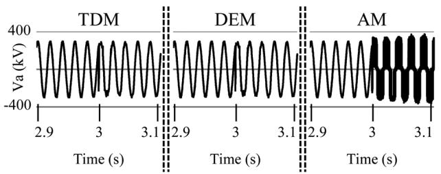  
Fig. 11. Phase A output voltage.

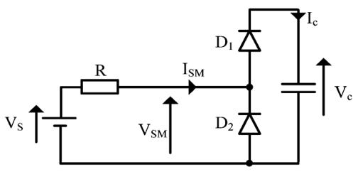  
Fig. 12. Example SM test circuit.

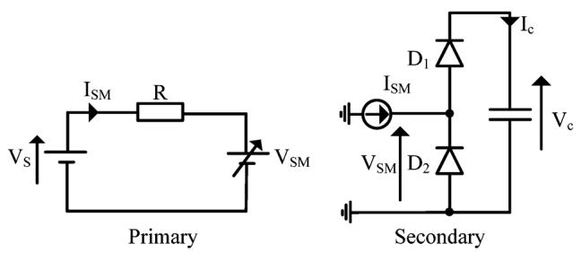  
Fig. 13. Implementation of the SM test circuit based on AM principles.

shown in Fig. 12. A model of this circuit based on the principles of the AM is shown in Fig. 13.

The SM current $\mathrm { I } _ { \mathrm { S M } }$ is measured in the primary circuit and is used as the current source reference in the secondary circuit, and the SM voltage is measured in the secondary circuit and is used as the voltage-source reference in the primary circuit. Each network is therefore solved at the present time step based on information from the other network at the previous time step.

Upon model initialization, $V _ { \mathrm { S M } } = 0 \mathrm { V }$ and, therefore, the SM current flows in the positive direction causing the upper diode D1 to conduct and the SM capacitor to charge. Once the SM capacitor is fully charged, if the voltage-source value is reduced, the upper SM diode $\mathrm { D _ { 1 } }$ should become reversed biased. ${ \mathrm { A s } } -$ suming that the SM diodes are ideal, the SM capacitor voltage should remain constant $\mathrm { V _ { s } = V _ { s m } }$ and $\mathrm { { I } } _ { \mathrm { { s m } } } = 0$ . However, this is not the case with the model implemented based on the AM principles. The arm current in the primary circuit becomes negative because the value of $\mathrm { V } _ { \mathrm { S M } }$ is equal to $\mathrm { V _ { c } }$ which is higher than $\mathrm { V } _ { \mathrm { s } } .$ . At the next time step, the negative arm current value causes the lower diode in the secondary circuit to conduct and, hence, $\mathrm { V } _ { \mathrm { S M } } = 0$ . At the next time step, the arm current becomes equal to $V _ { s } / R _ { s }$ , causing the SM capacitor to charge. This behavior continues for the remaining simulation time. This limitation is understood to have been addressed by Xu et al. and is therefore not discussed further in this paper.

TABLE VI COMPARISON OF RUN TIMES FOR THE THREE MODELS FOR 5-s SIMULATION   

<table><tr><td>MMC
Levels</td><td>Indices</td><td>TDM</td><td>DEM</td><td>AM</td></tr><tr><td rowspan="2">16</td><td>Time (s)</td><td>178</td><td>62</td><td>107</td></tr><tr><td>Ratio</td><td>-</td><td>2.86</td><td>1.66</td></tr><tr><td rowspan="2">31</td><td>Time (s)</td><td>949</td><td>82</td><td>176</td></tr><tr><td>Ratio</td><td>-</td><td>11.59</td><td>5.39</td></tr><tr><td rowspan="2">61</td><td>Time (s)</td><td>4570</td><td>107</td><td>329</td></tr><tr><td>Ratio</td><td>-</td><td>42.57</td><td>13.88</td></tr></table>

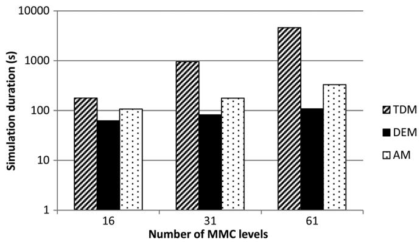  
Fig. 14. Simulation times of the three models for different MMC levels.

# B. Simulation Speed

A 5-s simulation was performed for a $1 6 - , 3 1 - ,$ and 61-level MMC using the three modeling techniques with a $2 0 \mathrm { - } \mu \mathrm { s }$ time step. The simulations were conducted on a Microsoft windows 7 operating system with a 2.5-GHz Intel core iq7-2860 processor and 8 GB of RAM, running on PSCAD X4. The simulation times are given in Table VI and compared in Fig. 14.

The data show that the DEM is the fastest, and that TDM is the slowest. It also shows that the simulation time for the TDM increases at a much faster rate than the DEM and AM models as the number of converter levels increases.

It is worth noting that the results in [2] and [4] do appear, in general, to show that their respective models simulate faster in comparison to the TDM than the results presented in Table VI. The models simulated in this report are, however, different from the models employed in [2] and [4] in terms of complexity which may explain the difference.

1) Enhanced AM Model: The AM has the advantage that it is much faster than the TDM without noticeably sacrificing accuracy for the majority of case studies. It does, however, need to be used with care when the converter is blocked. In comparison with the DEM, the AM has the advantage of allowing access to the SM components, but it is slower. This paper proposes an enhancement to the AM to improve its speed.

The procedure outlined in [4], to produce the AM divides the series-connected SMs in each arm into individual circuits, driven by a current source whose value is equal to the arm current, as explained in Section III-C. This approach effectively creates a subsystem for each SM and solves the admittance matrix for each SM separately. Although this increases the

TABLE VII COMPARISON OF RUN TIMES FOR DIFFERENT AM MODELS   

<table><tr><td>Model</td><td>Time (s)</td><td>Ratio</td></tr><tr><td>AM</td><td>176</td><td>-</td></tr><tr><td>AM5</td><td>138</td><td>1.28</td></tr><tr><td>AM10</td><td>139</td><td>1.27</td></tr><tr><td>AM30</td><td>147</td><td>1.20</td></tr></table>

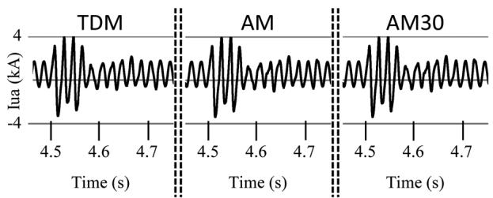  
Fig. 15. Line-to-ground fault for phase A applied at 4.5 s.

TABLE VIIINORMALIZED MEAN ABSOLUTE ERROR FOR THE AM AND AM30 WAVEFORMSFOR A LINE-TO-GROUND AC FAULT  

<table><tr><td>Signal</td><td>AM error (%)</td><td>AM 30 error (%)</td></tr><tr><td>Va</td><td>1.76</td><td>1.74</td></tr><tr><td>Iua</td><td>4.34</td><td>4.42</td></tr></table>

number of steps to the solution, the size of admittance matrices is smaller, which can lead to reduced simulation time [2], [4], [5] as shown in Table VI.

The simulation speed is affected by the number of steps to the solution and the size of the admittance matrices. Hence, it can be more efficient to group a number of SMs together in order to reduce the number of steps to the solution at the expense of larger admittance matrices.

A 5-s simulation was performed for a 31-level MMC with groups of 1 (AM), 5 (AM5), 10, and 30 SMs. The results given in Table VII show that it is more efficient to create a subnetwork for 5, 10, or 30 SMs rather than produce a subnetwork for each SM. This is an important result since splitting a simulation model into a smaller number of subnetworks tends to be less time consuming for the user, can improve simulation speed, and reduce the risk of application instability.

The ac fault test scenario (Section V-A-3) was performed using an AM30 model to assess any change in the model's accuracy. The arm current waveforms for a TDM, AM, and AM30 are compared in Fig. 15 and the normalized MAE values for the AM and AM30 model with respect to the TDM are given in Table VIII. The results show that there is very little change.

# VI. ANALYSIS AND RECOMMENDATIONS

The three detailed EMT models compared in this paper represent the converter's IGBTs and diodes using a simple two-state resistance and are therefore not suitable for studies which require a detailed representation of the power-electronics devices, such as the assessment of switching losses. The type of model

compared in this paper is typically employed for control and protection studies where the converter dynamics are important.

Although the three models compared in this paper represent the power-electronics devices in the same way their implementation is different, this has an effect on the accuracy of their results. A key difference between the TDM and DEM used in this paper is that the DEM does not use interpolation and the key difference between the TDM and AM is that the solution of the AMs is dependent upon information from different subnetworks at the previous timestep. These are the two most significant reasons why there is a small difference between the results produced by each model, particularly under transient conditions. The results in Table VIII have shown that even when two models are based on the same modeling technique, but implemented slightly differently, the simulation results are not identical. Using the TDM as the benchmark, the DEM was generally found to be more accurate than the AM, and the AM was also found to produce numerical errors when the converter is blocked and the arm current changes direction.

The different implementation methods for the three models have a significant impact on their simulation speed. The results in this paper have shown that the DEM is the fastest and the TDM is the slowest. The simulation times for the TDM increase significantly more than the DEM and the AM as the number of converter levels increase and, hence, the DEM and AM modelling techniques have great value when modeling MMCs with a relatively large number of levels. The results in this paper have shown that a model of a 61-level MMC based on DEM and AM techniques is 43 and 14 times faster than the TDM, respectively.

In the DEM, the SM components are not visible to the user and, therefore, this model is not suitable for studies which require direct access to the SM components. The TDM and AM do allow the user access to the SM components and can therefore be easily modified for the required study.

It is for these reasons that the DEM is considered to be the most suitable model for all studies which do not require access to the SM components. The AM should be considered for studies which require access to the SM components and where simulation speed is an important factor; however, great care should be taken if the study requires the converter to be blocked. The user is also advised to create a subnetwork for a number of SMs rather than for each SM since this may reduce implementation time, simulation time, and the possibility of application instability. The TDM is recommended for studies which require access to the SM components and for the converter to be blocked. The TDM is also recommended when simulation speed is not an important factor.

# VII. CONCLUSION

This paper has presented the first independent comparison of two previously developed MMC modelling techniques (AM and DEM). It is has also presented the first independent verification of the AM, and the first independent verification of the DEM in PSCAD. An MMC-HVDC test system was developed and the AM model and DEM modelling techniques were compared against the TDM modeling technique in terms of accuracy and simulation speed. The accuracy of the AM and DEM models was evaluated graphically and numerically for

steady-state and transient studies. The unique findings contained within this paper have shown that the AM and DEM modelling techniques offer a good level of accuracy but that the DEM is generally more accurate than the AM. The AM and DEM models have been shown to simulate significantly faster than the TDM, and the DEM is more computationally efficient than the AM. However, the AM model does provide access to SM components (which is not possible with the DEM) and so may be considered when this is an important factor.

The AM model was found to have limited performance for certain conditions when the converter is blocked. This finding highlights the importance of this comparative study since it has highlighted previously unreported shortcomings of discussed modeling techniques. It was also shown that by modifying the original AM by producing a subnetwork for a number of SMs rather than for a single SM, the simulation run time could be improved.

These results have been used to propose a set of modelling recommendations (Section VI) which summarize the findings of this study and offer technical guidance on state of the art of detailed MMC modelling.

# APPENDIX MMC MODEL DETAILS

# A. Detailed Equivalent Model

A summary of the DEM is presented here; however, further information can be found in [2].

1) Nested Fast and Simultaneous Solution: The NFSS approach is best explained with the aid of an example [2]. The equivalent admittance matrix for a network which is split into two subsystems is given by

$$
\left( \begin{array}{l l} Y _ {1 1} & Y _ {1 2} \\ Y _ {2 1} & Y _ {2 2} \end{array} \right) \left( \begin{array}{l} V _ {1} \\ V _ {2} \end{array} \right) = \left( \begin{array}{l} J _ {1} \\ J _ {2} \end{array} \right) \tag {21}
$$

where

$Y _ { 1 1 } , Y _ { 2 2 }$ admittance matrices for subsystem 1 and subsystem 2 respectively;

$Y _ { 1 2 } , Y _ { 2 1 }$ admittance matrices for the interconnections;

$V _ { 1 } , V _ { 2 }$ unknown node voltage vectors;

$J _ { 1 } , J _ { 2 }$ source current vectors.

The number of nodes in subsystem 1 and subsystem 2 are $\mathrm { N _ { 1 } }$ and $\mathrm { N _ { 2 } } .$ , respectively. The direct solution of (21) for the unknown vector voltages requires an admittance matrix of size $\left( \mathrm { N } _ { 1 } + \mathrm { N } _ { 2 } \right) \times \left( \mathrm { N } _ { 1 } + \mathrm { N } _ { 2 } \right)$ to be inverted.

Rearranging the second row of (21) for $\mathrm { { V _ { 2 } } }$ gives (22). Substituting (22) into the first row of (21) produces (23) which can be rearranged for $\mathrm { V } _ { 1 }$ , as given by

$$
V _ {2} = - Y _ {2 2} ^ {- 1} Y _ {2 1} V _ {1} + Y _ {2 2} ^ {- 1} J _ {2} \tag {22}
$$

$$
J _ {1} = Y _ {1 1} V _ {1} + Y _ {1 2} \left(Y _ {2 2} ^ {- 1} J _ {2} - Y _ {2 2} ^ {- 1} Y _ {2 1} V _ {1}\right) \tag {23}
$$

$$
V _ {1} = \left(Y _ {1 1} - Y _ {1 2} Y _ {2 2} ^ {- 1} Y _ {2 1}\right) ^ {- 1} \left(J _ {1} - Y _ {1 2} Y _ {2 2} ^ {- 1} J _ {2}\right). \tag {24}
$$

$\mathrm { V } _ { 1 }$ , calculated from (24) is then substituted into (22) to calculate $\mathrm { { V _ { 2 } } }$ . Once all unknown voltages are calculated, all currents can then be calculated. This approach requires the inversion of

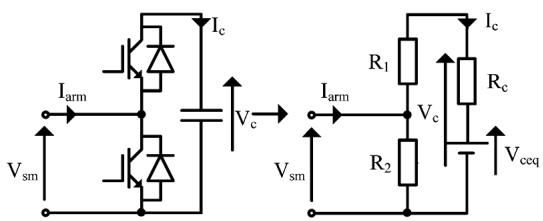  
Fig. 16. SM circuit (left) SM equivalent circuit (right).

two matrices $Y _ { 2 2 }$ of size $\left( \mathrm { N } _ { 2 } \times \mathrm { N } _ { 2 } \right)$ and $\left( Y _ { 1 1 } - Y _ { 1 2 } Y _ { 2 2 } ^ { - 1 } Y _ { 2 1 } \right) ^ { - 1 }$ of size $\left( \mathrm { N } _ { 1 } \times \mathrm { N } _ { 1 } \right)$ , instead of a single matrix of size $\left( \mathrm { N } _ { 1 } + \mathrm { N } _ { 2 } \right) \times$ $\left( \mathrm { N } _ { 1 } + \mathrm { N } _ { 2 } \right)$ . This example partitioned the original network into two subsystems; however, the network can be split into many subsystems. In the DEM, each converter arm is modelled as its own subsystem.

The size of the admittance matrices for each converter arm is related to the number of SMs; hence, for MMCs with a high number of levels, the size of the admittance matrices to be inverted are still relatively large. To further improve the simulation speed, the DEM reduces each converter arm to a Norton equivalent circuit.

2) Norton Equivalent Circuit for the Converter Arm: This modelling method is based on converting a multinode network into an exact, but computationally simpler, equivalent electrical network using Thevenin's theorem. The IGBTs and antiparallel diodes employed in each SM form a bidirectional switch and can therefore be represented as a resistor, with two values $\mathrm { R _ { o n } }$ and $\mathrm { R _ { o f f } }$ . The resistor value is dependent upon the firing signal to the IGBT and the arm current direction $\mathrm { I _ { a r m } }$ . The converter is considered to be blocked when the both IGBT's are switched off and, hence, the values of R1 and R2 are determined by the arm current direction. The SM capacitor can be represented as an equivalent voltage source $\mathrm { V _ { c e q } } .$ , connected in series with a resistor $\operatorname { R } _ { \mathrm { C } } .$ , as shown in Fig. 16.

The $\mathrm { V _ { c e q } }$ and $\mathrm { R _ { c } }$ values are determined from the following analysis:

$$
I _ {c} (t) = C \frac {d V _ {c} (t)}{d t}. \tag {25}
$$

Solving (25) for $V _ { c } ( t )$ using the trapezoidal integration method gives

$$
V _ {c} (t) = R _ {c} I _ {c} (t) + V _ {c e q} (t - \Delta t) \tag {26}
$$

where

$$
R _ {c} = \frac {\Delta t}{2 C} \tag {27}
$$

$$
V _ {c e q} (t - \Delta T) = I _ {c} (t - \Delta t) \frac {\Delta t}{2 C} + V _ {c} (t - \Delta t). \tag {28}
$$

The voltage at the terminals of the SM is given by (29)

$$
V _ {s m} (t) = I _ {\text {a r m}} (t) R _ {s m e q} + V _ {s m e q} (t - \Delta t) \tag {29}
$$

where

$$
R _ {s m e q} = R _ {2} \left(1 - \frac {R _ {2}}{R _ {1} + R _ {2} + R _ {C}}\right) \tag {30}
$$

$$
V _ {s m e q} (t - \Delta t) = \frac {R _ {2}}{R _ {1} + R _ {2} + R _ {C}} V _ {c e q} (t - \Delta t). \tag {31}
$$

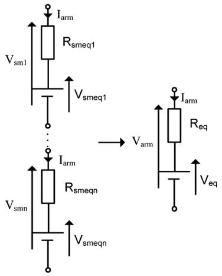  
Fig. 17. String of SM Thevenin equivalent circuits (left). Converter arm Thevenin equivalent circuit (right).

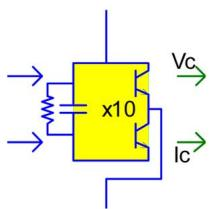  
Fig. 18. PSCAD half-bridge MMC arm component.

The SMs in each converter arm are connected in series. The Thevenin equivalent circuits for each SM can therefore be combined to a single Thevenin equivalent circuit for each converter arm, as shown in Fig. 17. where

$$
R _ {e q} = \sum_ {i = 1} ^ {n} R _ {s m e q i} \tag {32}
$$

$$
V _ {e q} = \sum_ {i = 1} ^ {n} V _ {s m e q i}. \tag {33}
$$

The Thevenin equivalent circuit for the converter arm is converted to a Norton equivalent circuit for use by the main EMT solver.

The process outlined in this section has reduced a multinode network for each converter arm and converted it into a two-node Norton equivalent circuit in the main EMT solver. This significantly reduces the size of the admittance matrix for the EMT solver which improves the simulation speed. Since the main EMT solver only considers a two-node network for each converter arm, the individual identities of each SM are lost; however, the Thevenin equivalent solver considers each SM separately and, therefore, the SM capacitor voltages and currents are recorded.

PSCAD has developed a DEM model based on the work by Udana and Gole. The component mask is shown Fig. 18. The development of the DEM has a clear advantage over the TDM in terms of simulation speed; however, there are some limitations. The user it not able to access the SM components, which

means that the model is not suitable for studies which require internal converter access. Also reconfiguring the component for other SM topologies is not straightforward since it needs to be recoded for that specific topology, which can be complex and time consuming. Half-bridge and full-bridge MMC equivalent arm components are currently available to PSCAD users.

# ACKNOWLEDGMENT

The authors would like to thank J. C. Garcia Alonso of the Manitoba HVDC Research Centre for providing the equivalent half-bridge MMC arm component used in the DEM model and for his useful discussions.

# REFERENCES

[1] M. Barnes and A. Beddard, “Voltage source converter HVDC links—The state of the art and issues going forward,” Energy Proc., pp. 108–122, 2012.   
[2] U. N. Gnanarathna, A. M. Gole, and R. P. Jayasinghe, “Efficient modeling of modular multilevel HVDC converters (MMC) on electromagnetic transient simulation programs,” IEEE Trans. Power Del., vol. 26, no. 1, pp. 316–324, Jan. 2011.   
[3] H. Saad, J. Peralta, S. Dennetiere, J. Mahseredjian, J. Jatskevich, J. A. Martinez, A. Davoudi, M. Saeedifard, V. Sood, X. Wang, J. Cano, and A. Mehrizi-Sani, “Dynamic averaged and simplified models for MMC-based HVDC transmission systems,” IEEE Trans. Power Del., vol. 28, no. 3, pp. 1723–1730, Jul. 2013.   
[4] J. Xu, C. Zhao, W. Liu, and C. Guo, “Accelerated model of modular multilevel converters in PSCAD/EMTDC,” IEEE Trans. Power Del., vol. 28, no. 1, pp. 129–136, Jan. 2013.   
[5] K. Strunz and E. Carlson, “Nested fast and simultaneous solution for time-domain simulation of integrative power-electric and electronic systems,” IEEE Trans. Power Del., vol. 22, no. 1, pp. 277–287, Jan. 2007.   
[6] HVDC—Connecting to the Future. Levallois-Perret, France: Alstom Grid, 2010.   
[7] J. Dorn, H. Huang, and D. Retzmann, Novel Voltage-Sourced Converters for HVDC and FACTS Applications. Paris, France: CIGRE, 2007.   
[8] T. Qingrui, X. Zheng, and X. Lie, “Reduced switching-frequency modulation and circulating current suppression for modular multilevel converters,” IEEE Trans. Power Del., vol. 26, no. 3, pp. 2009–2017, Jul. 2011.   
[9] A. Lesnicar and R. Marquardt, “An innovative modular multilevel converter topology suitable for a wide power range,” presented at the Power Tech Conf., Bologna, Italy, 2003.   
[10] J. Peralta, H. Saad, S. Dennetiere, J. Mahseredjian, and S. Nguefeu, “Detailed and averaged models for a 401-level MMC HVDC system,” IEEE Trans. Power Del., vol. 27, no. 3, pp. 1501–1508, Jul. 2012.   
[11] M. Saeedifard and R. Iravani, “Dynamic performance of a modular multilevel back-to-back HVDC system,” IEEE Trans. Power Del., vol. 25, no. 4, pp. 2903–2912, Oct. 2010.   
[12] T. Qingrui and X. Zheng, “Impact of sampling frequency on harmonic distortion for modular multilevel converter,” IEEE Trans. Power Del., vol. 26, no. 1, pp. 298–306, Jan. 2011.

Antony Beddard (S’14) received the M.Eng. degree in electrical and electronic engineering from the University of Manchester, Manchester, U.K., in 2009, where he is currently pursuing the Ph.D. degree in VSC-HVDC technology.

He was with Alstom Grid, Stafford, U.K. His research is in HVDC technology for the connection of offshore windfarms.

Mike Barnes (M’96–SM’07) received the B.Eng. and Ph.D. degrees in power electronics from the University of Warwick, Coventry, U.K.

In 1997, he was a Lecturer with the University of Manchester Institute of Science and Technology (UMIST, now merged with The University of Manchester), Manchester, U.K., where he is currently a Professor. His research interests cover the field of power-electronics-enabled power systems and advanced drives.

Robin Preece (GS’10–M’13) received the B.Eng. degree in electrical and electronic engineering and the Ph.D. degree in power system dynamics from the University of Manchester, Manchester, U.K., in 2009 and 2013, respectively.

Currently, he is a Research Associate at the same institution, investigating risk and uncertainty with respect to the stability of future power systems.