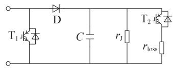
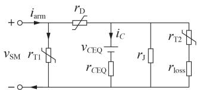
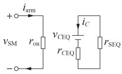
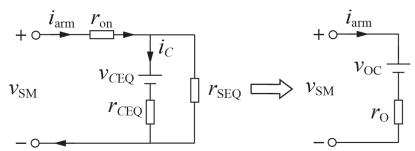
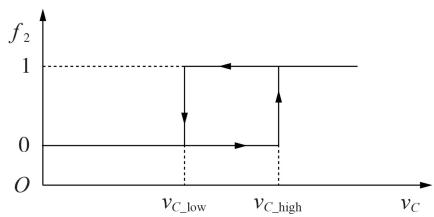
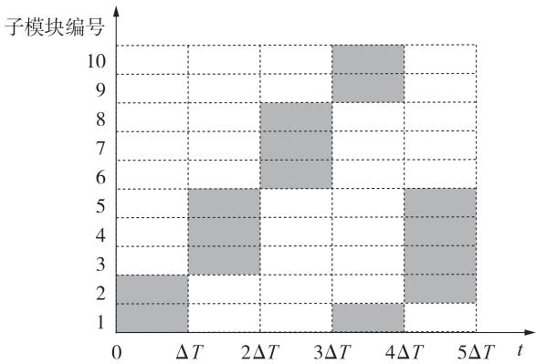
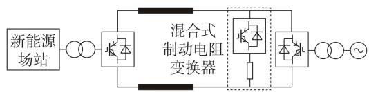
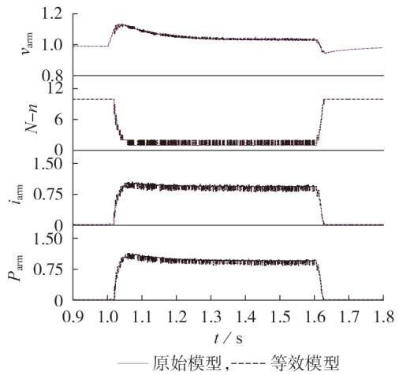
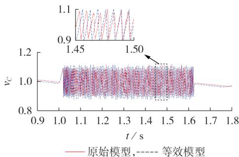

# 混合式制动电阻变换器的电磁暂态仿真等效建模

赵 峥1，田园园1，薛英林1，雷 肖2，杨张斌2，胡宗邱2

（1. 国网经济技术研究院有限公司，北京 102209；  
2. 三峡机电工程技术有限公司，四川 成都 610095）

摘要：为了解决孤岛新能源柔性直流送出系统中混合式制动电阻变换器原始模型的巨大网络节点数严重制约电磁暂态仿真速度的问题，提出了一种基于戴维南等效及嵌套迭代的混合式制动电阻变换器电磁暂态等效建模方法，将其拆解为 类运行状态各异的子模块网络，结合子模块中主／辅开关器件的触发指令组合，得到各类子模块网络的戴维南等效电路，并将依此合成的混合式制动电阻变换器支路等效模型代入柔性直流送出系统网络求解，进而反推内部子模块电气特性，依此循环，迭代求解。并利用电磁暂态仿真软件PSCAD／EMTDC开展等效模型与原始模型的一致性仿真测试及仿真速度对比分析，结果表明所提方法能高度模拟混合式制动电阻变换器的外部运行特性及内部子模块变化特性，并可大幅缩短仿真时长。

关键词：混合式制动电阻变换器；电磁暂态建模；嵌套迭代；戴维南等效；功率盈余

中图分类号： ；

文献标志码：

DOI：10.16081/j.epae.202104001

# 0 引言

海上风电等孤岛新能源经柔性直流送出系统［1-6］ 中，当受端换流站交流侧故障导致系统功率传输能力下降时，由于利用安控装置切除新能源机组的速度无法与柔性直流故障发展速度相匹配［7］ ，短时间内新能源电场将持续馈入功率，从而打破系统功率平衡，盈余功率将导致直流电压迅速上升，进而造成设备过压过流、故障穿越失败、柔性直流系统停运、新能源机组大面积脱网、对交流电网产生较大功率冲击等一系列问题，严重影响系统安全稳定运行。因此必须在孤岛新能源经柔性直流送出系统中引入功率灵活可控的制动电阻变换器装置［8-9］ 。

若孤岛新能源换流站位于海上平台等面积紧张、承重受限的场所，制动电阻变换器不宜布置于送端换流站交流侧，而应采用受端换流站直流侧布置方式。混合式制动电阻变换器作为其重要技术路线之一，内含数百个采用全新拓扑结构的子模块，且各子模块中功率器件的组合触发指令不尽相同，在进行孤岛新能源经柔性直流送出系统电磁暂态仿真分析时无法将其用单个子模块简单等效；若手动搭建数百个子模块拓扑构成原始模型，不仅耗时费力、复杂易错，而且将引入巨大的网络计算节点数，严重制

约仿真速度［10］ 。目前，已有学者为解决高电平数模块化多电平换流器（ ）原始模型仿真速度极其缓慢的问题而提出了多种 电磁暂态等效模型［11-15］ 。其中，文献［ ］针对基于半桥或全桥子模块的MMC提出了一种基于戴维南等效的整体建模方法；文献［ ］针对箝位双子模块 建立了一种考虑运行、闭锁与过渡状态的等效模型；文献［ - ］提出了适用于多类型子模块 的通用等效建模方法。上述 电磁暂态等效模型对于混合式制动电阻变换器的建模具有一定的参考价值，但由于二者的拓扑结构、运行机理和控制特性不同，因此不能完全适用。

本文在上述建模思想的基础上，结合混合式制动电阻变换器中子模块多种运行状态的固有特性，提出了一种混合式制动电阻变换器的电磁暂态仿真等效建模方法。基于嵌套并行求解思路，将整个支路拆解为各类运行状态各异的子模块网络，结合子模块中功率器件的触发指令，利用理想开关模型［16］与梯形积分法得到各类子模块网络的戴维南等效电路，并将依此合成的混合式制动电阻变换器支路等效模型代入整个柔性直流系统网络求解，进而反推内部子模块电容的电气特性，依此循环，迭代求解。该方法可大幅降低数百个子模块构成的全支路网络的整体节点规模，在保证模型内外特性精确度的前提下有效提高电磁暂态仿真计算速度。

# 混合式制动电阻变换器一次回路建模

混合式制动电阻变换器由电力电子变换器塔与集中制动电阻串联组成。其中，电力电子变换器塔可分解为N个拓扑结构完全相同、控制特性彼此独立的子模块。

# 1.1 子模块拓扑结构等效模型

混合式制动电阻变换器的子模块拓扑结构如图所示，包含 器件 $\mathrm { T _ { 1 } }$ 和 $\mathrm { T } _ { 2 }$ 、二极管 、电容C、均压电阻 $r _ { \mathrm { { J } } } .$ 、限压电阻 $r _ { \mathrm { l o s } }$ 等元件。其中， $\mathrm { . T _ { 1 } }$ 为主开关器件，用以控制集中制动电阻的耗能功率； $\mathrm { T } _ { 2 }$ 为辅助开关器件，用以稳定子模块电容电压。

  
图1 混合式制动电阻变换器的子模块拓扑结构示意图  
Fig.1 Schematic diagram of sub-module topology in hybrid braking resistance converter

由于 IGBT 器件通断瞬间的非理想状态对于子模块的整体电气外特性无影响，因此采用理想开关模型将 IGBT 器件及其反并联二极管等效为受 IGBT触发指令控制的可变电阻，导通指令下为极小电阻值 $r _ { \mathrm { o n } }$ ，电磁暂态仿真中通常取为 $r _ { \mathrm { e } } = 0 . 0 1 \ \Omega$ ；关断指令下为极大电阻值 $r _ { \mathrm { o f f } }$ ，为进一步简化分析，可等效为开路状态。

同理，二极管D也可等效为受运行状态控制的可变电阻 $r _ { \mathrm { o n } }$ 与 $r _ { \mathrm { o f f } }$ ，其在导通状态与箝位状态下可分别视为0.01 Ω的小电阻与开路状态。

利用梯形积分法可将电容C转换为由一个电容等效的历史电压源及一个与电容大小、仿真步长有关的电阻串联组成的戴维南等效电路［17］ 。子模块电容电压 $v _ { C } ( t )$ 与子模块电容电流 $i _ { c } ( t )$ 的关系为：

$$
v _ {\mathrm {C}} (t) = \frac {1}{C} \int_ {- \infty} ^ {t} i _ {C} (t) \mathrm {d} t = \frac {1}{C} \int_ {- \infty} ^ {t - \Delta T} i _ {C} (t) \mathrm {d} t + \frac {1}{C} \int_ {t - \Delta T} ^ {t} i _ {C} (t) \mathrm {d} t \approx
$$

$$
v _ {C} (t - \Delta T) + \frac {\Delta T}{C} \frac {i _ {C} (t - \Delta T) + i _ {C} (t)}{2} =
$$

$$
\frac {\Delta T}{2 C} i _ {C} (t) + \left(\frac {\Delta T}{2 C} i _ {C} (t - \Delta T) + v _ {C} (t - \Delta T)\right) =
$$

$$
r _ {C E Q} i _ {C} (t) + v _ {C E Q} (t - \Delta T) \tag {1}
$$

$$
r _ {C E Q} = \frac {\Delta T}{2 C} \tag {2}
$$

$$
v _ {C E Q} (t - \Delta T) = \frac {\Delta T}{2 C} i _ {C} (t - \Delta T) + v _ {C} (t - \Delta T) \tag {3}
$$

其中， $\Delta T$ 为仿真步长 ${ \bf { ; } } v _ { C \mathrm { { E 0 } } } ( t { - } \Delta T )$ 为电容的等效历史电压源 $; r _ { C \mathrm { E  Q } }$ 为电容的等效电阻。

基于上述分析，可将图 所示混合式制动电阻变换器的子模块拓扑结构等效为电压源与电阻串并联的形式，如图2所示。图中， $r _ { \mathrm { T 1 } } \setminus r _ { \mathrm { T 2 } }$ 分别为 $\mathrm { T } _ { 1 } , \mathrm { T } _ { 2 }$ 及其反并联二极管的等效可变电阻 $ ; r _ { \mathrm { D } }$ 为 的等效可变电阻； $; i _ { \mathrm { a r m } }$ 为经过混合式制动电阻变换器支路的电流； $; v _ { \mathrm { S M } }$ 为子模块端口电压。

实际运行时，由于各子模块中 $\mathrm { T } _ { 1 }$ 与 $\mathrm { T } _ { 2 }$ 分别承担

  
图2 混合式制动电阻变换器的子模块等效电路图  
Fig.2 Equivalent circuit of sub-module in hybrid braking resistance converter

不同的控制功能，因此其触发指令 $f _ { 1 }$ 与 $f _ { 2 }$ 也独立受控。根据二者触发指令的排列组合，共可得以下种运行状态。

（）运行状态 ： $f _ { 1 } { = } 1$ 且 $f _ { 2 } { = } 1 ,$ 。此时， $, \mathrm { { T _ { 1 } } }$ 与 导通， 处于箝位状态，子模块从支路退出，电容通过限压电阻放电。运行状态 对应的子模块等效电路图见附录A图A1。  
（2）运行状态②： $f _ { 1 } { = } 1$ 且 $f _ { 2 } { = } 0 ,$ 。此时， $\mathrm { T _ { 1 } }$ 导通， $\mathrm { T } _ { 2 }$ 关断， 处于箝位状态，子模块从支路退出，电容电压保持稳定。运行状态②对应的子模块等效电路图见附录 图 。  
（3）运行状态③： $f _ { 1 } { = } 0$ 且 $f _ { 2 } { = } 1 _ { \mathrm { ~ c ~ } }$ 。此时， $\mathrm { T } _ { 1 }$ 关断， $\mathrm { T } _ { 2 }$ 导通， 导通，子模块处于投入状态，外部支路电流在子模块内部经过电容与限压电阻分流，同时电容通过限压电阻放电。运行状态 对应的子模块等效电路图见附录 图 。  
（4）运行状态④： $f _ { 1 } { = } 0$ 且 $f _ { 2 } { = } 0$ 。此时，T 与T 关断， 导通，子模块处于投入状态，电容通过外部支路电流充电。运行状态 对应的子模块等效电路图见附录A图A4。

# 混合式制动电阻变换器支路等效模型

混合式制动电阻变换器支路包含数百个运行状态各异的子模块，庞大的子模块数量极大地增加了整个混合式制动电阻变换器支路的建模复杂度。因此，可采用嵌套并行求解思想，基于 器件触发指令的统计数据将整个支路拆解为各类运行状态的子模块网络，对每个子模块网络进行独立求解，由得到的各类子模块网络的戴维南等效电路合成整个混合式制动电阻变换器支路的等效模型，从而可以代入柔性直流系统进行仿真计算。该方法可以规避求解由较多子模块构成的原始支路网络，虽然增加了所需求解的网络数量，但可大幅降低全支路网路的整体节点规模，从而可有效提高电磁暂态仿真计算速度。

当子模块处于运行状态 或 时， 等效为开路状态，此时子模块可进一步简化为如图 所示的左右解耦的简化等效电路。图中， $r _ { \mathrm { S E Q } }$ 为简化等效电阻，在 个运行状态下的取值有所差异。

当处于运行状态①时， $r _ { \mathrm { S E Q } }$ 的取值为：

  
图3 运行状态 或 对应的简化等效电路图  
Fig.3 Simplified equivalent circuit corresponding to Operation State ① or ②

$$
r _ {\mathrm {S E Q}} = \left(r _ {\mathrm {l o s s}} + r _ {\mathrm {e}}\right) / / r _ {\mathrm {J}} \tag {4}
$$

当处于运行状态②时， $r _ { \mathrm { S E Q } }$ 的取值为：

$$
r _ {\mathrm {S E O}} = r _ {\mathrm {J}} \tag {5}
$$

对图 中左、右解耦电路进行独立求解。根据左侧电路可得，此类从支路退出的子模块的端口电压 $v _ { \mathrm { { S M } } _ { - 1 } } ( t )$ 为：

$$
v _ {\mathrm {S M} - 1} (t) = i _ {\mathrm {a r m}} (t) \times r _ {\mathrm {e}} \tag {6}
$$

可见，此时子模块的外特性仅表现为一个的电阻。

根据右侧电路可得，此时子模块电容电流与电容的等效历史电压源的关系式如下：

$$
i _ {C} (t) = \frac {- v _ {C E Q} (t - \Delta T)}{r _ {C E Q} + r _ {\mathrm {S E Q}}} \tag {7}
$$

当子模块处于运行状态 或 时， $\mathrm { T } _ { 1 }$ 等效为开路状态，此时子模块可以进一步简化为如图 所示的由子模块等效电阻 $r _ { 0 }$ 与子模块等效历史电压源$v _ { \mathrm { 0 c } } ( t { - } \Delta T )$ ）串联组成的子模块戴维南等效电路。

  
图4 运行状态 或 对应的简化等效电路图  
Fig.4 Simplified equivalent circuit corresponding to Operation State ③ or ④

由图4可得：

$$
r _ {\mathrm {O}} = r _ {\mathrm {C E Q}} / / r _ {\mathrm {S E Q}} + r _ {\mathrm {e}} \tag {8}
$$

$$
v _ {\mathrm {O C}} (t - \Delta T) = \frac {r _ {\mathrm {S E Q}}}{r _ {\mathrm {C E Q}} + r _ {\mathrm {S E Q}}} v _ {\mathrm {C E Q}} (t - \Delta T) \tag {9}
$$

同理， $r _ { \mathrm { S E Q } }$ 在 个运行状态下的取值也有所差异：运行状态 对应的取值如式（）所示，运行状态对应的取值如式（）所示。

因此，处于投入状态的子模块端口电压 ${ v _ { \mathrm { { S M } } _ { - } 2 } ( t ) }$ 可表示为：

$$
v _ {\mathrm {S M} - 2} (t) = r _ {\mathrm {O}} i _ {\text {a r m}} (t) + v _ {\mathrm {O C}} (t - \Delta T) \tag {10}
$$

此时，子模块电容电流与电容的等效历史电压源及外部支路电流有关，其表达式如下：

$$
i _ {C} (t) = \frac {r _ {\mathrm {S E Q}} i _ {\mathrm {a r m}} (t) - v _ {\mathrm {C E Q}} (t - \Delta T)}{r _ {\mathrm {C E Q}} + r _ {\mathrm {S E Q}}} \tag {11}
$$

若t时刻时，混合式制动电阻变换器中共有n个

子模块因 $\mathrm { T _ { 1 } }$ 导通而处于退出状态，另 $N { - } n$ 个子模块因 $\mathrm { T } _ { 1 }$ 关断而处于投入状态，则混合式制动电阻变换器支路电压 $v _ { \mathrm { a r m } } ( t )$ 可表示为n个退出状态子模块的端口电压、 $. N { - n }$ 个投入状态子模块的端口电压以及集中制动电阻端间电压之和，如式（ ）所示。

$$
\begin{array}{l} v _ {\mathrm {a r m}} (t) = \sum_ {x = 1} ^ {n} v _ {\mathrm {S M} _ {1, x}} (t) + \sum_ {y = 1} ^ {N - n} v _ {\mathrm {S M} _ {2, y}} (t) + r _ {\mathrm {m}} i _ {\mathrm {a r m}} (t) = \\ \left(n r _ {\mathrm {e}} + \sum_ {y = 1} ^ {N - n} r _ {0, y} + r _ {\mathrm {m}}\right) i _ {\mathrm {a r m}} (t) + \\ \sum_ {y = 1} ^ {N - n} v _ {\mathrm {O C}, y} (t - \Delta T) = r _ {\mathrm {a r m E Q}} i _ {\mathrm {a r m}} (t) + v _ {\mathrm {a r m E Q}} (t - \Delta T) (1 2) \\ r _ {\mathrm {a r m E Q}} = n r _ {\mathrm {e}} + \sum_ {y = 1} ^ {N - n} r _ {0, y} + r _ {\mathrm {m}} (13) \\ v _ {\mathrm {a r m E Q}} (t - \Delta T) = \sum_ {y = 1} ^ {N - n} v _ {\mathrm {O C}, y} (t - \Delta T) (14) \\ \end{array}
$$

其中， $, r _ { \mathrm { m } }$ 为集中制动电阻值。

综上可知，混合式制动电阻变换器支路在电磁暂态仿真过程中可以等效为由支路等效历史电压源$v _ { \mathrm { a r m E Q } } ( t { - } \Delta T )$ 与支路等效电阻 $r _ { \mathrm { a r m E Q } }$ 串联组成的支路戴维南等效电路。

# 2 功率器件触发控制器建模

混合式制动电阻变换器中功率器件触发控制器的功能是根据系统外环控制器输出的应投入子模块个数及所有子模块电容电压来确定各子模块中 $\mathrm { T _ { 1 } }$ 与$\mathrm { T } _ { 2 }$ 的触发指令。

$\mathrm { T } _ { 2 }$ 采用如图5所示的滞回比较触发原则。图中，$v _ { C \mathrm { \_ h i g h } } \setminus v _ { C \mathrm { \_ l o w } }$ 分别为子模块电容电压允许上限和下限。

  
图5 T 的滞回比较触发原则  
Fig.5 Triggering principle of T based on hysteresis comparison

当子模块电容电压超过上限时导通 $\mathrm { T } _ { 2 }$ ，电容通过限压电阻放电；当子模块电容电压低于下限时关断 $\mathrm { T } _ { 2 }$ ，电容停止放电。从而保证子模块电容电压在允许范围内波动。

$\mathrm { T _ { 1 } }$ 可采用 种触发控制原则。其一是类似于子模块的电容电压排序控制，选取电容电压最低的相应个数子模块进入投入状态，以保证子模块电容电压均衡。但考虑到混合式制动电阻变换器中子模块电容电压波动范围可由 $\mathrm { T } _ { 2 }$ 独立控制，因此对于 $\mathrm { \Delta T _ { 1 } }$ 的触发控制，可不再考虑子模块电容电压排序

环节以简化控制器算法，直接采用依次轮换投入策略，即对各子模块进行编号，每个控制周期内结合系统外环控制器输出的应投入子模块个数 $N { - } n$ ，在上一周期投入子模块最大编号的基础上，向下连续选择另N-n个子模块投入，依此循环，从而保证每个子模块电容的最大连续投入充电时间相同，所有子模块限压电阻的平均消耗功率相同，发热均衡。

以支路共有 个子模块为例对该策略进行简单说明，如图 6所示。图中，横坐标表示 5个相连的控制周期，假设各控制周期内应投入子模块个数分别为 2、3、3、3、4，则图中各周期内子模块方块为灰色表示该子模块应处于投入状态，即各周期内应对白色方块对应子模块的主开关器件 进行触发。

  
图6 T 的依次轮换投入策略示例  
Fig.6 Example of sequential rotation input strategy of T

# 混合式制动电阻变换器电磁暂态仿真计算

用混合式制动电阻变换器的支路戴维南等效电路替代其原始支路结构，并代入柔性直流系统网络，经PSCAD／EMTDC仿真工具求解，得到混合式制动电阻变换器支路电流，进而反推各子模块电容电流及电容电压，并以此计算下一时刻子模块电容的等效历史电压源。依次循环迭代，即可求解。混合式制动电阻变换器电磁暂态仿真的具体计算步骤如下：

（1）初始化数据，对于初始时刻，令 $i _ { c } ( 0 ) = 0$ 、$v _ { c } ( 0 ) { = } U _ { \mathrm { d c N } } / N \big ( U _ { \mathrm { d c N } }$ 为混合式制动电阻变换器的支路端间额定电压），触发T 的子模块个数 $n = 0$ ，触发 $\mathrm { T } _ { 2 }$ 的子模块个数也为0，时间变量 $t = \Delta T$ ，循环变量i、j、k 均为0；  
（）依据式（）与式（）计算各子模块电容的等效电阻 $r _ { C \mathrm { E Q } }$ 与等效历史电压源 $v _ { C \mathrm { E  Q } } ( t { - } \Delta T )$ ），得到所有子模块电容的戴维南等效电路；  
（ ）基于系统外环控制器输出的应投入子模块个数以及各子模块电容电压 $v _ { c } ( t { - } \Delta T )$ ，利用功率器件触发控制器计算各子模块的IGBT触发指令 f与 f ；

（4）基于各子模块辅助开关T 的导通情况，利用式（4）或式（5）计算其简化等效电阻 $r _ { \mathrm { S E Q } }$ ；  
（5）基于各子模块主开关T 的导通情况对其进行分类，若 $\mathrm { T _ { 1 } }$ 导通则更新处于退出状态的子模块个数 $n = n + 1$ ，若 $\mathrm { T _ { 1 } }$ 关断则利用式（）与式（）计算该子模块的等效电阻 $r _ { 0 }$ 与等效历史电压源 $v _ { \mathrm { 0 c } } ( t { - } \Delta T )$ ），进而得到子模块的戴维南等效电路；  
（）基于各子模块的戴维南等效电路，利用式（ ）与式（ ）计算混合式制动电阻变换器支路的等效电阻 $r _ { \mathrm { a r m E Q } }$ 与等效历史电压源 $v _ { \mathrm { a r m E Q } } \left( t { - } \Delta T \right)$ ），得到支路的戴维南等效电路；  
（7）用 $r _ { \mathrm { a r m E Q } }$ 与 $v _ { \mathrm { a r m E 0 } } ( t { - } \Delta T )$ ）串联组成的支路戴维南等效电路替代混合式制动电阻变换器的原始结构，代入柔性直流系统网络并利用PSCAD／EMTDC仿真工具求解，得到支路电流 $i _ { \mathrm { a r m } } ( t )$ ；  
（8）基于 $\mathrm { T _ { 1 } }$ 的导通情况对所有子模块进行分类，分别利用式（）或式（ ）计算 $i _ { c } ( t )$ ，进而利用式（）计算 $v _ { C } ( t )$ ；  
（）更新时间变量 $t = t + \Delta T$ ，跳转至步骤（）开始下一仿真时刻的计算。

# 仿真验证

# 模型仿真精度分析

为了进一步验证本文所提建模方法的有效性与可行性，利用电力系统电磁暂态仿真软件 ／开展一致性仿真测试。搭建如图 所示的柔性直流系统模型，混合式制动电阻变换器位于受端换流站直流侧正负极间。

  
图7 含混合式制动电阻变换器的柔性直流系统电路图  
Fig.7 Circuit of VSC-HVDC system with hybrid braking resistance converter

本文分别采用 种方法对混合式制动电阻变换器建模，得到拼接N个子模块与制动电阻串联的原始模型以及利用所提建模方法构建的等效模型。

仿真参数设置如下：考虑到较大子模块个数将严重制约原始模型的仿真速度，且 种方法的一致性验证不受子模块个数的影响，因此对子模块个数进行简化处理，取N ，并且对子模块其余参数进行相应的折算，子模块电容电压允许波动范围设为±10 %。

分别在送端换流站输送满功率及半功率的工况下，设置受端换流变压器网侧在 时发生三相接地故障，持续时间为 $0 . 6 \mathrm { { s } _ { \mathrm { { c } } } }$ 。送端输送满功率工况下，混合式制动电阻变换器的支路端间电压 $v _ { \mathrm { a r m } }$ 、支路投

入子模块个数 $N { - } n$ 、支路电流 $i _ { \mathrm { a r m } }$ 、支路功率 $P _ { \mathrm { a r m } }$ 的外特性仿真波形如图8所示，子模块电容电压 $v _ { C }$ 的仿真波形如图 所示；送端输送半功率工况下，相应仿真波形见附录A图A5和图A6。图中，v 、i 、P 、vC $v _ { \mathrm { a r m } } \setminus \dot { l } _ { \mathrm { a r m } } \setminus P _ { \mathrm { a r m } } \setminus v _ { C }$ 为标幺值。

  
图8 变换器支路外特性仿真波形（送端满功率）

  
Fig.8 Simulative waveforms of external characteristics of converter branch（full power）   
图9 子模块电容电压仿真波形（送端满功率）  
Fig.9 Simulative waveform of sub-module’scapacitance voltage（full power）

可见，当受端换流站交流侧故障时，系统不平衡功率导致极间直流电压上升至动作定值后，无论采用原始模型还是等效模型，混合式制动电阻变换器都将进入使能状态，并根据系统盈余功率大小控制支路投入子模块个数：系统盈余功率越大，投入子模块个数越少，从而集中制动电阻端间电压越大，其消耗功率越大并与系统盈余功率保持平衡，保证直流电压趋于稳定，且子模块电容电压在限压电阻的作用下被限制在最大允许波动范围内。故障清除后，混合式制动电阻变换器随着直流电压降低而迅速退出，支路子模块恢复至全部投入状态，直流电压也恢复至额定值。

对比仿真波形可以看出，在送端输送满功率与半功率 种工况下，分别采用混合式制动电阻变换器的原始模型和等效模型时，极间直流电压波形几乎保持一致，最大相对误差仅为 与 ，支

路投入子模块个数、支路电流、支路功率等关键变量的变化趋势及变化幅度也较为吻合，仅因投入子模块个数离散变量在相邻两档位间的控制波动导致支路电流和支路功率波形存在一定毛刺。同时，以子模块 为例，故障期间其电容电压波形在传统模型和等效模型下变化趋势较为一致，且均依据控制策略在0.9~1.1 p.u.间往返波动，其波形间的较小差异主要来自于支路投入子模块个数离散变量控制波动的差异性以及本文所用的依次轮换投入控制策略，导致2种模型下各个控制周期内每个子模块的投退情况不完全同步，且由于本仿真算例所用子模块总数相对实际数目大幅减少而进一步放大了其不同步性，但不影响对子模块电容电压整体变化特性的等效。总体而言，本文所提等效建模方法能以较高精度模拟电磁暂态仿真过程中混合式制动电阻变换器支路对外的关键电气特性以及子模块内部元件的运行特性。

# 4.2 模型仿真速度分析

为了对比相同条件下原始模型与等效模型的仿真速度，并规避大型柔性直流系统模型对仿真时长的影响，本文利用原始模型与等效模型分别搭建了含有10、20、50个子模块的混合式制动电阻变换器与恒功率电源相连的简单系统，设置仿真时间为1.5 s，仿真步长为20 μs，2种模型下的实际仿真时长对比如表1所示。

表1 仿真时长对比  
Table 1 Comparison of simulation time   

<table><tr><td rowspan="2">子模块个数</td><td colspan="2">仿真时长/s</td><td rowspan="2">加速比</td></tr><tr><td>原始模型</td><td>等效模型</td></tr><tr><td>10</td><td>35.4</td><td>2.68</td><td>13.2</td></tr><tr><td>20</td><td>291.8</td><td>2.76</td><td>105.7</td></tr><tr><td>50</td><td>1948.4</td><td>2.95</td><td>660.5</td></tr></table>

从表 可以看出，对于含有相同子模块个数的混合式制动电阻变换器，等效模型所需仿真时长明显短于原始模型，且子模块个数越大，这一差距越明显。可见，本文所提等效建模方法可有效提高混合式制动电阻变换器的电磁暂态仿真计算速度。

# 5 结论

本文针对采用全新子模块拓扑结构的混合式制动电阻变换器，提出了一种基于戴维南等效及嵌套迭代的电磁暂态仿真等效建模方法，可有效解决其原始模型中数百个子模块引入的巨大网络节点数严重制约系统仿真速度的问题。并利用 ／电磁暂态仿真软件开展等效模型与原始模型的一致性测试及仿真速度对比分析，验证了本文所提等效建模方法可在保证混合式制动电阻变换器支路外特性及子模块内特性准确性的前提下有效提

升电磁暂态仿真速度。这为开展海上风电柔性直流送出系统等含混合式制动电阻变换器的柔性直流系统的电磁暂态仿真研究，提供了可靠、有效的技术手段，具有一定的应用前景。

附录见本刊网络版（http：∥www.epae.cn）。

# 参考文献：

［ ］邓银秋，汪震，韩俊飞，等 适用于海上风电接入的多端柔直网内不平衡功率优化分配控制策略［J］. 中国电机工程学报，，（）： -  
DENG Yinqiu，WANG Zhen，HAN Junfei，et al. Control strategyon optimal redistribution of unbalanced power for offshorewind farms integrated MMC-MTDC［J］. Proceedings of the， ，（）： -  
［2］ ZHOU Q，DING Y，MAI K，et al. Mitigation of subsynchronous oscillation in a VSC-HVDC connected offshore wind farm integrated to grid［J］. International Journal of Electrical Power & Energy Systems,2019,109:29-37.   
［3］ ANDREI O，MARCELO A，PEDRO M，et al. A control strategy for an offshore wind farm with the generating units connected in series with a VSC-HVDC transmission link［J］. Electric Power Systems Research，2020，180：561-562.   
［ ］翟冬玲，韩民晓，严稳利，等 型海上风电混合直流送出的控制策略［］ 电力自动化设备， ，（）： -  
ZHAI Dongling,HAN Minxiao,YAN Wenli,et al. Control of offshore DFIG-based wind farm with hybrid HVDC transmission［J］. Electric Power Automation Equipment，2015，35（2）： 42-48.   
［ ］彭衍建，李勇，曹一家 基于 - 的大规模海上风电并网系统协调下垂控制方法［］ 电力自动化设备， ，（）：16-25.  
PENG Yanjian，LI Yong，CAO Yijia. Coordinated droop control for large-scale offshore wind farm grid-connected based on VSC-MTDC system[J].Electric Power Automation Equipment, ，（）： -   
［ ］刘英培，张腊，梁海平，等 适用于风电并网的 - 系统模型预测控制［］ 电力自动化设备， ，（）： -  
LIU Yingpei,ZHANG La,LIANG Haiping,et al.Model predictive control of VSC-HVDC system for wind power integration［J］. Electric Power Automation Equipment,2019,39(6):102-114.   
［ ］郭贤珊，梅念，李探，等 张北柔性直流电网盈余功率问题的机理分析及控制方法［］ 电网技术， ，（）： -  
GUO Xianshan，MEI Nian，LI Tan，et al. Study on solution for power surplus in Zhangbei VSC-based DC grid mechanism analysis and control method［J］. Power System Technology， ，（）： -   
［8］梅念，李探，乐波，等. 张北柔性直流电网盈余功率问题的耗能方法［］ 电网技术， ，（）： -  
MEI Nian，LI Tan，YUE Bo，et al. Energy consumption methodfor power surplus in Zhangbei VSC-based DC grid［J］. Power， ，（）： -  
［ ］张福轩，郭贤珊，汪楠楠，等 接入新能源孤岛系统的双极柔性直流系统盈余功率耗散策略［］ 电力系统自动化， ，（）： -  
ZHANG Fuxuan,GUO Xianshan,WANG Nannan,et al.Surplus power dissipation strategy for bipolar VSC-HVDC system with integration of islanded renewable energy generation sys‐ tem[J].Automation of Electric Power Systems,2020,44（5）：

154-160.   
［ ］管敏渊，徐政 模块化多电平换流器的快速电磁暂态仿真方法［J］. 电力自动化设备，2012，32（6）：36-40  
GUAN Minyuan，XU Zheng. Fast electro-magnetic transient simulation method for modular multilevel converter[J].Electric Power Automation Equipment，2012，32（6）：36-40   
［ ］许建中，赵成勇， 模块化多电平换流器戴维南等效整体建模方法［］ 中国电机工程学报， ， （）： -1929.  
XU Jianzhong，ZHAO Chengyong，GOLE A M. Research onthe Thévenin’s equivalent based integral modelling methodof the modular multilevel converter［J］. Proceedings of the， ，（）： -  
［12］徐东旭，刘崇茹，王洁聪，等 . 钳位双子模块型 MMC的电磁暂态等效模型［J］. 电网技术，2016，40（10）：3176-3183  
XU Dongxu，LIU Chongru，WANG Jiecong，et al. Equivalentelectromagnetic transient model of CDSM-MMC［J］. Power Sys-， ，（ ）： -  
［ ］赵禹辰，徐义良，赵成勇，等 单端口子模块 电磁暂态通用等效建模方法［］ 中国电机工程学报， ，（ ）： -4667．  
ZHAO Yuchen，XU Yiliang，ZHAO Chengyong，et al. Genera-lized ElectroMagnetic Transient（EMT） equivalent modeling ofMMCs with arbitrary single-port sub-module structures［J］. Pro-ceedings of the CSEE，2018，38（16）：4658-4667.  
［ ］张芳，黄维持，李传栋 适用于多种子模块拓扑的 通用化快速仿真模型［］ 电力自动化设备， ，（）： -  
ZHANG Fang,HUANG Weichi,LI Chuandong. General fastsimulation model applicable to multiple sub-module topolo‐gies of MMC［J］. Electric Power Automation Equipment，2019，（）： -  
［ ］许建中，徐义良，赵禹辰，等 多类型子模块 电磁暂态通用建模和实现方法［］ 电网技术， ，（）： -  
XU Jianzhong，XU Yiliang，ZHAO Yuchen，et al. Generalizedelectromagnetic transient equivalent modeling and implementa‐tion of MMC with arbitrary multi-type submodule structures［］ ， ，（）： -  
［ ］沈卓轩，姜齐荣 电力系统电磁暂态仿真 详细建模及应用［］ 电力系统自动化， ，（）： -  
SHEN Zhuoxuan，JIANG Qirong. Detailed IGBT modeling and applications of electromagnetic transient simulation in power system[J].Automation of Electric Power Systems,2020,44(2): 234-246.   
［ ］徐政，屠卿瑞，管敏渊，等 柔性直流输电系统［ ］ 北京：机械工业出版社， ： -

# 作者简介：

  
赵 峥

赵 峥（ —），男，河南周口人，高级工程师，硕士，主要研究方向为高压直流输电与柔性直流输电成套设计（E-mail：zhaozheng@chinasperi.sgcc.com.cn）；

田园园（ —），女，湖北宜昌人，工程师，硕士，主要研究方向为柔性直流输电成套设计（E-mail：tianyuanyuan@chinasperi.sgcc.com.cn）；

薛英林（ —），男，河北藁城人，高

级工程师，博士，主要研究方向为高压直流输电与柔性直流输电成套设计（E-mail： ）。

（编辑 李莉）

（下转第 123 页 continued on page 123）

# Modular series-connection DC energy braking device for VSC-HVDC system

XIE Yeyuan，YAO Hongyang，LI Haiying，YIN Guanxian，OUYANG Youpeng，LI Zhao（NR Electric Co.，Ltd.，Nanjing 211102，China）

Abstract：Due to the advantages of low transmission loss，VSC-HVDC（Voltage Source Converter-based High Voltage Direct Current） is easy to realize fault isolation，fault ride through and independent control of active and reactive power，which makes it have great application prospect in the field of offshore wind power inte‐ gration. In order to realize the fault ride through of offshore wind power VSC-HVDC system，based on the comparison and analysis of the existing DC energy braking device schemes，an economical modular seriesconnection DC energy braking device topology is proposed，which combines the advantages of resistor outdoor heat dissipation，distributed module self-energy acquisition and soft switching control，and solves the control‐ lable discharge problem of the sub module voltage rising continuously caused by the asynchronous switching on-off of power devices. The detailed operation status and control strategy of the proposed topology are analyzed. The feasibility of the proposed topology and the control strategy of sub module controllable discharge are verified by the module prototype experiment and equivalent minimum system experiment. RTDS experi‐ ment verifies that the proposed modular series-connection DC energy braking device can realize the smooth fault ride through of system.

Key words：VSC-HVDC；fault ride through；DC energy braking device；modular；series-connection

（上接第 116 页 continued from page 116）

# Equivalent modeling of electromagnetic transient simulation for hybrid braking resistance converter

ZHAO Zheng1 ，TIAN Yuanyuan1 ，XUE Yinglin1 ，LEI Xiao2 ，YANG Zhangbin2 ，HU Zongqiu2

（1. State Grid Economic and Technological Research Institute Co.，Ltd.，Beijing 102209，China；   
2. China Three Gorges Mechanical and Electrical Engineering Co.，Ltd.，Chengdu 610095，China）

Abstract：In order to solve the problem that the huge number of network nodes in the original model of hybrid braking resistance converter in the VSC-HVDC（Voltage Source Converter based High Voltage Direct Current） system with island new energy resources seriously restricts the speed of electromagnetic transient simulation，an equivalent modeling method for hybrid braking resistance converter based on Thevenin equiva‐ lent and nested iteration is proposed. In this method，the whole branch is divided into four kinds of submodule networks with different operation states. The Thevenin equivalent circuit of each sub-module network is obtained based on the triggering instruction combination of main and auxiliary switching devices in the sub-modules，and the synthetic equivalent model of the hybrid braking resistance converter branch is substi‐ tuted into the whole network of VSC-HVDC system for solution. The electrical characteristics of the internal sub-module are inversely deduced,and then the solution is iterated.The consistency test and simulation time comparison between the equivalent model and the original model are carried out in PSCAD／EMTDC simulation software. The results show that the method can greatly reduce the simulation time，and highly simulate the external operation characteristics and the internal sub-module variation characteristics of hybrid braking resistance converter.

Key words：hybrid braking resistance converter；electromagnetic transient modeling；nested iteration；Thevenin equivalent；power surplus