# Interfacing real-time and offline power system simulation tools using UDP or FPGA systems

Christian Scheibe a,d,∗, Ananya Kuri a,d, Yuyao Feng c, Le Zhao c, Xuejun Xiong c, Piergiovanni La Seta a, Xiao Peng Liang b, Johannes Knödtel d, Philipp Holzinger d, Marc Reichenbach d, Gert Mehlmann ，d

a Power Technologies International Siemens AG, Erlangen, Germany   
b Power Technologies International Siemens AG, Shanghai, China   
c Shanghai Electric Power Research Institute, Shanghai, China   
d Friedrich-Alexander-Universität Erlangen-Nürnberg, Erlangen, Germany

# A R T I C L E I N F O

Keywords:

Co-Simulation

Transient stability analysis

Electromagnetic transients

Real-time simulation

Offline simulation

# A B S T R A C T

This contribution proposes a coupling interface between the real-time simulation system RTDS Novacor and the Power System Simulation Software PSS/E for electromagnetic transient (EMT) and phasor (RMS) hybrid simulations to enable a performant connection between the domains. For the coupling interface, two implementations with different characteristics in latency and hardware requirements are presented. Firstly, an Ethernet (UDP) based connection and secondly a fiber-based connection using the Aurora protocol. The first approach is purely software based, while the second one requires additional hardware. The technical implementation of the interfaces is explained in detail. The functionality of the interfaces is verified on the basis of an EMT-RMS simulation in a small overhead line test system.

# 1. Introduction

The field of power grid simulation evolved from a very complex and time-consuming problem to a flexible and performant task thanks to the transition from analog to digital simulators. However, for years the simulators were not performant enough to calculate big networks in real-time. This changed thanks to the advancements in hardware and software development in the recent years.

Alongside, the power system experiences the challenging transition from systems dominated by large machines to a converter-dominated grid. Hence, time constants implied by the inertia of the machines do play less of a role than previously [1]. This, however, puts strain on the requirements of power system simulation. Transient Stability (TS, RMS) type simulations require time constants to be low enough to not interfere with the phasor based nature of their algorithm. That means a typical investigation for RMS simulations is well below 10 Hz in all considered frequencies which excludes many aspects of converter-based transients. These require investigation using electromagnetic transient based simulations (EMT) [2,3].

EMT-type simulations require a lot more capable computation power to show the same per-time simulation performance as RMS simulators do. This originates from their algorithm being created to investigate different problems. RMS usually uses (complex) phasor based simulation

methods to solve large portions of a grid using time steps in the range of multiple milliseconds. EMT-type simulations are usually utilized for a detailed investigation of fast and very fast transient phenomena and their impact on equipment. Also, their time step directly influences the precision of the results. Usual time steps range from 50 μs and lower depending on the frequency of the transients involved [4].

As EMT simulations spread more widely into the field formerly covered by phasor based transient stability investigations and real-time simulation methods demand EMT modeling for most applications, a challenge is to be faced to overcome the gap between the domains. A solution might be the field of Co-Simulation of power systems. The coupling of RMS- and EMT-simulations has the potential to overcome the limits of monolithic simulations and add the strengths of both domains [5]. The proposed interface, therefore, is a candidate for this field, further expanding the range of capable interfaces.

Previous works included the interfacing and coupling of EMT-RMS Co-Simulation based on offline programs such as PSCAD, PSSE, Matlab or PowerFactory [6]. Also, real-time simulators were coupled previously in [7–9]. This publication aims to provide insights into the development and the feasibility of an interface bridging the real-time and offline domains. Therefore, the development process is shown in

the following sections. Finally, using a small overhead line test grid, simulations are performed to show the feasibility of the interface.

# 2. Simulation interface concept

Coupling real-time and offline simulation domains involves bridging the gap between two completely different concepts. Generally, a realtime simulator acts based on the principle of hard real-time described by Kopetz et al. in [10]. That means, that any one of the given time steps must be executed in a period smaller than the one simulated in the device. An overflow occurs if this is not the case. Simulators handle overflows differently depending on the principles they are intended for. While some applications only run using these hard real-time criteria, others may accept some overflows. This is called firm real-time if the result of a simulation including exceeded deadlines can be rejected. Soft real-time requirements on the other hand include the result of such an overflowed time step. Therefore, the result can be accepted as degraded.

While the real-time simulator runs based on hard real-time requirements, the offline tool does not inherit such traits. Therefore, the offline simulation tool along with the network to be simulated must be adapted and modeled to at least fulfill soft real-time requirements. This step requires analysis of the simulated network in question. If the model runs slower than real-time, further optimizations must be performed such as

• Network Reduction [11]   
• Time Step adaption   
• Controller Optimization

The interface itself must bridge the two aforementioned domains and simulators. Therefore, a conversion is needed along with the coupling itself. In this publication, two concepts of data exchange are proposed and the underlying mechanics are explained.

• An UDP interface exchanging positive sequence phasor values using Ethernet communication   
• An FPGA interface exchanging and transforming instantaneous values and handling the data conversion internally as a smart bridge

Therefore a purely software based and a mainly hardware focused proposal is included. The modeling of the equivalent circuits is explained in the following sections.

# 2.1. Phasor transformation

Similar to the concept proposed in [12], the implementation demanded transformations due to the difference in simulation types between EMT and RMS. The RMS type simulation requires positive sequence based phasors that need to be derived from instantaneous values of the EMT simulation. The process of calculation is indicated in Fig. 1. It consists of a phasor generation and positive sequence filtering along with a final transformation to derive magnitude and phase of the phasor. The transformation from EMT to phasor domain is based on a fundamental-frequency discrete Fourier transformation (DFT). As described in (2) the DFT works as a window function. The window is usually sized equally to fit a fundamental frequency period. The number of samples used in the transformation depends on the sampling time of the simulation $\varDelta t _ { a }$ and the fundamental frequency of the investigated signal $f _ { 0 }$ as (1) points out.

$$
N = \frac {1}{f _ {0} \cdot \Delta t _ {a}} \tag {1}
$$

$$
X = \frac {2}{N} \sum_ {i = 0} ^ {N - 1} x (i) \cdot e ^ {- \mathrm {j} i 2 \pi / N} \tag {2}
$$

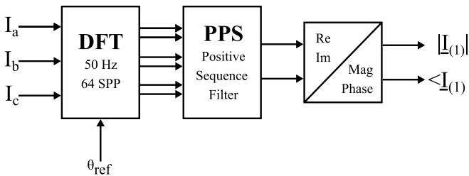  
Fig. 1. EMT-RMS-Conversion concept.

The results are per-phase complex phasors. These phasors can now be transformed into the positive sequence domain of the RMS simulator. The symmetric component equations sum the phasor’s real and imaginary values according to Eq. (3) [13].

$$
\underline {{I}} _ {\mathrm {R M S}} = \left[ \begin{array}{l l l} 0 & 1 & 0 \end{array} \right] \cdot \frac {1}{3} \left[ \begin{array}{c c c} 1 & 1 & 1 \\ 1 & \underline {{a}} ^ {2} & \underline {{a}} \\ 1 & \underline {{a}} & \underline {{a}} ^ {2} \end{array} \right] \cdot \left[ \begin{array}{l} \underline {{i}} _ {\mathrm {a}} \\ \underline {{i}} _ {\mathrm {b}} \\ \underline {{i}} _ {\mathrm {c}} \end{array} \right] \tag {3}
$$

$$
w i t h \underline {{a}} = e ^ {\mathrm {j} 1 2 0 ^ {\circ}}
$$

# 2.2. Signal interpolation and time step adaptation

The difference in time steps between the simulator’s domains and the transmission rate alongside of it makes the use of interpolation techniques a necessity. For the transition from RMS to EMT, the backward Euler linear interpolation method is used. Depending on the difference in time step between the domains, the missing EMT steps between two major RMS time steps are calculated as to be seen in (4). After each step the running variable ?? is increased by one. At the end of the interpolation window, the value of the interpolated signal is equal to the ‘‘new’’ value in the phasor domain simulation. After that, a new interpolation cycle starts again by resetting the running variable and receiving a new target value.

Re-transformation to instantaneous values is then performed by applying the inverse positive sequence transformation using a fixed frequency (??0) rotating phasor reference.

$$
x _ {\mathrm {E M T}} (t) = x \left(t _ {\mathrm {R M S} - 1}\right) + \frac {n}{n _ {\max }} \left[ x \left(t _ {\mathrm {R M S}}\right) - x \left(t _ {\mathrm {R M S} - 1}\right) \right] \tag {4}
$$

$$
n _ {\max } = \left\lfloor \frac {\Delta t _ {\mathrm {R M S}}}{\Delta t _ {\mathrm {E M T}}} \right\rfloor \tag {5}
$$

# 2.3. Electrical representation

The coupling of the simulators is performed using a voltage source on the EMT side and a current source on the RMS side (ideal transformer model) as indicated in Fig. 2. The current at the coupling interface point is measured, transformed and transmitted from the EMT side to the RMS side and for the voltage from RMS to EMT, respectively [14,15]. The same concept was used in previous works showing good results [5,12,16]. Specific details of the implementation vary between the used simulation tools and will be specified later in this publication.

# 3. Coupling techniques

The considerations for the design of the coupling interface indicated that the coupling interface might run based on the faster time step of the real-time simulator or the slower time step of the offline simulation system. As a result, the two interfaces are being developed. The former, based only on software and using the real-time simulator’s capabilities for the transformation and the latter inheriting the transformations and running on the faster time step.

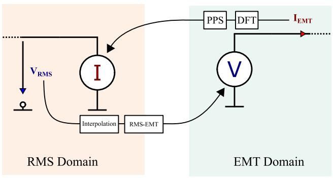  
Fig. 2. Electrical equivalents and data exchange.

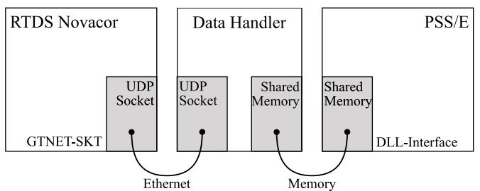  
Fig. 3. Principle of the UDP communication interface.

# 3.1. UDP based interface

The real-time simulator provides an interface to send and receive data packets using a variety of protocols. The simplest of them is basically a vector consisting of 4-byte long values, either integer or single precision floating point (IEEE754) numbers. The simulator manufacturer references this method as GTNET-SKT (Gigabit Transmission Network Interface Socket Protocol). The transmitted package size therefore is a multiple of 4 bytes. The sending rate of the packages is fixed and handled asynchronously to the simulator itself and can be set in the model. Typically, the sending rate is set to be a constant based on the phasor simulator’s time step.

The packages are then sent to a data handler running on the same machine as the offline simulator. The handler receives and processes the UDP packages and feeds them into the offline simulation tool. Meanwhile it also keeps track of package losses and delays and is capable of performing data adaptations if needed.

Finally, a shared memory interconnection is established to the PSS/E instance. For this purpose the shared memory algorithm of [16] is used and adapted for the PSS/E format. The interface ensures that data between handler instance and simulator instance are exchanged with minimum latency. Fig. 3 depicts the communication structure of the interface.

# 3.2. FPGA based interface

Since the computational load increases drastically with increasingly complex structures and the demand for hard real-time, a second FPGAbased coupling method is proposed. FPGAs are a common tool for low-latency communication tasks, for example in [17,18]. The structure of the proposed system is shown in Fig. 4

The real-time simulation data is passed via Aurora, a link-layer protocol intended for high-speed networking, as data packets to an FPGA board handling the necessary transformations (DFT) and the signal interpolation. This processed data is passed onto the software stack via PCIe.

Since the data processing is handled by an FPGA and all data transmissions are done via high-speed and low-delay interconnects (PCIe,

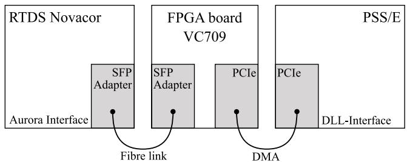  
Fig. 4. Principle of the FPGA based communication interface.

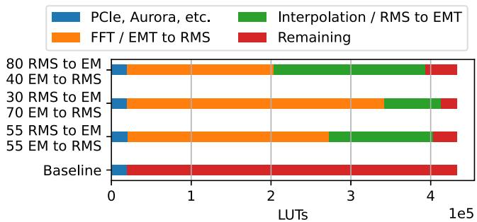  
Fig. 5. FPGA LUT utilization.

Aurora) most sources of additional delay in the RTDS-to-PSS/E-loop and the return path can be eliminated. While in the case of the UDPbased interface the amount of data that can be processed, is limited by the processing power of the data handler, in the FPGA-based interface it is limited by the resources available on the FPGA.

To quantify this, a baseline of resources on the FPGA with all necessary components implemented (such as PCIe interface and Aurora interface) is measured. This yields a measure of the resources available for data processing. In turn, a comparison of this measure with the resources needed for the data processing components is performed, giving a rough estimate of the capabilities of the interface. The configuration of the hardware determines the number of variables to be transferred from one simulation domain to the other.

In Fig. 5, the baseline and different simulation configurations are compared. Only the amount of used and remaining LUTs (Lookup Tables) are given, since these are the limiting factor in this design. Some aspects of the implementation algorithm (i.e. synthesis, logic optimization and Place and Route) and clock frequency constraints play into the resource demands of the data processing components, this data is extrapolated from the resource utilization of a design with a single channel. The FPGA device used in this evaluation is a Xilinx XC7VX690T-2FFG1761C on a Xilinx VC709 board.

# 4. Real-time simulation model

The part of the system calculated on the real-time machine consists of the electrical representation and the communication that allows for the grid model to interact with the controller based interface.

# 4.1. Grid model

The grid model for development of the interface consists of a fixed frequency source modeled as a thévenin equivalent with an impedance representing a short-circuit power of $S _ { k } ~ = ~ 4 0 \mathrm { M V A }$ and a nominal voltage of 132 kV. Two parallel overhead lines OHL A and B connect the source node NSRC to the node containing a load and the Co-Simulation interface. Each line is split in half to enable simulation of a fault along the line’s length of 200 km.

The RSCAD standard geometry model 3L14n is used consisting of six OHL and two ground wires on a standard tower. The overhead lines are represented by the Bergeron model and the load as a standard RL model. The load is modeled as a standard RL load model. Fig. 6 shows the electrical model used for the evaluation.

# 4.2. GTNET communication setup

For establishing a communication interface, the GTNETx2 card is used within the Novacor chassis. The card runs the GTNET_SKT firmware, enabling it to send arrays of values using a UDP connection over an Ethernet line [19]. Using the GTNET cards, the communication latency is typically in the range of single-digit milliseconds.

Therefore, the interface demands phasor values in the transmission allowing the elimination of latency by adapting the angle of the transmitted and received phasor data. The GTNET card in the Novacor runs asynchronous to the power system with a fixed time step. A trigger function set to the fundamental time step of the RMS simulator defines the instant of data exchange.

# 4.3. AURORA communication setup

In the real-time environment, Aurora is the protocol of choice when it comes to connecting hardware such as amplifiers that need a lowlatency communication running every time step of the underlying grid simulation. In case of usage of the AURORA instead of GTNET, instantaneous values can be used directly. The mandatory transformations and interpolations must then be provided by a communication partner. While this method requires additional hardware and associated drivers for the communication (such as FPGAs), it frees the simulator from calculation of intense workloads such as DFTs as they are provided by the external hardware.

# 5. Data handler interface

# 5.1. General concept

The data handler runs on the same system as the offline simulator. It ensures the reliable interaction and data transition between the realtime system and the offline system. Therefore it is responsible for reception of the UPD or Aurora messages, forwarding it to the offline simulator. The latter part is performed by a shared memory interface. The data handler is written in Python with the shared memory function added as a C++ DLL.

# 5.2. Real-time coupling

The real-time part of the data handler ensures communication to the EMT simulator via the Socket method described in Section 4.2 or the Aurora interface described in 4.3.

In case of the UDP communication, the data handler spawns processes for reception and transmission of the corresponding packets. The main process takes care of the communication to the offline simulator and the UDP processes handle the sockets. Asynchronous IO between the processes is handled by Python Queues.

The implementation of the FPGA interface will use a mostly similar approach by communicating on the application layer with the same shared memory interface. The current proof of concept design was verified and evaluated using a Linux kernel-space driver. This driver is intended to be used via a virtual network interface in an virtual machine in conjunction with an efficient data passing application.

# 5.3. Offline simulator coupling

The RMS simulator is coupled to the data handler by a compiled shared memory interface in a DLL.

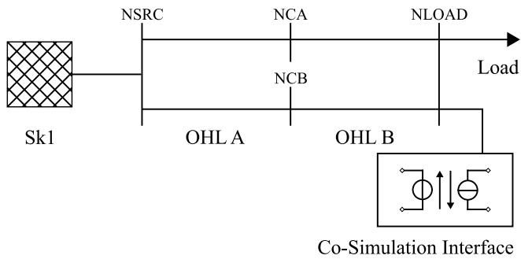  
Fig. 6. RTDS electrical model.

The specification requires it to have a unique, integer type address shm_idx that is used both in the simulation tools and the data handler respectively. This address ensures the correct transmission and reception between the simulators. A maximum of two communication partners is allowed for each shared memory channel. The number of input and output channels need to match the channels in the simulation tool relative to the shared memory interface. A timeout value timeout cancels out the communication in case a stall occurs and finally resets the interface completely.

During run-time the shared memory interface allows for status checks indicating an open communication path via its shm.status property. The do_iteration function exchanges data between the participants. At the end of the simulation, the simulator signals an end within the status byte. This closes the communication path as well.

# 6. RMS simulation model

PSS®E is a powerful offline tool for performing transmission system planning and analysis. It is a positive sequence simulation program in RMS domain with comprehensive modeling capabilities. The coupling interface the simulator uses is provided by a DLL consisting of the electrical part written in Fortran and the Shared Memory Co-Simulation part in C++.

# 6.1. $P S S ^ { \circled { \mathrm { 8 } } } E$ source interface

The Co-Simulation interface in $\mathrm { P S S ^ { \textregistered } E }$ uses a Norton equivalent for current injection. The load flow model is built as renewable source machine with rated MVA and a large internal dynamic impedance (ZSORCE) as shown in Fig. 7. In dynamics, this voltage source model is represented by its equivalent current source, ISORCE. The Norton current source’s effective dynamic impedance, ZSORCE, and its current contribution is depicted in Fig. 7.

This source model is a user written model and must meet the PSS®E modeling requirements. Such current injection models are called ‘‘coordinated call’’ models. These user written models are called for calculations of network solution in dynamic simulation. During the network solution, current injection from generators and loads are read and a total phasor current array called CURNT is created. Each user written model manipulates this CURNT array by its contribution $( I _ { \mathrm { U S E R } } )$ which is described by (6) [20,21].

$$
\operatorname {C U R N T} (I) = \operatorname {C U R N T} (I) + \mathrm {I} _ {\text {U S E R}} \tag {6}
$$

PSS®E calculates the voltages form the injected currents and the admittance matrix solution. Hence, the source model is iterated and matched for a steady state solution in initialization. $\mathrm { P S S ^ { \textregistered } E }$ has a two-step method for numerical integration in dynamic simulation (see Fig. 8).

The source model may be configured either by the shared memory (SHM) interface by stating real and imaginary currents or by providing

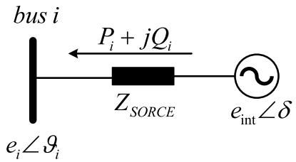  
Fig. 7. PSS®E load flow model.

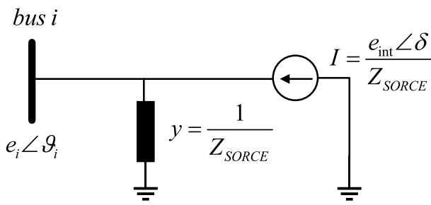  
Fig. 8. Norton equivalent of source model for switching and dynamics in PSS®E.

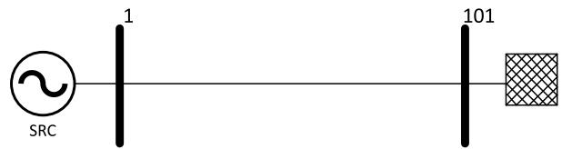  
Fig. 9. Single line diagram of the network in PSS®E.

active and reactive power in the machine model through $\boldsymbol { \mathrm { P S S ^ { \textregistered } } }$ E network data GUI. The choice of the input is defined by setting the ICON (M+4) to 1.0 or 0.0. 1.0 stands for Enabled SHM and 0.0 for input via network data. Based on the inputs, the load flow solution is calculated, and the source model is initialized for dynamic simulation. The shared memory subroutines are called during the dynamic simulation and based on the data exchanged the current contribution of source $( I _ { \mathrm { U S E R } } )$ is calculated. In addition, to establish and maintain the communication with the SHM and perform Co-Simulation the SHM address, I/O port details as well as timeout description needs to be specified in the PSS®E user written model.

# 6.2. Network in PSS®E

A simple RL network using positive sequence quantities is considered and represented in Fig. 9. The network consists of the source (SRC) at bus 1, an overhead line with ??∕?? = 10 and an equivalent connected at bus 101. The nominal voltage of the network is 132 kV . This network is co-simulated with its counterpart network (described in Section 4).

# 7. Simulations

# 7.1. Angle offset calculations

The interface is built with the principle of equality of active reactive power in mind. That means the main priority for calculations is set to the coupling point’s power both in the RMS and EMT network section as (7) and (8) indicate.

$$
P _ {\mathrm {R M S}} = P _ {\mathrm {E M T}} \tag {7}
$$

$$
Q _ {\mathrm {R M S}} = Q _ {\mathrm {E M T}} \tag {8}
$$

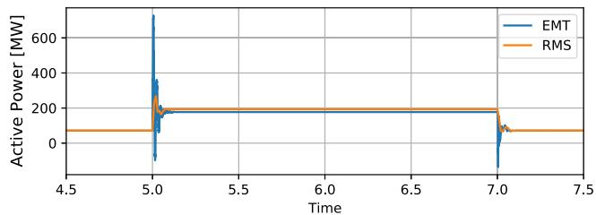

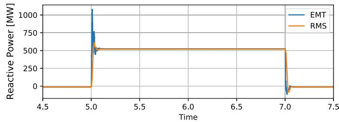  
Fig. 10. Active and reactive power at the coupling interface in case of a 3 phase fault in the EMT section.

Maintaining this power invariance is challenging because of the time step delay of the EMT-Simulator and the resulting variation of the voltage or current angle fed into the sources of the respective model.

To solve this angle gap, measurements are used with a pure ohmic load at the EMT simulator. By definition, current and voltage phases must be identical for ohmic loads. Angle offset in the transformations is added, satisfying this condition. For reference, an inductive load is connected. Here a known constant phase angle is measured again. The offset in angle for a discrete-time simulation can be obtained using (9) whereas ?? indicates number of delayed time steps to be added and ???? describes the time steps’ width and $f _ { 0 }$ is the fundamental frequency of the simulations.

$$
\Delta \varphi = n \cdot 3 6 0 \cdot d t _ {\mathrm {E M T}} \cdot f _ {0} \tag {9}
$$

Typically, the offset is a constant value, fixed to a type of source and measurement within one simulation tool. However, some programs tend to iterate time steps for instance at the start of fault events. In this case, further adaptations need to be considered to fulfill the principles mentioned in (7) and (8).

# 7.2. Fault in the EMT section

The interface is benchmarked by activating a three-phase fault in the EMT section of the Co-Simulated networks at a time instant of 5 s. Fig. 10 shows the reaction at the point of interconnection between RMS and EMT network. The result is a good match in steady-state behavior for both ?? and ??. For comparison reasons the direction of measurement of the powers is changed.

In case of the fault, both networks react according to their modeling and calculation principles. The EMT section shows larger transients due to their smaller time step and modeling approach. A difference in the power’s angle can be observed during the fault. This shows that in the model, a constant angle correction is used while during the fault the angle reference is changed. The voltages in both RMS and EMT sections show a very similar behavior as indicated in Fig. 11 as it shows the magnitude of the RMS network’s voltage at the coupling point as well as the instantaneous voltages in EMT. The axes have been compressed to only fit the positive side of the voltages, allowing for a better comparison. A small voltage dip can be seen that is heavily supported by the reactive power originating from the RMS network.

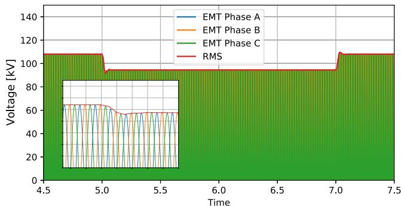  
Fig. 11. Voltages at the coupling interface in case of a 3 phase fault in the EMT section.

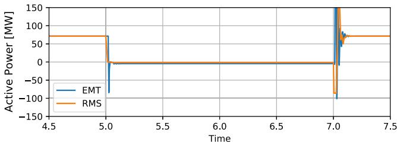

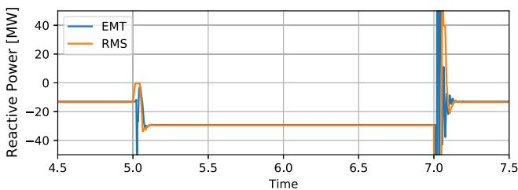  
Fig. 12. Active and reactive power at the coupling interface in case of a 3 phase fault in the RMS section.

# 7.3. Fault in the RMS section

Similar to the previous investigations, the RMS section’s fault is located in the middle of the line spanning from the source node to the coupling point. The three-phase to ground fault is implemented to have no residual voltage. As it can be seen in Fig. 12, initial conditions are identical to the previous case. The voltage dip is much more severe as Fig. 13 indicates. This is due to the closer proximity to the RMS equivalent’s source.

The EMT section supports the fault with reactive power. The active power is reduced to zero in this case.

# 8. Conclusion and further work

This publication’s intent is to show the development and feasibility of a Co-Simulation interface between RMS offline and EMT real-time simulators. The first results are promising, showcasing the possibility to extend the real-time part for more precise calculations or even eliminating the need for network reduction for extended power systems. Co-Simulation offers the capability to interconnect over different programs and even simulator types, effectively combining the strengths of the domains. Using Co-Simulation, the need to transfer large and complex power system models between simulation tools might be reduced. Also, the interface allows for black-boxed environment, where only values at the coupling points can be seen. This enables the confidentiality of intellectual property if wished so.

The results show the feasibility of the interface. The first development and implementation tends to be a complex and time-consuming

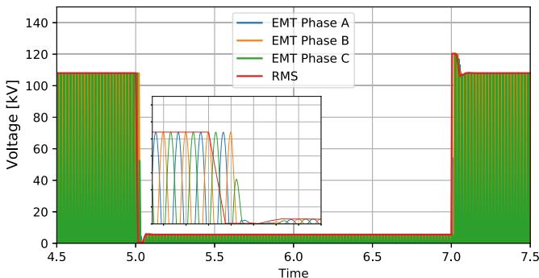  
Fig. 13. Voltages at the coupling interface in case of a 3 phase fault in the RMS section.

task. However, the re-usability of the interface allows for easy time savings in the long term.

The match between the simulation tools proves to be very good in terms of compatibility and numerical stability. In steady-state conditions, the models show a very good overlap of the powers, voltages and currents at the coupling interface. During fault situations, deviations can be optimized by reacting to the fault using corrective measures for the angles.

The next step is to multiply the number of interfaces used, practically allowing for a multitude of coupling points between EMT and RMS. Alongside, the test networks will be larger and more complex. Investigations will then be done using extensive power system models both in EMT and RMS domains.

# CRediT authorship contribution statement

Christian Scheibe: Conceptualization, Methodology, Writing – original draft. Ananya Kuri: Writing – original, draft, Investigation, Software. Yuyao Feng: Resources, Supervision, Funding acquisition. Le Zhao: Resources, Supervision, Funding acquisition. Xuejun Xiong: Resources, Supervision, Funding acquisition. Piergiovanni La Seta: Resources, Writing – review & editing, Funding acquisition. Xiao Peng Liang: Resources, Writing – review & editing, Funding acquisition. Johannes Knödtel: Writing – original, draft, Investigation, Software. Philipp Holzinger: Writing – original, draft, Investigation, Software. Marc Reichenbach: Supervision, Resources, Writing – review & editing. Gert Mehlmann: Supervision, Resources, Writing – review & editing.

# Declaration of competing interest

The authors declare that they have no known competing financial interests or personal relationships that could have appeared to influence the work reported in this paper.

# References

[1] IEEE Power & Energy Society, Stability definitions and characterization of dynamic behavior in systems with high penetration of power electronic interfaced technologies, 2020, PES-TR77.   
[2] J.W.G. C4/C6.35/CIRED, Modelling of inverter-based generation for power system dynamic studies.   
[3] W. Winter, K. Elkington, G. Bareux, J. Kostevc, Pushing the limits: Europe’s new grid: Innovative tools to combat transmission bottlenecks and reduced inertia, IEEE Power Energy Mag. 13 (1) (2015) 60–74.   
[4] CIGRE Working Group B33.02, Guidelines for respresentation of network elements when calculating transients, 1990.   
[5] V. Dinavahi, M. Steurer, K. Strunz, J.A. Martinez, Interfacing techniques for simulation tools, in: 2009 IEEE Power & Energy Soc. General Meeting, IEEE, pp.1-6,26.07.2009-30.07.2009.

[6] S. Abhyankar, A.J. Flueck, An implicitly-coupled solution approach for combined electromechanical and electromagnetic transients simulation, in: 2012 IEEE Power & Energy Soc. General Meeting, IEEE, pp. 1–8, 22.07.2012-26.07.2012.   
[7] A. Monti, M. Stevic, S. Vogel, R.W. de Doncker, E. Bompard, A. Estebsari, F. Profumo, R. Hovsapian, M. Mohanpurkar, J.D. Flicker, V. Gevorgian, S. Suryanarayanan, A.K. Srivastava, A. Benigni, A global real-time superlab: Enabling high penetration of power electronics in the electric grid, IEEE Power Electr. Mag. 5 (3) (2018) 35–44.   
[8] Y. Hu, W. Wu, B. Zhang, Q. Guo, Development of an RTDS-TSA hybrid transient simulation platform with frequency dependent network equivalents, in: 4th IEEE/PES Innovative Smart Grid Technologies Europe (ISGT Europe), 2013, IEEE, Piscataway, NJ, 2013, pp. 1–5.   
[9] R. Fabián Espinoza, G. Justino, R.B. Otto, R. Ramos, Real-time RMS-emt cosimulation and its application in HIL testing of protective relays, Electr. Power Syst. Res. 197 (2021) 107326.   
[10] H. Kopetz, Real-Time Systems: Design Principles for Distributed Embedded Applications, in: The Springer Int. Ser. in Eng. and Comput. Sci., Springer US, 2006.   
[11] A. Kuri, X. Zhou, G. Mehlmann, M. Luther, A. Kuri, P. La Seta, Dynamic model reduction based on coherency and genetic optimization methodology, in: ETG Congr. 2021, 2021.   
[12] F. Plumier, Co-simulation of Electromagnetic Transients and Phasor Models of Electric Power Systems (Ph.D. thesis), Faculté des Sciences Appliquées, Liège, Belgium, 11/2015.

[13] D. Oeding, B.R. Oswald, Elektrische Kraftwerke Und Netze, Springer Berlin Heidelberg, Berlin, Heidelberg, 2016.   
[14] M. Stevic, A. Monti, A. Benigni, Development of a simulator-to-simulator interface for geographically distributed simulation of power systems in real time, in: 2015 41st Annu. Conf. IEEE Ind. Electronics Soc., IECON, 2015, pp. 5020–5025.   
[15] M. Mirz, S. Vogel, B. Schafer, A. Monti, Distributed real-time co-simulation as a service, in: 2018 IEEE Int. Conf. Ind. Electronics for Sustainable Energy Syst., IESES, IEEE, 2018, pp. 534–539.   
[16] C. Scheibe, A. Semerow, J. Menke, P. la Seta, A. Raab, G. Mehlmann, M. Luther, A novel co-simulation concept using interprocess communication in shared memory, in: 2019 IEEE Power Energy Soc. General Meeting, PESGM, 2019.   
[17] J. Sheng, C. Yang, M. Herbordt, Towards low-latency communication on FPGA clusters with 3D FFT case study, in: Proc. Highly Efficient and Reconfigurable Technologies, ACM, 2015.   
[18] J.W. Lockwood, A. Gupte, N. Mehta, M. Blott, T. English, K. Vissers, A lowlatency library in FPGA hardware for high-frequency trading (HFT), in: 2012 IEEE 20th Annu. Symp. High-Performance Interconnects, 2012, pp. 9–16.   
[19] RSCAD FX 1.1 Control Systems Manual, RTDS Technologies Inc. 2021.   
[20] Program Application Guide PSS® E 34.8.1, 2, Siemens Industry, Inc. Siemens Power Technologies, 2020.   
[21] Program Operation Manual PSS® E 34.8.1, Siemens Industry, Inc. Siemens Power Technologies, 2020.