# Nonlinear Magnetic Equivalent Circuit-Based Real-Time Sen Transformer Electromagnetic Transient Model on FPGA for HIL Emulation

Jiadai Liu, Student Member, IEEE, and Venkata Dinavahi, Senior Member, IEEE

Abstract—Strategic power-flow control using a Sen transformer (ST) can be a robust and cost-effective solution to relieve grid congestion due to increased installation of renewables. The ST consists of a multiwinding transformer and tap changer that can regulate the power flow through a transmission line by injecting a series-connected controllable voltage. This paper develops a realtime high-fidelity magnetic equivalent circuit-based electromagnetic transient model for the ST on the field-programmable gate array (FPGA) for hardware-in-the-loop applications. This geometry-based model was developed to depict the major flux paths in the transformer core, and complex nonlinear phenomena, such as saturation, hysteresis, and eddy currents. The entire real-time ST model and other power system components are emulated by hardware description language, employing the 32-b floating point precision on the FPGA chip. A fully paralleled and pipelined hardware architecture is developed to achieve accurate real-time emulation as well as the lowest latency and smallest hardware resource consumption. The real-time results are validated against 3-D finite-element simulation using JMAG software.

Index Terms—Electromagnetic transient (EMT) analysis, field-programmable gate arrays (FPGAs), finite-element methods, hardware-in-the-loop (HIL) emulation, hysteresis, magnetic equivalent circuits, parallel algorithms, parallel processing, power-flow control, pipelining, real-time systems, Sen transformer (ST).

# I. INTRODUCTION

G ROWING demand by a plethora of sensitive loads,stringent reliability constraints, and heightened environ- stringent reliability constraints,and heightened environmental concerns that favour greater integration of renewables, have created perfect conditions for a highly stressed and dyspeptic transmission grid [1], [2]. Congestion of lines under these conditions has become commonplace with increased probability of major outages leading to blackouts. While long-term transmission planning and expansion still remains the prudent solution, a near term economical alternative might be the strategic placement of power-flow controllers to relieve transmission bottlenecks [3]–[6]. The unified power-flow controller

Manuscript received June 16, 2015; revised October 28, 2015 and December 27, 2015; accepted January 13, 2016. Date of publication January 18, 2016; date of current version November 18, 2016. This work was supported by the Natural Science and Engineering Research Council of Canada (NSERC). Paper no. TPWRD-00743-2015.

The authors are with the Department of Electrical and Computer Engineering, University of Alberta, Edmonton, AB T6G 2V4 Canada (e-mail: jiadai@ualberta.ca; dinavahi@ualberta.ca).

Color versions of one or more of the figures in this paper are available online at http://ieeexplore.ieee.org.

Digital Object Identifier 10.1109/TPWRD.2016.2518676

(UPFC) [7], [8] is one such solution which consists of a series and a shunt converter that can generate a compensation voltage to insert in series with the transmission line. The compensation voltage is fully controllable both in magnitude and phase angle with respect to the line voltage, for independent regulation of the active and reactive power flowing through the line in both directions. However, high installation and operation costs have hitherto prevented the UPFC's widespread implementation. The Sen transformer (ST) proposed in [9], can address the same objectives but with a lower cost, higher reliability, and efficiency [10]; however, no ST has been commissioned yet in a power system. The ST consists of a single-core three-limb three-phase transformer and tap changers. The multi-winding transformer has three primary windings and nine secondary windings. By setting the tap changers into different combinations, the ST can inject a compensation voltage with controllable magnitude and phase angle much the same way like the UPFC, thereby providing an independent active power and reactive power-flow control. The concept of the smart power-flow controller (SPFC) was introduced in [11] which offered the ST with the option of either a low-cost electromechanical design with mechanical tap changers or a power electronics-based design using thyristor-based tap changers.

A detailed electromagnetic transient model of the ST in realtime is necessary to study its impact on the host power system. It would also allow rapid testing and prototyping of new control algorithms under hardware-in-the-loop (HIL) conditions [12]. A real-time transient ST model was developed on the CPU in [13], and an advanced tap-changing algorithm was proposed in [14]; however, this real-time ST model was developed based on a lumped electrical circuit model, which ignored the detailed transformer core geometry and flux paths in the core. Furthermore, in this model nonlinear core saturation was included using a piece-wise linear approximation, which is prone to numerical oscillations; complex behavior such as hysteresis and eddy current transients were entirely omitted. The increased computational complexity of detailed electromagnetic transient ST model makes the CPU an unlikely implementation platform for real-time HIL emulation.

This paper proposes a real-time high-fidelity nonlinear magnetic equivalent circuit (MEC)-based ST electromagnetic transient (EMT) model on the field-programmable gate array (FPGA) for HIL emulation. The MEC approach [15], [16] which is geometry-based is employed to model the multi-winding transformer consisting of magnetomotive

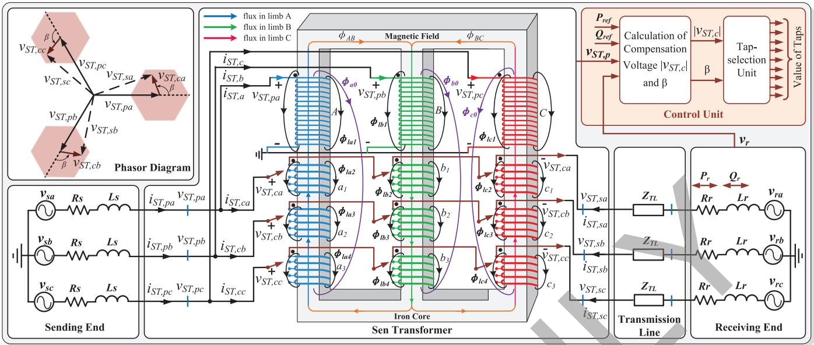  
Fig. 1. Schematic of the ST and its interconnection to the transmission network.

force (mmf) sources and permeance elements. The nonlinear permeance elements necessitate a time-varying transformer nodal admittance matrix which in turn require the entire power system matrix to be updated in every emulation time-step. The hysteresis and eddy current behavior are modeled based on Preisach theory [17], [18] and frequency-dependent equivalent network [19], [21], respectively. All of these details increase the computational burden of the high-fidelity electromagnetic transient model and put upward pressure on the emulation time-step. The FPGA has previously proven to be an efficacious platform for transient simulation of power systems [22]–[25] mainly due to its capability of exploiting hardware parallelism and pipelining. The real-time hardware emulation results are validated using 3-D finite-element (FE) simulation in JMAG®.

The remainder of this paper is organized as follows. Section II presents the ST operation background and nonlinear MEC-based ST model. Section III gives the implementation details of the hardware emulation. Section IV provides the case studies and real-time results to validate the emulated MEC-based ST on the FPGA. Finally, Section V presents the conclusion.

# II. GEOMETRICAL SEN TRANSFORMER (ST) EMT MODEL

# A. ST Operating Principle

The three-phase, three-limb ST circuit schematic and its interconnection to the transmission line is shown in Fig. 1. At the sending-end the three-phase transmission line supplies voltages, $V _ { S T , p a } , V _ { S T , p b }$ and $V _ { S T , p c }$ to the ST primary windings, which are connected in Y and in shunt with the transmission line. The nine secondary windings: $a _ { 1 } , a _ { 2 } ,$ and $a _ { 3 }$ are placed in the first limb; $b _ { 1 } , b _ { 2 }$ , and $b _ { 3 }$ are placed in the second limb; and $c _ { 1 } , c _ { 2 }$ and $c _ { 3 }$ are placed in the third limb. The three secondary windings which are placed in different limbs are connected in series with the transmission line and inject a compensation voltage, e.g., windings $a _ { 1 } , b _ { 1 }$ and $c _ { 1 }$ for the compensation voltage $V _ { S T , c a }$ in phase- ; windings $a _ { 2 } , b _ { 2 }$ and $c _ { 2 }$ for the compensation voltage

in phase- ; windings $a _ { 3 } , b _ { 3 }$ and $c _ { 3 }$ for the compensation voltage $V _ { S T , c c }$ Vs in phase- . By using the on-load tap changers, the active number of turns of the nine secondary windings can be configured so that the induced compensation voltage can be controlled both in magnitude and phase angle independently. If the 120 phase-shift compensation voltage is series connected with the transmission line, as shown in Fig. 1, the previous sending-end voltage (the ST primary side voltage), $v _ { S T , p } ,$ is modified to a new effective sending-end voltage (the ST secondary side voltage), , as can be seen from the top lefthand corner of Fig. 1. The number of turns of the secondary windings can be classified into three groups: $a _ { 1 } , b _ { 2 }$ and $c _ { 3 } ~ ( G P _ { 1 } ) ; b _ { 1 } , c _ { 2 }$ and $a _ { 3 } ~ ( G P _ { 2 } ) _ { : }$ ; and $c _ { 1 } , a _ { 2 }$ and $b _ { 3 } ~ ( G P _ { 3 } )$ . The windings in one group have the same tap setting, however, one group may have a different tap setting from others. The major flux paths consisting of core and leakage fluxes in the yoke and limb are also depicted in Fig. 1.

# B. Tap-Selection Algorithm

The Control Unit takes the measurements of the sending end voltage, $V _ { S T , p }$ , and the receiving end voltage, $v _ { r }$ , from the transmission network as well as the required power level, $P _ { r e f }$ and $Q _ { r e f }$ as inputs. The calculated compensation voltage magnitude $v _ { S T , c }$ and the phase angle are further forwarded to the Tap-setting Unit to generate the combinations of the tap settings for each secondary winding. Further information regarding the tap-setting algorithm and its implementation can be found in [14].

# C. High-Fidelity Nonlinear Magnetic Equivalent Circuit (MEC)-Based ST Model

The three-phase, three-limb MEC-based ST representation, is shown in Fig. 2. Each limb consist of four types of components: 1) MMF sources, $N _ { A } i _ { S T , a } , N _ { B } i _ { S T , b }$ and $N _ { C } i _ { S T , c }$ , generated by the current flow through the primary windings in phases and , respectively; $N _ { a 1 } i _ { S T , s a } , N _ { a 2 } i _ { S T , s b } , N _ { a 3 } i _ { S T , s c } ,$

$N _ { b 1 } i _ { S T , s a } , N _ { b 2 } i _ { S T , s b } , N _ { b 3 } i _ { S T , s c } , N _ { c 1 } i _ { S T , s a } , N _ { c 2 } i _ { S T , s b }$ and

$N _ { c 3 } i _ { S T , s c }$ are generated by the current flow through the secondary windings in phases $a , \ b ,$ and , respectively; 2) nonlinear permeances, $P _ { A } , P _ { B }$ and $P _ { C }$ represent nonlinear iron core permeances for ST primary windings in phases $a , b$ and $c ,$ respectively; $P _ { a 1 } , P _ { a 2 } , P _ { a 3 } , P _ { b 1 } , P _ { b 2 } , P _ { b 3 } , P _ { c 1 } , P _ { c 2 }$ and $P _ { c 3 }$ represent nonlinear iron core permeances for the ST secondary windings in phases $^ { a , }$ and $c ,$ respectively; 3) linear permeances, $P _ { l a 1 }$ to $P _ { l a 4 } , P _ { l b 1 }$ to $P _ { l b 4 }$ and $P _ { l c 1 }$ to $P _ { l c 4 }$ represent the ST leakage air permeances in phases and $c ,$ respectively; 4) linear permeances $P _ { a 0 } , P _ { b 0 } , P _ { c 0 }$ represent ST zero-sequence permeances in phases $a , ~ b$ and $c ,$ respectively. In addition, there are also two nonlinear iron permeances $P _ { a b }$ and $P _ { b c }$ that represent ST yoke between phase- and phase- , and phaseand phase- , respectively.

The branch fluxes and the mmf's in the ST core can be related to each other by the following equation,

$$
\boldsymbol {\phi} = \mathbf {P} \left(\mathbf {N} \boldsymbol {i} - \boldsymbol {\xi} ^ {\prime}\right) \tag {1}
$$

where $\phi .$ and $\pmb { \xi } ^ { \prime }$ are $n \times 1$ vectors of branch fluxes, winding currents, and branch mmf's, respectively. And and are diagonal matrices of branch permeances and number of winding turns, respectively.

According to Gauss' law for magnetism [26], the summation of fluxes entering or leaving a node in the magnetic equivalent circuit must be zero, given as,

$$
\boldsymbol {C} _ {n b} ^ {T} \boldsymbol {\phi} = \mathbf {0}, \tag {2}
$$

where $C _ { n b } ^ { T }$ is the node-branch connection matrix, its entries can be $1 , - 1$ , and 0 which stands for branch flux entering, leaving, and no connection to the node, respectively.

The branch MMF vector can be obtained by applying matrix $C _ { n b } ^ { T }$ to node MMF vector $\xi _ { \scriptscriptstyle { n o d e } }$ given as,

$$
\boldsymbol {C} _ {n b} \boldsymbol {\xi} _ {n o d e} = \boldsymbol {\xi} ^ {\prime}. \tag {3}
$$

By combining the above three equations the relationship between the branch fluxes and the winding currents can be established:

$$
\boldsymbol {\phi} = \mathbb {P P N} i, \tag {4}
$$

where

$$
\mathbb {P} = \mathbf {I} - \mathbf {P C} _ {n b} \left(\mathbf {C} _ {n b} ^ {T} \mathbf {P C} _ {n b}\right) ^ {- 1} \mathbf {C} _ {n b} ^ {T}. \tag {5}
$$

is the $n \times n$ identity matrix.

By partitioning the permeance network into two branch sets, , $\phi ^ { M }$ for the branches with MMF sources and permeance elements, and $\phi ^ { P }$ , for branches with only permeance elements, (4) can be rewritten as:

$$
\boldsymbol {\phi} ^ {M} = \mathbb {P} ^ {M M} \mathbf {P} ^ {M} \mathbf {N} ^ {M} \boldsymbol {i} ^ {M}, \tag {6}
$$

where $\mathbb { P } ^ { M M }$ is a $. 1 2 \times 1 2$ sub-matrix of . $\pmb { \phi } ^ { M }$ and $\pmb { i } ^ { M }$ are 12 $\times 1$ vectors, and $\mathbf { P } ^ { M }$ and ${ \bf N } ^ { M }$ are diagonal $1 2 \times 1 2$ matrices, given as:

$$
\begin{array}{l} \boldsymbol {\phi} ^ {M} = \left[ \phi_ {A} (t) \phi_ {B} (t) \phi_ {C} (t) \phi_ {a 1} (t) \phi_ {b 1} (t) \phi_ {c 1} (t) \right. \\ \left. \phi_ {a 2} (t) \phi_ {b 2} (t) \phi_ {c 2} (t) \phi_ {a 3} (t) \phi_ {b 3} (t) \phi_ {c 3} (t) \right] ^ {T}, \\ \end{array}
$$

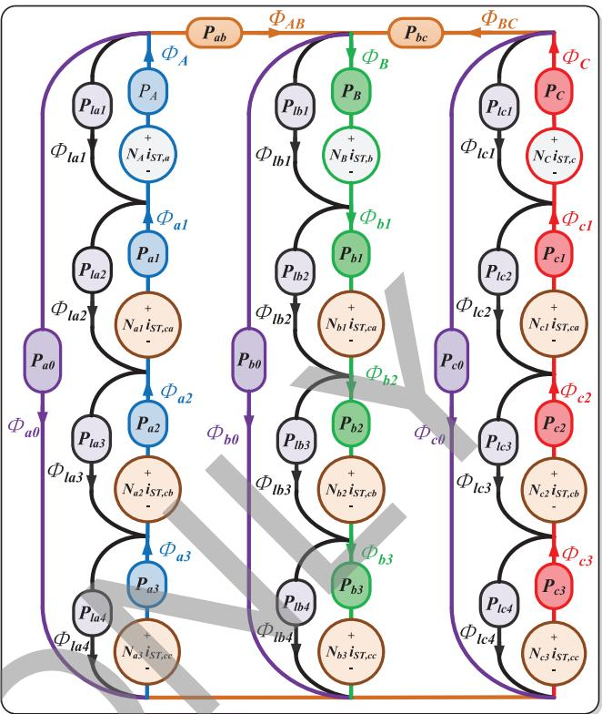  
Fig. 2. High-fidelity magnetic equivalent circuit representation for the ST iron core.

$$
\begin{array}{l} \boldsymbol {i} ^ {M} = \left[ i _ {S T, a} (t) i _ {S T, b} (t) i _ {S T, c} (t)\right) i _ {S T, s a} (t) i _ {S T, s a} (t) i _ {S T, s a} (t) \\ \left. i _ {S T, s b} (t) i _ {S T, s b} (t) i _ {S T, s b} (t) i _ {S T, s c} (t) i _ {S T, s c} (t) i _ {S T, s c} (t) \right] ^ {T}, \\ \mathbf {P} ^ {M} = \operatorname {d i a g} \left\{P _ {A} (t) P _ {B} (t) P _ {C} (t) P _ {a 1} (t) P _ {b 1} (t) P _ {c 1} (t) \right. \\ \left. P _ {a 2} (t) P _ {b 2} (t) P _ {c 2} (t) P _ {a 3} (t) P _ {b 3} (t) P _ {c 3} (t) \right\}, \\ \mathbf {N} ^ {M} = \operatorname {d i a g} \left\{N _ {A} (t) N _ {B} (t) N _ {C} (t) N _ {a 1} (t) N _ {b 1} (t) N _ {c 1} (t) \right. \\ N _ {a 2} (t) N _ {b 2} (t) N _ {c 2} (t) N _ {a 3} (t) N _ {b 3} (t) N _ {c 3} (t) \}. \\ \end{array}
$$

From Faraday's law the winding terminal voltages can be written in matrix format as,

$$
\boldsymbol {v} _ {S T} = \mathbf {N} _ {Z} \frac {d}{d t} \boldsymbol {\phi} ^ {M} (t), \tag {7}
$$

where $\mathbf { N } _ { Z }$ is a $6 \times 1 2$ winding turns matrix. ${ \pmb v } _ { S T }$ is a $6 \times 1$ ST terminal voltage vector, given as:

$$
\begin{array}{l} \boldsymbol {v} _ {S T} = \left[ v _ {S T, p a} (t) v _ {S T, p b} (t) v _ {S T, p c} (t) \right. \\ \left. v _ {S T, s a} (t) v _ {S T, s b} (t) v _ {S T, s c} (t) \right] ^ {T}, \\ \end{array}
$$

$$
\mathbf {N} _ {Z} ^ {T} = \left[ \begin{array}{c c c c c c} N _ {A} & 0 & 0 & N _ {A} & 0 & 0 \\ 0 & N _ {B} & 0 & 0 & N _ {B} & 0 \\ 0 & 0 & N _ {C} & 0 & 0 & N _ {C} \\ . & . & 0 & N _ {a 1} & 0 & 0 \\ . & . & . & N _ {b 1} & 0 & 0 \\ . & . & . & N _ {c 1} & 0 & 0 \\ . & . & . & 0 & N _ {a 2} & 0 \\ . & . & . & . & N _ {b 2} & 0 \\ . & . & . & . & N _ {c 2} & 0 \\ . & . & . & . & 0 & N _ {a 3} \\ . & . & . & . & . & N _ {b 3} \\ 0 & 0 & 0 & 0 & 0 & N _ {c 3} \end{array} \right].
$$

The discrete-time difference equations of (7) can be obtained by applying Trapezoidal rule,

$$
\mathbf {N} _ {Z} \boldsymbol {\phi} ^ {M} (t) = \frac {\Delta t}{2} \boldsymbol {v} _ {S T} (t) + \boldsymbol {\phi} _ {h i s t} ^ {M} (t), \tag {8}
$$

where $\Delta t$ is the simulation time-step, with $\phi _ { h i s t } ^ { M } ( t )$ being the 6 $\times 1$ history vector term expressed as:

$$
\boldsymbol {\phi} _ {h i s t} ^ {M} (t) = \frac {\Delta t}{2} \boldsymbol {v} _ {S T} (t - \Delta t) + \mathbf {N} _ {Z} \boldsymbol {\phi} ^ {M} (t - \Delta t). \tag {9}
$$

Substituting (6), the left hand side of (8) can be rewritten as,

$$
\mathbf {N} _ {Z} \boldsymbol {\phi} ^ {M} (t) = \mathbf {Z} \boldsymbol {i} ^ {M}, \tag {10}
$$

where is a $6 \times 1 2$ matrix given as:

$$
\mathbf {Z} = \mathbf {N} _ {Z} \mathbb {P} ^ {M M} \mathbf {P} ^ {M} \mathbf {N} ^ {M}. \tag {11}
$$

Further (10) can be rewritten as:

$$
\mathbf {N} _ {\mathcal {Z}} \boldsymbol {\phi} ^ {M} (t) = \mathbf {Z} \boldsymbol {i} ^ {M} = \mathbf {Z} ^ {\prime} \boldsymbol {i} ^ {M ^ {\prime}}, \tag {12}
$$

with being the $6 \times 6$ impedance matrix and $\pmb { i } ^ { M \prime } ( t )$ being the 6 $\times 1$ current vector, given as shown in the equation at the bottom of the page. By noting that the ST current vector is expressed, shown in the equation at the bottom of the page.

Equation (8) can be further rewritten as

$$
\mathbf {Z} _ {S T} \boldsymbol {i} _ {T} (t) = \frac {\Delta t}{2} \boldsymbol {v} _ {S T} (t) + \boldsymbol {\phi} _ {h i s t} ^ {M} (t), \tag {13}
$$

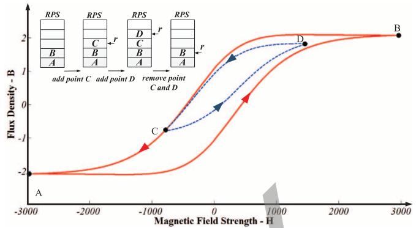  
Fig. 3. Hysteresis major and minor loops corresponding to the reversal point stack (RPS) within the Preisach hysteretic unit (PHU).

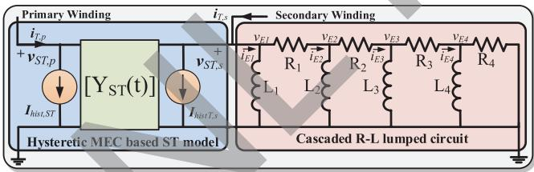  
ig. 4. High fidelity MEC-based ST model interfaced with cascaded equivalent circuit.

where $\mathbf { Z } _ { S T }$ is the $6 \times 6$ matrix given as shown in the equation at the bottom of the page.

$$
\mathbf {Z} ^ {\prime} = \left[ \begin{array}{c c c c c c} Z _ {1, 1} & \ldots & Z _ {1, 3} & Z _ {1, 4} + Z _ {1, 5} + Z _ {1, 6} & \ldots & Z _ {1, 1 0} + Z _ {1, 1 1} + Z _ {1, 1 2} \\ Z _ {2, 1} & \ldots & Z _ {2, 3} & Z _ {2, 4} + Z _ {2, 5} + Z _ {2, 6} & \ldots & Z _ {2, 1 0} + Z _ {2, 1 1} + Z _ {2, 1 2} \\ \cdot & \cdot & \cdot & \cdot & \cdot & \cdot \\ \cdot & \cdot & \cdot & \cdot & \cdot & \cdot \\ \cdot & \cdot & \cdot & \cdot & \cdot & \cdot \\ Z _ {6, 1} & \ldots & Z _ {6, 3} & Z _ {6, 4} + Z _ {6, 5} + Z _ {6, 6} & \ldots & Z _ {6, 1 0} + Z _ {6, 1 1} + Z _ {6, 1 2} \end{array} \right],
$$

$$
\pmb {i} ^ {M \prime} = [ i _ {S T, a} (t) i _ {S T, b} (t) i _ {S T, c} (t) i _ {S T, s a} (t) i _ {S T, s b} (t) i _ {S T, s c} (t) ] ^ {T}.
$$

$$
\begin{array}{c} \boldsymbol {i} _ {S T} = [ i _ {S T, p a} (t)   i _ {S T, p b} (t)   i _ {S T, p c} (t)   i _ {S T, s a} (t)   i _ {S T, s b} (t)   i _ {S T, s c} (t) ] ^ {T}, \\ \text {a n d} \end{array}
$$

$$
i _ {S T, p a} (t) = i _ {S T, a} (t) - i _ {S T, s a} (t),
$$

$$
i _ {S T, p b} (t) = i _ {S T, b} (t) - i _ {S T, s b} (t),
$$

$$
i _ {S T, p c} (t) = i _ {S T, c} (t) - i _ {S T, s c} (t).
$$

$$
\mathbf {Z} _ {S T} = \left[ \begin{array}{c c c c c c} Z _ {1, 1} ^ {\prime} & Z _ {1, 2} ^ {\prime} & Z _ {1, 3} ^ {\prime} & Z _ {1, 4} ^ {\prime} + Z _ {1, 1} ^ {\prime} & Z _ {1, 5} ^ {\prime} + Z _ {1, 2} ^ {\prime} & Z _ {1, 6} ^ {\prime} + Z _ {1, 3} ^ {\prime} \\ Z _ {2, 1} ^ {\prime} & Z _ {2, 2} ^ {\prime} & Z _ {2, 3} ^ {\prime} & Z _ {2, 4} ^ {\prime} + Z _ {2, 1} ^ {\prime} & Z _ {2, 5} ^ {\prime} + Z _ {2, 2} ^ {\prime} & Z _ {2, 6} ^ {\prime} + Z _ {2, 3} ^ {\prime} \\ \cdot & \cdot & \cdot & \cdot & \cdot & \cdot \\ \cdot & \cdot & \cdot & \cdot & \cdot & \cdot \\ \cdot & \cdot & \cdot & \cdot & \cdot & \cdot \\ Z _ {6, 1} ^ {\prime} & Z _ {6, 2} ^ {\prime} & Z _ {6, 3} ^ {\prime} & Z _ {6, 4} ^ {\prime} + Z _ {6, 1} ^ {\prime} & Z _ {6, 5} ^ {\prime} + Z _ {6, 2} ^ {\prime} & Z _ {6, 6} ^ {\prime} + Z _ {6, 3} ^ {\prime} \end{array} \right].
$$

Then, the Norton equivalent formula for MEC-based ST is given,

$$
\boldsymbol {i} _ {S T} (t) = \mathbf {Y} _ {S T} (t) \boldsymbol {v} _ {S T} (t) + \boldsymbol {I} _ {\text {h i s t}, S T} (t), \tag {14}
$$

where

$$
\boldsymbol {I} _ {\text {h i s t}, S T} (t) = \mathbf {Z} _ {S T} ^ {- 1} \boldsymbol {\phi} _ {\text {h i s t}} ^ {M} (t), \tag {15}
$$

$$
\mathrm {a n d}
$$

$$
\mathbf {Y} _ {S T} (t) = \frac {\Delta t}{2} \mathbf {Z} _ {S T} ^ {- 1}. \tag {16}
$$

The time-varying matrix $\mathbf { Y } _ { S T } ( t )$ , due to the nonlinear permeance matrices $\dot { \mathbb { P } } ^ { M \bar { M } }$ and $\mathbf { P } ^ { M }$ in (11), causes the overall power system admittance matrix to be time-varying as well. Therefore, a LU decomposition needs to be performed to invert the matrix in every emulation time-step and then to find the final network solution by using the nodal analysis method.

# D. Iron Core Hysteresis

The permeance matrix is divided into two sets $\mathbf { P } ^ { M }$ and $\mathbf { P } ^ { P }$ as described in Section II(C). The entries in the matrix $\mathbf { P } ^ { P }$ representing the leakage permeance are constant, however, the entries in the matrix $\bar { \mathbf { P } } ^ { M }$ representing the nonlinear iron permeance change in every simulation time-step. In this work, the Preisach model [18] is used to represent the nonlinearity as well as hysteresis behaviour. The major loop function is represented as (17), once the major loop function is fixed, all the minor loop trajectories from a reversal point follow this uniform template,

$$
\boldsymbol {B} _ {p - m} \left(\boldsymbol {H} _ {m}\right) = \frac {1}{2} \sum_ {u = 1} ^ {3} a _ {u} \left[ \tanh  \left(b _ {u} \boldsymbol {H} _ {m}\right) + c _ {u} \sec h ^ {2} \left(b _ {u} \boldsymbol {H} _ {m}\right) \right], \tag {17}
$$

where $a _ { u } , b _ { u } , c _ { u }$ are the parameters to define this hyperbolic template, $\mathbf { { \cal H } } _ { m } = [ { \cal H } _ { m 1 } \ { \cal H } _ { m 2 } \ \dots \ { \cal H } _ { m n _ { l } } ] ^ { T }$ is the magnetization current vector flowing through the nonlinear elements and $\mathbf { B } _ { p - m } ~ = ~ [ B _ { p - m 1 } ~ B _ { p - m 2 } ~ \ldots ~ B _ { p - m n _ { l } } ] ^ { T }$ Bp-mni] are the flux corresponding to this current vector on the major loop. The subscript $\mathbf { \widetilde { p } _ { - } } \mathbf { m } ^ { \prime }$ stands for Preisach major loop and $n _ { l }$ stands for the number of nonlinear permeance.

Once the major loop function is defined, all the upward and downward minor loop trajectories from a reversal point $\left( H _ { r l } , B _ { r l } \right)$ follow this uniform template can be expressed as (18) and (19), respectively, with $\bar { { \cal H } _ { r } } = [ { \cal H } _ { r 1 } \ { \cal H } _ { r 2 } \ \bar { { \bf \dots } } \ { \cal H } _ { r n _ { l } } ] ^ { T }$ and $\mathbf { B } _ { r } = [ B _ { r 1 } \bar { B _ { r 2 } } \dots \bar { B _ { { r n } _ { l } } } ] ^ { T } \colon$

$$
\begin{array}{l} \boldsymbol {B} _ {p - u} \left(\boldsymbol {H} _ {m}\right) = - \boldsymbol {B} _ {p - m} \left(- \boldsymbol {H} _ {m}\right) - \boldsymbol {B} _ {p - m} \left(\boldsymbol {H} _ {r}\right) + \boldsymbol {B} _ {r} \tag {18} \\ + 2 \boldsymbol {K} \left(- \boldsymbol {H} _ {r}\right) \boldsymbol {K} \left(\boldsymbol {H} _ {m}\right), \\ \end{array}
$$

$$
\begin{array}{l} \boldsymbol {B} _ {p \_ d} \left(\boldsymbol {H} _ {m}\right) = \boldsymbol {B} _ {p \_ m} \left(\boldsymbol {H} _ {m}\right) + \boldsymbol {B} _ {p \_ m} \left(- \boldsymbol {H} _ {r}\right) + \boldsymbol {B} _ {r} \tag {19} \\ - 2 \boldsymbol {K} \left(\boldsymbol {H} _ {r}\right) \boldsymbol {K} \left(- \boldsymbol {H} _ {m}\right), \\ \end{array}
$$

where

$$
\begin{array}{l} \boldsymbol {K} = \left[ K _ {1} K _ {2} \dots K _ {n _ {l}} \right], \\ K _ {l} (x) = \left\{ \begin{array}{l l} \sqrt {\phi_ {p - m} (- x)}, & x <   0 \\ \frac {\phi_ {p - m} (- x) + \phi_ {p - m} (x)}{2 \sqrt {\phi_ {p - m} (x)}}, & x > 0, \end{array} \right. \\ l = 1, 2, \dots , n _ {l}. \\ \end{array}
$$

A Preisach Hysteretic Unit (PHU) shown in Fig. 5 is designed to implement this model. As shown in Fig. 3, a minor loop trajectory is enclosed in a major loop trajectory. In order to code the reversal point correctly, a reversal point stack RPS is necessary while traversing the hysteresis loop. In Fig. 3, the RPS initialized by saving the two points in the major loop, A and B at the bottom of the stack which can not be removed since all the minor loops are enclosed inside the major loop. Travelling on the major loop, a reversal point C is detected; then point C is pushed into the stack to define the upward minor trajectory C-D. When the trajectory reaches the next reversal point D, the downward minor trajectory D-C is defined by point D, which is also pushed into the stack. If this downward minor trajectory reaches point C and decrease further, the point B is used define the downward minor trajectory C-A, so that the last two reversal points C and D are removed from the stack.

Once the nonlinear B-H curve is obtained the nonlinear permeability $\mu _ { n l }$ can be calculated as,

$$
\mu_ {n l} = \frac {B _ {n l}}{H _ {n l}}, \tag {20}
$$

and the nonlinear permeance $p _ { n l }$ can be calculated as

$$
p _ {n l} = \frac {\mu_ {n l} A}{0 . 5 l}, \tag {21}
$$

where is cross-sectional area and is the length of the limb.

To calculate the linear air permeances, the value of leakage impedance $X _ { l e a k a g e }$ is necessary, which can obtained the shortcircuit test or provided by the transformer manufacturer. By assuming the leakage inductance are equally divided amongst the primary and secondary windings, the leakage permeance can be obtained as

$$
P _ {\text {l e a k a g e}} = \frac {0 . 5 X _ {\text {l e a k a g e}}}{2 \pi f N ^ {2}}, \tag {22}
$$

where N is the number of winding turns.

# E. Core Eddy Currents

Eddy currents are frequency dependent current flows within the transformer core dissipated as active power loss. In the proposed nonlinear MEC-based ST model, the eddy current is represented by a four section cascaded R-L lumped circuit (continued fraction model). Compared to other lumped eddy current models such as Foster equivalent, uniformly and non-uniformly discretized lamination models, this model can achieve similar accuracy using fewer R-L sections which can simulate transients up to 200 kHz with an error less than 5% [19]–[21]. The discretizing Norton equivalent formula can be expressed as in (23), where $\pmb { i } _ { E } ( t ) , \pmb { v } _ { E } ( t )$ and $\mathbf { Y } _ { E }$ are the node current and voltage vectors, and lumped circuit admittance matrix, respectively,

$$
\boldsymbol {i} _ {E} (t) = \mathbf {Y} _ {E} \boldsymbol {v} _ {E} (t) + \boldsymbol {I} _ {\text {h i s t}, E} (t), \tag {23}
$$

where $I _ { h i s t , E } ( t )$ is the eddy current history term vector which is updated by:

$$
\boldsymbol {I} _ {\text {h i s t}, E} (t) = \mathbf {G} _ {E} \boldsymbol {v} _ {E} (t - \Delta t) + \boldsymbol {I} _ {\text {h i s t}, E} (t - \Delta t). \tag {24}
$$

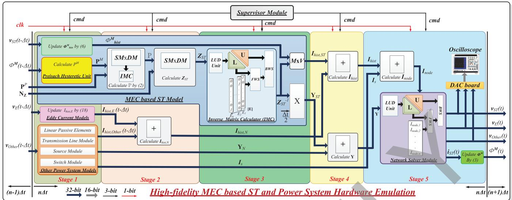  
Fig. 5. Pipelined and paralleled hardware design architecture during one time-step of emulation for the ST and the host power system.

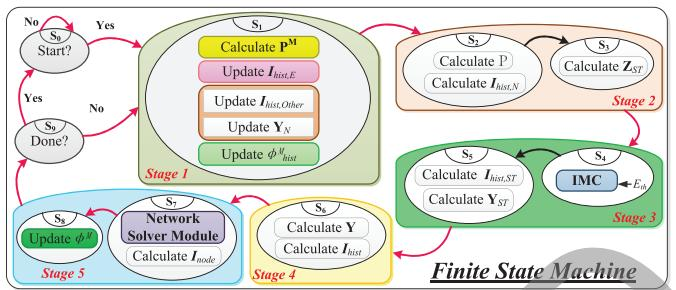  
Fig. 6. Finite state machine of the high-fidelity nonlinear MEC-based ST EMT model and power system.

In order to integrate the cascaded equivalent circuit into the MEC-based ST model, the required parameters of the lumped R-L circuit can be calculated by the following equations:

$$
L _ {0} = \frac {N ^ {2} A \mu}{l} \text {a n d} L _ {k} = \frac {L _ {0}}{(4 k - 3)},
$$

$$
R _ {0} = \frac {4 N ^ {2} A}{l d ^ {2} \gamma} \text {a n d} R _ {k} = R _ {0} (4 k - 1), \tag {25}
$$

where is the magnetic permeability of the steel lamination, is the electric conductivity of the steel lamination, is the total cross-sectional area of all laminations, is the thickness of the lamination, is the length of core limb, and is the number of coil turns.

Finally, the overall detailed frequency dependent nonlinear ST model is as shown in Fig. 4 where the cascade R-L circuit is externally interfaced to the MEC-based ST model.

# III. HARDWARE EMULATION OF HIGH-FIDELITY NONLINEAR MEC-BASED ST MODEL

# A. Network Transient Emulation With Embedded ST

The hardware emulation of the ST and other power system components, such as sources, passive elements, transmission

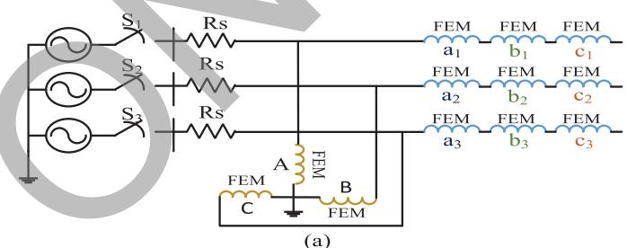

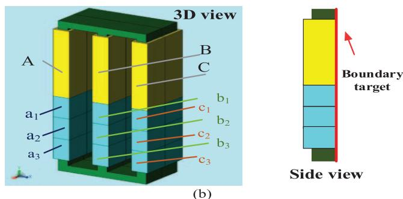

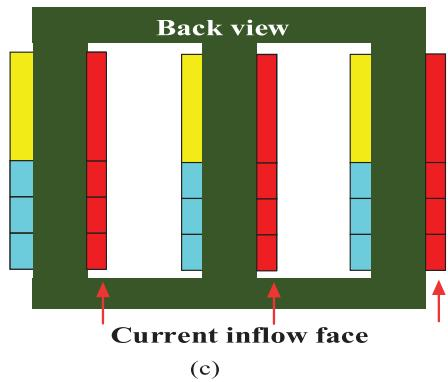  
Fig. 7. FEM simulation: (a) coupled external electrical circuit, (b), (c) 3D FEM model.

lines and switch modules is depicted in Fig. 5, which fully exploits pipelining and parallelism to achieve real-time emulation. Each emulation time-step can be finished in 5 stages, and while the stages are executed sequentially, all the modules or units

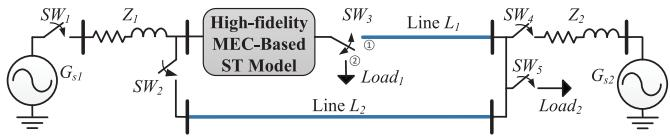  
Fig. 8. Single-line diagram of the power system with the ST model for the real-time HIL case study.

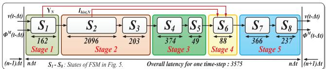  
Fig. 9. Latencies for one emulation time-step for the high-fidelity MEC-based ST model.

within any stage are executed in parallel. All the calculations inside the hardware modules and units are fully pipelined and paralleled to achieve the lowest latency and resource consumption.

In Stage 1, the PHU is designed to evaluate the ST nonlinear iron core permeance matrix $\mathbf { P } ^ { M }$ by reading the ST core fluxes $\phi ^ { M }$ . Combining $\mathbf { P } ^ { M }$ with the linear permeance matrix $\mathbf { P } ^ { P }$ gives the overall permeance matrix , which is then involved in the computation of the matrix using (5). The eddy current module, as well as the transmission line and passive element modules in parallel update their history current terms by reading the node voltage vectors, $v _ { E }$ and $v _ { O }$ , respectively. The source module is designed to output the source voltage by reading a sinusoidal function look up table (LUT) implemented in it. The switch module sends the network admittance matrix ${ \bf Y } _ { N }$ to the network solver module, combined with the ST ad mittance matrix $\mathbf { Y } _ { S T }$ to carry out the finally node voltage calculation. To efficiently perform the sparse and dense matrix-matrix and matrix-vector multiplications, such as in (5) and (15), a sparse-dense matrix multiplication unit and matrix-vector multiplication unit $( \mathbf { M } \mathbf { x } \mathbf { V } )$ were designed respectively, in this work. In order to perform the matrix inversion operation in (5), (15) and (16), an LU-based Matrix Inverter Calculation was implemented in the ST module, as described in Section $\mathrm { I I I } ( \mathrm { B } ) . \mathrm { T h e \ S T }$ admittance matrix $\mathbf { Y } _ { S T }$ is combined with the network admittance matrix ${ \bf { Y } } _ { N }$ to obtain the overall matrix . Similarly, the ST history current vector $I _ { h i s t , S T }$ is combined with the network history current terms $I _ { h i s t , N }$ and the source current injection vector $I _ { s }$ resulting in the $I _ { n o d e }$ vector. Then the overall admittance matrix and the injection current vector $I _ { n o d e }$ are forwarded to the Network Solver Module to finally find the network node voltages, consisting of $v _ { S T } , v _ { E }$ and $v _ { O }$ . The LU-based decomposition , forward substitution unit and backward substitution unit are implemented in the network solver module, and the vector $I _ { n o d e }$ is pushed into the unit input ports for the nodal solution.

Fig. 6 shows the detailed finite state machine (FSM) for the MEC-based ST and host power system hardware design. In the state $S _ { 1 }$ , the calculations in Stage 1 are executed including the transformer nonlinear iron core permeances, the eddy current module, as well as the passive element and transmission line modules update their history terms $I _ { h i s t , E }$ using (23) and $I _ { h i s t , O }$ in parallel. The Stage 2 is split into two states, $S _ { 2 }$ and

$S _ { 3 }$ . The state $S _ { 2 }$ performs two functions in parallel: 1) calculates matrix using (5), and 2) calculates network history terms $I _ { h i s t , N }$ by combining $I _ { h i s t , E }$ and $I _ { h i s t , O }$ . State $S _ { 3 }$ calculates the ST admittance matrix $\mathbf { Z } _ { S T }$ using (13). Stage 3 is also split into two states: $S _ { 4 }$ and $S _ { 5 }$ . In $S _ { 4 }$ the matrix $\mathbf { Z } _ { S T }$ goes through the unit to compute the inverse matrix $\mathbf { Z } _ { S T } ^ { - 1 }$ . In state $S _ { 5 }$ the ST history term vector $I _ { h i s t , S T }$ and admittance matrix $\mathbf { Y } _ { S T }$ are computed in parallel using (15) and (16), respectively. The Stage 4 is fully implemented in $S _ { 6 }$ , to parallel compute the summation of the all the history currents $ { T _ { h i s t } }$ and construct the entire power system network admittance matrix . The stage 5 is divided into two states, $S _ { 7 }$ and $S _ { 8 }$ . In state $S _ { 7 }$ , the current injection vector $I _ { n o d e }$ is calculated and the network solver module is executed to compute the network node voltages . Finally state $S _ { 8 }$ updates the transformer winding and yoke fluxes using (6).

# IV. REAL-TIME EMULATION CASE STUDIES

# A. Finite-Element Validation

To validate hardware emulation of the real-time MEC-based ST model, a 3-D three-phase, three-limb, twelve winding FE transformer model was developed in JMAG®. A half transformer core and coil model was built in JMAG Designer, which was then converted to a full transformer model by setting boundary symmetry. To build the half transformer model, 47730 elements and 8647 nodes were used with the element size of 0.15 m. To run $\textrm { \ i } t = 0 . 5 \ : \mathrm { s }$ FE simulation with the time-step of $\Delta t = 5 0 0 ~ \mu \mathrm { s }$ took more than 5 hours on a PC featured by Intel® i7 and 8 GB memory. The geometric parameters and the rating of the transformer can be found in the Appendix A. The symmetry boundary target is set in the middle of the model and its external coupled electrical circuit is shown in Fig. 7(a). In the coupled electrical circuit, each winding is assigned to a coil in the geometry model, and the current inflow face of each coil is as shown in Fig. 7(c). This 3D-FE ST model was connected with a voltage source on the primary side and an open-circuit on the secondary side.

# B. Case Studies

The following case studies are analysed in this paper to show the accuracy and efficiency of the proposed the real-time hardware high-fidelity nonlinear MEC-based ST model. The power system shown in Fig. 8 consists of one ST model, two voltage sources, $G _ { s 1 }$ and $G _ { s 2 }$ and two transmission lines, $L _ { 1 }$ and $L _ { 2 } .$ , modeled by the distributed parameter line model. In the case studies, the power system network including the ST is emulated on the Xilinx® Virtex-7 VC707 XC7VX485T FPGA, and the detailed latency for each FSM in one emulation time-step is summarised in Fig. 9. The maximum clock frequency of this design can reach to 90 MHz, with 3575 clocks latency for one time-step emulation giving the execution time of 40 s. The hardware resource utilization is summarised in Table I.

1) Energization Transient and Steady-State Emulation: To validate against the FE simulation results, the same power system is configured in Fig. 8 by the switching of $S W _ { 3 }$ to position 2 and leaving other breakers open. The parameters of the power system are given in Appendix C. The ST energization

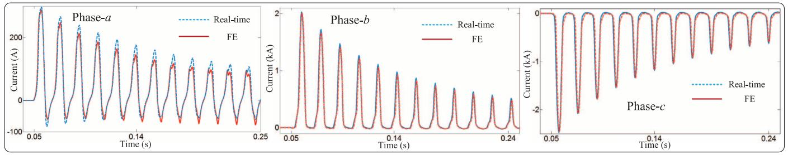  
Fig. 10. Real-time emulation and JMAG® simulation results for the energization transient.

TABLE I FPGA HARDWARE RESOURCE UTILIZATION   

<table><tr><td></td><td>MEC Based ST Model</td><td>Other Modules</td></tr><tr><td>Slice Registers</td><td>77631 (12.7%)</td><td>29267 (4.8%)</td></tr><tr><td>Slice LUTs</td><td>113746 (37.4%)</td><td>50562 (16.7%)</td></tr><tr><td>LUT-RAM</td><td>3180 (24%)</td><td>9636 (7.35%)</td></tr><tr><td>BRAM/FIFO</td><td>90 (2.9%)</td><td>59 (9.6%)</td></tr><tr><td>DSP48E1</td><td>746 (26.6%)</td><td>221 (7.6%)</td></tr><tr><td>BUFG</td><td>11 (34.4%)</td><td>4 (12.4%)</td></tr></table>

transient is initialized by closing the three-phase breaker at $t = 0 . 0 5$ s, and the inrush transient current flows through the breaker. The real-time inrush current emulation results and the corresponding 3D-FE simulation results are plotted in Fig. 10. The magnitude of the inrush current in different phases is determined by the instantaneous magnitude of the applied voltages in different phases when the breaker is closed. As can be seen in Fig. 10, the magnitude of transient current in phase- and phase- whose peak value can reach up to 80% of the ST rated current, is much larger than that in phase- due to the above reason and all the currents in each phase decay to steady-state after $t = 2 \mathrm { ~ s , ~ }$ as shown in Fig. 11. The real-time emulation results show close agreement with the 3D-FE simulation results both in transient and steady state. However discrepancies exist in the magnitudes of the waveforms. The main reason for these differences is that even though the proposed real-time ST model was developed based on high-fidelity MEC approach, the mesh number and node are still much smaller than those in the FEM model. The Trapezoidal discretization can also introduce numerical differences between these two simulation results. Furthermore, in the FEM model, the nonlinear effect is modeled by a piece-wise nonlinear curve; however in the real-time MEC model the nonlinear effect in the ST core is represented by Preisach approach. In addition, even though the transformer core nonlinearity and frequency-dependent phenomena are included in the proposed model, this model cannot predict the high-frequency effects in the windings such as skin effect or proximity effect.

2) Hysteresis Transient Emulation: The hysteresis transient is emulated initializing the transformer core flux on the downward major loop trajectory (point A). Fig. 11 shows the real-time emulation results of the flux and the magnetizing current in the core and the hysteresis characteristic of the transformer. The ST is energized by a voltage source at a value of 0.8p.u. starting form $t = 0 :$ s and the corresponding hysteresis trajectory during the first cycle (A-B) is asymmetric due to the initial

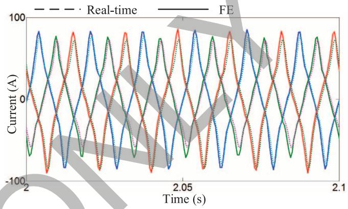  
Fig. 11. Real-time emulation and JMAG® simulation results for the ST steadystate current.

flux. After the first cycle, the flux travels on the set of asymmetric minor loops (C-D) due the asymmetric magnetizing current through the transformer core. From $t \ : = \ : 0 . 0 8 7$ s to s, the breaker $S W _ { 1 }$ is opened and the flux is locked at 0.35 p.u. After $t = 0 . 1 6 8$ s the breaker $S W _ { 1 }$ is closed again and the value of voltage source increases to 1.2 p.u. The corresponding hysteresis trajectory (E-F) travels on the major loop since the voltage source is high enough to drive the transformer into the saturation region when the peak flux value reaches 1.2 p.u.

3) Power-Flow Control Emulation: To investigate of the ST transition response, during the step-by-step regulation active and reactive powers in transmission lines, the circuit shown in Fig. 8 was configured into a two transmission line system by opening breaker $S W _ { 4 }$ and switch $S W _ { 3 }$ to position 1 and leaving other breakers closed. The real-time emulation results of power regulation of the two lines is shown in Fig. 13.

At the beginning of the emulation, as shown in this figures, the ST works in the uncompensated mode; the line $L _ { 1 }$ active power $P _ { r 1 }$ and reactive power $Q _ { r 1 }$ is equal to 80 MW and MVAr, respectively and the line $L _ { 2 }$ active power $P _ { r 2 }$ and reactive power $Q _ { r 2 }$ is equal to 38 MW and 20 MVAr, respectively, and the injected voltage is zero. $\mathrm { A t } t _ { 1 } = 0 . 5 \mathrm { ~ s ~ a ~ }$ compensation voltage of 0.25 p.u. at angle of 0 is requested by the controller which means that the tap-setting on the secondary winding of $G P _ { 1 }$ should start to increase to 0.25 p.u. with step size of 0.05 p.u., which require 0.5 s for each step transition. Thus from $t _ { 1 } ~ = ~ 0 . 5 ~ \mathrm { s }$ to $t _ { 2 } ~ = ~ 3 ~ \mathrm { s }$ the tap-setting increased to 0.25 p.u. with the step size of 0.05 p.u. in 2.5 s. As can be seen in Fig. 13 during this period, the powers $P _ { r 1 }$ and $Q _ { r 1 }$ increase while the powers $P _ { r 2 }$ and $Q _ { r 2 }$ decrease, which proves that the ST has the capability to regulate the power flow in both transmission lines.

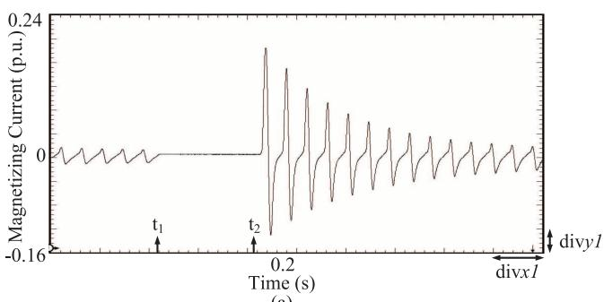

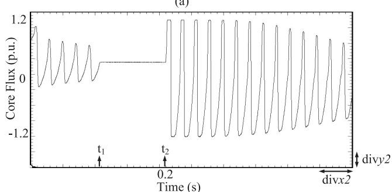

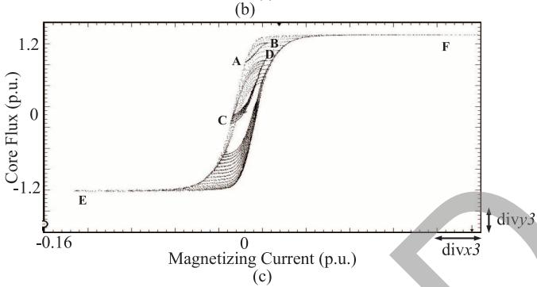  
Fig. 12. Real-time emulation results of (a) the magnetizing current ( s; p.u.); (b) flux in the core ( 0.04 s; p.u.); (c) the hysteresis characteristic of ST ( p.u.; p.u.).

Finally, the $P _ { r 1 }$ and increase to 134 MW and 98 MVAr, and $P _ { r 2 }$ and $Q _ { r 2 }$ decrease to 5 MW and MVAr respectively. At $t _ { 3 } = 3 . 5 ~ \mathrm { s } ,$ the controller sends a request to ST to inject a compensation voltage of 0.4 p.u. at an angle of $2 4 0 ^ { \circ }$ , thus the ST secondary winding tap-setting of $G P _ { 1 }$ needs to decrease to 0 p.u. again and needs to increase to 0.4 p.u. Starting from $t _ { 3 } = 3 . 5 ~ \mathrm { s }$ to $t _ { 5 } = 6 s _ { \mathrm { : } }$ the $G P _ { 1 }$ windings' tap-setting decreases to 0 p.u. position, and $G P _ { 3 }$ increases to 0.25 p.u. position, respectively. From $t _ { 5 } \equiv 6 \ : \mathrm { s } ,$ the $G P _ { 3 }$ winding increases further to 0.4 p.u. As can be seen during this period the reactive power in both $L _ { 1 }$ and $L _ { 2 }$ is kept constant since the angle of the injection voltage is equal to $2 4 0 ^ { \circ }$ . The ST secondary winding current transition behavior during the entire period $( t = 0 \mathrm { ~ s ~ t o ~ } 7 . 5 \mathrm { ~ s ~ } )$ is shown in Fig. 14(a). The current magnitude decreases during the power reversal period, starting from $t _ { 3 } = 3 . 5$ s until $t _ { 4 } = 5 . 5$ s since the absolute value of active power is decreased, however at the time $t _ { 4 } = 5 . 5 ~ \mathrm { s }$ the current magnitude starts to increase due to the fact that the absolute active power value is increased at this time, as shown in Fig. 13. The transition of the corresponding injected compensation voltage is shown in Fig. 14(b); the initial value is zero since the ST works in uncompensated

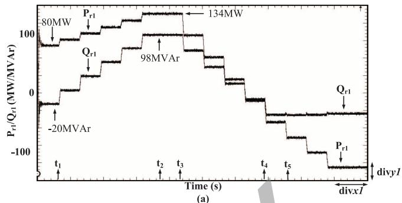

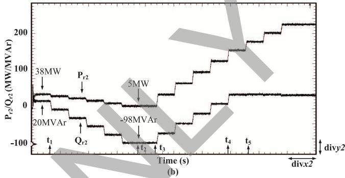  
Fig. 13. Real-time emulation of active power and reactive power regulation on the two transmission lines (a) Line $\bar { L _ { 1 } } \left( 1 \right)$ divx1= 0.8s;1divy1 = 30 MW/MVAr); (b) Line ( s; MW/MVAr).

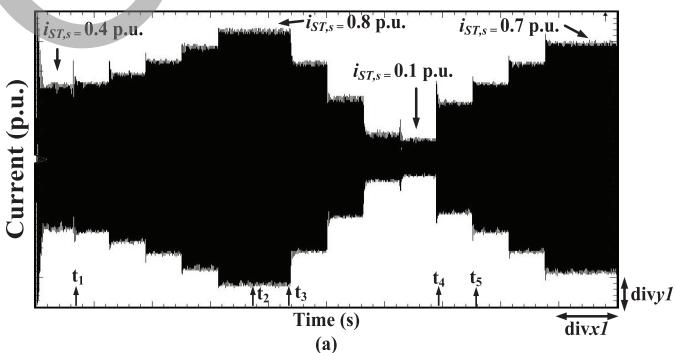

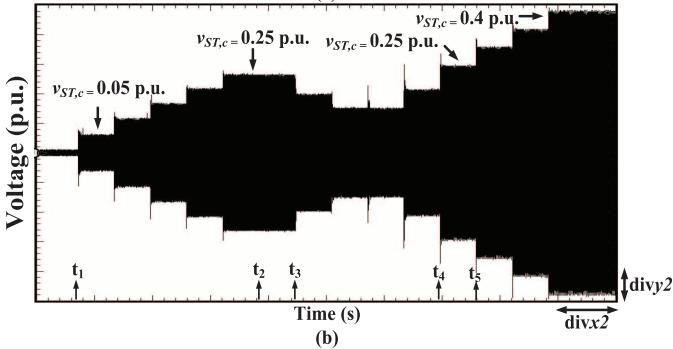  
Fig. 14. Real-time emulation of step-by-step transition response of (a) secondary winding current ( $= \dot { 0 } . 8 \dot { \mathrm { ~ s } } ;$ p.u.); (b) injected compensation voltage of ST ( s; ${ \it \Delta } y 2 = 0 . 0 8 4 { \mathrm { p . u . ) } }$ .

mode, and then the step-by-step changing of the voltage magnitude can be clearly seen at the request of the controller.

4) Fault Transient Emulation: A three-phase to ground fault was created at $t _ { 1 } = 2 . 1$ s at the receiving end of the Line $L _ { 1 }$ and cleared at $t _ { 2 } = 2 . 1 5 :$ s. Fig. 15 shows the real-time emulation results of the ST secondary side voltage and current, as well as the

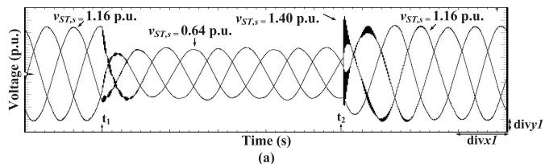

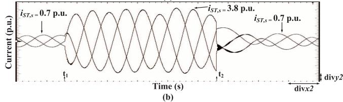

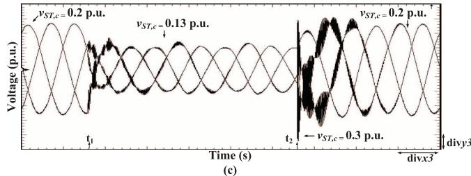  
Fig. 15. Real-time emulation results of ground fault transient (a) secondary side current ( $= \ 0 . 0 1 \ { \mathrm { s } } ; \ 1$ p.u.); (b) secondary side voltage ( $1 { \mathrm { d i v } } x 2 = 0 . 0 1 { \mathrm { s } } ; 1 { \mathrm { d i v } } y 2 = { \mathrm { 0 . 3 2 } } { \mathrm { p . u . } } )$ ; (c) injected compensation voltage ( $\mathbf { \dot { \varepsilon } } \mathrm { d i v } x 3 = 0 . 0 1 \ \mathrm { s } ; 1 \mathrm { d i v } \dot { y 3 } = 0 . 0 6 7 \ \mathrm { \bar { p } } . \mathrm { u } . )$ .

injected compensation voltage. The fault current peak magnitude reached up to 3.8 p.u. compared to the steady-state magnitude of $ { \mathrm { ~ \textrm ~ { ~ ~ } ~ } } _ { 0 . 7  { \mathrm { ~ p . u ~ } } }$ . and decays to steady-state after 2.4 s. The magnitude of ST secondary side fault transient voltage decreased to 0.64 p.u. from 1.16 p.u. in the steady-state, and the recovery voltage reach to 1.40 p.u. then decays to steady-state in two cycles. The recovery injection compensation voltage is up to 0.3 pu compared to 0.2 p.u. under steady-state. At the inception and clearing of the fault the high frequency transient can be observed.

# V. CONCLUSION

A power-flow controller comprised of the Sen transformer has the potential of providing a low-cost alternative for power-flow regulation in stressed transmission networks. This paper presented a real-time electromagnetic transient model of the ST based on a high-fidelity magnetic equivalent circuit accounting for the major linear and nonlinear flux paths in the transformer core. Such a model can be used in a HIL scenarios to not only implement and test newer power-flow control algorithms, but can also be used for the electromagnetic transient analyses, transformer design optimization, energy efficiency analyses and for designing protection schemes, for transformers used in various applications. The exploitation of full parallelism and deep pipelining on the FPGA has resulted in an ST model that is not only highly accurate but also has a low computational latency and resource consumption to be included in HIL emulations. The proposed real-time model is able to accurately capture the nonlinear behavior due to core saturation, hysteresis and eddy currents. Comparison with finite-element simulations prove satisfactory performance of the real-time model. Future work in this area would include

inclusion of an electronic tap changer to increase the speed of operation of ST for power-flow control.

# APPENDIX

A. Geometry parameters of transformer: limb length: 7.18 m, limb cross-section area: 0.454 m , yoke length: 2.66 m, yoke cross-section area: $0 . 4 5 4 ~ \mathrm { m ^ { 2 } }$ .

B. Magnetic equivalent circuit parameters: material resistivity: $5 . 2 ^ { - 7 }$ ohm/m, lamination thickness: 0.0005 m, $X _ { l e a k a g e } .$ primary winding: 0.25 mH; winding numbers: primary side 64, secondary side 26; parameters of hysteresis trajectory: $a _ { 1 } ~ = ~ 0 . 7 9 0 0 , a _ { 2 } ~ = ~ 4 8 6 , a _ { 3 } ~ = ~ 3 1 2 , b _ { 1 } ~ = ~ 0 . 0 0 1 8 6 , b _ { 2 } ~ =$ ,b1 $0 . 0 1 1 2 3 6 , b _ { 3 } ~ = ~ 0 . 0 1 8 9 8 , c _ { 1 } ~ = ~ 0 . 4 2 7 1 , c _ { 2 } ~ = ~ 0 . 3 8 2 4 , c _ { 3 } ~ = ~$ C2 1.0406.

C. Parameters of the case study, for energization transient: $V _ { b a s e } : 2 0 / \sqrt { 3 }$ kV, voltage source 1.0 p.u., $R _ { s } ~ = ~ 0 . 5 0 7 ~ \Omega ;$ for hysteresis transient: voltage source $V _ { b a s e } : 1 6 / \sqrt { 3 } \mathrm { k V } ;$ for power-flow control emulation and fault transient: $G _ { 1 } = 2 8 \mathrm { k V } ,$ $G _ { 2 } = 2 8 \mathrm { k V }$ lagging ; Transformer : 260 MVA; System base values: kV, $S _ { b a s e } ~ = ~ 2 6 0$ MVA; Transmission line inductance: mode 0: $5 . 8 1 9 \times 1 0 ^ { - 7 }$ H/m, mode : $1 . 5 5 6 \times 1 0 ^ { - 7 }$ H/m; Transmission line capacitance: mode 0: $0 . 0 1 2 \times 1 0 ^ { - 8 }$ F/m, mode +: $0 . 0 1 9 4 \times 1 0 ^ { - 8 }$ F/m; Transmission lines $L _ { 1 } , L _ { 2 } \mathrm { . }$ 10 km, 12 km; Loads $L o a d _ { 1 }$ ; Impedance: $Z _ { 1 } : 0 . 5 \ : \Omega$ and $\times 9 . 1 7 \times 1 0 ^ { - 6 } \mathrm { H } ; Z _ { 2 } : 0 . 4 \Omega$ and $1 0 . 1 7 \times 1 0 ^ { - 6 }$ H.

D. Tap changer: 8 tap positions, 0.05 p.u./step, 0.5 s/step.

# REFERENCES

[1] L. Xie, P. Carvalho, L. Ferreira, J. Liu, B. Krogh, N. Popli, and M. Ilic, “Wind integration in power systems: Operational challenges and possible solutions,” Proc. IEEE, vol. 99, no. 1, pp. 214–232, Jan. 2011.   
[2] J. Kabouris and F. D. Kanellos, “Impacts of large-scale wind penetration on designing and operation of electric power systems,” IEEE Trans. Sustain. Energy, vol. 1, no. 2, pp. 107–114, Jul. 2010.   
[3] A. O. Ba, P. Tao, and S. Lefebvre, “Rotary power-flow controller for dynamic performance evaluation—Part II: RPFC application in a transmission corridor,” IEEE Trans. Power Del., vol. 24, no. 3, pp. 1417–1425, Jul. 2009.   
[4] P. Couture, J. Brochu, G. Sybille, P. Giroux, and A. O. Barry, “Power flow and stability control using an integrated HV bundle-controlled line-impedance modulator,” IEEE Trans. Power Del., vol. 25, no. 4, pp. 2940–2949, Oct. 2010.   
[5] L. Wang and Q. Vo, “Power flow control and stability improvement of connecting an offshore wind farm to a one-machine infinite-bus system using a static synchronous series compensator,” IEEE Trans. Sustain. Energy, vol. 4, no. 2, pp. 358–369, Apr. 2013.   
[6] A. Dimitrovski, A. Li, and B. Ozpineci, “Magnetic amplifier-based power flow controller,” IEEE Trans. Power Del., vol. 30, no. 4, pp. 1708–1714, Aug. 2015.   
[7] B. A. Renz, A. Keri, A. S. Mehraban, C. Schauder, E. Stacey, L. Kovalsky, L. Gyugyi, and A. Edris, “AEP unified power flow controller performance,” IEEE Trans. Power Del., vol. 14, no. 4, pp. 1374–1381, Oct. 1999.   
[8] K. K. Sen and E. J. Stacey, “UPFC—Unified power flow controller: Theory, modeling and applications,” IEEE Trans. Power Del., vol. 13, no. 4, pp. 1453–1460, Oct. 1998.   
[9] K. K. Sen and M. L. Sen, “Introducing the familiy of “Sen” transformer: A set of power flow controlling transformers,” IEEE Trans. Power Del., vol. 18, no. 1, pp. 149–157, Jan. 2003.   
[10] K. K. Sen and M. L. Sen, “Comparision of the “Sen” transformer with the unified power flow controller,” IEEE Trans. Power Del., vol. 18, no. 4, pp. 1523–1533, Oct. 2003.   
[11] K. K. Sen and M. L. Sen, “Introducing the SMART power flow controller—An integral part of smart grid,” in Proc. IEEE Elect. Power Energy Conf., Oct. 10–12, 2012, pp. 98–104.   
[12] W. Ren et al., “Interfacing issues in real-time digital simulators,” IEEE Trans. Power Del., vol. 26, no. 2, pp. 1221–1230, Apr. 2011.

[13] B. Asghari, M. O. Faruque, and V. Dinavahi, “Detailed real-time transient model of the “Sen” transformer,” IEEE Trans. Power Del., vol. 23, no. 3, pp. 1513–1521, Jul. 2008.   
[14] M. O. Faruque and V. Dinavahi, “A tap-changing algorithm for the implementation of “Sen” transformer,” IEEE Trans. Power Del., vol. 22, no. 3, pp. 1750–1757, Jul. 2007.   
[15] N. D. Hatziargyriou, J. M. Prousalidis, and B. C. Papadias, “Generalised transformer model based on the analysis of its magnetic core circuit,” IET Gen., Transm. Distrib., vol. 140, no. 4, pp. 269–278, Jul. 1993.   
[16] W. Enright, O. B. Nayak, G. D. Irwin, and J. Arrillaga, “An electromagnetic transients model of multi-limb transformers using normalized core concept,” in Proc. IPST, Seattle, WA, USA, Jun. 1997, pp. 93–98.   
[17] M. A. Coulson, R. D. Slater, and R. R. S. Simpson, “Representation of magnetic characteristic, including hysteresis, using Preisach's theory,” in Proc. Inst. Elect. Eng., Oct. 1977, vol. 124, no. 10, pp. 895–898.   
[18] S. R. Naidu, “Simulation of the hysteresis phenomenon using Preisach's theory,” in Proc. Inst. Elect. Eng. A, Mar. 1990, vol. 137, no. 2, pp. 73–79.   
[19] F. de Leon and A. Semlyen, “Time domain modeling of eddy current effects for transformer transients,” IEEE Trans. Power Del., vol. 8, no. 1, pp. 271–280, Jan. 1993.   
[20] J. Avila-Rosales and A. Semlyen, “Iron core modeling for electrical transients,” IEEE Trans. Power App. Syst., vol. PAS-104, no. 11, pp. 3189–3194, Nov. 1985.   
[21] E. J. Tarasiewicz, A. S. Morched, A. Narang, and E. P. Dick, “Frequency dependent eddy current models for nonlinear iron cores,” IEEE Trans. Power Syst., vol. 8, no. 2, pp. 588–597, May 1993.   
[22] Y. Chen and V. Dinavahi, “FPGA-based real-time EMTP,” IEEE Trans. Power Del., vol. 24, no. 2, pp. 892–902, Apr. 2009.   
[23] Y. Chen and V. Dinavahi, “An iterative real-time nonlinear electromagnetic transient solver on FPGA,” IEEE Trans. Ind. Electron., vol. 58, no. 6, pp. 2547–2555, Jun. 2011.

[24] Y. Chen and V. Dinavahi, “Multi-FPGA digital hardware design for detailed large-scale real-time electromagnetic transient simulation of power systems,” IET Gen., Transm. Distrib., vol. 7, no. 5, pp. 451–463, May 2013.   
[25] Y. Chen and V. Dinavahi, “Hardware emulation building blocks for real-time simulation of large-scale power grids,” IEEE Trans. Ind. Inf., vol. 10, no. 1, pp. 373–381, Feb. 2014.   
[26] W. H. Hayt and J. A. Buck, Engineering Electromagnetics. New York, USA: McGraw-Hill, 2001.

Jiadai Liu (S’11) received the B.Sc. degree in electrical engineering from Harbin Institute of Technology, Harbin, China, in 2008, the M.Eng. degree from the University of Windsor, Windsor, ON, Canada, in 2010, and is currently pursuing the Ph.D. degree in electrical and computer engineering at the University of Alberta, Edmonton, AB, Canada.

His research interests include detailed power system transient modeling and simulation, as well as field-programmable gate arrays.

Venkata Dinavahi (SM’08) is a Professor in the Department of Electrical and Computer Engineering at the University of Alberta, Edmonton, AB, Canada. His research interests include real-time simulation of power systems and power-electronic systems, largescale system simulation, as well as parallel and distributed computing.