# Improving EMT simulations using frequency-shifted rational approximations ⋆

A. A. Kida a,∗, A. C. S. Lima b, F. A. Moreira c, F. M. Vasconcellos c

a Federal Institute of Bahia, Salvador, BA, Brazil   
b Department of Electrical Engineering, COPPE/UFRJ, Federal University of Rio de Janeiro, Rio de Janeiro, Brazil   
c Department of Electrical and Computer Engineering, Federal University of Bahia, Salvador, BA, Brazil

# a r t i c l e i n f o

# Keywords:

Rational modeling

vector fitting

complex vector fitting

power system transients

frequency-shifted simulations

# a b s t r a c t

Accurate electromagnetic transient (EMT) simulations require accounting for the frequency-dependent behavior of system components and equivalents. Rational approximations derived from curve-fitting techniques such as Vector Fitting (VF) are commonly employed to represent these equivalents. Complex Vector Fitting (CVF), a variant developed for modeling baseband communication systems, eliminates the complex conjugacy symmetry constraint found in VF. This work introduces a CVF-based framework incorporating analytic signals and frequency shifts to enhance EMT simulations of power systems. Validation with a transmission line and a distribution network demonstrates that CVF reduces errors by up to eight orders of magnitude compared to VF, along with notable passivity differences. Frequency shifts further enhanced the accuracy of the CVF-based framework by up to two additional orders of magnitude. Additionally, these frequency shifts enabled a time-step size increase by a factor of 2.33 to 5.5 for the same target accuracy, thereby reducing computational effort. These findings establish the proposed framework as an effective tool for power system analysis.

# 1. Introduction

High-accuracy modeling of power system components (lines, cables, transformers, switchgear, generators and loads) must represent their dynamic behavior across a wide frequency range. However, detailed modeling of every component in a large and complex power system is computationally prohibitive for electromagnetic transient (EMT) studies.

A conventional approach that balances accuracy and efficiency divides the system into a study area and an external area [1]. The latter can be represented by a frequency-dependent equivalents (FDE), preserving its frequency response beyond the grid frequency. Rational approximations are widely used for representing such equivalents [2].

The pole-relocation algorithm known as Vector Fitting (VF) [3–5] is a reliable tool for fitting a rational approximation to a tabulated frequency response data set. VF is also integrated into major EMT simulation software, such as ATP [6], PSCAD [7] and EMTP [8].

The model built with VF inherently produces real-valued impulse response, ??(??), whose spectra, ??(??), exhibit Hermitian symmetry, satisfying ??(−??) = ??∗(??) [9]. However, this constraint limits its applicability to physical systems only, hindering VF from leveraging computationally efficient baseband (frequency-shifted) simulations.

To address this limitation, Ye et al. [10] proposed Complex Vector Fitting (CVF) for baseband modeling of photonic systems described by scattering parameters. In [11], the scope of CVF was extended to the modeling of electric power system components represented by admittance parameters along with strategies aimed at enhancing its computational efficiency. However, that study focused solely on a single test system, neglected time-domain simulations, and did not explore the frequency-shifting capabilities of CVF for EMT applications. This paper addresses these limitations.

This work advances the findings of [11] through several contributions. First, it provides further evidence that the enhanced flexibility of CVF improves fitting accuracy, even without frequency shifts. Additionally, it reveals significant differences in passivity characteristics between the model set up with VF and CVF, which were previously unidentified. Lastly, it proposes a novel framework that utilizes frequency shifting and analytic signals to enhance the efficiency of EMT simulations.

This paper is structured as follows. Section II introduces admittance matrix synthesis and passivity conditions. Section III addresses the analytic signals. Section IV introduces the proposed framework for efficient EMT simulations. Results followed by discussions are presented in Section V. Finally, Section VI presents the main conclusions of this work.

# 2. Frequency-domain realization

Frequency response samples of an unknown ??-port admittance matrix $\mathbf { Y } ( s ) \in \mathbb { C } ^ { N \times N }$ can be obtained through measurements or simulations. The behavior of ??(??) can be modeled by a rational approximation $\mathbf { \overline { { Y } } } ( s ) \in \mathbb { C } ^ { N \times N }$ using a suitable curve-fitting algorithm. For pole-residue formulation,

$$
\mathbf {Y} (s) \approx \overline {{\mathbf {Y}}} (s) = \sum_ {i = 1} ^ {N _ {p}} \frac {\mathbf {R} _ {i}}{s - p _ {i}} + \mathbf {D}, \tag {1}
$$

where $s = j w \colon$ the complex frequency, ?? is the angular frequency in rad∕s, ????: the model order, $ { \mathbf { D } } \in \mathbb { R } ^ {  { N } \times  { N } }$ : the constant term matrix, $p _ { i } \dot { \cdot }$ the ??th pole, $\mathbf { R } _ { i } \in \mathbb { C } ^ { N \times N }$ : the residue matrix associated with $p _ { i } .$ .

The pole-residue realization of $\overline { { \mathbf { Y } } } ( s )$ in (1) can be expressed in a statespace form [12] as

$$
\overline {{\mathbf {Y}}} (s) = \mathbf {C} (s \mathbf {I} - \mathbf {A}) ^ {- 1} \mathbf {B} + \mathbf {D}, \tag {2}
$$

where $\mathbf { C } \in \mathbb { R } ^ { N \cdot N _ { p } \times N } \colon$ a matrix containing all residues, $\mathbf { I } \in \mathbb { N } ^ { N \cdot N _ { p } \times N \cdot N _ { p } } ;$ : the identity matrix, $\mathbf { A } \in \mathbb { C } ^ { N \cdot N _ { p } \times N \cdot N _ { p } } ;$ : a diagonal matrix containing all poles, $\mathbf { B } \in \mathbb { C } ^ { N \cdot N _ { p } \times N } \colon$ a selection matrix with ones and zeros.

# 2.1. Constraint relaxation

??(??) is typically employed to calculate the current (output) corresponding to a given excitation voltage (input). VF imposes the realness constraint to ensure that the output remains real-valued. Consequently, the complex poles and residues of the VF-derived model are constrained to appear as complex conjugate pairs, such that

$$
p _ {i} = \mathbb {R} \left(p _ {i}\right) + j \mathbb {I} \left(p _ {i}\right), \quad p _ {i + 1} = \mathbb {R} \left(p _ {i}\right) - j \mathbb {I} \left(p _ {i}\right) \quad \forall i, \tag {3}
$$

$$
\mathbf {R} _ {\mathrm {i}} = \mathbb {R} (\mathbf {R} _ {\mathrm {i}}) + j \mathbb {I} (\mathbf {R} _ {\mathrm {i}}), \quad \mathbf {R} _ {\mathrm {i} + 1} = \mathbb {R} (\mathbf {R} _ {\mathrm {i}}) - j \mathbb {I} (\mathbf {R} _ {\mathrm {i}}) \quad \forall i, \tag {4}
$$

where ???? and $p _ { i + 1 } \colon$ represent a pair of complex conjugate poles, $\mathbf { R _ { i } } \in$ $\mathbb { R } ^ { N \cdot N _ { p } \times N }$ and $\mathbf { R } _ { \mathrm { i + 1 } } \in \dot { \mathbb { R } } ^ { N \cdot N _ { p } \times N }$ : represent a pair of complex conjugate residues matrix, ℝ(⋅) and ??(⋅): denote the real and imaginary parts, respectively.

CVF shares several similarities with the VF approach, such as the relaxation of the non-triviality constraint to improve convergence [13] and the use of QR decomposition to enhance numerical performance [5]. The key distinction of CVF lies in the relaxation of the realness constraint $( 3 ) - ( 4 )$ . This relaxation enables more flexible modeling by accommodating frequency-shifted models that lack Hermitian symmetry.

# 2.2. Passivity assessment

Stable time-domain simulations require a rational approximation with stable poles $\left( \mathbb { R } ( p _ { i } ) \leq 0 \forall i \right)$ and passive characteristics [2]. The latter ensures that the system does not generate energy. A system is considered passive i $\mathbf { \bar { G } } ( s ) = \mathbb { R } ( \mathbf { \overline { { Y } } } ( s ) ) \in \mathbb { R } ^ { N \times N }$ is a positive-definite matrix [14]. This condition implies that ??(??) is symmetric and its eigenvalues ??(??) are positive.

Passivity violations occur in frequency regions where $\lambda ( s ) < 0 .$ . Such violations can lead to instability in time-domain simulations, even if the rational approximation consists only of stable poles [14]. It is also worth noting that passivity violations may occur outside the frequency range of interest, regardless of the accuracy of the model. The model can still be considered passive for band-limited signals in such cases.

Passivity can be assessed both analytically and via brute-force methods e.g., frequency sweeping ??(??) . Analytically, passivity violation regions can be identified by the cross-over frequencies, computed from the singular values (purely imaginary eigenvalues) of the Hamiltonian matrix $\mathbf { H } \in \mathbb { C } ^ { 2 N \cdot N _ { p } \times \bar { 2 } N \cdot N _ { p } }$ [15]. The computation of ?? depends on whether the rational approximation exhibits Hermitian symmetry, influencing its formulation as follows:

$$
\mathbf {H} = \left[ \begin{array}{c c} \mathbf {A} - \mathbf {B} (\mathbf {D} + \mathbf {D} ^ {\prime}) ^ {- 1} \mathbf {C} & \mathbf {B} (\mathbf {D} + \mathbf {D} ^ {\prime}) ^ {- 1} \mathbf {B} ^ {\prime} \\ - \mathbf {C} ^ {\prime} (\mathbf {D} + \mathbf {D} ^ {\prime}) ^ {- 1} \mathbf {C} & - \mathbf {A} ^ {\prime} + \mathbf {C} ^ {\prime} (\mathbf {D} + \mathbf {D} ^ {\prime}) ^ {- 1} \mathbf {B} ^ {\prime} \end{array} \right], \tag {5}
$$

where ′ denotes the transpose operator for systems exhibiting Hermitian symmetry [15] and the complex conjugate transpose operator for systems lacking it [16]. Consequently, CVF cannot leverage the efficient half-size singularity test used for passivity assessment in VF [15], as this test is designed for real-valued systems [10].

# 3. Analytic signal

The synthesized FDE using the CVF framework exhibits a complex impulse response, even for real-valued inputs [17]. While such responses do not occur in the physical systems [2], they offer the potential for enhancing simulation efficiency [18].

Simulations utilizing the CVF framework employ analytic signals [10], which are a class of complex-valued functions that satisfy the Cauchy-Riemann conditions for differentiability [19].

An analytic signal $u _ { A } ( t )$ provides a complex-valued representation of a real-valued signal ??(??) and is defined as [20]:

$$
u _ {A} (t) = u (t) + j \mathcal {H} \{u (t) \}, \tag {6}
$$

where $\begin{array} { r } { \mathcal { H } \{ u ( t ) \} = \frac { 1 } { \pi } \int _ { - \infty } ^ { \infty } \frac { u ( \tau ) } { t - \tau } d \tau : } \end{array}$ the Hilbert transform of $u ( t ) .$ .

The Hilbert transform is a linear operator that shifts the phase of each frequency component of ??(??) by $- 9 0 ^ { o }$ for positive frequencies and 90?? for negative frequencies. This transformation ensures that $u _ { A } ( t )$ retains only the non-negative frequency components $u ( t ) _ { : }$ , scaled by a factor of two.

The spectrum of $u _ { A } ( t )$ can be shifted toward 0 Hz by an arbitrary frequency offset $\Delta f ,$ resulting in the frequency-shifted analytic signal:

$$
u _ {A, s h} (t) = \exp (- j 2 \pi \Delta f t) u _ {A} (t). \tag {7}
$$

For example, consider the cosine signal defined as

$$
x (t) = \cos (2 \pi f _ {e} t) = \frac {\exp (j 2 \pi f _ {e} t) + \exp (- j 2 \pi f _ {e} t)}{2}, \tag {8}
$$

where $f _ { e }$ is the excitation frequency in Hz.

Eliminating the negative frequency component of (8) and multiplying by two yields its analytic representation:

$$
x _ {A} (t) = 2 \frac {\exp (j 2 \pi f _ {e} t)}{2} = \exp (j 2 \pi f _ {e} t). \tag {9}
$$

Applying a frequency shift of $\Delta f$ in (9) yields:

$$
x _ {A, s h} (t) = \exp (- j 2 \pi \Delta f t) \exp (j 2 \pi f _ {e} t). \tag {10}
$$

In the case where $\Delta f = f _ { e } , ( 1 0 )$ becomes a dc signal.

# 4. Proposed framework

The proposed framework integrates the CVF with baseband modeling techniques, commonly used in communication systems, to enhance the efficiency of EMT simulations within the context of electric power systems. Its core principle is constructing rational approximations with frequency shifts $\Delta f$ tailored to the phenomenon under study.

Fig. 1 illustrates the workflow of the proposed framework, where the voltage ??(??) and current ??(??) serve as the input and output real-valued signals, respectively. Their corresponding analytic representations, $e _ { A } ( t )$ and $i _ { A } ( t ) ,$ , are defined as (6). Subsequently, the frequency-shifted analytic signals, $e _ { A , s h } ( t )$ and $i _ { A , s h } ( t )$ , are obtained using (7).

# 5. Results and discussion

Two numerical examples, Case A and Case B, are applied to validate the proposed framework. Case A focuses on transmission line modeling, whereas Case B evaluates a distribution network. These cases were selected to facilitate result reproducibility, as all frequency response data are available at the official repository of VF [21].

The same conditions of model order, number of iterations, weighting function and pole initialization strategy were applied for both VF and CVF for a fair comparison. Numerical simulations were executed on an Intel i5-1240P processor with 16 GB of RAM, using MATLAB 2018a.

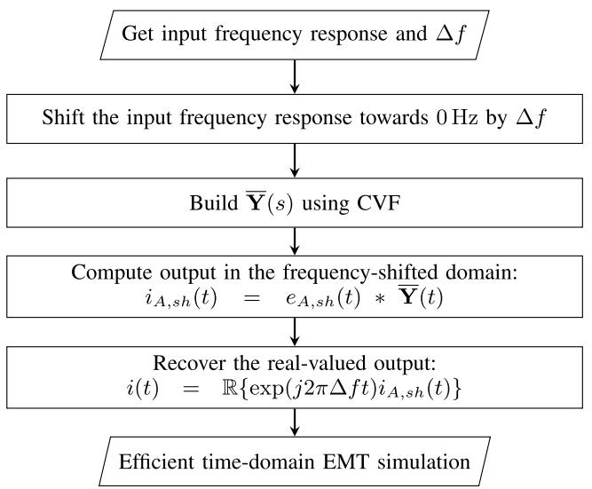  
Fig. 1. Proposed framework.

Fig. 2 depicts the circuit-test configuration used to obtain timedomain responses, adhering to the terminology from the original data in [21]. Only port 1 is active (ungrounded) in this setup, while all other ports remain grounded. The excitation consists of a single real-valued voltage source $e ( t ) = \cos ( 2 \pi f _ { e } t )$ pu, applied at port 1 for both cases, starting at $t = 0 \mathrm { s }$ . For the proposed methodology, EMT simulations utilize analytic signals and frequency shifts. Consequently, ??(??) is replaced by $e _ { A , s h } ( t ) ,$ as in (10), during simulations. High-frequency transients are examined by setting the excitation frequency $f _ { e }$ to either 50 kHz or 90 kHz. Three CVF-based rational models are constructed for each case, considering frequency shifts of $\Delta f \in \{ 0 \mathrm { H z } , 5 0 \mathrm { k H z } .$ , 90 kHz}. The resulting currents $i _ { j } ( t ) , \mathrm { f o r } j = 1 , \ldots , N .$ , illustrated in Fig. 2 correspond to the outputs and are computed using the framework described in Fig. 1, employing the trapezoidal rule for discretization.

Accuracy is evaluated using the relative root mean square error (RRMSE), a normalized and dimensionless metric. In the frequency domain, the RRMSE of $\overline { { \mathbf { Y } } } ( s )$ is defined as:

$$
\bar {Y} _ {E} = \sqrt {\frac {\sum_ {m = 1} ^ {N} \sum_ {q = 1} ^ {N} \sum_ {k = 1} ^ {N _ {S}} \left| \bar {Y} _ {m q} \left(s _ {k}\right) - Y _ {m q} \left(s _ {k}\right) \right| ^ {2}}{N _ {s} \sum_ {m = 1} ^ {N} \sum_ {q = 1} ^ {N} \sum_ {k = 1} ^ {N _ {S}} \left| \bar {Y} _ {m q} \left(s _ {k}\right) \right| ^ {2}}}, \tag {11}
$$

where $s _ { k } \colon$ the ??th complex frequency sample, $N _ { s } \colon$ : the number of frequency response data samples, $Y _ { m q } ( s _ { k } )$ and $\overline { { Y } } _ { m q } ( s _ { k } )$ ): are the entry ??, ?? of $\mathbf { Y } ( s _ { k } )$ and $\overline { { \mathbf { Y } } } ( s _ { k } )$ , respectively.

For discrete time-domain analysis, the RRMSE of ??(??) is given by:

$$
i _ {E} = \sqrt {\frac {\sum_ {n = 1} ^ {N _ {T}} | i (n h) - i _ {r e f} (n h) | ^ {2}}{N _ {T} \sum_ {n = 1} ^ {N _ {T}} | i _ {r e f} (n h) | ^ {2}}}, \tag {12}
$$

where $t = n h , N _ { T }$ : the total number of simulation steps, ℎ is the time-step size, $i _ { r e f }$ is the reference current waveform.

In the absence of an analytic solution, $i _ { r e f } ( t )$ is generated by simulating the system with a very small ℎ of 100 ps.

# 5.1. Case A – transmission line

The first case refers to modeling a 132 kV overhead three-phase transmission line depicted in Fig. 3. The measurements were taken at the line input, with the output left open-circuited, considering ?? = 3. The fitting was performed using 50 poles.

The performance results regarding the accuracy of the fitting, without frequency shift, are summarized in Table 1. A significant error reduction was achieved with CVF, as its RRMSE corresponds to approximately

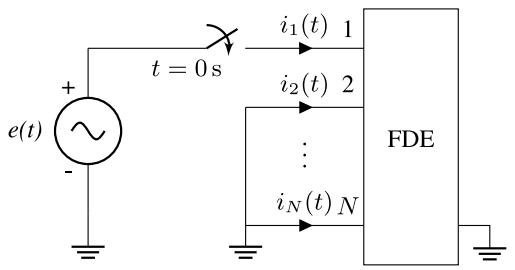  
Fig. 2. Test circuit configuration for Case A and Case B.

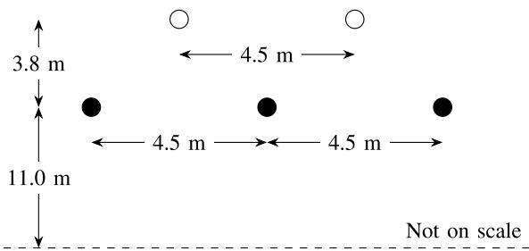  
Fig. 3. Configuration of a 132 kV three-phase transmission line for Case A. Black and white circles represent the phase and ground conductors, respectively. The dc resistance per kilometer is 0.121 Ω km−1 for the phase conductor and 0.359 Ω km−1 for the ground conductor. The total line length is 12 km, with diameters of 21.66 mm for the phase conductors and 12.33 mm for the ground conductors. Adapted from [15].

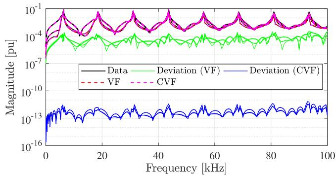  
Fig. 4. Magnitude of the frequency response, Case A.

# Table 1

Fitting accuracy comparison between VF and CVF-derived rational model, Case A.

<table><tr><td>Method</td><td>RRMSE (%)</td><td>Ratioa</td></tr><tr><td>VF</td><td>1.95 × 10-2</td><td>-</td></tr><tr><td>CVF</td><td>2.70 × 10-10</td><td>1.39 × 10-8</td></tr></table>

a CVF RRMSE over VF RRMSE.

eight orders of magnitude less than the one obtained with VF. The frequency responses shown in Fig. 4 demonstrate that the eight orders of magnitude error reduction achieved by CVF are consistent across the entire frequency range of interest.

All 50 poles of both VF and CVF are located on the left-hand side of the s-plane, complying with the stability criterion, as illustrated in Fig. 5. As expected, the symmetry concerning the abscissa axis is verified only for the VF.

Both rational approximations built with VF and CVF violate the passivity criterion. The non-passive regions are detailed in Table 2. Notably for the CVF, the passivity violation in Region 1 occurs outside the frequency fitting range [10 Hz; 100 kHz]. Thus, the rational approximation

Table 2 Passivity violations regions, Case A.   

<table><tr><td>Method</td><td>Region</td><td>Frequency range</td></tr><tr><td rowspan="3">VF</td><td>1</td><td>[0, 395.25] Hz</td></tr><tr><td>2</td><td>[6.19, 6.23] kHz</td></tr><tr><td>3</td><td>[258.56,∞] kHz</td></tr><tr><td>CVF</td><td>1</td><td>[0, 2.31] Hz</td></tr></table>

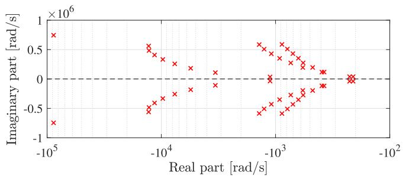

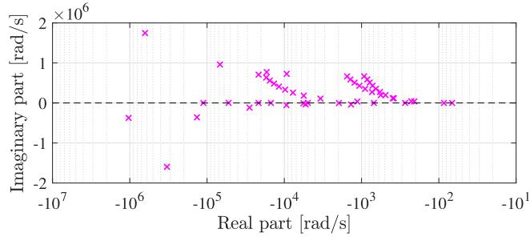  
Fig. 5. Poles of VF (top) and CVF (bottom) RMs, Case A.

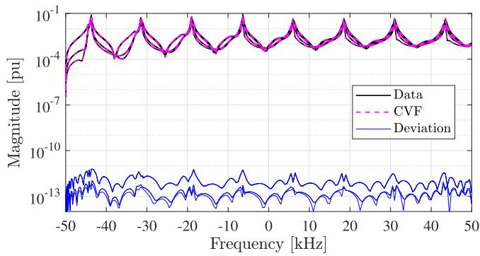  
Fig. 6. Magnitude of the frequency response using CVF and $\Delta f = 5 0 \mathrm { k H z } ,$ , Case A.

of the CVF model is considered passive for band-limited signals. For the VF, only Region 3 lies exclusively outside the fitting range.

Time-domain simulations were performed using three CVF-derived rational models, considering $\Delta f$ as 0 Hz, 50 kHz and 90 kHz. The output is evaluated as the current at port $1 \ i _ { 1 } ( t )$ following the configuration illustrated in Fig. 2. Fig. 6 shows that CVF can model frequency responses without Hermitian symmetry.

Table 3 compares scenarios with and without frequency shifts for $f _ { e } = 5 0 \mathrm { k H z }$ across five different values of ℎ. Results demonstrate a consistent RRMSE improvement of approximately one order of magnitude due to the frequency shift, regardless of ℎ. Table 4 extends the analysis to higher-frequency transients by increasing $f _ { e }$ from 50 kHz to 90 kHz. Across all considered ℎ values, the frequency shift provided an RRMSE improvement of one to two orders of magnitude.

The complex-valued output of the CVF-derived model is illustrated in Fig. 7, where the imaginary component o ${ \dot { \boldsymbol { i } } } _ { 1 } ( t )$ exhibits a 90?? phase lag relative to the real component. The real part corresponds to the output in the regular time-domain, as depicted in Fig. 1.

Table 3 RRMSE values of time-domain simulations considering different ℎ and $\Delta f$ with $f _ { e } = 5 0 \mathrm { k H z } ,$ Case A.   

<table><tr><td>h</td><td colspan="2">Δf (kHz)</td><td rowspan="2">Ratioa</td></tr><tr><td>(ns)</td><td>0</td><td>50</td></tr><tr><td>300</td><td>3.32 × 10-3</td><td>6.10 × 10-4</td><td>1.84 × 10-1</td></tr><tr><td>400</td><td>5.87 × 10-3</td><td>1.08 × 10-3</td><td>1.85 × 10-1</td></tr><tr><td>500</td><td>8.98 × 10-3</td><td>1.67 × 10-3</td><td>1.87 × 10-1</td></tr><tr><td>600</td><td>1.25 × 10-2</td><td>2.38 × 10-3</td><td>1.90 × 10-1</td></tr><tr><td>700</td><td>1.63 × 10-2</td><td>3.16 × 10-3</td><td>1.95 × 10-1</td></tr></table>

a Simulation RRMSE with $\Delta f = 5 0 \mathrm { k H z }$ relative to the RRMSE with $\Delta f = 0 \mathrm { H z }$ .

Table 4 RRMSE values of time-domain simulations considering different ℎ and $\Delta f$ with $f _ { e } = 9 0 \mathrm { k H z } ,$ Case A.   

<table><tr><td rowspan="2">h
(ns)</td><td colspan="2">Δf (kHz)</td><td rowspan="2">Ratioa</td></tr><tr><td>0</td><td>90</td></tr><tr><td>140</td><td>2.26 × 10-3</td><td>2.70 × 10-4</td><td>1.20 × 10-1</td></tr><tr><td>230</td><td>6.12 × 10-3</td><td>7.15 × 10-4</td><td>1.17 × 10-1</td></tr><tr><td>320</td><td>1.19 × 10-2</td><td>1.32 × 10-3</td><td>1.11 × 10-1</td></tr><tr><td>410</td><td>1.94 × 10-2</td><td>1.96 × 10-3</td><td>1.01 × 10-1</td></tr><tr><td>500</td><td>2.78 × 10-2</td><td>2.44 × 10-3</td><td>8.78 × 10-2</td></tr></table>

a Simulation RRMSE with $\Delta f = 9 0 \mathrm { k H z }$ relative to the RRMSE with $\Delta f = 0 \mathrm { H z }$ .

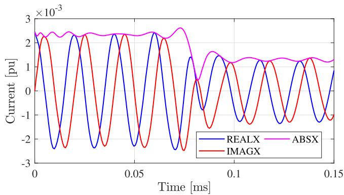  
Fig. 7. Real component, imaginary component, and the magnitude of the output at port 1, considering $i ( t ) = i _ { 1 } ( t ) , h = 7 0 0$ ns and $\Delta f = 5 0 \mathrm { k H z } ,$ until $t = 0 . 1 5$ ms, Case A..

Frequency shift allows for a reduction in ℎ while maintaining the target RRMSE. For $f _ { e } = 5 0 \mathrm { k H z , F i g . }$ 8 illustrates that similar results are obtained with $\Delta f = 5 0 \mathrm { k H z } ,$ , using an ℎ that is 2.33 times larger than that used without frequency shift. For $f _ { e } = 9 0 \mathrm { k H z } ,$ , Fig. 9 shows that comparable results are achieved with $\Delta f = 9 0 \mathrm { k H z } ,$ using an ℎ that is 3.57 times the size of the one used without frequency shift.

# 5.2. Case B – distribution network

The last case pertains to an FDE of the two-port $\left( N = 6 \right)$ , three-phase distribution system illustrated in Fig. 10. The fitting process employed 50 poles.

Table 5 presents the quantitative results for the fitting performance metrics in Case B. The RRMSE achieved with CVF was eight orders of magnitude smaller than that obtained with VF. Fig. 11 demonstrates that the error reduction with CVF consistently remains eight orders of magnitude lower than that with VF throughout the entire frequency range.

Fig. 12 shows that all 50 poles satisfy the stability criterion and only the complex poles obtained with CVF are not necessarily represented by complex conjugate pairs.

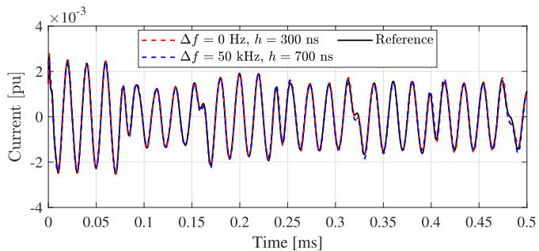

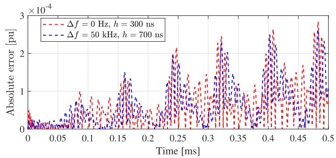  
Fig. 8. Time-domain responses (top) and its absolute error (bottom) using $f _ { e } =$ 50 kHz, until ?? = 0.5 ms, Case A.

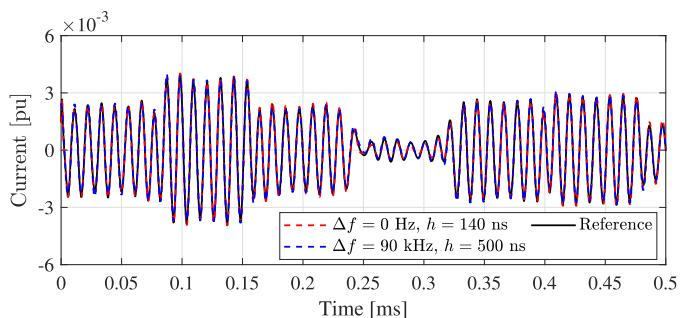

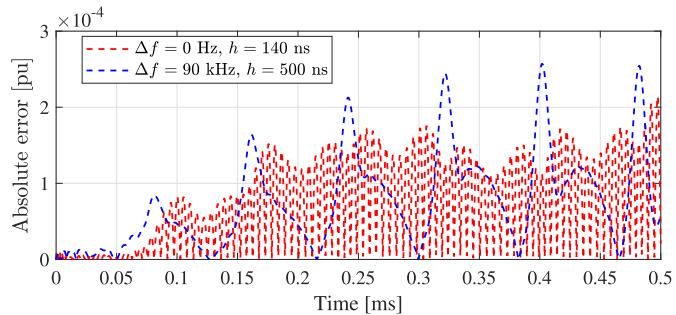  
Fig. 9. Time-domain responses (top) and its absolute error (bottom) using $f _ { e } =$ 90 kHz, until ?? = 0.5 ms, Case A.

The rational approximations obtained using VF and CVF are nonpassive within the fitting range. The passivity violations occur across nearly the entire frequency range, as shown in Table 6.

Time-domain simulations were conducted using CVF-derived ${ \overline { { Y } } } ( s ) ,$ , with the current at port 2 ?? (??) as the output, following the configuration depicted in Fig. 2. Table 7 shows a consistent two-order magnitude improvement in RRMSE for the frequency-shifted scenario with $f _ { e } = 5 0 \mathrm { k H z } \mathrm { ~ A ~ }$ similar trend is observed for $f _ { e } = 9 0 \mathrm { k H z }$ scenario, as shown in Table 8.

Fig. 13 shows the CVF-derived complex output at port 2, where its imaginary part lags the real part by 90??. The focus is on the real component, as it represents the regular time-domain signal.

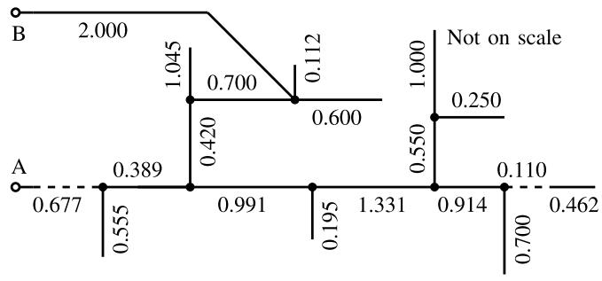  
Fig. 10. One-line diagram of the three-phase distribution system of Case B, with line lengths indicated in kilometers. Solid lines represent overhead conductors, while dashed lines denote underground cables. Adapted from [22].

# Table 5

Fitting accuracy comparison between

VF and CVF-derived rational model,

Case B.   

<table><tr><td>Method</td><td>RRMSE (%)</td><td>Ratio</td></tr><tr><td>VF</td><td>4.86 × 10-3</td><td>-</td></tr><tr><td>CVF</td><td>1.88 × 10-10</td><td>3.87 × 10-8</td></tr></table>

1CVF RRMSE over VF RRMSE.

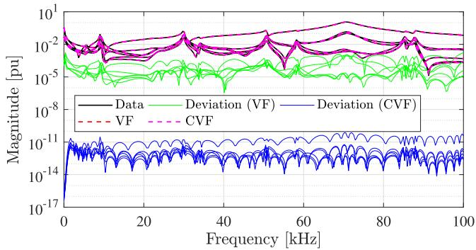  
Fig. 11. Magnitude of the frequency response, Case B.

Table 6 Passivity violations regions, Case B.   

<table><tr><td>Method</td><td>Region</td><td>Frequency range</td></tr><tr><td rowspan="3">VF</td><td>1</td><td>[0, 25.50] kHz</td></tr><tr><td>2</td><td>[28.13,∞] kHz</td></tr><tr><td>1</td><td>[0, 25.62] kHz</td></tr><tr><td rowspan="2">CVF</td><td>2</td><td>[28.12, 30.46] MHz</td></tr><tr><td>3</td><td>[34.71,∞] MHz</td></tr></table>

Time-domain simulations with frequency shift shown in Fig. 14, for $f _ { e } = 5 0 \mathrm { k H z } ,$ , exhibited similar accuracy to the scenario without it, with ℎ increased by a factor of 5. For $f _ { e } = 9 0 \mathrm { k H z } ,$ Fig. 15 demonstrates that ℎ in the frequency-shifted domain can be increased to 5.5 times the value used in the scenario without frequency shift.

# 5.3. Discussion

The output waveforms in Figs. 7 and 13 highlight three key attributes of the CVF-derived model. First, the model generates complexvalued outputs even for real-valued excitations due to the absence of Hermitian symmetry. Second, the −90?? phase shift between the real and imaginary components arises directly from the Hilbert transform shown in (6). Third, the magnitude of the signal |??(??)| can be interpreted as the amplitude of the time-varying phasor ??(??). Remarkably, the frequency shift preserve the magnitude of the time-varying phasor, as

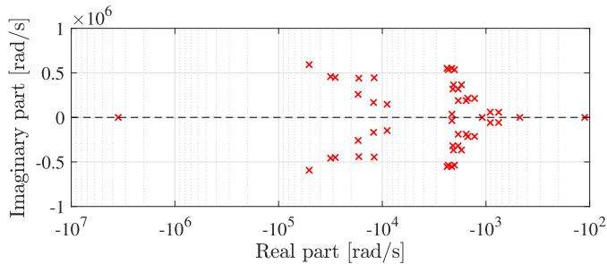

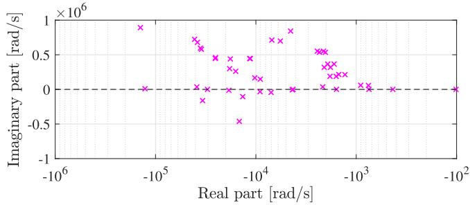  
Fig. 12. Poles of VF (top) and CVF (bottom) rational models, Case B.

Table 7 RRMSE values of time-domain simulations considering different ℎ and $\Delta f$ with $f _ { e } = 5 0 \mathrm { k H z } ,$ , Case B.   

<table><tr><td rowspan="2">h
(ns)</td><td colspan="2">Δf (kHz)</td><td rowspan="2">Ratioa</td></tr><tr><td>0</td><td>50</td></tr><tr><td>100</td><td>2.22 × 10-4</td><td>9.98 × 10-6</td><td>4.48 × 10-2</td></tr><tr><td>200</td><td>8.89 × 10-4</td><td>4.00 × 10-5</td><td>4.47 × 10-2</td></tr><tr><td>300</td><td>2.00 × 10-3</td><td>8.95 × 10-5</td><td>4.47 × 10-2</td></tr><tr><td>400</td><td>3.68 × 10-3</td><td>1.58 × 10-4</td><td>4.31 × 10-2</td></tr><tr><td>500</td><td>5.51 × 10-3</td><td>2.44 × 10-4</td><td>4.43 × 10-2</td></tr></table>

a Simulation RRMSE with $\Delta f = 5 0 \mathrm { k H z }$ relative to the RRMSE with $\Delta f = 0 \mathrm { H z }$ .

Table 8 RRMSE values of time-domain simulations considering different ℎ and $\Delta f$ with $f _ { e } = 9 0 \mathrm { k H z } ,$ , Case B.   

<table><tr><td>h</td><td colspan="2">Δf (kHz)</td><td rowspan="2">Ratioa</td></tr><tr><td>(ns)</td><td>0</td><td>90</td></tr><tr><td>80</td><td>9.66 × 10-3</td><td>3.47 × 10-4</td><td>3.60 × 10-2</td></tr><tr><td>160</td><td>3.80 × 10-2</td><td>1.38 × 10-3</td><td>3.63 × 10-2</td></tr><tr><td>240</td><td>8.31 × 10-2</td><td>3.05 × 10-3</td><td>3.67 × 10-2</td></tr><tr><td>320</td><td>1.40 × 10-1</td><td>5.28 × 10-3</td><td>3.77 × 10-2</td></tr><tr><td>440</td><td>2.40 × 10-1</td><td>9.31 × 10-3</td><td>3.88 × 10-2</td></tr></table>

a Simulation RRMSE with $\Delta f = 9 0 \mathrm { k H z }$ relative to the RRMSE with $\Delta f = 0 \mathrm { H }$ z.

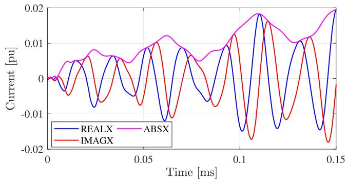  
Fig. 13. Real component, imaginary component, and the magnitude of the output at port 2, considering $i ( t ) = i _ { 2 } ( t ) , h = 5 0 0$ ns and $\Delta f = 5 0 \mathrm { k H z } ,$ until $t =$ 0.15 ms, Case B.

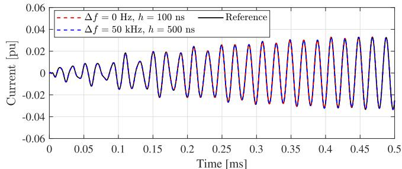

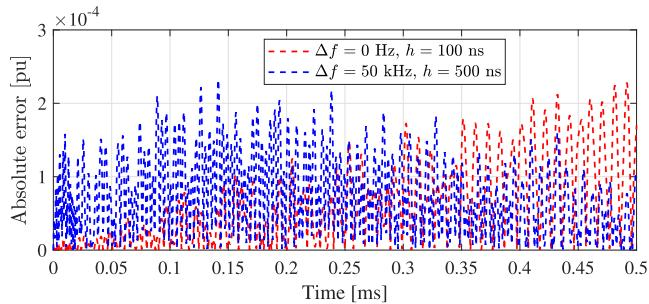  
Fig. 14. Time-domain responses (top) and its absolute error (bottom) using $f _ { e } =$ 50 kHz, until ?? = 0.5 ms, Case B.

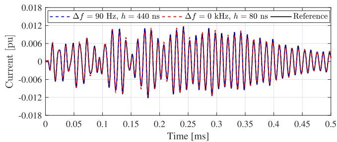

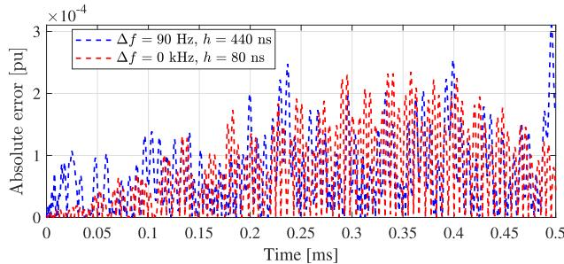  
Fig. 15. Time-domain responses (top) and its absolute error (bottom) using $f _ { e } =$ 90 kHz, until $t = 0 . 5$ ms, Case B.

shown by $| i _ { A , s h } ( t ) | = \left| \exp ( - j 2 \pi \Delta f t ) i _ { A } ( t ) \right| = | i _ { A } ( t ) |$ . This guarantees that the dynamic behavior of ??(??) is fully preserved in the frequency-shifted domain simulation.

The CVF significantly improved fitting accuracy across the bandwidth of interest, achieving an improvement of up to eight orders of magnitude improvement over VF, for the same number of poles, across all cases. This improvement stems from the added flexibility in the allocation of poles and residues, which are no longer restricted to complex conjugate pairs. Consequently, Case A revealed a pronounced difference in passivity: the CVF-derived model preserved this property, whereas the VF-derived approximation violated it.

Across all cases, frequency-shifted simulations consistently outperformed regular time-domain simulations by one to two orders of magnitude for the same ℎ. This improvement is attributed to the reduction in the transient maximum frequency by $\Delta f ,$ which lowers the Nyquist frequency limit by the same amount. As a result, for a given target RRMSE,

ℎ can be scaled by a factor of 2.33 to 5.5 without sacrificing accuracy. This reduction in the number of time-steps required for simulations leads to lower computational costs and faster simulations.

# 6. Conclusions

Relaxing the realness constraint enabled Complex Vector Fitting (CVF) to achieve substantial accuracy improvements over Vector Fitting (VF), reducing fitting errors by up to eight orders of magnitude in both cases. Noteworthy passivity differences were observed, with only the CVF-derived model maintaining passivity in one case. Frequency-shifted simulations showed considerable performance improvements, enhancing accuracy (for the same time-step size) or speed (for a target accuracy) across all tested cases. As a result, the proposed framework offers a powerful and efficient approach for simulating power system transients.

# CRediT authorship contribution statement

A. A. Kida: Resources, Investigation, Data curation, Writing – original draft, Validation, Formal analysis, Conceptualization, Writing – review & editing, Visualization, Software, Methodology; A. C. S. Lima: Writing – review & editing, Software, Methodology, Funding acquisition, Formal analysis, Conceptualization, Visualization, Supervision, Project administration, Data curation, Writing – original draft, Validation, Resources, Investigation; F. A. Moreira: Writing – review & editing, Visualization, Supervision, Resources, Methodology, Formal analysis, Conceptualization, Writing – original draft, Validation, Software, Project administration, Investigation, Data curation; F. M. Vasconcellos: Writing – review & editing, Data curation, Writing – original draft, Conceptualization.

# Data availability

No data was used for the research described in the article.

# Declaration of interests

The authors declare the following financial interests/personal relationships which may be considered as potential competing interests: Antonio Carlos Siqueira de Lima reports financial support was provided by Coordenação de Aperfeiçoamento de Pessoal de Nível Superior. Antonio Carlos Siqueira de Lima reports financial support was provided by Conselho Nacional de Desenvolvimento Científico e Tecnológico. Antonio Carlos Siqueira de Lima reports financial support was provided by Fundação de Amparo à Pesquisa do Estado de Minas Gerais. Antonio Carlos Siqueira de Lima reports financial support was provided by Instituto Nacional de Energia Elétrica. If there are other authors, they declare that they have no known competing financial interests or personal relationships that could have appeared to influence the work reported in this paper.

# Acknowledgement

This research was supported in part by Coordenação de Aperfeiçoamento de Pessoal de Nível Superior (CAPES) under Grant 001, Conselho Nacional de Desenvolvimento Científico e Tecnológico (CNPq) under

grants 404068/2020-0, 400851/2021-0, Fundação de Amparo à Pesquisa do Estado de Minas Gerais (FAPEMIG) under grant APQ-03609- 17 and Instituto Nacional de Energia Elétrica (INERGE).

# References

[1] T. Noda, Identification of a multiphase network equivalent for electromagnetic transient calculations using partitioned frequency response, IEEE Trans. Power Delivery 20 (2) (2005) 1134–1142.   
[2] S. Grivet-Talocia, B. Gustavsen, Passive Macromodeling: Theory and Applications, 239 of Wiley Series in Microwave and Optical Engineering, John Wiley & Sons, New York, US, New York, US, 2015.   
[3] B. Gustavsen, A. Semlyen, Rational approximation of frequency domain responses by vector fitting, IEEE Trans. Power Delivery 14 (3) (1999) 1052–1061. https://doi. org/10.1109/61.772353   
[4] B. Gustavsen, Improving the pole relocation properties of vector fitting, IEEE Trans. Power Delivery 21 (3) (2006) 1587–1592.   
[5] D. Deschrijver, M. Mrozowski, T. Dhaene, D. De Zutter, Macromodeling of multiport systems using a fast implementation of the vector fitting method, IEEE Microwave Wireless Compon. Lett. 18 (6) (2008) 383–385.   
[6] H.K. Høidalen, ATPDraw news, 2024, https://www.atpdraw.net/news.php.   
[7] B. Gustavsen, J. Nordstrom, Pole identification for the universal line model based on trace fitting, IEEE Trans. Power Delivery 23 (1) (2008) 472–479. https://doi.org/ 10.1109/TPWRD.2007.911186   
[8] J.L. Naredo, J. Mahseredjian, J.A. Gutierrez-Robles, O. Ramos-Leaños, C. Dufour, J. Belánger, Improving the numerical performance of transmission line models in EMTP, in: Proceedings of the International Conference on Power Systems Transients, 2011, pp. 1–8.   
[9] B. Boashash, Chapter 4 - time-frequency signal and system analysis, in: Time Frequency Analysis, Elsevier Science, Oxford, 2003, pp. 85–158. https://www.sciencedirect.com/science/article/pii/B9780080443355500255. https://doi.org/https://doi.org/10.1016/B978-008044335-5/50025-5   
[10] Y. Ye, D. Spina, D. Deschrijver, W. Bogaerts, T. Dhaene, et al., Time-domain compact macromodeling of linear photonic circuits via complex vector fitting, Photonics Res. 7 (7) (2019) 771.   
[11] A.A. Kida, F.N.F. Dicler, T.M. Campello, L.T.F.W. Silva, A.C.S. Lima, F.A. Moreira, R.F.S. Dias, G.N. Taranto, Enhancing computation performance of rational approximation for frequency-dependent network equivalents with parallelism and complex vector fitting, Electr. Power Syst. Res. 234 (2024) 110778. https://www.sciencedirect.com/science/article/pii/S0378779624006643. https://doi.org/https:// doi.org/10.1016/j.epsr.2024.110778   
[12] B. Gustavsen, A. Semlyen, Simulation of transmission line transients using vector fitting and modal decomposition, IEEE Trans. Power Delivery 13 (1998) 605–614.   
[13] B. Gustavsen, Relaxed vector fitting algorithm for rational approximation of frequency domain responses, in: Signal Propagation on Interconnects, 2006. IEEE Workshop on, 2006, pp. 97–100. https://doi.org/10.1109/SPI.2006.289202   
[14] B. Gustavsen, A. Semlyen, Enforcing passivity for admittance matrices approximated by rational functions, IEEE Trans. Power Syst. 16 (1) (2001) 97–104.   
[15] B. Gustavsen, Fast passivity enforcement for pole-Residue models by perturbation of residue matrix eigenvalues, IEEE Trans. Power Delivery 23 (4) (2008) 2278–2285. https://doi.org/10.1109/TPWRD.2008.919027   
[16] Y. Ye, D. Spina, Y. Xing, W. Bogaerts, T. Dhaene, Numerical modeling of a linear photonic system for accurate and efficient time-domain simulations, Photonics Res. 6 (6) (2018) 560–573. https://doi.org/10.1364/PRJ.6.000560   
[17] J.B. King, T.J. Brazil, Time-domain simulation of passband S-parameter networks using complex baseband vector fitting, in: 2017 Integrated Nonlinear Microwave and Millimetre-wave Circuits Workshop (INMMiC), IEEE, 2017, pp. 1–4. http://ieeexplore.ieee.org/document/7927312/. https://doi.org/10.1109/ INMMIC.2017.7927312   
[18] D. Spina, Y. Ye, D. Deschrijver, W. Bogaerts, T. Dhaene, et al., Complex vector fitting toolbox: a software package for the modelling and simulation of general linear and passive baseband systems, Electron. Lett. 57 (10) (2021) 404–406.   
[19] L. Cohen, Time-Frequency Analysis: Theory and Applications, Prentice-Hall, Inc., USA, USA, 1995.   
[20] W.Y. Yang, T.G. C. I.H. Song, Y.S. C.J. Heo, W.G. Jeon, J.W. L. J.K. Kim, Springer, Signals and Systems with MATLAB, Springer, Berlin, Heidelberg, Berlin, Heidelberg, 2009. https://doi.org/10.1007/978-3-540-92954-3   
[21] B. Gustavsen, The vector fitting website, 2008, https://www.sintef.no/projectweb/vectorfitting/.   
[22] D. Deschrijver, B. Gustavsen, T. Dhaene, Advancements in iterative methods for rational approximation in the frequency domain, IEEE Trans. Power Delivery 22 (3) (2007) 1633–1642. https://doi.org/10.1109/TPWRD.2007.899584