# 电力电子化电力系统随机电磁暂态仿真算法

陈鹏伟 1 ，刘奕泽 1 ，阮新波 1 ，陈新 1 ，孙雅旻 2

(1．江苏省新能源发电与电能变换重点实验室(南京航空航天大学)，江苏省 南京市 211106；  
2．国网冀北电力科学研究院(华北电力科学研究院有限责任公司)，北京市 西城区 100045)

# Stochastic Electromagnetic Transient Simulation Algorithm Applied to Power Electronics Dominated Power System

CHEN Pengwei1 , LIU Yize1 , RUAN Xinbo1 , CHEN Xin1 , SUN Yamin2

(1. Jiangsu Key Laboratory of New Energy Generation and Power Conversion (Nanjing University of Aeronautics and Astronautics), Nanjing 211106, Jiangsu Province, China; 2. State Grid Jibei Electric Power Research Institute (North China Electric Power Research Institute Co., Ltd.), Xicheng District, Beijing 100045, China)

ABSTRACT: To accurately and efficiently reflect the operation characteristics of power electronic dominated power system under the disturbance of the parameter random migration, the power system dynamic model based on stochastic differential equation and its numerical solution algorithms were analyzed firstly in terms of basic characteristic and limitations. Then, regarding the basic electrical components, the dynamic companion circuit model considering the random excitation of the parameter was established for electromagnetic transient simulation. Based on the resistance-inductance series branch, the numerical stability characteristics of the dynamic companion circuit model were further derived, and thus the main algorithm process of stochastic electromagnetic transient simulation was designed to meet the simulation requirement of power electronic dominated power system. Through the comparison with electromagnetic transients program (EMTP) deterministic simulation and Monte Carlo multi-trajectory results, the case studies based on the simple RLC and VSC test systems demonstrated the validity of the proposed dynamic companion circuit models and algorithm, and the proposed algorithm was also directly compatible with the EMTP algorithm framework.

KEY WORDS: stochastic differential equation; random excitation; stochastic electromagnetic transient simulation; electromagnetic transients program (EMTP) framework

摘要：为了准确高效地反映电力电子化电力系统在参数随机迁移扰动下的运行特性，该文首先分析了基于随机微分方程

的电力系统随机动态模型和数值计算方法的基本特点和限制性，并从基本电气元件出发，建立了适用于电磁暂态仿真的参数随机迁移元件动态伴随电路模型。然后，以电阻–电感串联支路为例，解析推导了动态伴随电路模型的数值稳定性特征，进而针对电力电子化电力系统的仿真需求，设计了随机电磁暂态仿真的算法主流程。最后，采用 RLC 简单电路和三相两电平 VSC 电路，通过对比 EMTP(electromagnetictransients program)确定性仿真和蒙特卡罗多轨迹仿真结果，验证动态伴随电路模型和所提随机电磁暂态仿真算法的正确性与有效性，且对EMTP算法框架直接兼容。

关键词：随机微分方程；随机激励；随机电磁暂态仿真；EMTP 框架

# 0 引言

近年来，随着电网中大容量柔性直流输配电、柔性交流输电的进一步应用，以及微电网、新能源的大规模接入，电力系统逐渐呈现电力电子化趋势[1]。基于元件详细动态特性建模的数字电磁暂态仿真能够刻画微秒级的系统动态过程，且不受系统规模和结构复杂性的限制，逐渐成为电力电子化电力系统最为有效准确的模拟手段[2-4]。从算法结构上看，电磁暂态仿真数值算法主要有 2 类：一类以SimPowerSystems 为代表，采用状态变量分析法；另一类以 EMTP(electromagnetic transients program)而著称，采用伴随电路(元件的差分方程可视为诺顿等效电路)与节点导纳法构成的基本框架[5]。由于EMTP类程序具有相对较小的计算量和可预计的计算耗时，ATP/EMTP、PSCAD/EMTDC、RTDS 等电磁暂态离线和实时仿真平台均采用了 EMTP 算

法框架[6]。

然而，由于电磁暂态仿真的建模基础是常微分方程描述的确定性过程(初值和参数是不变常数)，对系统涉及的外部随机激励、内部参数随机迁移及其激发的动态过程不具备直接模拟能力，因此通常需要多工况测试进行详细的系统特性验证。外部随机激励通常属于加性激励，一般由负荷或新能源发电过程引入[7]，可通过风速、光辐照度或控制指令信号的时间序列来模拟，但需要较为详细的新能源发电环节、负荷本体模型作为中间过程[8]，且时间序列的准确生成依赖对外部激励随机动态过程的辨识[9]。内部参数迁移通常属于乘性激励，一般由设备运行状态变化或等效区域内部结构变化引起[10]，直观表现为电感、电容等元件参数的随机动态过程，因而与 EMTP算法框架存在兼容性问题。虽然PSCAD/EMTDC 等提供了可变串联阻抗支路的修改接口，但同外部激励设置方式一样，属于按已知参数时间序列或给定函数逐步修改节点导纳阵相应元素，未能完整模拟参数的随机性和电感、电容元件参数引入激励时的能量特性。

考虑到确定性建模和仿真方法在表征和分析随机动态系统的局限性，由概率论与微分方程理论结合发展而成的随机微分方程(stochastic differentialequation，SDE)理论[11]被引入电气工程领域，逐渐成为研究随机激励对系统物理特性影响的重要手段之一。文献[12-13]按照发电机、负荷等电力系统基本单元的数学形式，总结了电力系统随机动态分析的系统性建模方法。文献[9]采用 Euler-Maruyama 方法计算高斯型随机激励系统随机响应轨迹，并从理论上证明了方法的数值稳定性以及激励较小情况下系统的均值和均方稳定性。文献[14]以功率波动为随机激励，分析了仿真计算步长、随机激励强度、随机激励步长对单机–无穷大系统功角响应的影响。基于 SUNDIALS 工具集，文献[15]采用交替求解思路提出了有源配电网的随机动态仿真方法。交替求解思路是将系统模型分为确定性系统与随机激励项两部分，前者刚性强采用隐式积分法而后者刚性弱采用 SDE 数值解法。特别地，文献[16]采用投影积分算法求解有源配电网模型随机激励项部分，其中投影积分算法小步长内部积分采用高效的Euler-Maruyama 方法而大步长外部积分则采用高阶的 Milstein 方法。相关研究成果为源–网–荷随机激励条件下电磁暂态仿真技术的发展和应用奠定

了基础，但参数随机迁移作为乘性激励的引入使得随机激励项不再单独存在，现有随机动态模型和数值算法在应用时存在极大限制。

就上述问题，本文首先分析了基于 SDE 的电力系统随机动态模型和数值计算方法的基本特点和限制性，并从基本电气元件出发，在 EMTP算法框架下建立参数随机迁移元件的电磁暂态仿真动态伴随电路模型，并以电阻–电感串联支路为例进行了动态伴随电路数值稳定性特征的解析分析。然后，针对复杂电力电子化电力系统的仿真需求，设计了随机电磁暂态仿真的算法主流程。最后，采用RLC 简单电路和三相两电平 VSC 电路，通过对比确定性电磁暂态仿真和蒙特卡罗多轨迹仿真结果，验证所提动态伴随电路模型和随机电磁暂态仿真算法在模拟参数随机迁移及其激发的系统动态过程方面的正确性与有效性。

# 1 随机激励下电力系统建模

# 1.1 基于 SDE 的电力系统模型

具有一般形式的矢量 SDE 可表示为[10-11]

$$
\mathrm {d} \boldsymbol {\eta} (t) = \boldsymbol {\alpha} (\boldsymbol {\eta}, t) \mathrm {d} t + \boldsymbol {\beta} (\boldsymbol {\eta}, t) \mathrm {d} W (t), \boldsymbol {\eta} (t _ {0}) = \boldsymbol {\eta} _ {0} \tag {1}
$$

式中： n n   +      与 $\beta$ + : n n   nw      ，分别为 SDE 的偏移过程与扩散过程； $\pmb { \eta } _ { 0 }$ 为 $t _ { 0 }$ 时刻初值； $\pmb { W } ( t ) = \left[ W _ { 1 } ( t ) , W _ { 2 } ( t ) , \cdots , W _ { n _ { w } } ( t ) \right] ^ { \mathrm { T } }$ 为 $n _ { w }$ 维独立的标准 Wiener 过程。对于离散形式下标准 Wiener过程，任意相邻时刻 $t _ { n - 1 , t _ { n } }$ 间增量相互独立，且满足 $\Delta W _ { n - 1 } = W _ { n } - W _ { n - 1 } \sim \sqrt { \Delta t } N ( 0 , 1 )$ ，其中 $W _ { n } { = } W ( t _ { n } )$ ，$\Delta t { = } t _ { n } { - } t _ { n - 1 } { \mathrm { ~ c ~ } }$ 。

考虑新能源发电、负荷波动等系统固有随机扰动，采用 SDE 对其进行建模，则系统随机动态过程可表示为[13]

$$
\left\{ \begin{array}{l} \dot {\boldsymbol {x}} = \boldsymbol {f} (\boldsymbol {x}, \boldsymbol {y}, \boldsymbol {u}, t) + \dot {\boldsymbol {\eta}} \\ \boldsymbol {0} = \boldsymbol {g} (\boldsymbol {x}, \boldsymbol {y}, \boldsymbol {u}, t) \\ \dot {\boldsymbol {\eta}} = \boldsymbol {\alpha} (\boldsymbol {x}, \boldsymbol {y}, \boldsymbol {u}, t) + \boldsymbol {\beta} (\boldsymbol {x}, \boldsymbol {y}, \boldsymbol {u}, t) \boldsymbol {\xi} \end{array} \right. \tag {2}
$$

式中： : n n n x u x ny f       为微分方程，描述系统确定性动态过程； :g  $\mathbf { \Psi } ^ { l _ { x } } \times \mathbb { R } ^ { n _ { y } } \times \mathbb { R } ^ { n _ { u } } \mapsto \mathbb { R } ^ { n _ { y } }$ 为代数方程，表示派克变换、有效值测量等环节；x为系统状态变量，如节点电压、支路电流、电机转子转速等；y 为代数变量；u 为离散变量，如线路中断信号、器件开断控制信号等； ${ \pmb { \xi } } { - } \mathrm { d } { \pmb { W } } / \mathrm { d } t$ ，即代表随机激励的高斯白噪声过程。

由 $\operatorname { \vec { x } } ( 2 )$ 可见，系统模型可分清晰地划分为确定

性系统与随机激励项两部分，前者刚性强而后者刚性弱，采用交替迭代方式求解时交互信息仅由随机激励项单向传递至确定性系统部分。当系统涉及参数随机迁移时，式(2)中确定性动态过程部分将被拓展为

$$
\dot {\boldsymbol {x}} = \boldsymbol {f} (\boldsymbol {x}, \boldsymbol {y}, \boldsymbol {u}, t, \dot {\boldsymbol {\eta}}, \boldsymbol {\eta}) \tag {3}
$$

由于电阻、电感、电容等元件的参数随机迁移属于乘性激励，随机激励项不再单独存在，导致系统刚性和随机性相互作用，系统的多时间尺度特性被进一步增强。当仿真系统涉及器件开关状态频繁变化的电力电子器件时，电磁暂态时间尺度的随机动态轨迹求解对式(2)—(3)所示模型整体数值计算方法的要求也随之加深。

# 1.2 随机动态轨迹数值计算方法

对于 SDE 而言，多数情况只能通过数值计算方法获得逼近精确解的随机动态轨迹，而目前较为成熟的数值解法主要有 Euler-Maruyama 格式､Milstein格式、Heun 格式及其相应校正格式[12,17-18]。

1）Euler-Maruyama 格式。

$$
\boldsymbol {\eta} _ {n} = \boldsymbol {\eta} _ {n - 1} + \boldsymbol {\alpha} (\boldsymbol {\eta} _ {n - 1}) \Delta t + \boldsymbol {\beta} (\boldsymbol {\eta} _ {n - 1}) \Delta \boldsymbol {W} _ {n - 1} \tag {4}
$$

2）Milstein 格式。

$$
\boldsymbol {\eta} _ {n} = \boldsymbol {\eta} _ {n - 1} + \boldsymbol {\alpha} (\boldsymbol {\eta} _ {n - 1}) \Delta t + \boldsymbol {\beta} (\boldsymbol {\eta} _ {n - 1}) \Delta \boldsymbol {W} _ {n - 1} +
$$

$$
\frac {1}{2} \boldsymbol {\beta} (\boldsymbol {\eta} _ {n - 1}) \boldsymbol {\beta} ^ {\prime} (\boldsymbol {\eta} _ {n - 1}) \left(\Delta \boldsymbol {W} _ {n - 1} ^ {2} - \Delta t\right) \tag {5}
$$

为便于扩散量的引用和论述，记算子 D(·)，即：

$$
D (\boldsymbol {\eta} _ {n - 1}) = \boldsymbol {\beta} (\boldsymbol {\eta} _ {n - 1}) \Delta \boldsymbol {W} _ {n - 1} + \frac {1}{2} \boldsymbol {\beta} (\boldsymbol {\eta} _ {n - 1}) \cdot
$$

$$
\boldsymbol {\beta} ^ {\prime} \left(\boldsymbol {\eta} _ {n - 1}\right) \left(\Delta \boldsymbol {W} _ {n - 1} ^ {2} - \Delta t\right) \tag {6}
$$

3）Heun 格式。

$$
\boldsymbol {\eta} _ {n} = \boldsymbol {\eta} _ {n - 1} + \frac {\boldsymbol {\alpha} \left(\boldsymbol {\eta} _ {n - 1}\right) + \boldsymbol {\alpha} \left(\boldsymbol {\eta} _ {n} + \Delta t \boldsymbol {\alpha} \left(\boldsymbol {\eta} _ {n}\right)\right)}{2} \Delta t +
$$

$$
\boldsymbol {\beta} \left(\eta_ {n - 1}\right) \Delta \boldsymbol {W} _ {n - 1} \tag {7}
$$

4）隐式 Milstein 格式。

$$
\boldsymbol {\eta} _ {n} = \boldsymbol {\eta} _ {n - 1} + [ (1 - \theta) \boldsymbol {\alpha} (\boldsymbol {\eta} _ {n - 1}) + \theta \boldsymbol {\alpha} (\tilde {\boldsymbol {\eta}} _ {n}) ] \Delta t + D (\boldsymbol {\eta} _ {n - 1}) \tag {8}
$$

式中 $\tilde { \pmb { \eta } } _ { n }$ 为预估值，可采用 Euler-Maruyama 格式构造。当0.5，即为梯形 Milstein 格式；当1，即为后向 Milstein 格式。

Euler-Maruyama 和 Milstein 格式均由随机泰勒展开式不同截断构成，Heun 和隐式 Milstein 格式则是引入梯形公式和预估–校正产生的改进格式。为直观比较上述离散格式的精度，基于文献[17]提出的数值测试方法，图 1给出了对数坐标系下以线性$\mathrm { S D E d } \eta ( t ) = \pm 2 \eta ( t ) \mathrm { d } t + \eta ( t ) \mathrm { d } W ( t )$ 为测试对象的强

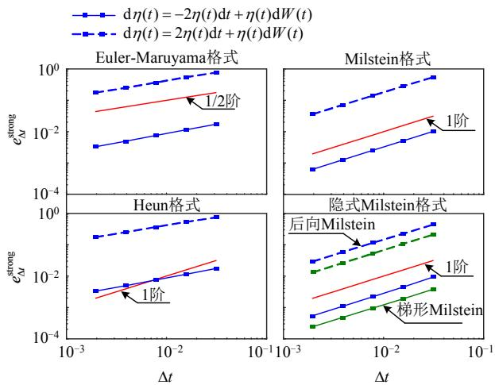  
图1 不同离散格式强收敛性对比  
Fig. 1 Comparison of strong convergence between different schemes

收敛性 $e _ { \Delta t } ^ { \mathrm { s t r o n g } } = \mathbf { E } | \pmb { \eta } _ { n } - \pmb { \eta } ( n \Delta t ) |$ 对比结果，即对于足够小的步长t，存在常数 C使得：

$$
\log e _ {\Delta t} ^ {\text {s t r o n g}} \leq \log C + \gamma \log \Delta t \tag {9}
$$

式中为强收敛阶。

由图 1 可见，Euler-Maruyama 格式为显式方法，具有 1/2 强收敛阶；Heun格式的稳定性易受步长和乘性噪声影响，但精度表现优于 Euler-Maruyama格式；Milstein 和隐式 Milstein 计及了 Wiener 过程的二阶项，虽然算法复杂度会有所提高，但均为1 阶强收敛。因此，考虑到精度表现，隐式 Milstein格式中的梯形和后向形式将是本文用于参数随机迁移元件电磁暂态仿真模型构建的优先选择。

# 2 基本元件随机电磁暂态仿真模型

# 2.1 电阻元件

若支路 $( i , j )$ 间为电阻元件 R，电阻特性方程可表示为

$$
i _ {R} (t) = \frac {1}{R} \left(v _ {i} (t) - v _ {j} (t)\right) = G _ {R} \left(v _ {i} (t) - v _ {j} (t)\right) \tag {10}
$$

由于上述特性方程中不含微分项，因而在EMTP 算法框架下无需利用数值积分方法差分化处理。当采用式(1)描述电阻参数随机迁移过程时，即$\mathrm { d } R ( t ) = \alpha ( R ( t ) ) \mathrm { d } t + \beta ( R ( t ) ) \mathrm { d } W ( t )$ ，则离散后有：

$$
i _ {R, n} = \frac {1}{R _ {n}} \left(v _ {i, n} - v _ {j, n}\right) = G _ {R, n} \left(v _ {i, n} - v _ {j, n}\right) \tag {11}
$$

式中 $R _ { n }$ 需要随仿真时刻同步更新，按后向和梯形Milstein 格式分别有：

$$
R _ {n} = R _ {n - 1} + \alpha \left(\tilde {R} _ {n}\right) \Delta t + D \left(R _ {n - 1}\right) \tag {12}
$$

$$
R _ {n} = R _ {n - 1} + \frac {1}{2} \left(\alpha \left(R _ {n - 1}\right) + \alpha \left(\tilde {R} _ {n}\right)\right) \Delta t + D \left(R _ {n - 1}\right) \tag {13}
$$

# 2.2 电感元件

当支路 $\cdot ( i , j )$ 间为电感元件 L，考虑电感参数动态过程，由其磁链方程可得：

$$
\frac {\mathrm {d} \Psi_ {L} (t)}{\mathrm {d} t} = i _ {L} (t) \frac {\mathrm {d} L (t)}{\mathrm {d} t} + L (t) \frac {\mathrm {d} i _ {L} (t)}{\mathrm {d} t} = v _ {i} (t) - v _ {j} (t) \tag {14}
$$

由式(14)可见，不同于参数迁移电阻，电感参数迁移过程会伴有能量的变化，且这种变化直接受其通过电流的影响。为不失一般性，将电感参数随机迁移过程描述为 $\mathrm { d } L ( t ) = \alpha ( L ( t ) ) \mathrm { d } t + \beta ( L ( t ) ) \mathrm { d } W ( t )$ ，代入式(14)后有：

$$
\begin{array}{l} \mathrm {d} i _ {L} (t) = \frac {v _ {i} (t) - v _ {j} (t) - i _ {L} (t) \alpha (L (t))}{L (t)} \mathrm {d} t - \\ \frac {i _ {L} (t) \beta (L (t))}{L (t)} d W (t) \tag {15} \\ \end{array}
$$

对 dL(t)采用后向 Milstein 格式离散，可得：

$$
L _ {n} = L _ {n - 1} + \alpha (\tilde {L} _ {n}) \Delta t + D \left(L _ {n - 1}\right) \tag {16}
$$

代入式(14)离散可得：

$$
i _ {L, n} = i _ {L, n - 1} + \frac {\Delta t}{L _ {n}} \left(v _ {i, n} - v _ {j, n} - i _ {L, n} \alpha \left(\tilde {L} _ {n}\right)\right) - \frac {i _ {L , n - 1}}{L _ {n - 1}} D \left(L _ {n - 1}\right) \tag {17}
$$

将式(17)改写为节点方程的形式，则有：

$$
\begin{array}{l} i _ {L, n} = \frac {\Delta t}{L _ {n} + \alpha (\tilde {L} _ {n}) \Delta t} (v _ {i, n} - v _ {j, n}) + \\ K _ {\mathrm {A}, n} i _ {L, n - 1} - \frac {K _ {\mathrm {A} , n} i _ {L , n - 1}}{L _ {n - 1}} D \left(L _ {n - 1}\right) \tag {18} \\ \end{array}
$$

式中 $K _ { \mathrm { A } , n } = L _ { n } / ( L _ { n } + \alpha ( \tilde { L } _ { n } ) \Delta t )$ ，可定义为电感偏移系数。

由式(18)可见，参数随机迁移的电感支路在电磁暂态仿真中可表示为诺顿等效电路，即电感等效导纳、受控历史电流源(对应历史电流)、受控随机电流源(对应参数随机迁移)并联构成，称动态伴随电路，如图 2(b)所示(图 2(a)为确定性电感参数伴随电路)，均与仿真时刻相关，其中：

$$
\left\{ \begin{array}{l} G _ {L, n} = \frac {\Delta t}{L _ {n} + \alpha \left(\tilde {L} _ {n}\right) \Delta t}, \quad I _ {L \text {h i s t}, n - 1} = K _ {\mathrm {A}, n} i _ {L, n - 1} \\ I _ {L \text {r a n d}, n - 1} = - \frac {K _ {\mathrm {A} , n} i _ {L , n - 1}}{L _ {n - 1}} D \left(L _ {n - 1}\right) \end{array} \right. \tag {19}
$$

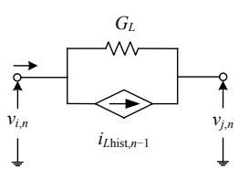  
(a) 确定性电感

  
(b) 参数迁移电感  
图2 电感诺顿等效电路  
Fig. 2 Norton equivalent circuit of inductance

若采用梯形 Milstein 格式离散 $\mathrm { d } L ( t )$ 和 $\mathrm { d } i _ { L } ( t )$ (推导过程见附录 A)，可得动态伴随电路为

$$
\left\{ \begin{array}{c} G _ {L, n} = \Delta t / \left[ 2 L _ {n} + \alpha \left(\tilde {L} _ {n}\right) \Delta t \right] \\ I _ {L \text {r a n d}, n - 1} = - \frac {K _ {\mathrm {B} , n} i _ {L , n - 1}}{L _ {n - 1}} D \left(L _ {n - 1}\right) \\ I _ {L \text {h i s t}, n - 1} = K _ {\mathrm {B}, n} i _ {L, n - 1} + \frac {L _ {n}}{L _ {n - 1}} G _ {L, n} \left(v _ {i, n - 1} - \right. \\ v _ {j, n - 1} - i _ {L, n - 1} \alpha \left(L _ {n - 1}\right)) \end{array} \right. \tag {20}
$$

式中 $K _ { \mathrm { B } , n } = 2 L _ { n } / ( 2 L _ { n } + \alpha ( \tilde { L } _ { n } ) \Delta t )$ 。

# 2.3 电容元件

电容参数迁移过程同样伴有能量的变化，且这种变化受其电压影响。若支路 $( i , j )$ 间为电容元件 C，考虑电容参数动态过程，由其电荷方程可得：

$$
\begin{array}{l} \frac {\mathrm {d} Q _ {C} (t)}{\mathrm {d} t} = C (t) \frac {\mathrm {d} \left(v _ {i} (t) - v _ {j} (t)\right)}{\mathrm {d} t} + \frac {\mathrm {d} C (t)}{\mathrm {d} t}. \\ (v _ {i} (t) - v _ {j} (t)) = i _ {C} (t) \tag {21} \\ \end{array}
$$

记电容电压为 $\nu _ { C } ( t ) = \nu _ { i } ( t ) - \nu _ { i } ( t )$ ，参数随机迁移过程为 $\mathrm { d } C ( t ) = \alpha ( C ( t ) ) \mathrm { d } t + \beta ( C ( t ) ) \mathrm { d } W ( t )$ ，则：

$$
\mathrm {d} v _ {C} (t) = \frac {i _ {C} (t) - v _ {C} (t) \alpha (C (t))}{C (t)} \mathrm {d} t - \frac {v _ {C} (t) \beta (C (t))}{C (t)} \mathrm {d} W (t) \tag {22}
$$

对 $\mathrm { d } C ( t )$ 和 $\mathrm { d } \nu _ { C } ( t )$ 依次采用后向 Milstein 格式离散，可得：

$$
C _ {n} = C _ {n - 1} + \alpha (\tilde {C} _ {n}) + D (C _ {n - 1}) \tag {23}
$$

代入式(22)离散可得：

$$
v _ {C, n} = v _ {C, n - 1} + \frac {i _ {C , n} - v _ {C , n} \alpha (\tilde {C} _ {n})}{C _ {n}} \Delta t - \frac {v _ {C , n - 1}}{C _ {n - 1}} D \left(C _ {n - 1}\right) \tag {24}
$$

将式(24)改写为节点方程的形式，则可得到与图 2(b)类似的参数随机迁移电容的动态伴随电路，即：

$$
\left\{ \begin{array}{l} G _ {C, n} = C _ {n} / (\Delta t) + \alpha \left(\tilde {C} _ {n}\right) \\ I _ {C \text {r a n d}, n - 1} = \frac {K _ {C , n}}{\Delta t} D _ {C, n - 1} v _ {C, n - 1} \\ I _ {\text {C h i s t}, n - 1} = - \frac {C _ {n}}{\Delta t} v _ {C, n - 1} \end{array} \right. \tag {25}
$$

式中 $K _ { C , n } = C _ { n } / C _ { n - 1 }$ 。

类似地，若采用梯形 Milstein 格式离散 dC(t)和$\mathrm { d } \nu _ { C } ( t ) ( $ (推导过程见附录 A)，动态伴随电路可表示为

$$
\left\{ \begin{array}{l} G _ {C, n} = 2 C _ {n} / (\Delta t) + \alpha \left(\tilde {C} _ {n}\right) \\ I _ {C \text {r a n d}, n - 1} = \frac {2 K _ {C , n}}{\Delta t} D \left(C _ {n - 1}\right) v _ {C, n - 1} \\ I _ {\text {C h i s t}, n - 1} = - \left[ \frac {2 C _ {n}}{\Delta t} - K _ {C, n} \alpha \left(C _ {n - 1}\right) \right] v _ {C, n - 1} - K _ {C, n} i _ {C, n - 1} \end{array} \right. \tag {26}
$$

需要指出：当 VSC、MMC 等电力电子装置中含有受温度、频率、功率等因素影响的参数迁移元件时，在其电磁暂态仿真模型中可由上述 RLC 组合元件及其动态伴随电路替代相应部分，但具体参数随机过程的建模仍需视工况具体处理。当电磁暂态仿真受计算效率驱动需要涉及边界子系统等值时，为减少多工况等值参数设置和验证环节，也可在单次仿真中设置等值电路参数的随机迁移，从而增加极端工况数量，提高电磁暂态仿真对电力电子化电力系统的测试能力。

# 3 随机电磁暂态仿真算法

# 3.1 数值稳定性分析

数值稳定性是电磁暂态时域仿真的基本要求。因此，以下将以典型电阻–电感支路为例，考察参数随机条件下采用后向和梯形 Milstein 离散格式进行随机电磁暂态仿真的数值稳定性。对于阻感支路$L \mathrm { d } i _ { L } ( t ) / \mathrm { d } t + i _ { L } ( t ) R = u _ { s } ( t )$ ，其中 $u _ { s }$ 为支路两端电压。

1）电阻参数随机迁移。当仅有电阻存在参数迁移时， $R _ { n }$ 可由式(12)或(13)更新。对于支路动态过程则分别应用确定性微分方程数值解法后向Euler法和隐式梯形法离散(为便于论述，SDE 数值解法称为格式)，可得电感电流迭代方程分别为：

$$
i _ {L, n} = \frac {L}{L + R _ {n} \Delta t} i _ {L, n - 1} + \frac {\Delta t}{L + R _ {n} \Delta t} u _ {s, n} \tag {27}
$$

$$
i _ {L, n} = \frac {2 L - R _ {n - 1} \Delta t}{2 L + R _ {n} \Delta t} i _ {L, n - 1} + \frac {\Delta t}{2 L + R _ {n} \Delta t} \left(u _ {s, n} + u _ {s, n - 1}\right) \tag {28}
$$

若设上一时刻迭代值与准确解间存在扰动误差，即 $i _ { L , n - 1 } ^ { * } = i _ { L , n - 1 } + \varepsilon _ { L , n - 1 } \ , u _ { s , n - 1 } ^ { * } = u _ { s , n - 1 } + \varepsilon _ { u , n - 1 } $ ，迭且代过程中不产生新的误差，则传递后 $\varepsilon _ { L , n }$ 分别满足：

$$
\varepsilon_ {L, n} = \frac {L}{L + R _ {n} \Delta t} \varepsilon_ {L, n - 1} = E _ {\mathrm {E}, n} \varepsilon_ {L, n - 1} \tag {29}
$$

$$
\begin{array}{l} \varepsilon_ {L, n} = \frac {2 L - R _ {n - 1} \Delta t}{2 L + R _ {n} \Delta t} \varepsilon_ {L, n - 1} + \frac {\Delta t}{2 L + R _ {n} \Delta t} \varepsilon_ {u, n - 1} = \\ E _ {\mathrm {T}, n} \varepsilon_ {L, n - 1} + U _ {\mathrm {T}, n} \varepsilon_ {u, n - 1} \tag {30} \\ \end{array}
$$

由式(29)与(30)， $\forall L , R _ { n - 1 } , R _ { n } { > } 0$ 有：1） $E _ { \mathrm { E } , n } { < } 1$ ，即电阻参数迁移下后向 Euler 法仍具有绝对稳定性；2）当 $\Delta t { < } 2 L / R _ { n - 1 }$ 时， $E _ { \mathrm { T } , n } { < } 1$ ，由于 $U _ { \mathrm { T } , n } { > } 0$ ，隐式梯形法收敛性还受上一时刻支路非状态变量(电压)误差的影响，当 $R _ { n } { < } 1 , \Delta t { < } 2 L / ( 1 { - } R _ { n } )$ 或 $R _ { n } { \geq } 1$ , $\Delta t { \geq } 0$ 时， $U _ { \mathrm { T } , n } { < } 1$ ，即电阻参数随机迁移条件下取较小 $\mathbf { \nabla } \cdot \Delta t$ 可保证隐式梯形法的绝对稳定性。

2）参数随机迁移电感。当仅电感存在参数迁

移时，若采用后向 Milstein 格式离散，阻感支路迭代方程可表示为

$$
i _ {L, n} = \frac {L _ {n} - L _ {n} D \left(L _ {n - 1}\right) / L _ {n - 1}}{L _ {n} + R \Delta t + \alpha (\tilde {L} _ {n}) \Delta t} i _ {L, n - 1} + \frac {\Delta t}{L _ {n} + R \Delta t + \alpha (\tilde {L} _ {n}) \Delta t} u _ {s, n} \tag {31}
$$

若仍设上一时刻迭代值与准确解间存在扰动误差 $\varepsilon _ { L , n - 1 }$ ，则传递后 $\varepsilon _ { L , n }$ 满足：

$$
\varepsilon_ {L, n} = \frac {L _ {n} - L _ {n} D \left(L _ {n - 1}\right) / L _ {n - 1}}{L _ {n} + R \Delta t + \alpha \left(\tilde {L} _ {n}\right) \Delta t} \varepsilon_ {L, n - 1} = E _ {\mathrm {B M}} \varepsilon_ {L, n - 1} \tag {32}
$$

由式(32)可见，当支路参数满足式(33)所述必要条件时可使 $| E _ { \mathrm { B M } } | { < } 1$ ，从而保证绝对稳定性，即：

$$
\left\{ \begin{array}{l} L _ {n} + R \Delta t + \alpha (\tilde {L} _ {n}) \Delta t > 0 \\ L _ {n} D \left(L _ {n - 1}\right) + L _ {n - 1} \left(R + \alpha (\tilde {L} _ {n})\right) \Delta t > 0 \\ 2 L _ {n} L _ {n - 1} + L _ {n - 1} \left(R + \alpha (\tilde {L} _ {n})\right) \Delta t > L _ {n} D \left(L _ {n - 1}\right) \end{array} \right. \tag {33}
$$

由于 $D ( L _ { n - 1 } )$ 中存在高斯分布随机项 $\Delta W _ { n - 1 }$ ，导致式(33)难以解析求解，不易判断必要条件满足与否。因此，对式(33)所述必要条件进一步弱化，即寻求期望值情况下的成立，使得|  $\boldsymbol { E } _ { \mathrm { B M } } ) | < 1$ ，进而保证随机渐进稳定性。对于随机项 $\Delta W _ { n - 1 }$ 1，有：

$$
\mathbb {E} \left(\Delta W _ {n - 1} ^ {k}\right) = \left\{ \begin{array}{l l} {\left(\sqrt {\Delta t}\right) ^ {k} (k - 1)!!,} & {k = \text {偶 数}} \\ {0,} & {k = \text {奇 数}} \end{array} \right. \tag {34}
$$

则消去 $L _ { n }$ 后，式(33)所述必要条件可替换为(具体推导过程见附录 B)。

$$
\left\{ \begin{array}{l} \alpha \left(\tilde {L} _ {n}\right) > - \frac {L _ {n - 1}}{2 \Delta t} - \frac {R}{2} \\ \alpha \left(\tilde {L} _ {n}\right) > - \frac {\mathbb {E} \left(D ^ {2} \left(L _ {n - 1}\right)\right)}{L _ {n - 1} \Delta t} - R \\ \alpha \left(\tilde {L} _ {n}\right) > - \frac {2 L _ {n - 1}}{3 \Delta t} - \frac {R}{3} + \frac {\mathbb {E} \left(D ^ {2} \left(L _ {n - 1}\right)\right)}{3 L _ {n - 1} \Delta t} \end{array} \right. \tag {35}
$$

式中 $\begin{array} { r } { \mathbb { E } ( D ^ { 2 } ( L _ { n - 1 } ) ) = \beta ^ { 2 } ( L _ { n - 1 } ) ( \Delta t + 0 . 5 \beta ^ { \prime 2 } ( L _ { n - 1 } ) \Delta t ^ { 2 } ) } \end{array}$ 。

由式(33)与(35)可见：1）t 的取值直接影响随机渐进稳定性，当 $\Delta t$ 较小时，电感偏移过程 $\alpha ( \tilde { L } _ { n } )$ 易有更大的可行域，进而确保随机渐进稳定性；2）未利用上一时刻电压，不受非状态变量–电压误差的影响；3）电阻 R 对数值振荡具有阻尼作用，R越大数值迭代的稳定域越大。

同理，若采用梯形 Milstein 格式离散，电感电流迭代方程可表示为

$$
\begin{array}{l} i _ {L, n} = \frac {2 L _ {n} - L _ {n} / L _ {n - 1} (R \Delta t + \alpha (L _ {n - 1}) \Delta t + 2 D (L _ {n - 1}))}{2 L _ {n} + R \Delta t + \alpha (\tilde {L} _ {n}) \Delta t} i _ {L, n - 1} + \\ \frac {L _ {n} / L _ {n - 1} \Delta t}{2 L _ {n} + R \Delta t + \alpha (\tilde {L} _ {n}) \Delta t} u _ {s, n - 1} + \frac {\Delta t}{2 L _ {n} + R \Delta t + \alpha (\tilde {L} _ {n}) \Delta t} u _ {s, n} \tag {36} \\ \end{array}
$$

由式(36)可见，与隐式梯形法类似，梯形Milstein 格式同样受上一时刻非状态变量–电压误差的影响。当仿真系统中存在强制换向元件时，易由电压跳变误差激发起数值振荡，其他数值特性与后向 Milstein格式类似，电阻 R对数值振荡具有阻尼作用。

综上，不同数值积分方法下阻感支路的数值稳定性特征总结如表 1 所示。对于参数迁移电阻，其参数随机动态过程可灵活选用后向或梯形 Milstein格式，不受整个阻感支路数值积分方法的限制。

表1 不同数值方法下阻感支路数值稳定性特征  
Table 1 Numerical stability characteristics of resistance-inductance branch using different methods   

<table><tr><td>迁移项</td><td>自身参数</td><td>支路状态</td><td>稳定性特征描述</td></tr><tr><td rowspan="5">电阻</td><td>后向/梯形</td><td>后向</td><td>■不受非状态量突变误差影响</td></tr><tr><td>Milstein 格式</td><td>Euler法</td><td>■∀L,Rn-1,Rn&gt;0存在绝对稳定</td></tr><tr><td>后向/梯形</td><td>隐式</td><td>■受非状态变量突变误差影响</td></tr><tr><td>Milstein 格式</td><td>梯形法</td><td>■Rn具有误差阻尼作用(非恒定)</td></tr><tr><td></td><td></td><td>■Δt较小时具有更大绝对稳定域</td></tr><tr><td rowspan="6">电感</td><td colspan="2">后向 Milstein 格式</td><td>■不受非状态量突变误差影响</td></tr><tr><td></td><td></td><td>■R较大Δt较小时,α(ˆn)具有较大可行域,存在渐进稳定</td></tr><tr><td></td><td></td><td>■R具有误差阻尼作用</td></tr><tr><td colspan="2">梯形 Milstein 格式</td><td>■受非状态变量突变误差影响</td></tr><tr><td></td><td></td><td>■R较大Δt较小时,α(ˆn)具有较大可行域,存在渐进稳定</td></tr><tr><td></td><td></td><td>■R具有误差阻尼作用</td></tr></table>

# 3.2 算法主流程

利用后向或梯形 Milstein 格式对参数迁移电感、电容进行诺顿等效后，待仿真系统中的基本电气元件均能用常规或动态伴随电路表示，则基于EMTP算法框架，随机电磁暂态仿真的主流程可设计如图 3 所示。

由图 1 可知，梯形 Milstein 格式的精度稍优于后向 Milstein 格式，因此图 3 中对应无器件动作常规状态(即拓扑结构未变化)的仿真环节采用计算模块 1，即通过梯形 Milstein 格式更新随机迁移元件的参数和动态伴随电路的等效导纳、历史电流项及随机电流项。考虑到器件换向导致的电感、电容非状态量突变误差，因此根据上节数值稳定性分析结论，在器件动作时采用计算模块 2 来代替模块 1，通过后向 Milstein 格式更新参数迁移元件的动态伴随电路。算法涉及的主要子过程如表 2 所示，其中主体类型为基本计算环节，事件类型由是否发生开关状态变化而触发，通用类型为重复调用的功能模

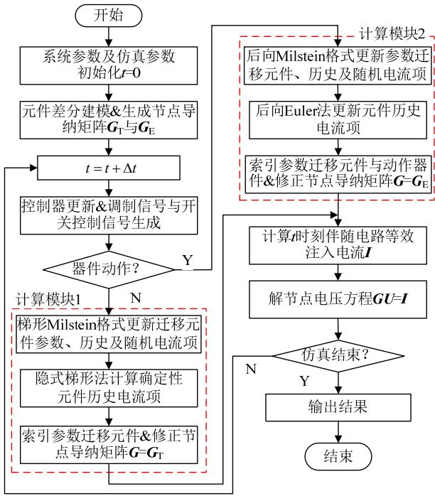  
图3 随机电磁暂态仿真算法主流程  
Fig. 3 Main process of stochastic electromagnetic transient simulation algorithm

表2 子过程类型与功能  
Table 2 Types of sub-process and its function   

<table><tr><td>过程类型</td><td>子过程名</td><td>功能</td></tr><tr><td>主体</td><td>SEMTP_Init</td><td>初始化仿真参数导纳矩阵</td></tr><tr><td>主体</td><td>Controller_Cal</td><td>装置控制器调制信号生成</td></tr><tr><td>主体</td><td>Ctrl_Sign_Gen</td><td>开关控制信号生成</td></tr><tr><td>主体</td><td>Switch_Check</td><td>开关状态检测</td></tr><tr><td>主体</td><td>I_Inject_Cal</td><td>节点注入电流计算</td></tr><tr><td>事件</td><td>Gmatrix_Reform</td><td>开关状态-导纳矩阵重构</td></tr><tr><td>事件</td><td>Parm_Update_T/E</td><td>随机迁移元件参数更新</td></tr><tr><td>事件</td><td>Gmatrix_Update_T/E</td><td>迁移元件-导纳矩阵修正</td></tr><tr><td>事件</td><td>Ihstrand_Update_T/E</td><td>历史/随机电流项更新</td></tr><tr><td>事件</td><td>IV_Update_T/E</td><td>状态量更新</td></tr><tr><td>通用</td><td>Vbranch_cal</td><td>支路电压计算</td></tr><tr><td>通用</td><td>Triangle_gen</td><td>三角载波生成</td></tr><tr><td>通用</td><td>Gmatrix_rev</td><td>导纳矩阵元素索引与修正</td></tr></table>

注：后缀_T/E 表示 2 个子过程，分属计算模块 1 和 2

块构成，包括三角波生成器、锁相环、PI调节器、abc/dq 变换等，囿于篇幅，未在算法主流程图和表 1 中一一列举。

需要指出：1）上述算法主流程继承了数值临界阻尼法(critical damp adjustment，CDA)[19]的设计思路，计算模块 1 中确定性伴随电路则由隐式梯形法更新，而在计算模块 2中则由后向 Euler法更新；2）对于复杂电力电子化系统自然换向和强制换向元件导致的多重开关问题[20]，还可额外配置线性插

值等处理措施，以实现重新初始化[21-23]。

# 4 算例验证与分析

# 4.1 算例 1-RLC 简单电路

为验证所提参数迁移元件动态伴随电路模型和随机电磁暂态仿真算法的准确性，基于 C语言自主开发了随机电磁暂态仿真的内核程序(简称为S-EMTP)。以图 4(a)和 4(c)所示 RLC 交、直流简单电路作为测试电路，可分别得图 4(b)、(d)所示动态伴随电路，其中 $L _ { 2 }$ 与 $R _ { 2 }$ 为参数迁移元件，采用Ornstein-Uhlenbeck (O-U)随机过程模拟[15-16]，具体参数如表 3 所示，S 为电路开关，闭合和断开状态电阻分别 0.1和 1000。计算环境硬件配置为 CPUIntel i7-8700、主频 3.20GHz、16GB 内存、WindowsX操作系统的 PC 机。

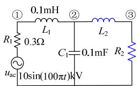  
(a)交流测试电路

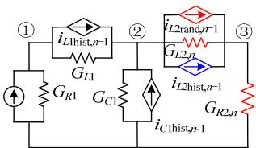  
(b)交流测试电路动态伴随电路

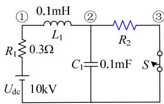  
(c)直流测试电路

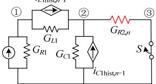  
(d)直流测试电路动态伴随电路   
图4 简单测试电路及其动态伴随电路  
Fig. 4 Small test circuits and their dynamic companion circuit

表 3 O-U 过程基本参数  
Table 3 Basic parameters of O-U process   

<table><tr><td>元件</td><td>初始值</td><td>回归速度θ</td><td>均值μ</td><td>方差σ</td><td>期望分布</td></tr><tr><td>R2/Ω</td><td>2</td><td>6</td><td>-0.5</td><td>1</td><td>N(1.5,1/12)</td></tr><tr><td>L2/mH</td><td>1</td><td>6</td><td>0.5</td><td>1</td><td>N(1.5,1/12)</td></tr></table>

图 5 展示了采用梯形 Milstein 格式对参数迁移电感 $L _ { 2 }$ 和电阻 $R _ { 2 }$ 的多轨迹仿真结果，其中模拟样本容量 200 次，蓝色为某单次随机轨迹，随机增量离散步长设为 1ms。可见，随着仿真时间的持续，参数分布区间趋于稳定。对应 $L _ { 2 }$ 和 $R _ { 2 }$ 的参数随机迁移过程，图 $6 ( \mathrm { a } )$ 给出了交流测试电路采用 S-EMTP仿真的节点3 电压轨迹，而图6(b)则比较了S-EMTP与确定性仿真 EMTP(采用初始值)的 $L _ { 2 }$ 电流轨迹。考虑到配图大小限制，仿真步长设为 0.1ms，轨迹展示数选为 40。

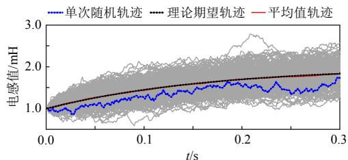

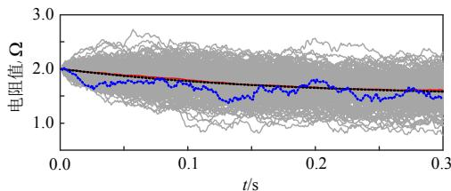  
(a) L2 O-U过程  
(b) R2 O-U过程  
图 5 参数迁移电阻和电感 O-U 过程模拟结果  
Fig. 5 Simulation results of parameter migration resistance and inductance following O-U process

由图 6 可见，与 EMTP确定性仿真结果相比，所提随机电磁暂态仿真算法及其S-EMTP程序能在单次仿真中连续模拟 $L _ { 2 }$ 和 $R _ { 2 }$ 参数迁移引起的电路电压电流变化情况：1）可描述参数迁移电感的能量特性，反映在电压电流波形上即为周期(或频率)的连续动态变化；2）波形分布范围随仿真时间增加而趋于平稳，与图 5 所示 $L _ { 2 }$ 和 $R _ { 2 }$ 参数的时序分布特征相一致。

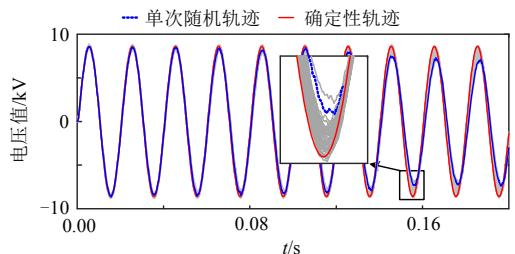

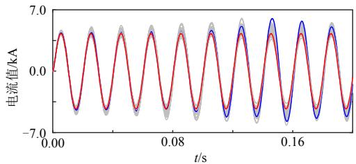  
(a) 节点3电压轨迹   
(b) L2电流轨迹   
图 6 交流测试电路 S-EMTP 与 EMTP 仿真轨迹  
Fig. 6 Multiple trajectories of C test circuit by S-EMTP and EMTP

为说明所提算法及 S-EMTP程序的精度特性，以 $L _ { 2 }$ 和 $R _ { 2 }$ 零均值 O-U 过程为测试对象，S-EMTP多轨迹均值结果与 EMTP 确定性仿真轨迹高度吻合，说明了 S-EMTP的准确性，具体可参见附录 C。

对于直流测试电路，考虑到 0.09s 开关动作后电压电流存在暂态过程，仿真步长采用 $1 0 \mu \mathrm { s }$ 。图 7

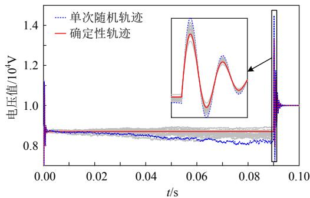  
图 7 直流测试电路 S-EMTP 与 EMTP 仿真轨迹  
Fig. 7 Multiple trajectories of DC test circuit by S-EMTP and EMTP simulation

对比了 20 次 S-EMTP 仿真的节点 2 电压随机轨迹与 EMTP的确定性仿真结果，S-EMTP均表现出较好的数值稳定性。 $R _ { 2 }$ 参数随机迁移会改变开关动作前的初始运行点，从而造成暂态过程峰值的差异。对于复杂电路而言，产生不同暂态过程的参数组合可能很多，而随机电磁暂态仿真及 S-EMTP为不同暂态过程的模拟提供了直接的途径。

为展示S-EMTP仿真中参数随机迁移对状态量分布的影响，对 $L _ { 2 }$ 和 $R _ { 2 }$ 进行3000次O-U过程模拟，离散和仿真步长均设为 10s。0.05s 时刻参数迁移元件与交、直流电路节点 2 电压的概率分布结果如图 8 所示。 $L _ { 2 }$ 和 $R _ { 2 }$ 呈现显著的正态分布，满足 O-U随机过程的基本特征，而节点电压受参数有向随机迁移的影响，其分布存在明显的负偏态(偏度0)。电压状态量极值点的存在佐证了随机电磁暂态仿真的必要性，而各时刻同一状态量相似的分布特征(0.1s 时刻的概率统计结果见附录 C)又说明了

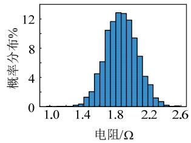  
(a)参数迁移电阻R2

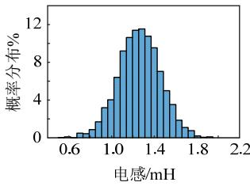  
(b)参数迁移电感L

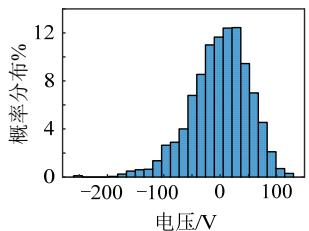  
(c)交流电路节点2

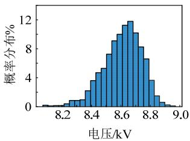  
(d)直流电路节点2   
图 8 交直流测试电路 S-EMTP 仿真元件参数与节点电压概率分布(t0.05s)  
Fig. 8 Probability distribution of element parameter and node voltage by S-EMTP simulation in AC and DC circuits (t0.05s)

S-EMTP的数值稳定性。

设置仿真总时长 0.2s，仿真次数 100，S-EMTP与 EMTP平均单次仿真耗时对比如表 4 所示，其中效率比以 EMTP仿真用时为基准。由于 S-EMTP存在元件参数更新、导纳矩阵修正等额外操作环节，总体耗时要高于 EMTP。以交流测试电路为例，其比直流测试电路多一个参数迁移的电感支路，所需要额外的计算资源也会增加，但总体耗时控制在 1.5 倍量级左右。

表 4 S-EMTP 与 EMTP 仿真效率对比  
Table 4 Efficiency comparison between S-EMTP and EMTP   

<table><tr><td>场景</td><td>EMTP/s</td><td>S-EMTP/s</td><td>效率比</td></tr><tr><td>交流电路</td><td>1.571</td><td>2.474</td><td>1.575</td></tr><tr><td>直流电路</td><td>1.546</td><td>2.189</td><td>1.416</td></tr></table>

# 4.2 算例 2-电压源型变换器

考虑交直流耦合的电力电子系统，以图 9(a)所示三相两电平电压源型变换器(voltage source converter，VSC)电路进行随机电磁暂态仿真算法的性能测试。不关注变换器桥臂内部续流过程，采用拓扑建模法中的 $R _ { \mathrm { o n } } / R _ { \mathrm { o f f } }$ 模型对其 6个开关元件进行建模，VSC整体动态伴随电路如图 9(b)所示，交流侧为内阻0.3的10kV三相工频电压源，其他参数如表5所示。

为直接比较 VSC 电路 S-EMTP 与 EMTP 仿真的差异性，对其采用开环控制，其中 PWM 调制比0.95，调制波初始相位 $0 ^ { \circ }$ ，载波频率 2000Hz，0.15s时负荷开关断开，仿真步长为 $1 0 \mu \mathrm { s } .$ 。对比 VSC 电路 EMTP 确定性仿真轨迹，图 10 展示了分别考虑

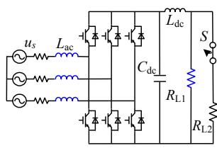  
(a) VSC电路

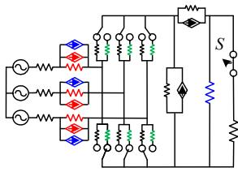  
(b) VSC动态伴随电路  
图 9 三相两电平 VSC 电路及其动态伴随电路  
Fig. 9 Three phase two-level VSC system and its dynamic adjoint circuit

表 5 VSC 电路基本参数  
Table 5 Basic parameters of VSC test system   

<table><tr><td colspan="2">确定性元件</td><td colspan="2">参数迁移元件 Lac</td><td colspan="2">参数迁移元件 RL1</td></tr><tr><td>Ldc</td><td>0.01mH</td><td>L0</td><td>1mH</td><td>R0</td><td>8Ω</td></tr><tr><td>Cdc</td><td>2mF</td><td>θL</td><td>10</td><td>θR</td><td>6</td></tr><tr><td>RL2</td><td>8Ω</td><td>μL</td><td>0</td><td>μR</td><td>-1</td></tr><tr><td>Ron/Off</td><td>0.1/1000Ω</td><td>σL</td><td>0.5</td><td>σR</td><td>1.5</td></tr></table>

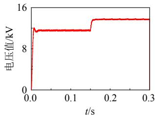  
(a) 确定性轨迹(R0&L0)

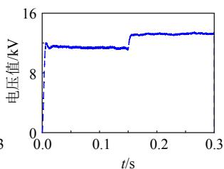  
(b) 单次随机轨迹(仅RL1)

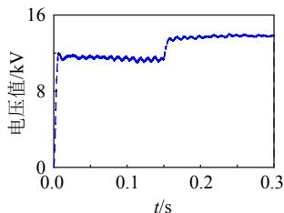  
(c) 单次随机轨迹(仅Lac)

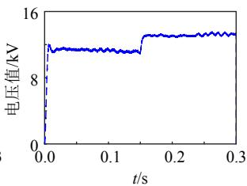  
(d) 单次随机轨迹(RL1&Lac)   
图 10 VSC 电路 S-EMTP 与 EMTP 仿真电容电压单次轨迹  
Fig. 10 Trajectories of capacitor voltage by S-EMTP and EMTP simulation in VSC circuit

$R _ { \mathrm { { L 1 } } }$ 和 $L _ { \mathrm { a c } }$ 参数随机迁移及其共同作用下的电容电压轨迹。在无参数随机迁移情况下，直流侧电容电压纹波主要与变换器桥臂开关动作有关；当引入 $R _ { \mathrm { { L 1 } } }$ 有向随机迁移后，电压波形发生偏移，而在交流侧引入参数迁移电感 $L _ { \mathrm { a c } }$ 后，其零均值 O-U 过程使得电容电压产生较大的连续波动。

图11进一步给出了40次S-EMTP仿真的电容电压和交流侧电感电流多轨迹结果(仿真步长30s)，在参数随机迁移条件下，电容电压和电感峰值电流稳态分布区间可分别达到 1.4kV 和 1.2kA。可以看出，基于 SDE 的随机电磁暂态仿真可以在单次仿真中连续模拟多个元件的参数随机扰动过程，能有效增加极端工况数量，更加真实地反映系统运行工况；同时，连续扰动过程的集中也为变换器控制和系统保护策略提供了更为严苛的验证环境，进而减少重复验证环节，这是现有确定性电磁暂态仿真所不具备的功能。

与图 8 的统计方式类似，图 12 为 0.05s时刻的

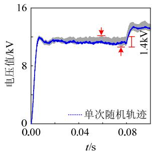  
(a) $C _ { \mathrm { d c } }$ 电容电压轨迹

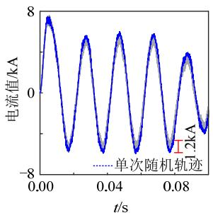  
(b)Lac电感电流轨迹   
图 11 VSC 电路 S-EMTP 仿真轨迹  
Fig. 11 Multiple trajectories of VSC circuit by S-EMTP simulation

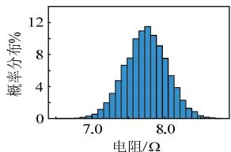

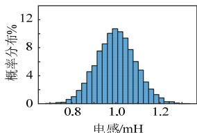

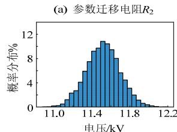  
(c）电容Cdc电压

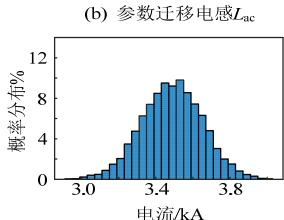  
(d)电感Lac电流   
图 12 VSC 电路 S-EMTP 仿真元件参数与状态量概率分布(t0.05s)

Fig. 12 Probability distribution of element parametersand states by S-EMTP simulation in VSC circuit (t0.05s)电容电压和交流侧电感电流的概率分布统计结果。对比图 8 可以发现，对于不同电路拓扑，参数随机迁移激发的系统动态过程具有不同的特征，即表现出状态量的不同分布，即使对于同一状态变量，在不同时刻也会呈现分布的差异。为进一步比较S-EMTP 与 EMTP 的效率差异，对 VSC 电路进行了 100 次连续仿真，其中仿真步长 $1 0 \mu \mathrm { s } .$ ，单次总时长0.3s，主要子过程调用次数和平均单次耗时如表6所示。由于所提随机电磁暂态仿真算法及 S-EMTP内核程序继承了 EMTP算法框架，因此可以完整覆盖 EMTP 并具备参数随机激励下系统随机动态过程的仿真功能。

由表 6 可见，S-EMTP 的计算耗时约是 EMTP

表 6 S-EMTP 与 EMTP 仿真耗时对比  
Table 6 Comparison of time cost between S-EMTP and EMTP   

<table><tr><td rowspan="2">主要子过程</td><td colspan="2">S-EMTP</td><td colspan="2">EMTP</td></tr><tr><td>调用次数</td><td>耗时/s</td><td>调用次数</td><td>耗时/s</td></tr><tr><td>1. SEMTP_Init</td><td>1</td><td>0.010</td><td>1</td><td>0.009</td></tr><tr><td>2. Ctrl_Sign_Gen</td><td>29999</td><td>0.479</td><td>29999</td><td>0.478</td></tr><tr><td>3. Switch_Check</td><td>29999</td><td>0.611</td><td>29999</td><td>0.608</td></tr><tr><td>4. I_Inject_Cal</td><td>29999</td><td>1.160</td><td>29999</td><td>1.062</td></tr><tr><td>5. Parm_Update_T</td><td>26487</td><td>0.755</td><td>0</td><td>0</td></tr><tr><td>6. Gmatrix_Update_T</td><td>26487</td><td>0.868</td><td>0</td><td>0</td></tr><tr><td>7. Ihistrand_Update_T</td><td>26487</td><td>0.910</td><td>26487</td><td>0.663</td></tr><tr><td>8. IV_Update_T</td><td>26487</td><td>1.042</td><td>26487</td><td>1.005</td></tr><tr><td>9. Gmatrix_Reform</td><td>3512</td><td>0.128</td><td>3512</td><td>0.125</td></tr><tr><td>10. Parm_Update_E</td><td>3512</td><td>0.111</td><td>0</td><td>0</td></tr><tr><td>11. Gmatrix_Update_E</td><td>3512</td><td>0.126</td><td>0</td><td>0</td></tr><tr><td>12. Ihistrand_Update_E</td><td>3512</td><td>0.126</td><td>3512</td><td>0.101</td></tr><tr><td>13. IV_Update_E</td><td>3512</td><td>0.154</td><td>3512</td><td>0.149</td></tr><tr><td>总耗时/s</td><td colspan="2">7.214</td><td colspan="2">4.772</td></tr></table>

的 1.5 倍，其差异主要体现在随机迁移元件参数更新、导纳矩阵修正和随机/历史电流项计算等 3 个方面，尤以前 2 个方面最为突出。随机迁移元件参数更新部分于可独立于迭代主体过程，从可利用多核处理器并行计算提高计算效率；对于导纳矩阵修正部分，可通过优化节点编码、稀疏存储等措施来降低该部分操作对计算资源的消耗。总体而言，S-EMTP能具有与 EMTP相近的效率量级。

# 5 结论

为实现参数随机迁移条件下电力电子化系统的电磁暂态仿真，基于随机微分方程理论，本文建立了适用于电磁暂态仿真的参数迁移元件动态伴随电路模型，并结合模型的数值稳定性特征的解析分析，提出了随机电磁暂态仿真通用数值算法，通过 RLC 简单电路和三相两电平 VSC 电路验证所提模型和算法的有效性，并得到结论如下：

1）所建立的动态伴随电路模型可描述电感或电容引入参数迁移后的能量特性，而所提随机电磁暂态仿真算法能在单次仿真中准确描述参数随机迁移连续激发的系统随机动态过程，参数零均值O-U过程下的均值轨迹与EMTP确定性仿真相一致。  
2）随机电磁暂态仿真算法能直接兼容 EMTP算法框架，具有 EMTP相近的效率量级，通过优化节点编码、稀疏存储等措施可进一步降低与 EMTP的效率差异。参数随机迁移元件动态伴随电路模型与确定性元件伴随电路结构相似，且在时序仿真中的执行方式一致，因此从原理上可通过自定义元件的方式在 PSCAD/EMTDC、RTDS 等 EMTP 类商用软件平台中实现，从而构成随机电磁暂态仿真。  
3）随机电磁暂态仿真可以更加集中和真实地反映内、外随机激励引起的系统复杂运行工况，为电力电子变换器控制和系统保护策略提供更为严苛的验证环境。对于复杂电力电子化系统自然换向和强制换向元件导致的多重开关问题，如何有效配置线性插值等重新初始化措施，是随机电磁暂态仿真算法尚需进一步开展的研究内容。

# 参考文献

[1] 肖湘宁．新一代电网中多源多变换复杂交直流系统的基础问题[J]．电工技术学报，2015，30(15)：1-14  
XIAO Xiangning．Basic problems of the new complex AC-DC power grid with multiple energy resources and multiple conversions[J] ． Transactions of China Electrotechnical Society，2015，30(15)：1-14(in Chinese)

[2] 董毅峰，王彦良，韩佶，等．电力系统高效电磁暂态仿真技术综述[J]．中国电机工程学报，2018，38(8)：2213-2231  
DONG Yifeng，WANG Yanliang，HAN Ji，et al．Review of high efficiency digital electromagnetic transient simulation technology in power system[J]．Proceedings of the CSEE，2018，38(8)：2213-2231(in Chinese)   
[3] 许寅，陈颖，陈来军，等．基于平均化理论的PWM变流器电磁暂态快速仿真方法：(一)PWM 变流器分段平均模型的建立[J]．电力系统自动化，2013，37(11)：58-64XU Yin ， CHEN Ying ， CHEN Laijun ， et al ． Fastelectromagnetic transient simulation method for PWMconverters based on averaging theory Part Oneestablishment of piecewise averaged model for PWMconverters[J]．Automation of Electric Power Systems，2013，37(11)：58-64(in Chinese)  
[4] ZHANG Yi，GOLE A M，WU Wenchuan，et al Development and analysis of applicability of a hybrid transient simulation platform combining TSA and EMT elements[J]．IEEE Transactions on Power Systems，2013， 28(1)：357-366   
[5] DOMMEL H W ． Digital computer solution of electromagnetic transients in single-and multiphase networks[J]．IEEE Transactions on Power Apparatus and Systems，1969，PAS-88(4)：388-399   
[6] 王成山，李鹏，黄碧斌，等．一种计及多重开关的电力电子时域仿真插值算法[J]．电工技术学报，2010，25(6)：83-88  
WANG Chengshan，LI Peng，HUANG Bibin，et al．An interpolation algorithm for time-domain simulation of power electronics circuit considering multiple switching events[J]．Transactions of China Electrotechnical Society， 2010，25(6)：83-88(in Chinese)   
[7] 陈鹏伟，陶顺，肖湘宁，等．配电网电压不确定水平区间分析模型[J]．中国电机工程学报，2018，38(4)：1035-1044  
CHEN Pengwei，TAO Shun，XIAO Xiangning，et alAn interval model to analyze the voltage levels ofuncertainty in distribution network[J]．Proceedings of theCSEE，2018，38(4)：1035-1044(in Chinese)  
[8] YUAN Bo，ZHOU Ming，LI Gengyin，et al．Stochastic small-signal stability of power systems with wind power generation[J]．IEEE Transactions on Power Systems， 2015，30(4)：1680-1689   
[9] 陈晓爽，林今，刘锋，等．新能源发电的伊藤随机过程模型[J]．中国电机工程学报，2020，40(1)：83-95  
CHEN Xiaoshuang，LIN Jin，LIU Feng，et al．Itôstochastic process model for renewable generations[J]Proceedings of the CSEE，2020，40(1)：83-95(in Chinese)  
[10] 张建勇，鞠平，余一平，等．电力系统在高斯随机小激励下的响应及稳定性[J]．中国科学 技术科学，2012，42(7)：851-857  
ZHANG Jianyong，JU Ping，YU Yiping，et al．Responses and stability of power system under small Gauss type random excitation[J] ． Science China Technological

Sciences，2012，55：1873-1880  
[11] ARNOLD L．Stochastic differential equations：theory and applications[M]．New York：John Wiley & Sons，1973．   
[12] DONG Zhaoyang，ZHAO Junhua，HILL D J．Numerical simulation for stochastic transient stability assessment[J] IEEE transactions on Power Systems，2012，27(4)： 1741-1749   
[13] MILANO F，ZÁRATE-MIÑANO R．A systematic method to model power systems as stochastic differential algebraic equations[J]．IEEE Transactions on Power Systems，2013， 28(4)：4537-4544   
[14] 刘咏飞，鞠平，薛禹胜，等．随机激励下电力系统特性的计算分析[J]．电力系统自动化，2014，38(9)：137-142LIU Yongfei，JU Ping，XUE Yusheng，et al．Calculationanalysis on power system characteristics under randomexcitation[J]．Automation of Electric Power Systems，2014，38(9)：137-142(in Chinese)  
[15] 赵金利，范朕宁，李鹏，等．基于 SUNDIALS 的有源配电网随机动态仿真方法[J]．电力系统自动化，2017，41(6)：51-58  
ZHAO Jinli，FAN Zhenning，LI Peng，et al．SUNDIALS based stochastic dynamic simulation method of active distribution networks[J]．Automation of Electric Power Systems，2017，41(6)：51-58(in Chinese)   
[16] 王成山，原凯，李鹏，等．一种适于有源配电网随机动态仿真的滚动投影积分方法[J]．中国电机工程学报，2017，37(4)：1096-1105  
WANG Chengshan，YUAN Kai，LI Peng，et al．A rolling projective integration method for stochastic dynamic simulation of active distribution networks[J]．Proceedings of the CSEE，2017，37(4)：1096-1105(in Chinese)   
[17] HIGHAM D J．An algorithmic introduction to numerical simulation of stochastic differential equations[J]．SIAM Review，2001，43(3)：525-546   
[18] KLOEDEN P E，PLATEN E．Numerical solution of stochastic differential equations[M]．Berlin，Heidelberg： Springer，1992   
[19] LIN Jiming，MARTI J R．Implementation of the CDA procedure in the EMTP[J]．IEEE Transactions on Power Systems，1990，5(2)：394-402   
[20] DE KELPER B，DESSAINT L A，AL-HADDAD K，et al A comprehensive approach to fixed-step simulation of switched circuits[J] ． IEEE Transactions on Power Electronics，2002，17(2)：216-224   
[21] ZOU Ming，MAHSEREDJIAN J，JOOS G，et al Interpolation and reinitialization in time-domain simulation of power electronic circuits[J]．Electric Power Systems Research，2006，76(8)：688-694   
[22] 姬伟江，汪可友，李国杰，等．计及多重开关的电力电子实时仿真算法及其基于 PXI 平台的实现[J]．电网技术，2017，41(2)：588-595  
JI Weijiang，WANG Keyou，LI Guojie，et al．A real-time simulation algorithm for power electronics circuit considering multiple switching events and its implementation on PXI platform[J] ． Power System

Technology，2017，41(2)：588-595(in Chinese)  
[23] 连攀杰，刘文焯，汤涌，等．模块化多电平换流器的高效电磁暂态仿真方法研究[J]．中国电机工程学报，2020，40(24)：7980-7989  
LIAN Panjie，LIU Wenzhuo，TANG Yong，et al．Research on efficient electromagnetic transient simulation method of modular multilevel converter[J]．Proceedings of the CSEE，2020，40(24)：7980-7989(in Chinese)

# 附录 A 梯形 Milstein 格式离散

# 1）参数迁移电感。

对 $\mathrm { d } L ( t ) = \alpha ( L ( t ) ) \mathrm { d } t + \beta ( L ( t ) ) \mathrm { d } W ( t )$ 采用梯形 Milstein 格式离散，可得：

$$
L _ {n} = L _ {n - 1} + \frac {\alpha \left(L _ {n - 1}\right) + \alpha \left(\tilde {L} _ {n}\right)}{2} \Delta t + D \left(L _ {n - 1}\right) \tag {A1}
$$

将式(A1)引入式(15)离散化，则：

$$
\begin{array}{l} i _ {L, n} = i _ {L, n - 1} + \frac {\Delta t}{2 L _ {n}} \left(v _ {i, n} - v _ {j, n} - i _ {L, n} \alpha \left(\tilde {L} _ {n}\right)\right) + \\ \frac {\Delta t}{2 L _ {n - 1}} \left(v _ {i, n - 1} - v _ {j, n - 1} - i _ {L, n - 1} \alpha \left(L _ {n - 1}\right)\right) - \frac {i _ {L , n - 1}}{L _ {n - 1}} D \left(L _ {n - 1}\right) \tag {A2} \\ \end{array}
$$

将式(A2)改写为节点方程的形式：

$$
\begin{array}{l} i _ {L, n} = \frac {\Delta t}{2 L _ {n} + \alpha (\tilde {L} _ {n}) \Delta t} \left(v _ {i, n} - v _ {j, n}\right) + \frac {2 L _ {n}}{2 L _ {n} + \alpha (\tilde {L} _ {n}) \Delta t} \\ \left(i _ {L, n - 1} + \frac {\Delta t}{2 L _ {n - 1}} \left(v _ {i, n - 1} - v _ {j, n - 1} - i _ {L, n - 1} \alpha \left(L _ {n - 1}\right)\right)\right) - \\ \frac {2 L _ {n} i _ {L , n - 1}}{\left(2 L _ {n} + \alpha \left(\tilde {L} _ {n}\right) \Delta t\right) L _ {n - 1}} D \left(L _ {n - 1}\right) \tag {A3} \\ \end{array}
$$

若令 $K _ { \mathrm { T } , n } = 2 L _ { n } / ( 2 L _ { n } + \alpha ( \tilde { L } _ { n } ) \Delta t )$ ，则可构成式(20)所示等效电路。

2）参数迁移电容。

对 $\mathrm { d } C ( t ) = \alpha ( C ( t ) ) \mathrm { d } t + \beta ( C ( t ) ) \mathrm { d } W ( t )$ 采用梯形 Milstein格式离散，可得：

$$
C _ {n} = C _ {n - 1} + \frac {\alpha \left(C _ {n - 1}\right) + \alpha \left(\tilde {C} _ {n}\right)}{2} \Delta t + D \left(C _ {n - 1}\right) \tag {A4}
$$

将式(A4)引入式(22)离散化，则：

$$
\begin{array}{l} v _ {C, n} = v _ {C, n - 1} + \frac {\Delta t}{2} \left(\frac {i _ {C , n}}{C _ {n}} - \frac {v _ {C , n}}{C _ {n}} \alpha (\tilde {C} _ {n}) + \right. \\ \frac {i _ {C , n - 1}}{C _ {n - 1}} - \frac {v _ {C , n - 1}}{C _ {n - 1}} \alpha \left(C _ {n - 1}\right)) - \frac {v _ {C , n - 1}}{C _ {n - 1}} D \left(C _ {n - 1}\right) \tag {A5} \\ \end{array}
$$

将式(A5)改写为节点方程的形式：

$$
\begin{array}{l} i _ {C, n} = \left(\frac {2 C _ {n}}{\Delta t} + \alpha \left(\tilde {C} _ {n}\right)\right) v _ {C, n} - \left(\frac {2 C _ {n}}{\Delta t} - \frac {C _ {n} \alpha \left(C _ {n - 1}\right)}{C _ {n - 1}}\right) \\ v _ {C, n - 1} - \frac {C _ {n}}{C _ {n - 1}} i _ {C, n - 1} + \frac {2 C _ {n}}{C _ {n - 1} \Delta t} D \left(C _ {n - 1}\right) v _ {C, n - 1} \\ \end{array}
$$

# 附录B 阻感支路后向Milstein格式求解稳定性条件

对于 $L _ { n } + R \Delta t + \alpha ( \tilde { L } _ { n } ) \Delta t > 0$ ，展开可得：

$$
L _ {n - 1} + \alpha (\tilde {L} _ {n}) \Delta t + D (L _ {n - 1}) + R \Delta t + \alpha (\tilde {L} _ {n}) \Delta t > 0 \tag {B1}
$$

由 $D ( L _ { n - 1 } ) = \beta ( L _ { n - 1 } ) \Delta W _ { n - 1 } + 0 . 5 \beta ( L _ { n - 1 } ) \beta ^ { \prime } ( L _ { n - 1 } ) ( \Delta W _ { n - 1 } ^ { 2 } - \Delta t )$ 和式(34)，易得  $( D ( L _ { n - 1 } ) ) = 0$ ，从而对式(B1)求期望值可得：

$$
\alpha \left(\tilde {L} _ {n}\right) > - \frac {L _ {n - 1}}{2 \Delta t} - \frac {R}{2} \tag {B2}
$$

对于 $L _ { n } D ( L _ { n - 1 } ) + L _ { n - 1 } ( R + \alpha ( \tilde { L } _ { n } ) ) \Delta t > 0$ ，展开可得：

$$
\left(L _ {n - 1} + \alpha \left(\tilde {L} _ {n}\right) \Delta t\right) D \left(L _ {n - 1}\right) + D ^ {2} \left(L _ {n - 1}\right) + L _ {n - 1} R \Delta t + L _ {n - 1} \alpha \left(\tilde {L} _ {n}\right) \Delta t > 0 \tag {B3}
$$

式中：

$$
\begin{array}{l} D ^ {2} \left(L _ {n - 1}\right) = \beta^ {2} \left(L _ {n - 1}\right) \left(\Delta W _ {n - 1} ^ {2} + \frac {\beta^ {\prime} \left(L _ {n - 1}\right)}{2} \Delta W _ {n - 1} \left(\Delta W _ {n - 1} ^ {2} - \Delta t\right)\right) + \\ \frac {\beta^ {2} \left(L _ {n - 1}\right) \beta^ {2} ^ {2} \left(L _ {n - 1}\right)}{4} \left(\Delta W _ {n - 1} ^ {4} - 2 \Delta t \Delta W _ {n - 1} ^ {2} + \Delta t ^ {2}\right) \tag {B4} \\ \end{array}
$$

从而：

$$
\mathbb {E} \left(D ^ {2} \left(L _ {n - 1}\right)\right) = \beta^ {2} \left(L _ {n - 1}\right) \Delta t + \frac {\beta^ {2} \left(L _ {n - 1}\right) \beta^ {\prime 2} \left(L _ {n - 1}\right)}{2} \Delta t ^ {2} \tag {B5}
$$

相较上一时刻，由于 $L _ { n - }$ 1 已知，则求期望值后式(B3)可简化为

$$
\alpha \left(\tilde {L} _ {n}\right) > - \frac {\beta^ {2} \left(L _ {n - 1}\right) + 0 . 5 \beta^ {2} \left(L _ {n - 1}\right) \beta^ {\prime 2} \left(L _ {n - 1}\right) \Delta t}{L _ {n - 1}} - R \tag {B6}
$$

类似地，对于 $2 L _ { n } L _ { n - 1 } + L _ { n - 1 } ( R + \alpha ( \tilde { L } _ { n } ) ) \Delta t > L _ { n } D ( L _ { n - 1 } )$ ，消去 $L _ { n }$ 后求期望值可得：

$$
2 \left(L _ {n - 1} + \alpha \left(\tilde {L} _ {n}\right) \Delta t\right) L _ {n - 1} + L _ {n - 1} \left(R + \alpha \left(\tilde {L} _ {n}\right)\right) \Delta t > \mathbb {E} \left(D ^ {2} \left(L _ {n - 1}\right)\right) \tag {B7}
$$

从而：

$$
\alpha \left(\tilde {L} _ {n}\right) > - \frac {2 L _ {n - 1}}{3 \Delta t} - \frac {R}{3} + \frac {\mathbb {E} \left(D ^ {2} \left(L _ {n - 1}\right)\right)}{3 L _ {n - 1} \Delta t} \tag {B8}
$$

# 附录C RLC 简单电路其他测试结果

设定 L2和 R2的参数随机迁移过程为零均值 O-U 过程，即表2中 O-U 过程均值参数为0。对图4(a)所示交流测试电路进行 40 次 S-EMTP 仿真，多轨迹结果与各时刻轨迹均值分别如图 C1 与 C2 所示，其中图 C1 为节点 2 电压，图 C2为参数迁移电感 $L _ { 2 }$ 电流。对于 $L _ { 2 }$ 和 $R _ { 2 }$ 零均值 O-U 过程，其参数会围绕初值连续波动，与初值之对应，在稳态情况下电路状态量也会分布在基准值周围。

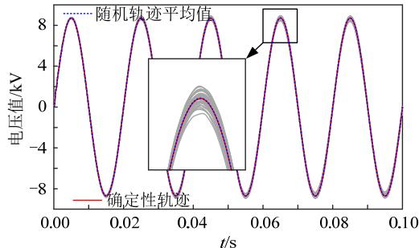  
图 C1 交流测试电路 S-EMTP 仿真电压多轨迹均值结果

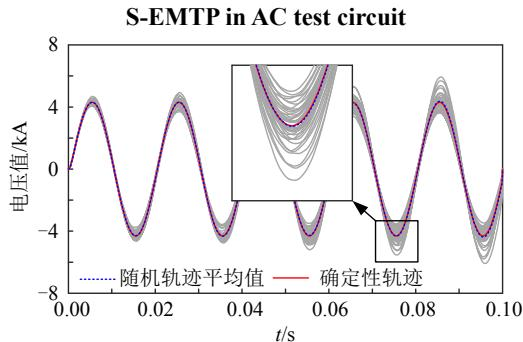  
Fig. C1 Mean result of multiple voltage trajectories by   
图C2 交流测试电路S-EMTP 仿真电流多轨迹均值结果   
Fig. C2 Mean result of multiple current trajectories by S-EMTP in AC test circuit

表 C1 给出了 2000 次仿真多轨迹均值与确定性仿真轨迹的误差绝对值 $\mathrm { E r r o r } = \overline { { f } } _ { \mathrm { S - E M T P } } ( t ) - f _ { \mathrm { E M T P } } ( t ) |$ ，相对误差以确定性仿真电压、电流峰值为基准。在有限次蒙特卡罗仿真下，S-EMTP多轨迹均值与EMTP 确定性仿真轨迹高度吻合，说明了所提算法的精度。

表 C1 S-EMTP 精度特性(L2与 R2 均零均值 O-U 过程)  
Table C1 Precision characteristics of S-EMTP (Zero mean O-U process of $\mathbf { { \mathit { L } } } _ { 2 }$ and R2)   

<table><tr><td></td><td>仿真时刻/s</td><td>0.01</td><td>0.05</td><td>0.10</td><td>0.15</td><td>0.20</td><td>0.25</td></tr><tr><td rowspan="2">节点2电压</td><td>误差绝对值/V</td><td>0.143</td><td>1.266</td><td>1.6291</td><td>1.399</td><td>1.253</td><td>1.826</td></tr><tr><td>相对误差(10-4)</td><td>0.16</td><td>1.45</td><td>1.87</td><td>1.60</td><td>1.44</td><td>2.10</td></tr><tr><td rowspan="2">电感L电流</td><td>误差绝对值/A</td><td>0.417</td><td>5.368</td><td>6.614</td><td>5.067</td><td>4.845</td><td>6.956</td></tr><tr><td>相对误差(10-3)</td><td>0.10</td><td>1.25</td><td>1.54</td><td>1.17</td><td>1.13</td><td>1.62</td></tr></table>

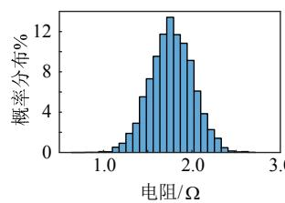

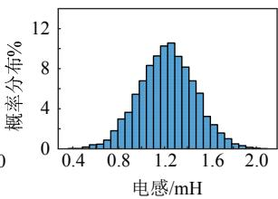

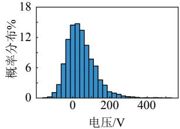  
(a) 参数迁移电阻R2  
(c) 交流电路节点2

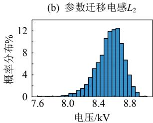  
(d) 直流电路节点2   
图 C3 交直流测试电路 S-EMTP 仿真元件参数与节点电压概率分布(t0.1s)

  
Fig. C3 Probability distribution of   
element parameter and node voltage by S-EMTP   
simulation in AC and DC circuits (t0.1s)   
陈鹏伟

在线出版日期：2020-12-16。

收稿日期：2020-08-13。

作者简介：

陈鹏伟(1992)，男，博士，讲师，硕士生导师，研究方向为直流配电系统不确定性建模、分析与优化控制，chenpw2014@163.com；

刘奕泽(1997)，男，硕士研究生，研究方向为直流配电系统电磁暂态仿真；

阮新波(1970), 男，博士，教授，博士生导师，研究方向为变换器建模、电力电子系统集成和新能源供电系统；

陈新(1973)，男，博士，教授，博士生导师，研究方向为新能源发电和微电网系统控制；

孙雅旻(1992)，男，硕士，助理工程师，研究方向为新能源仿真建模与控制。

(编辑 邱丽萍，张文鑫)

# Stochastic Electromagnetic Transient Simulation Algorithm Applied to Power Electronics Dominated Power System

CHEN Pengwei1 , LIU Yize1 , RUAN Xinbo1 , CHEN Xin1 , SUN Yamin2

(1. Nanjing University of Aeronautics and Astronautics; 2. State Grid Jibei Electric Power Research Institute)

KEY WORDS: stochastic differential equation; random excitation; stochastic electromagnetic transient simulation; EMTP framework

With the application of flexible DC system and the integration of renewable power generation, the power system gradually presents the trend that dominated by power electronics. Electromagnetic transient simulation possesses the ability to accurately describe the dynamic process, which has become one of the most important verification methods for the design and analysis of power electronics dominated power system. However, the random excitation from sources, network and loads is easy to excite the system dynamic process, which has become an important factor to challenge the safe and stable operation. The electromagnetic transient simulation is based on the deterministic model of differential equations, and thus it essentially does not have the ability to directly simulate the random excitations and their stimulated dynamics. In this case, multi-condition tests are necessary to enhance the completeness of the verification.

To realize high efficiency electromagnetic transient simulation of power electronics dominated power system under the disturbance of the parameter random migration, the power system dynamic model based on stochastic differential equation and its numerical solution algorithms are analyzed firstly in this paper. According to their basic characteristics and limitations, the dynamic companion circuit model considering the random excitation of parameter is established for the basic electrical components.

Fig. 1 compares the Norton equivalent circuit of inductance in the electromagnetic transients program (EMTP) and the proposed dynamic companion circuit model. The dynamic companion circuit of parameter migration inductance consists of equivalent admittance, random current source and historical current source, which need to be updated before each step of simulation. Based on the resistance-inductance series branch, the numerical stability characteristics of the dynamic companion circuit model are further derived, and thus

the main algorithm process of stochastic electromagnetic transient simulation is designed to meet the simulation requirement of power electronic dominated power system. Through the comparison with EMTP deterministic simulation and Monte Carlo multi-trajectory results, the case studies based on the simple RLC and voltage source converter test systems demonstrate the validity of the proposed dynamic companion circuit models and stochastic EMTP algorithm. In principle, the proposed algorithm can be directly compatible with EMTP algorithm framework. Fig. 2 compares the trajectories of S-EMTP and EMTP. The random excitations are concentrated in a simulation, which provides a harsh test environment for the control and protection of power electronic devices.

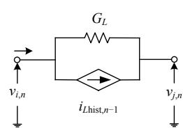  
(a) Deterministic inductance

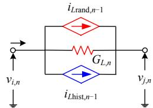  
(b) Parameter migration inductance

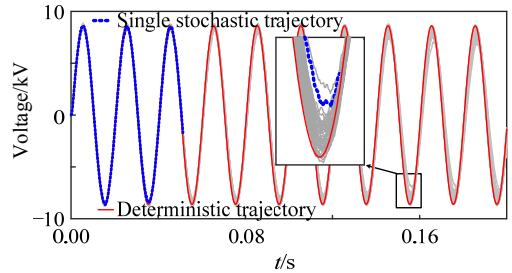  
Fig. 1 Norton equivalent circuit of inductance

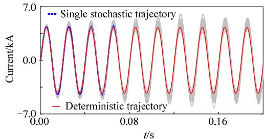  
(a) Voltage trajectory   
(b) Current trajectory   
Fig. 2 Multiple trajectories of RLC test circuit by S-EMTP and EMTP