# Splitting State-Space Method for Converter-Integrated Power Systems EMT Simulations

Xiaopeng Fu , Member, IEEE, Wei Wu , Member, IEEE, Peng Li , Senior Member, IEEE, Jean Mahseredjian , Life Fellow, IEEE, Jianzhong Wu , Fellow, IEEE, and Chengshan Wang , Senior Member, IEEE

Abstract—As the utilization of power electronic-based components in power systems continues to grow, a comprehensive understanding of their dynamics becomes increasingly important for system design, control and protection analysis. To meet practical needs, the high-fidelity but time-consuming electromagnetic transient (EMT) simulations are often required. To improve the performance of these simulations, a highly efficient splitting statespace method with numerical error control is proposed that reduces the computation workload. The method employs a generic decoupling principle to split the state-space equations of the converterintegrated power system and introduces the exponential splitting formulas of multiple orders accuracy to solve and then compose the splitting state-space equations. The decoupling principle is designed based on separation of time-varying portions of the state matrix, which is realized by locating the smallest subcircuit topology that is switch state-dependent, through automatic switch grouping and switch adjacent state variables (SASV) identification. A family of exponential splitting schemes is employed to accelerate the demanding matrix exponential calculation. The splitting state-space method undergoes comprehensive testing across various cases, including a distribution network with DC load, an LLC resonant converter, a large-scale wind farm, and an MMC circuit. The accuracy of the proposed method is thoroughly evaluated, and its efficiency is validated.

Index Terms—Electromagnetic transient, exponential integrator, power converter, splitting method.

Received 21 April 2024; revised 30 September 2024; accepted 16 November 2024. Date of publication 9 December 2024; date of current version 24 January 2025. This work was supported in part by the National Key R&D Program of China under Grant 2023YFC3807000, and in part by the National Natural Science Foundation of China under Grant 52377118. Paper no. TPWRD-00666- 2024. (Corresponding author: Wei Wu.)

Xiaopeng Fu, Peng Li, and Chengshan Wang are with the Key Laboratory of Smart Grid of Ministry of Education, Tianjin University, Tianjin 300072, China (e-mail: fuxiaopeng@tju.edu.cn; lip@tju.edu.cn; cswang@tju.edu.cn).

Wei Wu is with Beijing Huairou Laboratory, Beijing 102206, China (e-mail: wuwei1@bise.hrl.ac.cn).

Jean Mahseredjian is with the Department of Electrical Engineering, Polytechnique Montréal, Montréal, Québec H3T 1J4, Canada (e-mail: jeanm@polymtl.ca).

Jianzhong Wu is with the Institute of Energy, School of Engineering, Cardiff University, CF24 3AA Cardiff, U.K. (e-mail: wuj5@cardiff.ac.uk).

Color versions of one or more figures in this article are available at https://doi.org/10.1109/TPWRD.2024.3514294.

Digital Object Identifier 10.1109/TPWRD.2024.3514294

# I. INTRODUCTION

due to renewable generation penetration and hybrid ac/dc network interconnections, which lead to widespread utilization of power electronic-based converters [1]. This complexity has a profound impact on the system dynamic performance, and raises the need for accurate time-domain simulation of power system transients [2]. Electromagnetic transient (EMT) simulation programs, which adopt the detailed modeling approach, can provide high-fidelity simulation results at the circuit level. Previously, these programs were mainly used to track the fast EMT phenomenon that is naturally confined to local area, but growing demands from practical studies in longer timespan and larger scale were seen more recently. For example, diverse coupling forms among power electronic converters and traditional electrical equipment are observed to trigger wide-band oscillations [3]. Cross-region interactions are formed between energy plants and load center networks through long distance DC transmission systems [4]. These demands pose new challenges to EMT simulation programs. The ever-increasing advancement of high-switching-frequency (HSF) converters has notably resulted in semiconductor valve switching frequencies reaching hundreds of kilohertz [5], requiring small enough time-steps to capture the switching dynamics. This requirement also arises from the small-time constants associated with the component dynamics and device transients with nonlinear characteristics. The increasing number of converters in the power system and the stringent simulation requirements impose higher demands on the execution time and computing resources required for these simulations.

Various techniques aimed at improving the efficiency of detail-modeled power converter simulations have been developed in earlier studies. Circuit-based decoupling, as one common idea, has been adopted by methods like multirate analysis and parallel computations to accelerate the simulations [6], [7]. Circuit decoupling is conventionally achieved by transmission line propagation delay, while the compensation method can be used to decouple at arbitrary locations where line delays are not available [8]. The state-space nodal method (SSN) is also able to avoid line delay usage by interfacing nodal analysis equations with grouped state-space equations, where the grouping splits

switching events and reduces the computation burden related to varying topology matrix calculations [9]. A circuit partitioning method was presented in [10] that applied an explicit formula to selected energy storage elements for power electronic circuit division and used multirate methods to improve efficiency. In [11], a region folding method decoupled the identical structural power electronic blocks to pre-calculate their inverse matrices. Further investigations are needed for efficient decoupling methods that can be applied to generic power converter topologies.

One merit of the decoupling methods is that they alleviate the explosion of the involved switch on/off state combination numbers by appropriate switch separation into subsystems. Apart from this, constant admittance matrix or state matrix methods to approximate the switching state/model have also drawn attention. A buck converter was modeled using a piecewise-linear approximation in [12], which separated the nonlinear switch property into several subsections and obtained a constant admittance matrix. The associated discrete circuit models were developed to maintain constant admittance with different passive element representations during on/off states [13], and have been used for boost/buck inverters, three-level voltage source converter (VSC), etc., especially in real-time applications [14], [15]. The insulated gate bipolar transistor (IGBT) and its parallel diode were modeled as a voltage-current source pair in [16], and one time-step latency was introduced to achieve an invariant coefficient matrix. Various modeling techniques for modular multilevel converters (MMCs) are presented in [17].

In contrast to the circuit-based decoupling and constant matrix approaches, this paper proposes a splitting state-space method with numerical error control scheme. The foundation of the method is a decoupling principle applicable for general converter topology, which extracts the time-varying part of the state-space equations of the converter-integrated power systems and generalizes the matrix structure of this part, hence splitting the state-space equations. Consequently, the method mitigates the computational burden associated with switch operations. On this basis, the method employs the exponential splitting formulas to adaptively execute the numerical integration of time-varying and constant parts separately. Last but not least, the method provides flexible options for solutions of each accuracy order, and uses a numerical error control scheme to guide this setting, which helps in balancing the trade-off between simulation accuracy and efficiency, enhancing the overall performance.

The remainder of the paper is organized as follows. Section II introduces the splitting state-space method and its numerical error control scheme. Section III demonstrates the decoupling principle with typical converter topologies. Section IV presents several case studies to examine the performance of the proposed method. Conclusions are drawn in Section V.

# II. SPLITTING STATE-SPACE METHOD

The ordinary differential equations (ODEs) describing converter-integrated power systems are time-varying due to the switch operations, and the numerical integration of the ODEs can be computationally intensive. The splitting state-space method proposed in this section is aimed to address this challenge.

For the post-switching update of the state-space equations, this method first identifies the pattern of elements in the state matrix and splits the equations into time-varying and constant parts. Then, by incorporating the exponential splitting formulas of multiple orders accuracy, the solutions to the splitting state-space equations and their composition are derived to approximate the solution of the full state-space equations. The integration in each time-step is accordingly divided into several stages, and the computation of the exponential of the entire time-varying state matrix is avoided. The method also considers the accuracy loss induced by the splitting state-space method and provides error control scheme.

# A. Exponential Splitting Formulas

An N -dimensional linear system has the state-space form

$$
\dot {\boldsymbol {x}} = \boldsymbol {A} \boldsymbol {x} + \boldsymbol {B} \boldsymbol {u}, \quad \boldsymbol {x} (0) = \mathbf {x} _ {0}, \tag {1}
$$

where and denote the vector of state variables and input x uvariables,  and  are the state and input matrices that represent A Bthe coefficients of the system, and $\mathbf { x } _ { \mathrm { 0 } }$ is the initial value of . For easier presentation, a convenient technique from [18] is used to transform this non-autonomous system form into an augmented and autonomous form

$$
\dot {\tilde {x}} = \tilde {A} \tilde {x}, \tag {2}
$$

where the effect of the forcing term  is wrapped into the uaugmented state vector ˜, which contains the original  and xauxiliary state variables $\scriptstyle { \mathbf { - } } { \mathbf { } } \mathbf { - } { \mathbf { } } \mathbf { - } \mathbf { - } \mathbf { - } \mathbf { - } \mathbf { - } \mathbf { - } \mathbf { - } \mathbf { - } \mathbf { - } \mathbf { - } \mathbf { - } \mathbf { - } \mathbf { - } \mathbf { - } \mathbf { - } \mathbf { - } \mathbf { - } \mathbf { - } \mathbf { - } \mathbf { - } \mathbf { - } \mathbf { - } \mathbf { - } \mathbf { - } \mathbf { - } \mathbf { - } \mathbf { - } \mathbf { - } \mathbf { - } \mathbf { - } \mathbf { - } \mathbf { - } \mathbf { - } \mathbf { - } \mathbf { - } \mathbf { - } \mathbf { - } \mathbf { - } \mathbf { - } \mathbf { - } \mathbf { - } \mathbf { - } \mathbf { - } \mathbf { - } \mathbf { - } \mathbf { - } \mathbf { - } \mathbf { - } \mathbf { - } \mathbf { - } \mathbf { - } \mathbf { - } \mathbf { - } \mathbf { - } \mathbf { - } \mathbf { - } \mathbf { - }$ x. This technique can be exemxplified by transforming a simple system with constant input c, ˙ =  + c, by defining ˜ = $\mathrm { c } , { \dot { \pmb x } } = { \pmb A } { \pmb x } + { \pmb b } \mathrm { c } .$ $\tilde { A } = \left[ \begin{array} { l } { \pmb { A } \pmb { b } } \\ { 0 0 } \end{array} \right] , \tilde { \pmb { x } } = \left[ \begin{array} { l } { \pmb { x } } \\ { \pmb { x } _ { \mathrm { u } } } \end{array} \right]$ , and $\tilde { \boldsymbol { x } } \left( 0 \right) = \left[ \begin{array} { c } { \mathbf { x } _ { 0 } } \\ { \mathrm { c } } \end{array} \right]$ . The equivalence of (1) and (2) can be easily demonstrated and such a transformation is available for different input signal forms. The state transition rule for system (2) is explicitly expressed with the matrix $\tilde { A }$ exponential function as

$$
\tilde {\boldsymbol {x}} (t) = \mathrm {e} ^ {t \tilde {\boldsymbol {A}}} \tilde {\boldsymbol {x}} (0). \tag {3}
$$

In the following presentation, we use (3) as the fundamental equation describing the system dynamics, and the tilde superscript is dropped for concise notation. This formulation is general, as the forcing term is included in the auxiliary state variables.

Numerical integration with the exponential integrators [19] involves the computationally intensive matrix exponential function with a time complexity of $\mathrm { O } ( N ^ { 3 } )$ , which becomes the efficiency bottleneck in the converter-integrated power systems EMT simulations. The exponential splitting formulas can treat these matrix operations more easily [20]. The method consists of three steps, which are decoupling, integration and combination. In the first step, the system is decoupled and the state matrix is split into two matrices $\pmb { A } = \mathbf { A } _ { 1 } + \pmb { A } _ { 2 }$ . It is noted that A A Athis paper uses italic symbol to denote time-varying vectors and matrices, to better distinguish those data structs that vary with switch states from those that do not. Then, the exponential of is approximated with splitting formulas as product of matrix

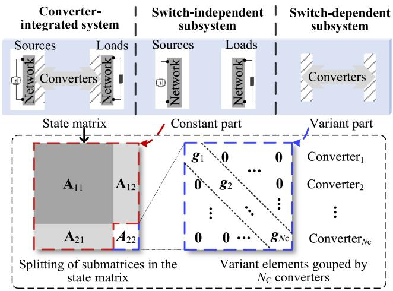  
Fig. 1. Splitting state matrix for the converter-integrated power systems.

exponentials formed by ${ \bf A } _ { 1 }$ and $A _ { 2 } .$ . Among them, the first-order accurate Trotter formula is [21]

$$
\mathbf {e} ^ {\mathrm {h} \left(\mathbf {A} _ {1} + \mathbf {A} _ {2}\right)} = \mathbf {e} ^ {\mathrm {h} \mathbf {A} _ {1}} \mathbf {e} ^ {\mathrm {h} \mathbf {A} _ {2}} + \mathrm {O} \left(\mathrm {h} ^ {2}\right), \tag {4}
$$

where h is integration time-step. The approximation error of (4) is second-order of h by comparing their Taylor expansions

$$
\begin{array}{l} \mathrm {e} ^ {\mathrm {h} \left(\mathbf {A} _ {1} + \mathbf {A} _ {2}\right)} - \mathrm {e} ^ {\mathrm {h} \mathbf {A} _ {1}} \mathrm {e} ^ {\mathrm {h} \mathbf {A} _ {2}} \\ = \left(\mathbf {I} + \mathrm {h} \left(\mathbf {A} _ {1} + \mathbf {A} _ {2}\right) + \mathrm {h} ^ {2} \left(\mathbf {A} _ {1} + \mathbf {A} _ {2}\right) ^ {2} / 2 + \mathrm {O} \left(\mathrm {h} ^ {3}\right)\right) \\ - \left(\mathbf {I} + \mathrm {h} \mathbf {A} _ {1} + \mathrm {h} ^ {2} \mathbf {A} _ {1} ^ {2} / 2 + \mathrm {O} \left(\mathrm {h} ^ {3}\right)\right) \\ \times \left(\mathbf {I} + \mathrm {h} \mathbf {A} _ {2} + \mathrm {h} ^ {2} \mathbf {A} _ {2} ^ {2} / 2 + \mathrm {O} \left(\mathrm {h} ^ {3}\right)\right) \\ = \mathrm {h} ^ {2} \left(\mathbf {A} _ {2} \mathbf {A} _ {1} - \mathbf {A} _ {1} \mathbf {A} _ {2}\right) / 2 + \mathrm {O} \left(\mathrm {h} ^ {3}\right). \tag {5} \\ \end{array}
$$

For higher-order approximations, a recursive way to construct exponential product formula is given in [22]. By symmetrizing (4) and eliminating even-order correction terms, the approximation is promoted to second-order accurate [23]

$$
\mathbf {e} ^ {\mathrm {h} \left(\mathbf {A} _ {1} + \mathbf {A} _ {2}\right)} = \mathbf {e} ^ {\frac {\mathrm {h}}{2} \mathbf {A} _ {2}} \mathbf {e} ^ {\mathrm {h A} _ {1}} \mathbf {e} ^ {\frac {\mathrm {h}}{2} \mathbf {A} _ {2}} + \mathrm {O} \left(\mathrm {h} ^ {3}\right). \tag {6}
$$

The splitting exponentials product is of a simpler type than its original counterpart, as the exponential of the constant part ${ \bf A } _ { 1 }$ is calculated only once, while the time-variant part $A _ { 2 }$ is sparser than the original state matrix, and its exponential can be calculated efficiently with sparse methods.

The state-space equation of a converter-integrated power system can be rewritten in the block matrix form

$$
\left[ \begin{array}{l} \dot {\boldsymbol {x}} _ {1} \\ \dot {\boldsymbol {x}} _ {2} \end{array} \right] = \left[ \begin{array}{l l} \mathbf {A} _ {1 1} & \mathbf {A} _ {1 2} \\ \mathbf {A} _ {2 1} & \mathbf {A} _ {2 2} \end{array} \right] \left[ \begin{array}{l} \boldsymbol {x} _ {1} \\ \boldsymbol {x} _ {2} \end{array} \right], \tag {7}
$$

where $\mathbf { x } _ { 2 }$ denotes the state variables of converter switch adjacent components, therefore, the state equations of $\mathbf { x } _ { 2 }$ contain switch state-dependent terms, and $\scriptstyle { \mathbf { \mathscr { x } } } _ { 1 }$ represents the other state xvariables. Since the topology of the switch-independent subcircuit remains constant, the submatrices $\mathbf { A } _ { 1 2 } , \mathbf { A } _ { 2 1 }$ and $\mathbf { A } _ { 1 1 }$ are constant. The submatrix $\pmb { A } _ { 2 2 }$ is time-variant and made up of $N _ { \mathrm { C } }$ Asubdivisions corresponding to $N _ { \mathrm { C } }$ converters, as shown in Fig. 1, the time-varying elements in $\pmb { A } _ { 2 2 }$ are located in the diagonal blocks $\mathbf { \nabla } _ { \mathbf { \beta } _ { \mathcal { I } } } \mathbf { \sigma } _ { \mathbf { \beta } _ { \mathcal { I } } }$ associated with the $i ^ { \mathrm { { t h } } }$ Aconverters. This is due

to converters are separated by components such as filters and lines, and there is no direct connection in between. Therefore, the time-varying elements can be managed for each individual converter. In addition, the structure helps to streamline the decoupling procedure.

The state matrix splitting of such system is detailed in Fig. 1. The state matrix  can be split into a constant splitting matrix $\mathbf { A } _ { 1 } .$ A, and a block-wise variant splitting matrix $A _ { 2 }$ that depends on the switch states  at time $t ,$ it is noted as $A _ { 2 } ( s ( t ) )$ in this s A ssubsection. Mapping the splitting of the state matrix to real circuits, integrations of subcircuits represented by ${ \bf A } _ { 1 }$ obtain the system transients without power conversion through converters, on the other hand, integrations of subcircuits represented by $A _ { 2 } ( s ( t ) )$ complement this part of power conversion. Using A sthe exponential splitting formulas, the exponential of ${ \bf A } _ { 1 }$ is determined in the beginning of the simulation and remains constant, while the exponential of the counterpart $A _ { 2 } ( s ( t ) )$ is A sapproximated in practical calculations once the switch states change, where the approximation is designed match the accuracy order of the exponential splitting formula. Given that the aim of the splitting state-space method is to reduce the computation effort, the Taylor series expansion is adopted in this paper to approximate the exponential of $A _ { 2 } ( s ( t ) )$ because it is efficient to implement.

With the approximation of the exponential product of splitting matrices, the proposed method splits the integration procedure into several sub-steps. Trotter Formula (4) splits each integration step into two sub-steps.

$$
\left\{ \begin{array}{l} \boldsymbol {x} _ {n} ^ {\prime} = \boldsymbol {f} _ {1} \left(\mathrm {h} \boldsymbol {A} _ {2} (\boldsymbol {s} (t _ {n}))) \boldsymbol {x} _ {n} \right. \\ \boldsymbol {x} _ {n + 1} = \mathrm {e} ^ {\mathrm {h} \boldsymbol {A} _ {1}} \boldsymbol {x} _ {n} ^ {\prime} \end{array} , \right. \tag {8}
$$

where $ { \boldsymbol { { x } } } _ { n } ^ { \prime }$ is the vector of intermediate state variables in $[ t _ { n } , t _ { n + 1 } ] ,$ and $f _ { k } ( \mathrm { h } A _ { 2 } ( s ( t _ { n } ) ) )$ denotes the summation of the first $k + 1$ f A sterms of a Taylor series of exponential function.

$$
\boldsymbol {f} _ {k} \left(\mathrm {h} \boldsymbol {A} _ {2} (\boldsymbol {s} (t _ {n}))\right) = \sum_ {i = 0} ^ {k} \frac {1}{i !} \left(\mathrm {h} \boldsymbol {A} _ {2} (\boldsymbol {s} (t _ {n}))\right) ^ {i}. \tag {9}
$$

Other schemes for splitting integration exist, $\mathrm { e . g . }$ , with the Trotter formula and the constant subsystem integrated first rather than its counterpart in (8). These two schemes have opposite second-order correction terms. Furthermore, using the higherorder accurate exponential splitting formula (6), the integration is split into three sub-steps shown in (10), in which the switchdependent subsystem is integrated in the first and third substeps for a halved time-step size, and the constant subsystem is integrated for a full time-step in between

$$
\left\{ \begin{array}{l} \boldsymbol {x} _ {n} ^ {\prime} = \boldsymbol {f} _ {2} \left(\frac {\mathrm {h}}{2} \boldsymbol {A} _ {2} (\boldsymbol {s} (t _ {n}))\right) \boldsymbol {x} _ {n} \\ \boldsymbol {x} _ {n} ^ {\prime \prime} = \mathrm {e} ^ {\mathrm {h} \mathbf {A} _ {1}} \boldsymbol {x} _ {n} ^ {\prime} \\ \boldsymbol {x} _ {n + 1} = \boldsymbol {f} _ {2} \left(\frac {\mathrm {h}}{2} \boldsymbol {A} _ {2} (\boldsymbol {s} (t _ {n}))\right) \boldsymbol {x} _ {n} ^ {\prime \prime}, \end{array} \right. \tag {10}
$$

where ${ \pmb x } _ { n } ^ { \prime \prime }$ is also a vector of intermediate state variables.

xThe implementation of the Formula (10) is drawn in detail, as shown in Fig. 2, the matrix is presented in the blocked form as in $( 7 )$ A, so that the constructure of the matrix ${ \bf A } _ { 1 }$ and $A _ { 2 } ( s ( t ) )$ is convenient given. In the sub-steps $\textcircled{1}$ and $\textcircled{3}$ A s, the switchdependent subsystem is integrated, updating only the subset of

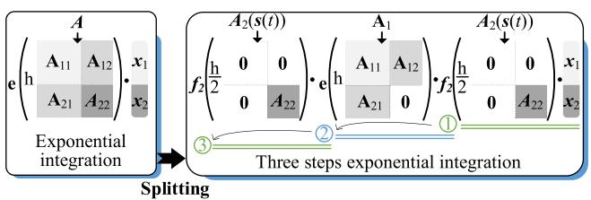  
Fig. 2. Splitting exponential integration procedure.

state variables $\scriptstyle { \mathbf { 2 } } \colon$ , and the exponentials of the submatrix $\pmb { A } _ { 2 2 }$ . x ATherefore, the method reduces the computational workload, and has potential for simulating massive switch operations.

# B. Accuracy Control of Splitting State-Space Method

To determine the applicability of the splitting state-space method for EMT simulations, it is necessary to evaluate its induced error analytically. By deriving and analyzing the matrix of local error of the presented exponential splitting scheme, some key information can be obtained before running EMT simulations. Feasible simulation time-step size and the exponential splitting formulas can be assessed. For this reason, a criterion for the evaluation is proposed in this subsection. The global error can be approximately controlled by the local error, and the reliability of error approximations can be augmented through the step-size adjustment based on local error control [24]. To estimate the local error, it is reminded that the dominant error term $E _ { 2 }$ of the first-order exponential splitting Formula (4) has Ebeen established in (5) as

$$
\boldsymbol {E} _ {2} = \mathrm {h} ^ {2} \left(\boldsymbol {A} _ {2} \boldsymbol {A} _ {1} - \boldsymbol {A} _ {1} \boldsymbol {A} _ {2}\right) / 2. \tag {11}
$$

Similarly, the dominant error matrix of second-order exponential splitting is denoted as $E _ { 3 }$ , and the m-order error matrix as $\pmb { { E } } _ { m }$ E. Then, the local error introduced by the exponential Esplitting formula is represented with $E _ { m }$ . In addition, the local error introduced by the approximate of the time-varying matrix exponential $f _ { k } ( \mathrm { h } A _ { 2 } ( s ( t _ { n } ) ) )$ is represented with $\scriptstyle { E _ { \mathrm { t } } }$ , Taking the Trotter formula and the first two terms of a Taylor series of exponential function as an example, $\scriptstyle { E _ { \mathrm { t } } }$ is

$$
\boldsymbol {E} _ {\mathrm {t}} = \mathbf {e} ^ {\mathrm {h} \boldsymbol {A} _ {1}} \boldsymbol {f} _ {1} \left(\mathbf {e} ^ {\mathrm {h} \boldsymbol {A} _ {2}}\right) - \mathbf {e} ^ {\mathrm {h} \boldsymbol {A} _ {1}} \mathbf {e} ^ {\mathrm {h} \boldsymbol {A} _ {2}} = \mathrm {h} ^ {2} \boldsymbol {A} _ {2} ^ {2} / 2 + 0 \left(\mathrm {h} ^ {3}\right). \tag {12}
$$

The splitting error matrix $E _ { \mathrm { s } }$ is defined as

$$
\boldsymbol {E} _ {\mathrm {s}} = \boldsymbol {E} _ {m} + \boldsymbol {E} _ {\mathrm {t}}. \tag {13}
$$

Since the matrix norm is guaranteed to be compatible with the vector norm, the error estimation can be regarded as the measure of the matrices in (13). The logarithmic norm is introduced as the tool for matrix measure [25]

$$
\mu (\boldsymbol {A}) = \lim  _ {\mathrm {h} \rightarrow 0 ^ {+}} \frac {\| \boldsymbol {I} + \mathrm {h} \boldsymbol {A} \| - 1}{\mathrm {h}}, \tag {14}
$$

where  ·  denotes the vector norm in $\mathbb { R } ^ { n }$ and the corresponding induced matrix norm in $\mathbb { R } ^ { n \times n }$ , and  is the identity matrix.

Within the time-step $[ t _ { n } , t _ { n + 1 } ]$ I, the m-order splitting error $S _ { m }$ is denoted as $\mu ( E _ { \mathrm { s } } x _ { n } )$ .

$$
\mu \left(\boldsymbol {E} _ {\mathrm {s}} \boldsymbol {x} _ {n}\right) \leq \mu \left(\boldsymbol {E} _ {m} \boldsymbol {x} _ {n}\right) + \mu \left(\boldsymbol {E} _ {\mathrm {t}} \boldsymbol {x} _ {n}\right) \tag {15}
$$

It can be assumed that $( \pmb { A } ) \approx \mu ( \pmb { A } _ { 1 } ) \ = \ a$ and $\mu \ ( A _ { 2 } ) =$ $b ( s ( t ) )$ ), where a is a constant parameter and $b ( s ( t ) )$ is varying with the switch state [26].

Since $b ( s ( t ) )$ is time-variant as the matrices in (15) change with the switch states, an exhaustive set of switch states seems necessary for the computation. Fortunately, the identification of the upper bound of $S _ { m }$ could simplify the analytical process. The upper bound of $S _ { m }$ is analyzed based on the binary resistances switch model, where the associated switch elements exhibit considerable magnitude due to the resistance in the off-state when all converter switches are turned off, and the estimated splitting error with the off-state switches has the maximum value $S _ { m }$ among all switch states. Since the upper bound of the splitting error is analyzed based on the binary resistances switch model, where the associated switch elements exhibit considerable magnitude due to the resistance in the off-state when all converter switches are turned off, and the estimated splitting error with the off-state switches has the maximum value $S _ { \mathrm { E } }$ among all switch states. The logarithmic norm of $A _ { 2 }$ with the Aoff-state switches is defined as b0. and given that the components corresponding to the SASVs typically possess relatively large inertia, it can be assumed that $\log / a \ll 1$ .

Substituting (11) and (12) into (15), the first-order splitting error $S _ { 1 }$ is

$$
S _ {1} \approx \mathrm {h} ^ {2} a b _ {0}. \tag {16}
$$

The second-order splitting error can be derived from (10) and (15). Then, a threshold $t _ { \mathrm { E } }$ is introduced to make sure the m-order splitting error $S _ { m }$ is small. to estimate the local error, and is bounded by the threshold $t _ { \mathrm { E } }$ .

$$
S _ {m} <   t _ {\mathrm {E}}. \tag {17}
$$

The calculation of $S _ { m }$ can be efficiently performed on a range of simulation time-step h and the order of exponential splitting formulas. Following the ascertainment of $S _ { m }$ , the optimization of simulation settings, based on the local error control of (17), can be executed before the simulation starts. Once the exponential splitting formula is selected, a range of simulation time-step can be estimated. Alternatively, when a specific size of the time-step is required, the error control tells the applicability of the splitting state-space method for specific cases.

# III. DECOUPLING PRINCIPLE FOR POWER CONVERTERS

For converter-integrated power systems, the dimension of state matrix and the number of its possible variants due to the switch state-dependent nature are seeing an increase, and it is resource-expensive to always reformulate the whole matrix. One of the advantages of the state-space method is that all the time-varying state matrix elements lie in the corresponding rows and column vectors of certain switch-adjacent components. This recognition of the time-varying elements is the primary motivation for applying the splitting state-space method. To this end, a decoupling principle that automatically extract these time-varying matrix portions from the power converter circuits is set forth in this section. This principle serves as the guide for the first step of the splitting state-space method. Furthermore, the

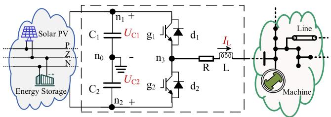  
(a)

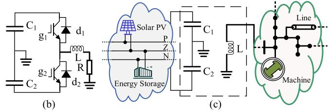  
Fig. 3. Half-bridge converter circuit for demonstrating the decoupling principle: (a) half-bridge circuit, (b) subcircuit of the time-varying splitting matrix, (c) subcircuit of the constant splitting matrix.

decoupling principle is applicable to general converter topologies.

# A. Automated State Matrix Decoupling Procedures

Firstly, the decoupling principle is elaborated using a halfbridge converter circuit as an example, as shown in Fig. 3. Source side DC circuit is connected to the converter through the nodes $\mathrm { n _ { 1 } }$ and n2, source side AC circuit is connected to the converter through the nodes $\mathrm { n _ { 3 } }$ and $\mathrm { n _ { 0 } }$ . The IGBTs $\mathrm { g } _ { 1 } , \mathrm { g } _ { 2 }$ and their antiparallel diodes $\mathrm { d } _ { 1 } , \mathrm { d } _ { 2 }$ share nodes from switch nodes set $\mathbf { N _ { s } } =$ $\{ \mathrm { n } _ { 1 } , \ \mathrm { n } _ { 2 } , \mathrm { n } _ { 3 } \}$ . The state variables are the inductor current $I _ { \mathrm { L } }$ and the capacitor voltages $U _ { \mathrm { C 1 } }$ and $U _ { \mathrm { C 2 } }$ .

To realize the decoupling, power electronic switches are first grouped based on their corresponding converters. Switches that share nodes from the same $\mathbf { N } _ { \mathrm { S } }$ are designated into one group. Since different converters are inherently decoupled from each other, this facilitates the dependent procedures across groups and possesses potential parallelism. The state variables of capacitors and inductors that are connected to all $\mathbf { N } _ { \mathrm { S } }$ sets, referred to as switch adjacent state variables (SASV) in this paper, are then readily determined. In the case of Fig. 3, the state equations of the SASV are dependent on the turn on/off state functions $S _ { 1 }$ and $S _ { 2 }$ of the switch pairs $\mathrm { g _ { 1 } / d _ { 1 } }$ and $\mathrm { g _ { 2 } / d _ { 2 } }$ , where $S _ { 1 }$ and $S _ { 2 }$ have values 1/0 for the turn on/off states. In this circuit, $I _ { \mathrm { L } }$ and $U _ { \mathrm { C 1 } } , U _ { \mathrm { C 2 } }$ are identified as SASV.

In essence, only the coefficients of SASV in the state equations change along with the switch operations inside the converters. The half-bridge converter circuit can be decoupled into two subcircuits, which describe the switch-dependent and constant equations respectively. The corresponding state equations of the switch-dependent and independent subcircuits are given in (18) and (19), where $\mathbf { A } _ { \mathrm { C 1 } } , \mathbf { A } _ { \mathrm { C 2 } } , \mathbf { A } _ { \mathrm { L } }$ and $\mathbf { A } _ { \mathrm { n } }$ are coefficient matrices, $\mathbf { a } _ { \mathrm { C 1 } } , \mathbf { a } _ { \mathrm { C 2 } }$ and aL are coefficient vectors, $\scriptstyle { \mathbf { { \vec { x } } } } _ { 1 }$ is the vector xof state variables represent the circuits outside the converter. The inductor L has the series resistor R, and the pivot element $- \mathrm { R } / \mathrm { L }$ corresponding to $I _ { \mathrm { L } }$ in (18) is constant, because when the inductors corresponding to the SASVs have series resistors

or when the capacitors have parallel resistors, the diagonal elements corresponding to the SASVs are constants, correlating with the respective resistance values. It is still maintained in (18) to ensure consistency of the method. Since the circuit is not included in the switch-dependent subcircuit, the derivative of $\scriptstyle { \mathbf { { \vec { x } } } } _ { 1 }$ in (18) is zero.

$$
\left[ \begin{array}{c} \dot {\boldsymbol {x}} _ {1} \\ \dot {U} _ {\mathrm {C} 1} \\ \dot {U} _ {\mathrm {C} 2} \\ \dot {I} _ {\mathrm {L}} \end{array} \right] = \left[ \begin{array}{c c c c} 0 & 0 & 0 & 0 \\ 0 & 0 & 0 & - S _ {1} / \mathrm {C} _ {1} \\ 0 & 0 & 0 & - S _ {2} / \mathrm {C} _ {2} \\ 0 & S _ {1} / \mathrm {L} & S _ {2} / \mathrm {L} & - \mathrm {R} / \mathrm {L} \end{array} \right] \left[ \begin{array}{c} \boldsymbol {x} _ {1} \\ U _ {\mathrm {C} 1} \\ U _ {\mathrm {C} 2} \\ I _ {\mathrm {L}} \end{array} \right], \tag {18}
$$

$$
\left[ \begin{array}{l} \dot {\boldsymbol {x}} _ {1} \\ \dot {U} _ {\mathrm {C} 1} \\ \dot {U} _ {\mathrm {C} 2} \\ \dot {I} _ {\mathrm {L}} \end{array} \right] = \left[ \begin{array}{c c c c} \mathbf {A} _ {\mathrm {n}} & \mathbf {a} _ {\mathrm {C} 1} & \mathbf {a} _ {\mathrm {C} 2} & \mathbf {a} _ {\mathrm {L}} \\ \mathbf {A} _ {\mathrm {C} 1} & 0 & 0 & 0 \\ \mathbf {A} _ {\mathrm {C} 2} & 0 & 0 & 0 \\ \mathbf {A} _ {\mathrm {L}} & 0 & 0 & 0 \end{array} \right] \left[ \begin{array}{l} \boldsymbol {x} _ {1} \\ U _ {\mathrm {C} 1} \\ U _ {\mathrm {C} 2} \\ I _ {\mathrm {L}} \end{array} \right]. \tag {19}
$$

To explain this method from the perspective of physical circuits, the subcircuits described by the splitting state equations are presented in Fig. 3(b) and (c). To form the constant part subcircuit, the current injections into SASV capacitors from the converter switch branches are set to zero, thus these branches are replaced by open circuits, while other branches remain unchanged. The voltages of switch-adjacent terminal of SASV inductors are set to zero, therefore the shared nodes of the converter switches and SASV inductors are grounded, while other nodes remain unchanged. The formulation of time-varying part subcircuits is complementary to the constant part subcircuits. Comparing the circuits in Fig. 3, the capacitors $\mathrm { C _ { 1 } }$ and $\mathrm { C _ { 2 } }$ are charged and the inductor L is discharged in the constant part subcircuit. The power conversions among those energy storage elements represented by SASV are carried out in the switch-dependent subcircuit, where $\mathrm { C _ { 1 } }$ and/or $\mathrm { C _ { 2 } }$ charges L through the switch pairs.

Based on the above analysis, the procedure of the decoupling principle for the splitting state-space method is summarized in Fig. 4. First the system dimension and power electronic switch number are estimated to evaluate the necessity of splitting the state-space matrix. For systems containing multiple power electronic switches, all switches are then classified into $N _ { \mathrm { C } }$ switch groups in a topology scan, and the switch group node sets $\mathbf { N } _ { \mathrm { s } }$ are formed. For each switch group, the SASV are identified which are capacitor voltages and inductor currents connected to $\mathbf { N } _ { \mathrm { s } }$ nodes. The branches and nodes can be replaced with open and short circuits, respectively, to obtain the decoupled subcircuits. Notably, when the inductors corresponding to the SASVs have series resistors or when the capacitors have parallel resistors, the corresponding resistors are included within the subcircuit of the time-varying splitting matrix. Last but not least, the splitting state matrices corresponding to the switch-dependent subcircuits are formulated. These decoupled subcircuits are much smaller than the original circuits, enabling computationally efficient state-space matrix derivation and easy integration into the numerical procedure of the splitting state-space method.

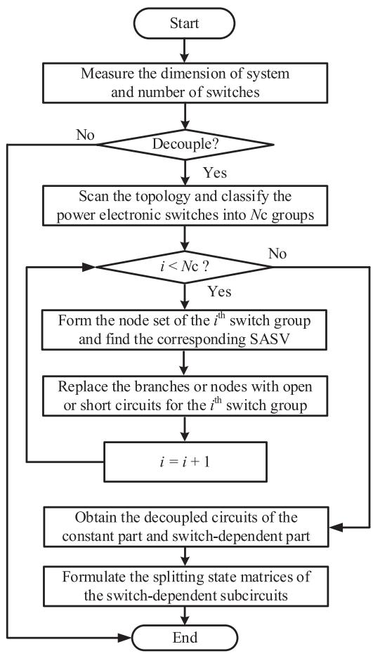

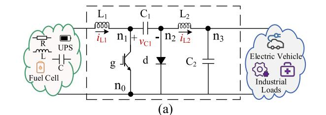  
Fig. 4. Flowchart of the decoupling procedure.

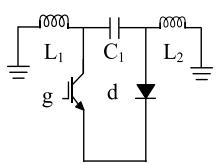  
(b)

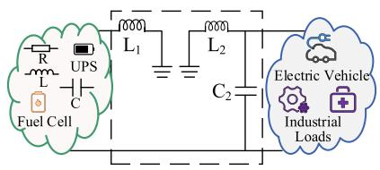  
  
Fig. 5. Cuk converter: (a) circuit diagram, (b) subcircuit of the time-varying splitting matrix, (c) subcircuit of the constant splitting matrix.

# B. Demonstration on Typical Converter Topologies

The presented decoupling principle is general and not limited to any particular convert topology. This section will supplement two examples of decoupling typical converter topologies, including a Cuk converter and an MMC circuit, but not with very detailed explanation.

A Cuk converter case is shown in Fig. 5. The IGBT g and the diode d share the common nodes from the switch nodes set $\mathbf { N _ { s } } =$

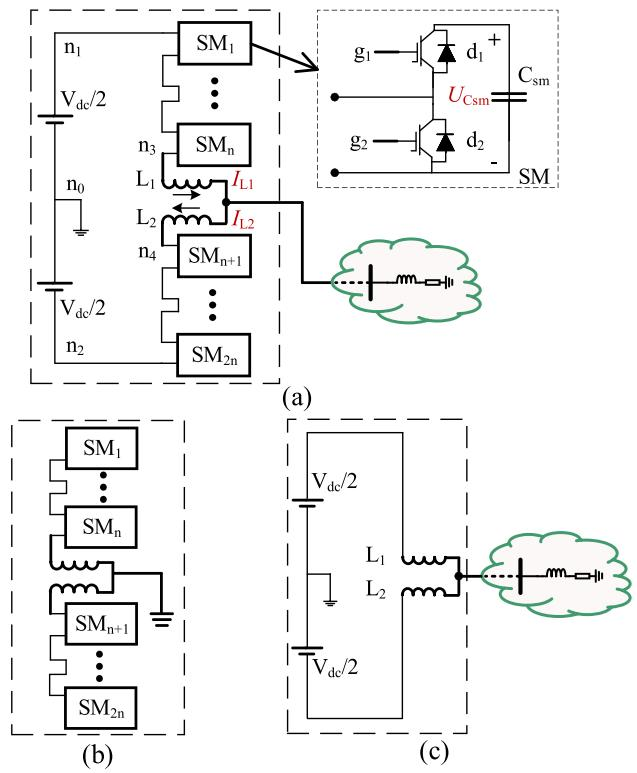  
Fig. 6. MMC converter with half-bridge submodules: (a) circuit diagram, (b) subcircuit of the time-varying splitting matrix, (c) subcircuit of the constant splitting matrix.

$\{ \mathrm { n } _ { 0 } , \ \mathrm { n } _ { 1 } , \mathrm { n } _ { 2 } \}$ . SASV of this switch group are the capacitor $\mathrm { C _ { 1 } }$ voltage and inductor $\mathrm { L _ { 1 } }$ and $\mathrm { L _ { 2 } }$ currents. Following the presented procedure, decoupled subcircuits are derived as in Fig. 5(b) and (c).

For the MMC converter as depicted in Fig. 6(a), the power electronic switches including the IGBTs $\mathrm { g _ { 1 } }$ and $\mathrm { g _ { 2 } }$ and antiparallel diodes ${ \mathrm { d } } _ { 1 }$ and $\mathrm { d } _ { 2 }$ inside the Sub-Modules (SMs) from the upper arm are categorized as one group, and those from the lower arm are categorized as another group. For symmetry of the two arms, only the decoupling of the upper arm is presented here. Firstly, the $\mathrm { S A S V s }$ are SM capacitor voltages and the upper arm inductor $\mathrm { L _ { 1 } }$ current. The capacitor current in each SM is zero or equals to the $\mathrm { L _ { 1 } }$ current depending on if the SM capacitor is bypassed. The $\mathrm { L _ { 1 } }$ voltage totally depends on the number of inserted SMs. The decoupled subcircuits are drawn in Fig. 6(b) and (c).

It is noted that for MMC there exists more specialized reduced-order equivalent model in the nodal analysis-based programs [27]. It is rooted in static circuit principle and derived by analysis of specific topology, not applicable to statespace models. The presentation here does not intend to compete with these specialized models, but to show the action of the decoupling principle on high-power converter systems containing series/parallel modules, with MMC as an example. Quantitative tests on MMC are included in Section IV-D. The proposed method is developed with dynamic system theory and differential equation model, and is general-purpose for convert topologies. The readers are invited to test on other converters of interest.

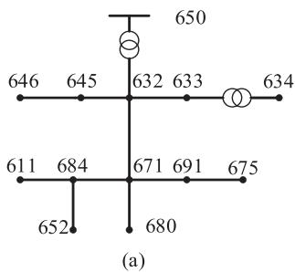

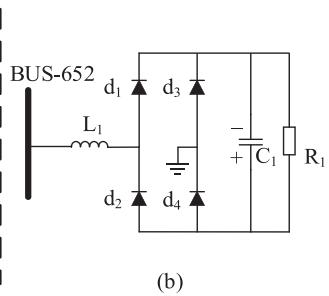  
Fig. 7. IEEE-13 Node system with DC load: (a) feeder layout, (b) rectifier load on BUS-652.

The merit of the presented decoupling procedure is three-fold. First, it is differential equation theory-based with rigorous error quantification, in contrast to circuit-based approaches that are empirical. Secondly, the decoupling principle has clear physical interpretation from the viewpoint of decoupled subsystem equivalent circuits, which match different power conversion stages. It is a more sophisticated dynamical representation of the physical process than previous approaches that commonly assumes some interface variables of inertia components remaining constant during fixed periods. Last but not least, an algorithmic procedure is available and programmed for automatic decoupling without user effort and intervention.

# IV. CASE STUDY

In this section, the splitting state-space method and the decoupling principle are applied to a distribution network with DC load, a 500 kHz LLC resonant converter circuit, a type-4 wind turbine generator-based wind farm, and an MMC circuit to verify the accuracy and efficiency by comparing simulation waveforms with EMTP [28].

# A. IEEE-13 Node System With DC Load

The IEEE-13 node system with DC load in Fig. 7 is first tested with the splitting state-space method. The diode bridge is modeled with ideal diode model with 0.7 V ignition voltage. The number of state variables of the system is 74. The simulation lasts for 5 s with a time-step of 10 $\mu \mathrm { s } .$ EMTP results with a smaller 5 µs time-step is taken as the benchmark. The state matrix is split between the phase-A inductor $\mathrm { L _ { 1 } }$ and DC load capacitor $\mathrm { C _ { 1 } }$ . Fig. 8 presents the inductor $\mathrm { L _ { 1 } }$ current waveforms, which are obtained by the accurate matrix exponential integrator (Exp) scheme, the splitting matrix exponential integrator (sExp) scheme, and EMTP, respectively.

Three splitting schemes are tested:

1) the first-order Trotter formula that integrates the constant part first (sExp-1st-12);   
2) the first-order Trotter formula that integrates the switchdependent variant part first (sExp-1st-21);   
3) the second-order Strang formula (sExp-2nd).

The sExp-2nd scheme gives the best accuracy, followed by the sExp-1st-12 scheme. Both are more accurate than EMTP with the same time-step. The sExp-1st-21 scheme has larger absolute errors. It is noted that the sExp-1st-12 and sExp-1st-21 schemes share the same second-order absolute error and the

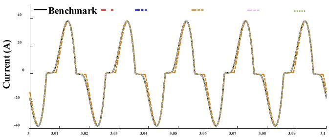

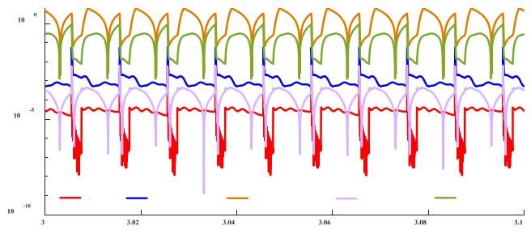

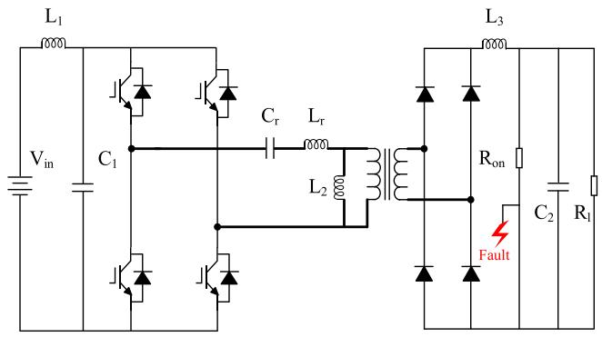  
Fig. 8. Comparison of waveforms of the inductor current and the absolute errors.   
Fig. 9. LLC resonant converter circuit diagram.

corresponding estimated splitting error is 0.31%, however the third-order absolute errors are 0.34% and 0.28% respectively. In other words, the low-order error is not dominant in this case. The relatively large absolute error of the sExp-1st-12 scheme is due to the miscalculation of switch operations. The estimated splitting error of the sExp-2nd is 0.08 %.

# B. LLC Resonant Converter

An LLC resonant converter circuit is shown in Fig. 9. The fault resistor is 0.05 mΩ, and the transformer ratio is 1:0.0625. Other parameters are set as in [29].The IGBTs are modeled as controlled switches with binary resistances. The time-step is 4 ns by evaluating the decoupling error of (17) with a 0.1% threshold. The benchmark waveform is obtained by EMTP with a 1 ns time-step. The simulation lasts for 0.1 s. The dimension of the state equation is 8, which includes the states of the seven inductors and capacitors, respectively, along with the augmented source states, as derived from (2).

Simulation waveforms of the output voltage across the load $\mathrm { R _ { 1 } }$ , the inductor current of $\mathrm { L _ { 2 } } .$ , the current of the LLC tank and their absolute errors against the benchmark are presented

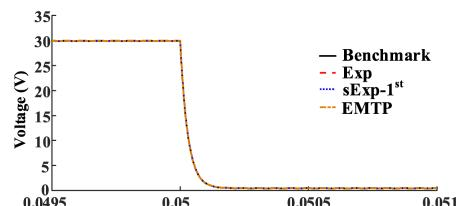

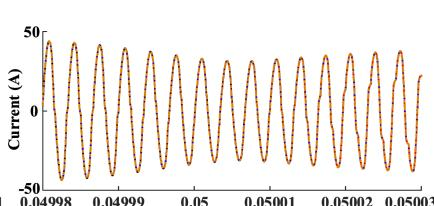

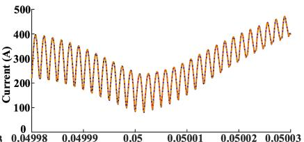

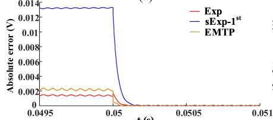

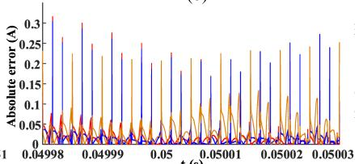

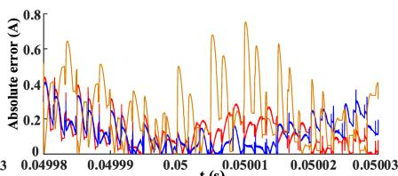  
  
Fig. 10. LLC resonant converter waveforms and absolute errors: (a) $\mathrm { R _ { 1 } }$ voltage, (b) L2 current, $\mathrm { { ( c ) \ L _ { r } } }$ current, (d)–(f) absolute errors of (a)–(c).

TABLE I SE FOR SPLITTING SCHEMES UNDER DIFFERENT TIME-STEP   

<table><tr><td rowspan="2">Time-step (ns)</td><td colspan="2">Splitting error</td></tr><tr><td>sExp-1st</td><td>sExp-2nd</td></tr><tr><td>0.5</td><td>8.05e-4</td><td>9.81e-6</td></tr><tr><td>4</td><td>7.75e-3</td><td>7.55e-4</td></tr><tr><td>10</td><td>1.94e-2</td><td>4.74e-3</td></tr></table>

in Fig. 10, where the sExp-1st-12 scheme is abbreviated as sExp-1st. It is shown that the proposed splitting state-space method has good agreements with the benchmark result. The Exp scheme yields the highest accurate results at the same time-step, and it is more accurate than EMTP. The waveforms of absolute errors of the LLC resonant converter reveal that the sExp scheme guarantees enough accuracy under the simulation time-step that meets the splitting error requirement of (17).

The sExp schemes using the first- and second-order accurate approximations are tested under 4 ns and 10 ns time-steps to demonstrate the usage of the inequality (17). The values of splitting errors with sExp-1st and sExp-2nd schemes are listed in Table I. The splitting errors in the table are the maximum ratios considering all switch-dependent variant splitting matrices $A _ { 2 }$ . AThe simulation time-step of 4 ns with a second-order accurate splitting scheme satisfies the threshold of 0.1%, while the firstorder accurate splitting scheme requires a smaller time-step of 0.5 ns. The LLC resonant converter is usually limited by its volume and the energy storage components are relatively small. Therefore, the measure of the state matrix is dependent on these small time constants. The results demonstrate that a splitting scheme with higher-order accuracy allows a larger time-step size under the same error requirement. In this case, the consumed time associated with numerical integration of the Exp scheme is 56.51 s and the consumed time of sExp-1st scheme is 19.52 s. The speedup of the sExp scheme is 2.89.

# C. Wind Farm With Detailed Modeling WTG Unit

A wind farm with type-4 wind turbine generator (WTG) units is tested to further verify the efficiency of the proposed method and compare the accuracy of splitting schemes. As shown in

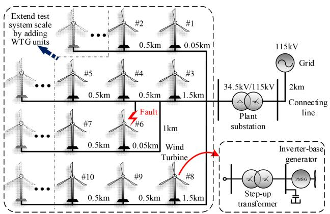  
Fig. 11. Diagram of the wind power plant.

Fig. 11, an extensible number of detailed modeled wind turbine generators are connected to a collector network through linear step-up transformers [30], each of the converters contains 12 IGBT and anti-parallel diode pairs, modeled with binary resistances. The control system of the WTG converter consists of the stator voltage orientation control for the machine side converter and DC voltage and reactive power control for the grid side converter. The collector network includes four feeders modeled by PI-section lines. For the wind farm comprising 50 WTG units, the state equation dimension of the system is 2135, and the dimension of scenarios featuring varying numbers of WTG units scales proportionally to this configuration. The network is subjected to a 3-phase-to-ground fault at $t \ = 1 \ \mathrm { s } ,$ , which is cleared after 5 cycles. The wind speed is set as 12 m/s, and it changes to 10 m/s at $t = 2 \mathrm { s } .$ The simulations time-step is ${ \mathrm { ; ~ } } \mu \mathrm { { s } . }$ , and the benchmark is EMTP results with 1 $\mu \mathrm { s }$ time-step.

The simulation results of a 10 WTG units wind farm test are presented first. Fig. 12(a) and (b) show the active power and voltage on the DC side of the back-to-back converter in each WTG unit. The ten WTG units of the wind farm are numbered from right to left and from top to bottom, as labeled in Fig. 11. The waveforms of the WTG units can be categorized into three groups, as shown in Fig. 12, based on their relative location to the fault: the active powers of WTG units 1, 2 and 8 to 10 decrease

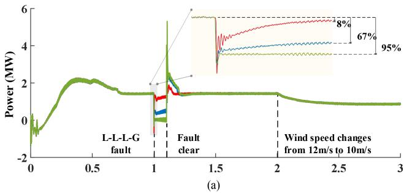

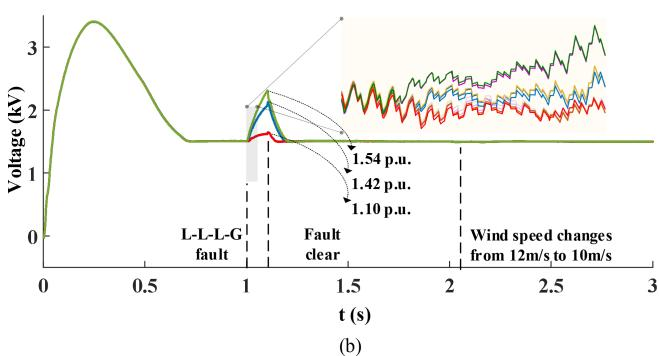  
Fig. 12. Waveforms of each WTG unit: (a) Active power of each WTG unit, (b) voltage on the DC side of the back-to-back converter.

by approximately 8% during the fault and their DC bus voltage increase to 1.10 p.u., the active powers of WTG units 3, 6 and 7 decrease by 67% and their DC bus voltages increase to 1.42 p.u., while the active powers of WTG units 4 and 5 decrease by 95%, and DC bus voltages increase to 1.54 p.u.. Protection system is disabled in this test to observe the natural response of the units.

Next, the numerical errors are compared in detail to assess the accuracy of the presented splitting exponential formulas. The sExp-1st-12, sExp-1st-21, sExp-2nd and Exp schemes are all tested against the benchmark. The absolute error waveform of the output filter currents of the grid-side converter and their zoom-in view are plotted in Fig. 13. The blue and orange lines represent the results of the first-order exponential splitting formulas with different integration orders in the multiple steps integration respectively. It is observed that the error of the sExp-1st-12 scheme is slightly lower than the sExp-1st-21 scheme for the majority of the simulation interval.

The red line represents the results of the second-order accurate scheme sExp-2nd, which shows better accuracy than the blue and orange lines, and almost coincides with the black solid line of the Exp scheme without splitting. The reason is that the Exp scheme possesses second-order accuracy due to the usage of linear interpolation for switching events, while the sExp-2nd scheme has the same order accuracy, and the differences between the third-order error terms are very small.

The execution time of each simulator is shown in Fig. 14. The efficiency of the splitting state-space method is assessed with a series of wind farm tests of an expanding scale, by adding additional WTG units to the feeder line ends separated by equidistant PI section lines, as shown in Fig. 11. The CPU times of different scale cases are compared with EMTP on a single core. Switching events interpolations are activated in all exponential integration

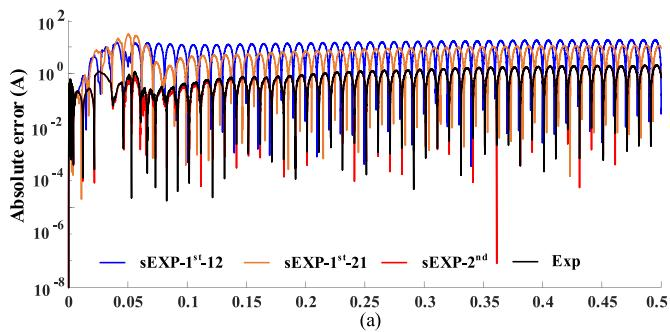

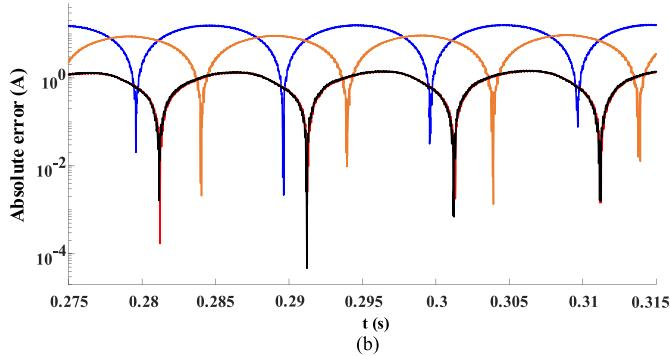

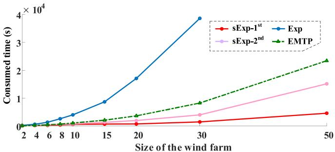  
Fig. 13. Error comparisons of first WTG unit: (a) Errors of output currents of filter in the back-to-back converter, (b) zoom-in plot of (a).   
Fig. 14. Consumed time for each scheme.

schemes, and the simultaneous switching option is enabled in EMTP simulations.

Since the integration order does not affect the simulation time, we do not distinguish here the sExp-1st-12 and sExp-1st-21 schemes denoted as sExp-1st in Fig. 14. The consumed time of the tested schemes are listed in Table II, and due to the lengthy consumed time for the Exp scheme at 50 WTG units, no further comparisons will be made with it. This scheme drawn in the red solid line achieves more than 2x speedup compared to EMTP drawn in the green dot-dash line, when simulating the wind farm with 20 WTG units. If the scale of the wind farm is expanded to 50 WTG units, the sExp-1st scheme has a more than 3x speedup compared to the EMTP. It is noted that the execution time of the scheme grows quasi-linearly with the simulation scale. The sExp-2nd scheme drawn in the purple solid line gains near 2x speedup against the EMTP for 50 WTG units. The Exp scheme drawn in the blue solid line, which is the original exponential integrator without splitting state-space method and compute all time-varying state matrix exponentials, is less efficient than EMTP, and 26x and 10x slower than the sExp-1st and sExp-2nd schemes respectively. The exponential integration schemes are

TABLE II PERFORMANCE OF THE WIND FARM CASE   

<table><tr><td rowspan="2">Number of the WTGs</td><td colspan="4">Consumed time (s)</td></tr><tr><td>EMTP</td><td>Exp</td><td>sExp-1st</td><td>sExp-2nd</td></tr><tr><td>2</td><td>71.09</td><td>253.89</td><td>134.39</td><td>137.77</td></tr><tr><td>4</td><td>250.90</td><td>645.52</td><td>209.31</td><td>289.18</td></tr><tr><td>6</td><td>463.83</td><td>1382.67</td><td>287.25</td><td>434.33</td></tr><tr><td>8</td><td>712.19</td><td>1616.20</td><td>374.81</td><td>605.54</td></tr><tr><td>10</td><td>1066.14</td><td>4027.35</td><td>561.11</td><td>775.82</td></tr><tr><td>20</td><td>3654.12</td><td>17075.68</td><td>768.97</td><td>1981.21</td></tr><tr><td>30</td><td>8255.27</td><td>38619.33</td><td>1489.33</td><td>4026.82</td></tr><tr><td>50</td><td>24138.12</td><td>/</td><td>4607.38</td><td>15151.93</td></tr></table>

TABLE III PARAMETERS OF THE 5-LEVEL MMC CASE   

<table><tr><td>System</td><td>Parameters</td><td>Values</td></tr><tr><td rowspan="8">AC and DC system</td><td>AC system RMS voltage</td><td>400 kV</td></tr><tr><td>Fundamental frequency</td><td>50 Hz</td></tr><tr><td>AC system R/L ratio</td><td>10</td></tr><tr><td>DC pole-to-pole voltage</td><td>640 kV</td></tr><tr><td>Transformer voltage ratio</td><td>400/320</td></tr><tr><td>Transformer rated power</td><td>1000 MVA</td></tr><tr><td>Transformer reactance</td><td>0.18 p.u.</td></tr><tr><td>Transformer resistance</td><td>0.001 p.u.</td></tr><tr><td rowspan="3">MMC</td><td>Capacitor energy in each SM</td><td>40 kJ/MVA</td></tr><tr><td>Number of SMs per arm</td><td>4 - 200</td></tr><tr><td>MMC arm inductance</td><td>0.15 p.u.</td></tr></table>

implemented in MATLAB and have efficiency disadvantages of the scripting language.

# D. Modular Multilevel Converter

As another efficiency test of the exponential splitting method, the MMC circuit shown in Fig. 6 with an extensible number of SM each arm, starting from 4 until 200, are studied. The system parameters are given in Table III. For 200 SMs in each arm, the number of the state variable of the circuit is 404. The simulation lasts for 0.1 second with a time-step of 20 µs. The sExp-1st-12 scheme is adopted in the test and referred to as sExp. The sExp scheme is validated with a benchmark result of EMTP with a smaller time-step of 5 µs.

Detailed comparisons of the 5-level MMC simulation results are given in Fig. 15. The upper and lower arm inductor currents are denoted as $i _ { \mathrm { u p p e r } }$ and $i _ { \mathrm { l o w e r } }$ for each scheme. The simultaneous switching function is turned on for the solution in EMTP, with the maximum iteration number set to be 4. From the enlarged views, it can be seen that the accuracy of the sExp scheme is

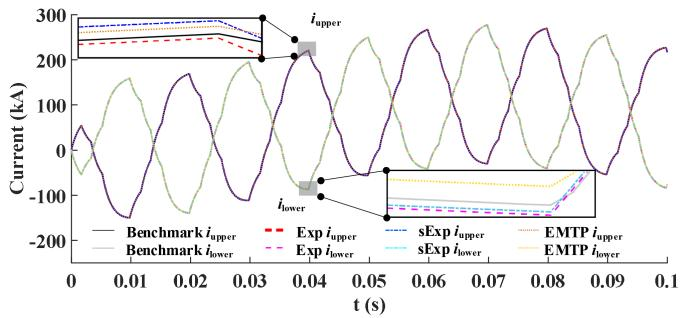  
Fig. 15. Waveforms of the currents of the upper and lower arm inductors.

TABLE IV PERFORMANCE OF THE MMC CASE FOR 0.1 SECOND SIMULATION   

<table><tr><td>Voltage Levels</td><td>5</td><td>11</td><td>21</td><td>51</td><td>101</td><td>201</td></tr><tr><td>Speedup</td><td>1.06</td><td>1.30</td><td>1.37</td><td>2.55</td><td>6.18</td><td>16.63</td></tr></table>

slightly inferior to EMTP and Exp schemes, and they are all consistent with the benchmark.

The speedups of the sExp scheme are listed in Table IV. The speedups are computed by comparing with the Exp scheme. For the 5-level MMC case, the sExp and Exp schemes have similar execution time. As the number of voltage levels in the MMC circuit increases, the speedups of the sExp scheme over the Exp scheme gradually increases. At 201 levels, the speedup ratio reaches 16.63.

# V. CONCLUSION

This paper has presented a splitting state-space method with a decoupling principle for converter-integrated power systems electromagnetic transient simulations. The splitting state-space method is established with different order exponential splitting formulas applied to the time-variant state-space matrices of power converter EMT models, which separate each integration step into multiple stages, and avoid recurring computation of the matrix exponential functions. Furthermore, a criterion to estimate the induced splitting error is given to suggest appropriate time-step size for splitting method simulations. A generic decoupling principle is then introduced and demonstrated on common converter topologies. By collecting the time-variant parts of the state matrix and coordinating the various order accuracy approximations of the splitting state-space method, the computational burden brought by high frequency switching transients of converter-integrated power systems is effectively suppressed, by avoiding repeated matrix exponential calculations.

An IEEE-13 node system with DC load, an LLC resonant converter case, a large-scale wind farm case and an MMC case have verified that the proposed method provides adjustable order accurate results, and gains speedups against the traditional methods, especially for power system integrated with many power converters, such as studies involving the detailed modeled wind farms. Works in exploiting the parallelism in the proposed splitting state-space method for converter-integrated

system simulations and acceleration via GPU computing to further improve efficiency is under development.

# REFERENCES

[1] W. Du et al., “Modeling of grid-forming and grid-following inverters for dynamic simulation of large-scale distribution systems,” IEEE Trans. Power Del., vol. 36, no. 4, pp. 2035–2045, Aug. 2021.   
[2] U. Karaagac, J. Mahseredjian, L. Cai, and H. Saad, “Offshore wind farm modeling accuracy and efficiency in MMC-based multiterminal HVDC connection,” IEEE Trans. Power Del., vol. 32, no. 2, pp. 617–627, Apr. 2017.   
[3] H. Li, J. Shair, J. Zhang, and X. Xie, “Investigation of subsynchronous oscillation in a DFIG-based wind power plant connected to MTDC grid,” IEEE Trans. Power Syst., vol. 38, no. 4, pp. 3222–3231, Jul. 2023.   
[4] Y. Shu, G. Tang, and H. Pang, “A back-to-back VSC-HVDC system of Yu-E power transmission lines to improve cross-region capacity,” CSEE J. Power Energy Syst., vol. 6, no. 1, pp. 64–71, Mar. 2020.   
[5] H. Chalangar, T. Ould-Bachir, K. Sheshyekani, and J. Mahseredjian, “Methods for the accurate real-time simulation of high-frequency power converters,” IEEE Trans. Ind. Electron., vol. 69, no. 9, pp. 9613–9623, Sep. 2022.   
[6] M. Ouafi, J. Mahseredjian, J. Peralta, H. Gras, S. Dennetiere, and B. Bruned, “Parallelization of EMT simulations for integration of inverter-based resources,” Electric Power Syst. Res., vol. 223, Oct. 2023, Art. no. 109641.   
[7] F. A. Moreira, J. R. Marti, L. C. Zanetta, and L. R. Linares, “Multirate simulations with simultaneous-solution using direct integration methods in a partitioned network environment,” IEEE Trans. Circuits Syst. I, Reg. Papers, vol. 53, no. 12, pp. 2765–2778, Dec. 2006.   
[8] B. Bruned, J. Mahseredjian, S. Dennetière, J. Michel, M. Schudel, and N. Bracikowski, “Compensation method for parallel and iterative real-time simulation of electromagnetic transients,” IEEE Trans. Power Del., vol. 38, no. 4, pp. 2302–2310, Aug. 2023.   
[9] C. Dufour, “Highly stable rotating machine models using the state-spacenodal real-time solver,” in Proc. IEEE Workshop Complexity Eng., 2018, pp. 1–10.   
[10] T. Kato, K. Inoue, T. Ogawa, and Y. Takami, “Automatic circuit partitioning for parallel processing of power electric system simulation,” IEEJ Trans. Ind. Appl., vol. 135, no. 10, pp. 1025–1032, 2015.   
[11] C. Jin, Z. Ji, K. Liu, W. Chen, and J. Zhao, “A region-folding electromagnetic transient simulation approach for large-scale power electronics system,” IEEE Trans. Power Electron., vol. 38, no. 8, pp. 9755–9766, Aug. 2023.   
[12] P. Pejovic and D. Maksimovic, “A new algorithm for simulation of power electronic systems using piecewise-linear device models,” IEEE Trans. Power Electron., vol. TPEL-10, no. 3, pp. 340–348, May 1995.   
[13] S. Y. R. Hui and C. Christopoulos, “A discrete approach to the modeling of power electronic switching networks,” IEEE Trans. Power Electron., vol. 5, no. 4, pp. 398–403, Oct. 1990.   
[14] Q. Mu, J. Liang, X. Zhou, Y. Li, and X. Zhang, “Improved ADC model of voltage-source converters in DC grids,” IEEE Trans. Power Electron., vol. 29, no. 11, pp. 5738–5748, Nov. 2014.   
[15] K. Wang, J. Xu, G. Li, N. Tai, A. Tong, and J. Hou, “A generalized associated discrete circuit model of power converters in real-time simulation,” IEEE Trans. Power Electron., vol. 34, no. 3, pp. 2220–2233, Mar. 2019.   
[16] S. Yu, S. Zhang, Y. Han, Y. Wei, and S. Zou, “A pulse-source-pair-based AC/DC interactive simulation approach for multiple-VSC grids,” IEEE Trans Power Del., vol. 36, no. 2, pp. 508–521, Apr. 2021.   
[17] H. Saad et al., “Dynamic averaged and simplified models for MMC-based HVDC transmission systems,” IEEE Trans. Power Del., vol. 28, no. 3, pp. 1723–1730, Jun. 2013.   
[18] C. Wang, X. Fu, P. Li, J. Wu, and L. Wang, “Multiscale simulation of power system transients based on the matrix exponential function,” IEEE Trans. Power Syst., vol. 32, no. 3, pp. 1913–1926, May 2017.   
[19] M. Hochbruck and A. Ostermann, “Exponential integrators,” Acta Numerica, vol. 19, pp. 209–286, May 2010.   
[20] E. Hairer, C. Lubich, and G. Wanner, Geometric Numer. Integration. Struct.-Preserving Algorithms Ordinary Differ. Equ., Berlin, Germany: Springer, 2002, pp. 47–50.   
[21] H. F. Trotter, “On the product of semi-groups of operators,” Proc. Amer. Math. Soc., vol. 10, pp. 545–551, 1959.

[22] R. I. Mclachlan and G. Quispel, “Splitting methods,” Acta Numerica, vol. 11, pp. 341–434, 2002.   
[23] N. Hatano and M. Suzuki, “Finding exponential product formulas of higher orders,” in Quantum Annealing and Other Optimization Methods, A. Das and B. K. Chakrabarti, Eds. Berlin, Germany: Springer-Verlag, 2005.   
[24] L. F. Shampine and H. A. Watts, “Global error estimates for ordinary differential equations,” ACM Trans. Math. Softw., vol. 2, no. 2, pp. 172–186, 1976.   
[25] T. Ström, “On logarithmic norms,” SIAM J. Numer. Anal., vol. 12, pp. 741–753, 1975.   
[26] R. J. LeVeque and J. Oliger, “Numerical methods based on additive splittings for hyperbolic partial differential equations,” Math. Comput., vol. 40, no. 162, pp. 469–497, 1983.   
[27] J. Xu, Y. Zhao, C. Zhao, and H. Ding, “Unified high-speed EMT equivalent and implementation method of MMCs with single-port submodules,” IEEE Trans. Power Del., vol. 34, no. 1, pp. 42–52, Feb. 2019.   
[28] J. Mahseredjian, S. Dennetière, L. Dubé, B. Khodabakhchian, and L. Gérin-Lajoie, “On a new approach for the simulation of transients in power systems,” Elect. Power Syst. Res., vol. 77, no. 11, pp. 1514–1520, Sep. 2007.   
[29] W. Nzale, J. Mahseredjian, X. Fu, I. Kocar, and C. Dufour, “Improving numerical accuracy in time-domain simulation for power electronics circuits,” IEEE Open Access J. Power Energy, vol. 8, pp. 157–165, 2021.   
[30] D. N. Hussein, M. Matar, and R. Iravani, “A type-4 wind power plant equivalent model for the analysis of electromagnetic transients in power systems,” IEEE Trans. Power Syst., vol. 28, no. 3, pp. 3096–3104, Aug. 2013.

Xiaopeng Fu (Member, IEEE) received the B.S. and Ph.D. degrees in electrical engineering from Tianjin University, Tianjin, China, in 2011 and 2016, respectively. He was a Postdoctoral Fellow with Power Systems Department, Polytechnique de Montreal, Montreal, QC, Canada, in 2007. He is currently an Associate Professor with the School of Electrical and Information Engineering, Tianjin University. His research interests include analysis of distributed generation system, microgrid, and simulation of electromagnetic transients. He is a member of Chinese

Society for Electrical Engineering.

Wei Wu (Member, IEEE) received the B.S., M.Sc., and Ph.D. degrees in electrical engineering from Tianjin University, Tianjin, China, in 2017, 2020, and 2024, respectively. He is currently an Assistant Researcher with Beijing Huairou Laboratory, Beijing, China. His research interests include analysis of distributed generation system, microgrid, electromagnetic transient simulation, and parallel computing.

Peng Li (Senior Member, IEEE) received the B.S. and Ph.D. degrees in electrical engineering from Tianjin University, Tianjin, China, in 2004 and 2010, respectively. He is currently a Professor with the School of Electrical and Information Engineering, Tianjin University. His research interests include operation and planning of active distribution networks, modeling, and transient simulation of power systems. He is an Associate Editor for IEEE TRANSACTIONS ON SUSTAINABLE ENERGY, CSEE Journal of Power and Energy Systems, Sustainable Energy Technologies

and Assessments, and IET Renewable Power Generation.

Jean Mahseredjian (Life Fellow, IEEE) received the Ph.D. degree in electrical engineering from Polytechnique Montréal, Montreal, QC, Canada, in 1991. From 1987 to 2004, he was with IREQ (Hydro-Québec) working on research and development activities related to the simulation and analysis of electromagnetic transients. In 2004, he joined the Faculty of Electrical Engineering, Polytechnique Montréal.

Chengshan Wang (Senior Member, IEEE) received the Ph.D. degree in electrical engineering from Tianjin University, Tianjin, China, in 1991. He is currently a Professor with the School of Electrical and Information Engineering, Tianjin University, where he is also the Director of the Key Laboratory of Smart Grid, Ministry of Education. His research interests include distribution system analysis and planning, distributed generation system, and microgrid. He is the Editorin-Chief of IET Energy Systems Integration and a member of Chinese Academy of Engineering.

Jianzhong Wu (Fellow, IEEE) received the B.Sc., M.Sc., and Ph.D. degrees in electrical engineering from Tianjin University, China, in 1999, 2002, and 2004, respectively. From 2004 to 2006, he was an Associate Professor with Tianjin University. From 2006 to 2008, he was a Research Fellow with the University of Manchester, Manchester, U.K. He is currently a Professor of multi-vector energy systems and the Head of the School of Engineering, Cardiff University, Cardiff, U.K. His research interests include integrated multi-energy infrastructure and smart grid.

He is the Co-Editor-in-Chief of Applied Energy and the Co-Director of U.K. Energy Research Centre and EPSRC Supergen Energy Networks Hub.