# Universal Decoupled Equivalent Circuit Models of Solid-State Transformer for Accelerated EMT-Type Simulation

Hengyu Li , Graduate Student Member, IEEE, Walid Hatahet , Graduate Student Member, IEEE, Jared J. Paull , Graduate Student Member, IEEE, Jintao Han , Liwei Wang , Senior Member, IEEE, and Wei Li , Member, IEEE

Abstract—Multilevel Multimodule Solid-State Transformer (SST) is emerging as a key technology interfacing MVAC and LVAC systems via chainlink AC-DC converter and Dual Active Bridge (DAB) DC-DC converters. The SST has the advantages of high modularity, bidirectional power transfer, galvanic isolation, and high-frequency power conversion. Fast control prototyping of the SST requires numerically efficient and accurate equivalent circuit models for Electromagnetic Transient (EMT) simulation. This paper proposes universal decoupled equivalent circuit models using switching function to simplify the power converter circuits. Various types of power converters including full-bridge converter, DAB DC-DC converter, and three-phase 3-level converters can be universally modeled by the proposed equivalent circuits in both deblocking and blocking modes. The use of switching function and DC-link decoupling strategy in equivalent circuit models achieves constant G-matrix and significantly reduced node number in the EMT solution. A switching interpolation technique is proposed for the SST to accurately represent switching events when a large simulation time step is used. Case studies have demonstrated that the proposed equivalent circuit models significantly improve the numerical efficiency, compared to the conventional detailed model and variable G-matrix detailed equivalent model.

Index Terms—Electromagnetic transient simulation, detailed equivalent model, switching-function-based average value model, solid-state transformer, switching interpolation.

# I. INTRODUCTION

OLID State Transformer (SST) is a key enabler that interfaces Medium-Voltage (MV) AC/DC with Low-Voltage (LV) AC/DC distribution systems for renewable energy integration, distributed energy storage, electric vehicle charging infrastructure, and AC/DC loads. The SST has the merits of high efficiency, high-power density, bidirectional power flow capability, galvanic isolation, and high voltage conversion ratio [1].

Received 13 October 2024; revised 25 April 2025; accepted 22 June 2025. Date of publication 30 June 2025; date of current version 25 September 2025. This work was supported by the Natural Sciences and Engineering Research Council (NSERC) of Canada. Paper no. TPWRD-01557-2024. (Corresponding author: Liwei Wang.)

Hengyu Li, Walid Hatahet, Jared J. Paull, and Liwei Wang are with the School of Engineering, The University of British Columbia Okanagan, Kelowna, BC V1V 1V7, Canada (e-mail: liwei.wang@ubc.ca).

Jintao Han and Wei Li are with OPAL-RT Technologies, Montreal, QC H3K 1G6, Canada (e-mail: wei.li@opal-rt.com).

Color versions of one or more figures in this article are available at https://doi.org/10.1109/TPWRD.2025.3584585.

Digital Object Identifier 10.1109/TPWRD.2025.3584585

The SST, performing AC-AC power conversion, has typically three stages, i.e., modular multilevel AC-DC converter in Stage I, high-frequency Dual Active Bridge (DAB) DC-DC converters [2], [3], [4] in Stage II, and 2-/3-level DC-AC converter in Stage III. One of the most popular SST configurations has multiple power modules series-connected on the primary MVDC side and parallel-connected on the secondary LVDC side, known as Input-Series-Output-Parallel (ISOP) configuration [5], [6]. A voltage balancing control [6] is employed in the ISOP-SST to regulate MVDC capacitor voltages of Full-Bridge Submodules (FBSMs) for stable input voltages of the primary-sides of DAB modules.

Numerically efficient and accurate Electromagnetic Transient (EMT) models of multilevel multimodule converters play an essential part in converter design and fast control prototyping. The conventional Detailed Model (DM), composed of many discrete circuit components, imposes dramatic computational burdens due to the large number of switches from the converter Submodules (SMs). Consequently, the development of EMT-type Detailed Equivalent Models (DEMs) [7], [8], [9], [10], [11], [12], [13] has attracted much attention in modeling modular multilevel converters (MMC). However, compared to MMC modeling, the SST modeling imposes special challenges because the DAB submodules in SSTs have higher circuit complexity, higher switching frequency, interleaving operations of submodules, and complicated circuit coupling between Stages I and II of the SSTs. The DEMs of the SST were proposed in [14], [15], [16], [30], [31] for accelerated EMT simulation, which reduces the SST’s internal node number by using Thevenin’s or Norton’s equivalent circuits. These prior-art works in [14], [15], [16], [30], [31] represent converter submodules using either Resistive Switch Model (RSM) [14], [15], [16], [31] of two-value ON/OFF resistors or L/C-Associated Discrete Circuit (L/C-ADC) [30] to model each semiconductor switch. Thus, the converter DEMs have different equivalent circuit topologies and need to be individually derived for various types of submodules of the SSTs. Although the DEM in [14], [15], [16], [31] improves the simulation efficiency compared to the DM, the system conductance (G)-matrix in EMT solution is time-variant due to the use of two-value resistor to represent the ON/OFF states of semiconductor switches. Frequent refactorization of the G-matrix limits further improvement of simulation efficiency.

The conventional L/C-ADC model of SST [30] achieves constant G matrix but causes fictitious voltage and current oscillations during switching transitions and results in unrealistically high switching losses, especially for simulating converters with high PWM frequencies or resonant operations.

Switching-function-based DEMs (SFB-DEMs) were originally proposed for modular multilevel converters (MMC) in [11], [12], [13], which achieve constant G-matrix for numerically efficient EMT solutions. The SFB-DEMs reduce the dimensions of the G-matrix by eliminating the nodes of SMs in a converter arm. Furthermore, MMC switching-function-based average value models (SFB-AVMs) were proposed in [17] and [18], which further simplify the DEMs of MMCs by assuming all SM capacitor voltages are balanced. Thus, one equivalent capacitor per arm is used to represent converter arm dynamics. A universal modeling framework combining the SFB-DEM and SFB-AVM was proposed in [19] to further increase the modeling flexibility for different converter operating scenarios. An SFB-AVM is proposed in this paper, which is different from the conventional/standard AVMs [26], [27], [28], [29]. In the conventional/standard AVMs, the instantaneous values of the switched voltage and current are averaged in one switching cycle (the so-called fast average or switching cycle-by-cycle average) to remove the switching events/ripple representation in the conventional/standard AVMs. The proposed SFB-AVM represents detailed switching events of the SST in submodule level (Stage I FBSM and Stage II DAB DC-DC converter submodule). It is so called SFB-AVM, because the average voltage of MV FBSM capacitors from Stage I is used as submodule capacitor voltage at the primary side of each DAB submodule for the detailed switching based EMT simulation. Therefore, the proposed SFB-AVM actually represents detailed semiconductor switching in DAB submodule level and can simulate switching harmonics/ripples and low-level controls of the SST, e.g., FBSM stack energy balancing in Stage I and interleaving operation of DAB submodules in Stage II.

Offline and real-time EMT simulation tools often use numerical integration solvers with fixed time steps. It is critical for the numerical solvers to capture switching time instants precisely when the switching status changes, especially for high-frequency converters. However, switching events may occur within two consecutive simulation time steps (intra-step switching) rather than on the time steps. This brings significant challenge to ensure simulation accuracy, when large integration time steps are used. Numerical errors, caused by inaccurate switching timing representation, lead to distorted simulation results. Hence, switching interpolation were proposed in [20], [21], [22], [23], [24], [25] to compensate for inaccurate location of switching events to enable larger simulation time step and higher simulation efficiency. However, the switching interpolation technique has not been implemented in the prior-art SST DEMs.

This paper proposes numerically efficient and accurate SST EMT equivalent circuit models, namely, SFB-DEM and SFB-AVM. The key properties of the proposed models and the overall contributions of the paper are summarized as follows:

1) The proposed SFB-DEM and SFB-AVM feature a universal equivalent circuit, capable of representing various

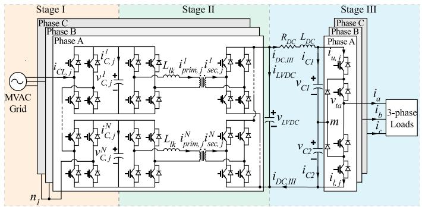  
Fig. 1. Schematic diagram of the SST DM.

types of converters such as single-phase full-bridge or three-phase 2- or 3-level converters in both deblocking and blocking modes for normal and short-circuit fault operations.

2) The proposed equivalent models decouple the three stages of the SST at the MVDC- and LVDC-link capacitors, which reduces the total number of nodes and the size of the overall linear system solved by EMT program.   
3) A constant G-matrix in EMT solution is achieved in both of the proposed SFB-DEM and SFB-AVM of the SST, due to the use of switching functions and explicit integration rule for the MVDC- and LVDC-link capacitors. Thus, the simulation efficiencies of the proposed SFB-DEM and SFB-AVM are greatly improved, compared to the conventional DM and Variable G-matrix (VG) DEMs.   
4) A switching interpolation technique is applied in the proposed SFB-DEM and SFB-AVM to accurately capture the intra-step switching events in all three stages of the SST, i.e., multilevel AC-DC converter, DC-DC DAB converters, and NPC three-level converter. Thus, large integration time steps are used in the proposed SFB-DEM and SFB-AVM to improve EMT simulation efficiency while preserving simulation accuracy.

# II. SST CIRCUIT TOPOLOGY AND CONTROL

# A. Three-Stage Circuit Topology

Circuit configuration of the SST is introduced in this subsection. The SST is composed of three stages including modular multilevel AC-DC converter with cascaded FBSMs in Stage Ⅰ, DAB bidirectional DC-DC converter in Stage Ⅱ, and three-phase three-level Neutral Point Clamped (NPC) inverter in Stage Ⅲ. As presented in Fig. 1, the AC side of Stage Ⅰ is connected to three-phase MVAC grid. In Stage Ⅰ, MVDC capacitor voltage from the kth submodule in phase j is denoted as $v _ { C , j } ^ { k } , ( k = I ,$ 2 …N, j represents phase A, B, C). N represents the number of FBSMs in each phase. According to KCL at MVDC nodes, the MVDC capacitor current $i _ { C , j } ^ { k }$ is calculated using the DC current from the kth FBSM in the Stage Ⅰ and DAB primary-side DC current in the Stage Ⅱ.

In Stage II, there are N DAB modules coupled with Stage I’s FBSMs through the MVDC capacitors in each phase. As shown in Fig. 1, winding leakage inductance of the DAB transformer is denoted as $L _ { l k }$ . All the positive and negative DC terminals on

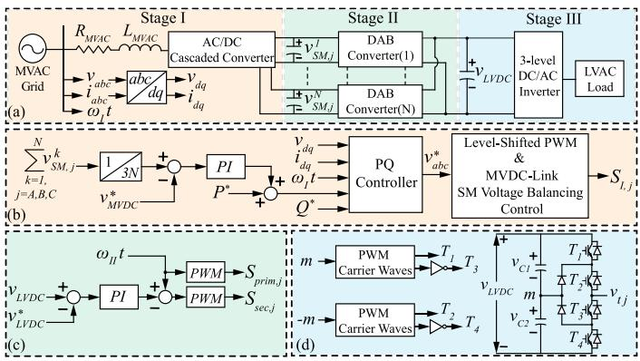  
Fig. 2. Control strategies of the SST. (a) Overall configuration of the SST. (b) MVDC voltage and reactive power controls. (c) LVDC voltage control. (d) Stage Ⅲ NPC converter modulation.

the secondary sides of DAB modules are connected collectively sharing a mutual LVDC-link which provides LVDC voltage input to Stage Ⅲ. Thereafter, an ISOP structure is implemented combining Stages Ⅰ and Ⅱ. A three-phase 3-level NPC converter is used in Stage Ⅲ, transferring power from LVDC to LVAC terminals, connected to three-phase loads.

# B. Operation Principle and Control Strategy

The operating principle and control strategy of the SST are introduced in this subsection. Independent controllers and different upper- and lower-level controls are applied to the three stages as shown in Fig. 2. Control strategy of Stage Ⅰ consists of the outer-loop MVDC voltage control/real power and reactive power control in dq-frame to generate three-phase voltage modulation signals $v _ { a b c } ^ { * }$ . Then, level-shifted PWM scheme is used to obtain chainlink SMs insertion index with 2N + 1 discrete voltage steps. Individual SM switching signals $S _ { I , j }$ are produced by SM voltage balancing control, based on SM DC voltage sorting algorithm.

For Stage Ⅱ, a single-phase-shift PWM scheme is used to generate switching signals for both FBSMs of a DAB module. An outer-loop voltage control is applied to LVDC-link to regulate the power transferred in the Stage Ⅱ, via the phase difference between the primary and secondary-side switching signals, as shown in Fig. 2(c). The PWM schemes of the three-phase NPC inverter are provided in Fig. 2(d), which generates the complimentary switching signals for the switches of the NPC inverter.

# III. UNIVERSAL DECOUPLED EQUIVALENT CIRCUIT MODELS

Two numerical efficient models, i.e., DEM and AVM are proposed in this Section, both of which are switching-functionbased models. The use of switching function to represent semiconductors in the converter EMT modeling provides several advantages compared to the conventional ON/OFF two-value resistor modeling strategy. Firstly, a universal equivalent circuit can be constructed to represent various types of power converter topologies and phase counts. Secondly, SFB modeling strategy, combined with explicit integration rules, such as Forward Euler

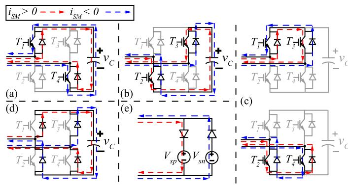  
Fig. 3. SFB-DEM of FB converter. (a) Positive insertion. (b) Negative insertion. (c) Bypass. (d) Blocking. (e) Equivalent circuit of FB converter.

(FE) method, leads to constant network conductance G-matrix in EMT solution, which significantly improves simulation efficiency, compared to conventional VG-DEMs [14], [15], [16]. Lastly, the SFB-AVM further improves numerical efficiency of chainlink-based multilevel converters by ignoring the small capacitor voltage ripple difference among the SMs. Detailed derivations of the proposed SFB-DEM and SFB-AVM for the SST are discussed in this Section. A switching interpolation technique is proposed in this Section to accurately capture switching time instants for the fixed time-step solvers, for which the SFB-DEM and the SFB-AVM are developed. The proposed SFB-DEM and SFB-AVM are scalable to different topologies or configurations of SSTs (different circuit connections of the SSTs, different numbers of submodules, and various types of submodules in Stages I and II). The universal modeling framework of the proposed SFB-DEM and SFB-AVM is inherent in the double-diode equivalent circuits in Fig. 5 for both IGBT deblocking and blocking modes.

# A. SFB-DEM of Fundamental VSCs

1) SFB-DEM of Full-Bridge Converter: Full-bridge (FB) converter is a fundamental building block of more sophisticated power converters, such as SST or MMC. As presented in Fig. 3, various operating modes of the FB converter are analyzed, including positive/negative insertion, bypass, and blocking modes to derive the equivalent circuit of the SFB-DEM. In Fig. 3(e), the equivalent output voltages of the FB converter for positive and negative SM current $i _ { S M }$ directions are denoted as $V _ { s p }$ and $V _ { s n } ,$ , respectively. It is noted that the two diodes in the parallel equivalent branches of Fig. 3(e) are used to represent the IGBT blocking mode of the FB converter, as shown in Fig. 3(d). The values of $V _ { s p }$ and $V _ { s n }$ in the equivalent circuit of Fig. 3(e) are summarized in Table I, which are determined by inspecting the switching states of the IGBT switches and the flowing directions of the SM current. In the IGBT blocking mode (also known as the diode mode), the SM current can only flow through the diodes. When all the switches are blocked, the DC-link capacitor is always inserted to suppress the SM current flowing from either direction.

TABLE I EQUIVALENT OUTPUT VOLTAGES OF FULL-BRIDGE CONVERTER   

<table><tr><td>Operating Mode</td><td>T1</td><td>T2</td><td>T3</td><td>T4</td><td>Vsp</td><td>Vsn</td></tr><tr><td>Positive Insertion</td><td>1</td><td>0</td><td>0</td><td>1</td><td colspan="2">VC</td></tr><tr><td>Negative Insertion</td><td>0</td><td>1</td><td>1</td><td>0</td><td colspan="2">-vC</td></tr><tr><td rowspan="2">Bypass</td><td>1</td><td>0</td><td>1</td><td>0</td><td colspan="2">0</td></tr><tr><td>0</td><td>1</td><td>0</td><td>1</td><td colspan="2">0</td></tr><tr><td>Blocking (Diode)</td><td>0</td><td>0</td><td>0</td><td>0</td><td>VC</td><td>-vC</td></tr></table>

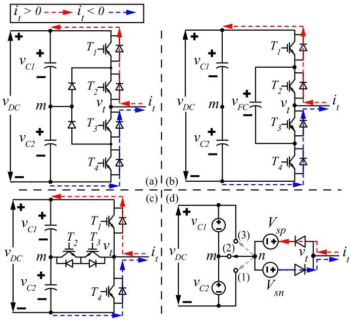  
Fig. 4. SFB-DEM of single-phase three-level converter. (a) NPC converter. (b) FC converter. (c) T-type converter. (d) Universal equivalent circuit of three-level converters.

2) SFB-DEM of Three-Level Converters: Three-level converters, such as Neutral-Point-Clamped (NPC), Flying Capacitor (FC), or T-type converters are also commonly-used converters. Single-phase versions of the three-level converters are shown in Fig. 4. Two-level converter is a special case of the NPC or T-type three-level converter by removing the midpoint switches (clamping diodes or IGBTs). In this subsection, the equivalent circuit of the three-level converters is formulated, considering different output voltage states, i.e., positive, negative, zero states.

The proposed equivalent circuit of the single phase three-level converter is depicted in Fig. 4(d), where m represents the midpoint of the three-level converter and n is the neutral point of the AC equivalent circuit of the SFB-DEM. Depending on the reference node’s location of the converter, either at (1) negative DC-rail, or (2) midpoint, or (3) positive DC-rail, the neutral point n of the equivalent AC circuit is connected to the corresponding reference node, as shown by the arrow in Fig. 4(d). The equivalent AC output voltage sources, $V _ { s p }$ and $V _ { s n } ,$ of the three-level converters for positive and negative AC current directions can be determined by the semiconductor switching modes/functions and AC current directions. The values of $V _ { s p }$ and $V _ { s n }$ are summarized in Table II for the different reference node’s locations.

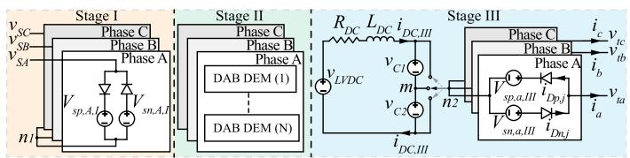  
Fig. 5. Schematic diagram of the proposed SST SFB-DEM.

# B. Proposed SFB-DEM of SST

An overall schematic diagram of the proposed SST SFB-DEM is shown in Fig. 5. Corresponding to the original Detailed Model (DM) of the SST in Fig. 1, there are three stages (Stages I, II, and III) in the proposed SFB-DEM, which are decoupled at their DC-link capacitors, as illustrated in Fig. 5. In Stage I, three-phase MVAC grid input voltages are denoted as $V _ { S A }$ , $V _ { S B }$ and $V _ { S C }$ , whereas the output voltage $v _ { t a } , v _ { t b }$ and $v _ { t c }$ in Stage III are connected to the LVAC grid or load with the line current denoted as $i _ { a } , i _ { b }$ and $i _ { c } .$ . The SFB modeling strategy, as introduced in Section A, will be applied to derive the proposed decoupled detailed and averaged equivalent circuit models in this section. Both deblocking and blocking modes of IGBTs are considered in the proposed SST equivalent models.

1) SFB-DEM of Stages Ⅰ and Ⅱ: As the schematic diagram of the SST in Fig. 1 presents, the chainlink AC-DC converter in Stage I is composed of N cascaded FBSMs. Each FBSM in Stage I is connected to an MVDC-link capacitor linking an FBSM at the primary side of a DAB module in Stage Ⅱ. As shown in Section II, the combination of Stages Ⅰ and Ⅱ follows the connection pattern of ISOP. Consequently, there are also N number of DAB modules connected to the FBSMs of Stage I through MVDC-link capacitors. Based on the schematic diagram of the SST in Fig. 1, an FBSM’s DC-link capacitor voltage differential equation can be discretized using explicit integration rule, e.g., FE method as

$$
v _ {C, j} ^ {k} (t + \Delta t) = v _ {C, j} ^ {k} (t) + \Delta t \cdot i _ {C, j} ^ {k} (t) / C _ {S M} \tag {1}
$$

where $C _ { S M }$ is the MVDC-link SM capacitance; $v _ { C , j } ^ { k } ( t )$ and $v _ { C , j } ^ { k } ( t + \Delta t )$ are the MVDC-link capacitor voltages at time instants t and $t + \Delta t$ , respectively; $i _ { C , j } ^ { k }$ is the capacitor current of the kth MVDC SM $( k = I \cdots N )$ in phase $j \left( j \ = \ A , B , C \right)$ , which can be represented by the switching functions and ACside currents of the two FBSMs, coupled through the MVDClink capacitors.

The switching function $S _ { I , j } ^ { k }$ of the kth SM in phase j of Stage I is denoted as

$$
S _ {I, j} ^ {k} = \left\{ \begin{array}{c c} 1 & \text {P o s i t i v e l y I n s e r t e d} \\ - 1 & \text {N e g a t i v e l y I n s e r t e d} \\ 0 & \text {B y p a s s e d} \end{array} \right. \tag {2}
$$

The switching function $S _ { I , j } ^ { k }$ represents the insertion status of the kth MVDC-link capacitor to phase j of the chainlink AC-DC converter. The switching function $S _ { p r i m , j } ^ { k }$ Skprim,j of the FBSM connected at the primary side of the kth DAB module can be defined in a similar fashion as in (2). According to the KCL at the positive node of an MVDC-link capacitor in Fig. 1, the kth MVDC-link capacitor current in phase j, i.e., $i _ { C , j } ^ { k }$ is determined

TABLE II EQUIVALENT OUTPUT VOLTAGES OF THREE-LEVEL CONVERTERS   

<table><tr><td rowspan="2">Operating Mode</td><td colspan="4">NPC/T-type Converter</td><td colspan="4">FC-Converter</td><td colspan="2">Ref. Node at (1)</td><td colspan="2">Ref. Node at (2)</td><td colspan="2">Ref. Node at (3)</td></tr><tr><td>T1</td><td>T2</td><td>T3</td><td>T4</td><td>T1</td><td>T2</td><td>T3</td><td>T4</td><td>Vsp</td><td>Vsn</td><td>Vsp</td><td>Vsn</td><td>Vsp</td><td>Vsn</td></tr><tr><td>Positive State</td><td>1</td><td>1</td><td>0</td><td>0</td><td>1</td><td>1</td><td>0</td><td>0</td><td colspan="2">vDC</td><td colspan="2">vC1</td><td colspan="2">0</td></tr><tr><td>Negative State</td><td>0</td><td>0</td><td>1</td><td>1</td><td>0</td><td>0</td><td>1</td><td>1</td><td colspan="2">0</td><td colspan="2">-vC2</td><td colspan="2">-vDC</td></tr><tr><td>Zero State of NPC/T-type Converter</td><td>0</td><td>1</td><td>1</td><td>0</td><td colspan="4">-</td><td colspan="2">vC2</td><td colspan="2">0</td><td colspan="2">-vC1</td></tr><tr><td rowspan="2">Zero State of FC-Converter</td><td rowspan="2" colspan="4">-</td><td>1</td><td>0</td><td>1</td><td>0</td><td colspan="2">vDC-vFC</td><td colspan="2">vC1-vFC</td><td colspan="2">-vFC</td></tr><tr><td>0</td><td>1</td><td>0</td><td>1</td><td colspan="2">vFC</td><td colspan="2">vFC-vC2</td><td colspan="2">vFC-vDC</td></tr><tr><td>Blocking (Diode)</td><td>0</td><td>0</td><td>0</td><td>0</td><td>0</td><td>0</td><td>0</td><td>0</td><td>vDC</td><td>0</td><td>vC1</td><td>-vC2</td><td>0</td><td>-vDC</td></tr></table>

by the AC chain-link current $i _ { C L , j } .$ , primary-side AC current of the corresponding kth DAB module, $i _ { p r i m , j } ^ { k }$ and the switching functions $S _ { I , j . } ^ { k } , S _ { p r i m , j } ^ { k }$ prim,j of the two FBSMs as

$$
i _ {C, j} ^ {k} = \left\{ \begin{array}{c} S _ {I, j} ^ {k} i _ {C L, j} - S _ {p r i m, j} ^ {k} \cdot i _ {p r i m, j} ^ {k}, D e b l o c k \\ | i _ {C L, j} | + \left| i _ {p r i m, j} ^ {k} \right|, B l o c k \end{array} \right. \tag {3}
$$

It is noted that the AC chainlink current $i _ { C L , j }$ and the DAB primary-side AC current $i _ { p r i m , j } ^ { k }$ always charge the MVDC-link capacitor via the diodes of the two FBSMs in IGBT blocking mode, regardless of the polarities of the AC currents, as shown in (3). Thus, the MVDC-link capacitor voltage at $t + \Delta t$ , i.e., (1) can be updated using (3), evaluated at time t.

Therefore, the total AC chainlink voltage of each phase, $v _ { C L , j }$ is calculated by summing up the individual FBSM output voltages in Stage I as,

$$
v _ {C L, j} = \sum_ {k = 1} ^ {N} S _ {I, j} ^ {k} \cdot v _ {C, j} ^ {k} \tag {4}
$$

In (4), an FBSM output voltage in Stage I is calculated by multiplying $v _ { C , j } ^ { k }$ with its corresponding switching function $S _ { I , j } ^ { k } .$

When Stage Ⅰ is operated in deblocking mode, the values of positive and negative equivalent voltage sources, $V _ { s p , j , I }$ and $V _ { s n , j , I }$ in Fig. 5 are computed as,

$$
V _ {s p, j, I} = V _ {s n, j, I} = v _ {C L, j} \tag {5}
$$

That is, the values of the positive and negative equivalent voltage sources in (5) are identical in deblocking mode. This is due to that fact that the chainlink phase voltage $v _ { C L , j }$ is determined by the switching function $S _ { I , j } ^ { \bar { k } }$ and SM voltage $v _ { C , j } ^ { k } ,$ irrespective of the polarities of the chainlink current $i _ { C L , j }$ .

When Stage I is operated in blocking mode, all the IGBTs are blocked whereas a chainlink current only flows through the diodes of an FBSM, as illustrated in Fig. 3(d) and (e). The FBSM capacitor is always charged to suppress the flow of $i _ { C L , j } .$ Correspondingly, $V _ { s p , j , I }$ and $V _ { s n , j , I }$ are derived as,

$$
\left\{ \begin{array}{l} V _ {s p, j, I} = \sum_ {k = 1} ^ {N} v _ {C, j} ^ {k} \\ V _ {s n, j, I} = - \sum_ {k = 1} ^ {N} v _ {C, j} ^ {k} \end{array} \right. \tag {6}
$$

The two diodes in the parallel equivalent branches of Stage I in Fig. 5 will conduct the chainlink current alternatively based on the current polarities, inserting an equivalent voltage source with different polarities, as shown in (6).

Applying the SFB modeling strategy, introduced in Section A to the two FBSMs at the primary and secondary sides of a DAB

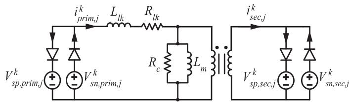  
Fig. 6. Proposed SFB-DEM of DAB module in Stage Ⅱ.

module in Stage Ⅱ, the proposed equivalent circuit of the kth DAB module is shown in Fig. 6. It is noted in Fig. 6 that $L _ { l k }$ and $R _ { l k }$ represent winding leakage inductance and winding copper resistance, respectively. $L _ { m }$ and $R _ { c }$ represent transformer magnetizing inductance and magnetic core loss (eddy current loss and hysteresis loss) equivalent resistance, respectively.

The primary-side equivalent voltage sources in Fig. 6, i.e., $V _ { s p , p r i m , j } ^ { k }$ V ksp,prim,j and V ksn, $V _ { s n , p r i m , j } ^ { k }$ can be derived using the switching functio n Sk $\dot { S } _ { p r i m , j } ^ { k }$ and the MVDC-link capacitor voltage $v _ { C , j } ^ { k }$ as

$$
V _ {s p, p r i m, j} ^ {k} = V _ {s n, p r i m, j} ^ {k} = \mathrm {S} _ {p r i m, j} ^ {k} \cdot v _ {C, j} ^ {k} \tag {7}
$$

It is noted that (7) is valid for the deblocking mode of the DAB module, while the blocking mode of the DAB module leads to the following equivalent voltage sources, according to Table I.

$$
\left\{ \begin{array}{l} V _ {s p, p r i m, j} ^ {k} = v _ {C, j} ^ {k} \\ V _ {s n, p r i m, j} ^ {k} = - v _ {C, j} ^ {k} \end{array} \right. \tag {8}
$$

Similarly, the secondary-side equivalent voltage sources in be derived using the secondary-side switching function, Fig. 6, i.e., V ksp, $V _ { s p , s e c , j } ^ { k }$ sec,j and V k $\dot { V } _ { s n , ~ s e c , j } ^ { k }$ sn, sec,j of the kth DAB module can $\mathrm { S } _ { s e c , j } ^ { k }$ and the LVDC-link pole-to-pole voltage vLV DC as

$$
V _ {s p, s e c, j} ^ {k} = V _ {s n, s e c, j} ^ {k} = \mathrm {S} _ {s e c, j} ^ {k} \cdot v _ {L V D C} \tag {9}
$$

and

$$
\left\{ \begin{array}{l} V _ {s p, s e c, j} ^ {k} = v _ {L V D C} \\ V _ {s n, s e c, j} ^ {k} = - v _ {L V D C} \end{array} \right. \tag {10}
$$

for deblocking and blocking modes, respectively.

It is shown in Fig. 1 that the DC output ports of all the DAB modules in Stage II share a common LVDC-link capacitor. Therefore, the LVDC-link capacitor current $i _ { L V D C }$ is calculated using the summation of the DC-side currents of all the DAB modules in the three phases together with the DC-side current of the Stage III’s NPC converter, $i _ { D C , I I I }$ as,

iLV DC

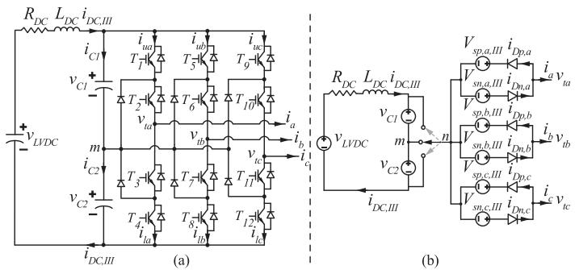  
Fig. 7. Three-phase three-level converter in Stage Ⅲ. (a) DM. (b) SFB-DEM.

$$
= \left\{ \begin{array}{l} \sum_ {j = A, B, C} \sum_ {k = 1} ^ {N} S _ {\text {s e c}, j} ^ {k} \cdot i _ {\text {s e c}, j} ^ {k} - i _ {D C, I I I} D e b l o c k \\ \sum_ {j = A, B, C} \sum_ {k = 1} ^ {N} \left| i _ {\text {s e c}, j} ^ {k} \right| - i _ {D C, I I I} B l o c k \end{array} \right. \tag {11}
$$

It is noted that the converter deblocking and blocking modes lead to different LVDC capacitor current in (11) due to IGBT or diode switching status in each mode.

Given the LVDC capacitor current in (11), the capacitor voltage $v _ { L V D C }$ can be integrated using FE method as,

$$
v _ {L V D C} (t + \Delta t) = v _ {L V D C} (t) + \Delta t \cdot i _ {L V D C} (t) / C _ {L V D C} \tag {12}
$$

where $v _ { L V D C } ( t ) \mathrm { a n d } v _ { L V D C } ( t + \Delta t ) z$ re the LVDC-link capacitor voltages at time instants t and $t + \Delta t .$ , respectively; $C _ { L V D C }$ is the LVDC-link capacitance.

2) SFB-DEM of Stage Ⅲ: The SFB-DEM of a three-phase three-level converter in Stage Ⅲ, shown in Fig. 7(a), is derived in this subsection. The SFB-DEM of the single-phase NPC converter, introduced in Fig. 4 of Section A, is used to derive the three-phase SFB-DEM equivalent circuit in Fig. 7(b). If three-phase two-level converter or other types of three-phase three-level converters (e.g., FC or T-type converters in Fig. 4(b) and (c)) are used in Stage III, the derivation of the corresponding SFB-DEM is very similar to the case of the three-phase NPC converter.

In the deblocking mode, the upper and lower DC-pole capacitor currents $i _ { C 1 }$ and $i _ { C 2 } .$ , shown in Fig. 7(a), are calculated from AC-side currents and the switching functions of the three-level converter as,

$$
\left\{ \begin{array}{l} i _ {C 1} = i _ {D C, I I I} - \left(S _ {1} \cdot i _ {a} + S _ {5} \cdot i _ {b} + S _ {9} \cdot i _ {c}\right) \\ i _ {C 2} = i _ {D C, I I I} + \left(S _ {4} \cdot i _ {a} + S _ {8} \cdot i _ {b} + S _ {1 2} \cdot i _ {c}\right) \end{array} \right. \tag {13}
$$

In the blocking mode, the DC-pole capacitor currents $i _ { C 1 }$ and $i _ { C 2 }$ are calculated using the diode currents in the equivalent circuit of Fig. 7(b) as,

$$
\left\{ \begin{array}{l} i _ {C 1} = i _ {D C, I I I} + \left(i _ {D p, a} + i _ {D p, b} + i _ {D p, c}\right) \\ i _ {C 2} = i _ {D C, I I I} + \left(i _ {D n, a} + i _ {D n, b} + i _ {D n, c}\right) \end{array} \right. \tag {14}
$$

Thus, the upper and lower DC-pole capacitor voltages $v _ { C 1 }$ and $v _ { C 2 }$ are integrated using FE method with the capacitor currents iC1, iC2 as,

$$
\left\{ \begin{array}{l} v _ {C 1} (t + \Delta t) = v _ {C 1} (t) + \Delta t \cdot i _ {C 1} (t) / C _ {1} \\ v _ {C 2} (t + \Delta t) = v _ {C 2} (t) + \Delta t \cdot i _ {C 2} (t) / C _ {2} \end{array} \right. \tag {15}
$$

After the DC-pole capacitor voltages $v _ { C 1 }$ and $v _ { C 2 }$ are calculated from (15), the equivalent voltage sources of Stage III in Fig. 7(b) can be calculated using Table II and the switching functions, i.e., $S _ { 1 } . . . S _ { 1 2 }$ of the three-level converter.

For example, assuming the reference node of Stage III is located at the mid-point $m ,$ the three-phase equivalent voltage sources in Fig. 7(b) in deblocking mode are calculated as,

$$
\left\{ \begin{array}{l} V _ {s p, a, I I I} = V _ {s n, a, I I I} = S _ {1} \cdot v _ {C 1} - S _ {4} \cdot v _ {C 2} \\ V _ {s p, b, I I I} = V _ {s n, b, I I I} = S _ {5} \cdot v _ {C 1} - S _ {8} \cdot v _ {C 2} \\ V _ {s p, c, I I I} = V _ {s n, c, I I I} = S _ {9} \cdot v _ {C 1} - S _ {1 2} \cdot v _ {C 2} \end{array} \right. \tag {16}
$$

When the three-level converter is blocked, all the IGBTs are switched off, whereas the AC currents can only flow through the diodes in each phase of the three-level converter. Consequently, the equivalent voltage sources in Fig. 7(b) are calculated as,

$$
\left\{ \begin{array}{l} V _ {s p, j, I I I} = v _ {C 1} \\ V _ {s n, j, I I I} = - v _ {C 2} \end{array} \right. \tag {17}
$$

When the reference node of Stage III is located at positive or negative DC rails, the equivalent voltage sources in Fig. 7(b) can be calculated from Table II (i.e., Cases (1) and (3)), accordingly.

The proposed SFB-DEM integrates the merits of a universal equivalent circuit structure for representing full-bridge, threelevel, three-phase converters with decoupled three stages for reduced dimensions of network matrices, and the capability of representing various converter operations in terms of deblocking and blocking modes.

# C. Proposed SFB-AVM of SST

This subsection introduces the SST’s SFB-AVM, which features further improved simulation efficiency compared to the proposed SFB-DEM in Section B. It is noted that the SFB-AVM shares a similar SFB modeling strategy and equivalent circuit model with the SFB-DEM, as presented in Figs. 5–7.

The assumptions of the SFB-AVM are the following: (1). balanced MV capacitor voltages among submodules i.e., the use of average MV capacitor voltage for each individual submodule and (2). equal circuit parameters of the submodules. Thus, the dynamics of the multiple FBSM and DAB submodules in the SST can be represented by one equivalent submodule per phase. In the following studies, an SFB-AVM with identical switching functions or with interleaved DAB submodules are derived respectively.

1) SFB-AVM With Identical Switching Functions: In Stage Ⅱ, all the switching functions $S _ { p r i m , j } ^ { k }$ j and Sksec $S _ { s e c , j } ^ { k }$ in each phase are the same, which are given as

$$
S _ {p r i m, j} ^ {1} = S _ {p r i m, j} ^ {2} = \dots = S _ {p r i m, j} ^ {N} = S _ {p r i m, j} \tag {18}
$$

$$
S _ {s e c, j} ^ {1} = S _ {s e c, j} ^ {2} = \dots = S _ {s e c, j} ^ {N} = S _ {s e c, j} \tag {19}
$$

Additionally, all the DAB modules are assumed to have identical primary and secondary-side parameters in the SFB-AVM. Thus, all the DAB modules can be represented by one equivalent DAB module in each phase, leading to the following:

$$
i _ {p r i m, j} ^ {1} = i _ {p r i m, j} ^ {2} = \dots = i _ {p r i m, j} ^ {N} = i _ {p r i m, j} \tag {20}
$$

$$
i _ {s e c, j} ^ {1} = i _ {s e c, j} ^ {2} = \dots = i _ {s e c, j} ^ {N} = i _ {s e c, j} \tag {21}
$$

The kth FBSM capacitor current in phase $j$ can be calculated using (3) with (18) and (20) as,

$$
i _ {C, j} ^ {k} = \left\{ \begin{array}{c} S _ {I, j} ^ {k} i _ {C L, j} - S _ {p r i m, j} i _ {p r i m, j}, D e b l o c k \\ | i _ {C L, j} | + | i _ {p r i m, j} |, B l o c k \end{array} \right. \tag {22}
$$

Accordingly, the summation of all FBSM capacitor voltages of (1) in the chainlink of phase $j$ is derived as,

$$
v _ {C, j, \Sigma} (t + \Delta t) = v _ {C, j, \Sigma} (t) + \Delta t \sum_ {k = 1} ^ {N} i _ {C, j} ^ {k} (t) / C _ {S M} \tag {23}
$$

For deblocking mode of Stage I, $v _ { C , j , \Sigma } ( t + \Delta t )$ can be simplified by substituting (22) into (23) as,

$$
\begin{array}{l} v _ {C, j, \sum} (t + \Delta t) \\ = v _ {C, j, \sum} (t) + \frac {\Delta t}{C _ {e q}} \left(S _ {n, j} i _ {C L, j} (t) - S _ {p r i m, j} i _ {p r i m, j} (t)\right) \tag {24} \\ \end{array}
$$

where the equivalent chainlink capacitance $C _ { e q }$ and average insertion index $S _ { n , j }$ of phase $j$ in the Stage Ⅰ are defined as

$$
C _ {e q} = \frac {C _ {S M}}{N} \tag {25}
$$

$$
S _ {n, j} = \frac {\sum_ {k = 1} ^ {N} S _ {I , j} ^ {k}}{N} \tag {26}
$$

The summation of capacitor voltages $v _ { C , j , \Sigma }$ in the blocking mode can be derived using (22) and (23), following a similar procedure. Consequently, the equivalent voltage sources of Stage Ⅰ in Fig. 5 for the deblocking mode are calculated as,

$$
V _ {s p, j, I} ^ {A V M} = V _ {s n, j, I} ^ {A V M} = S _ {n, j} \cdot v _ {C, j, \sum} \tag {27}
$$

and for the blocking mode as,

$$
\left\{ \begin{array}{l} V _ {s p, j, I} ^ {A V M} = v _ {C, j, \sum} \\ V _ {s n, j, I} ^ {A V M} = - v _ {C, j, \sum} \end{array} \right. \tag {28}
$$

The equivalent voltage sources of the primary side of the DAB module in Fig. 6 are expressed as,

$$
V _ {s p, p r i m, j} ^ {A V M} = V _ {s n, p r i m, j} ^ {A V M} = S _ {p r i m, j} \cdot v _ {C, j, \Sigma} / N \tag {29}
$$

and for the blocking mode as,

$$
\left\{ \begin{array}{l} V _ {s p, p r i m, j} ^ {A V M} = v _ {C, j, \sum} / N \\ V _ {s n, p r i m, j} ^ {A V M} = - v _ {C, j, \sum} / N \end{array} \right. \tag {30}
$$

The LVDC-link capacitor current of the proposed SFB-AVM can be derived as, using (11), (19), and (21) as

$$
i _ {L V D C} ^ {A V M} = \left\{ \begin{array}{l} \sum_ {j = A, B, C} N S _ {\sec , j} i _ {\sec , j} - i _ {D C, I I I}, \text {D e b l o c k} \\ \sum_ {j = A, B, C} N \left| i _ {\sec , j} \right| - i _ {D C, I I I}, \text {B l o c k} \end{array} \right. \tag {31}
$$

The LVDC capacitor voltage vLV DC can be calculated by substituting (29) into (12). Therefore, the equivalent voltage sources of the secondary side of the DAB module in Fig. 6 for deblocking mode can be calculated as,

$$
V _ {s p, s e c, j} ^ {A V M} = V _ {s n, s e c, j} ^ {A V M} = \mathrm {S} _ {s e c, j} \cdot v _ {L V D C} \tag {32}
$$

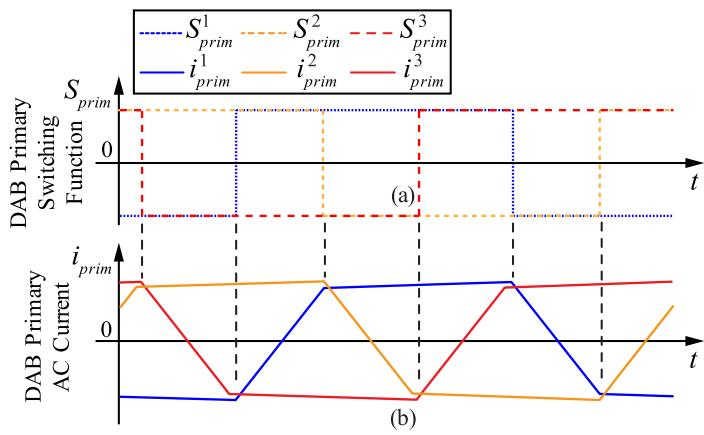  
Fig. 8. Interleaved operation of DAB submodules. (a) DAB primary-side switching functions. (b) DAB primary-side AC currents.

and for the blocking mode as,

$$
\left\{ \begin{array}{l} V _ {s p, s e c, j} ^ {A V M} = v _ {L V D C} \\ V _ {s n, s e c, j} ^ {A V M} = - v _ {L V D C} \end{array} \right. \tag {33}
$$

2) SFB-AVM With Interleaved DAB Submodules: This subsection validates the proposed SFB-AVM when the switching functions are different for the DAB submodules in each phase. The SST with interleaved switching operation of the DAB submodules is modeled in this subsection. The use of interleaved operation can effectively reduce LVDC capacitor voltage ripple. As shown in Fig. 8, symmetrical phase shifts are introduced into both switching functions and AC currents of the DAB submodules in (34) and (35) for each phase of the SST.

$$
\left\{ \begin{array}{l} S _ {p r i m, j} ^ {k} (t) = S _ {p r i m, j} \left(t - \frac {k - 1}{N f _ {s}}\right) \\ S _ {s e c, j} ^ {k} (t) = S _ {s e c, j} \left(t - \frac {k - 1}{N f _ {s}}\right) \end{array} \right. \tag {34}
$$

$$
\left\{ \begin{array}{l} i _ {p r i m, j} ^ {k} (t) = i _ {p r i m, j} \left(t - \frac {k - 1}{N f _ {s}}\right) \\ i _ {s e c, j} ^ {k} (t) = i _ {s e c, j} \left(t - \frac {k - 1}{N f _ {s}}\right) \end{array} \right. \tag {35}
$$

where $f _ { s }$ is the switching frequency of the DAB submodule and N is the number of DAB submodules per phase. Thus, the MVDC- and LVDC-link capacitor currents in the SFB-AVM can be calculated by substituting (34) and (35) into (3) and (11). Take the deblocking mode as an example. The MVDC- and LVDC-link capacitor currents in the SFB-AVM are calculated as

$$
\left\{ \begin{array}{l} i _ {C, j} ^ {k} (t) = S _ {I, j} ^ {k} i _ {C L, j} - S _ {p r i m, j} \left(t - \frac {k - 1}{N f _ {s}}\right) i _ {p r i m, j} \left(t - \frac {k - 1}{N f _ {s}}\right) \\ i _ {L V D C} ^ {A V M} (t) = \sum_ {\substack {j = A, B, C \\ -i _ {D C, I I I} (t)}} ^ {N} S _ {s e c, j} \left(t - \frac {k - 1}{N f _ {s}}\right) i _ {s e c, j} \left(t - \frac {k - 1}{N f _ {s}}\right) \end{array} \right. \tag{36}
$$

Thereafter, the MVDC- and LVDC-link capacitor voltages are integrated, using the DC currents in (36) and the FE method, similar to (24) and (12). Additionally, the equivalent AC voltages for the deblocking and blocking modes are computed by (27)−(30) and (32)-(33), respectively.

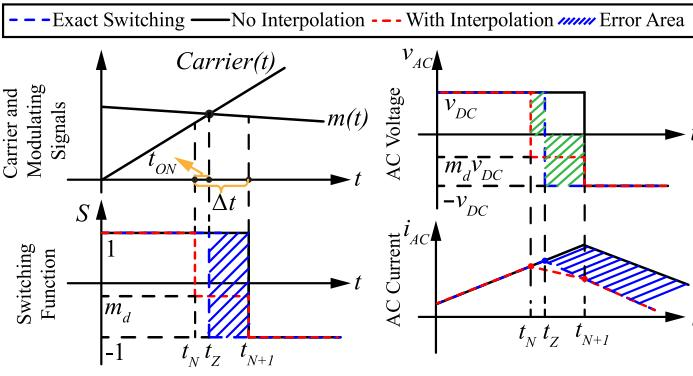  
Fig. 9. Switching interpolation technique for FB converter.

# D. Switching Interpolation Technique

In order to ensure accurate representation of switching events and simultaneously high simulation efficiency, this subsection proposes a switching interpolation technique for the multilevelmultimodule-based SST. The proposed switching interpolation technique can provide accurate compensation of intra-step switching events at the subsequent time step. A single-phase full-bridge converter with an inductor L as AC load is used as an illustrating example in this subsection. The AC output voltage of the single-phase full-bridge converter can be represented by the switching function S and DC-link voltage $V _ { D C }$ as

$$
v _ {A C} (t) = S (t) V _ {D C} = L \frac {d i _ {L} (t)}{d t} \tag {37}
$$

where $S \ = \ 1 \ o r \textrm { - } 1$ for bipolar operation as shown in Fig. 9, depending on the comparison result of the modulation signal, m(t) and the carrier signal, Carrier(t).

As presented Fig. 9, the switching function S can only vary at integer simulation time steps, $\mathrm { e . g . , } t _ { N + 1 }$ , the switching function without interpolation would result in a time delay, compared to the actual switching transition at $t _ { Z }$ . The blue shaded areas in the subplots of S and $i _ { A C }$ represent the simulation errors due to the inaccurate switching event prediction and inaccurate integration of inductor voltage $v _ { A C }$ during switching transition from $t _ { N }$ to $t _ { N + 1 }$ .

The intra-step switching effect is compensated using the fast average of $v _ { A C }$ during the time step $\Delta t ,$ where switching event occurs from $t _ { N }$ to $t _ { N + 1 }$ as

$$
v _ {A C, a v g} = \frac {t _ {o n} V _ {D C} + (\Delta t - t _ {o n}) (- V _ {D C})}{\Delta t} = m _ {d} V _ {D C} \tag {38}
$$

where the average modulation ratio $m _ { d }$ is defined as

$$
m _ {d} = 2 \frac {t _ {\text {o n}}}{\Delta t} - 1 = 2 d - 1 \tag {39}
$$

The duty ratio d in (39) is defined as actual switch on-time $t _ { o n }$ over the simulation time step $\begin{array} { r } { \Delta t { } , \mathrm { i . e . , } d { } = { } \frac { t _ { o n } } { \Delta t } } \end{array}$ ton Δt .

In Fig. 9, the summation of the two green shaded areas is used to calculate the fast average of $v _ { A C }$ from $t _ { N }$ to $t _ { N + 1 }$ in (38). Therefore, the integration of AC-side inductor voltage for the inductor current calculation can be carried out accurately during switching transition from $t _ { N } \tan t _ { N + 1 }$ , as shown in Fig. 9. Thus, the definition of switching function S can be expanded

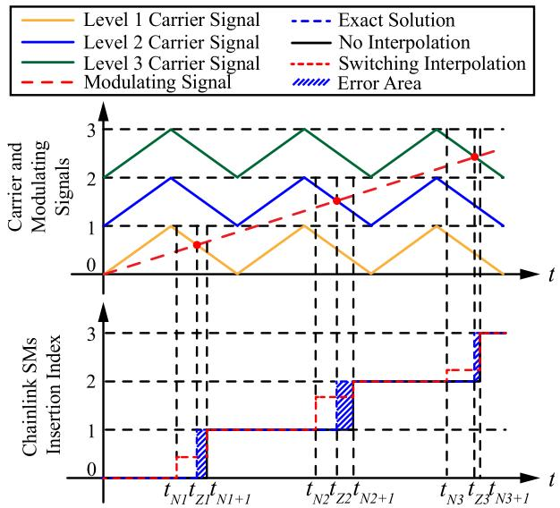  
Fig. 10. Switching interpolation for chainlink AC-DC converter of Stage I.

using the average modulation ratio $m _ { d }$ as

$$
S (t) = \left\{ \begin{array}{l} 1, t \leq t _ {N} \\ m _ {d}, t = t _ {N + 1} \\ - 1, t > t _ {N + 1} \end{array} \right. \tag {40}
$$

The AC output voltage, AC inductor current, and the switching function $S$ with switching interpolation are illustrated by the red dotted lines in Fig. 9. It is shown in Fig. 9 that the switching interpolation accurately compensates intra-step switching effect when large simulation time step is used for accelerated EMT simulation.

The switching interpolation can also be applied to the cascaded multilevel AC-DC converter in Stage I of the SST. Assuming a level-shifted PWM scheme is used for the cascaded AC-DC converter, the chainlink SMs insertion index is compensated using an average modulation ratio at each voltage level transition, as shown by the red dotted lines in Fig. 10. It is noted that the formulation of average modulation ratio for the multilevel AC-DC converter of Stage I is different than the case of bipolar operation in (39) and can be easily derived using the fast average voltage concept, similar to (38).

The individual switching signal for each SM of the cascaded multilevel AC-DC converter is obtained from the multilevel converter’s SM DC-link voltage balancing control and sorting algorithm. The average modulation ratio is used to compute the SM’s AC output voltage after each time step of the voltage level transition. Consequently, intra-step switching of the multilevel AC-DC converter at each voltage level is accurately compensated by the proposed switching interpolation technique.

# IV. MODEL VALIDATION

In this section, various EMT models of the SST are implemented and compared to verify the numerical accuracy and efficiency of the proposed SFB-DEM and SFB-AVM under different operating scenarios. The DM is implemented using MATLAB/Simulink/Simscape Electrical Toolbox while the

TABLE III SYSTEM PARAMETERS OF THE THREE-PHASE SST   

<table><tr><td>System Parameters</td><td>Symbols</td><td>Values</td></tr><tr><td>MVAC voltage rating</td><td>vMVAC</td><td>7.2 kV</td></tr><tr><td>LVAC voltage rating</td><td>vLVAC</td><td>120 V</td></tr><tr><td>Number of modules per phase</td><td>N</td><td>3</td></tr><tr><td>MVDC voltage</td><td>vMVDC</td><td>4 kV</td></tr><tr><td>LVDC voltage</td><td>LLVDC</td><td>400 V</td></tr><tr><td>Transformer turns ratio</td><td>Nr</td><td>10</td></tr><tr><td>Transformer leakage inductance</td><td>Llk</td><td>0.042 H</td></tr><tr><td>LVAC load</td><td>RL</td><td>50 Ω</td></tr><tr><td>Carrier frequency of chainlink AC-DC converter in Stage I</td><td>fCL</td><td>3 kHz</td></tr><tr><td>Switching frequency of DAB/NPC converter in Stages II and III</td><td>fsw</td><td>2 kHz</td></tr></table>

SFB-DEM and SFB-AVM are programmed in MATLAB script file (m-file). The VG-DEM proposed in [14] is also implemented in MATLAB m-file for benchmark comparison of the numerical efficiency with the proposed SFB models. All the models are executed on a PC with 3.20 GHz 16 Intel Core i9-12900k CPU with 128 GB RAM under the Microsoft Windows 11 operating system.

Steady-state, real power change, and LVDC-link pole-to-pole fault blocking operations with small or large simulation time steps are used to verify the accuracy of the proposed equivalent models. The SFB-DEM and SFB-AVM with switching interpolation are compared with the SFB-DEM and SFB-AVM without switching interpolation to highlight the importance of switching interpolation on simulation accuracy improvement for large time step. Finally, the SST with a large number of submodules, i.e., 30, 60 and 90 submodules, are used to benchmark simulation efficiency of the proposed SFB-DEM and SFB-AVM, with the prior-art models.

# A. SST Test System

In this subsection, the SST test system configuration and parameters are described for the case studies. The SST contains chainlink AC-DC converter with three FBSMs in each of the three phases in Stage Ⅰ and three DAB modules with Medium-Frequency Transformer (MFT) in Stage Ⅱ. All the LVDC terminals of DAB modules share one common LVDC-link capacitor. Stage III contains a three-phase three-level NPC inverter with its LVAC terminals connected to a three-phase resistive load with LC output filter.

The control strategies, including the PQ-control in dq-reference frame, and LSPWM are applied to the chainlink AC-DC converter in Stage Ⅰ as stated in Section II. The MVDC-link capacitor voltages of each phase are balanced by the voltage balancing control, providing stable MVDC-link terminal voltages to the DAB primary-sides in Stage Ⅱ. The phase-shift angle between switching signals of both FBSMs of the DAB module is determined by the outer-loop voltage controller to regulate the LVDC-link capacitor voltage. The system parameters are listed in Table III.

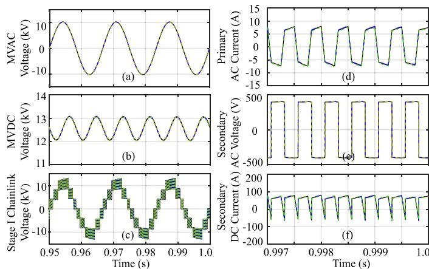

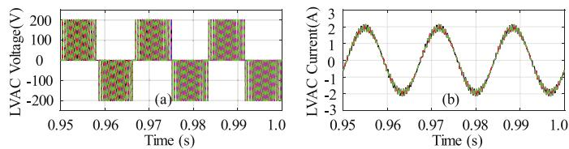  
Fig. 11. Simulation results of the SST’s Stages I and II. (a) MVAC-grid line-toneutral voltages. (b) Sum of MVDC-link voltages. (c) Stage I AC-DC converter chainlink voltage. (d) DAB primary-side AC voltage. (e) DAB secondary-side AC voltage. (f) DAB secondary-side DC current.   
Fig. 12. Simulation results of the SST’s Stage III. (a) LVAC phase-a voltage. (b) LVAC phase-a current.

# B. Simulation Accuracy

1) Small Time-Step Simulation: The subsection presents the simulation results with a small simulation time step of 1µs for the DM, SFB-DEM, and SFB-AVM to verify the accuracy of the proposed SFB equivalent circuit models. The dynamic performance at MV-grid side of the SST is presented in Fig. 11(a) and (b). In Stage Ⅰ, seven voltage levels of the chainlink voltage are observed since there are three cascaded FBSMs in each phase as presented in Fig. 11(c). The summation of capacitor voltages of the cascaded FBSMs in the Stage Ⅰ are presented in Fig. 11(b). Fig. 11(d)–(f) show the simulation results of Stage II DAB primary-side AC currents, secondary-side AC voltages and DC currents.

In Stage III, the LVAC-side load voltages and currents are presented in Fig. 12(a) and (b) respectively. It is observed in Figs. 11 and 12 that the simulation waveforms of the DM, SFB-DEM and SFB-AVM all match well for the small time step of 1 µs, which verify the accuracy of the equivalent models. It is noted that, for the small time step of 1 µs, the implementation of switching interpolation technique is not necessary for the proposed SFB-DEM, and SFB-AVM.

2) Large Time-Step Simulation: In this subsection, a large time step of 10µs is used to demonstrate the importance of switching interpolation to ensure accurate representation of switching events and simultaneously high simulation efficiency. The case study of real power change operation is used in this subsection. The real power reference is commanded to increase from 0.6 p.u. to 1 p.u. at t = 1 s. The reference DM is simulated with the time step of 1 µs while the SFB-DEMs and SFB-AVMs

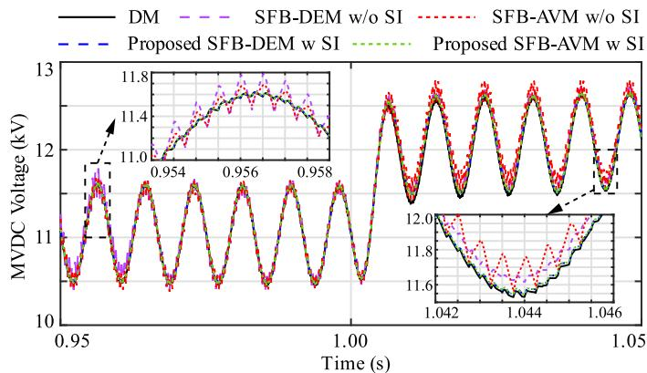

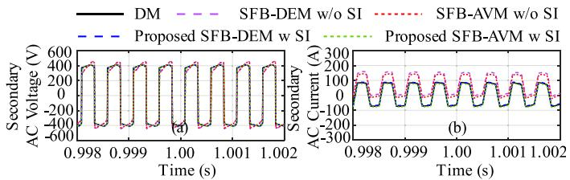  
Fig. 13. Sum of MVDC-link voltages in Stage II.   
Fig. 14. Simulation results of power change operation. (a) Stage II DAB secondary-side AC voltage. (b) Stage II DAB secondary-side AC current.

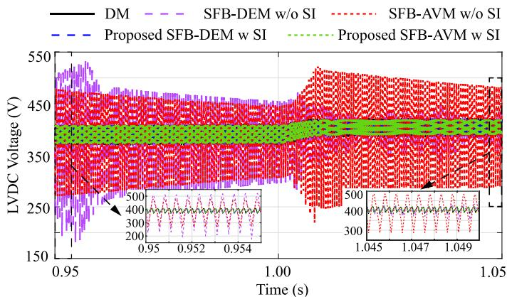  
Fig. 15. Stage II LVDC-link capacitor voltages.

with and without switching interpolation are simulated with the time step of 10 µs.

The waveforms of DM, the SFB-DEM and SFB-AVM with switching interpolation (i.e., SFB-DEM w SI and SFB-AVM w SI) are compared with the SFB-DEM and SFB-AVM without switching interpolation (i.e., SFB-DEM w/o SI and SFB-AVM w/o SI) in Figs. 13 –15.

It is observed from Figs. 13–15 that the SFB-DEM and SFB-AVM with switching interpolation produce accurate simulation results in comparison to the DM reference before and after the real power reference change. Conversely, the models without switching interpolation produce largely distorted simulation results due to the inaccurate representation of switching timing. Compared to the small time step (1µs) case study, the simulation efficiency with a large time step (10µs) is boosted by approximately 10 folds as the switching interpolation technique ensures the numerical accuracy for the use of a large time step.

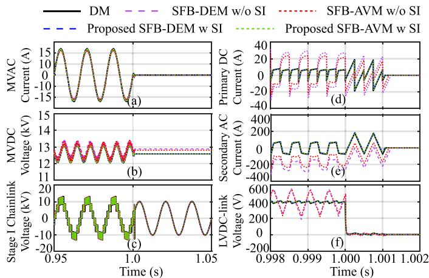  
Fig. 16. Simulation results of LVDC-link pole-pole fault operation. (a) Stage I MVAC current in phase A. (b) Stage I sum of MVDC-link voltage in phase A. (c) Stage I AC-DC converter chainlink voltage. (d) DAB primary-side DC current. (e) DAB secondary-side AC current. (f) LVDC-link voltage.

3) LVDC Pole-to-Pole Fault Simulation: This subsection provides a case study of LVDC-link pole-to-pole short-circuit fault to verify the SST blocking mode modeling in the proposed SFB-DEM and SFB-AVM. It is assumed that the LVDC-link pole-pole fault occurs at 1s and the DC fault is detected by the system 1ms later. All the IGBTs of the SST are set to block mode at 1.001s. In Stages I and II, the direction of converter currents is determined by the diodes in the FBSMs since all the IGBTs are blocked. In this subsection, the reference DM is simulated with small time step of 1µs while the SFB-DEM and SFB-AVM with and without switching interpolation are simulated with the large time step of 10µs to further verify the importance of switching interpolation in the equivalent models.

The simulation results of the proposed SFB-models are presented in Fig. 16. As shown in Fig. 16(a), MVAC grid fault currents drop to zero instantaneously when the SST is blocked, because the FBSMs in Stage Ⅰ AC-DC converter counter-react with the MVAC grid voltage to prevent the fault current flowing from MVAC to MVDC-link. In Stage Ⅱ, when the DC-fault occurs, secondary-side DC voltage reduces to zero quickly, shown in Fig. 16(f) while the primary and secondary-side currents, shown in Fig. 16(d) and (e), become zero when the fault is detected and all the FBSMs are blocked at 1.001s. As observed from Fig. 16, the use of switching interpolation in the equivalent models significantly improves the simulation accuracy for the large time step of 10µs.

4) Three-Phase AC-Side Fault Simulation: In order to further validate the proposed SFB-DEM and SFB-AVM, simulation studies of symmetrical three-phase AC-side fault are performed in this subsection. In the case study, the three-phase-to-ground short-circuit fault occurs in the MVAC side at 1s and lasts for 150ms. When the AC-fault is detected, real power reference of the converter is commanded to decrease to limit the three-phase short-circuit fault currents. After the fault is cleared at 1.15 s, the real power reference restores to its nominal value accordingly. The simulation results of the DM with the time step of 1 µs are used as reference solution, whilst the proposed SFB-DEM and SFB-AVM are simulated with the time step of 10 µs. The

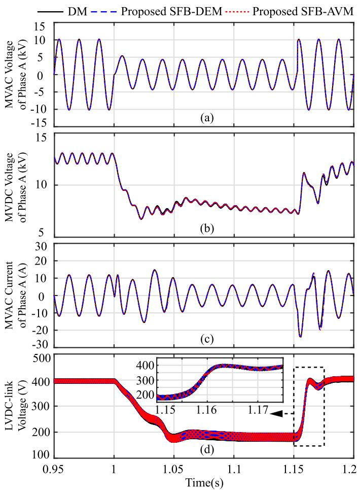  
Fig. 17. Simulation results of three-phase short-circuit fault in MVAC side. (a) MVAC phase-to-ground voltage in phase A. (b) Summation of MVDC-link capacitor voltages in phase A. (c) MVAC currents in phase A. d). LVDC-link voltage.

switching interpolation technique is employed in the proposed SFB-DEM and SFB-AVM to ensure numerical accuracy for the large time-step simulation. Fig. 17 presents dynamic performance of the proposed models during three-phase short-circuit fault and fault recovery periods.

In Fig. 17(a) and (b), voltage sags are observed in both MVAC phase-to-ground voltage and the summation of MVDC-link capacitor voltages when the AC-side short circuit occurs. After the fault is cleared at 1.15 s, the magnitude of the MVDC-link voltage gradually restores to its rated value. As Fig. 17(c) and (d) present, fast transients are noted in the MVAC currents when the short-circuit fault occurs. During the fault period, the magnitudes of both MVDC and LVDC-link voltage decrease due to the severe three-phase short-circuit fault. After the fault is cleared at 1.15 s, both PQ-control and LVDC outer-loop control effectively regulate the converter powers and DC voltages back to its pre-fault values. It is observed in Fig. 17 that the proposed SFB-DEM and SFB-AVM with a large time step of 10 µs produce almost identical results to the DM reference with a small time step of 1 µs. The good numerical accuracy of the proposed SFB-DEM and SFB-AVM for large time step is due to the use of switching interpolation.

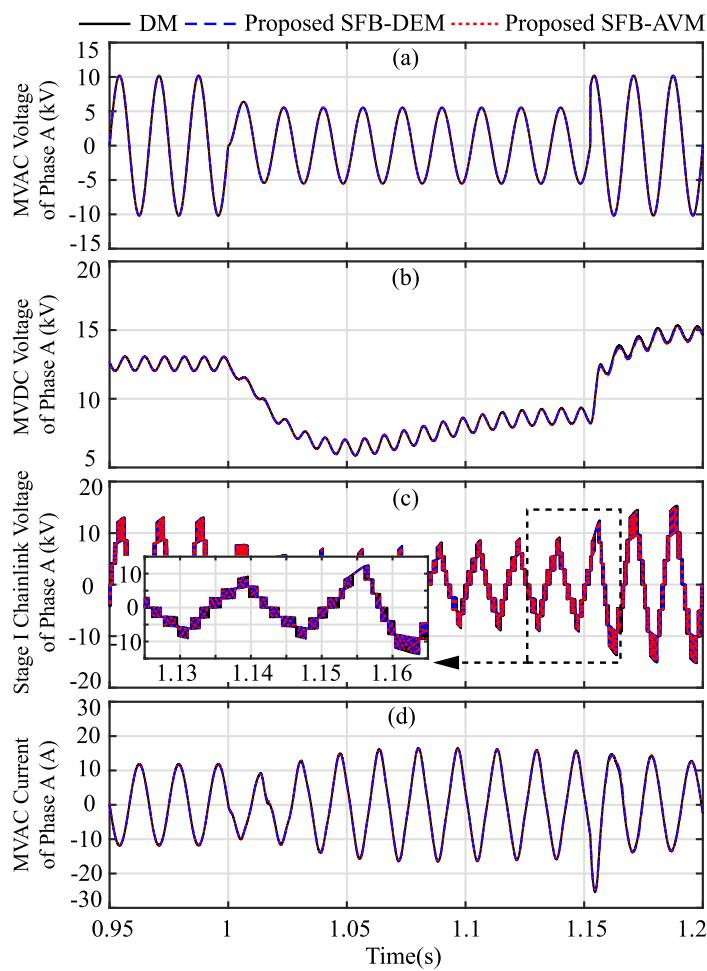  
Fig. 18. Simulation results of single-phase line-to-ground fault operation in phase A. (a) Stage I MVAC terminal line-to-ground voltage. (b) Summation of MVDC-link capacitor voltages. (c) Stage I AC/DC converter chainlink voltages. (d) MVAC currents.

5) Single-Phase AC-Side Fault Simulation: In this subsection, the proposed SFB-DEM and SFB-AVM are verified using asymmetrical single-phase-to-ground fault. In the simulation study, MVAC grid is subjected to a short-circuit fault between phase-A and ground at 1s and the fault is cleared at 1.15 s. The real power reference is maintained constant at 1 p.u. during the fault.

The proposed SFB-DEM and SFB-AVM are implemented with switching interpolation and tested with a large time step of 10 µs for comparison with the DM reference with a small time step of 1 µs. As presented in Fig. 18(a) and (c), voltage sags are observed in the MVAC-side and Stage I AC/DC converter chainlink voltages in phase A. The summation of DC-link capacitor voltages in phase A experiences sudden reduction in magnitude during the fault. It gradually recovers after the fault clearance due to the use of MVDC energy balancing control. It is also noticed in Fig. 18(d) that the magnitude of the fault current increases during the fault while the MVAC voltage decreases in phase A.

The simulation results of the proposed SFB-DEM and SFB-AVM converge with the DM reference solution under the

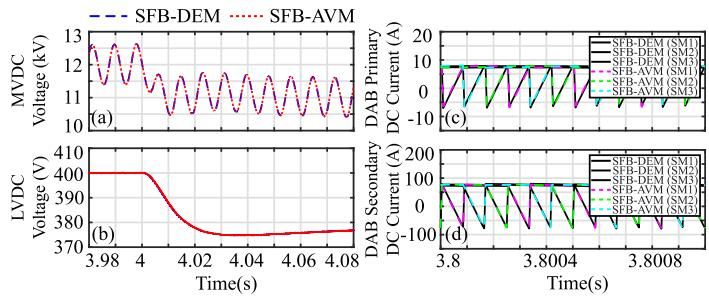  
Fig. 19. Simulation results of the SFB-AVM with interleaved DAB modules. (a) Summation of MVDC-link capacitor voltages in phase A. (b) LVDC-link voltage. (c) DAB primary-side DC currents. (d) DAB secondary-side DC currents.

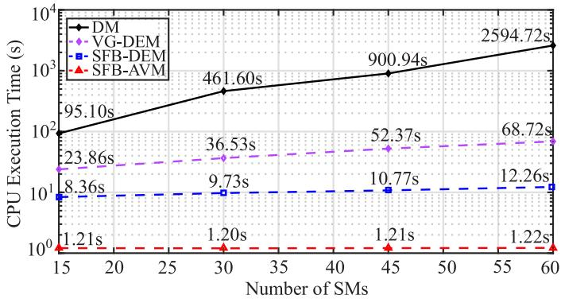  
Fig. 20. Simulation efficiency comparison of DM, VG-DEM, SFB-DEM, and SFB-AVM.

single-phase-to-ground fault scenario, which verifies the fidelity and practical applicability of the proposed models.

6) Simulation of SFB-AVM With Interleaved DAB Modules: This subsection validates the proposed SFB-AVM with interleaved DAB modules in comparison with the SFB-DEM. Both models are executed with the simulation time step of 10µs. Fig. 19 presents the simulation results of the SST SFB-DEM and SFB-AVM with interleaved DAB modules. The switching interpolation technique has been implemented in the proposed models to ensure modeling accuracy. In the simulation study, real power reference is commanded to decrease from 1 p.u. to 0.6 p.u. at 4s. As shown in Fig. 19(a) and (b), both the summation of MVDC-link capacitor voltages and LVDC-link voltages drop instantaneously when the power reference reduces. Fig. 19(c) and (d) present the simulation results of primary and secondaryside DC currents from the three DAB submodules in phase A, wherein symmetrical phase shifts are observed. It is also noted that the simulation results of the SFB-DEM and the SFB-AVM match well during steady-state and transient periods. Thus, the modeling accuracy of the SFB-AVM with interleaved DAB modules is validated.

# C. Simulation Efficiency Comparison

In this subsection, the simulation efficiency of the proposed SFB-DEM and SFB-AVM are compared to the conventional DM and the VG-DEM. Different numbers of submodules (i.e., $N _ { S M } = \ 1 5$ , 30, 45, and 60) of Stage I FBSMs and Stage II DAB modules in three phases are used in the case study where the simulation time is set to be 0.5s with the time step of 1µs. Fig. 20

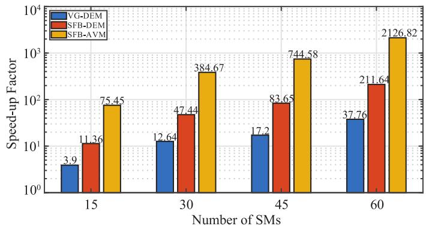  
Fig. 21. Speed-up factor comparison of VG-DEM, SFB-DEM, and SFB-AVM.

illustrates the CPU execution times of the DM, VG-DEM, and the proposed SFB-DEM and SFB-AVM.

It is observed in Fig. 20 that both VG-DEM and SFB-DEM accelerate the EMT simulation of the SST compared to the DM. However, the proposed SFB-DEM enables further numerical efficiency improvement, compared to the VG-DEM. It is noted that the VG-DEM is implemented using equivalent circuit model based on 2-port Norton equivalent circuits [14], [15], [16] with time-variant G-matrix for EMT solution. Therefore, the refactorization of G-matrix and the larger total node number in the VG-DEM cause its slower simulation speed, compared to the proposed SFB-DEM, which has a constant G-matrix regardless of switching status of the SST. Furthermore, as the three stages of the SST are decoupled at the MVDC- and LVDC-link capacitors, significant reduction of total node number is achieved, i.e., only one nodal equation is solved in each DAB module, which greatly accelerates the EMT simulation.

As observed in Fig. 20, the CPU execution times of VG-DEM and SFB-DEM increase linearly with submodule numbers while the SFB-AVM has almost constant CPU execution time, independent of submodule numbers. The reason is that all the modules in the SFB-AVM are assumed identical and only one equivalent capacitor per phase is adopted to represent Stages I and II of the SST. Consequently, the numerical efficiency of the SFB-AVM is not affected by the number of submodules, which is advantageous to further improve the simulation efficiency over the VG- and SFB-DEMs. Fig. 21 summarizes the speed-up factors (the ratios of the CPU execution time of the equivalent models to that of the DM) for different numbers of submodules in the SST. It is demonstrated in Fig. 21 that larger number of submodules leads to more significant increase in numerical efficiency for the equivalent models.

# V. CONTROLLER HARDWARE-IN-THE-LOOP TESTS

In order to further validate the proposed SFB-DEM and SFB-AVM, controller hardware-in-the-loop (CHIL) tests are performed to prototype voltage mode controls of the SST in a digital control platform (TI DSP) to regulate MVDC- and LVDC-link voltages. As presented in Fig. 22, the CHIL tests are implemented in OPAL-RT OP5700 real-time simulator and Texas Instruments (TI) C2000 real-time microcontroller, i.e., TI LAUNCHXL-F280025C. The TI controller hardware

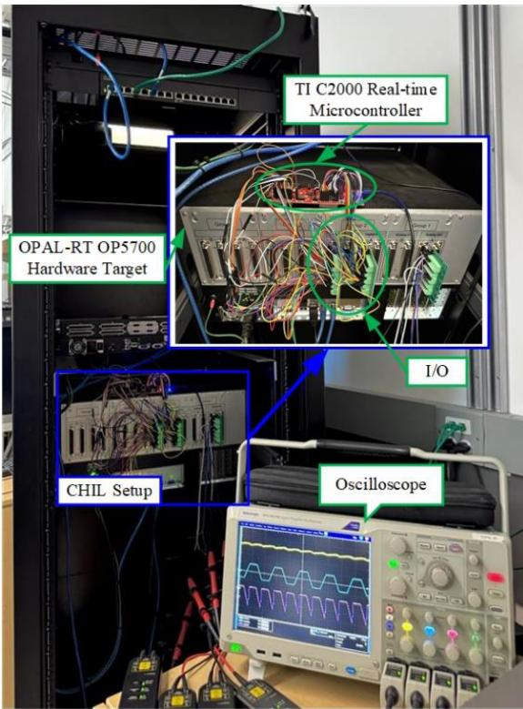  
Fig. 22. CHIL test setup.

is interfaced with the OPAL-RT OP5700 real-time simulator through digital IOs. An SFB-DEM (9 SMs in three phases) and an SFB-AVM (30 SMs in three phases) are implemented in MATLAB/Simulink environment and executed on OP5700’s CPU. The real-time simulation performances of the proposed models have been validated first by comparing them with offline simulation results of the DM reference. Then, the MVDC-link energy balance (voltage) control in Stage I and the LVDClink outer-loop voltage control in Stage II are implemented in TI LAUNCHXL-F280025C digital controller, respectively. Finally, the CHIL test results of the proposed models are measured using an oscilloscope through analog outputs of OPAL-RT OP5700.

In order to validate the accuracy of the CHIL test results, resistive load resistor at LVDC terminal is commanded to change from 1 p.u. to 0.86 p.u. at t = 25s. Simulation time step is 25 µs for the proposed models in real-time simulation. The proposed switching interpolation technique has been implemented in the proposed models to ensure numerical accuracy of large time-step simulation.

# V.

1) CHIL Test of SFB-DEM: As Fig. 23 presents, dynamic performances of the SST in the CHIL tests including AC/DC converter chainlink voltage, MVAC current, and the summation of MVDC-link capacitor voltages are compared with offline reference solutions of the DM. Fig. 23(a) (c) are the screenshots of the CHIL test results, measured by the oscilloscope. It’s noted in Fig. 23(c) and (f) that the summation of MVDC-link capacitor voltages decreases instantaneously when the load change

operation is applied at 25s. Afterwards, the MVDC voltage is regulated back gradually to the rated value by the MVDC-link energy balance control.

2) CHIL Test of SFB-AVM: This subsection validates the accuracy of the proposed SFB-AVM by comparing its CHIL test results with the offline simulation results of the DM reference in the SST’s Stages I and II. As presented in Fig. 24(c) and (f), the summation of MVDC-link capacitor voltages drops instantly when the load-change operation is triggered. Similarly, as shown in Fig. 24(i) and (l), the magnitudes of the LVDC-link voltages decrease and recover back to the rated value gradually due to the LVDC-link outer-loop voltage control. It can be observed in Fig. 24(g), (h), (j), and (k) that the Stage II DAB secondary AC and DC currents increase slightly while the LVDC-link voltage drops due to the increased load power.

In summary, the CHIL test results of the proposed SFB-DEM and SFB-AVM match well with offline simulation results of the DM reference solutions in both steady-state and load power change transient, respectively. Compared to the proposed SFB-DEM, the proposed SFB-AVM is more advantageous for achieving real-time simulation of the SST with more submodules since the SFB-AVM use one equivalent submodule to represent all submodules in each phase of the SST.

# VI. DISCUSSION

# A. Applicability and Characteristics of Various SST Models

The proposed SFB-AVM is different from the conventional/standard AVMs [26], [27], [28], [29] where the instantaneous values of the switched voltage and current are averaged in one switching cycle to remove the switching ripples. The conventional/standard AVMs use analytical expressions to represent the converter’s large or small signal behaviors which can be very useful for converter controller design and stability analysis. However, the conventional/standard AVMs do not represent IGBT switching or blocking operations. Therefore, they cannot be used to simulate converter switching harmonics and severe operating scenarios such as DC-link pole-to-pole fault, converter IGBT blocking mode operations, three-phase and single-phase AC faults.

On the other hand, the proposed SFB-AVM represents detailed switching events of the SST in submodule level (Stage I FBSM and Stage II DAB DC-DC converter submodule). Therefor the proposed SFB-AVM can simulate switching harmonics/ripples and low-level controls of the SST, e.g., FBSM stack energy balancing in Stage I and interleaving operation of DAB submodules in Stage II. This paper has summarized the comparison results of the conventional/standard AVMs with the prior-art DEMs and the proposed SFB-DEM and SFB-AVM for model applicability in Table IV. It is noted in Table IV that the proposed SFB-AVM cannot be used to simulate the individual FBSM capacitor voltage balancing control (VBC) and for the SSTs with unequal circuit parameters among the submodules.

The model characteristics of the prior-art DEMs of the SSTs are compared to the proposed SFB-DEM and SFB-AVM and are summarized in Table V. It is seen in Table V that most of

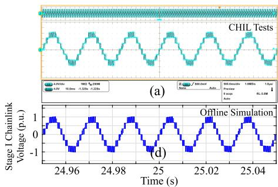

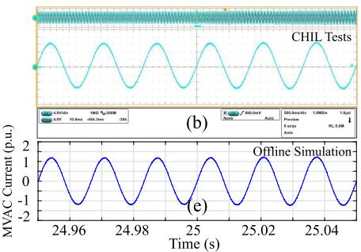

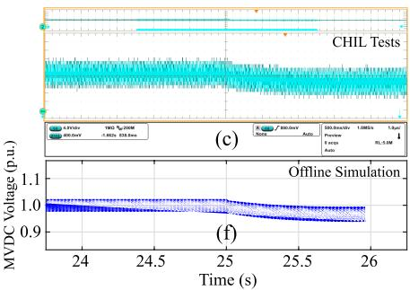  
Fig. 23. Comparison of SST SFB-DEM CHIL test results with offline simulation. (a) Stage I AC/DC converter chainlink voltage CHIL test result. (b) Stage I MVAC current CHIL test result. (c) Stage I sum of MVDC voltages CHIL test result. (d) Stage I AC/DC converter chainlink voltage offline simulation result. (e) Stage I MVAC current offline simulation result. (f) Stage I sum of MVDC voltages offline simulation result.

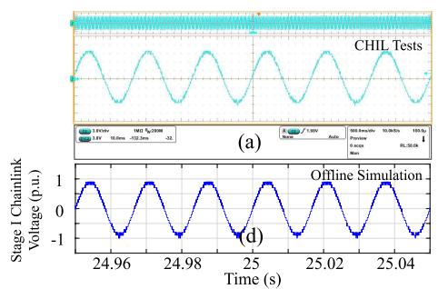

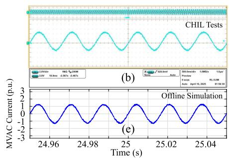

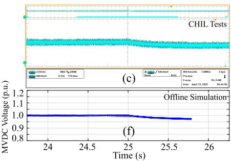

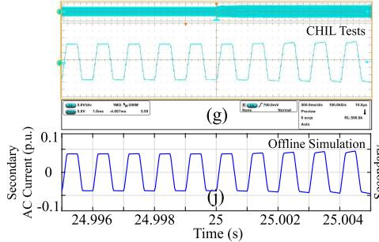

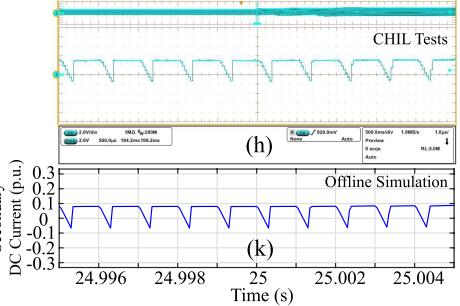

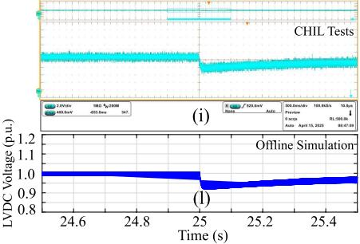  
Fig. 24. Comparison of SST SFB-AVM CHIL test results with offline simulation. (a) Stage I AC/DC converter chainlink voltage CHIL test result. (b) Stage I MVAC current CHIL test result. (c) Stage I sum of MVDC voltages CHIL test result. (d) Stage I AC/DC converter chainlink voltage offline simulation result. (e) Stage I MVAC current offline simulation result. (f) Stage I sum of MVDC voltages offline simulation result. (g) DAB secondary AC current CHIL test result. (h) DAB secondary DC current CHIL test result. (i) LVDC-link voltage CHIL test result. (j) DAB secondary AC current offline simulation result. (k) DAB secondary DC current offline simulation result. (l) LVDC-link voltage offline simulation result.

TABLE IV COMPARISON OF MODEL APPLICABILITY OF VARIOUS SST MODELS   

<table><tr><td>Model Type</td><td>Submodule PWM</td><td>MVDC Energy Balancing</td><td>Switching Modeling</td><td>AC Fault Modeling</td><td>VBC</td><td>Parameter Variation</td></tr><tr><td>Standard AVMs in [26]–[29]</td><td>×</td><td>×</td><td>×</td><td>×</td><td>×</td><td>×</td></tr><tr><td>Prior-art DEMs in [14]–[16], [30], [31]</td><td>✓</td><td>✓</td><td>✓</td><td>✓</td><td>✓</td><td>✓</td></tr><tr><td>Proposed SFB-DEM</td><td>✓</td><td>✓</td><td>✓</td><td>✓</td><td>✓</td><td>✓</td></tr><tr><td>Proposed SFB-AVM</td><td>✓</td><td>✓</td><td>✓</td><td>✓</td><td>×</td><td>×</td></tr></table>

the prior art DEMs [14], [15], [16], [31] use variable G-matrix method, leading lower simulation efficiency. The DEM in [30] uses conventional L/C-ADC model, which achieves constant G matrix but causes fictitious voltage and current oscillations during switching transitions. The proposed SFB-DEM is free of fictitious voltage and current oscillations during switching transitions while maintaining constant G matrix. It is also noted in Table V that the proposed SFB-DEM and SFB-AVM are

the only models that propose universal modeling framework for various type of submodules and switching interpolation to enable large time step simulation.

# B. Numerical Stability of the Proposed Models

The prior art work in [14] decouples the SSTs at the transformer winding AC input and output ports by assuming the

TABLE V COMPARISON OF SST EQUIVALENT CIRCUIT MODELS CHARACTERISTICS   

<table><tr><td>Model Type</td><td>Network Decoupling</td><td>Node Reduction</td><td>Constant G-matrix</td><td>IGBT Blocking Mode</td><td>Universal Modeling Framework</td><td>Switching Interpolation</td><td>AC-Chainlink with Cascaded FBSMs</td></tr><tr><td>VG-DEM in [14]–[16]</td><td>✓</td><td>✓</td><td>×</td><td>✓</td><td>×</td><td>×</td><td>✓</td></tr><tr><td>FPGA DEM in [30]</td><td>✓</td><td>✓</td><td>✓</td><td>×</td><td>×</td><td>×</td><td>×</td></tr><tr><td>FPGA DEM in [31]</td><td>✓</td><td>✓</td><td>×</td><td>×</td><td>×</td><td>×</td><td>✓</td></tr><tr><td>Proposed SFB-DEM</td><td>✓</td><td>✓</td><td>✓</td><td>✓</td><td>✓</td><td>✓</td><td>✓</td></tr><tr><td>Proposed SFB-AVM</td><td>✓</td><td>✓</td><td>✓</td><td>✓</td><td>✓</td><td>✓</td><td>✓</td></tr></table>

winding AC input and output voltages at the present time step are approximated by the valves at the previous time step. However, the transformer winding AC voltages of the DAB submodules are square-waves. The decoupling at the transformer winding AC input and output ports may introduce large numerical error and instability when transformer winding voltages experience instantaneous changes due to FBSM switching operations. A cut-set-based decoupling of the SSTs was proposed in [16] which uses the DC-link capacitor voltages from the previous time step in the present time step simulation. Thus, one time step delay of the DC-link capacitor voltages is introduced in [16], which may cause numerical instability when a large time step is used for a numerical system with high stiffness. However, since the DC-link capacitor voltage changes slowly due to the large capacitance, the decoupling at DC-link capacitor is a better choice than the one at the transformer winding input and output ports [14].

The decoupling of the SSTs in the paper is also performed at the DC-link capacitors (i.e., MV and LVDC capacitors). But the proposed decoupling method is based on the use of explicit integration rules, e.g., FE method to discretize the DC-link capacitors. The other circuit components can be discretized by using Backward Euler method, Trapezoidal Rule, or Gear’s methods, which are implicit integration rules with A-stability. The use of FE method is more straightforward for mathematic formulation and model implementation than the cut-set-based decoupling method in [16]. Moreover, the numerical accuracy and stability properties of the explicit integration rules are well understood in the literature than the cut-set-based decoupling method. In the classical numerical analysis textbooks, e.g., [35], the first order homogenous ordinary differential equation (ODE), i.e., $\begin{array} { r } { \frac { d y } { d t } = - a y } \end{array}$ is used to characterize the stability region and the associated time steps to maintain numerical stability. When the FE method is applied to the first order ODE, the corresponding difference equation is derived as $y _ { i + 1 } = y _ { i } \ ( 1 - a \Delta t )$ where $\Delta t$ is the time step. $\left| 1 - a \Delta t \right|$ should be less than 1 to maintain numerical stability, which indicates $\textstyle \Delta t < { \frac { 2 } { a } }$ . In SST’s normal operating scenario, DC-link capacitor voltage dynamics are slow because of large DC-link capacitance. The simulation time step is much smaller in $\mu \mathrm { s }$ level, due to high frequency switching of DAB submodules, than the critical time step for which the numerical instability occurs for the DC-link capacitors. However, when a DC-link capacitor is subjected to fast transient, such as short-circuit/shoot-through fault, numerical instability may occur when the FE method is used. In order to avoid numerical instability, either the simulation time step has to be reduced to

capture the fast short-circuit transient or the FE method needs to be replaced by an implicit method, such as Trapezoidal Rule for discretizing the DC-link capacitor.

# C. Including Power Losses of SST in the Proposed Models

The power losses of the SSTs include semiconductor conduction loss, switching loss, capacitor loss, high frequency transformer winding copper loss and magnetic core loss. These power losses can be conveniently incorporated into the equivalent circuits of the proposed SFB-DEM and SFB-AVM whenever necessary for different modeling and case study purposes. The semiconductor conduction loss is calculated using the semiconductor I-V on-state characteristic and the instantaneous current flowing through the semiconductor [32]. Since the on-state characteristic of IGBTs and diodes are usually nonlinear functions of the device current, piece-wise linear approximation is used via the slope resistance $( R _ { T }$ or $R _ { D } )$ and the saturation voltage $( V _ { T 0 }$ or $V _ { D 0 } )$ . The semiconductor on-state characteristic $( R _ { T }$ $V _ { T 0 }$ or $R _ { D }$ $V _ { D 0 } )$ can be included into the equivalent circuits of the proposed SFB-DEM and SFB-AVM as follows. Let’s take an FB converter, shown in Fig. 3, for example. When the submodule is positively inserted with $i _ { S M } > 0$ , the two diodes of the submodule are conducting. Therefore, the output voltage of the submodule for positive current direction is given as

$$
v _ {s p} = v _ {C} + 2 \left(R _ {D} i _ {S M} + V _ {D 0}\right) \tag {41}
$$

When the submodule is positively inserted with $i _ { S M } < 0 .$ , the two IGBTs, $T _ { 1 }$ and $T _ { 4 }$ are conducting. Therefore, the output voltage of the submodule for negative current direction is expressed as

$$
v _ {s n} = v _ {C} + 2 \left(R _ {T} i _ {S M} - V _ {T 0}\right) \tag {42}
$$

It is noted the submodule current from the previous time step is used in the on-state voltage drop of (41) and (42). This represents one time-step relaxation in on-state voltage drop calculation, which is acceptable because the converter AC current is continuous and the simulation timestep is small, i.e., tens of $\mu \mathrm { s }$ for the fundamental frequency 50/60 Hz AC current. A similar output voltage analysis can be performed for negative insertion, bypass, and blocking of the FB converter in Fig. 3. Therefore, considering the on-state voltage drops of the IGBTs and diodes, the equivalent output voltages of the FB converter can be reformulated in Table VI. Accordingly, the output voltage

TABLE VI EQUIVALENT OUTPUT VOLTAGES OF FULL-BRIDGE CONVERTER CONSIDERING ON-STATE VOLTAGE OF SEMICONDUCTORS   

<table><tr><td>Operating Mode</td><td>\( V_{sp} \)</td><td>\( V_{sn} \)</td></tr><tr><td>Positive Insertion</td><td>\( v_{C} + 2(R_{D}i_{SM} + V_{D0}) \)</td><td>\( v_{C} + 2(R_{T}i_{SM} - V_{T0}) \)</td></tr><tr><td>Negative Insertion</td><td>\( -v_{C} + 2(R_{T}i_{SM} + V_{T0}) \)</td><td>\( -v_{C} + 2(R_{D}i_{SM} - V_{D0}) \)</td></tr><tr><td>Bypass</td><td>\( (R_{T} + R_{D})i_{SM} + V_{T0} + V_{D0} \)</td><td>\( (R_{T} + R_{D})i_{SM} - V_{T0} - V_{D0} \)</td></tr><tr><td>Blocking (Diode)</td><td>\( v_{C} + 2(R_{D}i_{SM} + V_{D0}) \)</td><td>\( -v_{C} + 2(R_{D}i_{SM} - V_{D0}) \)</td></tr></table>

of the chainlink voltage of Stage I can be expressed as

$$
\left\{ \begin{array}{l} V _ {s p, j, I} = \sum_ {k = 1} ^ {N} V _ {s p, j, I} ^ {k} \\ V _ {s n, j, I} = \sum_ {k = 1} ^ {N} V _ {s n, j, I} ^ {k} \end{array} \right. \tag {43}
$$

The output voltages of the DAB submodules in Stage II and 3-level converter in Stage III can also include semiconductor onstate voltages in the proposed SFB-DEM and SFB-AVM using a similar method.

The semiconductor switching losses can be calculated using instantaneous semiconductor currents and voltages before and after switching events. These instantaneous voltages and currents are used to calculate the switching energies per pulse [32], [33]. The exact switching-loss calculation requires the counts of the switching transitions and the values of switching energy per switching event. The IGBT turn-on, turn-off energies $( E _ { o n } , \ E _ { o f f } )$ , and the diode reverse recovery energy $( E _ { r e c } )$ can be obtained from a semiconductor datasheet.

The nonlinear energies vs. device current characteristics $E _ { o n } ( i _ { C } ) , ~ E _ { o f f } ( i _ { C } )$ , and $E _ { r e c } ( i _ { F } )$ are approximated using piece-wise linear functions to simplify the switching loss calculation [32], [33]. The switching losses are calculated based on the detailed switching currents and voltages within one fundamental frequency period by

$$
\begin{array}{l} P _ {o n, T} = \frac {1}{T} \sum_ {i = 1} ^ {N _ {i}} \left\{\frac {v _ {T , o f f} (t _ {i})}{v _ {T , r e f}} \frac {i _ {C} (t _ {i})}{i _ {C , r e f}} E _ {o n} \left(i _ {C, r e f}\right) \right\} (44) \\ P _ {o f f, T} = \frac {1}{T} \sum_ {j = 1} ^ {N _ {j}} \left\{\frac {v _ {T , o f f} (t _ {j})}{v _ {T , r e f}} \frac {i _ {C} (t _ {j})}{i _ {C , r e f}} E _ {o f f} \left(i _ {C, r e f}\right) \right\} (45) \\ P _ {r e c, D} = \frac {1}{T} \sum_ {k = 1} ^ {N _ {k}} \left\{\frac {v _ {D , r e c} \left(t _ {k}\right)}{v _ {D , r e f}} \frac {i _ {F} \left(t _ {k}\right)}{i _ {F , r e f}} E _ {r e c} \left(i _ {F, r e f}\right) \right\} (46) \\ \end{array}
$$

where $P _ { o n , T } , P _ { o f f , T }$ , and $P _ { r e c , D }$ represent the IGBT turn-on, the IGBT turn-off, and the diode reverse recovery losses. At every switching instant $( t _ { i } , t _ { j } , t _ { k } )$ , the switching energies are scaled by the ratios of the occurring blocking voltage to the reference blocking voltage and the switching current to the reference current. The instantaneous switching energies are summed over the duration of a fundamental period, where $N _ { i } , N _ { j }$ , and $N _ { k }$ are the numbers of all switching events. It is noted that the diode turn-on losses are considered negligible. The total switching

loss is calculated by the sum of the IGBT and diode switching losses as

$$
P _ {s w} = P _ {o n, T} + P _ {o f f, T} + P _ {r e c, D} \tag {47}
$$

In (44)–(46), the off-state voltages of IGBT and diode, $v _ { T , o f f }$ and $v _ { D , r e c }$ are approximately equal to the DC-link voltage of an FBSM. Therefore, $v _ { T , o f f }$ and $v _ { D , r e c }$ can be factorized from (47) so that a switching loss related current, $I _ { s w , l o s s }$ in the DC side (as suggested in [34]) can be expressed as

$$
\begin{array}{l} I _ {s w, l o s s} = \frac {E _ {o n} (i _ {C , r e f})}{v _ {T , r e f} i _ {C , r e f}} \frac {1}{T} \sum_ {i = 1} ^ {N _ {i}} i _ {C} (t _ {i}) \\ + \frac {E _ {o f f} (i _ {C , r e f})}{v _ {T , r e f} i _ {C , r e f}} \frac {1}{T} \sum_ {j = 1} ^ {N _ {j}} i _ {C} (t _ {j}) \\ + \frac {E _ {r e c} \left(i _ {F , r e f}\right)}{v _ {D , r e f} i _ {F , r e f}} \frac {1}{T} \sum_ {k = 1} ^ {N _ {k}} i _ {F} \left(t _ {k}\right) \tag {48} \\ \end{array}
$$

The proposed SFB-DEM and SFB-AVM both simulate detailed switching transitions of the semiconductor voltages and currents in submodule level. Therefore, the switching loss related current, $I _ { s w , l o s s }$ can be calculated for each IGBT and is included in the proposed SFB-DEM and SFB-AVM as a parallel current source to the DC-link capacitor of an FBSM to include switching loss. The above-mentioned semiconductor switching loss modeling method can also be applied to the equivalent circuits of 3-level converters in Stage III.

The capacitor loss of a submodule in the SST can be modeled using an equivalent resistance in series with an ideal capacitance. The equivalent series resistance (ESR) represents the resistance within the capacitor, including the resistance of leads, electrodes, and dielectric losses. When calculating capacitor loss, the RMS value of the capacitor current is used, similar to the on-state loss due to semiconductor slope resistance $( R _ { T }$ or $R _ { D } )$ . Therefore, the ESR of a submodule capacitor can be included in the equivalent circuits of the proposed SFB-DEM and SFB-AVM, using similar method as shown in Table VI.

The winding copper and magnetic core losses of a high frequency transformer in a DAB module of the SST can be modeled using winding copper resistance in series with winding leakage inductance and shunt resistance (representing hysteresis and eddy current losses) in parallel with magnetizing inductance of the transformer as shown in Fig. 6. The transformer model in the proposed SFB-DEM and SFB-AVM are identical to the conventional detailed model (DM).

# VII. CONCLUSION

This paper proposed universal decoupled equivalent circuit models to accelerate EMT simulation of multilevelmultimodule-based SST. The proposed models have a universal equivalent circuit structure, which can be used to represent various types of SMs such as single-phase full-bridge converter or three-phase 2- or 3-level converters in both deblocking and blocking modes. The proposed equivalent models decouple

the three stages of the SST at the MVDC- and LVDC-link capacitors. The use of switching function in equivalent circuit models, i.e., SFB-DEM and SFB-AVM, achieves constant G-matrix and significantly reduced node number in the EMT solution. Therefore, the simulation efficiencies of the proposed SFB-DEM and SFB-AVM are greatly improved, compared to the conventional DM and VG-DEM. A switching interpolation technique is proposed for accurate representation of switching events in each of the three stages of the SST, characterized by multilevel AC-DC converter, DC-DC DAB converters, and NPC three-level converter. The simulation accuracy and efficiency of the proposed SFB-DEM and SFB-AVM are validated through extensive case studies including steady-state normal operation, real power reference change, and DC pole-to-pole fault blocking transients. The proposed equivalent models can potentially be implemented in parallel computing hardware such as multicore CPUs, FPGAs, or GPUs to further accelerate the EMT simulation of SST.

# REFERENCES

[1] A. Q. Huang, “Medium-voltage solid-state transformer: Technology for a smarter and resilient grid,” IEEE Ind. Electron. Mag., vol. 10, no. 3, pp. 29–42, Sep. 2016.   
[2] P. Zumel et al., “Modular dual-active bridge converter architecture,” IEEE Trans. Ind. Appl., vol. 52, no. 3, pp. 2444–2455, May/Jun. 2016.   
[3] B. Zhao, Q. Song, W. Liu, and Y. Sun, “Overview of dual-activebridge isolated bidirectional DC–DC converter for high-frequency-link power-conversion system,” IEEE Trans. Power Electron., vol. 29, no. 8, pp. 4091–4106, Aug. 2014.   
[4] A. R. Rodríguez Alonso, J. Sebastian, D. G. Lamar, M. M. Hernando, and A. Vazquez, “An overall study of a dual active bridge for bidirectional DC/DC conversion,” in Proc. IEEE Energy Convers. Congr. Expo., 2010, pp. 1129–1135.   
[5] X. Zhao et al., “DC solid state transformer based on three-level power module for interconnecting MV and LV DC distribution systems,” IEEE Trans. Power Electron., vol. 36, no. 2, pp. 1563–1577, Feb. 2021.   
[6] T. Zhao, G. Wang, S. Bhattacharya, and A. Q. Huang, “Voltage and power balance control for a cascaded H-Bridge converter-based solid-state transformer,” IEEE Trans. Power Electron., vol. 28, no. 4, pp. 1523–1532, Apr. 2013.   
[7] U. N. Gnanarathna, A. M. Gole, and R. P. Jayasinghe, “Efficient modeling of modular multilevel HVDC converters (MMC) on electromagnetic transient simulation programs,” IEEE Trans. Power Del., vol. 26, no. 1, pp. 316–324, Jan. 2011.   
[8] H. Saad et al., “Modular multilevel converter models for electromagnetic transients,” IEEE Trans. Power Del., vol. 29, no. 3, pp. 1481–1489, Jun. 2014.   
[9] J. Xu, A. M. Gole, and C. Zhao, “The use of averaged-value model of modular multilevel converter in DC grid,” IEEE Trans. Power Del., vol. 30, no. 2, pp. 519–528, Apr. 2015.   
[10] N. Lin, R. Zhu, and V. Dinavahi, “Hierarchical device-level modular multilevel converter modeling for parallel and heterogeneous transient simulation of HVDC systems,” IEEE Open J. Power Electron., vol. 1, pp. 312–321, 2020.   
[11] W. Li and J. Bélanger, “An equivalent circuit method for modelling and simulation of modular multilevel converters in real-time HIL test bench,” IEEE Trans. Power Del., vol. 31, no. 5, pp. 2401–2409, Oct. 2016.   
[12] R. Parvari, S. Filizadeh, and D. Muthumuni, “An accelerated detailed equivalent model for modular multilevel converters,” Electric Power Syst. Res., vol. 223, Oct. 2023, Art. no. 109648.   
[13] J. P. Alvarez, S. M. Hoseinizadeh, A. K. Bonala, S. Sahoo, and W. Li, “Real-time HIL simulation of modular multilevel matrix converter using switching function model,” in Proc. IEEE Power Energy Soc. Gen. Meeting, 2024, pp. 1–5.

[14] J. Xu et al., “High-speed electromagnetic transient (EMT) equivalent modelling of power electronic transformers,” IEEE Trans. Power Del., vol. 36, no. 2, pp. 975–986, Apr. 2021.   
[15] C. Gao et al., “Accelerated electromagnetic transient (EMT) equivalent model of solid-state transformer,” IEEE J. Emerg. Sel. Topics Power Electron., vol. 10, no. 4, pp. 3721–3732, Aug. 2022.   
[16] M. Feng, C. Gao, J. Xu, C. Zhao, and G. Li, “A novel decoupled EMT approach and parallel simulation framework for modularized solid-state transformers,” IEEE Trans. Power Del., vol. 38, no. 5, pp. 3285–3295, Oct. 2023.   
[17] J. Peralta, H. Saad, S. Dennetiere, J. Mahseredjian, and S. Nguefeu, “Detailed and averaged models for a 401-level MMC–HVDC system,” IEEE Trans. Power. Del., vol. 27, no. 3, pp. 1501–1508, Jul. 2012.   
[18] J. Han, L. Bieber, Y. Zhang, L. Wang, W. Li, and J. Belanger, “Detailed equivalent and average value models of hybrid cascaded multilevel converters for efficient and accurate EMT-type simulation,” IEEE Trans. Power Del., vol. 35, no. 6, pp. 2951–2962, Dec. 2020.   
[19] X. Meng et al., “Combining detailed equivalent model with switchingfunction-based average value model for fast and accurate simulation of MMCs,” IEEE Trans. Energy Convers., vol. 35, no. 1, pp. 484–496, Mar. 2020.   
[20] C. Dufour and J. Belanger, “Discrete time compensation of switching events for accurate real-time simulation of power systems,” in Proc. 27th Annu. Conf. IEEE Ind. Electron. Soc., 2001, vol. 2, pp. 1533–1538.   
[21] P. Kuffel, K. Kent, and G. D. Irwin, “The implementation and effectiveness of linear interpolation within digital simulation,” Int. J. Electr. Power Energy Syst., vol. 19, no. 4, pp. 221–227, 1997.   
[22] G. Sybille, H. Le-Huy, R. Gagnon, and P. Brunelle, “Analysis and implementation of an interpolation algorithm for fixed time-step digital simulation of PWM converters,” in Proc. IEEE Int. Symp. Ind. Electron., 2007, pp. 793–798.   
[23] W. Nzale, J. Mahseredjian, X. Fu, I. Kocar, and C. Dufour, “Improving numerical accuracy in time-domain simulation for power electronics circuits,” IEEE Open Access J. Power Energy, vol. 8, pp. 157–165, 2021.   
[24] S. Horiuchi, K. Sano, and T. Noda, “An inverter model simulating accurate harmonics with low computational burden for electromagnetic transient simulations,” IEEE Trans. Power Electron., vol. 36, no. 5, pp. 5389–5397, May 2021.   
[25] K. Sano, S. Horiuchi, and T. Noda, “Comparison and selection of grid-tied inverter models for accurate and efficient EMT simulations,” IEEE Trans. Power Electron., vol. 37, no. 3, pp. 3462–3472, Mar. 2022.   
[26] H. Qin and J. W. Kimball, “Generalized average modeling of dual active bridge DC–DC converter,” IEEE Trans. Power Electron., vol. 27, no. 4, pp. 2078–2084, Apr. 2012.   
[27] Z. Lu, J. Song, C. Zheng, W. Xu, and X. Wang, “Generalized State space average-value model of MAB based power electrical transformer,” in Proc. 5th Int. Conf. Power Energy Eng., 2021, pp. 46–52.   
[28] W. Xu, C. Zheng, J. Xu, and C. Zhao, “Average value model of cascaded H-bridge type power electronic transformer,” in Proc. IEEE Int. Power Electron. Appl. Conf. Expo., 2022, pp. 379–384.   
[29] K. Zhang, Z. Shan, and J. Jatskevich, “Large- and small-signal averagevalue modeling of dual-active-bridge DC–DC converter considering power losses,” IEEE Trans. Power Electron., vol. 32, no. 3, pp. 1964–1974, Mar. 2017.   
[30] J. Xu et al., “FPGA-based submicrosecond-level real-time simulation of solid-state transformer with a switching frequency of 50 kHz,” IEEE J. Emerg. Sel. Topics Power Electron., vol. 9, no. 4, pp. 4212–4224, Aug. 2021.   
[31] Z. Li, J. Xu, K. Wang, G. Li, P. Wu, and L. Zhang, “An FPGA-based hierarchical parallel real-time simulation method for cascaded solid-state transformer,” IEEE Trans. Ind. Electron., vol. 70, no. 4, pp. 3847–3856, Apr. 2023.   
[32] B. Backlund, R. Schnell, U. Schlapbach, R. Fischer, and E. Tsyplakov, “Application note 5SYA 2053-04 applying IGBTs,” in Proc. 2013 ABB Switzerland Ltd Semicond., 2008, p. 5.   
[33] S. Rohner, S. Bernet, M. Hiller, and R. Sommer, “Modulation, losses, and semiconductor requirements of modular multilevel converters,” IEEE Trans. Ind. Electron., vol. 57, no. 8, pp. 2633–2642, Aug. 2010.   
[34] A. Yazdani and R. Iravani, Voltage-sourced Converters in Power Systems: Modeling, Control, and Applications. Hoboken, NJ, USA: Wiley, 2010.   
[35] S. Chapra, Applied Numerical Methods With MATLAB for Engineers and Scientists, 5th ed. New York, NY, USA: McGraw-Hill, 2023.

Hengyu Li (Graduate Student Member, IEEE) received the B.Eng. degree in electrical engineering from Hunan University, Changsha, China, in 2018, and the M.A.Sc. degree in electrical engineering in 2020 from the University of British Columbia, Kelowna, BC, Canada, where he is currently working toward the Ph.D. degree in electrical engineering. His research interests include efficient modeling and simulation of solid-state transformer, and modular multilevel converter HVDC systems.

Jintao Han received the B.Eng. degree in electrical engineering from the Xi’an University of Science and Technology, Xi’an, China, in 2015, the M.Eng. degree in electrical engineering from the University of Windsor, Windsor, ON, Canada, in 2017, and the Ph.D. degree in electrical engineering from the University of British Columbia, Kelowna, BC, Canada, in 2022. He is currently an Electrical Modeling and Simulation Specialist with OPAL-RT Technologies, Montreal, QC, Canada. His research interests include power converters, renewable energy systems, and power system modeling.

Walid Hatahet (Graduate Student Member, IEEE) received the B.Eng. and M.Sc. degrees from Ain Shams University, Cairo, Egypt, in 2016 and 2020, respectively. He is currently working toward the Ph.D. degree in electrical engineering with the University of British Columbia, Kelowna, BC, Canada. His research interests include modular multi-level converter, HVDC applications, high performance computing, and numerically efficient model development.

Liwei Wang (Senior Member, IEEE) received the Ph.D. degree in electrical and computer engineering from the University of British Columbia, Vancouver, BC, Canada, in 2010. In 2010, he joined ABB Corporate Research Center, Västerås, Sweden, as a Scientist and then as a Senior Scientist. Since 2014, he has been with the School of Engineering, University of British Columbia, Kelowna, BC, Canada, where he is currently an Associate Professor. His research interests include power system modeling and simulation; electrical machines and drives; utility power

electronics applications and distributed generation.

Jared J. Paull (Graduate Student Member, IEEE) received the B.A.Sc. degree in electrical engineering in 2022 from the University of British Columbia, Kelowna, BC, Canada, where he is currently working toward the Ph.D. degree. His research interests include simulation of power electronic systems for offline and real-time applications, power converter modeling, and efficient power electronic converter topologies.

Wei Li (Member, IEEE) received the B.Eng. degree from Zhejiang University, Hangzhou, China, the M.Eng. degree from the National University of Singapore, Singapore, and the Ph.D. degree from McGill University, Montreal, QC, Canada. He is currently a Senior Power System Simulation Specialist with Opal-RT Technologies, Montreal. His research interests include power electronics, renewable energy, and distributed generation. His current research focuses on real-time simulation and controls of modular multilevel converter HVDC systems and FACTS devices.