# Average-Value Modeling of Line-Commutated Inverter Systems With Commutation Failure

Zeqi Hong , Student Member, IEEE, Seyyedmilad Ebrahimi , Member, IEEE, Yin Xu , Senior Member, IEEE, Juri Jatskevich , Fellow, IEEE, and Jinghan He , Fellow, IEEE

Abstract—Line-commutated converters are extensively used as the interface between ac grids and classic HVDC systems. At the inverter side, commutation failure of switches is one of the most common faults that can pose threats to the system operation. Practical and reliable study of such phenomena relies on accurate and efficient converter models for simulations. Recently, a parametric average-value model (PAVM) has been presented for ac–dc rectifiers, which considers the internal faults of the converter. In this paper, the PAVM methodology is extended to the dc–ac inverter systems, including the commutation failure of switches. The proposed PAVM also augments an automatic fault detection technique to determine the faulty switches. Using comprehensive simulation studies, the developed model is verified to accurately predict the commutation failure of switches and reconstruct the waveforms consistent with the detailed switching models of inverters while being computationally more efficient. The proposed PAVM is envisioned to be an efficient and accurate asset for simulation of HVDC systems and inevitable when faults of switches need to be considered.

Index Terms—Average-value model, commutation failure, electromagnetic transient, line-commutated inverter, simulation.

# I. INTRODUCTION

L INE–COMMUTATED converters (LCCs) are widely usedin classic high-voltage direct–current (HVDC) transmis- INE-COMMUTATED converters (LCCs) are widely used sion systems for the integration of renewable energy sources with conventional power grids [1]. Although the LCCs have proven reliable with low cost, simplicity, and large capacity [2], [3], the commutation failure of switches at the inverter side of LCC-based HVDC systems is a common issue [4]. This phenomenon can lead to serious voltage drops at the dc transmission system [4], and if not handled properly, there will be a risk of dc blocking and missive power outage [5], [6].

Manuscript received April 5, 2021; revised August 5, 2021; accepted September 16, 2021. Date of publication October 1, 2021; date of current version July 25, 2022. This work was supported in part by the Fundamental Research Funds for the Central Universities of China under Grant 2018JBZ004, and in part by the Natural Science and Engineering Research Council (NSERC) of Canada under the Collaborative Research and Development Grant. Paper no. TPWRD-00536-2021. (Corresponding author: Yin Xu.)

Zeqi Hong, Yin Xu, and Jinghan He are with the Department of Electrical Engineering, Beijing Jiaotong University, Beijing 100044, China (e-mail: 15117380@bjtu.edu.cn; xuyin@bjtu.edu.cn; jhhe@bjtu.edu.cn).

Seyyedmilad Ebrahimi and Juri Jatskevich are with the Electrical and Computer Engineering Department, The University of British Columbia, Vancouver, BC V6T 1Z4, Canada (e-mail: ebrahimi@ece.ubc.ca; jurij@ece.ubc.ca).

Color versions of one or more figures in this article are available at https://doi.org/10.1109/TPWRD.2021.3117027.

Digital Object Identifier 10.1109/TPWRD.2021.3117027

Therefore, it is necessary to study such events to realize their causes, consequences, and devise possible detection and mitigation techniques. Conventionally, electromagnetic transient (EMT) simulations are conducted to study such kinds of phenomena using either nodal-analysis-based programs such as Micro-Tran, PSCAD/EMTDC, EMTP-RV, or state-variablebased programs such as MATLAB/Simulink, Simscape Electrical and PLECS, etc.

In all these EMT simulation packages, the detailed switching models of power-electronic converters (including LCCs) are available and can be readily used for simulating normal and/or faulty operation of converters. Although switching models can provide accurate results, they need to handle a large number of switching events, which impose a significant computational burden for the solution of the entire network. This slows down the simulations, especially for system-level studies, including multiple converters, and limits the size of the system that can be practically simulated [7]. Specifically, the detailed switching models are bottleneck in system-level studies [9], or optimization studies which need to run multiple simulations with different contingencies [10].

However, in many system-level studies, the details of individual switches inside the converters are not of great interest, and their overall operation is important instead. In light of this, the so-called average-value models (AVMs) [7]–[23] have been developed where the switching events are neglected (averaged out), and the converters are represented by a set of continuous algebraic equations which describe the relationships between the averaged dc and ac-side variables [7].

This makes the AVMs of converters much more efficient than their detailed switching model counterparts and suitable for system-level studies. More specifically, the so-called parametric AVMs (PAVMs) [12]–[21] have proven accurate in all operating modes of diode and thyristor-controlled line-commutated rectifiers (LCRs) under normal and unbalanced conditions. A PAVM has recently been developed in [20], [21], which considers the asymmetrical operation of LCRs due to internal faults of switches. This PAVM [20], [21] formulates the ac-side variables in positive and negative sequences and considers the dominant harmonics. It has been shown that the PAVM in [20], [21] can accurately predict the asymmetrical steady-state and transient response of faulty rectifiers under different conditions. However, this PAVM [20], [21] requires determining the fault configuration using an input to the model.

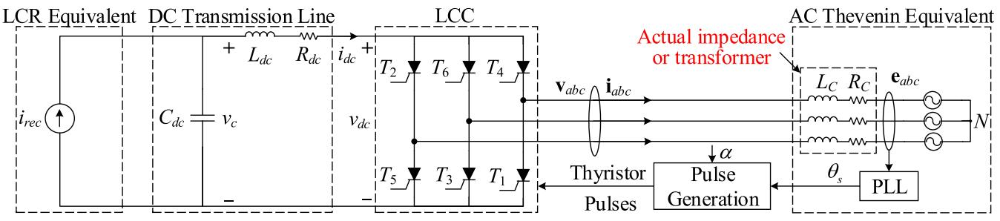  
Fig. 1. Simplified schematic of the inverter side of an LCC-based classic HVDC system.

In LCC-based HVDC systems, the switches at the inverterside are more prone to be faulted as a result of commutation failure (CF), which is often due to abnormal system conditions (e.g., ac voltage sags) [5], [6]. This also requires the converter model to handle the switching faults not only using inputs to the model but also based on the external system conditions. In [22], [23], analytical dynamic-phasor (DP) models have been presented to predict the CF occurrence; however, they are valid only for a certain mode of operation for which equations are derived and assume that the converter consists of ideal switches with zero extinction time and neglect series resistance at the ac side. They also consider the 3rd harmonic only on ac variables.

In this paper, first, the formulation of PAVM [20], [21] for ac– dc rectifiers is extended to dc–ac thyristor-controlled inverters. The new extended model adopts the current-source interfacing [16] that is compatible with the inverter operation of PAVMs of LCCs. Moreover, an augmented technique is proposed to automatically determine the commutation failure of inverter switches based on external system conditions. The proposed method incorporates a numerical criterion based on the fault instant and the magnitude of the ac voltage sag to determine which thyristor will fail its normal commutation.

Finally, the new extended PAVM is verified on a simplified HVDC system, shown in Fig. 1. It is demonstrated that the proposed extended PAVM can obtain accurate results for transients involving CF of switches, consistent with the detailed switching model of inverters. Moreover, the proposed extended PAVM is shown to be orders of magnitude faster than the switching model, making it efficient for simulation of HVDC systems when commutation failure of switches needs to be considered.

# II. COMMUTATION FAILURE DUE TO AC VOLTAGE SAG

Classic HVDC systems consist of two back-to-back thyristorcontrolled LCCs, which are connected through a transmission line. One of the LCCs operates as the ac–dc rectifier, while the other LCC operates as the dc–ac inverter. Both rectifier and inverter have a smoothing reactor at the dc side for smoothing $i _ { d c } .$ , which can be modeled by a large series inductance.

In this paper, to focus on modeling the inverter side of the HVDC system, it is assumed that the rectifier side has regulated current (e.g., using a controller) and is modeled as a controlled current source as shown in Fig. 1. The line-commutated inverter is assumed to be a six-pulse thyristor-controlled converter; the transmission line and the smoothing reactor are modeled using

lumped RLC branches. The AC subsystem is modeled using its Thevenin equivalent circuit consisting of three-phase equivalent sources $\mathbf { e } _ { a b c }$ and equivalent impedance $R _ { C }$ and $L _ { C } ,$ which may also include the impedance of the connecting transformers, etc.

To derive formulations in this paper, the angle of the inverter ac terminal voltages $\mathbf { v } _ { a b c }$ is defined as

$$
\theta_ {e} = \int \omega_ {e} d t, \quad \omega_ {e} = 2 \pi f _ {e} \tag {1}
$$

where $f _ { e }$ and $\omega _ { e }$ represent the fundamental electrical frequency of the ac network in Hz and rad/s, respectively.

Also, the angle of three-phase equivalent sources $\mathbf { e } _ { a b c }$ is denoted by $\theta _ { s }$ which is related to $\theta _ { e }$ as

$$
\theta_ {s} = \theta_ {e} - \delta , \tag {2}
$$

where δ is the angle by which the fundamental components of the inverter terminal voltages lead the equivalent source voltages.

It is also noted that here the three-phase equivalent sources are assumed to be ideal sinusoidal voltages consisting of fundamental frequency components only which can be expressed as

$$
\left\{ \begin{array}{l} e _ {a} = \sqrt {\frac {2}{3}} E \sin \left(\theta_ {s}\right) \\ e _ {b} = \sqrt {\frac {2}{3}} E \sin \left(\theta_ {s} - \frac {2 \pi}{3}\right), \\ e _ {c} = \sqrt {\frac {2}{3}} E \sin \left(\theta_ {s} + \frac {2 \pi}{3}\right) \end{array} \right. \tag {3}
$$

where E denotes the rms value of source line voltages.

# A. Normal Commutation

For a six-pulse inverter with normal commutation, the typical phase currents and voltages are shown in Fig. 2. As it can be observed, in each cycle of fundamental frequency, there are six conduction intervals and six commutation intervals which are denoted as $S _ { 1 } { - } S _ { 1 2 }$ in Fig. 2(a). Herein, these intervals are also separated/indicated by the start and end instants/angles of the switch currents denoted by $\theta _ { k , \mathrm { s t } }$ and $\theta _ { k , \mathrm { e n d } }$ , respectively where k is the switch number $k \in \{ 1 , 2 , 3 , 4 , 5 , 6 \}$ .

According to the conduction and commutation intervals shown in Fig. 2(a), the switching pattern of six-pulse inverter under normal operation can be illustrated as in Fig. 3 using twelve sectors in a circle which implies one full ac cycle of the fundamental frequency.

Defining the sector index $S \in \{ 1 , 2 , 3 , \cdots , 1 2 \}$ , corresponding to the intervals $S _ { 1 } { - } S _ { 1 2 }$ , the conduction and commutation

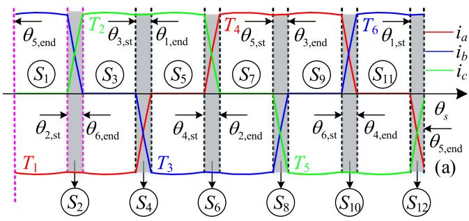

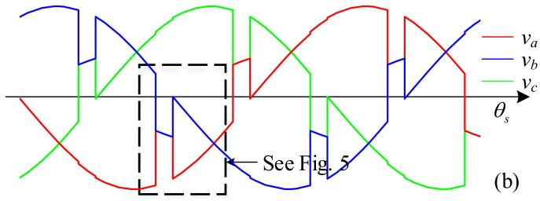  
Fig. 2. Typical waveforms of a six-pulse thyristor-controlled inverter under normal conditions: (a) three-phase currents, (b) three-phase ac terminal voltages.

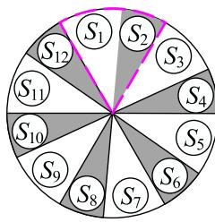

$\textcircled { S _ { 1 } } T _ { 6 } \mathrm { - } T _ { 1 } \mathrm { c o n d . } \textcircled { S _ { 2 } } T _ { 6 } \mathrm { - } T _ { 2 } \mathrm { c o m . } , T _ { 1 } \mathrm { c o n d . }$   
$\textcircled { S _ { 3 } } T _ { 1 } \textbar { - } T _ { 2 } \thinspace \mathrm { c o n d . } \textcircled { S _ { 4 } } T _ { 1 } \mathrm { - } T _ { 3 } \thinspace \mathrm { c o m . } , T _ { 2 } \thinspace \mathrm { c o n d . }$   
$_ { | } ( S _ { 5 } ) T _ { 2 } - T _ { 3 } \mathrm { c o n d . } ( S _ { 6 } ) T _ { 2 } - T _ { 4 } \mathrm { c o m . } , T _ { 3 } \mathrm { c o n d . }$   
$\begin{array} { r } { \widehat { ( S _ { 7 } ) } T _ { 3 } { \scriptstyle - } T _ { 4 } \mathrm { c o n d . } \widehat { ( S _ { 8 } ) } T _ { 3 } { \scriptstyle - } T _ { 5 } \mathrm { c o m . } , T _ { 4 } \mathrm { c o n d . } } \end{array}$   
$\textcircled { S _ { 9 } } T _ { 4 } \textbar { - } T _ { 5 } \mathrm { c o n d . } \textcircled { S _ { 1 9 } } T _ { 4 } \mathrm { - } T _ { 6 } \mathrm { c o m . } , T _ { 5 } \mathrm { c o n d . }$   
$\textcircled { \backslash } T _ { 5 } { \cdot } T _ { 6 } \thinspace \mathrm { c o n d . } \textcircled { \backslash } T _ { 5 } { \cdot } T _ { 1 } \thinspace \mathrm { c o m . } , T _ { 6 } \thinspace \mathrm { c o n d . }$

Fig. 3. Switching conduction and commutation sectors over one full ac cycle of the fundamental frequency for a six-pulse thyristor-controlled inverter.

switching pattern shown in Fig. 2(a) and Fig. 3 can be expressed as

$$
S \left(\theta_ {s}\right) = \left\{ \begin{array}{l} 1 \quad \theta_ {5, \text {e n d}} <   \theta_ {s} \leq \theta_ {2, \text {s t}}, \quad 2 \quad \theta_ {2, \text {s t}} <   \theta_ {s} \leq \theta_ {6, \text {e n d}} \\ 3 \quad \theta_ {6, \text {e n d}} <   \theta_ {s} \leq \theta_ {3, \text {s t}}, \quad 4 \quad \theta_ {3, \text {s t}} <   \theta_ {s} \leq \theta_ {1, \text {e n d}} \\ 5 \quad \theta_ {1, \text {e n d}} <   \theta_ {s} \leq \theta_ {4, \text {s t}}, \quad 6 \quad \theta_ {4, \text {s t}} <   \theta_ {s} \leq \theta_ {2, \text {e n d}} \\ 7 \quad \theta_ {2, \text {e n d}} <   \theta_ {s} \leq \theta_ {5, \text {s t}}, \quad 8 \quad \theta_ {5, \text {s t}} <   \theta_ {s} \leq \theta_ {3, \text {e n d}} \\ 9 \quad \theta_ {3, \text {e n d}} <   \theta_ {s} \leq \theta_ {6, \text {s t}}, \quad 1 0 \quad \theta_ {6, \text {s t}} <   \theta_ {s} \leq \theta_ {4, \text {e n d}} \\ 1 1 \quad \theta_ {4, \text {e n d}} <   \theta_ {s} \leq \theta_ {1, \text {s t}}, \quad 1 2 \quad \theta_ {1, \text {s t}} <   \theta_ {s} \leq \theta_ {5, \text {e n d}} \end{array} , \right.
$$

where S is a function of $\theta _ { s }$ whose output indicates the index of the conduction/commutation sector.

It is noted that the duration of the commutation intervals in Fig. 2(a) and Fig. 3 can be used to analyze the normal operation or commutation failure of switches, using the so-called volt-time area concept introduced in [6].

To present the concept and formulations and without the loss of generality, here sector $S _ { 4 }$ is considered. The equivalent circuit of the inverter-side of Fig. 1 during $S _ { 4 }$ is depicted as Fig. 4, where the thyristor $T _ { 2 }$ is ON and thyristor $T _ { 1 }$ is commutating with thyristor $T _ { 3 }$ . The ac voltages are shown in Fig. 5(a) where $\nu _ { a }$ (solid red line), $\nu _ { b }$ (solid blue line), $\boldsymbol { e } _ { a }$ (red dashed line), and $\nu _ { m N }$ (black dashed line) are superimposed. It is noted that in

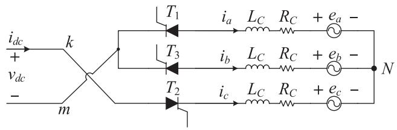  
Fig. 4. Equivalent circuit of inverter-side of Fig. 1 during the sector $S _ { 4 }$ (i.e., $T _ { 2 }$ conduction, $T _ { 1 } { \cdot } T _ { 3 }$ commutation).

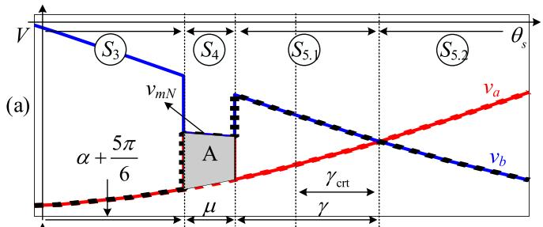

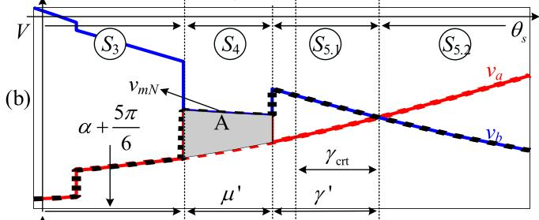

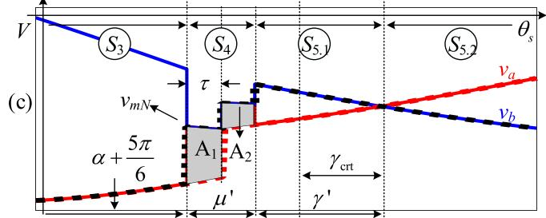  
Fig. 5. Commutation process between $T _ { 1 }$ and $T _ { 3 }$ in sector $S _ { 4 } { \mathrm { : } }$ (a) normal commutation, (b) when voltage sag is applied during the conduction interval, (c) when voltage sag is applied during the commutation interval.

Fig. 5(a), during $S _ { 3 }$ where only $T _ { 1 }$ and $T _ { 2 }$ are conducting, the voltage $\nu _ { a }$ and $\scriptstyle e _ { a }$ are very close due to the small line impedance.

To avoid the complexity of analytical derivations, the commutating resistance $R _ { C }$ is neglected.

During $S _ { 4 } .$ , since $T _ { 1 }$ and $T _ { 3 }$ thyristors are both conducting, assuming lossless switches the voltage $\nu _ { m N }$ can be expressed as

$$
v _ {m N} = e _ {a} + L _ {C} \frac {d i _ {a}}{d t} = e _ {b} + L _ {C} \frac {d i _ {b}}{d t}. \tag {5}
$$

Also, the dc current can be expressed as $i _ { d c } = - ( i _ { a } + i _ { b } ) = i _ { c }$ during $S _ { 4 }$ . Therefore, based on (5) the line voltage $e _ { b a }$ can be expressed as

$$
e _ {b a} = e _ {b} - e _ {a} = L _ {C} \frac {d i _ {a}}{d t} - L _ {C} \frac {d i _ {b}}{d t} = - L _ {C} \frac {d (2 i _ {b} + i _ {d c})}{d t}. \tag {6}
$$

During $S _ { 4 } , ~ i _ { d c }$ can be assumed constant due to the large inductance at the dc side of the inverter, hence, ${ d i _ { d c } } / { d t } = 0$ in (6). As a result, the voltages across the commutating inductances of phases a and phase b can be yielded as

$$
L _ {C} \frac {d i _ {a}}{d t} = - L _ {C} \frac {d i _ {b}}{d t} = \frac {\sqrt {2}}{2} E \sin (\theta_ {s} - 5 \pi / 6). \tag {7}
$$

The volt-time area is defined as the integral of voltage across the $L _ { C }$ during the commutation interval [6]. Therefore, the volttime area denoted with A (see the gray shaded area in Fig. 5(a)), during $S _ { 4 }$ can be obtained based on (7) as

$$
\mathrm {A} = \int_ {\theta_ {3, \mathrm {s t}}} ^ {\theta_ {1, \text {e n d}}} - L _ {C} \frac {d i _ {b}}{d t} d \theta_ {s} = \frac {\sqrt {2}}{2} E \int_ {\theta_ {3, \mathrm {s t}}} ^ {\theta_ {1, \text {e n d}}} \sin \left(\theta_ {s} - 5 \pi / 6\right) d \theta_ {s}. \tag {8}
$$

In (8), $i _ { b } ( \theta _ { 3 , \mathrm { s t } } ) = 0$ and $i _ { b } \ ( \theta _ { 1 , \mathrm { e n d } } ) = - i _ { d c }$ . Also, $\theta _ { 3 , \mathrm { s t } } = \theta _ { s }$ $+ \alpha { + } 5 \pi / 6$ and $\theta _ { \mathrm { 1 , e n d } } = \theta _ { s } + \alpha + \mu + 5 \pi / 6$ where $\mu$ is defined as the commutation angle [6]. Therefore, (8) can be solved as

$$
\mathrm {A} = \omega_ {e} L _ {C} i _ {d c} = \left(E / \sqrt {2}\right) [ \cos \alpha - \cos (\alpha + \mu) ]. \tag {9}
$$

It is noted that $\alpha + \mu = \pi - \gamma$ where γ is the so-called extinction angle [6], which can be expressed based on (9) as

$$
\gamma = \cos^ {- 1} \left[ \sqrt {2} \omega_ {e} L _ {C} i _ {d c} / E - \cos \alpha \right]. \tag {10}
$$

When the commutation is over in sector $S _ { 4 }$ , thyristor $T _ { 1 }$ turns OFF, the reverse voltage across $T _ { 1 }$ is almost equal to $e _ { b a }$ and is positive (in sector $S _ { 5 }$ where $T _ { 2 }$ and $T _ { 3 }$ are conducting). For proper commutation of switches, this positive reverse voltage should be maintained across $T _ { 1 }$ for at least a certain amount of time (denoted by critical angle $\gamma _ { \mathrm { c r t } } )$ to ensure the blocking capability of the switch. If the reverse voltage becomes negative before $\gamma _ { \mathrm { c r t } }$ , the switch $T _ { 1 }$ which was supposed to be OFF after commutation conducts again (and $T _ { 3 }$ turns OFF), which creates a commutation failure (CF) inside the inverter. Therefore, as shown in Fig. 5(a), γ which is the interval from the end of the commutation interval (end of $S _ { 4 } )$ until the zero-crossing point of $e _ { b a }$ (end of $S _ { 5 . 1 }$ interval) should be greater than $\gamma _ { \mathrm { c r t } }$ to avoid CF.

As it can be deduced from (10), γ heavily depends on the amplitude of the ac equivalent sources E, and voltage sags (smaller E) would decrease $\gamma$ and increase the possibility of CF.

In order to quantitatively analyze whether a certain voltage sag would create CF, it is required to obtain the relationship between the level of voltage sag and the commutation angle γ (which is directly related to the possibility of occurrence of CF). For this purpose, here, only symmetrical three-phase voltage sag is considered where it may be applied either during conduction interval or commutation interval. The amount of voltage sag is defined as

$$
\Delta E = E - E ^ {\prime}, \quad g = \Delta E / E, \tag {11}
$$

where $E ^ { \prime }$ is the rms value of equivalent source line voltages after sag, and $g$ is the percentage of voltage sag. Also, $E _ { c r t } ^ { \prime }$ is defined as the critical post-sag voltage that triggers CF.

# B. Voltage Sag During the Conduction Interval

Here, it is assumed that a voltage sag is applied during $S _ { 3 }$ sector $( T _ { 1 } \ – T _ { 2 }$ conduction interval) when $\theta _ { \mathrm { s a g } } < \theta _ { s } + \alpha + 5 \pi / 6$ .

In this case, since the commutation interval has not yet started, the commutation would entirely depend on the new post-sag voltages, as shown in Fig. 5(b). Thus, the derivation of the volt-time area is similar to the case of normal commutation in subSection II–A, but with new post-sag voltages. As a result, based on (10), the extinction angle can be expressed as

$$
\gamma^ {\prime} = \cos^ {- 1} \left[ \sqrt {2} \omega_ {e} L _ {C} i _ {d c} ^ {\prime} / E ^ {\prime} - \cos \alpha \right]. \tag {12}
$$

As shown in Fig. 5(b), when a sag occurs, the commutation interval $\mu ^ { \prime }$ increases due to a decrease in ac voltage according to (9). This results in a smaller extinction angle $\gamma ^ { \prime }$ (because $\mu ^ { \prime } +$ $\gamma ^ { \prime } = \pi \ { \cdot } \alpha )$ which increases the possibility of CF (which occurs when $\gamma ^ { \prime } < = \gamma _ { \mathrm { c r t } } ^ { \prime }$ based on Fig. 5(b)). It is also noted that the post-sag dc current $i _ { d c } ^ { \prime }$ is almost equal to pre-sag current $i _ { d c }$ since it is assumed that the change in dc current is small due to the large dc inductance.

To obtain the critical amount of voltage sag that creates CF, the extinction angle $\gamma ^ { \prime }$ in (12) is set to the critical extinction angle of the switch $( \mathrm { i . e . , } \gamma ^ { \prime } = \gamma _ { \mathrm { c r t } } )$ and solved for the sag amount. After some mathematical manipulations based on (9), (11) and (12), the percentage of critical voltage sag can be derived as

$$
g _ {\mathrm {c r t}} = \frac {\Delta E _ {\mathrm {c r t}}}{E} = \frac {E - E _ {\mathrm {c r t}} ^ {\prime}}{E} = 1 - \frac {i _ {d c} ^ {\prime}}{i _ {d c}} \frac {\cos \alpha + \cos \gamma}{\cos \alpha + \cos \gamma_ {\mathrm {c r t}}}. \tag {13}
$$

Any voltage sag applied during the conduction interval that results in a g larger than ${ g } _ { \mathrm { c r t } }$ in (13) would create a CF, whereas for sags with $\mathrm { ~ a ~ } g$ less than $g _ { \mathrm { c r t } }$ in (13) the inverter switches will commutate normally.

# C. Voltage Sag During the Conduction Interval

Here, it is assumed that the sag is applied during the commutation interval $S _ { 4 }$ . In this case, the commutation interval needs to be split into two sub-intervals (pre-sag and post-sag), as shown in Fig. 5(c). Therein, τ is the duration from the start of $T _ { 1 } – T _ { 3 }$ commutation to the instant when the sag is applied, which can be expressed as

$$
\tau = \theta_ {\text {s a g}} - (\alpha + 5 \pi / 6). \tag {14}
$$

During the interval τ , the thyristor $T _ { 1 }$ commutates normally with pre-sag voltages, and its associated volt-time area $\mathbf { A } _ { 1 }$ is calculated based on (9) as

$$
\mathrm {A} _ {1} = \left(E / \sqrt {2}\right) (\cos \alpha - \cos (\alpha + \tau)). \tag {15}
$$

Then from sag instant until the end of the commutation interval, thyristor $T _ { 1 }$ will commutate with post-sag voltages and the associated volt-time area $\mathrm { A _ { 2 } }$ is calculated based on (9) as

$$
\mathrm {A} _ {2} = \left(E ^ {\prime} / \sqrt {2}\right) (\cos (\alpha + \tau) + \cos \gamma^ {\prime}). \tag {16}
$$

The total volt-time area is the sum of $\mathbf { A } _ { 1 } { + } \mathbf { A } _ { 2 }$ which can be expressed based on (15) and (16) as

$$
\mathrm {A} ^ {\prime} = \mathrm {A} _ {1} + \mathrm {A} _ {2} = i _ {d c} ^ {\prime} \omega_ {e} L _ {C}
$$

$$
\begin{array}{l} = \left(E / \sqrt {2}\right) (\cos \alpha - \cos (\alpha + \tau)) \\ + \left(E ^ {\prime} / \sqrt {2}\right) (\cos (\alpha + \tau) + \cos \gamma^ {\prime}). \tag {17} \\ \end{array}
$$

To obtain the critical amount of voltage sag that creates CF, the extinction angle $\gamma ^ { \prime }$ is set to the critical extinction angle of the switch as $\gamma ^ { \prime } = \gamma _ { \mathrm { c r t } }$ . Based on (9) and (17) one can write

$$
\begin{array}{l} \frac {i _ {d c} ^ {\prime}}{i _ {d c}} = \frac {[ \cos \alpha - \cos (\alpha + \tau) ]}{(\cos \alpha + \cos \gamma)} \\ + \frac {\left(E _ {\mathrm {c r t}} ^ {\prime} / E\right) \left[ \cos (\alpha + \tau) + \cos \gamma_ {\mathrm {c r t}} \right]}{(\cos \alpha + \cos \gamma)}. \tag {18} \\ \end{array}
$$

After some manipulations, the minimum voltage sag that triggers CF is solved to be

$$
g _ {\mathrm {c r t}} = \frac {\left(i _ {d c} - i _ {d c} ^ {\prime}\right) \cos \alpha - i _ {d c} ^ {\prime} \cos \gamma + i _ {d c} \cos \gamma_ {\mathrm {c r t}}}{i _ {d c} \cos (\alpha + \tau) + i _ {d c} \cos \gamma_ {\mathrm {c r t}}}. \tag {19}
$$

Any voltage sag applied during the commutation interval, after the interval τ from commutation, that results in a g larger than $g _ { \mathrm { c r t } }$ in (19) would create a CF, whereas for sags with $g$ less than $g _ { \mathrm { c r t } }$ in (19) the inverter switches will commutate normally.

It is noted that the final formulations of $g _ { \mathrm { c r t } }$ in (13) and (19) depend on several parameters (i.e., firing angle $\alpha ,$ extinction angle $\gamma ,$ the instant when the sag is applied $\theta _ { \mathrm { s a g } }$ , length of the sag as well as the loading condition of the inverter). It could also be observed from Sections II–B and II–C that the analytical derivations for determining the amount of voltage sag that creates CF are mathematically complicated, even with many simplifying assumptions (e.g., lossless switches, slow-changing dc current, negligible ac resistance, etc.). This makes the analytical method impractical when more details should be considered (e.g., non-idealities of switches) or when the system becomes more complex. Therefore, in this paper a new method is adopted to obtain these functions numerically; and the occurrence of CF and the corresponding faulty switch would be identified by a dynamic criterion base on numerical formulations.

# D. Numerical Criterion for Detecting Commutation Failure

Here, a numerical method for deriving $g _ { \mathrm { c r t } }$ is presented based on which the CF and the faulty switch are detected. The voltage sag may happen anywhere during the conduction or commutation sectors (e.g., sectors $S _ { 1 }$ or $S _ { 2 }$ in Fig. 2(a) and Fig. 3 highlighted by purple dashed lines). However, according to the definition of CF, only the switch that is commutating in the commutation sector can experience CF. It is also noted that if the duration of sag is long enough to affect several commutation sectors, multiple switches may experience CF. Therefore, for the simplicity of analysis, it is assumed that the sag lasts no longer than $6 0 ^ { \circ }$ to ensure that the sag can cause a single-CF only (i.e., one switch failure). The candidate switches for CF at different sectors have been listed in Table I.

According to the analysis of Sections II–B and II–C, the minimum percentage of sag in source voltage that can cause CF can be expressed as

$$
g _ {\mathrm {c r t}} (\cdot) = \Delta E _ {\mathrm {c r t}} / E. \tag {20}
$$

TABLE I CANDIDATE SWITCH FOR CF AT DIFFERENT SECTORS   

<table><tr><td>Sectors</td><td>S1 &amp; S2</td><td>S3 &amp; S4</td><td>S5 &amp; S6</td><td>S7 &amp; S8</td><td>S9 &amp; S10</td><td>S11 &amp; S12</td></tr><tr><td>Candidate</td><td>T6</td><td>T1</td><td>T2</td><td>T3</td><td>T4</td><td>T5</td></tr></table>

# Algorithm 1. Numerical derivation of function $g _ { \mathrm { c r t } } .$

1.for $\alpha { = } a _ { \mathrm { m i n } }$ to $\alpha _ { \mathrm { m a x } }$ step $ { \alpha } _ { \mathrm { s t e p } }$ do   
2.for $i _ { r e c } = i _ { r e c , \operatorname* { m i n } }$ t0 $i _ { r e c , \mathrm { { m a x } } }$ step $i _ { r e c , \mathrm { s t e p } }$ do   
3．Run the simulation without sag   
4.Compute the loading condition   
5.Calculate $\mu$ based on (21)   
6.Store $\mu$ in terms of α,and loading condition   
7.for $\theta _ { \mathrm { s a g } } = \theta _ { \mathrm { c o m , s t } }$ to $\theta _ { \mathrm { c o m , e n d } }$ step $\theta _ { \mathrm { { s a g , s t e p } } }$ do   
8.do Apply a sag with value $g$   
9.Check if $T _ { \mathrm { k } }$ experiences CF   
10.while no CF increase g by gtep   
11．End simulation   
12．Record the g as $_ { g \mathrm { c r t } }$   
13.Store $_ { g \mathrm { c r t } }$ in terms of loading condition, $\alpha ,$ and $\theta _ { \mathrm { s a g } }$   
14.End for   
15.End for   
16.End for

Fig. 6. Pseudo-code for establishing $g _ { \mathrm { c r t } }$ for the numerical criterion of CF.

Here, $g _ { \mathrm { c r t } }$ is defined as a numerical function in terms of firing angle α, the moment of sag $\theta _ { \mathrm { s a g } } ,$ as well as the loading condition of the converter before voltage sag.

The function $g _ { \mathrm { c r t } }$ is acquired by briefly simulating the system using the detailed switching model of the converter, as described by the pseudo-code (Algorithm 1) shown in Fig. 6. Therein, for different firing angles and loading conditions, an increasing sequence of sag g is applied within interval $\theta _ { \mathrm { c o m , s t } }$ to $\theta _ { \mathrm { c o m , } }$ end at a moment $\theta _ { \mathrm { s a g } } ,$ and it is checked whether the applied sag causes CF for a candidate switch or not. The sag that creates CF is stored as $g _ { \mathrm { c r t } }$ in terms of $\alpha ,$ loading condition, as well as the moment of applied sag $\theta _ { \mathrm { s a g } } .$ The length of commutation interval $\mu$ is also stored as a numerical function as

$$
\mu (\cdot) = \theta_ {\mathrm {c o m , e n d}} - \theta_ {\mathrm {c o m , s t}}. \tag {21}
$$

The function $g _ { \mathrm { c r t } }$ for different candidate switches have been obtained (for a certain α and loading condition given in appendix) and shown in Fig. 7. As it can be seen in Fig. 7(b), if the sag is applied during the conduction interval, the function $g _ { \mathrm { c r t } }$ is independent of $\theta _ { \mathrm { s a g } }$ and is equal to the $g _ { \mathrm { c r t } }$ at the starting instant of the following commutation sector, which is consistent with the definition of CF. However, if the sag is applied during the commutation sector, $g _ { \mathrm { c r t } }$ increases as $\theta _ { \mathrm { s a g } }$ moves towards the end of commutation interval $\mu ,$ and a more severe sag (larger g) is needed to cause CF. It is also seen in Fig. 7(b) that the function $g _ { \mathrm { c r t } }$ for the six switches of the inverter are identical except for a 60-degree shift as a result of the symmetry in the converter. Therefore, only one of these six $g _ { \mathrm { c r t } }$ functions needs to be stored

Algorithm 1. Numerical derivation of function $g _ { \mathrm { c r t } } .$   
1. for $\alpha = \alpha_{\mathrm{min}}$ to $\alpha_{\mathrm{max}}$ step $\alpha_{\mathrm{step}}$ do  
2. for $i_{rec} = i_{rec,\mathrm{min}}$ to $i_{rec,\mathrm{max}}$ step $i_{rec,\mathrm{step}}$ do  
3. Run the simulation without sag  
4. Compute the loading condition  
5. Calculate $\mu$ based on (21)  
6. Store $\mu$ in terms of $\alpha$ , and loading condition  
7. for $\theta_{\mathrm{sag}} = \theta_{\mathrm{com,st}}$ to $\theta_{\mathrm{com,end}}$ step $\theta_{\mathrm{sag,step}}$ do  
8. do Apply a sag with value $g$ 9. Check if $T_{\mathrm{k}}$ experiences CF  
10. while no CF increase $g$ by $g_{\mathrm{step}}$ 11. End simulation  
12. Record the $g$ as $g_{\mathrm{crit}}$ 13. Store $g_{\mathrm{crit}}$ in terms of loading condition, $\alpha$ , and $\theta_{\mathrm{sag}}$ 14. End for  
15. End for  
16. End for

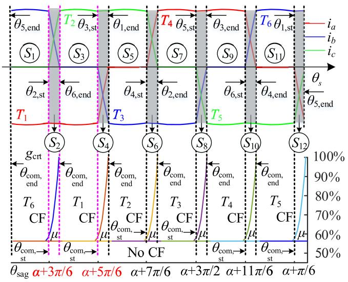  
Fig. 7. One full ac cycle with different conduction and commutation sectors and their corresponding function $g _ { \mathrm { c r t } } \colon$ (a) ac currents, (b) function $g _ { \mathrm { c r t } }$ for different switches.

and can be applied to other sectors (candidate switches) with a proper 60-degree shift.

Once the numerical function $g _ { \mathrm { c r t } }$ for different switches are established, the possibility of CF and the faulty switch is determined by comparing actual voltage sag g with the stored $g _ { \mathrm { c r t } }$ for the switch candidate $T _ { k }$

$$
F = \left\{ \begin{array}{l} 0 g <   g _ {\mathrm {c r t}} ^ {k} (\cdot) \text {N o C F} \\ k g \geq g _ {\mathrm {c r t}} ^ {k} (\cdot) T _ {k} \text {C F} \end{array} , \right. \tag {22}
$$

where F represents the index of faulty switch and $g _ { \mathrm { c r t } } ^ { k }$ is the function of critical voltage sag for the switch candidate $T _ { k }$ that is obtained from $g _ { \mathrm { c r t } }$ using (k-1)60° phase shift. I $\mathrm { f } g < g _ { \mathrm { c r t } } ^ { k }$ , there would be no CF $( F = 0 )$ ). Otherwise, CF occurs for switch $T _ { k }$ and F is equal to the index of the faulty switch.

It is noted that, during the single-CF, the converter will experience three different stages as depicted in Fig. 8. The first

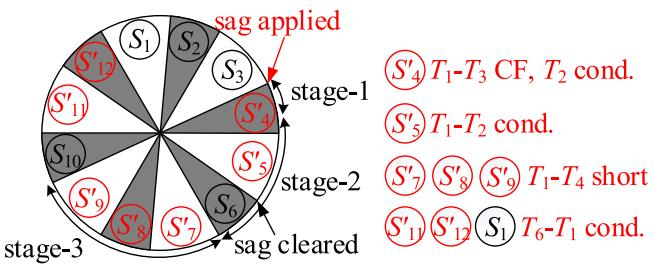

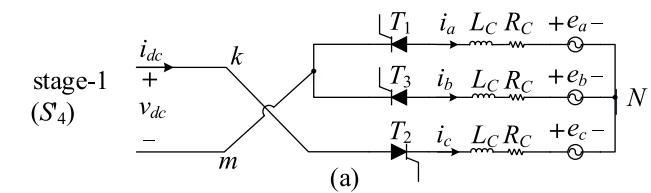  
Fig. 8. Switching sectors during single CF over one full ac cycle of the fundamental frequency for a six-pulse thyristor-controlled inverter.

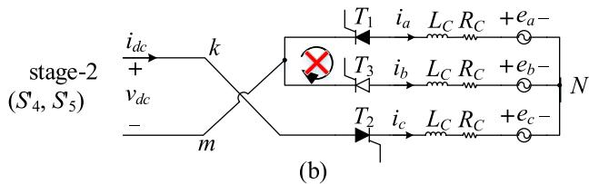

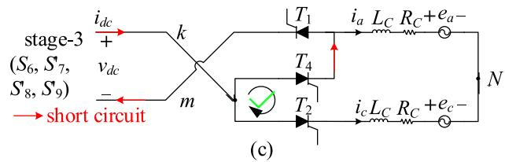  
Fig. 9. Equivalent circuit of different stages during single CF: (a) stage-1, (b) stage-2, (c) stage-3.

stage starts from the instant that the sag is applied until the instant when the direction of the commutating voltage on the CF candidate switch reverses. During stage-1 as Fig. 9(a), the switch has a normal commutation. The second stage starts right after the first stage, where the CF candidate switch continues to conduct (which was not supposed to conduct in a normal situation), resulting in an abnormal configuration. The stage-2 as Fig. 9(b) lasts until the other switch in the same phase starts to conduct, which is the beginning of the third stage. In stage-3 as Fig. 9(c), the converter will have an internal short-circuit (ISC) due to conduction of both switches in the same leg, until the current starts to commutate to the switch in a different phase from the faulty switch. The cut-off instant between stage-2 to stage-3 is the starting instant of the commutation sector. After stage-3, the ISC disappears and the dc voltage starts to recover back to normal. The configuration of the converter during the CF interval of different switches and the instants between these stages are summarized in Table II.

# III. PAVM OF INVERTER AUGMENTED WITH COMMUTATION FAILURE DETECTION

When a commutation failure (CF) occurs for any of the switches inside the dc–ac inverter, the three-phase ac variables

TABLE II CONFIGURATION OF CONVERTER DURING CF   

<table><tr><td>k</td><td>1ststage Normal</td><td>2ndstage abnormal</td><td>3rdstage ISC</td><td>Cut-off instant</td><td>End instant of Stage-3</td></tr><tr><td>6</td><td>T6-T2com.</td><td>T6-T1cond.</td><td>T6-T3cond.</td><td>θ3,st</td><td>θ5,st</td></tr><tr><td>1</td><td>T1-T3com.</td><td>T1-T2cond.</td><td>T1-T4cond.</td><td>θ4,st</td><td>θ6,st</td></tr><tr><td>2</td><td>T2-T4com.</td><td>T2-T3cond.</td><td>T2-T5cond.</td><td>θ5,st</td><td>θ1,st</td></tr><tr><td>3</td><td>T3-T5com.</td><td>T3-T4cond.</td><td>T3-T6cond.</td><td>θ6,st</td><td>θ2,st</td></tr><tr><td>4</td><td>T4-T6com.</td><td>T4-T5cond.</td><td>T4-T1cond.</td><td>θ1,st</td><td>θ3,st</td></tr><tr><td>5</td><td>T5-T1com.</td><td>T5-T6cond.</td><td>T5-T2cond.</td><td>θ2,st</td><td>θ4,st</td></tr></table>

become distorted due to the asymmetry created as a result of the faulty switch. In such case, $\mathbf { v } _ { a b c }$ and $\mathbf { i } _ { a b c }$ (see Fig. 1) contain all the odd and even (characteristic and non-characteristic) harmonics and the harmonic order can be n ∈ {1, 2, 3, 4, 5, 6, 7, · · ·} [20], [21]. Therein, a PAVM has been presented to reconstruct such distorted waveforms for ac–dc rectifiers using a numerical technique. However, the PAVM in [20], [21] requires to specify the faulty switch manually by the user as one input to the model.

Here, the numerical methodology set forth in [20], [21] is adopted to develop an extended PAVM for dc–ac inverters, which is also augmented with the numerical CF detection method presented in Section II–D. As the result, the proposed extended PAVM is able to detect the CF and the faulty switches automatically based on the dynamics of the external system without the requirement to manually set it.

# A. Formulation of the PAVM

In the PAVM, the dc-side variables are related to the ac-side variables of the inverter using numerical functions. For this purpose, the three-phase distorted unbalanced variables $\mathbf { v } _ { a b c }$ and $\mathbf { i } _ { a b c }$ are decomposed into two balanced three-phase variables in positive and negative sequences as well as dc-offsets that are present on distorted ac variables [20], [21] as

$$
\mathbf {v} _ {a b c} = \sum_ {n = 1} ^ {\infty} \mathbf {v} _ {a b c, \text {p o s}} ^ {n} + \sum_ {n = 1} ^ {\infty} \mathbf {v} _ {a b c, \text {n e g}} ^ {n} + \mathbf {v} _ {a b c, \mathrm {d c}} ^ {0}, \tag {23}
$$

$$
\mathbf {i} _ {a b c} = \sum_ {n = 1} ^ {\infty} \mathbf {i} _ {a b c, \text {p o s}} ^ {n} + \sum_ {n = 1} ^ {\infty} \mathbf {i} _ {a b c, \text {n e g}} ^ {n} + \mathbf {i} _ {a b c, \mathrm {d c}} ^ {0}. \tag {24}
$$

It is noted that the zero sequence variables do not exist in the system of Fig. 1.

In order to obtain components in (23), (24), the instantaneous abc variables $\mathbf { v } _ { a b c }$ and $\mathbf { i } _ { a b c }$ are transformed into multiple qd rotating reference frames [20], [21], using the Park’s trans-formation. To obtain the n-th harmonics of (23), (24) in positive sequence, the abc variables are transformed to qd coordinates that rotate in positive direction with angle $n \theta _ { s }$ as

$$
\mathbf {v} _ {q d, \text {p o s}} ^ {n} = \mathbf {K} _ {s} (n \theta_ {s}) \mathbf {v} _ {a b c}, \quad \mathbf {i} _ {q d, \text {p o s}} ^ {n} = \mathbf {K} _ {s} (n \theta_ {s}) \mathbf {i} _ {a b c} \tag {25}
$$

where Ks is the transformation matrix [7]. Similarly, to obtain the n-th harmonics of (23), (24) in negative sequence, the abc variables are transformed to qd coordinates that rotate in the

negative direction with angle -nθs as

$$
\mathbf {v} _ {q d, \text {n e g}} ^ {n} = \mathbf {K} _ {s} (- n \theta_ {s}) \mathbf {v} _ {a b c}, \mathbf {i} _ {q d, \text {n e g}} ^ {n} = \mathbf {K} _ {s} (- n \theta_ {s}) \mathbf {i} _ {a b c}. \tag {26}
$$

Also, the dc components in (23), (24) can be obtained by transforming the abc variables into stationary qd coordinates as

$$
\mathbf {v} _ {q d, \mathrm {d} c} ^ {0} = \mathbf {K} _ {s} (0) \mathbf {v} _ {a b c}, \quad \mathbf {i} _ {q d, \mathrm {d} c} ^ {0} = \mathbf {K} _ {s} (0) \mathbf {i} _ {a b c}. \tag {27}
$$

After applying (25) and (26), the components corresponding to n-th harmonics of abc variables in positive and negative sequence, respectively, become dc values in the qd coordinates and all other components become oscillatory (ripples).

Similarly, after applying (27), the dc offsets on abc variables become dc variables in the stationary qd coordinates and all other components become oscillatory. Therefore, to obtain these positive sequence, negative sequence, and dc-offset components, the ripples are eliminated by averaging as

$$
\bar {x} (t) = \frac {1}{T} \int_ {t - T} ^ {t} x (\tau) d \tau , \tag {28}
$$

where T is the averaging window and is equal to $1 / f _ { e }$ . Also, x¯ is the average value of the variable x which can be currents or voltages. Thereafter, the average values of the dc-side variables of the inverter [obtained by applying (28) to $\nu _ { d c }$ and $i _ { d c }$ in Fig. 1] are related to the ac-side variables using the averaged values of the transformed qd variables [20], [21].

The relationship between the averaged dc-side variables and the magnitude of transformed qd variables corresponding to positive sequence components can be described by the following so-called parametric functions

$$
w _ {v, \text {p o s}} ^ {n} (\cdot) = \bar {v} _ {d c} / \left\| \bar {\mathbf {v}} _ {q d, \text {p o s}} ^ {n} \right\|, \quad w _ {i, \text {p o s}} ^ {n} (\cdot) = \left\| \bar {\mathbf {i}} _ {q d, \text {p o s}} ^ {n} \right\| / \bar {i} _ {d c}. \tag {29}
$$

The relationship between the ac voltages and currents is also captured by the phase difference between angles of fundamental frequency voltage and current in positive sequence, obtained using a parametric function as

$$
\varphi_ {\text {p o s}} ^ {1} (\cdot) = \theta_ {i, \text {p o s}} ^ {1} - \theta_ {v, \text {p o s}} ^ {1}. \tag {30}
$$

The angles of $\mathbf { v } _ { q d , \mathrm { p o s } } ^ { n }$ and n $\mathbf { i } _ { q d , \mathrm { p o s } } ^ { n }$ in the qd reference frame are also captured as parametric functions be expressed as

$$
\theta_ {v, \text {p o s}} ^ {n} (\cdot) = - \tan^ {- 1} \left(\frac {\bar {v} _ {d , \text {p o s}} ^ {n}}{\bar {v} _ {q , \text {p o s}} ^ {n}}\right), \theta_ {i, \text {p o s}} ^ {n} (\cdot) = - \tan^ {- 1} \left(\frac {\bar {i} _ {d , \text {p o s}} ^ {n}}{\bar {i} _ {q , \text {p o s}} ^ {n}}\right). \tag {31}
$$

Similarly, the relationship between the averaged dc-side variables and the magnitude of transformed qd variables corresponding to negative sequence components can be described by the parametric functions

$$
w _ {v, \text {n e g}} ^ {n} (\cdot) = \bar {v} _ {d c} / \left\| \bar {\mathbf {v}} _ {q d, \text {n e g}} ^ {n} \right\|, \quad w _ {i, \text {n e g}} ^ {n} (\cdot) = \left\| \bar {\mathbf {i}} _ {q d, \text {n e g}} ^ {n} \right\| / \bar {i} _ {d c}. \tag {32}
$$

The angles of $\mathbf { v } _ { q d , \mathrm { n e g } } ^ { n }$ and i nqd, $\mathbf { i } _ { q d , \mathrm { n e g } } ^ { n }$ in the qd reference frame are also obtained as parametric functions

$$
\theta_ {v, \text {n e g}} ^ {n} (\cdot) = \tan^ {- 1} \left(\frac {\bar {v} _ {d , \text {n e g}} ^ {n}}{\bar {v} _ {q , \text {n e g}} ^ {n}}\right), \quad \theta_ {i, \text {n e g}} ^ {n} (\cdot) = \tan^ {- 1} \left(\frac {\bar {i} _ {d , \text {n e g}} ^ {n}}{\bar {i} _ {q , \text {n e g}} ^ {n}}\right). \tag {33}
$$

The relationship between the averaged dc-side variables and the magnitude of dc-offsets on ac variables can be captured by parametric functions as

$$
w _ {v, \mathrm {d c}} ^ {0} (\cdot) = \bar {v} _ {d c} / \left\| \bar {\mathbf {v}} _ {q d, \mathrm {d c}} ^ {0} \right\|, \quad w _ {i, \mathrm {d c}} ^ {0} (\cdot) = \left\| \bar {\bar {\mathbf {i}}} _ {q d, \mathrm {d c}} ^ {0} \right\| / \bar {i} _ {d c}. \tag {34}
$$

The distribution of dc-offsets can also be determined using the angle of dc-offsets in qd coordinates that can be captured with parametric functions defined as

$$
\theta_ {v, \mathrm {d c}} ^ {0} (\cdot) = - \tan^ {- 1} \left(\frac {\bar {v} _ {d , \mathrm {d c}} ^ {0}}{\bar {v} _ {q , \mathrm {d c}} ^ {0}}\right), \theta_ {i, \mathrm {d c}} ^ {0} (\cdot) = - \tan^ {- 1} \left(\frac {\bar {i} _ {d , \mathrm {d c}} ^ {0}}{\bar {i} _ {q , \mathrm {d c}} ^ {0}}\right). \tag {35}
$$

# B. Establishing Numerical Functions for the Extended PAVM

The relationships defined in (29)–(35) are functions of the firing angle α, as well as the loading condition of the inverter. For this paper, the loading condition of inverter is represented by the so-called dynamic admittance [14] defined as

$$
y _ {d} = \bar {i} _ {d c} / \left\| \bar {\mathbf {v}} _ {q d, \text {p o s}} ^ {1} \right\|. \tag {36}
$$

It is noted that the parametric functions (29)–(35) also depend on the configuration of the inverter switches (i.e., normal or faulty). Based on the analysis of Section II–D, the configuration of the inverter during CF is different for stages 1–3, as shown in Table II, for each of which the corresponding parametric functions should be obtained.

These functions are computed using the detailed switching model of the inverter with the method presented in [19], as demonstrated with a pseudo-code in Algorithm 2, shown in Fig. 10. Therein, the detailed model of the system in Fig. 1 is constructed using the switching model of the inverter. Then several brief simulations are run over the desired range of operating conditions by changing the loading condition, firing angle, and configuration of the inverter (i.e., normal and faulty modes). During each simulation run, the function (29)–(35) are computed numerically and stored as lookup tables in terms of firing angle, loading condition $y _ { d } ,$ and configuration indicator F.

It should also be noted here that $g _ { \mathrm { c r t } }$ is obtained as a numerical function of firing angle $\alpha ,$ the loading condition $y _ { d } ,$ and the instant of sag $\theta _ { \mathrm { s a g } }$ with $F = 0 ~ ( \mathrm { i . e . }$ ., normal system configuration before CF) using the numerical method presented in Section II–D. Therefore, during the same runs of simulation to obtain parametric functions (29)–(35), when $F = 0 _ { ; }$ , Algorithm-1 is also run and functions (20), (21) are also calculated and saved as a lookup table in terms of α, yd, and $\theta _ { \mathrm { s a g } }$ .

# C. Implementation of the Extended PAVM

To interface with the external subsystems, the extended PAVM is implemented using controlled voltage and current sources [16], as shown in Fig. 11. Therein, $\mathbf { v } _ { a b c }$ and $i _ { d c }$ are chosen

Algorithm 2.Establishing parametric functions of the extended PAVMof the inverter.

1.for $F { = } 0$ to 6 step 1 do   
2.for $\alpha { = } a _ { \mathrm { m i n } }$ to $\alpha _ { \mathrm { m a x } }$ step $ { \alpha } _ { \mathrm { s t e p } }$ do   
3.for $i _ { r e c } = i _ { r e c , \operatorname* { m i n } }$ to $i _ { r e c , \mathrm { { m a x } } }$ step $i _ { r e c , \mathrm { s t e p } }$ do   
4．Initialized the detailed model   
5. Set the configuration based on Table II and the normal configuration   
6.Start the simulation   
7.Compute dynamic admittance based on (36)   
8．Compute and process parametric function (29)-(35)   
9. Store (29)-(35) for each configuration of stages1-3 in terms of yd, $a , F$   
10. if $F { = } 0$ do   
11. Run Algorithm-1   
12. End if   
13．End simulation   
14．End for   
15.End for   
16.End for

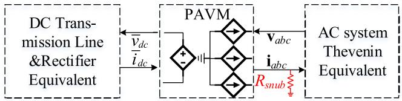  
Fig. 10. Pseudo-code for establishing parametric functions of the extended PAVM of the dc–ac inverter.   
Fig. 11. Interfacing circuit for the PAVM of dc–ac inverter in Fig. 1.

as the inputs of the model, and $\mathbf { i } _ { a b c }$ and $\nu _ { d c }$ are computed as the interfacing outputs. To avoid numerical differentiation for interfacing with the ac subsystem [23], snubber resistors are connected to the ac terminals of the inverter [16].

The detailed implementation of the proposed extended PAVM that is augmented with automatic CF detection is shown in Fig. 12. It is noted that in [20], [21], F is simply set manually by the user as an input to the model. However, here it is determined automatically based on system dynamics (e.g., due to source voltage sags) where the CF detection is augmented in the PAVM implementation, indicated by dashed box in Fig. 12.

As observed in Fig. 12, the source voltages are monitored for possible voltage sag. The loading condition of the inverter $y _ { d }$ is calculated using inputs of the model (i.e., $\mathbf { v } _ { a b c }$ and $i _ { d c } )$ based on (36). When the system is in normal condition, the CF detection module outputs $F = 0$ . To detect the sag, the magnitude of the source voltage is continuously monitored and compared with the base voltage magnitude E. When the magnitude of the source voltage drops to $E ^ { ' }$ , a sag is detected and the amount of sag g is calculated using (11). Once g exceeds a certain threshold, the CF detection module is activated and generates a rising edge to the latch block to immediately record the pre-fault $y _ { d }$ as well as the moment of sag $\theta _ { \mathrm { s a g } } .$ . Then, the pre-fault $y _ { d }$ (corresponding to $F = 0 )$ and $\theta _ { \mathrm { s a g } }$ are used to compute the numerical function

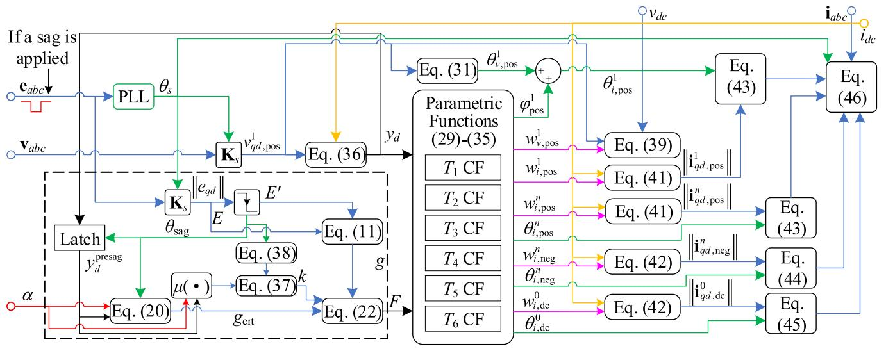  
Fig. 12. Implementation of the proposed extended PAVM augmented with dynamic commutation failure detection indicated by the dashed box.

Algorithm 2. Establishing parametric functions of the extended PAVM of the inverter.   
1. for $F = 0$ to 6 step 1 do
2. for $\alpha = \alpha_{\mathrm{min}}$ to $\alpha_{\mathrm{max}}$ step $\alpha_{\mathrm{step}}$ do
3. for $i_{rec} = i_{rec,\mathrm{min}}$ to $i_{rec,\mathrm{max}}$ step $i_{rec,\mathrm{step}}$ do
4. Initialized the detailed model
5. Set the configuration based on Table II and the normal configuration
6. Start the simulation
7. Compute dynamic admittance based on (36)
8. Compute and process parametric function (29)-(35)
9. Store (29)-(35) for each configuration of stages1-3 in terms of $y_d, \alpha, F$ 10. if $F = 0$ do
11. Run Algorithm-1
12. End if
13. End simulation
14. End for
15. End for
16. End for

μ (21) stored in lookup tables. Based on $\theta _ { \mathrm { s a g } }$ and the computed $\mu ,$ the sector and the index of the candidate switch for CF is determined as

$$
k = \bmod \left[ \operatorname {c e i l} \left(\frac {\theta_ {\mathrm {s a g}} - \alpha - 5 \pi / 6}{\pi / 3}\right), 6 \right] + 1, \tag {37}
$$

in case

$$
\mod \left(\theta_ {\mathrm {s a g}} - \alpha - \pi / 6, \pi / 3\right) > \mu , \tag {38}
$$

otherwise, the k is kept to be the previously calculated value from (37). It is also instructive to remind that the ‘ceil’ operator outputs the smallest integer larger than its argument, and the ‘mod’ operator returns the remainder after division.

Once the candidate switch for CF is detected, pre-fault $y _ { d }$ is used along with α to determine its corresponding $g _ { \mathrm { c r t } }$ from its

stored lookup tables. The applied voltage sag g is then compared to the calculated $g _ { \mathrm { c r t } }$ to determine whether there would be CF or not, based on (22). If it turns out that CF would occur, then the lookup tables of PAVM associated with that fault configuration are enabled to be used in the extended PAVM. It is also noted that during the CF, the lookup tables are switched for different stages according to Table II. Once the parametric functions of the extended PAVM are computed, they are used along with the inputs of the model to compute the interfacing outputs. The dcside output $\bar { v } _ { d c }$ is calculated using the fundamental component of ac voltages in positive sequence and parametric function $w _ { \mathrm { v , p o s } } ^ { 1 }$ as

$$
\bar {v} _ {d c} = w _ {v, \text {p o s}} ^ {1} \| \bar {\mathbf {v}} _ {q d, \text {p o s}} ^ {1} \|. \tag {39}
$$

The phase angle of the fundamental components of interfacing currents are calculated using the parametric function $\varphi _ { \mathrm { p o s } } ^ { 1 }$ and phase of input voltages as

$$
\theta_ {i, \text {p o s}} ^ {1} = \varphi_ {\text {p o s}} ^ {1} - \tan^ {- 1} \left(\bar {v} _ {d, \text {p o s}} ^ {1} / \bar {v} _ {q, \text {p o s}} ^ {1}\right). \tag {40}
$$

The magnitude of the n-th harmonics (including fundamental component with n = 1) of positive sequence currents are computed as

$$
\left\| \mathbf {i} _ {q d, \text {p o s}} ^ {n} \right\| = \bar {i} _ {d c} w _ {i, \text {p o s}} ^ {n}. \tag {41}
$$

Similarly, the magnitude of n-th harmonic components of negative sequence currents and their dc offsets are computed as

$$
\left\| \mathbf {i} _ {q d, \text {n e g}} ^ {n} \right\| = \bar {i} _ {d c} w _ {i, \text {n e g}} ^ {n}, \quad \left\| \mathbf {i} _ {q d, d c} ^ {0} \right\| = \bar {i} _ {d c} w _ {i, d c} ^ {0}. \tag {42}
$$

It should be noted that the angle of the fundamental component of ac currents in the positive sequence is calculated using (40). However, for all other components, the angle is directly outputted from their corresponding stored lookup tables based on (31), (33), (35). Then, based on (29)–(35) , the components of ac currents in their corresponding qd reference frames are

computed as

$$
i _ {q, \text {p o s}} ^ {n} = \bar {i} _ {d c} w _ {i, \text {p o s}} ^ {n} \cos \left(\theta_ {i, \text {p o s}} ^ {n}\right), i _ {d, \text {p o s}} ^ {n} = - \bar {i} _ {d c} w _ {i, \text {p o s}} ^ {n} \sin \left(\theta_ {i, \text {p o s}} ^ {n}\right), \tag {43}
$$

$$
i _ {q, \text {n e g}} ^ {n} = \bar {i} _ {d c} w _ {i, \text {n e g}} ^ {n} \cos \left(\theta_ {i, \text {n e g}} ^ {n}\right), i _ {d, \text {n e g}} ^ {n} = \bar {i} _ {d c} w _ {i, \text {n e g}} ^ {n} \sin \left(\theta_ {i, \text {n e g}} ^ {n}\right), \tag {44}
$$

$$
i _ {q, \mathrm {d c}} ^ {0} = \bar {i} _ {d c} w _ {i, \mathrm {d c}} ^ {0} \cos \left(\theta_ {i, \mathrm {d c}} ^ {0}\right), i _ {d, \mathrm {d c}} ^ {0} = - \bar {i} _ {d c} w _ {i, \mathrm {d c}} ^ {0} \sin \left(\theta_ {i, \mathrm {d c}} ^ {0}\right). \tag {45}
$$

Finally, the interfacing output currents $\mathbf { i } _ { a b c }$ are computed by transforming all the qd components back to abc coordinates and adding them as

$$
\mathbf {i} _ {a b c} = \left[ \mathbf {K} _ {s} (0) \right] ^ {- 1} \mathbf {i} _ {q d, d c} ^ {0} + \sum_ {n = 1} ^ {m} \left\{ \begin{array}{l} {\left[ \mathbf {K} _ {s} \left(n \theta_ {s}\right) \right] ^ {- 1} \mathbf {i} _ {q d, \text {p o s}} ^ {n}} \\ + \left[ \mathbf {K} _ {s} (- n \theta_ {s}) \right] ^ {- 1} \mathbf {i} _ {q d, \text {n e g}} ^ {n} \end{array} \right\}, \tag {46}
$$

where m is the highest harmonic order to be considered in the model for the reconstruction of ac waveforms. It is noted that the selection of an appropriate m is a compromise between numerical accuracy and efficiency of the simulation.

# IV. COMPUTER STUDIES

In order to verify the proposed CF detection method augmented into the PAVM of the inverter, the inverter-side of an example simplified HVDC system is considered as depicted in Fig. 1. For comparisons, the system has been implemented in MATLAB/ Simulink using the detailed switching model of the inverter, its extended PAVM and analytical DP model [22]. The detailed model has been built using the PLECS blockset, while the PAVM and the DP model has been built using standard library blocks of Simulink. The snubber resistors for interfacing of PAVM (see Fig. 11) are chosen to be 2000 Ω to limit the current error to 1% [24]. The parameters of the system are summarized in Appendix. It is assumed that the system is initially operating in steady-state under normal condition with $i _ { r e c } = 6 0 0 0 \mathrm { \ : A }$ and firing angle $\alpha = 1 3 5$ degrees. The information about the $g _ { \mathrm { c r t } }$ table are as follow: The desired range of dynamic admittance $y _ { d }$ is from 0.05 to 0.11 with a step of 0.01. The range of firing angle is from 100 to 150 degree with a step of 5 degree. The range of $\theta _ { \mathrm { s a g } }$ is from 0 to 360 degree of a cycle with a step of 6 degree. At some instant, a certain level of three-phase symmetrical voltage sag is applied on the ac source voltages.

# A. Transient Study

Here, the level of voltage sag is considered to be 61%. The sag occurs at t = 1.4966 s and is cleared at $t = 1 . 5 \ : \mathrm { s }$ . The instant of sag $\theta _ { \mathrm { s a g } }$ coincides in sector $S _ { 4 } .$ , where $T _ { 2 }$ is conducting and $T _ { 1 }$ is commutating with $T _ { 3 }$ . In this sector, the candidate switch for CF is $T _ { 1 }$ according to Table I, and its corresponding $g _ { \mathrm { c r i t } }$ for that moment of $\theta _ { \mathrm { s a g } }$ is computed to be 60.46%. Since the level of sag (61%) is larger than $g _ { \mathrm { c r t } }$ (60.46%), it is expected that $T _ { 1 }$ experiences CF. The transient response of dc and ac-side variables are shown in Figs. 13 –15, as obtained from the detailed switching model and predicted by the DP model [22] and the proposed extended PAVM.

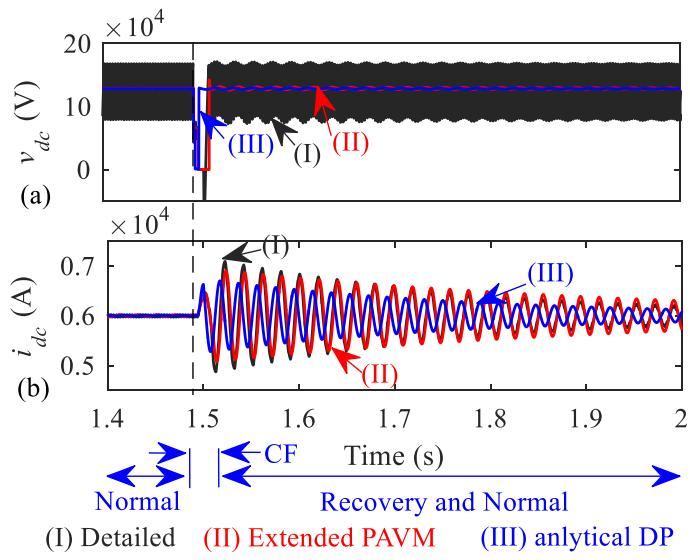  
Fig. 13. The transient response of dc-variables as obtained by the subject models when a 61% voltage sag occurs in sector $S _ { 4 } { \mathrm { : } }$ : (a) $\nu _ { d c } ,$ (b) $i _ { d c }$ . The voltage sag causes CF for switch ${ \bf \ddot { \boldsymbol { T } } } _ { 1 }$ .

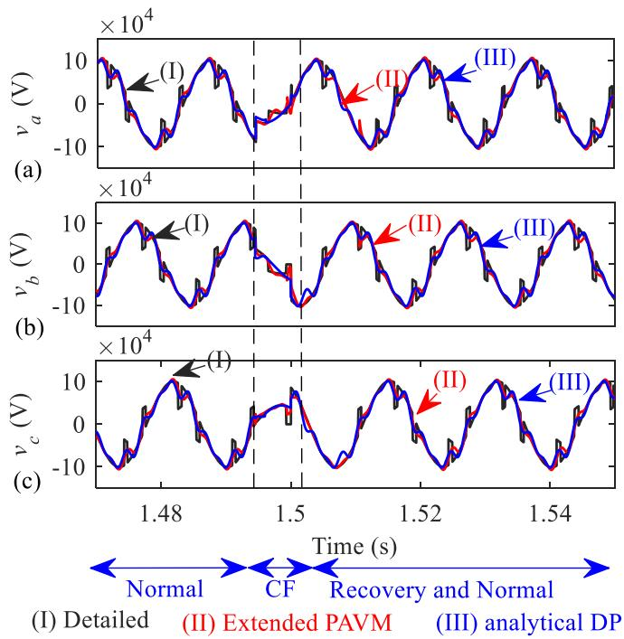  
Fig. 14. The response of ac-voltages as obtained by the subject models when a 61% voltage sag occurs in sector S4: (a) va, (b) vb, (c) $\nu _ { c } .$ . The voltage sag causes CF for switch $T _ { 1 }$ .

As it can be seen from Fig. 13(a), after sag is applied on the source voltages, $\nu _ { d c }$ drastically decreases. However, $\nu _ { d c }$ does not become zero in the first and second stages during CF of $T _ { 1 }$ where $T _ { 1 } – T _ { 2 }$ conduction is continued. Thereafter, when $T _ { 2 }$ commutates with $T _ { 4 }$ at the third stage, an ISC occurs (since $T _ { 1 }$ and $T _ { 4 }$ are in the same phase) and $\nu _ { d c }$ drops to 0. It is also seen in Fig. 13(b) that although the duration of voltage sag is very short, it results in a significant fluctuation in the dc current. This is because the rapid change of dc voltage swings the energy of

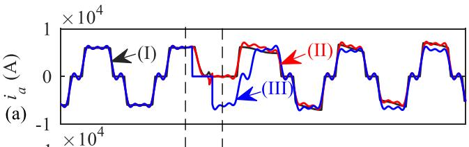

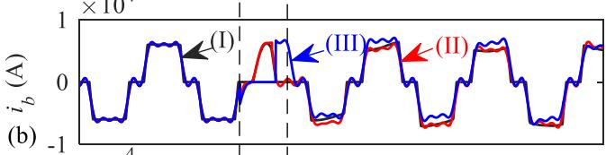

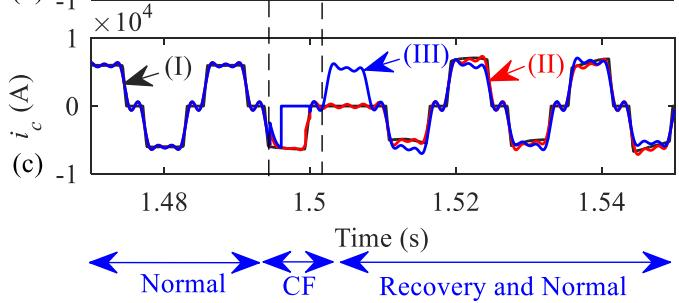  
(I) Detailed (II) Extended PAVM(III) analytical DP   
Fig. 15. The response of ac-currents as obtained by the subject models when a 61% voltage sag occurs in sector S4: (a) ia, (b) ib, (c) ic. The voltage sag causes CF for switch T1.

the dc capacitor, resulting in oscillations in the dc current. It is also seen in Fig. 13(a) and Fig. 13(b) the analytical DP model fails to predict correct results during the CF period. However, the proposed extended PAVM can detect the CF automatically and provides accurate results for dynamics of average-values of dc-side variables.

Fig. 14 and Fig. 15 show the response of the ac voltages and currents of the inverter during the transient, respectively. As it can be observed in Fig. 15, the analytical DP model has error in predicting ac currents. In the meantime, the proposed extended PAVM has an excellent accuracy (up to the considered 7th harmonic) in reconstructing the ac voltages and currents, under normal and CF conditions, compared to the detailed switching model. It is also worth noting that during the ISC in stage 3 of CF, the dc current $i _ { d c }$ circulates inside the inverter and does not flow into the ac side; therefore, all three-phase currents are zero during that interval. As a result, the current of phase b has incomplete conduction, which is well predicted by the extended PAVM, as depicted in Fig. 13.

# B. Computational Performance

Here, the computational performance of the proposed extended PAVM with automatic CF detection is benchmarked against the detailed switching model of dc–ac inverter. For consistency, both models are simulated in MATLAB/Simulink using ode23tb solver with a maximum timestep of $1 0 ^ { - 3 }$ s and relative/absolute tolerance of $1 0 ^ { - 3 }$ , on a PC with an Intel Core i7-7700HQ @2.8 GHz processor.

It is assumed that the transient study of Section IV–A is run and simulations continue for 3 seconds. The computational

TABLE III COMPUTATIONAL PERFORMANCE OF THE SUBJECT MODELS FOR THE 3-SECOND TRANSIENT SIMULATION   

<table><tr><td>Model</td><td>CPU time (s)</td><td>Numbers of Steps</td><td>Average Time-Step (μs)</td></tr><tr><td>Detailed Switching</td><td>5.14</td><td>17,056</td><td>176</td></tr><tr><td>Analytical DP</td><td>2.09</td><td>6510</td><td>461</td></tr><tr><td>Extended PAVM</td><td>1.94</td><td>6,140</td><td>489</td></tr></table>

performance of the three models is summarized in Table III. As it can be observed from Table III, both the analytical DP model and the extended PAVM are faster than the switching model (2.09s and 1.94s vs. 5.14 s for CPU time) and can adapt larger average time-step size (461 $\mu \mathrm { s }$ and 489 μs vs. 176 $\mu \mathrm { s } )$ . The analytical DP model and extended PAVM are also more efficient than the detailed switching model and can achieve the solution in fewer steps (6510 and 6140 vs. 17056). However, the extended PAVM presents better accuracy than the analytical DP model in predicting CF transient.

# V. PRACTICAL CONSIDERATIONS

It is acknowledged that typically the duration of the voltage sag is longer than what has been considered in this paper. However, longer voltage sag results in commutation failure of multiple switches which makes the analysis more complicated. This paper, for the first time, incorporates the CF of switches into the PAVMs of inverters and is focused on single-CF to present the methodology. The multiple-CF will be considered as future work.

It is noted that even with a short sag and single-CF, the system variables can undergo pronounced transients, as shown in Fig. 13(b), and it is important to consider such phenomena.

The establishing of parametric functions (i.e., lookup tables) for the proposed extended PAVM technique with automatic CF detection may seem complicated. However, it can be done automatically by the simulation software using the numerical pseudo-codes presented in Algorithms 1 and 2. It is also noted that the construction of lookup tables is a one-time process and once the lookup tables are obtained, they can be used for many different transient simulation studies including commutation failure of inverter switches.

The numerical superiority of the proposed extended PAVM over detailed switching model has been demonstrated (in Table III) for a relatively simple test system of Fig. 1. However, the numerical advantages of the PAVM would be more visible in a larger system with several converters, where the multiple discrete events slow down the switching models significantly due to requiring to detect massive zero-crossings.

It is noted that a balanced three-phase voltage sag has been considered in this paper. Recently, the PAVM methodology was extended to consider the unbalanced operations of LCCs due to imbalance in the ac network [25]. It is rational to adopt the method in [25] into the proposed extended PAVM in this paper as a future work for considering CF due to unbalanced voltage sag.

# VI. CONCLUSION

In this paper, the parametric average-value modeling (PAVM) technique has been extended to consider commutation failure (CF) of switches inside line-commutated inverters. This has been achieved by formulating the characteristic and noncharacteristic ac harmonics in positive and negative sequences as well as considering their dc offsets. The PAVM has also been augmented with a numerical CF detection technique that can determine the occurrence of CF and the faulty switch automatically based on external system dynamics, e.g., ac voltage sags. The performance of the proposed technique has been verified on an example HVDC system. It has been shown that the proposed extended PAVM can effectively detect the CF due to ac voltage sags and reconstruct the ac variables as well as the average-values of dc variables with an excellent accuracy compared to the detailed switching model of the inverter, while being much faster. The proposed extended PAVM may be an asset for efficient simulation of HVDC systems with CF.

# APPENDIX

Parameters of thyristor-controlled inverter system:

$R _ { C } = 0 . 1 \ \Omega , L _ { C } = 4 . 8 \ \mathrm { m H } , R _ { d c } = 2 . 5 \ \Omega , L _ { d c } = 5 9 6 . 8 \ \mathrm { m H } ,$ $C _ { d c } = 1 6 \ \mu \mathrm { F } .$

Normal operation condition of the simulation:

$\mathbf { e } _ { a b c \_ \mathrm { r m s } } = 7 0 . 7 \mathrm { k V } , f _ { e } = 6 0 \mathrm { H z } , i _ { r e c } = 6 0 0 0 \mathrm { A } , \alpha = 1 3 5 \mathrm { d e g } .$

# REFERENCES

[1] R. Li, S. Bozhko, and G. Asher, “Frequency control design for offshore wind farm grid with LCC-HVDC link connection,” IEEE Trans. Power Electron., vol. 23, no. 3, pp. 1085–1092, May 2008.   
[2] J. Arrillaga, High Voltage Direct Current Transmission, 2nd ed. London, U.K.: Inst. Elect. Eng. Publ., 1998, pp. 14–16.   
[3] C. Guo, Y. Zhang, A. M. Gole, and C. Zhao, “Analysis of dual-infeed HVDC with LCC–HVDC and VSC–HVDC,” IEEE Trans. Power Del., vol. 27, no. 3, pp. 1529–1537, Jul. 2012.   
[4] E. Rahimi, A. M. Gole, J. B. Davies, I. T. Fernando, and K. L. Kent, “Commutation failure analysis in multi-infeed HVDC systems,” IEEE Trans. Power Del., vol. 26, no. 1, pp. 378–384, Jan. 2011.   
[5] Q. Wang, C. Zhang, X. Wu, and Y. Tang, “Commutation failure prediction method considering commutation voltage distortion and DC current variation,” IEEE Access, vol. 7, pp. 96531–96539, Jul. 2019.   
[6] C. V. Thio, J. B. Davies, and K. L. Kent, “Commutation failures in HVDC transmission systems,” IEEE Trans. Power Del., vol. 11, no. 2, pp. 946–957, Apr. 1996.   
[7] P. C. Krause, O. Wasynczuk, S. D. Sudhoff, and S. Pekarek, Analysis of Electric Machinery and Drive Systems, 3rd ed. Piscataway, NJ, USA: IEEE Press, 2013.   
[8] H. Atighechi et al., “Dynamic average-value modeling of CIGRE HVDC benchmark system,” IEEE Trans. Power Del., vol. 29, no. 5, pp. 2046–2054, Oct. 2014.   
[9] S. D. Sudhoff, “Waveform reconstruction from the average-value model of line-commutated converter-synchronous machine systems,” IEEE Trans. Energy Convers., vol. 8, no. 3, pp. 404–410, Sep. 1993.   
[10] A. M. Gole, S. Filizadeh, R. W. Menzies, and P. L. Wilson, “Optimizationenabled electromagnetic transient simulation,” IEEE Trans. Power Del., vol. 20, no. 1, pp. 512–518, Jan. 2005.   
[11] S. D. Sudhoff, K. A. Corzine, H. J. Hegner, and D. E. Delisle, “Transient and dynamic average-value modeling of synchronous machine fed loadcommutated converters,” IEEE Trans. Energy Convers., vol. 11, no. 3, pp. 508–514, Sep. 1996.   
[12] I. Jadric, D. Borojevic, and M. Jadric, “Modeling and control of a synchronous generator with an active DC load,” IEEE Trans. Power Electron., vol. 15, no. 2, pp. 303–311, Mar. 2000.

[13] J. Jatskevich, S. D. Pekarek, and A. Davoudi, “Parametric average-value model of synchronous machine-rectifier systems,” IEEE Trans. Energy Convers., vol. 21, no. 1, pp. 9–18, Mar. 2006.   
[14] J. Jatskevich, S. D. Pekarek, and A. Davoudi, “Fast procedure for constructing an accurate dynamic average-value model of synchronous machine-rectifier system,” IEEE Trans. Energy Convers., vol. 21, no. 2, pp. 435–441, Jun. 2006.   
[15] S. Chiniforoosh et al., “Dynamic average modeling of front-end diode rectifier loads considering discontinuous conduction mode and unbalanced operation,” IEEE Trans. Power Del., vol. 27, no. 1, pp. 421–429, Jan. 2012.   
[16] H. Atighechi, F. Therrien, S. A. Akbarabadi, S. Chiniforoosh, and J. Jatskevich, “Using current-source formulation for dynamic average-value modeling of inverter side HVDC system,” in Proc. IEEE 26th Can. Conf. Elect. Comput. Eng., Regina, SK, 2013, pp. 1–4.   
[17] S. Ebrahimi, N. Amiri, H. Atighechi, J. Jatskevich, and L. Wang, ”Performance verification of parametric average-value model of line-commutated rectifiers under unbalanced conditions,” in Proc. IEEE 16th Workshop Control Model. Power Electron., Vancouver, 2015, pp. 1–6.   
[18] S. Ebrahimi, N. Amiri, H. Atighechi, L. Wang, and J. Jatskevich, “Verification of parametric average-value model of thyristor-controlled rectifier systems for variable-frequency wind generation systems,” IEEE Trans. Energy Convers., vol. 31, no. 1, pp. 401–403, Mar. 2016.   
[19] S. Ebrahimi et al., “Generalized parametric average-value model of linecommutated rectifiers considering ac harmonics with variable frequency operation,” IEEE Trans. Energy Convers., vol. 33, no. 1, pp. 341–353, Mar. 2018.   
[20] S. Ebrahimi, N. Amiri, Y. Huang, L. Wang, and J. Jatskevich, “Averagevalue modeling of diode rectifier systems under asymmetrical operation and internal faults,” IEEE Trans. Energy Convers., vol. 33, no. 4, pp. 1895–1906, Dec. 2018.   
[21] S. Ebrahimi, N. Amiri, L. Wang, and J. Jatskevich, “Parametric averagevalue modeling of thyristor-controlled rectifiers with internal faults and asymmetrical operation,” IEEE Trans. Power Del., vol. 34, no. 2, pp. 773–776, Apr. 2019.   
[22] M. Daryabak, S. Filizadeh, and A. B. Vandaei, “Dynamic phasor modeling of LCC-HVDC systems: Unbalanced operation and commutation failure,” Can. J. Elect. Comput. Eng., vol. 42, no. 2, pp. 121–131, 2019.   
[23] C. Liu, A. Bose, and P. Tian, “Modeling and analysis of HVDC converter by three-phase dynamic phasor,” IEEE Trans. Power Del., vol. 29, no. 1, pp. 3–12, Feb. 2014.   
[24] L. Wang et al., “Methods of interfacing rotating machine models in transient simulation programs,” IEEE Trans. Power Del., vol. 25, no. 2, pp. 891–903, Apr. 2010.   
[25] S. Ebrahimi, N. Amiri, and J. Jatskevich, “Average-value modeling of line-commutated AC–DC converters with unbalanced AC network,” IEEE Trans. Energy Convers., to be published, doi: 10.1109/TEC.2021.3084124.

Zeqi. Hong (Student Member, IEEE) received the B.E. degree in electrical engineering from Beijing Jiaotong University, Beijing, China, in 2015. From 2018 to 2020, he was a Visiting Research Scholar with the University of British Columbia, Vancouver, BC, Canada. He is currently working toward the Ph.D. degree with Beijing Jiaotong University, Beijing, China. His research interests include average-value modeling and simulation of hybrid power systems.

Seyyedmilad Ebrahimi (Member, IEEE) received the B.Sc. and M.Sc. degrees in electrical engineering from the Sharif University of Technology, Tehran, Iran, in 2010 and 2012, respectively. He received the Ph.D. degree in electrical and computer engineering from The University of British Columbia (UBC), Vancouver, BC, Canada, in 2019. He is currently a Postdoctoral Research Fellow with the Department of Electrical and Computer Engineering, UBC. His research interests include modeling, analysis, and control of power electronic converters and electrical

machines, application of power electronics to power systems, and simulation of electromagnetic transients.

Yin Xu (Senior Member, IEEE) received the B.E. and Ph.D. degrees in electrical engineering from Tsinghua University, Beijing, China, in 2008 and 2013, respectively. During 2013–2016, he was an Assistant Research Professor with the School of Electrical Engineering and Computer Science, Washington State University, Pullman, WA, USA. He is currently a Professor with Beijing Jiaotong University, Beijing, China. His research interests include power system resilience, distribution system restoration, and power systems electromagnetic transient simulation. Dr. Xu

is currently a Secretary of the Distribution Test Feeder Working Group under the IEEE PES Distribution System Analysis Subcommittee.

Jinghan He (Fellow, IEEE) was born in Beijing, China. She received the M.Sc. degree in electrical engineering from Tianjing University and Beijing Jiaotong University, in Tianjing, China, in 1994, and the Ph.D. degree in electrical engineering from Beijing Jiaotong University, Beijing, China, in 2007.

Since 2000, she has been a Professor with the School of Electrical Engineering, Beijing Jiaotong University. Her research interests include power systems relay protection, monitoring and protection of the railway traction power supply systems, DC grid

and hybrid DC grid protection and control, renewable energy and smart grid. Prof. He is currently the Chairman of IEEE PES China Membership Committee and a member of DC System Protection and Control Working Group under the IEEE PES China Subcommittee.

Juri Jatskevich (Fellow, IEEE) received the M.S.E.E. and Ph.D. degrees in electrical engineering from Purdue University, West Lafayette IN, USA, in 1997 and 1999, respectively. Since 2002, he has been a Faculty member with The University of British Columbia (UBC), Vancouver, Canada, where he is currently a Professor of electrical and computer engineering. His research interests include power electronic systems, electrical machines and drives, modeling and simulation of electromagnetic transients. Dr. Jatskevich was an Associate Editor for the IEEE

TRANSACTIONS ON POWER ELECTRONICS (2008–2013), the Editor-In-Chief of IEEE TRANSACTIONS ON ENERGY CONVERSION (2013–2019), and the Editor-In-Chief At-Large for the IEEE PES journals (2019–2020). He Chaired the IEEE CAS Power Systems & Power Electronic Circuits Technical Committee (2009-2010), and was the General Chair for the 2015 IEEE Control and Modeling for Power Electronics (COMPEL) conference. He is also Chairing the IEEE Task Force on Dynamic Average Modeling, under the Working Group on Modeling and Analysis of System Transients Using Digital Programs.