# Performance evaluation of communication fabrics for offline parallel electromagnetic transient simulation based on MPI✰

P. Le-Huy * , S. Gu´erette , F. Guay

Power System Simulation group at the Hydro-Qu´ebec Research Center (IREQ), 1800 boul. Lionel-Boulet, Varennes, Qu´ebec, J3 × 1S1, Canada

# A R T I C L E I N F O

Keywords:

Electromagnetic transient simulation

Large-scale simulation

MPI

Offline simulation

Parallel processing

PC cluster

# A B S T R A C T

Offline electromagnetic transient (EMT) simulation is a very time-consuming activity for large-scale and complex power systems. Hydro-Qu´ebec (HQ) is involved in the development of EMT simulation tools, one of which can operate both in real-time (RT) and offline. This software heavily relies on parallel processing to achieve highlevel performance. However, the offline mode is currently limited as it targets only single system image computers. As the offline mode uses the Message Passing Interface (MPI) standard to implement its parallel processing, porting the offline mode to PC clusters is the logical step to increase the offline simulation capabilities of HQ EMT simulation software.

This paper evaluates the performance of different communication fabrics for the execution of offline EMT simulation operating in parallel with MPI. The performance metrics used for this evaluation are first discussed. The evaluated communication fabrics are then presented and tested with an offline simulation of the HQ power transmission system.

# 1. Introduction

ELECTROMAGNETIC transient (EMT) simulation has always been considered a computationally intensive endeavor. For real-time (RT) applications, mainly control hardware-in-the-loop (HIL), parallelism was quickly adopted to divide the workload associated to a simulation on multiple processing units [1–2]. Specialized and expensive hardware was necessary, effectively making RT-HIL simulation a luxury activity reserved to a few laboratories and utilities.

As most EMT simulation tools were designed and developed prior to the wide spread of affordable multi-core CPUs, exploiting parallelism was never part of their original design goals and it impacted all technical development choices thereafter. Various efforts were recently made to exploit the multiple cores available in most PC nowadays [3–4].

In the case of Hydro-Qu´ebec’s (HQ) EMT simulation tool [2], as the offline mode is derived from the RT mode, parallel processing was already built in. It relies on the Message Passing Interface (MPI) standard [5] for inter-core communication and synchronization on a single system image computer.

As simulated systems continue to grow in both scale and complexity, the need for faster and more efficient offline simulation tools keeps

increasing. As the current implementation relies on MPI and this communication mechanism is supported on PC clusters, exploring the use of clusters for offline simulation was the next logical step.

In this paper, four communication fabrics supporting MPI are evaluated for offline EMT simulation: SGI NUMAlink (NL) 7 [6], HPE Flex Grid Interconnect (FGI) [7] and Mellanox InfiniBand [8,9] ConnectX-3 Quad Data Rate (QDR) and ConnectX-6 High Data Rate (HDR). NL and FGI are interconnects that enable several motherboards, each with their own CPUs and memory, to operate as a single system where all the physically-distributed resources are shared and coherent. On the other hand, InfiniBand interconnects are used to create clusters of computers, each with their local operating system and resources. The purpose of this work is to evaluate the time cost per simulation step and the impact on EMT simulation performance of using such communication fabrics, not to evaluate the raw processing power of supercomputers/PC clusters or CPU performances.

The paper is organized as follow: Section II presents the performance metrics used in this work while Section III explores SGI and HPE communication fabrics. Section IV briefly discusses InfiniBand communication fabric and Section V describes the simulated system used to stress and evaluate each communication fabric. Results are

presented and analyzed in regard to the performance metrics previously presented. Finally, Section VI concludes the paper with a summary and a description of future work.

# 2. Parallelism Quality Evaluation

Quite early, parallelism was exploited to decrease the EMT simulation execution time, mainly for the purpose of RT HIL applications. However, parallelism is not a panacea: it has a cost and presents limitations. The three following metrics (the execution speedup, the computational efficiency, and the Karp-Flatt metric) are used in this paper to evaluate the impact of the communication fabric on the quality of the MPI-based parallel processing used for EMT simulations.

# 2.1. Speedup

A given problem of size n that has a sequential part f and a partitionable part (1-f) (where $( 0 \leq f \leq 1 ) )$ can be solved with p processing units. In an ideal world, the partitionable part is infinitely dividable in equal parts and no overhead or penalty is incurred for doing so. The achievable speedup ψ(n,p) in this ideal situation is adequately described by Amdahl’s law [10].

$$
\psi (n, p) \leq \frac {1}{f + \frac {(1 - f)}{p}} \tag {1}
$$

This equation gives an upper boundary for the speedup in terms of the size of the problem and the number of processing units used. So, for a completely partitionable problem, the theoretical speedup is equal to the number of processing units used p. As defined, Amdahl’s law does not allow super-linear speedup.

This theoretical upper boundary does not consider parallelization cost (e.g., communication, synchronization, wait time, etc.) and assumes perfect load balancing. A more realistic boundary can be defined by first considering the total execution time T(n,p) of the given problem where σ(n) and ϕ(n) are respectively the serial and parallel part of the workload, which are a function of the problem size n, and $\kappa ( n , p )$ the aforementioned parallelization cost.

$$
T (n, p) = \sigma (n) + \frac {\phi (n)}{p} + \kappa (n, p) \tag {2}
$$

As defined, κ(n,1) is assumed to be null, leading to the execution time with a single processing unit to be defined as

$$
T (n, 1) = \sigma (n) + \phi (n) \tag {3}
$$

which in turn allows to define the extended Amdahl’s law [11].

$$
\psi (n, p) \leq \frac {T (n , 1)}{T (n , p)} \tag {4}
$$

$$
\psi (n, p) \leq \frac {\sigma (n) + \phi (n)}{\sigma (n) + \frac {\phi (n)}{p} + \kappa (n , p)} \tag {5}
$$

Furthermore, κ(n,p) monotonically increases as a function of the number of processing units.

Precisely determining or measuring σ(n), ϕ(n) and κ(n,p) is not trivial. Approximations can be extracted from experimental values but typically, only experimental values of T(n,p) are readily available. It is important to note that according to (3), T(n,1) contains only the serial and parallel part of the workload, nothing else. It is then very important for performance analysis to make sure that the parallelization cost κ(n,1) is null.

However, in some cases, the problem or workload is so large that it stresses elements that are typically considered ideal or simply neglected: memory size and access speed, data locality, IO latency and throughput, etc. From that observation, it is interesting to extend the definition of $\kappa ( n , p )$ to consider this reality. As such, the processing overhead $\kappa ^ { \prime } ( n , p )$ is

not monotonically increasing anymore. $\kappa ^ { \prime } ( n , 1 )$ is non-null and has to be considered in the measured total execution time obtained with a single processing unit.

$$
T ^ {i} (n, 1) = \sigma (n) + \phi (n) + \kappa^ {\prime} (n, 1) \tag {6}
$$

It is of primary importance to use caution when directly using (6) instead of (3) in (4): if κ’(n,1) is not negligeable, it will typically lead to artificially-increased, and even super-linear, speedups. Approximating σ(n) and ϕ(n) is then mandatory for a proper performance analysis.

# 2.2. Efficiency

A second very common metric for computational performance assessment is efficiency. Considering the discussion in the previous section, the computational efficiency is defined as follows:

$$
\eta (n, p) = \frac {\sigma (n) + \phi (n)}{p T (n , p)} \tag {7}
$$

When computational hardware is efficiently used, it will yield an efficiency close to unity. Otherwise, a low η metric is an indication of wasted resources.

# 2.3. Karp-Flatt Metric

Another very useful metric, the Karp-Flatt metric e(n,p) [12], also known as the experimentally determined serial fraction, can be used to evaluate the parallel processing. Based on observed speedup $\psi _ { e x p } ( n , p )$ , the Karp-Flatt metric is defined for $p > 1$ as

$$
e (n, p) = \frac {\frac {1}{\psi_ {e x p} (n , p)} - \frac {1}{p}}{1 - \frac {1}{p}}. \tag {8}
$$

e(n,p) is equal to 0 for an infinite speedup. A low value of this metric indicates good parallel performance while high parallelization cost yields high values.

It is possible to diagnose several problems from the evolution of e(n, p) as a function of the number of processing units.

Load-balancing issues are usually linked to irregular increases of e(n, p) as p increases. Furthermore, larger imbalance results in greater increases of e(n,p).

Smooth increases of e(n,p) are often linked to increasing parallelization overhead such as synchronization.

Other problems related to hardware resources and specificities can be observed through subtle, or less subtle, variation of the Karp-Flatt metric [11–12], as observed in Section V.

In summary, if, for a given problem, e(n,p) remains stable as p increases, the parallelization can be considered efficient and the parallel processing performances are limited by the inherent sequential part of the workload. If e(n,p) increases with p, the performance decrease is related to the increasing overhead introduced by the higher number of processing units.

# 3. Communication Fabric: SGI NUMAlink 7 and HPE Flex Grid Interconnect

The NL 7 is the last cache-coherent non-uniform memory access (ccNUMA) communication fabric made by SGI and it is used in the UV300 supercomputer (which was rebranded the HPE MC990 after HPE’s acquisition of SGI). It is a direct descendant of the NL 6 used in the SGI UV2 technology [13–14]. The HPE FGI, used in the Superdome Flex (SDF) supercomputer is a direct descendant of the NL 7 and it shares with it its topology and node architecture.

An 8-chassis SGI UV300 [8 × 4 Intel Xeon E7–8891v4 (10 cores @ 2.8 GHz and 60 MB L3 cache)] and a 4-chassis HPE SDF [4 × 4 Intel Xeon Scalable Gold 6144 (8 cores @ 3.5 GHz and 24.75 MB L3 cache)] were used in this work.

As the SGI UV300 was presented in [15], the current discussion will focus on the HPE SDF.

# 3.1. Topology

The HPE SDF retains the all-to-all connectivity of the UV300 up to eight chassis as shown in Fig. 1. Very low latency for memory access throughout the system is ensured by a single communication fabric hop. Each communication ASIC has 16 ports capable of 13.3 GB/s data rate. The FGI retains the NL7 low latency packet encoding and adaptive routing.

# 3.2. Node Architecture

As shown in Fig. 2, SDF chassis retains the same architecture as the UV300 node but adapted to Intel 1st and 2nd generation of Xeon Scalable processor. The four processors form a UPI ring and are connected to a pair of Flex ASICs which allows each node to participate in the FGI.

# 3.3. Operating Systems and MPI Packages

The SGI UV300 was tested with the SGI MPT 2.14 MPI library operating with a modified version of SUSE Linux Enterprise Server (SLES) 12 sp1.

The HPE SDF results were obtained with the HPE MPT 2.24 library operating with a modified version of SLES 12 sp3.

# 4. Communication Fabric: Mellanox ConnectX-3 QDR and ConnectX-6 HDR

Mellanox ConnectX-3 and ConnectX-6 are devices that support the InfiniBand communication protocol by creating a switch-based communication fabric that enables bi-directional point-to-point serial connections between each node of the fabric [8]. The nodes are typically processor nodes (i.e., a regular computer) but the protocol also supports IO nodes such as disks or storage. High performances are achieved through hardware offload of communication tasks directly to the Host Channel Adapter (HCA) residing in each node, thus saving precious CPU

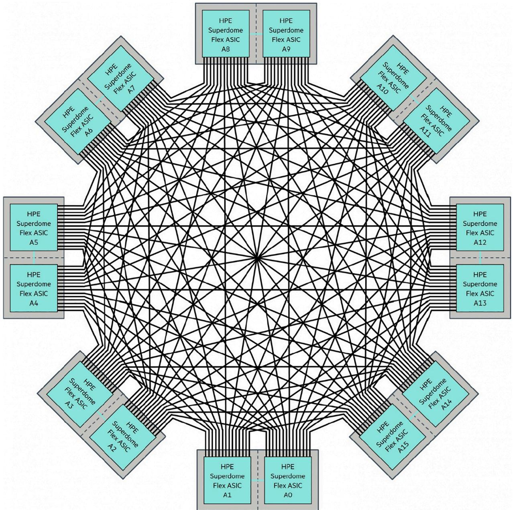  
Fig. 1. Example of an 8-chassis (32 sockets) HPE Superdome Flex Grid Interconnect with all-to-all communication fabric (same topology as SGI UV300).

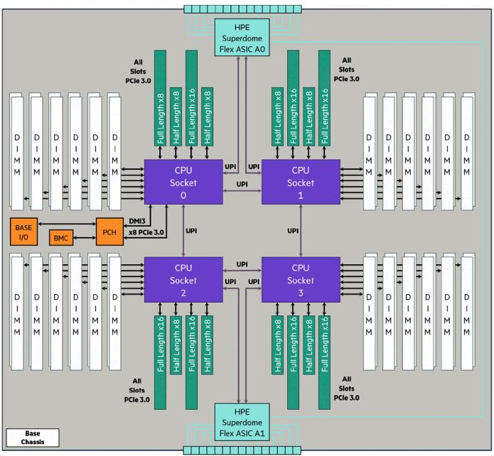  
Fig. 2. HPE Superdome Flex modular chassis architecture with ring-connected sockets and HPE Superdome Flex ASIC for Flex Link communication fabric.

time. The sending and receiving CPUs access memory locations local on their HCA and the processing hardware on the HCA execute the data transfers through Remote Direct Memory Access (RDMA) procedures.

The HCA usually takes the form of a PCI express card inserted in each node and connected to the InfiniBand Switch with an InfiniBand cable.

The ConnectX-3, released in 2007, operates with QDR for a raw signaling rate of 10 Gb/s and latency of 1.3 μs. The ConnectX-6 was released in 2018 and its HDR presents a raw signaling rate of 51.6 Gb/s with a latency below 0.6 μs.

For the presented work, three different clusters were tested (RAM memory is irrelevant for the tested simulation software, see next section):

• 8-node cluster with QDR HCA, Voltaire InfiniBand QDR 324-port Switch Chassis and Open MPI 1.8.1. Each node contains a dual Intel Xeon E5–2670 (8 cores @ 2.6 GHz and 20 MB L3 cache). The nodes operate with a custom kernel based on SLES 12 sp1.   
• 8-node cluster with HDR HCA, Mellanox InfiniBand HDR 40-port QSFP56 switch and Open MPI 4.1.4. Each node contains an Intel Xeon W-2133 (6 cores @ 3.6 GHz and 8.25 MB L3 cache). The nodes operate with a custom kernel based on SLES 15 sp2.   
• 3-node cluster with HDR HCA, Mellanox InfiniBand HDR 40-port QSFP56 switch and Open MPI 4.1.4. Each node contains a dual Intel Xeon Scalable Gold 6246R (16 cores @ 3.4 with 35.75 MB L3 cache). The nodes operate with a custom kernel based on SLES 15 sp2.

# 5. Power System Offline Simulation

The purpose of the current work is to evaluate the communication fabrics for offline EMT simulation. With that purpose in mind, a sizeable and highly partitionable power system was chosen. It is presented in the next subsection in more detail.

Before diving further into the test case, it is important to understand that the simulation tool used in this case was developed for RT HIL application [2]. This is important here as the simulation results are volatile: the power system solution is computed and, in a RT-HIL scenario, sent to the real-world IOs to communicate with the device-under-test. Historical values and various states are saved for the next time-step but otherwise, nothing else is preserved in RAM memory

or disk. This means that both of these resources are of no consequence for this simulation tool at runtime. However, this puts a lot of pressure on the cache memory of the CPU: as the following results will demonstrate, a shortage of cache memory is highly detrimental to the simulation performances.

For users to retrieve simulation results, a data acquisition tool was developed to connect to the simulation and request that specific signals be temporarily saved and sent back to the user while the simulation is running.

# 5.1. Power System Presentation

The test power system is a representation of the HQ power transmission system used in several papers over the years [15–17]. Its content is listed in Table 1 and it is illustrated in Fig. 3 (the scale was chosen to give an overview of the power system, not a detailed view of the components).

The fact that this power system can be partitioned into 172 simulation task makes it a prime choice for parallel processing and communication fabric evaluation. Taken individually, each simulation task is almost insignificant in relation to today’s computer processing power. So, as the number of processing units used in the simulation increases, their individual computation load will tend to nothing, but high pressure will be applied on the communication fabric as all these simulation tasks need to exchange data between themselves. The focus will then be entirely on the communication fabric, its ability to handle bursts of very small packets and its overall performance. The actual processing power of each cluster is not of interest here.

The test methodology is quite simple: force the automatic task mapper to partition the simulation on a given number of processing units, launch the simulation and record the average simulation time-step after approximately 5 min of simulation (which represents a minimum of 2 million time-steps for the worst cases and near 40 million for the best cases). As each cluster has different CPUs, it was necessary to evaluate σ(n) and ϕ(n) in each case. The RT capabilities of this simulation tool were used to run this case in RT on the same CPUs: as the RT simulation has several built-in timers and performance indicators, it was possible to extract a precise value for the parallel part ϕ(n) on each type of CPU. The serial part σ(n) at runtime for this simulation tool is null [15]. The performance metrics were then determined for each partitioning.

# 5.2. SGI UV300 Performances

An 8-chassis SGI UV300 populated with Intel Xeon E7–8891v4 processors (40 cores per chassis for a total of 320 cores) was used to quantify the NL 7 capabilities for offline EMT simulation. As shown in Fig. 4, the speedup is interesting while using the first 4-socket chassis: the efficiency decreases but the Karp-Flatt metric indicates efficient parallelism. Past the first chassis, the time spent by each processing unit to solve its simulation tasks falls below 3 μs (i.e., less than 3 μs is required

Table 1 Content of the Hydro-Qu´ebec power transmission system EMT representation.   

<table><tr><td>Power system element</td><td>Quantity</td></tr><tr><td>Electrical nodes</td><td>1099</td></tr><tr><td>Electrical machines</td><td>37</td></tr><tr><td>Synchronous condensers</td><td>4</td></tr><tr><td>Static var compensators</td><td>7</td></tr><tr><td>Power lines</td><td>170</td></tr><tr><td>Three-phase transformers</td><td>131</td></tr><tr><td>RLC elements</td><td>3117</td></tr><tr><td>Non-linear elements</td><td>249</td></tr><tr><td>Switches</td><td>106</td></tr><tr><td>Comm. (Control, monitoring, etc.)</td><td>332</td></tr></table>

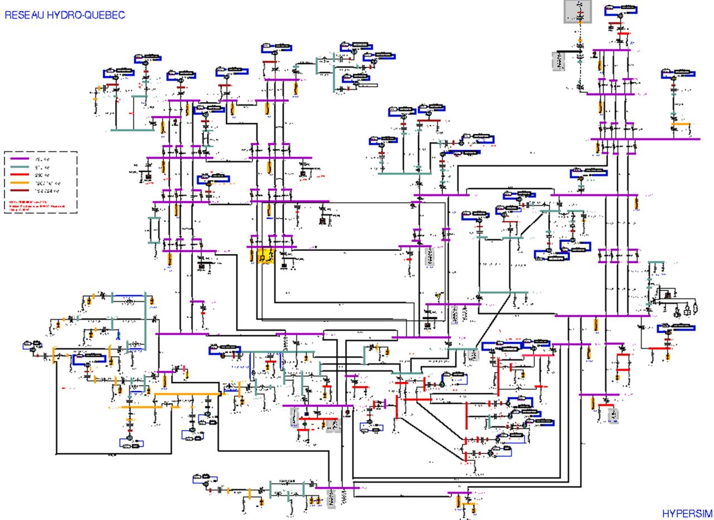  
Fig. 3. Hydro-Qu´ebec power transmission system representation in EMT simulation software.

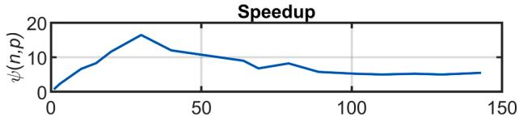  
SGI UV300 NUMAlink 7 with SGI MPT 2.14

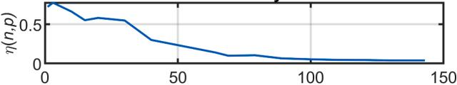  
Efficiency

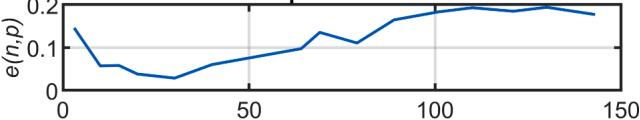  
Karp-Flatt metric   
p   
Fig. 4. 8-chassis SGI UV300 performance metrics for offline EMT simulation of large-scale power system.

to execute all the operations to advance the simulation by one time-step) but the parallelization cost keeps increasing, resulting in a crumbling of the speedup and efficiency metric while the Karp-Flatt metric saturates near 0.2. The parallelization cost then dominates the total execution time and saturates at approximately 22 μs while the execution time related to solving the simulation tasks is under 0.8 μs for each processing unit.

Even though this UV300 has more processing units, it was not

possible to further partition the workload and p fell short of 150 cores.

An interesting observation can be made by looking at the metrics for very-low values of p: all the metrics are rather poor for $p < 4 .$ . This originates from sub-optimal memory operation as the workload is too big to be efficiently cached by a small amount of processing units, resulting in really high value of $\kappa ^ { \prime } ( n , p )$ . This observation can be made for all the tested communication fabric and configurations.

Furthermore, ignoring the processing cost for a single processing unit and directly using the execution time here to establish the metrics would lead to the most sought-after super-linear speedups, reinforcing the importance of properly evaluating σ(n) and ϕ(n).

The SGI MPT 2.14 MPI library was used for this test. Tests with other platforms confirmed the impact of the MPI library on results. The 2.14 library was part of the qualified OS for RT operation of HQ EMT simulation tool on this platform. Better performances could potentially be achieved with more recent MPI libraries, but the OS would need to be requalified for RT operations.

# 5.3. HPE SDF Performances

Very interesting results were obtained with a 4-chassis HPE SDF (see Fig. 5): this supercomputer is also built around 4-socket chassis, this time populated with Intel Xeon Scalable Gold 6144 (32 cores per chassis, total of 128 cores in the system). These processors are very effective for EMT simulation and as such, $\kappa ^ { \prime } ( n , p )$ quickly become dominant, even within a single chassis (saturation of speedup and rise of $e ( n , p ) )$ ). The Karp-Flatt metric then stabilizes, indicating a saturation of the parallelization costs in relation to the increasing values of $p . \ \kappa ^ { \prime } ( n , p )$ saturates around 19 μs and the effective workload of each core is then under 0.5 μs.

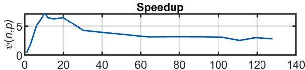  
HPE Superdome Flex with HPE MPT 2.24

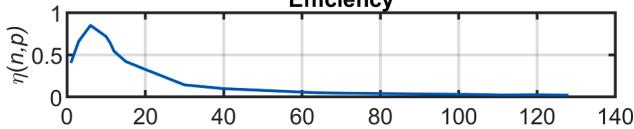  
Efficiency

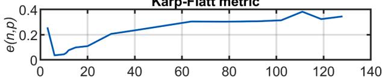  
Karp-Flatt metric   
p   
Fig. 5. 4-chassis HPE Superdome Flex performance metrics for offline EMT simulation of large-scale power system.

The MPI library used is the HPE MPT 2.24. The same MPI library discussion applies here.

These results confirm that, while the processing power of CPUs increases (approximately two years between the UV300’s CPUs and those of the SDF), the communication fabrics do not evolve as quickly.

# 5.4. Mellanox ConnectX-3 QDR Performances

As HQ research center’s main cluster was updated, this Mellanox technology became readily available in the lab. It was used in this work, despite being considered an “InfiniBand relic” today, to explore clustering technology and establish a performance baseline. From the metrics shown in Fig. 6, it can be determined that parallelization costs are very high compared to the workload as soon as the workload is spread on several nodes. When the second node is used, κ’(n,p) jumps to 90 μs and slowly saturates at approximately 105 μs when fully using the eight nodes. Compared to RT performances, these numbers are quite high, but the interesting point here is the slow increase: from 90 μs for 17 cores on two nodes to 105 μs for 128 cores on 8 nodes. This kind of scaling, obtained from 15-year-old technology, establishes a very promising baseline for clustering technology.

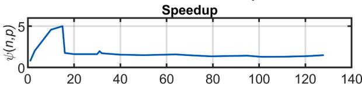  
Mellanox ConectX-3 QDR with OpenMPI 1.8.1

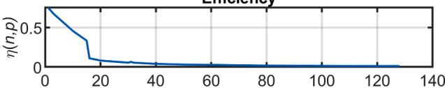  
Efficiency

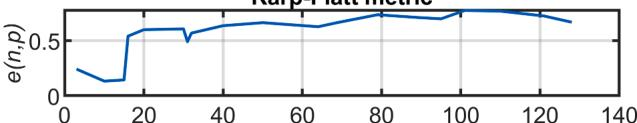  
Karp-Flatt metric   
p   
Fig. 6. 8-node QDR InfiniBand performance metrics for offline EMT simulation of large-scale power system.

The MPI library used is Open MPI 1.8.1. The same MPI library discussion applies here.

# 5.5. Mellanox ConnectX-6 HDR Performances

Two different clusters were built with HDR hardware: the first one contains eight nodes, each with a single Intel Xeon W-2133 6-core CPU and the second has three nodes, each with two Intel Xeon Scalable Gold 6246R 16-core CPU, for a total of 48 and 96 cores, respectively. The idea was to test the node scalability with the first cluster, and the second was to test the core scalability within the node themselves. Results for both clusters are illustrated in Figs. 7 and 8.

As in all the previous cases, as soon as the workload is spread beyond the first node, a drastic drop in performance occurs. Afterward, in both cases, the e(n,p) metric slowly saturates near 0.2, indicating the slow increase in κ’(n,p), which saturates at 11 μs. A discontinuity can be seen in the metrics when an additional node is used: additional cache memory becomes available and the communication is spread on a higher number of communication links, effectively reducing the Karp-Flatt metric.

From these results, κ′ 8(n, 48) on the 8-node cluster is similar to κ′ (n, 96) on the 3-node cluster. Additional testing is required to better understand the impact of the number of nodes versus the number of cores p on the parallelization cost.

The MPI library used is Open MPI 4.1.4. The same MPI library discussion applies here.

# 5.6. Observations

As explained earlier, this test was built to put the focus on the communication fabric: the processing and memory requirements are considerable, and the problem can be spread over a large number of processing units. All these characteristics are representative of large EMT simulations. The observed results confirm several trends about problem size and memory, communication cost scalability and MPI performances.

Regardless of the communication fabric, the size of the problem will influence the amount of cache memory required for optimal operation. Below that threshold, the processing will be severely hindered: in several cases, the processing overhead for single core operation was superior to the effective processing time $( \kappa ^ { \prime } ( n , 1 ) > \sigma ( n ) { + } { \phi } ( n ) )$ . This phenomenon dominates at low core count. As p increases, a sharp rise in speedup and a sharp decrease of Karp-Flatt metric are observed as optimal memory operation is reached.

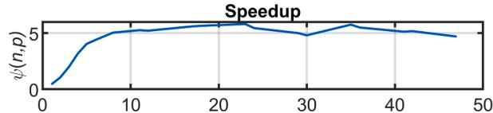  
Mellanox ConectX-6 HDR with OpenMPl 4.1.4 (8x6 cores)

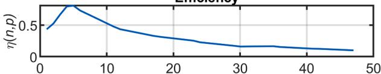  
Efficiency

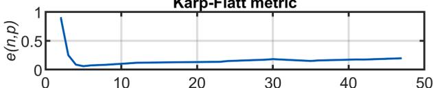  
Karp-Flatt metric   
p   
Fig. 7. 8-node HDR InfiniBand performance metrics for offline EMT simulation of large-scale power system.

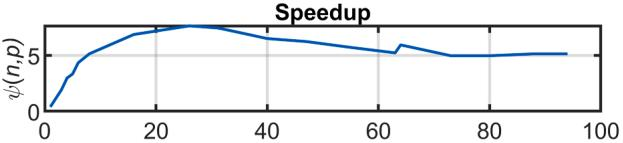  
Mellanox ConectX-6 HDR with OpenMPl 4.1.4 (3x32 cores)

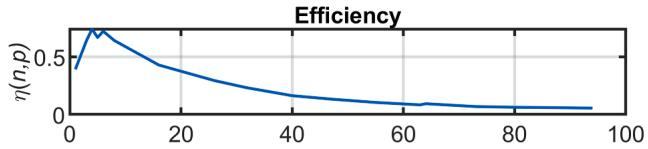

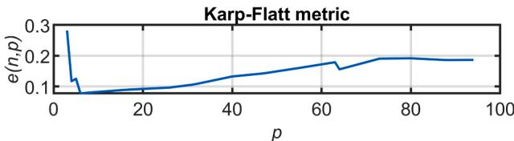  
Fig. 8. 3-node HDR InfiniBand performance metrics for offline EMT simulation of large-scale power system.

Once the memory requirement is met, the communication costs become the main limiting factor: it drives the efficiency towards zero as the number of core increases for all communication fabrics. QDR technology exhibited a multi-node penalty of 90 μs. It is noticeable for the UV300 (≈5 μs) but not for the SDF and the HDR. The UV300 and the SDF exhibited somewhat higher final κ’(n,p) compared to Mellanox HDR technology (21 and 19 versus 11 μs) but the comparison is not entirely fair as these value were obtained with different values of p. Further testing is required with HDR technology with a higher number of nodes and total cores.

Testing also revealed MPI sensitivity to various library implementations. Readily available libraries were used in all cases and no special care was taken to find high-performance or customized high-end libraries. Exploring EMT simulation performances with such libraries represents another research opportunity.

In summary, the witnessed performances of all communication fabrics are very interesting as it opens the door to very-large-scale offline EMT simulation executed in a timely manner. In the presented case, the workload (σ(n)+φ(n)) represented between 58 and 160 μs of CPU time per simulation time-step (50 μs here), which is not very high. It is not rare for very-large-scale and complex EMT simulations to have a CPU time in the thousands and tens of thousands of μs per simulation timestep: instead of tens of second (even minutes) per second of simulation, execution time in the same order of magnitude as the simulation time would be achievable with the proper supercomputer or cluster (even with QDR technology).

# 6. Conclusion

In summary, it is important to consider all three presented metrics (speedup, efficiency and the Karp-Flatt metric, also known as the experimentally determined serial fraction) when evaluating parallel processing quality. In addition to the execution time, it is also important to carefully evaluate or estimate the workload as well as the processing overhead κ’(n,1) as it impacts all the metric calculations.

Two types of communication fabrics were presented: the more generic InfiniBand and the more specialized NL 7/FGI.

A representation of the HQ power transmission system was used to evaluate each communication fabric parallelization cost and processing overhead. The behavior of all tested communication system was coherent, and their performances are correlated to their respective release date (i.e., the newer communication fabric obviously offering better performances). However, further testing with larger clusters

counting more nodes and more processing cores is required to confirm the findings of this work. In the meanwhile, using clusters for offline EMT simulation of very-large-scale power system is a very sensible choice.

Finally, the observed performances of the HDR InfiniBand communication fabrics are very promising for the use of clusters for RT HIL simulations. HDR could be used in the same manner as NL 7 and FGI: instead of using the MPI software stack, the communication fabric’s lowlevel functions could be used to reach RT performance. Exploring the performances of InfiniBand low-level functions is the first step towards adapting HQ’s RT EMT simulation software to operate in RT with InfiniBand hardware.

# CRediT authorship contribution statement

P. Le-Huy: Conceptualization, Methodology, Validation, Formal analysis, Investigation, Writing – original draft, Writing – review & editing, Visualization. S. Gue´rette: Conceptualization, Software, Validation. F. Guay: Conceptualization, Supervision, Project administration.

# Declaration of Competing Interest

The authors declare that they have no known competing financial interests or personal relationships that could have appeared to influence the work reported in this paper.

# Data availability

The authors do not have permission to share data.

# Acknowledgement

The authors gratefully acknowledge the contributions of M.-A. Dubois and E. ´ Germain for making this work possible.

# References

[1] R. Kuffel, J. Giesbrecht, T. Maguire, R. Wierckx, P. McLaren, Rtds-a fully digital power system simulator operating in real time, in: EMPD’95, Singapore, 1995. November 21-23.   
[2] V.Q. D.o, J.-C. Soumagne, G. Sybille, G. Turmel, P. Giroux, G. Cloutier, S. Poulin, Hypersim, an integrated real-time simulator for power networks and control systems, in: ICDS’99, Vasteras, Sweden, 1999. May 25-28.   
[3] R. Singh, A.M. G.ole, P. Graham, J.C. M.uller, R. Jayasinghe, B. Jayasekera, D. Muthumuni, Using local grid and multi-core computing in electromagnetic transients simulation, in: IPST’13, Vancouver, Canada, 2013. June 18-20.   
[4] A. Abusalah, O. Saad, J. Mahseredjian, U. Karaagac, L. G´erin-Lajoie, I. Kocar, CPU based parallel computation of electromagnetic transients for large scale power systems, in: IPST’17, Seoul, Republic of Korea, 2017. June 26-29.   
[5] The MPI Forum, MPI: a message passing interface, in: SC’93, Portland, USA, November 19, 1993.   
[6] “HPE Integrity MC990 X Server – System Architecture” Technical white paper, consulted on December 7, 2022, https://support.hpe.com/hpesc/public/docDis play?docId=a00062203en_us&docLocale=en_US.   
[7] “HPE superdome flex server architecture and RAS” Technical white paper, consulted on December 7, 2022, https://www.hpe.com/psnow/doc/A000364 91ENW.pdf.   
[8] “InfiniBand FAQ Rev. 1.3″ technical white paper, consulted on December 7, 2022, https://network.nvidia.com/sites/default/files/pdf/whitepapers/InfiniBandFAQ_F Q_100.pdf.   
[9] R. Buyya, T. Cortes, H. Jin, High Performance Mass Storage and Parallel I/O: Technologies and Application, Wiley-IEEE Press,2002, pp. 616-632.   
[10] G.M. A.mdahl, Validity of the single processor approach to achieving large-scale computing capabilities, in: AFIPS’67, Atlantic City, USA, 1967. April 18-20.   
[11] M.J. Q.uinn, Parallel Programming in C with MPI and OpenMP, McGraw-Hill, 2004.   
[12] A.H. K.arp, H.P. F.latt, Measuring parallel processor performance, Commun. ACM 33 (5) (May 1990) 539–543.   
[13] J. Laudon, D. Lenoski, The SGI origin: a ccNUMA highly scalable server, in: ISCA’97, Denver, USA, 1997. June 2-4.   
[14] G. Thorson, M. Woodacre, The SGI UV2: a fused computation and data analysis, in: SC12, Salt Lake City, USA, 2012. Nov. 10-16.

[15] P. Le-Huy, M. Woodacre, S. Gu´erette, E. ´ Lemieux, Massively parallel real-time simulation of very-large-scale power systems, in: IPST’17, Seoul, Republic of Korea, 2017. June 26-29.   
[16] D. Par´e, G. Turmel, J.-C. Soumagne, V.A. D.o, S. Casoria, M. Bissonnette, B. Marcoux, D. McNabb, Validation tests of the Hypersim digital real time

simulator with a large AC-DC network, in: IPST’03, New Orleans, USA, 2003. Sept. 28 - Oct. 2.   
[17] P. Le-Huy, P. Giroux, J.-C. Soumagne, Real-time simulation of large-scale AC system with offshore DC grid, in: IPST’13, Vancouver, Canada, 2013. June 18-20.