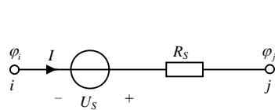
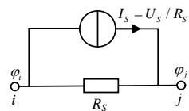
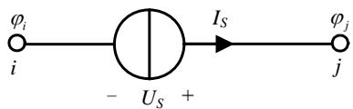
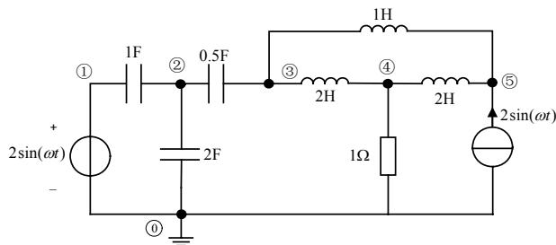
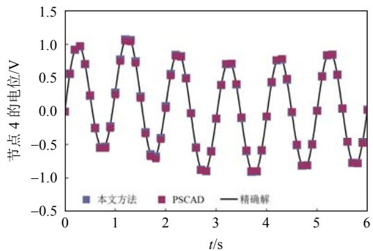
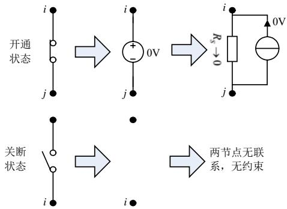
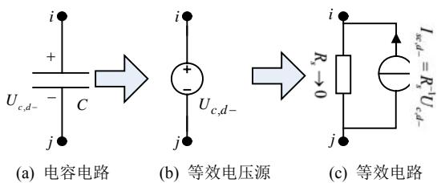
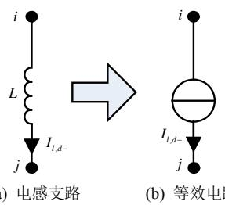
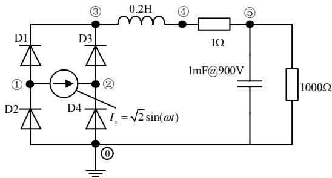
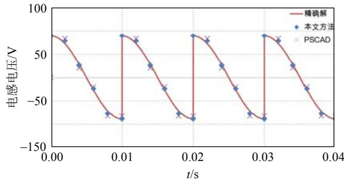

# 线性开关电路电磁暂态分析的状态方程法

纪锋，魏晓光，吴学光，刘杰，许韦华

(先进输电技术国家重点实验室(全球能源互联网研究院), 北京市昌平区 102200)

# State Space Method to Analyze the Electromagnetic Transient of Linear Switching Circuit

JI Feng, WEI Xiaoguang, WU Xueguang, LIU Jie, XU Weihua

(State Key Laboratory of Advanced Transmission Technology(Global Energy Interconnection Research Institute),

Changping District, Beijing 102200, China)

ABSTRACT: A novel state equation method which took nodal potentials as the state variables was proposed to solve the electromagnetic transient of linear circuit or even with switches. Based on energy conservation principle instead of graph theory, the equations formed much faster than the classical method, which took the current of inductor and voltage of capacitor as the state variables. For the circuit topology changing caused by switches action, only the switching branch's information need to be updated to the state equations, instead of decomposition and re-writing of the state equations. The numeric oscillation at the switching time was eliminated by one-step backward difference method, and the second order numeric accuracy was ensured by trapezoidal method in the linear time. Compared with the classic nodal analysis method, the method proposed by this paper has a much better stability and flexibility. It is more suitable for the large-scale switching circuit simulation. Finally, the numerical stability and flexibility of this method was demonstrated by a bridge circuit.

KEY WORDS: electromagnetic transient; linear circuit; switching; state equation; trapezoidal method; backward difference method; numerical oscillation; numerical precision

摘要：针对线性电路以及包合理想开关的线性电路中的电磁暂态分析问题，提出了一种全新的以节点电位为状态变量的状态方程法。基于能量守恒原理而非图论理论，方法列写电路方程的速度远远优于传统的使用电感电流和电容电压作为状态量的状态方程法，并通过一个病态电路展示了方法的便捷性。针对开关动作引起的电路拓扑变化，仅需要对特定的支路信息进行修改，而不必重新列写整个电路方程。由于使用了单步后差法消除了开关时刻的数值振荡，而在线性时间段内仍然使用梯形法来保证二阶数值精度，这使得文中方法与传统的节点分析法相比具有更好的稳定性和灵活性，更适合于大规模开关电路的仿真分析。以一个桥式电路为例，展示了方法的数值精度和稳定性。

关键词：电磁暂态；线性电路；开关；状态方程；梯形法；后差法；数值振荡；数值精度

# 0 引言

电磁暂态分析是电力系统仿真的重要组成部分，是了解电力系统暂态复杂行为的重要手段。当前以节点分析法为基础的(the electromagnetic transients program, EMTP)类算法在电力系统电磁暂态仿真中被广泛使用。节点分析法的核心思想是将电感、电容等动态元件等效变换为电流源与电阻的并联，从而在每一个特定的时间点上将电路等效为电阻网络，通过构建电路的电导矩阵来进行求解[1-2]。目前流行的EMTP，PSCAD/EMTDC等电力系统电磁暂态分析软件，以及RTDS等硬件仿真平台都是基于节点分析法。

节点分析法是在计算机发展的初期，为了分析交流系统中的电磁暂态问题而建立的电路分析方法，并没有特别关注开关状态的切换特性。随着电力电子技术的发展，系统中的开关数量大幅增加，使用节点分析法分析开关电路时，存在的主要问题是在开关动作时刻出现强烈的数值振荡，虽然各个软件均采用一定的数值技术来消除振荡，但仍然要求采用非常小的步长来保证足够的计算精度。诚然节点分析法并不强制要求采用定步长[1]，但为了避免步长变化时重新离散电容和电感等动态元件，目前所有的基于节点分析法的分析软件都是采用定步长来计算的。近年来，国际上对电路仿真的研究工作大多集中在通过简化电路模型[3-5]或使用具有并行计算能力的硬件加速[6-7]来提高仿真效率，却少有对于电路理论本身和基础算法的研究。

状态方程法最早应用于控制系统分析，20世纪60年代以来被广泛应用到电路网络分析中[8]。电路的状态方程是描述电路网络系统模型的动态方程，

可以构成电路网络分析的基础。状态变量是一组独立的动态变量，状态方程就是用状态变量表达的一组独立的一阶微分方程[9-10]。具有标准形式的状态方程可以使用各种成熟的数值计算程序进行求解，唯一的问题是通常不能直接得到[9]。一般来说，中等规模以上的电路网络，必须借助网络图论的知识[11-12]，通过复杂的拓扑分析得到[9-13]。通常认为，电路网络的状态方程编列过于复杂，有时甚至不可能形成通常所要求的标准形式。20世纪90年代有学者提出了一种自动生成状态方程的方法[14]，苏黎世工学院的两位学者也基于自动生成状态方程的技术编写了基于状态方程法的PLECS软件[15]。计算机自动生成状态方程的方法在求解中等规模电路网络问题时，是方便有效的。而对于大规模电路网络的求解，在列写方程的速度和效率上则没有优势[16]。更为甚者，当电路中包含大量开关元件时，每一次开关状态切换都会导致电路拓扑发生改变，都需要重新列写状态方程。理论上讲，含有 $N$ 个开关的电路网络，最多需要列写 $2^{N}$ 组可能的状态方程。

电路理论与基础算法是电磁暂态仿真的灵魂。本文使用节点电位为状态变量，基于能量守恒原理构建了电路的状态方程，并将这种状态方程法应用于开关电路的分析，同时给出了严格的数学证明。

# 1 能量守恒原理构建状态方程

首先，构造一个泛函：由电阻、电容、电感和电源构成的电路系统中，系统能量 $\Pi$ 定义为所有电容储能 $E_{\mathrm{C}}$ ，所有电感储能 $E_{\mathrm{L}}$ ，所有电阻耗散能量 $E_{\mathrm{R}}$ ，以及所有电流源吸收的能量 $E_{\mathrm{I}}$ 之和(定义电流源吸收能量时， $E_{\mathrm{I}} > 0$ ；电流源发出能量时， $E_{\mathrm{I}} < 0)$ 。

$$
\Pi = E _ {\mathrm {C}} + E _ {\mathrm {L}} + E _ {\mathrm {R}} + E _ {\mathrm {I}} \tag {1}
$$

式中： $E_{\mathrm{C}} = \sum_{C}\frac{1}{2} CU^{2};E_{\mathrm{L}} = \sum_{L}\frac{1}{2} LI^{2}$ ，考虑到线性电感中 $I = L^{-1}\int U\mathrm{d}t$ ，电感储能也可以表示为 $E_{\mathrm{L}} = \sum_{L}\frac{1}{2} L^{-1}(\int U\mathrm{d}t)^{2};E_{\mathrm{R}} = \int (\sum_{R}R^{-1}U^{2})\mathrm{d}t;E_{\mathrm{I}} = \int (\sum_{I_{\mathrm{s}}}UI_{\mathrm{s}})\mathrm{d}t,$ $U$ 为支路电压； $I$ 为支路电流； $I_{s}$ 为电流源的输出电流。

本文中，所有的电阻伴随电压源都等效变换为诺顿电流源，如图1所示。如果是理想电压源，则令其内阻 $R_{\mathrm{s}}$ 趋于零。这样式(1)中的 $E_{\mathrm{R}}$ 和 $E_{\mathrm{I}}$ 就已经包含了电压源吸收的能量。

定义电路中各个节点的电位为 $\varphi_{i}(i = 0,1,2,\dots ,n)$ ，(其中0号节点为参考地电位节点)，构成的节

  
(a) 电压源

  
(b) 等效诺顿电流源  
图1 电压源的诺顿等效电路  
Fig.1 Equivalent Norton circuit of the voltage source点电位列向量 $\pmb {\varphi} = [\varphi_0,\varphi_1,\dots ,\varphi_n]^{\mathrm{T}}$ 作为待解状态量。

对于任意一个连接在 $i$ 号节点与 $j$ 号节点之间，电阻为 $R$ 的支路来讲，其耗散功率可以表示为：

$$
\begin{array}{l} P _ {\mathrm {R}} = R ^ {- 1} U ^ {2} = \left(\varphi_ {i} - \varphi_ {j}\right) R ^ {- 1} \left(\varphi_ {i} - \varphi_ {j}\right) = \\ \left[ \begin{array}{l l} \varphi_ {i} & \varphi_ {j} \end{array} \right] \left[ \begin{array}{l} 1 \\ - 1 \end{array} \right] R ^ {- 1} \left[ \begin{array}{l l} 1 & - 1 \end{array} \right] \left[ \begin{array}{l} \varphi_ {i} \\ \varphi_ {j} \end{array} \right] = \left[ \begin{array}{l l} \varphi_ {i} & \varphi_ {j} \end{array} \right]. \\ \left[ \begin{array}{c c} R ^ {- 1} & - R ^ {- 1} \\ - R ^ {- 1} & R ^ {- 1} \end{array} \right] \left[ \begin{array}{l} \varphi_ {i} \\ \varphi_ {j} \end{array} \right] = \boldsymbol {\varphi} ^ {\mathrm {T}} \boldsymbol {K} _ {r} \boldsymbol {\varphi} \tag {2} \\ \end{array}
$$

式中：系数矩阵 $K_{\mathrm{r}}$ 是 $n + 1$ 阶的方阵，除 $K_{\mathrm{r}}(i,i) = R^{-1}$ $K_{\mathrm{r}}(i,j) = -R^{-1},K_{\mathrm{r}}(j,i) = -R^{-1},K_{\mathrm{r}}(j,j) = R^{-1}$ 以外， $K_{\mathrm{r}}$ 中的其他元素均为零。

因此，电路中所有电阻的耗散能量可以表示为

$$
E _ {\mathrm {R}} = \int (\boldsymbol {\varphi} ^ {\mathrm {T}} \boldsymbol {K} _ {\mathrm {R}} \boldsymbol {\varphi}) \mathrm {d} t \tag {3}
$$

式中 $K_{\mathrm{R}} = \sum_{R}K_{\mathrm{r}}$ 。

需要注意的是，系数矩阵 $K_{\mathrm{R}}$ 中不仅包含了所有电阻支路信息，同时包含了所有理想电压源的等效内阻信息。

同样地，可以推导出电路中所有电容的储能为

$$
E _ {\mathrm {C}} = \frac {1}{2} \boldsymbol {\varphi} ^ {\mathrm {T}} \boldsymbol {K} _ {\mathrm {C}} \boldsymbol {\varphi} \tag {4}
$$

式中 $K_{\mathrm{C}} = \sum_{C}K_{\mathrm{c}}$ 。

对于任意一个连接在 $i$ 号节点与 $j$ 号节点之间，电容为 $C$ 的支路来讲，其系数矩阵 $\pmb{K}_{\mathrm{c}}$ 中，除 $\pmb {K}_{\mathrm{c}}(i,i) = C$ ， $\pmb {K}_{\mathrm{c}}(i,j) = -C$ ， $\pmb {K}_{\mathrm{c}}(j,i) = -C$ ， $\pmb {K}_{\mathrm{c}}(j,$ $j) = C$ 以外，其他元素均为零。

电路中所有电感的储能可以表示为

$$
E _ {\mathrm {L}} = \frac {1}{2} \left(\int \varphi \mathrm {d} t\right) ^ {\mathrm {T}} K _ {\mathrm {L}} \int \varphi \mathrm {d} t \tag {5}
$$

式中 $K_{\mathrm{L}} = \sum_{L} K_{1}$ 。

对于任意一个连接在 $i$ 号节点与 $j$ 号节点之间，电感为 $L$ 的支路来讲，其系数矩阵 $\pmb{K}_{1}$ 中，除 $\pmb {K}_1(i,i) = L^{-1},\quad \pmb {K}_1(i,j) = -L^{-1},\quad \pmb {K}_1(j,i) = -L^{-1},$ （20 $K_{1}(j,j) = L^{-1}$ 以外，其他元素均为零。

图2所示电流源支路吸收的功率可以表示为：

  
图2 电流源支路  
Fig. 2 Current source branch

$$
P _ {I _ {\mathrm {s}}} = U I _ {\mathrm {s}} = \left[ \varphi_ {i} \quad \varphi_ {j} \right] \left[ I _ {\mathrm {s}} - I _ {\mathrm {s}} \right] ^ {\mathrm {T}} = \boldsymbol {\varphi} ^ {\mathrm {T}} \boldsymbol {I} _ {\mathrm {s}} \tag {6}
$$

式中： $I_{s}$ 是一个 $n + 1$ 阶的列向量，除 $I_{s}(i) = I_{s}$ 和 $I_{s}(j) = -I_{s}$ 外（规定流出节点的方向是电流的正方向），其他元素均为零。

因此，电路中所有电流源吸收能量可以表示为

$$
E _ {\mathrm {I}} = \int \left(\boldsymbol {\varphi} ^ {\mathrm {T}} \boldsymbol {I} _ {\mathrm {S}}\right) \mathrm {d} t, \text {其 中} \boldsymbol {I} _ {\mathrm {S}} = \sum_ {I s} \boldsymbol {I} _ {\mathrm {s}} \tag {7}
$$

式中： $I_{\mathrm{S}}$ 包含了电路中所有电流源以及理想电压源的诺顿等效电流源信息。

将式(3)—(5)和(7)代入式(1)中，就得到了矩阵形式表示的系统能量，如式(8)。

$$
\begin{array}{l} \Pi = \frac {1}{2} \boldsymbol {\varphi} ^ {\mathrm {T}} \boldsymbol {K} _ {\mathrm {C}} \boldsymbol {\varphi} + \frac {1}{2} (\int \boldsymbol {\varphi} ^ {\mathrm {T}} \mathrm {d} t) \boldsymbol {K} _ {\mathrm {L}} \int \boldsymbol {\varphi} \mathrm {d} t + \\ \int \left(\boldsymbol {\varphi} ^ {\mathrm {T}} \boldsymbol {K} _ {\mathrm {R}} \boldsymbol {\varphi}\right) \mathrm {d} t + \int \boldsymbol {\varphi} ^ {\mathrm {T}} \boldsymbol {I} _ {\mathrm {S}} \mathrm {d} t \tag {8} \\ \end{array}
$$

将式(8)左右两端同时对时间 $t$ 进行微分运算，得到系统能量增加速率 $P = \partial \Pi / \partial t$ ，如式(9)。

$$
P = \boldsymbol {\varphi} ^ {\mathrm {T}} \boldsymbol {K} _ {\mathrm {C}} \frac {\mathrm {d}}{\mathrm {d} t} \boldsymbol {\varphi} + \boldsymbol {\varphi} ^ {\mathrm {T}} \boldsymbol {K} _ {\mathrm {L}} (\int \boldsymbol {\varphi} \mathrm {d} t) + \boldsymbol {\varphi} ^ {\mathrm {T}} \boldsymbol {K} _ {\mathrm {R}} \boldsymbol {\varphi} + \boldsymbol {\varphi} ^ {\mathrm {T}} \boldsymbol {I} _ {\mathrm {S}} \tag {9}
$$

根据能量守恒原理，孤立系统的能量随时间 $t$ 的增加量始终为零，即 $P = \partial \Pi / \partial t = 0$ 。因而对于任意一种可能存在的节点电位分布 $\varphi$ 来讲，都存在式(10)成立。

$$
\boldsymbol {K} _ {\mathrm {C}} \frac {\mathrm {d}}{\mathrm {d} t} \boldsymbol {\varphi} + \boldsymbol {K} _ {\mathrm {L}} \int \boldsymbol {\varphi} \mathrm {d} t + \boldsymbol {K} _ {\mathrm {R}} \boldsymbol {\varphi} + \boldsymbol {I} _ {\mathrm {S}} = 0 \tag {10}
$$

式(10)就是系统的动态微分方程，是一个包括 $n + 1$ 个方程的方程组。考虑到0号节点是电路中的参考地电位，可以消去一个方程。具体做法是消去向量 $\varphi$ 和 $I_{\mathrm{S}}$ 中的0号元素，以及系数矩阵 $K_{\mathrm{C}}$ ， $K_{\mathrm{L}}$ $K_{\mathrm{R}}$ 中的第0行和第0列。最终得到由 $n$ 个方程构成的系统方程组。

式(10)中包含电位向量 $\varphi$ 的3种状态(1阶导数、0阶导数以及-1阶导数(或1重积分))是一个二阶方程，使用计算机对其进行迭代求解并不方便。因此需要做一个变量代换[17]，形成式(11)所示的一阶状态方程组。

$$
\boldsymbol {K} _ {1} \mathrm {d} \boldsymbol {x} / \mathrm {d} t = - \boldsymbol {K} _ {2} \boldsymbol {x} + \boldsymbol {R} \tag {11}
$$

式中： $K_{1} = \left[ \begin{array}{cc}K_{\mathrm{C}} & \mathbf{0}\\ \mathbf{0} & E \end{array} \right];K_{2} = \left[ \begin{array}{cc}K_{\mathrm{R}} & K_{\mathrm{L}}\\ -E & \mathbf{0} \end{array} \right];R = \left[ \begin{array}{c} - I_{\mathrm{S}}\\ \mathbf{0} \end{array} \right];$

$\boldsymbol{x} = \left[ \begin{array}{c}\varphi \\ \int \varphi \mathrm{d}t \end{array} \right];\quad \boldsymbol{\Psi} = \int \varphi \mathrm{d}t;\quad \boldsymbol{E}$ 为单位对角矩阵。

使用计算机程序列写状态方程的关键是如何获得电容系数矩阵 $K_{\mathrm{C}}$ ，电阻系数矩阵 $K_{\mathrm{R}}$ 和电感系数矩阵 $K_{\mathrm{L}}$ 。附录A给出了获得系数矩阵的伪代码，由于没有使用任何图论的概念和理论，这段伪代码的执行效率非常高，适合于大规模电路的状态方程列写。

# 2 算例1

下面通过图3所示的线性电路来说明如何建立状态方程。

  
图3算例1电路(电源频率1Hz)  
Fig.3 $1^{\mathrm{st}}$ example circuit (power frequency is 1Hz)

图3的电路拓扑在计算机中可以存储为表1所述格式，对表1中的各支路执行附录A中的代码，就可以得到电容系数矩阵 $K_{\mathrm{C}}$ ，电阻系数矩阵 $K_{\mathrm{R}}$ 电感系数矩阵 $K_{\mathrm{L}}$ ，以及电流源向量 $I_{\mathrm{S}}$ ，如式(12)—(15)。再将式(12)—(15)都代入到式(11)中，即可得到算例1的状态方程。

$$
\begin{array}{l} \boldsymbol {K} _ {\mathrm {C}} = \left[ \begin{array}{r r r r r} 1 & - 1 & 0 & 0 & 0 \\ - 1 & 3. 5 & - 0. 5 & 0 & 0 \\ 0 & - 0. 5 & 3. 5 & 0 & 0 \\ 0 & 0 & 0 & 0 & 0 \\ 0 & 0 & 0 & 0 & 0 \end{array} \right] (12) \\ \boldsymbol {K} _ {\mathrm {R}} = \left[ \begin{array}{c c c c c} 1 0 ^ {6} & 0 & 0 & 0 & 0 \\ 0 & 0 & 0 & 0 & 0 \\ 0 & 0 & 0 & 0 & 0 \\ 0 & 0 & 0 & 0 & 0 \\ 0 & 0 & 0 & 0 & 1 \end{array} \right] (13) \\ \boldsymbol {K} _ {\mathrm {L}} = \left[ \begin{array}{l l l l l} 0 & 0 & 0 & 0 & 0 \\ 0 & 0 & 0 & 0 & 0 \\ 0 & 0 & 1. 5 & - 0. 5 & - 1 \\ 0 & 0 & - 0. 5 & 1 & - 0. 5 \\ 0 & 0 & - 1 & - 0. 5 & 1. 5 \end{array} \right] (14) \\ \boldsymbol {I} _ {\mathrm {S}} = \left[ \begin{array}{c} - 2 \sin (\omega t) \times 1 0 ^ {6} \\ 0 \\ 0 \\ 0 \\ - 2 \sin (\omega t) \end{array} \right] (15) \\ \end{array}
$$

表 1 算例 1 的支路信息  
Tab. 1 $\mathbf{1}^{\mathrm{st}}$ example circuit's branch information   

<table><tr><td>支路编号</td><td>i</td><td>j</td><td>Value</td><td>描述</td></tr><tr><td>(1)</td><td>1</td><td>2</td><td>1F</td><td>C</td></tr><tr><td>(2)</td><td>0</td><td>2</td><td>2F</td><td>C</td></tr><tr><td>(3)</td><td>2</td><td>3</td><td>0.5F</td><td>C</td></tr><tr><td>(4)</td><td>3</td><td>4</td><td>2H</td><td>L</td></tr><tr><td>(5)</td><td>3</td><td>5</td><td>1H</td><td>L</td></tr><tr><td>(6)</td><td>4</td><td>5</td><td>2H</td><td>L</td></tr><tr><td>(7)</td><td>4</td><td>0</td><td>1Ω</td><td>R</td></tr><tr><td>(8)</td><td>0</td><td>5</td><td>2sin(ωt)A</td><td>电流源</td></tr><tr><td>(9)</td><td>0</td><td>1</td><td>2sin(ωt)V</td><td>电压源</td></tr></table>

由于图3电路中包含了纯电容与电压源回路和纯电感与电流源割集而被称为“病态网络”或“非常态网络”[13]，通过传统方法获得状态方程十分困难，有时甚至无法获得状态方程，详见参考文献[9]中的例3-1。由于本文使用了能量守恒原理而非图论理论，不存在网络是否病态的困扰。理论上讲，使用本文方法可以获得任意电路的状态方程。

# 3 求解状态方程的直接积分法

对于标准形式的一阶状态方程(11)，使用直接时间积分法[18-20]即可很方便地进行求解。直接积分法的迭代格式如(16)所示，其中包含了两个可以选择的量： $\beta$ 和时间步长 $\Delta t$ 。在仿真过程中调整 $\Delta t$ 即可实现变步长，而不需要像节点分析法一样重新离散化电容和电感，不需要重新生成系数矩阵。

$$
\begin{array}{l} \left(\frac {1}{\Delta t} \boldsymbol {K} _ {1} + \beta \boldsymbol {K} _ {2}\right) \boldsymbol {x} _ {n + 1} = \left[ \frac {1}{\Delta t} \boldsymbol {K} _ {1} - (1 - \beta) \boldsymbol {K} _ {2} \right] \boldsymbol {x} _ {n} + \\ (1 - \beta) \boldsymbol {R} _ {n} + \beta \boldsymbol {R} _ {n + 1} \tag {16} \\ \end{array}
$$

当 $\beta$ 取不同的值时，相关的名称如表2所述。其中，梯形法具有二阶的数值精度，同时是无条件稳定的，所以在线性问题分析中被广泛采用。梯形法应用在开关电路分析中，却会在开关动作时刻产生强烈的数值振荡[21-23]。

表 2 $\beta$ 的选择与数值稳定性  
Tab. 2 Selection of $\beta$ and their numerical stability   

<table><tr><td>β</td><td>名称</td><td>稳定性</td><td>数值精度</td></tr><tr><td>0</td><td>前差法或前向欧拉法</td><td>条件稳定</td><td>一阶精度</td></tr><tr><td>0.5</td><td>Crank-Nicolson或梯形法</td><td>无条件稳定</td><td>二阶精度</td></tr><tr><td>1</td><td>后差法或后向欧拉法</td><td>无条件稳定</td><td>一阶精度</td></tr></table>

对算例1电路的状态方程施加梯形积分算法，以及使用基于节点分析法的PSCAD软件得到的零状态响应仿真结果对比如图4所示，图中的精确解是PSCAD软件取1ms步长得到的。从图4中可以

  
图4 计算结果  
Fig. 4 Simulate results

看出两个计算结果的误差基本一致，都表现出了二阶数值精度。

算例1中，节点分析法中的未知量是5个，而本文方法要求解的未知量却有10个。然而考虑到式(11)中系数矩阵 $K_{1}$ 和 $K_{2}$ 的稀疏性，尤其是矩阵的下半部分全部由单位矩阵和零矩阵构成，当使用了稀疏求解技术后，并不会比节点分析法成倍增加计算量。

# 4 状态方程法应用于开关电路分析

将状态方程法应用于开关电路的求解，需要解决两个关键问题：

1）如何在开关动作后，快速构造新的电路状态方程；  
2）如何消除开关时刻的数值振荡。

下面分别讨论如何解决这两个问题。

# 4.1 根据开关状态快速构造状态方程

对于一个连接在 $i, j$ 两个节点之间的理想开关来讲，当开关处在开通状态时，两个节点等电位，相当于一个0V的电压源连接在两节点之间，其诺顿等效电路是一个趋于0Ω的电阻并联一个0A的电流源，而当开关处于关断状态时，两个节点之间的联系被切断，不需要进行任何约束。

  
图5 开关的开通/关断状态  
Fig. 5 On/off states of the switch

因此，若连接在 $i$ ， $j$ 两个节点之间的开关在 $t_d$ 时刻发生动作，则在 $t_d$ 时刻的前后修改(10)和(11)

中的电阻系数矩阵 $K_{\mathrm{R}}$ 。使用式(17)，可以快速地完成系数矩阵的修改，不需要对原有电路方程进行分解和重新生成，可以有效节约计算时间。

$$
\left\{ \begin{array}{l l} \text {T u r n o n :} & K _ {\mathrm {R}, d +} = K _ {\mathrm {R}, d -} + K _ {\mathrm {r}} \\ \text {T u r n o f f :} & K _ {\mathrm {R}, d +} = K _ {\mathrm {R}, d -} - K _ {\mathrm {r}} \end{array} \right. \tag {17}
$$

式中：除 $K_{\mathrm{r}}(i,i) = R_{\mathrm{s}}^{-1}$ ， $K_{\mathrm{r}}(i,j) = -R_{\mathrm{s}}^{-1}$ ， $K_{\mathrm{r}}(j,i) = -R_{\mathrm{s}}^{-1}$ 和 $K_{\mathrm{r}}(j,j) = R_{\mathrm{s}}^{-1}$ 以外， $K_{\mathrm{r}}$ 中的其他元素均为零，理想的0V电压源内阻 $R_{\mathrm{s}}$ 趋于零。下角标 $d+$ 和 $d-$ 分别代表了 $t_{d+}$ 和 $t_{d-}$ 时刻。

# 4.2 经典理论的初始化

当开关动作引起电路拓扑在 $t_d$ 时刻发生改变时，其中的节点电位有可能在 $t_d$ 时刻前后发生跳变，继续使用高阶精度的梯形方法，会引起相关节点电位的数值振荡。这就需要在开关时刻对电路各节点电位进行重新初始化操作。

根据电路理论，在开关动作前后，电容支路有保持两端电位差不变的特性，电感支路有保持支路电流不变的特性。因此可以在 $t_d$ 时刻，将电容等效为电压源(如图6)，将电感等效为电流源(如图7)，根据 $t_d$ 时刻的电容电压和电感电流计算 $t_{d+}$ 时刻的电位分布。

  
图6 开关动作时刻电容的等效电路  
Fig. 6 Capacitor's equivalent circuit at switching time

电路中的电容、电感等动态元件都做了等效处理后，电路中仅存在电阻支路和电流源支路，仍然可以按照第1节和附录A所述获得静态电路式(18)。求解式(18)中的 $\varphi_{d+}$ ，即可完成电路在开关动作后的初始化。

$$
\boldsymbol {K} \boldsymbol {\varphi} _ {d +} + \boldsymbol {I} = 0 \tag {18}
$$

这时，系数矩阵 $\pmb{K}$ 中除了包含电阻支路和电压源内阻支路的信息 $K_{\mathrm{R},d + }$ 外，还包含了电容等效电压源的内阻信息 $K_{\mathrm{RC}}$

$$
\boldsymbol {K} = \boldsymbol {K} _ {\mathrm {R}, d +} + \boldsymbol {K} _ {\mathrm {R C}}, \text {其 中} \boldsymbol {K} _ {\mathrm {R C}} = \sum_ {C} \boldsymbol {K} _ {\mathrm {r c}} \tag {19}
$$

对于某个连接在 $i$ 号节点与 $j$ 号节点之间，电容为 $C$ 的支路来讲， $K_{\mathrm{rc}}$ 中包含了其等效成理想电压源后，关于其内阻 $R_{\mathrm{s}}(R_{\mathrm{s}}$ 趋于零)的支路信息。矩阵 $K_{\mathrm{rc}}$ 中除 $K_{\mathrm{rc}}(i,i) = R_{\mathrm{s}}^{-1}$ ， $K_{\mathrm{rc}}(i,j) = -R_{\mathrm{s}}^{-1}$ ，

$K_{\mathrm{rc}}(j,i) = -R_{\mathrm{s}}^{-1}$ ， $K_{\mathrm{rc}}(j,j) = R_{\mathrm{s}}^{-1}$ 以外，其他元素均为零。

向量 $\pmb{I}$ 中除包含原电路中所有电流源以及理想电压源的诺顿等效电流源信息 $I_{\mathrm{S},d+}$ 以外，还包含了电感等效电流源的信息 $I_{\mathrm{S},d-}$ 以及电容等效理想电压源的信息 $I_{\mathrm{SC},d-}$ ，如式(20)。

$$
\boldsymbol {I} = \boldsymbol {I} _ {\mathrm {S}, d +} + \boldsymbol {I} _ {\mathrm {L}, d -} + \boldsymbol {I} _ {\mathrm {S C}, d -} \tag {20}
$$

式中： $I_{\mathrm{L},d - } = \sum_{L}I_{1,d - }$ ， $I_{\mathrm{SC},d - } = \sum_{C}I_{\mathrm{sc},d - }$ 。对于某一个连接在 $i$ 号节点与 $j$ 号节点之间、电感量为 $L$ 的支路来讲， $I_{1}$ 中包含了其等效电流源的信息。除 $I_{1,d - }(i) = I_{\mathrm{L},d - }$ 和 $I_{1,d - }(j) = -I_{\mathrm{L},d - }$ 外，向量 $I_{1,d - }$ 中的其他元素均为零。同时对于某一个连接在 $i$ 号节点与 $j$ 号节点之间，电容量为 $C$ 的支路来讲， $I_{\mathrm{sc}}$ 中包含了其等效诺顿电流源信息。向量 $I_{\mathrm{sc},d - }$ 中，除 $I_{\mathrm{sc},d - }(i) = I_{\mathrm{sc},d - }$ 和 $I_{\mathrm{sc},d - }(j) = -I_{\mathrm{sc},d - }$ 外，其他元素均为零。

将式(19)和式(20)代入式(18)，并整理成式(21)的格式：

$$
\left(\boldsymbol {K} _ {\mathrm {R}, d +} \boldsymbol {\varphi} _ {d +} + \boldsymbol {I} _ {\mathrm {S}, d +}\right) + \underbrace {\boldsymbol {I} _ {\mathrm {L} , d -}} _ {\text {L ＿ r e l a t e}} + \underbrace {\left(\boldsymbol {K} _ {\mathrm {R C}} \boldsymbol {\varphi} _ {d +} + \boldsymbol {I} _ {\mathrm {S C} , d -}\right)} _ {\text {C ＿ r e l a t e}} = 0 \tag {21}
$$

# 4.3 开关时刻的后差法

如果在开关动作时刻 $t_{d}$ ，以一个极小的时间步长 $\Delta t_{0} (\Delta t_{0} = t_{d+} - t_{d-})$ 对状态方程(11)施加后差法，使用 $t_{d-}$ 时刻的状态量 $\boldsymbol{x}_{d-}$ ，求得 $t_{d+}$ 时刻的状态量 $\boldsymbol{x}_{d+}$ ，如式(22)。

$$
\left(\frac {1}{\Delta t _ {0}} \boldsymbol {K} _ {1} + \boldsymbol {K} _ {2, d +}\right) \boldsymbol {x} _ {d +} = \frac {1}{\Delta t _ {0}} \boldsymbol {K} _ {1} \boldsymbol {x} _ {d -} + \boldsymbol {R} _ {d +} \tag {22}
$$

式中： $K_{1} = \left[ \begin{array}{cc}K_{C} & 0\\ 0 & E \end{array} \right];$ $K_{2,d + } = \left[ \begin{array}{cc}K_{\mathrm{R},d + } & K_{\mathrm{L}}\\ -E & 0 \end{array} \right];x =$ $\left[ \begin{array}{c}\varphi \\ \int \varphi \mathrm{d}t \end{array} \right];\Psi = \int \varphi \mathrm{d}t$ 和 $R_{d + } = \left[ \begin{array}{c} - I_{\mathrm{S},d + }\\ 0 \end{array} \right]_{\circ}K_{2,d + }$ 和 $K_{\mathrm{R},d + }$ 中的下角标 $d+$ 代表已经按照4.1节所述，根据开关状态的变化对电阻系数矩阵进行了修改。

将式(16)进一步展开为式(23)及式(24)。

$$
\left(\frac {1}{\Delta t _ {0}} \boldsymbol {K} _ {\mathrm {C}} + \boldsymbol {K} _ {\mathrm {R}, d +}\right) \boldsymbol {\varphi} _ {d +} + \boldsymbol {K} _ {\mathrm {L}} \boldsymbol {\Psi} _ {d +} = \frac {1}{\Delta t _ {0}} \boldsymbol {K} _ {\mathrm {C}} \boldsymbol {\varphi} _ {d -} - \boldsymbol {I} _ {\mathrm {S}, d +} \tag {23}
$$

$$
\frac {1}{\Delta t _ {0}} \boldsymbol {E} \boldsymbol {\Psi} _ {d +} - \boldsymbol {E} \boldsymbol {\varphi} _ {d +} = \frac {1}{\Delta t _ {0}} \boldsymbol {E} \boldsymbol {\Psi} _ {d -} \tag {24}
$$

考虑到 $\Delta t_0$ 趋于 0 的事实, 式(18)可变为式(25), 表明节点电位随时间的积分量在开关动作前后不发生改变。

$$
\boldsymbol {\Psi} _ {d +} = \boldsymbol {\Psi} _ {d -} \tag {25}
$$

将式(19)代入式(17)，并整理成式(26)的形式。

$$
\begin{array}{l} \left(\boldsymbol {K} _ {\mathrm {R}, d +} \boldsymbol {\varphi} _ {d +} + \boldsymbol {I} _ {\mathrm {S}, d +}\right) + \underbrace {\boldsymbol {K} _ {\mathrm {L}} \boldsymbol {\Psi} _ {d -}} _ {\text {L ＿ r e l a t e}} + \\ \underbrace {\left(\frac {1}{\Delta t _ {0}} \boldsymbol {K} _ {\mathrm {C}} \boldsymbol {\varphi} _ {d +} - \frac {1}{\Delta t _ {0}} \boldsymbol {K} _ {\mathrm {C}} \boldsymbol {\varphi} _ {d -}\right)} _ {\text {C r e l a t e}} = 0 \tag {26} \\ \end{array}
$$

如果式(20)和式(15)是等价的，那么说明：在开关动作时刻，一次小步长的后差运算事实上完成了一次基于经典理论的节点电位重初始化操作。

# 4.4 等价性证明

# 4.4.1 电感相关项的等价性

对于图7(a)所示电感支路来讲，存在式(27)成立。

  
图7开关动作时刻电感的等效电路  
Fig. 7 Inductance's equivalent circuit at switching time

$$
I _ {1, d -} = L ^ {- 1} \left[ \boldsymbol {\Psi} _ {d -} (i) - \boldsymbol {\Psi} _ {d -} (j) \right] \tag {27}
$$

或者写成矩阵格式，如式(28)

$$
\left[ \begin{array}{l} I _ {1, d -} \\ - I _ {1, d -} \end{array} \right] = \left[ \begin{array}{c c} L ^ {- 1} & - L ^ {- 1} \\ - L ^ {- 1} & L ^ {- 1} \end{array} \right] \left[ \begin{array}{l} \boldsymbol {\Psi} _ {d -} (i) \\ \boldsymbol {\Psi} _ {d -} (j) \end{array} \right] \tag {28}
$$

继续扩展成为

$$
\begin{array}{l} \boldsymbol {I} _ {1, d -} = \left[ \begin{array}{c} \vdots \\ I _ {1, d -} \\ \vdots \\ - I _ {1, d -} \\ \vdots \end{array} \right] = \left[ \begin{array}{c c c c c} \ddots & & & & \\ & L ^ {- 1} & \dots & - L ^ {- 1} & \\ & \vdots & & \vdots & \\ & - L ^ {- 1} & \dots & L ^ {- 1} & \\ & & & & \ddots \end{array} \right]. \\ [ \dots \boldsymbol {\Psi} _ {d -} (i) \dots \boldsymbol {\Psi} _ {d -} (j) \dots ] ^ {\mathrm {T}} = \boldsymbol {K} _ {1} \boldsymbol {\Psi} _ {d -} \tag {29} \\ \end{array}
$$

由于每个电感支路都有式(23)成立，因此式(15)中的电感相关项 $I_{\mathrm{L},d - } = \sum_{L}I_{\mathrm{L},d - }$ 与式(20)中的电感相关项 $\pmb {K}_{\mathrm{L}}\pmb{\Psi}_{d - } = \sum_{L}\pmb {K}_{\mathrm{L}}\pmb{\Psi}_{d - }$ 是等价的。

# 4.4.2 电容相关项的等价性

将图6(c)所示的等效诺顿电流源支路信息写成矩阵形式为：

$$
\boldsymbol {K} _ {\mathrm {r c}} \boldsymbol {\varphi} _ {d +} + \boldsymbol {I} _ {\mathrm {s c}, d -} = \left[ \begin{array}{l l} R _ {\mathrm {s}} ^ {- 1} & - R _ {\mathrm {s}} ^ {- 1} \\ - R _ {\mathrm {s}} ^ {- 1} & R _ {\mathrm {s}} ^ {- 1} \end{array} \right] \left[ \begin{array}{l} \boldsymbol {\varphi} (i) \\ \boldsymbol {\varphi} (j) \end{array} \right] + \left[ \begin{array}{l} - R _ {\mathrm {s}} ^ {- 1} U _ {\mathrm {c}, d} \\ R _ {\mathrm {s}} ^ {- 1} U _ {\mathrm {c}, d} \end{array} \right] \tag {30}
$$

将式(20)中的电容相关项 $\frac{1}{\Delta t_{0}} K_{C} \varphi_{d+}$ , 按照每

个电容支路写成展开格式如式(31)及式(32)所示。

$$
\frac {1}{\Delta t _ {0}} \boldsymbol {K} _ {\mathrm {C}} \boldsymbol {\varphi} _ {d +} = \sum_ {C} \left(\frac {1}{\Delta t _ {0}} \boldsymbol {K} _ {\mathrm {c}} \boldsymbol {\varphi} _ {d +}\right) \tag {31}
$$

$$
\frac {1}{\Delta t _ {0}} \boldsymbol {K} _ {\mathrm {c}} \boldsymbol {\varphi} _ {d +} = \left[ \begin{array}{l l} \frac {C}{\Delta t _ {0}} & - \frac {C}{\Delta t _ {0}} \\ - \frac {C}{\Delta t _ {0}} & \frac {C}{\Delta t _ {0}} \end{array} \right] \left[ \begin{array}{l} \boldsymbol {\varphi} _ {d +} (i) \\ \boldsymbol {\varphi} _ {d +} (j) \end{array} \right] \tag {32}
$$

将式(20)中的电容相关项 $-\frac{1}{\Delta t_0} K_{\mathrm{C}} \varphi_{d-}$ 按照每一个电容支路写成展开格式如式(33)及式(34)所示。

$$
- \frac {1}{\Delta t _ {0}} K _ {\mathrm {C}} \boldsymbol {\varphi} _ {d -} = \sum_ {C} \left(- \frac {1}{\Delta t _ {0}} K _ {\mathrm {c}} \boldsymbol {\varphi} _ {d -}\right) \tag {33}
$$

$$
\begin{array}{l} - \frac {1}{\Delta t _ {0}} K _ {\mathrm {c}} \boldsymbol {\varphi} _ {d -} = - \frac {1}{\Delta t _ {0}} \left[ \begin{array}{l l} C & - C \\ - C & C \end{array} \right] \left[ \begin{array}{l} \boldsymbol {\varphi} _ {d -} (i) \\ \boldsymbol {\varphi} _ {d -} (j) \end{array} \right] = \\ - \left[ \begin{array}{l} 1 \\ - 1 \end{array} \right] \frac {C}{\Delta t _ {0}} \left[ \boldsymbol {\varphi} _ {d _ {-}} (i) - \boldsymbol {\varphi} _ {d _ {-}} (j) \right] = - \left[ \begin{array}{l} \frac {C}{\Delta t _ {0}} U _ {\mathrm {c}, d _ {-}} \\ - \frac {C}{\Delta t _ {0}} U _ {\mathrm {c}, d _ {-}} \end{array} \right] \tag {34} \\ \end{array}
$$

由于 $U_{\mathrm{c},d-} = \pmb{\varphi}_{d-}(i) - \pmb{\varphi}_{d-}(j)$ 代表了 $t_{d-}$ 时刻电容上的电压值，同时考虑到 $R_{\mathrm{S}}$ 与 $\Delta t_0$ 都趋于零的事实，式(15)中的电容相关项 $\pmb{K}_{\mathrm{RC}}\pmb{\varphi} + \pmb{I}_{\mathrm{SC}} = \sum_{c}(\pmb{K}_{\mathrm{rc}}\cdot$ $\pmb{\varphi}_{d+} + \pmb{I}_{\mathrm{sc},d-})$ 与式(20)中的电容相关项 $\frac{1}{\Delta t_0}\pmb{K}_{\mathrm{C}}\pmb{\varphi}_{d+}-$ $\frac{1}{\Delta t_0}\pmb{K}_{\mathrm{C}}\pmb{\varphi}_{d-}$ 等价。

这就证明了在开关动作时刻：使用极小步长后差法，等价于根据电路中的电容电压和电感电流对节点电位重初始化的操作。

# 5 算例2

图8示出了一个桥式电流源整流电路，表3是其电路拓扑存储在计算机中的形式。使用本文方法进行仿真分析，基本步长设定为 $2\mathrm{ms}$

首先对表3中的1~5号支路执行附录A中的代码，得到系数矩阵如式(35)—(38)。

  
图8 算例2电路(电源频率 $50\mathrm{Hz}$ ）  
Fig. 8 $2^{\mathrm{nd}}$ example circuit(power frequency is $50\mathrm{Hz}$ )

表 3 算例 2 的支路信息  
Tab. 3 $2^{\mathrm{nd}}$ example circuit's branch information   

<table><tr><td>支路</td><td>i</td><td>j</td><td>Value</td><td>描述</td></tr><tr><td>(1)</td><td>3</td><td>4</td><td>0.2H</td><td>L</td></tr><tr><td>(2)</td><td>4</td><td>5</td><td>1Ω</td><td>R</td></tr><tr><td>(3)</td><td>0</td><td>5</td><td>0.001F</td><td>C</td></tr><tr><td>(4)</td><td>0</td><td>5</td><td>1000Ω</td><td>R</td></tr><tr><td>(5)</td><td>1</td><td>2</td><td>√2sin(ωt)</td><td>电流源</td></tr><tr><td>(6)</td><td>1</td><td>3</td><td>—</td><td>理想二极管</td></tr><tr><td>(7)</td><td>0</td><td>1</td><td>—</td><td>理想二极管</td></tr><tr><td>(8)</td><td>2</td><td>3</td><td>—</td><td>理想二极管</td></tr><tr><td>(9)</td><td>0</td><td>2</td><td>—</td><td>理想二极管</td></tr></table>

$$
\boldsymbol {K} _ {\mathrm {C}} = \left[ \begin{array}{l l l l l} 0 & 0 & 0 & 0 & 0 \\ 0 & 0 & 0 & 0 & 0 \\ 0 & 0 & 0 & 0 & 0 \\ 0 & 0 & 0 & 0 & 0 \\ 0 & 0 & 0 & 0 & 0. 0 0 1 \end{array} \right] \tag {35}
$$

$$
\boldsymbol {K} _ {\mathrm {R}} = \left[ \begin{array}{l l l l l} 0 & 0 & 0 & 0 & 0 \\ 0 & 0 & 0 & 0 & 0 \\ 0 & 0 & 0 & 0 & 0 \\ 0 & 0 & 0 & 1 & - 1 \\ 0 & 0 & 0 & - 1 & 1. 0 0 1 \end{array} \right] \tag {36}
$$

$$
\boldsymbol {K} _ {\mathrm {L}} = \left[ \begin{array}{l l l l l} 0 & 0 & 0 & 0 & 0 \\ 0 & 0 & 0 & 0 & 0 \\ 0 & 0 & 5 & - 5 & 0 \\ 0 & 0 & - 5 & 5 & 0 \\ 0 & 0 & 0 & 0 & 0 \end{array} \right] \tag {37}
$$

$$
\boldsymbol {I} _ {\mathrm {S}} = \left[ \begin{array}{c} - \sqrt {2} \sin (\omega t) \\ \sqrt {2} \sin (\omega t) \\ 0 \\ 0 \\ 0 \end{array} \right] \tag {38}
$$

从而得到电路的系统方程和状态方程(40)。

$$
\boldsymbol {K} _ {\mathrm {C}} \frac {\mathrm {d}}{\mathrm {d} t} \boldsymbol {\varphi} + \boldsymbol {K} _ {\mathrm {L}} \int \boldsymbol {\varphi} \mathrm {d} t + \boldsymbol {K} _ {\mathrm {R}} \boldsymbol {\varphi} + \boldsymbol {I} _ {\mathrm {S}} = 0 \tag {39}
$$

$$
\boldsymbol {K} _ {1} \frac {\mathrm {d} \boldsymbol {x}}{\mathrm {d} t} = - \boldsymbol {K} _ {2} \boldsymbol {x} + \boldsymbol {R} \tag {40}
$$

式中： $K_{1} = \left[ \begin{array}{cc}K_{\mathrm{C}} & 0\\ 0 & E \end{array} \right];K_{2} = \left[ \begin{array}{cc}K_{\mathrm{R}} & K_{\mathrm{L}}\\ -E & 0 \end{array} \right];R = \left[ \begin{array}{c} - I_{\mathrm{S}}\\ 0 \end{array} \right];$

$x = \left[ \begin{array}{l}\varphi \\ \Psi \end{array} \right];\quad \Psi = \int \varphi \mathrm{d}t;\quad E$ 为单位对角矩阵。

定义零时刻的状态量为 $x_0 = (0, 0, 0, 0, 900, 0, 0, 0, 0, 0)^{\mathrm{T}}$ 。

# 5.1 前半个周期

在 $0+$ 时刻，由于理想二极管的单向导通特性，

D2 和 D3 将开通, 同时 D1 和 D4 保持关断。参照式(17)所述的规则, 将初始状态的电阻系数矩阵 $K_{\mathrm{R}}$ 修改为 $K_{\mathrm{R}1}$ , 如式(41)

$$
\boldsymbol {K} _ {\mathrm {R} 1} = \boldsymbol {K} _ {\mathrm {R}} + \boldsymbol {K} _ {\mathrm {D} 2} + \boldsymbol {K} _ {\mathrm {D} 3} \tag {41}
$$

式中： $K_{\mathrm{D2}} = \left[ \begin{array}{cccc}10^{6} & 0 & 0 & 0 & 0\\ 0 & 0 & 0 & 0 & 0\\ 0 & 0 & 0 & 0 & 0\\ 0 & 0 & 0 & 0 & 0\\ 0 & 0 & 0 & 0 & 0 \end{array} \right];$ $K_{\mathrm{D3}} = \left[ \begin{array}{cccc}0 & 0 & 0 & 0 \\ 0 & 10^6 & -10^6 & 0 \\ 0 & -10^6 & 10^6 & 0 \\ 0 & 0 & 0 & 0 \\ 0 & 0 & 0 & 0 \end{array} \right].$

# 5.1.1 单步后差计算

由于D2和D3在零时刻开通，为了避免出现数值振荡，需要施加一次后向差分法，来获取 $0+$ 时刻的状态量。这个后向差分运算的时间步长取 $\Delta t_0 = 10^{-7}\mathrm{s}$ ，并将 $\Delta t_0$ 和 $\beta = 1$ 代入式(13)，得到 $t = 10^{-7}\mathrm{s}$ 时刻的系统状态量 $x_{10^{-7}}$ ，如式(42)：

$$
\left(\frac {1}{1 0 ^ {- 7}} \boldsymbol {K} _ {1} + \boldsymbol {K} _ {2 1}\right) \boldsymbol {x} _ {1 0 ^ {- 7}} = \frac {1}{1 0 ^ {- 7}} \boldsymbol {K} _ {1} \boldsymbol {x} _ {0} + \boldsymbol {R} _ {1 0 ^ {- 7}} \tag {42}
$$

式中 $\pmb{K}_{21} = \begin{bmatrix} \pmb{K}_{\mathrm{R1}} & \pmb{K}_{\mathrm{L}} \\ -\pmb{E} & \pmb{0} \end{bmatrix}$ 。

# 5.1.2 梯形迭代计算

随后调整时间步长为 $t = 0.002 + 10^{-7}\mathrm{s}$ ，根据 $t = 10^{-7}\mathrm{s}$ 时刻的系统状态量 $\pmb{x}_{10^{-7}}$ ，使用式(43)获得 $t = 2\mathrm{ms}$ 时的状态量 $\pmb{x}_{0.002}$ 。再将步长调整为 $\Delta t = 0.002\mathrm{s}$ ，使用式(43)依次计算 $4\mathrm{ms}$ 、 $6\mathrm{ms}$ 、 $8\mathrm{ms}$ 与 $10\mathrm{ms}$ 时的系统状态量。

$$
\left(\frac {1}{\Delta t} \boldsymbol {K} _ {1} + 0. 5 \boldsymbol {K} _ {2 1}\right) \boldsymbol {x} _ {t _ {1}} = \tag {43}
$$

$$
\left[ \frac {1}{\Delta t} \boldsymbol {K} _ {1} - 0. 5 \boldsymbol {K} _ {2 1} \right] \boldsymbol {x} _ {t _ {0}} + 0. 5 \boldsymbol {R} _ {t _ {0}} + 0. 5 \boldsymbol {R} _ {t _ {1}}
$$

# 5.2 后半个周期

在 $t = 10\mathrm{ms}$ 时刻，D2 和 D3 关断，D1 和 D4 导通，参照式(17)所述的规则，将前半个周期的系数矩阵 $\pmb{K}_{21}$ 修改为后半个周期的 $\pmb{K}_{22}$ ，如式(44)和(45)。

$$
\boldsymbol {K} _ {2 2} = \left[ \begin{array}{l l} \boldsymbol {K} _ {\mathrm {R} 2} & \boldsymbol {K} _ {\mathrm {L}} \\ - \boldsymbol {E} & \boldsymbol {0} \end{array} \right] \tag {44}
$$

$$
\boldsymbol {K} _ {\mathrm {R} 2} = \boldsymbol {K} _ {\mathrm {R} 1} - \boldsymbol {K} _ {\mathrm {D} 2} - \boldsymbol {K} _ {\mathrm {D} 3} + \boldsymbol {K} _ {\mathrm {D} 1} + \boldsymbol {K} _ {\mathrm {D} 4} \tag {45}
$$

式中： $\pmb{K}_{\mathrm{D1}} = \left[ \begin{array}{cccc}10^{6} & 0 & -10^{6} & 0 & 0\\ 0 & 0 & 0 & 0 & 0\\ -10^{6} & 0 & 10^{6} & 0 & 0\\ 0 & 0 & 0 & 0 & 0\\ 0 & 0 & 0 & 0 & 0 \end{array} \right];\pmb{K}_{\mathrm{D4}} = \left[ \begin{array}{cccc}0 & 0 & 0 & 0\\ 0 & 10^{6} & 0 & 0\\ 0 & 0 & 0 & 0\\ 0 & 0 & 0 & 0\\ 0 & 0 & 0 & 0 \end{array} \right].$

与前半个周期一样，在电路拓扑切换的 $t = 10\mathrm{ms}$ 时刻，取 $\Delta t_0 = 10^{-7}\mathrm{s}$ ，得到 $t = 0.01 + 10^{-7}\mathrm{s}$ 时刻的系统

状态量 $x_{0.01 + 10^{-7}}$ 。随后经过一个步长的调整后，将步长固定为 $2 \mathrm{~ms}$ ，依次计算得到 $12 \mathrm{~ms} 、 14 \mathrm{~ms} 、 16 \mathrm{~ms} 、 18 \mathrm{~ms}$ 与 $20 \mathrm{~ms}$ 时的系统状态量。

# 5.3 结果分析

仿真得到的电感电压如表4和图9所示。同时给出了PSCAD软件的仿真结果进行对比，其中的精确解是使用PSCAD软件在 $1\mu \mathrm{s}$ 步长下获得的。

表 4 电感电压  
Tab. 4 Conductor's voltage   

<table><tr><td rowspan="2">时间/ ms</td><td rowspan="2">精确 解/V</td><td colspan="2">仿真结果/V</td><td colspan="2">误差/V</td></tr><tr><td>本文</td><td>PSCAD</td><td>本文</td><td>PSCAD</td></tr><tr><td>0</td><td>0.00</td><td>0.00</td><td>0.00</td><td>0.00</td><td>0.00</td></tr><tr><td>0.0001</td><td>—</td><td>88.86</td><td>—</td><td>—</td><td>—</td></tr><tr><td>2</td><td>71.89</td><td>77.62</td><td>83.13</td><td>5.73</td><td>11.24</td></tr><tr><td>4</td><td>27.46</td><td>26.16</td><td>19.62</td><td>-1.30</td><td>-7.84</td></tr><tr><td>6</td><td>-27.46</td><td>-25.13</td><td>-19.62</td><td>2.32</td><td>7.84</td></tr><tr><td>8</td><td>-71.89</td><td>-76.59</td><td>-83.13</td><td>-4.70</td><td>-11.24</td></tr><tr><td>10</td><td>-87.24</td><td>-89.41</td><td>-83.12</td><td>-2.17</td><td>4.11</td></tr><tr><td>10.0001</td><td>—</td><td>88.86</td><td>—</td><td>—</td><td>—</td></tr><tr><td>12</td><td>71.89</td><td>77.62</td><td>83.13</td><td>5.73</td><td>11.24</td></tr><tr><td>14</td><td>27.46</td><td>26.16</td><td>19.62</td><td>-1.30</td><td>-7.84</td></tr><tr><td>16</td><td>-27.46</td><td>-25.13</td><td>-19.62</td><td>2.32</td><td>7.84</td></tr><tr><td>18</td><td>-71.89</td><td>-76.58</td><td>-83.13</td><td>-4.70</td><td>-11.24</td></tr><tr><td>20</td><td>-87.24</td><td>-89.41</td><td>-83.12</td><td>-2.17</td><td>4.11</td></tr></table>

  
图9 计算结果  
Fig. 9 Simulate results

由于电感元件上的电流方向始终为正，当电流源的输出电流过零时，电感电流的变化率将发生由负到正的一次跳变，从而导致电感两端的电压 $(U_{\mathrm{L}} = \varphi_{3} - \varphi_{4})$ 每10ms发生一次跳变(如图9)。对于使用了梯形积分算法的节点分析法来讲，将不可避免地出现电感电压的数值振荡。PSCAD软件中使用了插值技术来消除数值振荡[24]，而这种插值技术是一种只有一阶精度的线性插值技术，这将损失计算的数值精度。换言之，虽然PSCAD使用了二阶精度的梯形法来离散动态元件构建方程，但其在开关动作时刻的插值技术会使数值精度降低到一阶。因此，如果希望PSCAD软件仿真开关电路时能够保持良好的数值精度，就需要选择较小的时间步长。

而本文所述的状态方程法，由于在开关动作时刻使用了极小步长的后差运算来对节点电位进行重初始化操作，这样在线性区段再使用梯形法时，总体上仍然可以保持二阶数值精度。

# 6 结论

1）本文根据能量守恒原理构建了电路的状态方程，并给出了计算机列写状态方程的规则，由于没有使用复杂的图论概念，本文给出的列写方程方法高效、快速，适合于大规模电路网络分析。  
2）状态方程法是电路理论中的重要分析方法，与节点分析法相比，本文方法可以得到任意电路的动态微分方程，而不是每个时间点上的静态电导方程，更精确地刻画了电路的数学模型。  
3）针对电路中开关动作引起的电路拓扑变化，本文给出了电路状态方程的快速修改规则，不需要对原有电路方程进行分解和重列。  
4）使用直接积分法完成开关电路的电磁暂态分析：在开关动作时刻，使用后差法消除数值振荡；在线性时间段，使用梯形法保证二阶精度。  
5）给出了后差法与经典的根据电容电压和电感电流求解电路初始状态的方法等价性的证明。  
6）以桥式电路为例，验证了本文方法在仿真开关电路暂态响应时的数值精度，以及步长和积分方法切换的灵活性。

# 参考文献

[1] Dommel H W. Digital computer solution of Electromagnetic transients in single-and multiphase networks[J]. IEEE Transactions on Power Apparatus and Systems, 1969, PAS-88(4): 388-399.   
[2] Dommel H W. 电力系统电磁暂态计算理论[M]. 李永庄，林集明，曾昭华译．北京：水利电力出版社，1991. Dommel H W. EMTP theory book[M]. Li Yongzhuang, Lin Jiming, Zeng Zhaohua Trans. Beijing: Water Conservancy and Hydropower Press, 1991(in Chinese).  
[3] 许建中，赵成勇，刘文静．超大规模MMC电磁暂态仿真提速模型[J].中国电机工程学报，2013，33(10)：114-120.  
Xu Jianzhong Zhao Chengyong Liu Wenjing. Accelerated model of ultra-large scale MMC in electromagnetic transient simulations[J]. Proceedings of the CSEE, 2013, 33(10): 114-120(in Chinese).   
[4] 罗雨，饶宏，许树楷，等. 级联多电平换流器的高效仿真模型[J]. 中国电机工程学报，2014,34(15):2346-2352. Luo Yu, Rao Hong, Xu Shukai, et al. Efficient modeling for cascading multilevel converters[J]. Proceedings of the

CSEE，2014，34(15)：2346-2352(in Chinese).  
[5] 许建中，赵成勇，Gole AM. 模块化多电平换流器戴维南等效整体建模方法[J]. 中国电机工程学报，2015，35(8): 1919-1929.  
Xu Jianzhong, Zhao Chengyong, Gole A M. Research on the Thévenin's equivalent based integral modelling method of the modular multilevel converter(MMC) [J]. Proceedings of the CSEE, 2015, 35(8): 1919-1929(in Chinese).   
[6] 徐政，蔡晔，刘国平．大规模交直流电力系统仿真计算的相关问题[J].电力系统自动化，2002，26(15)：4-8. Xu Zheng，Cai Ye，Liu Guoping．Some problems in the simulation of large-scale AC/DC power systems [J]. Automation of Electric Power Systems, 2002, 26(15): 4-8(in Chinese).  
[7] 宋洁莹，马献强，崔福博，等．MMC-UPFC动态建模及内部特性仿真研究[J].中国电机工程学报，2014，34(S1):67-75.  
Song Jieying, Ma Xianqiang, Cui Fubo, et al. Dynamic modeling and internal characteristic simulation research of MMC-UPFC[J]. Proceedings of the CSEE, 2014, 34(S1): 67-75(in Chinese).   
[8] 江泽佳．网络分析的状态变量法[M]. 北京：人民教育出版社，1979.  
Jiang Zejia. State variable method of network analysis [M]. Beijing: People's Education Press, 1979 (in Chinese).   
[9] 邱关源．电网络理论[M]. 北京：科学出版社，1988.  
Qiu Guanyuan. Electrical network theory[M]. Beijing: Science Press, 1988(in Chinese).  
[10] 肖达川．线性与非线性电路[M]. 北京：科学出版社，1992.  
Xiao Dachuan. Linear and nonlinear circuit[M]. Beijing Science Press, 1992(in Chinese).   
[11] 邱关源. 电路[M]. 5版. 北京: 高等教育出版社, 2006. Qiu Guanyuan. Circuit theory[M]. 5th ed. Beijing: China Higher Education Press, 2006(in Chinese).  
[12] 刘万顺，黄少峰，徐玉琴．电力系统故障分析[M]. 3版．北京：中国电力出版社，2010：307-352.  
Liu Wanshun, Huang Shaofeng, Xu Yuqin. Fault analysis of power system[M]. 3rd ed. Beijing: China Electric Power Press, 2010: 307-352(in Chinese).   
[13] 周庭阳, 张红岩. 电网络理论(图论, 方程, 综合)[M]. 北京: 机械工业出版社, 2008.  
Zhou Tingyang，Zhang Hongyan．Electrical network theory( graph theory，equation，Consolidation) [M]. Beijing: China Machine Press, 2008(in Chinese).   
[14] Wasynczuk O, Sudhoff S D. Automated state model generation algorithm for power circuits and systems [J]. IEEE Transactions on Power Systems, 1996, 11(4): 1951-1956.

[15] Alimeling J H, Hammer W P. PLECS-Piece-wise linear electrical circuit simulation for simulink[C]. Proceedings of the IEEE 1999 International Conference on Power Electronics and Drive Systems. Hong Kong: IEEE, 1999: 355-360.   
[16] 王成山，李鹏，王立伟．电力系统电磁暂态仿真算法研究进展[J]. 电力系统自动化，2009，33(7)：97-103.  
Wang Chengshan, Li Peng, Wang Liwei. Progresses on algorithm of electromagnetic transient simulation for electric power system[J]. Automation of Electric Power Systems, 2009, 33(7): 97-103(in Chinese).   
[17] 马知恩，王绵森．工科数学分析基础(下册)[M]. 北京：高等教育出版社，1998：249-341.  
Ma Zhi'en, Wang Miansen. Engineering Mathematical analysis (Volume II)[M]. Beijing: China Higher Education Press, 1998: 249-341(in Chinese).   
[18] Wen K C, Zhou Y B, Fu J, et al. A calculation method and some features of transient field under polarity reversal voltage in HVDC insulation[J]. IEEE Transactions on Power Delivery, 1993, 8(1): 223-230.   
[19] 张艳丽，谢德馨．换流变压器内部暂态电场分析[J].沈阳工业大学学报，2001，23(6)：467-470.  
Zhang Yanli, Xie Dexin. Analysis of transient electric field in converter transformer[J]. Journal of Shenyang University of Technology, 2001, 23(6): 467-470(in Chinese).   
[20] Cook R D, Malkus D S, Plesha M E, 等. 有限元分析的概念与应用[M]. 西安: 西安交通大学出版社, 2007: 397-403.  
Cook R D, Malkus D S, Plesha M E, et al. Concepts and applications of finite element analysis[M]. Xi'an: Xi'an Jiaotong University Press, 2007: 397-403(in Chinese).   
[21] 王成山, 李鹏, 黄碧斌, 等. 一种计及多重开关的电力电子时域仿真插值算法[J]. 电工技术学报, 2010, 25(6): 83-88.  
Wang Chengshan, Li Peng, Huang Bibin, et al. An interpolation algorithm for time-domain simulation of power electronics circuit considering multiple switching events[J]. Transactions of China Electrotechnical Society, 2010, 25(6): 83-88(in Chinese).   
[22] Strunz K. Position-dependent control of numerical integration in circuit simulation[J]. IEEE Transactions on Circuits and Systems II: Express Briefs, 2004, 51(10): 561-565.   
[23] Strunz K. Flexible numerical integration for efficient representation of switching in real time electromagnetic transients simulation[J]. IEEE Transactions on Power Delivery, 2004, 19(3): 1276-1283.   
[24] Watson N, Arrillaga J. Power systems electromagnetic transients simulation[M]. London: The Institution of

Electrical Engineers, 2003: 220-230.

# 附录A

获得系数矩阵的伪代码

Step 1:

定义 $n + 1$ 阶零元素方阵 $\pmb{K}_{\mathrm{R}}$ ， $\pmb{K}_{\mathrm{L}}$ 和 $\pmb{K}_{\mathrm{C}}$ ，以及 $n + 1$ 阶零元素向量 $\pmb{I}_{\mathrm{S}}$ 。矩阵和向量中的元素序号均为 $0\sim \mathbf{n}$ 。

Step 2:

对所有的支路执行下面的循环

若支路为电阻支路：

$$
\left\{ \begin{array}{l} \boldsymbol {K} _ {\mathrm {R}} (i, i) = \boldsymbol {K} _ {\mathrm {R}} (i, i) + R ^ {- 1} \\ \boldsymbol {K} _ {\mathrm {R}} (i, j) = \boldsymbol {K} _ {\mathrm {R}} (i, j) - R ^ {- 1} \\ \boldsymbol {K} _ {\mathrm {R}} (j, i) = \boldsymbol {K} _ {\mathrm {R}} (j, i) - R ^ {- 1} \\ \boldsymbol {K} _ {\mathrm {R}} (j, j) = \boldsymbol {K} _ {\mathrm {R}} (j, j) + R ^ {- 1} \end{array} \right.
$$

若支路为电感支路：

$$
\left\{ \begin{array}{l} \boldsymbol {K} _ {\mathrm {L}} (i, i) = \boldsymbol {K} _ {\mathrm {L}} (i, i) + L ^ {- 1} \\ \boldsymbol {K} _ {\mathrm {L}} (i, j) = \boldsymbol {K} _ {\mathrm {L}} (i, j) - L ^ {- 1} \\ \boldsymbol {K} _ {\mathrm {L}} (j, i) = \boldsymbol {K} _ {\mathrm {L}} (j, i) - L ^ {- 1} \\ \boldsymbol {K} _ {\mathrm {L}} (j, j) = \boldsymbol {K} _ {\mathrm {L}} (j, j) + L ^ {- 1} \end{array} \right.
$$

若支路为电容支路：

$$
\left\{ \begin{array}{l} \boldsymbol {K} _ {\mathrm {C}} (i, i) = \boldsymbol {K} _ {\mathrm {C}} (i, i) + C \\ \boldsymbol {K} _ {\mathrm {C}} (i, j) = \boldsymbol {K} _ {\mathrm {C}} (i, j) - C \\ \boldsymbol {K} _ {\mathrm {C}} (j, i) = \boldsymbol {K} _ {\mathrm {C}} (j, i) - C \\ \boldsymbol {K} _ {\mathrm {C}} (j, j) = \boldsymbol {K} _ {\mathrm {C}} (j, j) + C \end{array} \right.
$$

若支路为电压源支路，且电压源的正极与j号节点连接：

$$
\left\{ \begin{array}{l} \boldsymbol {K} _ {\mathrm {R}} (i, i) = \boldsymbol {K} _ {\mathrm {R}} (i, i) + R _ {\mathrm {s}} ^ {- 1} \\ \boldsymbol {K} _ {\mathrm {R}} (i, j) = \boldsymbol {K} _ {\mathrm {R}} (i, j) - R _ {\mathrm {s}} ^ {- 1} \end{array} \right.
$$

$$
\left\{ \begin{array}{l} \boldsymbol {K} _ {\mathrm {R}} (j, i) = \boldsymbol {K} _ {\mathrm {R}} (j, i) - R _ {\mathrm {s}} ^ {- 1} \\ \boldsymbol {K} _ {\mathrm {R}} (j, j) = \boldsymbol {K} _ {\mathrm {R}} (j, j) + R _ {\mathrm {s}} ^ {- 1} \end{array} \right.
$$

$$
\left\{ \begin{array}{l} I _ {\mathrm {s}} (i) = I _ {\mathrm {s}} (i) + R _ {\mathrm {s}} ^ {- 1} U _ {\mathrm {S}} \\ I _ {\mathrm {s}} (j) = I _ {\mathrm {s}} (j) - R _ {\mathrm {s}} ^ {- 1} U _ {\mathrm {S}} \end{array} \right.,
$$

若支路为电流源支路时，且电流源的正方向由 $i$ 号节点指向 $j$ 号节点：

$$
\left\{ \begin{array}{l} I _ {\mathrm {s}} (i) = I _ {\mathrm {s}} (i) + I _ {\mathrm {s}} \\ I _ {\mathrm {s}} (j) = I _ {\mathrm {s}} (j) - I _ {\mathrm {s}} \end{array} \right.
$$

Step 3:

消去方阵 $K_{\mathrm{R}}$ ， $K_{\mathrm{L}}$ 和 $K_{\mathrm{C}}$ 中的第0行和第0列，成为3个 $n$ 阶方阵；消去向量 $I_{\mathrm{s}}$ 中的0号元素，成为 $n$ 阶列向量。其中： $R_{s}$ 代表了理想电压源的内阻值，在这里取一个极小的实常数，一般取电路中最小电阻值的 $10^{-8}$ 到 $10^{-6}$ 倍； $R$ 表示电阻支路的电阻值， $L$ 表示电感支路的电感值； $C$ 表示电容支路的电容值； $U_{s}$ 是理想电压源支路的输出电压值； $I_{s}$ 是电流源支路的输出电流值。

  
纪锋

收稿日期：2015-12-15。

作者简介：

纪锋(1982)，男，硕士，工程师，现从事高压直流输电领域研究，jifeng@geiri.sgcc.com.cn;

魏晓光(1976)，男，博士，教授级高级工程师，现从事直流输电工程技术和直流电网方面的研究工作；

吴学光(1966)，男，博士，国家“千人计划”特聘专家，从事大规模新能源发电和并网技术、风电场建模和控制、高压直流输电系统建模与仿真分析等方面的研究工作；

刘杰(1984)，男，博士研究生，工程师，现从事高压直流输电领域；

许韦华(1983)，女，博士后，高级工程师，现从事直流输电工程技术和直流电网方面的研究工作。

(编辑 邱丽萍)