# Efficient GPU-based Electromagnetic Transient Simulation for Power Systems with Thread-oriented Transformation and Automatic Code Generation

YANKAN SONG1, YING CHEN1,(Member, IEEE), SHAOWEI HUANG1,(Member, IEEE), YIN XU2,(Member, IEEE), ZHITONG YU3, AND WEI XUE4,(Member, IEEE)

1Dept. of Electrical Engineering, Tsinghua University, Beijing, 100084, China. (e-mail: huangsw@mail.tsinghua.edu.cn)   
2School of Electrical Engineering, Beijing Jiaotong University, Beijing, 100044, China. (e-mail: xuyin@bjtu.edu.cn)   
3Energy Internet Research Institute, Tsinghua University, Chengdu, 610213, China. (e-mail: yuzhitong@cloudpss.net)   
4Dept. of Computer Science and Technology, Tsinghua University, Beijing, 100084, China. (e-mail: xuewei@tsinghua.edu.cn)

Corresponding author: Shaowei Huang (e-mail: e-mail: huangsw@mail.tsinghua.edu.cn).

This work was supported in part by the National Natural Science Foundation of China under Grant No. 51607100, No. 91530323, and SGCC Research Project WBS. 5455HJ180004.

ABSTRACT Electromagnetic transients (EMT) simulation is the most accurate and intensive computation for power systems. Past research has shown the potential of accelerating such simulations using graphics processing units (GPUs). In this paper, an efficient GPU-based parallel EMT simulator is designed. Threadoriented model transformations are first proposed for the electrical and control systems. Following the transformations, the electrical system is represented by connected networks of massive primitive electrical elements, the computations of which can be constructed as massive fused multiply-add operations and solutions to a linear equation. The control systems are represented by a layered directed acyclic graph with primitive control elements that can be dealt with using SIMT groups. Finally, code automation tools are designed to form the GPU kernels. Compared with past work, the proposed model transformations improve the degree of parallelism. Most importantly, the code automation tools improve computational efficiency by substantially reducing addressing and memory access, and render the implementation of the algorithm more general and convenient. Test systems of different sizes were created by connecting multiple IEEE 33-bus distribution systems and adding distributed generators. Simulations were performed on NVIDIA’s K20x and P100 cards. The results indicate that the proposed method significantly accelerates EMT simulations compared with a CPU-based program. Real-time performance was also achieved under certain conditions.   
  
INDEX TERMS Electromagnetic Transients Simulation, EMTP, GPU, Parallel Computing, Power System

# I. INTRODUCTION

LECTROMAGNETIC transients (EMT) simulation [1] is the most accurate tool to describe the fast dynamics of power systems. The widely used EMT simulation algorithm, also known as the EMTP-type program, has been rapidly developed in last few decades, and has been applied to several simulation software, e.g., ATP-EMTP [2] and PSCAD [3]. However, with the rapid development of smart grid technologies, complicated devices such as power electronic converters (PECs) and distributed energy resources (DERs), advanced controls are integrated into power systems. Such integration converts the grid into a large-scale, strongly coupled system.

Consequently, EMT simulations for such systems are time consuming. This restricts fast simulation-based applications, such as real-time control strategy validations and closed-loop simulations. A considerable amount of research has been invested in building parallel computing-based EMTP-type programs using state-of-the-art multi-core processors [4], PC clusters [5], and other heterogeneous platforms. These parallel simulations are implemented mainly by network partitionings [6], [7], and [8] that simulate different subsystems on computing devices. However, the above parallel techniques are coarse-grained ones, with limited degrees of parallelism inside each partition.

In recent years, owing to the insurmountable conflicts between increase in clock speed and heat removal [9], it has become challenging to maintain enhancements in the performance of CPUs at pace with that predicted by Moore’s law. Growth in computing capability relies on many-core heterogeneous devices, such as graphics processing units (GPUs). The GPU was originally designed for image processing. Since NVIDIA developed the Compute Unified Device Architecture (CUDA) [10], [11], and [12], GPUs have been used for general-purpose scientific computing in many areas, such as biology, geology, and deep learning [13] [14].

In the area of power system simulations, the GPU was first used to accelerate multi-scenario power flow-based contingency analysis [15]. Since then, GPUs have been used to improve the performance of many power system applications, such as the parallel power flow solver [16], parallel transient stability analysis [17], and parallel EMTP-type simulators [18] [19].

Earlier GPU-based parallel EMTP-type simulators simply regarded the GPU as an efficient linear algebra equation solver for use during the network solution process while the rest of the computations were still performed on the CPU. However, frequent communication between the CPU and the GPU is required, which limits overall performance. Researchers thus began developing full GPU-based EMTPtype simulators where all computations are performed on the GPU, with minimal data exchange between it and the CPU. In [18], different GPU kernels were designed for various electrical components, such as linear passive elements, the universal transmission line model, and the universal machine model. A general offline EMTP-type program on a GPU has been developed and verified as highly efficient without compromising accuracy, but there is still a lack of GPUbased control system simulations. In our preliminary work [20], a full GPU-based EMTP-type simulator was designed by considering the simulation of both electrical and largescale control systems. A layered directed acyclic graph based computational model was applied to process simulations for control systems. The algorithm in [20] has been applied to wind farm simulations and yielded considerable improvement in computational speed [21].

The above work has made significant contributions to the design of a full GPU-based EMTP-type simulator. However, two major drawbacks persist. First, past work has not improved approaches to modeling power systems to render them more compatible with GPU computing, which may lead to load imbalance and thread heterogeneity while solving for electrical systems. Second, previously designed kernels on GPUs [20] are inadequate as they are not applicable to all kinds of complex control systems. Moreover, multilayer addressing and a large number of memory accesses are introduced, and computational efficiency is thus severely limited by memory bandwidth.

In this paper, a full GPU-based thread-oriented parallel EMTP-type simulator is designed, and makes two main contributions:

• A thread-oriented normalized transformation is proposed to represent the electrical system as composed of a network with only primitive electrical elements, the calculations of which are basic fused multiply-add (FMA) operations, with the same instructions and equal amounts of computation for each threads. Therefore, such transformation can further improve the degree of parallelism (DOP) of the electrical system without increasing computations.

• Code automation tools are designed to generate the kernels for both the electrical system and the control system according to a case study at runtime. Such tools reduce addressing and memory access significantly, and obtain higher kernel efficiency.

The proposed simulator was verified to induce significant accelerations in both traditional power systems and AC-DC hybrid grid simulations, and can be used as a real-time simulator for power systems at certain scales.

The remainder of this paper is organized as follows: In Section II, the challenges of designing a high-performance GPU-based EMTP-type simulator are discussed. The proposed thread-oriented parallel EMTP-type simulator is described in Section III. A case study is presented and discussed in Section IV, and the conclusions of this work are given in Section V.

# II. CHALLENGES OF FULL GPU-BASED EMTP-TYPE SIMULATOR

# A. GENERAL-PURPOSE COMPUTING ON GPUS

A CUDA-enabled GPU is a many-core processor composed of arithmetic logic units (ALUs), shared memory, and control units [10]. A parallel program executed on a GPU is referred to as a kernel, and usually launches a large number of threads. To better use computing resources on a GPU, a multi-level execution model has been widely used to schedule computational tasks on it, as shown in Fig. 1.

A thread grid launched by a kernel is divided into thread blocks, each containing no more than 1,024 threads. Blocks are distributed to different streaming multiprocessors (SMs). It should be noted that only threads within a block can exchange data through the shared memory. Blocks on an SM are split into thread warps, and each warp contains no more than 32 threads. Warp schedulers inside an SM allocate each thread warp to a core array. Threads inside a warp execute in single-instruction-multiple-threads (SIMT) pattern. If the instruction diverges inside a warp, threads corresponding to different instructions are executed serially.

As a result of the above, the GPU is designed for dataintensive, fine-grained parallel computing tasks. The principles of designing high-performance parallel algorithms on GPUs can be found in [10] and [11]. The following are some important principles that we followed in the design of the full GPU-based EMTP-type simulator: 1) eliminating divergences inside a warp to minimize latency; 2) avoiding conditional statements and memory access conflicts to maximize instruction and memory throughputs; and 3) transforming

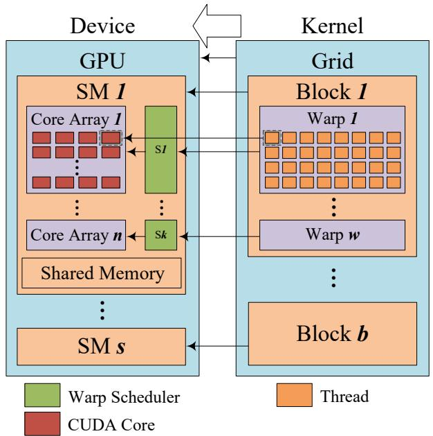  
FIGURE 1: Multi-level parallelism on GPU.

computations into FMA operations, i $. . , z = a x + y$ , which is the most efficient operation on the GPU.

# B. CHALLENGES OF DESIGNING GPU-BASED EMTP-TYPE PROGRAM

In power system simulations, the EMT simulation model for electrical components and controls can be represented as a set of differential equations. Therefore, the EMT simulation performs numerical integration on the differential equations. In general commercial software, there are two kinds of EMT modeling and simulation frameworks, i.e., state space analysis and nodal analysis. In general, the nodal analysis framework is more efficient as the topology of the power system does not change frequently and the factorization process of the nodal matrix can be eliminated in many cases [20].

The widely used nodal analysis framework for power system transient simulations, also known as the EMTP-type program, carries out the numerical integration of all models in the power system. As shown in Fig. 2, such simulations consist of three serial steps [22] in each integration step: 1) Solve the control systems to obtain inputs for the electrical components. 2) Update the status of the electrical components using numerical integration rules. 3) Solve network voltage equations. Typically, step 3) can be implemented using various algebraic solvers on the GPU, such as the GLU [23] and cuSOLVER [10]. Therefore, it is not the main issue examined in this paper. In summary, to develop a full GPU-based EMTP-type simulator, parallel implementations of steps 1) and 2) should be carefully discussed.

# 1) Reducing Thread Heterogeneity in Electrical System

In EMTP-type programs, step 2) calculates the electrical components. By applying numerical integration rules to the

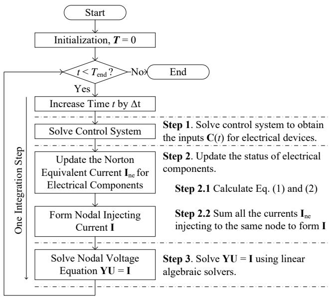  
FIGURE 2: Simulation of EMTP-type program.

differential equations of an electrical component, discrete Norton equivalent circuits are obtained [22]. Typically, an mport electrical component is modeled by

$$
\mathbf {I} (t) = \mathbf {G U} (t) + \mathbf {I} _ {n e} (t), \tag {1}
$$

where t is time, $\mathbf { I } , \mathbf { U } \ \in \ \mathbb { R } ^ { m }$ represent the port’s current and voltage vectors, respectively, $\textbf { G } \in \ \mathbb { R } ^ { m \times m }$ represents the Norton equivalent conductance matrix, and $\mathbf { I } _ { n e } \in \mathbb { R } ^ { m }$ represents the Norton equivalent current vector, which is calculated by

$$
\mathbf {I} _ {n e} (t) = \mathbf {P I} (t - \Delta t) + \mathbf {Q U} (t - \Delta t) + \mathbf {C} (t), \tag {2}
$$

where $\mathbf { P } , \mathbf { Q } \in \mathbb { R } ^ { m \times m }$ denote the coefficient matrices, and $\mathbf { C } \in \mathbb { R } ^ { m }$ reflects the effect of control inputs on the electrical component.

A straightforward way to parallelize (1) and (2) on a GPU is to launch m threads, each of which performs the following computation for one element:

$$
i _ {k} (t) = \sum_ {j = 1} ^ {m} g _ {k j} u _ {j} (t) + i _ {n e, k} (t)
$$

$$
\begin{array}{l} i _ {n e, k} (t) = \sum_ {j = 1} ^ {m} p _ {k j} i _ {j} (t - \Delta t) + \sum_ {j = 1} ^ {m} q _ {k j} u _ {j} (t - \Delta t) \tag {3} \\ + c _ {k} (t) \\ k = 1, \dots , m \\ \end{array}
$$

where $i _ { n e , k }$ and $i _ { k }$ are the $k ^ { t h }$ elements of ${ \bf { I } } _ { n e }$ and I, respectively.

This approach was used in our prior work [20]. A similar approach has been reported in [18], where specific kernels were designed for different electrical components.

Driven by (3), the computation task assigned to each thread changes with the number of ports and type of corresponding component. Thus, heterogeneous threads are required

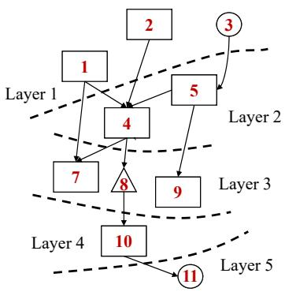  
a) LDAG Model

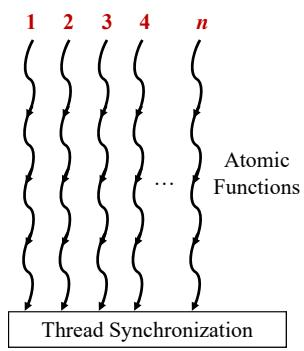  
b) Competition-based Implementation

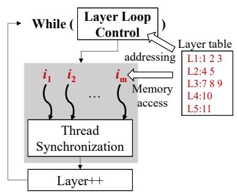  
c) Loop-based Unified Kernel   
FIGURE 3: Computational model and implementations of control system.

and launched on the GPU. If threads within a warp need to execute different instructions, they are executed serially, resulting in a reduction in the DOP. This can be partially fixed by distributing threads associated with different components to different warps. However, loading imbalance among threads within distinct warps still exists: 1) the undesirable wait time owing to unbalanced loading can be considerable; and 2) thread-core mapping depends on the number of each type of component, which varies by case. As a result, the performance of the GPU-based simulation also varies with case.

Thus, mitigating the heterogeneity of threads is key to high-performance electrical networks simulations on GPUs.

# 2) Efficient Kernel Design for Complicated Control System

In general, a control system can be represented by a block diagram where transfer functions and nonlinear blocks are connected in certain topologies. To derive the final control signals, a separate thread on the GPU can be assigned to process each control component. Each thread calculates the outputs of the corresponding control component according to its inputs. However, for control components connected in series, the outputs of upstream components are used as inputs for immediately downstream ones. As a result, threads associated with the downstream components cannot perform calculations until the upstream component is solved. As shown in Fig. 3 (a), operations 4 and 5 cannot be processed until they receive the results of operations 1, 2, and 3. This results in undesirable wait times and communication among threads on the GPU [20].

Thus, in our previous study, a competition mechanism was designed to manage communication and synchronization among threads [19], as shown in Fig. 3 (b). However, competition among threads relies on frequent memory read operations and conditional judgments through atomic functions, which lead to inefficient memory access and reduced DOP. For a power system with thousands of control components, such as a wind farm, this causes bottlenecks that degrade the efficiency and scalability of GPU-based simulations.

In [20], we subsequently proposed the LDAG computational model for GPU-based control system simulation. The model represents the complex control system as a layered directed acyclic graph (LDAG) that can be handled by layered and grouped SIMT groups on the GPU. The LDAG model removes the random competition mechanism among threads, using a while loop to control the layer iterator. However, such a kernel design has two drawbacks that restrict its utilization.

• If new primitive control elements (e.g., user-defined models) are used, the kernel should be redesigned to include new instructions. Similarly, the kernel design for electrical system faces such challenges.   
• As the layer is controlled by the while loop, layer information can only be regarded as input data, which significantly increases addressing and memory access time.

Therefore, efficient kernel design for the EMT simulation should avoid thread competition, excessive addressing and memory access.

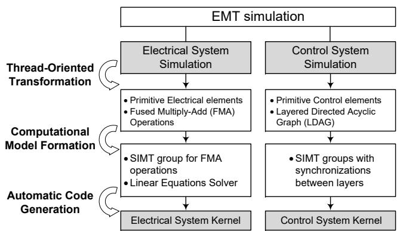  
III. THREAD-ORIENTED PARALLEL EMTP-TYPE SIMULATOR ON GPU   
FIGURE 4: Framework of the thread-oriented parallel EMTP-type simulator.

As shown in Fig. 4, the framework of the thread-oriented parallel EMTP-type simulator features the following three steps:

• To obtain GPU-friendly computational models, threadoriented transformations are performed on the electrical and control systems. Specifically, the electrical components are represented by a set of primitive electrical elements and the control system is modeled as a layered DAG of primitive control instructions, as in [20].   
• Thread structures for both the electrical and the control computational models are determined. For the electrical system simulation, all computations can be dealt with by an SIMT group for FMA operations and a linear equations solver. For the control system, computations of the LDAG model can be processed by SIMT groups with synchronization between layers.   
• To build efficient simulation kernels on the GPU, automatic code generation tools are designed for both the electrical system and the control system. For a specific power system, the kernel code is automatically generated and compiled once before the simulation.

# A. ELECTRICAL SYSTEM SIMULATION

# 1) Thread-Oriented normalized transformation and computing for electrical components

As mentioned in Section 2.2, before applying numerical integration rules to form the Norton equivalent circuit in (1), the m-port electrical component was originally modeled by a set of differential equations, i.e.,

$$
\dot {\mathbf {x}} = \mathbf {A} \mathbf {x} + \mathbf {B} \mathbf {u}
$$

$$
\mathbf {x} = \mathbf {A} \mathbf {x} + \mathbf {B} \mathbf {u} \tag {4}
$$

$$
\mathbf {y} = \mathbf {C x} + \mathbf {D u}
$$

where $\textbf { x } \in \mathbb { R } ^ { n }$ is the state vector, $\textbf { u } \in \mathbb { R } ^ { m }$ represents the input vector, $\mathbf { y } \in \mathbb { R } ^ { m }$ represents the output vector, and $\mathbf { A } \in \mathbb { R } ^ { n \times n } , \mathbf { B } \in \mathbb { R } ^ { n \times m } , \mathbf { C } \in \mathbb { R } ^ { m \times n }$ , and $\mathbf { D } \in \mathbb { R } ^ { m \times m }$ are coefficient matrices.

To generate homogeneous threads for the parallel computing of (4), an expansion of the state space is adopted, and can be described by a linear transformation:

$$
\mathbf {x} = \mathbf {M} \mathbf {z}
$$

$$
\mathbf {M K v} = \mathbf {A x} + \mathbf {B u} \tag {5}
$$

$$
\mathbf {N} = \mathbf {C M}
$$

where $\textbf { z } \in \mathbb { R } ^ { p } , ( p \geq n )$ is the expanded state vector, $\mathbf { v } \ \in \ \mathbb { R } ^ { q } , ( q \ \geqslant \ m )$ represents a vector of expanded input variables, and $\mathbf { M } \in \mathbb { R } ^ { n \times p } , \mathbf { K } \in \mathbb { R } ^ { p \times q }$ and $\mathbf { N } \in \mathbb { R } ^ { m \times p }$ are linear transformation matrices. Then, the differential equation model of the electrical component in (4) is transferred to the expanded one given by (6):

$$
\begin{array}{l} \dot {\mathbf {z}} = \mathbf {K} \mathbf {v} \\ \begin{array}{l} \mathrm {N} _ {\mathrm {i}} \text {D} \end{array} \tag {6} \\ \end{array}
$$

$$
\mathbf {y} = \mathbf {N z} + \mathbf {D u}
$$

Then, threads can be created for the integration of $z _ { i } \in$ $\mathbf { z } \left( i = 1 , \cdots , p \right)$ . The coefficient matrices have the following features: 1) Each row of matrix K contains only one nonzero

element. 2) Matrix N contains only 0, 1, and -1. 3) p and q should be minimized under constraints 1) and 2). The benefit of the above computational model transformation is twofold.

(i) It uniformly represents the electrical components by primitive elements.

As only one nonzero element exists in each row of K, and the dynamic of a state variable $z _ { i }$ depends only on an input variable $v _ { j }$ . There are several types of primitive electrical elements, as listed in Table I, whose dynamics can also be described by a one-dimension differential equation with one input variable. Thus, following the transformation, the original model of an m-port electrical component is reshaped into a composition of models of primitive electrical elements.

In Table 1, branch current $i _ { b }$ and Norton equivalent current $i _ { n e }$ are calculated as $i _ { b } ( t ) = G _ { b } u _ { b } ( t ) + i _ { n e } ( t - \Delta t )$ and $i _ { n e } ( t + \Delta t ) = A u _ { b } ( t ) + B i _ { b } ( t )$ , respectively.

(ii) Homogeneous threads are created for primitive electrical elements.

Using the computational model in (6), an m-port electrical component is represented by p primitive electrical elements. For each electrical element, a thread on the GPU can be created to execute a two-step computation task repetitively.

• Step2.1: The Norton equivalent current of a primitive electrical element is calculated. Using the trapezoidal rule, the integration of the state equation of a primitive element can be transformed into a Norton equivalent equation. Then, the Norton equivalent current for the electrical elements is derived as given at the bottom of Table 1. With the given node voltages from the previous step, the Norton equivalent current of the different electrical element can be calculated independently by the thread.   
• Step2.2: The node-injected currents are updated by all threads together. As N only contains 1, 0, and -1, the matrix vector products for computing y, which is the node-injected current vector, requires only accumulative instructions of z. Such an operation can also be performed by a thread for an electrical element with atomic functions.

The thread structure is shown in Fig. 5. For calculating branch currents and Norton equivalent currents, p threads perform FMA operations in the SIMT pattern, and these are one of the most efficient operations on the GPU. Then, each thread adds its result $z _ { i }$ (Norton equivalent current) to the corresponding $y \in \textbf { y }$ (node-injected current) in shared memory using atomic functions. Following synchronization that ensures all node-injected currents are available, the nodal voltage equations can be solved to obtain the system status of the given time step.

# 2) Illustrative Case: Thread-Oriented Transformation for A Single-Phase Transformer

As an example, the proposed computational model transformation was applied to a basic single-phase transformer, the

TABLE 1: Unified computation formula for primitive electrical elements   

<table><tr><td>Name</td><td>Equation</td><td>Gb</td><td>A</td><td>B</td></tr><tr><td>Resistor</td><td>Ri b = ub</td><td>1/R</td><td>0</td><td>0</td></tr><tr><td>Inductor</td><td>Lpi b = ub</td><td>Δt(2L)-1</td><td>Gb</td><td>1</td></tr><tr><td>Capacitor</td><td>Cub = ib</td><td>2CΔt-1</td><td>-Gb</td><td>-1</td></tr><tr><td>Half-Mutual mutual Induct.</td><td>M12pi b1 = ub2</td><td>Δt(2M12)-1</td><td>Gb</td><td>1</td></tr><tr><td>Controlled Sources</td><td>(i c + ib) r = ub</td><td>1/r</td><td>—</td><td>—</td></tr></table>

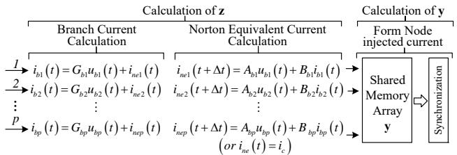  
FIGURE 5: Thread structure of electrical system kernel.

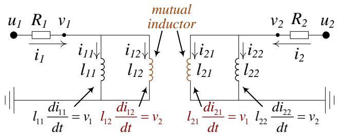  
FIGURE 6: Transformation of a single-phase transformer.

conventional computational model of which is shown in (7).

$$
\begin{array}{l} \left[ \begin{array}{c c} L _ {1} & L _ {1 2} \\ L _ {1 2} & L _ {2} \end{array} \right] \frac {d}{d t} \left[ \begin{array}{c} i _ {1} \\ i _ {2} \end{array} \right] + \left[ \begin{array}{c c} R _ {1} & \\ & R _ {2} \end{array} \right] \left[ \begin{array}{c} i _ {1} \\ i _ {2} \end{array} \right] = \left[ \begin{array}{c} u _ {1} \\ u _ {2} \end{array} \right] \\ \mathbf {y} = \left[ \begin{array}{l l} 1 & \\ & 1 \end{array} \right] \left[ \begin{array}{l} i _ {1} \\ i _ {2} \end{array} \right] \tag {7} \\ \end{array}
$$

where $i _ { 1 }$ and $i _ { 2 }$ are port currents; $u _ { 1 }$ and $u _ { 2 }$ represent port voltages; $R _ { 1 }$ and $R _ { 2 }$ , and $L _ { 1 }$ and $L _ { 2 }$ represent the leakage resistances and inductances of two windings, and $L _ { 1 2 }$ represents mutual inductance between windings.

By properly selecting M, N, and K given in (8), state variables of the basic transformer are redefined as four branch currents $i _ { 1 1 } , i _ { 1 2 } , i _ { 2 1 }$ , and $i _ { 2 2 }$ , which form state variable vector z. The related input variables are selected as branch voltages v1 and $v _ { 2 }$ .

$$
\begin{array}{l} \mathbf {z} = \left[ \begin{array}{c c c c} i _ {1 1} & i _ {1 2} & i _ {2 1} & i _ {2 2} \end{array} \right] ^ {T} \\ \mathbf {v} = \left[ \begin{array}{c c} u _ {1} - R _ {1} i _ {1} & u _ {2} - R _ {2} i _ {2} \end{array} \right] ^ {T} \\ \mathbf {K} = \left[ \begin{array}{c c c} l _ {1 1} ^ {- 1} & & l _ {2 1} ^ {- 1} \\ & l _ {1 2} ^ {- 1} & l _ {2 2} ^ {- 1} \end{array} \right] ^ {T} \tag {8} \\ \mathbf {M} = \mathbf {N} = \left[ \begin{array}{c c c c} 1 & 1 & & \\ & & 1 & 1 \end{array} \right] \\ \left[ \begin{array}{c c} l _ {1 1} ^ {- 1} & l _ {1 2} ^ {- 1} \\ l _ {2 1} ^ {- 1} & l _ {2 2} ^ {- 1} \end{array} \right] = \left[ \begin{array}{c c} L _ {1} & L _ {1 2} \\ L _ {2 1} & L _ {2} \end{array} \right] ^ {- 1} \\ \end{array}
$$

Then, the computation model of the basic transformer can also be illustrated as the equivalent circuit shown in Fig. 6. It is evident that M in (8) is the node–branch incident matrix of the derived circuit, which makes the proposed model transformation physically meaningful.

By carefully choosing a matrix for model transformations, electrical components such as machines and transmission lines can be described as compositions of primitive electrical elements in Table 1. Then, they can be processed by grouped homogeneous threads on the GPU.

3) Code automation tool for electrical system kernel

Benefiting from the normalized transformation of all electrical components, a unified electrical system kernel can be formed automatically to update the status of all electrical components and solve the nodal voltage equations for the entire electrical system. The GPU code for the electrical system kernel is generated according to Algorithm 1.

Algorithm 1 Code automation tool for the electrical system kernel

1: Initialize an empty thread grid with 0 threads $( T h = 0 ) ;$   
2: for Component $( C _ { i } )$ in ComponentList do   
3: Find transformation $( m _ { i } , p _ { i } , \mathbf { M } _ { i } , \mathbf { N _ { i } }$ and $\bf { K } _ { i } )$ for $C _ { i } ;$   
4: Obtain Norton equivalences $( G _ { b i } , A _ { i }$ and $B _ { i } )$ of (6);   
5: Save $G _ { b i } , A _ { i }$ and $B _ { i } \to { \mathbf G } _ { b } , { \mathbf A }$ , and B;   
6: $T h + p _ { i }  T h ;$   
7: end for   
8: Generate the SIMT group with $T h$ threads as in Fig. 5;   
9: Generate codes for solving $\mathbf { Y U } = \mathbf { I }$ (Step 3 in Fig. 2);   
10: Compile

From steps 2 to 7, the normalized transformation of all electrical components are completed. As a result, each component $C _ { i }$ is represented by $p _ { i }$ primitive elements with Norton equivalent conductance $G _ { b i }$ , and coefficients $A _ { i }$ and $B _ { i }$ to calculate historical current. Correspondingly, the computations of $C _ { i }$ are processed by $p _ { i }$ concurrent threads in the SIMT pattern as in Fig. 5. The parameters of all primitive elements are saved in three arrays $\mathbf { G } _ { b } ,$ A, and B in global memory on the GPU.

Then, in step 8, the GPU kernel code to process Fig. 5 is automatically generated. All $T h$ primitive elements are handled by an equal number of concurrent threads in the SIMT executing pattern according to the following steps:

1) Calculate branch voltage $\mathbf { V } _ { b }$ with nodal voltages in $\mathbf { V } _ { n } ,$ which stores the latest node voltages in global memory.

2) Calculate branch current $\mathbf { I } _ { b }$ with $\mathbf { G } _ { b }$ and $\mathbf { I } _ { n e , b } ,$ , where ${ \bf { I } } _ { n e , b }$ stores the latest Norton equivalent currents in global memory.   
3) Update Norton equivalent currents ${ \bf { I } } _ { n e , b }$ with parameters A and B. In particular, the output of control system $I _ { c }$ is assigned to the corresponding control sources as their $I _ { n e , b }$ directly.   
4) Once ${ \bf { I } } _ { n e , b }$ is updated, node-injected currents $I _ { n }$ are assembled by atomic functions (atomicAdd) on shared memory, after which _syncthreads() is invoked to synchronize the previous thread-based operations.

Finally, in step 9, the code for solving nodal voltage equations is assembled into the GPU kernel after the thread synchronization command. In this work, the nodal voltage equations required for the EMTP-type program are solved using flexible approaches according to system scale. By choosing proper models of the electrical components, the nodal conductance matrix can be kept constant when the topology of the electrical system is consistent. Thus, for small-scale networks, the inverse of the nodal conductance matrix can be calculated and stored before the simulation, and only efficient dense matrix–vector productions (gemv) are performed in each step of the integration to obtain the nodal voltages. However, for larger systems, massive areas of area and amounts of computation are required for such dense matrices, which reduces efficiency. An alternative is to use the sparse direct solver with the right-looking LU factorization method [23] for such large-scale power systems. In this approach, sparse factorization can be processed before the simulation, and only sparse forward/backward substitutions are performed in each step of the integration to obtain the nodal voltages.

# B. TRANSIENT SIMULATION OF CONTROL SYSTEM

# 1) LDAG transformation for layered control topology

To implement the control system simulation on the GPU efficiently, the tasks of the threads should be carefully defined and scheduled to avoid conflicts, and to optimize the threads and shared memory utilization. In this study, after being decoupled and ordered, computational instructions related to control functions are linked by a layered topology. Grouped threads then execute instructions within the same layer in SIMT pattern.

# (i) Layered transformation of control system

As in primitive electrical elements, a primitive control instruction is defined, the computations of which are challenging or unnecessary to decompose further. In the case study used in this paper, primitive control instructions included comparators, PI controllers, and basic math functions.

In general, a control system can be modeled by a directed graph as shown in Fig. 7, where V (node) stands for primitive control instructions and E (edge) represents control signal flows. To avoid algebraic iterations in particular, algebraic feedback loops are unlocked by inserting a time-step delay. Thus, a control system is described as a DAG. Consequently,

primitive control instructions need to be calculated in the correct sequence. The corresponding threads for each instruction are thus causally related, and need to be scheduled carefully to enhance DOP. The topology of the control system is layered to determine the workflow of the grouped threads.

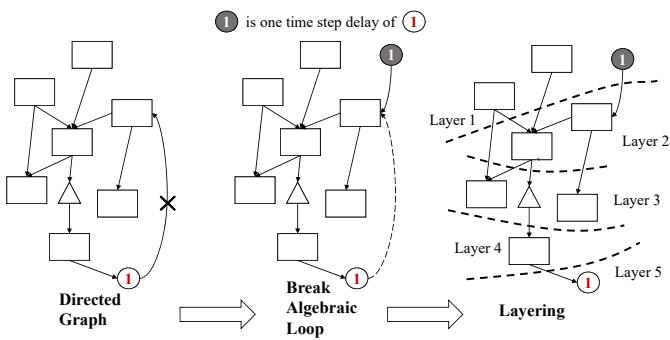  
FIGURE 7: Layered topology of control system.

The longest path-searching algorithm proposed in [24] [25] is used to generate layers for the control system DAG, which discovers the layer set $\mathbb { L } ~ = ~ \{ L _ { 1 } , L _ { 2 } , \cdot \cdot \cdot ~ , L _ { h } \}$ at minimum height h.

Then, threads for instructions in the same layer can be launched simultaneously without data exchanges among them. Following synchronization to guarantee the availability of all inputs, unoccupied threads pick up instructions for the next layer and process them concurrently.

# (ii) Grouped threads working in SIMT pattern

For a large power system, control system simulations on a GPU need to handle a large number of controls for different electrical components in one time step. These variant control systems can be uniformly described by a layered DAG, where primitive control instructions are considered nodes. According to their types and content, control instructions in layer $L _ { i }$ can be divided into $n _ { i }$ groups. Then, threads processing instructions in a group share the same operations and work in the SIMT pattern. By allocating grouped threads to different core arrays, cross-group parallel computing can be achieved, which makes the control system simulation fully parallelized on the GPU. The workflow of the grouped threads is illustrated in Fig. 8.

As shown in Fig. 8, synchronization is required between the layers to make sure all inputs for the next layer are ready. Grouped threads are reusable to compute all layers, which can reduce the number of threads used in a block. Moreover, shared memory is used to cache data transferred between layers. As the number of inputs of each layer is much smaller than their summation, excessive use of shared memory is effectively avoided. Moreover, shared memory allocated to a block can be reused for data caching between layers, which makes optimal use of computational resources and enhances the scalability of control system simulations on GPUs.

It should be noted that grouped threads working for different control systems can process the same instructions in SIMT pattern, which increases the use of shared memory. If

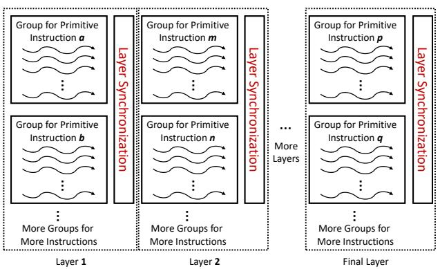  
FIGURE 8: Thread structure for control system kernel.

the shared memory is not sufficient in size for data exchanges required by the control system simulation, the global memory can be used to enable communication between layers. This supplemental solution eliminates the scale limit of the control systems simulated on the GPU.

2) Illustrative Case: LDAG Transformation for A V-Q Controller

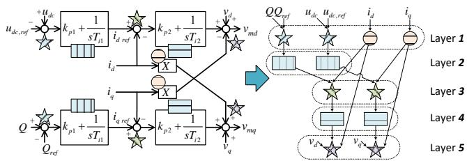  
FIGURE 9: Example: V-Q controller topology. Note that different shapes indicate different instruction types or corresponding SIMT groups.

In the left part of Fig. 9, part of the basic V-Q controller for power converters is illustrated in a block diagram containing six types of primitive control instructions. After transference to a DAG, the instructions associated are redistributed to five layers, which can be processed by grouped threads. Only four threads are involved in such solutions. In layer 1, two groups of threads work together for two types of instructions. Then, two threads are reused to handle instructions in the following layers, which contain only one type of instruction in each layer.

3) Code automation tool for the control system kernel

As with the electrical system, an automatic GPU code generator is designed to form the control system simulation kernel according to the LDAG computational model.

The code generation procedure is as shown in Algorithm 2.

In step 2, the control system simulation model is transformed into several DAG-based computational models. Steps 3 and 4 further decompose the DAG into independent subgraphs and cluster them into n groups according to structure.

# Algorithm 2 Code generation for control system kernel

1: Initialize an empty thread grid with 0 threads $( T h = 0 ) ;$   
2: Control system model → DAG computational model G;   
3: Split G into m independent DAGs;   
4: Form n DAG groups $G _ { i } , ( i = 1 , \cdots , n )$ by DAG isomorphism judgment;   
5: Set n thread blocks for the control system kernel.   
6: while $i < n$ do   
7: Set blockIdx = i − 1;   
8: Layer the elements of $G _ { i }$ into $h _ { i }$ layers;   
9: while $j < h$ do   
10: Group elements in layer $L _ { i , j }$ into $k _ { i , j }$ groups;   
11: Generate $k _ { i , j }$ SIMT groups for layer $L _ { i , j } ;$   
12: Generate synchronization codes for layer $L _ { i , j } ;$   
13: $j + 1  j ;$   
14: end while   
15: $i + 1  i ;$   
16: end while   
17: Generate synchronization codes for all threads;   
18: Compile

In this way, different DAG groups $( G _ { i } )$ can be processed in different thread blocks to achieve coarse-grained parallelism. Moreover, DAGs inside a group are isomorphic, and thus can benefit from the fine-grained SIMT parallelism.

From steps 5 to 16, the GPU kernel code to process Fig. 8 is automatically generated by interpreting the DAG computational model according to the following steps:

1) Create n thread blocks to handle n DAG groups.   
2) Allocate a shared memory area for each thread block to cache all node results of each DAG group $G _ { i } .$ .   
3) Layer the elements (control instructions) in a DAG group $G _ { i }$ into $h _ { i }$ layers. Then, inside each thread block, classify the control instructions and process them on different SIMT thread groups from layer 1 to $h _ { i } .$ . It should be noted that the number of threads for each SIMT group should be specified according to the computing resource allocation principle in [20] to obtain optimal efficiency.   
4) Synchronization is required between layers. Once the synchronization for layer $h _ { i }$ is complete, outputs of the control system are copied back to global memory ${ \mathbf { I } } _ { \mathbf { c } } ,$ which updates the Norton equivalent currents of the controlled sources.

Finally, in step 17, to ensure that the final results are ready, code for synchronizing all thread blocks is assembled into the control system kernel. The results can be used to solve electrical systems in the electrical system kernel.

Once codes for the electrical system and the control system kernel have been created, the NVCC compiler [10] is called to compile the final GPU program to form the binary execution file.

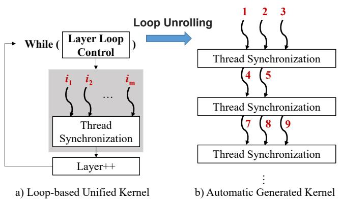  
FIGURE 10: Kernel comparison.

# 4) Merits of the Auto-Generated GPU codes

In Fig. 10, two kernel structures are provided for comparison. Compared with the loop-based unified kernel in [20] (Fig. 10(a)), the automatically generated kernel in this paper (Fig. 10(b)) has the following three advantages:

• The operation for each thread in (Fig. 10(b)) is fixed, where addressing and memory access for instructions are eliminated.   
• The previously proposed kernel needs to maintain a general framework to make it compatible with all primitive instructions within all layers. As a result, only a part of the threads can be used for each layer, as additional thread groups should be reserved for other primitive instructions. On the contrary, all threads and more computing resources are available in each layer in (Fig. 10(b)), which enhances the efficiency and the scalability of the simulation kernel.   
• The automatically generated kernel unrolls the while loop in (Fig. 10(a)) by writing layered data into a binary execution file, which reduces the number of conditional statements and instruction scheduling time. Such a space-âA ¸Stime trade-off optimizes execution speed. ˘

# IV. TESTS AND DISCUSSION

# A. TESTING ENVIRONMENT

The results of the performance of the thread-oriented EMTPtype simulator on a GPU (denoted by P4) were compared with those using PSCAD/EMTDC (a commercial EMTPtype simulator) and other EMTP-type programs denoted by P1 P3.

1) EMTP-type program on a multi-core CPU (P1) that uses the Intel Math Kernel Library (MKL) [26] to solve nodal voltage equations;   
2) Hybrid CPU–GPU EMTP-type program (P2), which only solves nodal voltage equations on GPU; and   
3) Fine-grained EMTP-type program (P3) fully implemented on a GPU with loop-based control system kernel [20].

# B. TEST CASES

In the following tests, the IEEE 33-bus distribution network was selected as the basic case. Constant RLC loads were connected through three-phase transformers. Large-scale cases are formed by connecting basic cases as in Fig. 11.

Moreover, PV cells were connected to different buses through inverters and a three-phase transformer, as shown in Fig. 12. Without loss of generality, a PV cell was modeled as a source of controlled current while the grid side inverter operated in Q-V control mode. The reference voltage on the DC side was determined by MPPT control based on a perturbation and observation method proposed in [27]. To maintain the system’s conductance matrix constant, an average value model (AVM) of the converter was adopted in this work, the details of which can be found in [28].

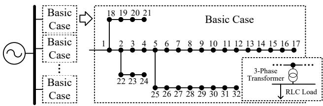  
FIGURE 11: Case topology part 1: Electrical network.

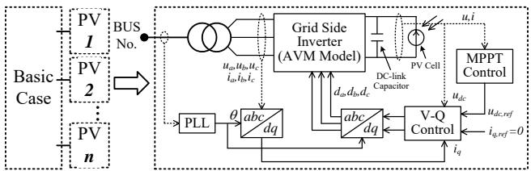  
FIGURE 12: Case topology part 2: PV module with control system.

After transforming models of the electrical and control systems into thread-oriented form, the computational scales of the test cases can be estimated as in Table $3 ~ ( N _ { e }$ is the number of basic cases and $N _ { c }$ the number of PV cells).

# C. ACCURACY VALIDATION

We set $N _ { e } = N _ { c } = 1$ and connected PV cells to bus 17. Transients of test system were simulated with the following conditions.

1) $t \in [ 2 , 2 . 5 )$ , voltage drop to 20% at phase A of bus 1; and   
2) $t \in [ 3 , \operatorname { i n f } )$ , radiation changes from 1000 to 600 $W / m ^ { 2 }$ .

Voltages and currents on the low-voltage-side of bus 17 are depicted in the left column of Fig. 13. In the right column, transient curves of the PV cells are given.

The results in Fig. 13 reveal consistency between the commercial EMTP-type program and the parallel EMTPtype program, which verifies the correctness of the proposed thread-oriented modeling as well as the accuracy of parallel simulations using GPU kernels.

TABLE 2: Comparison of testing environments   

<table><tr><td></td><td>CPU</td><td>GPU 1</td><td>GPU 2</td></tr><tr><td>Processor</td><td>Intel Xeon E5-2620</td><td>NVIDIA K20x</td><td>NVIDIA P100</td></tr><tr><td>Operating System</td><td>Linux</td><td>Linux</td><td>Linux</td></tr><tr><td>Core Numbers</td><td>12</td><td>2688 CUDA Cores</td><td>3584 CUDA Cores</td></tr><tr><td>Core Frequency</td><td>2.0 GHz</td><td>732 MHz</td><td>1.3 GHz</td></tr><tr><td>Memory Size/ Memory Frequency</td><td>32 GB / 1.6 GHz</td><td>5 GB / 5.2 GHz (GDDR5)</td><td>12 GB / 1.4 GHz (HBM2)</td></tr></table>

TABLE 3: Computational scale of testing cases   

<table><tr><td>Item</td><td>Value</td></tr><tr><td>Electrical system nodes</td><td>3 + 192Ne + 11Nc</td></tr><tr><td>Primitive electrical elements</td><td>3 + 480Ne + 17Nc</td></tr><tr><td>Primitive control elements</td><td>78Nc</td></tr><tr><td>Number of layers</td><td>34</td></tr></table>

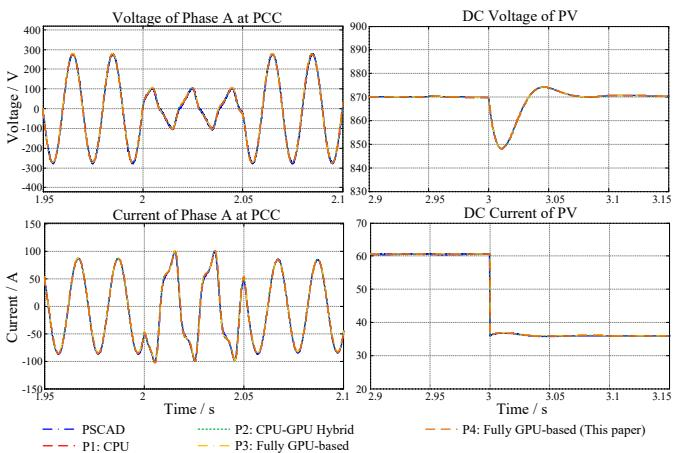  
FIGURE 13: Accuracy results of selected algorithm and platforms.

# D. EFFICIENCY TESTS

To test the efficiency of the thread-oriented parallel simulation on a GPU, detailed time costs of the electrical and control system simulations were measured separately by the NVIDIA Profiler. Similar time costs were measured for P1 P3. Then, the acceleration performance of the proposed method (P4) was evaluated thoroughly.

# 1) Time costs of electrical system simulation

We set $N _ { c } ~ = ~ 0$ and let $N _ { e }$ increase from one to 30. The electrical systems were scaled up from 195 single-phase nodes with 33 three-phase transformers to 5,763 single-phase nodes with 990 three-phase transformers.

The maximum time cost per integration step for the EMT simulation was measured for the test systems using P1~P4, and was used to solve the nodal voltage equations (T1) and form node-injecting currents of the electrical components (T2). When $N _ { e } < 1 0 .$ , dense matrix–vector multiplication was used to calculate node voltage; otherwise, sparse backward/forward substitutions were applied. As all factorizations were had been completed and stored before the simulation started, factorization time was not included in T1. Comparisons of time costs per time step between simulation programs are given in Table 4.

As the electrical system was scaled up, the acceleration ratios of P2, P3, and P4 continued to grow compared those in P1. The CPU–GPU program (P2) showed very limited speedups as the linear algebraic solvers on the GPU did not exhibit superiority for such small system scales. However, the full GPU-based programs (P3 and P4) accelerated the simulations for all test cases.

Moreover, compared with the parallel EMTP-type program (P3) proposed in [20], the newly designed threadoriented EMTP-type simulator (P4) gained more speedups for all test cases owing to the saved time in T2. Such speedups benefit from transforming the electrical system into combinations of primitive electrical elements. As shown in Table 4, program P4 created more threads for electrical component simulations than P3. Moreover, as only one SIMT group was required, P4 had a higher DOP than P3 when calculating electrical components (T2 period). By contrast, in P3, different electrical components were processed in different SIMT groups, the number of instructions of which varied. It is evident as thread homogeneity for electrical components increased, computing resources could be evenly utilized, which remarkably enhanced the performance of the parallel EMT simulation.

Furthermore, two types of GPU devices were used in efficiency tests in this paper, i.e., the K20x (Kepler architecture) and P100 (Pascal architecture). As new architecture was enabled and increased bandwidth, frequency, and the number of cores, the proposed kernels performed better on the P100 platform according to the test results. As shown in Table ${ \mathrm { I V } } ,$ all time costs recorded on the P100 were smaller than the corresponding ones on the K20x for the electrical system simulation. During the network solution process (T1), the P100 platform showed a smaller speedup (1.1x) than the K20x platform for large-scale systems, as the DOP for the traditional direct solver was relatively poor. For the welldesigned electrical system kernel used to calculate the electrical components, the P100 platform recorded a speedup of more than 1.8x compared with the K20x.

# 2) Time costs of control system simulation

We created test cases where $N _ { e } ~ = ~ 1$ and let $N _ { c }$ increase from one to 300. For the case with the largest number of PV cells, 23,400 (78 x 300) primitive control instructions needed to be processed in each time step. As in tests for the electrical systems, the maximum time cost of the control system simulation per step was measured for P1 P4 both on the CPU and the GPU, as shown in Table 5.

Table 5 shows that for cases with large-scale control

TABLE 4: Efficiency results of the electrical system   

<table><tr><td></td><td colspan="2">P1 - CPU</td><td colspan="2">P2 - CPU - GPU 1</td><td colspan="3">P3 - GPU 1</td><td colspan="3">P4 - GPU 1</td><td colspan="3">P4 - GPU 2</td></tr><tr><td rowspan="2">Ne</td><td colspan="2">Time -cost (μs)</td><td colspan="2">Time -cost (μs)</td><td colspan="2">Time -cost (μs)</td><td rowspan="2">Thread Number</td><td colspan="2">Time -cost (μs)</td><td rowspan="2">Thread Number</td><td colspan="2">Time -cost (μs)</td><td rowspan="2">Thread Number</td></tr><tr><td>T1</td><td>T2</td><td>T1</td><td>T2</td><td>T1</td><td>T2</td><td>T1</td><td>T2</td><td>T1</td><td>T2</td></tr><tr><td>1</td><td>14.3</td><td>63.7</td><td>17.1</td><td>63.7</td><td>10.5</td><td>38.6</td><td>97</td><td>10.5</td><td>21.5</td><td>483</td><td>7.3</td><td>11.2</td><td>483</td></tr><tr><td>3</td><td>34.6</td><td>181.8</td><td>39.2</td><td>181.8</td><td>25.8</td><td>53</td><td>289</td><td>25.8</td><td>26.3</td><td>1443</td><td>17.9</td><td>11.3</td><td>1443</td></tr><tr><td>5</td><td>52.7</td><td>372</td><td>64.6</td><td>372</td><td>49.2</td><td>68.6</td><td>481</td><td>49.2</td><td>31.3</td><td>2403</td><td>38.5</td><td>11.9</td><td>2403</td></tr><tr><td>6</td><td>83.2</td><td>421.1</td><td>83.8</td><td>421.1</td><td>70.0</td><td>76.9</td><td>577</td><td>70.0</td><td>33</td><td>2883</td><td>50.1</td><td>12.2</td><td>2883</td></tr><tr><td>10</td><td>224.6</td><td>745.3</td><td>205.3</td><td>745.3</td><td>191.5</td><td>96.6</td><td>961</td><td>191.5</td><td>40.2</td><td>4803</td><td>136.6</td><td>17.3</td><td>4803</td></tr><tr><td>15</td><td>375.9</td><td>1081</td><td>261.0</td><td>1081</td><td>245.2</td><td>159.3</td><td>1441</td><td>245.2</td><td>48.4</td><td>7203</td><td>215.2</td><td>22.5</td><td>7203</td></tr><tr><td>20</td><td>422.5</td><td>1431</td><td>319.9</td><td>1431</td><td>301.4</td><td>194.3</td><td>1921</td><td>301.4</td><td>57.1</td><td>9603</td><td>279.2</td><td>28.8</td><td>9603</td></tr><tr><td>25</td><td>451.1</td><td>1851</td><td>402.2</td><td>1851</td><td>381.9</td><td>225.8</td><td>2401</td><td>381.9</td><td>66.1</td><td>12003</td><td>352.1</td><td>37.4</td><td>12003</td></tr><tr><td>30</td><td>512.2</td><td>2167</td><td>442.4</td><td>2167</td><td>414.6</td><td>272.9</td><td>2881</td><td>414.6</td><td>77.2</td><td>14403</td><td>378.6</td><td>41.2</td><td>14403</td></tr></table>

a T1 represents the time cost of solving node voltage equations.   
b T2 represents the time cost of calculating electrical components (electrical system kernel)   
c Thread number is the total number of non-empty threads launched in the electrical system kernel.   
d For P2, data communication time between CPU and GPU is included in T1.

TABLE 5: Efficiency results of the control system   

<table><tr><td>\(N_{c}\)</td><td>P1/P2 T(μs)</td><td>P3 - GPU 1 T(μs)</td><td>GPB</td><td>P4 - GPU 1 T(μs)</td><td>GPB</td><td>P4 - GPU 2 T(μs)</td><td>GPB</td></tr><tr><td>1</td><td>25.5</td><td>69.3</td><td></td><td>53.1</td><td></td><td>22.8</td><td></td></tr><tr><td>3</td><td>71.3</td><td>69.5</td><td></td><td>53</td><td></td><td>22.8</td><td></td></tr><tr><td>6</td><td>147</td><td>69.5</td><td></td><td>53</td><td></td><td>22.8</td><td></td></tr><tr><td>9</td><td>215.9</td><td>70.4</td><td></td><td>53.3</td><td></td><td>23</td><td></td></tr><tr><td>20</td><td>496.3</td><td>79.5</td><td></td><td>56.9</td><td></td><td>23.1</td><td></td></tr><tr><td>30</td><td>732.9</td><td>141.9</td><td></td><td>57.5</td><td></td><td>23.2</td><td></td></tr><tr><td>40</td><td>988.5</td><td>144.6</td><td>9</td><td>57.4</td><td>15</td><td>23.2</td><td>15</td></tr><tr><td>50</td><td>1235</td><td>151.3</td><td></td><td>94.5</td><td></td><td>23.5</td><td></td></tr><tr><td>70</td><td>1796</td><td>153.3</td><td></td><td>94.5</td><td></td><td>49.6</td><td></td></tr><tr><td>100</td><td>2486</td><td>196.4</td><td></td><td>94.7</td><td></td><td>55.8</td><td></td></tr><tr><td>150</td><td>3911</td><td>245.3</td><td></td><td>139.6</td><td></td><td>84.9</td><td></td></tr><tr><td>200</td><td>5500</td><td>377.6</td><td></td><td>189.9</td><td></td><td>100.5</td><td></td></tr><tr><td>300</td><td>7315</td><td>428.1</td><td></td><td>225.7</td><td></td><td>117.6</td><td></td></tr></table>

systems, P3 and P4 on the GPU gained more significant accelerations than those using the P1 and P2 on a CPU.

Moreover, P4 achieved an almost 1.5x to 2x speedup compared with P3. As shown in Section III-B-3), by using the code automation tool, the while loop in P3 was unrolled, and excessive addressing and memory accesses were eliminated. Moreover, as observed in Table 5, 15 concurrent thread groups per block (GPB) were used for each PV control system in P4. However, only nine concurrent thread groups were available in P3 because the kernel in it was forced to use an excessive number of threads to reserve other primitive instructions within all layers. Therefore, the computing resources for each layer were restricted, which limited the performance enhancement of control system simulation on the GPU. However, for P4, the above restrictions were eliminated, which rendered the control system kernel more efficient.

Moreover, for the control system simulation, the P100 platform (P4 - GPU2) was almost 2x faster than the K20x platform (P4 - GPU1). As higher clock frequency and memory bandwidth were enabled in the P100, the computation and communication processes between layers in the control system simulation became more efficient. Moreover, more SMs with larger shared memory were integrated, so that the

device could handle more parallel independent control systems than the K20x platform. The above advantages make the P100 device feasible in real-time simulations, as discussed in 4.5.

# E. SCALABILITY AND REAL-TIME PERFORMANCE

# 1) Limits of Scalability

As shown in Sections 4.3 and 4.4, the proposed threadoriented EMTP-type program on a GPU is feasible for simulating large-scale electrical and control systems.

For electrical system simulations, the available simulation scale was limited only by the size of the global memory, most of which was used to store the dense nodal resistance matrix Z of a small system or the sparse LU factorization results of a large-scale system.

For the control system, the maximum number of threads in one block limited the scale of the system simulated. As computations in a layer should be processed in a thread block, for a control system with more than 1,024 primitive control elements in each layer, the proposed algorithm will fail. One possible solution is to split the large LDAG into small graphs and distribute computations to multiple thread blocks.

# 2) Total Speedups and Feasibility of Real-time Simulation

Real-time simulation is an important tool in studies on power systems. A series of typical test cases used in real-time simulations were built by choosing $N _ { e } = 1$ and $N _ { c } \in [ 1 , 3 0 0 ]$ . The total time costs of each integration step and speedups are given in Fig. 14, with comparisons with the performance of P1.

In addition clear acceleration on the K20x and P100, the real-time performance of the proposed algorithm can be viewed in Fig. 14. In general, the integration step used in the real-time simulations should have been shorter than 200µs to guarantee accuracy and numerical stability. The real-time simulations using integration steps of 100µs and $5 0 \mu s$ were chosen as benchmarks.

As observed in Fig. 14, for simulations with an integration step of 50µs, real-time simulations were implemented on the

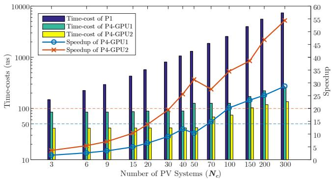  
FIGURE 14: Time costs and speedups of distribution system with integrated PV cells.

P100 with no more than 50 PV systems. If 100µs was used as integration step, real-time simulation for 100 PV systems could still be guaranteed.

# V. CONCLUSION

In this paper, a full GPU-based EMTP-type simulator was designed using thread-oriented modeling, and an algorithm for both electrical and control systems as well as code automation tools. According to accuracy and efficiency tests, the proposed simulator showed significant speedups for largescale power system simulations compared with past research. Moreover, the latest NVIDIA P100 device with Pascal architecture was shown to be feasible in real-time simulation applications, such as closed-loop control system validation.

However, in practical EMT applications, the overall performance of the proposed simulator might still be restricted and should be improved further with the following two concerns.

• As only one GPU card has been used during the simulation, the speed-ups is mainly achieved by fine-grained parallel strategies on one GPU. However, for large-scale cases, higher efficiency may be obtained with the help of network partitioning technique and coarse-grained parallelism using multiple GPUs. Therefore, more attention needs to be devoted to parallel EMTP-type simulators on multi-GPU based platforms.   
• The test environment in this paper is an ideal one, as only one simulation task occupies all computing resources during each test. Therefore, speed-ups might have been restricted when launching multiple simulation tasks concurrently. In future research, GPU-based parallel-batched simulations for multiple tasks should also be investigated to build advanced simulation applications.

# REFERENCES

[1] H. W. Dommel, “Digital computer solution of electromagnetic transients in single- -and multi-phase networks,” IEEE Trans. Power App. Syst., vol. PAS-88, no. 4, pp. 388-399, Apr. 1969.   
[2] H. W. Dommel, “Electromagnetic Transients Program: Reference Manual: (EMTP theory book),” Bonneville Power Administration, 1986.

[3] A. M. Gole, O. B. Nayak, T. S. Sidhu, and M. S. Sachdev, “A graphical electromagnetic simulation laboratory for power systems engineering programs,” IEEE Trans. Power Syst., vol. 11, no. 2, pp. 599-606, May 1996.   
[4] M. A. Tomim, J. R. Marti, T. De Rybel, L. Wang, and M. Yao, “MATE network tearing techniques for multiprocessor solution of large power system networks,” in Proc. IEEE Power Energy Soc. Gen. Meeting, Minneapolis, MN, USA, 2010, pp. 1-6.   
[5] J. A. Hollman and J. R. Marti, “Real time network simulation with PC -cluster,” IEEE Trans. Power Syst., vol. 18, no. 2, pp. 563-569, May. 2003.   
[6] K. Strunz and E. Carlson, “Nested fast and simultaneous solution for timedomain simulation of integrative power -electric and electronic systems,” IEEE Trans. Power Del., vol. 22, no. 2, pp. 277-287, 2007.   
[7] H. H. Happ, “Diakoptics and piecewise methods,” IEEE Trans. Power App. Syst., vol. PAS-89, no. 7, pp. 1373-1382, Sept. 1970.   
[8] J. R. Marti, L. R. Linares, J. Calvino, H. W. Dommel, and J. Lin, “OVNI: an An object approach to real-time power system simulators,” in Proc. Int. Conf. Power System Technology, 1998, pp. 977-981 vol.2.   
[9] S. Naffziger, J. Warnock, and H. Knapp, “SE2 when processors hit the power wall (or ‘when the CPU hits the fan’)”. in Solid-State state Circuits Conf. Digest of Technical Papers , Feb. 2005, pp. 16-17.   
[10] CUDA C Programming Guide Version 7.0, NVIDIA. [Online]. Available: http://docs.nvidia.com/cuda/cuda-c-programming-guide/.   
[11] J. Cheng, M. Grossman and T. McKercher, Professional CUDA C Programming, 1st ed. Indianapolis, Indiana, USA: Wrox, 2014.   
[12] J. D. Owens, M. Houston, D. Luebke, S. Green, J. E. Stone, and J. C. Phillips, “GPU Computing” computing” Proc. IEEE, vol. 96, no. 5, pp. 879-899, May 2008.   
[13] Zhu, Feiwen, Peng Chen, Donglei Yang, Weihua Zhang, Haibo Chen, and Binyu Zang, “A GPU-based high-throughput image retrieval algorithm” In Proceedings of the 5th Annual Workshop on General Purpose Processing with Graphics Processing Units, pp. 30-37. ACM, 2012.   
[14] Lu, Yunping, Yi Li, Bo Song, Weihua Zhang, Haibo Chen, and Lu Peng,“Parallelizing image feature extraction algorithms on multi-core platforms,” Journal of Parallel and Distributed Computing, 92 (2016): 1- 14.   
[15] A. Gopal, D. Niebur and S. Venkatasubramanian, “DC power flow based contingency analysis using graphics processing units,” in Proc. IEEE Power Tech., Lausanne, 2007, pp. 731-736.   
[16] X. Li and F. Li, “GPU-based power flow analysis with Chebyshev preconditioner and conjugate gradient method,” Electr. Power Syst. Res., vol. 116, pp. 87-93, Nov. 2014.   
[17] V. Jalili-Marandi and V. Dinavahi, “SIMD-based large-scale transient stability simulation on the graphics processing unit,” IEEE Trans. Power Syst., vol. 25, no. 3, pp. 1589-1599, Aug. 2010.   
[18] Z. Zhou and V. Dinavahi, “Parallel massive-thread electromagnetic transient simulation on GPU,” IEEE Trans. Power Del., vol. 29, no. 3, pp. 1045-1053, Jun. 2014.   
[19] Y. Song, Y. Chen, Z. Yu, S. Huang, and L. Chen, “A fine-grained parallel EMTP algorithm compatible to graphic processing units,” in Proc. IEEE Power Energy Soc. Gen. Meeting, National Harbor, MD, 2014, pp. 1-6.   
[20] Y. Song, Y. Chen, S. Huang, Y. Xu, Z. Yu, and J. R. Marti, “Fully GPU-based electromagnetic transient simulation considering large-scale control systems for system-level studies,” IET Generation, Transmission & Distribution, vol. 11, no. 11, pp. 2840-2851. 2017.   
[21] H. Gao, Y. Chen, Y. Xu, Z. Yu, and L. Chen, “A GPU-based parallel simulation platform for large-scale wind farm integration,” in Proc. 2014 IEEE PES T&D Conf. and Expos., Chicago, IL, USA, 2014, pp. 1-5.   
[22] N. Watson and J. Arrillaga, Power Systems Electromagnetic Transients Simulation, United Kingdom: IET, 2003.   
[23] K. He, S. X.-D. Tan, H. Wang and G. Shi, “GPU-accelerated parallel sparse LU factorization method for fast circuit analysis, ” in IEEE Trans. on Very Large Scale Integrated Systems (TVLSI), Vol. 24, No. 3, pp. 1140-1150, 2016.   
[24] Wang, Xin, Weihua Zhang, Zhaoguo Wang, Ziyun Wei, Haibo Chen, and Wenyun Zhao. “Eunomia: Scaling concurrent search trees under contention using HTM.” In Proceedings of the 22nd ACM SIGPLAN Symposium on Principles and Practice of Parallel Programming, pp. 385- 399. ACM, 2017.   
[25] P. Eades and X. Lin, “How to draw a directed graph,” in Proc. 1989 IEEE Workshop on Visual Languages, Rome, 1989, pp. 13-17.   
[26] Intel Math Kernel Library (Intel MKL), Intel. [Online]. Available: https://software.intel.com/en-us/intel-mkl.   
[27] E. Koutroulis, K. Kalaitzakis and N. C. Voulgaris, “Development of a microcontroller-based, photovoltaic maximum power point tracking con-

trol system,” IEEE Trans. Power Electron., vol. 16, no. 1, pp. 46-54, Jan. 2001.   
[28] S. Chiniforoosh, J. Jatskevich, A. Yazdani, V. Sood, V. Dinavahi, J. A. Martinez, and A. Ramirez, “Definitions and applications of dynamic average models for analysis of power systems,” IEEE Trans. Power Del., vol. 25, no. 4, pp. 2655-2669, Oct. 2010.

YANKAN SONG (S’14) received his B.Sc. in electrical engineering from Shandong University in Jinan, China, in 2013. He is currently working toward his Ph.D. in electrical engineering at Tsinghua University in Beijing, China.

His research interests include power system modeling and electromagnetic transients simulation, parallel computing, and hybrid simulation of interconnected AC–DC systems.

  
cloud computing.

ZHITONG YU received his B.Sc. and M. E. from the Department of Electrical Engineering at Tsinghua University in Beijing, China, in 2014 and 2017, respectively. He is currently working at the Research Center of Cloud Simulation and Intelligent Decision-making (RCCI) at the Energy Internet Research Institute of Tsinghua University.

His research interests include electromagnetic transients simulation, parallel computing, and

YING CHEN (M’07) received his B.E. and Ph.D. in electrical engineering from Tsinghua University in Beijing, China, in 2001 and 2006, respectively.

He is an associate professor at the Department of Electrical Engineering and Applied Electronic Technology, Tsinghua University. His research interests include parallel and distributed computing, electromagnetic transient simulation, cyberphysical system modeling, and cybersecurity in smart grids.

SHAOWEI HUANG (M’11) received his B.S. and Ph.D. in electrical engineering from Tsinghua University in Beijing, China, in 2006 and 2011, respectively.

He is an assistant professor at the Department of Electrical Engineering and Applied Electronic Technology, Tsinghua University. His research interests include parallel and distributed computing and their applications to power systems.

WEI XUE received his B.Sc. and Ph.D. from the Department of Electrical Engineering at Tsinghua University in Beijing, China, in July 1998 and July 2003, respectively.

After graduation, he became a lecturer in August 2003 and an associate professor in December 2007 at the Department of Computer Science and Technology at Tsinghua University. His research interests include scientific computing, uncertainty quantification, power system analysis and simula-

tion, parallel algorithm design, cluster computing, and network storage.

Dr. Xue received the 2016 ACM Gordon Bell Prize and the Tsinghua-Inspur Computational Geosciences Youth Talent Award.

YIN XU (S’12-M’14) received his B.E. and Ph.D. in electrical engineering from Tsinghua University in Beijing, China, in 2008 and 2013, respectively.

He is an associate professor at the School of Electrical Engineering, Beijing Jiaotong University. His research interests include distribution system service restoration, microgrids, power system resilience, power system electromagnetic transients simulation, and high-performance computing in power systems.

Dr. Xu is currently serving as secretary of the Distribution Test Feeder Working Group under the IEEE Distribution System Analysis Subcommittee.