# A Combined State-Space Nodal Method for the Simulation of Power System Transients

Christian Dufour, Member, IEEE, Jean Mahseredjian, Senior Member, IEEE, and Jean Bélanger, Member, IEEE

Abstract—This paper presents a new solution method that combines state-space and nodal analysis for the simulation of electrical systems. The presented flexible clustering of state-space-described electrical subsystems into a nodal method offers several advantages for the efficient solution of switched networks, nonlinear functions, and for interfacing with nodal model equations. This paper extends the concept of discrete companion branch equivalent of the nodal approach to state-space described systems and enables natural coupling between them. The presented solution method is simultaneous and enables benefitting from the advantages of two different modeling approaches normally exclusive from one another.

Index Terms—Electromagnetic transients, nodal analysis, real time, state space.

# I. INTRODUCTION

HE computation of electromagnetic transients can be T based on various numerical methods for the formulation and solution of network equations. The most widely used methods fall into two categories: 1) the state-space and 2) nodal-analysis formulations. State-space equations are used, for example, in [1] for inserting electrical circuit equations into the Simulink [2] solver. Nodal equations are widely used in Electromagnetic Transients (EMT)-type applications, such as [3] and [4]. The modified-augmented-nodal analysis method is used in [5] and [6] for eliminating topological restrictions from the nodal-analysis approach.

The nodal equations are assembled after discretizing all circuit devices with a numerical integration rule, such as trapezoidal integration. These equations are particularly powerful and efficient for simulating very large networks through sparse matrix methods. Some real-time simulator technologies are also based on the nodal formulation [7], [8].

In the case of state-space equations, the numerical integration technique can be selected after formulation, which simplifies the programming of variable time-step integration techniques. In addition, state-space representation can be particularly powerful for controller design methods [1]. The main disadvantage is the computing time required for the automatic synthesis of state-space matrices. Other complications can arise for the simultaneous solution of nonlinear models, for the simulation of

large networks, and for large numbers of states in some model equations.

Some variations of the nodal approach are based on the concept of group separation for increasing efficiency and flexibility. In [9], the use of groups provides a technique for diminishing the number of nodal points and, consequently, the size of the system matrix for real-time computations [10]. In [11], the compensation method allows separating circuits and solving them independently. The compensation method is noniterative when the solved circuits are linear. A similar idea is used in [12] for reducing the number of nodal connection points. In [13], state-space equations are also used for this purpose.

The inclusion of state-space equations into nodal equations has been applied in [14] (see also [15]) for the purpose of model circuit synthesis from fitted measurements.

This paper presents a general methodology for the simultaneous interfacing of nodal equations with state-space equations for arbitrary network topologies. This interfacing allows eliminating several modeling limitations in state-space-based solvers. This interfacing allows creating state-space groups that can be maintained independently for efficient computation of switching events. In addition, each state-space group uses its own automatic formulation of state-space matrices which obviously reduces the formulation time when compared to unique state-space equations of the complete system without grouping.

The discrete state-space solvers are inefficient for handling switching events, especially in real-time applications, where precalculation methods must be used. The massive precalculation of state-space matrix sets for all switch combinations becomes problematic in terms of the required memory for large numbers of coupled switches [16].

The method proposed in this paper contributes to the improvement of state-space-based power system simulation solvers. It notably offers important advantages for real-time applications.

This paper starts with a theoretical presentation and follows with demonstration cases. The reference state-space and nodal analysis solvers used in this paper are those presented in [1] and [17], respectively.

# II. STATE-SPACE NODAL METHOD

The state-space nodal (SSN) method described in this section uses arbitrary size clusters (groups) of electrical elements and combines them into a single nodal admittance matrix. The cluster equations are discretized state-space equations. The trapezoidal integration rule is used in the discretization process. The clusters include implicitly unknown node voltages at their nodal connection points. These voltages are at common

connection points and must be solved simultaneously using nodal analysis.

Finally, in the proposed SSN method, the cluster equations are not limited to state-space equations. The clusters can be also derived from nodal analysis and combined with state-space clusters.

# A. State-Space Groups

Any given group of circuit elements can be given the statespace equations

$$
\dot {\mathbf {x}} = \mathbf {A} _ {k} \mathbf {x} + \mathbf {B} _ {k} \mathbf {u}
$$

$$
\mathbf {y} = \mathbf {C} _ {k} \mathbf {x} + \mathbf {D} _ {k} \mathbf {u} \tag {1}
$$

where bold characters are used to denote vectors and matrices. The column vectors and are the state variable and input vectors, respectively. The state variables are capacitor voltages and inductor currents. They are independent and found from the proper tree of the circuit. The column vector is the vector of outputs. The state-space matrices $\mathbf { A } _ { k } , \mathbf { B } _ { k } , \mathbf { C } _ { k }$ , and $\mathbf { D } _ { k }$ correspond to the th permutation of switches and piecewise linear device segments. Automatic formulation methods for (1) are of out the scope of this paper and can be found in many references, such as [18] and [19].

The discretization of state equations in (1) results in

$$
\mathbf {x} _ {t + \Delta t} = \hat {\mathbf {A}} _ {k} \mathbf {x} _ {t} + \hat {\mathbf {B}} _ {k} \mathbf {u} _ {t} + \hat {\mathbf {B}} _ {k} \mathbf {u} _ {t + \Delta t} \tag {2}
$$

where $\Delta t$ is the integration time step and the hatted matrices result from the discretization process using trapezoidal integration. This step is also known as the numerical integrator substitution [19] with the trapezoidal integrator. In this paper, (2) and the output equations in (1) are refined as follows:

$$
\mathbf {x} _ {t + \Delta t} = \hat {\mathbf {A}} _ {k} \mathbf {x} _ {t} + \hat {\mathbf {B}} _ {k} \mathbf {u} _ {t} + \left[ \begin{array}{l l} \hat {\mathbf {B}} _ {k _ {i}} & \hat {\mathbf {B}} _ {k _ {n}} \end{array} \right] \left[ \begin{array}{l} \mathbf {u} _ {i _ {t + \Delta t}} \\ \mathbf {u} _ {n _ {t + \Delta t}} \end{array} \right] \tag {3}
$$

$$
\left[ \begin{array}{c} \mathbf {y} _ {i _ {t + \Delta t}} \\ \mathbf {y} _ {n _ {t + \Delta t}} \end{array} \right] = \left[ \begin{array}{c} \mathbf {C} _ {k _ {i}} \\ \mathbf {C} _ {k _ {n}} \end{array} \right] \mathbf {x} _ {t + \Delta t} + \left[ \begin{array}{c c} \mathbf {D} _ {k _ {i i}} & \mathbf {D} _ {k _ {i n}} \\ \mathbf {D} _ {k _ {n i}} & \mathbf {D} _ {k _ {n n}} \end{array} \right] \left[ \begin{array}{c} \mathbf {u} _ {i _ {t + \Delta t}} \\ \mathbf {u} _ {n _ {t + \Delta t}} \end{array} \right]. (4)
$$

The subscript character refers to internal sources (injections) and the subscript refers to external nodal injections. The combination of the lower row of (4) with (3) gives

$$
\begin{array}{l} \mathbf {y} _ {n _ {t + \Delta t}} = \mathbf {C} _ {k _ {n}} \left(\hat {\mathbf {A}} _ {k} \mathbf {x} _ {t} + \hat {\mathbf {B}} _ {k} \mathbf {u} _ {t} + \hat {\mathbf {B}} _ {k _ {i}} \mathbf {u} _ {i _ {t + \Delta t}}\right) + \mathbf {D} _ {k _ {n i}} \mathbf {u} _ {i _ {t + \Delta t}} \\ + \left(\mathbf {C} _ {k _ {n}} \hat {\mathbf {B}} _ {k _ {n}} + \mathbf {D} _ {k _ {n n}}\right) \mathbf {u} _ {n _ {t + \Delta t}}. \quad (5) \\ \end{array}
$$

It is apparent that (5) has an independent term (known variables before solving for $\mathbf { y } _ { n _ { t + \Delta t } } )$ and can be written as

$$
\mathbf {y} _ {n _ {t + \Delta t}} = \mathbf {y} _ {k _ {h i s t}} + \mathbf {W} _ {k _ {n}} \mathbf {u} _ {n _ {t + \Delta t}}. \tag {6}
$$

Here, the subscript (“history”) has been used to denote known variables for the solution of this equation and

$$
\mathbf {W} _ {k _ {n}} = \mathbf {C} _ {k _ {n}} \hat {\mathbf {B}} _ {k _ {n}} + \mathbf {D} _ {k _ {n n}}. \tag {7}
$$

Two different interpretations can be made from (7).

When ${ \bf y } _ { n }$ represents current injections (entering a group) and $\mathbf { u } _ { n }$ is for node voltages, then $\mathbf { y } _ { k _ { \mathrm { h i s t } } }$ represents history current

sources $\left( \mathbf { i } _ { k _ { \mathrm { h i s t } } } \right)$ and ${ \mathbf W } _ { k _ { n } }$ is an admittance matrix. This is called hereinafter a V-type SSN group and it is a Norton equivalent.

When ${ \bf y } _ { n }$ represents voltages and $\mathbf { u } _ { n }$ holds currents entering a group, then $\mathbf { y } _ { k _ { \mathrm { h i s t } } }$ represents history voltage sources $\left( \mathbf { v } _ { k _ { \mathrm { h i s t } } } \right)$ , and ${ \bf W } _ { k _ { n } }$ is an impedance matrix. This is referred to hereinafter as a I-type SSN group and it is a Thevenin equivalent.

In general, it is possible to have both types of groups (V-type and I-type) by rewriting (6) as follows:

$$
\left[ \begin{array}{l} \mathbf {v} _ {n _ {t + \Delta t}} ^ {\mathrm {I}} \\ \mathbf {i} _ {n _ {t + \Delta t}} ^ {\mathrm {V}} \end{array} \right] = \left[ \begin{array}{l} \mathbf {v} _ {k _ {h i s t}} \\ \mathbf {i} _ {k _ {h i s t}} \end{array} \right] + \left[ \begin{array}{l l} \mathbf {W} _ {\mathrm {I I}} & \mathbf {W} _ {\mathrm {I V}} \\ \mathbf {W} _ {\mathrm {V I}} & \mathbf {W} _ {\mathrm {V V}} \end{array} \right] \left[ \begin{array}{l} \mathbf {i} _ {n _ {t + \Delta t}} ^ {\mathrm {I}} \\ \mathbf {v} _ {n _ {t + \Delta t}} ^ {\mathrm {V}} \end{array} \right] (8)
$$

where the superscripts I and V denote I-type and V-type relations, respectively, and where the notation has been simplified by dropping the subscripts and in ${ \mathbf W } _ { k _ { n } }$ . This equation is referred to as a mixed-type group. It can be straightforwardly rent vectors int+△t transformedrent vectors $( \mathbf { i } _ { n _ { t + \Delta t } } ^ { \mathbf { I } }$ nodaand $\mathbf { i } _ { n _ { t + \Delta t } } ^ { \mathrm { V } } )$ sentation by regrouping all cur- on the left-hand side

$$
\left[ \begin{array}{c} \mathbf {i} _ {n _ {t + \Delta t}} ^ {\mathrm {I}} \\ \mathbf {i} _ {n _ {t + \Delta t}} ^ {\mathrm {V}} \end{array} \right] = \boldsymbol {\Gamma} _ {k _ {n}} \left[ \begin{array}{c} \mathbf {v} _ {k _ {h i s t}} \\ \mathbf {i} _ {k _ {h i s t}} \end{array} \right] + \mathbf {Y} _ {k _ {n}} \left[ \begin{array}{c} \mathbf {v} _ {n _ {t + \Delta t}} ^ {\mathrm {I}} \\ \mathbf {v} _ {n _ {t + \Delta t}} ^ {\mathrm {V}} \end{array} \right]. \tag {9}
$$

The admittance matrix ${ \bf Y } _ { k _ { n } }$ derived from a group (of any type) is mapped though its nodes and inserted into the global nodal admittance matrix $\mathbf { Y _ { N } }$ of

$$
\mathbf {i} _ {\mathbf {N} _ {t + \Delta t}} = \mathbf {Y} _ {\mathbf {N}} \mathbf {v} _ {\mathbf {N} _ {t + \Delta t}} \tag {10}
$$

where the vector $\mathbf { i _ { N } }$ contains known nodal injections, and the vector is the vector of all unknown node voltages. The ${ \bf Y } _ { k _ { n } }$ matrix does not change if switch positions do not change and piecewise linear devices represented in (3) remain on previous time-step segments. The negative of the first term after the equality sign in (9) contributes to the vector $\mathbf { i _ { N } }$ .

If in the system of (1), the equation for is modified to include the differential of , then

$$
\mathbf {y} = \mathbf {C} _ {k} \mathbf {x} + \mathbf {D} _ {k} \mathbf {u} + \mathbf {D} _ {1 k} \dot {\mathbf {u}} \tag {11}
$$

and the I-type groups can be avoided. However, (11) with the capability to use I-type groups, remains more generic since in many state-space solvers, such as in [1], the matrix ${ \bf D } _ { 1 k }$ is not readily available.

It is noticed that if the modified-augmented-nodal analysis (MANA) method [5] is used, the upper part of (8) can be inserted directly, thus avoiding matrix inversions. In the MANA method, (10) is written as

$$
\mathbf {b} _ {\mathbf {N} _ {t + \Delta t}} = \mathbf {A} _ {\mathbf {N}} \mathbf {x} _ {\mathbf {N} _ {t + \Delta t}} \tag {12}
$$

where the subscript denotes MANA matrices (not state-space matrices) and vectors, the vector can hold unknown voltages and currents, and $\mathbf { Y _ { N } }$ becomes a submatrix in . In (8), the variables $\mathbf { v } _ { n _ { t + \Delta t } } ^ { \mathrm { I } }$ and $\mathbf { i } _ { n _ { t + \Delta t } } ^ { \mathrm { I } }$ can be regrouped on the right-hand side and listed in $\mathbf { x } _ { \mathbf { N } }$ with coefficients inserted in equation rows of $\mathbf { A } _ { \mathbf { N } }$ . The history (or known) terms participate in .

It is also noticed that it is not necessary to assume that all groups are using state-space equations. In fact, any given group can also use nodal equations, in which case, these equations can be included directly into (10) or in MANA equations. Moreover,

these equations can contain nonlinear devices solved through an iterative process and independently from state-space equations.

# B. Solution Steps

The complete solution algorithm is defined through the following steps:

Step 1) Find the steady-state solution.   
Step 2) Advance to the next time-point.   
Step 3) Determine all switch positions ( th permutation) and formulate state-space (3) and (4).   
Step 4) Determine all history terms and update (9).   
Step 5) Update (if necessary) the global nodal admittance matrix $\mathbf { Y _ { N } }$ that contains contributions from all groups.   
Step 6) Update from group contributions.   
Step 7) Solve the system of nodal (10) to determine all node voltages. This can be done using LU factorization and a sparse matrix-based solver for efficiency in larger systems.   
Step 8) Use (3) and (4) to compute the state-space solutions at the current time-point $t + \Delta t$   
Step 9) Go back to Step 2) if the simulation did not reach the last time-point.

Similar steps can be written for MANA. It also is noticed that the individual state-space groups can be solved in parallel. It means that it is possible to program the parallel implementation (on separate processor cores) of Steps 3)–6) and Step 8). Depending on the relative size of the groups, this can lead to reduced computational time.

The steady-state solution is found by replacing the differential operator by Laplace $s = j \omega$ , with being the complex operator and as the steady-state solution frequency in radians per second. Thus, the complex version of (1) for the solution of state variables becomes

$$
\begin{array}{l} \tilde {\mathbf {X}} = \left(s \mathbf {I} - \mathbf {A} _ {k}\right) ^ {- 1} \left(\mathbf {B} _ {k _ {i}} \tilde {\mathbf {U}} _ {i} + \mathbf {B} _ {k _ {n}} \tilde {\mathbf {U}} _ {n}\right) (13) \\ \tilde {\mathbf {Y}} _ {i} = (\mathbf {C} _ {k _ {i}} \mathbf {H B} _ {k _ {i}} + \mathbf {D} _ {k _ {i i}}) \tilde {\mathbf {U}} _ {i} \\ + \left(\mathbf {C} _ {k _ {i}} \mathbf {H} \mathbf {B} _ {k _ {n}} + \mathbf {D} _ {k _ {i n}}\right) \tilde {\mathbf {U}} _ {n} (14) \\ \end{array}
$$

$$
\begin{array}{l} \tilde {\mathbf {Y}} _ {n} = (\mathbf {C} _ {k _ {n}} \mathbf {H B} _ {k _ {i}} + \mathbf {D} _ {k _ {n i}}) \tilde {\mathbf {U}} _ {i} \\ + \left(\mathbf {C} _ {k _ {n}} \mathbf {H B} _ {k _ {n}} + \mathbf {D} _ {k _ {n n}}\right) \tilde {\mathbf {U}} _ {n} \tag {15} \\ \end{array}
$$

where tilde-uppercase vectors are used to denote phasors, is the identity matrix, and $\mathbf { H } = ( s \mathbf { I } - \mathbf { A } _ { k } ) ^ { - 1 }$ . Equation (15) is first inserted into the complex version of (10) (or (12) for MANA) for finding the nodal solution. It is followed by the solution of (13) and (14). The solution of state variables at the time point $t =$ 0 is found by taking the real part of the corresponding phasors. This solution is used to initialize history terms for the following time-point solution with discretized (3) and (4).

# C. Comparison With State-Space and Contributions to Real-Time Simulations

The proposed SSN method provides several advantages over the state-space method. The clustering approach reduces the size and complexity in the automatic generation of state-space equations for each group. The groups can be solved in parallel and

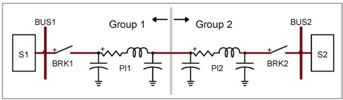  
Fig. 1. Three-phase system example.

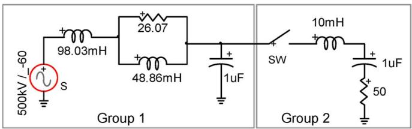  
Fig. 2. Simple-switched RLC circuit.

the number of precalculated matrix sets for switching topologies can become substantially reduced.

In the three-phase example shown in Fig. 1, two arbitrary networks, S1 and S2, are interconnected using two switches and two pi-sections. If the state-space method is used for the entire system, it will result into state variables. If the state-space solver precomputes (particularly useful for real-time applications) the matrix sets for all switch position permutations, it will require saving in memory $2 ^ { 6 } = 6 4$ matrices for the entire system.

The same system can be solved using SSN by separating into two groups (Group 1 and Group 2 shown in Fig. 1). Since the three-phase capacitors at the separation point will now count as separate states, the number of state variables in each group becomes $( m + 3 ) / 2$ . The size of $\mathbf { Y _ { N } }$ in (10) is $3 \times 3 .$ . Also, the number of precalculated matrix sets now reduces to $2 ~ \times$ $2 ^ { 3 } = 1 6$ from $2 ^ { 6 } = 6 4$ . The created groups are linked only through the nodal interfacing equations. This allows a parallel setup and calculations on two independent CPUs or CPU cores. The computational burden of (10) is negligible when compared to much larger group equations.

# III. VALIDATION

The method proposed in this paper has been validated using simple and complex systems. In addition to independent programming, the new method has been also implemented in the SimPowerSystems [1] (SPS) tool for Simulink. The reference nodal analysis is the modified-augmented-nodal analysis (MANA) method of Electromagnetic Transients Program (EMTP)-RV [17].

# A. Simple RLC Case

The simulated circuit is the one shown in Fig. 2. It is based on an equivalent 500-kV ac system switched onto a mostly capacitive RLC branch. The SSN method is used with two groups. Group 1 is of I-type and Group 2 is of V-type. It is noticed that the methodology proposed in this paper does not impose topological restrictions.

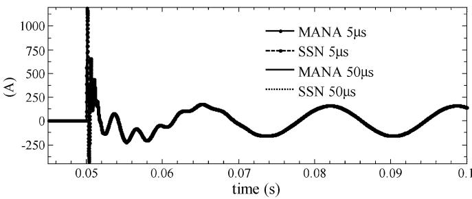  
Fig. 3. Switch SW current for the circuit of Fig. 2.

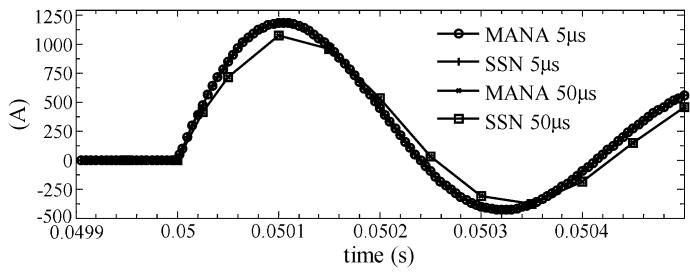  
Fig. 4. Switch SW current for the circuit of Fig. 2, zoomed version.

The switch is closed at 0.05 s. The circuit is automatically initialized using phasors and is in steady state when the switch is closed.

The simulation results for the switch current are shown in Fig. 3 for two integration time steps, namely $\Delta t = 5 ~ \mu \mathrm { s }$ and $\Delta t = 5 0 \mu \mathrm { s }$ . Both SSN and MANA use halved time-step Backward Euler integration at discontinuity points. Fig. 4 shows the zoomed version for both methods at the energization instant and confirms that both methods provide identical simulation results.

# B. HVDC System

This system (Fig. 5) is composed of a 1000-MW HVDC link used to transmit power from a 500-kV, 5000-MVA, and 60-Hz network to a 345-kV, 10 000-MVA, and 50-Hz network. The ac networks are modeled by equivalents. The rectifier and the inverter are 12-pulse converters interconnected through a 300-km distributed parameter line (including propagation delay) and two 0.5-H smoothing reactors. Capacitor banks, harmonic filters (11th and 13th), and high-pass filters for a total of 600 Mvars are used on each converter side. The three-winding transformers are Y-grounded on the primary side and Y-Delta on the secondary side. The complete model and data are available in the software SimPowerSystems [1] (see also [20]). The only difference in this design is that the (300 Mvars) capacitor of the filter bank on the rectifier part is split into two parts, one of which is switched.

For the purpose of the test, the following groups are created on the rectifier side:

• group #1: ac source and impedance, V-type SSN group;   
• group #2: switched capacitor, I-type SSN group;   
• group #3: fixed filter bank, I-type SSN group;   
• group #4: transformer, thyristor-rectifier, and smoothing reactor, V-type SSN group.

The inverter side is simulated using the state-space method of [1].

The test consists of the energization of the dc link to the nominal current with the 300-Mvars capacitor being switched on at 1.5 s of the simulation interval.

The simulation results are compared to SPS in Figs. 6–8 for a fixed integration time step of 25 $\mu \mathrm { s } .$ The match is very close and validates the SSN method. Closer examination of the dc current (see Fig. 7) will show small differences between the two simulation methods. This is normal since any small discrepancy in the thyristor switching methods will cause differences. In the current SPS code, it is not possible to access details related to thyristor turn-on/turn-off and reproduce them exactly. The implementation based on the SSN method does not use specific switching tricks, and the thyristor model is ideal. It is also noticed that low-frequency jitter occurs in both methods. This jitter is due to the $2 5 \mathrm { - } \mu \mathrm { s }$ sampling time step for thyristor switching. A solution to this problem has been proposed in [21]–[23] (see also the analysis in [19]) and will be also implemented in the SSN method.

# C. Breaker Test Setup

The objective of this example is to demonstrate that the proposed SSN method can be advantageously used for performing repetitive studies in state-space solvers. The tested system is shown in Fig. 9. It has been trimmed to simplify the presentation. It is used for testing fault detection and breaker opening under various fault conditions. It is a 50-Hz and 225-kV system with short transmission lines modeled as balanced PI sections. The source impedances are decoupled with $R = 1 . 2 7 \Omega$ and $L = 6 3 . 5$ mH. The PI sections have a capacitance of $1 \times 1 0 ^ { - 1 4 }$ F/km (diagonal matrix). The positive-sequence resistance and inductance are 60 m km and 1.27 mH/km, respectively, while the zero-sequence counterpart is three times higher. The system is lightly loaded with all loads having $P = 5 0$ MW and $Q = 0$ . The tested fault locations are identified as to . Various fault types with fault resistance can be applied. The tested breakers are BR1 and BR2.

The system is decomposed into five SSN (SS1 to SS5) groups as identified in Fig. 9. The SS1 group is a mixed type. There are a total of nine nodal points. The simulation results for CT1 (BR2) currents with a time step of 25 s for a phase-a to phase-b fault occurring at 100 ms at are shown in Fig. 10. The breakers remain closed in this test, and the fault disappears at 150 ms. The simulation results with SSN and SPS methods are identical.

The system of Fig. 9 uses PI sections and it is not possible to decouple with propagation delay-based transmission-line models. This causes problems in real-time applications. There are two breakers and four fault devices. The breakers use three switches, and the fault devices require four switches for modeling various types of faults. This requires the precalculation of $2 ^ { 2 2 }$ sets of state-space solution matrices, which is not realizable.

In the SSN approach, the switches are located in independently formulated state-space equations. With the setup of five groups shown in Fig. 9, the maximum number of combinations now reduces to $2 ^ { 7 }$ with four fault switches and three breaker switches in the groups SS1 and SS5.

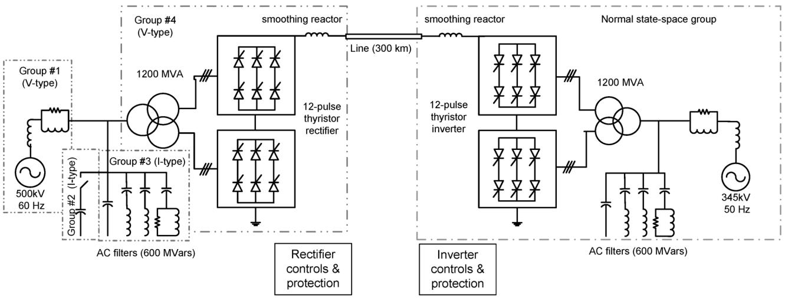  
Fig. 5. Twelve-pulse HVDC system.

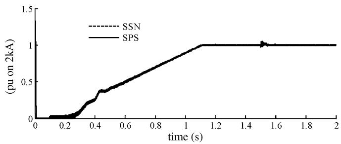  
Fig. 6. DC-link current.

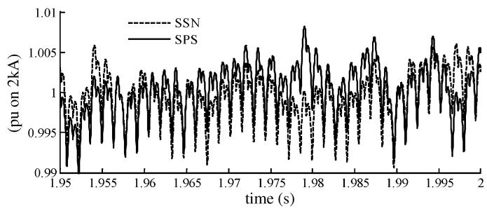  
Fig. 7 DC-link current, zoomed interval.

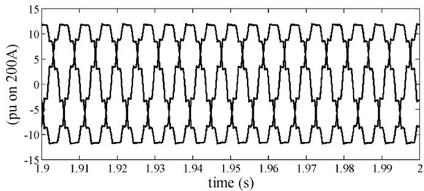  
Fig. 8 Rectifier ac currents as well as SSN (solid line) and SPS (dashed line) methods.

# D. Real-Time Simulation Results

In addition to the offline simulations presented before, the HVDC system of Fig. 5 and the breaker test setup of Fig. 9

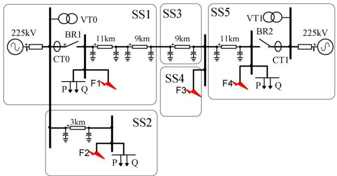  
Fig. 9. Breaker test setup, single-line diagram.

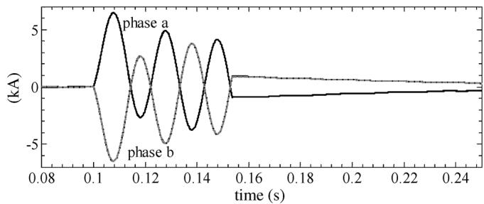  
Fig. 10. CT1 current, SSN (solid line), and SPS (dashed line) methods.

have been tested in real time on a target platform [24], comprising a single 3.2-GHz Xeon i7 Quad-core PC running under the RedHat Linux kernel. Also, these tests are using the SPS implementation of the SSN algorithm.

The HVDC system was simulated with three cores: one core for the rectifier side based on the SSN method, the second core for the inverter side based on the state-space approach, and the third core was used for simulating the HVDC controls. The worst-case time step reached 10 s with the groups identified in Fig. 5. Alternatively, the separate grouping of the two 6-valves groups could have been made for reducing the number of precalculated matrix sets, as the proposed SSN algorithm offers this flexibility.

The breaker test setup was simulated on a single core. The worst-case condition gives a time step of 21 s.

TABLE I HARD REAL-TIME TIME STEP   

<table><tr><td>Test case</td><td>SSN time step (μs)</td><td>CPUs used</td></tr><tr><td>HVDC</td><td>10</td><td>3</td></tr><tr><td>Breaker test</td><td>21</td><td>1</td></tr></table>

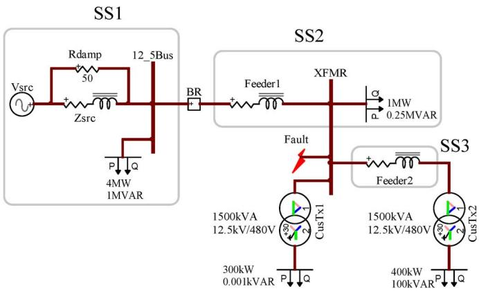  
Fig. 11. Test system with nonlinear models, single-line diagram.

Table I summarizes the aforementioned results. The worst-case condition is suitable for “hard” real-time simulation. It is the maximum calculation time of all time steps. The switching events maximize processor uncaching effects. The measurements shown in the table were performed without input/output (I/O) devices.

This simulation performance of the HVDC case is comparable to other real-time simulators [7], [8]. A fair comparison of solver efficiency is difficult to perform based on timing values alone, since simulator technology, especially at the hardware level, differs significantly between existing simulators.

# IV. NONLINEAR MODELS

The SPS implementation of the presented SSN method naturally incorporates nonlinear device models available in SPS. SPS uses current injections with time-step delay for representing nonlinearities. The current injection method has limitations, it may become less precise, and suffers from stability problems particularly when the integration time step increases. It is preferable to implement a simultaneous and iterative approach for best precision and robustness.

The test case presented in this section is used to demonstrate the capability to use the SSN method on its own for solving nonlinear models simultaneously. The tested circuit is the one shown in Fig. 11. The complete system data can be made available on request. It is a 12.5-kV distribution system with the representation of an equivalent at the main bus. The two transformers are modeled using a nonlinear inductance for the magnetization branch. The flux-current function is shown in Fig. 12. A piecewise linear representation is used.

This test case also demonstrates that the selection of statespace and nodal regions is arbitrary. Here, the decision has been made to select three state-space sections (SS1, SS2, and SS3) and the rest is kept in nodal (MANA) equations using (12). This selection is arbitrary. It is, for example, possible to combine

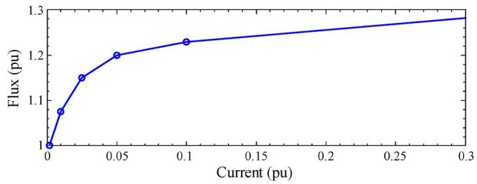  
Fig. 12. Nonlinear flux-current characteristic, transformer magnetization branch model.

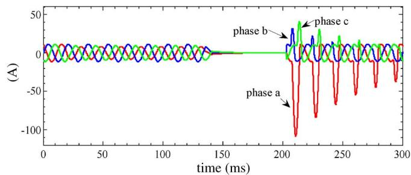  
Fig. 13. Phase currents, transformer CusTx1, SSN, and EMTP-RV.

SS1 and SS2 into a single state-space representation. Here, the breaker BR and the fault switches are ideal and it is more efficient to represent them and update their status through (12). The nonlinear flux-current equations are also represented and solved more efficiently through (12). In this case, each nonlinear function is linearized through its piecewise linear representation, but it is also possible to calculate the differential at each iteration.

For the aforementioned flux-current relation

$$
\phi_ {L _ {t}} = K ^ {(j)} i _ {L _ {t}} + \phi_ {0} ^ {(j)} \tag {16}
$$

where $\phi _ { L _ { t } }$ is the nonlinear inductance flux at the time point $t ,$ the segment slope at iteration $i _ { L _ { t } }$ is the inductance current, is the iteration counter, $j ,$ and $\phi _ { 0 } ^ { ( j ) }$ is the segment flux at $K ^ { ( j ) }$ is zero current. Since using voltage unknowns in nodal analysis is required, it can be demonstrated that (16) can be transformed into

$$
i _ {L _ {t}} = \frac {\Delta t}{2 K ^ {(j)}} v _ {L _ {t}} + \frac {1}{K ^ {(j)}} \left(\phi_ {L _ {h}} - \phi_ {0} ^ {(j)}\right) \tag {17}
$$

where $v _ { L _ { t } }$ is the inductance voltage and $\phi _ { L _ { h } }$ is the flux history derived from the trapezoidal rule of integration. During the iterative process, updating the coefficient of $v _ { L _ { t } }$ is required, which modifies the branch admittance in the matrix of (12). The last term in (17) requires the iterative updating of in (12). This approach is identical to the one used in [5] and [17], and is applied here in the context of the SSN method. Due to linearization, the matrix of (12) becomes the Jacobian matrix. Equation (12) is solved with iterative updating until convergence.

The studied scenario is the occurrence of a phase-a-to-ground fault (4 ) on bus XFMR. The solution starts in linear steadystate conditions. The fault occurs at 20 ms and clears at 133 ms. The breaker BR receives the opening signal at 133 ms and recloses at 203 ms. The phase current waveforms on the highvoltage side of the transformer CusTx1 are shown in Fig. 13.

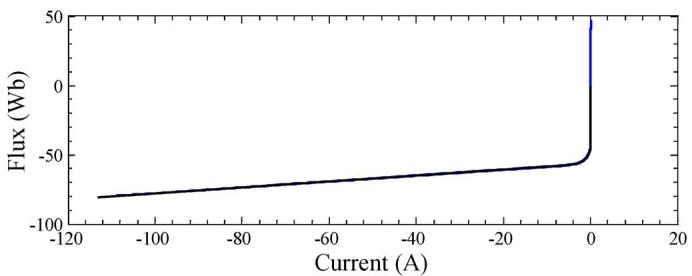  
Fig. 14. Nonlinear flux-current plot, transformer CusTx1, overlaid simulation, and actual characteristic.

The validation is performed using EMTP-RV since it uses a simultaneous iterative solver. Both methods provide identical results. The integration time step is 50 s.

The simultaneous solution qualification can be verified by demonstrating that all solution points remain on the nonlinear characteristic segments for any integration time step. This is shown in Fig. 14. Zooming on the knee points will show jumps between connecting segments, which is normal since a fixed time step is used. In addition to the fact that the nonlinear trajectory segments of each device are not overrun, convergence is achieved for all nonlinear devices (in this case, there are two magnetization branches) at each solution time point and within simultaneous electrical coupling.

It is observed here that the iterative process is applied to (12). The size of this system is normally smaller compared to the representation of the entire network in MANA equations. It becomes much smaller when the number of nodes evacuated in linear state-space equations increases. The iterative process requires repetitive refactoring of the matrix $\mathbf { A } _ { \mathbf { N } }$ and becomes significantly more efficient when the size of $\mathbf { A } _ { \mathbf { N } }$ reduces. Thus, the presented SSN method has the potential to introduce a nonlinear iterative solution methodology into its real-time implementation.

# V. CONCLUSION

This paper presented a power system simulation solver based on the combination of state-space and nodal-analysis formulations of circuit equations. It is also compatible with modifiedaugmented-nodal analysis. The presented new method makes use of internal grouping of electric elements to enable a modulation of computational burden between state-space and nodal equations. It offers several numerical advantages.

The new method offers the capability of dramatic reduction in the number of saved matrix sets for switching permutations. This is particularly useful for real-time applications as demonstrated in this paper. Another advantage for state-space equations is the inheritance of an efficient and simultaneous nonlinear solution capability from the combination with nodal equations. Moreover, the iterative solver uses a reduced nodal matrix which increases efficiency and enables anticipating the introduction of iterative solvers in real-time applications.

# REFERENCES

[1] “SimPowerSystems, User’s Guide,” ver. 5, MathWorks, Natick, MA, 2009.   
[2] “Simulink, User’s Guide,” ver. 7, MathWorks, Natick, MA, 2009.

[3] H. W. Dommel, “Digital computer solution of electromagnetic transients in single- and multiphase networks,” IEEE Trans. Power App. Syst., vol. PAS-88, no. 4, pp. 734–741, Apr. 1969.   
[4] D. A. Woodford, A. M. Gole, and R. Z. Menzies, “Digital simulation of dc links and ac machines,” IEEE Trans. Power App. Syst., vol. PAS-102, no. 6, pp. 1616–1623, Jun. 1983.   
[5] J. Mahseredjian, “Simulation des transitoires électromagnétiques dans les réseaux électriques,” Édition ‘Les Techniques de l’Ingénieur’, 2008, Dossier no D4130.   
[6] J. Mahseredjian and F. Alvarado, “Creating an electromagnetic transients program in MATLAB: MatEMTP,” IEEE Trans. Power Del., vol. 12, no. 1, pp. 380–388, Jan. 1997.   
[7] P. Forsyth and R. Kuffel, “Utility applications of a RTDS Simulator,” in Proc. Int. Power Engineering Conf., 2007, pp. 112–117.   
[8] D. Pare, G. Turmel, and J.-C. Soumagne, “Validation of the hypersim digital real-time simulator with a large AC-DC network,” presented at the Int. Power Systems Transients Conf., New Orleans, LA, 2003.   
[9] J. R. Martí, L. R. Linares, J. A. Hollman, and F. A. Moreira, “OVNI: Integrated software/hardware solution for real-time simulation of large power systems,” presented at the PSCC, Sevilla, Spain, Jun. 2002.   
[10] J. A. Hollman and J. R. Martí, “Real time network simulation with PC clusters,” IEEE Trans. Power Syst., vol. 18, no. 2, pp. 563–569, May 2003.   
[11] J. Mahseredjian, S. Lefebvre, and D. Mukhedkar, “Power converter simulation module connected to the EMTP,” IEEE Trans. Power Syst., vol. 6, no. 2, pp. 501–510, May 1991.   
[12] K. Strunz and E. Carlson, “Nested fast and simultaneous solution for time-domain simulation of integrative power-electric and electronic systems,” IEEE Trans. Power Del., vol. 22, no. 1, pp. 277–287, Jan. 2007.   
[13] C. Dufour, “Deux contributions à la problématique de la simulation numérique en temps réel des réseaux de transport d’énergie,” Ph.D. dissertation, Laval Univ., Québec City, QC, Canada, May 2000.   
[14] M. Tiberg, D. Bormann, B. Gustavsen, C. Heitz, O. Hoenecke, G. Muset, J. Mahseredjian, and P. Werle, “Generic and automated simulation modeling based on measurements,” presented at the Int. Power Systems Transients Conf., Lyon, France, Jun. 4–7, 2007.   
[15] J. Mahseredjian, “State-space equations,” Jul. 2005, EMTP-RV documentation.   
[16] C. Dufour, S. Abourida, J. Bélanger, and V. Lapointe, “Infini-Band-based real-time simulation of HVDC, STATCOM, and SVC devices with commercial-off-the-shelf PCs and FPGAs,” presented at the 32nd Annu. Conf. IEEE Industrial Electronics Soc., Paris, France, Nov. 7–10, 2006.   
[17] J. Mahseredjian, S. Dennetière, L. Dubé, B. Khodabakhchian, and L. Gérin-Lajoie, “On a new approach for the simulation of transients in power systems,” Elect. Power Syst. Res., vol. 77, no. 11, pp. 1514–1520, Sep. 2007.   
[18] L. O. Chua and P. M. Lin, Computer Aided Analysis of Electronic Circuits: Algorithms and Computational Techniques. Englewood Cliffs, CA: Prentice-Hall, 1975.   
[19] N. R. Watson and J. Arrillaga, “Power systems electromagnetic transients simulation,” Inst. Eng. Technol. Power and Energy, ser. 39, 2007.   
[20] S. Casoria, “Thyristor-based HVDC transmission system (detailed model),” SimPowerSystems 5.0 Demo (Matlab R2008B) Math-Works. Natick, MA.   
[21] C. Dufour, J. Bélanger, and S. Abourida, “Accurate simulation of a 6-pulse inverter with real time event compensation in ARTEMIS,” Math. Comput. Sim., vol. 63, no. 3–5, pp. 161–172, Nov. 2003.   
[22] B. Kulicke, E. Lerch, O. Ruhle, and W. Winter, “NETOMAC—Calculating, analyzing and optimizing the dynamic of electrical systems in time and frequency domain,” presented at the Int. Power Systems Transients Conf., Budapest, Hungary, Jun. 20–24, 1999.   
[23] G. D. Irwin, D. A. Woodford, and A. Gole, “Precision simulation of PWM controllers,” presented at the Int. Power Systems Transients Conf., Rio de Janeiro, Brazil, Jun. 24–28, 2001.   
[24] RT-LAB ver. 10, Opal-RT Technologies, 2010.

Christian Dufour (M’10) received the Ph.D. degree from Laval University, Quebec City, QC, Canada, in 2000.

He joined Opal-RT Technologies in 1999, where he is the Lead Researcher in electric system simulation software for RT-LAB. Before joining Opal-RT, he worked on the development teams of the Hydro-Quebec HYPERSIM real-time simulator, as well as the MathWorks SimPowerSystems blockset. His current research interests are related to the algorithmic solutions for the real-time simulation of power systems and motor drives.

Jean Mahseredjian (SM’08) received the Ph.D. degree from École Polytechnique de Montréal, Montréal, QC, Canada, in 1991.

From 1987 to 2004, he was with IREQ (Hydro-Québec), working on research-and-development activities related to the simulation and analysis of electromagnetic transients. In 2004, he joined the faculty of electrical engineering at École Polytechnique de Montréal.

Jean Bélanger (M’07) received the M.A.Sc. degree from École Polytechnique de Montréal, Montréal, QC, Canada.

He is the President and Founder of Opal-RT Technologies, a manufacturer of real-time simulators. He is a specialist in power systems, with more than 25 years of experience in the field, including many years as part of the simulation division of Hydro-Quebec, where he helped develop the 765-kV James Bay transmission system.

Mr. Bélanger has been a Fellow of the Canadian Academy of Engineering since 2001.