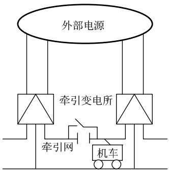
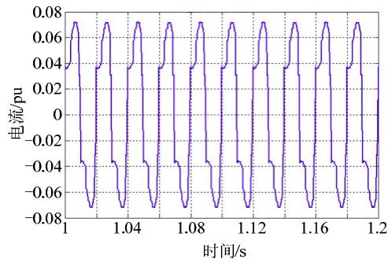
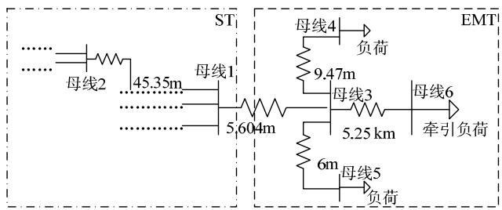
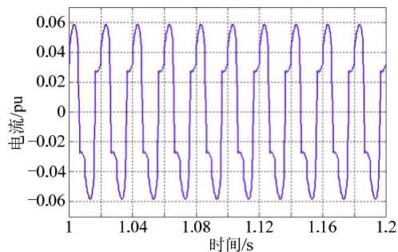
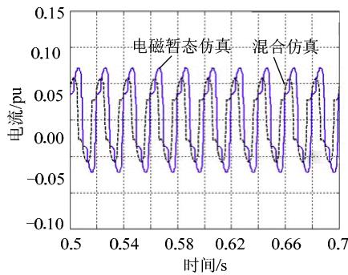
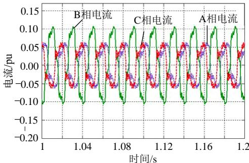
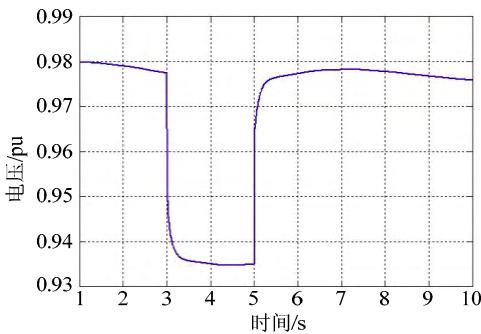
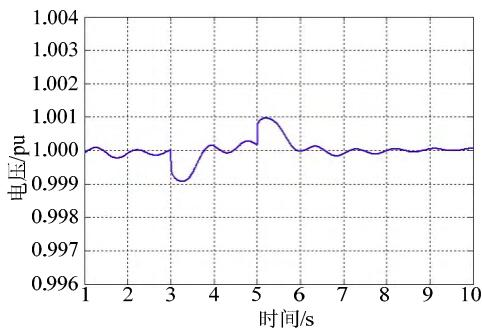

# 基于ADPSS的电力系统和牵引供电系统

# 机电-电磁暂态混合仿真

徐家俊，王晓茹，王天钰，李宏强

（西南交通大学 电气工程学院，四川省 成都市 610031）

Electromagnetic-Electromechanical Transient Hybrid Simulation of

Electric System and Traction Power Supply System Based on ADPSS

XU Jiajun, WANG Xiaoru, WANG Tianyu, LI Hongqiang

(School of Electrical Engineering, Southwest Jiaotong University, Chengdu 610031, Sichuan Province, China)

ABSTRACT: Recently it just built the detailed simulation model of traction power supply system in the study of the impact on the power system brought by traction power supply system. However the power system is generally replaced by simplified circuit in those models. There is not a joint simulation model of real power system and traction power supply system now. So it cannot further study the effect and influence between power system and traction power supply system. With the electromagnetic transient simulation model of the traction power supply system, this paper built an electromechanical-electromagnetic transient hybrid simulation model of real power system and traction power supply system based on advanced digital power system simulator(ADPSS). And it proves the accuracy of the hybrid simulation by comparing the result of hybrid simulation and that of electromagnetic transient simulation. It also studies the load characteristic of traction power supply system and the influence on the power system brought by the traction power supply system.

KEY WORDS: traction power supply system; advanced digital power system simulator; electromechanical transient; electromagnetic transient; hybrid simulation

摘要：目前在牵引供电系统对电力系统的影响研究中，大多只单一对牵引供电系统建立详细仿真模型，而电力系统侧则是采用简化后的电路代替，缺乏一种实际电力系统与牵引供电系统的联合仿真模型，对电力系统-牵引供电系统的相互作用与影响认识不足。文中在牵引供电系统电磁仿真模型的基础上，基于电力系统全数字仿真装置(advanced digital power system simulator, ADPSS)搭建出了牵引供电系统与实际电网系统的机电-电磁暂态混合仿真模型，并将混合仿真计算结果与典型值相比较，验证了混合仿真的正确性，并研究分析了牵引供电系统负荷特性、牵引供电系统对电力系统的影响。

关键词：牵引供电系统；电力系统全数字仿真装置(ADPSS)；机电暂态；电磁暂态；混合仿真

DOI: 10.13335/j.1000-3673.pst.2014.07.031

# 0 引言

电铁牵引负荷是一种具有冲击性的单相整流负荷，因而会产生较大的谐波，这些谐波又经过牵引网注入到电网中，同时电力机车的突然接入还会造成电网电压的波动，谐波和电压波动都会对电网的电能质量造成影响[1-5]。

目前对牵引供电系统的详细仿真中，大多采用电磁暂态仿真，在仿真时需要对电力系统部分进行等值简化，但简化后的等值网络的各种特性很难与原网络相同，从而降低了计算分析的准确性，并且一旦电网系统运行方式发生变化，需要对网络进行重新简化，工作量较大[6]。也即现今缺乏一种实际电力系统与牵引供电系统联合仿真的模型，导致对电力系统-牵引供电系统的相互作用与影响认识不足。

电力系统全数字仿真装置(advanced digital power system simulator, ADPSS)是由中国电力科学研究院自主研制而成，在大规模电力系统实时仿真、机电暂态-电磁暂态混合仿真等关键技术上取得了理论创新和技术突破[7-13]。ADPSS可以应用于机电-电磁暂态混合仿真的模式，集中了电磁暂态仿真和机电暂态仿真各自的优点[6]。在对含有牵引变电站的大电网进行仿真时，由于牵引负荷为不对称负荷，且运行过程中产生谐波，相当于一个谐波源，因而牵引负荷必须建立其电磁暂态模型，而对于其余部分电网则构建其机电暂态仿真模型，并在仿真过程中保持2种模型的仿真同步性[14]。这样，既可以详细模拟牵引供电系统内部快速暂态变化过程，又能兼

顾仿真系统规模，还不需要对电力系统部分进行等值简化，进而提高了仿真分析的准确性[15]。

本文基于牵引供电系统的电磁暂态模型，在ADPSS上搭建出牵引供电系统与实际电网系统的机电-电磁暂态混合仿真模型，并将混合仿真计算结果与典型值相比较，验证混合仿真的正确性，并研究分析牵引供电系统负荷特性及牵引供电系统对电力系统的影响。

# 1 电力系统的机电暂态模型

电力系统为牵引供电系统提供高压电源，其电压等级为 $110\mathrm{kV}$ 或者 $220\mathrm{kV}$ 。目前我国普通电气化铁路大多接入 $110\mathrm{kV}$ 电网，而高速客运专线则接入 $220\mathrm{kV}$ 电网。

本文混合仿真时电力系统采用四川某电网系统，在ADPSS上搭建出其机电暂态模型，此电网系统模型中共计有383个节点，其中包括122台变压器、77台发电机组、248回交流输电线路、10个牵引变电所以及98个负荷等，牵引变电所在机电暂态模型中等效为负荷。

# 2 牵引供电系统的电磁暂态模型

牵引供电系统主要由外部电源(电力系统)、牵引变电所、牵引网和电力机车等组成，其结构示意图如图1所示。

  
图1 牵引供电系统结构  
Fig. 1 Structure of traction power supply system

外部电源也即电力系统；牵引变电所是连接外部电源和牵引网的纽带，主要元件是牵引变压器，本文电磁暂态模型中采用的是V/V牵引变压器；牵引网主要由接触网、回流线、馈线等组成，是将电能输送给电力机车的网络，参照文献[16]在ADPSS上搭建出牵引网的仿真模型；电力机车通过牵引电机及其变换和控制机构，将电能转化为可用机械能，牵引列车运行，参照文献[17]在ADPSS上搭建出韶山4型电力机车的仿真模型。

本文在ADPSS上搭建了详细的牵引供电系统电磁暂态模型，牵引供电系统采用的是AT供电方式，

牵引网采用单线双臂，左右2条供电臂均长 $20 \mathrm{~km}$ ，每 $10 \mathrm{~km}$ 设置一个AT所，2辆电力机车分别运行在2条供电臂距牵引变电所 $5 \mathrm{~km}$ 处，电力机车运行在牵引工况(第IV段)，电力系统由理想电压源代替，基于此进行电磁暂态仿真。

仿真时间设为 $3 \mathrm{~s}$ , 且机车在仿真时间内一直运行。左臂机车的电流 $I_{\mathrm{L}}$ 波形如图 2 所示, 并测出其谐波含量。可以看出波形是畸变的, 含有大量谐波。

  
图2 机车电流波形  
Fig. 2 The diagram of current flowing through the locomotive

在对韶山4型电力机车的研究过程中，人们也总结了机车电流的各次谐波含量的典型值[18]，将本文所得到的牵引供电系统电磁仿真结果中各次谐波含量与典型统计值比较，结果如表1所示。

表 1 电磁仿真结果与典型统计值的谐波含量对比  
Tab. 1 Contrast of harmonic between electromagnetic simulation results and typical statistics   

<table><tr><td rowspan="2">参数</td><td colspan="5">谐波含量/%</td></tr><tr><td>3次</td><td>5次</td><td>7次</td><td>9次</td><td>11次</td></tr><tr><td>典型统计值</td><td>23</td><td>12</td><td>7</td><td>4</td><td>3</td></tr><tr><td>机车取流IL</td><td>23.9804</td><td>14.5327</td><td>5.72403</td><td>4.65577</td><td>2.78074</td></tr></table>

由表1可知，电磁仿真结果与典型统计值基本相近，本文所搭建的牵引供电系统电磁暂态模型是正确的。

# 3 牵引供电系统与实际电网的机电-电磁暂态混合仿真

# 3.1 ADPSS混合仿真的步骤

基于ADPSS进行机电-电磁暂态混合仿真时，通常有以下几个步骤[6]：

1）建立实际电网系统的机电暂态模型，并进行潮流计算。  
2）根据具体情况确定分网方案，合理划分机电暂态子网和电磁暂态子网。  
3）根据网络的划分情况，建立电磁暂态子网的仿真模型，并添加机电暂态接口，填写电磁暂态的初始潮流。  
4)提交子网作业，进行机电-电磁暂态混合仿真。

# 3.2 机电暂态仿真数据准备

要进行机电-电磁暂态混合仿真计算，首先需要建立整个工程全网的机电暂态数据，然后对机电暂态模型进行合理分网。分网的原则是保证仿真的效率以及精度，即在尽量降低电磁暂态子网的规模及数量的同时，还要使得接口处电气量的不对称度以及波形畸变尽量低。根据以上的分网原则，在对实际电网机电暂态模型进行网络划分时，大致可分为2种分网方案：1）将接口位置选在与牵引负荷直接相连的母线处；2）将接口位置延伸至电网系统的内部，选择在电气量不对称度低的位置。

对于有电力机车接入的电力系统网络，由于牵引供电系统是不对称负荷，导致牵引变电所附近的电网也不对称，如果将机电暂态接口接在牵引变电所母线处，会使混合仿真的结果出现较大误差，这样也违背了机电暂态分网的原则。所以在混合仿真时，必须将牵引变电站以及其附近不对称的电网划入电磁子网中，也即本文选择分网方案2）。

在电力系统中离谐波源越远，受谐波的影响越小，也即不平衡度越小，这在电力系统领域已达成共识。牵引负荷作为一种非线性负荷是电网中谐波的主要来源[19]，因而选择离牵引变电站越远的位置，其电气量不对称程度越低；但限于电磁暂态网络的规模不能过大，以免仿真速度受限，所以选择的位置也不能过远。

本文中机电暂态网络为四川某电网系统，在对机电暂态模型分网时，经过多次尝试，在尽量保证仿真计算精度和效率的情况下，选出了需要划入电磁暂态子网的牵引变电所周围部分母线。将牵引负荷、牵引变电所和所选出的母线划入电磁暂态网络中，采用电磁暂态模型进行仿真，系统其余部分则采用机电暂态模型进行仿真。

四川某电网系统的机电暂态模型分网方案示意图如图3所示，此机电暂态模型被划分为机电暂态子网(ST)和电磁暂态子网(EMT)。

对机电暂态模型进行合理分网是本文进行混合仿真的关键，且分网情况的优劣直接影响了混合

  
图3 某实际电网系统的分网方案  
Fig. 3 Network partition scheme for an actual power system

仿真结果的准确性。

# 3.3 电磁暂态仿真数据准备

电磁暂态模型中建立了图3中所示EMT网内所有元件及线路，包括牵引供电系统模型。但由于机电暂态子网提供给接口母线的无功与电磁暂态子网所需无功不匹配，致使混合仿真不成功。本文利用电磁暂态程序中的数学元件搭建UD模块测量电磁暂态子网正常运行所需无功以及机电暂态部分所提供的无功，对其差值在接口处用感性或容性无功负荷进行无功补偿，帮助实现对系统的机电-电磁暂态混合仿真[20]。

# 3.4 机电-电磁暂态混合仿真

# 3.4.1 算例1

仿真时间设为 $3\mathrm{s}$ ，系统中一直有机车运行。在纯电磁暂态仿真中主要分析了流入左臂机车的电流及其谐波含量。为对比分析，混合仿真中也取流入左臂机车的电流。混合仿真左臂机车取流波形如图4所示。

  
图4 混合仿真下机车取流波形  
Fig. 4 The diagram of current flowing through the locomotive in hybrid simulation

混合仿真结果与纯电磁仿真结果进行比较，机车取流对比波形如图5所示，可以看到2种仿真结果的波形基本一致；混合仿真、纯电磁仿真得到的谐波含量和典型统计值对比如表2，可以看出混合仿真与纯电磁仿真的结果基本一致，但混合仿真结果更接近于典型统计值，仿真更加精确。典型统计值来源于实际中的统计结果。纯电磁暂态仿真中电力系统部分由等值电路代替，往往不能充分体现电网特性，而本文混合仿真的电力系统部分是实际的电网，不用考虑等值简化，因而仿真结果更接近于统计值。仿真结果验证了混合仿真的正确性，且混合仿真提高了计算精度。

由表2可以看出电力机车运行时会产生大量谐波。取牵引变压器三相电力系统侧电流波形如图6所示。该图表明，电力机车运行时产生的大量谐波，会经由牵引网传输到电力系统侧，影响母线的电流波形，牵引供电系统产生的谐波污染了电网的电流。

  
图5 混合仿真与纯电磁仿真机车取流对比  
Fig. 5 Contrast of current flowing through the locomotive between hybrid simulation and electromagnetic simulation

表 2 混合仿真与纯电磁仿真、典型统计值的谐波含量对比  
Tab. 2 Contrast of harmonic among hybrid simulation results, electromagnetic simulation results and typical statistics   

<table><tr><td rowspan="2">参数</td><td colspan="5">谐波含量/%</td></tr><tr><td>3次</td><td>5次</td><td>7次</td><td>9次</td><td>11次</td></tr><tr><td>典型统计值</td><td>23</td><td>12</td><td>7</td><td>4</td><td>3</td></tr><tr><td>纯电磁仿真</td><td>23.9804</td><td>14.5327</td><td>5.72403</td><td>4.65577</td><td>2.78074</td></tr><tr><td>混合仿真</td><td>23.4244</td><td>14.5275</td><td>6.21103</td><td>4.18549</td><td>3.16826</td></tr></table>

  
图6牵引变压器电力系统侧的三相电流  
Fig. 6 Current of three-phase side of traction transformer

# 3.4.2 算例2

以往的研究一般都是将电网部分用等值电路代替，不能观测三相电网的实时变化情况，而本文将牵引供电系统接入一个实际的电网，可以实时观测电网中的电压、电流等电气量在电力机车通过时的变化。以电压为例分析电力机车的接入对电网的影响。

混合仿真的仿真时间设为 $10 \mathrm{~s}$ , 机车在 $3 \mathrm{~s}$ 时接入电网, 运行 $2 \mathrm{~s}$ 后, 即仿真 $5 \mathrm{~s}$ 后机车退出。

按距牵引变电所母线的远近，取2条母线的电压：一条为距离牵引变电所较近的母线(图3中母线1)；另一条为距离牵引变电所较远的母线(图3中母线2)。母线电压波形分别如图7—8所示。

从图7—8可以看出，电力机车的接入会影响电力系统母线的电压：当机车接入时母线电压下降，机车退出时母线电压上升。距牵引变电所较近的母线1，在机车接入时(3s)电压下降得比较大并维持在较低电压，在机车退出后(5s)又恢复到初始水平；

  
图7 母线1的电压波动

  
Fig. 7 Voltage fluctuations of bus 1   
图8 母线2的电压波动  
Fig. 8 Voltage fluctuations of bus 2

而距牵引变电所较远的母线2，在机车接入时(3s)电压下降得比较小，且能恢复到初始水平，在机车退出后(5s)电压小幅度上升后也恢复到初始水平。

以上仿真结果说明距离牵引变电所越远电力机车的接入或退出对其母线电压的影响越小，即电气化铁路的接入或退出对电网电压有影响，且随距离的增加，电压波动减小，对电网的影响也就越弱。

# 3.5 混合仿真的优越性

机电暂态仿真中往往将不对称、冲击性的牵引负荷作为一个普通负荷来仿真模拟，由于机电暂态的模型是基于基波、单相、相量的模型[21]，不能有效地反映电力机车经过时的动态过程。电磁暂态仿真又往往把电力系统部分经过戴维南等值简化为一个等效电路，而简化后的等值网络的特性又很难与原网络相同，从而降低了计算分析的准确性和精确度。

本文所搭建的混合仿真模型能实时地反映机车经过时电网的动态过程，又因在仿真中采用的是实际电网，保证了计算结果的精度。

# 4 结论

本文基于ADPSS搭建出了牵引供电系统与实际电网系统的机电-电磁暂态混合仿真模型，并在与电磁暂态仿真结果的比较中可以看出混合仿真得出的谐波含量更接近于典型统计值，仿真更精确。并且能够以此混合仿真模型来深入研究牵引供电系统对电力系统的影响，弥补了以往仿真模型中不得不采用电力系统等值所引起的计算准确性降

低的不足，为研究牵引供电系统提供了一种与实际电网相结合的联合仿真模型，进而为研究分析牵引供电系统负荷特性、牵引供电系统与电力系统相互作用和影响提供了有力的研究手段，提高了仿真分析的精度。

本文混合仿真中，只对一种机车类型采用一种运行方式进行了仿真分析，ADPSS还可以针对多种机车类型和多种运行方式进行分析和研究。

# 参考文献

[1] 徐永海，肖湘宁．电力市场环境下的电能质量问题[J].电网技术，2004，28(22)：48-52.  
Xu Yonghai, Xiao Xiangning. Power quality problems in deregulated power systems[J]. Power System Technology, 2004, 28(22): 48-52(in Chinese).   
[2] 周胜军，于坤山，冯满盈，等．电气化铁路供电电能质量测试主要结果分析[J].电网技术，2009，33(13)：54-63.  
Zhou Shengjun, Yu Kunshan, Feng Manying, et al. Analysis on main results of power quality test of power supply for electrified railway[J]. Power System Technology, 2009, 33(13): 54-63(in Chinese).   
[3] 肖文英，张振飞．电铁谐波对电力系统的影响和对策[J].中国电力教育，2011，15(2)：100-101.  
Xiao Wenying, Zhang Zhenfei. Impact of electrified railway on power system and countermeasures[J]. China Electric Power Education, 2011, 15(2): 100-101(in Chinese).   
[4] 盛彩飞．电力机车和动车组谐波电流的仿真研究[D]. 北京：北京交通大学，2009.  
[5] 刘乾勇. 牵引负荷谐波和负序电流对电网运行影响研究[D]. 长沙：湖南大学，2012.  
[6] 朱旭凯，周孝信，田芳，等. 基于电力系统全数字实时仿真装置的大电网机电暂态-电磁暂态混合仿真[J]. 电网技术，2011，35(3)：26-31.  
Zhu Xukai, Zhou Xiaoxin, Tian Fang, et al. Hybrid electromechanical-electromagnetic simulation to transient process of large-scale power grid on the basis of ADPSS[J]. Power System Technology, 2011, 35(3): 26-31(in Chinese).   
[7] 陈礼义，顾强．电力系统数字仿真及其发展[J].电力系统自动化，1999，23(23)：1-6.  
Chen Liyi, Gu Qiang. Power system digital simulation and its development[J]. Automation of Electric Power Systems, 1999, 23(23): 1-6(in Chinese).   
[8] 田芳，李亚楼，周孝信，等．电力系统全数字实时仿真装置[J].电网技术，2008，32(22)：17-22.  
Tian Fang, Li Yalong, Zhou Xiaoxin, et al. Advanced digital power system simulator[J]. Power System Technology, 2008, 32(22): 17-22(in Chinese).   
[9] Tian Fang, Li Yalou, Zhou Xiaoxin, et al. Research, development and application of advanced digital power system simulator (ADPSS)[C]// The International Conference on Electrical Engineering 2008. Okmawa, Japan: IEE, 2008: 2-5.   
[10] 岳程燕，田芳，周孝信，等．电力系统电磁暂态-机电暂态混合仿真接口原理[J].电网技术，2006，30(1)：23-27.  
Yue Chengyan, Tian Fang, Zhou Xiaoxin, et al. Principle of interfaces for hybrid simulation of power system technology electromagnetic-electromechanical transient process[J]. Power System Technology, 2006, 30(1): 23-27(in Chinese).   
[11] 岳程燕，田芳，周孝信，等．电力系统电磁暂态-机电暂态混合仿真接口实现[J].电网技术，2006，30(4)：6-10.  
Yue Chengyan, Tian Fang, Zhou Xiaoxin, et al. Implementation of interfaces for hybrid simulation of power system technology

electromagnetic-electromechanical transient process[J]. Power System Technology, 2006, 30(4): 6-10(in Chinese).   
[12] 徐政，蔡晔，刘国平．大规模交直流电力系统仿真计算的相关问题[J].电力系统自动化，2002，26(15)：4-8.  
Xu Zheng, Cai Ye, Liu Guoping. Some problems in the simulation of large-scale AC/DC power systems[J]. Automation of Electric Power Systems, 2002, 26(15): 4-8(in Chinese).   
[13] 张树卿，梁旭，童陆园，等．电力系统电磁/机电暂态实时混合仿真的关键技术[J].电力系统自动化，2008，32(15)：89-96.  
Zhang Shuqing, Liang Xu, Tong Luyuan, et al. Key technologies of the power system electromagnetic/electromechanical real-time hybrid simulation[J]. Automation of Electric Power Systems, 2008, 32(15): 89-96(in Chinese).   
[14] 张侃君，陈磊．基于ADPSS的机电-电磁暂态混合仿真[J].湖北电力，2012，36(1)：14-16.  
Zhang Kanjun, Chen Lei. Electromechanical-electromagnetic transient hybrid simulation based on ADPSS[J]. Hubei Electric Power, 2012, 36(1): 14-16(in Chinese).   
[15] 刘文焯，侯俊贤，汤涌，等．考虑不对称故障的机电暂态-电磁暂态混合仿真方法[J]. 中国电机工程学报，2010，30(13)：8-15.  
Liu Wenchao, Hou Junxian, Tang Yong, et al. Electromechanical transient/electromagnetic transient hybrid simulation method considering asymmetric faults[J]. Proceedings of the CSEE, 2010, 30(13): 8-15(in Chinese).   
[16] 王奇，刘志刚，白玮莉，等．基于PSCAD/EMTDC的牵引供电系统仿真模型研究[J].电力系统保护与控制，2009，16(37)：35-45.  
Wang Qi, Liu Zhigang, Bai Weili, et al. Research on the simulation model of traction power supply system based on PSCAD/EMTDC[J].   
Power System Protection and Control, 2009, 16(37): 35-45(in Chinese).   
[17] 张有松, 朱龙驹. 韬山4型电力机车[M]. 北京: 中国铁道出版社, 1998.  
[18] 林海雪，孙树勤. 电力网中的谐波[M]. 北京：中国电力出版社，1998.  
[19] 何斌斌，黄剑锋，黄炜昭，等．电力系统谐波监测方法的分析综述[J].华中电力，2008，21(4)：35-38.  
He Binbin, Huang Jianfeng, Huang Weizhao, et al. A review of different methods to monitor the power system's harmonics[J]. Central China Electric Power, 2008, 21(4): 35-38(in Chinese).   
[20] 王天钰，李龙源，和鹏，等．直流机电暂态与电磁暂态模型在低频振荡分析中的比较[J].电力系统保护与控制，2013，41(19)：17-23.  
Wang Tianyu, Li Longyuan, He Peng, et al. Comparison between electromechanical transient model and electromagnetic transient model of DC in low frequency oscillation analysis[J]. Power System Protection and Control, 2013, 41(19): 17-23(in Chinese).   
[21] 宋新立，汤涌，卜广全，等．大电网安全分析的全过程动态仿真技术[J]. 电网技术，2008，32(22)：23-28.  
Song Xinli, Tang Yong, Bu Guangquan, et al. Full dynamic simulation for the stability analysis of large power system[J]. Power System Technology, 2008, 32(22): 23-28(in Chinese).

  
徐家俊

收稿日期：2014-01-26。

作者简介：

徐家俊(1990)，男，硕士研究生，研究方向为电力系统建模与仿真，E-mail：xujswjtu@163.com;

王晓茹(1962)，女，教授，博士生导师，主要研究方向为电力系统保护和安全稳定控制、配电网与变电站自动化技术等；

王天钰(1990)，女，硕士研究生，研究分向为电

力系统保护与安全稳定控制；

李宏强(1990)，男，硕士研究生，研究方向为电力系统分析与建模仿真。

(责任编辑 王晔)