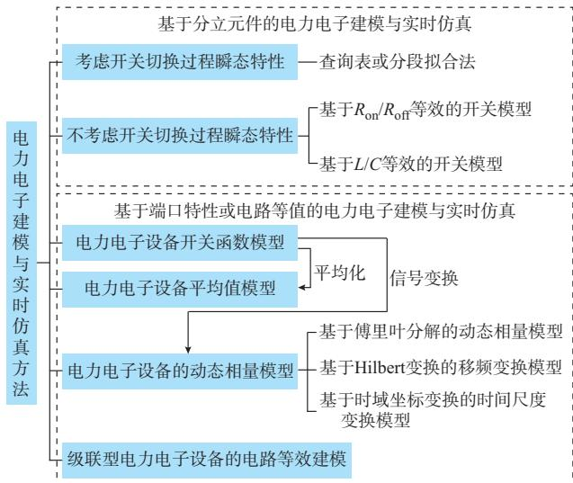
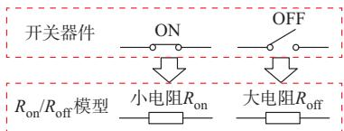
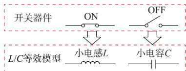
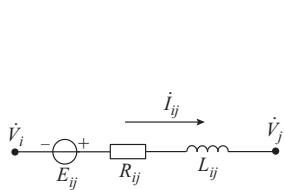
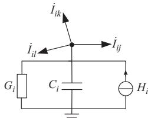

# 电力电子设备及含电力电子设备电力系统实时仿真研究综述

徐 晋，汪可友，李国杰

（电力传输与功率变换控制教育部重点实验室（上海交通大学），上海市 200240）

摘要：大量电力电子设备接入电力系统给电磁暂态实时仿真技术带来了巨大的挑战。文中从多个角度对电力电子设备和含电力电子设备电力系统实时仿真领域近年来的研究成果进行了综述。在应用场景和利用范式方面，除了硬件在环测试等对仿真实时性具有严格要求的场景，实时仿真还被用于其他单纯对仿真效率有较高要求的场景。在建模与仿真方法方面，无论是基于分立元件的建模仿真，还是基于端口特性或电路等值的电力电子设备建模仿真，都有商业化应用的案例，但如何兼顾高频、复杂设备实时仿真的效率和精度仍是当前研究的热点与难点。在实时仿真硬件平台方面，现场可编程门阵列（FPGA）和图像处理单元（GPU）等具有天然硬件并行性的计算芯片成为除CPU之外的重要选择，特别是FPGA正被越来越多的商业化平台所采用，但所用仿真算法大多基于传统框架，尚未能充分发挥FPGA的硬件架构优势。此外，电力电子设备和含电力电子设备电力系统实时仿真的算法并行性、强刚性与数值稳定性问题仍具有巨大的研究空间。

关键词：电力电子；电力系统；电磁暂态仿真；实时仿真

# 0 引 言

在“双碳”目标的驱动下，中国正在构建以新能源为主体的新型电力系统。在新能源发电比例不断提高的同时，电力电子设备的比例也在不断提高。为了提升电力电子设备的可靠性，保障新型电力系统的安全稳定运行，针对电力电子设备及含电力电子设备电力系统的实时仿真研究得到了越来越多的关注。

电力电子设备普遍具有响应速度快、过电流能力弱、低惯量或无惯量等特点，其大量接入改变了以同步机为主的传统电力系统的动态特性，使得不同时间尺度的暂态现象相互耦合，在更大的频率范围内引起新型振荡和稳定性问题［1］ 。同时，电力电子设备自身拓扑灵活多样、控制系统复杂，增大了研发和测试难度。对这些问题进行定量化的分析研究，更加依赖于电磁暂态建模与实时仿真技术。电磁暂态模型相较于机电暂态模型，能在更宽的时间尺度上描述电力电子系统的暂态特性［2］，而实时仿真相较于离线仿真，可以提高电力系统与电力电子研究的效率，甚至可用于电网的在线安全分析，也可以将仿真系统与实际装置联合运行，实现电力系统或电

力设备的半实物测试，提升系统测试真实性，缩短设备研发周期［3-4］ 。

然而，针对电力电子设备及含电力电子设备电力系统的实时仿真研究还面临着诸多挑战。首先，以电力电子为接口的电源单机容量通常远小于传统同步机组，还常以分布式发电的形式接入，故设备数量众多、分布广泛；而由于单个电力电子器件的耐压能力限制，在高电压场景下往往采用级联型的拓扑，造成电路模型复杂化，对每个元件进行详细描述会造成仿真的“维数灾”问题。其次，电力电子设备的大量接入还加剧了电力系统模型的刚性和非线性，也使得系统模型变为了同时含有连续和离散变量、多种时间尺度动态过程相互耦合的复杂系统，这些都加剧了仿真求解的难度。

目前，国内外学者已经积累了大量与电磁暂态建模与实时仿真相关的研究基础。20世纪60年代，Dommel教授提出了电力系统电磁暂态仿真理论并构建了电磁暂态仿真程序（electromagnetic transientprogram，EMTP）的基本框架，标志着这一领域的开端。而诞生于20世纪70年代的EMTDC则是首个可以精确仿真高压直流输电等电力电子化电力系统的电磁暂态仿真软件。到了 20世纪 90年代，加拿大 RTDS公司推出了商业化的电磁暂态实时仿真平台。之后30年间，电力系统的电磁暂态实时仿真研究从未中断，反而随着电力电子设备接入引发的

高频电磁暂态问题而受到了越来越多的重视。相关研究可以大致分为模型研究、仿真算法研究和仿真平台架构研究3个层面。本文对这些工作进行了梳理，选取了其中与电力电子设备及含电力电子设备电力系统的实时仿真高度相关的工作进行了综述。

# 1 电力电子电磁暂态仿真应用场景

在高比例电力电子设备接入的背景下，电磁暂态仿真所要面对的首要问题是如何针对种类繁多的电力电子设备进行建模。不同的应用场景对仿真模型的精度和效率有着不同的需求。按照研究对象和研究问题所处的物理尺度不同，可以将应用场景大致分为3个层级：器件级、设备级、电网级。

在器件级研究中，电磁暂态仿真的目的主要是针对具体类型的器件/模块，如广泛使用的绝缘栅双极 型 晶 体 管（insulated gate bipolar transistor，IGBT）等，描述其在不同温度、不同工况下的物理特性［5］ ，常用于器件的参数退化评估、热失效研究等。通常，这些应用场景并不要求仿真模型与物理实体的实时交互，因此，离线仿真基本可以满足需求。尽管已有相关学者研究并实现了器件级的实时仿真［6］，但其实际应用场景尚不明确，故在本文中不详细展开介绍。

在设备级研究中，相比于器件内部的物理特性，更加关注器件对外呈现的电气特性，以及研究对象的电路拓扑和控制策略是否能够实现预期的功能与性能指标。目前，针对设备级的实时仿真有较多应用场景，也催生了不少商业化实时仿真器。例如，新能源发电并网前，其逆变器的控制器实物需要接入实时电磁暂态仿真系统中进行半实物测试（又称为硬件在环测试），借此测试控制器性能能否满足并网标准。由于简化了器件内部复杂的物理过程，设备级实时仿真基本只保留了器件作为电路元件的特性，仿真算法也从“场”的计算简化为“路”的计算，主流的嵌入式平台即可满足设备级乃至小规模电网级的电磁暂态实时仿真需求。代表性的嵌入式实时仿真 平 台 有 Typhoon HIL、Plexim RT-Box 和 远 宽 能源的MT系列实时仿真器等。

在电网级研究与分析中，根据电力系统真实动态过程响应时间与系统仿真时间是否同步，可以将仿真分为实时仿真和非实时仿真；根据仿真的数据来源是否为当前调度系统的实时量测数据，以及是否直接用于在线预警和决策支持，又可分为在线仿真和离线仿真［7］ 。对于电网的设计规划与运行调度人员，通常更加关心高比例电力电子设备接入后电

网的安全稳定问题，因此，含电力电子设备的电磁暂态仿真主要用于：1）电网事故分析，也包括近年来频繁出现的宽频振荡分析；2）在线分析与动态安全检测等［8］ ；3）继电保护、稳定控制、励磁、直流控制等装置的半实物试验。其中，事故与振荡分析通常针对预想场景或历史场景，且没有与物理实体交互的需求，一般离线仿真即可满足分析需要；安全稳定在线分析通常对仿真效率有一定要求，但并不要求与实际时间的严格同步性，只需要在线仿真；而针对电网控制保护装置的半实物试验则只能基于实时仿真开展。电网级的研究中，通常不再关心电力电子设备的内部特性，因此，可以对设备内部电路做一些等效处理，甚至建立只描述外端口特性的设备模型。但由于通常涉及大规模电网，以及级联型电力电子设备，电路模型维度可能达到上万阶，因此，通常需要高性能服务器（群）才能满足实时仿真需求。代表性的高性能实时仿真平台有 RTDS公司的实时仿真器 RTDS、OPAL-RT 公司的 RT-LAB 及 Hypersim、中国电力科学研究院有限公司的ADPSS和清华大学的 CloudPSS 等。

# 2 电力电子电磁暂态建模与实时仿真方法

由于器件级模型通常较少进行实时仿真，因此，本文主要针对设备级和电网级应用场景下的电力电子电磁暂态建模与实时仿真方法进行介绍。根据设备内部的每个独立元件是否进行建模和解算，本章分别讨论基于分立元件的电力电子建模仿真方法和基于端口特性或电路等值的电力电子建模仿真方法，如图1所示。

  
图1 电力电子建模仿真方法分类  
Fig. 1 Classification of power electronic modeling and simulation methods

# 2. 1 基于分立元件的电力电子建模与实时仿真

基于分立元件的电力电子建模与实时仿真可以根据是否考虑开关切换过程中的瞬态特性，进一步分成以下2类。

# 2. 1. 1 考虑开关切换过程瞬态特性的建模仿真

器件在开关过程中的瞬态特性通常由产品手册给出，或由硬件实验测得，主要用于帮助评估设备的功率损耗和发热情况。在实时仿真中，这种瞬态特性通常可以通过查询表或分段拟合函数的方式存储下来［9-12］ ，而非从物理机理上去建模，故其本质上是一种行为模型。基于这种模型的实时仿真可以较为精细地展现开关切换过程中的电压电流上升、反向恢复和拖尾等现象，也可以较为精确地模拟出功率损耗，以及可用于热-电联合实时仿真，反映设备发热情况。这类实时仿真在电路求解时通常采用节点分析法，为了描述开关切换过程，仿真步长大约为10 ns级，这带来了巨大的计算压力，因此，需要借助现 场 可 编 程 门 阵 列（field programmable gate array，FPGA）等并行计算芯片进行加速。文献［13］基于冲量等效的原则构建了一种微秒级的电力电子建模仿真方法，放弃了对开关切换过程的精确模拟，但保证了和10 ns级仿真的损耗功率具有相同的积分面积，因此，也能反映设备的能量损耗情况。

目前，针对考虑开关切换过程瞬态特性的建模仿真主要用于评估设备的功率损耗和发热情况，多停留在实验研究阶段，仍缺少采用该种模型的商业化通用实时仿真平台。

# 2. 1. 2 不考虑开关切换过程瞬态特性的建模仿真

在部分设备级和电网级研究中，可以不考虑开关器件的瞬态特性，因此，可以用更为简单的线性元件去分别模拟开关器件在导通和关断状态下的伏安特性。例如，用于验证电力电子设备控制器有效性，研究电力电子对电网电磁暂态特性的影响等，就可以忽略器件的瞬态特性。

# 2.1.2.1 基于 $R _ { \mathrm { o n } } / R _ { \mathrm { o f f } }$ 等效的开关模型

基于 $R _ { \mathrm { o n } } / R _ { \mathrm { o f f } }$ 等效的开关模型如图2所示。在这种模型中，开关器件在导通状态下用一个小电阻 $R _ { \mathrm { o n } }$ 来 等 效 ，在 关 断 状 态 下 用 一 个 大 电 阻 $R _ { \mathrm { o f f } }$ 来 等效［14-15］。 当 $R _ { \mathrm { o f f } }$ 趋近于无穷大且 $R _ { \mathrm { o n } }$ 为零时， $R _ { \mathrm { o n } } / R _ { \mathrm { o f f } }$ 模型则变为了理想开关模型。该等效方法简单直观、易于实现，已被PSCAD/EMTDC等仿真软件广泛采用。但其缺点在于，每次开关动作后都需要重新形成系统等效导纳矩阵及其因子表，当模型阶数升高时会影响仿真效率。

  
图 2 基于 $\pmb { R _ { \mathrm { o n } } } / R _ { \mathrm { o f f } }$ 等效的开关模型示意图  
Fig. 2 Schematic diagram of switch model based on $\pmb { R _ { \mathrm { o n } } } / R _ { \mathrm { o f f } }$ equivalence

# 2.1.2.2 基于 $L / C$ 等效的开关模型

除了 $R _ { \mathrm { o n } } / R _ { \mathrm { o f f } }$ 模型，目前很多实时仿真采用了基于小电感（L）/小电容（C）等效的开关建模方法，如RTDS［16］、ADPSS-STS［17］、RT-LAB 的 eHS 电力电子求解器［18-19］ 等。基于 $L / C$ 等效的开关模型如图3所示。 $L / C$ 模型用一个小电感和小电容分别等效导通和关断状态下的开关器件。通过合理的 L、C参数设置，可以在仿真过程中保持系统导纳矩阵不变。

  
图3 基于L/C等效的开关模型示意图  
Fig. 3 Schematic diagram of switch model based on L/C equivalence

当 L和 C趋近于无穷小时，L/C模型也趋向于理想开关模型。但由于受硬件计算能力限制，仿真步长不能无限小，这些小电感和小电容通常远大于实际开关的寄生电感和寄生电容，开关状态切换时的暂态过程持续时间较实际情况更长，可能会产生远大于实际值的虚拟功率损耗，影响仿真精度。目前，针对L/C模型引起的人工振荡及其引起的虚拟功率损耗问题的抑制思路有：

1）增加阻尼电阻元件，并通过优化L/C模型中的等效电感、等效电容和阻尼电阻的参数来减小人工 振 荡［20-22］ ；  
2）通过设置开关模型状态切换后的初始电压、电流［23］ ，或者通过增加补偿电压源、电流源［17］ ，来减少对等效元件的充电过程，从而减小人工振荡；  
3）采用含待定参数的离散系统模型代替 $L / C$ 模型，利用响应匹配原则设置离散系统模型的参数，减小人工振荡［24-26］ 。

无论是 $R _ { \mathrm { o n } } / R _ { \mathrm { o f f } }$ 模型，还是 L/C模型，在节点分析法和状态空间法两大类电磁暂态仿真算法中都有实时仿真应用实例。例如，采用节点分析法的RTDS既有包含L/C模型的小步长模型库［16］ ，又有对 $R _ { \mathrm { o n } } / R _ { \mathrm { o f f } }$ 模型的支持［15］ ；采用状态空间法的远宽能

源 Modeling-Tech 实 时 仿 真 支 持 对 $R _ { \mathrm { o n } } / R _ { \mathrm { o f f } }$ 模型和L/C模型的混合仿真；采用混合仿真算法（状态空间节点法）的 RT-LAB 主要采用了 L/C 模型［18-19］ 。

不考虑开关瞬态过程的 $R _ { \mathrm { o n } } / R _ { \mathrm { o f f } }$ 模型和 L/C模型已经可以基本满足电力电子设备拓扑设计、控制策略验证等需求，仿真步长一般在微秒级，采用该种模型的商业化通用实时仿真器也较多。其中，L/C等效模型尽管被广泛应用于实时仿真，但仍存在诸多问题。例如，L/C模型在高频开关场景下的虚拟功率损耗会引起巨大的仿真误差，本文已介绍了不少相关研究。此外，关于二极管等不可控器件或半控器件无法快速进行开/关逻辑判断，以及仿真步长选取受模型参数限制不能过大等问题，都会严重影响 L/C模型的应用范围，却很少被提及，有待学者对其产生原因和解决方法进一步加以研究。

# 2. 2 基于端口特性或电路等值的电力电子建模与实时仿真

在电网级研究中，通常只需要考虑电力电子设备的端口电气特性，可以对内部复杂电路结构进行等值简化，常见的建模仿真方法有以下几种。

# 2. 2. 1 电力电子设备的开关函数模型

开关函数建模方法通常假设设备内的开关器件导通时为短路，关断时为开路，并引入表征开关状态的开关函数，进而根据不同开关状态下的主电路拓扑结构，列出包含开关函数的电路方程，实现设备建模［27-28］ 。开关函数模型描述了电力电子设备外端口的输入/输出特性，模型中没有表示开关的元件，节点数大幅减少，但相应地也就不能描述模型内部开关上的电压、电流特性。

# 2. 2. 2 电力电子设备的平均值模型

上文提到的几种建模方法，会详细刻画每次开关动作后的波形曲线，尽管保证了仿真的精度，但当开关动作频繁时会限制仿真步长大小，进而限制仿真效率。平均值模型通常是在开关函数模型的基础上，用变量在开关周期内的平均值代替其实际值［29-31］。采用平均值建模的方法，只需描述设备输入/输出端口的工频特性，忽略脉宽调制（pulsewidth modulation，PWM）产生的高次谐波，因而允许采用更大的仿真步长，通过牺牲一定的精度换取了仿真效率的大幅提升。

# 2. 2. 3 电力电子设备的动态相量模型

与前文采用瞬时值描述的模型不同，动态相量模型采用相量描述，其本质是将电磁暂态仿真中开

关函数表示的高频变化的瞬时值模型通过某种变换方法构造成慢变解析信号描述的动态相量模型。根据采用的变换方法，可以分为基于傅里叶分解的传统动态相量法［32-33］ 、基于 Hilbert变换的移频变换分析模型［34-36］和基于时域坐标变换的时间尺度变换模 型［37-38］ 。

同样会忽略部分高频谐波，动态相量模型与平均值模型的区别在于：

1）平均值模型的变量为实数，而动态相量模型一般为复数；  
2）平均值模型一般基于静止坐标系，而动态相量模型基于旋转坐标系；  
3）平均值模型只考虑直流分量和基波分量，而动态相量模型还可以考虑谐波分量。

动态相量模型既可以用状态空间法求解，也可以用节点分析法求解，可以采用更大的仿真步长，从传 统 的 10 μs 级 扩 大 到 100 μs 级 ，甚 至 是 1 000 μs级。这类大步长仿真方法是实现超大规模交直流混联电网全电磁实时仿真的重要思路之一。其中，基于 Hilbert变换和节点分析法的移频变换分析模型已被用于 CloudPSS 等仿真软件/平台［35，39］ 。

# 2. 2. 4 级联型电力电子设备的电路等效建模

对于拓扑结构简单的电力电子设备，可以对每个开关器件采用行为模型进行建模，从而得到设备的完整模型。而对于高电压、大容量的设备，通常由众多结构相同的电路模块级联构成，电路元件动辄成千上万。因此，对于这些级联型设备，可以采用内部电路等效的建模方式，消去内部电路节点，降低整体模型阶数。

模 块 化 多 电 平 换 流 器（modular multilevelconverter，MMC）的每个桥臂就是由多个结构相同的子模块级联构成。子模块的结构可以分为半 H桥型、全H桥型和钳位双子模块型等。对电平数较多的 MMC，一般将其每个桥臂表示为一个戴维南等效电路（或诺顿等效电路），其等效电阻和历史电压源（或等效电导和历史电流源）的大小采用该桥臂上导通子模块数量的函数来描述。这种桥臂等效的MMC建模方法被用于柔性直流输电系统、柔性交流输电系统或电气化铁路牵引系统等复杂系统的研 究［40-43］ 。

除 了 MMC，固 态 变 压 器 （solid statetransformer，SST）也常采用多个子模块级联的形式，常见的子模块结构有双有源桥、单有源桥、级联

H 桥型双有源桥以及多有源桥等。类似 MMC，级联型SST也可以采用这种电路等效的建模方式［44］ 。随着越来越多的复杂级联型电力电子拓扑被提出，仍有待学者提出一种通用的内部电路等效建模方法论。

# 3 实时仿真的并行化算法

对于电磁暂态仿真而言，仅采用合适的仿真模型和基本算法可能还不足以满足实时性的要求。因此，本章将介绍电力电子设备及含电力电子设备电力系统实时仿真的并行化算法加速方法。

# 3. 1 基于子网解耦的并行化仿真

子网解耦的并行化仿真是将电网模型分割为多个子网并行求解的方法，在求解过程中多个子网持续进行数据交换，保证并行计算结果收敛和数值稳定。这类方法在传统电力系统电磁暂态仿真中已有大量研究，具体包括：传输线解耦法［45］ 、多区域戴维南等效法［46-48］、节点分裂法［49-50］等。这些分割方法大多针对节点分析法设计，通过子网解耦，可以将一个巨大的节点导纳矩阵变成若干个相对较小的节点导纳矩阵，在一定程度上降低了求解节点电压方程的计算量或预存储压力。

针对含电力电子设备电力系统的多时间尺度特性，有学者设计了多速率的分割方法，对不同子网采用不同的仿真步长，以兼顾效率和精度的需求［51-52］ 。不同子网可以采用不同的仿真类型，其中，机电-电磁混合仿真［53-55］是研究最多的混合仿真方法之一。其基本思想是对含高比例电力电子设备的子网采用电磁暂态仿真，对传统设备为主的子网采用机电暂态仿真，从而充分结合2种仿真方法的优势，较好地兼顾了电力电子系统研究的精度需求和大规模电网仿真的效率需求。此外，还有学者研究了动态相量-机电混合仿真［56-58］、动态相量-电磁混合仿真［59］、移频法-机电混合仿真［60］ 等混合仿真方法。

# 3. 2 基于延迟插入法的细粒度并行化仿真

无论是节点分析法，还是状态空间法，本质上都是集中式的仿真方法。对于恒导纳情况，其数值复杂度为电路规模的三阶函数，而对于变导纳情况为二阶函数。

为了克服仿真计算量随仿真规模增大加速增大的限制，电路领域学者受时域有限差分法启发，针对复杂电路典型的结构特点，提出了一种细粒度并行化 仿 真 方 法 —— 延 迟 插 入 法（latency insertionmethod，LIM）［61］ ，并被电气领域学者加以研究和改

进，应用于输电网络［62］、微电网［63-64］等系统的实时仿真。

延迟插入法将电路网络或电力网络分割成图4所示的基本单元。其中，每条节点间支路必须包含一个电感，如图 4（a）所示；每个节点必须有一个对地电容，如图 4（b）所示。图中， $E _ { i j } \setminus R _ { i j } \setminus L _ { i j }$ 分别为节点 i和节点 j间支路的等效电压源、电阻、电感；Hi、G、C 分别为节点i对地支路的等效电流源、电导、电容。仿真循环开始后，依次根据两端节点电压V 和$\dot { V _ { j } }$ 更新支路电感上的电流 $\dot { I } _ { i j } ,$ ，然后根据节点的注入电流更新节点电容电压，节点间支路和节点对地支路的解算交替进行，且解算过程只需要知道相邻网络单元状态，实现了分布式计算。

  
(a)节点间支路

  
(b)节点对地支路   
图4 延迟插入法中的网络基本单元  
Fig. 4 Basic units of network in latency insertion method

延迟插入法是元件级的并行化仿真方法，其数值复杂度与规模成正比，不仅计算量小，且易于在FPGA等并行化计算芯片上实现。但为了保证数值稳定性，该方法对电路拓扑结构、参数和仿真步长具有较为严格的要求。为了将其应用于含电力电子设备的实时仿真，文献［63］基于延迟插入法构建了buck、boost电路和三相逆变器的开关函数模型，并实现了40 ns步长的直流微电网元件级并行化实时仿真；文献［64］为了实现基于分立元件模型的微电网实时仿真，设计了一种节点分析法和延迟插入法的混合算法，并实现了380 ns步长的交流微电网设备级并行化实时仿真。

# 3. 3 并行化算法的实现

实时仿真的并行化通常需要结合具体硬件平台架构进行设计。例如，子网解耦的并行化方法通常会将分割后的各个子网交由不同的计算单元分别求解，由于分割后的子网数目通常不会太大，这里的计算单元可以是一个 CPU 核心，也可以是一台计算机。而对于基于延迟插入法的并行化，其并行子任务的数目有可能高达上万个，通常会采用自带大量并行计算单元的计算芯片，常见的有图像处理单元（graphic processing unit，GPU）和 FPGA 等。

# 4 实时仿真的硬件实现

# 4. 1 基于高性能计算机的实时仿真

由于核心数和单个核心计算能力有限，对于超大规模电力系统的实时仿真，需要将计算任务分配给多台高性能服务器组成的计算机集群，才能实现全系统的电磁暂态实时仿真。例如，ADPSS［65］、RTDS［66］ 、HYPERSIM［67］ 等实时仿真平台都支持计算机集群的并行化方案。此外，由于高性能仿真设备价格昂贵，为了充分利用其他实验室的空闲硬件资源，上述实时仿真器基本可以实现与远方的空闲实时仿真器进行分布式的实时仿真［68］ 。

由于不同计算机间的数据交换必然存在通信延迟，通信延迟的大小和分网接口的数值稳定性就成为这类研究的关键［69］。中国电力科学研究院有限公司提出的新一代特高压交直流电网仿真平台NGSP［70］将采用超级计算机多核并行架构，实现海量信号的汇集，以解决计算机集群接口因信号量大造成的交互阻塞及延时大的问题。

# 4. 2 基于GPU的实时仿真

基于子网解耦的并行化仿真拆解出的并行任务数量不大，且分网过多可能引起数值稳定性问题，因此，该类方法本质上是一种粗粒度的、模型层面的并行化方法。对于细粒度的、底层数值算法层面的并行化，则往往需要基于具备天然并行架构的硬件进行加速，如 等［71-75］ 。

例如，文献［74］对含柔性直流输电的大规模电力系统进行了粗粒度和细粒度2级并行化处理。首先，整个系统模型通过传输线延迟和控制延迟被粗粒度地解耦为若干线性子系统、非线性子系统和控制系统。线性子系统又通过细粒度的补偿网络解耦分割成多个线性块，而非线性子系统通过细粒度的雅可比域解耦分割成多个非线性块，最终实现了基于 GPU的大规模并行化仿真。文献［72］基于节点分析法，将含光伏的大规模配电网电磁暂态仿真过程分为非线性模型更新诺顿等效电路参数、计算元件历史电流、计算节点电压方程3个步骤，并分别针对前2个步骤提出了基于分层有向图的异构计算和基于积和熔加运算的同构计算，同样实现了基于GPU的大规模并行化仿真。文献［71］则针对电磁暂态仿真中的稀疏线性方程组的求解，分别从矩阵分块排序、并行化 LU 分解算法角度研究了基于GPU的并行仿真。相比于 CPU，GPU具有更多并行化的计算单元，计算能力更强。但由于GPU的控

制逻辑能力较弱，通常仍需要CPU对整体算法流程进行控制。例如，文献［75］在5 μs步长下实现了基于GPU的含多端口柔性直流输电的交直流电网实时仿真，将模块化多电平换流器的 6个桥臂分别分配给 6个 GPU 内核进行仿真，并由 CPU 线程进行统一调度。

除了见诸文献报道，基于GPU的实时仿真也已经在 CloudPSS等仿真平台上得到了应用，实现了对大规模系统和海量计算场景的细粒度并行加速。

# 4. 3 基于FPGA的实时仿真

相比于GPU，FPGA也具有大量并行化的计算单元和逻辑单元［76］ ，而且具有丰富的硬件接口和更低的通信延迟，便于实现硬件在环测试。因此，被广大实时仿真技术公司所青睐，如 OPAL-RT公司推出的eHS电力电子求解器［77］ 、中国电力科学研究院有限公司推出的ADPSS-STS电力电子小步长仿真器［78］等，都是基于 FPGA 开发的、专门针对电力电子 系 统 的 实 时 仿 真 模 块 。 而 Typhoon HIL、Modeling-Tech实时仿真器等嵌入式实时仿真平台，也是基于含 FPGA硬件资源的 Zynq芯片进行开发的。但FPGA在相同计算能力的条件下，硬件价格成本更高，且开发过程仍有硬件电路设计的特点，开发时间成本也更高。

在仿真平台架构设计方面，文献［79］讨论了多种基于CPU和FPGA的401电平MMC实时仿真硬件平台方案的可行性，其中具有更少通信数据的CPU-FPGA异构计算方案表现出更好的实时性能。文献［80］设计了一种基于多 FPGA 的电力电子实时仿真器，多块FPGA分别作为主仿真模块和各种I/O 模块，以减少 I/O 电路对主仿真模块 FPGA 的资源消耗。文献［81-82］分别设计并开发了基于多FPGA的、具有多层级并行架构的有源配电网实时仿真器，以及不同步长下电气系统与控制系统的仿真时序和交互方法。文献［83］设计了一种基于FPGA 和 MPSOC（同时含有 FPGA 资源和 ARM 片上多处理器系统）的直流电网实时仿真平台，其中FPGA负责直流电网和环流系统的电磁暂态仿真，而MPSOC负责MMC系统级和阀级控制系统和交流系统的仿真。文献［84］评估了采用高级编程语言实 现 FPGA 硬 件 开 发 的 高 层 次 综 合（high-levelsynthesis，HLS）法在亚微秒级换流器实时仿真器开发中的可行性。分析结果表明，只有当系统规模较小且时钟频率不大于100 MHz时才具备可行性。

在针对FPGA平台的仿真算法改进方面，文献

［63，85］针对基于 FPGA 的船舰电力系统实时仿真，分别采用了基于延迟的线性多部合成法和延迟插入法对系统模型进行解耦，以实现50 ns级的高度并行化实时仿真。文献［86］则在此基础上，提出节点分解法用于多 FPGA 实时仿真的网络分割。文献［87］针对高频固态变压器实时仿真，将基于节点分析法的传统电磁暂态仿真算法中的串行步骤进行了合并压缩，设计了一种紧凑型电磁暂态仿真算法。文献［64］则设计了一种紧凑型电磁暂态仿真算法和延迟插入法的混合算法。特别地，针对采用$R _ { \mathrm { o n } } / R _ { \mathrm { o f f } }$ 开关模型的实时仿真，文献［88］在实现高频中点钳位式三电平换流器实时仿真时，采用了网络撕裂法对大型拓扑进行分割，极大地降低了导纳矩阵的存储压力。而文献［89］针对基于 FPGA 的换流器电磁暂态实时仿真，提出一种高效的矩阵求解方法，避免了预存储法对采用 $R _ { \mathrm { o n } } / R _ { \mathrm { o f f } }$ 模型的仿真规模限制，对三相背靠背换流器节点电压方程计算时间降为 36 ns左右。文献［90］针对含多换流器的电力系统实时仿真，提出了一种重新描述的改进节点法和开关网络分区法，用于网络和元件模型的并行化。

不同硬件加速方式各有优劣，也决定了它们各自不同的应用场景。高性能计算机上更容易实现复杂仿真算法以及复杂模型的开发维护，更容易和Simulink等上下游软件形成相互兼容的工具链，且易于扩展，便于大规模系统仿真。因此，以电力系统仿真为主的商业化平台通常基于高性能计算机开发。而以电力电子设备仿真为主的商业化平台通常需要支持硬件在环测试，因此，大多基于接口延迟更低的 FPGA 或同样包含可编程逻辑单元的 SoC（system-on-chip）进行开发。

近年来，很多电力系统实时仿真平台为了满足电力电子化背景下的研究需求，会在基于高性能计算机的实时仿真主机之外，提供基于FPGA的电力电子实时仿真模块，作为电力电子设备及含电力电子设备电力系统的实时仿真解决方案。相比之下，GPU则较少应用于商业化实时仿真平台，已知仅有CloudPSS采用了该种硬件加速方案。技术上的原因可能在于大规模系统仿真时，GPU 和 CPU 间的大量数据交换的通信延迟会在一定程度上抵消GPU带来的加速效果。

基于 的实时仿真成为近年来的研究热点。但目前的研究大多基于特定应用场景开展，且基本沿用了针对CPU设计的传统仿真算法，缺乏针

对 FPGA 天然并行性架构设计的通用并行化仿真算法研究，仅仅实现了数据并行，尚未充分实现算法层面的流水线并行，仍有较大的理论研究空间。

# 5 强刚性与数值振荡等问题

# 5. 1 从刚性系统到混杂系统

传统电力系统就已经是一个包含了微秒级、毫秒级电磁暂态和秒级机械动态等不同时间尺度动态过程的刚性系统，而电力电子设备的大量接入则进一步加强了系统的刚性。电力电子器件在开关事件的极短时间间隔内，会发生纳秒级时间尺度的电磁能量瞬变过程。若将这一过程视为“瞬时”发生的离散事件，则此时电力系统不仅是一个强刚性系统，还是一个由连续时间动态和离散事件动态相互耦合、相互作用形成的混杂系统［91-92］ 。

目前，针对连续的电力系统模型数字仿真，已经形成了一系列以微分方程数值解法为核心的理论和方法［45］ 。一类以 SimPowerSystems 为代表，采用状态变量分析法；另一类以 EMTP为代表，采用数值积分代换法（动态元件用差分化后形成的等效导纳与历史电流源并联的电路表示）。特别地，针对强刚性的连续系统，则可以在上述 2类仿真算法基础上进行改进，如多速率仿真［51-52］ 、变步长仿真［93］ 、小步长合成仿真［94］等。这些算法有适用于刚性系统的数值计算方法作为理论支撑。

然而，将含高比例电力电子设备的电力系统视为混杂系统的仿真方法的理论研究尚处于起步阶段。文献［95-96］从电力电子系统的多时间尺度混杂特性出发，提出一类离散状态事件驱动仿真方法，以实现系统多时间尺度动力学行为的准确、高效仿真。目前，该类方法主要应用于设备级仿真，尚未见到在电网级仿真中的应用。

# 5. 2 电力电子开关的插值算法

电力电子开关的插值算法可以视为一种应对混杂系统仿真中离散事件的处理方法。

传统电磁暂态仿真的步长一般在10~100 μs之间。而电力系统中常见的电力电子设备开关频率从几千赫兹到几百千赫兹不等，这意味着开关周期最小只有几微秒。若不采取措施，将不得不大幅减小仿真步长以精确定位开关动作时间。而通过采用插值算法，可以在检测到开关动作后重新返回到开关动作的时间区间，寻找电压过零或电流过零时刻来确定精确开关动作时刻，使得仿真在不缩小步长的情况下仍有较高精度。相关研究主要关注插值算法

的效率、精度、数值稳定性问题以及处理多重开关的能力［97-98］ 。带开关插值的仿真算法由于开关动作时刻的计算量明显大于其他时刻，且需要重新计算过去时刻的状态，故主要被应用于离线仿真，但也有将其用于实时仿真的尝试［99-100］ 。

# 5. 3 电力电子开关与数值振荡

电磁暂态仿真的数值振荡问题本质上是数值积分方法的问题（常用的隐式梯形法不具备 L 稳定性）［101］ 。含断路器等离散元件的传统电力系统也会存在［45］ ，但高比例的电力电子设备引入了大量高频离散器件，更容易触发数值振荡。后退欧拉法是单步、低阶、L稳定的数值积分算法，可以从根源上避免数值振荡，被电力电子实时仿真器普遍采用。而其他关于在实时仿真中如何消除数值振荡的研究较少见诸于文献，可以参考传统电磁暂态仿真中的振荡抑制方法，但其在实时仿真中的适用性仍有待进一步研究。传统电磁暂态仿真程序 EMTP采用的是 临 界 阻 尼 调 整（critical damp adjustment，CDA）法［102-103］ ，其原理为仅在开关动作时用后向欧拉法代替梯形积分法。文献［104］提出了一种具有更高精度的改进临界阻尼调整法。

在其他具有天然阻尼特性的数值积分算法方面，文献［105-107］分别将具有 L稳定的 2级 2阶单对 角 隐 式 Runge-Kutta 方法、非 线 性 B 稳定的 2 级3阶单对角隐式Runge-Kutta方法和无限稳定的3步4阶隐式泰勒级数法用于电磁暂态仿真。文献［108-109］提出一种基于指数项有理分式拟合的网络差分化算法，在选取合适参数情形下具有L稳定性。而文献［110］则是通过零极点响应匹配在频域内构造与连续系统相似的离散系统，避免了直接在时域内差分化引入的数值振荡模态，故又被称为根匹配法。

# 6 仿真利用范式的发展变化

# 6. 1 基于实时仿真的硬件在环测试

年， 公司推出了电磁暂态实时仿真器，极大地提升了电力系统电磁暂态分析的效率，也扩展了对仿真技术的利用范式。

由于仿真器中的虚拟时间和现实时间严格同步，可以实现虚拟仿真模型与实际物理设备的联合仿真，一般被称为硬件在环仿真或半实物仿真［3］。仅控制与保护系统作为被测实物对象的，被称为控制硬件在环［40］ ，而被测实物对象中包括大功率强电设备的，则被称为功率硬件在环［111］ 。硬件在环仿真相比于纯数字实时仿真，运行环境更加贴近实际现

场，相比于全实物样机测试，更加灵活、安全、经济，有效填补了电力电子设备及其控制保护装置在方案设计阶段与完整样机研制阶段之间的测试技术的空白，缩短了方案的迭代周期，是对电磁暂态仿真技术利用范式的重要扩展。

# 6. 2 其他利用范式

实时仿真因其严格的时间同步性优势，不仅可以在设计测试阶段被用于硬件在环测试，还可以在实际运行阶段被用于电力电子设备的在线监测、故障诊断或故障容错控制中。例如，文献［112］在换流器的嵌入式控制系统中建立了由虚拟换流器和虚拟滤波电路组成的数字孪生模型，与实际换流器一同接收 PWM 后的开关信号，并可以代替实际滤波电路出口的电流传感器向控制模块提供电流信号，以避免因传感器失灵导致的控制失效。文献［113］则在控制系统中建立了考虑元件参数随机性的虚拟电力电子系统，并且能根据实际系统运行状态进行实时修正，并根据实时仿真结果与实际量测结果的实时对比，提供运行异常检测、设备在线诊断等功能。

此外，由于实时仿真技术的普及，以及其在仿真速度上的优势，还被用于没有时间同步性需求的应用场景中。例如，面向电网概率安全评估的蒙特卡洛仿真［114］ ，以及面向宽频振荡模态分析的频率扫描仿真［115］ 等。

# 7 结语

近年来，电力电子设备自身特性及其对电力系统的影响得到了广泛而深入的研究，与之相随的是对电力电子设备及含电力电子设备电力系统实时仿真的巨大需求。然而，拓扑结构迥异、运行方式多变的各类电力电子设备不仅给建模带来了巨大挑战，在改变电力系统物理特性的同时，也深刻改变了系统模型的数学特性。在这一背景下，大量学者选择采用新的硬件平台，并对仿真算法进行了创新，使得用户在面对不同场景与需求时，拥有众多的仿真方案可以选择。

电力系统实时仿真平台研发具有前期投入大、回报周期长的特点。国外几家大型实时仿真技术公司凭借先发优势，在这一领域形成了深厚的技术积累，培养了良好的用户生态，逐渐确立了垄断地位。然而，这并非意味着国产实时仿真平台没有迎头赶上的机会。就电力行业内部而言，电力系统是不断变化的，从同步机和输电线路组成的交流电网到高

比例新能源和海量电力电子设备接入的交直流混联电网。实时仿真的应用需求也是不断丰富的，从控制保护装置测试拓展到电力系统在线分析诊断等。就电力行业外部而言，计算机技术和芯片技术的快速发展，也给实时仿真硬件平台实现方案提供了更多样化的可能。而打补丁式的仿真平台研发思维很难带来巨大的突破，沿着国外公司的技术路线追赶也无助于弯道超车，只有充分运用第一性原理，针对电力电子设备及含电力电子设备电力系统的物理特性与实际需求，重新设计仿真算法和平台架构，才可能发挥在技术路线灵活性方面的后发优势，以更快的速度适应当前实时仿真技术的市场需求。

在制度和政策层面，国内电力行业可以考虑将基于实时仿真的测试评估技术纳入新能源发电和电力电子设备并网标准，一方面保障新能源和电力电子设备的有序接入，另一方面促进实时仿真测试流程的规范化，这样不仅扩大了实时仿真的市场需求，而且利于国内实时仿真技术行业的良性发展。

本文研究得到了国家自然科学基金项目(52107113,51877133)的资助，特此感谢！

# 参 考 文 献

［1］马宁宁，谢小荣，贺静波，等 .高比例新能源和电力电子设备电力系统的宽频振荡研究综述［J］.中国电机工程学报，2020，40（15）：4720-4732.MA Ningning，XIE Xiaorong，HE Jingbo，et al. Review of wide-band oscillation in renewable and power electronics highlyintegrated power systems［J］. Proceedings of the CSEE，2020，40（15）：4720-4732.  
［2］訾鹏，李轶群，谭贝斯，等 .大电网仿真工具现状及其在华北电网推广应用的思考［J］.电力自动化设备，2019，39（9）：199-205.ZI Peng，LI Yiqun，TAN Beisi，et al. Current situation of large-scale power grid simulation tools and their popularization andapplication in North China Power Grid ［J］. Electric PowerAutomation Equipment，2019，39（9）：199-205.  
［3］OMAR FARUQUE M D，STRASSER T，LAUSS G，et al.Real-time simulation technologies for power systems design，testing，and analysis［J］. IEEE Power and Energy TechnologySystems Journal，2015，2（2）：63-73.  
［4］GUILLAUD X， FARUQUE M O， TENINGE A， et al.Applications of real-time simulation technologies in power andenergy systems ［J］. IEEE Power and Energy TechnologySystems Journal，2015，2（3）：103-115.  
［5］段耀强，罗毅飞，肖飞，等.大功率IGBT基区物理模型的非准静态建模方法综述［J］.高电压技术，2019，45（7）：2062-2073.DUAN Yaoqiang，LUO Yifei，XIAO Fei，et al. Review of non-quasi static modeling method in the base region of high powerIGBT［J］. High Voltage Engineering，2019，45（7）：2062-2073.

［6］马晓军，杨宗民，刘春光，等.电力电子器件的实时仿真［J］.电力系统自动化，2013，37（18）：108-112.  
MA Xiaojun，YANG Zongmin，LIU Chunguang，et al. Real-time simulation of power electronic devices［J］. Automation ofElectric Power Systems，2013，37（18）：108-112.  
［7］田芳，黄彦浩，史东宇，等 .电力系统仿真分析技术的发展趋势［J］. 中国电机工程学报，2014，34（13）：2151-2163.  
TIAN Fang，HUANG Yanhao，SHI Dongyu，et al. Developing trend of power system simulation and analysis technology［J］. Proceedings of the CSEE，2014，34（13）：2151-2163.   
［8］田芳，李亚楼，周孝信，等.电力系统全数字实时仿真装置［J］.电网技术， ，（ ）： -  
TIAN Fang，LI Yalou，ZHOU Xiaoxin，et al. Advanced digitalpower system simulator［J］. Power System Technology，2008，32（22）：17-22.  
［9］MYAING A，DINAVAHI V. FPGA-based real-time emulation of power electronic systems with detailed representation of device characteristics［C］// 2011 IEEE Power and Energy Society General Meeting，July 24-28，2011，Detroit，USA：1-11.   
［10］SHEN Z X，DINAVAHI V. Real-time device-level transient electrothermal model for modular multilevel converter on FPGA ［J］. IEEE Transactions on Power Electronics，2016，31（9）： 6155-6168.   
［11］PARMA G G， DINAVAHI V. Real-time digital hardware simulation of power electronics and drives［C］// 2007 IEEE Power Engineering Society General Meeting， June 24-28， 2007，Tampa，USA.   
［12］BLANCHETTE H F，OULD-BACHIR T，DAVID J P. A state-space modeling approach for the FPGA-based real-time simulation of high switching frequency power converters［J］. IEEE Transactions on Industrial Electronics，2012，59（12）： 4555-4567.   
［13］苏杭，徐晋，汪可友，等.考虑变换器损耗特性的小步长实时仿真方法［J］. 中国电机工程学报，2021，41（5）：1840-1851.SU Hang，XU Jin，WANG Keyou，et al. Small time-step real-time simulation method considering converter loss characteristics［J］. Proceedings of the CSEE，2021，41（5）：1840-1851.  
［14］林畅，纪锋，彭逸轩，等.一种面向实时仿真的两电平VSC建模方法［J］. 中国电机工程学报，2021，41（9）：3056-3065.LIN Chang，JI Feng，PENG Yixuan，et al. A two-level VSCmodeling method for real-time simulation［J］. Proceedings of theCSEE，2021，41（9）：3056-3065.  
［15］MAGUIRE T， ELIMBAN S， TARA E， et al. Predicting switch ON/OFF statuses in real time electromagnetic transients simulations with voltage source converters［C］// 2018 2nd IEEE Conference on Energy Internet and Energy System Integration，October 20-22，2018，Beijing，China：1-7.   
［16］MAGUIRE T，GIESBRECHT J．Small time-step（≤2μSec）VSC model for the real time digital simulator［C］// IPSTInternational Conference on Power Systems Transients，June- ， ， ， ： -  
［17］MU Q，LIANG J，ZHOU X X，et al. Improved ADC model

of voltage-source converters in DC grids ［J］. IEEETransactions on Power Electronics， 2014， 29（11）： 5738-5748.  
［18］OPAL-RT Technologies. Real-time simulation for power electronics on FPGA［EB/OL］. ［2021-02-19］. https：//www. opal-rt. com/wp-content/themes/enfold-opal/pdf/L00161_0267. pdf.   
［19］DUFOUR C，MAHSEREDJIAN J，BÈLANGER J，et al. An advanced real-time electro-magnetic simulator for power systems with a simultaneous state-space nodal solver［C］// 2010 IEEE/PES Transmission and Distribution Conference and Exposition：Latin America（T&D-LA），November 8-10， 2010，Sao Paulo，Brazil：349-358.   
［20］穆清，周孝信，王祥旭，等.面向实时仿真的小步长开关误差分析和参数设置［J］.中国电机工程学报，2013，33（31）：120-129.MU Qing， ZHOU Xiaoxin， WANG Xiangxu， et al. Erroranalysis and parameters of switches in small step simulation forreal-time simulation［J］. Proceedings of the CSEE，2013，33（31）：120-129.  
［21］GUO X Z，YUAN J Q，TANG Y G，et al. Hardware in the loop real-time simulation for the associated discrete circuit modeling optimization method of power converters ［J］. Energies，2018，11（11）：3237.   
［22］SONG Y K， CHEN L J， CHEN Y， et al. A general parameter configuration algorithm for associate discrete circuit switch model［C］// 2014 International Conference on Power System Technology，October 20-22，2014，Chengdu，China： 956-961.   
［23］DUFOUR C. Method and system for reducing power losses and state-overshoots in simulators for switched power electronic circuit：US9665672［P］. 2017-05-30.   
［24］徐晋，汪可友，李国杰，等.基于参数化历史电流源的广义小步长开关模型［J］.中国电机工程学报，2018，38（6）：1647-1654.XU Jin，WANG Keyou，LI Guojie，et al. A general small time-step model based on the parameterized history current sources［J］. Proceedings of the CSEE，2018，38（6）：1647-1654.  
［25］徐晋，汪可友，李国杰，等.基于响应匹配的电力电子换流器恒导纳建模［J］. 中国电机工程学报，2019，39（13）：3879-3889.XU Jin，WANG Keyou，LI Guojie，et al. Fixed-admittancemodeling of power electronic converters using response-matching technique［J］. Proceedings of the CSEE，2019，39（13）：3879-3889.  
［26］WANG K Y，XU J，LI G J，et al. A generalized associated discrete circuit model of power converters in real-time simulation ［J］. IEEE Transactions on Power Electronics，2019，34（3）： 2220-2233.   
［27］范哲意，张明新，周治国，等.电压源换流器闭环控制的实时联合仿真［J］. 高电压技术，2016，42（10）：3328-3335.FAN Zheyi，ZHANG Mingxin，ZHOU Zhiguo，et al. Real-time co-simulation for voltage source converter closed-loopcontrol［J］. High Voltage Engineering，2016，42（10）：3328-3335.

［28］朱建鑫，胡海兵，陆道荣，等 .应用于级联 STATCOM 的高精度低成本全 FPGA 实时仿真模型研究［J］. 电工技术学报，，（ ）： -ZHU Jianxin，HU Haibing，LU Daorong，et al. The researchon fully FPGA-based real-time simulation with high fidelity andlow cost for the cascaded STATCOM［J］. Transactions ofChina Electrotechnical Society，2019，34（4）：777-785.  
［29］舒德兀，李琰，张春朋，等.基于幅值分布函数的换流器平均化模型及其应用［J］.电力系统自动化，2016，40（15）：73-78.SHU Dewu，LI Yan，ZHANG Chunpeng，et al. Converteraveraged model based on amplitude distribution function and itsapplications［J］. Automation of Electric Power Systems，2016，40（15）：73-78.  
［ ］袁义生，毛凯翔，袁世英 电力机车 中直流母线电压的大信号建模及分析［J］.电力系统保护与控制，2019，47（4）：83-90.YUAN Yisheng， MAO Kaixiang， YUAN Shiying. Largesignal modeling and analysis of DC-bus voltage of powerelectronic transformer applied in electric locomotive［J］. PowerSystem Protection and Control，2019，47（4）：83-90.  
［31］张爱军，邢华栋，任思宇，等.互联多端口电力电子变压器的建模与仿真技术［J］.南方电网技术，2020，14（8）：66-75.ZHANG Aijun，XING Huadong，REN Siyu，et al. Modelingand simulation technology of interconnected multi-port powerelectronic transformer ［J］. Southern Power SystemTechnology，2020，14（8）：66-75.  
［32］王钢，李志铿，李海锋，等.交直流系统的换流器动态相量模型［J］.中国电机工程学报，2010，30（1）：59-64.WANG Gang，LI Zhikeng，LI Haifeng，et al. Dynamic phasormodel of the converter of the AC/DC system［J］. Proceedings， ， （ ）： -  
［33］姜宽，王慧芳，林达，等.面向逆变器型分布式电源的快速建模与仿真方法［J］.电力系统自动化，2017，41（12）：13-19.JIANG Kuan， WANG Huifang， LIN Da， et al. Rapidmodeling and simulation method for inverter-interfaceddistributed generators ［J］. Automation of Electric PowerSystems，2017，41（12）：13-19.  
［34］GAO F， STRUNZ K. Frequency-adaptive power system modeling for multiscale simulation of transients ［J］. IEEE Transactions on Power Systems，2009，24（2）：561-571.   
［35］ZHANG P，MARTI J R，DOMMEL H W. Shifted-frequencyanalysis for EMTP simulation of power-system dynamics［J］.IEEE Transactions on Circuits and Systems Ⅰ ： RegularPapers，2010，57（9）：2564-2574.  
［36］HUANG Y W，CHAPARIHA M，THERRIEN F，et al. A constant-parameter voltage-behind-reactance synchronous machine model based on shifted-frequency analysis［J］. IEEE Transactions on Energy Conversion，2015，30（2）：761-771.   
［37］姚蜀军，韩民晓，黄闻而达 .基于时间尺度变换的大步长电磁暂态仿真［J］.中国电机工程学报，2019，39（2）：436-446.YAO Shujun，HAN Minxiao，HUANG Wenerda. A large timestep electromagnetic transients simulation based on time-scale-frame transformation［J］. Proceedings of the CSEE，2019，39

（2）：436-446.  
［38］FAN S T，DING H. Time domain transformation method foraccelerating EMTP simulation of power system dynamics［J］.IEEE Transactions on Power Systems，2012，27（4）：1778-1787.  
［39］LIU Y，SONG Y K，YU Z T，et al. Modeling and simulation of hybrid AC-DC system on a cloud computing based simulation platform—CloudPSS［C］// 2018 2nd IEEE Conference on Energy Internet and Energy System Integration，October 20- 22，2018，Beijing，China：1-6.   
［ ］王宇，刘崇茹，李庚银 基于 的模块化多电平换流器实时仿真建模与硬件在环实验［J］.中国电机工程学报，2018，38（13）：3912-3920.  
WANG Yu，LIU Chongru，LI Gengyin. FPGA-based real-time modeling of modular multilevel converters and hardware-in-the-loop simulation［J］. Proceedings of the CSEE，2018，38（13）：3912-3920.  
［41］张宏俊，郝正航，陈卓，等.适用于模块化多电平换流器实时仿真的建模方法［J］.电力系统自动化，2017，41（7）：120-126.  
ZHANG Hongjun， HAO Zhenghang， CHEN Zhuo， et al.Modeling method for real time simulation of modular multilevelconverter［J］. Automation of Electric Power Systems，2017，41（7）：120-126.  
［42］LI W， BÈLANGER J. An equivalent circuit method formodelling and simulation of modular multilevel converters inreal-time HIL test bench［J］. IEEE Transactions on PowerDelivery，2016，31（5）：2401-2409.  
［43］LIANG T，DINAVAHI V. Real-time device-level simulation of MMC-based MVDC traction power system on MPSoC［J］. IEEE Transactions on Transportation Electrification，2018，4 （2）：626-641.   
［44］丁江萍，高晨祥，许建中，等.级联H桥型电力电子变压器的电磁暂态等效建模方法［J］.中国电机工程学报，2020，40（21）：7047-7056.  
DING Jiangping， GAO Chenxiang， XU Jianzhong， et al.Electromagnetic transient equivalent modeling method ofcascaded H-bridge power electronic transformer ［J］.Proceedings of the CSEE，2020，40（21）：7047-7056.  
［45］WATSON N， ARRILLAGA J. Power systems electromagnetic transients simulation ［M］. London， UK： Institution of Engineering and Technology，2018.   
［46］MARTI J R，LINARES L R，CALVINO J，et al. OVNI：an object approach to real-time power system simulators［C］// 1998 International Conference on Power System Technology， August 18-21，1998，Beijing，China：977-981.   
［47］MARTI J R， LINARES L R， HOLLMAN J A， et al.OVNI： integrated software/hardware solution for real-timesimulation of large power systems［C］// Proceedings of the14th Power Systems Computation Conference （PSCC02），June 24-28，2002，Sevilla，Spain.  
［48］陈来军，陈颖，梅生伟 .一种隐式同步策略及其在电磁暂态并行计算中的应用［］电工电能新技术， ，（ ）：-

CHEN Laijun， CHEN Ying， MEI Shengwei. An implicit synchronization approach and its application in parallel computation of electro-magnetic transient ［J］. Advanced Technology of Electrical Engineering and Energy，2010，29 （2）：9-12.   
［49］岳程燕，周孝信，李若梅 .电力系统电磁暂态实时仿真中并行算法的研究［J］.中国电机工程学报，2004，24（12）：1-7.  
YUE Chengyan，ZHOU Xiaoxin，LI Ruomei. Study of parallelapproaches to power system electromagnetic transient real-timesimulation［J］. Proceedings of the CSEE，2004，24（12）：1-7.  
［50］YUE C Y，ZHOU X X，LI R M. Node-splitting approach used for network partition and parallel processing in electromagnetic transient simulation［C］// 2004 International Conference on Power System Technology， November 21-24， 2004， Singapore：425-430.   
［51］穆清，李亚楼，周孝信，等.基于传输线分网的并行多速率电磁暂态仿真算法［J］.电力系统自动化，2014，38（7）：47-52.  
MU Qing，LI Yalou，ZHOU Xiaoxin，et al. A parallel multirate electromagnetic transient simulation algorithm based on network division through transmission line［J］. Automation of Electric Power Systems，2014，38（7）：47-52.   
［52］韩佶，董毅峰，苗世洪，等.基于MATE的电力系统分网多速率电磁暂态并行仿真方法［］高电压技术， ， （ ）： -1865.  
HAN Ji，DONG Yifeng，MIAO Shihong，et al. Multi-rate electromagnetic transient parallel simulation of power system based on MATE［J］. High Voltage Engineering，2019，45（6）： 1857-1865.   
［53］张怡，吴文传，张伯明，等.电磁-机电暂态混合仿真中机电侧故障的仿真方法［］中国电机工程学报， ，（ ）： -  
ZHANG Yi， WU Wenchuan， ZHANG Boming， et al.Simulation method of faults on electromechanical side inelectromagnetic and electromechanical hybrid simulation［J］.Proceedings of the CSEE，2012，32（19）：81-88.  
［54］顾卓远，汤涌，刘文焯，等.双馈风力发电机组的电磁暂态-机电暂态混合仿真研究［J］.电网技术，2015，39（3）：615-620.  
GU Zhuoyuan， TANG Yong， LIU Wenzhuo， et al.Electromechanical transient-electromagnetic transient hybridsimulation of doubly-fed induction generator［J］. Power SystemTechnology，2015，39（3）：615-620.  
［ ］金梦，李修金，刘一丹，等 基于 的江苏电网机电-电磁混合仿真［J］.电力工程技术，2017，36（3）：7-11.  
JIN Meng，LI Xiujin，LIU Yidan，et al. Electromechanicalelectromagnetic hybrid simulation of Jiangsu power grid using PSModel［J］. Electric Power Engineering Technology，2017， 36（3）：7-11.   
［56］黄胜利 .时变动态相量理论在电力系统分析中的应用［D］.北京：中国电力科学研究院，2002.  
HUANG Shengli. Application of time-varying dynamic phasor theory in analysis of electric power system［D］. Beijing：China Electric Power Research Institute，2002.   
［ ］戚庆茹，焦连伟，陈寿孙，等 运用动态相量法对电力电子装置

建模与仿真初探［J］.电力系统自动化，2003，27（9）：6-10.  
QI Qingru，JIAO Lianwei，CHEN Shousun，et al. Application of the dynamic phasors in modeling and simulation of electronic converters［J］. Automation of Electric Power Systems，2003， 27（9）：6-10.   
［58］KONARA H， ANNAKKAGE U D， KARAWITA C.Stability criterion for interfacing a transient stability model to adynamic phasor model［C］// 2018 IEEE/PES Transmissionand Distribution Conference and Exposition（T&D），April 16-19，2018，Denver，USA：1-5.  
［59］鄂志君，应迪生，陈家荣，等.动态相量法在电力系统仿真中的应用［］中国电机工程学报， ，（ ）： -  
E Zhijun，YING Disheng，CHAN Kawing，et al. Application of dynamic phasor in power system simulation［J］. Proceedings of the CSEE，2008，28（31）：42-47.   
［60］叶华，安婷，裴玮，等 .含 VSC-HVDC交直流系统多尺度暂态建模与仿真研究［］中国电机工程学报， ， （ ）： -1909.  
YE Hua，AN Ting，PEI Wei，et al. Multi-scale modeling andsimulation of transients for VSC-HVDC and AC systems［J］.Proceedings of the CSEE，2017，37（7）：1897-1909.  
［61］SCHUTT-AINE J E. Latency insertion method（LIM）for thefast transient simulation of large networks ［J］. IEEETransactions on Circuits and Systems Ⅰ ： FundamentalTheory and Applications，2001，48（1）：81-89.  
［62］SEKINE T，ASAI H. Block-latency insertion method（block-LIM） for fast transient simulation of tightly coupledtransmission lines［J］. IEEE Transactions on ElectromagneticCompatibility，2011，53（1）：193-201.  
［63］MILTON M，BENIGNI A. Latency insertion method based real-time simulation of power electronic systems［J］. IEEE Transactions on Power Electronics，2018，33（8）：7166-7177.   
［64］XU J， WANG K Y， WU P， et al. FPGA-based sub-microsecond-level real-time simulation for microgrids with anetwork-decoupled algorithm［J］. IEEE Transactions on PowerDelivery，2020，35（2）：987-998.  
［65］王玭，李亚楼，陈绪江，等 .基于 ADPSS新一代仿真平台的大规模交直流电网数模混合仿真［J］.电网技术，2021，45（1）：227-234.  
WANG Pin，LI Yalou，CHEN Xujiang，et al. Digital-analog hybrid simulation of large-scale AC-DC power grids based on ADPSS next-generation simulation platform［J］. Power System Technology，2021，45（1）：227-234.   
［66］KUFFEL R，GIESBRECHT J，MAGUIRE T，et al. RTDSa fully digital power system simulator operating in real time ［C］// Proceedings of IEEE Communications， Power， and Computing Conference， May 15-16， 1995， Winnipeg， Canada：300-305.   
［67］LAROSE C，GUERETTE S，GUAY F，et al. A fully digitalreal-time power system simulator based on PC-cluster［J］.Mathematics and Computers in Simulation， 2003， 63（3/4/5）：151-159.

［68］STEVIC M， VOGEL S， MONTI A， et al. Feasibility of geographically distributed real-time simulation of HVDC system interconnected with AC networks［C］// 2015 IEEE Eindhoven PowerTech，June 29-July 2，2015，Eindhoven，Netherlands： 1-5.   
［69］VOGEL S， RAJKUMAR V S， NGUYEN H T， et al. Improvements to the co-simulation interface for geographically distributed real-time simulation［C］// 45th Annual Conference of the IEEE Industrial Electronics Society， October 14-17， 2019，Lisbon，Portugal：6655-6662.   
［70］陈国平，李柏青，李明节，等.新一代特高压交直流电网仿真平台设计方案［］电网技术， ，（ ）： -  
CHEN Guoping， LI Baiqing， LI Mingjie， et al. Newgeneration UHVAC/DC power grid simulation platform designscheme［J］. Power System Technology，2021，45（8）：3228-3237.  
［ ］姚蜀军，韩民晓，张硕，等 基于 的电磁暂态并行仿真研究［J］. 电工电能新技术，2019，38（1）：10-16.  
YAO Shujun，HAN Minxiao，ZHANG Shuo，et al. Research on electromagnetic transient parallel simulation based on GPU ［J］. Advanced Technology of Electrical Engineering and Energy，2019，38（1）：10-16.   
［72］陈颖，宋炎侃，黄少伟，等.基于GPU的大规模配电网电磁暂态并行仿真技术［J］.电力系统自动化，2017，41（19）：82-88.  
CHEN Ying，SONG Yankan，HUANG Shaowei，et al. GPUbased techniques of parallel electromagnetic transient simulation for large-scale distribution network［J］. Automation of Electric Power Systems，2017，41（19）：82-88.   
［73］YAN S H，ZHOU Z Y，DINAVAHI V. Large-scale nonlinear device-level power electronic circuit simulation on massively parallel graphics processing architectures ［J］. IEEE Transactions on Power Electronics，2018，33（6）：4660-4678.   
［74］ZHOU Z Y， DINAVAHI V. Fine-grained network decomposition for massively parallel electromagnetic transient simulation of large power systems［J］. IEEE Power and Energy Technology Systems Journal，2017，4（3）：51-64.   
［75］SUN J F，DEBNATH S，SAEEDIFARD M，et al. Realtime electromagnetic transient simulation of multi-terminal HVDC-AC grids based on GPU［J］. IEEE Transactions on Industrial Electronics，2021，68(8):7002-7011.   
［76］CULLINAN C，FRATTESI T R，WYANT C. Computing performance benchmarks among CPU，GPU，and FPGA［EB/ OL］. ［2021-03-03］. http：//citeseerx. ist. psu. edu/viewdoc/ download； jsessionid=D2D53F1D1646519013F80677975BF6 EC？doi=10.1.1.474.9532&rep=rep1&type=pdf.   
[77]BELANGERJ，YAMANE A，YEN A，et al.Validation of eHS FPGA reconfigurable low-latency electric and power electronic circuit solver［C］// 39th Annual Conference of the IEEE Industrial Electronics Society，November 10-13，2013， Vienna，Austria：5418-5423.   
［ ］徐梅梅，穆清，古庭赟，等 适用于 双馈风机闭环试验的并行异构仿真方法：CN109190320A［P]2019-01-11

XU Meimei， MU Qing， GU Tingyun， et al. Parallel heterogeneous simulation method for ADPSS double-fed fan closed-loop test：CN109190320A［P］. 2019-01-11.   
［79］SAAD H，OULD-BACHIR T，MAHSEREDJIAN J，et al.Real-time simulation of MMCs using CPU and FPGA［J］.IEEE Transactions on Power Electronics， 2015， 30（1）：259-267.  
［ ］朱建鑫，滕国栋，秦阳，等 基于多 的电力电子实时仿真系统［J］. 电力系统自动化，2017，41（9）：137-143.  
ZHU Jianxin， TENG Guodong， QIN Yang， et al. Multi-FPGA based real-time simulation system for power electronics［J］. Automation of Electric Power Systems，2017，41（9）：137-143.  
［81］李鹏，王智颖，王成山，等.基于多FPGA的有源配电网实时仿真器并行架构设计［J］.电力系统自动化，2019，43（8）：174-182.  
LI Peng，WANG Zhiying，WANG Chengshan，et al. Design of parallel architecture for multi-FPGA based real-time simulator of active distribution network［J］. Automation of Electric Power Systems，2019，43（8）：174-182.   
［82］李鹏，曾凡鹏，王智颖，等.基于FPGA的有源配电网实时仿真器 I/O 接口设计［J］.中国电机工程学报，2017，37（12）：3409-3417.  
LI Peng， ZENG Fanpeng， WANG Zhiying， et al. I/Ointerface design for FPGA based real-time simulator of activedistribution networks［J］. Proceedings of the CSEE，2017，37（ ）： -  
［83］SHEN Z X， DUAN T， DINAVAHI V. Design and implementation of real-time mpsoc-FPGA-based electromagnetic transient emulator of CIGRÈ DC grid for HIL application［J］. IEEE Power and Energy Technology Systems Journal，2018，5（3）：104-116.   
［84］MONTANO F， OULD-BACHIR T， DAVID J P. Anevaluation of a high-level synthesis approach to the FPGA-basedsubmicrosecond real-time simulation of power converters［J］.IEEE Transactions on Industrial Electronics，2018，65（1）：636-644.  
［85］MILTON M，BENIGNI A，BAKOS J. System-level，FPGAbased，real-time simulation of ship power systems［J］. IEEE Transactions on Energy Conversion，2017，32（2）：737-747.   
［86］MILTON M， BENIGNI A， MONTI A. Real-time multi-FPGA simulation of energy conversion systems［J］. IEEETransactions on Energy Conversion，2019，34（4）：2198-2208.  
［87］XU J， WANG K Y， WU P， et al. FPGA-based submicrosecond-level real-time simulation of solid-state transformer with a switching frequency of 50 kHz［J］. IEEE Journal of Emerging and Selected Topics in Power ， ，（ ）： -   
[88]OULD-BACHIR T，BLANCHETTE H F，AL-HADDADK. A network tearing technique for FPGA-based real-timesimulation of power converters［J］. IEEE Transactions on， ， （ ）： -  
［89］HADIZADEH A， HASHEMI M， LABBAF M， et al. A matrix-inversion technique for FPGA-based real-time EMT

simulation of power converters［J］. IEEE Transactions onIndustrial Electronics，2019，66（2）：1224-1234.  
［90］MIRZAHOSSEINI R，IRAVANI R. Small time-step FPGAbased real-time simulation of power systems including multiple converters［J］. IEEE Transactions on Power Delivery，2019， 34（6）：2089-2099.   
［91］ZHAO Z M，TAN D，LI K. Transient behaviors of multiscalemegawatt power electronics systems—part Ⅰ ：characteristicsand analysis［J］. IEEE Journal of Emerging and SelectedTopics in Power Electronics，2019，7（1）：7-17.  
［92］ZHAO Z M，TAN D，LI K，et al. Transient behaviors of multiscale megawatt power electronics systems—part Ⅱ ： design techniques and practical applications［J］. IEEE Journal of Emerging and Selected Topics in Power Electronics，2019， 7（1）：18-29.   
［93］STRUNZ K， SHINTAKU R， GAO F. Frequency-adaptive network modeling for integrative simulation of natural and envelope waveforms in power systems and circuits［J］. IEEE Transactions on Circuits and Systems Ⅰ ： Regular Papers， 2006，53（12）：2788-2803.   
［94］LI Z R， XU J， WANG K Y， et al. A discrete small-stepsynthesis real-time simulation method for power converters［J］.IEEE Transactions on Industrial Electronics，2022，69（4）：3667-3676.  
［95］檀添，赵争鸣，李帛洋，等.基于离散状态事件驱动的电力电子瞬态过程仿真方法［］电工技术学报， ，（ ）： -  
TAN Tian，ZHAO Zhengming，LI Boyang，et al. Discrete state event driven based methods for transient simulation of power electronic converters ［J］. Transactions of China Electrotechnical Society，2017，32（13）：41-50.   
［96］李帛洋，赵争鸣，檀添，等.后向离散状态事件驱动电力电子仿真方法［J］.电工技术学报，2017，32（12）：42-49.  
LI Boyang，ZHAO Zhengming，TAN Tian，et al. A backword discrete state event driven simulation method for power electronics based on finite state machine［J］. Transactions of China Electrotechnical Society，2017，32（12）：42-49.   
［97］赵帅，贾宏杰，李建设，等.一种考虑多重开关动作的变步长电磁暂态仿真算法［J］.电工技术学报，2016，31（12）：177-183.  
ZHAO Shuai，JIA Hongjie，LI Jianshe，et al. Variable step integration method on power system transient simulation with multiple switching events ［J］. Transactions of China Electrotechnical Society，2016，31（12）：177-183.   
［ ］黄宇鹏，汪可友，李国杰 基于权重数值积分的电力电子开关仿真插值算法［J］.电网技术，2015，39（1）：150-155.  
HUANG Yupeng， WANG Keyou， LI Guojie. A weight-numerical integration based interpolation algorithm forsimulation of power electronic circuit ［J］. Power SystemTechnology，2015，39（1）：150-155.  
［99］姬伟江，汪可友，李国杰，等.计及多重开关的电力电子实时仿真算法及其基于 PXI平台的实现［J］.电网技术，2017，41（2）：588-596.  
JI Weijiang， WANG Keyou， LI Guojie， et al. A real-time simulation algorithm for power electronics circuit considering

multiple switching events and its implementation on PXI platform ［J］. Power System Technology， 2017， 41 （2） ： 588-596.   
［100］DO V Q，MCCALLUM D，GIROUX P，et al. A backwardforward interpolation technique for a precise modelling of power electronic in HYPERSIM［C］// Proceedings of the International Conference on Power Systems Transients，June 24-28，2001，Rio de Janeiro，Brazil.   
［101］杨明，张永明，张子骞，等 .电力系统电磁暂态仿真算法研究 综述［J/OL］. 电测与仪表：1-11［2021-09-22］.http：//kns.cnki. net/kcms/detail/23.1202.TH.20210415.1530.008.html. YANG Ming，ZHANG Yongming，ZHANG Ziqian，et al. Review on electromagnetic transient simulation algorithm of power system ［J/OL］. Electrical Measurement & Instrumentation： 1-11［2021-09-22］. https：//kns. cnki. net/ kcms/detail/23.1202.TH.20210415.1530.008.html.   
［102］MARTI J R，LIN J. Suppression of numerical oscillations inthe EMTP power systems［J］. IEEE Transactions on PowerSystems，1989，4（2）：739-747.  
［103］LIN J M，MARTI J R. Implementation of the CDA procedurein the EMTP［J］. IEEE Transactions on Power Systems，1990，5（2）：394-402.  
［104］王永，李强，冯书阅，等 .基于改进临界阻尼调整法的电磁暂态仿真算法［J］.电力系统自动化，2019，43（15）：180-185.WANG Yong， LI Qiang， FENG Shuyue， et al.Electromagnetic transient simulation algorithm based onimproved critical damping adjustment ［J］. Automation ofElectric Power Systems，2019，43（15）：180-185.  
［105］NODA T， TAKENAKA K， INOUE T. Numericalintegration by the 2-stage diagonally implicit Runge-Kuttamethod for electromagnetic transient simulations［J］. IEEETransactions on Power Delivery，2009，24（1）：390-399.  
［106］杨萌，汪芳宗 .基于 2级 3阶单对角隐式 Runge-Kutta法的电磁暂态计算方法［J］. 电力系统保护与控制，2017，45（6）：68-73.YANG Meng，WANG Fangzong. 2-stage 3-order diagonallyimplicit Runge-Kutta method for electromagnetic transientcalculation［J］. Power System Protection and Control，2017，45（6）：68-73.  
［107］王永，张磊，叶婧，等.基于3步4阶隐式泰勒级数法的电磁暂态数值计算方法［J］.电力系统保护与控制，2018，46（11）：8-13.WANG Yong，ZHANG Lei，YE Jing，et al. Electromagnetictransient numerical calculation method based on 3-step 4-orderimplicit Taylor series method［J］. Power System Protection， ， （ ）： -  
［ ］舒德兀，张树卿，姜齐荣 基于指数项有理分式拟合的网络差分化算法及其适用性分析［］ 电力系统自动化， ，（ ）： -SHU Dewu， ZHANG Shuqing， JIANG Qirong. Networkdifferencing algorithm based on rational approximation ofexponential and its applicability analysis［J］. Automation ofElectric Power Systems，2016，40（10）：103-109.

［109］迟永宁，舒德兀，张春朋，等 .交流弱电网中用于抑制数值振荡的变参数有理分式拟合算法［J］.电网技术，2016，40（6）：1792-1796.CHI Yongning，SHU Dewu，ZHANG Chunpeng，et al. Aparameterized rational-fraction fitting algorithm for numericaloscillation suppression in weak AC grid［J］. Power SystemTechnology，2016，40（6）：1792-1796.  
［110］WATSON N R，IRWIN G D. Comparison of root-matchingtechniques for electromagnetic transient simulation［J］. IEEETransactions on Power Delivery，2000，15（2）：629-634.  
［111］皮一晨，孙建军，尹晨旭，等 .功率硬件在环仿真中功率接口直流电压控制及电容参数设计［J］.电力系统自动化，2016，40（24）：105-110.PI Yichen，SUN Jianjun，YIN Chenxu，et al. DC voltagecontrol and capacitor parameter design of power interface inpower hardware-in-the-loop simulation ［J］. Automation ofElectric Power Systems，2016，40（24）：105-110.  
［112］DAGBAGI M，HEMDANI A，IDKHAJINE L，et al. ADCbased embedded real-time simulator of a power converter implemented in a low-cost FPGA： application to a faulttolerant control of a grid-connected voltage-source rectifier［J］. IEEE Transactions on Industrial Electronics，2016，63（2）： 1179-1190.   
［113］MILTON M，DE LA O C，GINN H L，et al. Controllerembeddable probabilistic real-time digital twins for power electronic converter diagnostics［J］. IEEE Transactions on Power Electronics，2020，35（9）：9850-9864.   
［114］PAQUIN J N，BELANGER J，SNIDER L A，et al. Monte-Carlo study on a large-scale power system model in real-time using eMEGAsim ［C］// 2009 IEEE Energy Conversion Congress and Exposition， September 20-24， 2009， San Jose，USA：3194-3202.   
［115］冯俊杰，邹常跃，杨双飞，等 .针对中高频谐振问题的柔性直流输电系统阻抗精确建模与特性分析［J］.中国电机工程学报，2020，40（15）：4805-4820.FENG Junjie， ZOU Changyue， YANG Shuangfei， et al.Accurate impedance modeling and characteristic analysis ofVSC-HVDC system for mid- and high-frequency resonanceproblems［J］. Proceedings of the CSEE，2020，40（15）：4805-4820.

（编辑 章黎）

# Review of Real-time Simulation of Power Electronic Devices and Power Systems Integrated with Power Electronic Devices

XU Jin，WANG Keyou，LI Guojie

(Key Laboratory of Control of Power Transmission and Conversion, Ministry of Education

(Shanghai Jiao Tong University), Shanghai 200240, China)

Abstract: The integration of a large amount of power electronic devices into the power system brings great challenges to the technologies of electromagnetic transient real-time simulation. The recent research achievements in the field of real-time simulation of power electronic devices and power system integrated with power electronic devices are reviewed from multiple perspectives. In terms of application scenarios and utilization paradigms, the real-time simulation has been used in the hardware-in-the-loop test which requires strict synchronization with real-world time, and in other scenarios which simply require high efficiency. In terms of modeling and simulation methods, there are many commercial application cases, no matter the modeling and simulation based on the individual component, or the power electronic device modeling and simulation based on port characteristics or circuit equivalences. However, how to balance the efficiency and accuracy in the real-time simulation of the high-frequency and complex devices is still a hot and difficult point of current research. In terms of the real-time simulation hardware platform, computing chips with natural hardware parallelism, such as field programmable gate array (FPGA) and graphic processing unit (GPU), have become important choices other than CPUs. In particular, FPGAs are being increasingly used by commercial platforms, but most of the simulation algorithms are based on traditional frameworks, and the advantages in hardware architecture of FPGA have not been fully exploited. In addition, the problems of algorithm parallelism, strong stiffness and numerical stability in the real-time simulation of power electronic devices and power system integrated with power electronic devices still need to be further studied.

This work is supported by National Natural Science Foundation of China (No. 52107113).

Key words: power electronics; power system; electromagnetic transient simulation; real-time simulation

