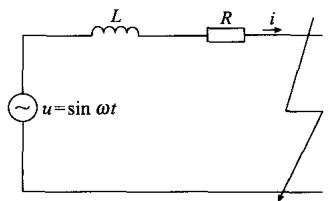
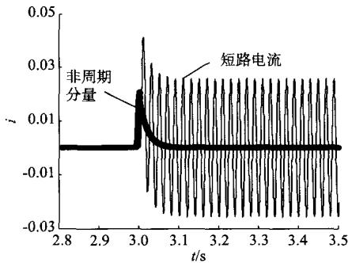
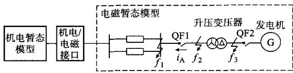
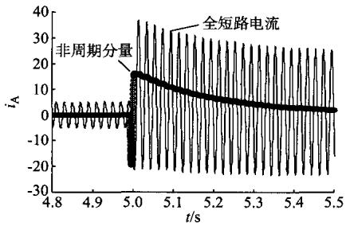
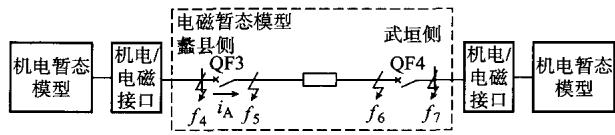
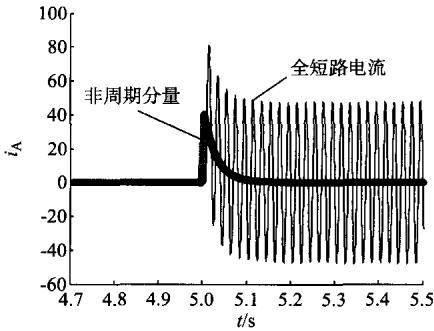

# 基于数字混合仿真的电网一次时间常数计算方法

唐宝锋1, 许庆强2, 范辉1

(1. 河北省电力研究院，河北省石家庄市 050021；2. 江苏省电力公司，江苏省南京市 210024)

摘要：电网一次时间常数是决定非周期分量衰减快慢的因素，准确计算电网一次时间常数是开展电流互感器暂态特性分析的重要前提。利用电力系统全数字仿真装置的混合仿真功能，提出了一种准确计算电网一次时间常数的方法。通过对全系统机电暂态建模及局部电网电磁暂态建模，获取不同运行方式下的短路电流，滤波后得到短路电流的非周期分量，最终求得电网一次时间常数。仿真结果表明，所提出的算法具有较高的计算精度。

关键词：混合仿真；一次时间常数；暂态特性；电流互感器

# 0 引言

继电保护装置动作的正确性很大程度上取决于电流互感器对故障电流传变的准确性。电力系统发生短路故障时，其短路电流除正弦交流分量外，往往还包含一定数值的非周期分量。研究表明，非周期直流分量是引起电流互感器暂态饱和的主要因素，在传变等效频率很低的非周期分量时，铁芯被大幅度单方向励磁，铁芯磁通（即励磁电流）大大增加，从而达到饱和[1]。

决定非周期直流分量衰减快慢的参数为电网一次时间常数（也称为衰减时间常数） $T_{\mathrm{p}}$ ，该时间常数直接影响到TP类电流互感器的暂态面积系数 $K_{\mathrm{td}}$ 的取值，从而决定了电流互感器的设计尺寸及抗饱和能力。工程中一般由设计单位提出订货技术条件，由制造单位进行设计及参数优化后提供能够满足工程需求的产品。

电网一次时间常数与系统运行方式、故障点位置及故障类型有直接关系，工程设计单位需要确定最不利方式下的时间常数。以往的工程中对电网一次时间常数的计算并无直接有效的方法，通常根据电压等级进行简单估算，或按照发变组及输电线路的电感、电阻串联阻抗值进行计算，且此值只有在三相短路时才有效。因此，研究电网一次时间常数的计算方法对TP类电流互感器的设计选型及性能测试具有十分重要的意义。

本文利用电力系统全数字仿真装置(advanced digital power system simulator, ADPSS), 提出了一种利用机电与电磁暂态混合仿真准确计算电网一次

时间常数的方法。通过全网的机电暂态建模及局部电网的电磁暂态建模，可以模拟电网的实际运行方式。结合工程设计需求，本文总结了发变组及输电线路差动保护用电流互感器的时间常数选取方法。

# 1 机电暂态仿真、电磁暂态仿真及混合仿真

# 1.1 机电暂态仿真与电磁暂态仿真的区别

机电暂态仿真与电磁暂态仿真有着本质的区别。机电暂态仿真主要研究电力系统受到大扰动后的静态稳定性能；电磁暂态仿真主要研究电力系统元件中电场和磁场以及相应的电压和电流的变化情况。机电暂态仿真与电磁暂态仿真的比较如表1所示[2-3]。

表 1 机电暂态与电磁暂态的仿真比较  
Table 1 Comparison between electromechanical and electromagnetic transient simulation   

<table><tr><td>比较项目</td><td>机电暂态仿真</td><td>电磁暂态仿真</td></tr><tr><td>仿真步长</td><td>毫秒级(典型步长为10ms)</td><td>微秒级(典型步长为50μs)</td></tr><tr><td>仿真规模</td><td>较大</td><td>较小</td></tr><tr><td>变量表示</td><td>基波相量模式和序分量</td><td>基于ABC三相瞬时值</td></tr><tr><td>模型特点</td><td>简化模型,基于工频正弦特性</td><td>详细模型,考虑非线性和分布参数特性</td></tr><tr><td>应用领域</td><td>功角稳定、电压稳定、频率稳定及短路计算等</td><td>操作过电压、故障暂态、谐波分析及其他的快速动态控制</td></tr><tr><td>直流模型</td><td>基于诸多假设的准稳态模型</td><td>考虑高频动态特性的详细模型</td></tr><tr><td>常用软件</td><td>BPA,PSS/E,PSASP</td><td>PSCAD/EMTDC,EMTP</td></tr></table>

# 1.2 混合仿真的必要性

混合仿真是指在一次仿真的过程中，将计算对象的电网拓扑按照需要分割成电磁暂态计算网络和机电暂态计算网络，并分别实施计算。通过电路连

接界面（即接口上的数据交换）实现一体化仿真进程[4]。

由于电网一次时间常数在数值上等于系统等效电感与电阻的比值，因此，准确反映系统的网络拓扑结构是计算电网一次时间常数的前提。目前，电力系统方式部门掌握有电网的机电暂态数据，如BPA和PSASP数据。这些数据可以直接用做混合仿真中的机电暂态数据，以模拟系统实际运行背景。研究人员只需手动建立局部电网的电磁暂态模型，即可方便地模拟各种短路故障并获得短路电流瞬时值。按此方法建立混合仿真模型，可以极大地减少大电网电磁暂态建模的工作量，避免系统等值带来的计算误差，具有较高的计算精度。

# 2 电网一次时间常数计算方法

# 2.1 计算步骤

ADPSS是中国电力科学研究院开发的一种大型全数字仿真装置，利用其先进的并行计算功能，可以开展基于机群的机电暂态仿真、电磁暂态仿真及机电暂态-电磁暂态的混合仿真。

本文所提出的电网一次时间常数计算方法的实现步骤如下。

1)建立电流互感器安装地点中局部电网的电磁暂态模型及全网的机电暂态模型，并利用混合仿真接口建立混合仿真模型。  
2)在电磁模型中通过模拟系统三相或单相短路接地故障获取包含非周期分量的电网短路电流。  
3)选择合理的滤波方法，提取短路电流中的非周期分量。  
4)计算电网一次时间常数。

# 2.2 现有计算方法的误差分析

在2.1节所介绍的计算步骤中，选择适当的滤波方法提取非周期分量是求取一次时间常数的难点及关键点。近年来，针对如何滤除非周期分量而进行改进的傅里叶算法很多，基本可以分为2类。一类为基于短数据窗的傅里叶算法[5-6]。此类算法只要经过1/2甚至1/4个周期就可以得到结果，提高了运算速度；但此类算法对低频分量的抑制效果不好，而且对偶次谐波有一定的放大作用，故只能用于保护切除出口或近处故障。由于电网一次时间常数的应用范围对计算的实时性并无严格要求，因此本文不采用该种滤波方法。另一类为在全周期傅里叶算法基础上演变而来的改进算法[7-13]。改进的全周期傅里叶算法能滤除所有整次谐波分量，稳定性好，在国内得到了广泛的应用。但在一次时间常数的计算方面，其存在一定的误差，有些是公式简化推导过

程所产生的，有些是离散点采样所造成的。因此，本文不采用该种滤波方法。下面分析文献[7-9]所采用的计算方法，以验证其算法的精度。

文献[7]介绍了一种在 $t \in [0, T]$ 及 $t \in [\Delta T, T + \Delta T]$ 周期内分别进行傅里叶算法的一种滤波方法，其中时间延时 $\Delta T = T / (2n)$ ， $n$ 为倍频值。该方法比传统的傅里叶算法略有改进，获得的基波幅值较准确，但是在一次时间常数计算上误差较大。采用如下算例进行验证：

$$
\begin{array}{l} i (t) = 2 0 \mathrm {e} ^ {- \frac {t}{\tau}} + 2 0 \sin (\omega t + 4 5 ^ {\circ}) + 4 \sin (2 \omega t + 6 0 ^ {\circ}) + \\ 1 0 \sin 3 \omega t + 2 \sin 4 \omega t + 6 \sin 5 \omega t \tag {1} \\ \end{array}
$$

式中： $i(t)$ 为包含工频分量、非周期分量及各次高频分量的全电流值； $\tau$ 为时间常数； $\omega$ 为角频率。

式(1)的计算结果如表2所示。可以看出，在不同的时间常数 $\tau$ 及采样点数 $N$ 下，基波幅值的计算结果较准确，但一次时间常数的计算结果误差较大，甚至还可能出现无效值（负值）。

表 2 计算结果  
Table 2 Calculation results   

<table><tr><td>τ/ms</td><td>每周期采样点数</td><td>基波幅值/A</td><td>Tp/ms</td></tr><tr><td rowspan="2">10</td><td>32</td><td>21.300</td><td>15.00</td></tr><tr><td>100</td><td>21.420</td><td>11.20</td></tr><tr><td rowspan="2">30</td><td>32</td><td>20.310</td><td>442.80</td></tr><tr><td>100</td><td>20.320</td><td>42.80</td></tr><tr><td rowspan="2">100</td><td>32</td><td>20.040</td><td>-47.85</td></tr><tr><td>100</td><td>20.040</td><td>8086.00</td></tr><tr><td rowspan="2">300</td><td>32</td><td>20.007</td><td>-36.30</td></tr><tr><td>100</td><td>20.005</td><td>-153.00</td></tr></table>

文献[8]在滤波算法中引入的滤波算子实现了对非周期分量的快速计算。但是，该算法在适用范围上具有较大的局限性，即滤波算子个数必须大于每周期采样点数的 $1 / 4$ 。以文献[8]介绍的算例为例，取 $\tau = 30~\mathrm{ms}$ ，滤波算子个数为13，当 $N = 32$ 时，计算结果精确；当 $N = 60$ 时， $T_{\mathrm{p}} = 0.022\mathrm{s}$ ；当 $N = 100$ 时， $T_{\mathrm{p}} = 0.011\mathrm{s}$ ，产生了较大的计算误差。此外，该算法对采样值的精度具有较高的要求，当信号中引入-0.5至0.5的随机噪声后，一次时间常数的计算结果为无效值（虚数），影响了该算法的适用范围。

文献[9]介绍了在一个采样周期内利用偶数点求和值与奇数点求和值的比值计算一次时间常数的方法。即

$$
T _ {\mathrm {p}} = - \frac {\Delta T}{\ln \frac {\sum_ {k = 1} ^ {\frac {N}{2}} x (2 k)}{\sum_ {k = 1} ^ {\frac {N}{2}} x (2 k - 1)}} \tag {2}
$$

该算法在理论计算时精度较高，但当引入一0.5至0.5的随机噪声后，会产生较大的计算误差。

# 2.3 本文采用的计算方法

在实际电网的短路电流中，除包含工频分量及非周期分量外，还主要包含一定量的3次谐波及5次谐波。本文提出一种交流采样数据修正法，利用间隔工频分量1/2个周期(10ms)的稳态正弦电流采样值正负相反而非周期分量近似相等的特点，将间隔 $10\mathrm{ms}$ 的2个采样值叠加，以消除短路电流中的工频分量及奇次谐波分量。获得的非周期分量 $i_0(t)$ 的表达式为：

$$
i _ {0} (t) = I _ {0} \mathrm {e} ^ {- \frac {t}{T _ {\mathrm {p}}}} = \frac {1}{2} (i (t) + i (t + t _ {\mathrm {d e l}})) \tag {3}
$$

式中： $I_{0}$ 为非周期分量的最大偏移值； $t_{\mathrm{del}}$ 为算法所取的固定时间延时，取为 $10~\mathrm{ms}$

将式(3)两侧取自然对数，得到

$$
\ln i _ {0} (t) = \ln I _ {0} - \frac {t}{T _ {\mathrm {p}}} \tag {4}
$$

由式(4)可见， $\ln i_0(t)$ 与 $t$ 成一条直线，直线的斜率为 $-1 / T_{\mathrm{p}}$ 。

取 $\Delta T = t_{2} - t_{1}$ ，代入式(4)，可得最终的电网一次时间常数为：

$$
T _ {\mathrm {p}} = \frac {t _ {2} - t _ {1}}{\ln i _ {0} (t _ {1}) - \ln i _ {0} (t _ {2})} \tag {5}
$$

# 3 实例分析

# 3.1 精度验证

为验证式(5)的计算精度及实用性，建立如图1所示的单相短路电流仿真模型。

  
图1 短路电流仿真模型  
Fig.1 Simulation model of short-circuit current

图1中，电阻 $R = 5\Omega$ ，通过改变电感 $L$ 的大小 $(0.1\sim 1.5\mathrm{H})$ ，模拟不同时间常数下的单相短路电流 $i$ 。 $T_{\mathrm{p}} = 20~\mathrm{ms}$ 时的单相短路电流如图2所示。

  
图2 $T_{\mathrm{p}} = 20 \mathrm{~ms}$ 时的单相短路电流   
Fig.2 Single-phase short-circuit current when $T_{\mathrm{p}} = 20$ ms

利用多次计算取平均值的方法可消除随机误差对计算结果的影响。表3列出了不同电感下的一次时间常数理论值、计算值以及相对误差。可以看出，当 $\Delta T$ 的取值为 $40\sim 80~\mathrm{ms}$ 时，计算结果均能保证较高的精度。

表3 $T_{\mathrm{p}}$ 计算结果  
Table 3 Calculation results of ${T}_{\mathrm{p}}$   

<table><tr><td rowspan="2">电感/H</td><td rowspan="2">Tp理论值/ms</td><td colspan="3">Tp计算值</td><td colspan="3">相对误差/%</td></tr><tr><td>ΔT=40 ms</td><td>ΔT=60 ms</td><td>ΔT=80 ms</td><td>ΔT=40 ms</td><td>ΔT=60 ms</td><td>ΔT=80 ms</td></tr><tr><td>0.1</td><td>20</td><td>20.013</td><td>20.001</td><td>20.012</td><td>0.065</td><td>0.0050</td><td>0.060</td></tr><tr><td>0.2</td><td>40</td><td>39.986</td><td>40.019</td><td>40.008</td><td>-0.035</td><td>0.0475</td><td>0.020</td></tr><tr><td>0.5</td><td>100</td><td>100.115</td><td>100.165</td><td>99.921</td><td>0.115</td><td>0.1650</td><td>-0.079</td></tr><tr><td>0.7</td><td>140</td><td>140.953</td><td>139.917</td><td>140.386</td><td>0.681</td><td>-0.0600</td><td>0.276</td></tr><tr><td>1.0</td><td>200</td><td>200.754</td><td>200.595</td><td>199.471</td><td>0.377</td><td>0.2980</td><td>-0.265</td></tr><tr><td>1.5</td><td>300</td><td>306.423</td><td>301.263</td><td>301.335</td><td>2.141</td><td>0.4210</td><td>0.445</td></tr></table>

# 3.2 工程应用

# 3.2.1 电源侧故障

建立包含发电机额定功率为 $600\mathrm{MW}$ 、主变压器额定容量为720MVA、双回 $500\mathrm{kV}$ 出线的某发电厂电磁仿真模型，如图3所示。其主要参数如下。发电机参数：额定容量为 $(600 + \mathrm{j}290)\mathrm{MVA};d$ 轴同步、暂态、次暂态电抗分别为3.233，0.3975和 $0.3075;q$ 轴同步、暂态、次暂态电抗分别为3.15，

0.5925和0.3015；机端电压为 $20\mathrm{kV}$ ；基准容量为1000MVA。变压器参数：额定容量为750MVA；电压变比为 $550\mathrm{kV} / 22\mathrm{kV}$ ；采用YNd11接线；短路电压为 $14.7\%$ ；空载电流为 $0.13\%$ ；空载和短路损耗分别为 $250\mathrm{kW}$ 和 $1258\mathrm{kW}$ 。线路参数：正序电阻、电抗、电容分别为0.802 $\Omega$ ，15.099 $\Omega$ 和 $1.24\mu \mathrm{F}$ ；零序电阻、电抗、电容分别为9.617 $\Omega$ 40.509 $\Omega$ 和 $0.415\mu \mathrm{F}$ ；线路长度为 $54.55\mathrm{km}$

  
图3 混合仿真电源侧故障模型  
Fig. 3 Hybrid simulation model of power side failure

图3中： $i_{\mathrm{A}}$ 为流过断路器的A相短路电流； $f_{1}$ $f_{2},f_{3}$ 分别为高压侧母线、升压变压器高压侧及发电机出口处的故障点；QF1为发变组主断路器；QF2为发电机断路器，仅为采集故障电流使用，如果发变组采用单元接线，则实际中此断路器不存在。将包含 $220\mathrm{kV}$ 及以上电压等级的全网数据作为电网运行背景，建立机电暂态模型。利用机电暂态-电磁暂态混合仿真接口两部分，以此实现数据交换。

在 $f_{1}$ 点模拟A相金属性接地故障，采集 $i_{\mathrm{A}}$ 。接地故障发生在5.011s时刻，数据的采样间隔为 $100~\mu \mathrm{s}$ 。短路电流如图4所示。

  
图4 电源侧A相故障电流  
Fig.4 Fault current of phase A at power side

利用2.3节介绍的提取非周期分量的方法，对采样得到的全短路电流进行数据修正，获取的非周期分量如图4所示。

以2个周期为时间间隔，取 $t_1 = 5.02\mathrm{s},t_2 =$ $5.06\mathrm{s}$ 。将采样值代入式(5)，计算可得： $\{T_{\mathrm{p}}\}_{\mathrm{s}} =$ $(5.06 - 5.02) / (2.585 - 2.358) = 0.176_{\circ}$

为了消除采样值误差对数据结果造成的影响，对一次时间常数进行多次计算并求平均值，最终得到的结果为 $178\mathrm{ms}$ 。

# 3.2.2 系统侧故障

与电源侧故障不同，当故障发生在系统侧时，短路电流非周期分量一般较小。但是通过设置合理的故障时刻（电压过零点），理论上可以实现短路电流的全偏移，同样能够获得较高的计算精度。建立包含 $220\mathrm{kV}$ 线路及两侧变电站设备的电磁暂态模型，如图5所示。其主要参数如下。线路参数：正序电阻、电抗分别为3.259Ω和20.239Ω；零序电阻、电抗分别为16.979Ω和50.648Ω；线路长度为 $65.304\mathrm{km}$ 。蠡县侧变压器参数：高、中、低压绕组

容量分别为120MVA，120MVA和60MVA；电压变比为 $220\mathrm{kV} / 121\mathrm{kV} / 10.5\mathrm{kV}$ ；1和2侧、2和3侧、3和1侧短路损耗分别为 $404.3\mathrm{kW},106\mathrm{kW}$ 和 $143\mathrm{kW}$ ，短路电压分别为 $14.3\%$ ， $23.95\%$ 和 $7.47\%$ ；空载电流为 $0.38\%$ ；空载损耗为 $84.7\mathrm{kW}$ 。武垣侧变压器参数：高、中、低压绕组容量分别为180MVA，180MVA和60MVA；电压变比为 $230\mathrm{kV} / 121\mathrm{kV} / 10.5\mathrm{kV};1$ 和2侧、2和3侧、3和1侧短路损耗分别为 $528.3\mathrm{kW},90.7\mathrm{kW}$ 和 $70.4\mathrm{kW}$ ，短路电压分别为 $13\% ,23.3\%$ 和 $8.09\%$ 空载电流为 $0.096\%$ ；空载损耗为 $109.7\mathrm{kW}$

  
图5 混合仿真系统侧故障模型  
Fig.5 Fault model at hybrid simulation system side

图5中： $f_{4}$ 和 $f_{5}$ 分别为蠡县侧反方向母线和正方向出口短路点； $f_{6}$ 和 $f_{7}$ 分别为武垣侧正方向出口和反方向母线短路点。电网其余部分作为电网运行背景建立机电暂态模型。

模拟 $f_{5}$ 处A相金属性接地故障，采集 $i_{\mathrm{A}}$ ，如图6所示。

  
图6 系统侧A相故障电流  
Fig.6 Fault current of phase A at system side

利用多次计算取平均值的方法，可得该种故障类型下的电网一次时间常数为 $27.8\mathrm{ms}$ 。由于系统侧选取地点远离电源点，因此计算结果更接近于输电线路的时间常数值。

# 3.2.3 差动保护用电流互感器一次时间常数的选取

以上2个例子仅介绍了算法的应用方法，在工程应用中，设计单位还需要按照最不利的故障类型及故障地点进行综合分析，取最不利情况下的一次时间常数提供给制造商。

在各种短路类型中，三相短路或单相短路故障

对系统造成的冲击最大，相间短路或相间接地短路故障造成的冲击较小。这是因为：

$$
I ^ {(2)} = \frac {\sqrt {3} E _ {1}}{2 X _ {1}} = \frac {E _ {1}}{1 . 1 5 4 X _ {1}} <   I ^ {(3)} \tag {6}
$$

式中： $I^{(2)}$ 为两相短路电流； $I^{(3)}$ 为三相短路电流； $E_{1}$ 为系统等效电源电压； $X_{1}$ 为系统正序等效电抗。

可见，两相短路电流小于三相短路电流。同样，两相接地短路电流也小于三相短路电流。这是因为当系统零序等效电抗 $X_0$ 无穷大时，两相接地短路电流与两相短路电流相同；当 $X_0 = 0$ 时，两相接地短路电流与三相短路电流相同。一般来说，两相接地短路电流介于两相短路电流与三相短路电流之间。而单相短路电流与三相短路电流的大小关系取决于 $X_0$ 及 $X_1$ 的大小。若 $X_0 < X_1$ ，则单相短路电流将大于三相短路电流。

综上所述，在最不利条件下计算电网一次时间常数时，需要采用对系统冲击最大的短路故障类型，即三相短路或单相短路。

由于电源侧（发变组及配套的升压变压器） $X / R$ 的值要远大于系统侧，因此对于电源侧而言，发电厂双回出线发生三相短路时的一次时间常数一般要大于单相金属性接地故障。以3.2.1节中的算例为例，若在 $f_{1}$ 点设置三相短路故障，计算得到 $T_{\mathrm{p}} = 226 \mathrm{~ms} > 178 \mathrm{~ms}$ 。因此，变压器高压侧差动保护用电流互感器需按照高压侧母线发生三相短路时的短路电流计算一次时间常数。变压器低压侧及发电机中性点侧差动保护用电流互感器可按照以下3种情况进行选择：①主变压器高压侧母线发生三相短路故障；②发电机出口发生三相短路故障；③发电机出口发生单相短路故障。综合分析以上3种故障，取一次时间常数较大值作为设计选型的依据。

图3所示系统在不同故障点及不同故障类型下计算得到的一次时间常数如表4所示。

表 4 电源侧故障时的 ${\mathbf{T}}_{\mathrm{p}}$ 计算结果  
Table 4 Calculation results of $T_{p}$ when fault happens at power side   

<table><tr><td>故障点</td><td>故障电流
获取地点</td><td>故障类型
(金属性短路)</td><td>一次时间
常数值/ms</td></tr><tr><td rowspan="4">f1</td><td rowspan="2">QF1</td><td>三相短路</td><td>226</td></tr><tr><td>单相短路</td><td>178</td></tr><tr><td rowspan="2">QF2</td><td>三相短路</td><td>302</td></tr><tr><td>单相短路</td><td>262</td></tr><tr><td rowspan="2">f2</td><td rowspan="2">QF1</td><td>三相短路</td><td>47</td></tr><tr><td>单相短路</td><td>36</td></tr><tr><td rowspan="2">f3</td><td rowspan="2">QF2</td><td>三相短路</td><td>303</td></tr><tr><td>单相短路</td><td>307</td></tr></table>

对于系统侧来说，由于系统运行方式及地区电网拓扑结构均存在较大的差异，因此必须结合地区电网的特点进行分析。图5所示系统在不同故障点及不同故障类型下计算得到的一次时间常数如表5所示。

表 5 系统侧故障时的 ${\mathbf{T}}_{\mathrm{p}}$ 计算结果  
Table 5 Calculation results of $T_{\mathfrak{p}}$ when fault happens at system side   

<table><tr><td>故障点</td><td>故障电流获取地点</td><td>故障类型(金属性短路)</td><td>一次时间常数值/ms</td></tr><tr><td rowspan="2">f4</td><td rowspan="2">QF3</td><td>三相短路</td><td>17.35</td></tr><tr><td>单相短路</td><td>17.80</td></tr><tr><td rowspan="2">f5</td><td rowspan="2">QF3</td><td>三相短路</td><td>22.00</td></tr><tr><td>单相短路</td><td>27.80</td></tr><tr><td rowspan="2">f6</td><td rowspan="2">QF4</td><td>三相短路</td><td>16.95</td></tr><tr><td>单相短路</td><td>24.49</td></tr><tr><td rowspan="2">f7</td><td rowspan="2">QF4</td><td>三相短路</td><td>20.26</td></tr><tr><td>单相短路</td><td>21.34</td></tr></table>

文献[14]对各种电力回路的时间常数典型值及区间进行了总结。其一般规律为：越靠近电源侧，时间常数越大；越靠近系统侧，时间常数越小。

# 4 结语

随着电网规模的扩大及电压等级的提高，电流互感器的暂态特性对继电保护装置的影响越来越大。为了准确分析电流互感器的暂态特性，首先需要确定极限情况下的电网一次时间常数。本文利用ADPSS的混合仿真功能，提出了一种准确计算电网一次时间常数的方法。该方法可以实现对系统不同故障点及不同故障类型的模拟，通过分析比较，确定极限条件下的电网一次时间常数。算例分析结果表明，所述方法具有较高的计算精度，为电流互感器的设计、选型及性能测试提供了可靠的技术依据。

# 参考文献

[1] 李艳鹏, 侯启方, 刘承志. 非周期分量对电流互感器暂态饱和的影响[J]. 电力自动化设备, 2006, 26(8): 15-18.  
LI Yanpeng, HOU Qifang, LIU Chengzhi. Influence of non-periodic components on transient saturation of current transformer[J]. Electric Power Automation Equipment, 2006, 26(8): 15-18.   
[2] 张树卿, 梁旭, 童陆园, 等. 电力系统电磁/机电暂态实时混合仿真的关键技术[J]. 电力系统自动化, 2008, 32(15): 89-96.  
ZHANG Shuqing, LIANG Xu, TONG Luyuan, et al. Key technologies of the power system electromagnetic/electromechanical real-time hybrid simulation[J]. Automation of Electric Power Systems, 2008, 32(15): 89-96.   
[3] 石访. 电力系统机电暂态和电磁暂态数字混合仿真[J]. 电网与清洁能源, 2009, 25(12): 42-46.  
SHI Fang. Electromechanical-electromagnetic transient digital

hybrid simulation in power system[J]. Power System and Clean Energy, 2009, 25(12): 42-46.   
[4] 岳程燕, 田芳, 周孝信, 等. 电力系统电磁暂态-机电暂态混合仿真的应用[J]. 电网技术, 2006, 30(11): 1-5.  
YUE Chengyan, TIAN Fang, ZHOU Xiaoxin, et al. Application of hybrid simulation of power system electromagnetic-electromechanical transient process[J]. Power System Technology, 2006, 30(11): 1-5.   
[5]郑建勇，巫海钢.短数据窗傅氏算法在微机保护装置中的应用[J].电力系统自动化，2000，24(18)：49-52.  
ZHENG Jianyong, WU Haigang. Study of short data window algorithm for microprocessor-based protection set [J]. Automation of Electric Power Systems, 2000, 24(18): 49-52.   
[6] 丁书文, 张承学, 龚庆武, 等. 半波傅氏算法的改进——一种新的微机保护交流采样快速算法[J]. 电力系统自动化, 1999, 23(5): 18-20.  
DING Shuwen, ZHANG Chengxue, GONG Qingwu, et al. An improved half-wave fourier algorithm—a new fast algorithm for microprocessor-based protection AC sampling[J]. Automation of Electric Power Systems, 1999, 23(5): 18-20.   
[7] 熊岗, 陈陈. 一种能滤除衰减直流分量的交流采样新算法[J]. 电力系统自动化, 1997, 21(2): 27-29.  
XIONG Gang, CHEN Chen. A novel alternating current sampling algorithm for filtering decaying direct current component[J]. Automation of Electric Power Systems, 1997, 21(2): 27-29.   
[8] 辛晋渝, 刘念, 郝江涛, 等. 故障电流中衰减直流分量的滤波算法研究[J]. 继电器, 2005, 33(13): 10-12.  
XIN Jinyu, LIU Nian, HAO Jiangtao, et al. Research of decaying DC removal algorithms in fault current [J]. Relay, 2005, 33(13): 10-12.   
[9] 马磊, 王增平, 徐岩. 微机继电保护中滤除衰减直流分量的算法研究[J]. 继电器, 2005, 33(17): 11-13.

MA Lei, WANG Zengping, XU Yan. Study of filtering decaying DC component algorithm for microprocessor-based protection[J].Relay，2005，33(17)：11-13.   
[10] 黄恺, 孙苓生. 继电保护傅氏算法中滤除直流分量的一种简便算法[J]. 电力系统自动化, 2003, 27(4): 50-52.  
HUANG Kai, SUN Lingsheng. A compact algorithm for filtering decaying DC component in relay protection fourier algorithm[J]. Automation of Electric Power Systems, 2003, 27(4): 50-52.   
[11] 李斌, 李永丽, 贺家李. 一种提取基波分量的高精度快速滤波算法[J]. 电力系统自动化, 2006, 30(10): 39-43.  
LI Bin, LI Yongli, HE Jiali. Accurate and fast filtering algorithm for fundamental component [J]. Automation of Electric Power Systems, 2006, 30(10): 39-43.   
[12] 苏文辉, 李钢. 一种能滤去衰减直流分量的改进全波傅氏算法 [J]. 电力系统自动化, 2002, 26(23): 42-44.  
SU Wenhui, LI Gang. An improved full-wave fourier algorithm for filtrating decaying DC component [J]. Automation of Electric Power Systems, 2002, 26(23): 42-44.   
[13] BENMOUYAL G. Removal of DC-offset in current waveforms using digital mimic filter[J]. IEEE Trans on Power Delivery, 1995, 10(2): 621-630.   
[14] 衰季修, 盛和乐, 吴聚业. 保护用电流互感器应用指南[M]. 北京: 中国电力出版社, 2003.

# A Calculating Method for Primary Time Constant of Power Grids Based on Digital Hybrid Simulation

TANG Baofeng $^{1}$ , XU Qingqiang $^{2}$ , FAN Hui $^{1}$

(1. Hebei Electric Power Research Institute, Shijiazhuang 050021, China;

2. Jiangsu Power Company, Nanjing 210024, China)

Abstract: The primary time constant of power grids is the major factor of determining the decay rate of non-periodic components. Accurate calculation of the primary time constant is the important premise of transient characteristic analysis of current transformers. Based on the hybrid simulation function of the advanced digital power system simulator, an accurate primary time constant calculating method is proposed. By developing the electromechanical transient model of the whole system and electromagnetic transient model of the local grid, short-circuit current in different operating modes is obtained. After filtering, the non-periodic component of short-circuit current is obtained and hence the primary time constant. Simulation results show that the algorithm has fairly high accuracy.

Key words: hybrid simulation; primary time constant; transient characteristic; current transformer