The following publication H. Xue, J. Mahseredjian, J. Morales, I. Kocar and A. Xemard, "An Investigation of Electromagnetic Transients for a Mixed Transmission System With Overhead Lines and Buried Cables," in IEEE Transactions on Power Delivery, vol. 37, no. 6, pp. 4582-4592, Dec. 2022 is available at https://doi.org/10.1109/TPWRD.2022.3151749

# An Investigation of Electromagnetic Transients for A Mixed Transmission System with Overhead Lines and Buried Cables

Haoyan Xue, Member, IEEE, Jean Mahseredjian, Fellow, IEEE, Jesus Morales, Member, IEEE, Ilhan Kocar, Member, IEEE and Alain Xemard

Abstract—An electromagnetic transient study has been performed based on a practical 500 kV mixed transmission system. The system has overhead lines, submarine cables and underground cables. An exact expression of earth-return impedance for submarine cable has been developed. A new equivalent homogeneous earth method (EHEM) is also proposed based on the exact formula. The influences of air, seawater, seabed, wired armor structure and multi-layer seabed on series impedance and modal propagation constants of submarine cable are investigated. A novel modeling procedure on parametrical side of mixed transmission system is proposed in this paper. Moreover, the input sequence impedances of mixed transmission system are studied based on traditional Line / Cable Constant routines and the new method. Transient simulations are also performed using classical and new methods. The results are further validated with recently proposed MoM-SO technique.

Index Terms— Mixed transmission system, earth-return parameters, propagation constant, time domain study, EMT-type software

# I. INTRODUCTION

he implementation of underground and submarine cables interconnected with existing overhead transmission systems is becoming more and more common [1]-[5]. As a result, it is predicted that mixed systems consisting of overhead lines and buried cables will be dominant in future power grids.

Several recent investigations demonstrate that the transient characteristics of mixed transmission systems differ from those of separate overhead or cable systems. In these mixed systems the electromagnetic waves have more complicated reflections and refractions at the discontinuity of overhead lines and cables [1], [2]. Consequently, mixed transmission systems may experience more serious overvoltage problems and require detailed electromagnetic studies to evaluate the withstand voltage of cables and the characteristics of the arresters used to limit overvoltage. The Cigre technical brochure [3] studies the lightning overvoltage which affects a cable inserted in an overhead line. It shows that its maximum value decreases with the length of the cable and makes the interesting conclusion that in some configuration it is possible to specify a lower lightning withstand voltage for the cable.

The above-mentioned studies are performed using existing electromagnetic transient (EMT) type simulation tools [6]. The internal and external parameters of overhead lines and cables are calculated based on existing theories [7]-[9], using classical transmission line (TL) approach [10]-[12]. These existing line and cable parameter calculation methods will be referred to, hereinafter, as Classic Parameter Calculation (CPC). It should be noted that the simulation of transmission systems using classical TL approach or CPC has several important drawbacks as discussed in [10]-[17]. Moreover, insulation coordination on mixed and non-mixed transmission systems must rely on accurate EMT-type simulations. Therefore, significant improvements in EMT modeling of mixed transmission systems must be made.

Considering the above facts, this paper introduces a novel modeling method of mixed transmission system based on recently developed extended TL approach [10]-[17]. In Section II, a practical 500 kV mixed transmission system [4] with combination of overhead lines, submarine cables and underground cables is introduced and described. Section III concentrates on the investigations of responses on mixed transmission system in frequency domain. An exact formula (EF) of earth-return impedance for submarine cable considering air, seawater and seabed mediums is proposed. Based on the EF expression, a new equivalent homogeneous earth method (EHEM) is developed for submarine cable using an approach similar to [15], [18]. The EHEM has simplified expressions in comparison to EF method. The influences of seabed resistivity, depth of seawater, multi-layer seabed and structures of armor wires on series impedance and propagation constant of submarine cable are made clear. Also, the scan of input impedance on mixed transmission system is performed. The results evaluated by EF and EHEM are compared with the new Line / Cable Data calculation method in EMTP [16], [19], hereinafter abbreviated as LCD. This new method is based on the Method of Moments - Surface Operator (MoM-SO) [20], [21] and includes both series and shunt per-unit-length parameters [10], [11], [15].

In Section IV, steady-state, energization and short-circuit studies are performed on the mixed transmission system using EMTP [19] with its wideband (WB) line and cable models [22].

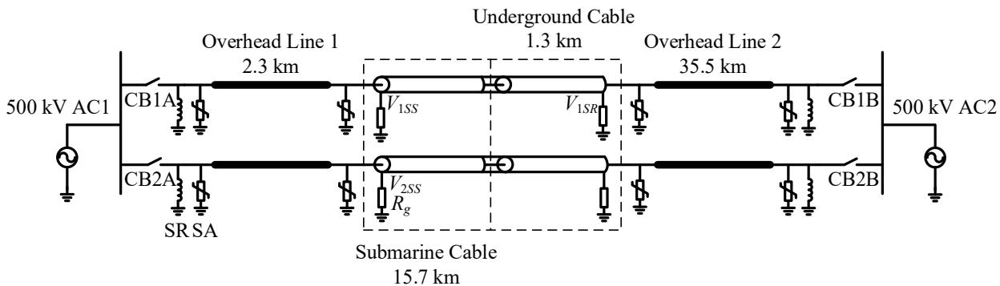  
Fig. 1 A 500 kV mixed transmission system with overhead lines and buried cables [4].

The numerical instability and distortion of transient waveforms observed using CPC routines are compared with the stable and accurate results produced by EF, EHEM and LCD methods. As a conclusion, it is highly recommended to analyze the transient characteristics of mixed transmission systems using the new modeling method discussed in this paper.

# II. DESCRIPTION OF SYSTEM

Fig. 1 illustrates a practical 500 kV mixed transmission system [4]. The system consists of two circuits which include overhead lines and buried cables. This system is adopted into the reinforcement of island power delivery in south eastern coast of China. It should be noted that a short underground cable exists between overhead line 1 and submarine cable, however, the length is less than 100 m and it only occupies 1.8‰ of the total length of the system. Thus, it has been neglected in the following study considering its negligible influence.

The configuration of the 500 kV overhead line (lines 1 and 2) is shown in Fig. 2. The radii of each phase and ground conductors are 1.465 and 0.64 cm, respectively. The dc resistances of phase and ground conductors are set to 0.0646 and 0.864 Ω/km. The bundle radius is 32.53 cm.

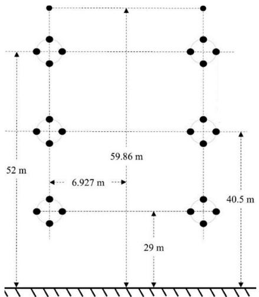  
Fig. 2 Geometrical configuration of a 500 kV overhead line with double circuits.

Moreover, the 3-phase cable has submarine and underground parts. The cross-section of cable (1-phase) with wired armor is shown in Fig. 3 (a). The equivalent tubular armor shown in Fig. 3 (b) is obtained using the method discussed in [23]. The detailed representation of armor used in LCD will be used to test the performance of equivalent tubular armor in Section III-

A-8. The geometrical data of single-phase cable is given in TABLE I. For the submarine part, the buried depth of each phase in seabed is 2.5 m, and the separation between phases is 50 m. Thus, mutual coupling is neglected. The underground cable is the same as the submarine cable, however, the separation between phases is 7 m. The mutual coupling is now considered in the calculations of series and shunt parameters. The buried depth of underground part is set to 1.5 m.

Considering that the onshore transmission system is close to the sea region, the earth resistivity is assumed to be 20 Ωm for underground cable, and 100 Ωm for overhead lines. The seawater resistivity is set to 0.2 Ωm. The seawater depth and seabed resistivity are varied and investigated in the following sections.

The shunt reactor (SR) at both ends of the system is 150 MVars. Surge arresters (SAs) are installed at both ends of overhead lines as shown in Fig. 1. The sheath and armor of cable are solid bonding, and the grounding resistance $R _ { g } = 4$

Ω.

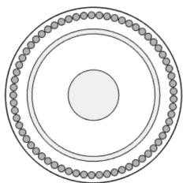  
(a) Wired armor

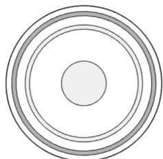  
(b) Equivalent tubular armor   
Fig. 3 Cross-sections of submarine and underground cables.

TABLE I PARAMETERS OF SUBMARINE CABLE   

<table><tr><td rowspan="3">Core</td><td colspan="2">Radius (mm)</td><td>Resistivity (Ωm)</td></tr><tr><td>Inner</td><td>Outer</td><td rowspan="2">2.83×10-8</td></tr><tr><td>0</td><td>25.75</td></tr><tr><td rowspan="2">Main Insulator (XLPE)</td><td colspan="2">Relative Permittivity εr</td><td rowspan="2">-</td></tr><tr><td colspan="2">2.74</td></tr><tr><td rowspan="3">Sheath</td><td colspan="2">Radius (mm)</td><td>Resistivity (Ωm)</td></tr><tr><td>Inner</td><td>Outer</td><td rowspan="2">2.14×10-7</td></tr><tr><td>62.5</td><td>67.5</td></tr><tr><td rowspan="2">Sheath Insulator (PE)</td><td colspan="2">Relative Permittivity εr</td><td rowspan="2">-</td></tr><tr><td colspan="2">6.58</td></tr><tr><td rowspan="3">Wired Armor (65 copper wires)</td><td colspan="2">Radius (mm)</td><td>Resistivity (Ωm)</td></tr><tr><td>Inner</td><td>Outer</td><td rowspan="5">1.99×10-8</td></tr><tr><td>78</td><td>85</td></tr><tr><td rowspan="3">Equivalent Tubular Armor [23]</td><td colspan="2">Radius (mm)</td></tr><tr><td>Inner</td><td>Outer</td></tr><tr><td>78</td><td>82.95</td></tr><tr><td rowspan="2">Outer Insulator (PP)</td><td colspan="2">Relative Permittivity εr</td><td rowspan="3">-</td></tr><tr><td colspan="2">2.2</td></tr><tr><td>Outer Radius (mm)</td><td colspan="2">89.5</td></tr></table>

# III. RESPONSES IN FREQUENCY DOMAIN

# A. Series impedance of submarine cable

1) Derivation of accurate earth-return impedance formula for submarine cable

The accurate earth-return impedance formula of a submarine cable which is buried in the seabed is derived based on references [15], [24]. It has the following expressions.

$$
Z _ {e i j} = \frac {j \omega \mu_ {2}}{2 \pi} \left[ K _ {0} \left(\gamma_ {2} d _ {i j}\right) - K _ {0} \left(\gamma_ {2} D _ {i j}\right) \right] + \frac {j \omega \mu_ {2}}{\pi} Z _ {e s i j (\mathrm {E F})} \tag {1}
$$

where $K _ { 0 }$ is modified Bessel function [10], $d _ { i j }$ and $D _ { i j }$ are

$$
d _ {i j} = \sqrt {y _ {i j} ^ {2} + \left(h _ {i} - h _ {j}\right) ^ {2}}, D _ {i j} = \sqrt {y _ {i j} ^ {2} + \left(h _ {i} + h _ {j}\right) ^ {2}} \tag {2}
$$

with $h _ { i }$ and $h _ { j }$ are buried depths, and $y _ { i j }$ is separation between the two cables i and j.

The correction term $Z _ { e s i j }$ in (1) represents the influence of air, seawater and seabed on earth-return impedance of submarine cable. It is given by

$$
Z _ {e s i j (E F)} = \int_ {0} ^ {+ \infty} \Delta_ {E F} e ^ {- a _ {2} \left(h _ {i} + h _ {j}\right)} \cos \left(y _ {i j} \lambda\right) d \lambda \tag {3}
$$

where  is integral variable and

$$
\Delta_ {\mathrm {E F}} = \frac {B _ {1} + B _ {0} + \left(B _ {1} - B _ {0}\right) e ^ {- 2 a _ {1} d _ {1}}}{\mu_ {2} \left[ \left(B _ {2} + B _ {1}\right) \left(B _ {1} + B _ {0}\right) + \left(B _ {2} - B _ {1}\right) \left(B _ {1} - B _ {0}\right) e ^ {- 2 a _ {1} d _ {1}} \right]} \tag {4}
$$

with $d _ { \mathrm { l } }$ is the depth of seawater and

$$
B _ {0} = \frac {a _ {0}}{\mu_ {0}}, B _ {1} = \frac {a _ {1}}{\mu_ {1}}, B _ {2} = \frac {a _ {2}}{\mu_ {2}} \tag {5}
$$

$$
a _ {0} = \sqrt {\lambda + \gamma_ {0} ^ {2}}, a _ {1} = \sqrt {\lambda + \gamma_ {1} ^ {2}}, a _ {2} = \sqrt {\lambda + \gamma_ {2} ^ {2}} \tag {6}
$$

The intrinsic propagation constants of air “0”, seawater “1” and seabed “2” are given by

$$
\gamma_ {0} ^ {2} = j \omega \mu_ {0} j \omega \varepsilon_ {0}, \gamma_ {1} ^ {2} = j \omega \mu_ {1} \left(\sigma_ {1} + j \omega \varepsilon_ {1}\right) \tag {7}
$$

$$
\gamma_ {2} ^ {2} = j \omega \mu_ {2} \left(\sigma_ {2} + j \omega \varepsilon_ {2}\right) \tag {8}
$$

where $\mu , \sigma$ and  represent the permeability, conductivity and permittivity of different mediums.

It is emphasized that accurate modeling of sea is complicated and out of scope of this paper. In this paper, a simplified model of seawater effect is used and represented by a lossy medium in (3) as recommended in references [25]-[27].

If $\gamma _ { 1 } ^ { 2 } = \gamma _ { 0 } ^ { 2 }$ and $\mu _ { \mathrm { l } } = \mu _ { \mathrm { 0 } }$ are assumed, equation (1) becomes the formula used in the extended TL approach [10] for cable buried in a homogeneous earth.

In the following sections, the calculation of earth-return impedance using (1) is referred to EF.

2) Derivation of EHEM for submarine cable

It is clear that (3) involves the complicated Sommerfeld integral which represents multiple reflections and refractions of electromagnetic waves at the boundaries of different mediums. Following an approach similar to [15], [18], an EHEM can be developed to avoid the complexities in (3). Based on (1) and (3), the newly proposed EHEM for submarine cable buried in the seabed has the following expression.

$$
Z _ {e i j} = \frac {j \omega \mu_ {0}}{2 \pi} \left[ K _ {0} \left(\gamma_ {2} d _ {i j}\right) - K _ {0} \left(\gamma_ {2} D _ {i j}\right) \right] + \frac {j \omega \mu_ {0}}{\pi} Z _ {e s i j (\mathrm {E H E M})}
$$

$$
Z _ {e s i j (E H E M)} = \int_ {0} ^ {+ \infty} \Delta_ {E H E M} e ^ {- a _ {2} \left(h _ {i} + h _ {j}\right)} \cos \left(y _ {i j} \lambda\right) d \lambda \tag {10}
$$

with

$$
\Delta_ {\mathrm {E H E M}} = \frac {1}{\lambda + \sqrt {\lambda^ {2} + \gamma_ {e q} ^ {2}}} \tag {11}
$$

The term $\gamma _ { e q } ^ { 2 }$ being the equivalent propagation constant of air, seawater, and seabed, given by

$$
\gamma_ {e q} ^ {2} = \left[ \frac {\gamma_ {2} + \gamma_ {1} + \left(\gamma_ {2} - \gamma_ {1}\right) e ^ {- 2 \gamma_ {1} d _ {1}}}{1 + e ^ {- 2 \gamma_ {1} d _ {1}}} \right] ^ {2} \tag {12}
$$

It is clear that (11) has a simpler form than the one of (4). In general, equations (9) and (10) are the same as the earth-return impedance formula proposed by Sunde if $\gamma _ { e q } ^ { 2 } = \gamma _ { 2 } ^ { 2 } \ [ 9 ]$ .

The EHEM term is used in the following sections to indicate adoption of earth-return impedance formula (9).

3) Calculation of series impedance of submarine cable

The series impedance matrix of submarine cable can be represented by the following formula based on [9].

$$
\mathbf {Z} = \mathbf {Z} _ {\mathrm {i}} + \mathbf {Z} _ {\mathrm {e}} \tag {13}
$$

where $\mathbf { Z _ { i } }$ and $\mathbf { Z _ { e } }$ are internal and earth-return impedance matrices.

Since the mutual coupling between each phase of submarine cable is neglected due to large separation, equation (13) only represents the self-impedance for each cable phase. Thus, (13) becomes a 3-by-3 symmetrical impedance matrix.

However, since the mutual coupling is included into the impedance calculation of underground cable, equation (13) is an 18-by-18 symmetrical matrix.

It should be noted that the equivalent tubular armor is adopted into the calculations. The influence of wired armor is investigated separately using LCD method.

In the following studies, EF and EHEM are adopted into the calculations of $\mathbf { Z _ { e } }$ in (13). Also, the series impedance evaluated by CPC and LCD methods are discussed and compared. Because the CPC can only deal with homogeneous earth model for buried cables [9], the earth resistivity is set to either seawater or seabed.

4) Influence of resistivity of seabed

Fig. 4 illustrates the calculated self-impedance of sheath on submarine cable using different methods and seabed resistivities. The cases used in the calculations are given in TABLE II. The results evaluated by EF agree well with the results obtained by LCD. Also, the seabed resistivities show minor effect on the impedance. However, a significant difference is observed if the CPC method is adopted into the calculations.

TABLE II PARAMETERS OF SEAWATER AND SEABED   

<table><tr><td>Case</td><td>ρseawater(Ωm)</td><td>ρseabed(Ωm)</td><td>Depth of Seawater d1(m)</td></tr><tr><td>C1</td><td rowspan="3">0.2</td><td>5</td><td rowspan="3">15</td></tr><tr><td>C2</td><td>10</td></tr><tr><td>C3</td><td>20</td></tr><tr><td>C4</td><td>-</td><td>10</td><td>-</td></tr><tr><td>C5</td><td>0.2</td><td>-</td><td>-</td></tr></table>

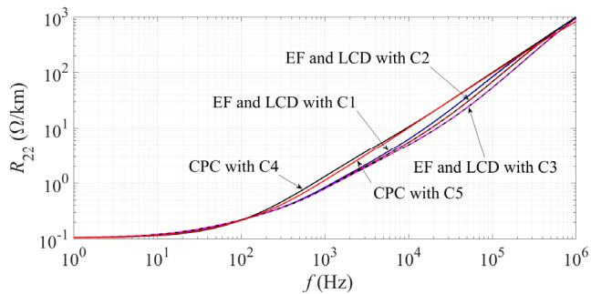

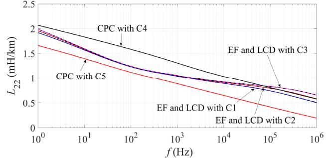  
(a) Resistance $R _ { 2 2 }$   
(b) Inductance $L _ { 2 2 }$   
Fig. 4 Series impedance of sheath for submarine cable shown in Fig. 3 (b).

# 5) Influence of depth of seawater

The effect of depth of seawater on series impedance of submarine cable is illustrated in Fig. 5. The details of each case used in the calculations are shown in TABLE III. The depth of seawater gives visible influence on the calculated series impedance of sheath on submarine cable. The resistance and inductance decrease as depth increases. However, no difference is observed if the frequency is above 40 kHz. Again, the impedance evaluated by EF shows a good agreement with LCD method in EMTP.

TABLE III PARAMETERS OF SEAWATER AND SEABED   

<table><tr><td>Case</td><td>ρseawater(Ωm)</td><td>ρseabed(Ωm)</td><td>Depth of Seawater d1(m)</td></tr><tr><td>C6</td><td rowspan="3">0.2</td><td rowspan="3">10</td><td>1</td></tr><tr><td>C7</td><td>5</td></tr><tr><td>C8</td><td>10</td></tr></table>

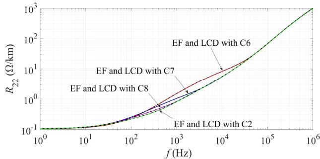

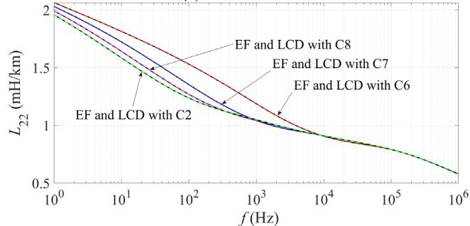  
(a) Resistance $R _ { 2 2 }$   
(b) Inductance $L _ { 2 2 }$   
Fig. 5 Series impedance of sheath for submarine cable shown in Fig. 3 (b).

# 6) Influence of multi-layer seabed

Based on case C2, an additional layer of seabed is added, with the parameters given in TABLE IV. As shown in Fig. 6, the resistivity of the second layer of seabed has a negligible influence on the sheath series impedance of the submarine cable. The thickness of the first layer of seabed is 5 m.

TABLE IV PARAMETERS OF SEAWATER AND SEABED   

<table><tr><td>Case</td><td>ρseawater (Ωm)</td><td>ρseabed 1 (Ωm)</td><td>ρseabed 2 (Ωm)</td><td>Depth of Seawater d1 (m)</td><td>Depth of Seabed 1 (m)</td></tr><tr><td>C9</td><td rowspan="2">0.2</td><td rowspan="2">10</td><td>100</td><td rowspan="2">15</td><td rowspan="2">20</td></tr><tr><td>C10</td><td>500</td></tr></table>

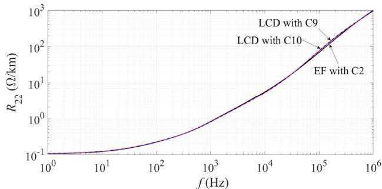

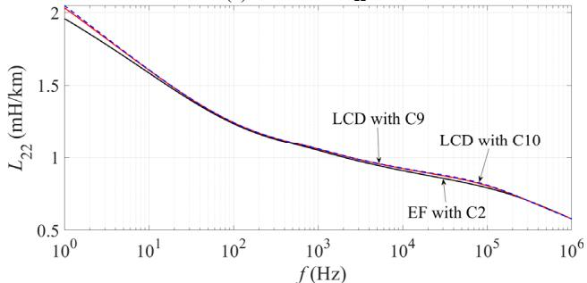  
(a) Resistance $R _ { 2 2 }$   
(b) Inductance $L _ { 2 2 }$   
Fig. 6 Series impedance of sheath for submarine cable shown in Fig. 3 (b).

Moreover, the thickness of the first layer of seabed is varied from 10 m to 15 m, as given in TABLE V. The impedance results are illustrated in Fig. 7. Again, only a minor influence is observed. Therefore, a single layer of seabed is qualitatively sufficient for impedance calculations.

TABLE V PARAMETERS OF SEAWATER AND SEABED   

<table><tr><td>Case</td><td>ρseawater (Ωm)</td><td>ρseabed 1 (Ωm)</td><td>ρseabed 2 (Ωm)</td><td>Depth of Seawater d1 (m)</td><td>Depth of Seabed 1 (m)</td></tr><tr><td>C11</td><td rowspan="2">0.2</td><td rowspan="2">10</td><td rowspan="2">100</td><td rowspan="2">15</td><td>25</td></tr><tr><td>C12</td><td>30</td></tr></table>

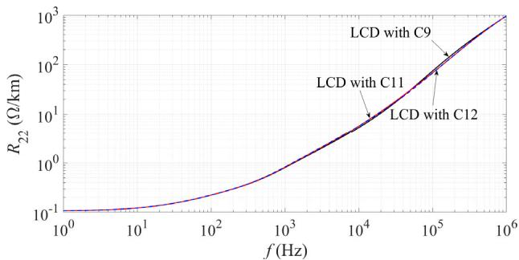  
(a) Resistance $R _ { 2 2 }$

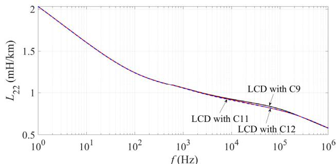  
(b) Inductance $L _ { 2 2 }$   
Fig. 7 Series impedance of sheath for submarine cable shown in Fig. 3 (b).

# 7) Influence of relative permittivities of seawater and seabed

Based on [28], the relative permittivities of the seawater and seabed $\left( \varepsilon _ { r w } \right.$ and $\varepsilon _ { r b } )$ are set to 81 and 20 in C2. The influence of the permittivity on impedance calculation is shown in Fig. 8. No visible effect is observed.

In addition to the submarine cable, the permittivity has also a minor effect on parameters and propagation characteristics of underground cable, as explained in [10].

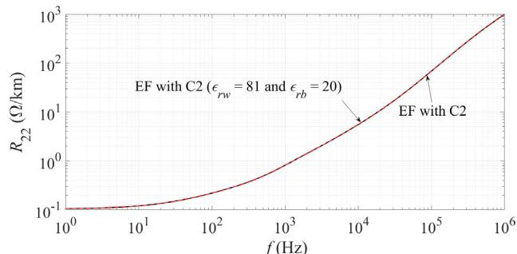

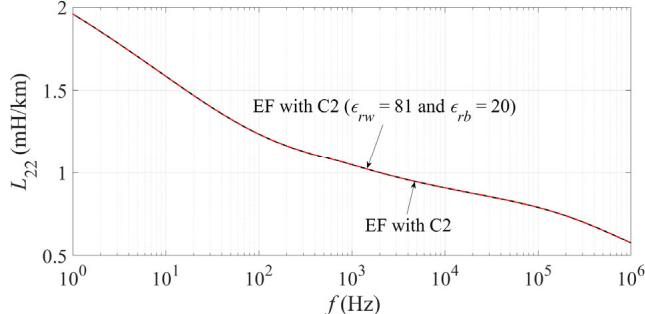  
(a) Resistance $R _ { 2 2 }$   
(b) Inductance $L _ { 2 2 }$   
Fig. 8 Series impedance of sheath for submarine cable shown in Fig. 3 (b). 8) Influence of wired armor

The LCD method is used for the calculation of wired armor impedance with consideration of accurate skin and proximity effects. As shown in Fig. 3 (a), each phase of submarine cable has 67 physical conductors which consist of core, sheath and 65 armor wires.

Considering limited inter-wire conductivity in the armor, the armor wires are assumed to be insulated from each other [29]. Since the armor wires are rotationally symmetrical, the total current carried by the armor is assumed to be equally distributed on each wire. Also, it means that the voltage equally drops for 65 wires by a pitch length in the armor. Next, the MoM-SO [29] method used in LCD has been adopted to deal with wired armor. After obtaining full impedance matrix with dimension of 67- by-67, the wired armor is spiraled by averaging out impedance of 65 wires in the full matrix, and then an equivalent armor is left. Therefore, a 3-by-3 series impedance matrix is produced

considering skin, proximity and spiraling effects of wired armor structure.

The deviation between armor impedance calculated using equivalent tubular conductor and wired structure is defined by the following expressions. Since the LCD method produces the accurate expressions of wired armor structure, it is set as reference.

$$
\operatorname{Dev} R _ {33} = \left| \frac {R _ {33 \mathrm {eq}} - R _ {33 \mathrm {LCD}}}{R _ {33 \mathrm {LCD}}} \right| \times 100 \% \tag{14}
$$

$$
D e v L _ {33} = \left| \frac {L _ {33 \mathrm {eq}} - L _ {33 \mathrm {LCD}}}{L _ {33 \mathrm {LCD}}} \right| \times 100 \% \tag{15}
$$

where $R _ { 3 3 \mathrm { e q } }$ and $L _ { 3 3 \mathrm { e q } }$ are armor resistance and inductance calculated using EF and equivalent tubular conductor based on Fig. 3 (b), $R _ { 3 3 \mathrm { L C D } }$ and $\boldsymbol { L } _ { 3 3 \mathrm { { L C D } } }$ are armor resistance and inductance calculated using LCD method based on Fig. 3 (a).

Fig. 9 shows the evaluated deviations using (14) and (15) based on case C2. In general, the armor impedance calculated using equivalent tubular conductor gives relatively low deviation to the results obtained by LCD method.

The maximum deviation is observed at 1 MHz for armor resistance, and it is around 3%. However, if the frequency is below 100 kHz, the maximum deviation is less than 1%. The maximum deviation of armor inductance is less than 0.5% for full frequency spectrum.

Therefore, it is accurate enough to represent the wired armor structure of submarine cable using an equivalent tubular conductor.

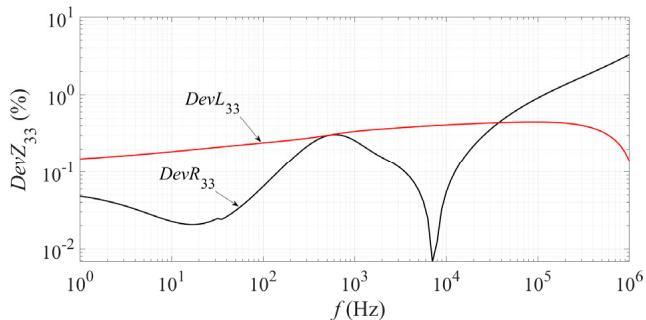  
Fig. 9 Deviation of series impedance of armor for submarine cable shown in Fig. 3 based on case C2.

# B. Propagation constant of submarine cable

Modal propagation constants of submarine cable are calculated and shown in Fig. 10. It involves 2 coaxial modes (core-sheath, sheath-armor) and 1 earth-return mode (ERM).

As expected, the CPC, EF and LCD methods with different external parameters have no effect on propagation constants of two co-axial modes.

Moreover, only minor influence of seabed resistivities on ERM propagation constant has been observed at high frequency, i.e. above 10 kHz. The homogeneous earth model represented by CPC shows significant difference for ERM phase velocity in full frequency spectrum.

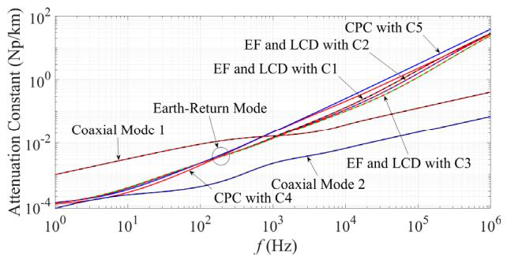

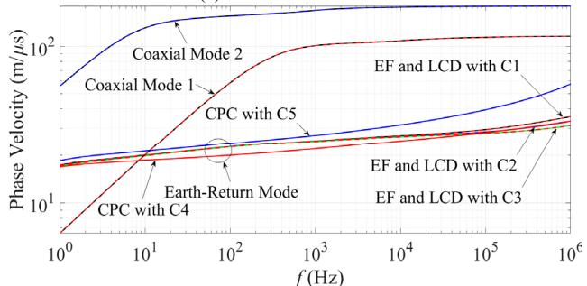  
(a) Attenuation constant   
(b) Phase velocity   
Fig. 10 Propagation constants for submarine cable shown in Fig. 3 (b).

Fig. 11 illustrates the influence of depth of seawater on ERM propagation constant for submarine cable. The attenuation constant decreases as depth increases. In contrast, the phase velocity increases as depth increases. Also, no difference is observed for propagation constant above 60 kHz.

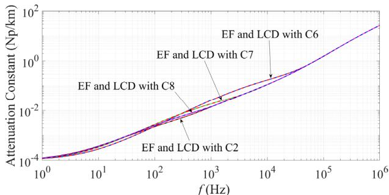

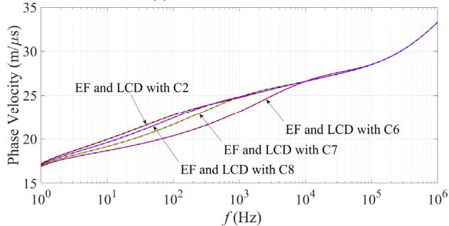  
(a) Attenuation constant   
(b) Phase velocity   
Fig. 11 ERM propagation constant for submarine cable shown in Fig. 3 (b).

Again, the results produced by EF agree well with LCD method for Fig. 10 and Fig. 11.

# C. Validation of EHEM

The deviation of series impedance of sheath $Z _ { 2 2 }$ calculated by EHEM on submarine cable can be represented by the following expressions.

$$
\operatorname{Dev} Z _ {22 \mathrm {E H E M}} = \left| \frac {Z _ {22 \mathrm {E H E M}} - Z _ {22 \mathrm {E F}}}{Z _ {22 \mathrm {E F}}} \right| \times 100 \% \tag{16}
$$

where $Z _ { 2 2 \mathrm { E H E M } }$ and $Z _ { 2 2 \mathrm { E F } }$ mean that the series impedance of sheath on submarine cable in (13) is calculated using EHEM and EF, respectively.

It should be noted that $Z _ { 2 2 \mathrm { E F } }$ is also replaced by the impedance evaluated using LCD method, the same results are observed.

As shown in Fig. 12, the maximum error of EHEM is less than 3% for all cases.

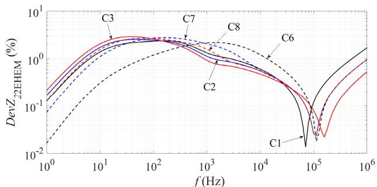  
Fig. 12 Deviation of series impedance of sheath on submarine cable between EHEM and EF.

The deviation of ERM propagation constant between EHEM and EF has the following expression.

$$
\operatorname{Dev} \gamma_ {\mathrm {EHEM}} = \left| \frac {\gamma_ {\mathrm {EHEM}} - \gamma_ {\mathrm {EF}}}{\gamma_ {\mathrm {EF}}} \right| \times 100 \% \tag{17}
$$

where $\gamma _ { \mathrm { E H E M } }$ and $\gamma _ { \mathrm { E F } }$ are ERM propagation constants which are calculated using (9) and (1) in (13), respectively.

The deviation of ERM propagation constant using EHEM and EF is illustrated in Fig. 13. The maximum error produced by EHEM is less than 2% for all cases.

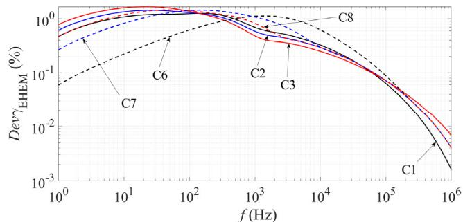  
Fig. 13 Deviation of ERM propagation constant on submarine cable between EHEM and EF.

If the separation between each phase of submarine cable is decreased to 1 m, a full 18-by-18 impedance matrix of two circuits can be calculated. Considering upper triangular parts of impedance matrix (3-by-3 and 18-by-18), the EHEM achieves a better computational efficiency than EF and new LCD methods. The general acceleration ratio of EHEM is ranging from 2.8 to 6.5 times per frequency point, which depends on the cable arrangement. This will have a practical influence on a frequency scan covering a large band.

# D. Input impedance for mixed transmission system

The input impedance of mixed transmission system as a function of frequency is illustrated in Fig. 14. The positive and zero sequences are scanned at the 500 kV AC1 bus shown in Fig. 1. The grounding resistance at both ends of cable is set to 4 Ω.

First of all, the overhead lines 1 and 2 and underground cable are modelled by current Line Constants [7] and Cable Constants [8] routines within EMTP. The submarine cable is calculated by Cable Constants [8] with cases C4 and C5. In total, it represents the current modeling way of mixed transmission system in EMT-type simulation tools [6]. The results are marked by CPC with C4 and C5 in Fig. 14.

Furthermore, the overhead lines 1 and 2 and underground cable are modelled by extended TL [10]-[15]. The submarine cable is considered using EF, LCD and EHEM methods for case C2. It gives a completely new combination for modeling the mixed transmission system in EMTP [19]. The results are indicated by EF, LCD and EHEM with C2 in Fig. 14.

As shown in Fig. 14, the input impedances produced by CPC agree well with EF, LCD and EHEM up to 40 kHz. If the frequency is above 40 kHz, several abnormal spike like impedances are observed for both positive and zero sequences, especially at 46.3 kHz, 162.8 kHz and 615.9 kHz. However, such behavior has not been produced by EF, LCD and EHEM methods. The reason comes from the inaccurate representation of mixed transmission system using current Line Constants [7] and Cable Constants [8] routines.

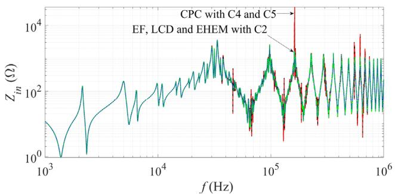

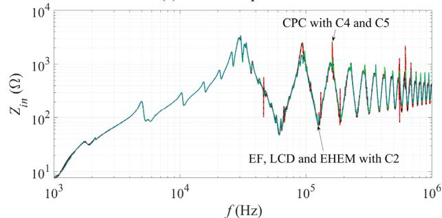  
(a) Positive sequence   
(b) Zero sequence   
Fig. 14 Input impedance of mixed transmission system shown in Fig. 1.

# IV. RESPONSES IN TIME DOMAIN

In this section, steady state and transient simulations are performed using an existing EMT-type simulation tool [19] based on mixed transmission system. The numerical instability in simulations is avoided using the modeling approach proposed in Section III - D. The energization and short-circuit characteristics of the mixed system are also investigated in this

section. The WB model [22] is used in the following time domain studies.

# A. Numerical instability in steady state simulation

The circuit breakers CB1A, CB1B, CB2A and CB2B shown in Fig. 1 are closed in the initial state. The simulation starts from steady state. The system modeling way follows the same manner discussed in Section III - D.

The core voltage of submarine cable in upper circuit is illustrated in Fig. 15, and it is measured at phase A of receiving end. A numerical instability has been observed at 1 ms for the results simulated by CPC. The fitter of the WB model is unable to produce a passive and stable model because of the unphysical behavior of the series and shunt parameters of the underground cable as computed by the CPC method and shown in Fig. 14 leading to stringent to fit cable functions.

Another internal relation is from the abnormal spike like impedances shown in Fig. 14 since it could cause difficulties for WB fitting. The EF, LCD and EHEM give a stable simulation, also no passivity violations are observed during the fitting.

Note that the underground cable is only modeled using extended TL approach in order to keep the simulation stable in the following sections.

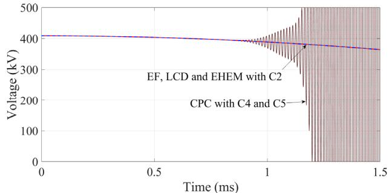  
Fig. 15 Core voltage of submarine cable in upper circuit.

# B. Energization of upper circuit

The circuit breakers CB1B, CB2A and CB2B shown in Fig. 1 are opened. The upper circuit is energized through CB1A with phase A, B and C closing at t = 1 ms, 1.5 ms and 2ms. The influences of modeling of mixed transmission system on upper circuit energization are shown in Fig. 16 to Fig. 19.

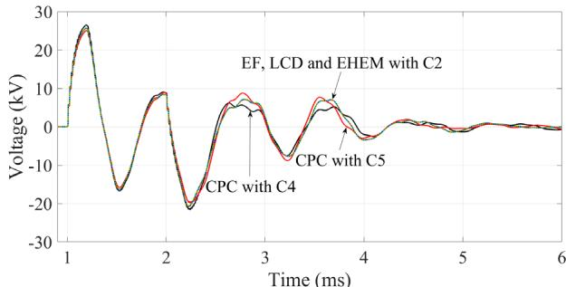  
Fig. 16 Sheath voltage V1SS of submarine cable in upper circuit.

As illustrated in Fig. 16, the results produced by CPC have minor effects on sheath voltage at sending end of submarine cable in upper circuit.

At the receiving end of underground cable, more visible influence simulated by EF, LCD and EHEM on attenuation of

sheath voltage are observed in Fig. 17. The results obtained by CPC with C4 are over-damped between 1.5 ms and 4 ms.

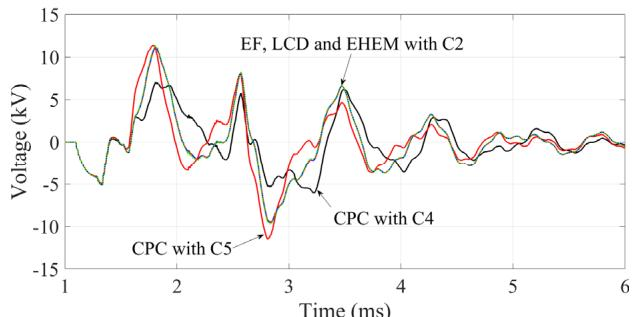  
Fig. 17 Sheath voltage $V _ { 1 S R }$ of underground cable in upper circuit.

Fig. 18 illustrates induced sheath voltage at sending end of submarine cable in lower circuit. A significant influence using EF, LCD and EHEM is observed in comparison to the results evaluated by CPC with C4 and C5. Also, the CPC gives an underestimation for the induced sheath voltage of adjacent circuit. For example, the maximum overvoltage in negative polarity is observed at t = 2.8 ms with -2.52 kV for EF, LCD and EHEM. However, the negative peak voltages with -1.84 kV and -1.67 kV are obtained using CPC with C4 and C5. The deviations reach to 27% and 34%.

The energy absorbed by phase C of SA at receiving end of overhead line 2 in upper circuit is given in Fig. 19. At t = 4 ms, the energies are 134.7 kJ, 134.9 kJ and 136.9 kJ for accurate methods, CPC with C5 and C4 respectively. The influence is minor for absorbed energy of SA.

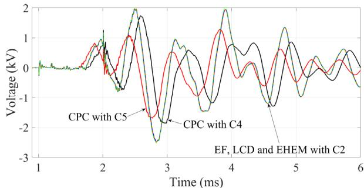  
Fig. 18 Induced sheath voltage V2SS of submarine cable in lower circuit.

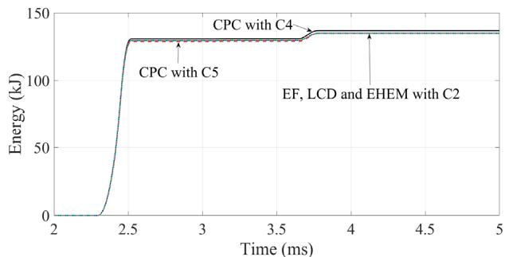  
Fig. 19 Energy of phase C of SA at receiving end of overhead line 2 in upper circuit.

Furthermore, the influence of closed separation in cables is investigated. Note that the results of simulation shown in Fig. 20 to Fig. 23 are based on a separation of one meter between each phase for both submarine and underground cables. Thus, the mutual coupling of six phases of double circuits has been included into the calculations of parameters using EF, LCD,

EHEM and CPC methods. The other conditions are kept the same to Fig. 16 to Fig. 19.

As shown in Fig. 21, more noticeable effects using EF, LCD and EHEM methods on sheath voltage are observed at receiving end of underground cable. The maximum overvoltage appears at negative polarity with -10.23 kV for EF, LCD and EHEM, and -8.2 kV and -8.1 kV for CPC with C4 and C5. The deviations reach 20% and 21%.

Fig. 22 shows the sheath voltage at the sending end of submarine cable in the lower circuit. It is clear that the results obtained using EF, LCD and EHEM methods have a higher damping effect than the results calculated using CPC with C4.

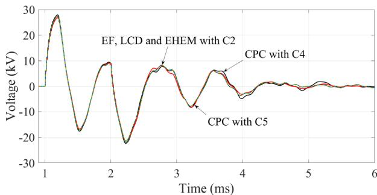  
Fig. 20 Sheath voltage $V _ { 1 S S }$ of submarine cable in upper circuit.

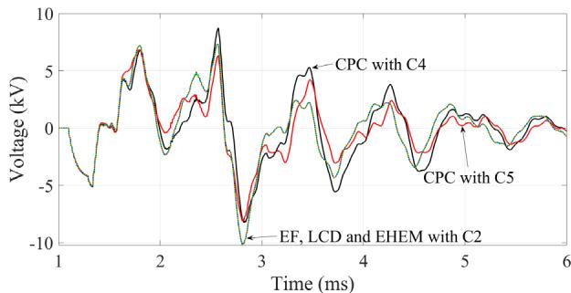  
Fig. 21 Sheath voltage $V _ { 1 S R }$ of underground cable in upper circuit.

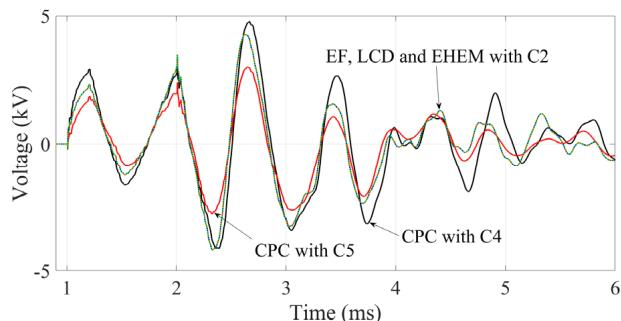  
Fig. 22 Induced sheath voltage $V _ { 2 S S }$ of submarine cable in lower circuit.

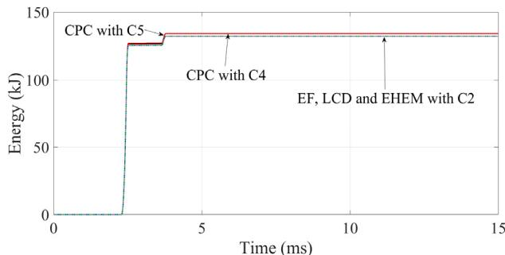  
Fig. 23 Energy of phase C of SA at receiving end of overhead line 2 in upper circuit.

No significant influence from various methods on absorbed energy is observed in Fig. 23.

In general, the closed separation of cable phases decreases the sheath voltage at the receiving end of underground cable in the upper circuit, and increases the induced sheath voltage at the sending end of submarine cable in the lower circuit.

# C. Short circuit fault at upper circuit

The upper and lower circuits in Fig. 1 are working in steady state. A three phase short circuit fault occurs at the receiving end of overhead line 1 through a resistance of 1 Ω in the upper circuit, and the fault occurs at t = 0.1 s. Next, the fault is cleared by CB1A and CB1B at t = 0.17 s. The maximum overvoltages on cable sheath in upper circuit due to the clearance of fault are shown in Fig. 24 and Fig. 25. Also, the influences of depth of seawater are investigated and illustrated in Fig. 26 and Fig. 27.

As shown in Fig. 24 and Fig. 25, the visible influences on results evaluated by CPC with C4 and C5 are observed in comparison to results obtained by EF, LCD and EHEM.

The depth of seawater has minor effects on the sheath overvoltages, i.e. -13.4 kV, -12.5 kV and -12.4 kV for cases C6, C7 and C8 respectively in Fig. 26.

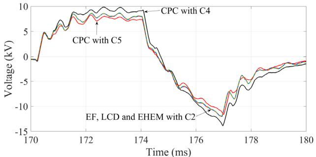  
Fig. 24 Sheath voltage $V _ { 1 S S }$ of submarine cable in upper circuit.

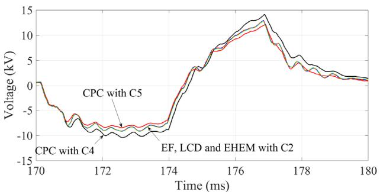  
Fig. 25 Sheath voltage $V _ { 1 S R }$ of underground cable in upper circuit.

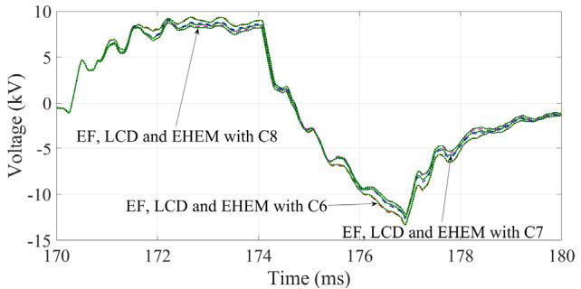  
Fig. 26 Sheath voltage $V _ { 1 S S }$ of submarine cable in upper circuit.

The influence of seabed resistivity on sheath overvoltage such as cases C1 to C3 is also investigated, and no significant

effects are observed on transient waveforms although the results are not given in this paper.

Moreover, the results calculated by EHEM show good agreement with results evaluated by EF and LCD.

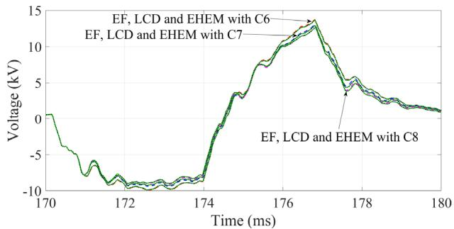  
Fig. 27 Sheath voltage $V _ { 1 S R }$ of underground cable in upper circuit.

As a future work, a thorough investigation of lightning transients on mixed transmission systems can be performed using the proposed methods in this paper, to compare with current studies still based on the existing Line and Cable Constants techniques in EMT-type simulation tools [30]-[33].

# V. CONCLUSIONS

This paper discusses the formulations, system responses in frequency and time domains for a mixed transmission system based on traditional and novel modeling ways in EMT-type simulation tools. It has the following general conclusions.

A practical 500 kV mixed transmission system has been introduced. The system consists of overhead lines, submarine cables and underground cables.   
An EF of earth-return impedance for submarine cable which is buried in seabed is derived. Also, a new EHEM is proposed based on EF. The relative error between EHEM and EF is less than 3% for series impedance and modal propagation constant.   
The air, seawater and seabed structure has significant influence on calculated impedance and modal propagation constant for submarine cables.   
The wired armor structure and multi-layer of seabed have minor effects on series impedance of submarine cable compared to the results calculated using equivalent tubular armor and single layer of seabed.   
Several abnormal spikes are shown in sequence impedances scan for the mixed transmission system if the traditional CPC method is used   
A numerical instability has been observed if the CPC method is adopted into modeling of underground cable. The instability is removed by the new modeling way developed in this paper.   
More visible influences of various methods on sheath voltages are observed at receiving end of underground cable in the upper circuit and sending end of submarine cable in the lower circuit.   
Separation between phases of submarine and underground cables impacts on sheath voltages.   
The investigations in this paper contribute to further understanding of cable modeling in the mixed

transmission system, and the simulation results can be used as reference for validation of existing techniques, and standards in EMT-type studies.

# REFERENCES

[1] H. Khalilnezhad, M. Popov, L. van der Sluis, J. A. Bos and A. Ametani, "Statistical analysis of energization overvoltages in EHV hybrid OHL– Cable Systems," IEEE Trans. Power Del, vol. 33, no. 6, pp. 2765-2775, 2018.   
[2] A. Said and Z. Anane, "Corona lightning overvoltage analysis for a 500 kV hybrid line", IET Generation Transmission & Distribution, vol. 14, no. 4, pp. 532-541, 2020.   
[3] WG B1.05, Transient Voltages Affecting Long Cables, Cigre Technical Brochure, 2005.   
[4] Z. Zhou, X. Liu, S. Wang, C. Zhu, H. Liu and C. Song, "Simulation calculation of transient voltages on insulation and sheath along 500 kV XLPE submarine cable", High Voltage Engineering, vol. 44, no. 8, pp. 2725-2731, 2018.   
[5] R. Benato, S. Dambone Sessa, R. De Zan, M. R. Guarniere, G. Lavecchia and P. Sylos Labini, "Different bonding types of Scilla–Villafranca (Sicily–Calabria) 43-km double-circuit AC 380-kV submarine–land cables," IEEE Trans. on Industry Applications, vol. 51, no. 6, pp. 5050- 5057, 2015.   
[6] A. Ametani (editors), Numerical Analysis of Power System Transients and Dynamics, IET, 2015.   
[7] H.W. Dommel, Line Constants, Bonneville Power Administration, 1972.   
[8] A. Ametani, Cable Constants, Bonneville Power Administration, 1976.   
[9] A. Ametani, "A general formulation of impedance and admittance of cables," IEEE Trans. PAS, vol. PAS-99, pp. 902-910, 1980.   
[10] H. Xue, A. Ametani, J. Mahseredjian and I. Kocar, "Generalized formulation of earth-return impedance / admittance and surge analysis on underground cables," IEEE Trans. Power Delivery, vol. 33, no.6, pp.2654-2663, 2018.   
[11] H. Xue, A. Ametani, J. Mahseredjian, Y. Baba, F. Rachidi and I. Kocar, “Transient responses of overhead cables due to mode transition in high frequencies”, IEEE Trans. Electromag. Compat, vol. 60, no. 3, pp.785- 794, 2018.   
[12] H. Xue, A. Ametani, J. Mahseredjian, Y. Baba and F. Rachidi, "Frequency response of electric and magnetic fields of overhead conductors with particular reference to axial electric field," IEEE Trans. Electromag. Compat, vol. 60, no. 6, pp. 2029-2032, 2018.   
[13] A. Ametani, Y. Miyamoto, Y. Baba, and N. Nagaoka, "Wave propagation on an overhead multiconductor in a high frequency region," IEEE Trans. Electromag. Compat, vol. 56, pp. 1638-1648, 2014.   
[14] H. Xue, A. Ametani and K. Yamamoto, "Theoretical and NEC calculations of electromagnetic fields generated from a multi-phase underground cable," IEEE Trans. Power Delivery, vol. 36, no.3, pp.1270- 1280, 2021.   
[15] H. Xue, J. Mahseredjian, A. Ametani, J. Morales-Rodriguez and I. Kocar, "Generalized formulation and surge analysis on overhead lines: impedance / admittance of a multi-layer earth,"IEEE Trans. Power Delivery, vol. 36, no. 6, pp. 3834-3845, 2021.   
[16] H. Xue, A. Ametani, J. Mahseredjian and I. Kocar, "Computation of overhead line / underground cable parameters with improved MoM - SO method," Power Systems Computation Conference (PSCC), Dublin, 2018.   
[17] R. Alipio, H. Xue and A. Ametani, "An accurate analysis of lightning overvoltages in mixed overhead-cable lines," Electric Power Systems Research, vol. 194, 2021.   
[18] D. A. Tsiamitros, G. K. Papagiannis, and P. S. Dokopoulos, "Homogenous earth approximation of two-layer earth structures: An equivalent resistivity approach," IEEE Trans. Power Del., vol. 22, pp. 658-666, 2007.   
[19] J. Mahseredjian, S. Dennetière, L. Dubé, B. Khodabakhchian and L. Gérin-Lajoie, "On a new approach for the simulation of transients in power systems," Electric Power Systems Research, vol. 77, no.11, pp. 1514-1520, 2007.   
[20] U. R. Patel and P. Triverio, "MoM-SO: a complete method for computing the impedance of cable systems including skin, proximity, and ground return effects," IEEE Trans. Power Delivery, vol. 30, pp. 2110-2118, 2014.   
[21] U. R. Patel and P. Triverio, "Accurate impedance calculation for underground and submarine power cables using MoM-SO and a

multilayer ground model," IEEE Trans. Power Delivery, vol. 31, pp. 1233-1241, 2016.   
[22] I. Kocar and J. Mahseredjian, "Accurate frequency dependent cable model for electromagnetic transients," IEEE Trans. Power Del, vol. 31, pp.1281- 1288, 2016.   
[23] J. A. Martinez-Velasco (editors), Power System Transients: Parameter Determination, CRC Press, 2009.   
[24] D. A. Tsiamitros, G. K. Papagiannis, and P. S. Dokopoulos, "Earth return impedances of conductor arrangements in multi-layer soils-Part I: Theoretical model," IEEE Trans. Power Del., vol. 23, pp.2392-2400, 2008.   
[25] A. Ametani, T. Ohno and N. Nagaoka, Cable System Transients: Theory, Modeling and Simulation, Wiley-IEEE Press, 2015.   
[26] X. Xu, X. Chen, F. Meng and A. Paramane, "Grounding system analysis of 220kV power cable lines installed underneath a bridge," IEEE Trans. Power Delivery, DOI: 10.1109/TPWRD.2021.3077620.   
[27] M. Ashouri, F. Faria da Silva and C. L. Bak, "On the application of modal transient analysis for online fault localization in HVDC cable bundles," IEEE Trans. Power Delivery, DOI: 10.1109/TPWRD.2019.2942016.   
[28] A. Martinez and A. P. Byrnes, "Modeling dielectric-constant values of geologic materials: An aid to ground-penetrating radar data collection and interpretation," Current Research in Earth Sciences, vol. 247, no. 1, 2001.   
[29] U. R. Patel, B. Gustavsen and P. Triverio, "An equivalent surface current approach for the computation of the series impedance of power cables with inclusion of skin and proximity effects," IEEE Trans. Power Del., vol. 28, no. 4, pp. 2474-2482, 2013.   
[30] T. Henriksen, B. Gustavsen, G.Balog and U. Baur, "Maximum lightning overvoltage along a cable protected by surge arresters," IEEE Trans. Power Delivery, vol. 20, no. 2, pp. 859-866, 2005.   
[31] L. Colla, F. M. Gatta, A. Geri and S. Lauria, "Lightning overvoltages in HV-EHV “mixed” overhead-cable lines," International Conference on Power System Transients (IPST), Lyon, 2007.   
[32] F. Faria da Silva, K. S. Pedersen and C. L. Bak, "Lightning in hybrid cable-overhead lines and consequent transient overvoltages," International Conference on Power System Transients (IPST), Seoul, 2017.   
[33] A. Ametani, H. Xue, T. Ohno and H. Khalilnezhad, Electromagnetic Transients in Large HV Cable Networks: Modeling and Calculations, IET, 2021.