# 电磁-机电暂态混合仿真中机电侧故障的仿真方法

张怡1, 吴文传1, 张伯明1, Aniruddha M. Gole2

(1. 电力系统及发电设备控制和仿真国家重点实验室(清华大学电机系), 北京市海淀区 100084;

2. 曼尼托巴大学电气与计算机工程系, 加拿大 温尼伯 R3T 5V6)

# Simulation Method of Faults on Electromechanical Side in Electromagnetic and Electromechanical Hybrid Simulation

ZHANG Yi $^{1}$ , WU Wenchuan $^{1}$ , ZHANG Boming $^{1}$ , Aniruddha M. Gole $^{2}$

(1. State Key Lab of Control and Simulation of Power Systems and Generation Equipments (Dept. of Electrical Engineering,

Tsinghua University), Haidian District, Beijing 100084, China;

2. Department of Electrical and Computer Engineering, University of Manitoba, Winnipeg R3T 5V6, Canada)

ABSTRACT: The frequency dependent network equivalent (FDNE) based electromagnetic and electromechanical hybrid simulation system can not simulate the faults on the electromechanical network side. Firstly, a hot standby method was proposed to initialize the state variables of the new FDNE to decrease the spurious transient during the swap. Secondly, an electrical distance index was proposed to quickly determine the necessity of the swap of the FDNE. Thirdly, an electrical distance index based FDNE-swapping strategy was proposed to save computational burden. Several systems are used as the examples to demonstrate the accuracy and efficiency of the proposed electrical distance index based FDNE-swapping method.

KEY WORDS: critical electrical distance index; electromagnetic transient; electromechanical transient; frequency dependent network equivalent post fault; initialization

摘要：基于频率相关网络等值(frequency dependent network equivalent，FDNE)的电磁-机电暂态解耦混合仿真系统一般不能处理机电暂态侧网络的故障。首先提出一种伴随仿真方法来初始化多个FDNE的状态，以实现FDNE的平稳切换。另外，通过大量仿真研究提出一种临界电气距离指标，用于快速鉴别机电暂态侧故障时是否需要在仿真中修改FDNE。最后，提出一种基于上述临界电气距离指标的FDNE切换策略以减小总体计算量。仿真结果表明基于临界电气距离指

标的FDNE切换策略能够保证混合仿真的精度和效率。

关键词：临界电气距离指标；电磁暂态；机电暂态；故障后的频率相关网络等值；初始化

# 0 引言

综合电磁暂态(electromagnetic transient，EMT)程序和传统的机电暂态稳定分析(transient stability analysis，TSA)程序的混合仿真不仅可以精确仿真高压直流输电系统(high-voltage direct current，HVDC)的电磁暂态特性和非线性元件引起的波形畸变，还可以用于大规模网络的仿真。

文献[1-13]均实现了电磁机电暂态混合仿真，但是无法考虑混合仿真接口处的谐波和波形畸变对电磁侧的影响，同时缺少进行机电侧故障的研究。文献[14-16]采用频率相关网络等值(frequency dependent network equivalent, FDNE)来模拟机电暂态侧谐波对电磁暂态侧的影响。但是，当机电暂态侧网络发生故障时，网络结构的变化直接导致FDNE的频率响应发生变化，原始的FDNE将不再适用。若对机电暂态侧每个故障都在仿真过程中重新用矢量拟合法求取故障后的FDNE, 计算量很大。因此有必要研究适用于机电暂态侧故障的FDNE的仿真策略。

本文首先提出一种伴随仿真方法来初始化故障后的 FDNE，以减少 FDNE 切换过程中的暂态波动。然后根据大量算例分析提出一种快速鉴别机电暂态侧故障对于仿真精度的影响大小的指标。最后基于该指标提出一种 FDNE 切换策略：对于影响小

的故障，仍然采用故障前的FDNE来仿真机电暂态侧故障；对于影响大的故障，采用故障后的FDNE和伴随仿真法进行混合仿真。

# 1 FDNE的切换

# 1.1 概述

FDNE代表机电暂态侧网络的频率特性，当机电暂态侧发生故障时，机电暂态侧的频率特性将会发生变化，因此故障后的FDNE与故障前的FDNE不一样。

# 1.2 用补偿法求取故障后的FDNE

求取故障前的FDNE分为3步：求取FDNE的频率采样值；运用矢量拟合法求取用有理函数表示的FDNE矩阵；然后进行无源校正[16]。故障后的FDNE的求取与故障前FDNE的求取方法类似。唯一不同的是故障后FDNE的采样矩阵用补偿法[17]来求取，如图1所示。

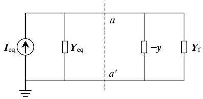  
图1补偿法求取FDNE的基本概念  
Fig.1 Basic concept of the compensation method to obtain FDNE post-fault

求取故障后FDNE采样矩阵的方法是：若故障发生在 $aa^{\prime}$ 之间(包括母线 $aa^{\prime}$ )，将网络受故障影响的元件从原始网络中分离出来。虚线 $aa^{\prime}$ 是故障端口， $aa^{\prime}$ 右边的网络是受故障影响的元件，而 $aa^{\prime}$ 左边的网络是原始网络对应的诺顿等值电路。故障前受故障影响的元件对原始网络的贡献是 $\mathbf{y}$ ，接入 $-\mathbf{y}$ 相当于从原始网络是把受故障影响的元件移出；在故障下受故障影响的元件对原始网络的贡献是 $\mathbf{Y}_{\mathrm{f}}$ 。将 $-\mathbf{y}$ 和 $\mathbf{Y}_{\mathrm{f}}$ 添加到原始的诺顿等值网络中意味着移除了故障元件在非故障情况下的贡献，并且同时添加了故障元件在故障情况下的贡献。

# 1.3 故障后FDNE的初始化

故障后的FDNE矩阵转换为状态空间形式后，可表示为

$$
\left\{ \begin{array}{l} \dot {\boldsymbol {x}} = \boldsymbol {A} \boldsymbol {x} + \boldsymbol {B} \boldsymbol {U} \\ \boldsymbol {I} = \boldsymbol {C} \boldsymbol {x} + \boldsymbol {D} \boldsymbol {U} \end{array} \right. \tag {1}
$$

式中： $x$ 、 $I$ 和 $U$ 的维数都为 $N \times 1$ ， $x$ 为状态变量， $I$ 为节点注入电流，而 $U$ 为节点电压；矩阵 $A$ 、 $B$ 、 $C$ 和 $D$ 的具体定义参见文献[16]。

由于 FDNE 含 LC 等储能元件，FDNE 的初始化是 FDNE 切换策略中的重要部分，其实质是初始化式(1)中的状态变量 $x$ 。简单地将故障前的 FDNE 切换至故障后的 FDNE 可能会造成电磁暂态侧故障瞬间出现较大的暂态波动。这是因为故障后的 FDNE 中的状态变量 $x$ 是未知的，若没有经过正常的初始化，会产生跳变。用故障前瞬间的 $x$ 来初始化故障后 FDNE 的状态变量 $x$ 也不行，因为这样会导致 FDNE 切换时 FDNE 内部状态变量的不准确。

因此，本文提出一种伴随仿真法来初始化故障后的 FDNE，以尽可能减少故障瞬间的暂态波动。电网故障发生后一般有故障前、故障后、跳闸、重合成功等几个阶段。图2介绍了故障前后FDNE切换策略的概念，对跳闸、重合闸等阶段，其切换策略的基本概念是一样的。图中FDNE1是指故障前的FDNE，而FDNE2指故障后的FDNE。故障前后FDNE的切换步骤如下：

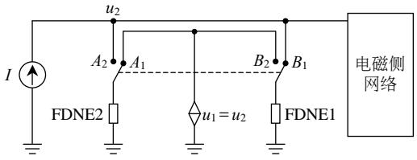  
图2 故障后FDNE的初始化方法  
Fig. 2 Initialization method for the FDNE post-fault

1）仿真开始时，故障并没有发生，FDNE1和FDNE2对应的开关分别接在 $A_{1}$ 和 $B_{1}$ 上。FDNE2由FDNE1端口的电压进行初始化，FDNE1和FDNE2同时进行计算，但是FDNE2并不参与网络计算；  
2）当故障发生时，FDNE1和FDNE2对应的2个开关分别从 $A_{1}$ 、 $B_{1}$ 切换到 $A_{2}$ 、 $B_{2}$ 。这样FDNE2参与电磁机电暂态混合仿真计算，而FDNE1则用FDNE2端口的电压进行跟踪仿真，不参与电磁机电暂态混合仿真的计算。通过这种初始化，可最小程度地减小FDNE切换过程的暂态波动。

相对于零启动方式，由于需要对故障后的FDNE进行伴随仿真，因此此种初始化方式会增加计算量。但是对于两端口的FDNE，FDNE的计算量是混合仿真总计算量的大约 $14\%$ ，因此是可以接受的。

# 2 临界电气距离指标

# 2.1 基本概念

机电暂态侧网络比较大，如果对机电暂态侧网

络每个故障都采用 1.3 节中的方法进行仿真，则仿真的总体效率将会很低。故障位置不同，故障前后 FDNE 频率响应的变化量也会不同，对电磁暂态侧暂态的影响也是不同的。下文中介绍的误差指标可以用来量化这种“影响”，即 FDNE 频率响应的变化量和电磁暂态侧暂态的变化量；下文中介绍的电气距离可以用来量化这种“位置”，即故障到电磁暂态侧的距离。从这个角度来说，有 2 个方面需要研究：

1）故障离电磁暂态侧的电气距离对FDNE频率响应的变化量的关系。机电暂态侧的故障会改变机电暂态侧对应的FDNE频率响应曲线，故障位置不同对应的频率响应曲线的变化量也不同。  
2）故障离电磁暂态侧的电气距离与电磁暂态侧暂态的变化量的关系。机电暂态侧网络的故障会引起电磁暂态侧暂态发生相应的变化，故障位置不同对应的电磁暂态变化量也不同。

# 2.2 误差指标

本文采用均方根作为误差指标来量化FDNE频率响应的变化量和电磁暂态侧暂态的变化量：

$$
\Delta E _ {\mathrm {F R}} = \sqrt {\frac {1}{n} \sum_ {i = 1} ^ {n} \left| Y _ {\mathrm {r i}} (i \Delta \omega) - Y _ {\mathrm {s i}} (i \Delta \omega) \right| ^ {2}} \tag {2}
$$

$$
\Delta E _ {\text {t r a n s}} = \sqrt {\frac {1}{n} \sum_ {i = 1} ^ {n} \left| \mathbf {y} _ {\mathrm {r i}} (i \Delta t) - \mathbf {y} _ {\mathrm {s i}} (i \Delta t) \right| ^ {2}} \tag {3}
$$

对于频率响应的变化量来说，式(2)中的指标 $\Delta E_{\mathrm{FR}}$ 是故障前FDNE在等频率点的值 $Y_{\mathrm{ri}}$ 和故障后FDNE在相同频率的值 $Y_{\mathrm{si}}$ 。如果节点导纳矩阵是多维的(三相耦合系统)， $Y_{\mathrm{ri}}$ 和 $Y_{\mathrm{si}}$ 则是相应矩阵对角线元素的和。

类似的，在时域过程中，式(3)所示的暂态变化量误差指标 $\Delta E_{\mathrm{trans}}$ 则是全模型电磁暂态仿真结果 $y_{\mathrm{si}}$ 和采用故障后的FDNE的电磁机电暂态仿真结果 $y_{\mathrm{ri}}$ 的均方根。

# 2.3 电气距离

电气距离用来量化2个母线节点之间的距离。目前有2种方法计算电气距离：一种是采用节点间的输入阻抗来计算2个节点间的电气距离[18]；另外一种采用由潮流雅可比矩阵演化而来的灵敏度矩阵[19]。由于第2种方法更能量化2个节点之间电压的相互影响，因此本文采用第2种方法来计算电气距离。

用快速分解法求取潮流时，忽略有功功率与电

压、无功功率与相角的关系，可以得到电压变化量与无功功率变化量之间的关系：

$$
\Delta \boldsymbol {U} = \frac {\partial \boldsymbol {U}}{\partial \boldsymbol {Q}} \Delta \boldsymbol {Q} \tag {4}
$$

假设，除了节点 $j$ 以外的其他节点都没有无功功率变化，即 $\Delta Q_{j} \neq 0$ 和 $\Delta Q_{j} = 0 (i, j \in \{1,2,\dots,N\}, i \neq j)$ ， $N$ 是系统母线数。因此，电气距离可定义为

$$
D _ {i j} = - \lg \alpha_ {i j} \tag {5}
$$

$$
\Delta U _ {i} = \alpha_ {i j} \Delta U _ {j} \tag {6}
$$

式中 $\alpha_{ij} = (\partial U / \partial Q)_{ij} / (\partial U / \partial Q)_{jj}$ 。节点 $i$ 电压对节点 $j$ 电压的灵敏度可用式(6)来表示。由 $D_{ij}$ 组成的矩阵是非对称矩阵。为叙述方便，下文中2点间的电气距离用符号 $\mathbf{D}$ 来表示。

# 2.4 临界电气距离指标的确定

以下分析方法将会应用在本文的算例部分：

1）FDNE频率响应的变化量 $\Delta E_{\mathrm{FR}}$ 与故障位置距离电磁暂态侧的电气距离 $D$ 的关系。  
故障后的FDNE用如1.2节所述补偿法和网络频率扫描的方法求取，然后用式(2)获取误差指标 $\Delta E_{\mathrm{FR}}$ 。求取故障后的FDNE需要在机电暂态侧网络中对应位置设置一个三相短路接地故障。对机电暂态侧网络中的不同母线，采用相同的计算方法可以获取不同母线故障时的误差指标 $\Delta E_{\mathrm{FR}}$ 。同时，这些机电暂态侧母线距离电磁暂态侧端口的电气距离 $D$ 可用式(5)计算出。最后，可得到 $\Delta E_{\mathrm{FR}}$ 和 $D$ 的关系。  
2）电磁暂态侧暂态的变化量 $\Delta E_{\mathrm{trans}}$ 与故障距离电磁暂态侧的电气距离 $D$ 的关系。

类似于1）中的步骤，根据式(3)计算得到不同母线故障时对应的误差指标 $\Delta E_{\mathrm{trans}}$ 。这样，也可以得到 $\Delta E_{\mathrm{trans}}$ 和 $D$ 的关系。

通过以上分析，即可确认当采用故障前的FDNE进行故障前后的仿真时，仍然可以获得较准确的电磁暂态侧暂态的临界电气距离指标。后面的算例分析表明，采用以上面临界电气距离指标的计算结果是可信的。

# 2.5 基于临界电气距离的FDNE的切换策略

当机电暂态侧的故障位置对应的 $D$ 大于临界电气距离指标时，故障前的FDNE能够保证电磁暂态侧的计算精度，就不用求取故障后的FDNE以减小整个仿真系统的计算效率；当机电暂态侧的故障位置对应的 $D$ 小于临界电气距离指标 $D_{\mathrm{cr}}$ ，用故障前FDNE进行仿真会影响电磁暂态侧的计算精度，

则需要重新求取故障后的 FDNE 来替换故障前的 FDNE。基于临界电气距离指标的仿真策略如图 3 所示。

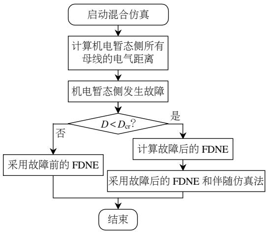  
图3 基于临界电气距离的仿真策略图  
Fig. 3 Critical electrical distance index based strategy flowchart

# 3 算例分析

# 3.1 简介

为了确定临界电气距离指标和测试FDNE切换的精确度，本文采用39节点和118节点2个算例系统。

本文中的发电机、励磁器、调速器和负荷的动态模型均来自于 $\mathrm{PSS / E}^{[20]}$ ，具体如表1所示。而电磁暂态仿真中的直流模型采用CIGRE标准测试模型[21]。

表 1 动态元件模型  
Tab. 1 Dynamic models   

<table><tr><td>元件</td><td>发电机</td><td>励磁器</td><td>调速器</td><td>负荷</td></tr><tr><td>模型</td><td>GENROU</td><td>IEEEET1</td><td>IEEEEG1</td><td>ZIP</td></tr></table>

下文中，全模型 PSCAD/EMTDC 仿真方法用符号 EMT 表示，采用故障前的 FDNE 进行机电暂态侧故障仿真的混合仿真方法用符号 EMT+TSA+FDNE 表示。

# 3.2 临界电气距离指标

# 1）39节点系统。

39 节点系统如图 4 所示, 端口位置选在母线 3 (端口 I) 和母线 8(端口 II) 处。虚线方框部分在电磁暂态模块中建模, 剩余部分在机电暂态模块中建模。

对于混合仿真端口而言，机电暂态侧的每个母线对端口有2个电气距离：一个是到端口I的电气距离，用 $D_{x}$ 表示；另一个是到端口 $\mathbb{I}$ 的电气距离，用 $D_{y}$ 表示。机电暂态侧母线距离端口I、II的电气

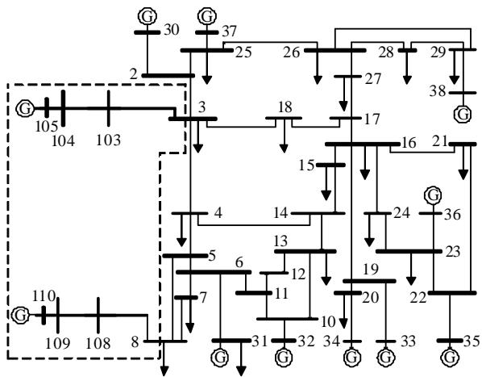  
图4 修改后的新英格兰IEEE39节点系统  
Fig. 4 Modified New England IEEE 39-bus system

距离分布图如图 5(a)所示。从图中可知: 有些母线

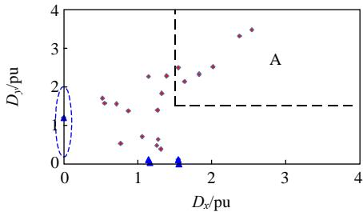  
(a)母线到各端口电气距离分布图

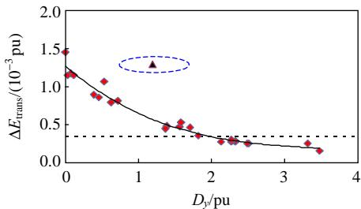  
(b) 暂态变化量

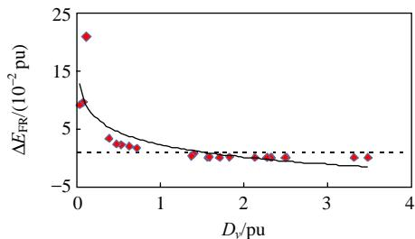  
(c) 频率响应变化量

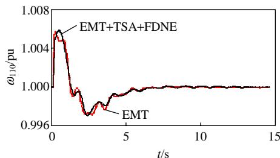  
(d) 电气距离为1.82时的曲线对比   
图5 39节点系统分析结果  
Fig. 5 Analysis results of 39-bus system

离端口I近，但是离端口Ⅱ远；而有的母线距离2端口的距离几乎相同。

对于端口II：选择发电机110的转速 $\omega_{110}$ 作为电磁暂态侧待研究的暂态变量。对机电侧网络中某一母线，单独施加一个 $100\mathrm{ms}$ 的三相短路接地故障，采用§4.3.3的分析方法计算指标 $\Delta E_{\mathrm{trans}}$ 和 $\Delta E_{\mathrm{FR}}$ ；对机电侧网络中其他不同的母线，采用相同的计算方法可以获取不同母线故障时的误差指标 $\Delta E_{\mathrm{trans}}$ 和 $\Delta E_{\mathrm{FR}}$ 。同时，这些机电侧母线距离电磁侧端口II的电气距离为 $D_y$ 。最后，就得到 $\Delta E_{\mathrm{trans}}$ 和 $\Delta E_{\mathrm{FR}}$ 分别与 $D_y$ 的关系。电气距离 $D_y$ 越大，暂态变化量 $\Delta E_{\mathrm{trans}}$ 和频率响应变化量 $\Delta E_{\mathrm{FR}}$ 越小，如图5(b)、(c)所示。对端口I而言，分析结果类似。

本文也选择了不同的混合仿真端口研究上述分析方法的适用性(如选择母线22和母线25、或者母线10和母线8作为混合仿真的端口)。机电暂态侧母线对电磁暂态侧端口的电气距离有远有近，而选择不同的混合仿真端口(即代表采用不同的网络结构来表示机电暂态侧网络)，也可以得到类似的结果。

但是，当母线距离端口I远而距离端口Ⅱ近时，虽然母线距离端口I比较远(即有非常大的电气距离)，但是端口I的电磁暂态特性会受到影响，将会出现一些异常点，如图5(a)、(b)中椭圆圈中的点。

通过这种启发式分析，对端口 II 来说，当电气距离大于 1.5 时 $\left(\Delta E_{\mathrm{trans}}<0.00035 \text { 和 } \Delta E_{\mathrm{FR}}<0.008\right.$ ，如图 5(b)、(c) 所示)，采用故障前的 FDNE 进行机电侧的故障仿真可以得到较精确的结果。同样，对端口 I 进行分析，可以得到类似的结果。如图 5(d) 所示，当电气距离 $D_{y}$ 为大约 1.82 时，采用故障前的 FDNE 即可得到与全系统仿真基本一致的结果。

因此，当 TSA 侧母线对 EMT 所有端口的电气距离都大于 1.5（如图 5(a) 中的区域 A 所示）时，即使采用故障前的 FDNE，仍然可以得到较准确的结果。另外，在 CIGRE 报告中，用来判断直流线路之间相互影响的多馈入直流交互作用因子 (multi-infeed interaction factor, MIIF) 指标是基于式(4) 计算而来的。当 MIIF 小于 0.15 时，直流线路之间的影响可忽略不计[22]。将 0.15 的 MIIF 的参数代入式(5)，得到的临界电气距离指标值为 1.6，与本文中得到的临界电气距离指标值 1.5 十分接近，因此 MIIF 从另一方面证明了本文临界电气距离的正确性。

2）118节点系统。

118 节点系统方框部分在机电暂态模块中建模, 剩余部分在电磁暂态模块中建模, 如图 6 所示。端口位置选在母线 1007(端口 I) 和母线 1029(端口 II) 处, 机电暂态侧母线距离端口 I、II 的电气距离如图 7(a) 所示。

对端口I来说，选择发电机100的转速 $\omega_{100}$ 作为待研究的暂态变量。将上例中的分析方法应用于

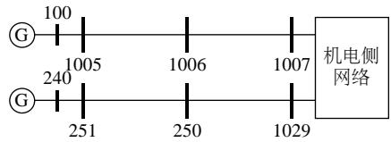  
图6 118节点系统

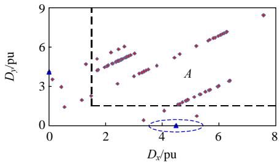  
Fig. 6 118-bus system   
(a)母线到各端口电气距离分布图

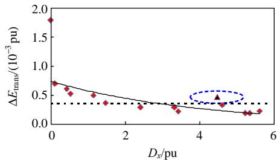  
(b) 暂态变化量

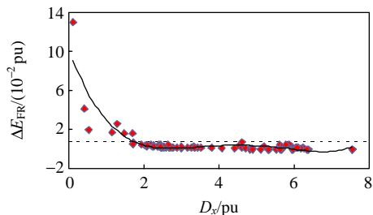  
(c) 频率响应变化量

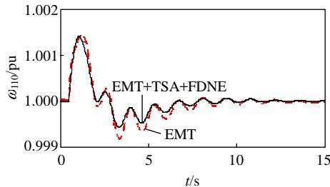  
(d) 电气距离为1.69时的曲线对比   
图7 118节点系统分析结果  
Fig. 7 Analysis results of 118-bus system

118节点系统, 可以得到和39节点系统相同的结论。用同样的计算方法计算指标 $\Delta E_{\mathrm{trans}}$ 和 $\Delta E_{\mathrm{FR}}$ , 即可以得到 $\Delta E_{\mathrm{trans}}$ 和 $\Delta E_{\mathrm{FR}}$ 分别与 $D_x$ 的关系, 即可得图7(b)、(c)所示的结果。选择了电气距离 $D_x$ 在1.5左右的一些母线进行暂态仿真, 图7(d)列出了电气距离 $D_x$ 为1.69时的母线故障仿真结果。

如图7(d)所示，当电气距离 $D_{x}$ 为大约1.69时，不用改变FDNE即可得到与全系统仿真基本一致的结果。因此，118节点系统也同样验证了上述判据：TSA侧母线对EMT所有端口的电气距离 $D$ 都大于1.5(如图7(a)中的区域A所示)时，故障前的FDNE仍然可以用于混合仿真分析。

# 3）增加故障持续时间。

当故障时间增加至 $200\mathrm{ms}$ 时，39节点系统和118节点系统的分析结果如图8所示。大部分母线对应的暂态变化量 $\Delta E_{\mathrm{trans}}$ 与电气距离 $D$ 仍然符合上述趋势，只有少数不符合这一规律的点。经研究，这少部分点代表发电机机端故障等严重故障下的仿真结果。

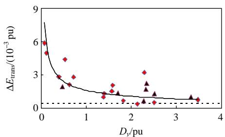  
(a) 39节点系统

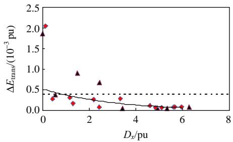  
(b) 118节点系统  
图8 故障持续时间增加情况下的分析结果  
Fig. 8 Results under longer fault duration

当故障时间从 $100\mathrm{ms}$ 增加到 $200\mathrm{ms}$ ，特别是那种接近于发电机的严重故障时，故障将会导致机电侧网络的频率偏移量增加至不能忽略的程度，因此，本文中的 TSA 程序将不再与 EMT 程序一致，TSA 程序不能准确仿真这种情况。

# 3.3 FDNE的切换

基于上述分析，故障前的FDNE可以用于大部

分机电暂态侧故障的仿真。但是，对于那些电气距离在临界电气距离范围以内的母线，故障前的FDNE不再适用。因此，在这种情况下，需要采用3.2节中FDNE的切换方法。

# 1）39节点系统。

机电暂态侧母线6距离端口I和Ⅱ的电气距离分别为1.1632和0.0323。在母线6上施加一个 $100\mathrm{ms}$ 的三相短路接地故障，在这种情况下，采用故障前的FDNE不能得到准确的结果，应该采用故障后的FDNE和伴随仿真法。采用全系统仿真EMT、采用故障后的FDNE和伴随仿真法(用符号 $\mathrm{EMT} + \mathrm{TSA} + \mathrm{FDNE}$ (变化)表示)和采用故障前的FDNE(用符号 $\mathrm{EMT} + \mathrm{TSA} + \mathrm{FDNE}$ (不变化)表示)3种方法，电磁侧发电机110的转速 $\omega_{110}$ 如图9(a)所示。相对于 $\mathrm{EMT} + \mathrm{TSA} + \mathrm{FDNE}$ (不变化)， $\mathrm{EMT} + \mathrm{TSA} + \mathrm{FDNE}$ (变化)与EMT之间吻合得相当好，特别是故障期间。

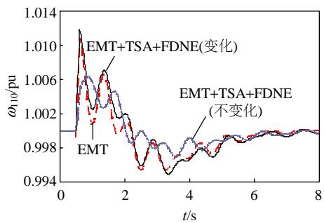  
(a) 3种仿真方法的比较

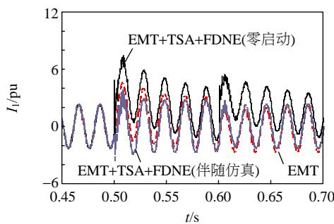  
(b) FDNE初始化方法比较  
图9 故障在母线6处的仿真结果  
Fig. 9 Simulation results when fault occurs at bus 6

在 FDNE 切换过程中，本文采用伴随仿真(用符号 EMT+TSA+FDNE(伴随仿真)表示)方法和零启动(用符号 EMT+TSA+FDNE(零启动)表示)方法来初始化切换过程中新 FDNE 的状态变量 线路 103-3 的末端注入电流 $I_{1}$ 如图 9(b) 所示。结果表明本文提出的伴随仿真初始化方法能够有效减小切换过程中的暂态波动。

# 2）118节点系统。

母线1025到电磁暂态侧端口母线1007和母线1029的电气距离分别是0.5366和1.4216，这说明此故障需要采用故障后的FDNE和伴随仿真法来仿真以得到较精确的结果。采用3种不同的方法进行仿真，发电机100的转速 $\omega_{100}$ 如图10(a)所示。结果表明，故障后的FDNE和伴随仿真法可以显著改善仿真结果的精度。图10(b)所示为线路250-1029末端注入电流 $I_{2}$ ，伴随仿真的初始化方法可以减小切换过程的暂态波动。

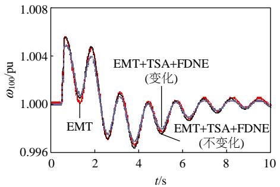  
(a) 3种仿真方法的比较

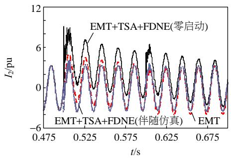  
(b) FDNE 初始化方法比较  
图10 故障在母线1025处的仿真结果  
Fig. 10 Simulation results when fault occurs at bus 1025

# 4 结论

本文首先提出了一种伴随仿真方法来初始化切换过程中新FDNE，以减少暂态波动。然而，在机电暂态侧网络中，距离电磁侧远近不同的故障对电磁暂态侧暂态的影响是不同的。本文提出的分析法采用FDNE频率响应的变化量和电磁暂态侧暂态的变化量可以用来量化这种“影响”，而用电气距离可以用来量化这种“距离”。对于距离电磁暂态侧的电气距离大于1.5的机电暂态侧故障，沿用故障前的FDNE进行仿真；而对于距离电磁暂态侧暂态电气距离小于1.5的机电暂态侧故障，采用故障后的FDNE和伴随仿真法进行仿真。

# 致谢

感谢加拿大RTDS Technologies公司梁玥峰和

Powertech Labs 公司林曦等人对本文的贡献。

# 参考文献

[1] Heffernan M D, Turner K S, Arrillaga J. Computation of AC/DC system disturbances: parts I, II, and III[J]. IEEE Transactions on Power Apparatus and Systems, 1981, 100(11): 4341-4363.   
[2] Reeve J, Adapa K. A new approach to dynamic analysis of AC networks incorporating detailed modeling of DC systems: parts I and II[J]. IEEE Transactions on Power Delivery, 1988, 3(4): 2005-2019.   
[3] Morched A S, Ottevangers J H, Marti L. Multi-port frequency dependent network equivalents for the EMTP[J]. IEEE Transactions on Power Delivery, 1993, 8(3): 2005-2018.   
[4] Anderson GWJ, Watson NR, Arnold CP, et al. A new hybrid algorithm for analysis of HVDC and FACTS systems[C]/The 1995 IEEE International Conference Energy on Management and Power Delivery. New York: The Institute of Electrical and Electronics Engineers INC., 1995: 8-16.   
[5] Su H, Chan K W, Snider K W, et al. A parallel implementation of electromagnetic electromechanical hybrid simulation protocol[C]/The 2004 International Conference on Electric Utility Deregulation, Restructuring and Power Technologies. Hong Kong: IEEE Joint Chapter of Power Engineering, Industry Applications, Power Electronics, and Industrial Electronics Societies, 2004: 151-155.   
[6] 柳勇军.电力系统机电暂态和电磁暂态混合仿真技术的研究[D].北京：清华大学，2005.  
Liu Yongjun. Study of power system electromagnetic transient and electromechanical transient hybrid simulation[D]. Beijing: Tsinghua University, 2005(in Chinese).   
[7] 张树卿．交直流系统电磁/机电暂态混合实时仿真关键技术的研究[D]. 北京：清华大学，2010.  
Zhang Shuqing. Research on key techniques of electromagnetic/electromechanical hybrid real-time simulation of AC-DC transmission system[D]. Beijing: Tsinghua University, 2010(in Chinese).   
[8] 贾旭东. 基于 RTDS 的交直流系统实时数字仿真方法研究与实现[D]. 北京：华北电力大学，2009.  
Jia Xudong. Research and implementation of real-time digital simulation method of AC-DC power system based on RTDS[D]. Beijing: North China Electric Power University, 2009(in Chinese).   
[9] Wang L W, Fang D Z, Chung T S. New techniques for enhancing accuracy of EMTP/TSP hybrid simulation

algorithm[C]/The 2004 IEEE International Conference on Electric Utility Deregulation Restructuring and Power Technologies. Hong Kong: IEEE Joint Chapter of Power Engineering, Industry Applications, Power Electronics, and Industrial Electronics Societies, 2004: 734-739.   
[10] 王路，李兴源，颜泉，等．交直流混联系统的多速率混合仿真技术研究[J]. 电网技术，2005，29(15)：23-27. Wang Lu, Li Xingyuan, Yan Quan, et al. Study on multi-rate hybrid simulation technology for AC/DC power system[J]. Power System Technology, 2005, 29(15): 23-27(in Chinese).  
[11] 刘浩明，朱浩骏，严正，等. 含统一潮流控制器装置的电力系统动态混合仿真接口算法研究[J]. 中国电机工程学报，2005，25(16)：1-7.  
Liu Haoming, Zhu Haojun, Yan Zheng, et al. Study on interface algorithm for power system transient stability hybrid-model simulation with UPFC device[J]. Proceedings of the CSEE, 2005, 25(16): 1-7(in Chinese).   
[12] 岳程燕. 电力系统电磁暂态和机电暂态混合实时仿真的研究[D]. 北京：中国电力科学研究院，2004.  
Yue Chengyan. Study of power system electromagnetic transiet and electromechanical transient real-time hybrid simulation[D]. Beijing: China Electric Power Research Institute, 2004(in Chinese).   
[13] 刘文焯，侯俊贤，汤涌，等．考虑不对称故障的机电暂态-电磁暂态混合仿真方法[J]. 中国电机工程学报，2010，30(13)：8-17.  
Liu Wenzhuo, Hou Junxian, Tang Yong, et al. Electromechanical transient/electromagnetic transient hybrid considering asymmetric faults[J]. Proceedings of the CSEE, 2010, 30(13): 8-17(in Chinese).   
[14] Lin X, Gole AM, Yu M. A wide-band multi-port system equivalent for real-time digital power system simulators[J]. IEEE Transactions on Power Systems, 2009, 24(1): 237-249.   
[15] Liang Y, Lin X, Gole A M, et al. Improved coherency-based wide-band equivalents for real-time digital simulators[J]. IEEE Transactions on Power Systems, 2011, 26(3): 1410-1417.   
[16] 张怡，吴文传，张伯明，等．电磁-机电暂态混合仿真中的频率相关网络等值[J]. 中国电机工程学报，2012,32(13): 61-68.  
Zhang Yi, Wu Wenchuan, Zhang Boming, et al. Frequency dependent network equivalent for electromagnetic and electromechanical hybrid simulation[J]. Proceedings of the CSEE, 2012, 32(13): 61-68(in Chinese).

[17] 张伯明，陈寿孙，严正．高等电力网络分析[M].北京：清华大学出版社，2007：310-311.  
Zhang Boming, Chen Shousun, Yan Zheng. Advanced electric power network analysis[M]. Beijing: Tsinghua University Press, 2007: 310-311(in Chinese).   
[18] 赵峰，孙宏斌，张伯明．基于电气分区的输电断面及其自动发现[J].电力系统自动化，2010，24(5)：1-6.  
Zhao Feng, Sun Hongbin, Zhang Boming. Zone division based automatic discovery of flowgate[J]. Automation of Electric Power Systems, 2010, 24(5): 1-6(in Chinese).   
[19] Lagonotte P, SabonnadiGre J Y, Paul J P. Structural analysis of the electrical system: application of secondary voltage control in France[J]. IEEE Transactions on Power Systems, 1989, 4(2): 479-486.   
[20] Siemens Energy Inc. PSS/E 32 program operation manual[R]. New York, USA: Siemens Energy Inc., 2009.   
[21] Szechtman M, Wess T, Thio C V. A benchmark model for HVDC system studies[C]//The International Conference on AC and DC Power Transmission. London: Power Division of the Institution of Electrical Engineers, 1991: 374-378.   
[22] Davies B, Williamson A, Gole AM, et al. Systems with multiple DC infeed[R]. Winnipeg, Canada: CIGRE Working Group B4. 41, 2008.

  
张怡

收稿日期：2012-03-20。

作者简介：

张怡(1985)，男，博士研究生，主要从事电力系统机电暂态与电磁暂态混合仿真、暂态稳定及其安全分析方面的研究工作，veriasea@gmail.com;

吴文传(1973)，男，博士，副教授，博士生导师，主要从事电力系统调度自动化和配电自动化方面的研究工作，wuwench@tsinghua.edu.cn;

张伯明(1948)，男，博士，教授，博士生导师，IEEE Fellow，主要从事电力系统分析和调度自动化方面的研究工作，zhangbm@tsinghua.edu.cn;

Aniruddha M. Gole(1955)，男，博士，教授，加拿大工程院院士，IEEE Fellow，主要从事电力系统电磁暂态仿真、HVDC稳定性分析等方面的研究工作，gole@ee.umanitoba.ca。

(责任编辑 谷子)

# Simulation Method of Faults on Electromechanical Side in Electromagnetic and Electromechanical Hybrid Simulation

ZHANG Yi $^{1}$ , WU Wenchuan $^{1}$ , ZHANG Boming $^{1}$ , Aniruddha M. Gole $^{2}$

(1. Tsinghua University; 2. University of Manitoba)

KEY WORDS: critical electrical distance index; electromagnetic transient; electromechanical transient; frequency dependent network equivalent post fault; initialization

In this paper, a method for simulation of the faults on the electromechanical network side in the electromagnetic and electromechanical hybrid simulation system is proposed based on frequency dependent network equivalent (FDNE). A changed FDNE for the post-fault circuit should be calculated when a switching or a fault takes place in the electromechanical network.

Firstly, a hot standby method is proposed to initialize the state variables of the FDNE so as to decrease the spurious transient during the swap. To minimize such spurious transient errors, the post-fault FDNE is separately simulated right from the start of the simulation in a "hot-standby" mode, and fed with a voltage source whose magnitude equals that of the measured voltages of the interface buses as shown in Fig. 1. The switches refer to $A_{1}$ and $B_{1}$ at the pre-fault state; when there is a fault, the switches refer to $A_{2}$ and $B_{2}$ .

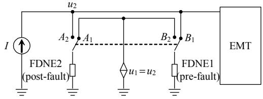  
Fig. 1 Initialization method for the post-fault FDNE

Secondly, different faults in the external network cause different transient changes in the internal network. The electrical distance defined in Eq. (1) is used to measure the distance from the fault location to the internal network. Eq. (2) is derived from the fast decoupled power flow.

$$
D _ {i j} = - \lg \left[ \frac {\left(\partial \boldsymbol {U} / \partial \boldsymbol {Q}\right) _ {i j}}{\left(\partial \boldsymbol {U} / \partial \boldsymbol {Q}\right) _ {j j}} \right] \tag {1}
$$

$$
\Delta \boldsymbol {U} = \frac {\partial \boldsymbol {U}}{\partial \boldsymbol {Q}} \Delta \boldsymbol {Q} \tag {2}
$$

An error index defined as Eq. (3) is utilized to quantify the transient change between samples of simulation results from the detailed EMT model and the proposed model with the original pre-fault FDNE.

$$
\Delta E _ {\text {t r a n s}} = \sqrt {\frac {1}{n} \sum_ {i = 1} ^ {n} \left| \mathbf {y} _ {\mathrm {r i}} (i \Delta t) - \mathbf {y} _ {\mathrm {s i}} (i \Delta t) \right| ^ {2}} \tag {2}
$$

Based on the relationship between error index and electrical distance, a critical electrical distance could be identified for which the system response is essentially correct even without changes in the FDNE.

A modified New England IEEE 39-bus system is used to prove the proposed method. It is heuristically determined that accurate results (i.e., $\Delta E_{\mathrm{trans}} < 0.00035$ ) can be obtained without changing the FDNE in Fig. 2(a). Acceptable accuracy can be obtained without changing the FDNE if all the electrical distances from the fault to the internal network are bigger than $1.5(?)$ ; on the contrary, the method using a changed FDNE should be used to investigate the phenomenon in the internal network.Fig. 2(b) indicates that the proposed hot standby initialization (EMT+TSA+FDNE (hot standby)) gives more accurate results than the method EMT+TSA+ FDNE (zero start), where the initialization starts from zero.

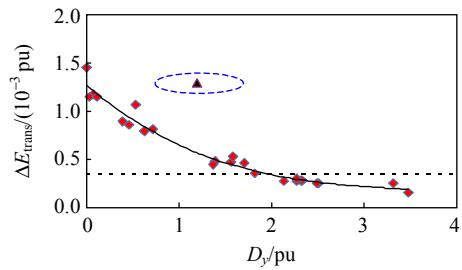  
(a) Transient error $\Delta E_{\mathrm{trans}}$

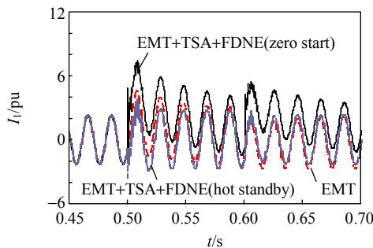  
(b) Current comparisons with different initialization methods   
Fig. 2 Simulation results