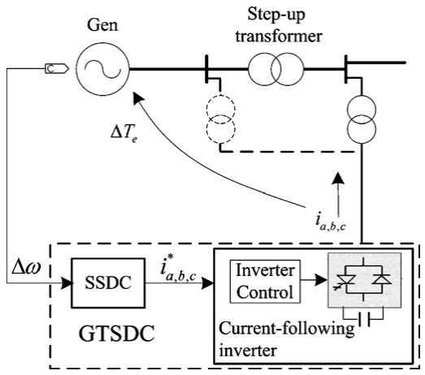
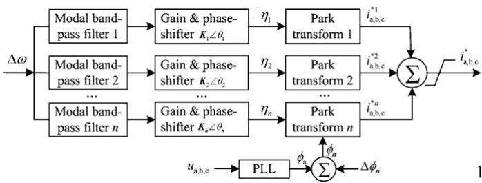
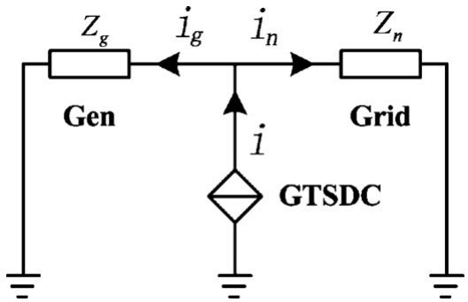
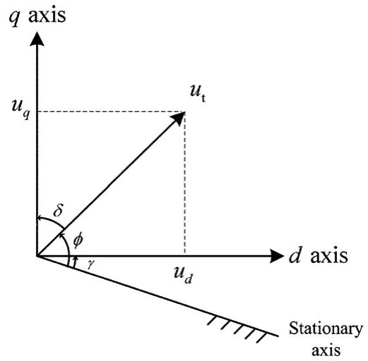
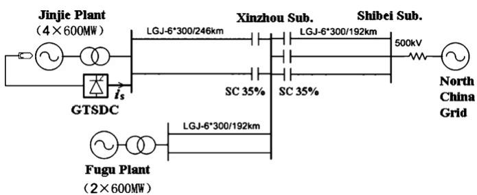
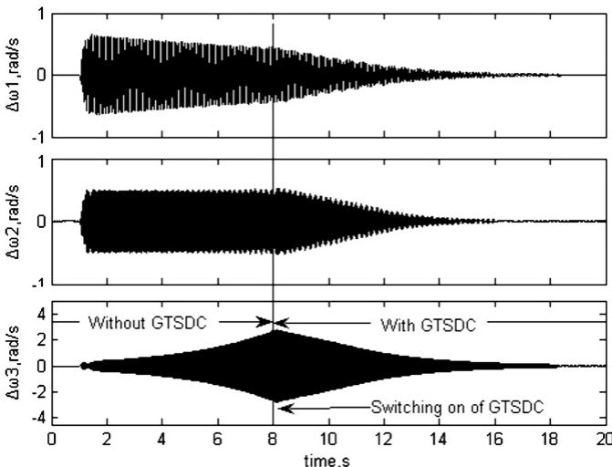
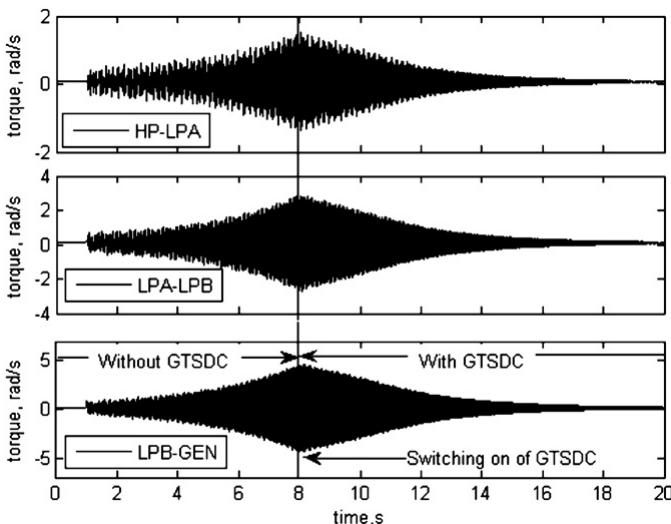
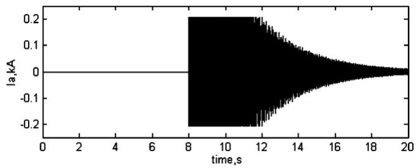
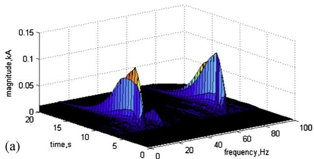
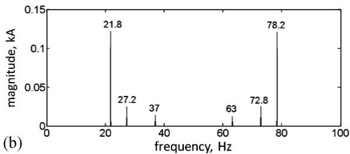

# Damping multimodal subsynchronous resonance using a generator terminal subsynchronous damping controller

Xiaorong Xiea, Yuanqu Zhanga,b,∗, Zhipeng Li a

a State Key Laboratory of Power System, Department of Electrical Engineering, Tsinghua University, Beijing 100084, China   
b Xiamen Urban Planning & Design Institute, Xiamen 361012, China

# a r t i c l e i n f o

Article history:

Received 26 March 2012

Received in revised form 8 November 2012

Accepted 11 November 2012

Available online 26 February 2013

Keywords:

Subsynchronous resonance (SSR)

Generator terminal subsynchronous

damping controller (GTSDC)

Series-compensated power systems

Complex torque coefficient method

# a b s t r a c t

This paper presents a generator terminal subsynchronous damping controller (GTSDC) for mitigating multimodal subsynchronous resonance (SSR) that may occur in series-compensated power systems. The proposed GTSDC system is composed of a digital controller and a power electronic inverter with current tracking control. It uses the shaft speed deviation of the generator turbine as feedback to modulate the dynamic current reference of the inverter through multimodal control paths. By exactly tracking the reference value, the power electronic inverter generates current at frequencies complementary to the torsional modes. Part of the current flows into the generator and creates damping torque on the shaft system to damp SSR. The relationship between the output current of GTSDC and the resulting electromagnetic torque is derived based on the complex torque coefficient method. Furthermore, a nonlinear optimization method is implemented to obtain the optimal parameters for all modal-control paths, thereby effectively enhancing the damping of all torsional modes under different operating conditions. The case study on a real series-compensated power system through eigenvalue analysis and electromagnetic simulations validates the effectiveness of the controller.

© 2013 Elsevier B.V. All rights reserved.

# 1. Introduction

Series-capacitor compensation in long-distance transmission systems is a very economical method of enhancing transient stability and transfer capability. However, the potential problem in series-compensated lines connected to turbine generators is subsynchronous resonance (SSR), which could result in shaft failure of mechanical system if not handled properly [1]. With the increasing utilization of series compensation in China, SSR is becoming a severe threat to the stability and security of large units and the power grid. In history, various measures [2], including blocking filter (BF) [3], supplementary excitation damping controller (SEDC) [4], static var compensator (SVC) [5], NGH SSR damping scheme [6,7] and thyristor controlled series capacitor (TCSC) [8], had been put into practical use to solve the SSR problem.

In recent years, with the increasing applications of high power converters based on fully controllable turn-off power semiconductors, some new countermeasures, such as STATCOM [9–17] and SSSC [18], have been proposed for SSR mitigation. As for

the STATCOM-based scheme, auxiliary subsynchronous damping controller (SSDC) is generally adopted, which, by modulating the reactive current reference or bus voltage of STATCOM, produces positive electrical damping within the range of critical torsional frequencies to mitigate SSR. That said, previously proposed SSDCs are mostly simple proportional lead-lag controllers [9–17]. They each have one or more of the following disadvantages: (i) Only one control path is designed for all torsional modes, which means the controllers are not good enough for all aimed torsional modes, and are unable to solve multimodal SSR problem. (ii) SSDCs serve as an auxiliary control loop to the main voltage and/or reactive power control and thus the damping performance is restricted. (iii) The controllers are only validated under some specified operating points, and their robustness to variable operation conditions is not guaranteed. (iv) They are only verified with single-machine system, which is generally impractical in real world.

In this paper, a novel multimodal SSR mitigating device called “generator terminal subsynchronous damping controller (GTSDC)” is proposed and verified in a multimachine series-compensated system. GTSDC consists of an SSDC and a power electronic inverter with current-tracking controller. It has the following unique characteristics: (i) Connected to the generator terminal (high or low voltage side), GTSDC uses the shaft speed as the feedback signal and drives the power electronic inverter to generate current at frequencies complementary to torsional modes, which in turn produces damping torque on generator rotors to mitigate SSR. (ii) As the main

  
Fig. 1. Configuration of the proposed GTSDC.

control function, the proposed SSDC comprises independent modal control paths, each with separate feedback gain and phase-shift, to damp multiple torsional modes simultaneously. (iii) The relationship between the control parameters and the GTSDC-offered damping coefficient is explicitly given, which makes the tuning of SSDC direct and effective. (iv) As being optimized over various operating conditions and based on a real multimachine system, the proposed GTSDC is robust and practical.

The rest of the paper is organized as follows: Section 2 describes the configuration of the proposed GTSDC scheme. Section 3 elaborates the derivation of GTSDC-offered electrical damping. The optimal designing of GTSDC is presented in Section 4. In Section 5, a practical series-compensated multimachine system is used to validate the effectiveness of GTSDC in damping multimodal SSR. Section 6 draws some conclusions.

# 2. Configuration of the proposed GTSDC

As illustrated in Fig. 1, GTSDC is composed of an SSDC and a current-tracking inverter. The SSDC is a digital controller, which uses the shaft speed deviation of the generator turbine $( \Delta \omega )$ to calculate the reference current $( i * a , b , c )$ . The current-tracking inverter is a power electronic converter, which is regulated by its inner controller to generate compensating current $( \Delta i _ { a b c } )$ that dynamically tracks $\Delta i _ { a , b , c } ^ { * }$ ia,b,c . GTSDC is connected either at the generator outlet or at the high voltage side of the step-up transformer. Then, a part of its output current is injected into the generator stator, which, if controlled properly, can produce subsynchronous electromagnetic torque $( \varDelta T _ { e } )$ ) to damp torsional oscillations.

A more detailed block diagram of the SSDC is shown in Fig. 2. The mechanical speed of the turbine rotor provides the input, which, after proper filtering and conditioning, becomes the deviation signal -ω. It then passes through n separate control paths. Each path, tuned to a specific torsional mode, is composed of a modal bandpass filter, a gain & phase-shifter and the simplified reverse Park

  
Fig. 2. The block diagram of the SSDC.

transformation to generate the reference current signal for the corresponding mode. The reference currents of all torsional modes are summarized, clipped and forwarded to the inverter controller to drive the power electronic devices.

A general implementation of the modal band-pass filters $( f _ { \mathrm { m } i } )$ is shown in (1). Of course, other similar functions can be used for the same purpose.

$$
\begin{array}{l} f _ {\mathrm {m i}} (s) = \frac {1}{1 + s / 8 0 \pi + (s / 8 0 \pi) ^ {2}} \frac {(s / 1 6 \pi) ^ {2}}{1 + s / 1 6 \pi + (s / 1 6 \pi) ^ {2}} \\ \times \frac {s / \omega_ {\mathrm {m} , i}}{1 + 8 \pi s / \omega_ {\mathrm {m} , i} ^ {2} + (s / \omega_ {\mathrm {m} , i}) ^ {2}} \frac {1 + (s / \omega_ {\mathrm {m} , i - 1}) ^ {2}}{1 + 6 \pi s / \omega_ {\mathrm {m} , i - 1} ^ {2} + (s / \omega_ {\mathrm {m} , i - 1}) ^ {2}} \\ \times \frac {1 + \left(s / \omega_ {\mathrm {m} , i + 1}\right) ^ {2}}{1 + 6 \pi s / \omega_ {\mathrm {m} , i + 1} ^ {2} + \left(s / \omega_ {\mathrm {m} , i + 1}\right) ^ {2}} \tag {1} \\ \end{array}
$$

where $\omega _ { \mathrm { m } , i }$ denotes the angular frequency of the ith torsional mode, and $\omega _ { \mathrm { m } , 0 } , \omega _ { \mathrm { m } , n + 1 }$ are set to 2, 100 respectively.

The modal filter (1) is a combination of five second-order filters, of which the first and second ones are low-pass and high-pass filters with their characteristic frequencies being 40 Hz and 8 Hz respectively. They are combined to extract the subsynchronous components (generally from 8 to 40 Hz in China) from the shaft speed. Their damping ratios are set to 0.5 to achieve a good balance between accuracy and phase shift (corresponding to the response time). The third term of (1) represents a band-pass filter to pick out the corresponding mode $\omega _ { \mathrm { m } , i }$ . While the fourth and fifth terms are band-stop filters, the function of which is to block the neighboring modes, i.e. $\omega _ { \mathrm { m } , i - 1 }$ 1 and $\omega _ { \mathrm { m } , i + 1 } ,$ , to achieve a better modal-filtration effect of $\omega _ { \mathrm { m } , i \cdot } \mathrm { F o r }$ the first mode $\omega _ { \mathrm { m } , 1 } , \omega _ { \mathrm { m } , 0 }$ is set as 2 to block the low-frequency oscillation at about 1.0 Hz. For the last mode $\omega _ { \mathrm { m } , n }$ , $\omega _ { \mathrm { m } , n + 1 }$ is set as 100 to attenuate the “noise” at the rated-frequency $( 5 0 . 0 \mathrm { H z } )$ . The damping ratios of the third to fifth filters are properly selected to obtain the narrow bandwidth of 4.0 Hz, 3.0 Hz and 3.0 Hz, respectively.

The gain & phase-shifter $( f _ { \mathrm { g } i } )$ is a proportional and led-lag transfer function as in (2).

$$
f _ {\mathrm {g i}} (s) = K _ {i} \left(\frac {1 - T _ {i} s}{1 + T _ {i} s}\right) ^ {2} \tag {2}
$$

where $K _ { i } , T _ { i }$ are gains and time constants to be designed.

As illustrated in (3), the simplified reverse Park transformation $( \mathbf { C } _ { i } ) _ { 1 }$ , is a clipped version of the traditional reverse Park transformation, where the d-axis and 0-axis components are deliberately fixed to zero and only the q-axis value is set based on the output of the ith “Gain & phase shifter”, or i.

$$
\begin{array}{l} \left[ \begin{array}{c c c} \Delta i _ {a i} ^ {*} & \Delta i _ {b i} ^ {*} & \Delta i _ {c i} ^ {*} \end{array} \right] ^ {T} \\ = \mathbf {C} _ {i} \eta_ {i} = - \left[ \begin{array}{l l l} \sin \phi_ {i} & \sin (\phi_ {i} - 2 \pi / 3) & \sin (\phi_ {i} + 2 \pi / 3) \end{array} \right] ^ {T} \eta_ {i} \tag {3} \\ \end{array}
$$

where $\phi _ { i } = \phi _ { a } + \Delta \phi _ { i } = \omega _ { 0 } t + \alpha _ { 0 } + \Delta \phi _ { i } ; \phi _ { a }$ is the phase position of phase-A fundamental voltage of the GTSDC-connected bus, which can be obtained by the phase locked loop (PLL); ω0 is the system angular frequency; ˛0 is the initial phase angle of $\phi _ { a } ; \Delta \phi _ { i }$ is an adjustable phase variation to be designed; and  is the modal control signal produced by the ith “Gain & phase shifter”, as shown in Fig. 2.

The current-following inverter consists of a high-power electronic DC/AC converter and an inner controller. The inner controller receives the current reference from the SSDC and generates proper PWM signals to drive the converter, which then produces current to track the reference dynamically. Since the current consists of only components at the frequencies complementary to torsional modes, GTSDC just exchanges reactive power with the system.

  
Fig. 3. The equivalent circuit of the system including GTSDC.

Therefore, the converter uses capacitors for its DC voltage support. Since much of the literature, for instance, [19,20], has discussed similar converters and current-tracking control functions, they will not be elaborated here. The current output of GTSDC, if properly controlled, would follow the reference value closely, or their relationship could be expressed as in (4), where the transfer-function model of GTSDC, or $G _ { c } ( s ) _ { \ r }$ , is a first-order lag with unit gain and time delay of $T _ { s } .$ .

$$
i _ {a, b, c} = G _ {c} (s) i _ {a, b, c} ^ {*} = \frac {1}{1 + s T _ {s}} i _ {a, b, c} ^ {*} \tag {4}
$$

# 3. Derivation of the electrical damping provided by GTSDC

The complex torque coefficient method is used here to investigate the relationship between GTSDC and the resulted damping effect. Suppose a slight torsional oscillation occurs at the generator shaft, which is expressed by

$$
\Delta \omega = A _ {i} \cos \omega_ {i} t \tag {5}
$$

As the feedback signal, this torsional oscillation is input to GTSDC. It passes the corresponding modal filter and then is amplified and phase shifted to become the intermediate control output

$$
\eta_ {i} = K _ {i} K _ {\mathrm {f i}} A _ {i} \cos \left(\omega_ {i} t + \theta_ {i} + \theta_ {\mathrm {f i}}\right) \tag {6}
$$

where $K _ { i } , K _ { \mathrm { f } i }$ are the gain of the amplifier and the modal filter; $\theta _ { i } ,$ $\theta _ { \mathrm { f } i }$ are the corresponding phase shifts.

With (6) substituted into the reverse Park transformation (3), the current references can be calculated, of which the phase-A value is written as follows:

$$
\Delta i _ {a i} ^ {*} = \Delta i _ {a i -} ^ {*} + \Delta i _ {a i +} ^ {*} \tag {7}
$$

$$
\Delta i _ {a i -} ^ {*} = \frac {- K _ {i} K _ {\mathrm {f i}} A _ {i} \sin \left(\omega_ {-} t + \alpha_ {0} + \Delta \phi_ {i} - \theta_ {i} - \theta_ {\mathrm {f i}}\right)}{2} \tag {8}
$$

$$
\Delta i _ {a i +} ^ {*} = \frac {- K _ {i} K _ {\mathrm {f i}} A _ {i} \sin \left(\omega_ {+} t + \alpha_ {0} + \Delta \phi_ {i} + \theta_ {i} + \theta_ {\mathrm {f i}}\right)}{2} \tag {9}
$$

where $\omega _ { - } = \omega _ { 0 } - \omega _ { i } , \omega _ { + } = \omega _ { 0 } + \omega _ { i } ; \varDelta i _ { * } ^ { a i - }$ is the below-nominalfrequency component while $\varDelta i _ { * } ^ { a i + }$ is the above-nominal-frequency component; the frequencies of which are complementary to the torsional mode.

Considering the equivalent circuit of the system as shown in Fig. 3, the current injected into the generator stator can be expressed by:

$$
i _ {\mathrm {g}} (s) = G _ {\mathrm {g}} (s) i (s) = \frac {Z _ {n} (s)}{Z _ {n} (s) + Z _ {\mathrm {g}} (s)} i (s) \tag {10}
$$

where i is the current offered by GTSDC and $i _ { \mathrm { g } }$ is the thereby increased current flowing into the generator; $Z _ { \mathrm { g } } , \breve { Z } _ { \mathrm { n } }$ are the equivalent impedances of the generator side and the grid, respectively.

  
Fig. 4. The d–q coordinate system.

The electrical torque resulting from the GTSDC-offered current is analyzed for its below- and above-nominal-frequency components separately. As for the below-nominal-frequency current injected into the generator, when the dynamics of GTSDC (4) and current-division relationship (10) are considered, it can be expressed as in (11).

$$
\Delta i _ {g a i -} ^ {*} = \frac {- K _ {i} K _ {\mathrm {f i}} G _ {i -} A _ {i} \sin \left(\omega_ {-} t + \alpha_ {0} + \Delta \phi_ {i} - \theta_ {i} - \theta_ {\mathrm {f i}} + \varphi_ {i -}\right)}{2} \tag {11}
$$

where $G _ { i - }$ and $\varphi _ { i - }$ denote the magnitude and phase response of the combinative GTSDC dynamics (4) and current-division relationship (10) for the below-nominal-frequency current.

To derive the electromagnetic torque, the current (11) is mapped to the d–q coordinate system (Fig. 4) with the traditional forward Park transformation (12).

$$
\left[ \begin{array}{l} \Delta i _ {d} \\ \Delta i _ {q} \end{array} \right] = \frac {2}{3} \left[ \begin{array}{c c c} \cos \gamma & \cos \left(\gamma - \frac {2}{3} \pi\right) & \cos \left(\gamma + \frac {2}{3} \pi\right) \\ - \sin \gamma & - \sin \left(\gamma - \frac {2}{3} \pi\right) & - \sin \left(\gamma + \frac {2}{3} \pi\right) \end{array} \right] \left[ \begin{array}{l} \Delta i _ {a} \\ \Delta i _ {b} \\ \Delta i _ {c} \end{array} \right] \tag {12}
$$

where $\gamma = \omega _ { 0 } t + \beta$ is the angle between the rotating d-axis and the stationary axis.

Then, the stator current increment caused by the current (11) is obtained as

$$
\left[ \begin{array}{l} \Delta i _ {d -} \\ \Delta i _ {q -} \end{array} \right] = \frac {1}{2} K _ {i} K _ {f i} G _ {i -} A _ {i} \left[ \begin{array}{l} \sin \left(\omega_ {i} t - \alpha_ {0} - \Delta \phi_ {i} + \theta_ {i} + \theta_ {\mathrm {f i}} - \varphi_ {i -} + \beta\right) \\ \cos \left(\omega_ {i} t - \alpha_ {0} - \Delta \phi_ {i} + \theta_ {i} + \theta_ {\mathrm {f i}} - \varphi_ {i -} + \beta\right) \end{array} \right] \tag {13}
$$

Considering that $- \alpha _ { 0 } + \beta = \delta - \pi / 2$ (see Fig. 4), Eq. (13) can be rewritten as

$$
\left[ \begin{array}{c} \Delta i _ {d -} \\ \Delta i _ {q -} \end{array} \right] = \frac {1}{2} K _ {i} K _ {\mathrm {f i}} G _ {i -} A _ {i} \left[ \begin{array}{c} - \cos \left(\omega_ {i} t + \theta_ {i} + \theta_ {\mathrm {f i}} + \delta - \Delta \phi_ {i} - \varphi_ {i -}\right) \\ \sin \left(\omega_ {i} t + \theta_ {i} + \theta_ {\mathrm {f i}} + \delta - \Delta \phi_ {i} - \varphi_ {i -}\right) \end{array} \right] \tag {14}
$$

The general expression for torque is

$$
T _ {e} = - \psi_ {d} i _ {q} + \psi_ {q} i _ {d} \tag {15}
$$

where $\psi _ { d } , \psi _ { q }$ are the d- and q-axis flux linkages; $i _ { d } .$ , $i _ { q }$ are the dand q-axis currents.

Eq. (15) is linearized into (16).

$$
\Delta T _ {e} = - \psi_ {d 0} \Delta i _ {q} + \psi_ {q 0} \Delta i _ {d} - i _ {q 0} \Delta \psi_ {d} + i _ {d 0} \Delta \psi_ {q} \tag {16}
$$

With the terms with $\begin{array} { r l } { \Delta \psi _ { d } , } & { { } \Delta \psi _ { q } } \end{array}$ neglected, Eq. (16) can be well approximated by (17)

$$
\Delta T _ {e} \approx - \psi_ {d 0} \Delta i _ {q} + \psi_ {q 0} \Delta i _ {d} \tag {17}
$$

For a synchronous generator, the following expression holds:

$$
\left[ \begin{array}{l l} u _ {d} & u _ {q} \end{array} \right] = \left[ \begin{array}{l l} p \psi_ {d} - \omega \psi_ {q} + r _ {a} i _ {d} & p \psi_ {q} + \omega \psi_ {d} + r _ {a} i _ {q} \end{array} \right] \tag {18}
$$

where p means $d / d t ;$ ω is the rotor angular frequency and $r _ { a }$ is the stator resistance.

Since the stator resistance and the derivative items of (18) are negligible, the stator terminal voltage is mainly decided by the speed of the electromotive force, or

$$
\left[ \begin{array}{l l} u _ {d} & u _ {q} \end{array} \right] \approx \omega \left[ \begin{array}{l l} - \psi_ {q} & \psi_ {d} \end{array} \right] \tag {19}
$$

Thus, the following equation can be derived

$$
\left[ \begin{array}{l l} \psi_ {q 0} & - \psi_ {d 0} \end{array} \right] \approx - \psi_ {0} \left[ \begin{array}{l l} \sin \delta & \cos \delta \end{array} \right] \tag {20}
$$

where $\psi _ { 0 } = \sqrt { \psi _ { d 0 } ^ { 2 } + \psi _ { q 0 } ^ { 2 } } .$

Substituting (14), (20) into (17), the electromagnetic torque increment developed by the below-nominal-frequency current is then obtained by

$$
\Delta T _ {e i -} \approx \frac {K _ {i} K _ {\mathrm {f i}} G _ {i -} A _ {i} \psi_ {0} \cos \left(\omega_ {i} t + \theta_ {i} + \theta_ {f i} - \Delta \phi_ {i} - \varphi_ {i -} + \pi / 2\right)}{2} \tag {21}
$$

Similarly, the electromagnetic torque increment developed by the above-nominal-frequency current can be expressed by (22)

$$
\Delta T _ {e i +} \approx \frac {K _ {i} K _ {\mathrm {f i}} G _ {i +} A _ {i} \psi_ {0} \cos \left(\omega_ {i} t + \theta_ {i} + \theta_ {\mathrm {f i}} + \Delta \phi_ {i} + \varphi_ {i +} - \pi / 2\right)}{2} \tag {22}
$$

Therefore, the total electromagnetic torque increment resulting from GTSDC-offered current can be obtained as

$$
\Delta T _ {e i} = \Delta T _ {e i -} + \Delta T _ {e i +} \tag {23}
$$

According to the theory of complex torque coefficient [21], the incremental torque can be divided into two mutually orthogonal components and one of which in phase with the increments of angular frequency is called the damping torque. Then, the total damping torque can be expressed as

frequency $\omega _ { i } .$ . Next, with the simplified reverse Park transformation, the modal control signal is converted into a three-phase current reference composed of both below-nominal $\left( \omega _ { - } = \omega _ { 0 } - \omega _ { i } \right)$ and above-nominal-frequency $\left( \omega _ { + } = \omega _ { 0 } + \omega _ { i } \right)$ components. Then, following the reference, the power electronic inverter generates electric current, and part of which flows into the stator of the generator. This specific current also contains components at the complementary frequencies, i.e. $\omega _ { - } = \omega _ { 0 } - \omega _ { i }$ i and $\omega _ { + } = \omega _ { 0 } + \omega _ { i }$ , however, both of which finally create torques of the aimed torsional frequency ωi because of the electromagnetic coupling between the stator and rotor windings of the generator, which mathematically can be viewed as the forward Park transformation. Therefore, if the gains and phase-shifts of the SSDC are properly adjusted, GTSDC can exert positive damping torques on the generator shaft system to damp multimodal SSR.

# 4. The designing procedure of GTSDC

For a certain operating scenario, the best phase parameters of GTSDC can be determined by (26). However, considering varied operating conditions or disturbances of a practical system and limited capacity of the converter, it is a challenge to tune GTSDC for mitigating multimodal SSR. We proposed the following designing procedures:

Step 1. Designing of the modal band-pass filters. Torsional frequencies of the target generator should be measured beforehand by field tests [4] and then modal filters as expressed in (1) are determined and their frequency response calculated.

Step 2. Selection of “evaluation scenarios”. To design and evaluate GTSDC, typical and boundary operating conditions are selected to form the set of “evaluation scenarios”. While these evaluation conditions by no means limit the situations under which the power plant operates, they do bound the range of system operation to which the designing of GTSDC is relevant.

Step 3. Analysis of the current division relationship of the system network at complementary torsional frequencies. The frequencyscanning method is used to obtain the frequency characteristic

$$
\Delta T _ {e i} ^ {D} \approx D _ {e} \Delta \omega = \frac {K _ {\mathrm {i}} K _ {\mathrm {f i}} \psi_ {0} \left[ G _ {i -} \cos \left(\theta_ {i} + \theta_ {\mathrm {f i}} - \Delta \phi_ {i} - \varphi_ {i -} + \pi / 2\right) + G _ {i +} \cos \left(\theta_ {i} + \theta_ {\mathrm {f i}} + \Delta \phi_ {i} + \varphi_ {i +} - \pi / 2\right) \right] \Delta \omega}{2} \tag {24}
$$

The electrical damping coefficient $( D _ { e i } )$ provided by GTSDC is derived as [22,23]

$$
D _ {e i} = \frac {K _ {i} K _ {\mathrm {f i}} \psi_ {0} \left[ G _ {i -} \cos \left(\theta_ {i} + \theta_ {\mathrm {f i}} - \Delta \phi_ {i} - \varphi_ {i -} + \pi / 2\right) + G _ {i +} \cos \left(\theta_ {i} + \theta_ {\mathrm {f i}} + \Delta \phi_ {i} + \varphi_ {i +} - \pi / 2\right) \right]}{2} \tag {25}
$$

In order to damp SSR, $D _ { e i }$ must be kept positive to provide electrical damping. And the larger the value of $D _ { e i } ,$ GTSDC is more effective in mitigating torsional oscillation. It can be observed from (25) that when the control variables of GTSDC satisfy (26), $D _ { e i }$ reaches the maximum value $D _ { e i , \operatorname* { m a x } } ,$ , as shown in (27)

$$
\left\{ \begin{array}{l} \theta_ {i} = \frac {\left(\varphi_ {i -} - \varphi_ {i +}\right)}{2 - \theta_ {\mathrm {f i}}} \\ \Delta \phi_ {i} = \frac {\left(\pi - \varphi_ {i -} - \varphi_ {i +}\right)}{2} \end{array} \right. \tag {26}
$$

$$
D _ {e i, \max } = \frac {K _ {i} K _ {\mathrm {f i}} \psi_ {0} \left[ G _ {i -} + G _ {i +} \right]}{2} \tag {27}
$$

Although the above derivation is conducted with only one torsional mode, it is effective for multiple ones because the narrowband modal filters can extract each mode concerned, which is then regulated with a separate control path. The derivation also explains the basic principle of damping SSR with GTSDC: For each aimed torsional mode of the frequency $\omega _ { i } ,$ , SSDC uses the rotor speed as feedback to produce a modal control signal of the corresponding

of $\overleftarrow { G } _ { \mathrm { g } } ( s )$ in (10) at each of the complementary torsional frequencies and over all the pre-defined operating scenarios.

Step 4. Calculation of the optimal phase parameters of GTSDC. This is achieved by using formula (26). Since the best phase parameters vary depending on the operating condition, a compromise has to be made among the different evaluation scenarios to enhance the robustness of GTSDC. A nonlinear optimization method has been shown to reach a compromise in the case study (Section 5).

Step 5. Determination of the gains of amplifiers and the capacity of the current-tracking inverter. Either the inverter capacity or the control gains have significant effect on GTSDC’s performance in damping SSR. Larger capacity allows bigger gains and results in better damping performance, but it requires higher investment. On the other hand, overly large gains might have negative effects on shaft endurance during small disturbances, and often cause the control output to saturate during large disturbances. To properly determine the inverter capacity and control gains, the following sub-steps are adopted: First, find the optimal gains with eigenvalue analysis, which can balance the stability requirements of all

Table 1 List of the evaluation scenarios.   

<table><tr><td>Case No.</td><td>Num. of Jinjie machines</td><td>Number of Jin-Xin lines</td><td>Number of Xin-Shi lines</td><td>Case No.</td><td>Number of Jinjie machines</td><td>Number of Jin-Xin lines</td><td>Number of Xin-Shi lines</td></tr><tr><td>1</td><td>4</td><td>2</td><td>3</td><td>9</td><td>2</td><td>2</td><td>3</td></tr><tr><td>2</td><td>4</td><td>2</td><td>2</td><td>10</td><td>2</td><td>2</td><td>2</td></tr><tr><td>3</td><td>4</td><td>1</td><td>3</td><td>11</td><td>2</td><td>1</td><td>3</td></tr><tr><td>4</td><td>4</td><td>1</td><td>2</td><td>12</td><td>2</td><td>1</td><td>2</td></tr><tr><td>5</td><td>3</td><td>2</td><td>3</td><td>13</td><td>1</td><td>2</td><td>3</td></tr><tr><td>6</td><td>3</td><td>2</td><td>2</td><td>14</td><td>1</td><td>2</td><td>2</td></tr><tr><td>7</td><td>3</td><td>1</td><td>3</td><td>15</td><td>1</td><td>1</td><td>3</td></tr><tr><td>8</td><td>3</td><td>1</td><td>2</td><td>16</td><td>1</td><td>1</td><td>2</td></tr></table>

torsional modes and all possible working conditions. With these gains, the inverter capacity is then quantified with transient simulations, in which the capacity is increased gradually until has stabilize the system and kept the shaft fatigue within tolerable level even under the most serious working conditions and shortcircuit disturbances. Finally, the actual capacity should be 20–30% larger than the previously obtained value to make GTSDC be robust against uncertainty.

# 5. Case study

# 5.1. A detailed description of the system

The target system is the Jinjie series-compensated transmission system. The Jinjie Power Plant is located near Yulin city, Shanxi Province, about 500 km west of Beijing. As a pithead power plant, it has four 600 MW turbine-generators connected to the North China Power Grid through 500 kV transmissions. Fig. 5 illustrates the oneline diagram of the equivalent system. To improve the transferring capability, 35% series compensations (SCs) are applied to the parallel lines between Jinjie Power Plant, Xinzhou substation and Shibei substation. The neighboring Fugu Power Plant, with two 600 MW turbine-generators, is connected to the Xinzhou substation through two uncompensated lines. Each of Jinjie turbine-generators consists of four rotors, i.e., a high-and-intermediate-pressure (HIP) turbine rotor, two low-pressure (LPA/LPB) turbine rotors and the generator rotor, thus resulting in three subsynchronous torsional modes. The modal frequencies, measured via field test, are 13.02 Hz (Mode 1), 22.77 Hz (Mode 2), and 28.24 Hz (Mode 3), respectively.

To evaluate the SSR problem, we established a detailed model for the target system, in which the turbine shaft is represented with the lumped spring-mass model of 4 rotor masses and the generator is represented with the widely acknowledged $d q _ { 0 }$ model with three damper windings. A thorough evaluation, including eigenvalue analysis and electromagnetic transient (EMT) simulation, was conducted under different system conditions. The characteristics of the SSR problem are obtained and summarized as follows: Mode 1 is well-damped in all operating conditions. Mode 2 is stable in most common operating conditions; however, it becomes weakly damped or even unstable when the generator output is relatively low (corresponding to a lower mechanical damping) or parts of the

  
Fig. 5. The one-line diagram of the equivalent transmission system.

transmissions are out of service. Mode 3 is the worst damped and tends to be unstable for a number of operating conditions. Accordingly, the SSR problem is a multimodal one. Moreover, some serious faults, for instance a three-phase short-circuit on bus bar, may cause SSR instability. Subsequently, the shaft torque grows steadily to a huge value, resulting in unacceptable fatigue damage to the generator shaft. As a result, countermeasures must be applied to solve the SSR problem in order to maintain the stability of the system and the security of the generators.

In this case study, GTSDC is used to solve the problem. An upto-date voltage-sourced converter (VSC) based on series-connected IGBTs [24] is adopted as the configuration of the current-tracking inverter. The specific PWM control strategy presented in [25] is used for the current-tracking control of the inverter. GTSDC is connected at the common high-voltage (500 kV) bus through a step-up transformer (If properly controlled, GTSDC connected at the lowvoltage side can also solve the SSR problem. However, at least four small GTSDC’s are required for the four generators. This, according to our estimation, would increase the total capacity and investment.). Since the power-electronic circuit and the PWM control of the inverter have been well documented in the literature [20,25], only the optimal designing of the SSDC is elaborated hereafter.

It should be noted that in this case the speed of HIP turbine is used for the feedback signal as well as the response of the control system, because it offers good observability of all the torsional modes and also is convenient for measurement.

# 5.2. The selected evaluation scenarios

For the Jinjie system, 16 typical operating conditions (listed in Table 1) are selected as the “evaluation scenarios”, which cover different number of online generators and different status of Jinjie-Xinzhou/Xinzhou-Shibei lines.

# 5.3. Calculation and verification of the optimal phase shifts

The modal band-pass filter can be obtained by substituting the torsional frequencies into (1). And then the frequency responses of the filters at these specific frequencies are calculated and listed in Table 2.

The GTSDC dynamics and the current division relationship of the system network are analyzed at each of the complementary torsional frequencies. For the most vulnerable mode, i.e. Mode 3, Table 3 lists the calculated magnitude and phase responses. Then,

Table 2 Frequency response of the modal band-pass filters at the torsional frequencies.   

<table><tr><td>Modal band-pass filters</td><td>Amplitude (KfL)</td><td>Phase (θfL)</td></tr><tr><td>Mode 1</td><td>5.2</td><td>17.95</td></tr><tr><td>Mode 2</td><td>8.9</td><td>-20.25</td></tr><tr><td>Mode 3</td><td>10.99</td><td>-24.07</td></tr></table>

Table 3 Calculation of the optimal phase shifts.   

<table><tr><td rowspan="2">Case No.</td><td colspan="2">Gi- = G(s) |s=j(ω0-ω3)</td><td colspan="2">φi+ = G(s) |s=j(ω0+ω3)</td><td colspan="2">Optimal phase shifts</td></tr><tr><td>Amplitude G3-</td><td>Phase φ3- (deg)</td><td>Amplitude G3+</td><td>Phase φ3+ (deg)</td><td>θ (deg)</td><td>Δφ (deg)</td></tr><tr><td>1</td><td>0.4990</td><td>-120.3875</td><td>0.1184</td><td>0.5817</td><td>-36.4146</td><td>149.9029</td></tr><tr><td>2</td><td>0.7234</td><td>-90.2756</td><td>0.1243</td><td>0.5876</td><td>-21.3616</td><td>134.8440</td></tr><tr><td>3</td><td>0.7179</td><td>-34.7479</td><td>0.1475</td><td>0.4429</td><td>6.4746</td><td>107.1525</td></tr><tr><td>4</td><td>0.6030</td><td>-25.4885</td><td>0.1512</td><td>0.4424</td><td>11.1045</td><td>102.5231</td></tr><tr><td>5</td><td>0.3768</td><td>-139.3564</td><td>0.1343</td><td>0.6598</td><td>-45.9381</td><td>159.3483</td></tr><tr><td>6</td><td>0.5848</td><td>-126.0610</td><td>0.1419</td><td>0.6710</td><td>-39.2960</td><td>152.6950</td></tr><tr><td>7</td><td>1.2392</td><td>-79.6827</td><td>0.1730</td><td>0.5195</td><td>-16.0311</td><td>129.5816</td></tr><tr><td>8</td><td>1.1500</td><td>-55.1493</td><td>0.1781</td><td>0.5212</td><td>-3.7653</td><td>117.3141</td></tr><tr><td>9</td><td>0.2878</td><td>-150.1624</td><td>0.1551</td><td>0.7621</td><td>-51.3922</td><td>164.7001</td></tr><tr><td>10</td><td>0.4104</td><td>-145.4360</td><td>0.1654</td><td>0.7821</td><td>-49.0390</td><td>162.3270</td></tr><tr><td>11</td><td>0.8568</td><td>-137.1370</td><td>0.2092</td><td>0.6282</td><td>-44.8126</td><td>158.2544</td></tr><tr><td>12</td><td>1.1453</td><td>-125.1824</td><td>0.2167</td><td>0.6341</td><td>-38.8383</td><td>152.2741</td></tr><tr><td>13</td><td>0.2288</td><td>-156.6999</td><td>0.1836</td><td>0.9020</td><td>-54.7310</td><td>167.8990</td></tr><tr><td>14</td><td>0.3022</td><td>-155.3074</td><td>0.1982</td><td>0.9371</td><td>-54.0522</td><td>167.1851</td></tr><tr><td>15</td><td>0.4955</td><td>-156.8348</td><td>0.2645</td><td>0.7944</td><td>-54.7446</td><td>168.0202</td></tr><tr><td>16</td><td>0.6010</td><td>-154.6027</td><td>0.2767</td><td>0.8096</td><td>-53.6362</td><td>166.8966</td></tr></table>

Table 4 Attenuations rates of Mode 3 with changed phase shifts.   

<table><tr><td>Phase shifts (deg)</td><td colspan="2">Attenuation rate</td><td colspan="2">Phase shifts (deg)</td><td>Attenuation rate</td></tr><tr><td>θ3</td><td>Δφ3</td><td>-0.9021</td><td>θ3</td><td>Δφ3+10</td><td>-0.8925</td></tr><tr><td>θ3+10</td><td>Δφ3</td><td>-0.8769</td><td>θ3</td><td>Δφ3+20</td><td>-0.843</td></tr><tr><td>θ3+20</td><td>Δφ2</td><td>-0.8047</td><td>θ3</td><td>Δφ3+30</td><td>-0.7562</td></tr><tr><td>θ3+30</td><td>Δφ3</td><td>-0.6959</td><td>θ3</td><td>Δφ3+40</td><td>-0.6394</td></tr><tr><td>θ3+40</td><td>Δφ3</td><td>-0.5462</td><td>θ3</td><td>Δφ3-10</td><td>-0.8715</td></tr><tr><td>θ3-10</td><td>Δφ3</td><td>-0.876</td><td>θ3</td><td>Δφ3-20</td><td>-0.8041</td></tr><tr><td>θ3-20</td><td>Δφ2</td><td>-0.8014</td><td>θ3</td><td>Δφ3-30</td><td>-0.7059</td></tr><tr><td>θ3-30</td><td>Δφ3</td><td>-0.6868</td><td>θ3</td><td>Δφ3-40</td><td>-0.5834</td></tr></table>

according to (26), the optimal phase shifts under each operating conditions can be computed, which are also listed in Table 3.

A specific operating condition, i.e. the Case $\# 5 ,$ is used to verify the correctness of the formulas (25) and (26). When the control variables are set as $\theta _ { 3 } = - 4 5 . 9 3 8 1 ^ { \circ }$ and $\Delta \phi _ { 3 } = 1 5 9 . 3 4 8 3 ^ { \circ }$ (as shown in Table 3), the phase between the torsional mode and the resulted incremental electromagnetic torque can be calculated and the result is $\angle ( \Delta \dot { T } _ { e 3 } / \Delta \dot { \omega } ) = 1 . 6 ^ { \circ }$ . Obviously, $\Delta \dot { T } _ { e 3 }$ has almost the same phase with -ω˙ , which means that if GTSDC is controlled with the optimal phase shifts, the largest damping coefficient can be obtained for damping the corresponding torsional mode. By this way, the formula for computing the optimal phase shifts, or (26), is verified. To further test the calculated optimal phase shifts, they are deliberately changed to check the resulted attenuation rate of torsional Mode 3. The results are shown in Table 4. It can be observed that GTSDC achieves the best SSR damping performance under the obtained optimal phase shifts.

To check if (25) and (26) remains accurate when the loading levels of generators vary, the phase differences are calculated in cases of null-load and full-load conditions. The results, shown in

Table 5 Phase difference between $\Delta \dot { T } _ { e i }$ and $\Delta \dot { \omega } .$   

<table><tr><td rowspan="2">Case No.</td><td colspan="2">∠(ΔTei/ Δω) (deg)</td><td rowspan="2">Case No.</td><td colspan="2">∠(ΔTei/ Δω) (deg)</td></tr><tr><td>Null-load</td><td>Full-load</td><td>Null-load</td><td>Full-load</td></tr><tr><td>1</td><td>-0.52</td><td>7.42</td><td>9</td><td>1.94</td><td>5.18</td></tr><tr><td>2</td><td>-1.86</td><td>3.04</td><td>10</td><td>1.25</td><td>6.43</td></tr><tr><td>3</td><td>-2.6654</td><td>6.07</td><td>11</td><td>1.69</td><td>9.72</td></tr><tr><td>4</td><td>-1.6355</td><td>6.26</td><td>12</td><td>-0.95</td><td>7.98</td></tr><tr><td>5</td><td>1.6</td><td>7.56</td><td>13</td><td>1.54</td><td>1.75</td></tr><tr><td>6</td><td>-1.22</td><td>6.60</td><td>14</td><td>1.41</td><td>3.12</td></tr><tr><td>7</td><td>-4.46</td><td>5.22</td><td>15</td><td>2.36</td><td>5.84</td></tr><tr><td>8</td><td>-4.08</td><td>5.40</td><td>16</td><td>2.16</td><td>6.64</td></tr></table>

Table 6 The compromised phase shifts.   

<table><tr><td>Mode #</td><td>θi(deg)</td><td>Δφ(deg)</td></tr><tr><td>1</td><td>-26.7293</td><td>96.222</td></tr><tr><td>2</td><td>-31.9318</td><td>141.111</td></tr><tr><td>3</td><td>-23.9616</td><td>137.4041</td></tr></table>

Table 5, indicate that although the phase angles differ in the two extreme situations, their deviation from zero is very small (less than 10 degrees), which means the control parameters are valid under all loading levels of generators.

# 5.4. The optimized phase shifts

To make a compromise among the various operating conditions, the following constrained nonlinear optimization problem is formulated:

$$
\min  f _ {i} \left(\bar {\theta} _ {i}, \Delta \bar {\phi} _ {i}\right) = \sum_ {k = 1} ^ {1 6} \left[ D _ {e i, \max } - D _ {e i} \left(\bar {\theta} _ {i}, \Delta \bar {\phi} _ {i}\right) \right] ^ {2} \tag {28}
$$

$$
\text {s . t .} \mathbf {A} \left[ \begin{array}{c c} \bar {\theta} & \Delta \bar {\phi} _ {i} \end{array} \right] ^ {T} <   \mathbf {b}
$$

where $\bar { \theta } _ { i } , \quad \Delta \bar { \phi } _ { i }$ are the compromising values of $\begin{array} { r l } { \theta _ { i } , } & { { } \Delta \phi _ { i } ; \mathbf { A } = } \end{array}$ $\begin{array} { r l } { [ 1 } & { { } - 1 ; \quad - 1 \quad 1 ; \quad 1 \quad 1 ; - 1 \quad - 1 ; \quad 1 \quad 0 ; \quad - 1 \quad 0 ; \quad 0 \quad 1 ; \quad 0 \quad - 1 ] ^ { T } + } \end{array}$ ;b = [min{ϕi−};  − max{ϕi+};  − max{ϕi+}; min{ϕi−}; i,max;$- \theta _ { i , \mathrm { { m i n } } } ; \Delta \phi _ { i , \mathrm { { m a x } } } ; - \Delta \phi _ { i , \mathrm { { m i n } } } | ^ { T }$

The objective of the optimization problem is to find the compromising values of $\theta _ { i } , \Delta \phi ,$ , or $\bar { \theta } _ { i } , \Delta \bar { \phi }$ , to minimize the deviation between the desired electrical damping coefficient $D _ { e i , \operatorname* { m a x } }$ and the actual electrical damping coefficient $D _ { e i } ( \bar { \theta } _ { i } , \Delta \bar { \phi } _ { i } )$ ). The constraints bound the variation range of $\bar { \theta } _ { i } , \Delta \bar { \phi }$ and ensure positive damping ratios under all evaluation conditions. The problem (28) can be easily solved with LSE method and the obtained parameters are listed in Table 6.

With $\theta _ { i }$ determined, the time constants of the phase-shifter of SSDC can be computed and the values are: ${ { T } _ { 1 } } = 0 . 0 0 2 9 ~ \mathrm { { s } , { ~ { T } _ { 2 } } = }$ 0.0020 s and $T _ { 3 } = 0 . 0 0 1 2 ~ \mathrm { ~ s ~ }$ .

# 5.5. The control gains of SSDC and the capacity of inverter

Based on the designing procedure mentioned in Section 3, the control gains of SSDC and the capacity of inverter are finally determined by using eigenvalue analysis as well as transient simulation. The obtained gains are $K _ { 1 } = 3 . 0 , K _ { 2 } = 4 . 0$ and $K _ { 3 } = 6 . 0$ for the three

Table 7 Real parts of the torsional modes with and without GTSDC.   

<table><tr><td rowspan="2">Case No.</td><td colspan="2">Mode 1</td><td colspan="2">Mode 2</td><td colspan="2">Mode 3</td></tr><tr><td>Without GTSDC</td><td>With GTSDC</td><td>Without GTSDC</td><td>With GTSDC</td><td>Without GTSDC</td><td>With GTSDC</td></tr><tr><td>1</td><td>-0.08662</td><td>-0.3723</td><td>-0.01551</td><td>-0.4408</td><td>0.437</td><td>-0.6887</td></tr><tr><td>2</td><td>-0.07922</td><td>-0.3828</td><td>-0.008515</td><td>-0.4757</td><td>0.6433</td><td>-0.7563</td></tr><tr><td>3</td><td>-0.05212</td><td>-0.4112</td><td>0.0165</td><td>-0.5952</td><td>0.3488</td><td>-0.3353</td></tr><tr><td>4</td><td>-0.04824</td><td>-0.4174</td><td>0.02609</td><td>-0.6299</td><td>0.205</td><td>-0.2961</td></tr><tr><td>5</td><td>-0.1106</td><td>-0.4333</td><td>-0.02572</td><td>-0.4992</td><td>0.1301</td><td>-0.6163</td></tr><tr><td>6</td><td>-0.1027</td><td>-0.4468</td><td>-0.02067</td><td>-0.542</td><td>0.362</td><td>-0.9716</td></tr><tr><td>7</td><td>-0.07339</td><td>-0.4916</td><td>-0.003601</td><td>-0.6802</td><td>0.7948</td><td>-0.9522</td></tr><tr><td>8</td><td>-0.06876</td><td>-0.5016</td><td>0.002863</td><td>-0.7189</td><td>0.5911</td><td>-0.5972</td></tr><tr><td>9</td><td>-0.1444</td><td>-0.5149</td><td>-0.0366</td><td>-0.5782</td><td>-0.007018</td><td>-0.5733</td></tr><tr><td>10</td><td>-0.1368</td><td>-0.5366</td><td>-0.03332</td><td>-0.6321</td><td>0.05101</td><td>-0.7493</td></tr><tr><td>11</td><td>-0.107</td><td>-0.6083</td><td>-0.02295</td><td>-0.7974</td><td>0.272</td><td>-1.282</td></tr><tr><td>12</td><td>-0.102</td><td>-0.6242</td><td>-0.0192</td><td>-0.8516</td><td>0.5098</td><td>-2.594</td></tr><tr><td>13</td><td>-0.1942</td><td>-0.6317</td><td>-0.04847</td><td>-0.691</td><td>-0.06049</td><td>-0.5883</td></tr><tr><td>14</td><td>-0.1883</td><td>-0.6642</td><td>-0.04687</td><td>-0.7625</td><td>-0.05033</td><td>-0.6979</td></tr><tr><td>15</td><td>-0.1641</td><td>-0.7936</td><td>-0.04176</td><td>-0.9936</td><td>-0.03538</td><td>-0.9243</td></tr><tr><td>16</td><td>-0.1593</td><td>-0.8232</td><td>-0.03971</td><td>-1.051</td><td>-0.01645</td><td>-1.04</td></tr></table>

torsional mode respectively. The capacity of the current-tracking inverter is 140 MVA (about 6% of the installed capacity of the plant), which means the maximum peak value of its output current at the 500 kV side is about 0.2286 kA.

# 5.6. Performance validation of the optimized GTSDC

# 5.6.1. Small-disturbance performance validation via eigenvalue analysis

The Jinjie system has undergone linearization and eigenvalue analysis under the evaluation conditions, without and with GTSDC. The real parts of the eigenvalues corresponding to torsional modes are listed in Table 7. It shows that, without GTSDC, Modes 2 and 3 will incur negative damping, resulting in SSR instability. When GTSDC is applied, the damping of torsional modes under all the specified conditions has been increased considerably and all unstable cases have been well stabilized.

# 5.6.2. Large-disturbances performance validation via time-domain simulations

To investigate the performance of the optimized GTSDC in large disturbances such as short-circuit faults, the nonlinear power system, including GTSDC, was simulated using PSCAD/EMTDC. Suppose the initial operating condition is that of Case #1 in Table 1 and GTSDC is not in operation. A three-phase short-circuit is triggered on one of the Jinjie-Xinzhou lines at 1.0 s. The faulting line is tripped 0.1 s later. As is shown in Fig. 6, in the absence of GTSDC, the modal speed of the high-pressure turbine indicates that Modes 2 and 3 are unstable. Especially, the mode-3 torsional vibration diverges rapidly, which would probably lead to dangerous torques between turbine rotors (see Fig. 7), potentially causing great damages to the shafts. At 8.0 s, GTSDC is switched on and subsynchronous oscillations are damped out immediately. Fig. 8 displays the current output of GTSDC during the experiment. For a short period of time after switching on GTSDC, the magnitude of the feedback is so large that the SSDC works nearly in a “bang-bang” mode and GTSDC’s current output is saturated. As the vibration is weakened, the output of GTSDC is attenuated accordingly. From the spectrum of GTSDC’s current shown in Fig. 9, it can be seen that during the controlling process, the current contains components at the complementary frequencies to the torsional modes, or $\omega _ { 0 } \pm \omega _ { i } .$ . This is in line with the basic mechanism of using GTSDC for SSR mitigation, which is previously elaborated in Section 3.

Besides the exemplary experiment, simulations under other operating conditions have been conducted under different large disturbances. From the results, it is concluded that GTSDC is

  
Fig. 6. Modal speed of the high-pressure turbine during the three-phase shortcircuit fault.

  
Fig. 7. Torques between rotor turbines.

  
Fig. 8. Output current of GTSDC (phase A).

  
Fig. 9. Spectrum analysis of the output current of GTSDC.

effective in improving torsional damping and can satisfactorily mitigate subsynchronous vibrations caused by any type of disturbances.

# 6. Conclusion

In this paper, a novel GTSDC is proposed for mitigating multimodal SSR. GTSDC is composed of an SSDC and a power electronic current-tracking inverter. Connected to the terminal or the highvoltage bus of the generator, it uses the shaft speed of the generator turbine to modulate the dynamic current reference of the inverter through multimodal control paths. By properly adjusting the magnitude and phase of the currents injected into the generator stator, GTSDC can exert damping torque on the shaft system thereby suppressing SSR. The basic mechanism of GTSDC is explained with the complex torque coefficient approach and the relationship between control variables and electrical damping is derived explicitly. The procedure of designing an optimized GTSDC scheme is elaborated. A real-world series-compensated system, i.e. the Jinjie power transmission system, is employed to verify the effectiveness of GTSDC. Eigenvalue analysis shows that the damping of all torsional modes can be considerably enhanced by GTSDC and all unstable cases can be well stabilized. Nonlinear electromagnetic simulations have also demonstrated its excellent transient performance in depressing SSR after serious short-circuit faults.

# Acknowledgments

This work was supported in part by National Natural Science Foundation of China (Grant No. 51077080 and 51037002) and State Key Laboratory of Power System (Grant No. SKLD11M02).

# References

[1] Subsynchronous Resonance Working Group of the System Dynamic Performance Subcommittee, Reader’s guide to subsynchronous resonance, IEEE Transactions on Power Systems 7 (1) (1992) 150–157.   
[2] IEEE committee report, Countermeasures to sub-synchronous resonance problems, IEEE Transactions on Power Apparatus and Systems 99 (5) (1980) 1810–1818.   
[3] C.E.J. Bowler, D.H. Baker, N.M. Mincer, P.R. Vandiveer, Operation and test of the Navajo SSR protective equipment, IEEE Transactions on Power Apparatus and Systems 97 (4) (1978) 1030–1035.   
[4] X. Xie, X. Guo, Y. Han, Mitigation of multimodal SSR using SEDC in the Shangdu Series-compensated power system, IEEE Transactions on Power Systems 26 (1) (2011) 384–391.   
[5] D.G. Ramey, D.S. Kimmel, J.W. Dorney, F.H. Kroening, Dynamic stabilizer verification tests at the SAN JUAN station, IEEE Transactions on Power Apparatus and Systems 100 (12) (1981) 5011–5019.   
[6] N.G. Hingorani, B. Bhargava, G.F. Garrigue, G.D. Rodriguez, Prototype NGH subsynchronous resonance damping scheme—Part I—Field installation and operating experience, IEEE Transactions on Power Systems 2 (4) (1987) 1037–1039.   
[7] I.S. Benko, B. Bhargava, W.N. Rothenbuhler, Prototype NGH subsynchronous resonance damping scheme—Part II: switching and short-circuit tests, IEEE Transactions on Power Systems 2 (4) (1987) 1040–1049.   
[8] R.J. Piwko, C.A. Wegner, S.J. Kinney, J.D. Eden, Subsynchronous resonance performance tests of the Slatt thyristor-controlled series capacitor, IEEE Transactions on Power Delivery 11 (2) (1996) 1112–1119.   
[9] B.K. Keshavan, N. Prabhu, Damping of subsynchronous oscillations using STATCOM-a FACTS controller, in: IEEE Conference on Power System Technology, 21–24 November 2004, vol. 1, 2004, pp. 12–16.   
[10] K.V. Patil, J. Senthil, J. Jiang, R.M. Mathur, Application of STATCOM for damping torsional oscillations in series compensated AC systems, IEEE Transactions on Energy Conversion 13 (3) (1998) 237–243.   
[11] A. Salemnia, M. Khederzadeh, A. Ghorbani, Mitigation of subsynchronous oscillations by 48-pulse VSC STATCOM using remote signal, in: 2009 IEEE Bucharest PowerTech, June 28 2009–July 2 2009, vol. 1, 2009, pp. 1–7.   
[12] N. Prabhu, M. Janaki, R. Thirumalaivasan, Damping of subsynchronous resonance by sub-synchronous current injector with STATCOM, in: 2009 IEEE Region 10 Conference (2009 TENCON), 23–26 January 2009, 2009, pp. 1–6.   
[13] M.S. El-Moursi, B. Bak-Jensen, M.H. Abdel-Rahman, Novel STATCOM controller for mitigating SSR and damping power system oscillations in a series compensated wind park, IEEE Transactions on Power Electronics 25 (2) (2010) 429–441.   
[14] H. Khalilinia, J. Ghaisari, Sub-synchronous resonance damping in series compensated transmission lines using a statcom in the common bus, in: 2009 IEEE Power & Energy Society General Meeting (PES’09), 26–30 July 2009, 2009, pp. 1–7.   
[15] H. Khalilinia, J. Ghaisari, Improve sub-synchronous resonance (SSR) damping using a STATCOM in the transformer bus, in: 2009 IEEE EUROCON, 18–23 May 2009, 2009, pp. 445–450.   
[16] K.R. Padiyar, N. Prabhu, Design and performance evaluation of sub-synchronous damping controller with STATCOM, IEEE Transactions on Power Delivery 21 (3) (2006) 1398–1405.   
[17] A. Ajami, N. Taheri, M. Younesi, A novel hybrid fuzzy/LQR damping oscillations controller using STATCOM, in: 2009 IEEE Conference ICCEE, 28–30 December 2009, 2009, pp. 348–352.   
[18] M. Bongiorno, L. Angquist, J. Svensson, A novel control strategy for subsynchronous resonance mitigation using SSSC, IEEE Transactions on Power Delivery 23 (2) (2008) 1033–1041.   
[19] N.G. Hingorani, L. Gyugyi, Understanding FACTS, IEEE Press, New York, 2000.   
[20] M.P. Kazmierkowski, L. Malesani, Current control techniques for three-phase voltage-source PWM converters: a survey, IEEE Transactions on Industrial Electronics 45 (1998) 691–703.   
[21] C. Yu, Z. Cai, Y. Ni, J. Zhong, Generalised eigenvalue and complextorque-coefficient analysis for SSR study based on LDAE model, IEE Proceedings Generation, Transmission and Distribution 153 (1) (2006) 25–34.   
[22] M.H. Abardeh, J. Sadeh, Effects of TCSC parameters and control structure on damping of sub-synchronous resonance, in: 2010 4th International Power Engineering and Optimization Conference (PEOCO), 23–24 June 2010, 2010, pp. 26–32.   
[23] F. Zhang, Z. Xu, Effect of exciter and PSS on SSR damping, in: IEEE Power Engineering Society General Meeting, 24–28 June 2007, 2007, pp. 1–7.   
[24] R. Grunbaum, T. Gustafsson, J. Hasler, M. Osada, J. Rasmussen, K. Thorburn, STATCOM for flicker suppression from a steel plant connected to a weak 66 kV grid, in: 2010 International Power Electronics Conference (IPEC), 21–24 June 2010, 2010, pp. 1773–1779.   
[25] Y. Xiaojie, L. Yongdong, H. Rixiang, C. Zhiguang, Control of shunt active power filter under the condition of unsymmetrical and non-sinusoidal source voltage, in: The Fifth International Conference on Power Electronics and Drive Systems, 17–20 November 2003, vol. 1, 2010, pp. 525–530.