# 基于同步开关预判的半桥型 VSC 快速电磁暂态建模方法

张 芮 1 ， 宋 炎 侃 1 ， 于 智 同 1 ， 陈 颖 1，2 ， 张 迪 3 ， 朱 童 4

（1. 云仿真与智能决策研究中心，清华四川能源互联网研究院，四川省成都市 610210；

清华大学电机工程与应用电子技术系，北京市 ； 国网宁夏电力有限公司电力科学研究院，宁夏回族自治区银川市 ； 国网四川省电力公司，四川省成都市 ）

摘要：现代电力系统存在大量的半桥型电压源变流器，采用传统电磁暂态仿真程序对其进行大规模仿真分析时，存在耗时高、效率低的问题。以半桥子电路为开关状态判断的基本单元，通过分析其开关状态变化时二极管的续流及关断过程，得出普适于半桥型电压源变流器的同步开关预判方法。该方法可在当前时步通过逻辑判断直接得出稳定的开关状态组合，消除了迭代计算。结合同步开关快速预判方法及内节点收缩方法构建了半桥型电压源变流器的快速仿真模型，通过对比仿真，验证了快速仿真模型具有与全详细化模型相当的仿真精度，且能有效减少仿真耗时，提高仿真效率。与全详细化模型相比，针对80模块固态变压器的快速仿真模型可加速20倍。

关键词：电磁暂态仿真；半桥子电路；电压源变流器；快速开关状态判断；内节点收缩

# 0 引言

半桥型电压源变流器（voltage source converter，VSC）是一类由半桥子电路构成的变流器拓扑族，具有电路结构简单、控制技术成熟、系统稳定性高等优点。随着开关制造及控制技术的快速发展，半桥型 VSC 被广泛应用于风光储发电［1-3］、交直流微电网［4-5］ 、高压直流输电等场合［6-7］ 。

为研究包含大量半桥型 VSC的电力电子网络的暂稳态特性及控制保护策略，需要借助数字电磁暂态仿真工具对其工作状态进行仿真计算及分析［8-10］。目前，使用较为广泛的商用离线电磁暂态仿真软件主要有 PSCAD、ADPSS 以及 MATLAB的 SimPowerSystem 等。然而，在电磁暂态仿真软件中采用全分立开关元件构建大规模电力电子系统仿真（称为全详细化模型）存在计算耗时高、效率低的问题，将严重拖慢工程调试速度。其主要原因有：①变流器通常具有上千赫兹的开关频率，为准确捕获所有开关事件并保持较高的仿真精度，仿真计算的积分步长通常需要设置在百纳秒到微秒级别［11］，仿真步长越小则计算压力越大；②对于复杂开关拓扑，某一开关动作的同时可能会引发连锁的开关动作［12］，称为同步开关，此时须引入重新初始

化步骤［13］ ，通过在开关动作时刻反复迭代得到稳定的开关状态组合。该过程会导致仿真程序进行多次的全局因式分解，随着开关数量及仿真规模的增加，计算耗时将急剧上升。

为解决大型电力电子网络的仿真效率问题，国内外学者对变流器的建模方法展开了大量研究。基于平均化思想的建模技术常被用于系统级的仿真分析中［14-15］ ，该方法忽略了电力电子设备的开关特性，可采用较大步长进行仿真求解。此外，开关函数模型以其不改变系统导纳矩阵、可仿真开关纹波的特性 ，在 脉 宽 调 制（pulse width modulation，PWM）变流 器 、模 块 化 多 电 平 变 流 器（modular multilevelconverter，MMC）等 场 合 中 取 得 了 广 泛 应 用［16-17］。 上述简化模型可有效提升仿真计算效率，但在仿真故障或运行状态切换时可能无法得出准确结果，需要进行模型改进［18-19］ 。目前国内外对介于全详细化模型与简化模型之间的加速模型的研究较少，文献［4，20］根据 MMC子模块的两端口特性，提出了戴维南等效的MMC快速仿真模型。该模型预置了半桥子模块的典型运行状态，可显著提高多模块MMC的仿真效率。然而，该模型在仿真开关闭锁时需要引入额外的二极管电路，将影响模型速度。文献［21］首次提出了基于半桥电路运行状态判断的快速建模方法，并将其应用于变流器开环仿真中，其短路、开关闭锁等运行工况的判断逻辑分析及验证尚需进一步研究。

本文以构成半桥型 VSC的半桥子电路为基本开关判断单元，提出一种针对同步开关的快速预判方法，可在当前时步经简单逻辑判断直接得出稳定开关状态。基于该判断方法以及内节点收缩方法构建了多种半桥型 VSC 快速仿真模型，可仿真正常运行、短路、闭锁、状态切换等任意工况，并在保证与采用分立开关构建的全详细化模型精度相当的同时，有效缩短仿真耗时。

# 1 传统电磁暂态仿真的开关处理方法

图1所示为在电磁暂态仿真中利用分立开关元件构建的包含半桥子电路的典型仿真电路。图中：$E , R _ { \mathrm { s } } , L , C , R _ { \mathrm { 0 } }$ 分别为电源电势、电源内阻、滤波电感、直流电容以及负载电阻。本章以该电路为例，简述传统电磁暂态仿真的计算流程［13］。主要包含以下3个步骤。

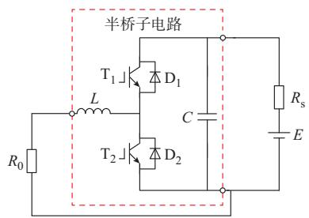  
图1 半桥子电路拓扑  
Fig. 1 Topology of half-bridge sub-circuit

步骤 1：网络元件的离散化。忽略绝缘栅双极型 晶 体 管（insulated gate bipolar transistor，IGBT）及二极管正向导通压降，将图中 IGBT及二极管分别用“两态”可变电阻 $R _ { \mathrm { T } } , R _ { \mathrm { D } }$ 代替。当IGBT或二极管导通时，电阻取非常小的“通态”值（通常为0.01 Ω），否则取非常大的“断态”值（通常为 $1 0 ^ { 8 } \ \Omega )$ 。接着，利用 算法［10］ ，将电容、电感离散为电阻和历史电流源并联的诺顿等效形式，等效电路如附录 图A1所示。

步骤 2：生成网络节点电压方程。根据等效后的电路构建网络的节点电压方程：

$$
G (t) \boldsymbol {v} (t) = \boldsymbol {i} (t) + I _ {\mathrm {h}} (t) \tag {1}
$$

式中：v（t）为节点电压向量；（i t）为外部电流向量；$I _ { \mathrm { h } } ( t )$ 为历史电流源向量；G（t）为网络的电导矩阵。

对于包含 n个开关的电力网络，记其开关状态向 量 为 $X (  { t } ) { = } [  { x } _ { 1 } (  { t } ) ,  { x } _ { 2 } (  { t } ) , \cdots ,  { x } _ { n } (  { t } ) ]$ ，其 中$x _ { i } ( t ) \in \{ 0 , 1 \} ( 0$ 代表关断、1代表导通）， $i { = } 1 , 2 , \cdots$ ，$n _ { \mathrm { o } }$ 当网络中发生开关状态变化时，电导矩阵将随之变化，即

$$
G (t) = f (X (t)) \tag {2}
$$

步骤 3：节点电压方程求解。在每一时步的计算中，首先求解控制系统，根据开关元件的支路电流/电压关系及门极信号判断开关状态向量，记为$X _ { m - 1 } ( t ) ( m$ 为迭代次数），接着求取系统电导矩阵。其后，根据外部电流向量及历史电流源向量计算节点电压向量，再根据支路信息求解各支路的内部电气量，更新历史电流源向量。最后进入下一时步。值得注意的是，电路网络中某些开关的状态变化可能同时导致其他开关的状态发生变化，称为同步开关。此时，需依赖迭代计算来求取当前时刻的稳定开关状态。具体而言，计算完内部变量后，重新判断各开关状态并形成新的开关状态向量，记为 $X _ { m } \left( t \right) _ { \circ }$ 若前后两次计算所得的开关状态向量不同，则表明当前时步中部分开关动作进一步引发了同步开关动作，则将 $X _ { m } \left( t \right)$ 用于更新系统电导矩阵，并再次求解得到开关状态向量 $X _ { m + 1 } ( t )$ 。直到多次迭代后开关状态向量不再改变，表明 $X _ { m + 1 } ( t )$ 为t时刻稳定的开关状态组合，此时方可进入下一时步的计算流程。

可见，当仿真网络中包含大量开关元件时，由于同步开关导致的迭代过程需要对系统进行多次的全局因子分解，这将直接导致仿真耗时剧增。

# 2 同步开关的快速预判方法

对于半桥子电路中的IGBT/二极管组，仅存在3种开关状态，定义为：

1）状态0（ $\mathrm { T } _ { \mathrm { O F F } } / \mathrm { D } _ { \mathrm { O F F } } )$ ）：IGBT关闭、二极管关闭；  
2）状态 $1 ( \mathrm { T _ { O F F } / D _ { O N } } )$ ：IGBT关闭、二极管导通；  
3）状态 $2 ( \mathrm { T } _ { \mathrm { O N } } / \mathrm { D } _ { \mathrm { O F F } } )$ ：IGBT导通、二极管关闭。

在任意时步都可根据 IGBT门极脉冲信号、端电压极性以及电流方向推导出IGBT及二极管的开关状态。可得 IGBT/二极管组的开关状态转移逻辑如图2所示，图中 $i _ { \mathrm { c e } } \setminus v _ { \mathrm { c e } } \setminus G$ 分别为支路电流、支路电压以及门极信号。

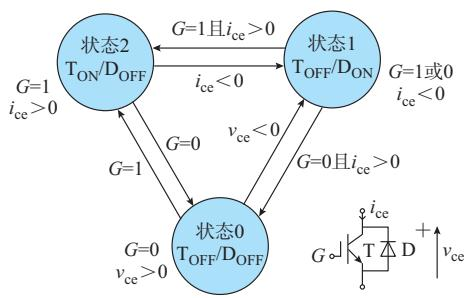  
图2 IGBT/二极管组的开关状态转移图  
Fig. 2 Switch state transition diagram of an IGBT/diode group

然而，图 2仅能判断单个 IGBT/二极管组的开关状态，无法判断出半桥子电路上下管组由于互相

作用产生的同步开关。本文引入额外的判断逻辑来识别同步开关，并对开关状态进行更新，可不经过迭代计算而判断出稳定的开关状态组合。

由于半桥子电路拓扑换流规则的特殊性以及与外电路的低耦合性，其同步开关具有统一的规律，因此，可将半桥子电路作为开关判断的基本单元。半桥子电路中的同步开关发生原因为 IGBT导通/关断导致对侧二极管由于承受反电压/续流而同时关断/导通，下文进行具体分析。

# 1）对侧二极管的同步导通

图3为半桥子电路中开关状态变化引发对侧二极管同步续流导通的示意图。图中：红色箭头线表示电流流通路径；灰色IGBT/二极管表示该元件处于关断状态； $; i _ { \mathrm { h b } }$ 为桥臂电流 $\mathrm { : \mathcal { V } _ { d c } }$ 为直流电容电压。记上下桥臂IGBT/二极管组的标号分别为 $\mathrm { S } _ { 1 } , \mathrm { S } _ { 2 0 }$ 。假设上一时步 $\mathrm { S } _ { 1 }$ 的稳定状态为“状态 $2 ^ { \mathfrak { N } }$ ”， $\mathrm { S } _ { 2 }$ 的稳定状态为任意。如果在当前时步通过开关状态转移图判断出 $\mathrm { S } _ { 1 }$ 的开关状态为“状态 $\boldsymbol { 0 } ^ { \dag }$ ”，且此时电流 $i _ { \mathrm { h b } }$ 由桥臂中点流向外电路，即 $i _ { \mathrm { h b } } > 0 _ { \circ }$ 。可以判断，由于电感电流不能断续， $\mathrm { D } _ { 2 }$ 将同时导通以提供 $i _ { \mathrm { h b } }$ 的续流通道。因此，无论 $\mathrm { S } _ { 2 }$ 通过开关状态转移图判断出的状态（非稳定状态）是哪一种，都必须强制更新为“状态 $1 ^ { \mathfrak { s } }$ 。该过程换流通道变化情况如图 3（a）所示。上述过程中，D 导通即为预判的同步开关。同理，假设 $\mathrm { S } _ { 2 }$ 的初始状态为“状态 $2 ^ { \mathfrak { N } }$ ”，S 状态为任意。若在当前时步检测到 $\mathrm { S } _ { 2 }$ 的状态变化为“状态 $\boldsymbol { 0 } ^ { \dag }$ ”，且$i _ { \mathrm { h b } } < 0$ ，则 $\mathrm { D } _ { 1 }$ 将同时导通， $\mathrm { S } _ { 1 }$ 开关状态需强制更新为“状态 $1 ^ { \mathfrak { s } }$ ，该换流过程如图3（b）所示。

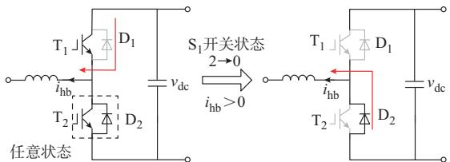

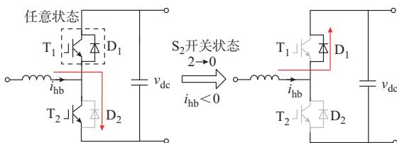  
(a)S '	7D 	E   
(b)S '	7D 	E   
图3 二极管同时导通的两种情况  
Fig. 3 Two cases of diode conducting simultaneously

综上，可得引发对侧二极管同步导通的预判逻辑表达式为：

$$
\left\{ \begin{array}{l l} x _ {2} (t) = 1 & x _ {1} (t - \Delta T) = 2, x _ {1} (t) = 0, i _ {\mathrm {h b}} (t) > 0 \\ x _ {1} (t) = 1 & x _ {2} (t - \Delta T) = 2, x _ {2} (t) = 0, i _ {\mathrm {h b}} (t) <   0 \end{array} \right. \tag {3}
$$

式中 $: x _ { k } ( t - \Delta T )$ 为开关 k（k=1，2）在上一时步的开关状态； $; x _ { k } ( t )$ 为开关k在本时步的开关状态。

# 2）对侧二极管的同步关断

图4为半桥子电路中开关状态变化引发二极管承受反压而同步关断的示意图。假设 $\mathrm { S } _ { 1 }$ 在上一时步的稳定状态为“状态 $\boldsymbol { 0 } ^ { \prime \prime }$ ”，S 的稳定状态为“状态1”，电流由桥臂中点流出，即 $i _ { \mathrm { h b } } { > } 0$ ，此时 D 提供了电流的通路。若在当前时步中，S 的状态变化为“状态 $2 ^ { \dag \dag }$ ”，此时 $\mathrm { D } _ { 2 }$ 将由于承受反压而直接关断， $\mathrm { S } _ { 2 }$ 的状态需强制更新为“状态 $\boldsymbol { 0 } ^ { \dag }$ 。该过程换流通道变化情况如图4（a）所示。上述过程中，D 由于S 开关状态变化而关断即为预判的同步开关。

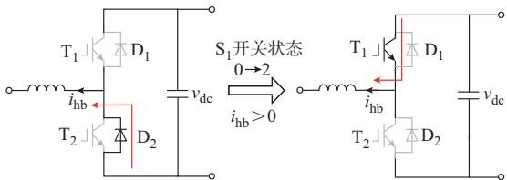  
(a) $\mathrm { S } _ { 1 }$ '	7D 	

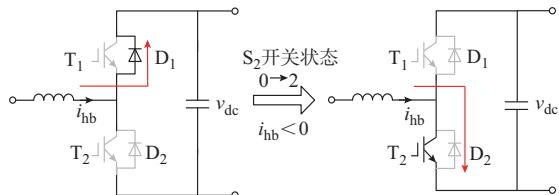  
(b)S '	7D 	   
图4 二极管同时关断的两种情况  
Fig. 4 Two cases of diode turning off simultaneously

同理，假设 $\mathrm { S } _ { 2 }$ 的初始状态为“状态 $0 ^ { \prime \prime } , i _ { \mathrm { h b } } { < } 0 $ 。当 $\mathrm { S } _ { 2 }$ 的状态变化为“状态 $2 ^ { \dag \dag }$ ”时，D 将承受反压而立即关断， $\mathrm { S } _ { 1 }$ 的状态需强制更新为“状态 $\boldsymbol { 0 } ^ { \prime \prime }$ ”。该换流过程如图4（b）所示。

综上，可得引发对侧二极管同步关断的预判逻辑表达式为：

$$
\left\{ \begin{array}{l l} x _ {2} (t) = 0 & x _ {1} (t - \Delta T) = 0, x _ {1} (t) = 2, i _ {\mathrm {h b}} (t) > 0 \\ x _ {1} (t) = 0 & x _ {2} (t - \Delta T) = 0, x _ {2} (t) = 2, i _ {\mathrm {h b}} (t) <   0 \end{array} \right. \tag {4}
$$

通过开关状态初步判断和同步开关预判及更新两个步骤，可直接在当前时步判断得出半桥子电路的最终稳定开关状态，不需要进行迭代求解。

# 3 半桥型VSC快速建模方法

# 3. 1 内节点收缩方法

同步开关的快速预判方法可求解出半桥子电路

内部开关对应的电阻值。对于由半桥子电路构成的复杂半桥型 VSC来说，还需结合内节点收缩方法，形成该变流器整体的节点导纳矩阵［4］ 。内节点收缩方法可以用附录 B图 B1所示含有两个子网络的元件进行说明。子网络1和2分别具有 $N _ { 1 }$ +N及 $N _ { 2 }$ +N 个节点，其中 N 为该元件的内节点数， $N _ { 1 } + N _ { 2 }$ 为外节点数。该元件的节点电压方程可表示为：

$$
\left[ \begin{array}{l l} Y _ {\mathrm {B}} & Y _ {\mathrm {B I}} \\ Y _ {\mathrm {B I}} ^ {\mathrm {T}} & Y _ {\mathrm {I}} \end{array} \right] \left[ \begin{array}{l} u _ {\mathrm {B}} \\ u _ {\mathrm {I}} \end{array} \right] = \left[ \begin{array}{l} i _ {\mathrm {h B}} \\ i _ {\mathrm {h l}} \end{array} \right] \tag {5}
$$

式中： $Y _ { \mathrm { I } \setminus Y _ { \mathrm { B } } }$ 分别为内、外节点的导纳矩阵； $Y _ { \mathrm { B I } }$ 为内外节点的互导纳矩阵； ${ \pmb u } _ { \mathrm { I } } \setminus { \pmb u } _ { \mathrm { B } }$ 分别为内、外节点的电压向量 $; i _ { \mathrm { h I } } \cdot i _ { \mathrm { h B } }$ 分别为内、外节点的注入历史电流向量； $Y _ { \mathrm { B } } , Y _ { \mathrm { I } } , Y _ { \mathrm { B I } }$ 的大小分别为 $( N _ { 1 } { + } N _ { 2 } ) \times ( N _ { 1 } { + } N _ { 2 } )$ 、$N { \times } N _ { \cdot } ( N _ { 1 } { + } N _ { 2 } ) { \times } N ;$ ；向量 $\pmb { u } _ { \mathrm { B } }$ 和 $\dot { \iota } _ { \mathrm { h B } }$ 的长度为 $( N _ { 1 } \cdot$ +N）、向量 $\pmb { u } _ { \mathrm { I } }$ 和 $i _ { \mathrm { h I } }$ 的长度为 $N _ { \circ }$ 。利用高斯消元法，式（5）可变换为只含有外节点的诺顿等价形式：

$$
Y _ {\mathrm {B} 1} u _ {\mathrm {B}} = i _ {\mathrm {h B} 1} \tag {6}
$$

其中

$$
Y _ {\mathrm {B}} = \left[ \begin{array}{l l} \frac {1}{R _ {\mathrm {L}}} & 0 \\ 0 & \frac {1}{R _ {\mathrm {S} 1}} + \frac {1}{R _ {\mathrm {S} 3}} + \frac {1}{R _ {\mathrm {C}}} \\ 0 & - \frac {1}{R _ {\mathrm {S} 3}} \\ 0 & - \frac {1}{R _ {\mathrm {S} 3}} \end{array} \right.
$$

$$
Y _ {\mathrm {B I}} = \left[ - \frac {1}{R _ {\mathrm {L}}} - \frac {1}{R _ {\mathrm {S} 1}} 0 - \frac {1}{R _ {\mathrm {S} 1}} \right] ^ {\mathrm {T}} \tag {10}
$$

$$
Y _ {1} = \left[ \frac {1}{R _ {\mathrm {S 1}}} + \frac {1}{R _ {\mathrm {S 2}}} + \frac {1}{R _ {\mathrm {L}}} \right] \tag {11}
$$

式中： $R _ { \mathrm { L } } , R _ { \mathrm { C } } , R _ { \mathrm { S } i }$ 分别为电感等效诺顿电阻、电容等效诺顿电阻以及IGBT/二极管组S（i=1，2，3，4）的等效电阻。

同理可得内外节点的电压向量及节点注入历史电流向量为：

$$
\left\{ \begin{array}{l} \boldsymbol {u} _ {\mathrm {B}} = \left[ \begin{array}{l l l l} u _ {1} & u _ {2} & u _ {3} & u _ {4} \end{array} \right] ^ {\mathrm {T}} \\ \boldsymbol {u} _ {1} = \left[ \begin{array}{l} u _ {5} \end{array} \right] \end{array} \right. \tag {12}
$$

$$
\left\{ \begin{array}{l} i _ {\mathrm {h B}} = \left[ I _ {\mathrm {h L}} - I _ {\mathrm {h C}} \quad 0 \quad I _ {\mathrm {h C}} \right] ^ {\mathrm {T}} \\ i _ {\mathrm {h l}} = \left[ - I _ {\mathrm {h L}} \right] \end{array} \right. \tag {13}
$$

式中： $\colon u _ { 1 } { \sim } u _ { 5 }$ 为各节点电压； $; I _ { \mathrm { h L } } , I _ { \mathrm { h C } }$ 分别为电感和电容的诺顿等效历史电流。通过式（6）、式（7）即可将单相 H桥变流器建模为一个 4端口电气元件，然后参与电磁暂态仿真计算。

$$
\left\{ \begin{array}{l} Y _ {\mathrm {B l}} = Y _ {\mathrm {B}} - Y _ {\mathrm {B l}} Y _ {\mathrm {I}} ^ {- 1} Y _ {\mathrm {B l}} ^ {\mathrm {T}} \\ i _ {\mathrm {h B l}} = i _ {\mathrm {h B}} - Y _ {\mathrm {B l}} Y _ {\mathrm {I}} ^ {- 1} i _ {\mathrm {h I}} \end{array} \right. \tag {7}
$$

式中： $Y _ { \mathrm { B 1 } }$ 和 $\dot { \iota } _ { \mathrm { h B 1 } }$ 分别为该元件只包含外节点的诺顿等效导纳矩阵和历史电流向量。

式（6）是该元件作为一个整体直接参与电磁暂态计算的节点电压方程。在仿真过程中，当同步开关状态预判完成后，修改子网络的导纳矩阵，如 $Y _ { \mathrm { ~ B ~ } }$ 、$Y _ { \mathrm { I } }$ 和 $Y _ { \mathrm { B I } }$ ，并通过式（7）计算 $Y _ { \mathrm { B 1 } }$ 和 $\dot { \iota } _ { \mathrm { h B 1 } }$ 。在该元件参与电磁暂态计算后可求得边界节点电压向量 $\pmb { u } _ { \mathrm { B } }$ ，此时内部节点电压向量 $\pmb { u } _ { \mathrm { I } }$ 的计算公式为：

$$
\boldsymbol {u} _ {\mathrm {I}} = Y _ {\mathrm {I}} ^ {- 1} \left(\boldsymbol {i} _ {\mathrm {h I}} - Y _ {\mathrm {B I}} ^ {\mathrm {T}} \boldsymbol {u} _ {\mathrm {B}}\right) \tag {8}
$$

根据该元件所有的节点电压 $( \pmb { u } _ { \mathrm { B } }$ 和 $\pmb { u } _ { \mathrm { I } } )$ ），可以很容易地根据式（5）计算出节点历史电流 $( \dot { \imath } _ { \mathrm { h B } }$ 和 ${ \dot { \bf \mu } _ { i _ { \mathrm { h I } } } } )$ 。例如，单相 H桥变流器由两个半桥子电路构成，其诺顿等效电路如附录 B图 B2所示。根据内节点收缩方法，该电路可分为两个子网络，共包含4个外节点（节点1~4）与1个内节点（节点5）。

根据子网络拆分可得内外节点的导纳矩阵为：

$$
\left. \begin{array}{c c} 0 & 0 \\ - \frac {1}{R _ {\mathrm {S} 3}} & - \frac {1}{R _ {\mathrm {S} 3}} \\ \frac {1}{R _ {\mathrm {S} 3}} + \frac {1}{R _ {\mathrm {S} 4}} & - \frac {1}{R _ {\mathrm {S} 4}} \\ - \frac {1}{R _ {\mathrm {S} 4}} & \frac {1}{R _ {\mathrm {S} 2}} + \frac {1}{R _ {\mathrm {S} 4}} + \frac {1}{R _ {\mathrm {C}}} \end{array} \right] \tag {9}
$$

对于含有多个子网络的半桥型VSC拓扑，则可通过多级收缩方法，依次进行子网络的合并。附录C所示为以N模块固态变压器为例的多级子网络收缩形成变流器元件整体节点导纳矩阵的过程。

# 3. 2 半桥型VSC的电磁暂态仿真流程

在半桥型VSC的电磁暂态仿真过程中，首先求解控制系统并得到所有开关的驱动信号。接着，对变流器元件的导纳进行计算：①读取各 IGBT的门极信号、端电压以及支路电流，根据图3依次判断变流器内部所有半桥子电路各 IGBT/二极管组的开关状态；②根据桥臂电流 $i _ { \mathrm { h b } }$ 按照式（3）、式（4）预判所有半桥子电路的同步开关动作并更新开关状态；③按照不同开关状态对应的 $R _ { \mathrm { T } }$ 及 $R _ { \mathrm { D } }$ 值，计算所有半桥子电路的诺顿等效电路。根据内节点收缩方法计算该变流器元件整体的节点导纳矩阵；然后，计算其余元件的节点导纳矩阵并形成系统的导纳矩阵；最后，求解系统节点电压方程，计算各节点电压、各元件内部的电压及电流历史量，并进入下一个仿真

时步。采用同步开关快速预判方法建模的半桥型VSC的电磁暂态仿真流程（假设仿真网络中不包含另外的分立开关元件）如附录D图D1所示。

由于半桥子电路的同步开关预判相对独立，对于包含 N 个半桥子电路的变流元件，只需进行 2N次开关转移判断及 N 次独立的同步开关预判。与需要全局迭代求解稳定开关状态的全详细化电磁暂态模型（利用分立开关元件进行仿真算例构建）相比，可大为减少仿真计算量，提高仿真效率。此外，基于所提算法的变流器快速仿真模型可视为条件触发式的阻抗元件，其开关状态不计入系统的开关状态向量X（t）中。因此，仿真网络中可同时存在分立的开关元件（需要迭代求解）及快速变流器元件（内部开关判断不需要迭代，但可参与全局迭代），即采用本文算法的变流器元件可以普通阻抗元件的形式建模并无缝接入传统电磁暂态仿真工具或程序中。

# 4 算法精度测试

本文将提出的同步开关快速预判方法及内节点收缩方法与不同的半桥型VSC拓扑进行耦合建模，构建出一系列变流器元件并接入云端在线电力系统仿真平台——CloudPSS［22］中进行测试。构建的元件包括半桥 DC/DC 变流器、Buck/Boost 变流器、单/三相H桥变流器、单相背靠背变流器、双有源桥变流器以及固态变压器。为验证所提算法对同步开关预判的准确性以及仿真模型的精度，对上述变流器元件进行多类型的仿真测试，并将仿真结果与相同拓扑及控制方式下的PSCAD结果进行对比。本文采用二范数误差作为评判依据［23］ ，计算公式为：

$$
e _ {2 \mathrm {L}} = \frac {\left\| \boldsymbol {b} - \boldsymbol {a} \right\| _ {2}}{\left\| \boldsymbol {b} \right\| _ {2}} \tag {14}
$$

式中：e 为二范数误差值；a为 CloudPSS平台下快速仿真模型的仿真结果向量；b为PSCAD平台下全详细化模型的仿真结果向量。二范数误差越小，表明向量a与b越接近，也即仿真精度越高。通常，二范数误差小于 $1 \times 1 0 ^ { - 2 }$ 即可认为具有较高精度。

# 4. 1 开环运行条件下的模型精度

进行开环运行测试时，半桥 DC/DC 变流器、单/三相 H 桥变流器、单相背靠背变流器、半桥模块、固态变压器内部的级联H桥均采用正弦脉宽调制，且同一桥臂上下两管的开关信号互补。Buck/Boost变流器采用等脉宽调制。双有源桥变流器以及固态变压器采用双重移相调制，电路拓扑结构及关键参数详见附录 E。附录 F表 F1示出了各变流

器元件在仿真步长分别为1 μs和10 μs时采用开环控制的二范数误差结果。可以发现，各变流器的仿真结果二范数误差数量级集中在 10-5~10-3，验证了采用同步开关快速预判算法构建的快速仿真模型具有与全详细化模型相当的仿真精度。

# 4. 2 正常闭环运行条件下的模型精度

为进一步验证同步开关预判方法的普适性，以单相 H 桥变流器和单模块固态变压器为典型的仿真对象展开测试，仿真拓扑如附录 G 图 G1 所示。图 中 ，电 流 内 环 控 制 器 采 用 准 比 例 谐 振（quasi-proportional resonance，qPR）控制，设置单相 H 桥变流器和单模块固态变压器的电流幅值参考在0.05 s时分别由-20 A 突变为 20 A 以及由 10 A 突变为20 A，仿真步长为 10 μs。

图5所示为两变流器快速仿真模型及全详细化模型的直流电容电压 $\mathcal { V } _ { \mathrm { d c } }$ 及滤波电感电流 i 的仿真结果，可以发现所有仿真结果都基本重合。根据式（14）计算求得图 5（a）的 $\mathcal { V } _ { \mathrm { d c } }$ 及 $i _ { \mathrm { L } }$ 的二范数误差分别为 $1 . 3 0 \times 1 0 ^ { - 4 }$ 和 $5 . 3 1 \times 1 0 ^ { - 3 }$ ，图 5（b）的二范数误差分别为 $3 . 7 9 \times 1 0 ^ { - 4 }$ 和 $3 . 2 7 \times 1 0 ^ { - 3 }$ 。仿真结果验证了快速仿真模型具有与全详细化模型相当的仿真精度。值得注意的是，由于开环状态下两算法存在微小的误差，闭环状态下该误差会通过闭环积分器进行积累，因此闭环的仿真误差可能会大于开环，但该误差仍在可接受的范围内。

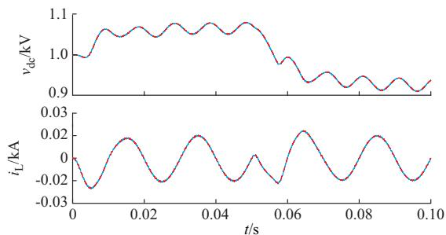

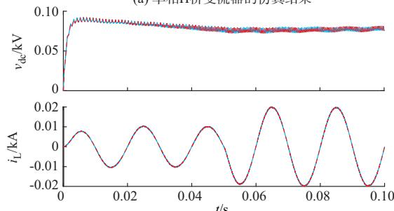  
(a) ,H	"+,3   
(b) 	+,3   
A3 E,   
图5 电感电流及直流电容电压的两种模型仿真结果对比  
Fig. 5 Simulation results comparison of inductor current and DC capacitor voltage between two models

# 4. 3 短路故障时的模型精度

本节验证所提出算法在面对短路故障时的有效性。以附录G图G1（a）的单相H桥变流器为仿真对象，分别设置故障类型为H桥中点与直流侧短路故障（模拟IGBT或二极管烧毁直通，故障Ⅰ）、交流侧短路故障（故障Ⅱ）以及直流母线短路故障（故障Ⅲ）。故障点间用故障电阻进行连接，该电阻非故障状态下阻值极大，设置为 $1 0 ^ { 8 } ~ \Omega$ ，故障状态下阻值极小，设置为 0.01 Ω。设置变流器在 0~0.04 s间正常闭环整流运行，0.04 s时接入短路故障，0.06 s时清除故障。故障条件下两种模型的直流电容电压仿真

结果对比如图6（a）~（c）所示。图6（a）中，直流电压在故障后且 $\mathrm { S } _ { 2 }$ 导通时下降为 0，故障清除后直流电压开始恢复；图6（b）中交流测故障后会对直流电压产生暂时的扰动，但由于交流电源的特性，故障对变流器控制的影响较小；图 6（c）中，直流电压在故障期间保持为 0，故障清除后开始恢复。从仿真结果可以发现，不同种类故障情况下，两种模型的仿真结果都基本重合，本例中 $\mathcal { V } _ { \mathrm { d c } }$ 和 $i _ { \mathrm { L } }$ 的二范数误差分别为： $3 . 3 1 \times 1 0 ^ { - 3 }$ 和 $2 . 7 0 \times 1 0 ^ { - 3 } , 9 . 3 2 \times 1 0 ^ { - 5 }$ 和 4.63×$1 0 ^ { - 3 } , 2 . 9 4 \times 1 0 ^ { - 3 }$ 和 $3 . 8 3 \times 1 0 ^ { - 3 }$ ，验证了本文所提算法的有效性。

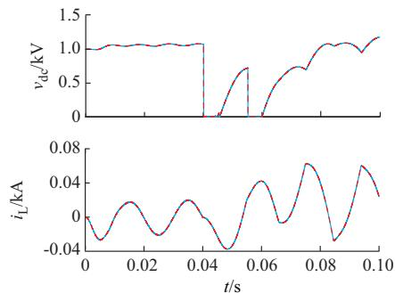  
(a) K?6,"-C

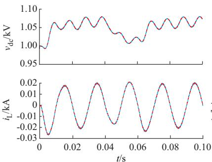  
(b) K?"-C

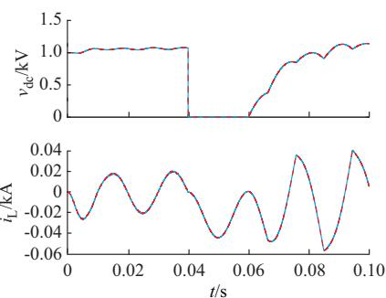  
(c) K?,"-C

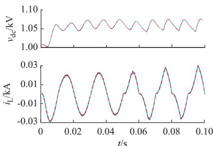  
(d) KJ,6

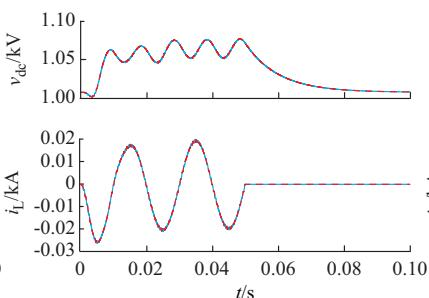  
(e) KJ

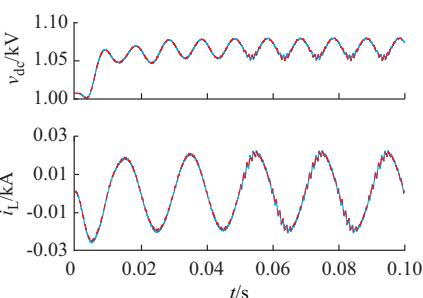  
(f) A   
A3 E,   
图6 短路故障及运行状态切换时的仿真结果对比  
Fig. 6 Simulation results comparison in case of short-circuit fault and operation state change

# 4. 4 运行状态切换时的模型精度

本节继续验证所提出算法在运行状态切换（主要为开关信号变化）时的模型精度。同样以附录G图 G1（a）为仿真对象，设置变流器在 0~0.05 s正常闭环运行，0.05 s时分别设置闭锁一相桥臂开关信号（S 和S）、闭锁所有开关信号以及调制方式切换（由单极性调制切换为双极性调制）。两种模型直流电容电压及电感电流的仿真结果如图6（d）~6（f）所示。图6（d）中，闭锁一相桥臂信号后变流器退化为半整流运行，入网电流产生畸变；图 （）中，闭锁全部开关信号后变流器处于完全闭锁状态，直流电压恢复为直流侧电压源端电压，入网电流下降为0；图6（f）中，单极性倍频调制切换为双极性调制后，入网

电流及直流电容电压开关纹波变大。从仿真结果可以发现两模型的仿真结果重合良好， $\mathcal { V } _ { \mathrm { d c } }$ 和 $i _ { \mathrm { L } }$ 的二范数误差分别为： $1 . 0 6 \times 1 0 ^ { - 4 } \textcircled { \cdot } 4 . 1 0 \times 1 0 ^ { - 3 } \textmd { . } 6 . 4 5 \times 1 0 ^ { - 5 }$ 和 $3 . 9 6 \times 1 0 ^ { - 3 }$ 、 $1 . 5 7 \times 1 0 ^ { - 4 }$ 和 $7 . 4 2 \times 1 0 ^ { - 3 } ,$ 。 可 以 看出，所提算法可正确仿真变流器的各类运行状态切换，证明了该算法对同步开关的判断原则具有良好的普适性。

# 5 算法效率测试

为验证本文所提算法在仿真计算效率方面的优势，对不同模块数的固态变压器快速仿真模型进行开环控制仿真耗时测试，并与相同拓扑下采用PSCAD分立元件构建的全详细化模型进行耗时对

比。仿真拓扑如附录C图C1所示，该拓扑可看成是单相 H桥变流器的串并联组合。左侧串联的 H桥采用移相正弦脉宽调制，右侧并联的双有源桥采用传统的单移相调制，开关频率都设定为 1 kHz。仿真时间及仿真步长分别设置为1 s和10 μs。定义加速比为全详细化模型仿真耗时与快速仿真模型仿真耗时的比值，测试结果如图7所示。

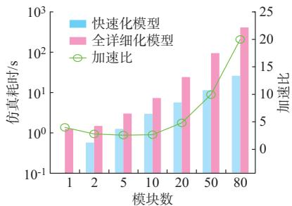  
图7 不同模块数的固态变压器仿真耗时测试  
Fig. 7 Simulation time test of solid-state transformers with different numbers of modules

对于80模块固态变压器，其开关元件（IGBT及二极管）数量达到1 920，采用分立元件进行仿真的耗时约 845 s，若考虑闭环控制，则该时间将变得尤为巨大。此外，不同模块数下快速仿真模型的仿真耗时均小于全详细化模型。特别地，80模块仿真条件下的加速比可达20。可以得出，采用同步开关预判方法建模的变流器快速仿真模型在仿真包含大量半桥型VSC的电力电子网络时，具有明显的仿真效率优势。

# 6 结语

本文以半桥子电路为基本开关判断单元，通过分析其发生同步开关时二极管强制续流及强制关断过程，提出了针对半桥型VSC电磁暂态仿真的同步开关快速预判方法，以及基于内节点收缩的快速仿真模型建模方法。通过大量的仿真测试，验证了变流器快速仿真模型具有与全详细化模型相当的仿真精度，且可以仿真外部故障、运行状态切换等复杂工况。此外，采用本文所提同步开关快速预判算法建模的变流器元件可等效为受条件触发的变阻抗元件，其求取开关稳定状态的过程不需要迭代过程，可直接经由简单逻辑判断得出，因而可极大地提高仿真计算效率。基于上述优点，变流器快速仿真模型在大规模交直流微电网仿真、大规模新能源并网仿真、多模块数的 MMC、级联 H桥变流器、固态变压器的仿真中具有广阔的应用前景。

后续研究拟将相关算法扩展至三电平中点钳位

变流器及T型三电平变流器，并考虑快速仿真模型在接入大规模电网、数模混合仿真中的适应性及可靠性。

附录见本刊网络版（http：//www.aeps-info.com/aeps/ch/index.aspx），扫英文摘要后二维码可以阅读网络全文。

# 参 考 文 献

［1］邓银秋，汪震，韩俊飞，等 .适用于海上风电接入的多端柔直网内不平衡功率优化分配控制策略［J］.中国电机工程学报，2020，40（8）：2406-2415.  
DENG Yinqiu， WANG Zhen， HAN Junfei， et al. Controlstrategy on optimal redistribution of unbalanced power foroffshore wind farms integrated VSC-MTDC［J］. Proceedings ofthe CSEE，2020，40（8）：2406-2415.  
［2］王兴贵，薛晟，李晓英.模块化多电平变流器半桥串联结构微电网输出特性分析［J］.电工技术学报，2019，34（10）：150-160.  
WANG Xinggui，XUE Sheng，LI Xiaoying. Analysis of output characteristics of a microgrid based on modular multilevel converter half-bridge series structure［J］. Transactions of China Electrotechnical Society，2019，34（10）：150-160.   
［3］GUO Gaopeng，WANG Haifeng，SONG Qiang，et al. HB and FB MMC based onshore converter in series-connected offshore wind farm［J］. IEEE Transactions on Power Electronics，2020， 35（3）：2646-2658.   
［4］丁江萍，高晨祥，许建中，等 .级联 H桥型电力电子变压器的闭锁状态等效建模方法［J］. 中国电机工程学报，2021，41（5）：1831-1839.  
DING Jiangping， GAO Chenxiang， XU Jianzhong， et al.Research on equivalent modeling method of cascaded H-bridgebased PET under blocking state［J］. Proceedings of the CSEE，2021，41（5）：1831-1839.  
［5］JI Y，YUAN Z，ZHAO J，et al. Overall control scheme forVSC-based medium-voltage DC power distribution networks［J］.IET Generation，Transmission & Distribution，2018，12（6）：1438-1445.  
［ ］叶华，安婷，唐亚南，等 基于电压源换流器的高压直流输电系统多尺度暂态建模与仿真研究［J］.中国电机工程学报，2020，40（3）：765-777.  
YE Hua，AN Ting，TANG Yanan，et al. Multi-scale modelingand simulation of diverse transients in VSC-HVDC transmissionsystems［J］. Proceedings of the CSEE，2020，40（3）：765-777.  
[7]BENADJAM， REZKALLAHM， BENHALIMAS.Hardware testing of sliding mode controller for improvedperformance of VSC-HVDC based offshore wind farm under DCfault［J］. IEEE Transactions on Industry Applications，2019，55（ ）： -  
［8］姚蜀军，刘畅，汪燕，等 .多频段时间尺度变换电磁暂态仿真研究［］中国电机工程学报， ，（ ）： -

YAO Shujun，LIU Chang，WANG Yan，et al. A research onmulti-frequency band time-scale frame transformation forelectromagnetic transients simulation ［J］. Proceedings of theCSEE，2019，39（24）：7199-7208.  
［9］宋文达，姚蜀军，刘畅，等 .一种基于离散相似的电磁暂态仿真方法研究［J］. 中国电机工程学报，2020，40（21）：6885-6893.  
SONG Wenda，YAO Shujun，LIU Chang，et al. The research of electromagnetic transient simulation method based on discrete similarity［J］. Proceedings of the CSEE，2020，40（21）：6885- 6893.   
［10］内维尔·沃森，乔斯·阿里拉加.电力系统电磁暂态仿真［M］.陈贺，白宏，项祖涛，译.北京：中国电力出版社，2017.  
WATSON N， ARRILLAGA J. Power systemselectromagnetic transients simulation［M］. CHEN He， BAIHong，XIANG Zutao，trans. Beijing：China Electric PowerPress，2017.  
［11］苏杭，徐晋，汪可友，等.考虑变换器损耗特性的小步长实时仿真方法［J］. 中国电机工程学报，2021，41（5）：1840-1850.  
SU Hang，XU Jin，WANG Keyou，et al. Small time-step real-time simulation method considering converter loss characteristics［J］. Proceedings of the CSEE，2021，41（5）：1840-1850.  
［12］赵帅，贾宏杰，李建设，等.一种考虑多重开关动作的变步长电磁暂态仿真算法［J］.电工技术学报，2016，31（12）：177-192.  
ZHAO Shuai，JIA Hongjie，LI Jianshe，et al. Variable step integration method on power system transient simulation with multiple switching events ［J］. Transactions of China Electrotechnical Society，2016，31（12）：177-192.   
［13］姬伟江，汪可友，李国杰，等.计及多重开关的电力电子实时仿真算法及其基于 PXI平台的实现［J］.电网技术，2017，41（2）：587-595.  
JI Weijiang， WANG Keyou， LI Guojie， et al. A real-time simulation algorithm for power electronics circuit considering multiple switching events and its implementation on PXI platform ［J］. Power System Technology， 2017， 41 （2） ： 587-595.   
［14］XU Shuai， ZHANG Jianzhong， HUANG Yingwei， et al.Dynamic average-value modeling of three-level T-type grid-connected converter system［J］. IEEE Journal of Emerging andSelected Topics in Power Electronics， 2019， 7（4）： 2428-2442.  
［15］HAN Jintao，BIEBER L，ZHANG Yuanshi，et al. Detailed equivalent and average value models of hybrid cascaded multilevel converters for efficient and accurate EMT-type simulation［J］. IEEE Transactions on Power Delivery，2020， （ ）： -   
［16］QIN Yanhui， WANG Kaike， TAN Zhendong， et al. Simulation and analysis of multilevel DC transformer using different dual-active-bridge DC-DC converter models ［C］// IEEE PES Innovative Smart Grid Technologies，May 21-24， 2019，Chengdu，China.

［17］MENG X，HAN J，PFANNSCHMIDT J，et al. Combining detailed equivalent model with switching-function-based average value model for fast and accurate simulation of MMCs［J］. IEEE Transactions on Energy Conversion， 2020， 35（1）： 484-496.   
［18］李亚楼，孙谦浩，孟经伟，等.多样性子模块混合型MMC统一外特性高效电磁暂态模型［J］.电力系统自动化，2020，44（5）：138-145.  
LI Yalou， SUN Qianhao， MENG Jingwei， et al. Unifiedterminal and highly efficient electromagnetic transient model ofhybrid modular multilevel converter with various sub-modules［J］. Automation of Electric Power Systems，2020，44（5）：138-145.  
［19］DAHL N J，AMMAR A M，KNOTT A，et al. An improved linear model for high-frequency class-DE resonant converter using the generalized averaging modeling technique［J］. IEEE Journal of Emerging and Selected Topics in Power Electronics，2020，8（3）：2156-2166.   
［20］陈武晖，吴明哲，张军，等.模块化多电平换流器电磁暂态模型研究综述［J］. 电网技术，2020，44（12）：4755-4765.  
CHEN Wuhui，WU Mingzhe，ZHANG Jun，et al. Review ofelectromagnetic transient modeling of modular multilevelconverters［J］. Power System Technology，2020，44（12）：4755-4765.  
［21］ZHANG Rui， SONG Yankan， YU Zhitong， et al. A noniterative switching status combination judgement algorithm for half-bridge sub-circuit based voltage-source converters in EMTP-type simulation program［C］// IEEE PES Innovative Smart Grid Technologies， May 21-24， 2019， Chengdu， China.   
［22］LIU Ye，SONG Yankan，YU Zhitong，et al. Modeling and simulation of hybrid AC-DC system on a cloud computing based simulation platform—CloudPSS ［C］// 2018 2nd IEEE Conference on Energy Internet and Energy System Integration （EI2），October 20-22，2018，Beijing，China.   
［23］刘志文，林智莘，周治国，等.电压源换流器实时多速率仿真研究［J］. 高电压技术，2015，41（7）：2362-2369.  
LIU Zhiwen，LIN Zhixin，ZHOU Zhiguo，et al. Research onreal-time multi-rate simulation of voltage source converters［J］.High Voltage Engineering，2015，41（7）：2362-2369.

（编辑 章黎）

# Fast Electromagnetic Transient Modeling Method for Half-bridge-Type Voltage Source Converter Based on Synchronous Switch Prediction

ZHANG Rui1 ，SONG Yankan1 ，YU Zhitong1 ，CHEN Ying1，2 ，ZHANG Di3 ，ZHU Tong4

(1. Research Center of Cloud Simulation and Intelligent Decision-making, Tsinghua Sichuan EIRI, Chengdu 610210, China;

2. Department of Electrical Engineering, Tsinghua University, Beijing 100084, China;

3. Electric Power Research Institute of State Grid Ningxia Electric Power Co., Ltd., Yinchuan 750002, China;

4. State Grid Sichuan Electric Power Company, Chengdu 610041, China)

Abstract: Half-bridge type voltage source converter (VSC) is widely used in the modern power system. When the traditional electromagnetic transients program (EMTP) is used to simulate a large-scale VSC network, there are problems of high timeconsuming and low efficiency. Taking the half-bridge sub-circuit as the basic unit for the switch state judgment, by analyzing the freewheeling and turning-off process of the diode when the switch states change, a synchronous switch prediction method that is generally suitable for the half-bridge-type VSC is obtained. This method can directly obtain the stable switch state combination through logic judgment at the current time step, while eliminating the iterative calculation. A series of fast simulation models of the half-bridge type VSC are constructed by combining the fast prediction method of synchronous switch and nested node elimination method. Comparative simulation results verify that the proposed fast simulation models have the same simulation accuracy as the full-detailed models, and can effectively reduce the simulation time and improve the simulation efficiency. The simulation on an 80- module solid-state transformer using the fast simulation model can be accelerated by 20 times compared to the full-detailed model.

This work is supported by National Natural Science Foundation of China (No. 52007101).

Key words: electromagnetic transient simulation; half-bridge sub-circuit; voltage source converter; fast switch state judgment; nested node elimination

