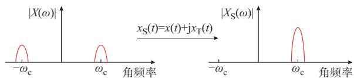
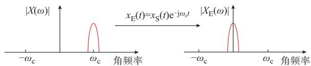
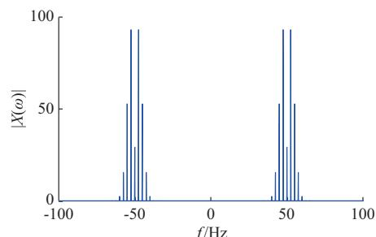
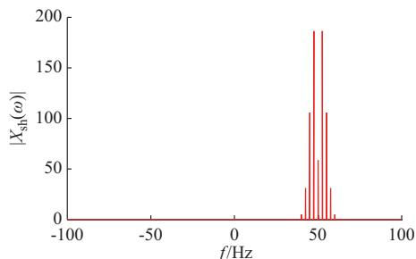
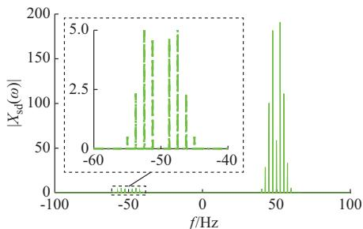
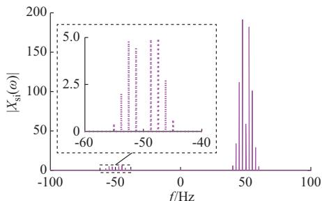
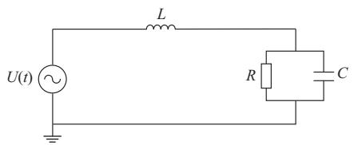
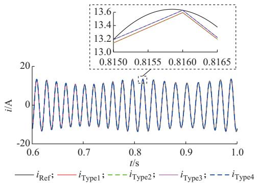
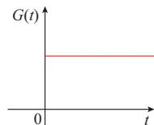
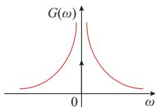

# 电力系统移频电磁暂态仿真原理及应用综述

高仕林 1 ，宋炎侃 1，2 ，陈 颖 1，2 ，黄少伟 1，2 ，于智同 2 ，谭镇东 1

（1. 清华大学电机工程与应用电子技术系，北京市 100084；2. 清华四川能源互联网研究院，四川省成都市 610042）

摘要：高效、精确的电磁暂态仿真是支撑电力系统运行和控制的关键技术。为了解决传统电磁暂态仿真中速度和精度之间的矛盾，提出了移频电磁暂态仿真方法。文中对移频电磁暂态仿真理论的关键技术进行梳理并对其中存在的部分问题进行分析。首先，介绍移频电磁暂态仿真的原理。然后，依次对移频电磁暂态仿真中的3个关键点进行分析，包括复数信号的构造方法、移频变换的具体形式、移频仿真的模型及其特点。接着，对移频电磁暂态仿真技术应用的研究现状进行了介绍。最后，讨论了现有移频电磁暂态仿真中存在的部分关键问题。

关键词：电磁暂态仿真；复数信号；希尔伯特变换；移频

# 0 引 言

传统的机电暂态仿真工具仅针对工频信号建模，难以分析复杂暂态过程［1-2］ 。电磁暂态仿真能够精确模拟系统的各种行为，在现代电力系统中应用广泛。然而，针对大规模交直流电网，传统电磁暂态仿真规模庞大、仿真速度慢，导致暂态过程分析效率低下［3-4］ 。而高效、精确的电磁暂态仿真是大规模电网规划、运行和控制的关键支撑技术，有必要在保证准确性的前提下，研究高效的电磁暂态仿真技术［5-6］ 。

20 世纪 60 年代，加拿大 DOMMEL H W 教授主持开发了世界首个电力系统电磁暂态仿真程序EMTP［7］ 。基于 EMTP的技术，各科研机构和企业开发了一系列电磁暂态仿真软件［8-9］，如 PSCAD/EMTDC［10］ 、实时数字仿真系统（RTDS）［11］ 、全数字电力系统仿真器（ADPSS）［12］ 等。传统电磁暂态仿真中，受奈奎斯特采样定律的限制，积分步长所对应的采样频率一般应小于系统最高频率的 10倍。由于上述程序均对快速变化的电压、电流的瞬时值进行仿真，这使得仿真的步长需取较小值，导致计算效率低。为解决该问题，文献［13-17］提出了一种移频电磁暂态仿真（下文简称移频仿真）方法，首先基于希尔伯特变换构造电力系统中电压、电流信号的复数信号，然后对复数信号进行移频变换得到复包络信号，并基于复包络构造元件的移频分析方程。复包络信号的频率远小于原信号的频率。所以，可在

不损失精度的前提下增大仿真步长，进而实现高效、准确的电磁暂态仿真。众多学者将移频仿真方法应用 于 传 输 线［18］、感 应 电 机［19-20］、同 步 电 机［21-22］、风机［23］ 、模块化多电平换流器［24-26］ 等，建立了上述元件的移频仿真模型。此外，也有学者构建了基于移频仿真技术的仿真平台，实现了大规模交流电网的仿真加速［27-29］ ，可用于交流电网的设计与运行等，推动了移频仿真技术的发展。

移频仿真技术符合电磁暂态仿真的发展方向，但目前移频仿真研究仍不完善，在复数信号构造方式、移频方法、宽频信号建模等方面仍存在理论问题。此外，针对移频仿真中的各步骤，不同文献采用不同的方法、不同的形式，对各步骤的命名也不同，这容易影响读者对移频仿真的理解。因此，对移频仿真研究中的关键技术和现存的问题进行梳理和分析，具有重要的理论价值和现实意义，也有利于促进移频仿真的发展。

为此，本文对移频仿真技术及其研究现状进行综述。首先，介绍了移频仿真的原理。然后，依次梳理了移频仿真中 3个关键步骤的研究现状，即复数信号构造方法及其特点、移频变换的形式及其特点、不同的仿真模型及其区别。接着，对移频电磁暂态仿真技术应用的研究现状进行了总结。最后，讨论了目前移频仿真中仍然存在的问题，为移频仿真技术的进一步发展提供参考。

# 1 移频仿真原理

交流电网中的电压和电流信号可用一中心角频率为 ω 的带通信号 x(t)表示。该信号的频谱是双

边频谱，即含有对称的正频率和负频率 2个部分。为了得到仅含正频率的信号，构造如下形式的复数信号 $x _ { \mathrm { { S } } } \left( \ t \right) ^ { [ 1 3 - 1 4 ] }$ 。

$$
x _ {\mathrm {S}} (t) = x (t) + \mathrm {j} x _ {\mathrm {T}} (t) \tag {1}
$$

式中：t为时间； $\mathord { \left. { \mathcal { X } } _ { \mathrm { T } } \left( t \right) \right.} $ 为 $x _ { \mathrm { { S } } } ( t )$ 的虚部，是与x(t)正交的信号，可通过对 $x ( t )$ 进行某种数学变换 $T ( x )$ 得到。

x ( t ) 和 $x _ { \mathrm { { S } } } \left( t \right)$ 的 频 谱 如 图 1 所 示［14-15］。 图 中 ，$X ( \omega )$ 为 x ( t ) 的 频 谱 ， $X _ { \mathrm { s } } \left( \omega \right)$ 为 $x _ { \mathrm { { S } } } ( t )$ 的频谱。

  
图 原信号与复数信号的频谱  
Fig. 1 Spectra of original signal and complex signal

将上述复数信号 x (t)的频谱向左平移 ω ，可以得到频率集中在 0附近的复包络信号 $x _ { \mathrm { E } } \left( t \right)$ 。频谱的平移在时域中可以表示为：

$$
x _ {\mathrm {E}} (t) = x _ {\mathrm {S}} (t) \mathrm {e} ^ {- \mathrm {j} \omega_ {\mathrm {c}} t} \tag {2}
$$

移频变换前后的信号的频谱如图 2 所示［23］ 。由图可知，复包络信号中所含的最大频率远小于原始实信号，是一个变化缓慢的信号。根据奈奎斯特采样定律［14］，在不损失精度的前提下，基于复包络构造的电磁暂态模型在仿真中可支持更大的积分步长，从而极大降低计算量，提升仿真效率［17］ 。

  
图2 复数信号和复包络信号的频谱  
Fig.2Spectra of complex signal and complex envolope signal

综上，移频仿真的原理可总结为3步［17］ ：①构造复数信号，即通过数学变换将传统含有双边频谱的电压、电流实信号无损变换为只含有单边频谱的复数信号；②移频变换，即将上述复数信号的频谱向左平移一个工频，得到变化缓慢的复包络信号；③离散化，即基于复包络信号，建立元件的离散化模型。下面对这3个部分内容的研究进展进行介绍。

# 2 复数信号的构造方法

如前文所述，构造 $x _ { \mathrm { { S } } } \left( t \right)$ 的虚部信号 $x _ { \mathrm { T } } ( t )$ 时，需引入变换 $T ( x ) _ { \ast }$ 。该变换应当满足以下性质：① $T ( x )$ 为 线 性 变 换 ，即 $T ( x + y ) = T ( x ) +$ $T ( y ) ; \textcircled { 2 } T ( x )$ 满 足 微 分 性 质 ，即 $T ( \mathrm { d } x / \mathrm { d } t ) =$ $\mathrm { d } T ( x ) / \mathrm { d } t$ 。

根据上述原则，现有文献中提出了 3 种构造$x _ { \mathrm { T } } ( t )$ 的 数 学 变 换 $T ( x )$ ，分 别 为 ：希 尔 伯 特 变换［13-14］ 、微分变换［30］ 和积分变换［31］ 。下面以电力系统中典型的带通信号为例，比较 3种复数信号构造方式的区别。带通信号x(t)可以表示为：

$$
x (t) = A (t) \cos \left(\omega_ {c} t + \phi (t)\right) \tag {3}
$$

式中： $\wp _ { \mathrm { c } } = 2 \pi f _ { \mathrm { c } }$ 为角频率，其中 f c为基波频率； $\phi ( t )$ 为相位角 $\mathbf { \partial } _ { \mathbf { \partial } _ { \mathbf { \partial } _ { \mathbf { \partial } _ { \mathbf { \partial } _ { \mathbf { \lambda } } } } } } ( \mathbf { \Lambda } _ { t } )$ 为幅值。

分别采用上述 3种构造方式构造式（3）的复数信号，如附录A表A1所示。可以发现，利用希尔伯特变换构造的复数信号的频谱仅含正频带［13-14］，而利用微分变换和积分变换构造的复数信号仍然含有少量的负频率分量。

为进一步验证上述结论，比较了在不同复数信号构造方式下，式（4）所示的带通信号对应的复数信号的频谱，各信号的频谱如图 3所示。图 3（a）为原信号频谱|X(ω)|，图3（b）为基于希尔伯特变换的复数信号的频谱 $\left| X _ { \mathrm { s h } } \left( \omega \right) \right|$ ，图 3（c）为基于微分变换的复数信号的频谱 $| X _ { \mathrm { s d } } ( \omega ) |$ ，图 3（d）为基于积分变换的复数信号的频谱 $\left| X _ { \mathrm { s i } } \left( \omega \right) \right|$ 。可以发现，测试结果与附录A表A1中分析一致。

$$
\begin{array}{l} x (t) = 2 2 0 \sqrt {2} (1 + 0. 1 \cos (1 0 \pi t)) \cos (1 0 0 \pi t + \\ 2 \cos (5 \pi t)) \tag {4} \\ \end{array}
$$

总之，在相同的步长下，基于上述3种变换的移频仿真中，基于希尔伯特变换的移频仿真的精度较基于另外2种变换的移频仿真的精度更高。因为基于微分变换和积分变换生成的复数信号中仍含有少量负频率分量。移频后该部分频率将提升，从而造成精度损失。

# 3 移频变换

将第 2章中所构造的复数信号 $x _ { \mathrm { S } } ( t )$ 变换为频率在 0附近的复包络信号的过程称为移频变换［17］。该过程可分别用复数形式和实数矩阵形式来实现。

# 3. 1 复数形式

在复数域下，复包络信号的时域表达式为［15，17］ ：

$$
x _ {\mathrm {E}} (t) = x _ {\mathrm {S}} (t) \mathrm {e} ^ {- \mathrm {j} \omega_ {\mathrm {c}} t} = (x (t) + \mathrm {j} x _ {\mathrm {T}} (t)) \mathrm {e} ^ {- \mathrm {j} \omega_ {\mathrm {c}} t} \tag {5}
$$

可以发现，移频变换的本质是将复数信号乘以一个旋转信号，进而得到频率在0 Hz附近的低频复包络信号。复包络信号的最大频率小于原始实信号的频率［15］。所以，基于复包络的电磁暂态仿真（移频仿真）可以采用更大的步长。

# 3. 2 矩阵形式

实数矩阵形式的移频变换在部分文献中又被称为时域坐标变换［32-34］。其实际是将式（5）的实部和

  
(a) 	MA   
(b) 
'	+MA

  
(c) 
	+MA

  
(d) 
/	+MA   
图3 典型带通信号及其复数信号的频谱 g.3Spectrum of typical band signal and its complex signal

虚部分离，表示为矩阵形式，如式（6）所示。

$$
\left[ \begin{array}{l} x _ {\mathrm {u}} (t) \\ x _ {\mathrm {v}} (t) \end{array} \right] = R (t) \left[ \begin{array}{l} x (t) \\ x _ {\mathrm {T}} (t) \end{array} \right] \tag {6}
$$

其中

$$
\boldsymbol {R} (t) = \left[ \begin{array}{l l} \cos \left(\omega_ {\mathrm {c}} t\right) & \sin \left(\omega_ {\mathrm {c}} t\right) \\ - \sin \left(\omega_ {\mathrm {c}} t\right) & \cos \left(\omega_ {\mathrm {c}} t\right) \end{array} \right] \tag {7}
$$

$$
x _ {\mathrm {u}} (t) + \mathrm {j} x _ {\mathrm {v}} (t) = x _ {\mathrm {E}} (t) \tag {8}
$$

# 3. 3 2种变换形式的比较

由 3.1节和 3.2节内容可以发现，2种形式在数学上是等价变换，故其精度一致。但在计算时，基于复数形式的移频变换的电磁暂态仿真的效率比基于

矩阵形式移频变换的仿真效率更高［35］。原因主要有以下 2 点。

# 1）从计算量角度对比

针对一个含有 n个节点的电网，采用复数方式的移频变换时，仿真中每一时步的计算主要为求解一个 n维的复数节点电压方程，其求解时所需的算术运算次数N 如式（9）所示。采用矩阵方式的移频变换时，仿真中每一时步的计算则主要为求解一个2n维的实数节点电压方程，其求解时所需的算术运算次数N 如式（10）所示［36］ 。需要注意的是，这里所提的算术运算次数都指实数加、减、乘、除的次数。

$$
\begin{array}{l} N _ {1} = 2 n D + \frac {4 n ^ {3} + 1 2 n ^ {2} + 1 4 n}{3} M + \\ \frac {4 n ^ {3} + 1 2 n ^ {2} + 2 n}{3} A \tag {9} \\ \end{array}
$$

$$
N _ {2} = 2 n D + \frac {8 n ^ {3} + 1 2 n ^ {2} - 2 n}{3} M +
$$

$$
\frac {8 n ^ {3} + 1 2 n ^ {2} - 2 n}{3} A \tag {10}
$$

式中：D表示除法的运算次数；M表示乘法的运算次数；A表示加法或减法的运算次数。

比较式（9）和式（10）可知，在 n较大时，基于复数形式的移频变换的电磁暂态仿真的节点电压方程的求解计算量约为基于矩阵形式的移频变换仿真的节点电压方程的求解计算量的1/2。

# 2）从计算机实现角度对比

复数矩阵中每个元素实部和虚部在内存中的存储是连续的，这符合CPU访存的局部性原理［37］ 。而采用实数矩阵形式得到的节点导纳矩阵，其实部和虚部元素的存储是不连续的。因此，在单次运算中，复数矩阵运算的缓存命中率更高。故从计算机实现角度看，复数形式的移频仿真计算效率更高。

利用通用的数学求解器 KLU［38］对经复数形式移频变换和经矩阵形式移频变换后形成的网络节点方程的求解效率进行了测试。不同算例的节点方程在不同移频变换形式下的求解效率对比如表 1所示。可以发现，基于复数形式移频变换的节点方程的求解效率更高。这也说明，基于复数形式移频变换的仿真效率高于基于矩阵形式移频变换的仿真效率。

# 4 离散化仿真模型

在电力系统电磁暂态仿真中，电气元件的动态过程均可以用微分方程来描述。设某个元件的微分方程可以表示为［14-15］ ：

$$
\frac {\mathrm {d} x (t)}{\mathrm {d} t} = f (t) \tag {11}
$$

式中：f (t )为 x(t )的导数。

表1 不同变换形式下不同算例的节点方程求解效率  
Table 1 Efficiency of solving nodal equations of different cases with different types of transformation   

<table><tr><td>算例</td><td>复数形式的效率/s</td><td>矩阵形式的效率/s</td></tr><tr><td>IEEE 39</td><td>0.0175</td><td>0.0428</td></tr><tr><td>IEEE 118</td><td>0.0667</td><td>0.1828</td></tr><tr><td>IEEE 300</td><td>0.1936</td><td>0.5369</td></tr><tr><td>IEEE 2383</td><td>1.6180</td><td>4.0817</td></tr><tr><td>IEEE 3120</td><td>1.9711</td><td>5.0258</td></tr><tr><td>IEEE 9241</td><td>8.1546</td><td>21.5926</td></tr></table>

由于第 2章中的 3种变换都满足微分性质，即T ( dx/dt ) = dT ( x ) /dt，原 信 号 的 正 交 信 号满 足［14-15］ ：

$$
\frac {\mathrm {d} x _ {\mathrm {T}} (t)}{\mathrm {d} t} = T \left(\frac {\mathrm {d} x (t)}{\mathrm {d} t}\right) = T (f (t)) = f _ {\mathrm {T}} (t) \tag {12}
$$

根据移频建模理论，结合式（11）和式（12），可以通过隐式梯形法离散化建立移频仿真的不同离散化模型。根据移频变换和离散化的先后顺序，将移频仿真中的仿真模型分为4种，下面分别阐述。

1）根据式（11）和式（12），可得元件基于复数信号的微分方程为：

$$
\frac {\mathrm {d} x _ {\mathrm {S}} (t)}{\mathrm {d} t} = f _ {\mathrm {S}} (t) \tag {13}
$$

其中

$$
f _ {\mathrm {S}} (t) = f (t) + \mathrm {j} f _ {\mathrm {T}} (t) \tag {14}
$$

利用梯形法对式（ ）进行离散化可得基于复数信号的仿真模型（定义为Ⅰ型模型）［14，29］ ：

$$
x _ {\mathrm {s}} (t) = x _ {\mathrm {s}} (t - \Delta t) + \frac {\Delta t}{2} \left(f _ {\mathrm {s}} (t) + f _ {\mathrm {s}} (t - \Delta t)\right) \tag {15}
$$

式中：Δt为t的变化量。

将式（15）转换为矩阵形式，可以得到矩阵形式下的Ⅰ型仿真模型：

$$
\begin{array}{l} \left[ \begin{array}{l} x (t) \\ x _ {\mathrm {T}} (t) \end{array} \right] = \left[ \begin{array}{l} x (t - \Delta t) \\ x _ {\mathrm {T}} (t - \Delta t) \end{array} \right] + \\ \left(\frac {\Delta t}{2} \left[ \begin{array}{l} f (t) \\ f _ {\mathrm {T}} (t) \end{array} \right] + \left[ \begin{array}{l} f (t - \Delta t) \\ f _ {\mathrm {T}} (t - \Delta t) \end{array} \right]\right) \tag {16} \\ \end{array}
$$

对式（15）或式（16）进行计算，即可得到系统的电磁暂态仿真结果。

2）将式（15）等号两边同时乘以e-jωc t，可得一种基于复包络的仿真模型（定义为Ⅱ型模型）：

$$
\begin{array}{l} x _ {\mathrm {E}} (t) = x _ {\mathrm {E}} (t - \Delta t) \mathrm {e} ^ {- \mathrm {j} \omega_ {\mathrm {c}} \Delta t} + \\ \frac {\Delta t}{2} \left(f _ {\mathrm {E}} (t) + f _ {\mathrm {E}} (t - \Delta t) \mathrm {e} ^ {- \mathrm {j} \omega_ {c} \Delta t}\right) \tag {17} \\ \end{array}
$$

其中

$$
f _ {\mathrm {E}} (t) = f _ {\mathrm {S}} (t) \mathrm {e} ^ {- \mathrm {j} \omega_ {\mathrm {c}} t} \tag {18}
$$

将式（17）转换为矩阵形式，可得矩阵形式下的

Ⅱ型仿真模型。

$$
\begin{array}{l} \left[ \begin{array}{l} x _ {\mathrm {u}} (t) \\ x _ {\mathrm {v}} (t) \end{array} \right] = R (\Delta t) \left[ \begin{array}{l} x _ {\mathrm {u}} (t - \Delta t) \\ x _ {\mathrm {v}} (t - \Delta t) \end{array} \right] + \\ \frac {\Delta t}{2} \left(\left[ \begin{array}{l} f _ {\mathrm {u}} (t) \\ f _ {\mathrm {v}} (t) \end{array} \right] + R (\Delta t) \left[ \begin{array}{l} f _ {\mathrm {u}} (t - \Delta t) \\ f _ {\mathrm {v}} (t - \Delta t) \end{array} \right]\right) \tag {19} \\ \end{array}
$$

其中

$$
f _ {\mathrm {u}} (t) + \mathrm {j} f _ {\mathrm {v}} (t) = f _ {\mathrm {E}} (t) \tag {20}
$$

3）对式（13）进行移频变换，可得元件基于复包络信号的微分方程［14-17］ 为：

$$
\frac {\mathrm {d} x _ {\mathrm {E}} (t)}{\mathrm {d} t} = f _ {\mathrm {E}} (t) - \mathrm {j} \omega_ {\mathrm {c}} x _ {\mathrm {E}} (t) \tag {21}
$$

利用隐式梯形法对式（21）进行离散化，可得Ⅲ型仿真模型，如式（22）所示。其仿真的信号是电压、电流的复包络［39-40］ 。

$$
\begin{array}{l} x _ {\mathrm {E}} (t) = x _ {\mathrm {E}} (t - \Delta t) + \frac {\Delta t}{2} \left(f _ {\mathrm {E}} (t) - \mathrm {j} \omega_ {\mathrm {c}} x _ {\mathrm {E}} (t) + \right. \\ f _ {\mathrm {E}} (t - \Delta t) - \mathrm {j} \omega_ {\mathrm {c}} x _ {\mathrm {E}} (t - \Delta t)) \tag {22} \\ \end{array}
$$

将式（22）表示为矩阵形式，可得矩阵形式下的Ⅲ型仿真模型［33］ 为：

$$
\begin{array}{l} \left[ \begin{array}{l} x _ {\mathrm {u}} (t) \\ x _ {\mathrm {v}} (t) \end{array} \right] = \left[ \begin{array}{l} x _ {\mathrm {u}} (t - \Delta t) \\ x _ {\mathrm {v}} (t - \Delta t) \end{array} \right] + \frac {\Delta t}{2} \left(\left[ \begin{array}{l} f _ {\mathrm {u}} (t) \\ f _ {\mathrm {v}} (t) \end{array} \right] - \right. \\ \omega_ {\mathrm {c}} R \left(- \frac {\pi}{2 \omega_ {\mathrm {c}}}\right) \left[ \begin{array}{l} x _ {\mathrm {u}} (t) \\ x _ {\mathrm {v}} (t) \end{array} \right] + \left[ \begin{array}{l} f _ {\mathrm {u}} (t - \Delta t) \\ f _ {\mathrm {v}} (t - \Delta t) \end{array} \right] - \\ \omega_ {\mathrm {c}} R \left(- \frac {\pi}{2 \omega_ {\mathrm {c}}}\right) \left[ \begin{array}{l} x _ {\mathrm {u}} (t - \Delta t) \\ x _ {\mathrm {v}} (t - \Delta t) \end{array} \right] \tag {23} \\ \end{array}
$$

4）将式（22）等号两边同时乘以ejωc t，可得式（24）所示的Ⅳ型仿真模型。Ⅳ型仿真模型是一种基于复数信号的仿真模型［14-15］ ，即

$$
\begin{array}{l} x _ {\mathrm {S}} (t) = x _ {\mathrm {S}} (t - \Delta t) \mathrm {e} ^ {\mathrm {j} \omega_ {\mathrm {c}} \Delta t} + \frac {\Delta t}{2} (f _ {\mathrm {S}} (t) - \mathrm {j} \omega_ {\mathrm {c}} x _ {\mathrm {S}} (t) + \\ f _ {\mathrm {S}} (t - \Delta t) \mathrm {e} ^ {\mathrm {j} \omega_ {\mathrm {c}} \Delta t} - \mathrm {j} \omega_ {\mathrm {c}} x _ {\mathrm {S}} (t - \Delta t) \mathrm {e} ^ {\mathrm {j} \omega_ {\mathrm {c}} \Delta t}) \tag {24} \\ \end{array}
$$

将式（24）表示为矩阵形式，可得矩阵形式下的Ⅳ型仿真模型［41-45］ 为：

$$
\begin{array}{l} \left[ \begin{array}{l} x (t) \\ x _ {\mathrm {T}} (t) \end{array} \right] = Q (\Delta t) \left[ \begin{array}{l} x (t - \Delta t) \\ x _ {\mathrm {T}} (t - \Delta t) \end{array} \right] + \frac {\Delta t}{2} \left(\left[ \begin{array}{l} f (t) \\ f _ {\mathrm {T}} (t) \end{array} \right]\right) - \\ \omega_ {\mathrm {c}} \boldsymbol {Q} \left(\frac {\pi}{2 \omega_ {\mathrm {c}}}\right) \left[ \begin{array}{l} x (t) \\ x _ {\mathrm {T}} (t) \end{array} \right] + \boldsymbol {Q} (\Delta t) \left[ \begin{array}{l} f (t - \Delta t) \\ f _ {\mathrm {T}} (t - \Delta t) \end{array} \right] - \\ \omega_ {\mathrm {c}} \boldsymbol {Q} \left(\frac {\pi}{2 \omega_ {\mathrm {c}}} + \Delta t \binom {x (t - \Delta t)} {x _ {\mathrm {T}} (t - \Delta t)}\right) \tag {25} \\ \end{array}
$$

其中

$$
\boldsymbol {Q} (t) = \left[ \begin{array}{l l} \cos \left(\omega_ {\mathrm {c}} t\right) & - \sin \left(\omega_ {\mathrm {c}} t\right) \\ \sin \left(\omega_ {\mathrm {c}} t\right) & \cos \left(\omega_ {\mathrm {c}} t\right) \end{array} \right] \tag {26}
$$

对比上述 4种仿真模型可知，Ⅰ型和Ⅱ型仿真模型之间是等价变换，二者具有相同的仿真精度；

Ⅲ型和Ⅳ型仿真模型之间是等价变换，二者具有相同仿真精度。Ⅲ型和Ⅳ型仿真模型在本质上是先进行移频变换，再进行离散化。2个步骤中，离散化过程会造成仿真精度损失［14］。由于移频后得到的信号是慢变信号，而对慢变信号进行离散化时的精度损失小，故在相同的步长下，Ⅲ型和Ⅳ型仿真模型的仿真精度将高于Ⅰ型和Ⅱ型模型的仿真精度。

为了验证上述结论，分别利用上述4种模型对图4所示的RLC电路进行仿真，并对4种仿真模型的结果 进 行 对 比 。 图 中 ： $U ( t )$ 为 电 压 源 电 压 ， $U ( t ) { = }$ $A ( t ) \mathrm { { c o s } ( 1 0 0 \pi t + 2 \cos ( 5 \pi t ) ) , ~ } A ( t ) \mathrm { { = } 2 2 0 \sqrt { 2 } ~ ( 1 + ~ }$ $0 . 1 \cos { ( 1 0 \pi t ) } ) ; R _ { \circ } L$ 和C分别为电路的电阻、电感和电容， $R = 2 0 \Omega , L = 5 0 \mathrm { m H } , C = 5 \mu \mathrm { F } ,$ 。

  
图4 简单RLC电路  
Fig. 4 Simple RLC circuit

在步长为1 ms的情况下，分别利用上述4种仿真模型对图 4所示电路进行仿真，并对比不同模型计算得到的电感电流，如图 5 所示。图中： $: i _ { \mathrm { R e f } }$ 为 1 μs步长下 $\mathrm { E M T P ^ { [ 4 6 ] } }$ 仿真得到的电感电流，将其作为参考结果； $; i _ { \mathrm { T y p e 1 } } \setminus i _ { \mathrm { T y p e 2 } } \setminus i _ { \mathrm { T y p e 3 } } \setminus i _ { \mathrm { T y p e 4 } }$ 分别为Ⅰ型、Ⅱ型、Ⅲ型、Ⅳ型仿真模型的结果。

  
图 不同仿真模型计算得到的电感电流  
Fig.5Inductor currents calculated by different simulation models

由图5可知，Ⅲ型和Ⅳ型仿真模型的精度相同，Ⅰ型和Ⅱ型仿真模型的精度相同，Ⅲ型和Ⅳ型仿真模型的精度高于 型和 型仿真模型，具体原因见前文分析。

为了进一步分析 4种仿真模型的精度，对比了不同步长下，4种模型仿真在图4所示电路下得到的电感电流的相对二范数累积误差，如表 2所示。各

种模型结果的相对二范数累积误差e 定义为［47-49］ ：

$$
e _ {i} = \frac {\left\| \boldsymbol {x} _ {\text {Ref}} - \boldsymbol {x} _ {\text {Type} i} \right\| _ {2}}{\left\| \boldsymbol {x} _ {\text {Ref}} \right\| _ {2}} \times 100 \% \tag{27}
$$

式中 $: x _ { \mathrm { R e f } }$ 为 EMTP 仿真得到的参考结果 ${ \bf ; } x _ { \mathrm { { T y p e i } } } ( i =$ 1，2，3，4）为上述 4 种模型的仿真结果。

表 不同步长下的各种仿真模型得到的电感电流与准确结果之间的相对 范数累积误差  
Table 2 Relative 2-norm cumulative error between inductor current obtained by different simulation models with different step sizes and accurate results   

<table><tr><td rowspan="2">步长</td><td colspan="4">相对2范数累积误差/%</td></tr><tr><td>I型模型</td><td>II型模型</td><td>III型模型</td><td>IV型模型</td></tr><tr><td>5 ms</td><td>14.5687</td><td>14.5687</td><td>0.0090</td><td>0.0090</td></tr><tr><td>2 ms</td><td>1.9942</td><td>1.9942</td><td>0.0014</td><td>0.0014</td></tr><tr><td>1 ms</td><td>0.4485</td><td>0.4485</td><td>0.0004</td><td>0.0004</td></tr><tr><td>500 μs</td><td>0.1215</td><td>0.1215</td><td>0.0001</td><td>0.0001</td></tr><tr><td>200 μs</td><td>0.0194</td><td>0.0194</td><td>0</td><td>0</td></tr><tr><td>100 μs</td><td>0.0049</td><td>0.0049</td><td>0</td><td>0</td></tr><tr><td>50 μs</td><td>0.0012</td><td>0.0012</td><td>0</td><td>0</td></tr><tr><td>10 μs</td><td>0</td><td>0</td><td>0</td><td>0</td></tr></table>

由表2可知，在相同步长下，Ⅲ型和Ⅳ型仿真模型的精度一致，Ⅰ型和Ⅱ型仿真模型的精度一致，且Ⅲ型和Ⅳ型仿真模型的精度高于Ⅰ型和Ⅱ型仿真模型，进一步验证了前文理论分析的正确性。

在数值稳定性方面，由于 4种模型采用的离散化方法均为隐式梯形法，4种模型的数值稳定性一致，均为 A-稳定［8］。移频仿真中，除了需注意采用的数值积分方法是否具有A-稳定性，还需考虑其是否为L-稳定。由于隐式梯形法非L-稳定，在系统中发生变量突变时，移频仿真中将出现数值振荡问题。这与基于隐式梯形法的 EMTP仿真中发生变量突变时遇到的问题相同，可结合临界阻尼调整技术或插值技术对数值振荡进行抑制［8］ 。此外，可考虑采用L-稳定的数值积分方法（如二阶对角隐式龙格库塔法［50-51］）对系统的微分方程进行求解。由于该类方法为 L-稳定，在发生变量突变时，移频仿真中不会出现数值振荡。

# 5 移频仿真技术的应用

关于移频仿真技术的应用，现有文献主要针对如何基于移频仿真技术建立电力系统元件的模型展开研究。在旋转电机的建模方面，文献［ - ］基于移频仿真算法建立了同步电机的电磁暂态仿真模型；文献［19-20，39］建立了移频仿真框架下的感应电机模型；文献［23，52］分别基于移频仿真算法建

立了双馈感应风机和永磁直驱风机的模型，设计了实数信号和复数信号之间的数据接口，为其他含电力电子器件系统的移频仿真模型的建立提供了参考。在传输线建模方面，文献［15］基于移频仿真算法建立了传输线的贝瑞隆模型；文献［18］基于移频仿真算法建立了传输线的频率依赖模型，能够精确描述仿真线路的电磁暂态过程。在直流换流站建模方面，文献［43-45］建立了换流站交流侧的移频仿真模型，并设计了交流侧和直流侧的数据接口，实现了移频仿真算法和传统 EMTP算法的混合仿真。其中，直流电网采用EMTP进行仿真。上述研究将移频技术应用到电力系统的电磁暂态仿真中，缓解了仿真步长和精度之间的矛盾，提升了仿真的效率，也验证了移频仿真技术的有效性。未来，还需继续对电 力 系 统 其 他 设 备（如 柔 性 交 流 输 电 系 统（FACTS）、光伏系统）的移频仿真模型展开研究。

在应用方面，除了上述电力系统元件的移频仿真建模外，部分文献针对移频仿真平台构建展开研究。文献［27-29］介绍了基于移频仿真技术的仿真平台 CloudPSS，可应用于电网的设计与运行，但其目前仅支持传统交流电网的仿真。如何对其进行扩展，使得其支持含新能源、直流等的大规模交直流电网的仿真值得进一步研究。

# 6 讨论分析

# 6. 1 现有的复构造方法存在的问题

# 6. 1. 1 微分变换和积分变换的问题

微分变换会放大信号中的高频分量，使得基于微分变换的移频仿真在仿真含高频分量的信号（即含有多个中心频率，非带通信号）时易出现精度降低的问题。而积分变换则会放大信号中的低频分量，基于积分变换的移频仿真无法精确仿真含低频分量的信号。即使仿真的信号中不含高频分量和低频分量，基于上述 2种变换的移频仿真方法的精度也比基于希尔伯特变换的移频仿真方法差。因为基于微分变换和积分变换构造的复数信号中存在负频率分量，移频后的频谱中将含有原信号频率 2倍频左右的分量，导致仿真误差被放大。

# 6. 1. 2 希尔伯特变换的问题

希尔伯特变换虽然不存在上述问题，但利用其构造的复数信号仍然具有局限性。希尔伯特变换具有非因果特性［15-17］，信号的希尔伯特变换在 $t { = } t _ { 0 }$ 处的值与原信号在 $t > t _ { 0 }$ 范围内的值有关。因此无法仅用原信号在 $t < t _ { 0 }$ 范围内的值来表示。这会造成下列2个方面的问题。

1）电磁暂态仿真与移频仿真的混合仿真问题。

如果需要将EMTP与移频仿真进行混合仿真，需要在每个时步将接口处的 EMTP侧的实数信号转换为移频仿真中的复数信号。但是，由于希尔伯特变换的非因果性，EMTP中实数信号对应的希尔伯特变换后的复数信号不可知，混合仿真难以实现。

2）移频仿真过程中，系统中出现开关等动作时，复数信号的实部（原信号）与虚部之间不再满足希尔伯特变换的关系。由于希尔伯特变换存在非因果性，导致复数信号虚部的值与实部 t>t 的值相关，而 $t > t _ { 0 }$ 的值无法预知。下面以开关的建模为例，对此进行进一步说明。

开关可以表示为可变电阻，可变电阻的数学模型可以表示为［8］ ：

$$
i (t) = G (t) u (t) \tag {28}
$$

式中：G(t)表示电阻；i(t)表示电阻上流过的电流；$u ( t )$ 表示电阻的电压。

目前，移频仿真均不考虑 G(t)的变化，直接构造i(t)和u(t)的复数信号为：

$$
i _ {\mathrm {S}} (t) = G (t) u _ {\mathrm {S}} (t) \tag {29}
$$

式中 $: i _ { \mathrm { S } } ( t )$ 和 $u _ { \mathrm { S } } \left( t \right)$ 为复数信号。

实际上，开关元件的电阻 $G ( t )$ 可视为一个阶跃函数，其频谱 $G ( \omega )$ 连续，范围为 $( - \infty , + \infty )$ ，如图6所示。式（29）的变换忽略了信号 G(t)中比 $u ( t )$ 更高频的部分，这会造成精度损失。

  
(a)KB

  
(b) MA   
图6 阶跃函数示意图及其频谱  
Fig. 6 Schematic diagram of step function and its spectrum

# 6. 1. 3 带通信号假设失效问题

现有基于希尔伯特变换的移频仿真在推导的过程中，都假设信号是形如式（3）的带通信号［14-17］ 。在这个前提下，由于希尔伯特变换具有调制特性，原信号经希尔伯特变换后的信号容易求得。根据希尔伯特变换的调制特性，直接对原信号中的高频分量部分进行希尔伯特变换即可得到所需复数信号的虚部。但该简化的前提是A（t）和 $\phi ( t )$ 均为低频信号。现有移频仿真均忽略了这一假设。无论 A（t）和ϕ（t）中是否含高频分量，皆按上述方式构造复数信号。在含高频分量时，这种复数信号的构造方式已不是准确的希尔伯特变换，文中将其称为“伪希尔伯特变换”。值得注意的是，基于“伪希尔伯特变换”的

移频仿真的准确性依然很高。下面对此进行分析。

事实上，容易发现基于“伪希尔伯特变换”的复数信号的最大频率与基于希尔伯特变换的复数信号的最大频率一样，只是基于“伪希尔伯特变换”的复数信号含有负频率分量。当原信号含有频率较高的分量时，其频率范围很宽，移频变换过程中对频谱移动 50 Hz或 60 Hz，对频谱的影响很小。所以，相同步长下，基于希尔伯特变换和“伪希尔伯特变换”的仿真结果很接近。如果移频频率选取得较大时，基于“伪希尔伯特变换”的移频仿真的精度相较基于希尔伯特变换的移频仿真的差距较大，这是因为基于“伪希尔伯特变换”的复数信号的负频率分量将变为比原信号最高频率更高的频率的分量。根据奈奎斯特采样定律和数值积分方法误差理论［8］ 可知，其仿真精度将会下降。

# 6. 2 复数信号的构造与移频变换间的解耦特性

根据 6.1节的分析可以发现，复数信号可以通过多种不同的数学变换来构造。无论以何种方式构造复数信号，都可以进行移频变换，并进行移频仿真。事实上，复数信号的构造与移频变换二者解耦，复数信号的构造方式并不影响移频变换的实现。甚至直接对原信号进行移频变换也可以得到一种移频仿真模型，但这样的结果却是需要采用比EMTP仿真更小的仿真步长才能实现精确仿真。另外，移频变换时频谱平移频率的大小与复数信号的构造方式也无关。

不同复数信号构造方式的区别在于：利用不同方式构造的复数信号经移频变换后得到的复数包络信号在仿真过程中的精度不一致。若复数信号构造的方式不佳，将会影响仿真结果的精度。

# 7 移频仿真的下一步研究重点及建议

考虑本文讨论的移频仿真的原理和应用问题，下面对移频仿真技术及其应用的下一步研究重点进行总结。

# 7. 1 复数信号构造方法方面

由于现有的复数信号的构造方法都不完美，更加灵活且普适的复数信号构造方法是未来的研究重点。尤其是如何建立具有因果性的复数信号的虚部，进而对电力系统中广泛存在的非线性元件进行精确建模，是未来复数信号构造研究的关键。微分变换和积分变换具有因果性［15-17］，但基于其移频仿真的准确性不足；基于希尔伯特变换的移频仿真准确性高，但其又不具有因果性。在下一步研究中，可以考虑不同复数信号构建方式混合使用策略，并评估其数值准确性，进而提出兼顾因果性和准确性的

复数信号通用构建方法。

# 7. 2 时空协调的移频参数选择方法方面

文中讨论的移频仿真技术针对电压、电流为窄带信号的交流系统。但由于直流电网等的接入，实际电网往往存在谐波，且不同区域电网也可能存在不同时间尺度的信号，这限制了单一移频参数在实际电网仿真中的适用性。因此，未来需关注如何将移频仿真技术扩展到宽频、多频段信号的仿真［53-54］ ，需要分析移频参数与误差之间的关系，分析如何为不同的信号选择合适的移频参数，进而形成兼顾仿真精度和计算效率的移频仿真方法。具体实施时，可对不同区域动态过程时间尺度进行分析，优化选择分区对应的移频参数。在仿真过程中，可以利用递归离散傅里叶变换等技术对移频仿真中信号的频率进行检测，根据信号的频率分布对移频参数进行进一步优化。

# 7. 3 大规模电力系统仿真的应用方面

为了使移频仿真技术能够应用于大规模交直流电网的仿真，除上述的移频参数选择问题外，还亟须解决下列问题。

1）由于移频仿真仅适用于交流电网的仿真，在仿真大规模交直流电网时，需与 EMTP 联合仿真［26，29］ ，直流电网利用EMTP方法进行仿真。这要求准确设计交流电网的移频仿真、直流系统和新能源系统的 EMTP仿真之间的数据接口。值得注意的是，移频仿真不会破坏原 EMTP的仿真框架，其实际是对 仿真的补充，移频仿真在仿真交流电网时，能够在保证精度的前提下，极大提升仿真的效率。  
2）在移频仿真中，电气系统使用的信号为复数信号，控制系统使用的信号为实数信号，因此需要准确设计控制系统模型和电气系统模型之间的数据接口［23］ 。  
3）由于系统的规模庞大，在程序实现时，传统的串行实现方法难以达到高效仿真的要求，需要考虑如何进行并行加速。一方面，可以利用多分区多速率移频仿真方法进行粗粒度并行加速；另一方面，可以利用 GPU等设备实现每个分区仿真的细粒度并行加速，可以基于分层有向图等技术设计完全基于GPU 的移频仿真算法［55-56］ 。

# 7. 4 移频仿真技术的应用方面

除了需要研究电力系统设备的移频仿真模型外，还需加快构建移频仿真软件平台。针对移频仿真的研究已超过 10年，但仍未见在工业中广泛应用。因此，如何进行产研结合，设计移频建模仿真软件平台，并将该技术应用于电力系统的暂态分析、安

全性校验等领域，也是重要的研究方向。在具体实施过程中，还需考虑计算机实现层面问题，解决诸如复数矩阵计算加速等难题，进一步提升仿真效率。具体的，可以考虑采用高效的数学求解器（如KLU、NICSLU）对系统的节点方程等进行求解。

# 8 结 语

本文详细梳理和分析了移频仿真的关键技术，包括复数信号的构造、移频变换的实现、仿真模型的建立，对比了各关键步骤中不同方法之间的区别和联系，讨论了未来移频仿真研究的方向和重点。通过分析，可以得到如下结论。

1）移频仿真中，复数信号的构造与移频变换之间相互解耦，互不影响。但不同的复数信号构造方式的仿真精度将会有区别。  
2）复数形式的移频变换与矩阵形式的移频变换是等价的，二者精度一致，但复数形式的移频变换模型的计算效率更高。因此，建议在计算机实现时采用复数形式的移频变换。  
）根据移频变换和离散化的先后顺序不同，总结了 4类移频仿真模型。其中，Ⅰ型和Ⅱ型仿真模型的精度与传统电磁暂态仿真模型一致；Ⅲ型和Ⅳ型仿真模型的精度一致，高于Ⅰ型和Ⅱ型仿真模型，为常用的移频仿真模型。  
4）在应用方面，基于移频仿真理论的交流系统建模与仿真已经较为成熟。已有研究和实际应用表明，移频仿真技术可用于大规模交流系统的电磁暂态仿真［27-29］，提升大规模交流系统电磁暂态仿真的效率。

未来，关于移频仿真技术，还需针对以下方向继续研究。

1）复数信号的构造是移频仿真的关键研究方向之一，尤其是如何利用具有非因果性的数学变换建立复数信号的虚部值得关注。  
2）目前，移频仿真技术主要针对含窄带信号的交流系统，未来需关注如何将移频仿真技术扩展到含宽频、多频段信号的交直流混联系统的仿真，分析如何为不同的信号选择合适的移频参数，形成兼顾仿真精度和计算效率的移频仿真方法。  
3）尽管移频仿真效率较高，但在仿真大规模系统时，仍需考虑进一步加速，例如研究基于并行计算的移频仿真技术。  
4）为了实现移频仿真技术在工业中的应用，除了需要研究电力系统设备的移频仿真模型外，还亟须加快构建移频仿真软件平台。

附录见本刊网络版（http：//www.aeps-info.com/aeps/ch/index.aspx），扫英文摘要后二维码可以阅读网络全文。

# 参 考 文 献

［1］谢小荣，刘华坤，贺静波，等 . 电力系统新型振荡问题浅析［J］. 中国电机工程学报， ，（ ）： -  
XIE Xiaorong， LIU Huakun， HE Jingbo， et al. On newoscillation issues of power systems ［J］. Proceedings of theCSEE，2018，38（10）：2821-2828.  
［2］赵成勇，宋冰倩，许建中.柔性直流电网故障电流主动控制典型方案综述［J］.电力系统自动化，2020，44（5）：3-13.  
ZHAO Chengyong，SONG Bingqian，XU Jianzhong. Overview on typical schemes for active control of fault current in flexible DC grid［J］. Automation of Electric Power Systems，2020，44 （5）：3-13.   
［3］SONG Y K，CHEN Y，HUANG S W，et al. Efficient GPUbased electromagnetic transient simulation for power systems with thread-oriented transformation and automatic code generation ［J］. IEEE Access，2018，6：25724-25736.   
［4］唐亚南，叶华，裴玮，等.MMC-MTDC系统的电磁-机电暂态建模与实时仿真分析［J］.电力自动化设备，2019，39（11）：99-106.  
TANG Yanan， YE Hua， PEI Wei， et al. Electromagnetic-electromechanical transient modeling and real-time simulationanalysis of MMC-MTDC system［J］. Electric Power AutomationEquipment，2019，39（11）：99-106.  
［5］SONG Y K，CHEN Y，HUANG S W，et al. Fully GPUbased electromagnetic transient simulation considering large-scale control systems for system-level studies［J］. IET Generation， Transmission & Distribution，2017，11（11）：2840-2851.   
［6］董毅峰，王彦良，韩佶，等 .电力系统高效电磁暂态仿真技术综述［J］. 中国电机工程学报，2018，38（8）：2213-2231.  
DONG Yifeng，WANG Yanliang，HAN Ji，et al. Review of high efficiency digital electromagnetic transient simulation technology in power system［J］. Proceedings of the CSEE， 2018，38（8）：2213-2231.   
［7］DOMMEL H. Digital computer solution of electromagnetic transients in single-and multiphase networks ［J］. IEEE Transactions on Power Apparatus and Systems，1969，88（4）： 388-399.   
［8］WATSON N，ARRILLAGA J. Power systems electromagnetic transients simulation［EB/OL］. ［2020-11-11］. https：//www. doc88.com/p-9009132405561.html.   
［9］AMETANI A. Numerical analysis of power system transients and dynamics［EB/OL］. ［2020-11-11］. http：//www. doc88. com/p-1912127022254.html.   
［10］GOLE A M，NAYAK O B，SIDHU T S，et al. A graphical electromagnetic simulation laboratory for power systems engineering programs ［J］. IEEE Transactions on Power Systems，1996，11（2）：599-606.   
［11］KUFFEL R， GIESBRECHT J， MAGUIRE T， et al. RTDS—a fully digital power system simulator operating in real

time ［C］// Conference on Communications， Power andComputing，May 15-16，1995，Winnipeg，Canada：300-305.  
［12］田芳，李亚楼，周孝信，等 . 电力系统全数字实时仿真装置［J］.电网技术，2008，32（22）：17-22.  
TIAN Fang， LI Yalou， ZHOU Xiaoxin， et al. Advanceddigital power system simulator［J］. Power System Technology，2008，32（22）：17-22.  
［13］MARTI J R. Shifted frequency analysis （SFA） for EMTPsimulation of fundamental frequency power system dynamics［M］// Vancouver， Canada： The University of BritishColumbia，2005.  
［14］STRUNZ K， SHINTAKU R， GAO F. Frequency-adaptive network modeling for integrative simulation of natural and envelope waveforms in power systems and circuits［J］. IEEE Transactions on Circuits and Systems Ⅰ ： Regular Papers， 2006，53（12）：2788-2803.   
［15］GAO F， STRUNZ K. Frequency-adaptive power system modeling for multiscale simulation of transients ［J］. IEEE Transactions on Power Systems，2009，24（2）：561-571.   
［16］MARTÍ J R， DOMMEL H W， BONATTO B D， et al.Shifted frequency analysis （SFA） concepts for EMTPmodelling and simulation of Power system dynamics［C］//2014 Power Systems Computation Conference， August 18-22，2014，Wroclaw，Poland：1-8.  
［17］ZHANG P，MARTI J R，DOMMEL H W. Shifted-frequencyanalysis for EMTP simulation of power-system dynamics［J］.IEEE Transactions on Circuits and Systems Ⅰ ： RegularPapers，2010，57（9）：2564-2574.  
［18］YE H， STRUNZ K. Multi-scale and frequency-dependent modeling of electric power transmission lines ［J］. IEEE Transactions on Power Delivery，2018，33（1）：32-41.   
［19］XIA Y，STRUNZ K. Multi-scale induction machine model inthe phase domain with constant inner impedance［J］. IEEETransactions on Power Systems，2020，35（3）：2120-2132.  
［20］ZHANG P，MARTI J R，DOMMEL H W. Induction machine modeling based on shifted frequency analysis ［J］. IEEE Transactions on Power Systems，2009，24（1）：157-164.   
［21］HUANG Y， CHAPARIHA M， THERRIEN F， et al. Aconstant-parameter voltage-behind-reactance synchronousmachine model based on shifted-frequency analysis［J］. IEEETransactions on Energy Conversion，2015，30（2）：761-771.  
［22］ZHANG P， MARTI J R， DOMMEL H W. Synchronousmachine modeling based on shifted frequency analysis［J］. IEEETransactions on Power Systems，2007，22（3）：1139-1147.  
［23］XIA Y，CHEN Y，SONG Y K，et al. Multi-scale modeling and simulation of DFIG-based wind energy conversion system ［J］. IEEE Transactions on Energy Conversion，2020，35（1）： 560-572.   
［24］叶华，安婷，裴玮，等 .含 VSC-HVDC交直流系统多尺度暂态建模与仿真研究「1]中国电机工程学报201737（7)：1897-1908.  
YE Hua，AN Ting，PEI Wei，et al. Multi-scale modeling andsimulation of transients for VSC-HVDC and AC systems［J］.Proceedings of the CSEE，2017，37（7）：1897-1908.

［25］潘尔生，杨惠文，宋钊，等.适用于大步长情形下基于模块化多电平拓扑的直流电网高效仿真建模方法［J］.中国电机工程学报，2020，40（19）：6142-6150.  
PAN Ersheng， YANG Huiwen， SONG Zhao， et al. Anefficient modeling of modular multi-level converter based DCgrids by using larger time-steps［J］. Proceedings of the CSEE，2020，40（19）：6142-6150.  
［ ］舒德兀 交直流系统多速率仿真建模与接口技术研究［ ］北京：清华大学，2018.  
SHU Dewu. Research on multi-rate simulation modeling and interfacing for AC/DC grids ［D］. Beijing： Tsinghua University，2018.   
［27］SONG Yankan，CHEN Ying，YU Zhitong，et al. CloudPSS： a high-performance power system simulator based on cloud computing［EB/OL］. ［2020-11-11］. https：//arxiv. org/abs/ 1903.01081.   
［28］CloudPSS［EB/OL］. ［2020-11-11］. https：//www. cloudpss. net/.   
［29］宋炎侃 .交直流电网多时间尺度暂态建模及并行仿真关键技术研究［D］.北京：清华大学，2018.  
SONG Yankan. Multi-timescale transients modeling and parallel simulation techniques for hybrid AC-DC power system［D］. Beijing：Tsinghua University，2018.   
［30］FAN S， DING H. Time domain transformation method foraccelerating EMTP simulation of power system dynamics［J］.IEEE Transactions on Power Systems，2012，27（4）：1778-1787.  
［31］姚蜀军，韩民晓，汪燕，等.大规模电网电磁暂态快速仿真方法［］电力建设， ，（ ）： -  
YAO Shujun， HAN Minxiao， WANG Yan， et al. A fastelectromagnetic transient simulation of large-scale power system［J］. Electric Power Construction，2015，36（12）：16-21.  
［32］欧阳自强，舒德兀，严正，等.基于时域坐标变换的大规模交流系统全电磁暂态仿真研究［J］.中国电机工程学报，2019，39（ ）： -  
OUYANG Ziqang，SHU Dewu，YAN Zheng，et al. Electromagnetic transient simulations of large-scale AC grids based on time domain transformation models［J］. Proceedings of the CSEE，2019，39（18）：5346-5353.   
［33］姚蜀军，韩民晓，黄闻而达 .基于时间尺度变换的大步长电磁暂态仿真［］中国电机工程学报， ，（ ）： -  
YAO Shujun，HAN Minxiao，HUANG Wenerda. A large time step electromagnetic transients simulation based on time-scaleframe transformation［J］. Proceedings of the CSEE，2019，39 （2）：436-446.   
［ ］范圣韬，丁辉，洪潮，等 基于时域变换方法的同步发电机电磁暂态仿真模型[J].南方电网技术，2019.13(5)：30-36.  
FAN Shengtao，DING Hui，HONG Chao，et al. Time domain transformation method based electromagnetic transient simulation model for synchronous generator［J］. Southern Power System Technology，2019，13（5）：30-36.   
［35］BATHINI V，NAGARAJA R，PARTHASARATHY K. An efficient voltage-behind-reactance synchronous machine model for multi-scale transients using shifted-frequency analysis［C］//

2018 IEEE PES Asia-Pacific Power and Energy EngineeringConference （APPEEC） ， October 7-10， 2018， KotaKinabalu，Malaysia：583-588.  
［36］EHRLICH L W. Complex matrix inversion versus real［J］.Communications of the ACM，1970，13（9）：561-562.  
［37］DENNING P J. The locality principle［J］. Communications ofthe ACM，2005，48（7）：19-24.  
［38］DAVIS T A， PALAMADAI NATARAJAN E. Algorithm907：KLU，a direct sparse solver for circuit simulation problems［J］. ACM Transactions on Mathematical Software，2010，37（3）：361-367.  
［39］夏越 ，陈颖 ，宋炎侃 ，等 . 基于自适应移频分析法的 Voltage-Behind-Reactance异步电机多时间尺度暂态建模与仿真［J］.电网技术， ，（ ）： -  
XIA Yue，CHEN Ying，SONG Yankan，et al. Voltage-Behind-Reactance induction machine model for multi-timescale transientsimulation［J］. Power System Technology，2018，42（12）：3872-3879.  
［40］宋炎侃，陈颖，黄少伟，等.基于序分量移频变换的三相交流系统 宽频域电磁暂态仿真［J］.电网技术，2018，42（12）：3864-3871.  
SONG Yankan，CHEN Ying，HUANG Shaowei，et al. Wide frequency-domain electromagnetic transient simulation for threephase AC system based on sequence component modeling and shifted frequency transform［J］. Power System Technology， 2018，42（12）：3864-3871.   
［41］SHU D W， DINAVAHI V， XIE X R， et al. Shiftedfrequency modeling of hybrid modular multilevel converters forsimulation of MTDC grid［J］. IEEE Transactions on PowerDelivery，2018，33（3）：1288-1298.  
［42］LI Y P，SHU D W，SHI F，et al. A multi-rate co-simulation of combined phasor-domain and time-domain models for largescale wind farms ［J］. IEEE Transactions on Energy Conversion，2020，35（1）：324-335.   
［43］SHU D W，WEI Y D，DINAVAHI V，et al. Co-simulation of shifted-frequency/dynamic phasor and electromagnetic transient models of hybrid LCC-MMC DC grids on integrated CPU-GPUs［J］. IEEE Transactions on Industrial Electronics， 2020，67（8）：6517-6530.   
［44］WEI Y D，SHU D W，XIE X R，et al. Real-time simulation of hybrid modular multilevel converters using shifted phasor models［J］. IEEE Access，2019，7：2376-2386.   
［45］宋钊，舒德兀，严正，等.采用时频坐标变换的大规模交直流系统多模态仿真方法［J］.电力系统自动化，2020，44（5）：130-137.SONG Zhao，SHU Dewu，YAN Zheng，et al. Multi-domainsimulation method for large-scale AC/DC systems based ontime-frequency coordination transform ［J］. Automation ofElectric Power Systems，2020，44（5）：130-137.  
［46］DOMMEL H W. EMTP theory book［M］. Portland，USA：Microtran Power System Analysis Corporation，1996.  
［47］刘志文，林智莘，周治国，等.电压源换流器实时多速率仿真研究［J］. 高电压技术，2015，41（7）：2362-2369.LIU Zhiwen，LIN Zhixin，ZHOU Zhiguo，et al. Research onreal-time multi-rate simulation of voltage source converters［J］.

High Voltage Engineering，2015，41（7）：2362-2369.  
［48］MATAR M，IRAVANI R. Massively parallel implementationof AC machine models for FPGA-based real-time simulation ofelectromagnetic transients［J］. IEEE Transactions on Power， ， （ ）： -  
［49］FU X，MOUHAMADOU S S，MAHSEREDJIAN J，et al.A comparison of numerical integration methods anddiscontinuity treatment for EMT simulations［C］// 2018 PowerSystems Computation Conference （PSCC），June 15，2018，Dublin，Ireland：1-7.  
［50］NODA T， TAKENAKA K， INOUE T. Numericalintegration by the 2-stage diagonally implicit Runge-Kuttamethod for electromagnetic transient simulations ［J］. IEEETransactions on Power Delivery，2009，24（1）：390-399.  
［51］NODA T， KIKUMA T， YONEZAWA R. Supplementarytechniques for 2S-DIRK-based EMT simulations［J］. ElectricPower Systems Research，2014，115：87-93.  
［52］YE H，YUE B，LI X，et al. Modeling and simulation of multi-scale transients for PMSG-based wind power systems［J］. WindEnergy，2017，20（8）：1349-1364.  
［53］姚蜀军，刘畅，韩民晓，等.宽频时间尺度变换多速率电磁暂态仿真研究［］中国电机工程学报， ，（ ）： -  
YAO Shujun，LIU Chang，HAN Minxiao，et al. A research on multi-rate electromagnetic transients simulation strategy based on frequency dependent time scale frame transformation［J］. Proceedings of the CSEE，2019，39（3）：675-684.   
［54］姚蜀军，刘畅，汪燕，等.多频段时间尺度变换电磁暂态仿真研究［］中国电机工程学报， ，（ ）： -  
YAO Shujun，LIU Chang，WANG Yan，et al. A research onmulti-frequency band time-scale frame transformation forelectromagnetic transients simulation［J］. Proceedings of the， ， （ ）： -  
［55］陈颖，宋炎侃，黄少伟，等.基于GPU的大规模配电网电磁暂态并行仿真技术［］电力系统自动化， ，（ ）： -  
CHEN Ying，SONG Yankan，HUANG Shaowei，et al. GPUbased techniques of parallel electromagnetic transient simulation for large-scale distribution network［J］. Automation of Electric Power Systems，2017，41（19）：82-88.   
［56］宋炎侃，黄少伟，陈颖，等.应用有向图分层的控制系统暂态仿真并行算法及其 GPU 实现［J］. 电力系统自动化，2016，40（12）：137-143.  
SONG Yankan， HUANG Shaowei， CHEN Ying， et al. Layered directed acyclic graph based parallel algorithm for control system transient simulation and its GPU realization［J］. Automation of Electric Power Systems，2016，40（12）：137- 143.

陈 颖(1979—)，男，通信作者，博士，教授，主要研究方向：电力系统电磁暂态建模与仿真、韧性配电网、信息物理系

统。E-mail：chen_ying@tsinghua.edu.cn

（编辑 鲁尔姣）

# Overview on Principle and Application of Shifted Frequency Based Electromagnetic Transient Simulation for Power System

GAO Shilin1 ，SONG Yankan1，2 ，CHEN Ying1，2 ，HUANG Shaowei1，2 ，YU Zhitong2 ，TAN Zhendong1

(1. Department of Electrical Engineering, Tsinghua University, Beijing 100084, China;

2. Sichuan Energy Internet Research Institute, Tsinghua University, Chengdu 610042, China)

Abstract: Efficient and accurate electromagnetic transient (EMT) simulation is the key technology for supporting the operation and control of the power systems. To cope with the contradiction between the speed and accuracy of the traditional EMT simulation, a shifted frequency (SF) -based EMT simulation method was proposed. This paper reviews the key technology of principles for the SF-based EMT simulation and analyzes some existing problems of it. First, the principle of the SF-based EMT simulation is introduced. Then, three key points of the SF-based simulation are analyzed, including the formulation method of a complex signal, the concrete forms of frequency shifting, and the SF-based EMT simulation models as well as their characteristics. Next, the research status of applications for SF-based simulation technology is introduced. Finally, some critical problems in the SF-based EMT simulation are discussed.

This work is supported by National Key R&D Program of China (No. 2018YFB0904500).

Key words: electromagnetic transient (EMT) simulation; complex signal; Hilbert transformation; shifted frequency (SF)

