# Error in Propagation Velocity Due to Staircase Approximation of an Inclined Thin Wire in FDTD Surge Simulation

Taku Noda, Member, IEEE, Rikido Yonezawa, Shigeru Yokoyama, Fellow, IEEE, and Yuzo Takahashi, Member, IEEE

Abstract—This paper presents the result of a study on the error in propagation velocity introduced by the staircase approximation of a thin wire in the finite difference time domain (FDTD) surge simulation. The FDTD method directly solves Maxwell’s equations by discretizing the space of interest into cubic cells. Thus, it is suitable for solving very-fast surge phenomena which cannot be dealt with by conventional techniques based on the lumped- and distributed-parameter circuit theories. However, FDTD has a limitation that the shape of a conductive object must be modeled by a combination of sides of cells with forced zero electric fields. This indicates that a thin wire, one of the most important components in the surge simulation, results in a staircase approximation, if the wire is not parallel to any of the coordinate axes used for the discretization. A staircase approximation gives a slower propagation velocity due to the zigzag path which is longer than the actual length of the wire. For precise simulations, the error in propagation velocity has to be clarified quantitatively. In this paper, extensive simulations are carried out to obtain the velocity versus inclination characteristic, and it is deduced that the maximum error in propagation velocity is less than 14%.

Index Terms—Electromagnetic transient analysis, finite difference time domain (FDTD) methods, Maxwell equations, simulation, surges, wire.

# I. INTRODUCTION

N UMERICAL electromagnetic (EM) field simulations havebecome a practical choice for the analysis of very fast become a practical choice for the analysis of very fast surge phenomena [1]–[4]. This is mainly due to the following two reasons. One is the recent progress of digital computers in terms of speed and memory capacity so that large-scale problems such as numerical EM field simulations can be solved by an economical computer system. The other is the fact that the numerical EM field simulations, which solve Maxwell’s equations rather than circuit equations, give solutions even for problems which cannot be solved by conventional techniques based on the lumped- and distributed-parameter circuit theories. The finite difference time domain (FDTD) method and the method of moments (MoM), out of the numerical EM field simulation methods, have been used for solving very fast surge phenomena. Ishii and Baba used MoM to analyze the lightning response of a transmission tower [1], and they also used MoM to calculate the

lightning current in a tall structure [2]. Tanabe used FDTD for the simulation of transient grounding impedance [3]. Noda and Yokoyama proposed a method to represent the radius of a thin wire parallel to one of the coordinate axes in the FDTD surge simulation, and developed a general-purpose surge simulation code based on FDTD [4].

To solve very fast surge problems, an imperfectly-conducting ground and thin wires have to be represented, since the imperfectly-conducting ground is generally present and the thin wires are used to represent electrical wires and metallic frames of 3-D structures (such as transmission towers and buildings). FDTD is suitable for representing the imperfectly-conducting ground [3] and able to model thin wires parallel to one of the coordinate axes [4]. However, thin wires inclined with respect to the coordinate axes cannot be modeled as they are and have to result in staircase approximations as described below. On the other hand, MoM is able to model inclined wires as they are, but the representation of the imperfectly-conducting ground is complicated [5]. Thus, if the error due to the staircase approximation is clarified and shown to be small for practical purposes, FDTD can be a preferable choice over MoM.

FDTD solves Maxwell’s equations by discretizing the space of interest into cubic cells along the coordinate axes. This algorithm imposes that the shape of a conductive object must be modeled by a combination of sides of cells with forced zero electric fields, that is, a thin wire not parallel to any of the coordinate axes results in a staircase approximation. A staircase approximation gives a slower propagation velocity due to the zigzag path which is longer than the actual length of the wire. In this paper, extensive simulations are carried out to examine the error in propagation velocity due to the staircase approximation, and the velocity versus inclination characteristic is obtained. It is deduced from the result that the maximum error in propagation velocity is less than 14%. Two test cases are used to show that staircase approximations give practically accurate results.

# II. STAIRCASE APPROXIMATION (SCA)

Let us consider a straight line which connects the start point A to the end point B as illustrated in Fig. 1. The straight line is on a 2-D plane with a grid, and A and B are at grid points. If the straight line is approximated by a zigzag path along grid sides, as indicated by the dashed line, it is called a staircase approximation (SCA) of the straight line. The zigzag path that minimizes the distance between the straight line and itself can be determined by the following algorithm.

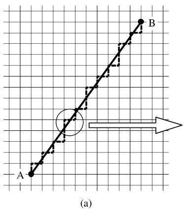

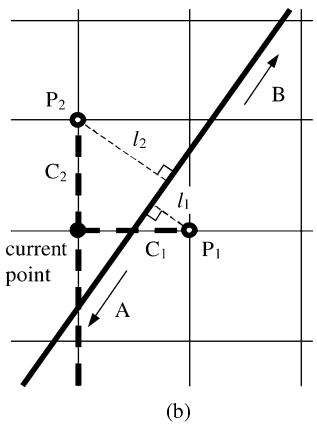  
Fig. 1. Staircase approximation of a straight line. A staircase approximation of the solid line is indicated by the dashed line.

Step 1) Set the current point to A.   
Step 2) As illustrated in Fig. 1(b), there are two sides $\mathrm { C _ { 1 } }$ and $\mathrm { C _ { 2 } }$ connected to the current point towards B. Choose the one whose distance between the straight line and the remote end of the side is smaller. In the case of Fig. 1(b), since $l _ { 1 }$ is smaller than $l _ { 2 } .$ , the side $\mathrm { C _ { 1 } }$ is chosen.   
Step 3) Move the current point to the remote end of the chosen side. In the case of Fig. 1(b), the current point is moved to $\mathrm { P _ { 1 } }$ .   
Step 4) Repeat 2 and 3 until the current point reaches B.

This algorithm can easily be extended to the general 3-D case; In Step 3, there are three sides $\mathrm { C _ { 1 } , C _ { 2 } }$ , and $\mathrm { C _ { 3 } }$ connected to the current point toward the end point B, and we choose the one whose distance between the straight line and the remote end of the side is smallest.

The above algorithm is obvious but repeated here to clarify how an SCA is produced in this paper. In the FDTD calculation, the grid size corresponds to the space step of the discretization of Maxwell’s equations, that is, the cell size. When a thin wire which is inclined with respect to the axes of Cartesian coordinates (hereafter simply referred to as “an inclined wire”) is represented by SCA in the FDTD calculation, the electric fields of the zigzag path obtained by the SCA algorithm are set to zeros.

# III. ERRORS DUE TO SCA

# A. Actual Distance and Manhattan Distance

It is natural to estimate that the SCA of an inclined wire results in a slower propagation velocity than its actual one, since the length of the zigzag path is longer than that of the straight line. The length of the straight line is

$$
l = \sqrt {\left(x _ {2} - x _ {1}\right) ^ {2} + \left(y _ {2} - y _ {1}\right) ^ {2} + \left(z _ {2} - z _ {1}\right) ^ {2}} \tag {1}
$$

where $( x _ { 1 } , y _ { 1 } , z _ { 1 } )$ and $( x _ { 2 } , y _ { 2 } , z _ { 2 } )$ are the coordinates of both ends of the wire. On the other hand, the length of the zigzag path is given by

$$
l ^ {\prime} = \left| x _ {2} - x _ {1} \right| + \left| y _ {2} - y _ {1} \right| + \left| z _ {2} - z _ {1} \right| \tag {2}
$$

and ${ \mathit { l } } ^ { \prime } > { \mathit { l } }$ is mathematically confirmed. is often called a Manhattan distance.

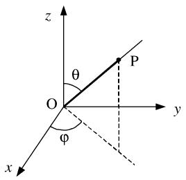  
Fig. 2. Polar coordinates.

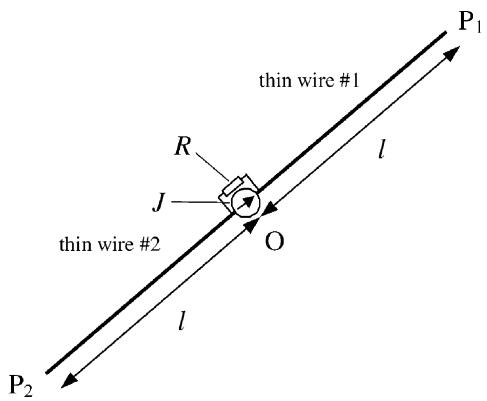  
Fig. 3. The configuration of the conductor system used to examine the error in propagation velocity introduced by SCA in the FDTD calculation.

If we assume that the total propagation time of an inclined wire represented by SCA is obtained by summing up the propagation times of all conductor elements of the zigzag path, the virtual propagation velocity $v ^ { \prime }$ of the inclined wire is given by

$$
v ^ {\prime} = \frac {l}{\underline {{v}} ^ {\prime}} = \frac {l}{l ^ {\prime}} v \tag {3}
$$

where is the intrinsic propagation velocity of the wire (here we assume that an EM wave propagates along each conductor element at the speed without generating inductions at other conductor elements). Thus, if the above assumption is correct, SCA slows down the virtual propagation velocity of an inclined wire by a factor of . This indicates a relatively large error in propagation velocity, when the inclination of a wire is large. The direction $\varphi = 4 5 ^ { \circ }$ and $\theta = \cos ^ { - 1 } ( 1 / \sqrt { 3 } ) \cong 5 4 . 7 ^ { \circ }$ in polar coordinates of Fig. 2 gives the maximum inclination, where SCA results in a propagation velocity slowed down by 42.3%. In Section III-C, it will be shown that the decrease of the virtual propagation velocity due to SCA is much less than the simple estimation (3) since there exists the mutual induction among neighboring conductor elements in the FDTD calculation.

# B. Simulation Conditions

Fig. 3 shows the configuration of the conductor system used to examine the error in propagation velocity introduced by SCA in the FDTD calculation. The twin thin wires are excited by the current source placed at the origin O of the coordinate axes. The current source is equipped with the parallel resistance . The twin wires are symmetrically arranged: the origin O and the remote ends $P _ { 1 }$ and $P _ { 2 }$ of the thin wires are on a straight line. The thin wires are represented by SCA and no radius correction [4] is applied. The best grid points are chosen for the remote

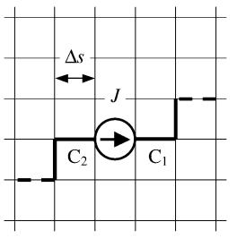  
Fig. 4. The directions of the first wire elements $\mathrm { C _ { 1 } }$ and $\mathrm { C _ { 2 } }$ connected to the current source J (s: cell size).

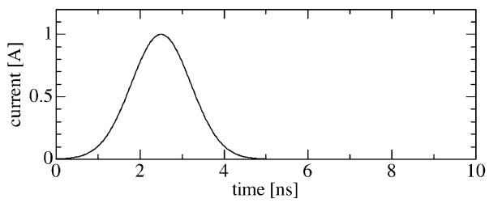  
Fig. 5. Gaussian pulse used for the waveform of the current source: ${ \cal J } =$ $\tilde { I _ { 0 } } \exp ( - a ( t - t _ { 0 } ) ^ { 2 } ) , ( \bar { I _ { 0 } } = 1 \mathrm { A } , a = 1 \times 1 0 ^ { 1 8 } , t _ { 0 } = 2 . 5 \mathrm { n s } )$ .

ends $P _ { 1 }$ and $P _ { 2 }$ so that the length becomes most closely to 1 m (it should be noted that cannot always be set to exactly 1 m since $P _ { 1 }$ and $P _ { 2 }$ must be placed at grid points). The direction of the conductor system is indicated by the parameters $\varphi$ and of polar coordinates shown in Fig. 2, and their values are varied to obtain the variation of the propagation velocity with respect to the degree of inclination. The following points are carefully considered in the simulation to avoid strong dispersion in the vicinity of the current source $J { \boldsymbol { : } }$

a) As shown in Fig. 4, the first wire elements $\mathrm { C _ { 1 } }$ and $\mathrm { C _ { 2 } }$ connected to both ends of are placed in the same direction as .   
b) The direction of is selected from among the -, $y \mathrm { - } .$ , and -directions in such a way that the selected direction is the closest to the wire direction (the direction indicated by $\varphi$ and ).

The current source generates the Gaussian pulse expressed by

$$
J = I _ {0} \exp (- a (t - t _ {0}) ^ {2}) \qquad (4)
$$

where $I _ { 0 } = 1 \mathrm { A } , a = 1 \times 1 0 ^ { 1 8 } , t _ { 0 } = 2 . 5$ , and the waveform is shown in Fig. 5. A Gaussian pulse is often used in FDTD simulations, since it has a relatively wide continuous frequency spectrum in spite of its simple expression [6]. The positive current component of the generated pulse propagates along the thin wire #1 toward $P _ { 1 }$ and the negative current component on # 2 toward $P _ { 2 }$ . Both traveling waves reflect at the remote ends and opposite polarity waves come back to . Thus, in the waveform of the current flowing through the - block (the block consisting of the current source and the resistance $R ) _ { ☉ }$ , we first observe a positive peak directly generated by and then a negative peak by the reflected waves. The value of the parallel resistance used in the simulations is 50 .

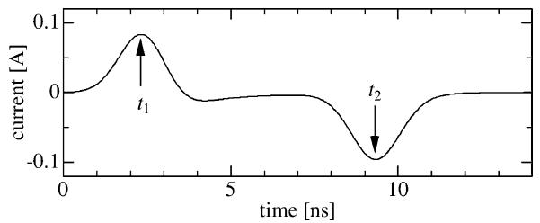  
Fig. 6. The waveform of the current through the J-R block when $\varphi = \theta = 0$ .

In the simulations we used a space step of 1 cm, and the time step is calculated by

$$
\Delta t = \Delta s \sqrt {\frac {\mu_ {0} \varepsilon_ {0}}{3}} (1 - \alpha) \cong 1 9. 2 \mathrm {p s} \qquad (5)
$$

considering Courant’s condition ( : space step, , : permeability and permittivity of space, and $\alpha = 1 \times 1 0 ^ { - 3 }$ : small constant for numerical stability [4]). Although the particular value (1 cm) is used for the space step, the results are valid for any step size as explained in Appendix A. The numbers of cells in the , $y ,$ and directions used for the analysis space that contains the conductor system are 241, 180, and 241 respectively. These dimensions are determined to fit with the memory capacity of the computer system used. Point O is located at the center of the analysis space. To assume an open space, the Liao formulation of the second order [7] for representing an absorbing boundary is applied to the six boundaries of the analysis space.

# C. Simulation Results

Varying the parameters $\varphi$ and , the FDTD simulations with the conditions above were carried out. Considering the symmetry, $\varphi$ is varied from $0 ^ { \circ }$ to $4 5 ^ { \circ }$ . Since no symmetry exists with respect to $\theta ,$ it is varied from $0 ^ { \circ }$ to $9 0 ^ { \circ }$ . Both parameters are varied at an interval of $5 ^ { \circ }$ . For example, Fig. 6 shows the waveform of the current through the - block when $\varphi = \theta = 0 ^ { \circ }$ . In the figure the instant of the first positive peak is marked by $t _ { 1 }$ and that of the negative peak by $t _ { 2 }$ . The propagation velocity $v _ { s i m }$ is calculated by the time difference $t _ { 2 } - t _ { 1 }$ :

$$
v _ {s i m} = \frac {2 l}{t _ {2} - t _ {1}}. (6)
$$

It should be noted that different values of have to be used for different sets of $\varphi$ and in (6) since is not always exactly 1 m. For all values of $\varphi$ and $\theta ,$ the values of $v _ { s i m }$ are calculated by (6) using the simulation results.

Fig. 7 shows the propagation velocity versus curves for the different values of $\varphi ,$ where the propagation velocity values are normalized by the result for $\varphi = \theta = 0 ^ { \circ }$ . As estimated in Section III-A, there is the tendency that greater inclination of the wires results in a slower propagation velocity due to SCA; a minimum is observed around $\varphi = 4 5 ^ { \circ }$ and $\theta = 5 5 ^ { \circ }$ . However, the maximum decrease of the propagation velocity is less than 14%, which is much less than the value 42.3% estimated by (3). The reason why the actual decrease of propagation velocity is smaller than the decrease estimated by (3) can be explained qualitatively as follows. Fig. 8 shows the zigzag path of an inclined wire represented by SCA. Each of magnetic fields

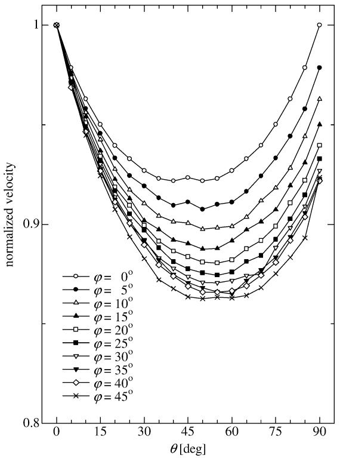  
Fig. 7. The propagation velocity versus  curves for the different values of $\varphi ,$ where the propagation velocity values are normalized by the result for $\varphi = \theta =$ $0 ^ { \circ } .$ .

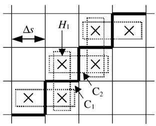  
Fig. 8. Zigzag path of a thin wire represented by SCA. Each of magnetic fields designated by the crosses are shared by two neighboring wire elements.

designated by the crosses is shared by two neighboring wire elements. For instance, the wire elements $\mathrm { C _ { 1 } }$ and $\mathrm { C _ { 2 } }$ share the magnetic field $H _ { 1 }$ . If $H _ { 1 }$ is excited by a current on $\mathrm { C _ { 1 } }$ , this creates a current on $\mathrm { C _ { 2 } }$ at the same time. This coupling, which is not considered in the estimation by (3), allows a faster propagation of an EM wave along the wire.

Although the direction of the current source is adjusted closely to the wire direction as described in Point (b) in Section III-B, the adjustment is incomplete since can be placed only in one of the three coordinate directions. This gives the not-perfectly-smooth curves in Fig. 7.

# IV. VALIDATION

Two test cases are used to compare calculated and measured waveforms for showing that SCA gives practically accurate results.

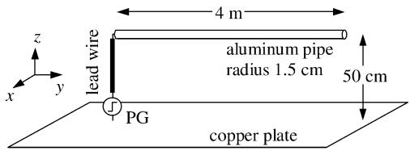  
Fig. 9. Test case 1: horizontal conductor system.

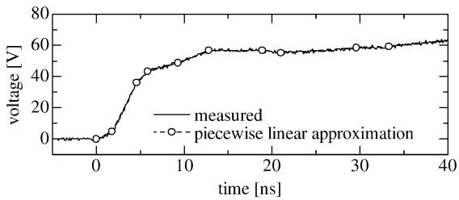

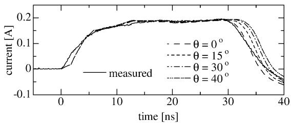  
(a) no-load voltage waveform of PG   
(b) current waveform at PG end

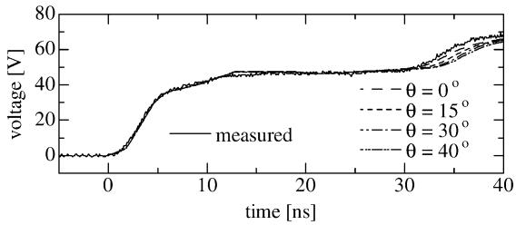  
(c) voltage waveform at PG end   
Fig. 10. Calculated and measured results for test case 1.

# A. Test Case 1

Fig. 9 shows a simple horizontal conductor system. A step voltage is applied by the pulse generator (PG) and led to the sending end of the horizontal aluminum pipe by the lead wire. The radii of the aluminum pipe and the lead wire are respectively 1.5 cm and 1 cm, which are taken into account in the simulation [4]. Fig. 10(a) shows the no-load voltage waveform of the PG, where the solid line is the measured one. In the simulation, the measured waveform is approximated by the piece-wise linear curve shown by the dashed line, and the PG is represented by the series connection of the voltage source with the piece-wise linear waveform and a 50 resistance (known as the internal impedance of the PG). The copper plate is, in the simulation, placed on an - plane and represented by a conductive plate with resistivity $1 . 6 9 \times 1 0 ^ { - 8 }$ . The angle that the aluminum pipe and the axis of the simulation makes is varied from $0 ^ { \circ }$ to $4 5 ^ { \circ }$ at an interval of $1 5 ^ { \circ }$ for varying the inclination degree of the aluminum pipe. A space step of 5 cm is used, and an open space is assumed by the second-order Liao formulation. The voltage and current waveforms at the PG end are calculated and measured.

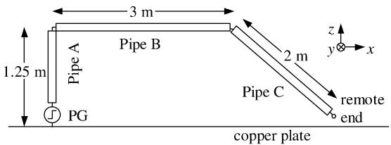

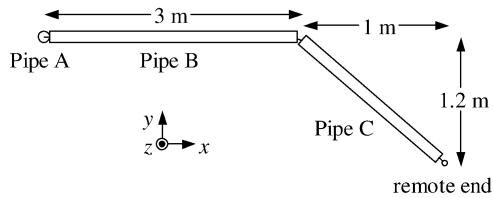  
(a) side view (z-x plane)   
(b) top view (x-y plane)   
Fig. 11. Test case 2: conductor system consisting of three pipes.

Fig. 10(b) and (c) compare the calculated and measured results. The traveling wave reflected at the remote end arrives at the PG end around 30 ns, and the arrival becomes later for larger values. In view of practical simulations, the error even at $\theta = 4 5 ^ { \circ }$ (maximum inclination in this 2-D case) is relatively small compared with the time response of the measurement instruments used.

# B. Test Case 2

Fig. 11 shows a conductor system consisting of three aluminum pipes, where Pipe C is three-dimensionally inclined. The radii of the pipes, 1 cm (Pipe A), 1.5 cm (Pipe B), 1 cm (Pipe C), are considered in the simulation [4]. In the same way as in Test Case 1, the no-load voltage waveform is measured and approximated by a piece-wise linear curve as in Fig. 12(a), and it is used for the voltage source representing the PG equipped with its internal resistance 50 . The representations of the copper plate and the boundaries are the same as in Test Case 1. A space step of 5 cm is used.

Fig. 12(b) shows the voltage waveforms at both ends, and Fig. 12(c) the current waveform at the sending end. The calculated and measured results are superimposed, and good agreement is found on the whole.

Regarding the PG end voltage and current, a delay due to the SCA is observed in the calculated waveforms in comparison with the measured ones. However, the calculated waveform of the remote end voltage shows faster arrivals of the first and the reflected wave compared with the measured one. This is due to the 8 pF capacitance of the voltage probe used for the measurement. If we assume that the surge impedance of Pipe C can roughly be calculated as

$$
Z _ {\text {p i p e}} = 6 0 \ln \frac {2 h _ {m}}{r} \cong 2 9 0 \Omega \tag {7}
$$

with the mean height $h _ { m } = 0 . 6 2 5$ and the radius $r = 1$ , the time constant obtained by a product of the surge impedance and the probe capacitance is 2.3 ns. Thus, in addition to the time response of the voltage probe, the measured waveform at the remote end involves a delay of 2.3 ns. In the case of the PG end, on the other hand, the time constant is roughly calculated to be 0.34 ns due to the smaller resistive component obtained

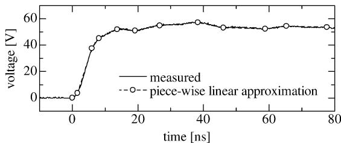

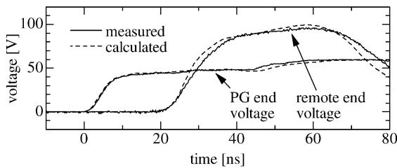  
(a) no-load voltage waveform of PG   
(b) voltage waveforms at both ends

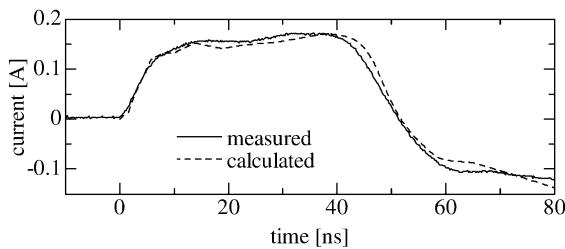  
(c) current waveform at the PG end   
Fig. 12. Calculated and measured results for test case 2.

by the internal impedance of the $\mathrm { P G } \left( = 5 0 \Omega \right)$ and the surge impedance of Pipe $\mathbf { A } \left( = 2 9 0 \Omega \right)$ . And thus the delay at the PG end is negligible. It should be noted that the error due to SCA can be of a same order as the error due to up-to-date measurement instruments. Appendix B summarizes the voltage probes and the current sensor used in the measurement.

# V. CONCLUSIONS

This paper presented the result of extensive simulations to clarify the error in propagation velocity due to the staircase approximation of an inclined thin wire in the FDTD surge simulation. The velocity versus inclination characteristic was obtained. It is deduced from the result that the maximum error in propagation velocity is less than 14%. This is much less than a simple estimation, which one could make, obtained using a Manhattan distance. Two test cases were used to show that staircase approximations give practically accurate results.

# APPENDIX

# A. General Validity of the Simulation Results

Although the velocity versus curves shown in Fig. 7 were obtained by a particular value of $\Delta s ,$ the results are valid for any step size. This can be confirmed as follows. The thin wires are placed in a space where the conductivity is zero. If $\sigma = 0 ,$ $\Delta s$ and $\Delta t$ always appear in the form $\Delta t / \Delta s$ in the FDTD formulation. As long as the time step is determined by (5), the ratio is fixed to be $\sqrt { \mu _ { 0 } \varepsilon _ { 0 } / 3 }$ regardless of the value of $\Delta s .$ . Thus, any value of $\Delta s$ gives the same results as those shown in Fig. 7.

# B. Measurement of Voltage and Current Waveforms

In Test Cases 1 and 2, the voltage probes used for the measurement are Tektronix P6139A whose upper limit of the bandwidth (simply referred to as “bandwidth” hereafter) is 500 MHz. The current sensor used is Tektronix CT-1 whose bandwidth is 1 GHz. Tektronix TDS784D digital oscilloscope is used for acquiring and digitizing the voltage and current waveforms. The maximum sampling rate of the oscilloscope is 4 GS/s, and the bandwidth is 1 GHz.

# REFERENCES

[1] M. Ishii and Y. Baba, “Numerical electromagnetic field analysis of tower surge response,” IEEE Trans. Power Delivery, vol. 12, pp. 483–488, Jan. 1997.   
[2] Y. Baba and M. Ishii, “Numerical electromagnetic field analysis of lightning current in tall structures,” IEEE Trans. Power Delivery, vol. 16, pp. 324–328, Apr. 2001.   
[3] K. Tanabe, “Novel method for analyzing the transient behavior of grounding systems based on the finite-difference time-domain method,” in Proc. IEEE Power Eng. Soc. Winter Meeting, vol. 3, 2001, pp. 1128–1132.   
[4] T. Noda and S. Yokoyama, “Thin wire representation in finite difference time domain surge simulation,” IEEE Trans. Power Delivery, vol. 17, pp. 840–847, July 2002.   
[5] G. J. Burke and E. K. Miller, “Modeling antennas near to and penetrating a lossy interface,” IEEE Trans. Antennas Propagat., vol. AP-32, pp. 1040–1049, Oct. 1984.   
[6] K. S. Kunz and R. J. Luebbers, The Finite Difference Time Domain Method for Electromagnetics. Boca Raton, FL: CRC, 1993.   
[7] Z. P. Liao, H. L. Wong, B.-P. Yang, and Y.-F. Yuan, “A transmitting boundary for transient wave analysis,” Science Sinica, ser. A, vol. 27, no. 10, pp. 1063–1076, 1984.

Taku Noda (M’97) was born in Osaka, Japan, in 1969. He received the Bachelor’s, Master’s, and Doctoral degrees in engineering from Doshisha University, Kyoto, Japan, in 1992, 1994, and 1997, respectively.   
Currently, he is a Research Scientist with the Central Research Institute of Electric Power Industry (CRIEPI). He was with DEI Simulation Software, Neskowin, OR, in 1994, and a Consultant at Bonneville Power Administration (BPA), Portland, OR, in 1995. From 2001 to 2002, he was a Visiting Scientist at the University of Toronto, Toronto, ON, Canada. His main research interest is the transient analysis of power systems.   
Dr. Noda is a member of IEE of Japan.

Rikido Yonezawa was born in Aichi, Japan, in 1979. He received the Bachelor’s degree in engineering from the Tokyo University of Agriculture and Technology (TUAT), Tokyo, Japan, in 2001.

He is currently a Graduate Student at TUAT, and has been a Visiting Student at CRIEPI since 2000. His main research interest is the electromagnetic field analysis of surges.

Mr. Yonezawa is a member of IEE of Japan.

Shigeru Yokoyama (F’96) was born in Miyagi, Japan, on March 5, 1947. He received the Bachelor’s and Doctoral degrees in engineering from the University of Tokyo, Tokyo, Japan, in 1969 and 1986, respectively.

Currently, he is Associate Vice President with Central Research Institute of Electric Power Industry (CRIEPI), where he has been since 1969. He is also a Visiting Professor at Kyushu University, Fukuoka, Japan. His main research interest is the lightning protection and the insulation coordination of transmission and distribution lines.

Dr. Yokoyama is a member of IEE of Japan.

Yuzo Takahashi (M’79) was born in Tokyo, Japan, in 1943. He received the Bachelor’s and Doctoral degrees in engineering from the University of Tokyo in 1966 and 1971, respectively.

Currently, he is a Professor in the Department of Electrical and Electronics Engineering at TUAT. He was with Chuo University, Tokyo, from 1971 to 1980. His research interests include high-voltage engineering, electrostatics, history of technology, and museology.

Prof. Takahashi is a member of IEE of Japan and the Institute of Engineers on Electrical Discharges in Japan.