# Low-Dimensional Equivalent Models and Multithreading-Based Parallel EMT Simulation Method for Multi-Converter Systems

Mingwang Xu , Graduate Student Member, IEEE, Wei Gu , Senior Member, IEEE, Yang Cao , Graduate Student Member, IEEE, Shuaixian Chen, Fei Zhang , Member, IEEE, and Wei Liu, Senior Member, IEEE

Abstract—As the proportion of renewable energy generation in the grid increases, the number of voltage source converters (VSCs) has grown significantly. It is therefore of great importance to study the multi-VSC systems using electromagnetic transient (EMT) simulation. This paper presents a novel approach to modeling multi-VSC circuits, comprising EMT low-dimensional equivalent models and a multithreading-based parallel simulation method. The decoupling between the VSC from the AC grid is initially achieved through the adoption of semi-implicit hybrid integration. This is followed by the synthesis of the equivalent circuit for each phase, which results in the derivation of low-dimensional equivalent models of multi-VSC circuits. In addition, a parallel simulation algorithm for the VSC is proposed, which enables parallel solution and the update of internal/external node voltages and historical current sources. Subsequently, the design and implementation of the parallel algorithm is achieved by means of an OpenMP-based simulation framework. Furthermore, a physical experimental platform is established. The simulation results demonstrate that the proposed model is capable of achieving more than 80 times acceleration in serial mode due to the decoupling and low-dimension when applied in a grid-connected 100-megawatt photovoltaic power station (PVPS), and can obtain 2-3 times secondary acceleration in parallel mode with almost uncompromising accuracy.

Index Terms—EMT modeling and parallel simulation, power electronic converters, decoupling, low-dimensional equivalent circuits of multi-VSC, OpenMP technology, simulation efficiency.

# I. INTRODUCTION

# A. Motivation

W ITH the development of modern power grid and large-scale renewable energy connected to grid, applications scale renewable energy connected to grid, applications

Manuscript received 2 January 2024; revised 8 May 2024; accepted 29 June 2024. Date of publication 4 July 2024; date of current version 21 February 2025. This work was supported by the Science and Technology Project of State Grid Corporation, Key Technologies and Application of Digital Twin for Distribution Network with High DG Penetration under Grant 5400-202255154A-1-1-ZN. Article no. TEC-00004-2024. (Corresponding author: Wei Gu.)

Mingwang Xu, Wei Gu, Yang Cao, Shuaixian Chen, and Fei Zhang are with the School of Electrical Engineering, Southeast University, Nanjing 210096, China (e-mail: 230228745@seu.edu.cn; wgu@seu.edu.cn; 230228738@seu.edu.cn; 220232912@seu.edu.cn; zhangfei@seu.edu.cn).

Wei Liu is with the School of Automation, Nanjing University of Science and Technology, Nanjing 210094, China (e-mail: wliu@njust.edu.cn).

Color versions of one or more figures in this article are available at https://doi.org/10.1109/TEC.2024.3422080.

Digital Object Identifier 10.1109/TEC.2024.3422080

of voltage source converters (VSCs) have increased significantly, such as large-scale renewable energy power station containing multi-VSC [1], [2], [3]. For the design and operation of multi-VSC circuits, the simulation demand for it is becoming increasingly prominent. Electromagnetic transient (EMT) simulation plays an indispensable role to study these issues [4].

However, there are some difficulties in modeling and EMT simulation of multi-VSC circuits, which are mainly reflected in the following aspects [5]. Firstly, multi-VSC containing large number switching devices often operate in parallel through the AC-bus, which brings a high dimensionality and time-varying nodal admittance matrix. In turn, this leads to their EMT simulation is not efficient, and the trade-off between simulation accuracy and efficiency is worthy of further study in this case. Thus, an efficient equivalent model needs to be studied; secondly, the DC side of multi-VSC can be not interconnected, such as individual PV power units (PVPUs) in a large-scale PVPS. Besides, they can also be connected in parallel on the DC-side, such as the back-to-back flexible high voltage direct current (HVDC) transmission systems, so there is an urgent need to study generalized equivalent models that can be adapted to different scenarios; finally, a high-precision and efficiency equivalent model that can account for both internal and external characteristics of the multi-VSC circuits remains to be studied.

# B. Literature Review

For the modeling method of converter, the current research mainly includes the modeling of switching device and the equivalent modeling of converter. Among them, the switching devices in PSCAD/EMTDC and some other platforms adopt the $R _ { \mathrm { o n } } / R _ { \mathrm { o f f } }$ model, but the time-varying admittance matrix will restrict its simulation efficiency and is not suitable for research occasions with a large number of power electronic switches [6]. The L/C-associated constant admittance model is widely used in real-time simulation platforms such as RT-LAB and RTDS and some real-time simulators based on FPGA [7]. In order to solve the problem of power loss in the L/C model, a general modeling method based on response matching is proposed in [8], which perform well in real-time simulation. Besides, compensation current source is proposed to use in [9]. In [10], RTDS developed and launched the universal converter model (UCM). The model

uses a state space modelling method to solve the two-terminal circuits of the converter in strict tandem, eliminating the delay problem of the traditional controlled source algorithm.

In the aspect of VSC equivalent modeling, the equivalent loworder models of modular multilevel converter (MMC) and power electronic transformer (PET) are proposed in [11], [12], [13]. However, the modeling of multi-VSC is quite different from that due to the different connection ways between module ports.

The traditional average model (AVM) constructs the state equation of VSC by averaging the switching period [14], [15]. It ignores the switching action and can greatly improve the simulation efficiency, but its accuracy is not high and it can only describe the average external characteristics. In order to improve the AVM, switching frequency dependent averaged models for DC-DC converters are proposed in [16], which can improve the accuracy of steady-state. Besides, a piecewise average-value model of PWM two-level VSC (2L-VSC) is proposed in [17]. A VSC model based on pulse voltage-current source pair is proposed in [18], and the corresponding solution algorithm is designed. The presented model is suitable for the systems with multi-VSC, but the switch is treated as an ideal switch and the on-resistance is ignored. In general, the above models cannot reflect device-level issues and meet the requirements of high-precision simulation in various scenarios. An FPGA-based partitioning method is proposed in [19] to enable simulation of multiple VSCs to achieve real-time simulation on FPGAs without losing accuracy. The method proposed in the literature for the converter part is the sub-network method, which solves the subsystem after the sub-network in parallel. In [20], an admittance-based modelling method of power-electronic-based energy conversion systems is presented. This method can reduce the number of nodes, but it does not consider the decoupling between the voltage source converter (VSC) and the grid, so there is still scope for improvement.

In [21] and [22], a parametric AVM is proposed which can provide high accuracy, numerical stability and fairly large timesteps without decoupling, but the parallelism feature is lost. The event-driven simulation framework is proposed in [23], [24], which is a novel simulation mechanism and has advantages in simulation efficiency and hardware resource. In addition, some large-step simulation methods based on shifted frequency are proposed in [25], [26], [27]. However, all of those large timesteps methods need to be improved in parallelism.

The latency insertion method (LIM) is a semi-implicit froghopping method of differencing the basic structural units of additional inductor and additional capacitor to ground, which allows the solution of the branch currents and node voltages to be decoupled from each other by a half-step delay, thus enabling fine-grained parallelism at branch level [28], [29], [30]. Nevertheless, the introduction of additional inductor and capacitor alters the dynamic characteristics of the system, necessitating the use of a simulation time-step that is limited to nanoseconds or sub-microseconds. This, in turn, has a significant impact on the overall efficiency of the simulation. A sub-microsecond microgrid simulation method is proposed in [31], which can realize the decoupling of distributed generation system based on the LIM, and the simulation efficiency can be improved

by parallel simulation. According to the semi-implicit delay decoupling algorithm, the decoupling of the AC and DC sides of the VSC circuit has been realized in [32], which has high simulation accuracy, but could not reflect the information of the internal nodes. Besides, a semi-implicit parallel leapfrog solver with half-step sampling technique is proposed in [33], which is similar to the LIM in solving procedure. However, it is evident that none of the aforementioned methodologies provide an explanation for the introduction of half-step delays in the LIM.

A general high-speed equivalent EMT modeling method of PET and MMC are proposed in [34], [35], respectively. This method originates from the nested fast and simultaneous solution (NFSS) in [36]. The internal nodes are eliminated by the node elimination method (NEM) to obtain the two-port equivalent circuit of PET. However, VSC is not a strict two-port network and the connection mode of the two circuits are quite different. Therefore, this method is not suitable for the equivalent modeling of multi-VSC circuits.

In general, the existing research is still inadequate in the following respects:

1) The decoupling method, such as LIM, often requires specific prerequisites and lacks generalized decoupling method.   
2) Equivalent models are not considered according to the connection ways between multi-VSC, and there is a lack of EMT equivalent models suitable for different scenarios.   
3) The general parallel simulation method suitable for multi-VSC circuits remains to be investigated.

# C. Contribution and Organization

This paper presents a novel approach to modeling multi-VSC circuits, comprising EMT low-dimensional equivalent models and a multithreading-based parallel simulation method. The main contributions of this paper are as follows:

The implementation of a semi-implicit hybrid integration algorithm at the filter enables decoupling between the VSC and the grid, thus facilitating parallel solving.   
A low-dimensional equivalent circuit of a three-node VSC has been derived, as well as the equivalent circuit of a multi-VSC for various scenarios.   
A parallel simulation algorithm is proposed as a means of overcoming the highly serial defect of the NEM for VSC. Furthermore, a parallel simulation framework based on OpenMP has been designed and implemented for multi-VSC circuits.   
- In the context of serial solving mode, this paper examines the acceleration space of decoupling and low-dimension, with a view to identifying which of these dominates acceleration under different PVPUs.

This paper is organized as follows. Section II illustrates the decoupling between VSC and AC-grid based on semi-implicit hybrid integration. Section III and Section IV elaborate on the equivalent circuits of VSC and multi-VSC circuit, respectively. The parallel framework of low-dimension models is proposed

in Section V. Section VI discusses the simulation accuracy and efficiency. Finally, Section VII presents the conclusion.

# II. DECOUPLING BETWEEN VSC AND AC-GRID BASED ON SEMI-IMPLICIT HYBRID INTEGRATION

The operation of multi-VSC in parallel through the AC grid results in a time-varying and high-dimensional admittance matrix for the overall circuit, which significantly impairs the simulation efficiency. In this paper, the multi-VSC system is modeled through the concept of decoupling and equivalent modeling.

# A. Decoupling Based on Semi-Implicit Hybrid Integration

This paper outlines two purposes of decoupling: firstly, to reduce the size of the overall admittance matrix and thereby facilitate EMT simulation acceleration; secondly, to facilitate the equivalent modeling of each VSC independently, which will be illustrated in Section III.

The decoupling between VSC and AC-grid at the filter based on semi-implicit hybrid integration (trapezoidal and central integration) is achieved. Since the principle of half-step time-delay is not indicated in the LIM, an attempt has been made to explain the half-step time-delay between state variables through semi-implicit hybrid integration.

The state equation for the linear system can be expressed as.

$$
\dot {\boldsymbol {x}} (t) = \boldsymbol {A} \boldsymbol {x} (t) + \boldsymbol {B} \boldsymbol {u} (t) \tag {1}
$$

By splitting the state-matrix A and integrating (1), we can obtain (2).

$$
\begin{array}{l} \int \dot {\boldsymbol {x}} _ {i} (t) \mathrm {d} t + \int \boldsymbol {D} _ {i} \boldsymbol {x} _ {i} (t) \mathrm {d} t \\ = \int \sum_ {j = 1, i \neq j} ^ {N} \boldsymbol {A} _ {\beta , i j} \boldsymbol {x} _ {j} (t) \mathrm {d} t + \int \boldsymbol {u} _ {i} (t) \mathrm {d} t \tag {2} \\ \end{array}
$$

where N represents the number of subsystems divided by the original system; D is the diagonal matrix and $A _ { \beta }$ is the nondiagonal matrix; $\boldsymbol { x } _ { i }$ and $\boldsymbol { x } _ { j }$ βare the state variables corresponding to the i and $j$ subsystems, respectively; $\pmb { u } _ { i }$ represents the input variables related to the i subsystem.

By applying the center integral to the right-hand side of the equation in (2), we can obtain

$$
\begin{array}{l} \boldsymbol {x} _ {i} ^ {n + 1} - \boldsymbol {x} _ {i} ^ {n} + D _ {i} \frac {\boldsymbol {x} _ {i} ^ {n + 1} + \boldsymbol {x} _ {i} ^ {n}}{2} \Delta t \approx \sum_ {j = 1, i \neq j} ^ {N} A _ {\beta , i j} \boldsymbol {x} _ {j} ^ {n + 1 / 2} \Delta t \\ + \boldsymbol {u} _ {i} ^ {n + 1 / 2} \Delta t = f _ {i} \left(\boldsymbol {x} _ {j} ^ {n + 1 / 2}, \boldsymbol {u} _ {i} ^ {n + 1 / 2}\right) \tag {3} \\ \end{array}
$$

The (3) can be simplified as follows

$$
\left\{ \begin{array}{l} \boldsymbol {x} _ {i} ^ {n + 1} = \boldsymbol {\eta} _ {i} \boldsymbol {x} _ {i} ^ {n} + \lambda_ {i} f _ {i} \left(\boldsymbol {x} _ {j} ^ {n + 1 / 2}, \boldsymbol {u} _ {i} ^ {n + 1 / 2}\right) \\ \boldsymbol {\eta} _ {i} = (2 \boldsymbol {E} + \boldsymbol {D} _ {i} \Delta t) ^ {- 1} (2 \boldsymbol {E} - \boldsymbol {D} _ {i} \Delta t), \\ j = 1, 2, \dots , N, j \neq i \\ \boldsymbol {\lambda} _ {i} = (2 \boldsymbol {E} + \boldsymbol {D} _ {i} \Delta t) ^ {- 1} \end{array} \right. \tag {4}
$$

In (4), E is a unit matrix. The use of implicit trapezoidal and central integrals in (3) results in improved calculation accuracy and numerical stability compared to the LIM.

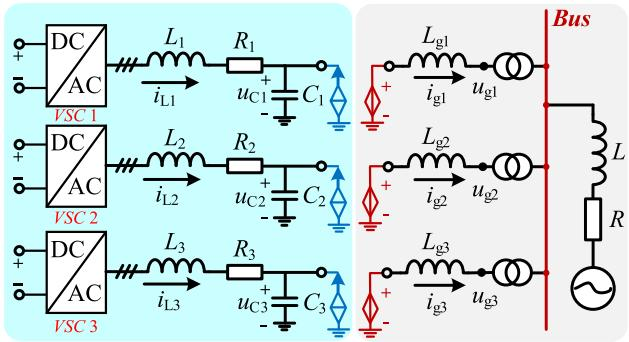  
Fig. 1. Topology of multiple 2L-VSCs circuit.

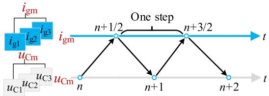  
Fig. 2. Schematic diagram of decoupling and parallel computing.

The subsystem is divided into two groups, $x _ { 1 }$ and $x _ { 2 } ,$ , without any loss of generality. The (5) can obtained.

$$
\left[ \begin{array}{c} \boldsymbol {x} _ {1} ^ {n + 1} \\ \boldsymbol {x} _ {2} ^ {n + 1 / 2} \end{array} \right] = \left[ \begin{array}{c} \boldsymbol {\eta} _ {1} \boldsymbol {x} _ {1} ^ {n} \\ \boldsymbol {\eta} _ {2} \boldsymbol {x} _ {2} ^ {n - 1 / 2} \end{array} \right] + \left[ \begin{array}{c} \boldsymbol {\lambda} _ {1} f _ {1} \left(\boldsymbol {x} _ {2} ^ {n + 1 / 2}, \boldsymbol {u} _ {1} ^ {n + 1 / 2}\right) \\ \boldsymbol {\lambda} _ {2} f _ {2} \left(\boldsymbol {x} _ {1} ^ {n}, \boldsymbol {u} _ {2} ^ {n}\right) \end{array} \right] \tag {5}
$$

In such a scenario, the decoupling between the VSCs and the AC grid can be achieved, as illustrated in Fig. 1.

The state equation of L/C at the filter can be expressed as

$$
\left[ \begin{array}{l} L _ {\mathrm {g m}} \frac {\mathrm {d} i _ {\mathrm {g m}}}{\mathrm {d} t} \\ C _ {\mathrm {m}} \frac {\mathrm {d} u c _ {\mathrm {m}}}{\mathrm {d} t} \end{array} \right] = \left[ \begin{array}{c c} 0 & 1 \\ - 1 & 0 \end{array} \right] \left[ \begin{array}{l} i _ {\mathrm {g m}} \\ u _ {\mathrm {C m}} \end{array} \right] + \left[ \begin{array}{l} - u _ {\mathrm {g m}} \\ i _ {\mathrm {L m}} \end{array} \right] \tag {6}
$$

The state equation discretized by trapezoidal and central integration at the filter can be expressed as

$$
\left\{ \begin{array}{l} i _ {\mathrm {g m}} ^ {n + 1} = \frac {\Delta t}{L _ {\mathrm {g m}}} \left(\frac {L _ {\mathrm {g m}}}{\Delta t} i _ {\mathrm {g m}} ^ {n} + u _ {\mathrm {C m}} ^ {n + \frac {1}{2}} - u _ {\mathrm {g m}} ^ {n + \frac {1}{2}}\right) \\ u _ {\mathrm {C m}} ^ {n + \frac {1}{2}} = \frac {\Delta t}{C _ {\mathrm {m}}} \left(\frac {C _ {\mathrm {m}}}{\Delta t} u _ {\mathrm {C m}} ^ {n - \frac {1}{2}} - i _ {\mathrm {g m}} ^ {n} + i _ {\mathrm {L m}} ^ {n}\right) \end{array} \right. \tag {7}
$$

where m = 1, 2, 3; n is the iteration time-step; $\Delta t$ is the simulation time-step; $u _ { \mathrm { g m } }$ represents the voltage of AC-side; $u _ { \mathrm { { C m } } }$ represents the voltage of capacitors; $i _ { \mathrm { g m } }$ represents the current of inductors.

In (7), the capacitor voltage $u _ { \mathrm { { C m } } }$ and inductor current $i _ { \mathrm { g m } }$ are solved alternately by half-step time-delay.

The solution between $u _ { \mathrm { { C m } } }$ and $i _ { \mathrm { g m } }$ can be operated alternately according to the Fig. 2, with a difference of half a time-step, while the subsystems in the two groups $u _ { \mathrm { { C m } } }$ and $i _ { \mathrm { g m } }$ can be solved in parallel after decoupling.

# B. Numerical Stability Analysis

A discrete circuit is asymptotically stable if and only if the magnitudes of all the eigenvalues of the state matrix are strictly smaller than one, as expressed in (8).

$$
\rho (\boldsymbol {A}) <   1 \tag {8}
$$

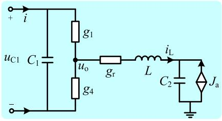  
Fig. 3. Single-phase 2L-VSC circuit.

TABLE IDIFFERENT PARAMETERS OF THE SYSTEM  

<table><tr><td>Parameters</td><td>Gr/Ω</td><td>L/mH</td><td>C1/μF</td><td>C2/μF</td><td>Δt/ms</td><td>max(abs(eig(A)))</td></tr><tr><td rowspan="4">Value</td><td>1~100</td><td>1</td><td>1000</td><td>30</td><td>0~500</td><td>&lt;1</td></tr><tr><td>1</td><td>0.1~20</td><td>1000</td><td>30</td><td>0~654</td><td>&lt;1</td></tr><tr><td>1</td><td>1</td><td>100~5000</td><td>30</td><td>0~518</td><td>&lt;1</td></tr><tr><td>1</td><td>1</td><td>1000</td><td>5~500</td><td>0~702</td><td>&lt;1</td></tr></table>

The state equation of the discrete-time system is:

$$
\boldsymbol {x} ^ {n + 1} = \boldsymbol {A} \boldsymbol {x} ^ {n} + \boldsymbol {B} \boldsymbol {u} ^ {n} \tag {9}
$$

For a discrete system to be stable at equilibrium, a sufficient condition is that all the characteristic roots of A are within the unit circle. Due to the decoupled three-phase operation of the converter, it is possible to analyze the spectral radius of the single-phase circuit depicted in the Fig. 3.

The state equation of the system in Fig. 3 is expressed as follows.

$$
\begin{array}{l} \left[ \begin{array}{c} \frac {\mathrm {d} u _ {\mathrm {C 1}}}{\mathrm {d} t} \\ \frac {\mathrm {d} i _ {\mathrm {L}}}{\mathrm {d} t} \\ \frac {\mathrm {d} u _ {C _ {2}}}{\mathrm {d} t} \end{array} \right] = \left[ \begin{array}{c c c} - \frac {1}{C _ {1}} \cdot \frac {g _ {1} g _ {4}}{g _ {1} + g _ {4}} & - \frac {1}{C _ {1}} \cdot \frac {g _ {1}}{g _ {1} + g _ {4}} & 0 \\ 0 & - \frac {1}{g _ {r} L} & - \frac {1}{L} \\ 0 & \frac {1}{C _ {2}} & 0 \end{array} \right] \left[ \begin{array}{c} u _ {\mathrm {C 1}} \\ i _ {\mathrm {L}} \\ u _ {\mathrm {C 2}} \end{array} \right] \\ + \left[ \begin{array}{c} \frac {i}{C _ {1}} \\ \frac {u _ {o}}{L} \\ J _ {\mathrm {a}} \end{array} \right] \\ \triangleq \boldsymbol {G} \boldsymbol {x} (t) + \boldsymbol {B} \boldsymbol {u} (t) \tag {10} \\ \end{array}
$$

The trapezoidal integral method is employed to discretize the (10), thereby yielding the system state matrix A.

$$
\boldsymbol {A} = \left(\boldsymbol {E} - \frac {\Delta t}{2} \boldsymbol {G}\right) ^ {- 1} \left(\frac {\Delta t}{2} \boldsymbol {G} + \boldsymbol {E}\right) \tag {11}
$$

The (11) shows the relationship between the eigenvalues of matrix A and $g _ { \mathrm { r } } , L , C _ { 1 } , C _ { 2 }$ , and $\Delta t .$ The example system parameters in this paper consist of two groups: (a) $g _ { \mathrm { r } } = 0 . 5 \ : \Omega$ , L = 1 mH, $C _ { 1 } = 3 5 0 0 \mu \mathrm { F } , C _ { 2 } = 8 0 \mu \mathrm { F } ; \left( \mathrm { b } \right) g _ { \mathrm { r } } = 1 \Omega , L = 5 \mathrm { m H }$ $C _ { 1 } = 1 3 6 0 ~ \mu \mathrm { F } , C _ { 2 } = 1 0$ μF. It can be demonstrated that the spectral radius of both sets of parameters is always less than 1, provided that the simulation time-step is 500 ms. This result ensures numerical stability after verification.

In order to ascertain the influence of other parameters on the numerical stability of the system, a spectral radius analysis is conducted under different parameters, as presented in Table I.

The Table I indicates that the spectral radius of A is less than 1, which implies that the characteristic roots are located within

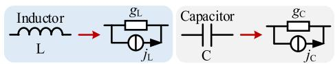  
Fig. 4. Companion circuit of L and C.

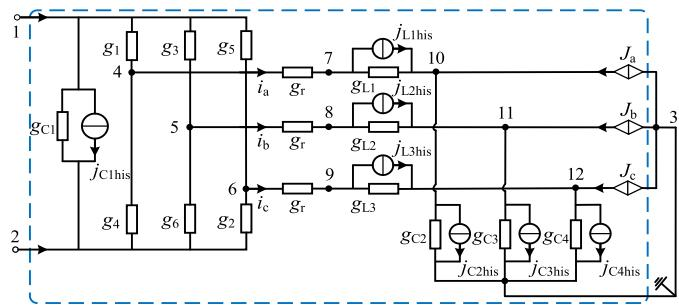  
Fig. 5. Decoupled single 2L-VSC discretized circuit.

the unit circle within 500 ms simulation time-step (extending well beyond the scope of EMT simulation). Consequently, the discrete system is stable.

# III. EQUIVALENT MODEL OF 2L-VSC AND PARALLEL SOLVING

In this section, the decoupled VSC circuit is further equated by synthesizing means. A three-node low-dimension equivalent circuit is derived, and a parallel simulation framework is proposed accordingly.

# A. Three-Node Equivalent Circuit of 2L-VSC By Synthesizing

The differential equations of capacitors and inductors are transformed into Norton equivalent circuits by discretizing them in EMT simulation, as illustrated in Fig. 4, where $g _ { \mathrm { L } }$ and $g _ { \mathrm { C } }$ represent the equivalent conductance of L and C, while $j _ { \mathrm { L } }$ and jC represent the equivalent historical current source of L and C.

The circuit of a single VSC decoupled from the AC side is shown in Fig. 5, which comprises 12 nodes.

In Fig. 5, the conductance of each phase of the filter resistor is $\mathrm { g _ { r } }$ , and each inductor and capacitor are discretized by the trapezoidal integration method. The admittance and historical current sources of each inductor and capacitor after discretization are $g _ { \mathrm { L } i } , g _ { \mathrm { C } j }$ and $j _ { \mathrm { L } i \mathrm { h i s } } , j _ { \mathrm { C } j \mathrm { h i s } } \left( i = 1 , 2 , 3 ; j = 1 , 2 , 3 , 4 \right)$ respectively. The historical current sources for each phase of the grid current are designated as $J _ { \mathrm { a } } , J _ { \mathrm { b } } , J _ { \mathrm { c } } . g _ { \mathrm { s } } \left( s = 1 , 2 , 3 , 4 , 5 , 6 \right)$ represents the conductance of each switch.

As the VSC bridge arms of each phase are connected in parallel, it is necessary to set up the corresponding discretized circuits separately by phase, as illustrated in Fig. 6.

The equivalent circuits of each phase can be synthesized to obtain an equivalent circuit of the VSC containing only 3 nodes externally. Noted that the equivalent process only changes the topological form of the original circuit and does not change the

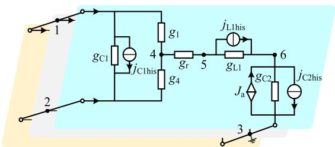  
Fig. 6. Synthesis diagram of each phase circuit.

mathematical relationships between the electrical variables.

$$
\begin{array}{l} \left[ \begin{array}{c c c c c c} g _ {\mathrm {s} 1} & - g _ {\mathrm {C} 1} & 0 & - g _ {1} & 0 & 0 \\ g _ {\mathrm {C} 1} & g _ {\mathrm {s} 2} & 0 & - g _ {4} & 0 & 0 \\ 0 & 0 & - g _ {\mathrm {s} 3} & 0 & 0 & - g _ {\mathrm {C} 2} \\ - g _ {1} & - g _ {4} & 0 & - g _ {\mathrm {s} 4} & - g _ {\mathrm {r}} & 0 \\ 0 & 0 & 0 & - g _ {\mathrm {r}} & g _ {\mathrm {s} 5} & - g _ {\mathrm {L} 1} \\ 0 & 0 & - g _ {\mathrm {C} 2} & 0 & - g _ {\mathrm {L} 1} & g _ {\mathrm {s} 6} \end{array} \right] \left[ \begin{array}{c} U _ {1} \\ U _ {2} \\ U _ {3} \\ U _ {4} \\ U _ {5} \\ U _ {6} \end{array} \right] \\ = \left[ \begin{array}{l} I _ {1} \\ I _ {2} \\ 0 \\ 0 \\ 0 \\ 0 \end{array} \right] + \left[ \begin{array}{c} - j _ {\mathrm {C} 1 \text {h i s}} \\ j _ {\mathrm {C} 1 \text {h i s}} \\ - - - \frac {j _ {\mathrm {C} 2 \text {h i s}} - J _ {\mathrm {a}}}{0} - - - - \\ - j _ {\mathrm {L} 1 \text {h i s}} \\ J _ {\mathrm {a}} + j _ {\mathrm {L} 1 \text {h i s}} - j _ {\mathrm {C} 2 \text {h i s}} \end{array} \right] \tag {12} \\ \end{array}
$$

The nodal voltage equation of the circuit depicted in Fig. 6 is presented in (12). In (12),

$$
\left\{ \begin{array}{l} g _ {\mathrm {s} 1} = g _ {\mathrm {C} 1} + g _ {1}, g _ {\mathrm {s} 2} = g _ {\mathrm {C} 1} + g _ {4}, g _ {\mathrm {s} 3} = g _ {\mathrm {C} 2} \\ g _ {\mathrm {s} 4} = g _ {1} + g _ {1} + g _ {4}, g _ {\mathrm {s} 5} = g _ {1} + g _ {\mathrm {L} 1}, g _ {\mathrm {s} 6} = g _ {\mathrm {L} 1} + g _ {\mathrm {C} 2} \end{array} \right. \tag {13}
$$

The (12) can also be expressed as

$$
\left[ \begin{array}{l l} \boldsymbol {G} _ {1 1 (3 \times 3)} & \boldsymbol {G} _ {1 2 (3 \times 3)} \\ \boldsymbol {G} _ {2 1 (3 \times 3)} & \boldsymbol {G} _ {2 2 (3 \times 3)} \end{array} \right] \left[ \begin{array}{l} \boldsymbol {U} _ {\mathrm {o} (3 \times 1)} \\ \boldsymbol {U} _ {\mathrm {i} (3 \times 1)} \end{array} \right] = \left[ \begin{array}{l} \boldsymbol {J} _ {\mathrm {o} (3 \times 1)} \\ \boldsymbol {J} _ {\mathrm {i} (3 \times 1)} \end{array} \right] + \left[ \begin{array}{c} \boldsymbol {I} _ {\mathrm {o} (3 \times 1)} \\ \boldsymbol {0} \end{array} \right] \tag {14}
$$

In accordance with the Ward equivalent idea, the three nodes 4-6 are then eliminated by the NEM and their contribution to the network is transferred to nodes 1-3 in the form of admittance and historical current sources, as illustrated in (15) and Fig. 7(a). It is important to note that this process is static in nature and that each time-step in the EMT simulation solution is fully and accurately equivalent.

$$
G _ {\mathrm {o}} U _ {\mathrm {o}} = J _ {\mathrm {s}} + I _ {\mathrm {o}} \tag {15}
$$

where

$$
\left\{ \begin{array}{l} G _ {\mathrm {o}} = G _ {1 1} - G _ {1 2} G _ {2 2} ^ {- 1} G _ {2 1} \\ J _ {\mathrm {s}} = J _ {\mathrm {o}} - G _ {1 2} G _ {2 2} ^ {- 1} J _ {\mathrm {i}} \end{array} \right. \tag {16}
$$

The equivalent circuit of the VSC can then be obtained by synthesizing the three-phase unit equivalent circuits, as illustrated in Fig. 7(b). This process reduces the complexity of modeling, thus avoiding the necessity to deal with the circuit shown in Fig. 5.

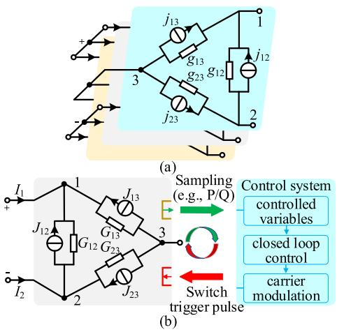  
Fig. 7. Three-node equivalent circuit of 2L-VSC: (a) equivalent circuit of each phase; (b) equivalent circuit of 2L-VSC and control system.

In Fig. 7(a),

$$
\left\{ \begin{array}{l} \boldsymbol {G} _ {\mathrm {o}} = \left[ \begin{array}{c c c} g _ {1 2} + g _ {1 3} & - g _ {1 2} & - g _ {1 3} \\ - g _ {1 2} & g _ {1 2} + g _ {2 3} & - g _ {2 3} \\ - g _ {1 3} & - g _ {2 3} & g _ {2 3} + g _ {1 3} \end{array} \right] \\ \boldsymbol {J} _ {\mathrm {s}} = \left[ j _ {1 2} + j _ {1 3}, j _ {2 3} - j _ {1 2}, - j _ {2 3} - j _ {1 3} \right] ^ {\mathrm {T}} \end{array} \right. \tag {17}
$$

The elements of the matrix (17) are expressed as follows:

$$
\left\{ \begin{array}{l} j _ {1 2} = - j _ {\mathrm {C} 1 \text {h i s}} \\ j _ {1 3} = g _ {1} (c - b) j _ {\mathrm {L} 1 \text {h i s}} - c g _ {1} j _ {\mathrm {C} 2 \text {h i s}} + c g _ {1} J _ {\mathrm {a}} \\ j _ {2 3} = g _ {4} (c - b) j _ {\mathrm {L} 1 \text {h i s}} - c g _ {4} j _ {\mathrm {C} 2 \text {h i s}} + c g _ {4} J _ {\mathrm {a}} \\ g _ {1 2} = g _ {\mathrm {C} 1} + a g _ {1} g _ {4} \\ g _ {1 3} = c g _ {1} g _ {\mathrm {C} 2}, g _ {2 3} = c g _ {4} g _ {C 2} \end{array} \right. \tag {18}
$$

In (18),

$$
\left\{ \begin{array}{l} {\left[ \begin{array}{c c c} a & b & c \\ b & d & e \\ c & e & f \end{array} \right] = \frac {- 1}{\Delta} \left[ \begin{array}{c c c} g _ {\mathrm {s} 5} g _ {\mathrm {s} 6} - g _ {\mathrm {L} 1} ^ {2} & g _ {\mathrm {r}} g _ {\mathrm {s} 6} & g _ {\mathrm {r}} g _ {\mathrm {L} 1} \\ g _ {\mathrm {r}} g _ {\mathrm {s} 6} & g _ {\mathrm {s} 4} g _ {\mathrm {s} 6} & g _ {\mathrm {s} 4} g _ {\mathrm {L} 1} \\ g _ {\mathrm {r}} g _ {\mathrm {L} 1} & g _ {\mathrm {s} 4} g _ {\mathrm {L} 1} & g _ {\mathrm {s} 4} g _ {\mathrm {s} 5} - g _ {\mathrm {r}} ^ {2} \end{array} \right]} \\ \Delta = g _ {\mathrm {s} 4} g _ {\mathrm {L} 1} ^ {2} + g _ {\mathrm {s} 6} g _ {\mathrm {r}} ^ {2} - g _ {\mathrm {s} 4} g _ {\mathrm {s} 5} g _ {\mathrm {s} 6} \end{array} \right. \tag {19}
$$

The admittance and current source values $( e . g . , G _ { 1 2 } , J _ { 1 2 } )$ i n Fig. 7(b) must be synthesized in accordance with the principle set out in (18). In essence, this involves multiplying the phase-unrelated components directly and summing the phasedependent components.

It should be noted that the DC-side capacitor is included in each phase equivalent circuit, necessitating the subtraction of twice the admittance value in a single VSC equivalent circuit. The remaining admittance and historical item values are synthesized by phase, as illustrated in (20).

$$
\left\{ \begin{array}{l} J _ {1 2} = j _ {1 2} \\ J _ {1 3} = g _ {1} (c - b) \left(j _ {\mathrm {L} 1 \text {h i s}} + j _ {\mathrm {L} 2 \text {h i s}} + j _ {\mathrm {L} 3 \text {h i s}}\right) \\ \quad - c g _ {1} \left(j _ {\mathrm {C} 2 \text {h i s}} + j _ {\mathrm {C} 3 \text {h i s}} + j _ {\mathrm {C} 4 \text {h i s}}\right) + c g _ {1} \left(J _ {\mathrm {a}} + J _ {\mathrm {b}} + J _ {\mathrm {c}}\right) \\ J _ {2 3} = g _ {4} (c - b) \left(j _ {\mathrm {L} 1 \text {h i s}} + j _ {\mathrm {L} 2 \text {h i s}} + j _ {\mathrm {L} 3 \text {h i s}}\right) \\ \quad - c g _ {4} \left(j _ {\mathrm {C} 2 \text {h i s}} + j _ {\mathrm {C} 3 \text {h i s}} + j _ {\mathrm {C} 4 \text {h i s}}\right) + c g _ {4} \left(J _ {\mathrm {a}} + J _ {\mathrm {b}} + J _ {\mathrm {c}}\right) \\ G _ {1 2} = 3 \cdot g _ {1 2} - 2 \cdot g _ {\mathrm {C} 1} \\ G _ {1 3} = 3 \cdot g _ {1 3}, G _ {2 3} = 3 \cdot g _ {2 3} \end{array} \right. \tag {20}
$$

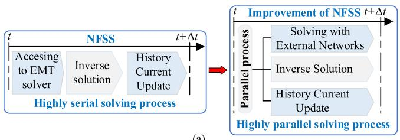

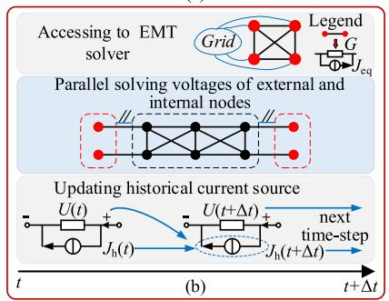  
Fig. 8. The proposed parallel solving method: (a) improvement of the NEM; (b) parallel implementation.

In the control system depicted in Fig. 7(b), the sampling signals (e.g., active/reactive power, P/Q) are received from the output interface of the equivalent circuit. These signals are then sent to the input interface of the equivalent circuit through closed-loop control and carrier modulation, where the switch trigger pulses are generated.

# B. Parallel Solving Method for the VSC

This section presents a parallel solving method for the equivalent circuit derived in Fig. 7(b).

The equivalent circuit derived in Fig. 7(b) is solved in EMT simulation using the NEM in the following manner: the equivalent circuit is derived, the external node voltage is solved, the inverse of the internal node voltage is solved, and the historical current sources are updated according to some of the node voltages. However, this solving process is highly serial, resulting in a significant acceleration space. Consequently, a parallel solving method for VSC is proposed in this section. This allows for the parallel solving of the equivalent circuit, as illustrated in Fig. 8.

The parallel solution and update of internal, external nodes and historical current sources in the network are achieved, overcoming the defect of highly serial when solving by NEM, as illustrated in Fig. 8.

The specific solution steps are as follows:

1) Parallel Update of the History Current Sources: In accordance with the fundamental tenets of EMT simulation, it can be demonstrated that all historical current sources branches in the original network can be expressed in the form of (21).

$$
\boldsymbol {I} _ {\mathrm {h}} (t + \Delta t) = \alpha \boldsymbol {Y} _ {\mathrm {b}} \boldsymbol {U} _ {\mathrm {b}} (t) + \beta \boldsymbol {I} _ {\mathrm {b}} (t) \tag {21}
$$

where $Y _ { \mathrm { b } }$ is the matrix of branch conductance, $U _ { \mathrm { b } }$ is the matrix of branch voltage, $\boldsymbol { I _ { \mathrm { b } } }$ is the matrix of branch current, and α and $\beta$ represent the coefficients of the different integration methods, respectively.

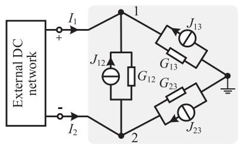  
Fig. 9. Jointing solving with external DC network.

For components such as inductors and capacitors, the update of history current sources can be derived as the unified form in (22).

$$
\begin{array}{l} \boldsymbol {I} _ {\mathrm {h}} (t + \Delta t) = \alpha \boldsymbol {Y} _ {\mathrm {b}} \boldsymbol {U} _ {\mathrm {b}} (t) + \beta (\boldsymbol {Y} _ {\mathrm {b}} \boldsymbol {U} _ {\mathrm {b}} (t) + \boldsymbol {I} _ {\mathrm {h}} (t)) \\ = \beta I _ {\mathrm {h}} (t) + (\alpha + \beta) Y _ {\mathrm {b}} U _ {\mathrm {b}} (t) \tag {22} \\ \end{array}
$$

The (22) indicates that the historical current sources for all capacitors and inductors at the current time-step can be calculated in parallel from the historical current sources and the voltages of the branch at the previous time-step.

2) Jointing Solving With External DC Network: The circuit in Fig. 7(b) is solved in conjunction with the external DC network in EMT solver in order to obtain the voltage of the external node $U _ { \mathrm { o } } \left( U _ { 1 } \right.$ and $U _ { 2 } )$ , as shown in Fig. 9.

The nodal voltage equation can be written as follows:

$$
\left[ \begin{array}{l l} \boldsymbol {G} _ {o} & \dots \\ \dots & \ddots \end{array} \right] \left[ \begin{array}{c} \boldsymbol {U} _ {\mathrm {o}} (t + \Delta t) \\ \dots \end{array} \right] = \left[ \begin{array}{c} \boldsymbol {J} _ {\mathrm {s}} (t + \Delta t) + \boldsymbol {I} _ {\mathrm {o}} (t + \Delta t) \\ \dots \end{array} \right] \tag {23}
$$

The (23) represents the integration of the admittance and history current sources of the equivalent circuit in Fig. 7(b) into the external DC network, thereby completing the joint solution.

3) Parallel Update of Internal Node Voltages: The fundamental principle underlying the parallel update of internal and external nodes is the establishment of mathematical relationships between the adjacent simulation time-step of the internal and external node voltages. Fortunately, the characteristic that capacitor voltage and inductor current do not change abruptly in adjacent time-step provides a solution to this problem, as demonstrated in (24).

$$
\left\{ \begin{array}{l} \boldsymbol {U} _ {4 - 6} (t + \Delta t) \approx \boldsymbol {S} _ {1} \left[ U _ {1} (t) - U _ {2} (t) i _ {\mathrm {a}} (t) i _ {\mathrm {b}} (t) i _ {\mathrm {c}} (t) \right] ^ {\mathrm {T}} \\ \boldsymbol {U} _ {7 - 9} (t + \Delta t) \approx \boldsymbol {S} _ {2} \left[ U _ {1} (t) - U _ {2} (t) i _ {\mathrm {a}} (t) i _ {\mathrm {b}} (t) i _ {\mathrm {c}} (t) \right] ^ {\mathrm {T}} \end{array} \right. \tag {24}
$$

where

It can be assumed that the state of blocking is disregarded. The switch function is defined as follows:

$$
S _ {k} = \left\{ \begin{array}{l l} 1, & \text {u p p e r b r i d g e a r m s w i t c h o n} \\ 0, & \text {u p p e r b r i d g e a r m s w i t c h o f f}, k = a, b, c \end{array} \right. \tag {26}
$$

In (25) shown at the bottom of the next page, $r _ { \mathrm { s w } }$ represents the on-resistance of the switches; the switching functions of phase-A, B and C, designated as $S _ { \mathrm { a } } , S _ { \mathrm { b } }$ and $S _ { \mathrm { c } } ,$ respectively, assume values of either 0 or 1 in accordance with the state of the switches.

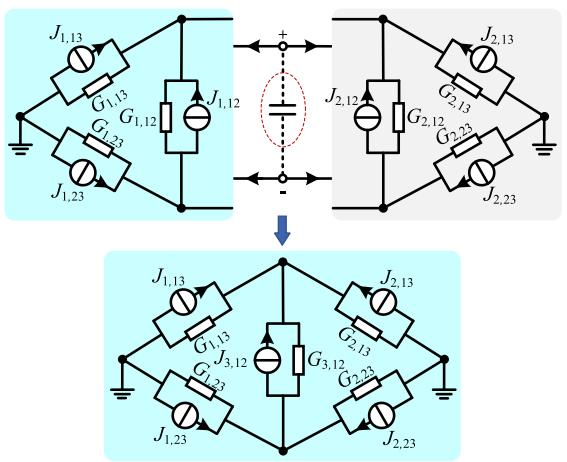  
Fig. 10. Scenario for DC-side parallel of multiple 2L-VSCs.

It can be demonstrated that the voltages at the internal nodes 4 to 9 of the converter at the current time-step can be calculated from the voltages at the external nodes 1 and 2 and the threephase currents at the previous time-step, as illustrated by (24).

# IV. EQUIVALENT MODEL FOR MULTI-VSC CIRCUITS

The method presented in this paper is applicable to multi-VSC systems, including large-scale PVPS (as shown in Fig. 19), microgrid systems formed by multiple parallel converters, or HVDC system. Due to the differing connection methods on the DC side of multi-VSC circuits, it is necessary to study generalized equivalent models that can be adapted to different scenarios. This section proposes equivalent models of multi-VSC circuits.

# A. DC Ports of Multiple 2L-VSCs Connected in Parallel

The most common scenarios for parallel connection on the DC side of multi-VSC circuits typically occur in HVDC system and wind power systems. An equivalent model for the DC-side parallel scenario of multi-VSC is presented in Fig. 10, which depicts the nodes of the DC ports as merged, thereby enabling the corresponding branch admittance and branch current to be accumulated directly.

Finally, a 2-node low-dimension equivalent circuit is obtained, where $J _ { 3 , 1 2 } = J _ { 1 , 1 2 } + J _ { 2 , 1 2 } + J _ { \mathrm { C } } , G _ { 3 , 1 2 } = G _ { 1 , 1 2 } + G _ { 2 , 1 2 }$ $+ \ G _ { \mathrm { C } } . \ J _ { \mathrm { C } }$ is the historical current source; $G _ { \mathrm { C } }$ is the equivalent conductance of the capacitor.

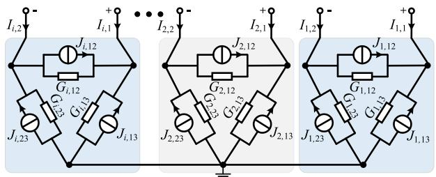

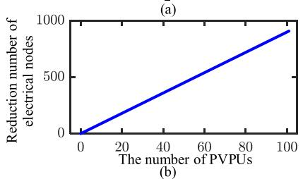  
Fig. 11. DC ports of multiple 2L-VSCs disconnected: (a) equivalent circuits; (b) reduction number of electrical nodes.

# B. DC Ports of Multiple 2L-VSCs Disconnected

It can be observed that the DC ports between the VSCs within each PVPU of a large-scale PVPS are not interconnected, as illustrated in Fig. 19. Consequently, it is necessary to derive an efficient EMT equivalent model in this scenario.

As illustrated in Fig. 11(a), the circuit comprising n VSCs can be ultimately represented by a circuit comprising 2n + 1 nodes when the DC-side ports of multiple VSCs are not interconnected. The equivalent circuit can achieve a reduction in the number of nodes by hundreds for large-scale PVPS, as shown in the Fig. 11(b).

# C. Equivalent Circuit of AC-side

The equivalence of AC-side circuits is primarily applicable to multiple parallel transformers. For the sake of simplicity, let us assume that the transformer ratio is $N _ { \mathrm { T } }$ , and that copper and iron losses, as well as core saturation characteristics, are negligible. In this case, the voltage and current at the transformer port meet (27).

$$
\left[ \begin{array}{c} v _ {\mathrm {T} 1} (t) \\ v _ {\mathrm {T} 2} (t) \end{array} \right] = \left[ \begin{array}{c c} L _ {1} + L _ {\mathrm {m}} + L _ {\mathrm {e}} & \frac {L _ {\mathrm {m}}}{N _ {\mathrm {T}}} \\ \frac {L _ {\mathrm {m}}}{N _ {\mathrm {T}}} & \frac {L _ {\mathrm {m}}}{N _ {\mathrm {T}} ^ {2}} + L _ {2} \end{array} \right] \left[ \begin{array}{c} \frac {\mathrm {d} i _ {\mathrm {T} 1} (t)}{\mathrm {d} t} \\ \frac {\mathrm {d} i _ {\mathrm {T} 2} (t)}{\mathrm {d} t} \end{array} \right] \tag {27}
$$

where $\nu _ { \mathrm { T 1 } } , \nu _ { \mathrm { T 2 } } , i _ { \mathrm { T 1 } } , i _ { \mathrm { T 2 } }$ are the voltage and current of the primary and secondary port respectively; $L _ { 1 }$ and $L _ { 2 }$ are leakage inductance; $L _ { \mathrm { m } }$ is the excitation inductance; $L _ { \mathrm { e } }$ is the auxiliary inductance.

$$
\begin{array}{l} \boldsymbol {S} _ {1} = \frac {1}{3} \left[ \begin{array}{c c c c} 2 S _ {\mathrm {a}} - S _ {\mathrm {b}} - S _ {\mathrm {c}} & 2 (1 - 2 S _ {\mathrm {a}}) r _ {\mathrm {s w}} & 3 (1 - 2 S _ {\mathrm {b}}) r _ {\mathrm {s w}} & (1 - 2 S _ {\mathrm {c}}) r _ {\mathrm {s w}} \\ - S _ {\mathrm {a}} + 2 S _ {\mathrm {b}} - S _ {\mathrm {c}} & (- 1 + 2 S _ {\mathrm {a}}) r _ {\mathrm {s w}} & 0 & (1 - 2 S _ {\mathrm {c}}) r _ {\mathrm {s w}} \\ - S _ {\mathrm {a}} - S _ {\mathrm {b}} + 2 S _ {\mathrm {c}} & (- 1 + 2 S _ {\mathrm {a}}) r _ {\mathrm {s w}} & - 3 (1 - 2 S _ {\mathrm {b}}) r _ {\mathrm {s w}} & - 2 (1 - 2 S _ {\mathrm {c}}) r _ {\mathrm {s w}} \\ 2 S _ {\mathrm {a}} - S _ {\mathrm {b}} - S _ {\mathrm {c}} & \frac {2 (1 - 2 S _ {\mathrm {a}}) r _ {\mathrm {s w}} g _ {\mathrm {r}} - 3}{g _ {\mathrm {r}}} & 3 (1 - 2 S _ {\mathrm {b}}) r _ {\mathrm {s w}} & (1 - 2 S _ {\mathrm {c}}) r _ {\mathrm {s w}} \\ - S _ {\mathrm {a}} + 2 S _ {\mathrm {b}} - S _ {\mathrm {c}} & (- 1 + 2 S _ {\mathrm {a}}) r _ {\mathrm {s w}} & - \frac {3}{g _ {\mathrm {r}}} & (1 - 2 S _ {\mathrm {c}}) r _ {\mathrm {s w}} \\ - S _ {\mathrm {a}} - S _ {\mathrm {b}} + 2 S _ {\mathrm {c}} & (- 1 + 2 S _ {\mathrm {a}}) r _ {\mathrm {s w}} & - 3 (1 - 2 S _ {\mathrm {b}}) r _ {\mathrm {s w}} & \frac {- 2 (1 - 2 S _ {\mathrm {c}}) r _ {\mathrm {s w}} g _ {\mathrm {r}} - 3}{g _ {\mathrm {r}}} \end{array} \right] \end{array} \tag {25}
$$

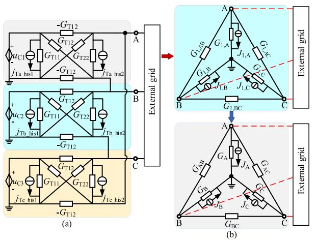  
Fig. 12. Equivalent process of AC-side grid-connected circuit: (a) AC-side discretization circuit; (b) equivalent circuit of AC-side.

The (27) is transformed into a discrete form through the application of the trapezoidal integration method, resulting in the expression (28).

$$
\left[ \begin{array}{l} i _ {\mathrm {T} 1} (t) \\ i _ {\mathrm {T} 2} (t) \end{array} \right] = \boldsymbol {G} _ {\mathrm {T}} \left[ \begin{array}{l} v _ {\mathrm {T} 1} (t) + v _ {\mathrm {T} 1} (t - \Delta t) \\ v _ {\mathrm {T} 2} (t) + v _ {\mathrm {T} 2} (t - \Delta t) \end{array} \right] + \left[ \begin{array}{l} i _ {\mathrm {T} 1} (t - \Delta t) \\ i _ {\mathrm {T} 2} (t - \Delta t) \end{array} \right] \tag {28}
$$

Furthermore,

$$
\left\{ \begin{array}{l} \boldsymbol {G} _ {\mathrm {T}} = \frac {\Delta t}{2 \Gamma} \left[ \begin{array}{c c} \frac {L _ {\mathrm {m}}}{N _ {\mathrm {T}} ^ {2}} + L _ {2} & - \frac {L _ {\mathrm {m}}}{N _ {\mathrm {T}}} \\ - \frac {L _ {\mathrm {m}}}{N _ {\mathrm {T}}} & L _ {1} + L _ {\mathrm {m}} + L _ {\mathrm {e}} \end{array} \right] \triangleq \left[ \begin{array}{c c} G _ {\mathrm {T 1 1}} & G _ {\mathrm {T 1 2}} \\ G _ {\mathrm {T 2 1}} & G _ {\mathrm {T 2 2}} \end{array} \right] \\ \Gamma = \left(\frac {L _ {\mathrm {m}}}{N _ {\mathrm {T}} ^ {2}} + L _ {2}\right) \left(L _ {1} + L _ {\mathrm {m}} + L _ {\mathrm {e}}\right) - \frac {L _ {\mathrm {m}}}{N _ {\mathrm {T}} ^ {2}} \\ \left[ \begin{array}{l} j _ {\mathrm {T} - \text {his 1}} (t) \\ j _ {\mathrm {T} - \text {his 2}} (t) \end{array} \right] = \boldsymbol {G} _ {T} \left[ \begin{array}{l} v _ {\mathrm {T 1}} (t - \Delta t) \\ v _ {\mathrm {T 2}} (t - \Delta t) \end{array} \right] + \left[ \begin{array}{l} i _ {\mathrm {T 1}} (t - \Delta t) \\ i _ {\mathrm {T 2}} (t - \Delta t) \end{array} \right] \end{array} \right. \tag {29}
$$

where $G _ { \mathrm { T } }$ is the port admittance matrix; $G _ { \mathrm { T 1 1 } } , G _ { \mathrm { T 1 2 } }$ and $G _ { \mathrm { T 2 2 } }$ are mutual admittance between terminals; Γ is the determinant of $G _ { \mathrm { T } } ; j _ { \mathrm { T } , \mathrm { h i s 1 } }$ and $j _ { \mathrm { T } , \mathrm { h i s 2 } }$ represent history current source.

The AC-side grid-connected discretization circuit is depicted in Fig. 12(a), which can be derived from (29).

The nodal admittance matrix and historical current source corresponding to the equivalent circuit in Fig. 12(b) are designated as $G _ { \mathrm { e q } }$ and $J _ { \mathrm { e q } }$ , respectively. The specific parameters of this circuit are shown in (30) shown at the bottom of this page.

Furthermore, the historical current source and nodal voltage of the equivalent circuit can be determined according to (31).

$$
\left\{ \begin{array}{l} \boldsymbol {j} _ {\mathrm {T} _ {-} \text {h i s}} (t + \Delta t) = 2 \boldsymbol {G} _ {\mathrm {T}} \boldsymbol {v} _ {\mathrm {T}} (t) + \boldsymbol {j} _ {\mathrm {T} _ {-} \text {h i s}} (t) \\ \left[ \boldsymbol {U} _ {\mathrm {A}, \mathrm {B}, \mathrm {C}} (t + \Delta t) \quad \boldsymbol {U} _ {\text {g r i d}} (t + \Delta t) \right] ^ {\mathrm {T}} = \boldsymbol {Y} _ {\text {a c} _ {-} \text {s i d e}} ^ {- 1} \boldsymbol {I} _ {\text {i n j}} (t + \Delta t) \end{array} \right. \tag {31}
$$

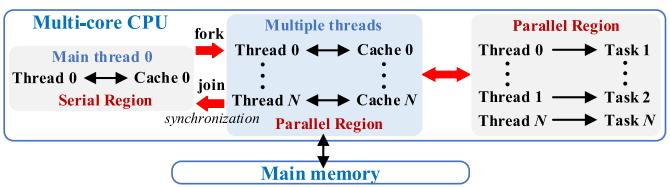  
Fig. 13. OpenMP architecture.

where $I _ { \mathrm { i n j } }$ is the matrix of nodal injection current, $Y _ { \mathrm { a c \_ s i d e } }$ is the nodal admittance matrix of network at AC-side, $U _ { \mathrm { g r i d } }$ is the matrix of network at AC-side.

# V. PARALLEL FRAMEWORK FOR MULTI-VSC CIRCUIT

# A. Principle of OpenMP

OpenMP is a multi-threaded parallel programming interface for shared memory, supporting both C++ and Fortran languages. It enables multiple threads to execute specific code sections in parallel by adding instructions at appropriate locations in the serial program. The architecture of it is shown in Fig. 13.

The architecture uses the “fork-join” mode to achieve serial/parallel switch. In serial mode, the main thread executes the serial code, while in parallel mode, the main thread and the derived child threads work together to execute the code. When all the threads have finished executing, the child threads are hung and the main thread continues to execute the serial code by entering serial mode again.

# B. Framework of Parallel Solving Based on OpenMP

In this paper, the proposed parallel algorithm is implemented by adopting Fortran language in Visual Studio (VS) 2022 program environment. The Intel oneAPI needs to be installed to support Fortran language in VS, and the access of any type of external circuit is realized by using PSCAD/EMTDC to complete the joint solution. The key simulation process of the equivalent model and parallel algorithm is shown in Fig. 14.

The above flowchart can be described in detail as follows:

1) After the simulation begins, the begin code segment in segment manager of PSCAD/EMTDC is responsible for completing the calculation of the equivalent admittance parameters of each unit in the first simulation time-step. The calculation results are stored in the register together with the calculation constants and symbol functions required for simulation;   
2) the following process is the generation of the equivalent circuit. After reading the control signal, the pre-stored

$$
\left\{ \begin{array}{l} \boldsymbol {G} _ {\mathrm {e q}, 1} = \left[ \begin{array}{c c c c} G _ {1, \mathrm {A B}} + G _ {1, \mathrm {A C}} + G _ {1, \mathrm {A}} & - G _ {1, \mathrm {A B}} & - G _ {1, \mathrm {A C}} & - G _ {1, \mathrm {A}} \\ - G _ {1, \mathrm {A B}} & G _ {1, \mathrm {A B}} + G _ {1, \mathrm {B C}} + G _ {1, \mathrm {B}} & - G _ {1, \mathrm {B C}} & - G _ {1, \mathrm {B}} \\ - G _ {1, \mathrm {A C}} & - G _ {1, \mathrm {B C}} & G _ {1, \mathrm {B C}} + G _ {1, \mathrm {A C}} + G _ {1, \mathrm {C}} & - G _ {1, \mathrm {C}} \\ - G _ {1, \mathrm {A}} & - G _ {1, \mathrm {B}} & - G _ {1, \mathrm {C}} & G _ {1, \mathrm {A}} + G _ {1, \mathrm {B}} + G _ {1, \mathrm {C}} \end{array} \right] \\ \boldsymbol {J} _ {\mathrm {e q}, 1} = \left[ \begin{array}{l l l} - J _ {1, \mathrm {A}} & - J _ {1, \mathrm {B}} & - J _ {1, \mathrm {C}} \\ & & \sum_ {i = \mathrm {A}, \mathrm {B}, \mathrm {C}} J _ {1, i} \end{array} \right] ^ {\mathrm {T}}, \quad \boldsymbol {G} _ {\mathrm {e q}} = \sum_ {k = 1} ^ {N} \boldsymbol {G} _ {\mathrm {e q}, k}, \boldsymbol {J} _ {\mathrm {e q}} = \sum_ {k = 1} ^ {N} \boldsymbol {J} _ {\mathrm {e q}, k} \end{array} \right. \tag {30}
$$

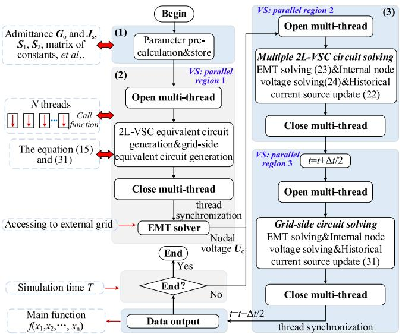  
Fig. 14. OpenMP-based parallel simulation framework.

constant and the historical current source of the energy storage element, the parallel calculation of the equivalent circuit parameters can be realized by opening OpenMP and using SECTIONS statement division;

3) substituting the equivalent model into the external circuit for solution. The internal electrical information and the historical current source can be solved and updated in parallel. At this time, the OpenMP instruction is used to open the multi-thread. After the calculation of each parallel step is completed, the redundant thread is closed. The next time-step solution starts after data signal output and thread synchronization. Besides, the AC-side circuit and VSC interact data in half time-step.

It should be noted that in a SECTIONS structure, each program defined by SECTION will only be executed once by one thread in the thread group.

# C. Parallel Algorithm Analysis of Influencing Factors

The speed-up effect of a parallel algorithm is measured by the parallel speedup factor (PSF).

$$
\mathrm {P S F} = \frac {T _ {\mathrm {s}}}{T _ {\mathrm {p}}} \tag {32}
$$

where $T _ { \mathrm { s } }$ is the total time spent on single-core serial execution; $T _ { \mathrm { p } }$ is the total time spent on multi-thread parallel execution.

Supposing the calculated time for each module is $T _ { \mathrm { P M } }$ .

$$
T _ {\mathrm {s}} = T _ {0} + N _ {\mathrm {P M}} T _ {\mathrm {P M}} \tag {33}
$$

where $T _ { 0 }$ is the time used for processes that must be executed serially, such as drawing control.

When the number of threads is increased to $N _ { \mathrm { t h r e a d } }$ , the total program execution time in parallel is:

$$
T _ {\mathrm {p}} = T _ {0} + N _ {\mathrm {P M}} \frac {T _ {\mathrm {P M}}}{N _ {\text {t h r e a d}}} + T _ {\text {c o s t} - N \text {t h r e a d}} \tag {34}
$$

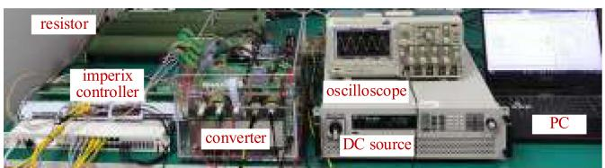

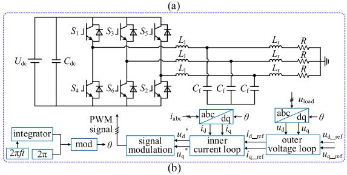  
Fig. 15. Setup of the physical experimental platform: (a) experimental platform; (b) topology of the prototype and control strategy.

TABLE II PARAMETERS OF THE PLATFORM   

<table><tr><td>Symbol</td><td>Parameter</td><td>Value</td></tr><tr><td>Udc</td><td>Input DC voltage (V)</td><td>30,100</td></tr><tr><td>Cdc</td><td>DC-side capacitance (μF)</td><td>1360</td></tr><tr><td>Lf/Lr</td><td>Inductance (mH)</td><td>5,0.1</td></tr><tr><td>Cf</td><td>AC-side capacitance (μF)</td><td>10</td></tr><tr><td>R</td><td>Resistance (Ω)</td><td>20</td></tr><tr><td>F</td><td>Switching frequency (kHz)</td><td>5</td></tr><tr><td rowspan="2">Kp/Ki</td><td>Outer loop</td><td>1,1</td></tr><tr><td>Inner loop</td><td>1,10</td></tr></table>

$T _ { \mathrm { P M } } / N _ { \mathrm { t h r e a d } }$ represents the time consumed by a single unit with multi-thread, where the time of parallel computing is determined by the thread that takes the longest time. $T _ { \mathrm { c o s t } - N \mathrm { t h r e a d } }$ represents the parallel overhead that is positively related to the number of threads, including the time taken to create and close threads, to communicate with each other and to wait, which are determined by both computer performance and program parallelism design statements.

# VI. CASE STUDIES

The simulation accuracy and efficiency of the proposed method are verified in this section. The detailed model (DM) considered as reference is set up in PSCAD/EMTDC, the serial equivalent model (SEM) means that the equivalent model is solved in serial solution mode under single thread, the parallel equivalent model (PEM) refers to the equivalent model is solved in parallel solution mode under multi-thread.

# A. Comparisons With Experiments of Down-Scaled Prototype

A low-power physical experimental platform is constructed to verify the effectiveness of the proposed model. The experimental platform and the topology of the prototype are shown in Fig. 15. Furthermore, the parameters of the prototype are listed in Table II, and the V/F control strategy is employed to achieve the constant voltage/frequency control of the load.

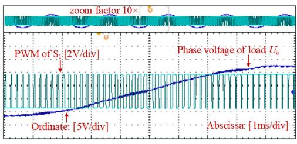  
Fig. 16. Experimental results.

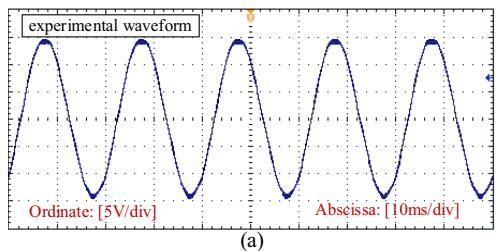

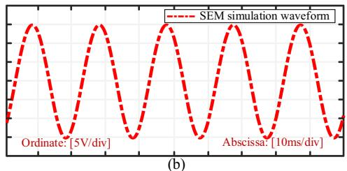  
Fig. 17. Test results of $U _ { \mathrm { a } } \colon ( \mathrm { a } )$ experimental result; (b) simulation result.

The experimental results of PWM signal of $S _ { 1 }$ and phase voltage $U _ { \mathrm { a } }$ of the load are shown in Fig. 16. With the increase of the duty cycle of the PWM signal, the load voltage $U _ { \mathrm { a } }$ begins to rise from the trough to the peak.

In Fig. 17(a) and (b), the load voltage $U _ { \mathrm { a } }$ is controlled at 15 V. It can be observed that the experimental and simulation results exhibit a similar waveform, which indicates the reliability of the proposed model.

In Fig. 18(b), the voltage of phase-A and phase-B on the load side is consistent with a phase difference of 120°, resulting in a balanced load voltage amplitude of 39.01 V and a frequency of 50 Hz. The Fig. 18(c) displays the off-line simulation results of the SEM, with a load voltage amplitude of 40.02 V. The experimental results demonstrate a peak-to-peak error of 2.52% when compared to the simulation results.

The results indicate that the proposed model exhibits high precision and its operating characteristics align with those of the actual converter.

# B. Hundred-Megawatt PVPS Validation

This subsection presents a verification of the simulation accuracy and efficiency of the proposed model in a grid-connected hundred-megawatt PVPS, as illustrated in Fig. 19.

In Fig. 19, j power generating clusters are connected in parallel in a radial pattern, which are connected to the grid via transformer and long transmission line. Each cluster consists of i power units, which are also connected in parallel in radial

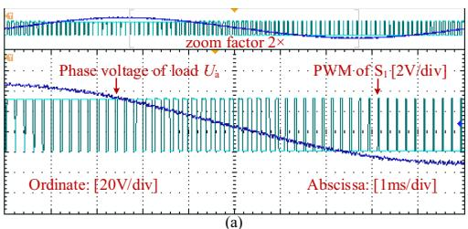

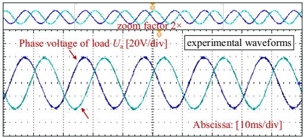

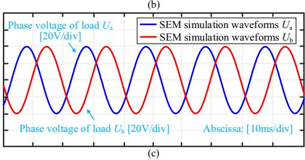  
Fig. 18. Test results: (a) experimental results of $U _ { \mathrm { a } }$ and PWM; (b) experimental results of $U _ { \mathrm { a } }$ and $U _ { \mathrm { b } } ; ( \mathbf { c } )$ simulation results of $U _ { \mathrm { a } }$ and $U _ { \mathrm { b } }$ .

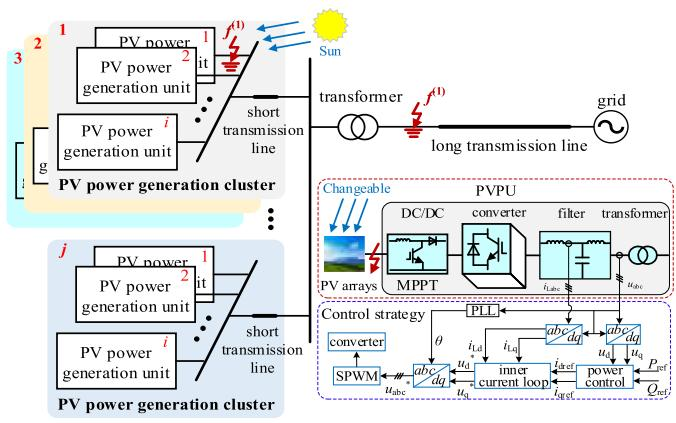  
Fig. 19. Topology of a hundred-megawatt PVPS.

pattern, and they deliver power via short transmission lines. The PVPU consists of a cascade of several devices, such as PV arrays, boost circuit, converter and filter, where the PV arrays and the boost circuit are connected as external circuits.

The test system consists of 100 PVPUs, among which there are 10 power generation clusters, each cluster consists of 10 PVPUs. Every PVPU delivers 1 MW active power, all of which adopts P/Q control strategy. The simulation time-step is 10 µs and the simulation time is 3 s, other basic parameters of the test system are listed in Table III.

1) System-Level Validation of Simulation Accuracy: The following operating conditions have been set for the test system

TABLE III BASIC PARAMETERS OF THE TEST SYSTEM   

<table><tr><td>Device</td><td>Quantity</td><td>Value</td></tr><tr><td rowspan="4">PV array</td><td>Number of modules connected in series/parallel per array</td><td>120/35</td></tr><tr><td>Number of cells connected in series/parallel per module</td><td>60/4</td></tr><tr><td>Reference irradiation(W/m2)</td><td>1000</td></tr><tr><td>Reference cell temperature(℃)</td><td>25</td></tr><tr><td rowspan="3">2L-VSC</td><td>Operation frequency(kHz)</td><td>2</td></tr><tr><td>DC-side capacitor(μF)</td><td>3500</td></tr><tr><td>AC-side inductor(H)</td><td>0.001</td></tr><tr><td rowspan="2">High/low voltage transformer</td><td>Short-circuit reactance/p.u.</td><td>0.1/0.15</td></tr><tr><td>Short-circuit resistance/p.u.</td><td>0.001/0.001</td></tr><tr><td rowspan="2">Long/short transmission line</td><td>Line inductance(H)</td><td>0.06/2e-3</td></tr><tr><td>Line resistance(Ω)</td><td>0.7/0.4</td></tr><tr><td rowspan="3">Control system</td><td>PI parameters of VSC outer-loop</td><td>20/2</td></tr><tr><td>PI parameters of VSC inter-loop</td><td>15/1.59</td></tr><tr><td>PI parameters of boost</td><td>1/0.005</td></tr></table>

depicted in Fig. 19 in order to verify the system-level simulation accuracy.

1) At 0.4 s, A-phase occurs ground fault which lasts for 0.1 s, the ground resistance is 1 Ω;   
2) a double-pole short circuit fault which lasts for 0.1 s occurs on the DC port of each PV arrays of cluster 1 at 1.0 s;   
3) at 1.5 s, cluster 1–3 occurred off-grid fault, and thus the output active power of PVPS is reduced by 30 MW;   
4) at the AC side outlet of PVPU1, A-phase occurs ground fault at 2.5 s and is cleared after 0.05 s.

The Fig. 20(a) to (f) illustrate the simulation results for different electrical variables of the large-scale PVPS under a range of operational conditions.

The above simulation results demonstrate that the three models exhibit a high degree of similarity in their waveforms during the start-up, steady-state, and fault periods of operation under different conditions. This indicates that the equivalent model is capable of achieving a high degree of accuracy in the EMT simulation of large-scale PVPS.

Furthermore, in order to further verify the simulation accuracy of the proposed model, the maximum relative errors (MREs) shown in Fig. 21 of different electrical variables at different simulation time-steps under start-up, fault periods, and steadystate are compared.

In Fig. 21, P represents the output active power of PVPS, Ea1 denotes the phase-A voltage at the AC side of cluster 1, and Ia2 signifies the phase-A current of the secondary side of the transformer. From the Fig. 21, we can see that the simulation accuracy of the proposed model is still acceptable at large time-step, and the relative errors of different electrical variables increase as the time step increases, and the errors of stage 1 are relatively larger than those of stages 2 and 3.   
2) Unit-Level Validation of Simulation Accuracy: The accuracy of the PVPU simulation also needs to be validated. To do this, we set the illuminance variation curve as shown in Fig. 22 below.

The illumination intensity undergoes a change from 1000 W/m2 to 1200 W/m2 at 0.5 s, followed by a transition to 800 W/m2 at 1 s. The simulation results under the variation

curve are shown in Fig. 23. It can be observed that the simulation accuracy of the DC voltage and output active power of the PVPU is high, with the illumination intensity varying.

3) Validation of Blocking State of Switch: The converter is set to be blocked before startup. Once this has been achieved, the blocking is released after a period of 0.2 s. The test results are presented in Fig. 24.   
In the blocking state, the converter does not output any active power. The AC side voltage is dependent on the diode conduction. Following unblocking, the switch operates in a normal manner, with the output active power of cluster 1 increasing and the switching voltage becoming a square wave. The simulation results demonstrate that the proposed model has a high degree of accuracy in both the blocking state and following the unblocking start.   
4) Validation of Simulation Efficiency: In order to verify the simulation efficiency of the proposed model, a number of the PVPS models with different numbers of PVPUs are established. The simulation time is set at 1 s, with the time-step of 10 µs. The PC configuration is 12th Gen Intel(R) Core (TM) i5-12600 K, 3.70 GHz, 16 GB RAM.   
a) The simulation efficiency of SEM: The simulation time of DM, the decoupling model of VSC proposed in [32] and SEM, which are shown in Fig. 25, are compared to verify the simulation efficiency of SEM.

The following conclusions can be drawn from Fig. 25:

1) The simulation time of DM increases exponentially with the increase of the number of PVPUs due to the nodal admittance matrix of the system is large and time-varying, which seriously affects the simulation efficiency of the DM;   
2) the higher the number of units, the higher the speedup ratio, and the proposed model can achieve 80 times acceleration for a 100 MW PVPS in serial mode;   
3) the SR1 is larger than the SR2, which means that the simulation efficiency of the model proposed in this paper is higher than that of the model in [32].   
b) Efficiency comparison of the decoupling and lowdimension: The reason why SEM can accelerate simulation is decoupling and low-dimension. To verify the simulation efficiency ratio of decoupling in SEM, the SR1 and SR3 which means the SEM without decoupling is compared in Fig. 26.

The following conclusions can be drawn from Fig. 26:

1) The SR1 is larger than SR3 no matter the number of PV-PUs, which shows the acceleration effect of decoupling;   
2) the higher the number of units, the lower the SR3/SR1, which means the acceleration effect of decoupling is becoming more prominent especially when the number of PVPUs is more than 27.   
c) The simulation efficiency of PEM: The speedup ratio in parallel mode using OpenMP is illustrated in Fig. 27. The Fig. 27(a) and (b) demonstrate the speedup ratio under varying numbers of PVPUs and threads, respectively. Compared to the simulation efficiency of SEM (1 thread), the PEM can achieve a 2-3 times secondary acceleration for a 100 MW PVPS in parallel mode.

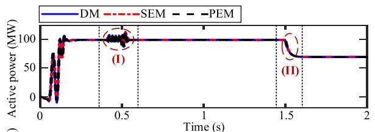

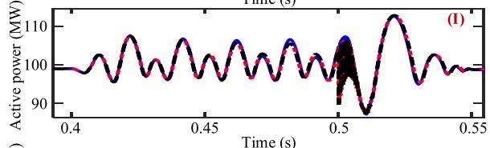

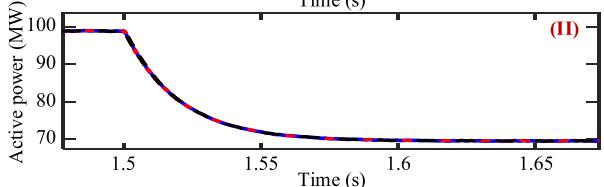  
(a)

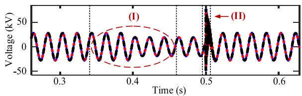

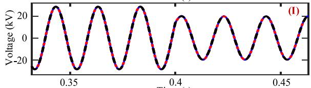

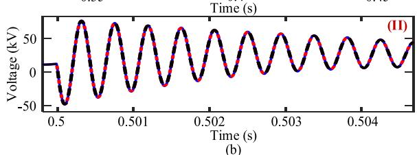

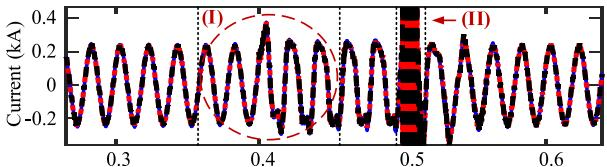

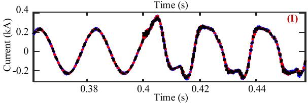

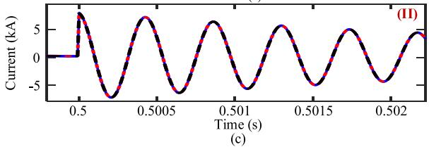

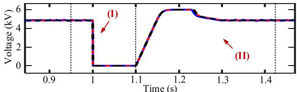

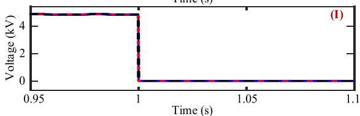

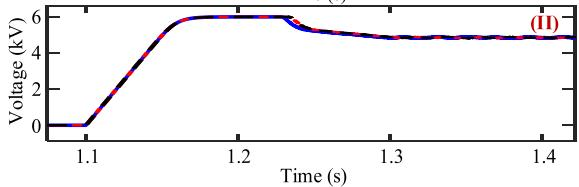

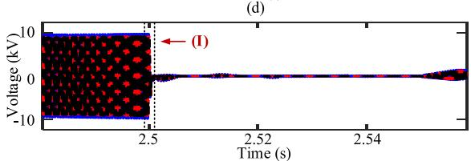

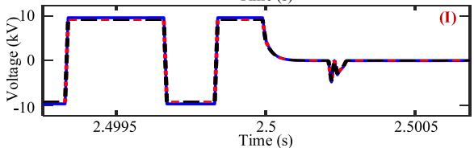  
(e)

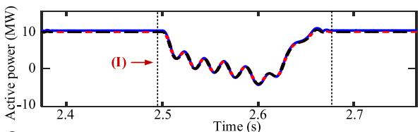

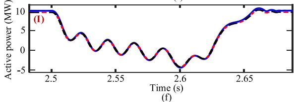  
Fig. 20. Simulation results: (a) output active power of PV station; (b) phase-A voltage of AC-side of cluster 1; (c) phase-A current of AC-side of cluster 1; (d) voltage of PV array port; (e) outlet phase-A voltage on the AC side of converter; and (f) output active power of cluster 1.

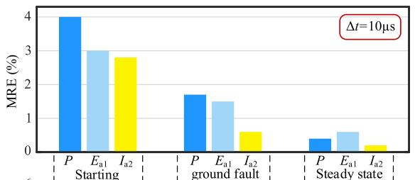

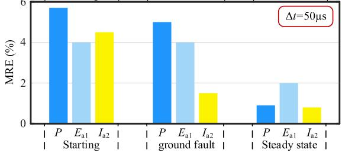  
Fig. 21. The MRE under different stages at different simulation time-step.

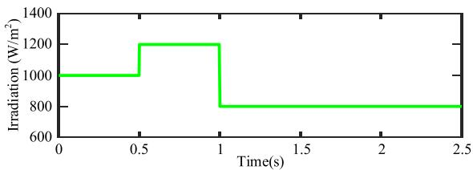  
Fig. 22. Variation of illumination intensity.

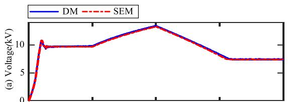

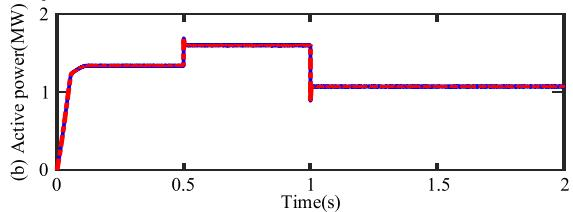  
Fig. 23. Simulation results of PVPU: (a) DC voltage; (b) output power.

According to the analysis in V. C, we then analyze the trend of the PSF in terms of the number of units $N _ { \mathrm { P M } }$ , the number of threads $N _ { \mathrm { t h r e a d } } { : }$

1) The influence of $N _ { \mathrm { P M } } { \mathrm { : } }$ according to Fig. 27(a), we can know that as the number of PVPUs increases, the PSF is approximately proportional to the number of units at different numbers of threads, the reason is when $N _ { \mathrm { P M } }$ increases, the numerator term $N _ { \mathrm { P M } } { \cdot } T _ { \mathrm { P M } }$ grows faster than the denominator term $N _ { \mathrm { P M } } { \cdot } T _ { \mathrm { P M } } / N _ { \mathrm { T } }$ , and the PSF must increase with the increase of $N _ { \mathrm { P M } } .$ , the test results are consistent with the theoretical analysis. Besides, when

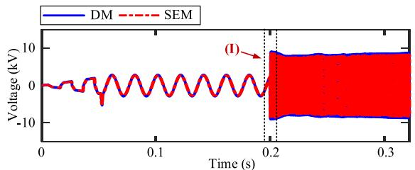

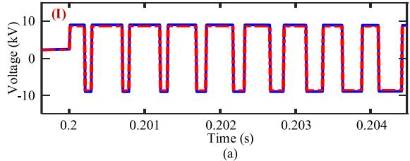

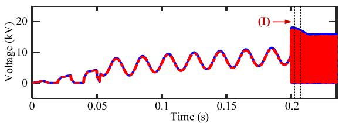

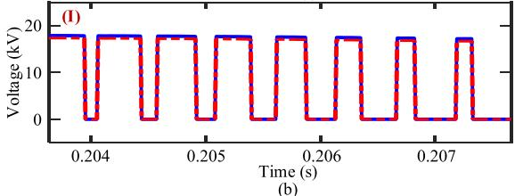

  
Fig. 24. Simulation results: (a) outlet phase-A voltage on the AC side of converter; (b) voltage of a switch; and (c) output active power of cluster 1.

  
Fig. 25. Comparison of simulation efficiency.

  
Fig. 26. Comparison of simulation efficiency in serial mode.

  
(a) Speedup ratio under different number of PV units

  
(b) Speedup ratio under different number of threads   
Fig. 27. Speedup ratio in parallel mode using OpenMP: (a) different number of PVPUs; (b) different number of threads.

the number of units is low, there is also a case where serial is preferred over parallel, namely $T _ { \mathrm { p } } > T _ { \mathrm { s } }$ . The reason for our analysis is that the parallel elapsed time $N _ { \mathrm { P M } } { \cdot } T _ { \mathrm { P M } } / N _ { \mathrm { T } }$ corresponding to (34) and the serial elapsed time ${ \cal N } _ { \mathrm { P M } } { \cdot } { \cal T } _ { \mathrm { P M } }$ are both relatively small, leading to a more pronounced effect of the parallel additional overhead $T _ { \mathrm { c o s t - } N \mathrm { t h r e a d } } ;$

2) the influence of $N _ { \mathrm { t h r e a d } } { \mathrm { : } }$ according to Fig. 27(b), it can be seen that when the number of threads is small, as the number of threads increases, the parallel simulation time $N _ { \mathrm { P M } } { \cdot } T _ { \mathrm { P M } } / N _ { \mathrm { T } }$ will be significantly smaller than the serial

  
Fig. 28. Topology of the modified IEEE 118-node system.

  
Fig. 29. Simulations results of PVPS at node-34: (a) active power; (b) A-phase voltage.

simulation time ${ \cal N } _ { \mathrm { P M } } { \cdot } { \cal T } _ { \mathrm { P M } }$ , resulting in a rapid increase in PSF; as the number of threads continues to increase, the additional parallel overhead $T _ { \mathrm { { c o s t - } } N \mathrm { { t h r e a d } } }$ increases linearly, reducing the parallel acceleration effect, and PSF grows slowly; the PSF achieves its maximum acceleration effect with 6 threads, the reason for our analysis is that the signals of 6 switch groups are determined by the 6 threads respectively to determine the admittance value of each time-step, as the number of threads continues to increase, the time consumed by the additional overhead of parallelism becomes more pronounced and the PSF tends to decrease.

Generally speaking, the number of threads should not exceed the number of CPU physical cores. There are three main reasons: it takes time to open and release threads; it is inefficient due to thread switching when single core processes multi-thread; too many threads will cause memory and stack burden. Noted that the proposed model can achieve an excellent EMT simulation acceleration effect under a certain number of threads.

# C. Performance of the SEM in Large-Scale System

The performance of the SEM is further verified by modifying the IEEE 118-node system. The generators are replaced with large-scale PVPSs, as shown in Fig. 28.

The output power of each PVPSs is equal to that of the original generators, so it is reasonable to assume that the modification

  
Fig. 30. Simulations results: (a) A-phase voltage at node-19; (b) active power at node-19; (c) A-phase voltage at node-36; and (d) active power at node-40.

will not affect the power flow of the original system. The total output power of PVPSs is 260 + j122.74 MVA.

A-phase of node-34 occurs ground fault at 0.6 s, which persists for 0.02 s with a ground resistance of 1 Ω. The simulation results of PVPS at node-34 are displayed in Fig. 29. The simulation results of PVPS and generator near the node-34 are presented in Fig. 30.

The Figs. 29 and 30 illustrate a reduction in active power at node-34 and its adjacent nodes, accompanied by a slight decline in voltage amplitude following the occurrence of a short-circuit fault.

# VII. CONCLUSION

This paper proposes the use of EMT low-dimension equivalent models and multi-thread based parallel simulation methods for multi-VSC circuits. The following conclusions can be drawn:

1) The semi-implicit hybrid integration method permits the parallel simulation of subsystems following the decoupling of original systems.   
2) The derived equivalent low-dimensional circuit of a multi-VSC system can realize significant reductions in dimensionality for a large-scale PVPS.   
3) An OpenMP-based parallel simulation framework is capable of implementing parallel solutions and updates to internal and external node voltages, as well as historical current sources, within a multi-VSC circuit.   
4) In serial solving mode, the acceleration is achieved through decoupling and low-dimension. The acceleration effect of decoupling is greater than that of low-dimension when the number of PVPUs is greater than 27.

5) The proposed model is capable of achieving more than 80 times acceleration for a 100 MW PVPS in serial mode (one thread), and can obtain a 2-3 times secondary acceleration in parallel mode (multi-thread) with almost uncompromising accuracy.

# ACKNOWLEDGMENT

The authors would like to thank Prof. Shujun Yao from North China Electric Power University, China for his helpful discussion on Section II-A. The authors are grateful to editor, EIC and anonymous reviewers for their valuable comments, which have greatly contributed to the quality of this paper.

# REFERENCES

[1] J. Chen et al., “Distributed control of multi-functional grid-tied inverters for power quality improvement,” IEEE Trans. Circuits Syst. I: Reg. Papers, vol. 68, no. 2, pp. 918–928, Feb. 2021.   
[2] G. Lammert, D. Premm, L. D. P. Ospina, J. C. Boemer, M. Braun, and T. Van Cutsem, “Control of photovoltaic systems for enhanced short-term voltage stability and recovery,” IEEE Trans. Energy Convers., vol. 34, no. 1, pp. 243–254, Mar. 2019.   
[3] B. Kroposki et al., “Achieving a 100% renewable grid: Operating electric power systems with extremely high levels of variable renewable energy,” IEEE Power Energy Mag., vol. 15, no. 2, pp. 61–73, Mar./Apr. 2017.   
[4] H. W. Dommel, EMTP Theory Book, Microtran Power System Analysis Corporation, Vancouver, British Columbia, 1996.   
[5] F. Dong et al., “Review of high efficiency digital electromagnetic transient simulation technology in power system,” Proc. CSEE, vol. 38, no. 8, pp. 2213–2231, Mar. 2018.   
[6] Z. Yu, Z. Zhao, B. Shi, Y. Zhu, and J. Ju, “An automated semi–symbolic state equation generation method for simulation of power electronic systems,” IEEE Trans. Power Electron., vol. 36, no. 4, pp. 3946–3956, Apr. 2021.   
[7] J Kennedy and R Eberhart, “Synchronization mechanism and interfaces design of multi-FPGA-based real-time simulator for microgrids,” IET Gener., Transmiss. Distrib., vol. 11, no. 12, pp. 3088–3096, May 2017.   
[8] K. Wang, J. Xu, G. Li, N. Tai, A. Tong, and J. Hou, “A generalized associated discrete circuit model of power converters in real-time simulation,” IEEE Trans. Power Electron., vol. 34, no. 3, pp. 2220–2233, Mar. 2019.   
[9] Q. Mu, J. Liang, X. Zhou, Y. Li, and X. Zhang, “Improved ADC model of voltage-source converters in DC grids,” IEEE Trans. Power Electron., vol. 29, no. 11, pp. 5738–5748, Nov. 2014.   
[10] The universal converter model for enhanced real-time power electronics simulation, [Online]. Available: https://www.rtds.com/blogposts/ucm   
[11] M. Feng, C. Gao, J. Xu, C. Zhao, and G. Li, “A novel decoupled EMT approach and parallel simulation framework for modularized solid-state transformers,” IEEE Trans. Power Del., vol. 38, no. 5, pp. 3285–3295, Oct. 2023.   
[12] S. Gao, Y. Chen, Y. Song, Z. Yu, and Y. Wang, “An efficient halfbridge MMC model for EMTP-type simulation based on hybrid numerical integration,” IEEE Trans. Power Syst., vol. 39, no. 1, pp. 1162–1177, Jan. 2024,, doi: 10.1109/TPWRS.2023.3262584.   
[13] J. Xu, S. Fan, C. Zhao, and A. M. Gole, “High-speed EMT modeling of MMCs with arbitrary multiport submodule structures using generalized Norton equivalents,” IEEE Trans. Power Del., vol. 33, no. 3, pp. 1299–1307, Jun. 2018.   
[14] S. Chiniforoosh et al., “Definitions and applications of dynamic average models for analysis of power systems,” IEEE Trans. Power Del., vol. 25, no. 4, pp. 2655–2669, Oct. 2010.   
[15] A. Yazdani and R. Iravani, “A generalized state-space averaged model of the three-level NPC converter for systematic DC-voltage-balancer and current-controller design,” IEEE Trans. Power Del., vol. 20, no. 2, pp. 1105–1114, Apr. 2005.   
[16] B. Lehman and R. M. Bass, “Switching frequency dependent averaged models for PWM DC-DC converters,” IEEE Trans. Power Electron., vol. 11, no. 1, pp. 89–98, Jan. 1996.   
[17] Y. Xu, Y. Chen, C. Liu, and H. Gao, “Piecewise average-value model of PWM converters with applications to large-signal transient simulations,” IEEE Trans. Power Electron., vol. 31, no. 2, pp. 1304–1321, Feb. 2016.

[18] S. Yu, S. Zhang, Y. Han, Y. Wei, and S. Zou, “A pulse-source-pair-based AC/DC interactive simulation approach for multiple-VSC grids,” IEEE Trans. Power Del., vol. 36, no. 2, pp. 508–521, Apr. 2021.   
[19] R. Mirzahosseini, “FPGA-based real-time simulation platform for power grids including multiple converters,” Univ. Toronto, Toronto, ON, Canada, 2017. [Online]. Available: https://tspace.library.utoronto.ca/handle/1807/ 93029   
[20] T. Vahabzadeh, A. Safavizadeh, S. Ebrahimi, and J. Jatskevich, “Admittance-based modeling for electromagnetic transient and stability analysis of power-electronic-based energy conversion systems,” IEEE Trans. Energy Convers., early access, Mar. 06, 2024, doi: 10.1109/TEC.2024.3373794.   
[21] S. Ebrahimi, H. Atighechi, S. Chiniforoosh, and J. Jatskevich, “Direct interfacing of parametric average-value models of AC–DC converters for nodal analysis-based solution,” IEEE Trans. Energy Convers., vol. 37, no. 4, pp. 2408–2418, Dec. 2022.   
[22] S. Ebrahimi and J. Jatskevich, “Average-value model for voltage-source converters with direct interfacing in EMTP-type solution,” IEEE Trans. Energy Convers., vol. 38, no. 3, pp. 2231–2234, Sep. 2023.   
[23] J. Zheng, Z. Zhao, Y. Zeng, B. Shi, and Z. Yu, “An event-driven real-time simulation for power electronics systems based on discrete hybrid timestep algorithm,” IEEE Trans. Ind. Electron., vol. 70, no. 5, pp. 4809–4819, May 2023.   
[24] B. Shi, Y. Chen, K. Chen, J. Ju, Z. Yu, and Z. Zhao, “Event-driven approach with time-scale hierarchical automaton for switching transient simulation of SiC-based high-frequency converter,” IEEE Trans. Circuits Syst. I: Reg. Papers, vol. 68, no. 11, pp. 4746–4759, Nov. 2021.   
[25] S. Gao, Y. Chen, Y. Song, Y. Xia, and Z. Tan, “Determination of optimal shift frequency for shifted frequency-based simulation,” IEEE Trans. Power Syst., vol. 36, no. 5, pp. 4824–4827, Sep. 2021.   
[26] P. Zhang, J. R. Marti, and H. W. Dommel, “Induction machine modeling based on shifted frequency analysis,” IEEE Trans. Power Syst., vol. 24, no. 1, pp. 157–164, Feb. 2009.   
[27] D. Shu, V. Dinavahi, X. Xie, and Q. Jiang, “Shifted frequency modeling of hybrid modular multilevel converters for simulation of MTDC grid,” IEEE Trans. Power Del., vol. 33, no. 3, pp. 1288–1298, Jun. 2018.   
[28] J. Schutt-Aine, “Latency insertion method (LIM) for the fast transient simulation of large networks,” IEEE Trans. Circuits Syst. I, Fundam. Theory Appl., vol. 48, no. 1, pp. 81–89, Jan. 2001.   
[29] T. Sekine and H. Asai, “Block-latency insertion method (Block-LIM) for fast transient simulation of tightly coupled transmission lines,” IEEE Trans. Electromagn. Compat., vol. 53, no. 1, pp. 193–201, Feb. 2011.   
[30] M. Milton and A. Benigni, “Latency insertion method based real-time simulation of power electronic systems,” IEEE Trans. Power Electron., vol. 33, no. 8, pp. 7166–7177, Aug. 2018.   
[31] J. Xu, K. Wang, P. Wu, and G. Li, “FPGA-based sub-microsecond-level real-time simulation for microgrids with a network-decoupled algorithm,” IEEE Trans. Power Del., vol. 35, no. 2, pp. 987–998, Apr. 2020.   
[32] S. Yao et al., “Electromagnetic transient semi-implicit latency decoupling and simulation technology for direct-drive wind power generation unit,” Proc. CSEE, vol. 42, no. 16, pp. 6053–6063, May 2022.   
[33] J. Zheng, Y. Zeng, Z. Zhao, W. Liu, H. Xu, and S. Ji, “A semi-implicit parallel leapfrog solver with half-step sampling technique for FPGA-based real-time HIL simulation of power converters,” IEEE Trans. Ind. Electron., vol. 71, no. 3, pp. 2454–2464, Mar. 2024.   
[34] J. Xu et al., “High-speed electromagnetic transient (EMT) equivalent modelling of power electronic transformers,” IEEE Trans. Power Del., vol. 36, no. 2, pp. 975–986, Apr. 2021.   
[35] U. N. Gnanarathna, A. M. Gole, and R. P. Jayasinghe, “Efficient modeling of modular multilevel HVDC converters (MMC) on electromagnetic transient simulation programs,” IEEE Trans. Power Del., vol. 26, no. 1, pp. 316–324, Jan. 2011.   
[36] K Strunz and E Carlson, “Nested fast and simultaneous solution for timedomain simulation of integrative power-electric and electronic systems,” IEEE Trans. Power Del., vol. 22, no. 1, pp. 277–287, Jan. 2007.

  
Mingwang Xu (Graduate Student Member, IEEE) received the B.S. and M.S. degrees in power engineering from North China Electric Power University, Beijing, China, in 2019 and 2022, respectively. He is currently working toward the Ph.D. degree in electrical engineering with Southeast University, Nanjing, China. His research focuses on modeling, real-time simulation of power electronic systems.

  
Wei Gu (Senior Member, IEEE) received the B.S. and Ph.D. degrees in electrical engineering from Southeast University, Nanjing, China, in 2001 and 2006, respectively. From 2009 to 2010, he was a Visiting Scholar with the Department of Electrical Engineering, Arizona State University, Tempe, AZ, USA. He is currently a Professor with the School of Electrical Engineering, Southeast University. He is the Director of the Institute of Distributed Generations and Active Distribution Networks. His research interests include distributed generations and microgrids, integrated en-  
ergy systems. He is an Editor of IEEE TRANSACTIONS ON POWER SYSTEMS, IET Energy Systems Integration, and Automation of Electric Power Systems (China).

  
Yang Cao (Graduate Student Member, IEEE) received the B.S. and M.S. degrees in power engineering in 2018 and 2021, respectively, from Southeast University, Nanjing, China, where he is currently working toward the Ph.D. degree in electrical engineering. His research interests include modeling, control, and real-time simulation of power electronic systems.

  
Shuaixian Chen received the B.S. degree in power engineering from the China University of Mining and Technology, Xuzhou, China, in 2023. He is currently working toward the M.S. degree in electrical engineering from Southeast University, Nanjing, China. His research focuses on modeling, real-time simulation of power electronic systems.

  
Fei Zhang (Member, IEEE) received the B.S. and M.S. degrees in electrical engineering from Tsinghua University, Beijing, China, in 2009 and 2012, respectively, and the Ph.D. degree in electrical engineering from McGill University, Montreal, QC, Canada, 2018. From 2018 to 2020, he was employed as an Electrical Simulation and Modelling Specialist with the Flexible DC Transmission division of OPAL-RT Technologies, Montreal. He is currently an Associate Professor of electrical engineering with Southeast University, Nanjing, China. His research interests   
include modular multilevel converter, power electronic transformer, and power system simulation.

  
bution systems.   
Wei Liu (Senior Member, IEEE) received the M.Eng. and Ph.D. degrees in electrical engineering from Southeast University, Nanjing, China, in 2011 and 2015, respectively. From 2015 to 2017, he was a Postdoctoral Fellow with the School of Automation, Southeast University. He is currently an Associate Professor with the Department of Electrical Engineering, School of Automation, Nanjing University of Science and Technology, Nanjing. His research interests include distributed control, optimization, and real-time simulation of microgrids and smart distri-