# Analysing a power transformer’s internal response to system transients using a hybrid modelling methodology

Steven D. Mitchell a,⇑ , Gustavo H.C. Oliveira b

a School of Electrical Engineering and Computer Science, University of Newcastle, Callaghan, NSW 2308, Australia

b Electrical Engineering Department, Federal University of Parana, Curitiba, PR 81531-990, Brazil

# a r t i c l e i n f o

Article history:

Received 16 September 2013

Received in revised form 16 December 2014

Accepted 24 December 2014

Keywords:

Power transformer

Black Box

Grey Box

Model

Resonant overvoltage

EMTP

# a b s t r a c t

This article presents a novel approach to analysing a power transformer’s internal response to system transients. In this approach a hybrid modelling methodology is adopted which leverages the distinct advantages offered by both Black and Grey Box modelling techniques. The Black Box model of the transformer is used within the EMTP system study environment in order to take advantage of its mathematical flexibility and modelling accuracy. Transients derived from network switching operations within the study can then be used for injection tests within the Grey Box modelling environment. The Grey Box model, which is based upon the physical structure of the transformer, will facilitate analysis of the transformer’s internal voltage response to the external stimulus. A fundamental difference between the approach described in this paper and more traditional approaches is that it does not require prior knowledge of the internal geometry of the transformer. All of the modelling parameters are derived from external tests, nameplate details and an intrinsic understanding of common transformer design principles. This can be a distinct advantage since in most cases a transformer’s design specifications are not readily available outside of the laboratory due to the manufacturer’s intellectual property restrictions. A study of a gas insulated substation within a hydroelectric power plant in Brazil is used to demonstrate the proposed technique.

- 2015 Elsevier Ltd. All rights reserved.

# Introduction

Electrical power system switching operations can generate a broad spectrum of transient frequencies [1]. The transient amplitude may not be sufficiently high to initiate a reaction by surge protection, however the frequency content of the transient may be such that there is a match with the natural frequency modes of equipment connected to the electrical network. A case in point is power transformers [2]. When a switching transient frequency component aligns with an internal resonance frequency within a power transformer, voltage amplification can occur which can result in a breakdown of the transformer’s insulation system. This is an area of study with a long history [3], however the area is now receiving increased attention due to an increasing number of transformer failures which have been attributed to internal resonance overvoltage conditions [4,5].Working groups from both IEEE [6] and CIGRE [7] have been established to investigate ways of mitigating the problem.

Power transformers each have their own characteristic frequency response [8]. To predict how a power transformer will behave under different transient conditions, a modelling approach may be adopted. In fact, mathematical modelling of dynamic systems can generally be divided into two basic approaches, in terms of procedures for selecting the model structure and calculating the model parameters [9–11]: White-Box (or physical) modelling and Black-Box modelling. A methodology that is a compromise between these two approaches is the Grey-Box model. This terminology is associated with methods and models that can be put on a scale ranging from a pure White-Box physical model to a pure Black-Box parameterized model [9–11]. Therefore, this will be the nomenclature for transformer models used here.

A White Box model uses intimate knowledge of the internal geometry and material properties of the transformer to build a lumped parameter electrical network representation of the transformer [12–14]. Another common approach is to build a distributed electrical model which views the windings as multiconductor transmission lines (MTL) [15]. Simple White Box models can be incorporated into an electrical system model within an Electromagnetic Transients Program (EMTP). However their application within EMTP becomes difficult when implementing a more

comprehensive model which will be accurate across a broader frequency spectrum. Such a model will need to take into account various non-linear frequency dependent parameter properties such as the complex permittivity of the transformer’s insulation system, magnetic skin effects associated with the transformer core, and the skin and proximity effects within the transformer’s windings [16,8,17,18]. Another disadvantage of the White Box model is that their construction is directly based upon the transformer’s design blueprint. Rarely is this information made available due to the manufacturer’s intellectual property restrictions. This makes the construction of a true White Box model difficult outside of the laboratory or without close collaboration with the manufacturer.

In contrast to the physically representative White Box approach is the application of a Black Box model. The Black Box model is a purely mathematical representation of the terminal response of the transformer. Its parameters are derived using system identification methods on experimentally recorded time and/or frequency domain data in order to establish the dynamic behaviour of the system [19–22]. A Black Box model can achieve high levels of accuracy and can be readily incorporated into an EMTP electrical system model. The disadvantage is that this modelling approach does not provide any information regarding the internal behaviour of the windings.

A compromise between the Black and White Box modelling approaches is the Grey Box. Unlike the Black Box approach, both the White and Grey Box models are based on a transformer’s physical structure. Like the White Box approach, a comprehensive Grey Box model can incorporate non-linear frequency dependent terms which will make it unsuitable for implementation within EMTP. The difference between these two methods is primarily in the determination of the model parameters. For the Grey Box model, many of the physical parameters may be unknown and will need to be estimated. One way of estimating the parameter values is by fitting the model’s transfer function to external measurements, such as Frequency Response Analysis (FRA) [18,23,24]. It is critical however that the estimated parameters are representative of the transformer. An estimator that is not appropriately constrained can converge on a parameter set which may satisfy the objective function but is not physically representative of the transformer [23]. Such risks can be minimised by constraining parameter values using acknowledged transformer design principles supported by targeted external measurements [25]. The advantage of the Grey Box model is that the limitations associated with access to the transformer’s construction details can be removed, however this will inevitably require modelling assumptions to be made which can lead to some modelling inaccuracy.

This article proposes a novel hybrid modelling methodology to facilitate the analysis of system transients within the internal winding structure of a power transformer. The hybrid approach leverages the advantages offered by both the Black and Grey Box modelling techniques. The high levels of modelling accuracy offered by the Black Box approach, together with its compliance within an EMTP system study environment are leveraged to determine worst case terminal transient conditions for the transformer. The nominal transient conditions are then injected into a Grey Box model which facilitates the determination of the resulting internal winding response. Unlike traditional transient study approaches, this methodology does not require access to the manufacturer’s design specifications [26,27], but will facilitate a prediction for the transient response at nominal positions within the winding structure. The approach is demonstrated using data from a gas insulated substation (GIS) within a hydroelectric power plant in Brazil.

The paper is structured in the following manner. Section ‘Hybrid modelling methodology’ will discuss the proposed hybrid modelling methodology. A discussion on the Black Box modelling

procedure for transient analysis is described in Section ‘Black Box modelling for electrical system transient analysis’. The Grey Box modelling procedure and the estimation of an internal winding transient response is presented in Section ‘Grey Box modelling to estimate the internal transient response’. The electrical system description and study results are presented in Section ‘Example: generator transformer within a GIS substation’. Concluding remarks are given in Section ‘Conclusion’.

# Hybrid modelling methodology

Power transformer frequency response measurements are used to build both the Black and Grey Box transformer models used in the proposed methodology. The Black Box model is incorporated into an EMTP simulation of the electrical system under study. EMTP analysis will facilitate the determination of worst case system transient behaviour scenarios for the transformer terminals. These transients are then injected into the Grey Box model in order to estimate the internal response at nominal ‘‘nodal’’ points throughout the transformer’s windings. This is accomplished by taking the Fourier Transform of the terminal transient signal and multiplying it by each of the Grey Box model’s terminal to node transfer functions. This will provide an estimate for the transient output spectrum at each of the model’s winding nodes. The application of an Inverse Fourier Transform on each nodal spectrum will then determine the transient voltage response at each of the Grey Box model’s winding nodes. A diagrammatic representation of the proposed hybrid modelling methodology is given in Fig. 1.

The following sections will discuss the implementation of both the Black and Grey Box modelling approaches.

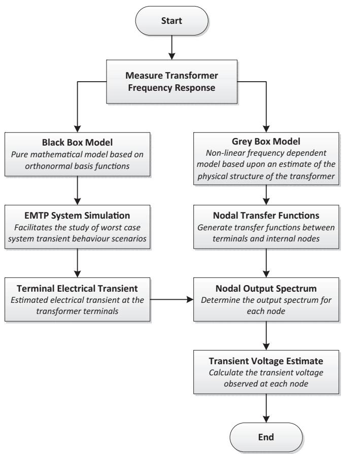  
Fig. 1. Hybrid modelling methodology.

# Black Box modelling for electrical system transient analysis

When conducting electromagnetic transient analysis on a power system, its power transformers can be represented by an n terminal admittance matrix Y where,

$$
\mathbf {I} = \mathbf {Y} \mathbf {V} \tag {1}
$$

or, in terms of its frequency response,

$$
\left[ \begin{array}{c} I _ {1} (j w) \\ I _ {2} (j w) \\ \vdots \\ I _ {n} (j w) \end{array} \right] = \left[ \begin{array}{c c c c} Y _ {1 1} (j w) & Y _ {1 2} (j w) & \dots & Y _ {1 n} (j w) \\ * & Y _ {2 2} (j w) & \dots & Y _ {2 n} (j w) \\ \vdots & \vdots & & \\ * & * & & Y _ {n n} (j w) \end{array} \right] \times \left[ \begin{array}{c} V _ {1} (j w) \\ V _ {2} (j w) \\ \vdots \\ V _ {n} (j w) \end{array} \right]. \tag {2}
$$

In this equation, $I _ { i } ( j w )$ and $V _ { l } ( j w )$ are the frequency responses of the transformer current and voltage at terminals i and l, respectively. $Y _ { i l } ( j w )$ is the frequency response of the element ði; lÞ. The symbol  indicates a symmetric structure.

The calculus of $Y _ { i l } ( j w )$ requires the measurement of $I _ { i } ( j w )$ and $V _ { l } ( j w )$ for w across a wide band of frequencies. Given these measurements, a transformer MIMO (multi-input–multi-output) nonparametric model in the frequency domain is obtained. The goal is to find a parametric model in the state-space realisation of Y such as,

$$
\left\{ \begin{array}{l} \dot {\mathbf {x}} (t) = \mathbf {A} \mathbf {x} (t) + \mathbf {B} \mathbf {v} (t) \\ \mathbf {i} (t) = \mathbf {C} \mathbf {x} (t) + \mathbf {D} \mathbf {v} (t) \end{array} , \right. \tag {3}
$$

where i and v are vectors comprised of the terminal time-domain currents $I _ { i }$ and voltages $V _ { l }$ respectively for i; $l = 1 , \ldots , n .$ . The determination of a parametric model for matrix $\mathbf { Y } ( s )$ , or for each element of $Y _ { i l } ( s )$ from the frequency response measurements, is known as frequency-domain system identification [20].

Matrices A; B; C and D of model (3) can be estimated directly from a subspace system identification method [28]. However, each element $Y _ { i l } ( s )$ of Y can also be parametrized as a rational transfer function such as:

$$
Y _ {i l} (s) = \frac {B _ {i l} (s)}{A _ {i l} (s)}, \tag {4}
$$

where $A _ { i l } ( s )$ and $B _ { i l } ( s )$ are polynomials in s. This model can be expanded as a truncated series of basis functions $\{ \phi _ { i l m } ( t ) \} _ { m = 1 } ^ { \infty }$ [29], as follows:

$$
Y _ {i l} (s) = \frac {B _ {i l} (s)}{A _ {i l} (s)} = c _ {i l 0} + \sum_ {m = 1} ^ {N} c _ {i l m} \Phi_ {i l m} (s), \tag {5}
$$

where $\varPhi _ { i l m } ( s )$ is the Laplace transform of $\phi _ { i l m } ( t )$ . Selections for this basis function can assume different forms, such as a single-pole partial fraction decomposition [30] or the Takenaka–Malmquist functions [31].

# Model parameter estimation

Once there is a model structure, such as those previously presented, a set of parameters for fitting the model with the measured admittance matrix elements is required.

The estimation problem of interest can be stated as the problem of minimising the following objective function. For the sake of simplicity, lets consider the problem of estimating one element of Y, that is, $Y _ { i , l } ( s )$ .

$$
J \left(\theta_ {i l}\right) = \sum_ {k = 1} ^ {K} \left| \Xi_ {i l} \left(j w _ {k}\right) \right| \left| Y _ {i l} \left(j w _ {k}\right) - \widehat {Y} _ {i l} \left(j w _ {k}\right) \right| ^ {2}, \tag {6}
$$

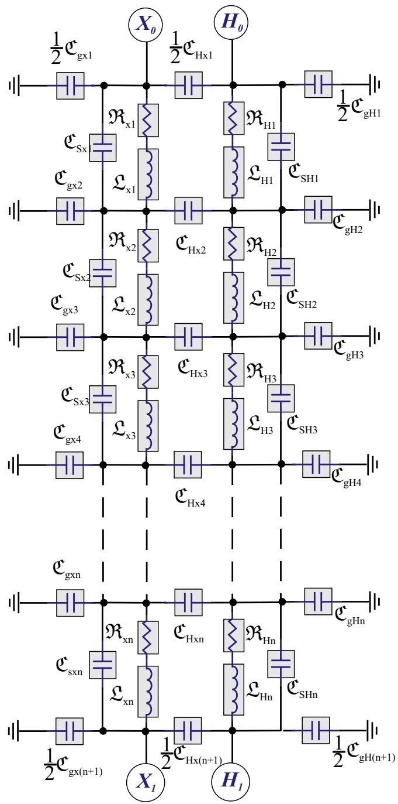  
Fig. 2. Grey Box model.

where $Y _ { i l } ( j w _ { k } )$ is the measured frequency response of an element of (1) at frequencies $\{ w _ { k } \} _ { k = 1 } ^ { K } , \widehat { Y } _ { i l } ( j w _ { k } )$ is the estimated model, with parameters $\theta _ { i l }$ used to approximate the system dynamics. $\Xi _ { i l } ( j w _ { k } )$ Þ is a weighting function.

The problem of estimating the parameters of $\widehat { Y } _ { i l } ( s )$ has been studied by several authors. In the context of power transformer models and frequency domain data, some examples are [21,19,32]. A subspace method for system identification has been applied by [32] for the problem of estimating power transformer models from frequency response data. Tests were conducted with data sets obtained from two identical 132/66/11 kV 30 MVA units. In [19], a system identification method, where the main characteristic is the use of a basis function (see Eq. (5)) called Frequency Localizing Basis Function, has been applied to determinate a parametric model for a power transformer. The data used in this work

has been collected from a frequency response analysis test performed on the A-phase high voltage winding of an ABB power transformer with a rating of 132 kV 60 MVA. The method presented by Oliveira et al. [21] is similar to the one discussed here, however it focused on using discrete-time models instead of continuous-time models. Two power transformer data sets were used to illustrate the model parameter estimation method. The data sets were obtained from a three-phase 500/345/13.8 kV transformer, and a mono-phase 345/230/13.8 kV transformer.

An issue related to the approach taken in (6) is the selection of the dynamics of the basis functions $\phi _ { i l m } ( t )$ (or poles of $\Phi _ { i l m } ( s ) .$ ). This is frequently called basis function pole selection (refer for instance [33]). Such problems are non-linear and may converge to local minima.

An alternative approach is to look for the pole of the basis functions using the so-called Sanathanan–Koener iterations [34,31]. The procedure can be summarised as follows.

(1) Select the model order N and a initial set for the poles basis functions.

Let us recall model (4), which will be now defined as:

$$
\widehat {Y} _ {i l} (s) = \frac {\widehat {B} _ {i l} (s)}{\widehat {A} _ {i l} (s)}, \tag {7}
$$

with

$$
\widehat {B} _ {i l} (s) = \frac {N _ {i l} ^ {B} (s)}{D _ {i l} (s)} = \beta_ {i l 0} + \sum_ {m = 1} ^ {N} \beta_ {i l m} \Phi_ {i l m} (s), \tag {8}
$$

$$
\widehat {A} _ {i l} (s) = \frac {N _ {i l} ^ {A} (s)}{D _ {i l} (s)} = 1 + \sum_ {m = 1} ^ {N} \alpha_ {i l m} \Phi_ {i l m} (s). \tag {9}
$$

Note that, once the basis functions dynamics (poles) have been defined, the model parameters becames $\theta _ { i l } = \{ \alpha _ { i l 1 } , \ldots , \alpha _ { i l N } , \beta _ { i l 0 } , \beta _ { i l 1 } , \ldots , \beta _ { i l N } \}$ .

(2) Run an estimation parameter procedure.

An objective function $J ( \theta _ { i l } )$ related with this problem is:

$$
J \left(\theta_ {i l}\right) = \sum_ {k = 1} ^ {K} \left| \Xi_ {i l} \left(j w _ {k}\right) \right| \left| \frac {N _ {i l} ^ {A} \left(j w _ {k}\right)}{D _ {i j} \left(j w _ {k}\right)} Y _ {i l} \left(j w _ {k}\right) - \frac {N _ {i l} ^ {B} \left(j w _ {k}\right)}{D _ {i j} \left(j w _ {k}\right)} \right| ^ {2} \tag {10}
$$

A search for optimal parameters $\theta _ { i l }$ that minimises the objective function (10) is then performed, that is:

$$
\theta_ {i l} = \operatorname {a r g m i n} J \left(\theta_ {i l}\right). \tag {11}
$$

Since $\varPhi _ { i l m } ( s )$ has been previously defined in step (1) and is assumed known in this step, such a problem is linear in $\theta _ { i l }$ and can be solved using standard least square algorithms.

(3) Select a new set of poles for $\phi _ { i l m } ( s ) .$

With the estimated parameters $\theta _ { i l } , \ \hat { A } _ { i l } ( s ) \ ( \mathbf { E q . } ( 9 ) )$ is defined. The zeros of $\widehat { A } _ { i l } ( s )$ , or roots of $N _ { i l } ^ { A } ( s )$ , are the values for the poles of $\varPhi _ { i l m } ( s )$ in the next iteration. Unstable poles are always flipped to the stable region by making their real parts negative. The procedure is repeated (that is, steps 1, 2 and 3) until the poles have converged.

(4) Final parameter estimation.

Once the poles have converged (meaning that $\widehat { A } _ { i l } ( s )$ tends to $D _ { i l } ( s ) )$ , the objective function (10) tends to (6). The model parameters for the model (4) can be obtained minimising the following objective function:

$$
J \left(\theta_ {i l}\right) = \sum_ {k = 1} ^ {K} \left| \Xi_ {i l} \left(j w _ {k}\right) \right| \left| Y _ {i l} \left(j w _ {k}\right) - \left(c _ {i l 0} + \sum_ {m = 1} ^ {N} c _ {i l m} \Phi_ {i l m} \left(j w _ {k}\right)\right) \right|. \tag {12}
$$

Model (3) can be computed based on each estimated $\widehat { Y } _ { i l } ( s )$

# Grey Box modelling to estimate the internal transient response

# Grey Box transformer model

As in the case of the White Box model, the Grey Box model is a mathematical representation of the complex electromagnetic relationships that exist within a transformer. A common approach is the use of the ladder network model which can originally be traced back to Blume and Boyajian’s work of 1919 [3]. Their work has subsequently been improved by many other researchers over the following decades including [35–37]. A single phase ladder network model based on [18] is given in Fig. 2 where L; R and C represent the frequency dependent inductance, resistance and capacitance elements respectively. The inductance element takes into account the mutual inductance it shares with the other inductive elements, it also includes its leakage inductance contribution and losses associated with the core. More comprehensive detail on this model and its application can be found in [38]. Given the Grey Box transformer model structure, the next step is to estimate the model parameters.

# Terminal transfer functions

Analysis of the Kirchhoff current and voltage relationships that exist within the transformer model structure will facilitate the construction of a state space representation of the model [39]. The state space model will be of the form,

$$
\dot {\mathbf {x}} (t) = \mathbf {A} (u (t)) \mathbf {x} (t) + \mathbf {B} (u (t)) u (t)
$$

$$
\mathbf {v} (t) = \mathbf {C} (u (t)) \mathbf {x} (t) \tag {13}
$$

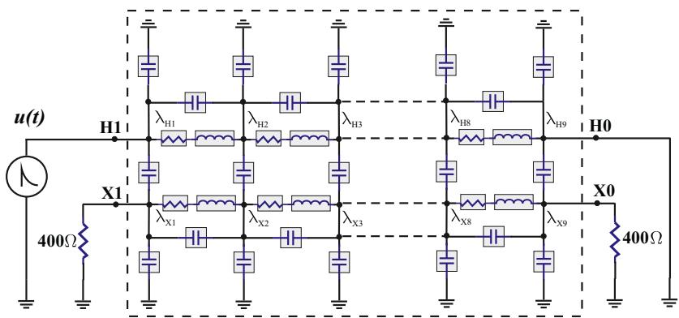  
Fig. 3. Grey Box model terminal connections.

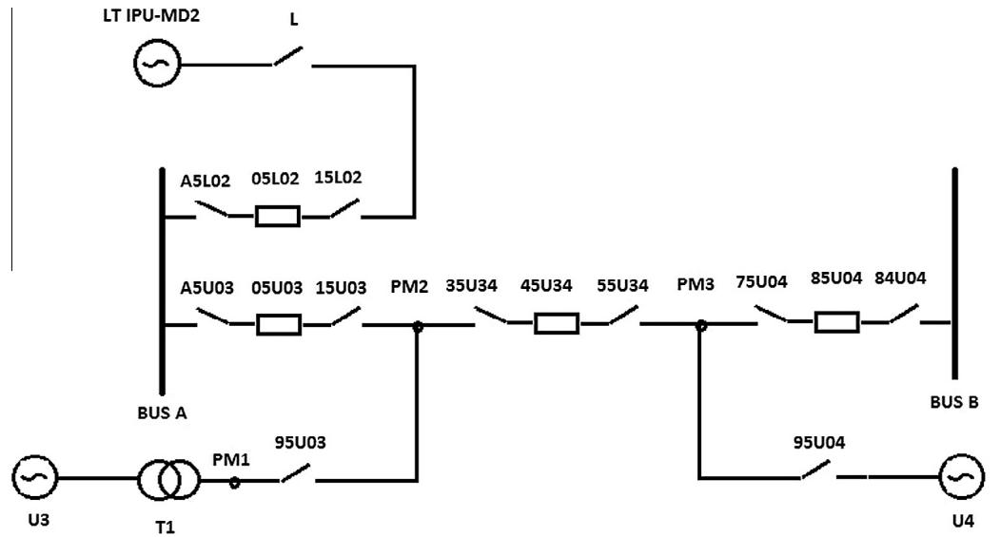  
Fig. 4. Section of the GIS substation.

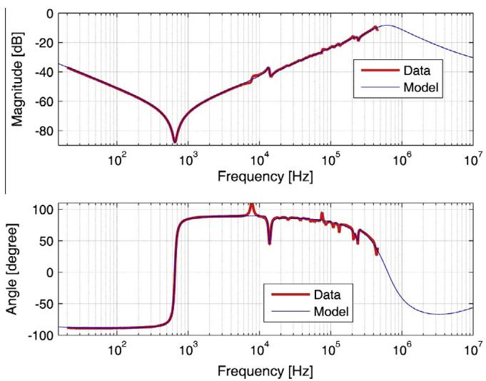  
Fig. 5. Black Box model vector fittings to the High Voltage Winding End to End Open Circuit FRA test measurements.

where x is the state vector, v is the voltage on the nominated output terminal, u the voltage on the nominated input terminal, A the state matrix, B the input matrix, and C the output matrix. Note that A, B and C are non-linear frequency dependent matrices due to a range of phenomena. These include permeability attenuation as a result of magnetic skin effect within the transformer core, winding skin and proximity effects, and the complex permittivity of the dielectric materials [16–18].

A transfer function of the model, H, is derived by taking the Laplace transform of (13),

$$
H (j w) = \frac {V (j w)}{U (j w)} = \mathbf {C} (w) (j w \mathbf {I} - \mathbf {A} (w)) ^ {- 1} \mathbf {B} (w) \tag {14}
$$

The transfer function (14) is used to determine the model’s frequency response for a given set of parameters. Note that there will be a transfer function corresponding to each FRA test.

The next step is to determine the best fit between each transfer function and its corresponding FRA data set by finding the model parameters that will minimise an appropriate cost function. Three different FRA tests were conducted. These tests were the High Voltage Winding End to End Open Circuit, the Low Voltage Winding

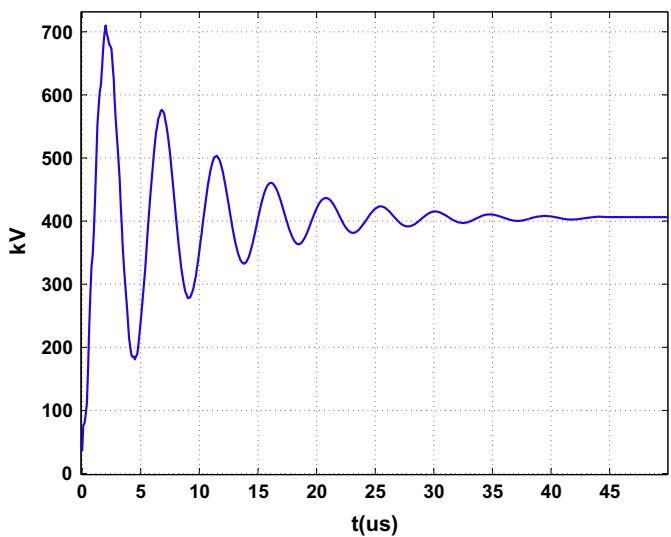  
Fig. 6. Estimated transient voltage for transformer terminal H1.

End to End Open Circuit, and the Capacitive Interwinding FRA tests [40]. The model parameters were determined by finding a global cost function minima using a constrained nonlinear optimisation algorithm. The cost function used for this case study was,

$$
\begin{array}{l} J = \left\| \log_ {1 0} \left(\frac {\widehat {H} _ {H _ {1} H _ {0}} (j w)}{G _ {H _ {1} H _ {0}} (j w)}\right) \right\| ^ {2} + \left\| \log_ {1 0} \left(\frac {\widehat {H} _ {H _ {1} X _ {1}} (j w)}{G _ {H _ {1} X _ {1}} (j w)}\right) \right\| ^ {2} \\ + \left\| \log_ {1 0} \left(\frac {\widehat {H} _ {X _ {2} X _ {1}} (j w)}{G _ {X _ {2} X _ {1}} (j w)}\right) \right\| ^ {2}, \tag {15} \\ \end{array}
$$

where G is the FRA data and $\widehat { H }$ is the estimated model transfer function from (14).

Now that a Grey Box model for the transformer has been developed, estimates for the internal winding response to unique system transients can now be determined.

Estimated internal winding response to system transients

In order to simplify the transient simulation it is assumed that $H _ { 0 }$ is connected to ground and the low voltage terminals $X _ { 1 }$ and $X _ { 2 }$

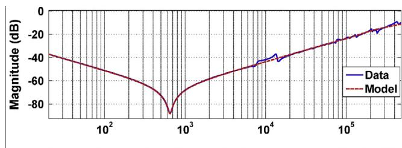

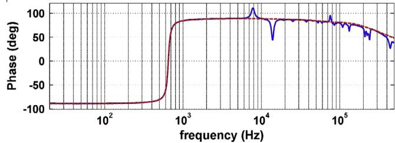  
Fig. 7. Grey Box model transfer function fitted to the High Voltage End to End Open Circuit FRA test measurement.

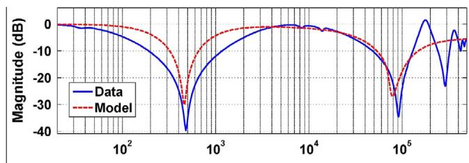

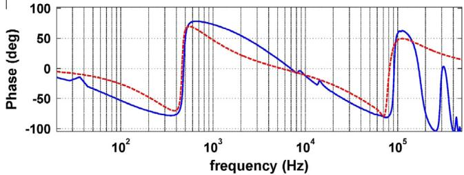  
Fig. 8. Grey Box model transfer function fitted to the Low Voltage End to End Open Circuit FRA test measurement.

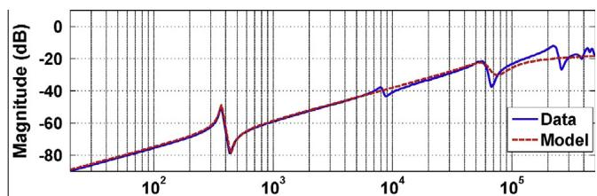

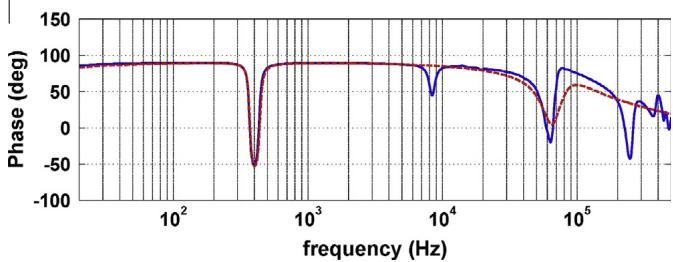  
Fig. 9. Grey Box model transfer function fitted to the Capacitive Interwinding FRA test measurement.

are terminated via 400 X resistors (Fig. 3). The termination resistors are representative of the transmission line surge impedance

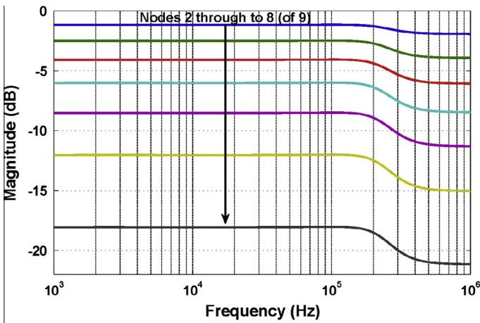

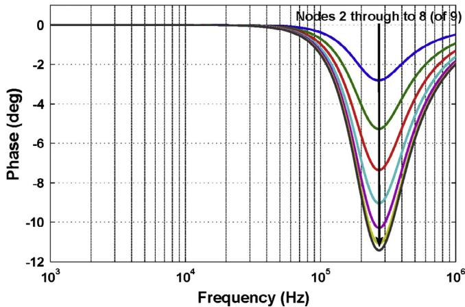  
Fig. 10. H1 terminal to HV node transfer functions.

[41,42]. Fig. 3 also shows the input transient signal, $u ( t ) ,$ , as well as highlighting the location of the model’s HV winding nodes, $\lambda _ { H 1 }$ through to $\lambda _ { H 9 } ,$ and the model’s LV winding nodes, $\lambda _ { X 1 }$ through to $\lambda _ { X 9 } .$ . Note that the winding nodes, k, are representative of their distributed locations within the transformer’s physical winding structure. For example, kH n represents the electrical midpoint of the HV winding.

The input transient signal is determined from the EMTP transient study using the Black Box model as discussed in the previous section. Since the Grey Box model takes into account the frequency dependent behaviour of the transformer core and the skin and proximity effects within the transformer’s windings, it is necessary for the analysis to be conducted in the frequency domain. Note that by using frequency domain analysis, the output spectrum for any node can be derived by multiplying the input signal spectrum by the corresponding node transfer function.

To determine the input signal spectrum we apply a Fourier Transform to $u ( t )$ , that is, $U ( j w )$ . The next step is to determine the transfer function between the high voltage input terminal H1 and a node within the winding structure to be analysed $( \lambda _ { H 1 }$ through to $\lambda _ { H 9 }$ for the high voltage winding and $\lambda _ { X 1 }$ through to k for the low voltage winding). With reference to (14) and acknowledging that the output matrix will facilitate node selection for the transfer function, transfer functions can be determined for each of the internal winding nodes within the Grey Box model. After estimating the transfer function for nominal winding node $\lambda , \widehat { H } _ { H _ { 1 } \lambda } ( j \omega )$ , the spectrum at this point due to the transient input signal is,

$$
\widehat {V} _ {\lambda} (j \omega) = U (j \omega) \widehat {H} _ {H _ {1} \lambda} (j \omega), \tag {16}
$$

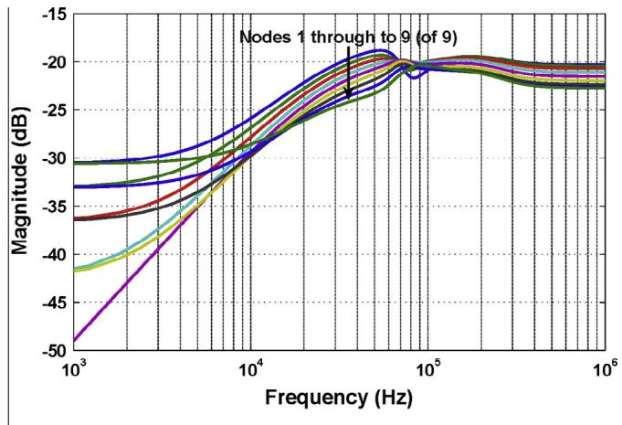

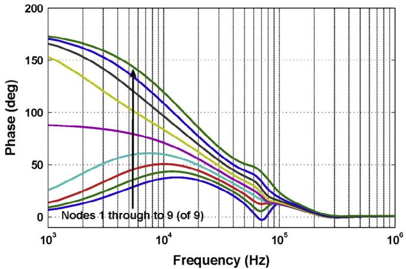  
Fig. 11. H1 terminal to LV node transfer functions.

where $\widehat { V } _ { \lambda } ( j \omega )$ is the resulting output spectrum. Finally an estimate for the transient voltage in the time domain v^ ðtÞ, at nominal winding node k can be determined by taking the Inverse Fourier Transform of $\widehat { V } _ { \lambda } ( j \omega )$ ,

$$
\hat {\nu} _ {\lambda} (t) = \mathcal {F} ^ {- 1} \left\{\widehat {V} _ {\lambda} (j \omega) \right\}. \tag {17}
$$

# Example: generator transformer within a GIS substation

This example demonstrates the proposed methodology by estimating the distributed internal voltage stress within a power transformer due to system switching transients generated within the substation. The substation is part of a hydroelectric power plant belonging to the Brazilian power grid. A system drawing of the section of the substation under consideration is given in Fig. 4.

In this example it is considered how system transient voltages generated by switching on disconnectors or circuit breakers will propagate through the windings of the transformer T1 which is connected to generator U3. The transformer under consideration is a single-phase 525/18 kV 256 MVA generator transformer. In order to study such a problem and to simulate the above mentioned phenomena, the substation section was modelled using EMTP-RV software and only single-phase models of the elements were considered. The transmission lines between the components of the circuit were modelled within EMTP using a distribution parameter model (modal surge impedance and propagation velocity).

# Black-Box modelling results and system transient response

The Black-Box identification procedure described in Section ‘Black Box modelling for electrical system transient analysis’ is now applied to fit a state-space model to the High Voltage End to End Open Circuit FRA test data obtained from the generator transformer. The Black-Box model structure used here is given by (5),with $i = l = 1$ , and a set of eight Takenaka–Malmiquist functions to form the basis $( N = 8 )$ ). After only 40 iterations using the identification procedure described in ‘Model parameter estimation’, the model parameters have converged to achieve an excellent fit between the model frequency response and the measurement data as shown in Fig. 5.

After incorporating the generator transformer’s Black Box model into the GIS substation electrical system EMTP simulation, switching transient studies were then conducted. The scenario considered in this paper was based on the closure of circuit breaker 05U03 whilst circuit breaker 45U34 was open. This is equivalent to energising the GIS point PM1 from BUS-A, which is already energised from the system, that is, from LT IPU MD2. The estimated

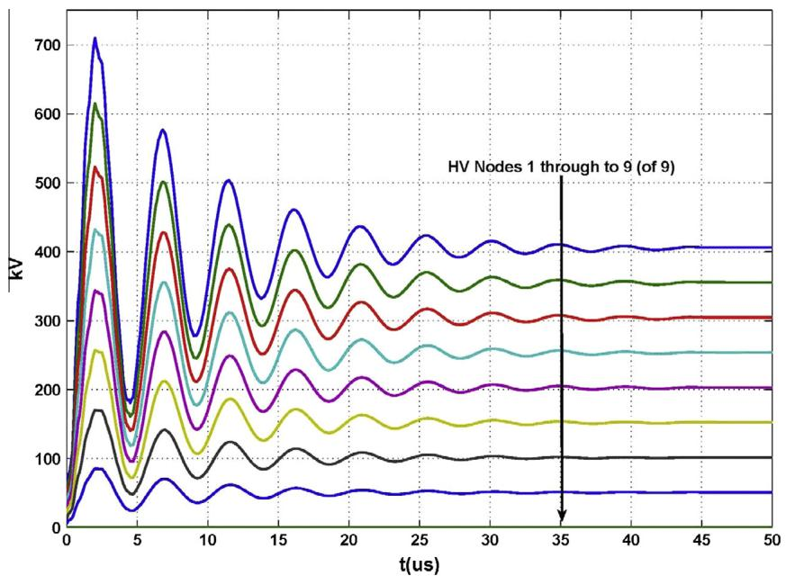  
Fig. 12. 525 kV/18 kV 256 MVA generator transformer HV node transient response.

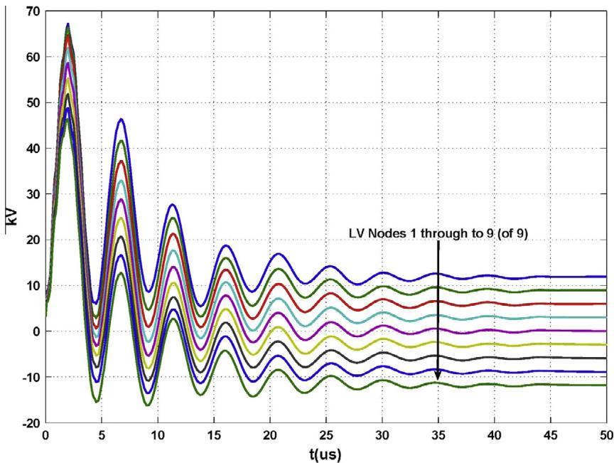  
Fig. 13. 525 kV/18 kV 256 MVA generator transformer LV transient response.

transient voltage for the transformer’s high voltage terminal H1 under these conditions is shown in Fig. 6.

The next step in the hybrid modelling methodology was to inject the estimated transformer terminal transient into its Grey Box model.

# Grey Box modelling results and internal voltage estimation

By applying the procedure presented in Section ‘Grey Box modelling to estimate the internal transient response’, the Grey Box model parameters were determined by fitting its corresponding transfer functions to the transformer FRA measurements (HV End to End Open Circuit, LV End to End Open Circuit, Capacitive Interwinding FRA tests). As shown in Figs. 7–9, a satisfactory fitting which includes the dominant resonant activity was achieved for frequencies up to 500 kHz.

With the Grey Box model parameters derived, transfer functions between the high voltage input terminal H1 and the various nodes within the model’s winding structure were then determined (Figs. 10 and 11)). It is observed that the estimated frequency responses of the internal nodes of the transformer do not contain significant resonances. This aligns well with the data set used in the system identification procedure since this data too shows only low levels of resonant activity (Figs. 7–9).

Given the nodal transfer functions and the injected transient signal, from (16) and (17), an estimate for the transient voltage in the time domain at each nodal location was calculated. Figs. 12 and 13 show the respective HV and LV node transient responses.

This example shows the benefits the proposed methodology offers. An estimation of the internal voltage profile of a transformer without requiring prior knowledge of its internal design specifications.

# Conclusion

This research proposes a new methodology for the determination of the internal voltage profile and, thus, potential resonant overvoltage conditions within a power transformer due to external switching events within the power network. The methodology is based on the cooperative application of Black and Grey Box trans-

former models to the problem. The Black Box model’s mathematical flexibility is leveraged within the EMTP system study to determine terminal transient conditions for the transformer. The transient conditions are then injected into the physically representative non-linear Grey Box model in order to determine the internal transient response within the transformer’s windings. The parameters associated with both models are derived from external measurements only and are therefore not subject to intellectual property and internal access restrictions as is typically the case. A case study of switching operations within a large GIS substation and their influence on the internal structure of a generator transformer was used to demonstrate the utility of this approach. Since internal access to the generator transformer is not a viable proposition, future work includes further validation of this paper’s proposed methodology utilising a scaled laboratory equivalent.

# Acknowledgments

The authors would like to acknowledge Ing. Robson A. Oliveira and Ing. José G.R. Filho for their valuable input. The second author would like to acknowledge SETI/Fundação Araucária and CNPq for supporting this research.

# References

[1] De A, Chakrabarti A, Hazra P. Resonant overvoltages produced in EHV transformer windings due to power system transients. In: India annual conference, 2004. Proceedings of the IEEE INDICON 2004. First; 2004. p. 74– 7. http://dx.doi.org/10.1109/INDICO.2004.1497709.   
[2] Gustavsen B. Study of transformer resonant overvoltages caused by cabletransformer high-frequency interaction. In: Power and energy society general meeting, 2011 IEEE, vol. 1; 2011. ISSN 1944-9925. http://dx.doi.org/10.1109/ PES.2011.6038890.   
[3] Blume LF, Boyajian A. Abnormal voltages within transformers. Trans Am Inst Electr Eng 1919;XXXVIII(1):577–620. http://dx.doi.org/10.1109/T-AIEE.1919.4765613. ISSN 0096-3860.   
[4] Gustavsen B, Brede A, Tande J. Multivariate analysis of transformer resonant overvoltages in power stations. IEEE Trans Power Deliv 2011;26(4):2563–72. http://dx.doi.org/10.1109/TPWRD.2011.2143436. ISSN 0885-8977.   
[5] Massaro URR. Electrical transient interaction between transformers and power system, brazilian experience. In: Proceedings of the international power system transients conference; 2009.   
[6] IEEE guide to describe the occurrence and mitigation of switching transients induced by transformer, switching device, and system interaction. IEEE unapproved draft std PC57.142/D6; April 2009.

[7] Electrical transient interaction between transformers and the power system. CIGRE working group A2/C4.39.   
[8] Harlow JH, editor. Electric power transformer engineering. The electric power engineering series. CRC Press; 2004.   
[9] Ljung L. System identification, theory for the user. 2nd ed. Prentice Hall; 1999.   
[10] van den Bosh PPJ, van der Klauw AC. Modeling, identification and simulation of dynamic systems. CRC Press; 1994.   
[11] Nelles O. Nonlinear system identification. Springer; 2001.   
[12] Martinez JA, Mork BA. Transformer modeling for low and mid frequency transients a review. IEEE Trans Power Deliv 2005;20(2):1625–32.   
[13] Bjerkan E, Hoidalen H, Moreau O. Importance of a proper iron core representation in high frequency power transformer models. In: International symposium on high voltage engineering, Beijing, China.   
[14] Bjerkan E. High frequency modeling of power transformers – stresses and diagnostics. PhD thesis. Faculty of Information Technology, Mathematics and Electrical Engineering; 2005.   
[15] Zhang Q, Wang S, Qiu J, Jing X, Gao C, Zhu JG, et al. Application of an improved multi-conductor transmission line model in power transformer. IEEE Trans Magn 2013;49(5):2029–32.   
[16] Abeywickrama KGNB, Podoltsev AD, Serdyuk YV, Gubanski SM. Influence of core characteristics on inductance calculations for modeling of power transformers. In: First international conference on industrial and information systems; 2006. p. 24–9. http://dx.doi.org/10.1109/ICIIS.2006. 365629.   
[17] Mitchell SD, Welsh JS. The influence of complex permeability on the broadband frequency response of a power transformer. IEEE Trans Power Deliv 2009(99):1. http://dx.doi.org/10.1109/TPWRD.2009.2036358. ISSN 0885-8977.   
[18] Mitchell S, Welsh J. Modeling power transformers to support the interpretation of frequency-response analysis. IEEE Trans Power Deliv 2011;26(4):2705–17. http://dx.doi.org/10.1109/TPWRD.2011.2164424. ISSN 0885-8977.   
[19] Welsh J, Rojas C, Mitchell S. Wideband parametric identification of a power transformer. In: Universities power engineering conference, 2007. AUPEC 2007. Australasian; 2007. p. 1–6. http://dx.doi.org/10.1109/AUPEC.2007. 4548053.   
[20] Pintelon R, Schoukens J. System identification: a frequency domain approach. 2nd ed. IEEE Press; 2012.   
[21] Oliveira GHC, Maestrelli R, Rocha ACO. An application of orthonormal basis functions in power transformers wide band modeling. In: IEEE international conference on control and automation, 2009; 2009. p. 831–6.   
[22] Oliveira GHC, Mitchel SD. Comparison of Black-Box modeling approaches for transient analysis: a GIS substation case study. In: Proc of the 2013 international conference on power system transients. CA: Vancouver; 2013.   
[23] Brozio C, Vermeulen H. Wideband equivalent circuit modelling and parameter estimation methodology for two-winding transformers. IEE Proc Gener Transm Distrib 2003;150(4):487–92. http://dx.doi.org/10.1049/ipgtd:20030422. ISSN 1350-2360.   
[24] Ragavan K, Satish L. Construction of physically realizable driving-point function from measured frequency response data on a model winding. IEEE

Trans Power Deliv 2008;23(2):760–7. http://dx.doi.org/10.1109/ TPWRD.2008.915815. ISSN 0885-8977.   
[25] Mitchell S, Welsh J. Initial parameter estimates and constraints to support gray box modeling of power transformers. IEEE Trans Power Deliv 2013;28(4):2411–8. http://dx.doi.org/10.1109/TPWRD.2013.2259266. ISSN 0885-8977.   
[26] Popov M, van der Sluis L, Smeets RPP, Roldan J. Analysis of very fast transients in layer-type transformer windings. IEEE Trans Power Deliv 2007;22(1):238–47. http://dx.doi.org/10.1109/TPWRD.2006.881605. ISSN 0885-8977.   
[27] Lopez-Fernandez X, Alvarez-Marino C, Couto D, Lopes R, Jacomo-Ramos A. Modeling and insulation design methodology in power transformer under fast transients. In: 2010 XIX international conference on electrical machines (ICEM); 2010. p. 1–6. http://dx.doi.org/10.1109/ICELMACH.2010.5608019.   
[28] Katayama T. Subspace methods for system identification. Springer; 2005. [29] Heuberger PSC, van den Hof PMJ, Wahlberg B. Modelling and identification with rational orthogonal basis functions. Springer; 2005.   
[30] Gustavsen B, Semlyen A. Rational approximation of frequency domain responses by vector fitting. IEEE Trans Power Deliv 1999;14:1052–61.   
[31] Dirk Deschrijver BH, Dhaene T. Orthonormal vector fitting: a robust macromodeling tool for rational approximation of frequency domain responses. IEEE Trans Adv Pack 2007;30(2):216–25.   
[32] Akcay H, Islam SM, Ninness B. Subspace-based identification of power transformer models from frequency response data. IEEE Trans Instrum Meas 1999;48:700–7004.   
[33] Silva TO. Optimal pole conditions for laguerre and two parameter kautz models: a survey of know results. In: Proc of the IFAC symp on system identification; 2000.   
[34] Sanathann CK, Koerner J. Transfer function synthesis as a ratio of two complex polynomials. IEEE Trans Autom Control 1963;9:56–8.   
[35] Abetti PA. Transformer models for the determination of transient voltages. Power Ap Syst Part III. Trans Am Inst Electr Eng 1953;72(2):468–80. http:// dx.doi.org/10.1109/AIEEPAS.1953.4498656. ISSN 0018-9510.   
[36] Wilcox D, Hurley W, McHale T, Conlon M. Application of modified modal theory in the modelling of practical transformers. IEE Proc C Gener Transm Distrib 1992;139(6):513–20. ISSN 0143-7046.   
[37] de Leon F, Semlyen A. Complete transformer model for electromagnetic transients. IEEE Trans Power Deliv 1994;9(1):231–9. http://dx.doi.org/ 10.1109/61.277694. ISSN 0885-8977.   
[38] Mitchell SD. Power transformer modelling to support the interpretation of frequency response analysis. PhD thesis. School of Electrical Engineering and Computer Science, University of Newcastle, Australia; 2011.   
[39] Rohrer RA. Circuit theory: an introduction to the state variable approach. McGraw-Hill; 1970.   
[40] Mechanical condition assessment of transformer windings using Frequency Response Analysis (FRA), ELECTRA-CIGRE WG A2.26 Report 342 237.   
[41] Deshpande MV. Electrical power system design. McGraw-Hill; 1985. [42] Singh S. Electric power generation transmission and distribution. 2nd ed. PHI Learning Pvt. Ltd; 2008.