# Loewner matrix approach for modelling FDNEs of power systems

Gurunath Gurrala

Department of Electrical and Computer Engineering, Texas A&M University, USA

# a r t i c l e i n f o

Article history:

Received 11 October 2014

Received in revised form 19 March 2015

Accepted 21 March 2015

Keywords:

Frequency dependent network equivalents

Tangential interpolation

Loewner matrix

Electromagnetic transients (EMT)

Vector fitting

# a b s t r a c t

This paper proposes a new approach for modelling frequency dependent power system network equivalents (FDNE) using tangential interpolation framework based on Loewner matrix (LM) pencil. The Loewner matrix based tangential interpolation technique has been recently proposed for modelling of large multi-port VLSI circuits. The LM approach fits accurate state space descriptor system models from the frequency response measurements. Singular value decomposition based LM approach has been investigated in this paper for modelling of FDNEs. The proposed method’s performance is compared to the widely used vector fitting approach using four power system examples. A simple matrix implementation for LM formation and a MATLAB based stable model extraction approach is proposed. It has been shown that the data splitting step of the LM approach has significant impact on the accuracy of the fitting. The LM method is shown to be comparable to vector fitting in terms of accuracy, stability and passivity. It does not require any starting poles and has no convergence issues because it is a non-iterative method. It also gives an indication of the system order which is a unique advantage.

© 2015 Elsevier B.V. All rights reserved.

# 1. Introduction

The quest for efficient frequency dependent models in power system electromagnetic transient (EMT) simulations is a never ending journey. Early electromagnetic transient programs (EMTP) used frequency dependent models mostly for switching transient studies and lightning studies for planning and design of high voltage equipment such as switchgear, insulators and high voltage DC systems (HVDC) [1]. The need for accurate and reliable electromagnetic transient equivalents have been growing significantly across the industry with the introduction of fast switching devices (power electronic circuit breakers), complex generation sources (wind, solar and other power electronic based sources) and complex transmission controls such as voltage source converter based DC systems (VSC-HVDC), flexible AC transmission controls (FACTS), etc. This need exists because their frequency responses closely overlap with the natural frequency responses of various power system components like distributed transmission lines, transformers, etc. [2]. In the near future EMT programs will become a necessity even for day to day operations because of the growing interconnections and complex control interactions.

There are several frequency dependent network equivalent (FDNE) modelling techniques available and good surveys of the techniques are presented in [1,3,4]. Rational approximations using iterative methods [5] became popular in recent years. Vector fitting and several variations of it are widely used for FDNE’s [6,7]. A multiport time domain-vector fitting method is proposed in [8]. Vector fitting requires a good guess of the starting poles for successful polerelocation and sometimes needs separate passivity enforcement. There is no proof of when and how fast Vector fitting converges [9]. Frequency partitioning approach has been proposed in [10–12] to avoid ill-conditioning in FDNEs. The trial and error based frequency partitioning approaches are time consuming for networks involving large number of ports. A genetic algorithm based approach that preserves the passivity of the FDNE model is proposed in [13]. In [2,14] the need for large scale FDNEs is identified and a sparse time domain network equivalent method is proposed.

Methods for constructing a controllable and observable state space model, called generalized realization problem, from a data set obtained by sampling a transfer matrix are proposed in [15]. These methods use data sampled directionally, called tangential interpolation data. Recently, an accurate multi-port modelling technique for systems with large number of terminals has been proposed in [9,16]. This method uses the Loewner matrix (LM) pencil constructed from frequency response data in the framework of tangential interpolation. Performance of the Loewner method in the presence of noisy measurements has been studied in [17]. Application of Loewner matrix approach for distributed parameter

models of micro electronic circuits is presented in [18]. All the above references claim that the LM approach is superior to vector fitting as this is a non-iterative approach that accurately fits models for large multi-port systems [16] without any convergence issues. It doesn’t need any starting poles. The LM approach usually preserves passivity [16,18], but can not guarantee this in all cases. The order of the models can be easily identified and the fitted models are stable after the extraction of the irregular part of the state-space model. Because of these compelling advantages, application of Loewner matrix approach for frequency dependent network equivalents of power systems is investigated in this paper. Singular value decomposition (SVD) based Loewner matrix approach proposed in [16] is presented in MATLAB style syntax for easy implementation. A new matrix implementation for LM formation and a MATLAB based stable model extraction approach is proposed. The performance of the LM approach is tested on several FDNE power system cases. Results of four representative test systems are discussed in this paper. Passivity is verified using step response and eigenvalues of the real part of Y-matrix over the entire frequency range.

# 2. Loewner matrix approach

This section gives a brief overview of the Loewner matrix approach. The theoretical basis of Loewner matrix approach is well described in [15,16]. Let the frequency response is denoted by Y(s) for a frequency range of $\{ s _ { m i n } , s _ { m a x } \}$ . The goal is to fit a generalized descriptor system state space model of the form

$$
\Sigma : \left\{ \begin{array}{l} E \dot {x} (t) = A x (t) + B u (t) \\ y (t) = C x (t) + D u (t) + Y ^ {\infty} \dot {u} (t) \end{array} \right. \tag {1}
$$

- is a linear time invariant (LTI) system with m-inputs, p-outputs and n-internal variables in descriptor form representation where $x ( t )$ is an internal variable (the state, if E is invertible), u(t) is the input, y(t) is the corresponding output, while $E , A \in R ^ { n \times n } , B \in R ^ { n \times m }$ , $C \in R ^ { p \times n } , D , Y ^ { \infty } \in R ^ { n \times n }$ are constants with E possibly singular. The transfer function of - is given by

$$
H (s) = \underbrace {C (s E - A) ^ {- 1} B} _ {\text {R e g u l a r P a r t}} + \underbrace {D + s Y ^ {\infty}} _ {\text {I r r e g u l a r P a r t}} \tag {2}
$$

The Loewner matrix approach fits a state space model {E, A, B, C} with embedded D and $Y ^ { \infty }$ matrices. The embedded irregular part, D and $Y ^ { \infty }$ matrices, sometimes result in an unstable model and they need to be extracted to obtain a stable model [16,18].

# 2.1. Tangential interpolation

Consider a set of points $S = \{ s _ { 1 } , . . . , s _ { P } \}$ in the complex plane and the evaluations $\{ H ( s _ { 1 } ) , . . . , H ( s _ { P } ) \}$ of the rational matrix function H(s) at those points. S can be partitioned as

$$
S = \{\lambda_ {1}, \dots , \lambda_ {k} \} \cup \{\mu_ {1}, \dots , \mu_ {h} \}
$$

The rational interpolation method constructs a controllable and observable state space model from sampled data of the system transfer matrix $H ( s )$ . The sampled data can be of scalar data, matrix data or tangential data (matrix data sampled directionally on the left and on the right) [15]. The interpolation method uses the following right interpolation data:

$$
\Lambda = d i a g [ \lambda_ {1}, \dots \dots , \lambda_ {k} ] \in \mathbb {C} ^ {k \times k}
$$

$$
R = \left[ r _ {1}, \dots \dots \dots , r _ {k} \right] \in \mathbb {C} ^ {m \times k} \tag {3}
$$

$$
W = \left[ w _ {1}, \dots ., w _ {k} \right] \in \mathbb {C} ^ {p \times k}
$$

and the left interpolation data:

$$
M = \operatorname {d i a g} [ \mu_ {1}, \dots \dots , \mu_ {h} ] \in \mathbb {C} ^ {h \times h}
$$

$$
L = \left[ \begin{array}{l} l _ {1} \\ \cdot \\ \cdot \\ l _ {h} \end{array} \right] \in \mathbb {C} ^ {h \times p}; V = \left[ \begin{array}{l} v _ {1} \\ \cdot \\ \cdot \\ v _ {h} \end{array} \right] \in \mathbb {C} ^ {h \times m} \tag {4}
$$

$r _ { i } \in R$ are called right tangential directions and $l _ { j } \in L$ are called left tangential directions. The interpolation method finds a minimal realization [E, A, B, C, D] for tangential data, such that the associated transfer function satisfies the following right and left constraints

$$
H \left(\lambda_ {i}\right) r _ {i} = w _ {i}
$$

$$
l _ {j} H \left(\mu_ {j}\right) = v _ {j} \tag {5}
$$

The right tools for studying this problem are the Loewner matrix and the shifted Loewner matrix because these matrices have a system theoretically significant factorization. Loewner matrix of H(s) can be built as follows using the directions $r _ { i }$ and $l _ { j }$

$$
\mathcal {L} = \left[ \begin{array}{l l l} \frac {v _ {1} r _ {1} - l _ {1} w _ {1}}{\mu_ {1} - \lambda_ {1}} & \dots & \frac {v _ {1} r _ {k} - l _ {1} w _ {k}}{\mu_ {1} - \lambda_ {k}} \\ \vdots & \ddots & \vdots \\ \frac {v _ {h} r _ {1} - l _ {h} w _ {1}}{\mu_ {h} - \lambda_ {1}} & \dots & \frac {v _ {h} r _ {k} - l _ {h} w _ {k}}{\mu_ {h} - \lambda_ {k}} \end{array} \right] \tag {6}
$$

Similarly shifted Loewner matrix of sH(s) can be built as follows

$$
\sigma \mathcal {L} = \left[ \begin{array}{l l l} \frac {\mu_ {1} v _ {1} r _ {1} - \lambda_ {1} l _ {1} w _ {1}}{\mu_ {1} - \lambda_ {1}} & \dots & \frac {\mu_ {1} v _ {1} r _ {k} - \lambda_ {k} l _ {1} w _ {k}}{\mu_ {1} - \lambda_ {k}} \\ \vdots & \ddots & \vdots \\ \frac {\mu_ {h} v _ {h} r _ {1} - \lambda_ {1} l _ {h} w _ {1}}{\mu_ {h} - \lambda_ {1}} & \dots & \frac {\mu_ {h} v _ {h} r _ {k} - \lambda_ {k} l _ {h} w _ {k}}{\mu_ {h} - \lambda_ {k}} \end{array} \right] \tag {7}
$$

The generalized observability matrix O and generalized controllability matrix R of a realization $[ E ; A ; B ; C ; D ]$ are defined as:

$$
\mathcal {O} = \left[ \begin{array}{l} C \left(\mu_ {1} E - A\right) ^ {- 1} \\ \vdots \\ C \left(\mu_ {h} E - A\right) ^ {- 1} \end{array} \right] \tag {8}
$$

$$
\mathcal {R} = \left[ \left(\lambda_ {1} E - A\right) ^ {- 1} B r _ {1} \dots \left(\lambda_ {k} E - A\right) ^ {- 1} B r _ {k} \right]
$$

Each entry in the Loewner matrix can be expressed in a product form as shown below:

$$
\begin{array}{l} \mathcal {L} _ {i j} = \frac {v _ {j} r _ {i} - l _ {j} w _ {i}}{\mu_ {j} - \lambda_ {i}} \text {s u b s t i t u t i n g f o r} v _ {j}, w _ {i} \text {f r o m (9)} \\ \Rightarrow \mathcal {L} _ {i j} = \frac {l _ {j} (C (\mu_ {j} E - A) ^ {- 1} B + D) r _ {i} - l _ {j} (C (\lambda_ {i} E - A) ^ {- 1} B + D) r _ {i}}{\mu_ {j} - \lambda_ {i}} \\ \Rightarrow \mathcal {L} _ {i j} = \frac {l _ {j} C (\mu_ {j} E - A) ^ {- 1} [ (\lambda_ {i} E - A) - (\mu_ {j} E - A) ] (\lambda_ {i} E - A) ^ {- 1} B r _ {i}}{\mu_ {j} - \lambda_ {i}} \\ \Rightarrow \mathcal {L} _ {i j} = \frac {l _ {j} C (\mu_ {j} E - A) ^ {- 1} [ (\lambda_ {i} - \mu_ {j}) E ] (\lambda_ {i} E - A) ^ {- 1} B r _ {i}}{\mu_ {j} - \lambda_ {i}} \\ \Rightarrow \mathcal {L} _ {i j} = - l _ {j} C (\mu_ {j} E - A) ^ {- 1} E (\lambda_ {i} E - A) ^ {- 1} B r _ {i} \\ \end{array}
$$

$$
\begin{array}{l} \mathcal {L} = - \underbrace {\left[ \begin{array}{c} l _ {1} C (\mu_ {1} E - A) ^ {- 1} \\ \vdots \\ l _ {h} C (\mu_ {h} E - A) ^ {- 1} \end{array} \right]} _ {\mathcal {Y}} \\ E [ (\lambda_ {1} E - A) ^ {- 1} B r _ {1} \dots (\lambda_ {k} E - A) ^ {- 1} B r _ {k} ] \\ \mathcal {L} = - \mathcal {Y} E \mathcal {X} \end{array} \tag {9}
$$

Y and X are called tangential generalized observability and controllability matrices respectively. These are formed by multiplying (8) with respective tangential directions. Similarly one can factorize shifted Loewner matrix as [19]

$$
\sigma \mathcal {L} = - \mathcal {Y} A \mathcal {X} + L D R \tag {10}
$$

From the above derivation one can observe that the Loewner matrix can be factored as a product of the tangential generalized controllability and tangential generalized observability matrices. The pairs $( E , A , B )$ and (C, E, A) are controllable and observable, respectively, so if the sampling directions $r _ { i }$ and $l _ { j }$ are chosen appropriately, the rank of the Loewner matrix is precisely the rank of the underlying E matrix, while the rank of the shifted Loewner matrix is $^ { + p }$ more than the rank of the underlying A matrix [15,16]. The Loewner matrix, constructed using any partition of $^ { \cdot } S ,$ encodes the degree of the minimal interpolant of the data [15]. For strictly proper systems, $s i z e ( E ) = r a n k ( E ) = n$ for $E \in C ^ { n \times n }$ and the singular value decomposition (SVD) can be used to factor L [15,16] as shown below

$$
\forall x \in S
$$

$$
\operatorname {r a n k} (x \mathcal {L} - \sigma \mathcal {L}) = \operatorname {r a n k} (\Sigma) = r;
$$

$$
S V D (x \mathcal {L} - \sigma \mathcal {L}) = Y _ {1} \Sigma X _ {1} ^ {*}; \tag {11}
$$

$$
Y _ {1}, X _ {1} \in C ^ {p \times r};
$$

Using the singular vectors as projectors [16], the realization [E, A, $B , C , D ]$ can be obtained as follows:

$$
E = Y _ {1} ^ {*} L X _ {1},
$$

$$
A = Y _ {1} ^ {*} \Sigma L X _ {1}
$$

$$
B = Y _ {1} ^ {*} V; \tag {12}
$$

$$
C = W X _ {1};
$$

$$
D = 0;
$$

The choice of x is not an issue since the pencil $( \sigma \mathcal { L } , \mathcal { L } )$ loses rank only when x is one of its eigenvalues [16]. Real-world measurements are noisy, so the zero singular values of the singular pencil are corrupted by noise. Consequently, one can identify the order of the underlying system based on a large drop in the singular values $\mathsf { o f } ( x \mathcal { L } - \sigma \mathcal { L } )$ . The Loewner and shifted Loewner matrices satisfy the following Sylvester equations.

$$
\mathcal {L} \Lambda - M \mathcal {L} = \mathcal {L} W - V R \tag {13}
$$

$$
\sigma \mathcal {L} \Lambda - M \sigma \mathcal {L} = \mathcal {L} W \Lambda - M V R \tag {14}
$$

These equations can be solved for the formation of Loewner matrices in the implementation instead of nested for-loops.

# 3. Implementation of Loewner matrix approach

Implementation details of the Loewner Matrix approach using MATLAB syntax are presented in this section.

# 3.1. Fitting state space model

The Y-parameter frequency response of a p-port system is given by H(s). In MATLAB format $H ( s ) \mathrm { i } s \mathsf { a } p \times p \times N _ { s }$ matrix, where $N _ { s }$ is the number of samples. $N _ { s }$ is considered as even without loss of generality. The sampling frequencies are denoted by $S = \{ s _ { 1 } , s _ { 2 } , . . . , s _ { N _ { s } } \}$ where $s { = } j \omega ;$ To obtain a real system, the condition $H ( s ) = H ( { \bar { s } } )$ needs to be satisfied. Therefore, the Y-parameters at the complex conjugate values of the sample points $- j \omega _ { i }$ should be equal to the complex conjugates of the measurements at $j \omega _ { i }$ , namely $\bar { Y } ^ { ( i ) }$ .

# Step1: Partitioning the data

There are several ways one can partition the data. It is observed that the way of partitioning has significant impact on the accuracy of fitting. The following are the most common partitioning approaches

1 Partitioning data into two halves [16,18]

$$
S = \underbrace {\left\{s _ {1} , s _ {2} \cdots , s _ {\frac {N _ {S}}{2}} \right\}} _ {\lambda} \cup \underbrace {\left\{s _ {\frac {N _ {S}}{2} + 1} , s _ {\frac {N _ {S}}{2} + 2} , \cdots , s _ {N _ {S}} \right\}} _ {\mu} \tag {15}
$$

2 Partitioning data into odd and even samples (alternate Samples) [19]

$$
S = \underbrace {\left\{s _ {1} , s _ {3} \cdots , s _ {2 k - 1} \right\}} _ {\lambda} \cup \underbrace {\left\{s _ {2} , s _ {4} , \cdots , s _ {2 k} \right\}} _ {\mu} \tag {16}
$$

Define:

$$
H _ {\lambda} (s) = H (\lambda);
$$

$$
H _ {\mu} (s) = H (\mu);
$$

$$
p = \text {n u m b e r o f p o r t s};
$$

$$
M (1: 2: n, 1) = \mu ;
$$

$$
M (2: 2: n, 1) = \operatorname {c o n j} (\mu);
$$

$$
\Lambda (1: 2: n, 1) = \lambda ;
$$

$$
\Lambda (2: 2: n, 1) = \operatorname {c o n j} (\lambda);
$$

Step2: Formation of Tangential directions

$$
\text {D e f i n e}: \quad I = \text {e y e} (p, p);
$$

$$
f o r k = 1: \frac {N _ {s}}{2}
$$

$$
i f \operatorname {m o d} (k, p) = = 0
$$

$$
m = p;
$$

$$
e l s e
$$

$$
m = \operatorname {m o d} (k, p)
$$

$$
e n d
$$

$$
R (:, 2 k - 1) = I (:, m);
$$

$$
R (:, 2 k) = I (:, m);
$$

$$
e n d
$$

$$
L = R ^ {\prime};
$$

Step3: Formation of Loewner and shifted Loewner matrices:

Column indexing is used to improve speed in for-loop. New matrices M1 and 1 are defined for the formation of Loewner and shifted Loewner matrices eliminating the nested for-loops or Sylvester equation solution. This is a new matrix implementation proposed in this paper for the formation of Loewner and shifted

Loewner matrices compared to [16,18]. This simple matrix formulation of ${ \mathcal { L } } ,$ L improves the speed of LM approach significantly.

$$
\text {D e f i n e}: i = 1;
$$

$$
f o r k = 1: N _ {s} / 2
$$

$$
F (:, i) = s q u e e z e \left(H _ {\mu} (:, :, k)\right) ^ {\prime} * R (:, i);
$$

$$
F (:, i + 1) = \operatorname {c o n j} (F (:, i));
$$

$$
\Psi (:, i) = \text {s q u e e z e} (H _ {\lambda} (:, :, k)) * R (:, i);
$$

$$
\Psi ((:, i + 1) = \operatorname {c o n j} (\Psi ((:, i));
$$

$$
i = i + 2;
$$

$$
e n d
$$

$$
\Phi = F ^ {\prime};
$$

$$
W = \Psi ;
$$

$$
M 1 = \operatorname {r e p m a t} (M, 1, N _ {s});
$$

$$
\Lambda 1 = \operatorname {r e p m a t} (\Lambda , 1, N _ {s}). ^ {\prime};
$$

% OnecanalsouseMATLAB s bsxfun insteadof repmat.

$$
\mathcal {L} = (\Phi * R - L * \Psi). / (M 1 - \Lambda 1);
$$

$$
\sigma \mathcal {L} = [ M 1. * (\Phi * R) - \Lambda 1. * (L * \Psi) ]. / (M 1 - \Lambda 1);
$$

Step4: Conversion to real matrices

$$
D e f i n e: g = \frac {1}{\sqrt {2}} \left[ \begin{array}{c c} 1 & - 1 i \\ 1 & 1 i \end{array} \right]
$$

$$
G = k r o n \left(e y e \left(\frac {N _ {s}}{2}\right), g\right);
$$

$$
\mathcal {L} _ {r} = G ^ {\prime} \mathcal {L} G;
$$

$$
\sigma \mathcal {L} _ {r} = G ^ {\prime} \sigma \mathcal {L} G;
$$

$$
F _ {r} = G ^ {\prime} F;
$$

$$
W _ {r} = W G;
$$

Step5: Selecting the order of the model

Define : k1 = any value beween 1 to $N _ { s }$ ;

$$
x = \operatorname {i m a g} (\Lambda (k 1, 1));
$$

$$
[ Y, \Sigma , X ] = s v d (x \mathcal {L} _ {r} - s \mathcal {L} _ {r});
$$

$$
S V = \operatorname {d i a g} (\Sigma) / \Sigma (1, 1);
$$

semi log y(SV );

select an order k where largest drop insingular values occurs

Step6: Formation of State Space Model

$$
Y _ {k} = Y (:, 1: k);
$$

$$
X _ {k} = X (:, 1: k);
$$

$$
E = - Y _ {k} ^ {\prime} \mathcal {L} _ {r} X _ {k};
$$

$$
A = - Y _ {k} ^ {\prime} \sigma \mathcal {L} _ {r} X _ {k};
$$

$$
B = Y _ {k} ^ {\prime} F _ {r};
$$

$$
C = W _ {r} X _ {k};
$$

# 3.2. Obtaining stable model

Embedded D and $Y ^ { \infty }$ matrices from the fitted state space model need to be extracted for obtaining a stable system [18]. There are

two stages involved in this process. The fitted state space model can be decomposed into sum of stable and unstable models as shown below.

$$
C (s E - A) ^ {- 1} B = \underbrace {C _ {R} \left(s E _ {R} - A _ {R}\right) ^ {- 1} B _ {R}} _ {\text {S t a b l e}} + \underbrace {C _ {U} \left(s E _ {U} - A _ {U}\right) ^ {- 1} B _ {U}} _ {\text {U n s t a b l e}} \tag {17}
$$

First stage obtains a stable reduced order model corresponding to the left half plane eigenvalues of the matrix pencil $( A , E ) .$ In this paper MATLAB’s model reduction function stabsep [20] is used for separating the stable and unstable parts. The second stage computes the D and $Y ^ { \infty }$ matrices by matching the unstable response to $D + s Y ^ { \infty }$ as shown below

$$
D + s Y ^ {\infty} = \underbrace {C _ {U} \left(s E _ {U} - A _ {U}\right) ^ {- 1} B _ {U}} _ {\text {U n s t a b l e}} \tag {18}
$$

The $D + s Y ^ { \infty }$ is basically a first order polynomial in s-domain. So in this paper simple polynomial fitting, polyfit command in MATLAB, is used for each matrix element to obtain D and $Y ^ { \infty }$ . The steps involved in each of these two stages are described below in MATLAB syntax. Step 1: Obtains Stable Reduced Order Model

$$
\operatorname {s y s} = d \operatorname {s s} (A, B, C, 0, E);
$$

$$
s y s = s s \left(s y s, ^ {\prime} e x p l i c i t ^ {\prime}\right);
$$

$$
[ \text {s y s 1} \text {s y s 2} ] = \text {s t a b s e p} (\text {s y s});
$$

$$
\left[ A _ {R} B _ {R} C _ {R} D _ {R 1} \right] = s s d a t a (s y s 1);
$$

$$
E _ {R} = \text {e y e} (s i z e \left(A _ {R}, 1\right), s i z e \left(A _ {R}, 1\right));
$$

Step 2: D and $Y ^ { \infty }$ extraction using polyfit

This step subtracts the response of reduced order model from the actual response and uses 1st order polynomial fit for each element.

$$
f o r k = 1: l e n g t h (S)
$$

$$
s = S (k);
$$

$$
H _ {U} (:,: k) = H (:,: k) - C _ {R} \left(s E _ {R} - A _ {R}\right) ^ {- 1} B _ {R};
$$

$$
e n d
$$

$$
f o r k = 1: p
$$

$$
f o r i = 1: p
$$

$$
P f i t = p o l y f i t \left(S ^ {T}, s q u e z e \left(H _ {U} (k, i,:)\right), 1\right);
$$

$$
Y ^ {\infty} (k, i) = P f i t (1);
$$

$$
D (k, i) = P f i t (2);
$$

end

end

# 4. Application of Loewner matrix approach for FDNEs

This section demonstrates the performance of Loewner matrix approach for modelling FDNE’s using four widely used power system test cases. The accuracy of the fitted model is measured using two error measures [16]: The normalized $\mathcal { H } _ { \infty }$ − norm which evaluates the maximum deviation in the singular values given by

$$
\mathcal {H} _ {\infty} \operatorname {e r r o r} = \frac {\max  _ {i = 1 , \dots , N _ {s}} \sigma_ {1} \left(Y ^ {(i)} - H _ {\text {f i t}} (j 2 \pi f _ {i})\right)}{\max  _ {i = 1 , \dots , N _ {s}} \sigma_ {1} \left(Y ^ {(i)}\right)} \tag {19}
$$

and the normalized $\mathcal { H } _ { 2 } - n o r m$ which evaluates the error in the magnitude of all entries, a good estimate of the overall performance, given by

$$
\mathcal {H} _ {2} \operatorname {e r r o r} = \sqrt {\frac {\sum_ {i = 1} ^ {N _ {s}} \| Y ^ {(i)} - H _ {\text {f i t}} (j 2 \pi f _ {i}) \| _ {F} {} ^ {2}}{\sum_ {i = 1} ^ {N _ {s}} \| Y ^ {(i)} \| _ {F} {} ^ {2}}} \tag {20}
$$

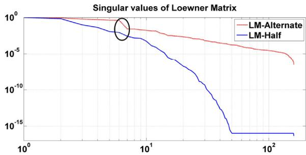  
(a) Singular values

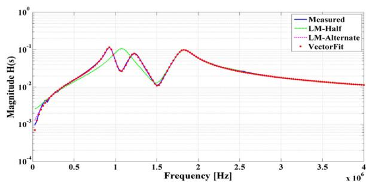  
(b) Frequency Response   
Fig. 1. Test system 1, singular values of xL − L.

The LM approach using half samples data splitting and alternate sample data splitting, as discussed in Section 3.1 Step 1, are denoted by LM-Half and LM-Alternate respectively. The accuracy of the Loewner approach is also compared with the vector fitting. The matrix fitting toolbox1 from the vector fitting web site [21] is used in this study [22,23]. The developed Y-parameter state space models can be easily incorporated into EMTP programs using the techniques presented in [24]. Frequency response data can be obtained from detailed circuit models using frequency scanning techniques [25] or from actual measurements in the field.

# 4.1. Test system 1: measured zero sequence admittance of transformer

Measured zero sequence admittance seen from the low voltage terminals with a resistive network connected to the high voltage terminals of a 11 kV/230 V distribution transformer is considered here. This example is used in [6] for the validation of vector fitting. The singular values of xL − L are shown in Fig. 1(a). The order of the system can be read from the plot corresponding to largest singular value drop. This is one of the unique advantages of LM approach. However, this may not be the true order because of the embedded D and Y∞ matrices. The circled area is where largest drop occurs. The LM-Alternate method shows a very clear drop at order 6 but LMhalf shows a very slight change in the slope. The order of the fitting is selected as 6 for all the three methods. The fitted responses using LM-Half, LM-Alternate and vector fitting are shown in Fig. 1(b). It can be observed that LM-Half failed to fit an accurate model. However, LM-Alternate produced an accurate fitting comparable to the Vector fitting.

# 4.2. Test system 2: Y-matrix of a overhead line

This test system corresponds to a 132 kV three-conductor overhead line of length 12 km. This example is also used in [6]. The 3 × 3 admittance matrix Y(s) is computed with respect to one line end with other line end open circuited. The configuration of the line is shown in Fig. 2(a).

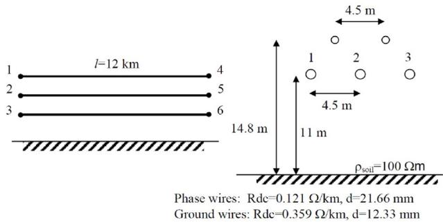

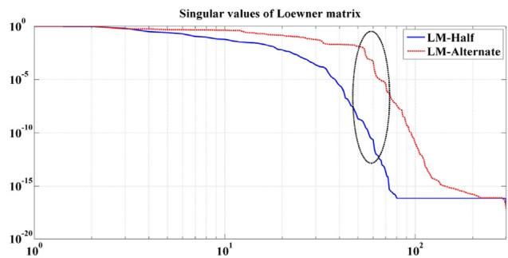  
(a)132kV Transmission Line   
(b） Singular Values  
Fig. 2. Test system 2, singular values of xL − L.

The singular values of xL − L are shown in Fig. 2(b). The order of the system can be read from the plot corresponding to largest singular value drop. The circled area is where largest drop occurs. For distributed parameter models sometimes the singular value drop is not distinguishable [18]. However there will be a gradual slope change that can be observed over a range. In the case of LM-Half, around 45, 50 and 70 a change in slope can be observed. LM-Alternate shows clear drops at orders 55, 60 and 70. This gives an indication of probable order of the system.

The order of fit is selected as 55 for both the approaches and then D and Y∞ are extracted. After extraction the model order is 50 for both the cases. The results of the LM fitting along with the vector fitting of order 50 are shown in Fig. 3(a) for elements Y(1,1) and Y(3,1). It can be observed that the LM-Half failed to fit accurately in the high frequency region. However, the fits of LM-Alternate are accurate and comparable to vector fitting. This shows the influence of data splitting on the accuracy of the model. The alternate sampling gives accurate models because tangential data is distributed over the entire frequency range rather than only at the beginning. For vector fitting mix of linearly spaced and logarithmically spaced poles are used. It takes seven iterations for calculating improved poles and four iterations for column fitting.

Passivity is tested using the condition eig(Re{Y(s)}) > 0 over the entire frequency range [26]. The plots are shown in Fig. 3(b). It can be observed that the LM-Half shows significant passivity violations. However, both the LM-Alternate and Vector fitting show no violations indicating passivity of the model. Passivity is also checked using time domain simulations, for a unit step voltage excitation at port-1 through a 5 resistor with other ports open [24] as shown in Fig. 4(a). The discretization approach proposed in [24] is used to simulate the responses. Simulation time step of 1-s is used. The current response through port 1 is shown in Fig. 4(b). The LM-Half responses are not shown as they are unstable. It can be observed that both vector fitting and LM-Alternate have identical stable responses.

Table 1(a) summarizes the performance of LM approach for Test system 2. The error measures are comparable to vector fitting.

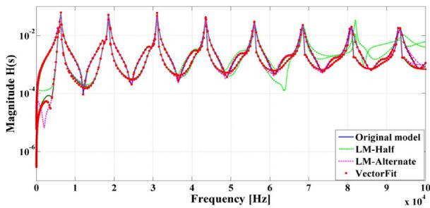  
(a) Frequency response

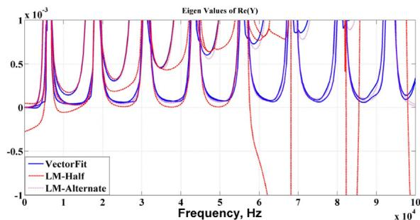  
(b) Eigenvalues   
Fig. 3. Test system 2, frequency response of Y(1,1), Y(3,1) and eigenvalues of Re{Y}.

# 4.3. Test system 3: FDNE of a power distribution system

This test system corresponds to a power system distribution system shown in Fig. 5. The distribution system has two 3-phase buses as terminals (A, B). This example is analyzed in [5]. The 6 × 6 admittance matrix Y(s) with respect to these terminals has been calculated in the frequency range 10 Hz–100 kHz. The terminal admittance matrix Y(s) of the system is fitted with LM and vector fitting approaches.

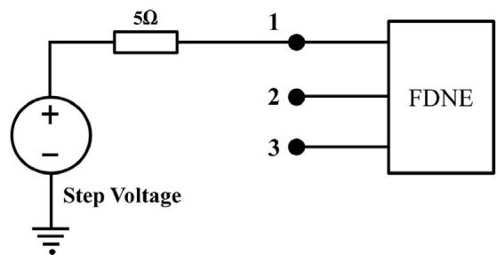  
(a） Voltage Excitation

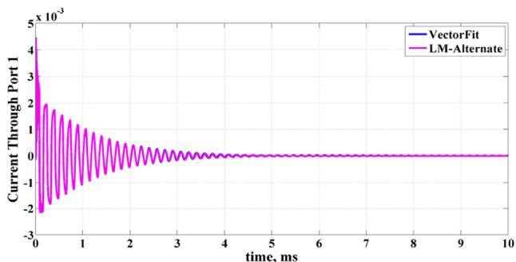  
(b) Current through Port 1   
Fig. 4. Test system 2, time domain simulation using voltage excitation.

Table 1 Comparison of LM and vector fitting, test systems 2–4.   

<table><tr><td>Method</td><td>H2error</td><td>H∞error</td><td>Order</td><td>Passive</td></tr><tr><td colspan="5">(a) Test System 2</td></tr><tr><td>LM-Half</td><td>0.78275</td><td>1.3024</td><td>50</td><td>No</td></tr><tr><td>LM-Alternate</td><td>0.02375</td><td>0.019</td><td>50</td><td>Yes</td></tr><tr><td>Vector Fitting</td><td>0.0377</td><td>0.079</td><td>50</td><td>Yes</td></tr><tr><td colspan="5">(b) Test System 3</td></tr><tr><td>LM-Half</td><td>0.0079</td><td>0.0254</td><td>52</td><td>Yes</td></tr><tr><td>LM-Alternate</td><td>0.0037</td><td>0.0084</td><td>55</td><td>Yes</td></tr><tr><td>Vector Fitting</td><td>0.0002</td><td>0.0022</td><td>50</td><td>Yes</td></tr><tr><td colspan="5">(c) Test System 4</td></tr><tr><td>LM-Half</td><td>1.5167</td><td>7.79</td><td>132</td><td>No</td></tr><tr><td>LM-Alternate</td><td>0.0301</td><td>0.0805</td><td>150</td><td>Yes</td></tr><tr><td>Vector Fitting</td><td>0.0003</td><td>0.0028</td><td>150</td><td>Yes</td></tr></table>

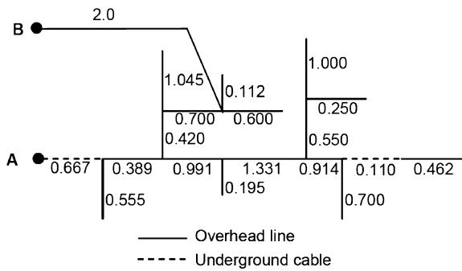  
Fig. 5. Test system 3, power distribution network [5].

The singular values of $x { \mathcal { L } } - \sigma { \mathcal { L } }$ are shown in Fig. 6(a). It can be observed from the figure that the singular values of LM-Half and LM-Alternate show noticeable slope change between 60 and 70.

The LM approach is applied to this system with orders 65 and 70 for LM-Half and LM-Alternate respectively. The fit orders after the D and $Y _ { \mathrm { i n f } }$ extraction are 52 and 55. The results of the fit for Y(1, 1) and Y(5, 1) elements are shown in Fig. 6(b). The figure also contains response of the 50th order model using vector fitting which

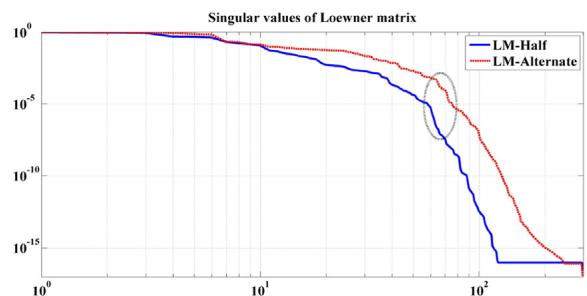  
(a) Singular Values

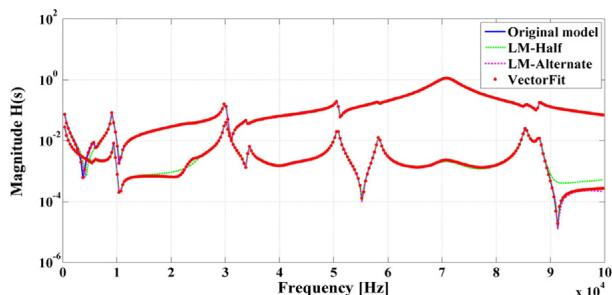  
(b) Frequency Response   
Fig. 6. Test system 3, singular values of xL − L and Frequency response of Y(1,1), Y(5,1).

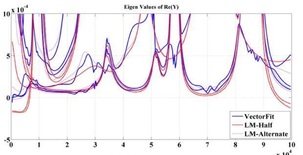  
(a)Eigenvalues

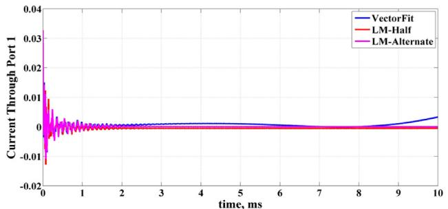  
(b) Current through port1   
Fig. 7. Test system 3, eigenvalues of Re{Y} and current through port 1.

took 7 iterations for improved poles and 4 iterations for column fitting. It can be observed that the LM-Half has better fit compared to previous example. LM-Alternate and Vector fitting fits are very accurate.

The Fig. 7(a) shows the eigenvalues of the real part of the fitted Y-parameter models over the entire frequency range. It can be observed that the LM-Half shows negligible passivity violations at both ends of the spectrum. LM-Alternate and Vector fitting show no violations.

The time domain responses of current through port 1 is shown in Fig. 7(b) for a unit step excitation at port 1 with other ports open. It can be observed that all the responses are stable. Table 1(b) summarizes the performance of various approaches. The LM approach with alternate sample data fitting has $H _ { \infty }$ and $H _ { 2 }$ errors comparable to vector fitting. All the models obtained are passive and stable.

# 4.4. Test system 4: 500 kV transmission network

A 500kV test system shown in Fig. 8 is used to study the switching transient on TL4 when closing CB1. The lower part seen from Bus A is the study zone that is represented in detail. The remaining upper part is considered to be the external zone, which will be replaced by an equivalent. The admittance matrix Y of the test networks external zone is calculated at equidistant 2000 frequency points between 0 Hz and 10 kHz. This example is studied in [10].

The singular values of the Loewner approaches are shown in Fig. 9(a). Significant change in the singular values can be observed in the circled area between 100 and 200. This indicates the probable range for system order. LM approaches are fitted with order 155 and then the $D , Y _ { \infty }$ are extracted. The model orders after extraction for LM-Half is 132 and LM-Alternate is 150. Vector fitting produced an accurate fit with order 150. Here also, Vector fitting takes 7 iterations for poles and 4 iterations for column fitting.

The results of the LM and vector fitting for elements Y(1,1) and Y(2,1) are shown in Fig. 9(b). It can be observed that the LM-Half failed to fit a good model. However, both LM-Alternate and Vector fitting methods fitted accurate models.

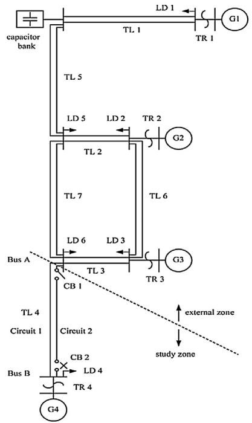  
Fig. 8. Test system 4, 500 kV transmission network.

Real part of the eigenvalues of the fitted models are shown in Fig. 10(a). LM-Half has significant passivity violations. No passivity violations are observed in LM-Alternate and Vector fitting models.

Time domain simulations for a unit step excitation at port 1 with other ports open are also provided in Fig. 10(b). Voltage responses at port 2 are shown. The unstable response of LM-Half is omitted. It can be observed that the responses are stable and similar to each other. The performance of the methods is summarized in Table 1(c). LM-Half has high error measures. The error measures of LM-Alternate are comparable to vector fitting. It can be observed that for the LM-Half, the model orders after the D and $Y ^ { \infty }$ extraction

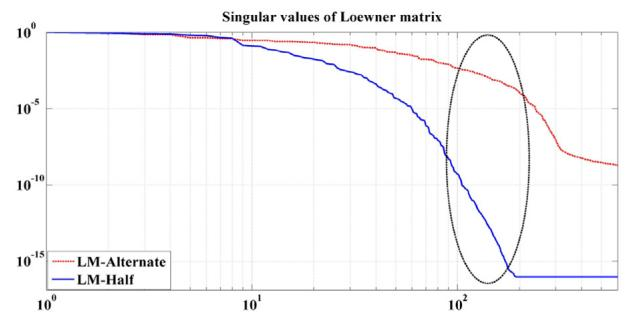  
(a) Singular values

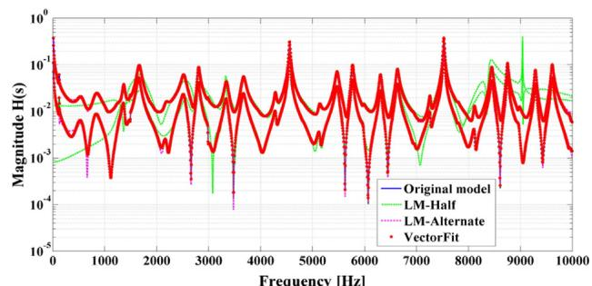  
(b)Frequency Response   
Fig. 9. Test system 4, singular values of $x { \mathcal { L } } - \sigma { \mathcal { L } }$ and frequency response of Y(1,1),Y(2,1).

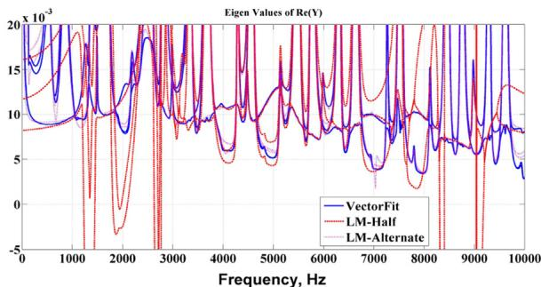  
(a)Eigenvalues

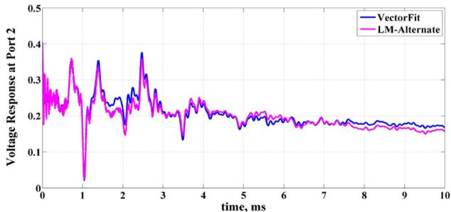  
(b) Voltage at Port 2   
Fig. 10. Test system 4, eigenvalues of Re{Y} and voltage at port 2.

are much less than 150. So the accuracy of LM-Half can be improved by increasing the fit order.

The above examples show the ability of the LM-Alternate method in fitting accurate and stable FDNE models. The noniterative nature of the method allows simple implementation without any convergence issues and doesn’t require starting poles. It provides information about system order. Although only few representative cases are provided, on several FDNE examples LM-Alternate approach has shown consistently accurate results comparable to vector fitting. The order of the system is accurately determined for lumped parameter models whose examples are not shown here. This paper has shown the applicability of Loewner Matrix approach for FDNE modelling of power systems.

# 5. Conclusions

This paper proposed a new technique for FDNE modelling based on tangential interpolation framework using Loewner Matrix pencil. This is a non-iterative approach and has system theoretic interpretation. A matrix implementation is proposed for the formation of Loewner and shifted Loewner matrices which eliminates nested for-loops and solution of Sylvester equations. A MATLAB based stable state space model extraction is also proposed. The proposed method is compared with widely used vector fitting. It is found that the data partitioning approach significantly impacts the accuracy of the LM approach. Splitting the data into odd and even samples (alternate samples) is shown to be accurate. The LM method is comparable to vector fitting in terms of accuracy, stability and passivity. The indication of probable system order, no convergence issues and no starting poles are the unique advantages of the Loewner Matrix approach. The proposed approach is

suitable for transient analysis of (e.g. line energization, switching transients, fault analysis etc.) large power systems involving FDNEs.

# References

[1] U. Annakkage, N. Nair, Y. Liang, A. Gole, V. Dinavahi, B. Gustavsen, T. Noda, H. Ghasemi, A. Monti, M. Matar, R. Iravani, J. Martinez, Dynamic system equivalents: A survey of available techniques, IEEE Trans. Power Deliv. 27 (1) (2012) 411–420.   
[2] W. do Couto Boaventura, A. Semlyen, M. Reza Iravani, A. Lopes, Robust sparse network equivalent for large systems: Part I methodology, IEEE. Trans. Power Syst. 19 (1) (2004) 157–163.   
[3] R. Pintelon, P. Guillaume, Y. Rolain, J. Schoukens, H.V. hamme, Parametric identification of transfer functions in the frequency domain – a survey, IEEE Trans. Autom. Control 39 (11) (1994) 2245–2260.   
[4] A. Ibrahim, Frequency dependent network equivalents for electromagnetic transients studies: a bibliographical survey, Electr. Power Energy Syst. 25 (2003) 193–199.   
[5] D. Deschrijver, B. Gustavsen, T. Dhaene, Advancements in iterative methods for rational approximation in the frequency domain, IEEE Trans. Power Deliv. 22 (3) (2007) 1633–1642.   
[6] B. Gustavsen, A. Semlyen, Rational approximation of frequency domain responses by vector flltlng, IEEE Trans. Power Deliv. 14 (3) (1999) 1052–1061.   
[7] A. Ubolli, B. Gustavsen, Comparison of methods for rational approximation of simulated time-domain responses: ARMA ZD-VF and TD-VF, IEEE Trans. Power Deliv. 26 (1) (2011) 279–288.   
[8] A. Ubolli, B. Gustavsen, Multiport frequency-dependent network equivalencing based on simulated time-domain responses, IEEE Trans. Power Deliv. 2 (27) (2012) 648–656.   
[9] S. Lefteriu, Modeling systems from measurements of their frequency response, Ph. D. thesis, Rice University, 2011.   
[10] T. Noda, Identification of a multiphase network equivalent for electromagnetic transient calculations using partitioned frequency response, IEEE Trans. Power Deliv. 20 (2) (2005) 1134–1142.   
[11] T. Noda, A binary frequency-region partitioning algorithm for the identification of a multiphase network equivalent for EMT studies, IEEE Trans. Power Deliv. 22 (2) (2007) 1257–1258.   
[12] A. Ramirez, Vector fitting-based calculation of frequency-dependent network equivalents by frequency partitioning and model-order reduction, IEEE Trans. Power Deliv. 24 (1) (2009) 410–415.   
[13] I.R. Pordanjani, C.Y. Chung, H.E. Mazin, W. Xu, A method to construct equivalent circuit model from frequency responses with guaranteed passivity, IEEE Trans. Power Deliv. 26 (1) (2011) 400–409.   
[14] W. do Couto Boaventura, A. Semlyen, M.R. Iravani, A. Lopes, Robust sparse network equivalent for large systems: Part ii performance evaluation, IEEE. Trans. Power Syst. 19 (1) (2004) 293–299.   
[15] A. Mayo, A. Antoulas, A framework for the solution of the generalized realization problem, Linear Algebra Appl. 425 (2007) 634–662.   
[16] S. Lefteriu, A.C. Antoulas, A new approach to modeling multiport systems from frequency-domain data, IEEE Trans. Comput.-Aided Des. Integr. Circuits Syst. 29 (1) (2010) 14–27.   
[17] S. Lefteriu, A.C. Ionita, A.C. Antoulas, Modeling Systems Based on Noisy Frequency and Time Domain Measurements, Perspectives in Mathematics System Theory, Control & Significant Process, Springer-Verlag, 2010, pp. 365–378.   
[18] M. Kabir, R. Khazaka, Macromodeling of distributed networks from frequencydomain data using the Loewner matrix approach, IEEE Trans. Microw. Theory Tech. 60 (12) (2012) 3927–3938.   
[19] S. Lefteriu, A.C. Antoulas, Model Reduction for Circuit Simulation, Lecture Notes in Electrical Engineering, Chapter 4. Topics in Model Order Reduction with Applications to Circuit Simulation, Springer, 2011, pp. 85–107.   
[20] Mathworks, MATLAB Control system tool box, R2012b.   
[21] Matrix fitting toolbox1, http://www.sintef.no/vectfit   
[22] B. Gustavsen, A. Semlyen, Rational approximation of frequency domain responses by vector fitting, IEEE Trans. Power Deliv. 14 (3) (1999) 1052–1061.   
[23] B. Gustavsen, Improving the pole relocating properties of vector fitting, IEEE Trans. Power Deliv. 21 (3) (2006) 1587–1592.   
[24] B. Gustavsen, H.M.J.D. Silva, Inclusion of rational models in an electromagnetic transients program: Y-parameters, z-parameters, s-parameters, transfer functions, IEEE Trans. Power Deliv. 28 (2) (2013) 1164–1174.   
[25] W. Neville, A. Jos, Power systems electromagnetic transients simulation, IEE Power Energy Ser. 39 (2003).   
[26] B. Gustavsen, A. Semlyen, Enforcing passivity for admittance matrices approximated by rational functions, IEEE Trans. Power Syst. 16 (1) (2001) 97–104.