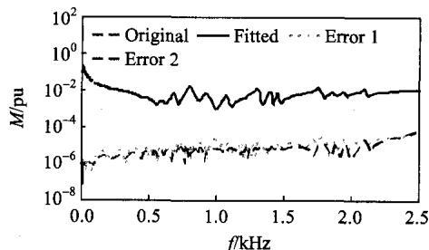
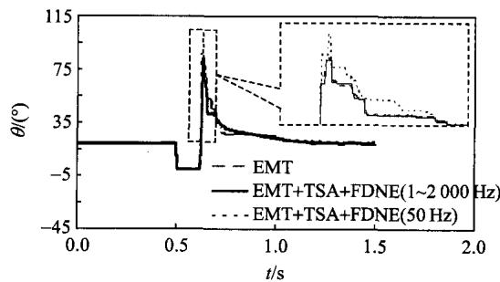

# Frequency Dependent Network Equivalent for Electromagnetic and Electromechanical Hybrid Simulation

ZHANG Yi $^{1}$ , WU Wenchuan $^{1}$ , ZHANG Boming $^{1}$ , Aniruddha M. Gole $^{2}$

(1. Tsinghua University; 2. University of Manitoba)

KEY WORDS: electromagnetic transient; electromechanical transient; frequency dependent network equivalent; passive; vector fitting

The frequency dependent network equivalent (FDNE) can represent not only the fundamental frequency response but also the high frequency response of the network. Thus, it can accommodate the waveform distortion at the interface located in electromagnetic and electromechanical transient hybrid simulation. The FDNE can be described by a mathematical form including $s$ -domain rational functions shown in

$$
y (s) = \sum_ {i = 1} ^ {n} \frac {c _ {i}}{s - a _ {i}} + d + s h \tag {1}
$$

Where, poles $a_{i}$ and residues $c_{i}$ are the real quantities or come in conjugate pair, $d$ and $h$ are the real number, and $n$ is the number of poles.

In this paper, the FDNE is obtained through the following procedures:

1) Acquiring network frequency response samples.

Different types of power system elements are first simplified to obtain the positive, negative, and zero sequence of the node admittance matrices at different frequencies. The three matrices are then converted into a three-phase node admittance matrix, and then reduced to the boundary buses by using standard Gauss elimination.

2) Fitting the FDNE samples into rational functions.

After the samples of the FDNE are obtained, the sum of the element is first fitted to obtain a set of common poles instead of fitting the elements individually by vector fitting and then the common poles are used to fit the elements one by one to make sure all the elements share the same set of poles.

3) Perturbation based passivity enforcement.

The fitted rational functions should be passive to guarantee the stability of simulations. The general

concept is to first detect the frequency boundary of the passivity violations by using a half-size passivity test matrix and then perturb the parameters in Equ. (1) to guarantee its passivity.

The New England IEEE 39-bus system is used to prove the accuracy and merits of the FDNE. The errors ('Error 1' is the error between the original frequency response and the one obtained by vector fitting, and 'Error 2' is the error between the fitted frequency response and one obtained after passivity enforcement) are very small, as shown in Fig. 1(a). Electromagnetic transient (EMT)+transient stability analysis (TSA)+ FDNE $(1\sim 2\mathrm{kHz})$ is much closer to the full EMT simulation than EMT+TSA+FDNE $(50~\mathrm{Hz})$ , which is used to approximate the traditional Norton admittance method as illustrated in Fig. 1(b).

  
(a) Frequency response comparison

  
(b) Advantage of the FDNE   
Fig.1 Results comparison