Received September 7, 2021, accepted September 13, 2021, date of publication September 14, 2021, date of current version September 23, 2021.

Digital Object Identifier 10.1109/ACCESS.2021.3112921

# Damping of Subsynchronous Control Interactions in Large-Scale PV Installations Through Faster-Than-Real-Time Dynamic Emulation

SHIQI CAO 1, (Graduate Student Member, IEEE), NING LIN 2, (Member, IEEE), AND VENKATA DINAVAHI 1, (Fellow, IEEE)

1Electrical and Computer Engineering Department, University of Alberta, Edmonton, AB T6G 2R3, Canada

2Powertech Labs Inc., Surrey, BC V3W 7R7, Canada

Corresponding author: Shiqi Cao (sc5@ualberta.ca)

This work was supported by the Natural Sciences and Engineering Research Council of Canada (NSERC).

ABSTRACT Large-scale photovoltaic (PV) power plant has witnessed a dramatic increase in the integration into transmission and distribution network, manifesting subsynchronous control interaction (SSCI) when the host grid is weak. In this work, the oscillation modes of a typical PV network are analyzed, and a faster-thanreal-time (FTRT) emulation is proposed for predicting the SSCI and consequently mitigating its impacts on AC grid by taking the effective active/reactive power control action. The electromagnetic transient (EMT) simulation is utilized to model the PV panels and converter stations to reflect the actual dynamic process. Meanwhile, the AC grid undergoes transient stability (TS) simulation to obtain a high speed up over real-time, and consequently, a power-voltage interface is adopted for the coexistence of different simulation methods. The reconfigurability and parallelism of the field-programmable gate arrays (FPGAs) enable the EMT-TS coemulation strategy to run concurrently. With a remarkable 122 FTRT ratio, the proposed hardware emulation can provide an effective solution before the SSCI causes serious disruption following its detection. The hardware emulation results are validated by the off-line simulation tool Matlab/Simulink
R and TSAT
R in the DSAToolsTM suite.

INDEX TERMS AC/DC grid, dynamic simulation, electromagnetic transient, faster-than-real-time, fieldprogrammable gate arrays, hardware emulation, parallel processing, predictive control, PV generation.

# I. INTRODUCTION

Due to enhanced environmental standards, worldwide renewable energy installation has witnessed a dramatic increase. Less restricted by geographical conditions and higher flexibility in terms of installation compared with other forms of renewable energies, the solar power system is deemed as one of the most effective solutions to the environmental problem and energy crisis [1]–[3]. Although the integration of photovoltaic (PV) generation systems eases energy demand on the modern power system, their connection to the utility network can lead to grid instability or even failure, if the converters are not properly controlled [4], [5].

In a grid with massive inverter-based renewable generations, subsynchronous resonance (SSR) due to

The associate editor coordinating the review of this manuscript and D approving it for publication was Alon Kuperman

subsynchronous control interaction (SSCI) has become increasingly common [6]. As a phenomenon of resonance between a power electronic device and neighboring series compensated transmission lines [7], the SSCI is distinct from torsional interaction which involves the mechanical system of a synchronous generator [8], and therefore, it may grow more rapidly and subsequently present a severe threat to the security and reliability of the overall power system.

First seen in a doubly-fed induction generator (DFIG) based wind farm in Texas in 2009 [7], tremendous efforts have since been endeavored in mitigating the SSCI in wind farms [9]–[11]. However, the inverter-based photovoltaic (PV) station is not exempted from the same phenomenon and needs investigation. The power generated by large-scale PV farms has to be transmitted over a long distance since the plants are usually far away from load centers. Therefore, the PV source in conjunction with the

transmission links constitutes a weak grid that faces many stability issues, including the SSCI [12]–[16]. Considering that in an interactive network, the oscillations between a PV converter and the line will soon spread to the AC grid, analysis and mitigation of the PV oscillation become crucial in the transient stability analysis.

Among prevalent SSR analysis methods, frequency scanning is an approximate linear method that calculates the equivalent impedance of the whole system seen from the rotor at a specific frequency [17]. Its main drawback is relatively low accuracy, albeit little calculation effort is required. Timedomain simulation and eigenvalue analysis are more suitable for analyzing the SSCI in PV farms [18]. The former method takes the linear and nonlinear characteristics of the system into account, and it provides a variety of time-varying curves that reflect a real SSCI scenario under the circumstance of accurate modeling. Therefore, in this work, a detailed PV inverter is modeled to demonstrate the mechanism of SSCI by both eigenvalue analysis that obtains the oscillation frequencies and time-domain simulation.

Following the eigenvalue analysis of the control system in PV stations, mitigating the potential adverse impacts of SSCI is also a critical part of the proposed work. Traditional SSR mitigation strategies can be classified as: 1) Apply bypass filter [19]; 2) Trip the oscillating lines [20]; 3) Utilize flexible AC transmission systems (FACTS) devices, such as static var compensator (SVC) [21], [22], static synchronous compensator (STATCOM) [23], [24], unified power flow controller (UPFC) [25], and gate-controlled series capacitor (GCSC) [26], [27]; 4) Add a supplementary damping controller in either rotor-side converter (RSC) or grid-side converter (GSC) control loops [28], [29]. The bypass filter is applied for mitigating SSR and maybe effective for mitigating SSCI [8]. However, this solution is expensive at high voltage levels and is less effective at higher frequencies [20]. The bypass filter is applied for mitigating SSR and may be effective for mitigating SSCI. However, this solution is expensive at high voltage levels and is less effective at higher frequencies. Blocking or cutting off the abnormal components may influence the overall stability of the integrated network, further, this strategy may not be effective for mitigating SSCI [8]. The utilization of FACTS devices plays a crucial role in mitigating SSR on the thermal turbine generator connected to the series compensated power systems. The working principle of the FACTS devices is to alert the series compensated factor by the reactive power change. However, the complex control strategies and costs of FACTS devices are the main restrictions of their wide spread deployment.

On the other hand, supplementary damping controller techniques for mitigating SSCI have been reported recently. The controls and parameters have substantial impacts on defining the negative resistance of wind generators, which can significantly damp SSCI. Since the converter controllers are originally designed to compensate currents or voltages at the fundamental frequency, their control capability can

be considerably reduced if they are used to inject the compensation signals only at the concerned subsynchronous frequency instead of fundamental [30]. Meanwhile, for the commissioned large-scale wind farms, it is sophisticated and economically unviable to individually implement the control schemes on the existing converters of diversely located hundreds of WTGs that could be of different make and/or type [31]. It is evident that both the RSC and GSC auxiliary damping controllers are specifically suitable for wind farms. There is not enough literature to support that supplementary damping controller techniques can be applied to photovoltaic power plants. Further, the utilization of FACTS devices or converter-based damping controllers is not an economical solution to mitigate the SSCI in the real-world.

SSCI involves the interactions between a weak transmission system and a power electronics control system (such as HVDC links, SVC, or wind turbine control system) [8]. The SSCI and its mitigation techniques for conventional wind farm systems have been well documented [9], [11], [32], [33], however, not as much literature is available regarding the SSCI phenomenon in the context of series compensated PV farm systems. Due to the inverter and its control system, the PV stations and their neighboring transmission system are a potential source of SSCI. In this work, a hardware-based FTRT emulation is proposed for damping SSCI in PV farms. The integrated voltage source converter (VSC) and PV plant can be treated as a PV-STATCOM, which can realize dynamic active/reactive power control. Therefore, the power injection method for mitigating the SSCI in PV farm is utilized. As mentioned, since the un-damped oscillations of SSCI are purely based on electrical and controller interactions, the SSCI may induce serious damage to the power system. An extremely fast time-domain emulation platform is required to determine the proper power injection values to mitigate the oscillations.

Traditionally, the transient stability simulation is conducted on the CPU-based off-line simulators, such as PSS
R /e, PowerWorld
R , and DSAToolsTM/TSAT
R . However, the CPU-based simulation is implemented sequentially, which is insufficient for real-time control in the energy control center. The reconfigurability of FPGA enables the power system components running in parallel to realize realtime or even FTRT emulation [34], [35]. With the hardware emulation, the energy control center may have sufficient time to select an optimal solution for mitigating the SSCI in PV farm.

The paper is organized as follows: Section II introduces the background of SSCI and the eigenvalue analysis for a typical PV farm and its inverter station. The detailed modeling of the hybrid AC/DC grid components, as well as equivalent PV cell circuits are specified in Section III. Section IV demonstrates the hardware design of the proposed FTRT emulation on FPGA. The FTRT emulation results and power control strategy are validated in Section V. Section VI presents the conclusion and prospective work.

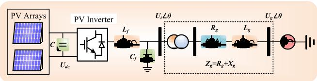  
FIGURE 1. Configuration of a PV plant connected with AC grid.

# II. PV FARM SUBSYNCHRONOUS OSCILLATION ANDEIGENVALUE ANALYSIS

The increasing demand for renewable energy and FACTS devices with voltage source converters (VSCs) induces the potential risk of subsynchronous control interaction. In order to investigate the principle of SSCI in PV farm, eigenvalue analysis is applied and the results are validated in Matlab/Simulink
R .

# A. SUBSYNCHRONOUS CONTROL INTERACTION

The subsynchronous resonance (SSR) is one of the major issues that the traditional power systems encounter [36], and the inclusion of grid-connected VSC and its control system leads the hybrid grid more vulnerable. The IEEE SSR Working Group conducted a general classification of SSR/SSO [37]. SSO including subsynchronous control interaction (SSCI) is defined as the subsynchronous oscillation problems caused by the interaction between the turbine generator and other equipment in the system (VSC, HVDC, variable speed drive converter, etc.).

Usually, large-scale renewable power plants locate far away from the main grid and VSCs are needed. The PV farm SSCI may emerge when a long transmission line is connected, which will influence the overall security and stability of the power system. The AC grid strength is typically described by the short circuit ratio (SCR), which is defined as (1).

$$
S C R = \frac {U _ {N} ^ {2}}{Z _ {g} \cdot S _ {N}}, \tag {1}
$$

where $Z _ { g }$ represents the grid impedance, $U _ { N }$ and $S _ { N }$ refer to the rated grid line voltage and the rated power of PV generation, respectively. A real power transmission system is treated as a weak AC system when SCR is less than 3. According to (1), the PV farm connected with a long transmission line is more likely to be regarded as a weak system due to the large impedance.

# B. STRUCTURE OF PV FARM

Fig. 1 provides the configuration of a PV farm connected with an infinite bus. $U _ { d c }$ is the output DC voltage of the PV station, C refers to the DC filter capacitor, $C _ { f }$ and $L _ { f }$ represent the filter capacitor and inductor of the PV inverter, $R _ { g }$ and $L _ { g }$ are the resistance and inductance of transmission line, $U _ { t }$ and $U _ { g }$ are voltages at the point of common coupling (PCC) and grid voltage, respectively. The detailed PV cell equivalent circuit and the subsequent PV inverter is provided in Fig. 2.

In a typical PV power plant, a large number of PV panels are arranged in an array in order to provide sufficient energy to the inverter. An arbitrary PV array is composed of $N _ { p }$

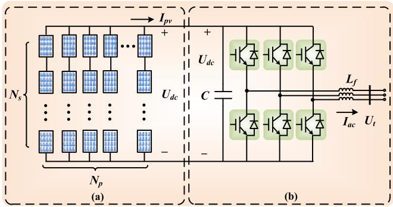  
FIGURE 2. Detailed topology of (a) PV arrays and (b) PV inverter.

parallel strings and each string includes $N _ { s }$ PV panels in series, as shown in Fig. 2 (a). The $I _ { P V } - U _ { d c }$ characteristic can be expressed as following equation [38]:

$$
I _ {P V} = N _ {p} I _ {s} \left[ 1 - C _ {1} \left(e ^ {\frac {U _ {d c}}{C _ {2} N _ {s} U _ {T}}} - 1\right) \right], \tag {2}
$$

where $I _ { s }$ refers to the saturation current, $U _ { T }$ denotes the thermal voltage, $C _ { 1 }$ and $C _ { 2 }$ are constant values. According to Fig. 2 (b) the differential equation related to PV voltage $U _ { d c }$ can be derived as:

$$
U _ {d c} \cdot C \frac {d U _ {d c}}{d t} = U _ {d c} \cdot I _ {P V} - U _ {t d} \cdot I _ {d}, \tag {3}
$$

where $U _ { t d }$ and $I _ { d }$ represent the grid connection point voltage and current in $d { - } q$ frame.

# C. CONTROL SYSTEM OF PV INVERTER

As mentioned, the introduction of VSCs may lead to the SSCI, which is largely dependent on the choice of control parameters and the network strength. A common PV inverter control strategy is provided in Fig. 3, where the signals with superscript ‘*’ are the reference values. Then, the transfer function of the voltage control loop can be expressed as:

$$
\frac {d x _ {1}}{d t} = U _ {d c} - U _ {d c} ^ {*}, \tag {4}
$$

$$
\frac {d x _ {2}}{d t} = K _ {p 1} \cdot \left(U _ {d c} - U _ {d c} ^ {*}\right) + K _ {i 1} \cdot x _ {1} - I _ {d}, \tag {5}
$$

$$
\frac {d x _ {3}}{d t} = U _ {t} - U _ {t} ^ {*}, \tag {6}
$$

$$
\frac {d x _ {4}}{d t} = K _ {p 3} \cdot \left(U _ {t} - U _ {t} ^ {*}\right) + K _ {i 3} \cdot x _ {3} - I _ {q}, \tag {7}
$$

where $x _ { 1 } , x _ { 2 } , x _ { 3 }$ , and x4 are state variables; $K _ { p 1 }$ and $K _ { p 3 }$ refer to the gains of the controllers; $K _ { i 1 }$ and $K _ { i 3 }$ represent the integral coefficients.

Meanwhile, the control system of the PV inverter includes phase locked loop (PLL) to provide the fundamental frequency and phase information of the AC grid, and the differential equations have the following expression:

$$
\frac {d x _ {p l l}}{d t} = U _ {t q}, \tag {8}
$$

$$
\frac {d \theta_ {p l l}}{d t} = K _ {p 4} \cdot U _ {t q} + K _ {i 4} \cdot x _ {p l l} + \omega_ {0}, \tag {9}
$$

where $\theta _ { p l l }$ is the angle produced by PLL.

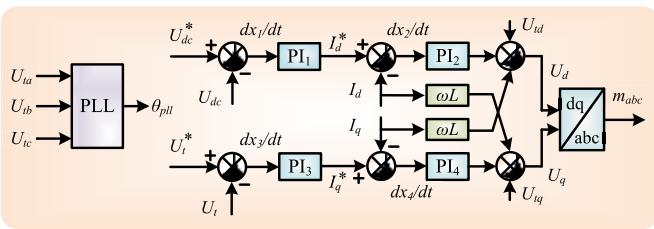  
FIGURE 3. PV inverter controller.

# D. EIGENVALUE ANALYSIS

In power system stability and dynamic assessment, the eigenvalue analysis is commonly used for obtaining the modal frequencies, which can be validated by fast Fourier transform (FFT). As mentioned above, not only the parameters in VSC control system may induce SSCI, the grid strength is an equally important factor to induce oscillations. Take the equivalent circuit given in Fig. 1 for example, the circuit equations can be obtained as:

$$
L _ {g} \frac {d I _ {d}}{d t} = U _ {t d} - U _ {g d} + \omega L _ {g} I _ {q}, \tag {10}
$$

$$
L _ {g} \frac {d I _ {q}}{d t} = U _ {t q} - U _ {g q} - \omega L _ {g} I _ {d}, \tag {11}
$$

In order to calculate the eigenvalues of the proposed system, the differential algebraic equations (DAEs) (3)-(11) should be linearized at the operating point. The calculated state-space equations can be expressed by the following function:

$$
\Delta \dot {x} = \mathbf {A} \cdot \Delta \mathbf {x} + \mathbf {B} \cdot \Delta \mathbf {u}, \tag {12}
$$

$$
\Delta \mathbf {x} = [ \Delta x _ {1}, \Delta x _ {2}, \Delta x _ {3}, \Delta x _ {4}, \Delta x _ {p l l}, \Delta \theta_ {p l l},
$$

$$
\left. \Delta I _ {d}, \Delta I _ {q},, \Delta U _ {d c} \right] ^ {T}, \tag {13}
$$

where 1x denotes the vector of state variables, which is selected as (13), 1u refers to the input quantity, A and B are state-space matrix and input matrix, respectively. For a specific system, the state-space matrix A is constant at the equilibrium point and the eigenvalues can be obtained, along with the FFT results, as listed in Table 1. Meanwhile, the main parameters of the PV power plant are given in Table 3 in the appendix. The calculated mode frequencies are validated by FFT analysis when SSCI occurs in the proposed weak grid, as shown in Fig. 1. The oscillation frequencies are highly dependent on the SCR, e.g. SCR=1.8 in this system. Table 1 indicates that, the oscillation frequency is about $1 2 H z$ from FFT analysis, which is almost the same as one of the modal frequencies (11.8207 Hz) calculated from space-state matrix. Meanwhile, Fig. 4 (a), (b) provide the eigenvalue locus as the SCR varies from 3.5 to 1. The arrows in Fig. 4 refer to decreasing grid stiffness, which indicates that $\lambda _ { 1 } , \lambda _ { 8 }$ , and $\lambda _ { 9 }$ change slightly, $\lambda _ { 2 } , \lambda _ { 3 } , \lambda _ { 4 }$ , and $\lambda _ { 7 }$ move further to the left, while $\lambda _ { 5 } .$ , and $\lambda _ { 6 }$ move to the right-half plane (unstable region) eventually. Therefore, the SSCI is more likely to occur in a weaker grid.

Furthermore, the relation between factors such as varying PI parameters and PLL control parameters and SSCI can be

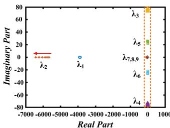

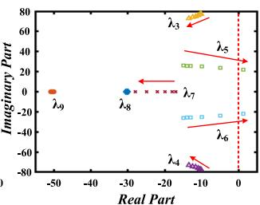

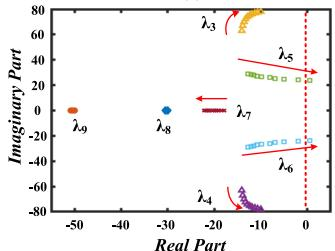  
(a)   
(c)

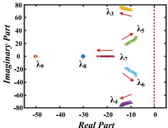  
(@)   
FIGURE 4. Eigenvalue locus: (a) eigenvalue locus for varying SCR, (b) zoomed-in plots for varying SCR, (c) eigenvalue locus for varying $\kappa _ { p _ { \mathrm { - } } p { \prime } I } .$ , (d) eigenvalue locus for varying $\kappa _ { i _ { \mathrm { \Delta } } , p I I }$ .

TABLE 1. Eigenvalues of the PV system.   

<table><tr><td colspan="2">Eigenvalues</td><td>Frequency (Hz)</td><td>Mode</td></tr><tr><td colspan="2">-3887.07127</td><td>0</td><td>1</td></tr><tr><td colspan="2">-5772.03268</td><td>0</td><td>2</td></tr><tr><td colspan="2">-12.6235382 ± 74.2719266i</td><td>11.8207</td><td>3,4</td></tr><tr><td colspan="2">-8.5620138 ± 25.3479526i</td><td>4.034</td><td>5,6</td></tr><tr><td colspan="2">-20.4770033</td><td>0</td><td>7</td></tr><tr><td colspan="2">-30.0851799</td><td>0</td><td>8</td></tr><tr><td colspan="2">-50.4943053</td><td>0</td><td>9</td></tr><tr><td>Frequency (Hz)</td><td>Percentage (%)</td><td>Frequency (Hz)</td><td>Percentage (%)</td></tr><tr><td>6</td><td>0.93</td><td>14</td><td>2.72</td></tr><tr><td>8</td><td>1.42</td><td>16</td><td>1.44</td></tr><tr><td>10</td><td>3.13</td><td>18</td><td>1.08</td></tr><tr><td>12</td><td>4.91</td><td>60</td><td>100.00</td></tr></table>

analyzed using the eigenvalues. The eigenvalue results of various PI parameters and PLL control parameters are calculated and analyzed. It shows that the PLL control parameters (especially the proportional gain) have a significant impact on the damping characteristic of the system. Therefore, the eigenvalue locus for various PLL control parameters is given in Fig. 4 (c), (d). The SSCI in the PV plants could be also induced by the PLL control parameters, the eigenvalue locus of the PLL proportional gain varying from 100 to 10 (indicated by the direction of the arrows) is given in Fig. 4 (c), where the SCR is fixed at 1.8. It indicates that the $\lambda _ { 3 } , \lambda _ { 4 } ,$ , $\lambda _ { 5 } ,$ , and $\lambda _ { 6 }$ move further to the right as $K _ { p \_ p l l }$ decreases, while $\lambda _ { 7 }$ moves towards the left-half plane. The system becomes unstable when $K _ { p _ { - } p l l } = 1 0$ , since $\lambda _ { 5 }$ and $\lambda _ { 6 }$ are located in the unstable region. Meanwhile, the eigenvalue locus for varying $K _ { i \_ p l l }$ is also provided in Fig. 4 (d), where the SCR and $K _ { p \_ p l l }$

are fixed at 1.8 and 50, respectively. As $K _ { i \_ p l l }$ increases from 500 to 1500, although $\lambda _ { 5 }$ and $\lambda _ { 6 }$ move towards the unstable side, the system is still stable when $K _ { i \_ p l l } = 1 5 0 0$ . As a result, decreasing the grid strength and the proportional gains of PLL controller would reduce the system damping significantly.

# III. MODELING OF AC/DC GRID

# A. TRANSIENT STABILITY EMULATION

The transient stability simulation is applied to the hardware emulation of AC grid since its electrical models possess low latency. Transient stability simulation basically solves a set of differential equations (14) which describe the dynamic process of the synchronous machines. Meanwhile, network components such as transmission lines and loads contribute to the algebraic equations (15) which solve the bus voltages and current in the AC grid [40].

$$
\frac {d \mathbf {x}}{d t} = F (\mathbf {x}, \mathbf {u}, t), \tag {14}
$$

$$
G (\mathbf {x}, \mathbf {u}, t) = 0, \tag {15}
$$

where x denotes the vector of state variables in the synchronous generator, and the input vector u represents the generator voltages. The DAE is initialized as:

$$
\mathbf {x} _ {0} = \mathbf {x} \left(t _ {0}\right). \tag {16}
$$

Solving the DAEs is the most time-consuming part of emulating AC grid, where numerical integration methods largely classified as explicit and implicit can be applied. The latter is essentially iterative methods which have higher accuracy under large time-steps, whereas its counterpart is more efficient and requires lower hardware resource in small time-steps. Following a trade-off between accuracy and emulation speed, the $4 ^ { t h }$ -order Runge-Kutta (RK4) is utilized in hardware emulation, as given below [41]:

$$
R K _ {1} = d t \cdot f \left(t _ {n}, x _ {n}\right), \tag {17}
$$

$$
R K _ {2} = d t \cdot f \left(t _ {n} + \frac {d t}{2}, x _ {n} + \frac {R K _ {1}}{2}\right), \tag {18}
$$

$$
R K _ {3} = d t \cdot f \left(t _ {n} + \frac {d t}{2}, x _ {n} + \frac {R K _ {2}}{2}\right), \tag {19}
$$

$$
R K _ {4} = d t \cdot f \left(t _ {n} + d t, x _ {n} + R K _ {3}\right), \tag {20}
$$

$$
x _ {n + 1} = x _ {n} + \frac {1}{6} \left(R K _ {1} + 2 R K _ {2} + 2 R K _ {3} + R K _ {4}\right), \tag {21}
$$

where $x _ { n }$ refers to the state variables of the synchronous generator, dt is the emulation time-step, which is defined as 5 ms in transient stability emulation.

# 1) SYNCHRONOUS GENERATOR MODELING

A detailed 5-mass synchronous machine model with control system is represented as the differential equation (14) which contains 9 state variables [42]. The mechanical equations and rotor electrical equations with 2 windings on the d-axis and 2 damping windings on the q-axis are given below:

$$
\frac {d \delta}{d t} = \omega_ {R} \cdot \Delta \omega (t), \tag {22}
$$

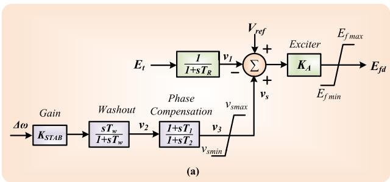

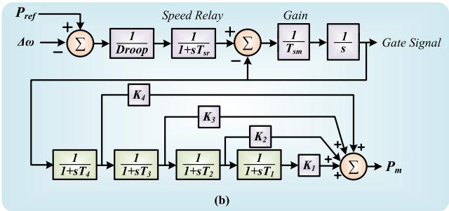  
FIGURE 5. Synchronous generator control systems: (a) AVR and PSS, (b) governor.

$$
\frac {d \Delta \omega}{d t} = \frac {1}{2 H} \left[ T _ {e} (t) + T _ {m} (t) - D \cdot \Delta \omega (t) \right], \tag {23}
$$

$$
\frac {d \psi_ {f d}}{d t} = \omega_ {R} \cdot \left[ e _ {f d} (t) - R _ {f d} i _ {f d} (t) \right], \tag {24}
$$

$$
\frac {d \psi_ {1 d}}{d t} = - \omega_ {R} \cdot R _ {1 d} i _ {1 d} (t), \tag {25}
$$

$$
\frac {d \psi_ {1 q}}{d t} = - \omega_ {R} \cdot R _ {1 q} i _ {1 q} (t), \tag {26}
$$

$$
\frac {d \psi_ {2 q}}{d t} = - \omega_ {R} \cdot R _ {2 q} i _ {2 q} (t), \tag {27}
$$

where δ and 1ω represent the rotor angle and derivative of angular velocity, respectively. The automatic voltage regulator (AVR) and power system stabilizer (PSS) are given in Fig. 5 (a), and the differential equations are given as:

$$
\frac {d v _ {1}}{d t} = \frac {1}{T _ {R}} \cdot \left[ v _ {t} (t) - v _ {1} (t) \right], \tag {28}
$$

$$
\frac {d v _ {2}}{d t} = K _ {\text {s t a b}} \cdot \Delta \dot {\omega} (t) - \frac {1}{T _ {\omega}} v _ {2} (t), \tag {29}
$$

$$
\frac {d v _ {3}}{d t} = \frac {1}{T _ {2}} \cdot \left[ T _ {1} \dot {v} _ {2} (t) + v _ {2} (t) - v _ {3} (t) \right]. \tag {30}
$$

Meanwhile, a governor with four-stage steam turbine is included in the control system of the synchronous machine model, as given in Fig. 5 (b). The output mechanical power $( P _ { m } )$ has a low sensitivity to time-step. In order to reduce the computational burden, governor system equations are calculated by Forward Euler, which are not included in the $9 ^ { t h } .$ -order DAEs.

# B. EQUIVALENT CIRCUIT OF PV CELLS

In order to reveal the dynamic process of the subsynchronous transient, the electromagnetic transient (EMT) simulation is utilized for the PV cells and the corresponding inverter

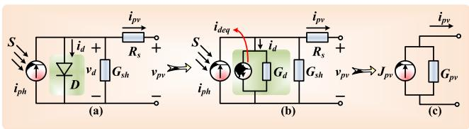  
FIGURE 6. PV cell model: (a) equivalent circuit, (b) diode discretized circuit, and (c) two-node EMT model.

station. The equivalent circuit of a PV unit is provided in Fig. 6 (a), which consists of the irradiance-dependent current source, an anti-parallel diode as well as shunt and series resistors. The working principle of the irradiance dependent current source is given as [43]:

$$
i _ {p h} = \frac {S}{S _ {r e f}} \cdot i _ {r e f} \left(1 + \alpha_ {T} \cdot \left(T _ {k} - T _ {r e f}\right)\right), \tag {31}
$$

where the variables with subscription ref are reference values, S refers to the solar irradiance, αT denotes the temperature coefficient, and $T _ { k }$ is the environment temperature. In hardware emulation, the nonlinear component, anti-parallel diode is linearized using partial derivatives for EMT emulation, as shown in Fig. 6 (b). The equivalent conductance and current which represents the nonlinear diode are expressed as:

$$
G _ {d} = \frac {I _ {s}}{V _ {T}} \cdot e ^ {\frac {v _ {d}}{V _ {T}}}, \tag {32}
$$

$$
i _ {d e q} = i _ {d} - G _ {d} v _ {d}, \tag {33}
$$

where $I _ { s }$ and $V _ { T }$ are the saturation current and thermal voltage, respectively. The fact that all the components in the PV cell equivalent circuit implies that the PV cell can be expressed by current sources and resistors. The PV unit can be further simplified into two-node EMT model by Norton’s theorem, as shown in Fig. 6 (c), where

$$
J _ {p v} = \frac {I _ {p h} - i _ {d e q}}{G _ {d} R _ {s} + R _ {s} G _ {s h} + 1}, \tag {34}
$$

$$
G _ {p v} = \frac {G _ {d} + G _ {s h}}{G _ {d} R _ {s} + R _ {s} G _ {s h} + 1}. \tag {35}
$$

# C. EMT AND TRANSIENT STABILITY CO-EMULATION INTERFACE

The integrated AC/DC grid with PV farm is given in Fig. 7, where the four-terminal (4-T) HVDC system is connected with IEEE 39-bus system at Bus 20 and Bus 39 for delivering extra active or reactive power to the AC grid, while the PV farm with a capacity of 400 MW is connected directly to the AC grid at Bus 39 through a long transmission line, which is represented as the blue circle in Fig. 7 (a). MMC 1 and MMC 2 act as rectifier stations, while MMC 3 and MMC 4 are treated as inverter stations. For effective coordination of the various emulation strategies, the interface between EMT and transient stability co-emulation should be designed properly.

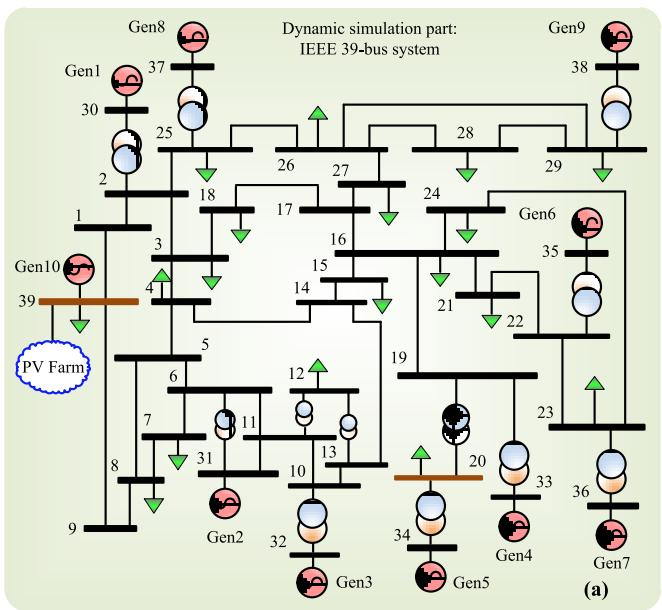

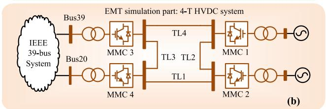

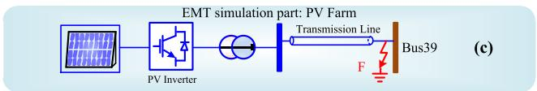  
FIGURE 7. Topology of the integrated AC/DC grid with PV farm: (a) IEEE 39-bus system, (b) four terminal (4-T) HVDC system, (c) PV farm and its inverter station.

# 1) DATA SYNCHRONIZATION

The PV arrays as well as VSC stations can be treated as timevarying $P { + } j Q$ loads from the AC side point of view, which means both of the P and Q values are updated in every timestep to maintain the emulation accuracy. The power injection of the MMC stations can be derived as (36) and introduced into the admittance matrix,

$$
Y = \frac {\left(P _ {m m c} + j \cdot Q _ {m m c}\right)}{V _ {B u s} ^ {2}}. \tag {36}
$$

Meanwhile, the instantaneous voltages represented by a combination of amplitude U and phase angle θ at PCC are the inputs of the EMT simulation. The data synchronization of the AC/DC interface is simultaneous, i.e., the output time-varying P+jQ loads calculated from MMC stations are delivered to the AC gird and solved together with the admittance matrix. After solving the network equations, the resulting PCC bus phase voltages U6 θ are in turn sent to the control systems of MMC stations.

# 2) TIME-STEP SYNCHRONIZATION

As mentioned above, a time-step of 5 ms is applied on the transient stability emulation of the IEEE 39-bus system, while

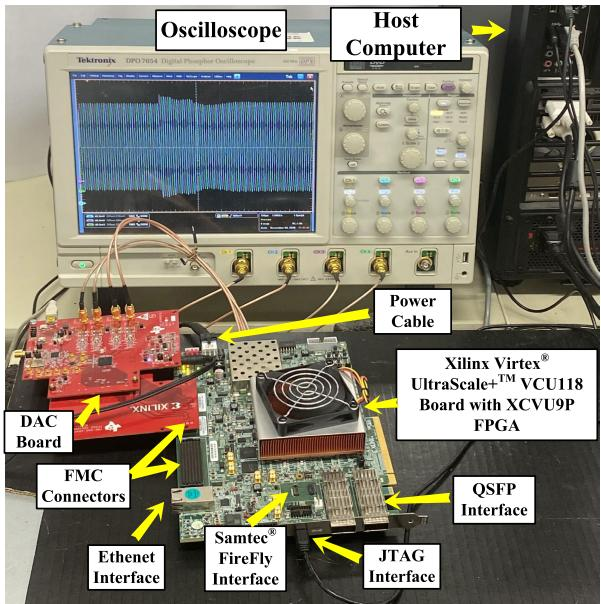  
FIGURE 8. Hardware setup for FTRT emulation.

the 4-T HVDC system, as well as PV farms adopt EMT emulation with the time-step of 200 µs. The emulation goes forward only when the time instant of all subsystems exceed the global time-step. In the proposed testing system, the DC system is calculated 25 times individually until it reaches the same time instant of AC grid. Then the DC system sends the instantaneous P+jQ values to the AC grid, and the calculated PCC voltages U6 θ are delivered to the control systems of MMC stations.

# IV. FTRT EMULATION ON FPGA

The hardware emulation of the hybrid AC/DC grids with PV installation was conducted on Xilinx Virtex
R UltraScale+TM VCU118 board containing XCVU9P FPGA, which includes 1182240 look-up tables (LUTs), 2364480 flip-flops (FFs), and 6840 DSP slices. The abundant hardware resources enable the large-scale AC/DC grid to be emulated on FPGA board. The reconfigurability of FPGA, i.e., enables programming hardware according to the application, allows the hardware resources can be adjusted to accommodate and represent a practical system, and results in each component or subsystem could be designed as a hardware module. After linking the hardware modules properly, the integrated AC/DC grid can be executed on the hardware.

# A. FTRT EMULATION PLATFORM

Fig. 8 provides the hardware setup for the FTRT emulation. The initial conditions as well as the functions which represent the AC/DC grid are downloaded from the host computer via the JTAG (Joint Test Action Group) interface, then the hardware-in-the-loop (HIL) emulation can be achieved in the FPGA board. Meanwhile, the Xilinx Virtex
R UltraScale+TM VCU118 board is equipped with three high-speed real-time communication interfaces for data transfer, which are QSFP

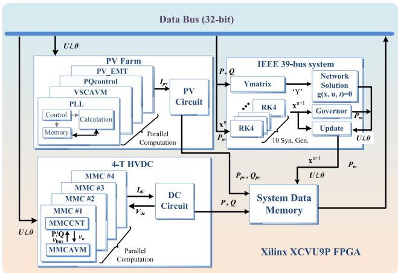  
FIGURE 9. Block design for FTRT emulation.

(Quad Small Form-factor Pluggable), Samtec
R FireFly and Ethernet interfaces. The received current operation conditions will be delivered to the relative hardware module. In practical, both of the QSFP and Samtec
R FireFly interfaces provide up to 4×28 Gbps bidirectional data communication speed, which are widely utilized for receiving current operation conditions from a real power control center or other FPGA boards. Due to the relatively slow transmission speed, the Ethernet interface is treated as the backup solution for data communication. With the emulation functions downloaded from the host computer and the real-time condition signals, the hardware emulation can go forward in time domain. The output of the FPGA is digital data, which is inconvenient for following analysis. The VCU118 FPGA board provides the FMC interface to connect the digital-toanalog converter (DAC) board, so that the output signals can be displayed on the oscilloscope.

# B. HARDWARE DESIGN PROCESS

Recently, Xilinx Vivado
R toolset provided the high-level synthesis (HLS) tool to shorten the design cycle, which enables designing hardware modules by coding in C/C++. After synthesis in the HLS tool, each circuit part written in C++ program generates an IP core for block design. The hardware block diagram along with the data steam is given in Fig. 9, where each block represents an IP core generated by HLS
R . The discretized differential equations are calculated by RK4. Due to the fully independent state variables, the ten generators in IEEE 39-bus system can be solved in parallel. The calculated admittance matrix Y and state variables $x ^ { n + 1 }$ are delivered to Network and Governor, respectively. The 4-T HVDC system mainly involves three concurrently computed modules: the MMC average value model (AVM), its controller (CNT), and the DC grid network. The only signal that the transient stability simulation needs from the HVDC system is the dynamic active and reactive power, which are calculated in the DC grid and converted into the admittance matrix according to the PCC voltages.

TABLE 2. Specifics of major AC/DC grid hardware modules.   

<table><tr><td>Module</td><td>BRAM</td><td>DSP</td><td>FF</td><td>LUT</td><td>Latency</td></tr><tr><td>PQcontrol</td><td>0</td><td>22</td><td>3497</td><td>8418</td><td>32 Tclk</td></tr><tr><td>PVEMT</td><td>0</td><td>19</td><td>3329</td><td>11493</td><td>39 Tclk</td></tr><tr><td>VSCAVM</td><td>0</td><td>33</td><td>4489</td><td>9447</td><td>41 Tclk</td></tr><tr><td>PVCircuit</td><td>0</td><td>1109</td><td>112733</td><td>127455</td><td>119 Tclk</td></tr><tr><td>PLL</td><td>0</td><td>8</td><td>892</td><td>1357</td><td>18 Tclk</td></tr><tr><td>MMCCNT</td><td>0</td><td>54</td><td>5733</td><td>11085</td><td>85 Tclk</td></tr><tr><td>MMCAVM</td><td>16</td><td>208</td><td>8292</td><td>19277</td><td>90 Tclk</td></tr><tr><td>DCGrid</td><td>0</td><td>17</td><td>2209</td><td>2868</td><td>73 Tclk</td></tr><tr><td>YMatrix</td><td>12</td><td>1045</td><td>123388</td><td>126767</td><td>1470 Tclk</td></tr><tr><td>RK4</td><td>0</td><td>36</td><td>6970</td><td>7520</td><td>83 Tclk</td></tr><tr><td>Network</td><td>16</td><td>534</td><td>43928</td><td>57664</td><td>269 Tclk</td></tr><tr><td>Governor</td><td>0</td><td>17</td><td>3783</td><td>4598</td><td>29 Tclk</td></tr><tr><td>Update</td><td>0</td><td>38</td><td>4951</td><td>6875</td><td>33 Tclk</td></tr><tr><td>Total</td><td>92</td><td>4454</td><td>465217</td><td>603576</td><td>1692 Tclk</td></tr><tr><td></td><td>2.13%</td><td>65.12%</td><td>19.68%</td><td>51.05%</td><td>-</td></tr><tr><td>XCVU37P</td><td>4320</td><td>6840</td><td>2364480</td><td>1182240</td><td>-</td></tr></table>

Meanwhile, the PV Farm also requires the PCC voltage for PLL module and provides the time-varying P+jQ load to IEEE 39-bus system. The external data exchange mechanism of PV Farm is the same as that of 4-T HVDC system.

Table 2 gives the latencies and hardware resource utilization of the proposed integrated AC/DC system. The PV stations are fully parallelized except the PVCircuit part, and therefore, the total latency can be calculated as $4 1 + 1 1 9 =$ $1 6 0 T _ { c l k }$ . Under an FPGA clock cycle of 10ns, the FTRT ratio can be expressed as $\frac { 2 0 0 \mu s } { 1 6 0 \times 1 0 n s } = 1 2 5$ . Similarly, due to the parallelism, with the EMT emulation time-step of 200µs the FTRT ratio of the 4-T HVDC system is over 200µs(90+73)×10 ns $\begin{array} { r l r } { \mathrm { ~ } } & { { } } & { \frac { - 2 0 0 \mu s } { ( 9 0 + 7 3 ) \times 1 0 n s } = } \end{array}$ 122. Meanwhile, the estimated latency in a transient stability time-step is $1 4 7 0 + 2 6 9 + 3 3 = 1 5 2 9 T _ { c l k }$ , where YMatrix and RK4 should be synchronized, and the maximum latency of parallel parts is chosen. According to the proposed coemulation interface, although the FTRT ratio of $\frac { 5 \ m s } { 1 5 2 9 \times 1 0 \ n s } =$ 327 can be reached in the AC grid, the overall FTRT ratio of the hybrid AC/DC grid is dependent on the EMT emulation parts, which is about 122 times faster than real-time. With more than 122 FTRT ratio, the power control center has sufficient time to predict the adverse impacts, take remedial actions, or decide an optimal power injection solution for damping SSCI.

# C. DESIGN PROCESS FOR DAMPING SSCI

The proposed FTRT emulation can be utilized by the power control center in a real power transmission system, as given in Fig. 10. Once the SSCI occurs and is detected, the peripheral devices delivered the recorded data to the FPGA boards running a virtual grid via the high-speed interfaces of the FPGA board, including QSFP, Samtec
R FireFly, and Ethernet interfaces. Meanwhile, in the control center, there could be several power injection scenarios being emulated in the FTRT hardware platforms. With a 122 FTRT ratio, the control center has sufficient time to come up with an optimum solution that helps maintain the synchronism of the generators and mitigate the SSCI, such as those shown in

  
FIGURE 10. Design process of the FTRT emulation for mitigating SSCI.

the manuscript. In addition to determining the proper power that should be delivered by the HVDC and PV stations by scanning a wide power range on the FTRT hardware, other control actions and the consequent system response could also be simulated simultaneously on the boards in the control center. However, it should be pointed out that since the focus of this work is to demonstrate how FTRT being developed and used to maintain a stable system, only an effective solution is demonstrated, and other control actions that are unable to stabilize the system will be automatically disregarded. The sufficient margin over real-time, i.e., the high FTRT ratio, leaves the control center enough time to predict the impact of a remedial action following a contingency as well as make an optimal decision.

# V. FTRT EMULATION RESULTS AND VALIDATION

The subsynchronous oscillation and its mitigation strategy are emulated in the FTRT platform, and the results are validated by the Matlab/Simulink
R and the off-line transient stability simulation tool $\mathrm { T S A T ^ { \mathbb { Q } } }$ in the DSAToolsTM suite.

# A. CASE 1

In steady state, the PV farm delivers 287 MW active power and 170 MVar reactive power to the AC grid, the total inductance of the AC transmission line is 0.1 H and the system is stable. At the time of 1 s, fixed the inductance to 1.1 H , the oscillation occurs, as shown in Fig. 11 (a), (c), and (e). Fig. 11 (a) and (c) imply that the oscillation frequency is below 60 Hz, which means the oscillation is in subsynchronous mode. Fig. 11 (e) indicates that the PV farm SSCI is diverging, which may cause serious impacts on the generator shaft if it spreads to the AC grid. In order to limit the disturbances caused by SSCI, the power control center should take remedial actions immediately.

In this work, PV farm with VSC stations has the ability of dynamically changing active/reactive power, which has similar effects with FACTS devices. Meanwhile, with the introduction of FTRT emulation, the power control center has sufficient time to decide an optimal solution before the SSCI causes more disruption. At t=1.09 s, PV farm provides extra 48 MW active power to AC grid and reduces the reactive power to 75 MVar, as shown in Fig. 11 (f). After

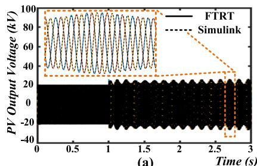

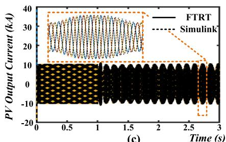

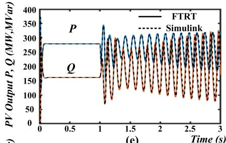

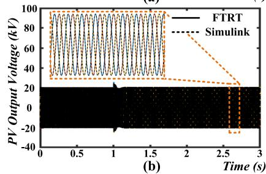

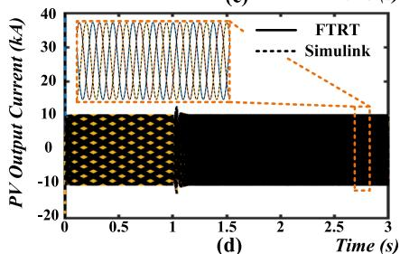

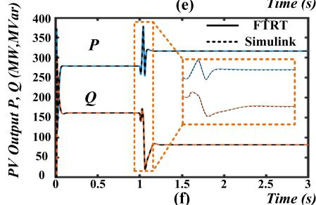  
FIGURE 11. FTRT emulation results: (a) PV voltage under SSCI, (b) PV voltage after FTRT power control strategy, (c) PV current under SSCI, (d) PV current after FTRT power control strategy, (e) active/reactive power output under SSCI, and (f) active/reactive power output after FTRT power control strategy.

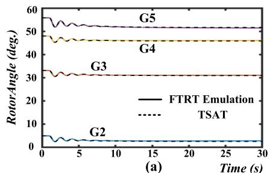

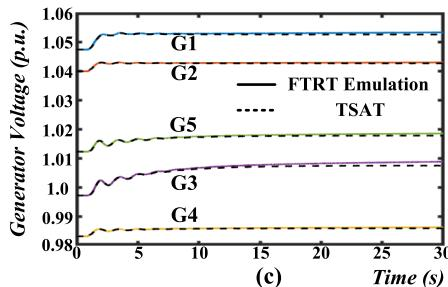

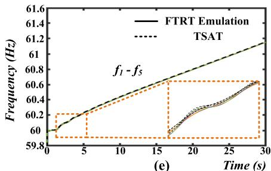

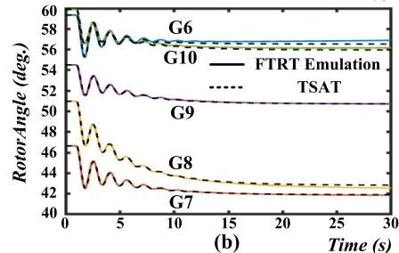

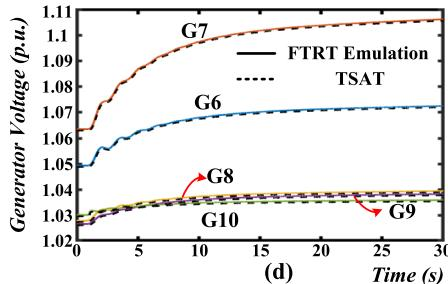

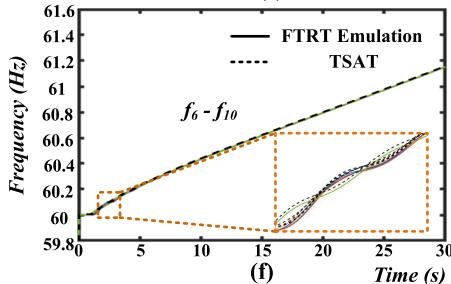  
FIGURE 12. The impacts on the AC grid after power injection: (a) generator relative rotor angles (G1-G5), (b) generator relative rotor angles (G6-G9), (c) generator voltages (G1-G5), (d) generator voltages (G6-G10), (e) frequencies (G1-G5), and (f) frequencies (G6-G10).

changing the power injection, the output voltage and current of the PV station restored stable. Meanwhile, the zoomedin plots in Fig. 11 prove that the proposed FTRT hardware implementation method is as accurate as the EMT simulation in Matlab/Simulink
R .

Although the power injection method can mitigate the SSCI in PV farm and the integrated weak grid significantly, the extra power may cause instability of the integrated AC gird, as given in Fig. 12. Due to the power injection from the PV farm, the rotor angles and voltages of the synchronous generators start to oscillate and then stabilize in a new state, as shown in Fig. 12 (a)-(d). However, the abnormal power injection causes the instability of the generator frequency,

which cannot be restored. As can be seen in Fig. 12 (e)-(f), the frequency keeps rising, and eventually it is far beyond the maximum 1% threshold. The integration of the 4-T HVDC system increases the overall stability by changing the inverter’s active power from 400 MW to 300 MW at around 5 s, it lasts until the frequency is recovered to 60 Hz at t=9.5 s, as Fig. 13 (e)-(f) shows. Meanwhile, the output voltages and rotor angles of the generators, as expected, restore to the previous state given in Fig. 13 (a)-(d).

# B. CASE 2

In this case, series compensator is used for reducing the voltage drop and maintaining system stability since the

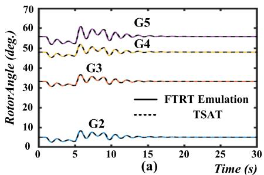

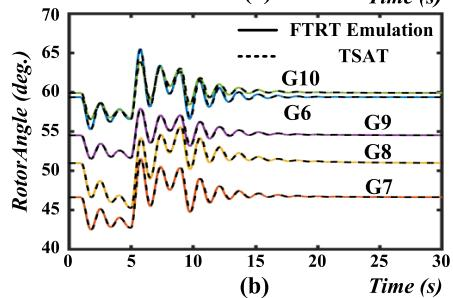

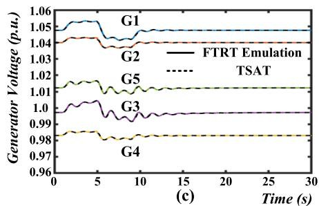

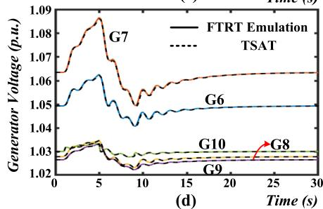

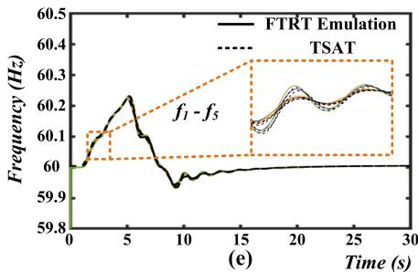

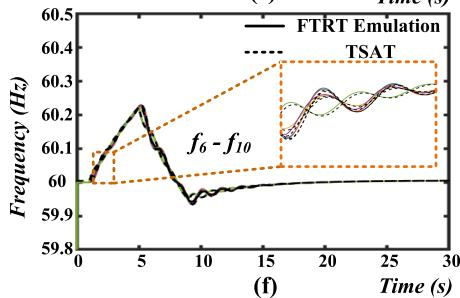  
FIGURE 13. FTRT based predictive control for power system stability analysis: (a) generator relative rotor angles (G1-G5), (b) generator relative rotor angles (G6-G9), (c) generator voltages (G1-G5), (d) generator voltages (G6-G10), (e) frequencies (G1-G5), and (f) frequencies (G6-G10).

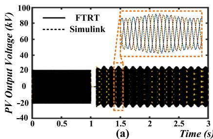

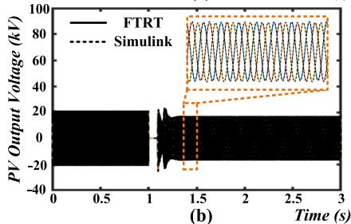

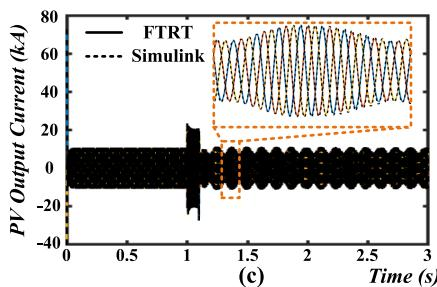

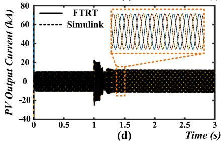

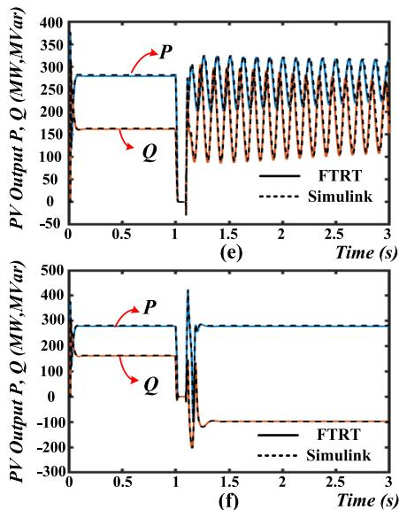  
FIGURE 14. FTRT emulation results and validation: (a) PV voltage under three-phase-to-ground fault, (b) PV voltage after power control strategy, (c) PV current under three-phase-to-ground fault, (d) PV current after power control strategy, (e) active/reactive power in PV farm under three-phase-to-ground fault, and (f) active/reactive power in PV farm after power control strategy.

impedance cannot be ignored in a long transmission line, which may also induce the PV SSCI after the occurrence of a serious disturbance. At the time of 1 s, a three-phaseto-ground fault lasting 90 ms happens at the remote end of the transmission line (near Bus 39) in PV farm, where the transmission line is 65% compensated. Fig. 14(a), (c), and (e) indicate that SSCI emerges in PV farm after the fault is cleared. The FTRT emulation platform equipped in the energy control center forecasts different scenarios and then adopts a proper active/reactive power injection strategy to mitigate the SSCI induced by the series compensator. At t=1.09 s, the PV farm begins to change the output reactive

power from 170 MVar to −100 MVar, as given in Fig. 14 (f). With the reactive power control, the output voltage and current maintain stable as shown in Fig. 14 (b) and (d). math Although the PV farm absorbs reactive power for mitigating SSCI, the impacts after the reactive power change will not induce significant disturbance in IEEE 39-bus system since active power remain stable. The instability of the bus voltages, current and frequencies in AC grid can be damped by the exciter and governor system of synchronous machine, as given in Fig. 15. The integrated 4-T HVDC maintains the same power injection values as before the fault. Based on the emulation results, the power control strategy is able to

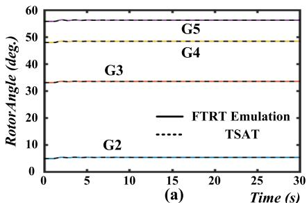

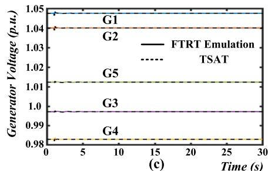

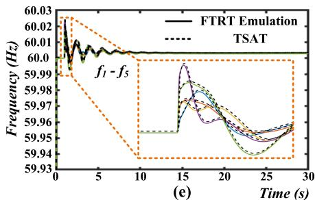

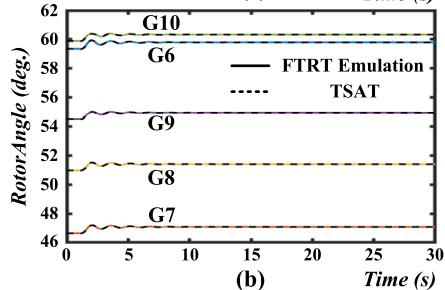

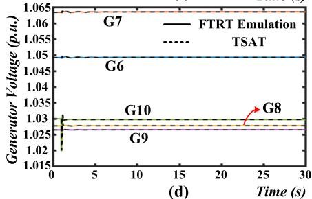

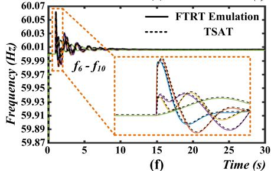  
FIGURE 15. FTRT emulation results and validation: (a) generator relative rotor angles (G2-G5), (b) generator relative rotor angles (G6-G9), (c) generator voltages (G1-G5), (d) generator voltages (G6-G10), (e) frequencies (G1-G5), and (f) frequencies (G6-G10).

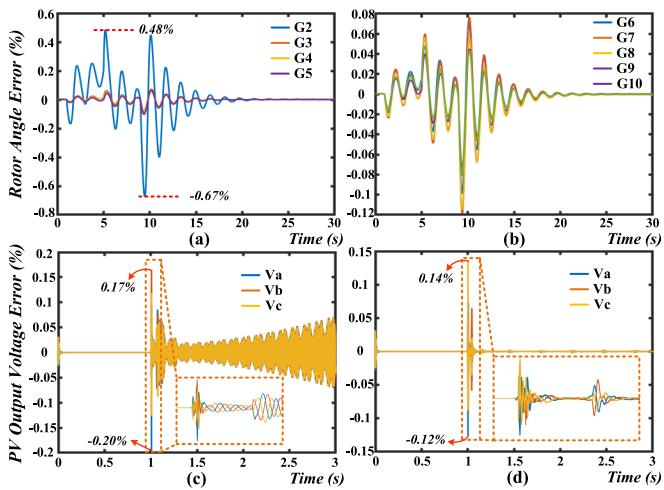  
FIGURE 16. Relative errors: (a) generator relative rotor angle errors (G2-G5), (b) generator relative rotor angle errors (G6-G10), (c) PV output voltage errors under SSCI, (d) PV output voltage errors after mitigation.

mitigate the SSCI in PV farms, and the FTRT emulation helps tackle power system stability issues by reducing the reaction time for providing an optimal solution.

# C. ERROR ANALYSIS

In order to validate the accuracy and performance of the proposed FTRT platform, Fig. 16 provides the relative errors of the transient stability emulation part and EMT emulation part, where the relative errors are calculated as:

$$
\epsilon = \frac {V _ {F T R T} - V _ {\text {Simulink / TSAT}}}{V _ {\text {Simulink / TSAT}}} \times 100 \% \tag{37}
$$

Fig. 16 (a) and (b) provide the relative errors of rotor angles in Fig. 13, where the 4-T HVDC system takes actions to maintain the overall stability. Under this contingency,

the AC system experience three times active/reactive power injection, which induces the maximum computational error. Fig 16 (a)-(b) indicate that the maximum error appears right after the occurrence of serious disturbances, e.g., at t=9.5s, the maximum error of −0.67% appears when the HVDC system changes to the normal operation stage. Fig. 16(c) and (d) provide the EMT emulation part errors of PV output voltage under SSCI and after mitigation, respectively. Due to a dramatic voltage oscillation, the maximum relative error appears when the SSCI occurs. The relative errors of the EMT emulation range from 0.17% to −0.20%. After the mitigation of SSCI, the relative errors restore to stable gradually as shown in Fig. 16 (d). Compared with the TS emulation part, the EMT emulation has higher accuracy since a relatively small time-step is applied, and the overall relative errors of the proposed FTRT based system are within ±1%.

# VI. CONCLUSION

This work presents the SSR issue induced by the operation modes of PV converters integrated into transmission and distribution systems and a new solution combining hardware parallelism, the FTRT algorithm, and consequently the predictive functionality of the platform. Taking the inherent advantages of reconfigurability and parallelism, the FPGA allows emulating the integrated system in FTRT mode. With an achievable 122 times emulation speedup over real-time, it enables the energy control center to have sufficient time to predict the future states, improve dynamic response analysis speed, and yield an optimal solution to maintain the system stability. Meanwhile, the eigenvalue analysis on the PV farm and its control system provided theoretical basis for the SSCI phenomenon in PV plants connected to a weak grid. The timedomain results from the FTRT emulation demonstrate that the EMT and transient stability co-emulation are numerically

stable and accurate in comparison with the off-line simulation tools Matlab/Simlink
R and TSAT
R . Furthermore, the emulation of the proposed hybrid AC/DC grid is conducted on a single FPGA board. Once the system becoming larger, the FTRT emulation can be carried out on multiple FPGAs with high-speed data communication interfaces.

# APPENDIX

TABLE 3. Main parameters of the PV power plant.   

<table><tr><td>Parameter</td><td>Value</td></tr><tr><td>Rating power P</td><td>400 kW</td></tr><tr><td>Grid voltage Ug</td><td>260 V</td></tr><tr><td>DC voltage Udc</td><td>500 V</td></tr><tr><td>Input filter capacitor C</td><td>0.02 F</td></tr><tr><td>Output filter inductor Lf</td><td>0.5 mH</td></tr><tr><td>Output filter capacitor Cf</td><td>100 μF</td></tr><tr><td>DC voltage control loop (Kp1, Ki1)</td><td>(2, 150)</td></tr><tr><td>Active current control loop (Kp2, Ki2)</td><td>(3, 200)</td></tr><tr><td>AC voltage control loop (Kp3, Ki3)</td><td>(2, 150)</td></tr><tr><td>Reactive current control loop (Kp4, Ki4)</td><td>(3, 200)</td></tr><tr><td>PLL (Kp_PLL, Ki_PLL)</td><td>(50, 1000)</td></tr></table>

# REFERENCES

[1] R.-J. Wai, W.-H. Wang, and C.-Y. Lin, ‘‘High-performance stand-alone photovoltaic generation system,’’ IEEE Trans. Ind. Electron., vol. 55, no. 1, pp. 240–250, Jan. 2008.   
[2] W. Xiao, W. G. Dunford, P. R. Palmer, and A. Capel, ‘‘Regulation of photovoltaic voltage,’’ IEEE Trans. Ind. Electron., vol. 54, no. 3, pp. 1365–1374, Jun. 2007.   
[3] N. Mutoh and T. Inoue, ‘‘A control method to charge series-connected ultraelectric double-layer capacitors suitable for photovoltaic generation systems combining MPPT control method,’’ IEEE Trans. Ind. Electron., vol. 54, no. 1, pp. 374–383, Feb. 2007.   
[4] F. Blaabjerg, R. Teodorescu, M. Liserre, and A. V. Timbus, ‘‘Overview of control and grid synchronization for distributed power generation systems,’’ IEEE Trans. Ind. Electron., vol. 53, no. 5, pp. 1398–1409, Oct. 2006.   
[5] A. Safari and S. Mekhilef, ‘‘Simulation and hardware implementation of incremental conductance MPPT with direct control method using Cuk converter,’’ IEEE Trans. Ind. Electron., vol. 58, no. 4, pp. 1154–1161, Apr. 2011.   
[6] X. Xiao, C. Luo, J. Zhang, W. Yang, and Y. Wu, ‘‘Analysis of frequently over-threshold subsynchronous oscillation and its suppression by subsynchronous oscillation dynamic suppressor,’’ IET Gener., Transmiss. Distrib., vol. 10, no. 9, pp. 2127–2137, Jun. 2016.   
[7] J. Adams, C. Carter, and S.-H. Huang, ‘‘ERCOT experience with subsynchronous control interaction and proposed remediation,’’ in Proc. PES T&D, May 2012, pp. 1–5.   
[8] G. D. Irwin, A. K. Jindal, and A. L. Isaacs, ‘‘Sub-synchronous control interactions between type 3 wind turbines and series compensated AC transmission systems,’’ in Proc. IEEE Power Energy Soc. Gen. Meeting, Jul. 2011, pp. 1–6.   
[9] P. Li, J. Wang, L. Xiong, and M. Ma, ‘‘Robust nonlinear controller design for damping of sub-synchronous control interaction in DFIG-based wind farms,’’ IEEE Access, vol. 7, pp. 16626–16637, 2019.   
[10] A. E. Leon and J. A. Solsona, ‘‘Sub-synchronous interaction damping control for DFIG wind turbines,’’ IEEE Trans. Power Syst., vol. 30, no. 1, pp. 419–428, Jan. 2015.   
[11] W. Ren and E. Larsen, ‘‘A refined frequency scan approach to subsynchronous control interaction (SSCI) study of wind farms,’’ IEEE Trans. Power Syst., vol. 31, no. 5, pp. 3904–3912, Sep. 2016.

[12] W. Du, H. Wang, and L.-Y. Xiao, ‘‘Power system small-signal stability as affected by grid-connected photovoltaic generation,’’ Eur. Trans. Electr. Power, vol. 22, no. 5, pp. 688–703, Jul. 2011.   
[13] R. Shah, N. Mithulananthan, A. Sode-Yome, and K. Y. Lee, ‘‘Impact of large-scale PV penetration on power system oscillatory stability,’’ in Proc. IEEE PES Gen. Meeting, Jul. 2010, pp. 1–7.   
[14] J. H. R. Enslin, ‘‘Dynamic reactive power and energy storage for integrating intermittent renewable energy,’’ in Proc. IEEE PES Gen. Meeting, Jul. 2010, pp. 1–4.   
[15] R. Shah, N. Mithulananthan, and K. Y. Lee, ‘‘Large-scale PV plant with a robust controller considering power oscillation damping,’’ IEEE Trans. Energy Convers., vol. 28, no. 1, pp. 106–116, Mar. 2013.   
[16] S. Zhao, R. Li, B. Gao, N. Wang, and X. Zhang, ‘‘Subsynchronous oscillation of PV plants integrated to weak AC networks,’’ IET Renew. Power Gener., vol. 13, no. 3, pp. 409–417, Dec. 2018.   
[17] N. Johansson, L. Angquist, and H.-P. Nee, ‘‘A comparison of different frequency scanning methods for study of subsynchronous resonance,’’ IEEE Trans. Energy Conver., vol. 32, no. 3, pp. 1117–1126, Mar. 2017.   
[18] H. A. Mohammadpour and E. Santi, ‘‘SSR damping controller design and optimal placement in rotor-side and grid-side converters of seriescompensated DFIG-based wind farm,’’ IEEE Trans. Sustain. Energy, vol. 6, no. 2, pp. 388–399, Apr. 2015.   
[19] V. B. Virulkar and G. V. Gotmare, ‘‘Sub-synchronous resonance in series compensated wind farm: A review,’’ Renew. Sustain. Energy Rev., vol. 55, pp. 1010–1029, Mar. 2016.   
[20] K. R. Padiyar, Power System Dynamics Stability and Control. New Delhi, India: BS Publications, 2011.   
[21] D. H. R. Suriyaarachchi, U. D. Annakkage, C. Karawita, D. Kell, R. Mendis, and R. Chopra, ‘‘Application of an SVC to damp subsynchronous interaction between wind farms and series compensated transmission lines,’’ in Proc. IEEE Power Energy Soc. Gen. Meeting, Jul. 2012, pp. 1–6.   
[22] H. Xie and M. M. de Oliveira, ‘‘Mitigation of SSR in presence of wind power and series compensation by SVC,’’ in Proc. Int. Conf. Power Syst. Technol., Oct. 2014, pp. 2819–2826.   
[23] M. S. El-Moursi, B. Bak-Jensen, and M. H. Abdel-Rahman, ‘‘Novel STATCOM controller for mitigating SSR and damping power system oscillations in a series compensated wind park,’’ IEEE Trans. Power Electron., vol. 25, no. 2, pp. 429–441, Feb. 2010.   
[24] G. Li, Y. Chen, A. Luo, and H. Wang, ‘‘An enhancing grid stiffness control strategy of STATCOM/BESS for damping sub-synchronous resonance in wind farm connected to weak grid,’’ IEEE Trans. Ind. Informat., vol. 16, no. 9, pp. 5835–5845, Sep. 2020.   
[25] H. Jiang, R. Song, N. Du, P. Zhou, B. Zheng, Y. Han, and D. Yang, ‘‘Application of UPFC to mitigate SSR in series-compensated wind farms,’’ J. Eng., vol. 2019, no. 16, pp. 2505–2509, Mar. 2019.   
[26] H. A. Mohammadpour, A. Ghaderi, and E. Santi, ‘‘Analysis of subsynchronous resonance in doubly-fed induction generator-based wind farms interfaced with gate—Controlled series capacitor,’’ IET Gener., Transmiss. Distrib., vol. 8, no. 12, pp. 1998–2011, Dec. 2014.   
[27] H. A. Mohammadpour and E. Santi, ‘‘Modeling and control of gatecontrolled series capacitor interfaced with a DFIG-based wind farm,’’ IEEE Trans. Ind. Electron., vol. 62, no. 2, pp. 1022–1033, Feb. 2015.   
[28] P. Li, J. Wang, L. Xiong, S. Huang, M. Ma, and Z. Wang, ‘‘Energy-shaping controller for DFIG-based wind farm to mitigate subsynchronous control interaction,’’ IEEE Trans. Power Syst., vol. 36, no. 4, pp. 2975–2991, Jul. 2021.   
[29] P. Li, L. Xiong, F. Wu, M. Ma, and J. Wang, ‘‘Sliding mode controller based on feedback linearization for damping of sub-synchronous control interaction in DFIG-based wind power plants,’’ Int. J. Elect. Power Energy Syst., vol. 107, pp. 239–250, May 2019.   
[30] J. Shair, X. Xie, and G. Yan, ‘‘Mitigating subsynchronous control interaction in wind power systems: Existing techniques and open challenges,’’ Renew. Sustain. Energy Rev., vol. 108, pp. 330–346, Jul. 2019.   
[31] X. Zhang, X. Xie, J. Shair, H. Liu, Y. Li, and Y. Li, ‘‘A grid-side subsynchronous damping controller to mitigate unstable SSCI and its hardware-in-the-loop tests,’’ IEEE Trans. Sustain. Energy, vol. 11, no. 3, pp. 1548–1558, Jul. 2020.   
[32] J. Samanes, E. Gubia, J. Lopez, and R. Burgos, ‘‘Sub-synchronous resonance damping control strategy for DFIG wind turbines,’’ IEEE Access, vol. 8, pp. 223359–223372, 2019.   
[33] X. Xie, W. Liu, H. Liu, Y. Du, and Y. Li, ‘‘A system-wide protection against unstable SSCI in series-compensated wind power systems,’’ IEEE Trans. Power Del., vol. 33, no. 6, pp. 3095–3104, Dec. 2018.

[34] X. Liu, J. Ospina, I. Zografopoulos, A. Russell, and C. Konstantinou, ‘‘Faster than real-time simulation: Methods, tools, and applications,’’ in Proc. 9th Workshop Modeling Simulation Cyber-Phys. Energy Syst., May 2020, pp. 1–6. [Online]. Available: https://arxiv.org/abs/2104.04149   
[35] V. Dinavahi and N. Lin, Real-Time Electromagnetic Transient Simulation of AC–DC Networks. Hoboken, NJ, USA: Wiley, 2021.   
[36] H. D. Giesecke, ‘‘Measuring torsional natural frequencies of turbine generators by on-line monitoring,’’ in Proc. Int. Joint Power Gener. Conf., Jan. 2003, pp. 607–613.   
[37] IEEE Subsynchronous Resonance Working Group, ‘‘Terms, definitions and symbols for subsynchronous oscillations,’’ IEEE Trans. Power Appar. Syst., vol. PAS-104, no. 6, pp. 1326–1334, Jun. 1985.   
[38] M. G. Villalva, J. R. Gazoli, and E. R. Filho, ‘‘Comprehensive approach to modeling and simulation of photovoltaic arrays,’’ IEEE Trans. Power Electron., vol. 24, no. 5, pp. 1198–1208, May 2009.   
[39] L. Yang, Z. Yu, T. Xu, J. He, C. Wang, and C. Pang, ‘‘Eigenvalue analysis of subsynchronous oscillation in grid-connected PV power stations,’’ in Proc. China Int. Electr. Energy Conf. (CIEEC), Oct. 2017, pp. 285–290.   
[40] K. Morison, L. Wang, and P. Kundur, ‘‘Power system security assessment,’’ IEEE Power Energy Mag., vol. 2, no. 5, pp. 30–39, Sep. 2004.   
[41] C. Gear, ‘‘Simultaneous numerical solution of differential-algebraic equations,’’ IEEE Trans. Circuit Theory, vol. CT-18, no. 1, pp. 85–96, Jan. 1971.   
[42] P. Kundur, Power System Stability and Control. New York, NY, USA: McGraw-Hill, 1994.   
[43] E. Muljadi, M. Singh, and V. Gevorgian, ‘‘PSCAD modules representing PV generator,’’ Nat. Renew. Energy Lab., Golden, CO, USA, Tech. Rep. NREL/TP-5500-58189, Aug. 2013.

SHIQI CAO (Graduate Student Member, IEEE) received the B.Eng. degree in electrical engineering and automation from East China University of Science and Technology, Shanghai, China, in 2015, and the M.Eng. degree in power system from Western University, London, ON, Canada, in 2017. He is currently pursuing the Ph.D. degree in electrical and computer engineering with the University of Alberta, Canada. His research interests include transient stability analysis, power

electronics, and field programmable gate arrays.

NING LIN (Member, IEEE) received the B.Sc. and M.Sc. degrees in electrical engineering from Zhejiang University, China, in 2008 and 2011, respectively, and the Ph.D. degree in electrical and computer engineering from the University of Alberta, Canada, in 2018. His research interests include power systems analysis and simulation, power electronics, and high-performance computing.

VENKATA DINAVAHI (Fellow, IEEE) received the B.Eng. degree in electrical engineering from Visvesvaraya National Institute of Technology (VNIT), Nagpur, India, in 1993, the M.Tech. degree in electrical engineering from the Indian Institute of Technology (IIT) Kanpur, India, in 1996, and the Ph.D. degree in electrical and computer engineering from the University of Toronto, ON, Canada, in 2000. He is currently a Professor with the Department of Electrical and

Computer Engineering, University of Alberta, Edmonton, AB, Canada. His research interests include real-time simulation of power systems and power electronic systems, electromagnetic transients, devicelevel modeling, largescale systems, and parallel and distributed computing.