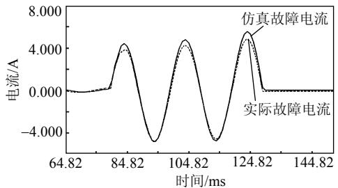
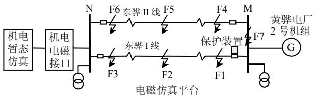
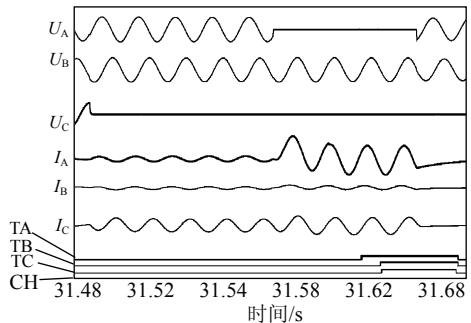
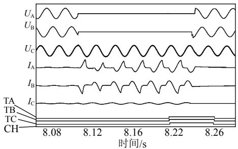
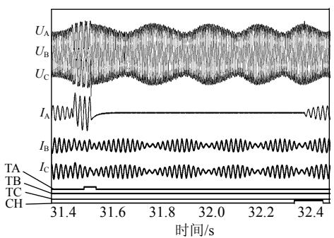

# 基于机电暂态–电磁暂态混合仿真的高压线路保护装置试验研究

唐宝锋，苑峰，范辉，杨潇

（河北省电力研究院 电网数字仿真实验室，河北省 石家庄市 050021）

# Experimental Research on High-Voltage Transmission Line Protection Device Based on Electromechanical-Electromagnetic Transient Hybrid Simulation

TANG Baofeng, YUAN Feng, FAN Hui, YANG Xiao

(Power System Digital Simulation Laboratory, Hebei Electric Power Research Institute,

Shijiazhuang 050021, Hebei Province, China)

ABSTRACT: A scheme to examine acting characteristics of high-voltage transmission line protection devices by electromechanical-electromagnetic transient hybrid simulation is proposed. The hybrid simulation can fully play the superiorities of electromechanical transient simulation and electromagnetic transient simulation, so not only the precision of system simulation can be improved, but also the workload brought by system equivalence can be reduced. Comparing the data from the faults actually occurred in power system and that from simulation results, it is proved that the proposed method can reflect actual operational conditions of power system. A hybrid simulation model, in which the parameters of actual domestic power system are adopted, is built, and a lot of simulation tests of protection devices for a certain high-voltage transmission line in China are performed, and simulation results show that it is available to use hybrid simulation to the examination of transmission line protection devices.

KEY WORDS: advanced digital power system simulator (ADPSS); hybrid simulation; line protection; online data interface

摘要：提出了一种利用机电暂态与电磁暂态混合仿真方法开展高压线路保护装置动作特性检验的方案。机电暂态与电磁暂态的混合仿真，可以充分发挥二者的优势，既提高了系统仿真的精度，又可以减少由于系统等值带来的工作量。通过系统实际发生故障与仿真系统数据的对比，证明了该方法能够反映系统的实际运行工况；利用实际电网参数搭建了混合仿真模型，对国内某一高压线路保护装置进行了大量的仿真试验，验证了混合仿真用于检验线路保护装置的有效性。

关键词：电力系统全数字仿真装置；混合仿真；线路保护；在线数据接口

# 0 引言

实时数字仿真器(real-time digital simulator，RTDS)是国际最通用的继电保护产品性能检测工具，在国内也有广泛的应用[1-5]，但有些不足之处，如：RTDS 只能开展电磁暂态仿真而且仿真规模很小，必须对电网进行等值；设备昂贵、操作复杂、扩容性差。因此，较难得到普遍应用。

本文针对使用RTDS进行保护装置性能检测的不足，提出一种新型的高压线路保护装置检测方案。该方案利用中国电科院开发的电力系统全数字仿真装置(advanced digital power system simulator，ADPSS)的先进机电暂态–电磁暂态并行仿真技术，将大电网运行背景用机电暂态仿真而将需要研究的局部电网在电磁暂态下建模，不必对系统进行等值，从而避免了电磁仿真对系统规模的限制。此外，本文通过开发在线数据接口，可使调度能量管理系统(energy management system，EMS)自动将电网实时数据断面传送至仿真系统[6]，实现基于实际网络拓扑结构的大电网运行方式下的继电保护装置试验研究。

# 1 机电暂态–电磁暂态混合仿真

机电暂态与电磁暂态仿真有着本质的区别，电磁暂态仿真建模详细，考虑非线性、分布参数等特征，基于三相瞬时值方式，步长为μs 级；机电暂态仿真简化建模，采用集总参数，系统由基

波相量模式描述，步长为 ms 级。单纯的机电暂态仿真不能准确、详细地模拟系统局部快速变化过程，而电磁暂态仿真受速度和规模的限制无法对全系统进行仿真[7]，因此，机电暂态–电磁暂态混合仿真技术是互为取长补短的一个有效方案。实现电力系统电磁暂态与机电暂态混合仿真，一方面扩大了电磁暂态仿真规模，另一方面也为电磁暂态网络的仿真分析提供了必要的系统背景。采用机电暂态–电磁暂态混合仿真进行工程分析及应用，既能避免由于电磁暂态仿真规模的限制而产生的进行系统等值的工作量，还能大大提高系统分析研究的准确度[8-15]。

# 2 实际电网故障与仿真数据的对比

为了验证实际情况与仿真的一致性，特将电网某一实际故障进行故障重现，并将仿真与实际的故障数据进行了对比。故障情况：2009-06-01T13:10，500 kV 北清 I 线发生 C 相接地故障，线路两侧保护均快速动作，跳开 C 相开关，重合闸不成功，开关三跳。

仿真系统中，在北清 I线设置 C 相永久性接地短路故障，过渡电阻为 7 Ω。石北侧二次电流仿真波形及故障录波如图 1所示。从图 1 可以看出，仿真数据与故障录波数据基本一致，因此，可以认为仿真平台能够反应电网实际运行工况。

  
图 1 仿真及实际电流波形  
Fig. 1 Simulation and reality current waves

# 3 线路保护装置检验

# 3.1 系统模型

利用黄骅电厂2号机组及500kV东骅双回线的实际参数建立电磁暂态模型仿真平台如图 2 所示。

  
图 2 机电/电磁暂态混合仿真平台  
Fig. 2 Electromechanical/Electromagnetic transient hybrid simulation platform

保护安装于东骅 I线，F1—F3 分别代表线路出口、中点及末端故障点，F4—F7 分别为相邻线路及保护装置背后母线的故障点。

# 3.2 系统参数

发电机参数为： $S _ { \mathrm { n } } { = } 6 0 0 { + } \mathrm { j } 2 9 0 \mathrm { M V A }$ ，Xd=3.233，$X _ { \mathrm { d } } ^ { \prime } { = } 0 . 3 9 7 5$ ， $X _ { \mathrm { d } } ^ { \prime \prime } { = } 0 . 3 0 7 5$ ， $X _ { \mathrm { q } } { = } 3 . 1 5 ,$ ， $X _ { \mathrm { q } } ^ { \prime } = 0 . 5 9 2 5 ,$ ，$X _ { \mathrm { q } } ^ { \prime \prime } { = } 0 . 3 0 1 5$ ，机端电压 U=20 kV。变压器参数为：变比为 525 kV/20 kV，Ynd11 接线， $U _ { \mathrm { k } } { = } 1 3 . 8 \%$ ，$I _ { 0 } { = } 0 . 0 9 1$ 1%， $P _ { 0 } { = } 1 0 9 . 8 \mathrm { k W }$ ， $P _ { \mathrm { k } } { = } 4 3 9 . 2 \mathrm { k W }$ 。线路参数为： $R _ { 1 } { = } 0 . 0 0 0 \ 4 9 3 \ \mathrm { p u }$ ， $X _ { 1 } { = } 0 . 0 0 5 \ 9 3 6 \ \mathrm { p u } , C _ { 1 } { / } 2 { = }$ 0.295 376 pu， $R _ { 0 } { = } 0 . 0 0 1$ 479 pu， $X _ { 0 } { = } 0 . 0 1 7 ~ 8 0 8 ~ \mathrm { p u }$ ，$C _ { 0 } / 2 { = } 0 . 1 7 9 \ 4 \ \mathrm { p u }$ ，线路长度 $L { = } 5 4 . 5 5 ~ \mathrm { k m } ;$ ；电流互感器(current transformer，CT)变比为 2 500/1；电压互感器(potential transformer，PT)变比为 5 000/1。

# 3.3 性能检验

根据《电力系统继电保护产品动模试验》的相关要求，利用机电–电磁暂态混合仿真方案对国内某型高压线路保护装置进行了几百次的仿真试验，充分验证装置的性能。

该保护装置在发生区内外金属性接地故障、系统频率偏移、系统稳定性破坏情况、CT 断线、PT断线、空载投长线路时，动作特性良好，但在某些故障类型，如经过渡电阻接地、转换性故障及 CT饱和，保护动作特性变坏或者误动，以下进行详细说明。

# 1）转换性故障。

模拟系统发生区内转区外、区外转区内故障时，保护可能会误动作。图 3 为系统发生区外转区内故障的情况，F7 点 C 相金属性接地，100 ms 后F1 点 A 相金属性接地时，M 侧保护不能够正确选相，保护发三跳命令，不重合。图中，TA、TB、TC、CH 分别代表跳开 A 相、跳开 B 相、跳开 C相及重合闸。

  
图3 转换性故障、保护误发三跳令时的波形  
Fig. 3 Conversion fault, relay protection operates uncorrectly and three phase trip

# 2）CT 饱和。

电力系统发生短路故障时，CT 通过短路电流。一次电流 $i _ { 1 }$ 由正弦周期分量与按指数规律衰减的非周期分量组成，即

$$
i _ {1} = I _ {1 m} \left[ \cos \theta \mathrm {e} ^ {- t / \mathrm {T} _ {1}} - \cos (w t + \theta) \right]
$$

式中： $T _ { 1 }$ 为系统一次时间常数， ${ \cal T } _ { 1 } { = } L _ { 1 } / R _ { 1 }$ ， $L _ { 1 }$ 及 $R _ { 1 }$ 分别为系统正序等效电感及电阻；θ为短路瞬间电压的初相角。

当θ=0时，非周期分量初始值达到最大值，称为直流分量全偏移。一次电流 $i _ { 1 }$ 衰减速度与系统一次回路时间常数 $T _ { 1 }$ 有密切关系。 $i _ { 1 }$ 衰减得慢，则电流互感器容易达到饱和状态。开展机电–电磁暂态的混合仿真，通过构建电网实际网络拓扑，可以准确描述故障发生点的短路电流 $I _ { 1 m }$ 及系统一次时间常数 $T _ { 1 }$ ，从而准确描述电流互感器的饱和状态，因此，与单纯的电磁暂态仿真相比，机电暂态–电磁暂态混合仿真有极大的优势，更能准确反应系统运行特性。

图 4 为 F1 点发生 AB 相瞬时性接地故障、模拟 CT 饱和、保护装置 98.99ms 跳三相的情况。保护装置虽然能正确动作，但保护动作时间大大延长，因此保护装置不具备很好的抗 CT 饱和性能。

  
图4 TA 饱和时的保护动作特性  
Fig. 4 Operation character of relay protection when TA saturation

此外，保护装置在经高阻接地时动作性能不佳，在线路中点及末端经过渡电阻接地时有可能拒动，因此该装置不符合 500kV线路保护装置应具备抗 0~300Ω过渡电阻能力的要求。

由于该保护装置是早期产品，因此在系统发生特殊故障类型时动作性能不佳，目前，该型号产品已随线路检修逐步加以更换。

# 3）系统稳定破坏。

导致系统稳定破坏的原因是多种多样的，在机电暂态中由于大量调速器及电力系统稳定器(powersystem stabilization，PSS)的存在，即便是构建出与实际系统一致的仿真模型，也较难重现系统失稳状态。

采用混合仿真方法模拟系统失稳是没有必要的，本文采用纯电磁暂态仿真的方法实现。

图5为系统振荡时区内发生金属性短路保护动作的情况，故障发生时系统振荡周期为 304ms。F2点发生 A 相瞬时性接地故障，保护装置 48.27 ms后动作，跳开 A相，0.8s 后重合成功。保护能够正确选相，但保护动作时间有所延长，说明该保护装置在系统振荡下的动作特性变坏。

  
图5 系统振荡时的保护装置动作特性  
Fig. 5 Operation character of relay protection in system concussion

# 4 结论

1）本文提出的新型的高压线路保护装置检测方案充分发挥了机电暂态及电磁暂态各自的优势，不仅扩大了系统仿真规模，而且能够构建出与实际电网相一致的电网仿真模型。  
2）大量的仿真试验表明，机电暂态–电磁暂态混合仿真技术应用于高压线路保护装置检验，能够完全反应电网实际运行工况，并充分验证继电保护装置的动作性能。与传统的电磁暂态仿真或动模试验相比，试验结果更加真实可信，有利于对继电保护装置的设备选型及系统故障重演，因此，利用ADPSS 开展基于机电暂态–电磁暂态混合仿真的线路保护装置试验研究具有重要意义。

# 参考文献

[1] 周泽昕，周春霞，王仕荣，等．微机线路保护装置在动模试验中出现的一些问题[J]．电力系统自动化，2001，25(16)：39-44Zhou Zexin，Zhou Chunxia，Wang Shirong，et al．Several problemsappeared in dynamic simulation tests for microprocessor-basedtransmission line protective relays[J]．Automation of Electric PowerSystems，2001，25(16)：39-44(in Chinese)  
[2] 邱智勇，陈建民，高翔，等．500 kV继电保护故障信息处理系统动模试验方案[J]．电网技术，2006，30(13)：85-89Qiu Zhiyong，Chen Jianmin，Gao Xiang，et al．Dynamic simulationtest scheme of 500 kV protective relaying fault informationprocessing system[J]．Power System Technology，2006，30(13)：85-89(in Chinese)  
[3] 李保福，李营，王芝茗，等．RTDS 应用于线路保护装置的动模试

验[J]．电力系统自动化，2000，24(15)：69-70．  
Li Baofu，Li Ying，Wang Zhiming，et al．Comprehensive test of protective relays on different ends of long transmission line by RTDS[J]．Automation of Electric Power Systems，2000，24(15)： 69-70(in Chinese)   
[4] 毛鹏，杨立璠，杜肖功，等．基于 RTDS 的超高压线路保护装置的试验研究[J]．继电器，2004，32(3)：55-59  
Mao Peng，Yang Lifan，Du Xiaogong，et al．Research on extrahigh-voltage line protection based on RTDS[J]．Relay，2004，32(3)： 55-59(in Chinese)   
[5] 王同，赵惠，陶煜．基于 RTDS 线路保护装置的数字动模试验研究[J]．东北电力技术，2008(9)：5-7．  
Wang Tong，Zhao Hui，Tao Yu．Test research on digitial dynamic sumulation based on RTDS line protection device[J]．North-East Electric Power．2008(9)：5-7(in Chinese)   
[6] 王晓蔚，范辉，侯双林，等．电网数字仿真实验室在线数据接口的开发[J]．电工技术，2008(12)：1-3  
Wang Xiaowei，Fan Hui，Hou Shuanglin，et al．Exploitation of online data interface of power system digital simulation laboratory [J]．Electric Engineering，2008(12)：1-3(in Chinese)   
[7] 张树卿，梁旭，童陆园，等．电力系统电磁/机电暂态实时混合仿真的关键技术[J]．电力系统自动化，2008，32(15)：89-96  
Zhang Shuqing，Liang Xu，Tong Luyuan，et al．Key technologies of the power system electromagnetic/electromechanical real-time hybrid simulation[J]．Automation of Electric Power Systems，2008，32(15)： 89-96(in Chinese)   
[8] 岳程燕，田芳，周孝信，等．电力系统电磁暂态-机电暂态混合仿真的应用[J]．电网技术，2006，30(11)：1-5  
Yue Chengyan，Tian Fang，Zhou Xiaoxin，et al．Application of hybridsimulation of power system electromagnetic-electromechanicaltransient process[J]．Power System Technology，2006，30(11)：1-5(inChinese)  
[9] 岳程燕，田芳，周孝信，等．电力系统电磁暂态-机电暂态混合仿真接口原理[J]．电网技术，2006，30(1)：23-27  
Yue Chengyan，Tian Fang，Zhou Xiaoxin，et al．Principle of interfacesfor hybrid simulation of power system electromagnetic-electromechanical transient process[J]．Power System Technology，2006，30(1)：23-27(in Chinese)  
[10] 岳程燕，田芳，周孝信，等．电力系统电磁暂态-机电暂态混合仿真接口实现[J]．电网技术，2006，30(11)：6-10

Yue Chengyan，Tian Fang，Zhou Xiaoxin，et al．Implementation ofinterfaces for hybrid simulation of power system electromagnetic-electromechanical transient process[J]．Power System Technology，2006，30(11)：1-5(in Chinese)  
[11] 杨卫东，徐政，韩帧祥．基于NETOMAC软件的直流输电系统混合仿真计算及参数优化[J]．电网技术，2000，24(12)：11-16  
Yang Weidong，Xu Zheng，Han Zhenxiang．NETOMAC based hybridsimulation and controller parameter optimization of HVDC systems[J]．Power System Technology，2000，24(12)：11-16(in Chinese)  
[12] 陈久林，陈建民，张量，等．功率倒向对平行双回线纵联保护的影响分析及对策[J]．电力系统自动化，2006，30(2)：105-108  
Chen Jiulin，Chen Jianmin，Zhang Liang，et al．Analysis on the influence of the power converse to the double-circuit transmission lines pilot protective relaying and its corresponding measures [J]．Automation of Electric Power Systems，2006，30(2)：105-108(in Chinese)．   
[13] 袁季修，盛和乐，吴聚业．保护用电流互感器应用指南[M]．北京：中国电力出版社，2003：28-39  
[14] 施宁宁．RCS-931B 型光纤差动线路保护装置典型问题分析[J]．河北电力技术，2008，27(6)：36-38  
Shi Ningning ． Analysis on problems of RCS-931B Fiber-optic differential protection device in several specific states[J]．Hebei Electric Power，2008，27(6)：36-38(in Chinese)   
[15] 王渊．一起220kV线路保护跳闸行为分析[J]．电力系统保护与控制，2008，36(20)：83-85  
Wang Yuan．Analysis of 220 kV line protection tripping behavior [J]．Power System Protection and Control，2008，36(20)：83-85(in Chinese)

  
唐宝锋

收稿日期：2010-06-30。

# 作者简介：

唐宝锋(1980)，男，工程师，主要研究方向为电力系统继电保护、电力系统稳定与控制，E-mail：tangbao12@sina.com；

苑峰(1983)，男，硕士研究生，主要研究方向为电力系统继电保护；

范辉(1969)，男，高级工程师，主要研究方向为电力系统继电保护、电力系统分析。

（编辑 褚晓杰）